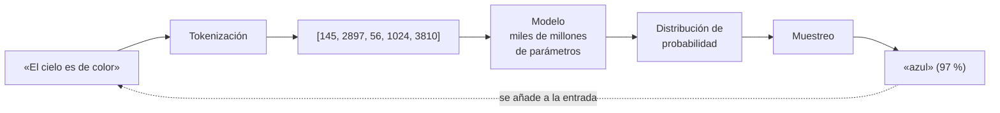
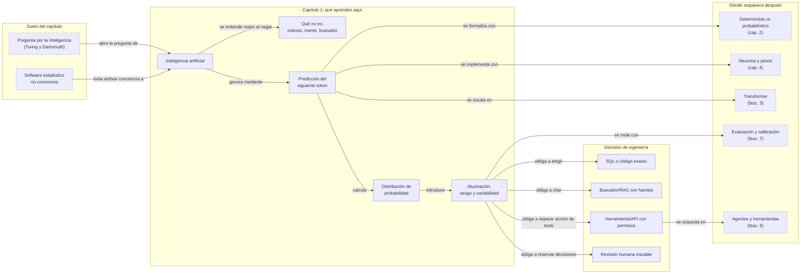

::: {.fasciculo-subtitle}
Facsímil 1 · Los cimientos
:::

# Capítulo 01: Qué es y qué no es la inteligencia artificial

## Entrando en el tema

Abres el navegador, escribes «explícame cómo funciona un motor de combustión» y pulsas Intro. En menos de tres segundos tienes delante un texto articulado, con ejemplos, párrafos bien estructurados y un tono didáctico impecable. Tu cerebro, entrenado durante décadas para asociar lenguaje coherente con inteligencia, llega a una conclusión instantánea: aquí dentro hay alguien que sabe de motores.

Es una reacción comprensible, humana y equivocada.

Este capítulo nace exactamente de esa reacción. Vamos a desmontarla pieza a pieza. Porque entender qué es —y sobre todo qué no es— la inteligencia artificial es la primera decisión de ingeniería que tomarás al trabajar con ella. Y posiblemente la más importante.

## Qué no es la inteligencia artificial

Empecemos por lo que no es. La lista de malentendidos es larga, pero cinco negaciones bastan para despejar el terreno.

**No es magia ni ciencia ficción.** No hay una entidad misteriosa dentro de la máquina. Es *software*, ejecutándose en servidores, con electricidad y silicio.^[Russell, S. y Norvig, P. (2021). *Artificial intelligence: a modern approach* (4.ª ed.). Pearson. Los autores definen la IA como el estudio de agentes que reciben percepciones del entorno y ejecutan acciones, sin atribuir conciencia o intencionalidad al sistema.] Impresionante, sí. Pero explicable, medible y auditable.

**No es una mente consciente.** No tiene deseos, emociones ni intenciones. No «quiere» nada. Procesa tokens y calcula probabilidades. Punto. Si alguna vez has sentido que el modelo «te entiende», has experimentado el efecto Eliza: nuestro cerebro antropomorfiza cualquier cosa que produzca lenguaje coherente.^[Bender, E. M., Gebru, T., McMillan-Major, A. y Shmitchell, S. (2021). On the dangers of stochastic parrots: can language models be too big? En *Proceedings of the 2021 ACM Conference on Fairness, Accountability, and Transparency* (pp. 610-623). https://doi.org/10.1145/3442188.3445922. Las autoras acuñaron el término «stochastic parrots» para describir el riesgo de atribuir comprensión a modelos que solo reproducen patrones estadísticos.]

**No es un buscador glorificado.** Un buscador recupera páginas o documentos que ya existen. Un LLM (*Large Language Model*, modelo grande de lenguaje) genera texto a partir de patrones aprendidos durante el entrenamiento y no consulta fuentes por defecto. Son mecanismos radicalmente distintos.

**No «piensa» como un humano.** Puede producir pasos que parecen razonamiento, pero su mecanismo base es predecir el siguiente token a partir de patrones estadísticos. No hay deliberación, no hay duda, no hay «déjame pensarlo». Hay una multiplicación de matrices a escala industrial.

**No es infalible ni objetiva.** Puede alucinar —generar información falsa con total confianza—, heredar sesgos de los datos de entrenamiento y carecer de introspección fiable sobre sus propios errores. No te dirá «no sé» a menos que se lo hayas enseñado explícitamente.

## Qué sí es la inteligencia artificial

Ahora la definición positiva. Si la IA no es conciencia ni un oráculo, ¿qué es?

**Modelos matemáticos masivos.** Redes neuronales con miles de millones o billones de parámetros —números— ajustados para reconocer patrones en texto, imágenes, código y audio.

**Reconocimiento de patrones a escala.** Lo que una persona tarda horas en analizar, el modelo lo procesa en segundos. No «entiende» en el sentido humano de saber qué está diciendo, contrastarlo con el mundo y hacerse responsable de ello: aprende regularidades estadísticas y las usa para producir una salida plausible. Esa diferencia parece filosófica, pero en ingeniería es muy concreta: una salida plausible necesita verificación.

**Predicción estadística del siguiente token.** Dada una secuencia de tokens, ¿cuál es el más probable a continuación? Esta operación, repetida miles de veces, produce párrafos coherentes, código funcional y respuestas que parecen razonadas. Es el mecanismo central de todo LLM moderno.

**Un amplificador de capacidades.** Si sabes programar, te hace más rápido. Si no sabes, te da una falsa sensación de que funciona... hasta que deja de hacerlo. La IA no sustituye el criterio humano: lo amplifica. Si le das contexto claro y restricciones precisas, el resultado es impresionante. Si le das ambigüedad, el resultado es impredecible.

Para situarnos en el mapa, estos son los hitos que nos han traído hasta aquí. La parte histórica es estable; la parte de herramientas actuales no lo es. **Fecha de corte: 10 de junio de 2026.** Ese día, las fuentes consultadas para la fila de sistemas con herramientas y agentes fueron la documentación pública de OpenAI Agents SDK, Claude Agent SDK, Google ADK y Model Context Protocol.^[OpenAI. (2026). *Agents SDK*. https://developers.openai.com/api/docs/guides/agents; Anthropic. (2026). *Agent SDK overview*. https://code.claude.com/docs/en/agent-sdk/overview; Google. (2026). *Agent Development Kit*. https://adk.dev/; Model Context Protocol. (2026). *Specification*. https://modelcontextprotocol.io/specification. Fuentes consultadas el 10 de junio de 2026. No se citan como verdad permanente del mercado, sino como fotografía técnica del momento.]

| Fecha | Hito | Por qué importa |
|---|---|---|
| **1950** | Test de Turing | Turing propone un criterio para evaluar si una máquina exhibe comportamiento inteligente. No es un test técnico, pero inaugura la pregunta filosófica que aún nos hacemos.^[Turing, A. M. (1950). Computing machinery and intelligence. *Mind*, 59(236), 433-460. https://doi.org/10.1093/mind/LIX.236.433] |
| **1956** | Conferencia de Dartmouth | McCarthy, Minsky, Shannon y Rochester organizan un taller de verano en Dartmouth College. Acuñan el término «inteligencia artificial».^[McCarthy, J., Minsky, M. L., Rochester, N. y Shannon, C. E. (1956). A proposal for the Dartmouth summer research project on artificial intelligence. http://jmc.stanford.edu/articles/dartmouth.html] Es el nacimiento del campo como disciplina. |
| **1986** | Retropropagación | Rumelhart, Hinton y Williams publican el algoritmo que permite entrenar redes de más de dos capas. Sin esto no existiría el *deep learning*.^[Rumelhart, D. E., Hinton, G. E. y Williams, R. J. (1986). Learning representations by back-propagating errors. *Nature*, 323(6088), 533-536. https://doi.org/10.1038/323533a0] Lo veremos en detalle en el capítulo 6. |
| **2012** | AlexNet gana ImageNet | Una red neuronal convolucional arrasa en el concurso de reconocimiento de imágenes. Comienza la era del *deep learning* moderno.^[Krizhevsky, A., Sutskever, I. y Hinton, G. E. (2012). ImageNet classification with deep convolutional neural networks. En *Advances in Neural Information Processing Systems 25* (pp. 1097-1105). https://papers.nips.cc/paper/4824] |
| **2017** | Transformer | El artículo «Attention Is All You Need» presenta una arquitectura que procesa todas las palabras simultáneamente en vez de secuencialmente. Es la base de todo lo que vino después.^[Vaswani, A., Shazeer, N., Parmar, N., Uszkoreit, J., Jones, L., Gomez, A. N., Kaiser, Ł. y Polosukhin, I. (2017). Attention is all you need. En *Advances in Neural Information Processing Systems 30* (pp. 5998-6008). https://papers.nips.cc/paper/7181-attention-is-all-you-need] Lo desarrollaremos con todo detalle en el facsímil 3. |
| **2020** | GPT-3 | 175 000 millones de parámetros. Demostró que escalar funciona: más datos y más parámetros producen más capacidad.^[Brown, T. B. et al. (2020). Language models are few-shot learners. En *Advances in Neural Information Processing Systems 33* (pp. 1877-1901). https://papers.nips.cc/paper/2020/hash/1457c0d6bfcb4967418bfb8ac142f64a-Abstract.html] |
| **2022** | ChatGPT | RLHF —aprendizaje por refuerzo con *feedback* humano— más una interfaz de chat. La IA se hace accesible al público general. |
| **2023** | GPT-4 | Multimodal y con razonamiento avanzado. Salto cualitativo en capacidades.^[OpenAI. (2023). GPT-4 technical report. https://arxiv.org/abs/2303.08774] |
| **2024** | Claude 3 / Gemini | Competencia real. Contextos de 200 000 o más tokens. La IA se convierte en herramienta de trabajo diaria. |
| **2025-2026** | Sistemas con herramientas y agentes de software | El chat deja de ser la única interfaz. Aparecen SDKs y protocolos que combinan modelo, herramientas, estado, trazas, aprobaciones y ejecución sobre entornos reales. Lo exploraremos a fondo en el facsímil 5. |

## Cómo funciona por dentro

Este capítulo es conceptual: no vamos a derivar nada ni a multiplicar matrices. Pero antes de cerrarlo necesitas entender el mecanismo que está debajo de todo lo demás. Porque cada capítulo futuro —la neurona artificial, la retropropagación, el Transformer, los agentes— se construye sobre esta pieza.

Se llama **predicción del siguiente token** y funciona así.

Imagina que escribes:

> El cielo es de color

El modelo recibe esta secuencia y ejecuta tres pasos:

**Paso 1: tokenización.** Convierte cada palabra —o fragmento de palabra— en un número que la identifica. «El» podría ser el token 145, «cielo» el 2897, «es» el 56, «de» el 1024 y «color» el 3810. El modelo no ve palabras: ve secuencias de números.

<svg xmlns="http://www.w3.org/2000/svg" viewBox="0 0 980 520" role="img" aria-label="Del texto a la predicción: tokenización, ids y siguiente token">
  <title>Del texto a la predicción: tokenización, ids y siguiente token</title>
  <defs>
    <marker id="f1c01-arrow" viewBox="0 0 10 10" refX="9" refY="5" markerWidth="6" markerHeight="6" orient="auto"><path d="M 0 0 L 10 5 L 0 10 z" fill="#333333"/></marker>
  </defs>
  <rect x="20" y="20" width="940" height="470" rx="18" fill="#FFFFFF" stroke="#111111" stroke-width="1.4"/>
  <text x="490" y="58" text-anchor="middle" font-family="Arial, sans-serif" font-size="24" font-weight="700" fill="#111111">Lo que ve un modelo de lenguaje</text>
  <text x="490" y="84" text-anchor="middle" font-family="Arial, sans-serif" font-size="13" fill="#666666">La frase se transforma en números; con esos números se calcula una distribución para el siguiente token.</text>
  <rect x="70" y="122" width="840" height="54" rx="10" fill="#F5F5F5" stroke="#333333" stroke-width="1.2"/>
  <text x="95" y="144" font-family="Arial, sans-serif" font-size="12" font-weight="700" fill="#555555">TEXTO</text>
  <text x="490" y="158" text-anchor="middle" font-family="Arial, sans-serif" font-size="22" font-weight="700" fill="#111111">El cielo es de color</text>
  <line x1="490" y1="184" x2="490" y2="218" stroke="#333333" stroke-width="1.5" marker-end="url(#f1c01-arrow)"/>
  <text x="514" y="205" font-family="Arial, sans-serif" font-size="12" fill="#666666">tokenización</text>
  <g font-family="Arial, sans-serif">
    <text x="95" y="244" font-size="12" font-weight="700" fill="#555555">TOKENS</text>
    <rect x="96" y="264" width="124" height="58" rx="9" fill="#FFFFFF" stroke="#111111" stroke-width="1.4"/>
    <rect x="235" y="264" width="124" height="58" rx="9" fill="#FFFFFF" stroke="#111111" stroke-width="1.4"/>
    <rect x="374" y="264" width="124" height="58" rx="9" fill="#FFFFFF" stroke="#111111" stroke-width="1.4"/>
    <rect x="513" y="264" width="124" height="58" rx="9" fill="#FFFFFF" stroke="#111111" stroke-width="1.4"/>
    <rect x="652" y="264" width="124" height="58" rx="9" fill="#FFFFFF" stroke="#111111" stroke-width="1.4"/>
    <text x="158" y="288" text-anchor="middle" font-size="17" font-weight="700" fill="#111111">El</text>
    <text x="297" y="288" text-anchor="middle" font-size="17" font-weight="700" fill="#111111">cielo</text>
    <text x="436" y="288" text-anchor="middle" font-size="17" font-weight="700" fill="#111111">es</text>
    <text x="575" y="288" text-anchor="middle" font-size="17" font-weight="700" fill="#111111">de</text>
    <text x="714" y="288" text-anchor="middle" font-size="17" font-weight="700" fill="#111111">color</text>
    <text x="158" y="309" text-anchor="middle" font-family="Menlo, monospace" font-size="13" fill="#555555">145</text>
    <text x="297" y="309" text-anchor="middle" font-family="Menlo, monospace" font-size="13" fill="#555555">2897</text>
    <text x="436" y="309" text-anchor="middle" font-family="Menlo, monospace" font-size="13" fill="#555555">56</text>
    <text x="575" y="309" text-anchor="middle" font-family="Menlo, monospace" font-size="13" fill="#555555">1024</text>
    <text x="714" y="309" text-anchor="middle" font-family="Menlo, monospace" font-size="13" fill="#555555">3810</text>
  </g>
  <line x1="490" y1="333" x2="490" y2="363" stroke="#333333" stroke-width="1.5" marker-end="url(#f1c01-arrow)"/>
  <rect x="95" y="382" width="430" height="50" rx="10" fill="#F5F5F5" stroke="#333333" stroke-width="1.2"/>
  <text x="115" y="412" font-family="Menlo, monospace" font-size="17" fill="#111111">[145, 2897, 56, 1024, 3810]</text>
  <line x1="535" y1="407" x2="614" y2="407" stroke="#333333" stroke-width="1.5" marker-end="url(#f1c01-arrow)"/>
  <rect x="625" y="360" width="260" height="96" rx="12" fill="#FFFFFF" stroke="#111111" stroke-width="1.4"/>
  <text x="755" y="385" text-anchor="middle" font-family="Arial, sans-serif" font-size="14" font-weight="700" fill="#111111">Distribución posible</text>
  <g font-family="Arial, sans-serif" font-size="12" fill="#111111">
    <text x="650" y="410">azul</text><rect x="705" y="398" width="130" height="14" rx="7" fill="#D8D8D8"/><text x="845" y="410" text-anchor="end">0,97</text>
    <text x="650" y="433">gris</text><rect x="705" y="421" width="18" height="14" rx="7" fill="#D8D8D8"/><text x="845" y="433" text-anchor="end">0,02</text>
  </g>
  <text x="940" y="472" text-anchor="end" font-family="Arial, sans-serif" font-size="10" fill="#9A9A9A">IA para gente curiosa / Facsímil 01 / Capítulo 01 / 686f6c61</text>
</svg>

El modelo no ve palabras: ve secuencias de números. En el capítulo 9 exploraremos la tokenización en profundidad y entenderemos por qué «cielo» puede ser un token y «extraordinariamente» pueden ser tres.

**Paso 2: transformación por pesos aprendidos.** Esos números atraviesan las capas de la red neuronal. En cada capa, los miles de millones de parámetros —los pesos aprendidos durante el entrenamiento— transforman la representación. Conviene no llamarlo «memoria» sin matiz: el modelo no abre una ficha interna sobre el cielo ni recupera una frase guardada. Aplica pesos que codifican regularidades observadas durante el entrenamiento y produce una representación nueva de la secuencia.

**Paso 3: muestreo.** El modelo produce una distribución de probabilidad sobre todas las palabras posibles que podrían seguir. No elige «la correcta». Asigna probabilidades:

- `azul`: 97 %
- `gris`: 2 %
- `rojo`: 0,5 %
- `verde`: 0,3 %
- `naranja`: 0,1 %
- ...y una probabilidad minúscula para cada una de las decenas de miles de palabras de su vocabulario.

Luego **muestrea** de esa distribución. Normalmente elegirá `azul`, pero no siempre. Esa pequeña probabilidad de elegir `gris` o `rojo` es lo que hace que el texto generado no sea idéntico en cada ejecución. Es lo que le da variabilidad, creatividad... y también impredecibilidad.

El proceso se repite. El token elegido —digamos `azul`— se añade a la secuencia de entrada:

> El cielo es de color azul

Y el modelo predice el siguiente:

> El cielo es de color azul **,**

Y el siguiente:

> El cielo es de color azul, **aunque**

Y así, token a token, durante cientos o miles de iteraciones, hasta que el modelo genera un token especial que significa «terminé». Lo que empezó como una pregunta de cinco palabras se convierte en una respuesta de tres párrafos.

No hay comprensión humana, intención ni conciencia. Hay una operación estadística —predecir el siguiente elemento probable de una secuencia— ejecutada a una escala que produce resultados que *parecen* inteligentes. La precisión importa: no estamos diciendo que el sistema sea inútil; estamos diciendo que su utilidad no lo convierte en sujeto, oráculo ni fuente fiable por sí misma.



## En el día a día

Entender qué es y qué no es la IA no es un ejercicio filosófico. Determina decisiones de ingeniería concretas. Veamos tres situaciones reales.

**Situación 1: ¿LLM o SQL?** Tienes una base de datos con millones de registros de ventas y necesitas saber el importe total del último trimestre. Si crees que el LLM «sabe cosas», le pasarás el *prompt* «¿cuánto vendimos el último trimestre?» y obtendrás un número. El problema es que ese número puede ser correcto, aproximado o completamente inventado, y no tendrás forma de saberlo sin verificarlo manualmente. Si entiendes que el LLM predice tokens, usarás SQL para la consulta exacta y el LLM para resumir el resultado o redactar el informe. Cada herramienta para lo que sirve.

**Situación 2: integrar IA generativa en un producto.** Tu equipo quiere añadir un asistente que responda preguntas de los usuarios sobre la documentación. Si crees que el modelo es infalible, desplegarás sin *guardrails* ni evaluaciones y el primer usuario que reciba una respuesta incorrecta —con la confianza y elocuencia características de un LLM— actuará sobre información falsa. Si entiendes que el modelo alucina, diseñarás el sistema con verificación humana para decisiones de impacto, recuperación de documentos fuente para respuestas auditables y evaluaciones automáticas que midan la tasa de alucinación antes de cada despliegue.

**Situación 3: depurar código generado.** Le pides al modelo que escriba una función de autenticación y te devuelve treinta líneas impecables. Si crees que «piensa», confiarás y desplegarás. Si entiendes el mecanismo, revisarás cada línea como harías con el código de un compañero junior muy rápido pero sin criterio: ¿valida todos los casos límite?, ¿usa una biblioteca actualizada?, ¿hay algún error sutil de lógica que solo se manifiesta con ciertos valores de entrada? La elocuencia del código no garantiza su corrección.

## Por qué debería importarte

La decisión técnica más importante al trabajar con IA no es qué modelo usar ni qué proveedor elegir. Es **entender qué estás usando realmente**.

De esa comprensión —o de su ausencia— se derivan todas las decisiones posteriores: cuándo desplegar un agente autónomo y cuándo un simple *prompt*, cómo diseñar las evaluaciones, qué nivel de supervisión humana exigir, cuánto presupuesto asignar a la revisión de salidas, qué arquitectura de *software* elegir para integrar el modelo.

Si entiendes que la IA no piensa, no entiende y no razona como un humano, puedes usarla mejor: le darás instrucciones más precisas, diseñarás sistemas que no dependan de su infalibilidad y confiarás menos ciegamente en sus respuestas.

El resto de este libro asume que has interiorizado esta idea. Cada capítulo vuelve a ella desde un ángulo distinto.

## Dónde solía tropezar yo

| Error | Por qué es un error | Antídoto |
|---|---|---|
| **Antropomorfizar** («la IA cree que...», «el modelo piensa que...») | Atribuir estados mentales a un sistema estadístico lleva a confusiones graves sobre sus capacidades y limitaciones. El modelo no cree nada: asigna probabilidades. | Sustituir mentalmente «la IA cree» por «el modelo asigna alta probabilidad a». Obligarse a usar el vocabulario técnico hasta que se convierta en hábito. |
| **Tratarla como un oráculo infalible** | Desplegar sin verificación humana en contextos donde el error tiene consecuencias económicas, legales o de seguridad. El modelo siempre responde con confianza, incluso cuando la respuesta es falsa. | Diseñar siempre con supervisión humana para decisiones de impacto. Si la decisión mueve dinero, afecta a personas o tiene consecuencias legales, un humano debe revisarla. |
| **Confundir elocuencia con corrección** | Un modelo puede generar texto perfectamente articulado, con estructura impecable y tono profesional, y ser completamente falso. La fluidez no es garantía de veracidad. | Verificar hechos contra fuentes externas. Las evaluaciones miden corrección, no estilo. Un texto bien escrito y equivocado es más peligroso que uno mal escrito y correcto. |
| **Subestimar el no determinismo** | Esperar la misma salida para el mismo *prompt*. El modelo muestrea de una distribución de probabilidad; dos ejecuciones pueden producir respuestas distintas. Esto rompe los tests unitarios tradicionales. | Diseñar tests que validen estructura y propiedades —¿la respuesta contiene un número?, ¿menciona los tres conceptos clave?—, no texto exacto. |

## Manos a la obra

La práctica de este capítulo no consiste en llamar a una API. Consiste en algo más básico y más profesional: **decidir si un caso necesita IA generativa o no**. Muchas integraciones fallan antes de escribir la primera línea de código porque alguien confunde un LLM con una base de datos, un buscador, una calculadora, una política de permisos o una persona responsable.

He dejado un kit ejecutable en `labs/f1/c01-ai-fit/`. El ejercicio toma cinco casos realistas —ventas trimestrales, dudas sobre una política de becas, redacción de un correo, reembolso de cliente e incidencia de producción— y aplica una política sencilla para recomendar una arquitectura mínima: SQL o código determinista, buscador/RAG, LLM, herramienta/API, revisión humana o sistema híbrido.

Importante: esa política no es un algoritmo universal ni una verdad del sector. Es una **heurística de auditoría** para aprender a formular la primera pregunta profesional: «¿qué pieza mínima resuelve este caso con menos riesgo?». En un proyecto real la ajustarías con normativa, coste, privacidad, madurez del equipo, requisitos de latencia y consecuencias del error.

**Qué creas.**

- `output/ai_fit_report.json`: informe estructurado con recomendación, componentes y controles por caso.
- `output/ai_fit_decision.md`: decisión legible que podrías revisar con un equipo antes de construir nada.
- `Makefile`: atajos para ejecutar, probar y limpiar el kit sin memorizar comandos.
- `tests/test_triage_ai_fit.py`: pruebas que verifican que la política no recomienda un LLM puro cuando hace falta cálculo exacto o revisión humana.
- `requirements.txt`: recordatorio explícito de que esta práctica no necesita dependencias externas.

**Cómo lo ejecutas.**

```bash
cd labs/f1/c01-ai-fit
python3 ops/triage_ai_fit.py --write
cat output/ai_fit_decision.md
```

Si prefieres ejecutarlo como mini proyecto reproducible:

```bash
cd labs/f1/c01-ai-fit
make run
make test
```

**Qué deberías ver.** El caso de ventas no se resuelve con un LLM puro: necesita consulta exacta y linaje. El caso de becas pide recuperación de documentos y citas. El correo sí puede apoyarse en generación. El reembolso combina base de datos, herramienta/API y revisión humana porque actúa sobre dinero. La incidencia de producción necesita leer estado real antes de redactar. Los tests deben pasar y proteger tres ideas del capítulo: las recomendaciones pertenecen al vocabulario permitido, los casos de alto impacto no pasan sin revisión y los cálculos exactos no se delegan a generación de texto.

**Cómo lo adaptas a tu caso.** Cambia `data/use_cases.json` por tres decisiones reales de tu equipo o de una práctica universitaria. Después ajusta `contracts/decision_policy.json`: por ejemplo, sube o baja el umbral de revisión humana, añade controles obligatorios o separa casos regulados de casos internos.

**Qué entregaría un alumno.** Un buen entregable incluye el Markdown generado, dos casos propios añadidos, una justificación de por qué al menos un caso no debe resolverse con un LLM puro y una propuesta de controles mínimos para el caso de mayor impacto.

## Cómo encaja todo

Este mapa se lee de izquierda a derecha. Primero aparece el suelo que hereda el capítulo: la pregunta histórica por la inteligencia y la realidad material de que hablamos de software estadístico. En el centro está la idea que debes llevarte: un modelo de lenguaje predice tokens, no consulta la verdad. A la derecha aparece la decisión de ingeniería que nace de esa idea: elegir entre consulta exacta, recuperación documental, generación, herramientas y supervisión.

Si el mapa solo dijera «IA conecta con Transformer», sería demasiado pobre. Lo importante es ver que este capítulo te prepara para distinguir mecanismos. Esa distinción reaparece en sistemas deterministas, neuronas, entrenamiento, RAG, agentes, evaluación y operación.



## Vocabulario aprendido

| Término | Definición |
|---|---|
| **Inteligencia artificial** | Rama de la informática que construye sistemas capaces de realizar tareas que normalmente requieren inteligencia humana, mediante modelos matemáticos que aprenden patrones a partir de datos. |
| **LLM** (*Large Language Model*) | Modelo de lenguaje de gran escala. Red neuronal con miles de millones de parámetros entrenada sobre cantidades masivas de texto para predecir y generar lenguaje. |
| **Token** | Unidad mínima de texto que el modelo procesa. Puede ser una palabra, parte de una palabra o un carácter. El modelo opera con tokens, no con palabras completas como las entendemos las personas. |
| **Parámetro** | Cada uno de los números que el modelo ajusta durante el entrenamiento. Un modelo de 175 000 millones de parámetros tiene 175 000 millones de números. Codifican patrones aprendidos, pero no son una base de datos consultable ni una memoria de hechos. |
| **Alucinación** | Fenómeno por el cual un LLM genera información sintácticamente correcta pero factualmente falsa, expresada con total seguridad. No es un *bug*: es una propiedad emergente de la predicción estadística. |
| **RLHF** (*Reinforcement Learning from Human Feedback*) | Técnica de post-entrenamiento donde personas evalúan respuestas del modelo y esa señal se usa para alinear su comportamiento con preferencias humanas. |
| **Transformer** | Arquitectura de red neuronal presentada en 2017 que sustituye el procesamiento secuencial por un mecanismo de atención paralela. Es la base de todos los LLMs modernos. |
| **RAG** (*Retrieval-Augmented Generation*) | Arquitectura que recupera documentos o datos externos antes de generar una respuesta, para que el modelo no dependa solo de sus patrones internos. |
| **Sistema híbrido** | Solución que combina varias piezas: consulta exacta, recuperación documental, generación, herramientas, permisos y revisión humana según el caso. |

## Antes de pasar página

- [ ] ¿Puedo explicar con mis propias palabras por qué un LLM no «piensa» ni «sabe» cosas como una persona? (Si no, vuelve a «Qué no es la inteligencia artificial».)
- [ ] ¿Entiendo el mecanismo de predicción del siguiente token? ¿Podría explicárselo a alguien sin conocimientos técnicos? (Si no, vuelve a «Cómo funciona por dentro».)
- [ ] ¿Puedo enumerar al menos tres cosas que la IA **no** es? (Si no, vuelve a «Qué no es la inteligencia artificial».)
- [ ] ¿Puedo enumerar al menos tres cosas que la IA **sí** es? (Si no, vuelve a «Qué sí es la inteligencia artificial».)
- [ ] ¿Conozco los hitos clave de la IA desde 1950 hasta hoy? (Si no, vuelve a la tabla en «Qué sí es la inteligencia artificial».)
- [ ] ¿Sé diferenciar entre elocuencia y corrección en una respuesta generada por IA? (Si no, vuelve a «Dónde solía tropezar yo», error «Confundir elocuencia con corrección».)
- [ ] ¿Podría decidir si un caso necesita SQL, RAG, LLM, herramienta/API, revisión humana o un sistema híbrido? (Si no, ejecuta el kit de «Manos a la obra».)

## En resumen

| Idea fuerza | Detalle |
|---|---|
| La IA no piensa, no entiende y no es consciente. | Es un sistema de predicción estadística de tokens entrenado sobre cantidades masivas de datos. Tratarla como un oráculo es el error más caro que puedes cometer al diseñar sistemas con IA. |
| El mecanismo fundamental es la predicción del siguiente token. | Dada una secuencia, el modelo calcula qué palabra es más probable a continuación. Repetido miles de veces, produce texto coherente. Es álgebra lineal, probabilidad y muestreo. |
| La IA es un amplificador, no un sustituto del criterio humano. | Multiplica la velocidad de quien ya sabe. A quien no sabe, le da una falsa sensación de competencia. Diseña siempre con verificación humana para decisiones de impacto. |
| La elocuencia no es corrección. | Un texto bien escrito y completamente falso es la alucinación por excelencia. Verifica siempre contra fuentes. La confianza con la que el modelo afirma algo no guarda relación con la veracidad de lo que afirma. |

## Para saber más

Anthropic. (2026). *Agent SDK overview*. https://code.claude.com/docs/en/agent-sdk/overview

Bender, E. M., Gebru, T., McMillan-Major, A. y Shmitchell, S. (2021). On the dangers of stochastic parrots: can language models be too big? En *Proceedings of the 2021 ACM Conference on Fairness, Accountability, and Transparency* (pp. 610-623). https://doi.org/10.1145/3442188.3445922

Brown, T. B. et al. (2020). Language models are few-shot learners. En *Advances in Neural Information Processing Systems 33* (pp. 1877-1901). https://papers.nips.cc/paper/2020/hash/1457c0d6bfcb4967418bfb8ac142f64a-Abstract.html

Google. (2026). *Agent Development Kit*. https://adk.dev/

Krizhevsky, A., Sutskever, I. y Hinton, G. E. (2012). ImageNet classification with deep convolutional neural networks. En *Advances in Neural Information Processing Systems 25* (pp. 1097-1105). https://papers.nips.cc/paper/4824-imagenet-classification-with-deep-convolutional-neural-networks

McCarthy, J., Minsky, M. L., Rochester, N. y Shannon, C. E. (1956). A proposal for the Dartmouth summer research project on artificial intelligence. http://jmc.stanford.edu/articles/dartmouth.html

Model Context Protocol. (2026). *Specification*. https://modelcontextprotocol.io/specification

OpenAI. (2026). *Agents SDK*. https://developers.openai.com/api/docs/guides/agents

OpenAI. (2023). GPT-4 technical report. https://arxiv.org/abs/2303.08774

Rumelhart, D. E., Hinton, G. E. y Williams, R. J. (1986). Learning representations by back-propagating errors. *Nature*, 323(6088), 533-536. https://doi.org/10.1038/323533a0

Russell, S. y Norvig, P. (2021). *Artificial intelligence: a modern approach* (4.ª ed.). Pearson.

Turing, A. M. (1950). Computing machinery and intelligence. *Mind*, 59(236), 433-460. https://doi.org/10.1093/mind/LIX.236.433

Vaswani, A., Shazeer, N., Parmar, N., Uszkoreit, J., Jones, L., Gomez, A. N., Kaiser, Ł. y Polosukhin, I. (2017). Attention is all you need. En *Advances in Neural Information Processing Systems 30* (pp. 5998-6008). https://papers.nips.cc/paper/7181-attention-is-all-you-need

Wolfram, S. (2023). What Is ChatGPT doing... and why does it work? *Stephen Wolfram Writings*. https://writings.stephenwolfram.com/2023/02/what-is-chatgpt-doing-and-why-does-it-work/
