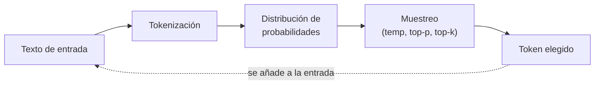
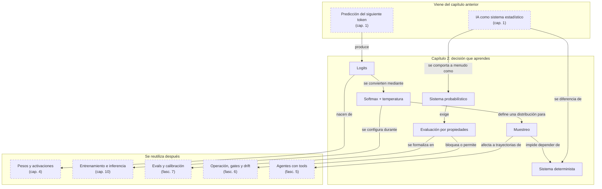

::: {.fasciculo-subtitle}
Facsímil 1 · Los cimientos
:::

# Capítulo 02: Sistemas deterministas frente a sistemas probabilísticos

## Entrando en el tema

Acabas de integrar un LLM en tu aplicación. Has escrito un *prompt* cuidadoso, has probado varias veces y la respuesta es buena. Como buena ingeniera, escribes un test:

```
assert respuesta == "Rust es un lenguaje de programación de sistemas..."
```

El test pasa en tu máquina. Haces *push*. El CI lo ejecuta. Falla. Lo vuelves a ejecutar en local. Pasa. Lo ejecutas otra vez. Falla.

No es un *bug*. Es una colisión entre dos formas de pensar el *software*. Y este capítulo existe para que esa colisión no te pille por sorpresa.

## Qué es un sistema determinista

Un sistema determinista cumple una propiedad sencilla: **misma entrada, misma salida. Siempre.**

Llevas décadas programando en este mundo sin saber que tenía nombre. Cada vez que escribes `sumar(2, 3)` y esperas `5`, estás confiando en el determinismo. Cada compilador que traduce tu código a binario, cada consulta SQL que devuelve las mismas filas para la misma cláusula `WHERE`, cada función pura que no depende de nada externo.

El determinismo es el contrato silencioso de la ingeniería de *software* clásica: `f(x) = y`, y punto.^[Russell, S. y Norvig, P. (2021). *Artificial intelligence: a modern approach* (4.ª ed.). Pearson. Los autores dedican el capítulo 2 al concepto de agente racional, estableciendo la diferencia entre entornos deterministas (el siguiente estado está completamente determinado por el estado actual y la acción) y entornos estocásticos.] Si alguna vez rompe este contrato, lo llamamos *bug* y lo arreglamos.

```javascript
function sumar(a, b) {
  return a + b;
}
// sumar(2, 3) = 5, siempre.
// sumar(2, 3) = 5, también mañana.
// sumar(2, 3) = 5, en cualquier servidor del mundo.
```

Este contrato es tan fundamental que nuestras herramientas —tests unitarios, *debuggers*, integración continua— están construidas sobre él. Un test que pasa y luego falla sin cambiar el código es, en el mundo determinista, una señal de alarma. Algo está roto.

## Dónde aparece el no determinismo en IA

Aquí conviene ser muy precisos. No toda IA es no determinista. Un árbol de decisión entrenado, una regresión logística con pesos fijos o una red neuronal en modo inferencia pueden comportarse como funciones deterministas: misma entrada, mismos pesos, misma configuración, misma salida. Incluso dentro de un LLM, el *forward pass* que calcula los *logits* es una transformación matemática sobre números.

El no determinismo suele entrar después o alrededor del modelo: en el **muestreo** de tokens, en semillas aleatorias, en diferencias de precisión numérica, en *batching*, en kernels de GPU, en documentos recuperados que cambian o en herramientas externas que devuelven estados distintos. Por eso una integración real con IA no se prueba solo como una función pura. Se prueba como un sistema con capas.

En generación de texto, un LLM no devuelve «la respuesta correcta». Calcula una **distribución de probabilidad** sobre todos los tokens posibles y luego, según la configuración, puede **muestrear** de ella.

Esa palabra —muestrear— es la clave. No elige el token con mayor probabilidad (aunque puede configurarse para que lo haga). Elige un token al azar, pero con más probabilidad de elegir los que tienen puntuación alta. Es como lanzar un dado cargado: el 6 sale más a menudo, pero de vez en cuando sale un 3.

Por eso el mismo *prompt* puede producir respuestas distintas:

```
prompt: "Explica qué es Rust"

Ejecución 1: "Rust es un lenguaje de programación de sistemas..."
Ejecución 2: "Se trata de un lenguaje de programación enfocado en..."
Ejecución 3: "Rust, creado por Mozilla Research, es un lenguaje..."
```

Las tres son correctas. Las tres son razonables. Pero no son idénticas. Y si tu test espera una frase exacta, dos de cada tres ejecuciones fallarán sin que nada esté roto.

<svg xmlns="http://www.w3.org/2000/svg" viewBox="0 0 980 560" role="img" aria-label="Comparación entre sistema determinista y sistema probabilístico">
  <title>Comparación entre sistema determinista y sistema probabilístico</title>
  <defs>
    <marker id="f1c02-arrow" viewBox="0 0 10 10" refX="9" refY="5" markerWidth="6" markerHeight="6" orient="auto"><path d="M 0 0 L 10 5 L 0 10 z" fill="#333333"/></marker>
  </defs>
  <rect x="20" y="20" width="940" height="510" rx="18" fill="#FFFFFF" stroke="#111111" stroke-width="1.4"/>
  <text x="490" y="58" text-anchor="middle" font-family="Arial, sans-serif" font-size="23" font-weight="700" fill="#111111">Misma entrada, dos naturalezas distintas</text>
  <rect x="70" y="100" width="390" height="310" rx="14" fill="#F5F5F5" stroke="#111111" stroke-width="1.4"/>
  <text x="265" y="130" text-anchor="middle" font-family="Arial, sans-serif" font-size="18" font-weight="700" fill="#111111">Sistema determinista</text>
  <rect x="125" y="162" width="280" height="44" rx="8" fill="#FFFFFF" stroke="#333333"/>
  <text x="265" y="189" text-anchor="middle" font-family="Menlo, monospace" font-size="16" fill="#111111">sumar(2, 3)</text>
  <line x1="265" y1="216" x2="265" y2="255" stroke="#333333" stroke-width="1.5" marker-end="url(#f1c02-arrow)"/>
  <rect x="185" y="270" width="160" height="56" rx="10" fill="#FFFFFF" stroke="#111111" stroke-width="1.5"/>
  <text x="265" y="306" text-anchor="middle" font-family="Menlo, monospace" font-size="24" font-weight="700" fill="#111111">5</text>
  <text x="265" y="360" text-anchor="middle" font-family="Arial, sans-serif" font-size="13" fill="#555555">Regla fija: una única salida correcta.</text>
  <rect x="520" y="100" width="390" height="310" rx="14" fill="#FFFFFF" stroke="#111111" stroke-width="1.4"/>
  <text x="715" y="130" text-anchor="middle" font-family="Arial, sans-serif" font-size="18" font-weight="700" fill="#111111">Sistema probabilístico</text>
  <rect x="565" y="156" width="300" height="48" rx="8" fill="#F5F5F5" stroke="#333333"/>
  <text x="715" y="185" text-anchor="middle" font-family="Arial, sans-serif" font-size="14" fill="#111111">“Explica qué es Rust”</text>
  <line x1="715" y1="214" x2="715" y2="244" stroke="#333333" stroke-width="1.5" marker-end="url(#f1c02-arrow)"/>
  <rect x="565" y="258" width="300" height="34" rx="7" fill="#FFFFFF" stroke="#333333"/>
  <rect x="565" y="304" width="300" height="34" rx="7" fill="#FFFFFF" stroke="#333333"/>
  <rect x="565" y="350" width="300" height="34" rx="7" fill="#FFFFFF" stroke="#333333"/>
  <text x="715" y="280" text-anchor="middle" font-family="Arial, sans-serif" font-size="12" fill="#111111">Ejecución 1: “Rust es un lenguaje...”</text>
  <text x="715" y="326" text-anchor="middle" font-family="Arial, sans-serif" font-size="12" fill="#111111">Ejecución 2: “Se trata de un lenguaje...”</text>
  <text x="715" y="372" text-anchor="middle" font-family="Arial, sans-serif" font-size="12" fill="#111111">Ejecución 3: “Rust, creado por Mozilla...”</text>
  <text x="715" y="428" text-anchor="middle" font-family="Arial, sans-serif" font-size="13" fill="#555555">Distribución: varias salidas válidas.</text>
  <line x1="70" y1="456" x2="910" y2="456" stroke="#D5D5D5" stroke-width="1"/>
  <text x="92" y="484" font-family="Arial, sans-serif" font-size="13" font-weight="700" fill="#111111">Cómo se prueba</text>
  <text x="215" y="484" font-family="Menlo, monospace" font-size="12" fill="#555555">assert salida == 5</text>
  <text x="92" y="508" font-family="Arial, sans-serif" font-size="12" fill="#555555">Determinista: igualdad exacta y caso único.</text>
  <text x="540" y="484" font-family="Menlo, monospace" font-size="12" fill="#555555">100 muestras → propiedades + tasa de paso</text>
  <text x="540" y="508" font-family="Arial, sans-serif" font-size="12" fill="#555555">Probabilístico: contrato, distribución y umbral.</text>
  <text x="940" y="532" text-anchor="end" font-family="Arial, sans-serif" font-size="10" fill="#9A9A9A">IA para gente curiosa / Facsímil 01 / Capítulo 02 / 686f6c61</text>
</svg>

## Cómo funciona por dentro

El viaje desde el *prompt* hasta el token generado tiene cinco estaciones:

```
Texto de entrada → Tokenización → Distribución de probabilidades → Muestreo → Token elegido
```

**Estación 1: texto de entrada.** Escribes tu *prompt*. Digamos: «Explica qué es Rust».

**Estación 2: tokenización.** El *prompt* se convierte en una secuencia de números. Este paso es determinista: el mismo texto siempre produce los mismos tokens. Lo vimos en el capítulo anterior y lo exploraremos en profundidad en el capítulo 9.

**Estación 3: distribución de probabilidades.** Los tokens atraviesan las capas del modelo. Al final, el modelo produce una lista de puntuaciones —llamadas *logits*— para cada token de su vocabulario. Esas puntuaciones se convierten en probabilidades mediante la función *softmax*.^[Bishop, C. M. (2006). *Pattern recognition and machine learning*. Springer. El capítulo 4 aborda los modelos lineales para clasificación y la transformación de puntuaciones en probabilidades mediante la función *softmax*.] El token con mayor probabilidad es el que el modelo asigna como continuación más probable, pero no es el único posible.

La idea se puede escribir así:

\[
P(t_i \mid c) = \frac{e^{z_i / T}}{\sum_j e^{z_j / T}}
\]

| Símbolo | Significado | Ejemplo |
|---|---|---|
| \(t_i\) | Token candidato que podría venir después | `azul` |
| \(c\) | Contexto ya visto por el modelo | `El cielo es de color` |
| \(z_i\) | *Logit*: puntuación cruda asignada al token \(t_i\) | 4,0 para `azul` |
| \(T\) | Temperatura usada antes de convertir logits en probabilidades | 1,0 |
| \(\sum_j\) | Suma sobre todos los tokens candidatos del vocabulario | `azul`, `gris`, `rojo`, ... |
| \(P(t_i \mid c)\) | Probabilidad de elegir \(t_i\) dado el contexto | 0,84 para `azul` |

Con tres tokens candidatos y logits sencillos, la temperatura cambia la forma de la distribución:

| Token | Logit | Probabilidad con \(T=0{,}5\) | Probabilidad con \(T=1\) | Probabilidad con \(T=2\) |
|---|---:|---:|---:|---:|
| `azul` | 4,0 | 0,98 | 0,84 | 0,63 |
| `gris` | 2,0 | 0,018 | 0,11 | 0,23 |
| `rojo` | 1,0 | 0,002 | 0,04 | 0,14 |

No memorices los números. Quédate con el mecanismo: al bajar la temperatura, la distribución se concentra en el candidato más probable; al subirla, se reparte más probabilidad entre alternativas. Esto no convierte al modelo en «más inteligente» o «menos inteligente». Cambia la política de muestreo.

**Estación 4: muestreo.** Aquí puede entrar el no determinismo. Tres parámetros controlan cuánta aleatoriedad se introduce:

- **`temperature`**: controla lo plano o picuda que es la distribución. Con temperatura baja (cercana a 0), el modelo casi siempre elige el token más probable. Con temperatura alta (cercana a 2), incluso tokens con probabilidad baja tienen opciones.^[Holtzman, A., Buys, J., Du, L., Forbes, M. y Choi, Y. (2020). The curious case of neural text degeneration. En *International Conference on Learning Representations*. https://openreview.net/forum?id=rygGQyrFvH. Este artículo introdujo el muestreo *top-p* (*nucleus sampling*) y analiza en profundidad por qué los métodos de muestreo ingenuos producen texto degenerado.] Lo veremos en detalle en el capítulo sobre parámetros de configuración.
- **`top-p`**: en lugar de considerar todos los tokens, el modelo solo considera los más probables hasta que sus probabilidades suman `p`. Si `top-p = 0.9`, el modelo elige entre el conjunto mínimo de tokens que suman el 90 % de la probabilidad total.
- **`top-k`**: el modelo solo considera los `k` tokens más probables y descarta el resto.

Con `temperature = 0`, el modelo se acerca al determinismo: casi siempre elige el token más probable. Pero no lo garantiza del todo: pequeñas diferencias en precisión numérica, *batching* o *hardware* pueden producir variaciones.

**Estación 5: token elegido.** El modelo devuelve un token. Ese token se añade a la secuencia de entrada y el ciclo se repite hasta generar un token de fin.



## En el día a día

La variabilidad de los LLM en productos reales tiene consecuencias prácticas inmediatas. Veamos tres.

**Escribir tests para código que usa LLMs.** No puedes hacer `assert respuesta == "texto exacto"`. En su lugar, validas propiedades: ¿la respuesta contiene los tres puntos clave que pediste?, ¿tiene la estructura esperada (JSON, Markdown, lista)?, ¿menciona los conceptos correctos?, ¿está en el idioma solicitado?^[Anthropic. (2025). Develop tests for LLM applications. https://platform.claude.com/docs/en/build-with-claude/develop-tests] Es un cambio de mentalidad: de validar igualdad exacta a validar propiedades semánticas.

**Depurar comportamientos inconsistentes.** Un usuario reporta que el asistente «a veces responde mal». En un sistema determinista, reproducirías la entrada y obtendrías el mismo error. Con un LLM, necesitas ejecutar varias veces, observar patrones y usar evaluaciones automáticas que midan la tasa de error en lugar de comprobar ejecuciones individuales.

**Diseñar experiencias de usuario.** Si tu producto muestra respuestas generadas por IA, el usuario esperará que la misma pregunta reciba una respuesta consistente. Si cada vez que pregunta «¿cuál es mi saldo?» obtiene una redacción distinta, puede percibirlo como un error. La solución no es forzar el determinismo: es diseñar la experiencia para que la variabilidad sea una ventaja (creatividad, adaptación al contexto) y no una fuente de confusión.

## Por qué debería importarte

El paso más importante que darás al trabajar con IA no es técnico: es mental.

Llevas años —décadas, probablemente— entrenando tu cerebro para pensar en sistemas deterministas. Un *bug* es una desviación del comportamiento esperado. Un test que falla es una alarma. La reproducibilidad es sagrada.

Trabajar con IA exige un modelo mental distinto. No preguntas «¿esto devuelve X?», sino «¿esto devuelve algo razonable dentro de un rango?». No validas igualdad, validas propiedades. No depuras ejecuciones individuales, observas distribuciones de resultados.

Este cambio de mentalidad no es opcional. Si diseñas sistemas con IA generativa como si siempre fueran funciones puras de texto a texto, construirás sistemas frágiles que fallarán en producción por razones que tus tests no pueden detectar.

## Dónde solía tropezar yo

| Error | Por qué es un error | Antídoto |
|---|---|---|
| **Testear texto exacto** | Escribir `assert respuesta == "Rust es un lenguaje..."` condena tu test a fallar aleatoriamente. La misma pregunta puede recibir respuestas correctas pero textualmente distintas. | Valida propiedades: ¿contiene las palabras clave?, ¿respeta el formato pedido?, ¿tiene una longitud razonable? |
| **Decir “la IA no es determinista” sin matices** | Mezcla cosas distintas: modelo, muestreo, runtime, proveedor, RAG y herramientas. Una parte del sistema puede ser determinista y otra no. | Dibuja la frontera: qué pieza es función pura, qué pieza muestrea, qué pieza consulta estado externo y qué pieza depende de infraestructura. |
| **Confiar en que `temperature=0` es totalmente determinista** | Incluso con temperatura cero, pequeñas diferencias en precisión numérica, *batching* o *hardware* pueden producir variaciones. No es un interruptor de determinismo: es un atenuador de variabilidad. | Si necesitas determinismo absoluto, usa modelos clásicos. Si usas un LLM, diseña para tolerar variabilidad. |
| **Depurar como si fuera un *bug* determinista** | Ante una respuesta incorrecta de un LLM, repetir el mismo *prompt* para «reproducir el error» puede no funcionar. El error puede ser estadístico, no sistemático. | Ejecuta múltiples veces, mide la tasa de error y busca patrones. Usa evaluaciones automáticas. |
| **Ignorar los parámetros de muestreo** | Usar los valores por defecto sin entender qué hace cada uno. Una temperatura alta en un contexto donde necesitas respuestas consistentes genera frustración en el usuario. | Ajusta `temperature`, `top-p` y `top-k` según el caso de uso. Creatividad alta para *brainstorming*, baja para respuestas factuales. |

## Manos a la obra

Este capítulo sí puede practicarse sin llamar a ningún modelo real. He dejado un kit en `labs/f1/c02-stochastic-tests/` que simula un modelo pequeño: varias respuestas candidatas, un *logit* por respuesta, distintas temperaturas y una evaluación que compara dos estrategias de testing.

La primera estrategia es la que traemos del mundo determinista: `assert salida == texto_esperado`. La segunda es la que necesitamos para sistemas probabilísticos: comprobar propiedades, medir tasas de paso y decidir si el comportamiento queda dentro de un contrato aceptable.

**Qué creas.**

- `output/stochastic_eval_report.json`: resultados por caso y temperatura.
- `output/stochastic_eval_decision.md`: lectura técnica de cuándo falla el assert exacto y cuándo pasa la evaluación por propiedades.
- `Makefile`: atajos para ejecutar, probar y limpiar la práctica.
- `tests/test_stochastic_eval.py`: pruebas que fijan el comportamiento esperado de softmax, temperatura cero, evaluación por propiedades y gate.
- `requirements.txt`: declaración explícita de que el kit no necesita dependencias externas.

**Cómo lo ejecutas.**

```bash
cd labs/f1/c02-stochastic-tests
python3 ops/run_stochastic_eval.py --write
cat output/stochastic_eval_decision.md
```

Para tratarlo como práctica reproducible:

```bash
cd labs/f1/c02-stochastic-tests
make run
make test
```

**Qué deberías ver.** En una tarea factual como explicar Rust, la tasa de coincidencia exacta baja cuando hay varias respuestas válidas, aunque muchas cumplan las propiedades importantes. En una salida estructurada tipo JSON, verás otro problema: dos respuestas pueden tener la misma información en distinto orden. Si tu test exige texto idéntico, falla; si valida campos obligatorios, pasa. Los tests comprueban además que la temperatura cero se comporta como argmax en este simulador, que las probabilidades suman 1 y que una temperatura alta puede bloquear una salida estructurada cuando rompe el contrato.

**Cómo lo adaptas a tu caso.** Cambia `data/sampling_cases.json` por una tarea propia: una respuesta de soporte, un resumen técnico o una salida JSON. Ajusta `contracts/eval_policy.json` para modificar número de ejecuciones, temperaturas, tasa mínima de paso o número máximo de salidas distintas.

**Qué entregaría un alumno.** Un buen entregable incluye el Markdown generado, un caso nuevo, una política modificada, el resultado de `make test` y una explicación breve de por qué la igualdad exacta no representa bien la calidad del sistema.

## Cómo encaja todo

Este mapa se lee de arriba abajo. El capítulo hereda del capítulo 1 la idea de predicción del siguiente token. Aquí la vuelve operativa: si hay distribución y muestreo, ya no puedes probar, depurar ni diseñar experiencia de usuario como si todo fuera una función pura.

La decisión central del capítulo es cambiar de mentalidad: de salida única a contrato probabilístico. Esa decisión reaparece después en parámetros de inferencia, evaluación, operación, RAG y agentes, porque todos esos sistemas necesitan medir comportamiento en muchas ejecuciones, no en una sola respuesta bonita.



## Vocabulario aprendido

| Término | Definición |
|---|---|
| **Sistema determinista** | Sistema donde la misma entrada produce siempre la misma salida. Un compilador, una consulta SQL o una función pura son ejemplos. |
| **Sistema estocástico** | Sistema donde la misma entrada puede producir salidas diferentes porque incorpora elementos de probabilidad o muestreo. |
| **Muestreo** | Proceso de elegir un valor concreto a partir de una distribución de probabilidad. En un LLM, se muestrea cuál será el siguiente token. |
| **Temperatura** | Parámetro que controla cuánta aleatoriedad se introduce al muestrear. Valores bajos producen respuestas más predecibles; valores altos, más creativas. |
| **_Logit_** | Puntuación cruda que asigna el modelo a cada token antes de convertirse en probabilidad. |
| **Softmax** | Función que convierte puntuaciones crudas en probabilidades que suman 1. |
| **Distribución de probabilidad** | Asignación de una probabilidad a cada resultado posible. En un LLM, a cada token del vocabulario. |
| **Evaluación probabilística** | Forma de probar sistemas variables midiendo propiedades, tasas de paso y distribuciones, no igualdad exacta de texto. |

## Antes de pasar página

- [ ] ¿Puedo explicar con mis propias palabras la diferencia entre un sistema determinista y uno estocástico? (Si no, vuelve a «Qué es un sistema determinista» y «Dónde aparece el no determinismo en IA».)
- [ ] ¿Entiendo por qué un LLM puede dar respuestas distintas al mismo *prompt*? (Si no, vuelve a «Cómo funciona por dentro».)
- [ ] ¿Sé qué hace el parámetro `temperature`? (Si no, vuelve a la estación 4 en «Cómo funciona por dentro».)
- [ ] ¿Puedo nombrar al menos dos estrategias para testear sistemas que usan LLMs? (Si no, vuelve a «En el día a día».)
- [ ] ¿Entiendo por qué `temperature = 0` no garantiza determinismo absoluto? (Si no, vuelve a «Dónde solía tropezar yo», error «Confiar en que temperature = 0 es totalmente determinista».)
- [ ] ¿He ejecutado el kit de `labs/f1/c02-stochastic-tests/` y puedo explicar la diferencia entre `exact_pass_rate` y `property_pass_rate`? (Si no, vuelve a «Manos a la obra».)

## En resumen

| Idea fuerza | Detalle |
|---|---|
| En IA generativa, la variabilidad suele aparecer en el muestreo y en el sistema que rodea al modelo. | El mismo *prompt* puede producir respuestas distintas porque el modelo puede muestrear de una distribución de probabilidad, porque el runtime no siempre es idéntico o porque el contexto externo cambia. |
| Programar con IA exige un cambio de mentalidad. | Pasas de validar igualdad exacta a validar propiedades. De preguntar «¿esto devuelve X?» a preguntar «¿esto devuelve algo razonable?». |
| Los parámetros de muestreo controlan la aleatoriedad, no la eliminan. | `temperature`, `top-p` y `top-k` ajustan cuánta variabilidad hay, pero ni siquiera `temperature = 0` garantiza determinismo absoluto. |
| Testear sistemas con IA requiere herramientas distintas. | No tests de igualdad textual. Sí evaluaciones automáticas, validación de estructura, *asserts* sobre propiedades semánticas. |

## Para saber más

Anthropic. (2025). Develop tests for LLM applications. https://platform.claude.com/docs/en/build-with-claude/develop-tests

Bishop, C. M. (2006). *Pattern recognition and machine learning*. Springer.

Goodfellow, I., Bengio, Y. y Courville, A. (2016). *Deep learning*. MIT Press. https://www.deeplearningbook.org

Holtzman, A., Buys, J., Du, L., Forbes, M. y Choi, Y. (2020). The curious case of neural text degeneration. En *International Conference on Learning Representations*. https://openreview.net/forum?id=rygGQyrFvH

Russell, S. y Norvig, P. (2021). *Artificial intelligence: a modern approach* (4.ª ed.). Pearson.

Shannon, C. E. (1948). A mathematical theory of communication. *The Bell System Technical Journal*, 27(3), 379-423. https://doi.org/10.1002/j.1538-7305.1948.tb01338.x

Vaswani, A., Shazeer, N., Parmar, N., Uszkoreit, J., Jones, L., Gomez, A. N., Kaiser, Ł. y Polosukhin, I. (2017). Attention is all you need. En *Advances in Neural Information Processing Systems 30* (pp. 5998-6008). https://papers.nips.cc/paper/7181-attention-is-all-you-need
