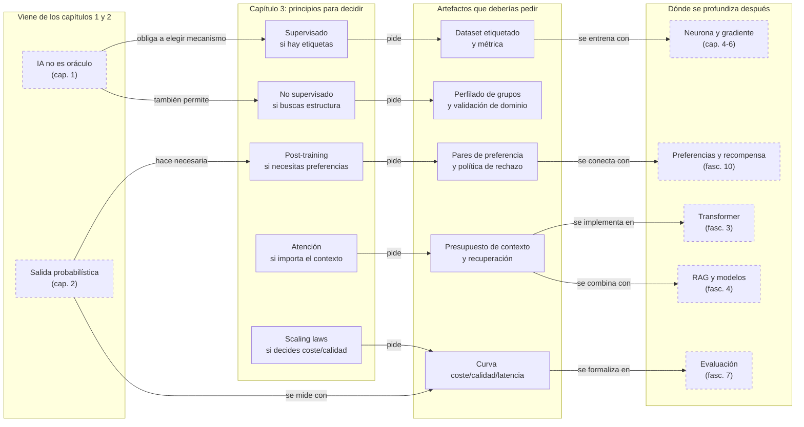

::: {.fasciculo-subtitle}
Facsímil 1 · Los cimientos
:::

# Capítulo 03: Principios fundamentales de la inteligencia artificial

## Entrando en el tema

Has oído las palabras. Aprendizaje supervisado. *Transformers*. RLHF. *Scaling laws*. Suenan a conceptos avanzados que solo entiende quien tiene un doctorado. Pero no lo son. Son cinco ideas, sorprendentemente accesibles, que explican por qué la IA moderna funciona como funciona.

Este capítulo no te va a convertir en experto en ninguna de ellas. Para eso están el resto de capítulos del libro. Pero sí te va a dar el mapa. Cuando termines, sabrás nombrar las cinco patas de la mesa y, sobre todo, sabrás qué pata buscar cuando algo falle.

## Aprendizaje supervisado: aprender con ejemplos

Imagina que quieres enseñarle a alguien a distinguir facturas falsas de facturas verdaderas. Le enseñas cien facturas. Cada una lleva una etiqueta: «verdadera» o «falsa». La persona observa, compara, detecta patrones —el logotipo borroso, el NIF que no cuadra, el formato de fecha extraño— y, tras revisar suficientes ejemplos, es capaz de clasificar facturas nuevas que no había visto antes.

Eso es el aprendizaje supervisado.

En términos técnicos: le das al modelo un conjunto de ejemplos etiquetados —cada entrada con su salida esperada— y el modelo ajusta sus parámetros para minimizar el error entre lo que predice y la etiqueta real.^[Russell, S. y Norvig, P. (2021). *Artificial intelligence: a modern approach* (4.ª ed.). Pearson. Los capítulos 18 a 21 cubren en profundidad los paradigmas de aprendizaje supervisado, no supervisado y por refuerzo.] Es la base del *fine-tuning*: coges un modelo pre-entrenado y lo ajustas con ejemplos específicos de tu dominio. El modelo ya sabe lenguaje; tú le enseñas tu jerga.

El aprendizaje supervisado es el paradigma más intuitivo porque se parece a como aprendemos muchas cosas: practicando con ejemplos cuya respuesta correcta conocemos.

## Aprendizaje no supervisado: encontrar patrones sin pistas

Ahora imagina que tienes un montón de facturas sin etiquetar. No sabes cuáles son verdaderas ni falsas. Pero aun así, al observarlas, detectas que algunas se parecen mucho entre sí —mismo formato, mismos proveedores, mismos importes redondos— y otras son completamente distintas. Sin que nadie te haya dicho qué es cada cosa, has encontrado estructura.

Eso es el aprendizaje no supervisado.

El modelo recibe datos sin etiquetar y busca patrones, agrupaciones o representaciones. No hay una «respuesta correcta» contra la que comparar. El modelo descubre la estructura por sí mismo.

Este paradigma es el responsable silencioso del éxito de los LLMs. Cuando un modelo como GPT se pre-entrena sobre miles de millones de documentos de internet, no hay un humano etiquetando cada frase. El modelo se entrena con una tarea auto-supervisada: predecir la siguiente palabra.^[Goodfellow, I., Bengio, Y. y Courville, A. (2016). *Deep learning*. MIT Press. https://www.deeplearningbook.org. El capítulo 14 aborda los autoencoders y las representaciones no supervisadas, fundamentos del pre-entrenamiento moderno.] Es una forma de aprendizaje no supervisado: los propios datos proporcionan la señal de aprendizaje.

## Post-training: enseñar preferencias, no solo hechos

Un modelo pre-entrenado sabe completar frases. Pero no sabe que es mejor decir «no tengo esa información» que inventársela. No sabe que ciertos temas requieren un tono más cuidadoso. No sabe cuándo callar.

El *post-training* resuelve esto. Tras el pre-entrenamiento masivo (aprendizaje no supervisado), se aplican técnicas que enseñan al modelo **preferencias**:

- **SFT** (*Supervised Fine-Tuning*): se entrena al modelo con ejemplos de conversaciones de alta calidad escritas por personas. El modelo aprende el formato y el tono deseados.
- **RLHF** (*Reinforcement Learning from Human Feedback*): personas comparan pares de respuestas del modelo y eligen cuál es mejor. Esa señal de preferencia entrena un modelo de recompensa que guía al modelo principal. Es aprendizaje por refuerzo, pero la recompensa la define un humano, no el entorno.^[Ouyang, L. et al. (2022). Training language models to follow instructions with human feedback. *Advances in Neural Information Processing Systems 35*, 27730-27744. https://papers.nips.cc/paper_files/paper/2022/hash/b1efde53be364a73914f58805a001731-Abstract-Conference.html]
- **DPO** (*Direct Preference Optimization*): una alternativa a RLHF que aprende directamente de las preferencias humanas sin necesidad de entrenar un modelo de recompensa separado.^[Rafailov, R., Sharma, A., Mitchell, E., Ermon, S., Manning, C. D. y Finn, C. (2023). Direct preference optimization: Your language model is secretly a reward model. *Advances in Neural Information Processing Systems 36*. https://arxiv.org/abs/2305.18290]

El *post-training* es la capa que convierte un modelo que «sabe cosas» en un modelo con el que puedes hablar. Lo exploraremos en detalle en el facsímil 4.

## Atención: mirar todo a la vez

Piensa en cómo lees esta frase: «El gato que perseguía al ratón que robó el queso que estaba en la cocina es negro». Para saber que «negro» se refiere a «gato», tu cerebro ha tenido que conectar dos palabras separadas por una larga cláusula subordinada. Ha tenido que prestar atención a la relación entre «gato» y «negro» ignorando temporalmente el ratón, el queso y la cocina.

Los modelos anteriores a 2017 no podían hacer esto eficientemente. Procesaban el texto palabra por palabra, en orden, y para cuando llegaban a «negro» ya se habían olvidado de «gato».

El mecanismo de **atención**, presentado en el artículo «Attention Is All You Need»,^[Vaswani, A., Shazeer, N., Parmar, N., Uszkoreit, J., Jones, L., Gomez, A. N., Kaiser, Ł. y Polosukhin, I. (2017). Attention is all you need. En *Advances in Neural Information Processing Systems 30* (pp. 5998-6008). https://papers.nips.cc/paper/7181-attention-is-all-you-need] cambió esto radicalmente. Permite al modelo mirar **todas las palabras de la entrada simultáneamente** y decidir, para cada palabra que va a generar, cuáles de las palabras de entrada son relevantes y en qué medida.

Es el mecanismo que hizo posibles los LLMs modernos. Sin atención, los modelos no podrían manejar contextos largos ni capturar dependencias entre palabras separadas por decenas de miles de tokens. El facsímil 3 está dedicado íntegramente a abrir esta caja negra y entenderla por dentro.

## *Scaling laws*: escala, coste y límites

En 2020, un grupo de investigadores de OpenAI se preguntó algo aparentemente simple: ¿qué pasa si entrenamos modelos cada vez más grandes con más datos y más computación? La respuesta, publicada en el artículo «Scaling Laws for Neural Language Models»,^[Kaplan, J. et al. (2020). Scaling laws for neural language models. arXiv:2001.08361. https://doi.org/10.48550/arXiv.2001.08361] fue sorprendentemente ordenada: el rendimiento mejora de forma **predecible** con la escala.

La relación simplificada es: **más datos + más parámetros + más computación = modelo más capaz**. Pero escrita así puede engañar. No significa que cualquier modelo grande sea mejor en cualquier tarea, ni que puedas ignorar la calidad de los datos, la arquitectura, el entrenamiento o la evaluación. Significa que, bajo ciertas condiciones experimentales, la pérdida baja siguiendo una relación bastante regular cuando aumentan parámetros, datos y cómputo.

**Ejemplo de fórmula.** Una forma simplificada de leer una ley de escala es esta:

\[
L(N, D) \approx L_\infty + \frac{A}{N^\alpha} + \frac{B}{D^\beta}
\]

| Símbolo | Significado | Ejemplo |
|---|---|---|
| \(L(N, D)\) | Pérdida esperada del modelo entrenado con \(N\) parámetros y \(D\) tokens | 1,72 |
| \(L_\infty\) | Límite inferior aproximado: pérdida que no desaparece aunque escales | 1,55 |
| \(N\) | Número de parámetros del modelo | 7B, 70B, 405B |
| \(D\) | Cantidad de datos de entrenamiento, normalmente tokens | 1T tokens |
| \(A, B\) | Constantes ajustadas empíricamente | dependen del experimento |
| \(\alpha, \beta\) | Exponentes que dicen cuánto ayuda escalar parámetros o datos | valores pequeños, no milagrosos |

Esta fórmula es una forma pedagógica de leer la idea, no una receta para presupuestar tu modelo ni una garantía de rendimiento. Las constantes y exponentes se estiman empíricamente en un experimento concreto; cambian con arquitectura, datos, régimen de entrenamiento y métrica. La intuición importante es que hay **rendimientos decrecientes**. Añadir diez veces más parámetros no suele darte diez veces más calidad. Además, Hoffmann y coautores mostraron con Chinchilla que muchos modelos grandes estaban infraentrenados: para un presupuesto de cómputo fijo, no basta con aumentar parámetros; también hay que aumentar datos de entrenamiento en proporción razonable.^[Hoffmann, J. et al. (2022). Training compute-optimal large language models. *Advances in Neural Information Processing Systems 35*. https://doi.org/10.48550/arXiv.2203.15556]

Esto explica por qué la industria invierte miles de millones en clústeres de GPUs, pero también explica por qué un equipo serio no compra «el modelo más grande» sin medir. Las *scaling laws* sirven para razonar sobre tendencias de entrenamiento; tu decisión de producto se toma con evals, latencia, coste por token, privacidad, facilidad de operación y calidad en tu tarea.

La lectura menos optimista es clara: mejorar el rendimiento requiere inversiones crecientes. Pasar de un modelo bueno a uno excelente cuesta mucho más que pasar de uno malo a uno aceptable. Entender esta dinámica es clave para tomar decisiones realistas sobre qué modelos usar y cuándo.

<svg xmlns="http://www.w3.org/2000/svg" viewBox="0 0 980 560" role="img" aria-label="Cinco principios que sostienen la inteligencia artificial moderna">
  <title>Cinco principios que sostienen la inteligencia artificial moderna</title>
  <defs>
    <marker id="f1c03-arrow" viewBox="0 0 10 10" refX="9" refY="5" markerWidth="6" markerHeight="6" orient="auto"><path d="M 0 0 L 10 5 L 0 10 z" fill="#333333"/></marker>
  </defs>
  <rect x="20" y="20" width="940" height="510" rx="18" fill="#FFFFFF" stroke="#111111" stroke-width="1.4"/>
  <text x="490" y="58" text-anchor="middle" font-family="Arial, sans-serif" font-size="23" font-weight="700" fill="#111111">Cinco piezas que se refuerzan</text>
  <text x="490" y="84" text-anchor="middle" font-family="Arial, sans-serif" font-size="13" fill="#666666">La IA moderna no es una sola técnica: es una arquitectura de ideas que trabajan juntas.</text>
  <rect x="375" y="210" width="230" height="104" rx="16" fill="#F5F5F5" stroke="#111111" stroke-width="1.8"/>
  <text x="490" y="250" text-anchor="middle" font-family="Arial, sans-serif" font-size="24" font-weight="700" fill="#111111">IA moderna</text>
  <text x="490" y="277" text-anchor="middle" font-family="Arial, sans-serif" font-size="13" fill="#555555">predicción + datos + ajuste</text>
  <g font-family="Arial, sans-serif">
    <rect x="75" y="120" width="230" height="82" rx="12" fill="#FFFFFF" stroke="#111111" stroke-width="1.4"/>
    <text x="190" y="151" text-anchor="middle" font-size="16" font-weight="700" fill="#111111">Aprendizaje supervisado</text>
    <text x="190" y="174" text-anchor="middle" font-size="12" fill="#555555">ejemplos con respuesta</text>
    <rect x="75" y="334" width="230" height="82" rx="12" fill="#FFFFFF" stroke="#111111" stroke-width="1.4"/>
    <text x="190" y="365" text-anchor="middle" font-size="16" font-weight="700" fill="#111111">No supervisado</text>
    <text x="190" y="388" text-anchor="middle" font-size="12" fill="#555555">estructura sin etiquetas</text>
    <rect x="375" y="80" width="230" height="82" rx="12" fill="#FFFFFF" stroke="#111111" stroke-width="1.4"/>
    <text x="490" y="111" text-anchor="middle" font-size="16" font-weight="700" fill="#111111">Atención y Transformers</text>
    <text x="490" y="134" text-anchor="middle" font-size="12" fill="#555555">relaciones a larga distancia</text>
    <rect x="675" y="120" width="230" height="82" rx="12" fill="#FFFFFF" stroke="#111111" stroke-width="1.4"/>
    <text x="790" y="151" text-anchor="middle" font-size="16" font-weight="700" fill="#111111">Post-entrenamiento</text>
    <text x="790" y="174" text-anchor="middle" font-size="12" fill="#555555">SFT, RLHF, DPO</text>
    <rect x="675" y="334" width="230" height="82" rx="12" fill="#FFFFFF" stroke="#111111" stroke-width="1.4"/>
    <text x="790" y="365" text-anchor="middle" font-size="16" font-weight="700" fill="#111111">Leyes de escala</text>
    <text x="790" y="388" text-anchor="middle" font-size="12" fill="#555555">datos + cómputo + parámetros</text>
  </g>
  <line x1="305" y1="161" x2="371" y2="227" stroke="#333333" stroke-width="1.4" marker-end="url(#f1c03-arrow)"/>
  <line x1="305" y1="375" x2="371" y2="296" stroke="#333333" stroke-width="1.4" marker-end="url(#f1c03-arrow)"/>
  <line x1="490" y1="162" x2="490" y2="206" stroke="#333333" stroke-width="1.4" marker-end="url(#f1c03-arrow)"/>
  <line x1="675" y1="161" x2="609" y2="227" stroke="#333333" stroke-width="1.4" marker-end="url(#f1c03-arrow)"/>
  <line x1="675" y1="375" x2="609" y2="296" stroke="#333333" stroke-width="1.4" marker-end="url(#f1c03-arrow)"/>
  <rect x="298" y="456" width="384" height="32" rx="16" fill="#F5F5F5" stroke="#333333"/>
  <text x="490" y="477" text-anchor="middle" font-family="Arial, sans-serif" font-size="13" fill="#555555">Si una pieza falla, el sistema completo pierde fiabilidad.</text>
  <text x="940" y="512" text-anchor="end" font-family="Arial, sans-serif" font-size="10" fill="#9A9A9A">IA para gente curiosa / Facsímil 01 / Capítulo 03 / 686f6c61</text>
</svg>

## En el día a día

Cada uno de estos principios se traduce en decisiones de ingeniería.

**Si tu problema tiene datos etiquetados**, el aprendizaje supervisado —posiblemente mediante *fine-tuning*— es tu primer candidato. Clasificar tickets de soporte, detectar fraude, predecir abandono de clientes: todo esto es supervisado.

**Si solo tienes datos sin etiquetar** y necesitas encontrar estructura —agrupar clientes, detectar anomalías, reducir dimensiones—, el aprendizaje no supervisado es la herramienta. Pero cuidado: que el modelo encuentre grupos no significa que esos grupos signifiquen algo útil para tu negocio. Lo veremos en el capítulo sobre *clustering*.

**Si estás integrando un LLM en un producto**, primero separa qué problema tienes. Si falta conocimiento que cambia —políticas internas, catálogo, normativa, documentación— normalmente necesitas recuperación de información, no tocar pesos. Si falta formato, tono, criterios de abstención o una conducta repetida y medible, entonces puede tener sentido *post-training*, *fine-tuning* o adaptadores. No basta con un buen *prompt*, pero tampoco se responde a todo con *fine-tuning*: necesitas saber qué pieza del sistema está fallando.

**Si necesitas que el modelo maneje contexto largo**, la atención es tu aliada y tu enemiga. Permite procesar documentos extensos, pero su coste computacional crece cuadráticamente con la longitud de la secuencia. Cada vez que duplicas el contexto, el coste se multiplica por cuatro. Diseñar estrategias de ventana de contexto —cuánto texto incluir, cuánto resumir, cuánto recuperar— es una decisión de arquitectura que depende de entender cómo funciona la atención.

**Si estás decidiendo qué modelo usar**, las *scaling laws* te dicen que más grande no siempre es mejor *para ti*. Un modelo de 7 000 millones de parámetros puede ser suficiente para tu caso de uso, y uno de 70 000 millones puede ser excesivamente caro y lento sin aportar una mejora proporcional. La decisión correcta depende de tus requisitos de calidad, latencia y coste.

## Por qué debería importarte

Estos cinco principios no son trivia académica. Son el vocabulario con el que se toman todas las decisiones técnicas en IA.

Cuando alguien te diga «vamos a hacer *fine-tuning*», necesitas saber que está hablando de aprendizaje supervisado sobre un modelo pre-entrenado. Cuando escuches «este modelo tiene mejor atención», necesitas entender qué significa eso para tu caso de uso. Cuando un proveedor te diga «nuestro modelo es más grande, por tanto mejor», las *scaling laws* te dan el marco para evaluar si ese «mejor» justifica el coste.

Cada capítulo a partir de ahora asume que conoces este mapa. La neurona artificial es la pieza mínima del aprendizaje supervisado. La retropropagación es cómo se ajustan los parámetros. El Transformer es la atención llevada a la práctica. El *fine-tuning* es aprendizaje supervisado aplicado. Todo encaja.

## Dónde solía tropezar yo

| Error | Por qué es un error | Antídoto |
|---|---|---|
| **Creer que el aprendizaje no supervisado no necesita validación** | Que un modelo encuentre patrones no significa que esos patrones sean útiles, reales o accionables. Un *cluster* puede ser un artefacto estadístico sin significado de negocio. | Valida siempre los resultados no supervisados contra conocimiento del dominio. Un grupo de clientes debe tener sentido para el equipo de negocio, no solo para el algoritmo. |
| **Asumir que más parámetros siempre es mejor** | Un modelo más grande es más caro, más lento y no necesariamente mejor para tu caso de uso concreto. Las *scaling laws* predicen rendimiento agregado, no rendimiento en tu tarea específica. | Evalúa el modelo en tus datos y tu tarea. No delegues la decisión en el número de parámetros. |
| **Responder “fine-tuning” antes de diagnosticar** | Un dominio especializado puede fallar por muchas razones: falta contexto, datos obsoletos, formato de salida inestable, vocabulario técnico, criterios de abstención o evaluación pobre. Ajustar pesos no arregla documentos desactualizados ni permisos mal diseñados. | Decide por causa: RAG para conocimiento vivo, reglas o herramientas para acciones verificables, *fine-tuning* o LoRA para comportamiento repetido y estable, y evaluación antes de cambiar nada. |
| **Ignorar el coste cuadrático de la atención** | Duplicar la longitud del contexto multiplica por cuatro el coste computacional. Diseñar sin tener esto en cuenta lleva a sistemas lentos y caros en producción. | Mide el coste real con tu volumen de datos y tu latencia objetivo. Considera estrategias de ventana deslizante, resumen previo o recuperación selectiva. |

## Manos a la obra

Este capítulo es un mapa, sí, pero un mapa también se puede usar. He dejado un kit ejecutable en `labs/f1/c03-principle-router/` para convertir los cinco principios en una matriz de decisión técnica.

El ejercicio parte de cinco casos realistas: clasificar tickets con datos etiquetados, descubrir segmentos sin etiquetas, construir un asistente que debe abstenerse, resumir contratos largos y elegir un modelo local con baja latencia. El script decide qué principio domina cada caso —supervisado, no supervisado, post-training, atención/contexto o scaling/coste— y qué artefactos mínimos habría que producir antes de construir.

**Qué creas.**

- `output/principle_report.json`: matriz estructurada con principio dominante, principios secundarios, riesgos y entregables.
- `output/principle_decision.md`: decisión legible que podrías defender en una práctica o en una reunión técnica.
- `Makefile`: atajos para ejecutar, probar y limpiar la práctica.
- `tests/test_principle_router.py`: prueba ejecutable de que el router genera una decisión completa.
- `requirements.txt`: deja claro que no hay dependencias externas.

**Cómo lo ejecutas.**

```bash
cd labs/f1/c03-principle-router
python3 ops/route_ai_principles.py --write
cat output/principle_decision.md
```

Como mini proyecto reproducible:

```bash
cd labs/f1/c03-principle-router
make run
make test
```

**Qué deberías ver.** Clasificar tickets se apoya en aprendizaje supervisado porque hay etiquetas y métrica. Descubrir segmentos se apoya en no supervisado, pero exige validación de dominio. El asistente de becas mezcla post-training, atención/contexto y revisión porque debe saber abstenerse. Los contratos largos fuerzan presupuesto de contexto. El modelo local obliga a mirar coste, latencia y calidad, no solo tamaño.

**Cómo lo adaptas a tu caso.** Añade dos casos propios a `data/project_cases.json`: uno donde creas que basta un modelo pequeño y otro donde sospeches que hace falta post-training o RAG. Cambia `contracts/principle_policy.json` para modificar el umbral de ejemplos etiquetados, el límite de contexto largo o la latencia objetivo.

**Qué entregaría un alumno.** El Markdown generado, dos casos propios, una explicación de por qué el principio dominante no basta por sí solo, un cambio de política que altere al menos una decisión y el resultado de `make test`.

## Cómo encaja todo

Este mapa se lee de izquierda a derecha. Hereda de los dos capítulos anteriores dos ideas: la IA no es una mente y sus salidas son probabilísticas. El capítulo 3 añade el primer vocabulario de diseño: qué tipo de aprendizaje o arquitectura estás invocando cuando dices «vamos a usar IA».

La decisión que enseña es práctica: no todos los problemas piden el mismo principio. Un caso con etiquetas pide supervisado; uno sin etiquetas pide exploración; uno con preferencias pide post-training; uno con contexto largo pide entender atención; uno limitado por coste pide mirar escala y evals. Ese mapa reaparece en casi todo lo que viene después.



## Vocabulario aprendido

| Término | Definición |
|---|---|
| **Aprendizaje supervisado** | Paradigma donde el modelo aprende a partir de ejemplos etiquetados con la respuesta correcta, ajustando sus parámetros para minimizar el error de predicción. |
| **Aprendizaje no supervisado** | Paradigma donde el modelo encuentra patrones en datos sin etiquetar, sin una respuesta correcta predefinida contra la que comparar. |
| **Pre-entrenamiento** | Fase inicial masiva de entrenamiento no supervisado donde el modelo aprende patrones generales del lenguaje a partir de cantidades inmensas de texto. |
| **RLHF** | Técnica de post-entrenamiento donde la señal de aprendizaje proviene de personas que comparan y puntúan respuestas del modelo. |
| **DPO** | Técnica de optimización por preferencias que aprende de pares de respuestas elegidas y rechazadas sin entrenar un modelo de recompensa separado. |
| **_Fine-tuning_** | Proceso de tomar un modelo pre-entrenado y ajustarlo con ejemplos etiquetados de un dominio específico. Es aprendizaje supervisado sobre una base pre-entrenada. |
| **Atención** | Mecanismo que permite al modelo evaluar la relevancia de cada palabra de entrada para cada palabra de salida, procesando todas las relaciones simultáneamente. |
| **_Scaling law_** | Relación predecible entre los recursos invertidos en entrenamiento y el rendimiento del modelo. |

## Antes de pasar página

- [ ] ¿Puedo explicar la diferencia entre aprendizaje supervisado y no supervisado con un ejemplo concreto? (Si no, vuelve a las dos primeras secciones.)
- [ ] ¿Entiendo qué aporta el *post-training* que no aporta el pre-entrenamiento? (Si no, vuelve a «Post-training: enseñar preferencias».)
- [ ] ¿Sé qué hace el mecanismo de atención y por qué fue revolucionario? (Si no, vuelve a «Atención: mirar todo a la vez».)
- [ ] ¿Puedo explicar por qué las *scaling laws* son importantes para decidir qué modelo usar? (Si no, vuelve a «Scaling laws» y a «En el día a día».)
- [ ] ¿Entiendo por qué más parámetros no siempre es la respuesta correcta? (Si no, vuelve a «Dónde solía tropezar yo», error «Asumir que más parámetros siempre es mejor».)
- [ ] ¿He ejecutado `labs/f1/c03-principle-router/` y puedo justificar qué principio domina un caso propio? (Si no, vuelve a «Manos a la obra».)

## En resumen

| Idea fuerza | Detalle |
|---|---|
| La IA moderna se apoya en cinco principios. | Aprendizaje supervisado, no supervisado, post-training, atención y *scaling laws*. Entenderlos es tener el mapa antes de adentrarse en el territorio. |
| El aprendizaje supervisado entrena con ejemplos etiquetados; el no supervisado encuentra patrones sin etiquetas. | El primero es la base del *fine-tuning*; el segundo, del pre-entrenamiento de los LLMs. |
| El mecanismo de atención permite procesar todas las palabras a la vez. | Es la innovación arquitectónica que hizo posibles los modelos de lenguaje modernos. Sin ella, no hay Transformer. |
| Las *scaling laws* demuestran que el rendimiento mejora de forma predecible con la escala. | Pero también advierten de que la mejora tiene un coste creciente. Más grande no siempre es la respuesta correcta para tu caso. |

## Para saber más

Goodfellow, I., Bengio, Y. y Courville, A. (2016). *Deep learning*. MIT Press. https://www.deeplearningbook.org

Hoffmann, J. et al. (2022). Training compute-optimal large language models. arXiv:2203.15556. https://doi.org/10.48550/arXiv.2203.15556

Kaplan, J. et al. (2020). Scaling laws for neural language models. arXiv:2001.08361. https://doi.org/10.48550/arXiv.2001.08361

Ouyang, L. et al. (2022). Training language models to follow instructions with human feedback. *Advances in Neural Information Processing Systems 35*, 27730-27744. https://papers.nips.cc/paper_files/paper/2022/hash/b1efde53be364a73914f58805a001731-Abstract-Conference.html

Rafailov, R., Sharma, A., Mitchell, E., Ermon, S., Manning, C. D. y Finn, C. (2023). Direct preference optimization: Your language model is secretly a reward model. *Advances in Neural Information Processing Systems 36*. https://arxiv.org/abs/2305.18290

Rumelhart, D. E., Hinton, G. E. y Williams, R. J. (1986). Learning representations by back-propagating errors. *Nature*, 323(6088), 533-536. https://doi.org/10.1038/323533a0

Russell, S. y Norvig, P. (2021). *Artificial intelligence: a modern approach* (4.ª ed.). Pearson.

Vaswani, A., Shazeer, N., Parmar, N., Uszkoreit, J., Jones, L., Gomez, A. N., Kaiser, Ł. y Polosukhin, I. (2017). Attention is all you need. En *Advances in Neural Information Processing Systems 30* (pp. 5998-6008). https://papers.nips.cc/paper/7181-attention-is-all-you-need
