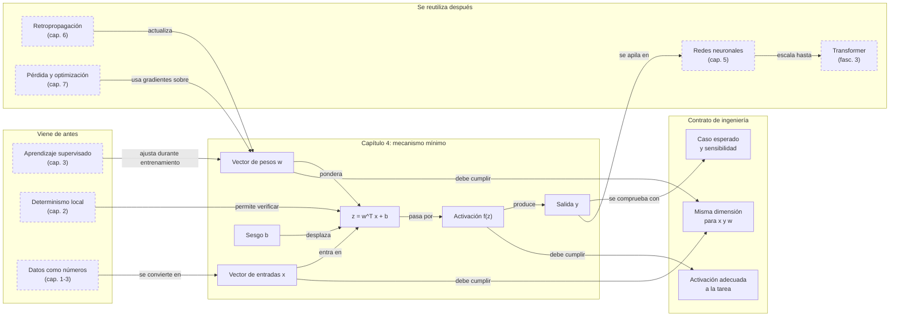

::: {.fasciculo-subtitle}
Facsímil 1 · Los cimientos
:::

# Capítulo 04: La neurona artificial: el átomo del aprendizaje

## Entrando en el tema

Has oído hablar de modelos con miles de millones de parámetros. De redes que escriben código, generan imágenes y mantienen conversaciones. Es fácil imaginar que dentro de todo eso hay algo increíblemente complejo, inabarcable.

Y lo hay. Pero también es verdad que todo empieza con una pieza que cabe en tres líneas de código.

Esa pieza es la neurona artificial. No es una metáfora biológica vaga: es una función matemática concreta, con entradas, pesos, un sesgo y una salida. Si entiendes una neurona, entiendes el átomo del aprendizaje profundo. El resto —capas, redes, arquitecturas, Transformers— es composición.

Este capítulo es el primero con fórmulas. No te asustes. Vamos a desmenuzar cada símbolo, a ponerle números concretos y a escribir el código que lo implementa. Si al final entiendes `y = max(0, w₁x₁ + w₂x₂ + b)`, has entendido lo esencial.

## Qué es una neurona artificial

Una neurona artificial es una **función matemática** que recibe números, los multiplica por pesos, suma un sesgo y aplica una función de activación.^[Rosenblatt, F. (1958). The perceptron: a probabilistic model for information storage and organization in the brain. *Psychological Review*, 65(6), 386-408. https://doi.org/10.1037/h0042519. Rosenblatt introdujo el perceptrón, la primera neurona artificial implementada en hardware, sentando las bases del aprendizaje supervisado.] Punto. No hay biología. Hay aritmética.

Lo de «neurona» es un nombre prestado de la biología, pero la semejanza es superficial. Una neurona biológica es una célula con dendritas, axones y neurotransmisores. Una neurona artificial es una operación de multiplicación, suma y comparación. El nombre ayuda a visualizar, pero no te lleves a engaño: estás ante álgebra lineal, no ante neurociencia.

La capacidad del sistema no está en una neurona individual. Está en los **miles de millones de parámetros** —pesos, sesgos, matrices de proyección, normalizaciones y otras piezas aprendidas— ajustados durante el entrenamiento. Una neurona sola no aprende nada útil. Muchas operaciones paramétricas organizadas en una arquitectura moderna pueden generar código, traducir idiomas y responder preguntas.

## La fórmula

En 1943, Warren McCulloch y Walter Pitts publicaron el primer modelo matemático de una neurona artificial.^[McCulloch, W. S. y Pitts, W. (1943). A logical calculus of the ideas immanent in nervous activity. *The Bulletin of Mathematical Biophysics*, 5(4), 115-133. https://doi.org/10.1007/BF02478259. Este artículo fundacional propuso que las neuronas podían modelarse como dispositivos lógicos de umbral, estableciendo el puente conceptual entre biología y computación.] Su neurona era binaria —encendida o apagada— y no aprendía: los pesos eran fijos. Quince años después, Frank Rosenblatt dio el paso decisivo: el **perceptrón**, una neurona cuyos pesos se ajustaban automáticamente a partir de ejemplos.^[Rosenblatt, F. (1958). The perceptron: a probabilistic model for information storage and organization in the brain. *Psychological Review*, 65(6), 386-408. https://doi.org/10.1037/h0042519. Rosenblatt implementó el perceptrón en hardware —la máquina Mark I— y demostró que podía aprender a clasificar patrones visuales simples, inaugurando el campo del aprendizaje automático.] Era la primera neurona que aprendía.

Hoy, ochenta años después, esta idea sigue viva dentro de los modelos modernos: tomar números de entrada, multiplicarlos por parámetros aprendidos, combinarlos y aplicar no linealidades. Pero un LLM no es simplemente una pila gigante de perceptrones: añade embeddings, atención, normalización, conexiones residuales y bloques MLP. La fórmula de la neurona no explica todo el Transformer, pero sí la operación mínima que veremos repetida dentro de sus bloques:

$$y = f\left(\sum_{i=1}^{n} w_i \cdot x_i + b\right)$$

| Símbolo | Significado | Ejemplo |
|---|---|---|
| \\(y\\) | Salida de la neurona | 0,76 |
| \\(f\\) | Función de activación | ReLU (la más común) |
| \\(n\\) | Número de entradas | 3 |
| \\(x_i\\) | Entrada \\(i\\) (un número) | \\(x_1 = 0{,}5\\), \\(x_2 = 0{,}3\\), \\(x_3 = 0{,}8\\) |
| \\(w_i\\) | Peso de la conexión \\(i\\) | \\(w_1 = 0{,}2\\), \\(w_2 = -0{,}4\\), \\(w_3 = 0{,}7\\) |
| \\(b\\) | Sesgo (bias) | 0,1 |

En palabras: multiplicas cada entrada por su peso, sumas todo, añades el sesgo, y pasas el resultado por la función de activación. Eso es todo.

En ingeniería se suele escribir la misma idea en forma vectorial:

$$z = \mathbf{w}^{T}\mathbf{x} + b$$

$$y = f(z)$$

| Símbolo | Significado | Ejemplo |
|---|---|---|
| \(\mathbf{x}\) | Vector de entradas | \([0{,}5, 0{,}3, 0{,}8]\) |
| \(\mathbf{w}\) | Vector de pesos | \([0{,}2, -0{,}4, 0{,}7]\) |
| \(\mathbf{w}^{T}\mathbf{x}\) | Producto escalar entre pesos y entradas | \(0{,}54\) |
| \(z\) | Suma ponderada antes de activar | \(0{,}64\) |
| \(y\) | Salida final de la neurona | \(0{,}64\) con ReLU |

Esta forma vectorial te obliga a mirar algo que en producción rompe más cosas de las que parece: **las dimensiones**. Si \(\mathbf{x}\) tiene 3 valores, \(\mathbf{w}\) debe tener 3 pesos. Si una entrada tiene cuatro columnas y el modelo espera tres, no tienes un problema filosófico: tienes un contrato de datos roto.

Con los números del ejemplo:

$$\text{suma} = (0{,}5 \times 0{,}2) + (0{,}3 \times -0{,}4) + (0{,}8 \times 0{,}7) + 0{,}1$$

$$\text{suma} = 0{,}10 + (-0{,}12) + 0{,}56 + 0{,}1 = 0{,}64$$

Si usamos ReLU como activación: \\(y = \max(0, 0{,}64) = 0{,}64\\).

Si usamos sigmoide: \\(y = \frac{1}{1 + e^{-0{,}64}} \approx 0{,}65\\).

La diferencia entre 0,64 y 0,65 parece pequeña, pero la elección de la función de activación determina qué puede aprender la red. Lo veremos a continuación.

## Cómo funciona por dentro

En código, una neurona es literalmente esto:

```javascript
function neurona(inputs, weights, bias) {
  const sum = inputs.reduce((acc, x, i) => acc + x * weights[i], 0);
  return activation(sum + bias);
}

// Ejemplo: neurona con 3 entradas
const entradas = [0.5, 0.3, 0.8];
const pesos    = [0.2, -0.4, 0.7];
const sesgo    = 0.1;

neurona(entradas, pesos, sesgo);
// sum = 0.5*0.2 + 0.3*(-0.4) + 0.8*0.7 + 0.1 = 0.64
// output = activation(0.64)
```

Observa tres cosas:

**Una neurona es una función pura.** Dadas las mismas entradas, pesos y sesgo, siempre produce la misma salida. El no determinismo del que hablamos en el capítulo 2 no está en la neurona individual: está en el muestreo que ocurre muchas capas después, al final del modelo.

**Los pesos pueden ser negativos.** Fíjate en \\(w_2 = -0{,}4\\). Un peso negativo significa que la entrada correspondiente reduce la activación de la neurona. Es análogo a las sinapsis inhibitorias en biología, pero aquí es simplemente un número negativo multiplicando.

**El sesgo desplaza todo.** Sin sesgo (\\(b = 0\\)), nuestra neurona produciría \\(y = 0{,}54\\) con ReLU. Con sesgo (\\(b = 0{,}1\\)), produce \\(y = 0{,}64\\). El sesgo permite a la neurona activarse incluso cuando todas las entradas son cero. Es un parámetro más que se aprende durante el entrenamiento.

## Funciones de activación

La función de activación \\(f\\) es lo que hace que una red neuronal no sea simplemente una combinación lineal de sus entradas. Sin ella, diez capas de neuronas serían equivalentes a una sola operación lineal: no podrían aprender patrones complejos. La no linealidad es la que permite que las capas profundas capturen relaciones que una sola capa no podría.^[Goodfellow, I., Bengio, Y. y Courville, A. (2016). *Deep learning*. MIT Press. https://www.deeplearningbook.org. El capítulo 6 aborda en profundidad las funciones de activación y su papel en la capacidad representacional de las redes profundas.]

| Función | Fórmula | Salida | Se usa en |
|---|---|---|---|
| **ReLU** | \\(\max(0, x)\\) | \\([0, +\infty)\\) | Capas ocultas. La más usada. Simple, rápida y evita que los gradientes se desvanezcan.^[Nair, V. y Hinton, G. E. (2010). Rectified linear units improve restricted Boltzmann machines. En *Proceedings of the 27th International Conference on Machine Learning* (pp. 807-814). https://www.cs.toronto.edu/~hinton/absps/reluICML.pdf. Nair e Hinton introdujeron las unidades lineales rectificadas (ReLU) demostrando que mejoraban significativamente el entrenamiento de redes profundas frente a las funciones sigmoidales.] |
| **Sigmoide** | \\(\dfrac{1}{1 + e^{-x}}\\) | \\((0, 1)\\) | Capa de salida para clasificación binaria. Convierte cualquier número en una probabilidad entre 0 y 1. |
| **Tanh** | \\(\dfrac{e^x - e^{-x}}{e^x + e^{-x}}\\) | \\((-1, 1)\\) | RNNs y LSTMs. Similar a la sigmoide pero centrada en cero, lo que ayuda al entrenamiento. |
| **Softmax** | \\(\dfrac{e^{x_i}}{\sum_{j} e^{x_j}}\\) | Probabilidades que suman 1 | Capa final de clasificación multiclase. Convierte un vector de puntuaciones en una distribución de probabilidad. |

<svg xmlns="http://www.w3.org/2000/svg" viewBox="0 0 980 560" role="img" aria-label="Anatomía de una neurona artificial con entradas, pesos, sesgo, suma y activación">
  <title>Anatomía de una neurona artificial</title>
  <defs>
    <marker id="f1c04-arrow" viewBox="0 0 10 10" refX="9" refY="5" markerWidth="6" markerHeight="6" orient="auto"><path d="M 0 0 L 10 5 L 0 10 z" fill="#333333"/></marker>
  </defs>
  <rect x="20" y="20" width="940" height="510" rx="18" fill="#FFFFFF" stroke="#111111" stroke-width="1.4"/>
  <text x="490" y="58" text-anchor="middle" font-family="Arial, sans-serif" font-size="23" font-weight="700" fill="#111111">Una neurona artificial, pieza a pieza</text>
  <g font-family="Arial, sans-serif">
    <text x="96" y="112" font-size="12" font-weight="700" fill="#555555">ENTRADAS</text>
    <rect x="70" y="136" width="150" height="48" rx="9" fill="#FFFFFF" stroke="#111111" stroke-width="1.4"/>
    <rect x="70" y="218" width="150" height="48" rx="9" fill="#FFFFFF" stroke="#111111" stroke-width="1.4"/>
    <rect x="70" y="300" width="150" height="48" rx="9" fill="#FFFFFF" stroke="#111111" stroke-width="1.4"/>
    <text x="145" y="165" text-anchor="middle" font-family="Menlo, monospace" font-size="16" font-weight="700" fill="#111111">x1 = 0,5</text>
    <text x="145" y="247" text-anchor="middle" font-family="Menlo, monospace" font-size="16" font-weight="700" fill="#111111">x2 = 0,3</text>
    <text x="145" y="329" text-anchor="middle" font-family="Menlo, monospace" font-size="16" font-weight="700" fill="#111111">x3 = 0,8</text>
    <text x="270" y="142" font-family="Menlo, monospace" font-size="12" fill="#555555">× w1 = 0,2</text>
    <text x="270" y="232" font-family="Menlo, monospace" font-size="12" fill="#555555">× w2 = -0,4</text>
    <text x="270" y="322" font-family="Menlo, monospace" font-size="12" fill="#555555">× w3 = 0,7</text>
  </g>
  <line x1="220" y1="160" x2="392" y2="242" stroke="#333333" stroke-width="1.3" marker-end="url(#f1c04-arrow)"/>
  <line x1="220" y1="242" x2="386" y2="260" stroke="#333333" stroke-width="1.3" marker-end="url(#f1c04-arrow)"/>
  <line x1="220" y1="324" x2="392" y2="278" stroke="#333333" stroke-width="1.3" marker-end="url(#f1c04-arrow)"/>
  <circle cx="470" cy="260" r="78" fill="#F5F5F5" stroke="#111111" stroke-width="1.8"/>
  <text x="470" y="236" text-anchor="middle" font-family="Arial, sans-serif" font-size="17" font-weight="700" fill="#111111">suma ponderada</text>
  <text x="470" y="263" text-anchor="middle" font-family="Menlo, monospace" font-size="15" fill="#111111">z = Σ wi xi + b</text>
  <text x="470" y="292" text-anchor="middle" font-family="Menlo, monospace" font-size="18" font-weight="700" fill="#111111">z = 0,64</text>
  <rect x="342" y="374" width="254" height="52" rx="10" fill="#FFFFFF" stroke="#333333" stroke-dasharray="6 4"/>
  <text x="469" y="406" text-anchor="middle" font-family="Menlo, monospace" font-size="15" fill="#111111">b = 0,1</text>
  <line x1="469" y1="374" x2="469" y2="342" stroke="#333333" stroke-width="1.2" marker-end="url(#f1c04-arrow)"/>
  <line x1="548" y1="260" x2="635" y2="260" stroke="#333333" stroke-width="1.5" marker-end="url(#f1c04-arrow)"/>
  <rect x="646" y="220" width="150" height="80" rx="13" fill="#FFFFFF" stroke="#111111" stroke-width="1.6"/>
  <text x="721" y="252" text-anchor="middle" font-family="Arial, sans-serif" font-size="18" font-weight="700" fill="#111111">activación</text>
  <text x="721" y="276" text-anchor="middle" font-family="Menlo, monospace" font-size="16" fill="#111111">y = f(z)</text>
  <line x1="796" y1="260" x2="852" y2="260" stroke="#333333" stroke-width="1.5" marker-end="url(#f1c04-arrow)"/>
  <circle cx="890" cy="260" r="36" fill="#F5F5F5" stroke="#111111" stroke-width="1.8"/>
  <text x="890" y="255" text-anchor="middle" font-family="Menlo, monospace" font-size="17" font-weight="700" fill="#111111">0,64</text>
  <text x="890" y="274" text-anchor="middle" font-family="Arial, sans-serif" font-size="11" fill="#555555">salida</text>
  <text x="490" y="470" text-anchor="middle" font-family="Arial, sans-serif" font-size="13" fill="#555555">La no linealidad de f permite que muchas neuronas aprendan patrones complejos.</text>
  <text x="940" y="512" text-anchor="end" font-family="Arial, sans-serif" font-size="10" fill="#9A9A9A">IA para gente curiosa / Facsímil 01 / Capítulo 04 / 686f6c61</text>
</svg>

## En el día a día

La neurona artificial no es un concepto académico que aparece una vez en el capítulo 1 y no vuelves a ver. Aparece en cada capa de cada red neuronal que uses. Cuando llamas a una API de OpenAI, miles de millones de estas operaciones se ejecutan en paralelo en las GPUs del proveedor. Cuando haces *fine-tuning* de un modelo, estás ajustando los pesos y sesgos de neuronas como esta.

A nivel de código, aunque uses bibliotecas como PyTorch o TensorFlow que abstraen la neurona individual, entender qué hay debajo te permite depurar problemas de entrenamiento, elegir funciones de activación adecuadas y entender por qué ciertas arquitecturas funcionan mejor para ciertos problemas.

Por ejemplo: si tu red no aprende, una de las primeras cosas que comprobarás es si tus funciones de activación son adecuadas. Una ReLU en la capa de salida de un problema de clasificación binaria no tiene sentido: necesitas una sigmoide. Si todas tus activaciones son cero, puede que tengas «neuronas muertas» por ReLU en un rango donde todas las entradas son negativas. Estos diagnósticos solo son posibles si entiendes qué hace cada pieza.^[He, K., Zhang, X., Ren, S. y Sun, J. (2016). Deep residual learning for image recognition. En *Proceedings of the IEEE Conference on Computer Vision and Pattern Recognition* (pp. 770-778). https://doi.org/10.1109/CVPR.2016.90. He y sus colegas demostraron que arquitecturas con conexiones residuales permiten entrenar redes de cientos de capas sin degradación del rendimiento, un avance que depende críticamente de una correcta elección de funciones de activación en cada bloque.]

## Por qué debería importarte

La neurona artificial es uno de los conceptos más importantes del *deep learning*. No porque sea compleja —es lo más simple que verás en este libro—, sino porque te enseña la operación elemental: pesos aprendidos, combinación lineal y no linealidad.

Una capa básica es un conjunto de neuronas que reciben las mismas entradas. Una red es una composición de capas. Un Transformer es una arquitectura más rica: combina atención, proyecciones, MLPs, normalizaciones y conexiones residuales. Pero en el fondo matemático seguimos viendo el mismo patrón: multiplicar matrices, sumar parámetros aprendidos, aplicar funciones y encadenar transformaciones.

Si entiendes `y = f(w₁x₁ + w₂x₂ + b)`, estás a una capa de distancia de entender una red neuronal completa. Y a unas pocas capas más de entender un Transformer.^[LeCun, Y., Bengio, Y. y Hinton, G. (2015). Deep learning. *Nature*, 521(7553), 436-444. https://doi.org/10.1038/nature14539. Esta revisión de los tres pioneros del *deep learning* explica cómo las redes profundas con muchas capas aprenden representaciones jerárquicas, desde patrones simples en las primeras capas hasta conceptos abstractos en las profundas.]

## Dónde solía tropezar yo

| Error | Por qué es un error | Antídoto |
|---|---|---|
| **Olvidar la función de activación** | Sin activación no lineal, una red de cien capas es matemáticamente equivalente a una sola capa. No puede aprender patrones complejos. | Comprueba siempre que cada capa (excepto la de salida en algunos casos) tenga una función de activación no lineal. |
| **Usar la activación equivocada para la tarea** | Usar ReLU en la capa de salida para clasificación binaria produce valores sin sentido. Usar sigmoide en capas ocultas profundas causa desvanecimiento del gradiente. | ReLU para capas ocultas, sigmoide para salida binaria, softmax para salida multiclase, tanh para RNNs. |
| **Ignorar el sesgo** | Poner el sesgo a cero o eliminarlo limita lo que la neurona puede aprender. Sin sesgo, la neurona solo puede representar funciones que pasan por el origen. | Incluye siempre el sesgo. Es un parámetro más y se aprende igual que los pesos. |
| **Pensar que cada neurona «entiende» algo concreto** | Una neurona individual no codifica un concepto reconocible. La representación emerge de la combinación de muchas neuronas. Intentar interpretar neuronas individuales suele llevar a conclusiones erróneas. | No busques significado en una neurona. Búscalo en los patrones de activación del conjunto. |

## Manos a la obra

Esta es la primera práctica matemática fuerte del facsímil. Puedes copiar el código mínimo de abajo para entender la operación, pero el entregable real está en `labs/f1/c04-neuron-contract/`: un kit que valida dimensiones, calcula salidas, detecta casos inválidos y genera un informe de sensibilidad.

Primero, el núcleo de la neurona cabe en pocas líneas:

```python
import math

# Funciones de activación
def relu(x):
    return max(0, x)

def sigmoid(x):
    return 1 / (1 + math.exp(-x))

# La neurona
def neurona(entradas, pesos, sesgo, activacion):
    suma = sum(x * w for x, w in zip(entradas, pesos)) + sesgo
    return activacion(suma)

# Probamos con los números del ejemplo
entradas = [0.5, 0.3, 0.8]
pesos    = [0.2, -0.4, 0.7]
sesgo    = 0.1

print("Suma ponderada:", sum(x*w for x,w in zip(entradas, pesos)) + sesgo)
print("Salida ReLU:", neurona(entradas, pesos, sesgo, relu))
print("Salida sigmoide:", neurona(entradas, pesos, sesgo, sigmoid))
```

**Resultado esperado:**

```
Suma ponderada: 0.64
Salida ReLU: 0.64
Salida sigmoide: 0.654...
```

**Para reflexionar:** cambia los pesos uno a uno. ¿Qué pasa si pones `w₁ = 10`? ¿Y si todos los pesos son cero? ¿Y si el sesgo es `-10`? Juega con los valores hasta que entiendas intuitivamente cómo cada parámetro afecta a la salida.

Después ejecuta el kit operativo:

```bash
cd labs/f1/c04-neuron-contract
python3 ops/run_neuron_contract.py --write
cat output/neuron_decision.md
```

Para validar que la práctica sigue funcionando:

```bash
cd labs/f1/c04-neuron-contract
make run
make test
```

El kit incluye `Makefile`, `requirements.txt` y `tests/test_neuron_contract.py`. La prueba no sustituye la reflexión matemática, pero evita que el ejercicio se convierta en una receta rota: comprueba que hay casos válidos, un caso inválido y salidas numéricas calculadas.

**Qué deberías ver.** El caso `baseline_relu` reproduce el ejemplo del capítulo. El caso `negative_relu` enseña cómo ReLU aplasta salidas negativas a cero. El caso `binary_sigmoid` muestra una salida interpretable como probabilidad. El caso `invalid_dimension` falla a propósito porque entradas y pesos no tienen la misma dimensión.

**Cómo lo adaptas a tu caso.** Añade un ejemplo nuevo en `data/neuron_cases.json` con cuatro entradas y cuatro pesos. Después cambia `contracts/neuron_policy.json` para modificar la tolerancia numérica o las activaciones permitidas.

**Qué entregaría un alumno.** El Markdown generado, un caso nuevo válido, un caso inválido explicado, el resultado de `make test` y una frase técnica sobre qué peso o sesgo mueve más la salida según el bloque de sensibilidad.

## Cómo encaja todo

Este mapa se lee desde la fórmula hacia fuera. Los capítulos anteriores explican por qué necesitamos modelos que aprendan y por qué sus salidas finales pueden ser probabilísticas. Este capítulo baja al nivel mínimo: una neurona individual sí es determinista; lo que se aprende son sus pesos y su sesgo.

La decisión práctica que aparece aquí es nueva: antes de hablar de redes grandes, hay que respetar contratos pequeños. Dimensiones correctas, activación adecuada y cálculo reproducible. Si eso falla en una neurona, fallará multiplicado por millones en una red.



## Vocabulario aprendido

| Término | Definición |
|---|---|
| **Neurona artificial** | Función matemática que recibe entradas numéricas, las multiplica por pesos, suma un sesgo y aplica una función de activación para producir una salida. |
| **Peso** | Número que multiplica una entrada de la neurona. Representa la importancia de esa entrada para la salida. Se ajusta durante el entrenamiento. |
| **Sesgo** (*bias*) | Valor que se suma a la suma ponderada para desplazar la salida. Permite a la neurona activarse incluso con entradas nulas. |
| **Función de activación** | Función no lineal aplicada a la suma ponderada más el sesgo. Sin ella, la red no podría aprender patrones complejos. |
| **Producto escalar** | Operación que multiplica dos vectores componente a componente y suma los resultados. En la neurona es \(\mathbf{w}^{T}\mathbf{x}\). |
| **Dimensión** | Número de componentes de un vector. Entradas y pesos deben tener la misma dimensión para poder calcular la neurona. |
| **ReLU** | Función de activación que devuelve max(0, x). La más usada en capas ocultas. |
| **Sigmoide** | Función de activación que comprime cualquier entrada a un valor entre 0 y 1. Útil para clasificación binaria. |
| **Softmax** | Función que convierte un vector de puntuaciones en una distribución de probabilidad que suma 1. Se usa en la capa final de clasificación multiclase. |

## Antes de pasar página

- [ ] ¿Puedo escribir de memoria la fórmula de una neurona artificial? (Si no, vuelve a «La fórmula».)
- [ ] ¿Puedo calcular a mano la salida para unas entradas, pesos y sesgo dados? (Si no, vuelve al ejemplo numérico en «La fórmula».)
- [ ] ¿Entiendo para qué sirve la función de activación y qué pasaría sin ella? (Si no, vuelve a «Funciones de activación».)
- [ ] ¿Sé qué función de activación usar en cada situación? (Si no, vuelve a la tabla en «Funciones de activación».)
- [ ] ¿He ejecutado `labs/f1/c04-neuron-contract/` y puedo explicar por qué falla `invalid_dimension`? (Si no, vuelve a «Manos a la obra».)

## En resumen

| Idea fuerza | Detalle |
|---|---|
| Una neurona artificial es `y = f(Σ wᵢxᵢ + b)`. | Entradas por pesos, más sesgo, pasado por una función de activación. Tres líneas de código. |
| La función de activación es lo que da poder a la red. | Sin ella, cien capas equivalen a una. Con ella, cada capa captura patrones cada vez más abstractos. |
| La inteligencia no está en una neurona: está en miles de millones de ellas. | Una neurona sola es una calculadora simple. Conectadas en capas y entrenadas con cantidades masivas de datos, producen los modelos que usas cada día. |
| Todo lo que viene se construye sobre esto. | Una capa es un conjunto de neuronas. Una red es una pila de capas. Un LLM es una arquitectura específica de red. Todo empieza aquí. |

## Para saber más

Goodfellow, I., Bengio, Y. y Courville, A. (2016). *Deep learning*. MIT Press. https://www.deeplearningbook.org

He, K., Zhang, X., Ren, S. y Sun, J. (2016). Deep residual learning for image recognition. En *Proceedings of the IEEE Conference on Computer Vision and Pattern Recognition* (pp. 770-778). https://doi.org/10.1109/CVPR.2016.90

LeCun, Y., Bengio, Y. y Hinton, G. (2015). Deep learning. *Nature*, 521(7553), 436-444. https://doi.org/10.1038/nature14539

McCulloch, W. S. y Pitts, W. (1943). A logical calculus of the ideas immanent in nervous activity. *The Bulletin of Mathematical Biophysics*, 5(4), 115-133. https://doi.org/10.1007/BF02478259

Nair, V. y Hinton, G. E. (2010). Rectified linear units improve restricted Boltzmann machines. En *Proceedings of the 27th International Conference on Machine Learning* (pp. 807-814). https://www.cs.toronto.edu/~hinton/absps/reluICML.pdf

Rosenblatt, F. (1958). The perceptron: a probabilistic model for information storage and organization in the brain. *Psychological Review*, 65(6), 386-408. https://doi.org/10.1037/h0042519

Russell, S. y Norvig, P. (2021). *Artificial intelligence: a modern approach* (4.ª ed.). Pearson.
