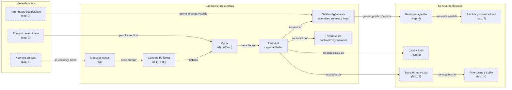

::: {.fasciculo-subtitle}
Facsímil 1 · Los cimientos
:::

# Capítulo 05: Redes neuronales: capas, arquitectura y flujo

## Entrando en el tema

En el capítulo anterior construiste una neurona. Una. Tres entradas, tres pesos, un sesgo y una salida. Funciona. Pero una neurona sola no llega muy lejos: puede trazar una línea recta entre dos grupos de puntos y poco más.

El salto empieza cuando conectas neuronas entre sí. Miles, millones, miles de millones de ellas. Organizadas en capas, cada una transformando los datos un poco más, pasando el resultado a la siguiente. Como una cadena de montaje donde cada estación añade una capa de abstracción.

Eso es una red neuronal. Y este capítulo explica cómo se organiza.

## De la neurona a la capa

Una capa es un conjunto de neuronas que reciben las mismas entradas pero tienen sus propios pesos y sesgos.^[Goodfellow, I., Bengio, Y. y Courville, A. (2016). *Deep learning*. MIT Press. https://www.deeplearningbook.org. El capítulo 6 aborda en profundidad las arquitecturas de redes *feedforward*, desde el perceptrón simple hasta las redes profundas modernas.] Si la capa anterior tiene 3 neuronas y esta capa tiene 5, hay 3 × 5 = 15 conexiones, cada una con su propio peso. Más 5 sesgos, uno por neurona.

Cada neurona de la capa hace exactamente lo que viste en el capítulo 4: multiplica entradas por pesos, suma, suma el sesgo, aplica activación. La diferencia es que ahora sus entradas no son los datos originales (como «horas de estudio» o «temperatura»), sino las salidas de las neuronas de la capa anterior.

Y así, capa tras capa, los datos se transforman. Lo que empezó como una fila de números crudos termina como una predicción.

En una red real no solemos escribir neurona por neurona. Escribimos capas con matrices. Si la capa anterior produce un vector de tamaño \(d_{l-1}\) y la capa actual tiene \(d_l\) neuronas, la capa se calcula así:

$$z^{(l)} = W^{(l)}a^{(l-1)} + b^{(l)}$$

$$a^{(l)} = f^{(l)}(z^{(l)})$$

| Símbolo | Forma | Qué significa |
|---|---:|---|
| \(a^{(l-1)}\) | \(d_{l-1}\) | Activaciones que llegan desde la capa anterior. En la primera capa, es el vector de entrada \(x\). |
| \(W^{(l)}\) | \(d_l \times d_{l-1}\) | Matriz de pesos. Una fila por neurona de la capa actual y una columna por entrada recibida. |
| \(b^{(l)}\) | \(d_l\) | Vector de sesgos. Uno por neurona de la capa actual. |
| \(z^{(l)}\) | \(d_l\) | Puntuaciones antes de aplicar activación. |
| \(a^{(l)}\) | \(d_l\) | Salida de la capa después de la activación. |

La regla de ingeniería es simple: **la salida de una capa debe tener la misma dimensión que la entrada esperada por la siguiente**. Si una capa entrega 64 valores, la siguiente necesita una matriz de pesos con 64 columnas. Este contrato parece una minucia, pero es una de las primeras cosas que se comprueban cuando una arquitectura no arranca.

También podemos contar parámetros antes de entrenar:

$$\text{parámetros de la capa } l = d_l \cdot d_{l-1} + d_l$$

El primer término son pesos. El segundo, sesgos. Para una red con capas \([4, 32, 16, 3]\), el conteo sería:

| Conexión | Cálculo | Parámetros |
|---|---:|---:|
| Entrada 4 → Oculta 32 | \(32 \cdot 4 + 32\) | 160 |
| Oculta 32 → Oculta 16 | \(16 \cdot 32 + 16\) | 528 |
| Oculta 16 → Salida 3 | \(3 \cdot 16 + 3\) | 51 |
| **Total** | — | **739** |

Este número no mide inteligencia. Mide coste y capacidad potencial. Si tienes 200 filas de datos y una red con 3 millones de parámetros, probablemente no estás haciendo ciencia: estás dando al modelo demasiadas formas de memorizar.

## La arquitectura de una red

La estructura más básica se llama **perceptrón multicapa** (*MLP*, *multilayer perceptron*). Tiene tres tipos de capas:

```
Capa de entrada → Capa(s) oculta(s) → Capa de salida
```

**Capa de entrada.** No hace cálculos. Simplemente recibe los datos y los distribuye a la primera capa oculta. Si tu *dataset* tiene 10 columnas, tu capa de entrada tiene 10 neuronas. Una por *feature*.

**Capas ocultas.** Aquí ocurre el aprendizaje. Una red puede tener una, diez o cien capas ocultas. Cada una transforma la representación de los datos en algo ligeramente más abstracto. Son «ocultas» porque no las ves desde fuera: solo ves lo que entra y lo que sale.

**Capa de salida.** Produce la predicción final. Si estás clasificando imágenes de dígitos (0-9), tu capa de salida tendrá 10 neuronas, una por clase, con softmax como activación. Si estás prediciendo el precio de una casa, tendrá 1 neurona, sin activación (o con activación lineal).

Para diseñarla con criterio, no empieces preguntando «¿cuántas capas pongo?». Empieza por el contrato del problema:

| Pregunta de diseño | Decisión técnica | Ejemplo |
|---|---|---|
| ¿Cuántas variables entran? | Tamaño de la capa de entrada. | 24 columnas numéricas y categóricas codificadas → entrada de 24 dimensiones. |
| ¿Qué debe salir? | Tamaño y activación de salida. | Binario → 1 salida + sigmoide. Multiclase excluyente → \(k\) salidas + softmax. Regresión → 1 salida lineal. |
| ¿Cuánta no linealidad necesito? | Número de capas ocultas. | Datos tabulares sencillos: 1-3 capas. Imagen, audio o lenguaje: arquitecturas especializadas. |
| ¿Cuánta capacidad puedo permitirme? | Ancho de cada capa y número total de parámetros. | 64 neuronas pueden bastar para un clasificador interno; millones de parámetros exigen más datos y GPU. |
| ¿Cómo voy a medir si funciona? | Métrica y conjunto de validación antes de entrenar. | Accuracy sola no basta si las clases están desbalanceadas; mira F1, recall, calibración o error absoluto según tarea. |

Esta tabla evita una trampa común: diseñar una red como quien elige muebles. En ingeniería, arquitectura no es estética; es una hipótesis medible sobre datos, tarea, capacidad y coste.

<svg xmlns="http://www.w3.org/2000/svg" viewBox="0 0 980 620" role="img" aria-label="De datos crudos a predicción: una red transforma variables en representaciones y salida">
  <title>De datos crudos a predicción en una red neuronal</title>
  <defs>
    <marker id="f1c05-arrow" viewBox="0 0 10 10" refX="9" refY="5" markerWidth="6" markerHeight="6" orient="auto"><path d="M 0 0 L 10 5 L 0 10 z" fill="#333333"/></marker>
  </defs>
  <rect x="20" y="20" width="940" height="570" rx="18" fill="#FFFFFF" stroke="#111111" stroke-width="1.4"/>
  <text x="490" y="58" text-anchor="middle" font-family="Arial, sans-serif" font-size="24" font-weight="700" fill="#111111">De datos crudos a predicción</text>
  <text x="490" y="84" text-anchor="middle" font-family="Arial, sans-serif" font-size="13" fill="#666666">La red no guarda la fila original: aprende transformaciones que convierten números en una representación útil.</text>
  <g font-family="Arial, sans-serif">
    <rect x="60" y="122" width="188" height="326" rx="14" fill="#F5F5F5" stroke="#111111" stroke-width="1.4"/>
    <text x="154" y="150" text-anchor="middle" font-size="16" font-weight="700" fill="#111111">Datos crudos</text>
    <text x="154" y="173" text-anchor="middle" font-size="12" fill="#555555">una fila del dataset</text>
    <rect x="84" y="202" width="140" height="36" rx="7" fill="#FFFFFF" stroke="#333333"/>
    <rect x="84" y="250" width="140" height="36" rx="7" fill="#FFFFFF" stroke="#333333"/>
    <rect x="84" y="298" width="140" height="36" rx="7" fill="#FFFFFF" stroke="#333333"/>
    <rect x="84" y="346" width="140" height="36" rx="7" fill="#FFFFFF" stroke="#333333"/>
    <text x="101" y="225" font-size="12" fill="#555555">m²</text><text x="207" y="225" text-anchor="end" font-family="Menlo, monospace" font-size="13" fill="#111111">92</text>
    <text x="101" y="273" font-size="12" fill="#555555">habitaciones</text><text x="207" y="273" text-anchor="end" font-family="Menlo, monospace" font-size="13" fill="#111111">3</text>
    <text x="101" y="321" font-size="12" fill="#555555">barrio</text><text x="207" y="321" text-anchor="end" font-family="Menlo, monospace" font-size="13" fill="#111111">42</text>
    <text x="101" y="369" font-size="12" fill="#555555">antigüedad</text><text x="207" y="369" text-anchor="end" font-family="Menlo, monospace" font-size="13" fill="#111111">12</text>
    <text x="154" y="417" text-anchor="middle" font-size="12" fill="#555555">variables con escalas distintas</text>
  </g>
  <line x1="248" y1="285" x2="296" y2="285" stroke="#333333" stroke-width="1.5" marker-end="url(#f1c05-arrow)"/>
  <g font-family="Arial, sans-serif">
    <rect x="304" y="122" width="150" height="326" rx="14" fill="#FFFFFF" stroke="#111111" stroke-width="1.4"/>
    <text x="379" y="150" text-anchor="middle" font-size="16" font-weight="700" fill="#111111">Entrada</text>
    <text x="379" y="173" text-anchor="middle" font-size="12" fill="#555555">vector normalizado</text>
    <rect x="331" y="205" width="96" height="172" rx="12" fill="#F5F5F5" stroke="#333333"/>
    <text x="379" y="237" text-anchor="middle" font-family="Menlo, monospace" font-size="13" fill="#111111">x1 = 0,62</text>
    <text x="379" y="270" text-anchor="middle" font-family="Menlo, monospace" font-size="13" fill="#111111">x2 = 0,33</text>
    <text x="379" y="303" text-anchor="middle" font-family="Menlo, monospace" font-size="13" fill="#111111">x3 = 0,71</text>
    <text x="379" y="336" text-anchor="middle" font-family="Menlo, monospace" font-size="13" fill="#111111">x4 = 0,28</text>
  </g>
  <line x1="454" y1="285" x2="500" y2="285" stroke="#333333" stroke-width="1.5" marker-end="url(#f1c05-arrow)"/>
  <g stroke="#CFCFCF" stroke-width="1">
    <line x1="539" y1="205" x2="681" y2="180"/><line x1="539" y1="205" x2="681" y2="245"/><line x1="539" y1="205" x2="681" y2="310"/><line x1="539" y1="205" x2="681" y2="375"/>
    <line x1="539" y1="260" x2="681" y2="180"/><line x1="539" y1="260" x2="681" y2="245"/><line x1="539" y1="260" x2="681" y2="310"/><line x1="539" y1="260" x2="681" y2="375"/>
    <line x1="539" y1="315" x2="681" y2="180"/><line x1="539" y1="315" x2="681" y2="245"/><line x1="539" y1="315" x2="681" y2="310"/><line x1="539" y1="315" x2="681" y2="375"/>
    <line x1="539" y1="370" x2="681" y2="180"/><line x1="539" y1="370" x2="681" y2="245"/><line x1="539" y1="370" x2="681" y2="310"/><line x1="539" y1="370" x2="681" y2="375"/>
    <line x1="719" y1="180" x2="838" y2="250"/><line x1="719" y1="245" x2="838" y2="250"/><line x1="719" y1="310" x2="838" y2="250"/><line x1="719" y1="375" x2="838" y2="250"/>
    <line x1="719" y1="180" x2="838" y2="330"/><line x1="719" y1="245" x2="838" y2="330"/><line x1="719" y1="310" x2="838" y2="330"/><line x1="719" y1="375" x2="838" y2="330"/>
  </g>
  <g fill="#FFFFFF" stroke="#111111" stroke-width="1.7">
    <circle cx="522" cy="205" r="18"/><circle cx="522" cy="260" r="18"/><circle cx="522" cy="315" r="18"/><circle cx="522" cy="370" r="18"/>
    <circle cx="700" cy="180" r="19"/><circle cx="700" cy="245" r="19"/><circle cx="700" cy="310" r="19"/><circle cx="700" cy="375" r="19"/>
    <circle cx="856" cy="250" r="21" fill="#F5F5F5"/><circle cx="856" cy="330" r="21" fill="#F5F5F5"/>
  </g>
  <g font-family="Arial, sans-serif" fill="#111111">
    <text x="522" y="150" text-anchor="middle" font-size="15" font-weight="700">Capa 1</text>
    <text x="522" y="466" text-anchor="middle" font-size="12" fill="#555555">rasgos simples</text>
    <text x="700" y="150" text-anchor="middle" font-size="15" font-weight="700">Capa 2</text>
    <text x="700" y="466" text-anchor="middle" font-size="12" fill="#555555">combinaciones</text>
    <text x="856" y="150" text-anchor="middle" font-size="15" font-weight="700">Salida</text>
    <text x="856" y="466" text-anchor="middle" font-size="12" fill="#555555">valor o clase</text>
  </g>
  <rect x="468" y="494" width="266" height="42" rx="10" fill="#F5F5F5" stroke="#333333" stroke-width="1"/>
  <text x="601" y="520" text-anchor="middle" font-family="Menlo, monospace" font-size="13" fill="#111111">a(l) = f(W(l) a(l-1) + b(l))</text>
  <line x1="877" y1="290" x2="904" y2="290" stroke="#333333" stroke-width="1.5" marker-end="url(#f1c05-arrow)"/>
  <rect x="912" y="218" width="30" height="144" rx="8" fill="#FFFFFF" stroke="#111111" stroke-width="1.2"/>
  <rect x="922" y="244" width="10" height="82" rx="5" fill="#111111"/>
  <text x="927" y="389" text-anchor="middle" font-family="Arial, sans-serif" font-size="12" fill="#555555">ŷ</text>
  <text x="490" y="568" text-anchor="middle" font-family="Arial, sans-serif" font-size="12" fill="#666666">Los pesos W y sesgos b son lo que se aprende: cambian la transformación, no el formato de la fila.</text>
  <text x="940" y="592" text-anchor="end" font-family="Arial, sans-serif" font-size="10" fill="#9A9A9A">IA para gente curiosa / Facsímil 01 / Capítulo 05 / 686f6c61</text>
</svg>

## Qué aprende cada capa

Una de las intuiciones más poderosas del *deep learning* es que las capas aprenden representaciones jerárquicas. No es una metáfora: es lo que se observa empíricamente al visualizar las activaciones de redes entrenadas.^[LeCun, Y., Bengio, Y. y Hinton, G. (2015). Deep learning. *Nature*, 521(7553), 436-444. https://doi.org/10.1038/nature14539. Los autores describen cómo las redes profundas aprenden representaciones jerárquicas: desde bordes y texturas en las primeras capas hasta partes de objetos y conceptos completos en las capas profundas.]

**Capas tempranas.** Detectan los patrones más elementales. En visión: bordes, colores, orientaciones. En texto: combinaciones de letras, prefijos y sufijos frecuentes. Son patrones que aparecen en cualquier imagen o texto, independientemente del contenido.

**Capas intermedias.** Combinan los patrones simples en conceptos más complejos. En visión: formas, texturas, partes de objetos (una rueda, un ojo, una esquina). En texto: frases hechas, relaciones sintácticas entre palabras.

**Capas profundas.** Abstracciones de alto nivel. En visión: objetos completos, rostros, escenas. En texto: significado semántico, intención del hablante, estructura argumental.

Esta jerarquía explica por qué el *transfer learning* funciona: las primeras capas de una red entrenada para reconocer imágenes sirven para casi cualquier tarea visual. Los bordes son bordes en todas partes. Son las capas profundas las que necesitan especializarse.^[Krizhevsky, A., Sutskever, I. y Hinton, G. E. (2012). ImageNet classification with deep convolutional neural networks. En *Advances in Neural Information Processing Systems 25* (pp. 1097-1105). https://papers.nips.cc/paper/4824. AlexNet demostró que las características aprendidas por las capas tempranas de una CNN son transferibles entre tareas visuales, sentando las bases del *transfer learning* moderno.]

## Qué significa «deep» en *deep learning*

«*Deep*» significa «muchas capas». Una red con dos o tres capas es *shallow* (superficial). Una con decenas o cientos es *deep*. No hay un umbral oficial: la profundidad es una cuestión de grado.

Más capas permiten más abstracción, pero también traen problemas:
- **Más parámetros que entrenar**: más memoria, más computación, más datos necesarios.
- **Gradientes que se desvanecen**: en redes muy profundas, el gradiente puede hacerse tan pequeño en las primeras capas que dejan de aprender. Las funciones de activación como ReLU y arquitecturas como ResNet mitigan esto.^[He, K., Zhang, X., Ren, S. y Sun, J. (2016). Deep residual learning for image recognition. En *Proceedings of the IEEE Conference on Computer Vision and Pattern Recognition* (pp. 770-778). https://doi.org/10.1109/CVPR.2016.90. Las conexiones residuales permiten que el gradiente fluya directamente a través de las capas, resolviendo el problema del desvanecimiento en redes de más de cien capas.]

La decisión de cuántas capas usar no es arbitraria: depende del problema, de los datos disponibles y del presupuesto computacional. Más capas no siempre es mejor. Pero cuando tienes datos masivos y tareas complejas —como procesar lenguaje natural—, la profundidad marca la diferencia.

## Cómo fluyen los datos

El viaje de los datos a través de una red se llama **propagación hacia delante** (*forward pass*). Es determinista: dados los mismos datos de entrada y los mismos pesos, la salida es siempre la misma.

En el *forward pass*, cada capa:
1. Recibe un vector de números de la capa anterior.
2. Multiplica cada entrada por su peso correspondiente.
3. Suma todo y añade el sesgo.
4. Aplica la función de activación.
5. Pasa el resultado a la capa siguiente.

Al final de la última capa, tienes una predicción. En el siguiente capítulo veremos cómo, a partir del error de esa predicción, la red ajusta todos sus pesos hacia atrás. Pero por ahora, quédate con esto: una red neuronal es simplemente una función matemática compuesta, donde la salida de cada capa es la entrada de la siguiente.

En código de producción suele aparecer una dimensión adicional: el **batch**. No procesas una sola fila, sino muchas a la vez. Si tienes 128 ejemplos y cada uno tiene 24 variables, la entrada puede tener forma \(128 \times 24\). La capa no cambia su contrato interno: sigue esperando 24 columnas. Lo que cambia es que calcula 128 casos en paralelo.

| Objeto | Forma típica | Lectura |
|---|---:|---|
| Entrada de un ejemplo | \(24\) | Una fila con 24 variables. |
| Batch de entrada | \(128 \times 24\) | 128 filas a la vez. |
| Pesos de la primera capa | \(64 \times 24\) | 64 neuronas, cada una mira las 24 variables. |
| Salida de la primera capa | \(128 \times 64\) | 128 filas, ahora representadas con 64 activaciones. |
| Salida final binaria | \(128 \times 1\) | Una probabilidad por ejemplo. |

Cuando una librería te devuelve un error de dimensiones, normalmente te está diciendo que una de estas piezas no encaja. Un ingeniero no lo resuelve probando números al azar: imprime formas, revisa contrato y comprueba dónde se rompió la cadena.

## Presupuesto de una arquitectura

Antes de entrenar, puedes hacer una revisión fría de la red: formas, parámetros y memoria aproximada. No predice la calidad final, pero evita diseños absurdos.

Imagina un clasificador para priorizar tickets internos. Cada ticket ya está convertido a 48 variables numéricas: señales del usuario, categoría, antigüedad, canal, idioma y métricas históricas. La salida tiene 3 clases: baja, media y alta.

| Arquitectura | Capas | Parámetros | Lectura |
|---|---|---:|---|
| MLP pequeño | \(48 \rightarrow 32 \rightarrow 3\) | 1.667 | Buen primer modelo. Barato, fácil de depurar y suficiente si las señales son fuertes. |
| MLP medio | \(48 \rightarrow 128 \rightarrow 64 \rightarrow 3\) | 14.723 | Más capacidad. Tiene sentido si hay bastantes ejemplos y relaciones no lineales. |
| MLP excesivo | \(48 \rightarrow 1024 \rightarrow 1024 \rightarrow 3\) | 1.102.851 | Puede funcionar, pero con pocos datos memorizará. También aumenta latencia, memoria y coste. |

La comparación importante no es «qué red parece más profesional», sino qué red puedes justificar con datos. Si tienes 5.000 ejemplos limpios, empezar por un MLP pequeño o medio es razonable. Si tienes 200 ejemplos y clases desbalanceadas, el problema no se arregla con más capas: se arregla revisando datos, particiones, métrica y quizá usando un modelo más simple.

## En el día a día

Cuando usas un LLM, no eliges cuántas capas tiene. El proveedor ya lo decidió por ti. Pero entender la arquitectura te permite tomar mejores decisiones:

**Elegir el tamaño de modelo adecuado.** Un modelo de 7B parámetros tiene menos capas (o capas más pequeñas) que uno de 70B. Más capas significan más capacidad de abstracción, pero también más latencia y más coste. Si tu tarea es clasificar el sentimiento de reseñas de producto, un modelo pequeño probablemente baste. Si necesitas análisis jurídico sobre documentos de cien páginas, necesitas profundidad, contexto y evaluación específica.

**Hacer *fine-tuning* con criterio.** Cuando ajustas un modelo pre-entrenado, la pregunta no es solo «qué capas entreno». En visión clásica sí era habitual congelar capas tempranas y entrenar capas finales. En LLMs modernos muchas veces se usan adaptadores, LoRA, QLoRA o entrenamiento parcial de módulos concretos, porque tocar todos los pesos es caro y puede degradar capacidades previas. La idea de fondo es la misma: decidir qué parte de la arquitectura permites modificar y cómo comprobarás que no empeora lo que ya funcionaba.

**Depurar problemas de entrenamiento.** Si tu *fine-tuning* no converge, entender la arquitectura te ayuda a diagnosticar: ¿tienes demasiadas capas para los datos que tienes? ¿El gradiente se está desvaneciendo en las capas tempranas? ¿La función de activación de la última capa es la adecuada para tu tarea?

## Por qué debería importarte

La arquitectura de una red neuronal no es un detalle de implementación. Es la decisión de diseño más importante después de elegir los datos.

La diferencia entre un MLP de 3 capas y un Transformer de 96 capas no es solo de escala: es cualitativa. El MLP puede clasificar dígitos escritos a mano. El Transformer puede mantener una conversación larga, escribir código y trabajar con documentos extensos dentro de su ventana de contexto. La arquitectura determina qué patrones puede aprender y qué coste tendrá usarlos.

Y sin embargo, ambos se construyen con transformaciones paramétricas diferenciables: matrices, sesgos, no linealidades, normalizaciones y conexiones entre bloques. Lo que cambia es la organización. Por eso este capítulo importa: es el puente entre entender una operación elemental y entender por qué una arquitectura grande es ingeniería de formas, coste y flujo de información.

## Dónde solía tropezar yo

| Error | Por qué es un error | Antídoto |
|---|---|---|
| **Añadir capas sin criterio** | Más capas no siempre mejoran el rendimiento. Pueden causar *overfitting* si no tienes suficientes datos, o *underfitting* si el gradiente se desvanece. | Empieza con una arquitectura sencilla y añade complejidad solo cuando los datos y la tarea lo justifiquen. Mide el rendimiento en validación, no en entrenamiento. |
| **Ignorar la función de activación de la capa de salida** | Usar ReLU en la salida de un clasificador binario produce valores sin sentido. Usar softmax para regresión fuerza una distribución de probabilidad donde no aplica. | Elige la activación según la tarea: sigmoide para binario, softmax para multiclase, lineal para regresión, ninguna para valores sin restricción. |
| **Creer que las capas profundas «entienden» conceptos humanos** | Una capa profunda puede activarse fuertemente ante «gatos», pero no «sabe» qué es un gato. Reconoce un patrón estadístico, no un concepto. | No interpretes las activaciones como comprensión. Son correlaciones aprendidas. La interpretabilidad requiere técnicas específicas (facsímil 7). |
| **Olvidar que el *forward pass* es determinista** | Si obtienes resultados distintos con los mismos datos y pesos, el problema no está en la red. Está en el preprocesamiento, en el *batch* o en el muestreo posterior. | Aísla cada componente. El *forward pass* de una red con pesos fijos es determinista. Si hay variabilidad, búscala fuera. |
| **No mirar las formas de los tensores** | Muchos errores no son conceptuales: una capa entrega 128 valores y la siguiente espera 64, o la salida tiene 10 clases y la etiqueta viene como binaria. | Antes de entrenar, escribe la secuencia de dimensiones y cuenta parámetros. Si no puedes hacerlo en papel, tampoco lo depurarás bien en código. |
| **Confundir más parámetros con más rigor** | Una red grande puede parecer más seria, pero si el conjunto de datos es pequeño solo aumenta la capacidad de memorizar ruido. | Compara parámetros con ejemplos disponibles, mira validación y mantén una arquitectura base sencilla como control. |

## Manos a la obra

La práctica útil de este capítulo no es entrenar una red grande: es **auditar una arquitectura antes de entrenarla**. He dejado un kit ejecutable en `labs/f1/c05-architecture-budget/` que calcula formas, parámetros, memoria aproximada y una señal de riesgo comparando parámetros con ejemplos disponibles.

```bash
cd labs/f1/c05-architecture-budget
python3 ops/audit_architectures.py --write
cat output/architecture_decision.md
```

Como mini proyecto reproducible:

```bash
cd labs/f1/c05-architecture-budget
make run
make test
```

El kit contiene varios candidatos: un MLP pequeño para tickets, un MLP medio, un diseño excesivo para pocos datos y un caso inválido que rompe el contrato de salida. La idea no es que memorices esos números, sino que aprendas a defender una arquitectura antes de gastar GPU.

Además de datos, contrato y script, el kit incluye `Makefile`, `requirements.txt` y `tests/test_architecture_budget.py`. La prueba comprueba que se calculan parámetros, que aparecen advertencias cuando toca y que el informe habla de capacidad con números.

**Qué deberías mirar.**

| Campo | Qué te dice | Por qué importa |
|---|---|---|
| `layer_shapes` | Forma de cada matriz de pesos. | Verifica que cada capa encaja con la anterior. |
| `total_parameters` | Pesos + sesgos de toda la red. | Aproxima capacidad, memoria y riesgo de sobreajuste. |
| `memory_estimate` | Memoria mínima aproximada de pesos en FP32, BF16 e INT8. | No incluye activaciones ni optimizador, pero sirve para comparar diseños. |
| `examples_per_parameter` | Relación entre ejemplos disponibles y parámetros. | Si es muy baja, la arquitectura merece sospecha. |
| `status` | `ok`, `warning` o `invalid`. | Resume si el diseño se puede justificar con el contrato actual. |

**Cómo lo adaptas a tu caso.** Cambia `data/architecture_candidates.json`: define `input_dim`, `output_dim`, `task`, `hidden_layers`, `training_examples` y `class_balance`. Después ejecuta el informe y defiende por qué elegirías una arquitectura frente a otra.

TensorFlow Playground sigue siendo útil para intuición visual.^[TensorFlow Playground. https://playground.tensorflow.org. Una herramienta educativa que visualiza en tiempo real el entrenamiento de redes neuronales sobre conjuntos de datos sintéticos.] Úsalo como complemento: empieza con una capa oculta de 2 neuronas, prueba un *dataset* circular, añade capas y cambia ReLU por Tanh. Pero el entregable de ingeniería es el informe del kit: contrato, parámetros, coste y decisión.

**Qué entregaría un alumno.** El Markdown generado, una arquitectura nueva justificada, una explicación de por qué su salida coincide con la tarea, el resultado de `make test` y una decisión escrita: entrenar, simplificar, recoger más datos o cambiar de familia de modelo.

## Cómo encaja todo

Este capítulo es el puente entre una neurona aislada y una red entrenable. Hereda del capítulo 4 la operación mínima \(y=f(w^Tx+b)\), pero la convierte en una arquitectura: matrices, capas, formas, activaciones y salida. Esa arquitectura no aprende todavía; solo calcula. Aprenderá en el capítulo 6, cuando la pérdida viaje hacia atrás y modifique pesos.

La idea que conviene guardar es esta: una red neuronal es una función compuesta con contratos de forma. Si respetas esos contratos, puedes apilar capas, medir coste y elegir salidas coherentes con la tarea. Si no los respetas, el modelo no falla por misterioso: falla porque la ingeniería básica no encaja.



## Vocabulario aprendido

| Término | Definición |
|---|---|
| **Red neuronal** | Grafo dirigido de neuronas artificiales organizadas en capas que transforman datos secuencialmente. |
| **Capa** | Conjunto de neuronas que reciben las mismas entradas y producen salidas que alimentan la capa siguiente. |
| **Capa oculta** | Capa intermedia entre la entrada y la salida. Transforma los datos en representaciones progresivamente más abstractas. |
| **MLP** (*multilayer perceptron*) | Arquitectura donde cada neurona de una capa se conecta con todas las neuronas de la capa siguiente. |
| ***Deep learning*** | Entrenamiento de redes con muchas capas (decenas o cientos) que aprenden jerarquías de representaciones. |
| ***Forward pass*** | Recorrido de los datos desde la entrada hasta la salida. Es determinista: mismos pesos, misma salida. |
| **Matriz de pesos** | Conjunto de pesos de una capa escrito como matriz \(W\). Su forma \(d_l \times d_{l-1}\) define cuántas entradas recibe cada neurona y cuántas neuronas tiene la capa. |
| **Ancho** | Número de neuronas de una capa. Aumenta capacidad y coste. |
| **Profundidad** | Número de capas con parámetros. Permite composiciones más complejas, pero complica entrenamiento y depuración. |
| **Contrato de forma** | Requisito de que la salida de una capa tenga la dimensión que espera la siguiente. Es una validación básica antes de entrenar. |
| **Presupuesto de parámetros** | Conteo de pesos y sesgos de la arquitectura. Sirve para comparar capacidad, memoria aproximada y riesgo de sobreajuste. |

## Antes de pasar página

- [ ] ¿Puedo dibujar (mentalmente o en papel) la estructura de una red neuronal con capa de entrada, dos ocultas y una de salida? (Si no, vuelve al diagrama en «La arquitectura de una red».)
- [ ] ¿Puedo escribir la fórmula de una capa \(a^{(l)}=f(W^{(l)}a^{(l-1)}+b^{(l)})\) y explicar la forma de \(W\)? (Si no, vuelve a «De la neurona a la capa».)
- [ ] ¿Entiendo qué aprende cada capa y por qué las capas tempranas son más genéricas? (Si no, vuelve a «Qué aprende cada capa».)
- [ ] ¿Sé qué significa «deep» en *deep learning* y qué problemas trae? (Si no, vuelve a «Qué significa deep».)
- [ ] ¿Puedo explicar el *forward pass*? (Si no, vuelve a «Cómo fluyen los datos».)
- [ ] ¿He ejecutado `labs/f1/c05-architecture-budget/` y puedo defender una arquitectura con parámetros, formas y salida? (Si no, vuelve a «Manos a la obra».)

## En resumen

| Idea fuerza | Detalle |
|---|---|
| Una red neuronal es una composición de capas. | Cada capa aplica una transformación \(W a + b\), una activación y entrega una nueva representación. |
| Las dimensiones son contrato, no decoración. | Si una capa produce 64 valores, la siguiente debe aceptar 64 entradas. Muchos errores reales empiezan ahí. |
| Los parámetros se pueden contar antes de entrenar. | \(d_l \cdot d_{l-1} + d_l\) por capa. Ese conteo ayuda a razonar sobre memoria, datos necesarios y riesgo de sobreajuste. |
| Profundidad y ancho son decisiones de ingeniería. | Más capas o más neuronas pueden dar más capacidad, pero también más coste, más latencia y más superficie de fallo. |
| El capítulo 6 necesita este capítulo. | La retropropagación solo tiene sentido cuando sabes qué pesos, sesgos y capas debe actualizar. |

## Para saber más

Goodfellow, I., Bengio, Y. y Courville, A. (2016). *Deep learning*. MIT Press. https://www.deeplearningbook.org

He, K., Zhang, X., Ren, S. y Sun, J. (2016). Deep residual learning for image recognition. En *Proceedings of the IEEE Conference on Computer Vision and Pattern Recognition* (pp. 770-778). https://doi.org/10.1109/CVPR.2016.90

Krizhevsky, A., Sutskever, I. y Hinton, G. E. (2012). ImageNet classification with deep convolutional neural networks. En *Advances in Neural Information Processing Systems 25* (pp. 1097-1105). https://papers.nips.cc/paper/4824

LeCun, Y., Bengio, Y. y Hinton, G. (2015). Deep learning. *Nature*, 521(7553), 436-444. https://doi.org/10.1038/nature14539

Nielsen, M. (2015). *Neural networks and deep learning*. http://neuralnetworksanddeeplearning.com

Rumelhart, D. E., Hinton, G. E. y Williams, R. J. (1986). Learning representations by back-propagating errors. *Nature*, 323(6088), 533-536. https://doi.org/10.1038/323533a0

Russell, S. y Norvig, P. (2021). *Artificial intelligence: a modern approach* (4.ª ed.). Pearson.

Vaswani, A., Shazeer, N., Parmar, N., Uszkoreit, J., Jones, L., Gomez, A. N., Kaiser, L. y Polosukhin, I. (2017). Attention is all you need. En *Advances in Neural Information Processing Systems 30*. https://arxiv.org/abs/1706.03762
