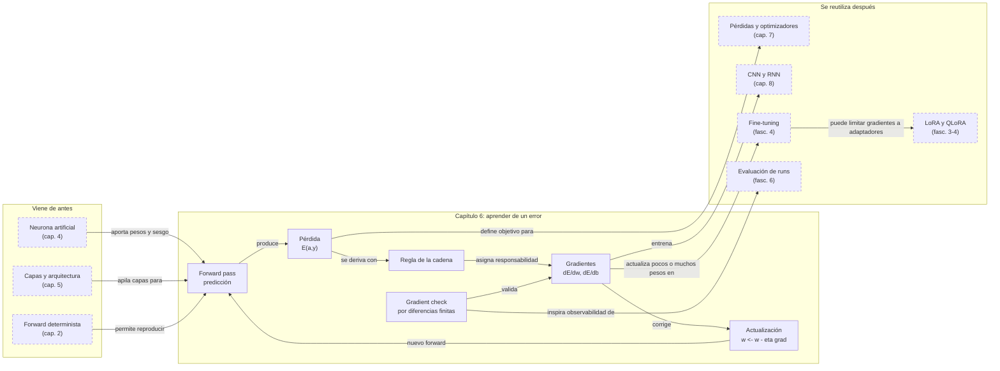

::: {.fasciculo-subtitle}
Facsímil 1 · Los cimientos
:::

# Capítulo 06: Cómo aprende una red: retropropagación

## Entrando en el tema

Imagina que estás en una montaña con niebla cerrada. No ves el valle. No ves el camino. Pero puedes sentir la pendiente bajo tus pies. Sabes, en cada punto, hacia dónde baja el terreno. Das un paso en esa dirección. Vuelves a tantear. Otro paso. Así, a ciegas pero con información local, acabas llegando al punto más bajo.

Eso es exactamente lo que hace una red neuronal cuando aprende. El «valle» es el mínimo de la función de pérdida —el punto donde el error es más pequeño—. La «pendiente» es el gradiente. Y los «pasos» son las actualizaciones de los pesos.

El algoritmo que calcula esa pendiente se llama **retropropagación** (*backpropagation*).^[Rumelhart, D. E., Hinton, G. E. y Williams, R. J. (1986). Learning representations by back-propagating errors. *Nature*, 323(6088), 533-536. https://doi.org/10.1038/323533a0. Este artículo demostró que la retropropagación permitía entrenar redes con capas ocultas, resolviendo el problema que Minsky y Papert habían señalado en 1969 y abriendo la puerta al *deep learning* moderno.] Es el motor del aprendizaje profundo. Sin él, las redes de más de dos capas no podrían entrenarse. Con él, una red de cien capas ajusta todos sus parámetros en cada iteración.

Este capítulo es denso. Respira hondo. Vamos a desmenuzarlo pieza a pieza.

## El bucle de entrenamiento

Entrenar una red neuronal es un bucle de cuatro pasos que se repite millones de veces:

```
1. Forward pass → 2. Calcular pérdida → 3. Backward pass → 4. Actualizar pesos → (repetir)
```

En pseudocódigo:

```python
for epoch in range(num_epochs):
    for batch in dataloader:
        optimizer.zero_grad()                      # Reset antes de acumular
        prediction = model.forward(batch.input)   # 1. Forward
        loss = loss_fn(prediction, batch.target)   # 2. Pérdida
        loss.backward()                            # 3. Gradientes
        optimizer.step()                           # 4. Actualizar
```

Cuatro líneas de código. Miles de millones de ejecuciones. Así se entrenan los LLMs.

Cada paso merece su propia explicación:

**1. Forward pass.** Los datos atraviesan la red de izquierda a derecha. Capa a capa, neurona a neurona. Al final, obtienes una predicción. Es determinista: mismos pesos, misma salida. Lo vimos en el capítulo 5.

**2. Calcular la pérdida.** Comparas la predicción con la respuesta real. ¿Cuánto se ha equivocado el modelo? La función de pérdida te da un número. Si la predicción es perfecta, la pérdida es cero. Cuanto mayor es el error, mayor es la pérdida.^[Goodfellow, I., Bengio, Y. y Courville, A. (2016). *Deep learning*. MIT Press. https://www.deeplearningbook.org. El capítulo 6.2 aborda en detalle cómo las funciones de pérdida cuantifican el error y guían el aprendizaje mediante el gradiente.]

**3. Backward pass.** Aquí está la parte importante. El error viaja hacia atrás, de derecha a izquierda, desde la salida hasta la entrada. En cada neurona, en cada peso, el algoritmo calcula cuánto contribuyó ese parámetro al error total. Esto se llama **gradiente**. La herramienta matemática que lo permite es la **regla de la cadena** del cálculo.

**4. Actualizar pesos.** Conoces el gradiente. Sabes en qué dirección modificar cada peso para reducir el error. Aplicas un pequeño ajuste en esa dirección. La magnitud del ajuste la controla el *learning rate*: un paso demasiado grande y te pasas del mínimo; demasiado pequeño y tardas una eternidad en llegar.

## La cadena completa: qué significa cada símbolo

Antes de lanzarnos a las derivadas, necesitamos ponernos de acuerdo en el vocabulario. Vamos a seguir el viaje de un solo dato a través de una neurona con activación sigmoide.^[McCulloch, W. S. y Pitts, W. (1943). A logical calculus of the ideas immanent in nervous activity. *The Bulletin of Mathematical Biophysics*, 5(4), 115-133. https://doi.org/10.1007/BF02478259. Este artículo fundacional estableció el modelo de neurona como unidad de cómputo con entradas ponderadas y umbral de activación, el ancestro conceptual de la neurona artificial moderna.] Es el ejemplo más simple posible, pero contiene toda la mecánica que se repite en redes de miles de millones de parámetros.

| Símbolo | Nombre | Significado | En el ejemplo |
|---|---|---|---|
| \\(x\\) | Entrada | El dato que llega a la neurona. Puede ser una *feature* del *dataset* o la salida de una capa anterior. | \\(x = 2\\) |
| \\(w\\) | Peso | Número aprendido que pondera la entrada. Si cambia, cambia la predicción. | \\(w = 0{,}40\\) |
| \\(b\\) | Sesgo | Ajuste aprendido independiente de la entrada. Permite desplazar la salida. | \\(b = -0{,}10\\) |
| \\(z\\) | Preactivación | Suma lineal antes de aplicar la activación. \\(z = wx + b\\). Es la puntuación cruda. | \\(z = 0{,}40 \times 2 - 0{,}10 = 0{,}70\\) |
| \\(\\sigma\\) | Sigmoide | Función que comprime \\(z\\) al intervalo \\((0,1)\\). \\(\\sigma(z) = \\frac{1}{1 + e^{-z}}\\). | — |
| \\(a\\) | Activación | Salida de la neurona tras aplicar la activación. \\(a = \\sigma(z)\\). | \\(a \\approx 0{,}668\\) |
| \\(y\\) | Etiqueta real | La respuesta correcta del ejemplo de entrenamiento. | \\(y = 1\\) |
| \\(E\\) | Error (pérdida) | Medida numérica del fallo. Aquí usamos MSE: \\(E = \\frac{1}{2}(a - y)^2\\). | \\(E \\approx 0{,}055\\) |
| \\(\\eta\\) | *Learning rate* | Tamaño del paso al actualizar. La dirección la marca el gradiente. | \\(\\eta = 0{,}1\\) |

Dos aclaraciones importantes:

**No confundas \\(z\\) y \\(a\\).** \\(z\\) es la puntuación cruda antes de la activación. Puede ser negativa, grande, pequeña. \\(a\\) es la salida ya transformada por la sigmoide, siempre entre 0 y 1. El error se calcula con \\(a\\), no con \\(z\\): comparamos la predicción final con la realidad.

**No entrenamos contra \\(z\\).** La pérdida \\(E\\) compara \\(a\\) con \\(y\\). Pero para ajustar \\(w\\) y \\(b\\) necesitamos saber cómo afectan a \\(E\\). Y \\(w\\) y \\(b\\) afectan a \\(z\\), no directamente a \\(a\\). Por eso necesitamos la regla de la cadena: para propagar el error desde \\(a\\) hasta \\(z\\), y desde \\(z\\) hasta \\(w\\) y \\(b\\).

## Forward pass: la predicción

Con los números del ejemplo, el *forward pass* es:

$$x = 2, \\quad w = 0{,}40, \\quad b = -0{,}10, \\quad y = 1$$

$$z = w \\cdot x + b = 0{,}40 \\times 2 + (-0{,}10) = 0{,}70$$

$$a = \\sigma(z) = \\frac{1}{1 + e^{-0{,}70}} \\approx 0{,}668$$

$$E = \\frac{1}{2}(a - y)^2 = \\frac{1}{2}(0{,}668 - 1)^2 \\approx 0{,}055$$

La neurona predice 0,668. La respuesta correcta es 1. La predicción se queda corta. Queremos empujar la salida hacia arriba: necesitamos que \\(a\\) se acerque a 1.

## Backward pass: cómo viaja el error hacia atrás

El objetivo del *backward pass* es calcular cuatro gradientes:

$$\\frac{\\partial E}{\\partial a}, \\quad \\frac{\\partial E}{\\partial z}, \\quad \\frac{\\partial E}{\\partial w}, \\quad \\frac{\\partial E}{\\partial b}$$

Cada uno responde a una pregunta: «si cambio un poco esto, ¿cuánto cambia el error?». Se leen como derivadas parciales: la letra \\(\\partial\\) indica que solo estamos variando una variable y manteniendo el resto constantes.

Vamos paso a paso, de derecha a izquierda.

### Paso 1: error respecto a la salida

$$\\frac{\\partial E}{\\partial a}$$

Usamos la pérdida MSE: \\(E = \\frac{1}{2}(a - y)^2\\). Su derivada respecto a \\(a\\) es directa:

$$\\frac{\\partial E}{\\partial a} = a - y = 0{,}668 - 1 = -0{,}332$$

**Lectura:** como la predicción es menor que la realidad, el gradiente es negativo. «Si subo \\(a\\), el error \\(E\\) baja». El signo negativo nos dice la dirección correcta. La magnitud (0,332) nos dice cuánto impacto tiene.

### Paso 2: error antes de la activación

$$\\frac{\\partial E}{\\partial z}$$

Aquí entra la regla de la cadena. \\(E\\) depende de \\(a\\), y \\(a\\) depende de \\(z\\) a través de la sigmoide. Por tanto:

$$\\frac{\\partial E}{\\partial z} = \\frac{\\partial E}{\\partial a} \\cdot \\sigma'(z)$$

La derivada de la sigmoide tiene una forma elegante: \\(\\sigma'(z) = \\sigma(z) \\cdot (1 - \\sigma(z)) = a(1 - a)\\).^[LeCun, Y., Bengio, Y. y Hinton, G. (2015). Deep learning. *Nature*, 521(7553), 436-444. https://doi.org/10.1038/nature14539. Los autores explican cómo la derivada de la sigmoide \\(\\sigma'(z) = a(1-a)\\) tiende a cero en los extremos, causando el desvanecimiento del gradiente en redes profundas, y cómo ReLU mitiga este problema.] En nuestro caso:

$$\\sigma'(z) = a(1 - a) = 0{,}668 \\times 0{,}332 \\approx 0{,}222$$

$$\\frac{\\partial E}{\\partial z} = -0{,}332 \\times 0{,}222 \\approx -0{,}074$$

**Lectura:** la sigmoide ha atenuado el gradiente. De -0,332 hemos pasado a -0,074. Es la sigmoide diciendo: «en esta zona de la curva, un cambio en \\(z\\) produce un cambio pequeño en \\(a\\)». Esto es el germen del problema del desvanecimiento del gradiente que mencionamos en el capítulo 5.

### Paso 3: culpa asignada al peso

$$\\frac{\\partial E}{\\partial w}$$

\\(E\\) depende de \\(z\\), y \\(z = wx + b\\). La derivada de \\(z\\) respecto a \\(w\\) es simplemente \\(x\\). Regla de la cadena:

$$\\frac{\\partial E}{\\partial w} = \\frac{\\partial E}{\\partial z} \\cdot \\frac{\\partial z}{\\partial w} = \\frac{\\partial E}{\\partial z} \\cdot x$$

$$\\frac{\\partial E}{\\partial w} \\approx -0{,}074 \\times 2 = -0{,}148$$

**Lectura:** el gradiente es negativo. Si aumentamos \\(w\\), el error disminuye. Tiene sentido: la predicción era demasiado baja, y aumentar \\(w\\) aumenta \\(z\\), lo que aumenta \\(a\\), lo que reduce \\(E\\). Además, el gradiente respecto a \\(w\\) es proporcional a \\(x\\): las entradas más grandes reciben actualizaciones más grandes.

### Paso 4: culpa asignada al sesgo

$$\\frac{\\partial E}{\\partial b}$$

\\(z = wx + b\\). La derivada de \\(z\\) respecto a \\(b\\) es 1. Por tanto:

$$\\frac{\\partial E}{\\partial b} = \\frac{\\partial E}{\\partial z} \\cdot \\frac{\\partial z}{\\partial b} = \\frac{\\partial E}{\\partial z} \\cdot 1 \\approx -0{,}074$$

**Lectura:** el gradiente respecto al sesgo es igual al gradiente respecto a \\(z\\). El sesgo se ajusta directamente con la señal de error que llega a la neurona, sin la mediación de la entrada.

<svg xmlns="http://www.w3.org/2000/svg" viewBox="0 0 980 520" role="img" aria-label="Flujo de retropropagación: forward, pérdida, gradientes y actualización">
  <title>Flujo de retropropagación</title>
  <defs>
    <marker id="f1c06-forward" viewBox="0 0 10 10" refX="9" refY="5" markerWidth="6" markerHeight="6" orient="auto"><path d="M 0 0 L 10 5 L 0 10 z" fill="#111111"/></marker>
    <marker id="f1c06-back" viewBox="0 0 10 10" refX="9" refY="5" markerWidth="6" markerHeight="6" orient="auto"><path d="M 0 0 L 10 5 L 0 10 z" fill="#555555"/></marker>
  </defs>
  <rect x="20" y="20" width="940" height="470" rx="18" fill="#FFFFFF" stroke="#111111" stroke-width="1.4"/>
  <text x="490" y="58" text-anchor="middle" font-family="Arial, sans-serif" font-size="23" font-weight="700" fill="#111111">Aprender es recorrer el camino dos veces</text>
  <text x="490" y="84" text-anchor="middle" font-family="Arial, sans-serif" font-size="13" fill="#666666">Primero calculamos la predicción; después propagamos el error hacia atrás para corregir pesos.</text>
  <g font-family="Arial, sans-serif">
    <rect x="70" y="142" width="130" height="72" rx="12" fill="#FFFFFF" stroke="#111111" stroke-width="1.5"/>
    <text x="135" y="171" text-anchor="middle" font-family="Menlo, monospace" font-size="15" font-weight="700" fill="#111111">x = 2</text>
    <text x="135" y="193" text-anchor="middle" font-size="12" fill="#555555">entrada</text>
    <rect x="260" y="142" width="160" height="72" rx="12" fill="#F5F5F5" stroke="#111111" stroke-width="1.5"/>
    <text x="340" y="169" text-anchor="middle" font-family="Menlo, monospace" font-size="14" font-weight="700" fill="#111111">z = wx + b</text>
    <text x="340" y="193" text-anchor="middle" font-family="Menlo, monospace" font-size="13" fill="#555555">z = 0,70</text>
    <rect x="480" y="142" width="150" height="72" rx="12" fill="#FFFFFF" stroke="#111111" stroke-width="1.5"/>
    <text x="555" y="169" text-anchor="middle" font-family="Menlo, monospace" font-size="14" font-weight="700" fill="#111111">a = σ(z)</text>
    <text x="555" y="193" text-anchor="middle" font-family="Menlo, monospace" font-size="13" fill="#555555">a = 0,668</text>
    <rect x="700" y="142" width="170" height="72" rx="12" fill="#F5F5F5" stroke="#111111" stroke-width="1.5"/>
    <text x="785" y="169" text-anchor="middle" font-family="Menlo, monospace" font-size="13" font-weight="700" fill="#111111">E = 1/2(a-y)^2</text>
    <text x="785" y="193" text-anchor="middle" font-family="Menlo, monospace" font-size="13" fill="#555555">E = 0,055</text>
  </g>
  <line x1="200" y1="178" x2="256" y2="178" stroke="#111111" stroke-width="1.6" marker-end="url(#f1c06-forward)"/>
  <line x1="420" y1="178" x2="476" y2="178" stroke="#111111" stroke-width="1.6" marker-end="url(#f1c06-forward)"/>
  <line x1="630" y1="178" x2="696" y2="178" stroke="#111111" stroke-width="1.6" marker-end="url(#f1c06-forward)"/>
  <text x="490" y="124" text-anchor="middle" font-family="Arial, sans-serif" font-size="12" font-weight="700" fill="#555555">FORWARD</text>
  <path d="M785 235 C785 315 555 315 555 235" fill="none" stroke="#555555" stroke-width="1.6" stroke-dasharray="7 5" marker-end="url(#f1c06-back)"/>
  <path d="M555 342 C555 410 340 410 340 235" fill="none" stroke="#555555" stroke-width="1.6" stroke-dasharray="7 5" marker-end="url(#f1c06-back)"/>
  <text x="660" y="302" text-anchor="middle" font-family="Menlo, monospace" font-size="12" fill="#555555">∂E/∂a</text>
  <text x="450" y="395" text-anchor="middle" font-family="Menlo, monospace" font-size="12" fill="#555555">∂E/∂w, ∂E/∂b</text>
  <text x="490" y="338" text-anchor="middle" font-family="Arial, sans-serif" font-size="12" font-weight="700" fill="#555555">BACKWARD</text>
  <rect x="150" y="404" width="330" height="46" rx="10" fill="#F5F5F5" stroke="#333333"/>
  <text x="315" y="432" text-anchor="middle" font-family="Menlo, monospace" font-size="14" fill="#111111">w ← w - η · ∂E/∂w</text>
  <rect x="510" y="404" width="320" height="46" rx="10" fill="#FFFFFF" stroke="#333333"/>
  <text x="670" y="432" text-anchor="middle" font-family="Arial, sans-serif" font-size="13" fill="#555555">El siguiente forward debería fallar menos.</text>
  <text x="940" y="472" text-anchor="end" font-family="Arial, sans-serif" font-size="10" fill="#9A9A9A">IA para gente curiosa / Facsímil 01 / Capítulo 06 / 686f6c61</text>
</svg>

## La actualización final

Conocidos los gradientes, actualizamos los parámetros. La regla es siempre la misma:

$$w \\leftarrow w - \\eta \\cdot \\frac{\\partial E}{\\partial w}$$

$$b \\leftarrow b - \\eta \\cdot \\frac{\\partial E}{\\partial b}$$

El signo **menos** es crucial: nos movemos en la dirección que **reduce** la pérdida, no en la que la aumenta. Con \\(\\eta = 0{,}1\\):

$$w_{\\text{nuevo}} = 0{,}40 - 0{,}1 \\times (-0{,}148) \\approx 0{,}415$$

$$b_{\\text{nuevo}} = -0{,}10 - 0{,}1 \\times (-0{,}074) \\approx -0{,}093$$

Ambos parámetros han subido. La próxima vez que esta misma entrada pase por la neurona, \\(z\\) será mayor, \\(a\\) se acercará más a 1, y el error \\(E\\) bajará. Una iteración. Quedan miles de millones.

## Resumen de gradientes

| Gradiente | Lectura | Fórmula | Valor |
|---|---|---|---|
| \\(\\partial E / \\partial a\\) | Error respecto a la salida final | \\(a - y\\) (con MSE) | -0,332 |
| \\(\\partial E / \\partial z\\) | Error traducido al espacio preactivación | \\(\\partial E / \\partial a \\cdot \\sigma'(z)\\) | -0,074 |
| \\(\\partial E / \\partial w\\) | Culpa asignada al peso | \\(\\partial E / \\partial z \\cdot x\\) | -0,148 |
| \\(\\partial E / \\partial b\\) | Culpa asignada al sesgo | \\(\\partial E / \\partial z\\) | -0,074 |

Observa el patrón: el gradiente fluye hacia atrás, atenuándose en cada paso (la sigmoide reduce -0,332 a -0,074). En redes profundas, esta atenuación se acumula capa tras capa. Es el problema del desvanecimiento del gradiente, y es la razón por la que las arquitecturas modernas usan ReLU en lugar de sigmoide en las capas ocultas.

## En el día a día

En la práctica, nunca calculas gradientes a mano. PyTorch, TensorFlow y JAX lo hacen automáticamente mediante **diferenciación automática** (*autograd*).^[Nielsen, M. (2015). *Neural networks and deep learning*. http://neuralnetworksanddeeplearning.com. El capítulo 2 explica la retropropagación desde cero con ejemplos detallados y código Python, incluyendo una implementación completa sin bibliotecas de *deep learning*.] Tú escribes el *forward pass* y la biblioteca construye el grafo de operaciones y calcula los gradientes por ti.

Pero entender qué hay debajo te permite:
- **Depurar gradientes que se desvanecen o explotan.** Si tu red no aprende, mira los gradientes. Si son casi cero en las primeras capas, tienes un problema de desvanecimiento. Si son enormes, tienes un problema de explosión.
- **Elegir la función de activación correcta.** La sigmoide atenúa el gradiente (lo viste: 0,332 → 0,074). ReLU no: su gradiente es 1 para valores positivos. Por eso ReLU es la activación estándar en capas ocultas.
- **Entender por qué el *learning rate* importa.** Si \\(\\eta\\) es demasiado grande, los pesos oscilan y no convergen. Si es demasiado pequeño, el entrenamiento es innecesariamente lento. La magnitud del gradiente (0,148 en nuestro ejemplo) interactúa con \\(\\eta\\) para determinar el tamaño del paso.

## Cómo se depura en ingeniería

Cuando una red no aprende, una respuesta floja sería «prueba otro modelo». La respuesta de ingeniería es más aburrida y más útil: mirar señales. Antes de cambiar arquitectura, conviene saber si el *backward pass* está calculando algo coherente.

La comprobación clásica se llama **gradient check** o comprobación por diferencias finitas. Si quieres estimar el gradiente respecto a un peso \(w\), perturbas ese peso un poco hacia arriba y hacia abajo, calculas la pérdida en ambos casos y comparas:

$$\frac{\partial E}{\partial w} \approx \frac{E(w + \epsilon) - E(w - \epsilon)}{2\epsilon}$$

Aquí \(\epsilon\) es un número pequeño, por ejemplo \(10^{-5}\). Si el gradiente analítico que calculas con backpropagation y el gradiente numérico por diferencias finitas no se parecen, algo está mal: signo, derivada, activación, pérdida, broadcasting o acumulación.

No se usa este método para entrenar porque sería lentísimo: por cada parámetro tienes que ejecutar al menos dos *forward passes*. Se usa para **comprobar** implementaciones pequeñas, depurar capas nuevas y explicar por qué confiar ciegamente en `loss.backward()` no basta cuando tú has escrito parte de la función.

| Señal | Qué mirar | Qué puede indicar |
|---|---|---|
| Pérdida antes/después | La pérdida debería bajar tras una actualización razonable. | Si sube siempre, revisa signo, *learning rate* o etiqueta. |
| Norma del gradiente | Tamaño global de los gradientes. | Casi cero: gradiente desvanecido. Enorme: gradiente explosivo. |
| Ratio de actualización | \(|\Delta w| / |w|\). | Si es minúsculo, no aprende; si es enorme, destruye pesos. |
| NaN o infinito | Valores no numéricos en pérdida o gradientes. | Activaciones saturadas, división por cero, *learning rate* excesivo o datos mal escalados. |
| Diferencias finitas | Gradiente numérico frente a gradiente analítico. | Detecta errores de implementación en derivadas o signo. |

Esta tabla es pequeña, pero cambia la forma de trabajar. Dejas de mirar el entrenamiento como una caja negra y empiezas a tratarlo como un sistema observable.

## Por qué debería importarte

La retropropagación no es un detalle de implementación. Es el algoritmo que hace posible el *deep learning*. Sin él, solo podríamos entrenar redes de una capa.

Cuando un modelo mejora durante entrenamiento, *post-training* o *fine-tuning*, ocurre una variante de este mismo proceso: se mide un error o una preferencia, se calcula una señal de gradiente y se ajustan parámetros. En una conversación normal con un LLM, en cambio, el modelo no aprende por el simple hecho de recibir *feedback* del usuario; responde con pesos ya fijados. Esa distinción importa: una cosa es usar un modelo y otra es cambiarlo.

Entender la retropropagación es entender **cómo aprende una máquina**. No hay atajos. Pero una vez que lo entiendes, todo lo demás —arquitecturas, optimizadores, *fine-tuning*, RLHF— son variaciones sobre este mismo tema.

## Dónde solía tropezar yo

| Error | Por qué es un error | Antídoto |
|---|---|---|
| **No resetear los gradientes entre iteraciones** | Los gradientes se acumulan por defecto en PyTorch. Si no llamas a `zero_grad()`, cada iteración suma su gradiente al anterior, produciendo actualizaciones incorrectas. | `optimizer.zero_grad()` al inicio de cada iteración, antes del `forward` y del `backward`. Así sabes que el gradiente que miras pertenece a ese lote. |
| **Confundir la dirección del gradiente** | El gradiente apunta en la dirección de **máximo crecimiento** del error. Por eso actualizamos con signo **menos**: para ir en dirección contraria, hacia el mínimo. | Grábate: `w = w - η * grad`. El signo menos no es negociable. |
| **Interpretar el gradiente como magnitud absoluta de error** | Un gradiente de -0,148 no significa que el peso esté «un 14,8 % mal». Significa que un cambio unitario en el peso cambia el error en -0,148 unidades. Es una sensibilidad, no un porcentaje de error. | Lee el gradiente como «si aumento esto en 1, el error cambia en X». No como «esto está X % equivocado». |
| **Olvidar que el *forward pass* es determinista pero el resultado del entrenamiento no** | Con los mismos datos iniciales y los mismos hiperparámetros, el entrenamiento puede converger a soluciones distintas. El paisaje de la función de pérdida tiene muchos mínimos locales. | No esperes reproducibilidad exacta en el entrenamiento. Fija semillas aleatorias si necesitas comparar experimentos. |
| **Confiar en autograd sin comprobar nada** | Que una biblioteca calcule gradientes no significa que tu pérdida, tu salida, tus etiquetas o tu capa personalizada estén bien planteadas. | En problemas pequeños, compara con diferencias finitas. En problemas reales, registra norma del gradiente, pérdida y ratio de actualización. |

## Manos a la obra

La práctica de este capítulo está en `labs/f1/c06-backprop-check/`. Implementa el ejemplo de la neurona sigmoide, calcula gradientes analíticos, los compara contra diferencias finitas y prueba varios *learning rates*.

```bash
cd labs/f1/c06-backprop-check
python3 ops/check_backprop.py --write
cat output/backprop_decision.md
```

Como práctica reproducible:

```bash
cd labs/f1/c06-backprop-check
make run
make test
```

La carpeta incluye `Makefile`, `requirements.txt` y `tests/test_backprop_check.py`. La prueba exige que el gradiente analítico y el numérico coincidan en todos los casos: es el tipo de comprobación pequeña que salva horas cuando una red “no aprende”.

El objetivo no es escribir un mini PyTorch. El objetivo es que veas tres cosas que sí usarás como ingeniero:

| Comprobación | Qué demuestra | Por qué sirve |
|---|---|---|
| Gradiente analítico | Lo que calcula la regla de la cadena. | Es el *backward pass* que usaría una librería de autograd. |
| Gradiente numérico | Lo que estima la pérdida al perturbar pesos. | Sirve como control externo para detectar errores de derivada o signo. |
| Barrido de *learning rate* | Qué pasa con pasos pequeños, razonables o grandes. | Enseña por qué una actualización puede mejorar, no mover nada o empeorar. |

**Qué deberías ver.** El caso base reproduce el ejemplo del capítulo y la pérdida baja con \(\eta=0{,}1\). El caso saturado muestra gradientes muy pequeños aunque la pérdida sea alta: ahí se intuye el desvanecimiento. El informe también compara la actualización correcta con una actualización de signo contrario para que el error de signo deje de ser una frase abstracta.

**Cómo lo adaptas a tu caso.** Añade un ejemplo en `data/backprop_cases.json` con otros valores de \(x\), \(w\), \(b\) e \(y\). Después modifica `contracts/backprop_policy.json` para cambiar \(\epsilon\), tolerancia o *learning rates*.

**Qué entregaría un alumno.** El Markdown generado, un caso nuevo, una lectura de por qué el gradiente analítico coincide o no con el numérico, el resultado de `make test` y una decisión sobre qué *learning rate* usaría en el primer entrenamiento.

## Cómo encaja todo

La retropropagación conecta dos mundos: el cálculo hacia delante, que produce una predicción, y la optimización, que decide cómo corregir pesos. En capítulos anteriores ya teníamos neuronas, capas y salida; aquí aparece la pregunta nueva: **qué parámetro tuvo qué responsabilidad en el error**.

En ingeniería, este capítulo también introduce una costumbre que seguirá apareciendo: no basta con que algo entrene; hay que observarlo. Pérdida, gradientes, ratios de actualización y comprobaciones numéricas son señales de salud del sistema.



## Vocabulario aprendido

| Término | Definición |
|---|---|
| **Retropropagación** | Algoritmo que propaga el error desde la salida hacia las capas anteriores usando la regla de la cadena para calcular cómo ajustar cada parámetro. |
| **Gradiente** | Vector de derivadas parciales que indica cuánto cambia el error al modificar cada parámetro. Apunta en la dirección de máximo crecimiento. |
| **Regla de la cadena** | Propiedad del cálculo que permite derivar funciones compuestas: \\(\\frac{\\partial E}{\\partial w} = \\frac{\\partial E}{\\partial z} \\cdot \\frac{\\partial z}{\\partial w}\\). |
| ***Learning rate*** (\\(\\eta\\)) | Tamaño del paso en la actualización de pesos. La dirección la marca el gradiente; \\(\\eta\\) controla la magnitud. |
| **Pérdida (loss)** | Medida numérica del error entre la predicción y la realidad. El objetivo del entrenamiento es minimizarla. |
| **Derivada de la sigmoide** | \\(\\sigma'(z) = \\sigma(z)(1 - \\sigma(z)) = a(1-a)\\). Tiende a 0 en los extremos, causando desvanecimiento del gradiente. |
| **Diferenciación automática** | Técnica que calcula gradientes a partir del grafo de operaciones. PyTorch, TensorFlow y JAX la usan para implementar `backward()`. |
| **Diferencias finitas** | Aproximación numérica del gradiente perturbando un parámetro: \\((E(w+\epsilon)-E(w-\epsilon))/(2\epsilon)\\). Sirve para comprobar derivadas. |
| **Norma del gradiente** | Medida del tamaño global de los gradientes. Ayuda a detectar gradientes demasiado pequeños, demasiado grandes o inestables. |

## Antes de pasar página

- [ ] ¿Puedo explicar los cuatro pasos del bucle de entrenamiento? (Si no, vuelve a «El bucle de entrenamiento».)
- [ ] ¿Entiendo qué significa cada símbolo de la tabla (x, w, b, z, a, y, E, η)? (Si no, vuelve a «La cadena completa».)
- [ ] ¿Puedo calcular a mano el *forward pass* y el *backward pass* para un ejemplo sencillo? (Si no, vuelve a «Forward pass» y «Backward pass».)
- [ ] ¿Sé por qué actualizamos con signo menos? (Si no, vuelve a «La actualización final».)
- [ ] ¿Puedo explicar qué es un gradient check por diferencias finitas? (Si no, vuelve a «Cómo se depura en ingeniería».)
- [ ] ¿He ejecutado `labs/f1/c06-backprop-check/` y puedo defender qué *learning rate* usaría? (Si no, vuelve a «Manos a la obra».)

## En resumen

| Idea fuerza | Detalle |
|---|---|
| El entrenamiento es un bucle: predecir, medir el error, calcular gradientes, actualizar pesos. | Cuatro pasos que se repiten millones de veces. La retropropagación es el paso 3: cómo calcular los gradientes. |
| La regla de la cadena es la herramienta matemática que propaga el error hacia atrás. | \\(\\partial E / \\partial w = \\partial E / \\partial a \\cdot \\partial a / \\partial z \\cdot \\partial z / \\partial w\\). El error fluye de derecha a izquierda, atenuándose en cada activación. |
| El gradiente dice «dirección y sensibilidad». El *learning rate* dice «tamaño del paso». | \\(w \\leftarrow w - \\eta \\cdot \\partial E / \\partial w\\). El signo menos va hacia el mínimo; \\(\\eta\\) controla la velocidad. |
| Un *backward pass* sano se puede comprobar. | Diferencias finitas, norma del gradiente y pérdida antes/después ayudan a distinguir fallo matemático, fallo de escala y fallo de configuración. |
| Sin retropropagación no hay *deep learning*. | Las redes de más de dos capas dependen de este algoritmo. Todo lo demás —arquitecturas, optimizadores, *fine-tuning*— son variaciones sobre este mismo tema. |

## Para saber más

Goodfellow, I., Bengio, Y. y Courville, A. (2016). *Deep learning*. MIT Press. https://www.deeplearningbook.org

LeCun, Y., Bengio, Y. y Hinton, G. (2015). Deep learning. *Nature*, 521(7553), 436-444. https://doi.org/10.1038/nature14539

McCulloch, W. S. y Pitts, W. (1943). A logical calculus of the ideas immanent in nervous activity. *The Bulletin of Mathematical Biophysics*, 5(4), 115-133. https://doi.org/10.1007/BF02478259

Nielsen, M. (2015). *Neural networks and deep learning*. http://neuralnetworksanddeeplearning.com

Rosenblatt, F. (1958). The perceptron: a probabilistic model for information storage and organization in the brain. *Psychological Review*, 65(6), 386-408. https://doi.org/10.1037/h0042519

Rumelhart, D. E., Hinton, G. E. y Williams, R. J. (1986). Learning representations by back-propagating errors. *Nature*, 323(6088), 533-536. https://doi.org/10.1038/323533a0

Russell, S. y Norvig, P. (2021). *Artificial intelligence: a modern approach* (4.ª ed.). Pearson.
