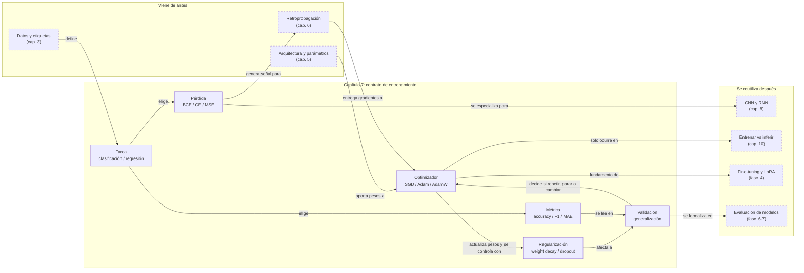

::: {.fasciculo-subtitle}
Facsímil 1 · Los cimientos
:::

# Capítulo 07: Funciones de pérdida y optimizadores

## Entrando en el tema

En el capítulo anterior construiste el motor: la retropropagación. Sabe calcular gradientes. Sabe en qué dirección ajustar cada peso para reducir el error. Pero le faltan dos piezas para funcionar: **qué error medir** y **cómo aplicar los ajustes**.

La primera pieza es la función de pérdida: la regla que decide qué cuenta como «error». La segunda es el optimizador: el algoritmo que decide cómo traducir los gradientes en actualizaciones concretas de los pesos.

Elegir mal cualquiera de las dos es como tener un coche con un motor excelente pero sin volante o sin frenos. El motor hace su trabajo, pero el coche no va a ninguna parte.

## Funciones de pérdida: cómo medir el error

Una función de pérdida toma dos cosas —la predicción del modelo y la respuesta real— y devuelve un número: el error.^[Goodfellow, I., Bengio, Y. y Courville, A. (2016). *Deep learning*. MIT Press. https://www.deeplearningbook.org. El capítulo 6.2 aborda en profundidad las funciones de pérdida, su relación con la estimación de máxima verosimilitud y cómo la elección de la función de pérdida determina lo que el modelo aprende.] Cuanto mayor es el número, peor es la predicción. El objetivo del entrenamiento es hacer ese número lo más pequeño posible.

Hay tres funciones que cubren la inmensa mayoría de casos prácticos:

| Función | Se usa en | Qué mide |
|---|---|---|
| **Cross-entropy** | Clasificación, LLMs | Diferencia entre la distribución de probabilidad predicha y la real. Penaliza fuertemente las predicciones confiadas pero equivocadas. |
| **MSE** (error cuadrático medio) | Regresión | Media de los errores al cuadrado. Penaliza más los errores grandes que los pequeños (por el cuadrado). |
| **Contrastive loss** | *Embeddings*, búsqueda semántica | Acerca representaciones de ejemplos similares y aleja las de ejemplos diferentes. |

Las fórmulas importan porque te dicen qué está castigando exactamente el entrenamiento:

| Pérdida | Fórmula simplificada | Lectura |
|---|---|---|
| **Binary cross-entropy** | \(-[y\log(p)+(1-y)\log(1-p)]\) | Para una salida binaria \(p\). Castiga mucho estar seguro y equivocarse. |
| **Cross-entropy multiclase** | \(-\log(p_y)\) | Para \(k\) clases. Solo mira la probabilidad asignada a la clase correcta. |
| **MSE** | \(\frac{1}{n}\sum_i(\hat{y_i}-y_i)^2\) | Para valores continuos. Los errores grandes pesan más por el cuadrado. |
| **Contrastive / triplet** | margen entre distancias | Para representaciones. No busca una clase: busca geometría útil en el espacio vectorial. |

Ejemplo concreto: si la clase correcta es `alta` y el modelo le da probabilidad \(p_y=0{,}01\), la cross-entropy es \(-\log(0{,}01)\approx4{,}61\). Si le da \(p_y=0{,}90\), baja a \(-\log(0{,}90)\approx0{,}105\). No es una penalización lineal: fallar con mucha confianza duele mucho más. Por eso esta pérdida encaja tan bien con clasificación y predicción de siguiente token.

**Cross-entropy** es la reina indiscutible de la IA moderna. Cada vez que un LLM predice el siguiente token, está minimizando una *cross-entropy* entre la distribución que predice y la distribución real (que asigna probabilidad 1 al token correcto y 0 al resto).^[Rumelhart, D. E., Hinton, G. E. y Williams, R. J. (1986). Learning representations by back-propagating errors. *Nature*, 323(6088), 533-536. https://doi.org/10.1038/323533a0. Aunque el artículo se centra en la retropropagación con MSE, establece el marco general donde cualquier función de pérdida diferenciable puede usarse para entrenar redes multicapa.] Funciona especialmente bien porque su gradiente es proporcional a la diferencia entre la probabilidad predicha y la real: si el modelo asigna un 99 % de probabilidad al token correcto, el gradiente es pequeño (ya lo hace bien). Si asigna un 1 %, el gradiente es enorme (tiene mucho que aprender).

**MSE** es la elección natural cuando predices valores numéricos: el precio de una casa, la temperatura de mañana, los ingresos del próximo trimestre. El cuadrado en la fórmula (`(predicción - realidad)²`) hace que los errores grandes pesen mucho más que los pequeños: equivocarse por 100 es cien veces peor que equivocarse por 10, pero la penalización es diez mil veces mayor. Esto empuja al modelo a evitar errores graves a toda costa.

**Contrastive loss** no se usa para predecir, sino para **representar**. Su objetivo es que dos imágenes del mismo objeto tengan vectores de *embedding* cercanos, y dos imágenes de objetos distintos los tengan lejanos. Es la base de los sistemas de búsqueda por similitud y del aprendizaje de representaciones.

## Optimizadores: cómo aplicar los ajustes

Una vez que la retropropagación ha calculado los gradientes, el optimizador decide **cómo** actualizar los pesos. La regla básica es siempre la misma:

$$w \\leftarrow w - \\eta \\cdot \\frac{\\partial E}{\\partial w}$$

Pero los optimizadores modernos añaden memoria estadística y adaptación a este proceso.^[Kingma, D. P. y Ba, J. (2015). Adam: a method for stochastic optimization. En *International Conference on Learning Representations*. https://arxiv.org/abs/1412.6980. Kingma y Ba presentaron Adam, que combina las ventajas de AdaGrad (tasas de aprendizaje adaptativas) y RMSProp (media móvil del gradiente), convirtiéndose en el optimizador por defecto para la mayoría de aplicaciones de *deep learning*.]

| Optimizador | Idea clave | Cuándo usarlo |
|---|---|---|
| **SGD** | Gradiente descendente con mini-lotes. El más simple. | Cuando necesitas control total sobre el *learning rate* y el *momentum*. |
| **Adam** | *Learning rate* adaptativo por parámetro. Funciona bien sin ajuste. | El estándar para la mayoría de tareas. Buen punto de partida. |
| **AdamW** | Adam + *weight decay* correcto (desacoplado). | El estándar para entrenar LLMs y Transformers. |

**SGD** (*Stochastic Gradient Descent*) es el abuelo de todos los optimizadores. Actualiza los pesos en la dirección del gradiente, con un tamaño de paso fijo (\\(\\eta\\)). Es simple, funciona, pero requiere ajustar el *learning rate* con cuidado: si es muy alto, el entrenamiento diverge; si es muy bajo, tarda una eternidad.

**Adam** (*Adaptive Moment Estimation*) mantiene una estimación del *momentum* (media móvil de los gradientes pasados) y una estimación de la varianza. Con estas dos, adapta el *learning rate* para cada parámetro individualmente. Un parámetro que recibe gradientes grandes y consistentes recibe pasos grandes. Uno que recibe gradientes pequeños o ruidosos recibe pasos pequeños. Esto hace que Adam funcione sorprendentemente bien sin necesidad de ajustar el *learning rate*.

**AdamW** corrige un error sutil en la implementación original de Adam: la forma en que aplica la regularización *weight decay*. En Adam clásico, la *weight decay* está acoplada a la tasa de aprendizaje adaptativa, lo que reduce su efectividad.^[Loshchilov, I. y Hutter, F. (2019). Decoupled weight decay regularization. En *International Conference on Learning Representations*. https://arxiv.org/abs/1711.05101. Los autores demostraron que desacoplar la *weight decay* de la actualización del gradiente en Adam mejora significativamente la generalización.] AdamW la desacopla, aplicando la regularización directamente a los pesos. Es el optimizador estándar para entrenar LLMs y Transformers.

Una forma práctica de leer los optimizadores:

| Señal observada | Qué probar | Por qué |
|---|---|---|
| La pérdida baja, pero muy lenta | Subir un poco el *learning rate* o usar Adam/AdamW. | El paso puede ser demasiado pequeño. |
| La pérdida oscila o explota | Bajar el *learning rate*, aplicar *gradient clipping* o revisar escalado de datos. | Los pasos son demasiado grandes o los gradientes son inestables. |
| Entrenamiento mejora y validación empeora | Añadir *weight decay*, *dropout*, más datos o *early stopping*. | Hay sobreajuste: el modelo memoriza. |
| Las clases minoritarias fallan | Ponderar la pérdida, cambiar métrica o revisar muestreo. | La pérdida media puede esconder que una clase casi no aprende. |
| La regresión castiga demasiado valores extremos | Probar MAE, Huber o revisar outliers. | MSE amplifica mucho errores grandes. |

<svg xmlns="http://www.w3.org/2000/svg" viewBox="0 0 980 580" role="img" aria-label="Minimizar la pérdida comparando las trayectorias de SGD y AdamW">
  <title>Minimizar la pérdida: trayectorias de SGD y AdamW</title>
  <defs>
    <marker id="f1c07-arrow" viewBox="0 0 10 10" refX="9" refY="5" markerWidth="6" markerHeight="6" orient="auto"><path d="M 0 0 L 10 5 L 0 10 z" fill="#333333"/></marker>
  </defs>
  <rect x="20" y="20" width="940" height="530" rx="18" fill="#FFFFFF" stroke="#111111" stroke-width="1.4"/>
  <text x="490" y="58" text-anchor="middle" font-family="Arial, sans-serif" font-size="24" font-weight="700" fill="#111111">Minimizar la pérdida</text>
  <text x="490" y="84" text-anchor="middle" font-family="Arial, sans-serif" font-size="13" fill="#666666">El optimizador decide cómo moverse por la superficie de error hasta encontrar una zona de menor pérdida.</text>
  <rect x="62" y="120" width="596" height="360" rx="14" fill="#FFFFFF" stroke="#333333" stroke-width="1.2"/>
  <text x="92" y="150" font-family="Arial, sans-serif" font-size="14" font-weight="700" fill="#111111">Superficie de pérdida L(w₁, w₂)</text>
  <text x="92" y="172" font-family="Arial, sans-serif" font-size="12" fill="#555555">curvas de nivel: cuanto más cerca del centro, menor pérdida</text>
  <g fill="none" stroke="#D8D8D8" stroke-width="1.2">
    <ellipse cx="340" cy="300" rx="250" ry="136" transform="rotate(-10 340 300)"/>
    <ellipse cx="340" cy="300" rx="204" ry="108" transform="rotate(-10 340 300)"/>
    <ellipse cx="340" cy="300" rx="158" ry="80" transform="rotate(-10 340 300)"/>
    <ellipse cx="340" cy="300" rx="110" ry="52" transform="rotate(-10 340 300)"/>
    <ellipse cx="340" cy="300" rx="58" ry="25" transform="rotate(-10 340 300)"/>
  </g>
  <line x1="98" y1="438" x2="612" y2="438" stroke="#333333" stroke-width="1" marker-end="url(#f1c07-arrow)"/>
  <line x1="98" y1="438" x2="98" y2="196" stroke="#333333" stroke-width="1" marker-end="url(#f1c07-arrow)"/>
  <text x="616" y="458" font-family="Arial, sans-serif" font-size="12" fill="#555555">w₁</text>
  <text x="78" y="197" font-family="Arial, sans-serif" font-size="12" fill="#555555">w₂</text>
  <circle cx="168" cy="196" r="7" fill="#FFFFFF" stroke="#111111" stroke-width="2"/>
  <text x="188" y="190" font-family="Arial, sans-serif" font-size="12" font-weight="700" fill="#111111">inicio</text>
  <circle cx="342" cy="304" r="12" fill="#111111"/>
  <text x="342" y="334" text-anchor="middle" font-family="Arial, sans-serif" font-size="12" fill="#555555">mínimo</text>
  <path d="M168 196 C210 168 254 210 232 246 C214 276 276 272 286 310 C294 340 322 324 336 308" fill="none" stroke="#111111" stroke-width="2.2" stroke-dasharray="9 7" stroke-linecap="round"/>
  <circle cx="168" cy="196" r="4" fill="#111111"/><circle cx="232" cy="246" r="4" fill="#111111"/><circle cx="286" cy="310" r="4" fill="#111111"/><circle cx="336" cy="308" r="4" fill="#111111"/>
  <path d="M168 196 C204 214 236 236 268 260 C296 281 322 295 342 303" fill="none" stroke="#555555" stroke-width="5" stroke-linecap="round"/>
  <circle cx="168" cy="196" r="5" fill="#FFFFFF" stroke="#555555" stroke-width="2"/><circle cx="268" cy="260" r="5" fill="#FFFFFF" stroke="#555555" stroke-width="2"/><circle cx="342" cy="303" r="5" fill="#FFFFFF" stroke="#555555" stroke-width="2"/>
  <rect x="405" y="205" width="190" height="88" rx="12" fill="#F5F5F5" stroke="#333333"/>
  <line x1="424" y1="232" x2="480" y2="232" stroke="#111111" stroke-width="2.2" stroke-dasharray="9 7"/>
  <text x="492" y="237" font-family="Arial, sans-serif" font-size="13" font-weight="700" fill="#111111">SGD</text>
  <text x="424" y="262" font-family="Arial, sans-serif" font-size="12" fill="#555555">pasos sensibles al ruido</text>
  <line x1="424" y1="278" x2="480" y2="278" stroke="#555555" stroke-width="5" stroke-linecap="round"/>
  <text x="492" y="282" font-family="Arial, sans-serif" font-size="13" font-weight="700" fill="#333333">AdamW</text>
  <rect x="690" y="120" width="220" height="360" rx="14" fill="#F5F5F5" stroke="#333333" stroke-width="1.2"/>
  <text x="800" y="150" text-anchor="middle" font-family="Arial, sans-serif" font-size="16" font-weight="700" fill="#111111">Qué está pasando</text>
  <rect x="716" y="178" width="168" height="62" rx="10" fill="#FFFFFF" stroke="#333333"/>
  <text x="800" y="202" text-anchor="middle" font-family="Arial, sans-serif" font-size="13" font-weight="700" fill="#111111">Objetivo</text>
  <text x="800" y="224" text-anchor="middle" font-family="Menlo, monospace" font-size="12" fill="#111111">min L(w)</text>
  <rect x="716" y="260" width="168" height="76" rx="10" fill="#FFFFFF" stroke="#333333"/>
  <text x="800" y="284" text-anchor="middle" font-family="Arial, sans-serif" font-size="13" font-weight="700" fill="#111111">SGD</text>
  <text x="800" y="306" text-anchor="middle" font-family="Menlo, monospace" font-size="12" fill="#111111">wₜ₊₁ = wₜ - ηgₜ</text>
  <text x="800" y="324" text-anchor="middle" font-family="Arial, sans-serif" font-size="11" fill="#555555">un paso, un gradiente</text>
  <rect x="716" y="356" width="168" height="82" rx="10" fill="#FFFFFF" stroke="#333333"/>
  <text x="800" y="380" text-anchor="middle" font-family="Arial, sans-serif" font-size="13" font-weight="700" fill="#111111">AdamW</text>
  <text x="800" y="402" text-anchor="middle" font-family="Arial, sans-serif" font-size="11" fill="#555555">usa momento y varianza</text>
  <text x="800" y="420" text-anchor="middle" font-family="Arial, sans-serif" font-size="11" fill="#555555">y desacopla el decay</text>
  <text x="490" y="520" text-anchor="middle" font-family="Arial, sans-serif" font-size="12" fill="#666666">La pérdida define el valle. El optimizador decide cómo bajar sin pasarse, atascarse o desperdiciar pasos.</text>
  <text x="940" y="532" text-anchor="end" font-family="Arial, sans-serif" font-size="10" fill="#9A9A9A">IA para gente curiosa / Facsímil 01 / Capítulo 07 / 686f6c61</text>
</svg>

## Problemas comunes del entrenamiento

Incluso con la función de pérdida y el optimizador correctos, el entrenamiento puede fallar. Dos problemas aparecen una y otra vez:

**Overfitting (sobreajuste).** El modelo memoriza los datos de entrenamiento pero falla estrepitosamente con datos nuevos. Es como un estudiante que se aprende las respuestas del examen de memoria sin entender la materia: saca un 10 en el simulacro y suspende el examen real.^[Srivastava, N., Hinton, G., Krizhevsky, A., Sutskever, I. y Salakhutdinov, R. (2014). Dropout: a simple way to prevent neural networks from overfitting. *Journal of Machine Learning Research*, 15(1), 1929-1958. http://jmlr.org/papers/v15/srivastava14a.html. El *dropout* —desactivar aleatoriamente neuronas durante el entrenamiento— es una de las técnicas más efectivas para prevenir el *overfitting*.] Soluciones: *dropout* (apagar neuronas aleatoriamente durante el entrenamiento), regularización (penalizar pesos grandes), más datos (la mejor medicina), *data augmentation* (generar variaciones de los datos existentes).

**Vanishing gradients (desvanecimiento del gradiente).** En redes profundas, el gradiente puede hacerse tan pequeño en las primeras capas que dejan de aprender. Es como si el profesor susurrara la corrección al alumno de la última fila, y el mensaje se fuera atenuando fila a fila hasta que los de delante no oyen nada.^[LeCun, Y., Bengio, Y. y Hinton, G. (2015). Deep learning. *Nature*, 521(7553), 436-444. https://doi.org/10.1038/nature14539. Los autores explican cómo las funciones de activación como ReLU y las arquitecturas con conexiones residuales mitigan el problema del desvanecimiento del gradiente.] Soluciones: ReLU en lugar de sigmoide (su gradiente es 1 para valores positivos), *skip connections* (atajos que permiten al gradiente saltar capas), *batch normalization* (normalizar las activaciones de cada capa).

## El contrato mínimo de una run

Una *run* de entrenamiento no debería ser «he lanzado un modelo y ya veremos». Debería tener un contrato mínimo antes de empezar:

| Elemento | Decisión | Ejemplo |
|---|---|---|
| Tarea | Clasificación binaria, multiclase, regresión o representación. | Priorizar tickets: multiclase. |
| Salida | Número de salidas y activación final. | 3 clases → softmax. |
| Pérdida | Función que coincide con la tarea. | Cross-entropy multiclase. |
| Métrica | Qué miras para decidir si sirve. | F1 macro si hay desbalance; accuracy si las clases están equilibradas. |
| Optimizador | Algoritmo y sus hiperparámetros. | AdamW, `lr=1e-3`, `weight_decay=1e-2`. |
| Validación | Partición que no actualiza pesos. | 80/20 estratificado o validación temporal si hay fechas. |
| Criterio de parada | Cuándo dejar de entrenar. | Parar si validación no mejora en 5 épocas. |
| Observabilidad | Qué registras por época. | Train loss, val loss, métrica, norma del gradiente, learning rate. |

Este contrato es una defensa contra el autoengaño. Si cambias pérdida, métrica y partición cada vez que algo sale mal, no estás optimizando: estás persiguiendo resultados. Una run seria deja claro qué cuenta como mejora antes de mirar el resultado.

## En el día a día

En la práctica, casi nunca eliges la función de pérdida desde cero. Los *frameworks* ya tienen las implementaciones optimizadas. Pero sí tomas decisiones que dependen de entenderlas:

- **¿Cross-entropy o MSE?** Si tu tarea es clasificar (spam o no, gato o perro, siguiente token), usa *cross-entropy*. Si es predecir un número, usa MSE. Parece obvio, pero equivocarse es sorprendentemente común.
- **¿Qué optimizador?** Empieza con Adam. Funciona en el 90 % de los casos. Si necesitas el último 10 % de rendimiento o estás entrenando un modelo desde cero, prueba AdamW.
- **¿Overfitting o underfitting?** Si el error en entrenamiento es bajo pero en validación es alto, tienes *overfitting*: regulariza, añade *dropout*, consigue más datos. Si ambos son altos, tienes *underfitting*: tu modelo es demasiado simple o no has entrenado suficiente.

## Por qué debería importarte

La función de pérdida es lo que le dices al modelo que quieres. No es un detalle técnico: es la especificación formal de tu objetivo.

Si usas MSE para clasificar, el modelo intentará minimizar la distancia numérica entre probabilidades, no maximizar la probabilidad de la clase correcta. Aprenderá algo, pero no lo que quieres. Si usas *cross-entropy* para regresión, el modelo asumirá que la salida es una distribución de probabilidad, no un valor continuo. Los resultados serán inconsistentes.

El optimizador, por su parte, determina si el modelo converge, a qué velocidad y a qué solución. Adam con un *learning rate* por defecto funciona en la mayoría de casos. Pero si tu modelo no converge, cambiar de optimizador o ajustar sus hiperparámetros puede ser la diferencia entre el éxito y el fracaso.

## Dónde solía tropezar yo

| Error | Por qué es un error | Antídoto |
|---|---|---|
| **Usar MSE para clasificación** | MSE asume errores continuos y simétricos. La clasificación necesita comparar distribuciones de probabilidad. MSE penaliza igual una predicción de 0,4 cuando la respuesta es 1 que una predicción de 0,9 cuando la respuesta es 0. | *Cross-entropy* para clasificación. Siempre. |
| **No monitorizar la pérdida de validación** | Si solo miras la pérdida de entrenamiento, no detectas el *overfitting* hasta que es demasiado tarde. La pérdida de entrenamiento siempre baja; la de validación es la que importa. | Separa un conjunto de validación y monitoriza ambas curvas. Si divergen, estás sobreajustando. |
| **Usar el *learning rate* por defecto sin comprobarlo** | El valor por defecto de Adam (0,001) funciona en muchos casos, pero no en todos. Un *learning rate* demasiado alto hace que la pérdida oscile; uno demasiado bajo hace que el entrenamiento sea innecesariamente lento. | Prueba con 0,01, 0,001 y 0,0001. Observa la curva de pérdida: si oscila, baja el *learning rate*; si baja muy lentamente, súbelo. |
| **Olvidar el *weight decay*** | Sin regularización, los pesos pueden crecer descontroladamente, llevando a *overfitting*. AdamW incluye *weight decay* por defecto, pero SGD no. | Añade *weight decay* (típicamente 1e-4 a 1e-2). Observa si mejora la pérdida de validación. |
| **Elegir métrica que contradice la pérdida** | Puedes optimizar cross-entropy y celebrar accuracy mientras la clase minoritaria queda destrozada. La pérdida entrena; la métrica decide si te vale. | Define pérdida y métrica juntas. En desbalance, mira F1 macro, recall por clase o coste de error. |
| **Comparar runs con particiones distintas** | Si cada experimento usa otro split, no sabes si mejoró el modelo o si tuvo una validación más fácil. | Fija partición, semilla y protocolo antes de comparar optimizadores. |

## Manos a la obra

La práctica está en `labs/f1/c07-loss-optimizer-lab/`. Entrena una regresión logística pequeña sin dependencias externas y compara combinaciones de pérdida y optimizador.

```bash
cd labs/f1/c07-loss-optimizer-lab
python3 ops/run_training_grid.py --write
cat output/training_decision.md
```

Y como práctica con validación:

```bash
cd labs/f1/c07-loss-optimizer-lab
make run
make test
```

El kit incluye `Makefile`, `requirements.txt` y `tests/test_training_grid.py`. La prueba comprueba que cada run deja métricas de validación y que el grid compara optimizadores reales, no solo nombres en una tabla.

El kit genera un dataset sintético fijo, separa entrenamiento y validación, entrena varias configuraciones y produce un informe con pérdida, accuracy, F1, brecha train/validación y recomendación.

| Comparación | Qué aprenderás | Por qué importa |
|---|---|---|
| BCE vs MSE | BCE suele entrenar mejor clasificación binaria. | La pérdida debe coincidir con la tarea. |
| SGD vs AdamW | AdamW suele ser más estable con menos ajuste manual. | El optimizador cambia velocidad y regularización. |
| Train vs validación | Detecta si mejoras de verdad o solo memorizas. | Sin validación no hay ingeniería, hay deseo. |
| Weight decay | Reduce pesos grandes y ayuda a generalizar. | Es una herramienta práctica contra sobreajuste. |

No compares el número absoluto de BCE contra el número absoluto de MSE como si fueran la misma escala. Compáralas por comportamiento: métrica de validación, estabilidad de curva, calibración y coherencia con la tarea.

**Cómo lo adaptas a tu caso.** Cambia `contracts/training_grid.json`: número de épocas, *learning rates*, *weight decay* y configuraciones. El dataset sintético está dentro del script para que el resultado sea reproducible.

**Qué entregaría un alumno.** El Markdown generado, una configuración nueva, una explicación de por qué la pérdida elegida encaja con la tarea, el resultado de `make test` y una decisión explícita: qué run llevaría a una segunda iteración y cuál descartaría.

## Cómo encaja todo

Este capítulo convierte el gradiente del capítulo 6 en una decisión de entrenamiento completa. La pérdida define qué significa fallar; el optimizador decide cómo moverse; la validación decide si esa mejora sirve fuera de los ejemplos que actualizan pesos.

También prepara una idea que volverá muchas veces: entrenar no es solo bajar una métrica interna. Es diseñar un contrato medible, ejecutarlo de forma reproducible y mirar si generaliza.



## Vocabulario aprendido

| Término | Definición |
|---|---|
| **Función de pérdida** | Función que mide el error entre la predicción y la realidad. El entrenamiento busca minimizarla. |
| ***Cross-entropy*** | Pérdida estándar para clasificación. Mide la diferencia entre la distribución predicha y la real. |
| **MSE** | Error cuadrático medio. Pérdida estándar para regresión. Penaliza fuertemente los errores grandes. |
| **Optimizador** | Algoritmo que actualiza los pesos a partir de los gradientes. Controla cómo y cuánto se ajusta cada parámetro. |
| **Adam** | Optimizador con *learning rate* adaptativo por parámetro. El más usado en la práctica. |
| **AdamW** | Variante de Adam con *weight decay* desacoplado. Es el estándar habitual para Transformers y muchos entrenamientos modernos. |
| ***Weight decay*** | Regularización que penaliza pesos grandes y ayuda a reducir sobreajuste. |
| ***Overfitting*** | El modelo memoriza los datos de entrenamiento pero no generaliza a datos nuevos. |
| **Curva de validación** | Evolución de pérdida o métrica en datos que no actualizan pesos. Permite detectar generalización, sobreajuste y parada temprana. |
| ***Early stopping*** | Detener el entrenamiento cuando la validación deja de mejorar durante varias épocas. |

## Antes de pasar página

- [ ] ¿Puedo explicar cuándo usar *cross-entropy* y cuándo MSE? (Si no, vuelve a la tabla de funciones de pérdida.)
- [ ] ¿Entiendo la diferencia entre SGD, Adam y AdamW? (Si no, vuelve a la sección de optimizadores.)
- [ ] ¿Sé qué es el *overfitting* y cómo combatirlo? (Si no, vuelve a «Problemas comunes».)
- [ ] ¿Puedo escribir el contrato mínimo de una run antes de entrenar? (Si no, vuelve a «El contrato mínimo de una run».)
- [ ] ¿He ejecutado `labs/f1/c07-loss-optimizer-lab/` y comparado BCE, MSE, SGD y AdamW? (Si no, vuelve a «Manos a la obra».)
- [ ] ¿Entiendo por qué el *learning rate* no puede ser ni muy alto ni muy bajo? (Si no, vuelve a «Dónde solía tropezar yo».)

## En resumen

| Idea fuerza | Detalle |
|---|---|
| La función de pérdida define qué significa «equivocarse». | *Cross-entropy* para clasificar, MSE para regresión, *contrastive* para representaciones. Elegir mal la pérdida es pedirle al modelo que optimice lo incorrecto. |
| El optimizador decide cómo aplicar los gradientes. | SGD es simple pero necesita ajuste. Adam es adaptativo y funciona en la mayoría de casos. AdamW es el estándar para Transformers. |
| El *overfitting* y el *vanishing gradient* son los dos grandes enemigos. | Monitoriza la pérdida de validación, usa *dropout* y regularización, y elige bien tus funciones de activación. |
| Una run necesita contrato antes de empezar. | Tarea, salida, pérdida, métrica, optimizador, validación y criterio de parada deben estar definidos antes de mirar resultados. |

## Para saber más

Goodfellow, I., Bengio, Y. y Courville, A. (2016). *Deep learning*. MIT Press. https://www.deeplearningbook.org

Kingma, D. P. y Ba, J. (2015). Adam: a method for stochastic optimization. En *International Conference on Learning Representations*. https://arxiv.org/abs/1412.6980

LeCun, Y., Bengio, Y. y Hinton, G. (2015). Deep learning. *Nature*, 521(7553), 436-444. https://doi.org/10.1038/nature14539

Loshchilov, I. y Hutter, F. (2019). Decoupled weight decay regularization. En *International Conference on Learning Representations*. https://arxiv.org/abs/1711.05101

Rumelhart, D. E., Hinton, G. E. y Williams, R. J. (1986). Learning representations by back-propagating errors. *Nature*, 323(6088), 533-536. https://doi.org/10.1038/323533a0

Russell, S. y Norvig, P. (2021). *Artificial intelligence: a modern approach* (4.ª ed.). Pearson.

Srivastava, N., Hinton, G., Krizhevsky, A., Sutskever, I. y Salakhutdinov, R. (2014). Dropout: a simple way to prevent neural networks from overfitting. *Journal of Machine Learning Research*, 15(1), 1929-1958. http://jmlr.org/papers/v15/srivastava14a.html
