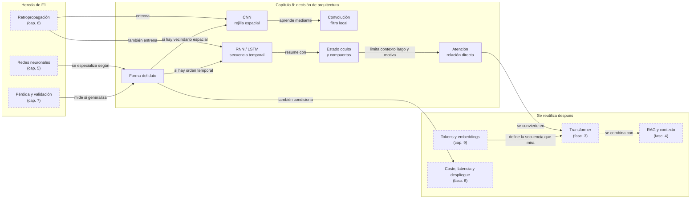

::: {.fasciculo-subtitle}
Facsímil 1 · Los cimientos
:::

# Capítulo 08: CNNs y RNNs: redes para visión y secuencias

## Entrando en el tema

Hasta ahora hemos hablado de redes neuronales en abstracto: capas que se conectan con capas, neuronas que reciben entradas y producen salidas. Esa arquitectura genérica —el MLP— funciona para muchos problemas, pero tiene un punto débil: trata todos los datos como una lista plana de números, sin aprovechar su estructura.

Una imagen no es una lista plana. Es una rejilla de píxeles donde lo que importa son los patrones locales: un ojo está rodeado de ceja y párpado, no de píxeles aleatorios dispersos por la imagen. Un texto no es una lista plana. Es una secuencia donde el significado de una palabra depende de las que vinieron antes y de las que vendrán después.

Dos arquitecturas nacieron para resolver estos dos problemas. Las CNNs para la visión. Las RNNs para las secuencias. Y aunque los Transformers las han desplazado parcialmente, entenderlas es entender por qué el Transformer fue revolucionario.

## CNNs: cómo ve una máquina

Una *Convolutional Neural Network* (CNN) no mira una imagen píxel a píxel. Aplica **filtros**: pequeñas matrices (3×3, 5×5) que se deslizan por la imagen detectando patrones locales.^[Krizhevsky, A., Sutskever, I. y Hinton, G. E. (2012). ImageNet classification with deep convolutional neural networks. En *Advances in Neural Information Processing Systems 25* (pp. 1097-1105). https://papers.nips.cc/paper/4824. AlexNet demostró que las CNNs profundas, entrenadas con GPUs, podían superar ampliamente a los métodos tradicionales de visión por computador, iniciando la revolución del *deep learning* en visión.]

Piensa en un filtro como una plantilla. Un filtro que detecta bordes horizontales tiene valores positivos arriba y negativos abajo. Cuando se desliza sobre una zona de la imagen donde hay un borde horizontal, produce un valor alto. Cuando pasa por una zona uniforme, produce un valor cercano a cero.

El flujo de una CNN es:

```
Imagen → Convoluciones → Pooling → Más convoluciones → Pooling → Clasificación
```

**Convolución.** El corazón de la CNN. Un filtro pequeño se desliza por toda la imagen. En cada posición, multiplica sus valores por los píxeles correspondientes y suma el resultado. Una capa convolucional típica tiene decenas o cientos de filtros, cada uno especializado en detectar un patrón distinto: bordes verticales, esquinas, texturas, colores específicos.^[LeCun, Y., Bengio, Y. y Hinton, G. (2015). Deep learning. *Nature*, 521(7553), 436-444. https://doi.org/10.1038/nature14539. Los autores describen cómo las capas convolucionales aprenden jerarquías de características visuales, desde bordes simples en las primeras capas hasta objetos complejos en las profundas.]

Veamos un ejemplo concreto. Imagina una imagen de 5×5 píxeles en escala de grises y un filtro de 3×3 que detecta bordes verticales:

```
Imagen 5x5:       Filtro 3x3 (borde vertical):
 1  1  1  0  0      -1   0   1
 1  1  1  0  0      -1   0   1
 1  1  1  0  0      -1   0   1
 1  1  1  0  0
 1  1  1  0  0
```

El filtro se coloca en la esquina superior izquierda y multiplica elemento a elemento: (-1×1 + 0×1 + 1×1) + (-1×1 + 0×1 + 1×1) + (-1×1 + 0×1 + 1×1) = 0 + 0 + 0 = 0. En esa zona no hay borde vertical: todo son unos.

Ahora deslizamos el filtro a la derecha, donde están los ceros. En la zona de transición entre unos y ceros: (-1×1 + 0×1 + 1×0) + (-1×1 + 0×1 + 1×0) + (-1×1 + 0×1 + 1×0) = (-1) + (-1) + (-1) = -3. El valor absoluto alto indica un borde vertical.

Esto es lo que hacen decenas de filtros en paralelo, cada uno especializado en un patrón distinto. La red **aprende** los valores del filtro durante el entrenamiento: no los programa una persona, los descubre la retropropagación.

**Pooling.** Reduce la resolución espacial manteniendo la información importante. La operación más común es *max pooling*: divide la imagen en zonas (por ejemplo, 2×2) y se queda solo con el valor máximo de cada zona. Esto hace la red más eficiente (menos píxeles que procesar) y más robusta (invariante a pequeños desplazamientos: si el gato se mueve dos píxeles a la derecha, el *max pooling* probablemente siga detectándolo).

**De patrones simples a conceptos.** Las primeras capas detectan bordes y colores. Las capas intermedias combinan bordes en formas y texturas. Las capas profundas reconocen objetos: ojos, ruedas, letras. Es la misma jerarquía que vimos en el capítulo 5, pero especializada para datos visuales.

**Skip connections (ResNet).** En 2015, ResNet introdujo una idea simple pero revolucionaria: atajos que permiten a la información saltarse capas.^[He, K., Zhang, X., Ren, S. y Sun, J. (2016). Deep residual learning for image recognition. En *Proceedings of the IEEE Conference on Computer Vision and Pattern Recognition* (pp. 770-778). https://doi.org/10.1109/CVPR.2016.90. Las conexiones residuales permiten entrenar redes de más de cien capas sin degradación del rendimiento, resolviendo el problema del desvanecimiento del gradiente en arquitecturas muy profundas.] En lugar de aprender la transformación completa, la capa aprende el «residuo»: la diferencia entre la entrada y la salida deseada. Si la transformación óptima es no hacer nada (la identidad), la capa puede aprender pesos cercanos a cero. Esto resolvió el problema de entrenar redes muy profundas y permitió arquitecturas de más de cien capas.

<svg xmlns="http://www.w3.org/2000/svg" viewBox="0 0 980 640" role="img" aria-label="CNN y RNN comparadas por la estructura que aprovechan: espacio frente a tiempo">
  <title>CNN y RNN: espacio frente a tiempo</title>
  <defs>
    <marker id="f1c08-arrow" viewBox="0 0 10 10" refX="9" refY="5" markerWidth="6" markerHeight="6" orient="auto"><path d="M 0 0 L 10 5 L 0 10 z" fill="#333333"/></marker>
  </defs>
  <rect x="20" y="20" width="940" height="590" rx="18" fill="#FFFFFF" stroke="#111111" stroke-width="1.4"/>
  <text x="490" y="58" text-anchor="middle" font-family="Arial, sans-serif" font-size="24" font-weight="700" fill="#111111">Dos arquitecturas, dos estructuras</text>
  <text x="490" y="84" text-anchor="middle" font-family="Arial, sans-serif" font-size="13" fill="#666666">Una CNN mira vecindarios en una cuadrícula; una RNN arrastra memoria a través de una secuencia.</text>
  <rect x="58" y="118" width="410" height="398" rx="16" fill="#F5F5F5" stroke="#111111" stroke-width="1.3"/>
  <text x="88" y="150" font-family="Arial, sans-serif" font-size="17" font-weight="700" fill="#111111">CNN: estructura espacial</text>
  <text x="88" y="174" font-family="Arial, sans-serif" font-size="12" fill="#555555">La posición importa: arriba, abajo, izquierda, derecha.</text>
  <g stroke="#333333" stroke-width="1">
    <rect x="92" y="212" width="150" height="150" rx="8" fill="#FFFFFF"/>
    <line x1="122" y1="212" x2="122" y2="362"/><line x1="152" y1="212" x2="152" y2="362"/><line x1="182" y1="212" x2="182" y2="362"/><line x1="212" y1="212" x2="212" y2="362"/>
    <line x1="92" y1="242" x2="242" y2="242"/><line x1="92" y1="272" x2="242" y2="272"/><line x1="92" y1="302" x2="242" y2="302"/><line x1="92" y1="332" x2="242" y2="332"/>
    <rect x="122" y="242" width="90" height="90" rx="4" fill="#E5E5E5" stroke="#111111" stroke-width="2"/>
  </g>
  <text x="167" y="390" text-anchor="middle" font-family="Arial, sans-serif" font-size="12" fill="#555555">filtro 3×3 mira una zona local</text>
  <line x1="250" y1="286" x2="300" y2="286" stroke="#333333" stroke-width="1.4" marker-end="url(#f1c08-arrow)"/>
  <g font-family="Arial, sans-serif" fill="#111111">
    <rect x="308" y="208" width="118" height="54" rx="10" fill="#FFFFFF" stroke="#111111"/>
    <text x="367" y="230" text-anchor="middle" font-size="13" font-weight="700">bordes</text>
    <text x="367" y="248" text-anchor="middle" font-size="11" fill="#555555">primeras capas</text>
    <rect x="308" y="276" width="118" height="54" rx="10" fill="#FFFFFF" stroke="#111111"/>
    <text x="367" y="298" text-anchor="middle" font-size="13" font-weight="700">formas</text>
    <text x="367" y="316" text-anchor="middle" font-size="11" fill="#555555">capas medias</text>
    <rect x="308" y="344" width="118" height="54" rx="10" fill="#FFFFFF" stroke="#111111"/>
    <text x="367" y="366" text-anchor="middle" font-size="13" font-weight="700">objeto</text>
    <text x="367" y="384" text-anchor="middle" font-size="11" fill="#555555">capas profundas</text>
  </g>
  <rect x="90" y="436" width="336" height="42" rx="10" fill="#FFFFFF" stroke="#333333" stroke-dasharray="6 4"/>
  <text x="258" y="462" text-anchor="middle" font-family="Arial, sans-serif" font-size="12" fill="#555555">Idea clave: reutilizar el mismo filtro en toda la imagen.</text>
  <rect x="512" y="118" width="410" height="398" rx="16" fill="#FFFFFF" stroke="#111111" stroke-width="1.3"/>
  <text x="542" y="150" font-family="Arial, sans-serif" font-size="17" font-weight="700" fill="#111111">RNN: estructura temporal</text>
  <text x="542" y="174" font-family="Arial, sans-serif" font-size="12" fill="#555555">El orden importa: cada paso modifica una memoria.</text>
  <g font-family="Arial, sans-serif" fill="#111111">
    <rect x="552" y="218" width="70" height="42" rx="9" fill="#F5F5F5" stroke="#111111"/>
    <rect x="637" y="218" width="70" height="42" rx="9" fill="#F5F5F5" stroke="#111111"/>
    <rect x="722" y="218" width="70" height="42" rx="9" fill="#F5F5F5" stroke="#111111"/>
    <rect x="807" y="218" width="70" height="42" rx="9" fill="#F5F5F5" stroke="#111111"/>
    <text x="587" y="244" text-anchor="middle" font-size="13" font-weight="700">El</text>
    <text x="672" y="244" text-anchor="middle" font-size="13" font-weight="700">gato</text>
    <text x="757" y="244" text-anchor="middle" font-size="13" font-weight="700">come</text>
    <text x="842" y="244" text-anchor="middle" font-size="13" font-weight="700">pescado</text>
  </g>
  <line x1="622" y1="239" x2="633" y2="239" stroke="#333333" marker-end="url(#f1c08-arrow)"/>
  <line x1="707" y1="239" x2="718" y2="239" stroke="#333333" marker-end="url(#f1c08-arrow)"/>
  <line x1="792" y1="239" x2="803" y2="239" stroke="#333333" marker-end="url(#f1c08-arrow)"/>
  <g fill="#FFFFFF" stroke="#111111" stroke-width="1.5">
    <circle cx="587" cy="338" r="27"/>
    <circle cx="672" cy="338" r="27"/>
    <circle cx="757" cy="338" r="27"/>
    <circle cx="842" cy="338" r="27"/>
  </g>
  <g font-family="Arial, sans-serif" fill="#111111">
    <text x="587" y="342" text-anchor="middle" font-size="13" font-weight="700">h₁</text>
    <text x="672" y="342" text-anchor="middle" font-size="13" font-weight="700">h₂</text>
    <text x="757" y="342" text-anchor="middle" font-size="13" font-weight="700">h₃</text>
    <text x="842" y="342" text-anchor="middle" font-size="13" font-weight="700">h₄</text>
  </g>
  <line x1="587" y1="260" x2="587" y2="306" stroke="#333333" marker-end="url(#f1c08-arrow)"/>
  <line x1="672" y1="260" x2="672" y2="306" stroke="#333333" marker-end="url(#f1c08-arrow)"/>
  <line x1="757" y1="260" x2="757" y2="306" stroke="#333333" marker-end="url(#f1c08-arrow)"/>
  <line x1="842" y1="260" x2="842" y2="306" stroke="#333333" marker-end="url(#f1c08-arrow)"/>
  <line x1="614" y1="338" x2="641" y2="338" stroke="#333333" stroke-width="1.4" marker-end="url(#f1c08-arrow)"/>
  <line x1="699" y1="338" x2="726" y2="338" stroke="#333333" stroke-width="1.4" marker-end="url(#f1c08-arrow)"/>
  <line x1="784" y1="338" x2="811" y2="338" stroke="#333333" stroke-width="1.4" marker-end="url(#f1c08-arrow)"/>
  <text x="716" y="396" text-anchor="middle" font-family="Arial, sans-serif" font-size="12" fill="#555555">hₜ resume lo anterior y condiciona el siguiente paso</text>
  <rect x="548" y="436" width="336" height="42" rx="10" fill="#F5F5F5" stroke="#333333" stroke-dasharray="6 4"/>
  <text x="716" y="462" text-anchor="middle" font-family="Arial, sans-serif" font-size="12" fill="#555555">Idea clave: procesar en orden y mantener estado.</text>
  <line x1="490" y1="128" x2="490" y2="500" stroke="#D8D8D8"/>
  <text x="490" y="552" text-anchor="middle" font-family="Arial, sans-serif" font-size="12" fill="#666666">CNN comprime vecindarios espaciales. RNN comprime historia temporal. El Transformer cambiará ambas reglas.</text>
  <text x="940" y="592" text-anchor="end" font-family="Arial, sans-serif" font-size="10" fill="#9A9A9A">IA para gente curiosa / Facsímil 01 / Capítulo 08 / 686f6c61</text>
</svg>

**Relevancia actual.** Las CNNs siguen siendo muy importantes en visión por computador porque aprovechan una estructura real de las imágenes: píxeles cercanos suelen estar relacionados. Ese sesgo inductivo las hace eficientes en detección, segmentación, clasificación y despliegues *edge*. Pero ya no son la única familia fuerte: los *Vision Transformers* tratan una imagen como parches y usan atención, y han demostrado que con suficientes datos y cómputo pueden competir o superar a las CNNs en muchas tareas.^[Dosovitskiy, A., Beyer, L., Kolesnikov, A., Weissenborn, D., Zhai, X., Unterthiner, T., Dehghani, M., Minderer, M., Heigold, G., Gelly, S., Uszkoreit, J. y Houlsby, N. (2021). An image is worth 16x16 words: Transformers for image recognition at scale. En *International Conference on Learning Representations*. https://openreview.net/forum?id=YicbFdNTTy. El trabajo popularizó ViT: dividir una imagen en parches y procesarlos con un Transformer.] En generación de imágenes, además, conviven U-Nets convolucionales y modelos de difusión basados en Transformers, como DiT.^[Peebles, W. y Xie, S. (2023). Scalable diffusion models with Transformers. En *Proceedings of the IEEE/CVF International Conference on Computer Vision* (pp. 4195-4205). https://doi.org/10.1109/ICCV51070.2023.00387. DiT muestra cómo sustituir bloques U-Net por Transformers escalables en modelos de difusión.] La decisión de ingeniería no es “CNN vieja, Transformer nuevo”, sino qué estructura de datos, coste, volumen de entrenamiento y latencia tienes.

## RNNs y LSTMs: cómo procesar secuencias

Antes de los Transformers, si querías que una red procesara texto, audio o series temporales, usabas una *Recurrent Neural Network* (RNN). Su idea es elegante: procesar la secuencia elemento a elemento, manteniendo un **estado oculto** que resume todo lo visto hasta ahora.^[Hochreiter, S. y Schmidhuber, J. (1997). Long short-term memory. *Neural Computation*, 9(8), 1735-1780. https://doi.org/10.1162/neco.1997.9.8.1735. Hochreiter y Schmidhuber introdujeron la LSTM para resolver el problema del desvanecimiento del gradiente en RNNs, permitiendo que las redes recurrentes aprendieran dependencias a largo plazo por primera vez.]

```
Token 1 → RNN (estado oculto) → Token 2 + estado → RNN (actualiza estado) → Token 3 + estado...
```

Cuando la RNN lee la palabra «El», actualiza su estado oculto para reflejar que ha visto un artículo. Cuando lee «gato», el estado ahora codifica «El gato». Cuando llega a «es», el estado refleja «El gato es». Y así, token a token, el estado oculto acumula el contexto de toda la secuencia.

El problema es la memoria. Cuando llegas al token 500, el estado oculto ya ha sido sobrescrito cientos de veces. La información del token 1 se ha diluido hasta desaparecer. Es como el juego del teléfono: el mensaje se degrada con cada transmisión.^[Goodfellow, I., Bengio, Y. y Courville, A. (2016). *Deep learning*. MIT Press. https://www.deeplearningbook.org. El capítulo 10 aborda en detalle las RNNs, el problema del desvanecimiento del gradiente en secuencias largas y las arquitecturas con compuertas como LSTM y GRU.]

### LSTM: memoria con compuertas

La *Long Short-Term Memory* (LSTM) resuelve este problema con un mecanismo ingenioso: compuertas. En lugar de un solo estado oculto que se sobrescribe, la LSTM tiene:

- Una **compuerta de olvido**: decide qué información antigua descartar.
- Una **compuerta de entrada**: decide qué información nueva almacenar.
- Una **compuerta de salida**: decide qué parte del estado actual exponer como salida.

Estas compuertas son pequeñas redes neuronales que aprenden cuándo abrir y cuándo cerrar. Si el modelo encuentra una palabra clave al principio de un documento que será relevante quinientos tokens después, la compuerta de olvido puede decidir conservarla. Si encuentra información irrelevante, la descarta.

Gracias a las LSTMs, las RNNs pudieron capturar dependencias bastante más largas que una RNN simple. No conviene convertir esto en una cifra universal: que un modelo recuerde 100, 500 o más pasos depende de datos, arquitectura, tamaño del estado, entrenamiento y tarea. Lo importante es la forma del límite: la información tiene que pasar por una cadena temporal, y cada paso puede degradar la señal.

### GRU: la hermana pequeña de la LSTM

La *Gated Recurrent Unit* (GRU), presentada en 2014, simplifica la LSTM: tiene solo dos compuertas (reinicio y actualización) en lugar de tres, y fusiona el estado oculto con la memoria de largo plazo en un solo vector.^[Cho, K., van Merriënboer, B., Gulcehre, C., Bahdanau, D., Bougares, F., Schwenk, H. y Bengio, Y. (2014). Learning phrase representations using RNN encoder-decoder for statistical machine translation. En *Proceedings of EMNLP* (pp. 1724-1734). https://doi.org/10.3115/v1/D14-1179. La GRU fue introducida como una alternativa más simple y computacionalmente eficiente a la LSTM, con rendimiento comparable en muchas tareas.] Con menos parámetros que la LSTM, la GRU entrena más rápido y a menudo rinde igual de bien. Es la opción preferida cuando los recursos son limitados o cuando la LSTM no aporta una mejora significativa.

### Bidireccional: mirar al pasado y al futuro

Una RNN estándar solo ve el pasado: cuando procesa la palabra 5, conoce las palabras 1 a 4 pero no tiene ni idea de lo que vendrá en la 6. Para muchas tareas —como etiquetar categorías gramaticales o traducir— el contexto futuro es tan importante como el pasado.

Las **RNNs bidireccionales** resuelven esto con dos RNNs en paralelo: una procesa la secuencia de izquierda a derecha y la otra de derecha a izquierda. Sus estados ocultos se concatenan, dando a cada posición acceso tanto al contexto anterior como al posterior. Son más caras computacionalmente pero notablemente más precisas en tareas donde el contexto completo importa.

### El gradiente en las RNNs: un problema amplificado

El desvanecimiento del gradiente es especialmente dañino en las RNNs. En una red *feedforward* de 10 capas, el gradiente se atenúa 10 veces. En una RNN que procesa 100 tokens, el gradiente se atenúa 100 veces —porque la red se despliega en el tiempo y cada paso temporal equivale a una capa—. Es como si tuvieras una red de 100 capas, pero donde todas comparten los mismos pesos. Cada paso hacia atrás en el tiempo multiplica el gradiente por la misma matriz de pesos. Si los valores propios de esa matriz son menores que 1, el gradiente se desvanece exponencialmente. Si son mayores que 1, **explota**, produciendo actualizaciones caóticas.

Las LSTMs y GRUs mitigan esto con sus compuertas, que permiten que el gradiente fluya a través del estado de memoria con menos atenuación. Pero no eliminan el cuello de botella: la información sigue viajando paso a paso. Para secuencias muy largas, muchas tareas dejaron de intentar “mejorar la memoria recurrente” y pasaron a usar atención, recuperación o arquitecturas híbridas. Eso es exactamente lo que hizo el Transformer para lenguaje.

### RNN vs LSTM vs Transformer

| Característica | RNN | LSTM | Transformer |
|---|---|---|---|
| **Procesamiento** | Secuencial | Secuencial | Paralelo |
| **Memoria/contexto práctico** | Limitada por estado oculto y gradiente | Mejor que RNN simple, pero sigue siendo secuencial | Ventana explícita de atención; su tamaño depende del modelo y del coste |
| **Paralelizable** | No | No | Sí (aprovecha GPUs) |
| **Velocidad** | Lenta | Lenta | Rápida |

El Transformer ganó por dos razones.^[Vaswani, A., Shazeer, N., Parmar, N., Uszkoreit, J., Jones, L., Gomez, A. N., Kaiser, Ł. y Polosukhin, I. (2017). Attention is all you need. En *Advances in Neural Information Processing Systems 30* (pp. 5998-6008). https://papers.nips.cc/paper/7181-attention-is-all-you-need. Los autores demostraron que eliminar la recurrencia y usar solo atención permitía entrenar modelos más rápido (por el paralelismo) y con mejor calidad (por la capacidad de atender a cualquier posición de la secuencia).] Primero, **paralelismo**: mira todos los tokens de una ventana a la vez. Una RNN tiene que procesar el token 1 antes que el 2, y el 2 antes que el 3. Un Transformer procesa la ventana simultáneamente, aprovechando GPUs masivamente paralelas. Segundo, **atención directa**: en lugar de comprimir todo el contexto en un estado oculto de tamaño fijo, cada token puede «mirar» directamente a cualquier otro token de la ventana. Si la palabra 500 necesita información de la palabra 1, la atención le da un camino directo. Ese camino no es gratis: la atención estándar crece de forma cuadrática con la longitud de la ventana, por eso los contextos largos requieren ingeniería adicional.

## En el día a día

Aunque los Transformers dominan el procesamiento de lenguaje, las CNNs y RNNs siguen siendo relevantes:

- **CNNs en visión.** Si necesitas clasificar imágenes, detectar objetos o segmentar con poco dato, poco cómputo o despliegue en dispositivo, una CNN sigue siendo una primera candidata razonable. Si tienes muchos datos, infraestructura y quieres unificar visión con lenguaje o atención global, ViT entra en la conversación.
- **CNNs, U-Nets y DiT en generación de imágenes.** La generación moderna mezcla familias: U-Nets convolucionales han sido centrales en difusión, y los Transformers aparecen en arquitecturas como DiT. Cuando generas una imagen con IA, no asumas una sola arquitectura: mira el modelo concreto.
- **LSTMs en series temporales.** Para predicción de ventas, mantenimiento predictivo, análisis de señales, las LSTMs siguen siendo competitivas. No necesitas un Transformer de mil millones de parámetros para predecir la demanda de mañana.
- **RNNs en dispositivos pequeños.** Una RNN simple consume mucha menos memoria y computación que un Transformer. En un microcontrolador o un dispositivo *edge*, una RNN puede ser la única opción viable.

## Por qué debería importarte

Estas arquitecturas no son reliquias históricas que estudias por cultura general. Son las piezas que explican **por qué** los Transformers son como son.

Cada decisión de diseño del Transformer es una respuesta a una limitación de las RNNs. La atención existe porque el estado oculto de una RNN no bastaba para contexto largo. El paralelismo existe porque el procesamiento secuencial era demasiado lento. La capacidad de mirar posiciones lejanas dentro de una ventana explícita existe porque las LSTMs, incluso con compuertas, seguían obligando a que la información viajara paso a paso por la secuencia.

Entender de dónde venimos es entender hacia dónde vamos. Y en ingeniería, a veces la herramienta adecuada no es la más moderna, sino la que mejor se adapta a tus restricciones de recursos.

## Dónde solía tropezar yo

| Error | Por qué es un error | Antídoto |
|---|---|---|
| **Usar un Transformer para todo** | Para una serie temporal de 100 puntos, una LSTM puede ser más rápida, más barata e igual de precisa que un Transformer. Usar la arquitectura más grande no siempre mejora la decisión. | Evalúa la complejidad de tu problema antes de elegir la arquitectura. Si es secuencial y corto, prueba RNN/LSTM primero. |
| **Aplicar CNNs a datos no espaciales** | Las CNNs asumen que los datos tienen estructura local (píxeles cercanos están relacionados). Aplicarlas a datos tabulares donde las columnas no tienen orden espacial no aporta ventajas sobre un MLP. | CNNs para imágenes y datos con estructura de rejilla. MLPs para datos tabulares. Transformers para secuencias largas. |
| **Ignorar el preprocesamiento en CNNs** | Una CNN espera imágenes de un tamaño fijo. Si le pasas imágenes de tamaños variados sin redimensionar, los resultados serán inconsistentes. | Normaliza el tamaño de las imágenes, escala los valores de píxel a [0,1] o [-1,1] y aplica *data augmentation* durante el entrenamiento. |
| **Asumir que las RNNs «entienden» el orden** | Las RNNs procesan en orden, pero eso no garantiza que capturen dependencias a largo plazo. Una RNN simple puede fallar en capturar que la primera palabra de un párrafo es el sujeto de la última oración. | Si necesitas dependencias a largo plazo, usa LSTMs, GRUs o, directamente, Transformers. |

## Manos a la obra

La práctica de este capítulo está en `labs/f1/c08-architecture-triage/`. El ejercicio no consiste en entrenar una CNN o una LSTM por entrenarlas. Consiste en hacer lo que debería hacerse antes de abrir un notebook: mirar la forma de los datos, estimar el coste de cada familia y justificar una primera arquitectura.

El kit trae cuatro casos: una inspección visual de piezas, una serie temporal de sensores, clasificación de tickets cortos y revisión de contratos largos. Para cada caso calcula señales útiles: parámetros aproximados de una primera convolución, coste de una LSTM, coste cuadrático de atención y riesgos de datos o latencia.

| Archivo | Qué contiene |
|---|---|
| `Makefile` | Atajos para ejecutar, probar y limpiar. |
| `requirements.txt` | Declara que el kit usa solo Python estándar. |
| `data/problem_cases.json` | Casos con tipo de entrada, tamaño, ejemplos, latencia y despliegue. |
| `contracts/architecture_policy.json` | Umbrales y supuestos: filtros, tamaño oculto, `d_model` y límite de atención. |
| `ops/audit_architecture_triage.py` | Auditor de arquitectura sin dependencias externas. |
| `tests/test_architecture_triage.py` | Comprueba que la recomendación incluye señales de coste y arquitectura. |
| `output/architecture_triage_report.json` | Resultado estructurado por caso. |
| `output/architecture_triage_decision.md` | Informe que puedes entregar o discutir. |

Ejecuta:

```bash
cd labs/f1/c08-architecture-triage
python3 ops/audit_architecture_triage.py --write
cat output/architecture_triage_decision.md
```

Comprueba que el kit completo sigue sano:

```bash
cd labs/f1/c08-architecture-triage
make run
make test
```

Después añade un quinto caso propio. Por ejemplo: audio corto de una máquina, imágenes médicas pequeñas, logs de una aplicación o textos legales de 30 páginas. No empieces escribiendo «usaría un Transformer». Escribe primero la forma de la entrada, el volumen de ejemplos, la latencia objetivo y qué error sería caro. La arquitectura tiene que salir de esas restricciones.

**Qué entregaría un alumno.** El Markdown generado, un caso propio añadido al JSON, el resultado de `make test`, una recomendación de arquitectura y una decisión explícita: entrenar, simplificar, cambiar de familia o recoger más datos antes.

Para explorar visualmente después de ejecutar el kit, merece la pena abrir **[CNN Explainer](https://poloclub.github.io/cnn-explainer/)** y observar cómo cambian los *feature maps* de una capa a otra. También puedes revisar **[Stanford CS231n](https://cs231n.github.io/)** si quieres profundizar en visión por computador.

## Cómo encaja todo

Este mapa se lee como una decisión de arquitectura, no como una línea histórica. Venimos de redes, gradientes y capas; aquí aprendemos que la forma del dato importa. Si la estructura es espacial, una CNN aprovecha vecindarios. Si la estructura es temporal, una RNN o LSTM arrastra estado. Si la secuencia es larga, necesitamos atención, recuperación o arquitecturas híbridas.

La decisión que enseña el capítulo no es memorizar siglas, sino justificar una familia por contrato de datos, coste y despliegue. Esa misma forma de pensar reaparece cuando elijas embeddings, modelos locales, RAG o arquitecturas de Transformer.



## Vocabulario aprendido

| Término | Definición |
|---|---|
| **CNN** | Red neuronal convolucional. Usa filtros que se deslizan por la entrada para detectar patrones locales. Especializada en imágenes y datos con estructura de rejilla. |
| **Convolución** | Operación que aplica un filtro sobre una entrada, deslizándolo por todas las posiciones y calculando la similitud en cada punto. |
| **Pooling** | Operación que reduce la resolución espacial manteniendo la información relevante. *Max pooling* toma el valor máximo de cada zona. |
| **RNN** | Red neuronal recurrente. Procesa secuencias elemento a elemento, manteniendo un estado oculto que resume el contexto previo. |
| **LSTM** | Variante de RNN con compuertas de olvido, entrada y salida. Permite aprender dependencias a más largo plazo que una RNN simple. |
| **Estado oculto** | Vector que resume la información de todos los elementos anteriores de una secuencia en una RNN. |

## Antes de pasar página

- [ ] ¿Puedo explicar cómo una CNN detecta patrones en una imagen? (Si no, vuelve a «CNNs: cómo ve una máquina».)
- [ ] ¿Entiendo qué hace el *pooling* y por qué es útil? (Si no, vuelve a la sección de CNNs.)
- [ ] ¿Sé cómo procesa una RNN una secuencia y cuál es su principal limitación? (Si no, vuelve a «RNNs y LSTMs».)
- [ ] ¿Puedo explicar por qué el Transformer superó a las RNNs? (Si no, vuelve a la tabla comparativa.)
- [ ] ¿He ejecutado `labs/f1/c08-architecture-triage/` y puedo justificar una arquitectura por forma de datos, coste y despliegue? (Si no, vuelve a «Manos a la obra».)

## En resumen

| Idea fuerza | Detalle |
|---|---|
| Las CNNs detectan patrones locales en imágenes mediante filtros que se deslizan por la entrada. | De bordes en las primeras capas a objetos completos en las profundas. *Pooling* reduce dimensionalidad y añade invarianza. |
| Las RNNs procesan secuencias manteniendo un estado oculto. Las LSTMs añaden compuertas para recordar a más largo plazo. | Mejoran el problema, pero siguen comprimiendo historia en estado recurrente y procesando paso a paso. |
| El Transformer ganó por paralelismo y atención directa. | Procesa una ventana completa a la vez y permite que cualquier token mire directamente a otro dentro de esa ventana, pagando coste de memoria y cómputo. |

## Para saber más

Goodfellow, I., Bengio, Y. y Courville, A. (2016). *Deep learning*. MIT Press. https://www.deeplearningbook.org

Dosovitskiy, A., Beyer, L., Kolesnikov, A., Weissenborn, D., Zhai, X., Unterthiner, T., Dehghani, M., Minderer, M., Heigold, G., Gelly, S., Uszkoreit, J. y Houlsby, N. (2021). An image is worth 16x16 words: Transformers for image recognition at scale. En *International Conference on Learning Representations*. https://openreview.net/forum?id=YicbFdNTTy

He, K., Zhang, X., Ren, S. y Sun, J. (2016). Deep residual learning for image recognition. En *Proceedings of the IEEE Conference on Computer Vision and Pattern Recognition* (pp. 770-778). https://doi.org/10.1109/CVPR.2016.90

Hochreiter, S. y Schmidhuber, J. (1997). Long short-term memory. *Neural Computation*, 9(8), 1735-1780. https://doi.org/10.1162/neco.1997.9.8.1735

Krizhevsky, A., Sutskever, I. y Hinton, G. E. (2012). ImageNet classification with deep convolutional neural networks. En *Advances in Neural Information Processing Systems 25* (pp. 1097-1105). https://papers.nips.cc/paper/4824

LeCun, Y., Bengio, Y. y Hinton, G. (2015). Deep learning. *Nature*, 521(7553), 436-444. https://doi.org/10.1038/nature14539

Peebles, W. y Xie, S. (2023). Scalable diffusion models with Transformers. En *Proceedings of the IEEE/CVF International Conference on Computer Vision* (pp. 4195-4205). https://doi.org/10.1109/ICCV51070.2023.00387

Russell, S. y Norvig, P. (2021). *Artificial intelligence: a modern approach* (4.ª ed.). Pearson.

Vaswani, A., Shazeer, N., Parmar, N., Uszkoreit, J., Jones, L., Gomez, A. N., Kaiser, Ł. y Polosukhin, I. (2017). Attention is all you need. En *Advances in Neural Information Processing Systems 30* (pp. 5998-6008). https://papers.nips.cc/paper/7181-attention-is-all-you-need
