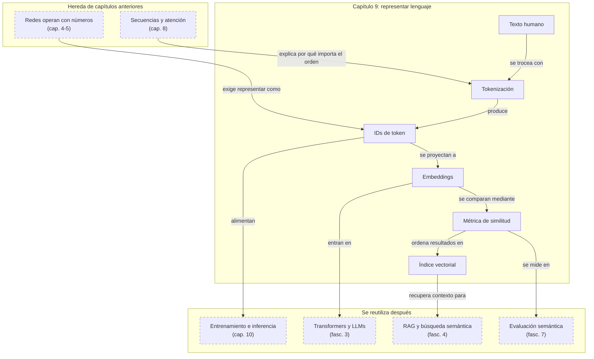

::: {.fasciculo-subtitle}
Facsímil 1 · Los cimientos
:::

# Capítulo 09: Del token al embedding: cómo el modelo representa lenguaje

## Entrando en el tema

Escribes «Hola, ¿cómo estás?» y pulsas Enviar. Para ti son cuatro palabras, un signo de interrogación y una intención. Para el modelo, son números. Solo números.

Este capítulo explica el viaje que transforma tu texto en algo que una red neuronal puede procesar. Tiene dos etapas: la **tokenización** (trocear el texto en unidades procesables) y el **embedding** (convertir cada unidad en un vector de números que representa regularidades semánticas y de uso). Si el capítulo 4 fue el átomo (la neurona) y el capítulo 5 la molécula (la red), este capítulo es el sistema de coordenadas que permite operar con lenguaje sin que el modelo vea letras como las vemos nosotros.

## Qué es un token

Un token es la **unidad mínima** que el modelo procesa. No es una palabra, aunque a veces coincide. No es un carácter, aunque a veces también. Es lo que el tokenizador —un programa que trocea texto— decide que es la unidad óptima para ese modelo.^[Brown, T. B. et al. (2020). Language models are few-shot learners. En *Advances in Neural Information Processing Systems 33* (pp. 1877-1901). https://papers.nips.cc/paper/2020/hash/1457c0d6bfcb4967418bfb8ac142f64a-Abstract.html. GPT-3 usó tokenización por pares de bytes (BPE), que equilibra el tamaño del vocabulario con la capacidad de representar palabras raras como secuencias de subtokens.]

Algunos ejemplos con un tokenizador típico:

```
"Hola mundo"       → ["Hola", " mundo"]           (2 tokens)
"desarrolladores"  → ["des", "arrol", "ladores"]   (3 tokens)
"function get()"   → ["function", " get", "()"]   (3 tokens)
```

Observa tres cosas. Primero, los espacios importan: «mundo» y « mundo» son tokens distintos. El espacio indica que la palabra empieza tras otra. Segundo, las palabras largas o poco frecuentes se trocean en subtokens: «desarrolladores» se divide en tres piezas que el modelo puede recombinar. Tercero, el código se tokeniza de forma distinta al lenguaje natural: los paréntesis, llaves y operadores son tokens independientes.

**El modelo no ve texto.** Ve secuencias de números (IDs de token). Cada token tiene un identificador único en el vocabulario del modelo —típicamente entre 50 000 y 250 000 tokens distintos—. Cuando escribes «Hola mundo», el modelo recibe algo como `[15496, 2159]`. Nunca ve las letras.

**Todo se mide en tokens.** La ventana de contexto (cuánto texto puede procesar el modelo de una vez), el precio de la API, el límite de respuesta: todo se mide en tokens. Es la moneda de la IA generativa.

### Cómo funciona la tokenización (BPE)

El algoritmo más usado se llama **Byte Pair Encoding** (BPE).^[Sennrich, R., Haddow, B. y Birch, A. (2016). Neural machine translation of rare words with subword units. En *Proceedings of the 54th Annual Meeting of the Association for Computational Linguistics* (pp. 1715-1725). https://doi.org/10.18653/v1/P16-1162. BPE se popularizó como método de tokenización por subpalabras, resolviendo el problema de las palabras fuera de vocabulario en traducción automática y siendo adoptado posteriormente por GPT y la mayoría de LLMs.] Funciona así:

1. Empieza con un vocabulario de caracteres individuales (a, b, c, ..., espacio, etc.).
2. Recorre todo el texto de entrenamiento y encuentra el **par de tokens consecutivos más frecuente**.
3. Fusiona ese par en un nuevo token y lo añade al vocabulario.
4. Repite miles de veces.

El resultado es un vocabulario donde las palabras muy frecuentes («el», «de», «y») son tokens únicos, mientras que las palabras raras o largas se descomponen en subtokens. «Desarrolladores» acaba siendo «des» + «arrol» + «ladores» porque esos fragmentos aparecen en muchas otras palabras («desarrollo», «arrollar», «desarrollado»). Es un equilibrio ingenioso: el vocabulario es manejable (50k-250k tokens) pero puede representar cualquier palabra.

**El español gasta más tokens que el inglés.** Como regla aproximada, un token equivale a 3-4 caracteres en texto latino. Pero el español, con sus tildes, sus conjugaciones verbales y sus palabras más largas, tiende a consumir más tokens que el inglés para expresar lo mismo. «Machine learning is great» son 4 tokens; «El aprendizaje automático es genial» son 7-8.

<svg xmlns="http://www.w3.org/2000/svg" viewBox="0 0 980 640" role="img" aria-label="Del texto al embedding: tokenización, ids, tabla de embeddings y distancia semántica">
  <title>Del texto al embedding</title>
  <defs>
    <marker id="f1c09-arrow" viewBox="0 0 10 10" refX="9" refY="5" markerWidth="6" markerHeight="6" orient="auto"><path d="M 0 0 L 10 5 L 0 10 z" fill="#333333"/></marker>
  </defs>
  <rect x="20" y="20" width="940" height="590" rx="18" fill="#FFFFFF" stroke="#111111" stroke-width="1.4"/>
  <text x="490" y="58" text-anchor="middle" font-family="Arial, sans-serif" font-size="24" font-weight="700" fill="#111111">Del token al vector</text>
  <text x="490" y="84" text-anchor="middle" font-family="Arial, sans-serif" font-size="13" fill="#666666">Un token no tiene significado por sí mismo: es un índice que apunta a una fila de una matriz aprendida.</text>
  <rect x="62" y="122" width="856" height="138" rx="16" fill="#F5F5F5" stroke="#111111" stroke-width="1.3"/>
  <text x="92" y="152" font-family="Arial, sans-serif" font-size="15" font-weight="700" fill="#111111">1. Texto → piezas</text>
  <rect x="92" y="178" width="210" height="44" rx="9" fill="#FFFFFF" stroke="#333333"/>
  <text x="197" y="206" text-anchor="middle" font-family="Arial, sans-serif" font-size="15" font-weight="700" fill="#111111">aprendizaje automático</text>
  <line x1="310" y1="200" x2="354" y2="200" stroke="#333333" stroke-width="1.4" marker-end="url(#f1c09-arrow)"/>
  <g font-family="Arial, sans-serif">
    <rect x="366" y="178" width="96" height="44" rx="9" fill="#FFFFFF" stroke="#111111"/>
    <rect x="476" y="178" width="96" height="44" rx="9" fill="#FFFFFF" stroke="#111111"/>
    <rect x="586" y="178" width="96" height="44" rx="9" fill="#FFFFFF" stroke="#111111"/>
    <text x="414" y="205" text-anchor="middle" font-size="13" font-weight="700" fill="#111111">aprendiz</text>
    <text x="524" y="205" text-anchor="middle" font-size="13" font-weight="700" fill="#111111">aje</text>
    <text x="634" y="205" text-anchor="middle" font-size="13" font-weight="700" fill="#111111"> automático</text>
  </g>
  <line x1="690" y1="200" x2="730" y2="200" stroke="#333333" stroke-width="1.4" marker-end="url(#f1c09-arrow)"/>
  <rect x="742" y="168" width="142" height="64" rx="10" fill="#FFFFFF" stroke="#333333"/>
  <text x="813" y="192" text-anchor="middle" font-family="Arial, sans-serif" font-size="12" font-weight="700" fill="#111111">IDs</text>
  <text x="813" y="214" text-anchor="middle" font-family="Menlo, monospace" font-size="13" fill="#111111">[812, 57, 4231]</text>
  <rect x="62" y="292" width="404" height="234" rx="16" fill="#FFFFFF" stroke="#111111" stroke-width="1.3"/>
  <text x="92" y="322" font-family="Arial, sans-serif" font-size="15" font-weight="700" fill="#111111">2. Tabla de embeddings</text>
  <text x="92" y="344" font-family="Arial, sans-serif" font-size="12" fill="#555555">Cada ID selecciona una fila de la matriz E.</text>
  <g font-family="Arial, sans-serif" font-size="12" fill="#111111">
    <rect x="92" y="370" width="330" height="32" rx="6" fill="#F5F5F5" stroke="#D8D8D8"/>
    <text x="112" y="391" font-family="Menlo, monospace">id 811</text><text x="205" y="391" font-family="Menlo, monospace" fill="#555555">[ 0,08  -0,12   0,31  ... ]</text>
    <rect x="92" y="408" width="330" height="32" rx="6" fill="#FFFFFF" stroke="#111111" stroke-width="1.5"/>
    <text x="112" y="429" font-family="Menlo, monospace" font-weight="700">id 812</text><text x="205" y="429" font-family="Menlo, monospace" font-weight="700">[ 0,42  -0,07   0,18  ... ]</text>
    <rect x="92" y="446" width="330" height="32" rx="6" fill="#F5F5F5" stroke="#D8D8D8"/>
    <text x="112" y="467" font-family="Menlo, monospace">id 813</text><text x="205" y="467" font-family="Menlo, monospace" fill="#555555">[-0,22   0,44  -0,09  ... ]</text>
  </g>
  <line x1="430" y1="424" x2="494" y2="424" stroke="#333333" stroke-width="1.4" marker-end="url(#f1c09-arrow)"/>
  <rect x="512" y="330" width="162" height="122" rx="14" fill="#F5F5F5" stroke="#111111" stroke-width="1.3"/>
  <text x="593" y="360" text-anchor="middle" font-family="Arial, sans-serif" font-size="15" font-weight="700" fill="#111111">Vector denso</text>
  <text x="593" y="390" text-anchor="middle" font-family="Menlo, monospace" font-size="13" fill="#111111">[0,42,</text>
  <text x="593" y="412" text-anchor="middle" font-family="Menlo, monospace" font-size="13" fill="#111111"> -0,07,</text>
  <text x="593" y="434" text-anchor="middle" font-family="Menlo, monospace" font-size="13" fill="#111111"> 0,18, ...]</text>
  <line x1="676" y1="392" x2="724" y2="392" stroke="#333333" stroke-width="1.4" marker-end="url(#f1c09-arrow)"/>
  <rect x="724" y="292" width="194" height="234" rx="16" fill="#FFFFFF" stroke="#111111" stroke-width="1.3"/>
  <text x="754" y="322" font-family="Arial, sans-serif" font-size="15" font-weight="700" fill="#111111">3. Distancia semántica</text>
  <line x1="772" y1="482" x2="888" y2="482" stroke="#333333" stroke-width="1" marker-end="url(#f1c09-arrow)"/>
  <line x1="772" y1="482" x2="772" y2="352" stroke="#333333" stroke-width="1" marker-end="url(#f1c09-arrow)"/>
  <g stroke="#D8D8D8" stroke-dasharray="5 5" fill="none">
    <circle cx="808" cy="405" r="34"/>
    <circle cx="856" cy="390" r="30"/>
  </g>
  <g font-family="Arial, sans-serif" font-size="11" fill="#111111">
    <circle cx="797" cy="402" r="5" fill="#111111"/><text x="806" y="399">gato</text>
    <circle cx="818" cy="422" r="4" fill="#555555"/><text x="827" y="426">perro</text>
    <circle cx="848" cy="384" r="5" fill="#111111"/><text x="857" y="381">Python</text>
    <circle cx="867" cy="405" r="4" fill="#555555"/><text x="876" y="409">código</text>
  </g>
  <line x1="818" y1="402" x2="847" y2="384" stroke="#CFCFCF" stroke-dasharray="4 5"/>
  <text x="821" y="456" text-anchor="middle" font-family="Arial, sans-serif" font-size="11" fill="#555555">cerca = significado parecido</text>
  <rect x="218" y="552" width="544" height="32" rx="16" fill="#F5F5F5" stroke="#333333" stroke-dasharray="6 4"/>
  <text x="490" y="573" text-anchor="middle" font-family="Arial, sans-serif" font-size="12" fill="#555555">Token = índice discreto. Embedding = vector aprendido que permite comparar significado.</text>
  <text x="940" y="592" text-anchor="end" font-family="Arial, sans-serif" font-size="10" fill="#9A9A9A">IA para gente curiosa / Facsímil 01 / Capítulo 09 / 686f6c61</text>
</svg>

## Qué es un embedding

Una vez que el texto se ha convertido en tokens, cada token necesita una representación numérica que la red pueda procesar. Esa representación es el **embedding**: un vector denso de números reales —típicamente entre 768 y 4096 dimensiones— que captura el significado del token en el contexto del modelo.^[Mikolov, T., Chen, K., Corrado, G. y Dean, J. (2013). Efficient estimation of word representations in vector space. arXiv:1301.3781. https://arxiv.org/abs/1301.3781. Word2Vec demostró que las representaciones vectoriales densas de palabras capturan relaciones semánticas, permitiendo operaciones como «rey - hombre + mujer ≈ reina».]

«Denso» significa que casi todas las dimensiones tienen valores distintos de cero. Un vector *sparse* (disperso) tendría muchos ceros y unas pocas dimensiones activas. Un embedding es denso: cada dimensión contribuye un poco al significado global.

**Las dimensiones no tienen etiquetas.** No hay una dimensión que signifique «animalidad» y otra que signifique «tamaño». Cada dimensión es una coordenada en un espacio de alta dimensionalidad, y el significado emerge de la posición relativa del vector completo. Es como preguntar «¿qué significa la coordenada X = 0,23 en un mapa?». Nada por sí sola. Pero combinada con Y = -0,87 y las otras 1534 dimensiones, sitúa «gato» cerca de «felino» y lejos de «JavaScript».

```
"gato"       → [0.23, -0.87, 0.45, 0.12, ...]  (1536 dimensiones)
"felino"     → [0.21, -0.85, 0.48, 0.11, ...]  (muy cercano a "gato")
"JavaScript" → [-0.56, 0.33, -0.12, 0.78, ...] (completamente distinto)
```

Piensa en un mapa donde las palabras se colocan según su significado. «Perro» y «gato» están cerca (ambos son animales domésticos). «Python» y «JavaScript» están cerca (ambos son lenguajes de programación). Pero «perro» y «Python» están lejos. El embedding es la coordenada de cada palabra en ese mapa de miles de dimensiones.^[Goodfellow, I., Bengio, Y. y Courville, A. (2016). *Deep learning*. MIT Press. https://www.deeplearningbook.org. El capítulo 12 aborda las representaciones distribuidas y cómo los embeddings densos aprendidos permiten a los modelos capturar relaciones semánticas complejas.]

## Embeddings en la práctica

### Aritmética de significado

Una propiedad fascinante de los embeddings es que las relaciones semánticas a veces se expresan como operaciones vectoriales. Si el espacio de embeddings captura consistentemente las dimensiones de significado, las direcciones en ese espacio codifican relaciones:

```
rey - hombre + mujer ≈ reina
Madrid - España + Francia ≈ París
```

Estas analogías, popularizadas por Word2Vec,^[Mikolov, T., Chen, K., Corrado, G. y Dean, J. (2013). Efficient estimation of word representations in vector space. arXiv:1301.3781. https://arxiv.org/abs/1301.3781. Las analogías semánticas vectoriales fueron una de las demostraciones más impactantes de Word2Vec, mostrando que los embeddings capturan relaciones sistemáticas entre conceptos.] son ilustrativas, no garantizadas. Un embedding moderno no siempre produce estas operaciones limpiamente, pero el principio subyacente —que la dirección en el espacio codifica relaciones— es real y es la base de la búsqueda semántica.

### Similitud semántica

La medida estándar para comparar embeddings es la **similitud coseno**: el coseno del ángulo entre dos vectores. Vale 1 si apuntan exactamente en la misma dirección (idénticos), 0 si son perpendiculares (sin relación) y -1 si son opuestos.

| Par de palabras | Similitud | Interpretación |
|---|---|---|
| «gato» / «felino» | Alta (~0.95) | Cuasi-sinónimos |
| «gato» / «perro» | Media (~0.75) | Misma categoría |
| «gato» / «coche» | Baja (~0.15) | Sin relación |
| «deploy» / «desplegar» | Alta (~0.90) | Traducción (modelo multilingüe) |

La clave: conceptos similares quedan **cerca** en el espacio vectorial. Esto permite buscar por significado, no por palabras exactas. «¿Cómo despliego en producción?» encuentra documentos sobre «deploy to prod» aunque no compartan ni una sola palabra.

### Modelos de embedding (2026)

Fecha de corte: 10 de junio de 2026. Esta tabla no es un ranking universal: es una foto de familias útiles para entender decisiones de ingeniería. Antes de elegir proveedor hay que comprobar licencia, coste, límites, idioma, evaluación propia y si el índice vectorial ya existente obliga a re-embedar documentos.

| Modelo | Proveedor | Dimensiones declaradas | Qué aporta realmente |
|---|---|---|---|
| `text-embedding-3-large` | OpenAI | 3072 por defecto; reducible con `dimensions` | API madura y buen punto de partida general. Reducir dimensiones ahorra almacenamiento, pero hay que medir recuperación en tus datos.^[OpenAI. (2026). *Vector embeddings*. https://developers.openai.com/api/docs/guides/embeddings. La documentación indica 1536 dimensiones para `text-embedding-3-small`, 3072 para `text-embedding-3-large` y soporte para reducir dimensiones con el parámetro `dimensions`.] |
| `voyage-4-large` | Voyage AI | 1024 por defecto; 256, 512, 1024 o 2048 | Familia orientada a recuperación y RAG multilingüe con dimensiones Matryoshka y compatibilidad dentro de la serie Voyage 4.^[Voyage AI. (2026). *Text embeddings*. https://docs.voyageai.com/docs/embeddings. La documentación de Voyage 4 declara contexto de 32 000 tokens y dimensiones 256, 512, 1024 y 2048 para `voyage-4-large`.] |
| `Qwen3-Embedding-8B` | Qwen (open weights) | hasta 4096; salida configurable de 32 a 4096 | Opción autoalojable para equipos que necesitan control de pesos, idiomas y despliegue propio, a cambio de gestionar hardware y rendimiento.^[Qwen. (2025). *Qwen3-Embedding-8B*. Hugging Face. https://huggingface.co/Qwen/Qwen3-Embedding-8B. La ficha declara 100+ idiomas, contexto de 32k y dimensiones configurables hasta 4096.] |
| `BGE-M3` | BAAI (open weights) | 1024 | Modelo abierto multilingüe útil para búsqueda híbrida —densa, dispersa y multi-vector— y entornos donde se quiere controlar el índice y el runtime.^[Chen, J., Xiao, S., Zhang, P., Luo, K., Lian, D. y Liu, Z. (2024). BGE M3-Embedding: Multi-lingual, multi-functionality, multi-granularity text embeddings through self-knowledge distillation. arXiv:2402.03216. https://arxiv.org/abs/2402.03216. El artículo presenta BGE-M3 como modelo multilingüe, multifuncional y de granularidad variable, con entradas hasta 8192 tokens.] Conviene evaluarlo frente al dominio concreto antes de asumir que “open” significa suficiente. |
| `embed-v4` | Cohere | 1536 por defecto; 256, 512, 1024 o 1536 | Embeddings multimodales de texto e imagen, útiles para documentos visuales, PDFs, catálogos o búsqueda mixta.^[Cohere. (2025). *Announcing Embed Multimodal v4*. https://docs.cohere.com/changelog/embed-multimodal-v4. Cohere declara dimensiones Matryoshka 256, 512, 1024 y 1536, contexto de 128k y soporte multimodal.] |

**Importante**: el modelo de embedding convierte entradas en vectores para comparar, ordenar o recuperar. No genera texto. Es distinto del LLM generativo. En un RAG típico, el embedding sirve para **buscar** fragmentos relevantes; el LLM sirve para **redactar** una respuesta usando esos fragmentos. Confundir ambas piezas lleva a arquitecturas caras y difíciles de depurar.

### Cómo se entrenan los embeddings

El objetivo de entrenamiento es simple y brillante: dadas dos palabras que aparecen cerca en un texto, sus embeddings deben ser similares. Dadas dos palabras que no aparecen juntas, sus embeddings deben ser distintos.^[Mikolov, T., Chen, K., Corrado, G. y Dean, J. (2013). Efficient estimation of word representations in vector space. arXiv:1301.3781. https://arxiv.org/abs/1301.3781. Word2Vec popularizó dos arquitecturas: skip-gram (predecir contexto a partir de palabra) y CBOW (predecir palabra a partir de contexto), demostrando que ambas producen embeddings de alta calidad.] El modelo aprende de millones de frases: si «gato» y «felino» aparecen en contextos similares («el _ _ _ _ duerme», «acaricié al _ _ _ _»), sus vectores se acercan. Si «gato» y «tornillo» nunca comparten contexto, sus vectores se alejan.

Este principio —«dime con qué palabras apareces y te diré qué significas»— se llama **hipótesis distribucional** y es la base de casi todos los embeddings modernos. No hace falta que nadie etiquete datos: el propio texto proporciona la señal de aprendizaje. Es aprendizaje auto-supervisado a escala masiva.

### Embeddings Matryoshka: menos dimensiones sin perder calidad

Una innovación reciente son los **embeddings Matryoshka** (MRL, *Matryoshka Representation Learning*).^[Kusupati, A., Bhatt, G., Rege, A., Wallingford, M., Sinha, A., Ramanujan, V., Howard-Snyder, W., Chen, K., Kakade, S., Jain, P. y Farhadi, A. (2022). Matryoshka representation learning. En *Advances in Neural Information Processing Systems 35*. https://arxiv.org/abs/2205.13147. MRL entrena embeddings para que sean útiles a múltiples dimensionalidades, permitiendo elegir entre precisión y coste sin reentrenar.] La idea: entrenar el embedding para que funcione bien **a cualquier dimensionalidad**. Puedes tomar las primeras 256 dimensiones de un embedding de 1024 y obtener una representación de calidad razonable, o usar las 1024 completas para máxima precisión. Es como tener varios embeddings de distinto tamaño dentro del mismo vector, como las muñecas rusas que le dan nombre.

Esto resuelve un problema práctico enorme: no necesitas elegir entre precisión y coste de antemano. Usas 256 dimensiones para búsquedas rápidas y baratas, y 1024 para cuando necesitas la máxima calidad. Modelos como voyage-4-large, Qwen3-Embedding y Cohere embed-v4 ya lo implementan.

## En el día a día

- **Búsqueda semántica (RAG):** conviertes tu base de documentos a embeddings, los guardas en una base de datos vectorial (Pinecone, Chroma, pgvector) y cuando llega una pregunta del usuario, buscas los fragmentos más cercanos para inyectarlos en el *prompt*.
- **Clasificación:** agrupas tickets de soporte, correos o reseñas por similitud semántica, sin necesidad de definir categorías a mano.
- **Detección de duplicados:** comparas embeddings para encontrar textos que dicen lo mismo con palabras distintas.
- **Traducción y multilingüe:** los modelos multilingües colocan «deploy» cerca de «desplegar», «perro» cerca de «dog», permitiendo búsqueda entre idiomas.

## Por qué debería importarte

Los embeddings son el pegamento que conecta el mundo del texto con el mundo de las matemáticas. Sin ellos, una red neuronal no podría procesar lenguaje: solo sabe multiplicar matrices de números.

Cada vez que usas un LLM, hay embeddings trabajando: los tokens de entrada se convierten en embeddings antes de entrar al Transformer. Cada vez que usas búsqueda semántica, hay embeddings trabajando: la consulta y los documentos se comparan en el espacio vectorial. Son ubicuos y silenciosos. Entenderlos te permite elegir el modelo adecuado, ajustar la dimensionalidad según tu presupuesto y depurar por qué tu búsqueda semántica devuelve resultados incoherentes.

## Dónde solía tropezar yo

| Error | Por qué es un error | Antídoto |
|---|---|---|
| **Confundir token con palabra** | «Hola mundo» son dos palabras, pero con BPE pueden ser 2-3 tokens. «Desarrolladores» es una palabra pero 3-4 tokens. Planificar costes en palabras te dará sorpresas en la factura. | Mide en tokens, no en palabras. Usa el tokenizador del proveedor para contar. |
| **Tratar la métrica vectorial como una verdad universal** | Coseno, producto escalar y distancia euclídea pueden comportarse distinto según normalización, modelo e índice. Decir “euclídea nunca sirve” es tan pobre como usarla sin pensar. | Lee la recomendación del modelo y de la base vectorial. Si los vectores están normalizados, coseno y producto escalar pueden ser equivalentes. Evalúa la métrica con consultas reales. |
| **Usar el mismo modelo de embedding para todo** | Un modelo optimizado para inglés puede rendir mal en español jurídico. Un modelo de código no sirve para reseñas de restaurantes. | Elige el modelo de embedding según tu dominio, idioma y tipo de contenido. |
| **Asumir que más dimensiones siempre es mejor** | Más dimensiones permiten más matices, pero también más memoria, más latencia y más coste de almacenamiento. | Evalúa con tus datos. A veces 256 dimensiones bastan; a veces necesitas 3072. |

## Manos a la obra

La práctica de este capítulo está en `labs/f1/c09-token-embedding-inspector/`. Es intencionadamente local: no requiere clave de API, no descarga modelos y no depende de librerías externas. Usa un tokenizador y un embedding de juguete para que puedas ver el mecanismo completo sin que una herramienta real oculte lo importante.

El kit toma pares de textos en español, inglés y código. Para cada texto muestra tokens, IDs deterministas, coste aproximado por token, un vector resumido y similitud coseno. La parte importante no es que los números coincidan con un proveedor real. La parte importante es que entiendas qué mide cada número antes de pagar, indexar documentos o construir un RAG.

| Archivo | Qué contiene |
|---|---|
| `Makefile` | Ejecución, tests y limpieza del kit. |
| `requirements.txt` | Declara que no hay dependencias externas. |
| `data/text_cases.json` | Pares de textos para comparar coste, semántica, código y palabras largas. |
| `contracts/token_embedding_policy.json` | Dimensión del embedding de juguete, umbrales y coste por token de ejemplo. |
| `ops/inspect_tokens_embeddings.py` | Tokenizador simple, IDs, embedding hash y similitud coseno. |
| `tests/test_token_embedding_inspector.py` | Comprueba tokens, vectores resumidos y similitud coseno. |
| `output/token_embedding_report.json` | Informe estructurado con tokens, IDs y métricas. |
| `output/token_embedding_decision.md` | Lectura técnica para entregar. |

Ejecuta:

```bash
cd labs/f1/c09-token-embedding-inspector
python3 ops/inspect_tokens_embeddings.py --write
cat output/token_embedding_decision.md
```

Valida el kit:

```bash
cd labs/f1/c09-token-embedding-inspector
make run
make test
```

Después añade dos pares propios. Uno debería ser semánticamente parecido con palabras distintas; otro debería tener muchas palabras compartidas pero intención diferente. Ese contraste es oro: te obliga a separar coincidencia literal, tokenización y similitud vectorial.

**Qué entregaría un alumno.** El Markdown generado, dos pares nuevos, el resultado de `make test`, una explicación de un caso donde el parecido literal engaña y una decisión sobre qué tokenizador y modelo de embedding mediría antes de estimar coste o montar un buscador semántico.

Cuando ya entiendas el mecanismo, prueba también el **[OpenAI Tokenizer](https://platform.openai.com/tokenizer)** o el contador del proveedor que vayas a usar. En producción no se estima en palabras: se mide con el tokenizador real.

## Cómo encaja todo

Este mapa se lee como una tubería de representación. Venimos de neuronas, capas y arquitecturas que solo operan con números; este capítulo explica cómo el texto entra en ese mundo numérico sin fingir que el modelo “lee” como una persona. La decisión técnica nueva es doble: elegir cómo troceas el texto y elegir qué espacio vectorial usarás para comparar significado.

La consecuencia aparece después en casi todo el libro. Entrenar e inferir necesitan tokens; RAG necesita embeddings y métricas de similitud; evaluar sistemas semánticos exige saber cuándo una búsqueda recupera por significado y cuándo solo recupera ruido con buena pinta.



## Vocabulario aprendido

| Término | Definición |
|---|---|
| **Token** | Unidad mínima de texto procesada por el modelo. Puede ser palabra, subtoken o carácter. |
| **Tokenizador** | Programa que convierte texto en secuencias de tokens según un vocabulario predefinido. |
| **Embedding** | Vector denso de números reales que representa un token, frase o documento en un espacio semántico de alta dimensionalidad. |
| **Similitud coseno** | Medida de similitud entre vectores basada en el coseno de su ángulo. Es muy habitual en embeddings, pero debe validarse con la recomendación del modelo y del índice. |
| **Base de datos vectorial** | Sistema de almacenamiento optimizado para buscar vectores cercanos por similitud. |

## Antes de pasar página

- [ ] ¿Puedo explicar la diferencia entre token y palabra con un ejemplo? (Si no, vuelve a «Qué es un token».)
- [ ] ¿Entiendo qué es un embedding y por qué las dimensiones no tienen etiquetas? (Si no, vuelve a «Qué es un embedding».)
- [ ] ¿Sé qué mide la similitud coseno? (Si no, vuelve a «Similitud semántica».)
- [ ] ¿Puedo nombrar al menos tres usos prácticos de los embeddings? (Si no, vuelve a «En el día a día».)
- [ ] ¿He ejecutado `labs/f1/c09-token-embedding-inspector/` y puedo explicar por qué dos textos parecidos pueden tener tokens distintos? (Si no, vuelve a «Manos a la obra».)

## En resumen

| Idea fuerza | Detalle |
|---|---|
| Un token es la unidad mínima de texto para el modelo. | No es una palabra: «desarrolladores» son 3 tokens. Todo se mide en tokens: contexto, precio, límites. |
| Un embedding es un vector denso que representa regularidades semánticas y de uso. | Cientos o miles de números sitúan cada concepto en un espacio vectorial. Conceptos usados de forma parecida tienden a quedar cerca; conceptos distintos, lejos. |
| Los embeddings son el pegamento entre texto y matemáticas. | Sin ellos, las redes neuronales no podrían procesar lenguaje. Con ellos, puedes buscar por significado, no por palabras exactas. |

## Para saber más

Bengio, Y., Ducharme, R., Vincent, P. y Janvin, C. (2003). A neural probabilistic language model. *Journal of Machine Learning Research*, 3, 1137-1155. https://www.jmlr.org/papers/volume3/bengio03a/bengio03a.pdf

Brown, T. B. et al. (2020). Language models are few-shot learners. En *Advances in Neural Information Processing Systems 33* (pp. 1877-1901). https://papers.nips.cc/paper/2020/hash/1457c0d6bfcb4967418bfb8ac142f64a-Abstract.html

Chen, J., Xiao, S., Zhang, P., Luo, K., Lian, D. y Liu, Z. (2024). BGE M3-Embedding: Multi-lingual, multi-functionality, multi-granularity text embeddings through self-knowledge distillation. arXiv:2402.03216. https://arxiv.org/abs/2402.03216

Cohere. (2025). *Announcing Embed Multimodal v4*. https://docs.cohere.com/changelog/embed-multimodal-v4

Devlin, J., Chang, M. W., Lee, K. y Toutanova, K. (2019). BERT: pre-training of deep bidirectional transformers for language understanding. En *Proceedings of NAACL-HLT* (pp. 4171-4186). https://doi.org/10.18653/v1/N19-1423

Goodfellow, I., Bengio, Y. y Courville, A. (2016). *Deep learning*. MIT Press. https://www.deeplearningbook.org

Mikolov, T., Chen, K., Corrado, G. y Dean, J. (2013). Efficient estimation of word representations in vector space. arXiv:1301.3781. https://arxiv.org/abs/1301.3781

OpenAI. (2026). *Vector embeddings*. https://developers.openai.com/api/docs/guides/embeddings

Qwen. (2025). *Qwen3-Embedding-8B*. Hugging Face. https://huggingface.co/Qwen/Qwen3-Embedding-8B

Russell, S. y Norvig, P. (2021). *Artificial intelligence: a modern approach* (4.ª ed.). Pearson.

Vaswani, A., Shazeer, N., Parmar, N., Uszkoreit, J., Jones, L., Gomez, A. N., Kaiser, Ł. y Polosukhin, I. (2017). Attention is all you need. En *Advances in Neural Information Processing Systems 30* (pp. 5998-6008). https://papers.nips.cc/paper/7181-attention-is-all-you-need

Voyage AI. (2026). *Text embeddings*. https://docs.voyageai.com/docs/embeddings
