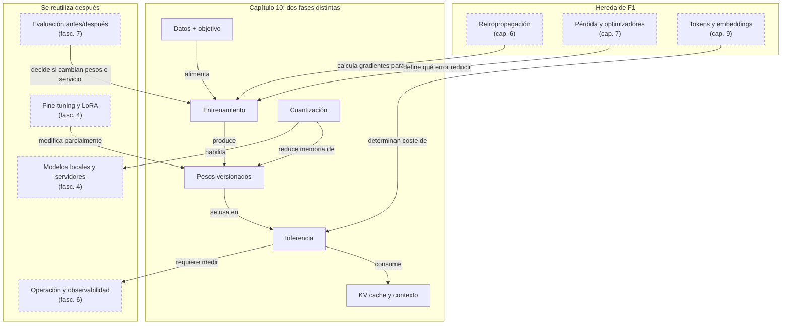

::: {.fasciculo-subtitle}
Facsímil 1 · Los cimientos
:::

# Capítulo 10: Entrenamiento frente a inferencia: dos mundos distintos

## Entrando en el tema

Has pasado nueve capítulos entendiendo cómo funciona una red neuronal por dentro. Neuronas, capas, retropropagación, pérdidas, optimizadores. Todo eso ocurre durante el **entrenamiento**: el proceso de crear el modelo.

Pero tú, como ingeniera, probablemente nunca entrenarás un LLM desde cero. Lo que harás —cientos de veces al día— es **inferencia**: usar un modelo ya entrenado para obtener respuestas. Y estos dos mundos son radicalmente distintos. Confundirlos es como confundir construir una fábrica con comprar el producto que sale de ella.

Este capítulo traza la frontera. Y de paso, explica qué hay entre medias: el *fine-tuning*, la cuantización, y el *pipeline* que convierte una idea en un modelo funcionando en producción.

## Entrenamiento vs inferencia

| Aspecto | Entrenamiento | Inferencia |
|---|---|---|
| **Qué hace** | Ajusta parámetros para reducir una pérdida | Usa parámetros ya ajustados para responder |
| **Duración** | Desde minutos en un modelo pequeño hasta meses en un modelo fundacional | Desde milisegundos hasta minutos según modelo, contexto y carga |
| **Hardware** | CPU/GPU local para modelos pequeños; clústeres enormes para frontera | CPU, GPU local, servidor propio, API o clúster de inferencia |
| **Coste** | Barato en prácticas pequeñas; enorme en pre-entrenamiento a escala | Por petición, por token, por GPU/hora o por infraestructura propia |
| **Quién** | Estudiantes, equipos de datos, universidades y laboratorios; frontera: grandes organizaciones | Cualquier equipo que consuma o sirva un modelo |
| **Frecuencia** | Cuando cambian datos, objetivo o modelo | Cada petición de usuario o proceso automático |

El entrenamiento es crear o modificar el modelo ajustando parámetros.^[Kaplan, J. et al. (2020). Scaling laws for neural language models. arXiv:2001.08361. https://doi.org/10.48550/arXiv.2001.08361. Los autores establecieron las leyes de escala que relacionan el tamaño del modelo, los datos de entrenamiento y la computación necesaria, demostrando que el rendimiento mejora de forma predecible con la inversión.] Si hablamos de un modelo fundacional de frontera, los datos curados se procesan durante semanas o meses en clústeres de GPUs. Si hablamos de un clasificador pequeño, una red de visión acotada o un *fine-tuning* con adaptadores, el entrenamiento puede ocurrir en un portátil potente, una única GPU o una instancia alquilada. La palabra es la misma; la escala no.

La inferencia es usar el modelo.^[Goodfellow, I., Bengio, Y. y Courville, A. (2016). *Deep learning*. MIT Press. https://www.deeplearningbook.org. El capítulo 12.3 aborda las diferencias prácticas entre la fase de entrenamiento y la de inferencia, incluyendo técnicas de optimización específicas para cada una.] Tu *prompt* llega a un runtime, el modelo procesa tokens y recibes una salida. Puede ser una llamada de API, un modelo local con `llama.cpp`, un servidor vLLM, una función interna o un clúster con *batching*. En producción, inferir no es “apretar un botón”: hay latencia, memoria de KV cache, límites de contexto, colas, cuotas, coste por token y monitorización.

El *fine-tuning* está a medio camino: no creas un modelo desde cero, pero sí reentrenas parcialmente uno existente con tus propios datos. Es mucho más barato que el entrenamiento completo, pero más caro que la simple inferencia. Cambia el estilo y comportamiento del modelo, no le «enseña datos nuevos» en tiempo real. Para acceder a datos cambiantes, RAG es mejor opción.

### Las tres fases del entrenamiento

El entrenamiento de un LLM moderno no es un solo paso: son tres fases encadenadas, cada una con un propósito distinto.

**Fase 1: Pre-entrenamiento.** El modelo se entrena sobre cantidades masivas de texto (billones de tokens) con un objetivo simple: predecir la siguiente palabra. No hay etiquetas humanas: el propio texto proporciona la señal. Esta fase consume el 99 % del coste total y produce un modelo que «sabe lenguaje» pero no sabe conversar. Es la fase que más se beneficia de las *scaling laws*: más datos + más parámetros + más cómputo = modelo más capaz.^[Brown, T. B. et al. (2020). Language models are few-shot learners. En *Advances in Neural Information Processing Systems 33* (pp. 1877-1901). https://papers.nips.cc/paper/2020/hash/1457c0d6bfcb4967418bfb8ac142f64a-Abstract.html. GPT-3 demostró que el pre-entrenamiento a escala masiva produce modelos capaces de realizar tareas para las que no fueron explícitamente entrenados (*few-shot learning*).]

**Fase 2: Post-entrenamiento (SFT).** Se entrena al modelo con ejemplos de conversaciones de alta calidad escritas por personas. El modelo pre-entrenado ya sabe completar frases; el SFT le enseña a responder preguntas, seguir instrucciones y mantener un tono conversacional. Es mucho más barato que la fase 1: miles de ejemplos en lugar de billones de tokens.

**Fase 3: Alineamiento (RLHF/DPO).** Personas comparan pares de respuestas del modelo y eligen cuál es mejor. Esa señal de preferencia se usa para refinar el comportamiento: ser útil pero no peligroso, admitir cuando no sabe algo, rechazar peticiones inapropiadas. Es la fase más barata y la que marca la diferencia entre un modelo técnicamente capaz y uno con el que realmente quieres interactuar.

## Programación clásica vs machine learning

El *machine learning* no sustituye a la ingeniería de *software*: cambia dónde escribes la lógica.

En **software clásico**, una persona escribe reglas explícitas: «si el *email* contiene 'gratis' y 'clic aquí', sube la puntuación de *spam*». La lógica vive en código mantenido por personas.

En **machine learning**, das ejemplos etiquetados y dejas que el modelo descubra las reglas. En lugar de escribir «si contiene X, entonces Y», le das diez mil *emails* etiquetados como *spam* o no *spam* y dejas que encuentre los patrones. La lógica queda codificada en parámetros aprendidos, no en sentencias `if`.

En **inferencia**, usas el modelo entrenado: llega un *email* nuevo y el modelo devuelve una probabilidad de *spam*.

| Aspecto | Software clásico | Machine learning |
|---|---|---|
| **Fuente de la lógica** | Reglas escritas por personas | Patrones aprendidos de datos |
| **Cómo se corrige** | Modificar código | Mejorar datos, etiquetas o arquitectura |
| **Testing** | Casos deterministas | Evaluaciones estadísticas |
| **Explicación** | Se rastrea la rama de código | Se analizan pesos, datos y *prompts* |

El riesgo principal: un *bug* en ML puede vivir en el *dataset*, no en el código. El modelo puede aprender atajos espurios —correlaciones que funcionan en entrenamiento pero fallan en producción— y tu código compilará perfectamente mientras el modelo toma decisiones incorrectas.

## El pipeline: de los datos a producción

Un modelo útil no nace cuando termina el entrenamiento. Nace cuando puedes repetir el proceso, comparar versiones y desplegar con control:

```
Decisión → Datos → Etiquetas → Entrenamiento → Evaluación → Registro → Despliegue → Monitorización
```

Cada fase produce artefactos que deberías versionar:

| Fase | Artefacto | Pregunta clave |
|---|---|---|
| **Datos** | *Dataset* versionado | ¿Con qué datos exactos se entrenó? |
| **Entrenamiento** | Código, semilla, hiperparámetros | ¿Puedo reproducir el modelo? |
| **Evaluación** | Informe con métricas y segmentos | ¿Dónde mejora y dónde empeora? |
| **Despliegue** | Configuración de *runtime* | ¿Qué latencia, coste y *fallback* tendrá? |
| **Monitorización** | Métricas y alertas | ¿Cómo sé que en producción ha cambiado algo? |

El criterio para desplegar no es «el modelo es mejor». Es: `release_ok = data_ok AND eval_ok AND safety_ok AND rollback_ok`. Si no puedes volver atrás, no despliegues.

## Entrenar no es desplegar

El modelo que gana en métricas *offline* puede ser inviable en producción. Quizás tarda demasiado, consume demasiada memoria, no explica sus fallos o no se puede monitorizar. Desplegar no es copiar un archivo: es integrar un sistema.

Cinco técnicas cierran la brecha entre el modelo entrenado y el servicio desplegado:

| Técnica | Qué hace | Cuándo ayuda | Contrapartida |
|---|---|---|---|
| **Pruning** | Elimina pesos o neuronas poco útiles | Reducir tamaño cuando hay redundancia | Puede degradar calidad |
| **Cuantización** | Guarda pesos con menos bits (FP16→INT8→INT4) | Inferencia local, *edge* | Puede perder precisión |
| **Destilación** | Un modelo grande enseña a uno pequeño | Casos repetitivos de bajo coste | El alumno hereda sesgos del maestro |
| **Compilación** | Optimiza para *hardware* concreto | Servir mucho tráfico con GPU/TPU específica | Más dependencia del *runtime* |
| ***Batching*** | Agrupa peticiones | *Throughput* alto | Puede aumentar latencia individual |

## Cuantización: modelos que caben en tu portátil

La cuantización merece un apartado propio porque es la técnica que ha democratizado el acceso a los LLMs.^[Jacob, B. et al. (2018). Quantization and training of neural networks for efficient integer-arithmetic-only inference. En *Proceedings of the IEEE Conference on Computer Vision and Pattern Recognition* (pp. 2704-2713). https://doi.org/10.1109/CVPR.2018.00286. Los autores establecieron el marco para la cuantización de redes neuronales, demostrando que es posible mantener la precisión reduciendo la representación numérica de 32 a 8 bits.]

La idea es simple: en lugar de guardar cada peso como un número de 16 bits (FP16), lo guardas con 8 bits (INT8), 4 bits (INT4) o incluso 2 bits. Ocupa la mitad, un cuarto o un octavo de memoria. Un modelo de 7B parámetros que en FP16 ocupa ~14 GB, cuantizado a 4 bits ocupa ~3,5 GB. Cabe en un portátil.

La contrapartida es la precisión. Al reducir el número de bits, algunos pesos pierden matices. Para la mayoría de tareas, la pérdida puede ser pequeña. Para tareas que requieren cálculo preciso, seguimiento largo de instrucciones o respuestas muy sensibles al detalle, la degradación puede ser notable.^[Dettmers, T., Pagnoni, A., Holtzman, A. y Zettlemoyer, L. (2023). QLoRA: efficient finetuning of quantized LLMs. En *Advances in Neural Information Processing Systems 36*. https://arxiv.org/abs/2305.14314. QLoRA combina cuantización de 4 bits con adaptadores LoRA, permitiendo hacer *fine-tuning* de modelos de 65B parámetros en una sola GPU de 48 GB.] La clave está en evaluar con tus datos y tu tarea.

Formatos comunes:
- **GGUF**: para inferencia en CPU con llama.cpp. Ideal para portátiles.
- **GPTQ / AWQ**: para inferencia en GPU con menor latencia.
- **BitsAndBytes**: para cargar modelos cuantizados en Python con Hugging Face.

<svg xmlns="http://www.w3.org/2000/svg" viewBox="0 0 980 640" role="img" aria-label="Dos mundos de un modelo: crear pesos durante entrenamiento y usar pesos durante inferencia">
  <title>Entrenamiento frente a inferencia: crear pesos y usar pesos</title>
  <defs>
    <marker id="f1c10-arrow" viewBox="0 0 10 10" refX="9" refY="5" markerWidth="6" markerHeight="6" orient="auto"><path d="M 0 0 L 10 5 L 0 10 z" fill="#333333"/></marker>
  </defs>
  <rect x="20" y="20" width="940" height="590" rx="18" fill="#FFFFFF" stroke="#111111" stroke-width="1.4"/>
  <text x="490" y="58" text-anchor="middle" font-family="Arial, sans-serif" font-size="24" font-weight="700" fill="#111111">Dos mundos: crear el modelo y usarlo</text>
  <text x="490" y="84" text-anchor="middle" font-family="Arial, sans-serif" font-size="13" fill="#666666">Entrenar cambia los pesos. Inferir aplica pesos ya aprendidos a una entrada nueva.</text>
  <rect x="58" y="118" width="410" height="402" rx="16" fill="#F5F5F5" stroke="#111111" stroke-width="1.3"/>
  <text x="88" y="150" font-family="Arial, sans-serif" font-size="17" font-weight="700" fill="#111111">Crear el modelo</text>
  <text x="88" y="174" font-family="Arial, sans-serif" font-size="12" fill="#555555">Coste alto, semanas, GPUs, datasets enormes.</text>
  <g font-family="Arial, sans-serif" fill="#111111">
    <rect x="88" y="214" width="148" height="58" rx="10" fill="#FFFFFF" stroke="#333333"/>
    <text x="162" y="238" text-anchor="middle" font-size="13" font-weight="700">datos masivos</text>
    <text x="162" y="256" text-anchor="middle" font-size="11" fill="#555555">tokens + limpieza</text>
    <rect x="278" y="214" width="148" height="58" rx="10" fill="#FFFFFF" stroke="#333333"/>
    <text x="352" y="238" text-anchor="middle" font-size="13" font-weight="700">pre-training</text>
    <text x="352" y="256" text-anchor="middle" font-size="11" fill="#555555">aprende pesos</text>
    <rect x="88" y="312" width="148" height="58" rx="10" fill="#FFFFFF" stroke="#333333"/>
    <text x="162" y="336" text-anchor="middle" font-size="13" font-weight="700">post-training</text>
    <text x="162" y="354" text-anchor="middle" font-size="11" fill="#555555">SFT, RLHF, DPO</text>
    <rect x="278" y="312" width="148" height="58" rx="10" fill="#FFFFFF" stroke="#333333"/>
    <text x="352" y="336" text-anchor="middle" font-size="13" font-weight="700">evaluación</text>
    <text x="352" y="354" text-anchor="middle" font-size="11" fill="#555555">calidad y seguridad</text>
    <rect x="152" y="424" width="210" height="54" rx="12" fill="#FFFFFF" stroke="#111111" stroke-width="1.6"/>
    <text x="257" y="446" text-anchor="middle" font-size="13" font-weight="700">pesos del modelo</text>
    <text x="257" y="464" text-anchor="middle" font-family="Menlo, monospace" font-size="11" fill="#555555">W, b, embeddings...</text>
  </g>
  <line x1="236" y1="243" x2="274" y2="243" stroke="#333333" marker-end="url(#f1c10-arrow)"/>
  <path d="M352 272 C352 292 162 292 162 308" fill="none" stroke="#333333" marker-end="url(#f1c10-arrow)"/>
  <line x1="236" y1="341" x2="274" y2="341" stroke="#333333" marker-end="url(#f1c10-arrow)"/>
  <path d="M352 370 C352 404 257 396 257 420" fill="none" stroke="#333333" marker-end="url(#f1c10-arrow)"/>
  <line x1="490" y1="118" x2="490" y2="520" stroke="#D8D8D8" stroke-dasharray="7 6"/>
  <text x="490" y="540" text-anchor="middle" font-family="Arial, sans-serif" font-size="11" fill="#777777">frontera: de pesos aprendidos a producto usable</text>
  <rect x="512" y="118" width="410" height="402" rx="16" fill="#FFFFFF" stroke="#111111" stroke-width="1.3"/>
  <text x="542" y="150" font-family="Arial, sans-serif" font-size="17" font-weight="700" fill="#111111">Usar el modelo</text>
  <text x="542" y="174" font-family="Arial, sans-serif" font-size="12" fill="#555555">Coste por petición, segundos, latencia y memoria.</text>
  <g font-family="Arial, sans-serif" fill="#111111">
    <rect x="542" y="212" width="136" height="58" rx="10" fill="#F5F5F5" stroke="#333333"/>
    <text x="610" y="235" text-anchor="middle" font-size="13" font-weight="700">entrada</text>
    <text x="610" y="253" text-anchor="middle" font-size="11" fill="#555555">prompt + contexto</text>
    <rect x="724" y="212" width="154" height="58" rx="10" fill="#F5F5F5" stroke="#333333"/>
    <text x="801" y="235" text-anchor="middle" font-size="13" font-weight="700">runtime</text>
    <text x="801" y="253" text-anchor="middle" font-size="11" fill="#555555">API, GPU o local</text>
    <rect x="542" y="314" width="136" height="58" rx="10" fill="#F5F5F5" stroke="#333333"/>
    <text x="610" y="337" text-anchor="middle" font-size="13" font-weight="700">RAG</text>
    <text x="610" y="355" text-anchor="middle" font-size="11" fill="#555555">añade documentos</text>
    <rect x="724" y="314" width="154" height="58" rx="10" fill="#F5F5F5" stroke="#333333"/>
    <text x="801" y="337" text-anchor="middle" font-size="13" font-weight="700">salida</text>
    <text x="801" y="355" text-anchor="middle" font-size="11" fill="#555555">respuesta, clase, acción</text>
    <rect x="568" y="424" width="284" height="54" rx="12" fill="#F5F5F5" stroke="#111111" stroke-width="1.4"/>
    <text x="710" y="446" text-anchor="middle" font-size="13" font-weight="700">cuantización</text>
    <text x="710" y="464" text-anchor="middle" font-family="Menlo, monospace" font-size="11" fill="#555555">FP16: 14 GB → INT4: 3,5 GB</text>
  </g>
  <line x1="678" y1="241" x2="720" y2="241" stroke="#333333" marker-end="url(#f1c10-arrow)"/>
  <path d="M801 270 C801 292 610 292 610 310" fill="none" stroke="#333333" marker-end="url(#f1c10-arrow)"/>
  <line x1="678" y1="343" x2="720" y2="343" stroke="#333333" marker-end="url(#f1c10-arrow)"/>
  <path d="M801 372 C801 404 710 398 710 420" fill="none" stroke="#333333" marker-end="url(#f1c10-arrow)"/>
  <text x="490" y="575" text-anchor="middle" font-family="Arial, sans-serif" font-size="12" fill="#666666">Fine-tuning queda entre ambos mundos: vuelve a cambiar pesos, pero desde un modelo ya aprendido.</text>
  <text x="940" y="592" text-anchor="end" font-family="Arial, sans-serif" font-size="10" fill="#9A9A9A">IA para gente curiosa / Facsímil 01 / Capítulo 10 / 686f6c61</text>
</svg>

## En el día a día

- **No entrenas, infieres.** Tu día a día con IA es inferencia: llamadas a API, *prompts*, respuestas. El entrenamiento lo hacen los proveedores.
- **Haces *fine-tuning* cuando necesitas especialización.** Si el modelo base no conoce tu dominio, el *fine-tuning* es la herramienta. Pero evalúa antes si RAG resuelve tu problema sin el coste de reentrenar.
- **Cuantizas para abaratar.** Si usas modelos *open weights*, la cuantización te permite ejecutarlos en hardware más modesto. De 14 GB a 3,5 GB es la diferencia entre necesitar una GPU de 24 GB y poder usar una de 8 GB.
- **Versionas todo.** El *dataset*, el código de entrenamiento, los hiperparámetros, la configuración de despliegue. Si no puedes reproducir tu modelo, no puedes depurarlo.

## Por qué debería importarte

La frontera entre entrenamiento e inferencia es la frontera entre lo que haces tú y lo que hace el proveedor. Si no la entiendes, tomarás decisiones equivocadas: intentarás «entrenar» un modelo cuando bastaba con un buen *prompt*, o asumirás que el modelo «sabe» cosas que solo aprendió durante el entrenamiento y no puede actualizar.

Entender el *pipeline* completo —de los datos a la monitorización— es lo que separa un prototipo que funciona en una *demo* de un sistema que funciona en producción. Y la cuantización es la herramienta que convierte «necesito un clúster de GPUs» en «cabe en mi portátil».

## Dónde solía tropezar yo

| Error | Por qué es un error | Antídoto |
|---|---|---|
| **Confundir *fine-tuning* con «enseñar datos nuevos»** | El *fine-tuning* ajusta el estilo y comportamiento, no inyecta conocimiento factual actualizable. Para datos cambiantes, usa RAG. | Si tus datos cambian cada día, RAG. Si necesitas que el modelo hable con tu jerga, *fine-tuning*. |
| **Cuantizar sin evaluar** | Pasar de FP16 a INT4 puede degradar el rendimiento en tareas que requieren precisión. Asumir que «no se nota» es peligroso. | Evalúa con tus datos y tu tarea antes y después de cuantizar. No delegues esta decisión. |
| **Desplegar sin *rollback*** | Si el modelo nuevo funciona peor en producción, necesitas volver al anterior en minutos, no en días. | Diseña el despliegue con *rollback* desde el primer día. No es opcional. |
| **Tratar el modelo como una caja negra** | Si no sabes con qué datos se entrenó, no puedes explicar sus sesgos. Si no versionas el *pipeline*, no puedes reproducir resultados. | Versiona datos, código, hiperparámetros y configuración. La trazabilidad no es burocracia: es ingeniería. |

## Manos a la obra

La práctica está en `labs/f1/c10-train-infer-budget/`. En vez de pedirte que cargues un modelo que quizá no cabe en tu máquina, el kit calcula primero el presupuesto: memoria de pesos, memoria aproximada de KV cache, margen de VRAM y memoria de entrenamiento.

Esto reproduce una conversación real de ingeniería: «¿lo sirvo local?», «¿uso API?», «¿hago LoRA?», «¿tiene sentido entrenar desde cero?». La respuesta no depende solo del tamaño del modelo. Depende de precisión, contexto, batch, GPU, datos disponibles, privacidad y evaluación.

| Archivo | Qué contiene |
|---|---|
| `Makefile` | Atajos para ejecutar, probar y limpiar. |
| `requirements.txt` | Declara que el kit no requiere paquetes externos. |
| `data/model_scenarios.json` | Escenarios de inferencia local, API + RAG, LoRA y entrenamiento desde cero. |
| `contracts/deployment_policy.json` | Bytes por precisión, margen de VRAM y mínimos de datos. |
| `ops/plan_train_infer.py` | Calculadora de pesos, KV cache, memoria de entrenamiento y recomendación. |
| `tests/test_train_infer_budget.py` | Comprueba que el informe separa entrenamiento, inferencia y memoria de contexto. |
| `output/train_infer_report.json` | Informe estructurado por escenario. |
| `output/train_infer_decision.md` | Decisión técnica legible. |

Ejecuta:

```bash
cd labs/f1/c10-train-infer-budget
python3 ops/plan_train_infer.py --write
cat output/train_infer_decision.md
```

Valida el kit:

```bash
cd labs/f1/c10-train-infer-budget
make run
make test
```

Después cambia un escenario: sube el contexto, cambia `int4` por `fp16`, aumenta el `batch_size` o reduce la VRAM. Verás una cosa importante: cuantizar baja la memoria de pesos, pero el contexto largo sigue costando KV cache. Un modelo puede «caber» con un prompt corto y dejar de caber cuando lo usas como producto.

**Qué entregaría un alumno.** El Markdown generado, un escenario propio con GPU y contexto realistas, una comparación de FP16/INT8/INT4, el resultado de `make test` y una decisión escrita: API, local, RAG, fine-tuning o no construir todavía.

Si después quieres probar cuantización real, entonces sí tiene sentido ir a Hugging Face, `bitsandbytes`, Ollama, LM Studio o `llama.cpp`. Pero primero haz el presupuesto. Descargar un modelo no es una estrategia.

## Cómo encaja todo

Este mapa separa tres decisiones que suelen mezclarse. Primero, de dónde viene el modelo: entrenamiento, post-entrenamiento o ajuste parcial. Segundo, cómo se usa: inferencia con una ventana de contexto, una KV cache y una política de servicio. Tercero, cómo se lleva a producción: presupuesto, cuantización, despliegue y observabilidad.

La herencia viene de backpropagation, pérdida y optimizadores: esas piezas explican cómo cambian los pesos. La reutilización aparece en los próximos facsímiles cuando elijas entre API, modelo local, RAG, fine-tuning o despliegue propio. Si no separas estas capas, confundirás “necesito más conocimiento” con “necesito entrenar” y gastarás tiempo en el sitio equivocado.



## Vocabulario aprendido

| Término | Definición |
|---|---|
| **Entrenamiento** | Proceso de ajustar parámetros con datos y una función de pérdida. Puede ir desde una práctica pequeña hasta pre-entrenamiento de frontera. |
| **Inferencia** | Uso de un modelo ya entrenado para generar o calcular salidas a partir de entradas nuevas. |
| ***Fine-tuning*** | Reentrenamiento parcial de un modelo existente con datos propios para especializarlo. |
| **Cuantización** | Reducción de la precisión numérica de los pesos para ahorrar memoria y acelerar inferencia. |
| **Pipeline ML** | Secuencia de fases desde la decisión inicial hasta la monitorización en producción. |

## Antes de pasar página

- [ ] ¿Puedo explicar las diferencias entre entrenamiento, inferencia y *fine-tuning*? (Si no, vuelve a «Entrenamiento vs inferencia».)
- [ ] ¿Entiendo la diferencia fundamental entre programación clásica y ML? (Si no, vuelve a «Programación clásica vs machine learning».)
- [ ] ¿Puedo enumerar las fases del *pipeline* ML? (Si no, vuelve a «El pipeline».)
- [ ] ¿Sé qué es la cuantización y cuándo usarla? (Si no, vuelve a «Cuantización».)
- [ ] ¿He ejecutado `labs/f1/c10-train-infer-budget/` y puedo explicar por qué KV cache también consume memoria? (Si no, vuelve a «Manos a la obra».)

## En resumen

| Idea fuerza | Detalle |
|---|---|
| Entrenar cambia pesos; inferir usa pesos. | Pre-entrenar un modelo fundacional puede costar millones y tardar meses; entrenar modelos pequeños o ajustar adaptadores puede ser mucho más accesible. La inferencia también escala: puede ser una llamada barata o un sistema complejo de servicio. |
| El ML no sustituye al *software*: cambia dónde vive la lógica. | De reglas escritas por personas a patrones aprendidos de datos. El *bug* puede estar en el *dataset*, no en el código. |
| La cuantización democratiza el acceso a los LLMs. | De 14 GB a 3,5 GB con 4 bits. Evalúa siempre antes de desplegar: la pérdida de precisión depende de tu tarea. |

## Para saber más

Brown, T. B. et al. (2020). Language models are few-shot learners. En *Advances in Neural Information Processing Systems 33* (pp. 1877-1901). https://papers.nips.cc/paper/2020/hash/1457c0d6bfcb4967418bfb8ac142f64a-Abstract.html

Dettmers, T., Pagnoni, A., Holtzman, A. y Zettlemoyer, L. (2023). QLoRA: efficient finetuning of quantized LLMs. En *Advances in Neural Information Processing Systems 36*. https://arxiv.org/abs/2305.14314

Goodfellow, I., Bengio, Y. y Courville, A. (2016). *Deep learning*. MIT Press. https://www.deeplearningbook.org

Jacob, B. et al. (2018). Quantization and training of neural networks for efficient integer-arithmetic-only inference. En *Proceedings of the IEEE Conference on Computer Vision and Pattern Recognition* (pp. 2704-2713). https://doi.org/10.1109/CVPR.2018.00286

Kaplan, J. et al. (2020). Scaling laws for neural language models. arXiv:2001.08361. https://doi.org/10.48550/arXiv.2001.08361

Russell, S. y Norvig, P. (2021). *Artificial intelligence: a modern approach* (4.ª ed.). Pearson.

Vaswani, A., Shazeer, N., Parmar, N., Uszkoreit, J., Jones, L., Gomez, A. N., Kaiser, Ł. y Polosukhin, I. (2017). Attention is all you need. En *Advances in Neural Information Processing Systems 30* (pp. 5998-6008). https://papers.nips.cc/paper/7181-attention-is-all-you-need
