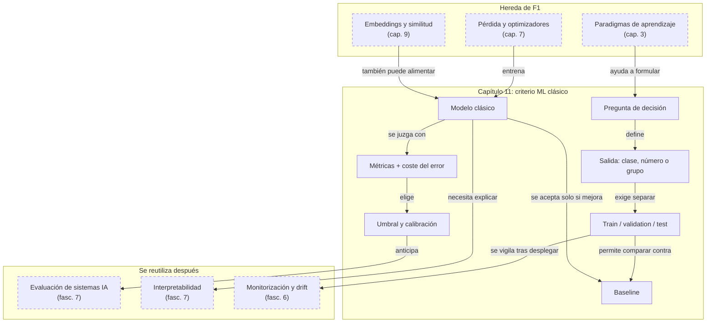

::: {.fasciculo-subtitle}
Facsímil 1 · Los cimientos
:::

# Capítulo 11: Machine learning clásico: el mapa antes de los LLM

## Entrando en el tema

Hemos pasado diez capítulos construyendo los cimientos: neuronas, redes, retropropagación, embeddings. Todo eso es *deep learning*. Pero antes del *deep learning* —y todavía hoy, para la mayoría de problemas del mundo real— existe el *machine learning* clásico.

No es un primo pobre. Es un conjunto de herramientas más simples, más rápidas y más interpretables que resuelven la mayoría de problemas que te encontrarás. Clasificar correos, predecir ventas, detectar fraude, agrupar clientes: todo esto se hacía con ML clásico décadas antes de que existiera ChatGPT. Y se sigue haciendo.

Este capítulo es tu mapa. No te convertirá en experto en cada técnica, pero te dará el vocabulario para saber qué buscar cuando te enfrentes a un problema real.

## El paisaje del ML clásico

El *machine learning* se organiza alrededor de una pregunta fundamental: ¿qué tipo de señal de aprendizaje tienes?^[Russell, S. y Norvig, P. (2021). *Artificial intelligence: a modern approach* (4.ª ed.). Pearson. Los capítulos 18 a 21 cubren los paradigmas de aprendizaje y establecen el marco conceptual para clasificar cualquier problema de ML según el tipo de datos y retroalimentación disponible.]

**Supervisado.** Tienes ejemplos etiquetados: cada entrada viene con su respuesta correcta. «Este *email* es *spam*», «esta imagen contiene un gato», «esta transacción es fraudulenta». El modelo aprende a imitar esas etiquetas. Es el paradigma más común y el que mejor funciona cuando tienes datos etiquetados de calidad.

**No supervisado.** No tienes etiquetas. Buscas estructura oculta: agrupar clientes por comportamiento, detectar anomalías, reducir la dimensionalidad de tus datos. El modelo encuentra patrones, pero tú tienes que interpretarlos. Que el algoritmo encuentre tres grupos no significa que esos tres grupos signifiquen algo útil para tu negocio.

**Refuerzo.** No tienes ejemplos etiquetados, pero sí una señal de recompensa. Un agente actúa en un entorno, recibe *feedback* y aprende a maximizar la recompensa acumulada. Es el paradigma de los juegos, la robótica y, cada vez más, del post-entrenamiento de LLMs (RLHF).

**Semi-supervisado y auto-supervisado.** Variantes híbridas. El semi-supervisado combina unos pocos ejemplos etiquetados con muchos sin etiquetar. El auto-supervisado genera sus propias etiquetas a partir de los datos: predecir la siguiente palabra en un texto, predecir la zona recortada de una imagen. Es el paradigma que hizo posibles los LLMs.

<svg xmlns="http://www.w3.org/2000/svg" viewBox="0 0 980 620" role="img" aria-label="Árbol de decisión para elegir un enfoque de machine learning clásico antes de elegir modelo">
  <title>La pregunta correcta antes del modelo</title>
  <defs>
    <marker id="f1c11-arrow" viewBox="0 0 10 10" refX="9" refY="5" markerWidth="6" markerHeight="6" orient="auto"><path d="M 0 0 L 10 5 L 0 10 z" fill="#333333"/></marker>
  </defs>
  <rect x="20" y="20" width="940" height="570" rx="18" fill="#FFFFFF" stroke="#111111" stroke-width="1.4"/>
  <text x="490" y="58" text-anchor="middle" font-family="Arial, sans-serif" font-size="24" font-weight="700" fill="#111111">La pregunta correcta antes del modelo</text>
  <text x="490" y="84" text-anchor="middle" font-family="Arial, sans-serif" font-size="13" fill="#666666">No empieces por “random forest o red neuronal”. Empieza por decisión, señal, salida y métrica.</text>
  <rect x="330" y="118" width="320" height="64" rx="14" fill="#F5F5F5" stroke="#111111" stroke-width="1.5"/>
  <text x="490" y="143" text-anchor="middle" font-family="Arial, sans-serif" font-size="15" font-weight="700" fill="#111111">¿Qué decisión quieres mejorar?</text>
  <text x="490" y="164" text-anchor="middle" font-family="Arial, sans-serif" font-size="12" fill="#555555">bloquear fraude, priorizar tickets, predecir demanda...</text>
  <line x1="490" y1="182" x2="490" y2="220" stroke="#333333" stroke-width="1.4" marker-end="url(#f1c11-arrow)"/>
  <rect x="90" y="232" width="220" height="150" rx="14" fill="#FFFFFF" stroke="#111111"/>
  <text x="200" y="260" text-anchor="middle" font-family="Arial, sans-serif" font-size="15" font-weight="700" fill="#111111">Señal disponible</text>
  <line x1="116" y1="278" x2="284" y2="278" stroke="#D8D8D8"/>
  <text x="116" y="306" font-family="Arial, sans-serif" font-size="12" fill="#111111">etiquetas → supervisado</text>
  <text x="116" y="330" font-family="Arial, sans-serif" font-size="12" fill="#111111">sin etiquetas → estructura</text>
  <text x="116" y="354" font-family="Arial, sans-serif" font-size="12" fill="#111111">recompensa → política</text>
  <rect x="380" y="232" width="220" height="150" rx="14" fill="#F5F5F5" stroke="#111111"/>
  <text x="490" y="260" text-anchor="middle" font-family="Arial, sans-serif" font-size="15" font-weight="700" fill="#111111">Salida necesaria</text>
  <line x1="406" y1="278" x2="574" y2="278" stroke="#D8D8D8"/>
  <text x="406" y="306" font-family="Arial, sans-serif" font-size="12" fill="#111111">categoría → clasificación</text>
  <text x="406" y="330" font-family="Arial, sans-serif" font-size="12" fill="#111111">número → regresión</text>
  <text x="406" y="354" font-family="Arial, sans-serif" font-size="12" fill="#111111">grupo → clustering</text>
  <rect x="670" y="232" width="220" height="150" rx="14" fill="#FFFFFF" stroke="#111111"/>
  <text x="780" y="260" text-anchor="middle" font-family="Arial, sans-serif" font-size="15" font-weight="700" fill="#111111">Métrica de verdad</text>
  <line x1="696" y1="278" x2="864" y2="278" stroke="#D8D8D8"/>
  <text x="696" y="306" font-family="Arial, sans-serif" font-size="12" fill="#111111">recall si perder fraude duele</text>
  <text x="696" y="330" font-family="Arial, sans-serif" font-size="12" fill="#111111">MAE si importa cuánto fallas</text>
  <text x="696" y="354" font-family="Arial, sans-serif" font-size="12" fill="#111111">latencia si decide en vivo</text>
  <line x1="330" y1="150" x2="200" y2="228" stroke="#333333" stroke-width="1.3" marker-end="url(#f1c11-arrow)"/>
  <line x1="490" y1="182" x2="490" y2="228" stroke="#333333" stroke-width="1.3" marker-end="url(#f1c11-arrow)"/>
  <line x1="650" y1="150" x2="780" y2="228" stroke="#333333" stroke-width="1.3" marker-end="url(#f1c11-arrow)"/>
  <rect x="90" y="438" width="800" height="80" rx="16" fill="#F5F5F5" stroke="#111111"/>
  <text x="120" y="466" font-family="Arial, sans-serif" font-size="15" font-weight="700" fill="#111111">Entonces eliges candidatos</text>
  <text x="120" y="491" font-family="Arial, sans-serif" font-size="12" fill="#111111">regresión logística · árboles · random forest · gradient boosting · k-means · PCA · modelos lineales</text>
  <text x="120" y="512" font-family="Arial, sans-serif" font-size="12" fill="#555555">El modelo es consecuencia del problema formulado, no el punto de partida.</text>
  <line x1="200" y1="382" x2="300" y2="434" stroke="#333333" stroke-width="1.2" marker-end="url(#f1c11-arrow)"/>
  <line x1="490" y1="382" x2="490" y2="434" stroke="#333333" stroke-width="1.2" marker-end="url(#f1c11-arrow)"/>
  <line x1="780" y1="382" x2="680" y2="434" stroke="#333333" stroke-width="1.2" marker-end="url(#f1c11-arrow)"/>
  <rect x="270" y="544" width="440" height="28" rx="14" fill="#FFFFFF" stroke="#333333" stroke-dasharray="6 4"/>
  <text x="490" y="563" text-anchor="middle" font-family="Arial, sans-serif" font-size="12" fill="#555555">Pregunta guía: ¿qué salida accionable necesito y cómo sabré que generaliza?</text>
  <text x="940" y="592" text-anchor="end" font-family="Arial, sans-serif" font-size="10" fill="#9A9A9A">IA para gente curiosa / Facsímil 01 / Capítulo 11 / 686f6c61</text>
</svg>

## Anatomía de un dataset

Antes de elegir algoritmo, necesitas entender tus datos.^[Bishop, C. M. (2006). *Pattern recognition and machine learning*. Springer. El capítulo 1 establece los fundamentos de la teoría de la probabilidad y la decisión, y define la terminología básica de *datasets*, *features* y variables objetivo.]

- **Instancia (fila):** un ejemplo concreto. Un cliente, una transacción, una imagen, un *email*.
- **Feature (columna, variable, atributo):** una característica medible de la instancia. Edad, importe, número de caracteres, color promedio.
- **Label / target (etiqueta):** lo que quieres predecir. «Fraude / No fraude», «150 000 €», «Categoría A».
- **Dataset:** el conjunto de instancias con sus *features* y, si es supervisado, sus etiquetas.

Regla práctica: si no puedes explicar qué representa cada fila, qué significa cada columna y qué decisión habilita la predicción, no tienes un problema de ML. Tienes datos sueltos. Resolver esa ambigüedad es el primer paso de cualquier proyecto.

## Clasificación vs regresión

La primera decisión técnica es el tipo de salida.^[Hastie, T., Tibshirani, R. y Friedman, J. (2009). *The elements of statistical learning* (2.ª ed.). Springer. https://web.stanford.edu/~hastie/ElemStatLearn/. El capítulo 2 ofrece una visión general de aprendizaje supervisado y establece la distinción fundamental entre problemas de clasificación y regresión.]

**Clasificación.** La salida es una categoría discreta. «*Spam* / No *spam*», «Gato / Perro / Pájaro», «Fraude / No fraude». El modelo predice una clase o una distribución de probabilidad sobre las clases. Con esa probabilidad, tú decides el umbral: ¿bloqueo toda transacción con probabilidad de fraude > 0.3, o solo las que superan 0.9?

**Regresión.** La salida es un valor continuo. El precio de una casa, la temperatura de mañana, los ingresos del próximo trimestre. Aquí no existe «acertar o fallar» de forma binaria: importa cuánto te alejas del valor real. Un error de 1 000 € en una predicción de 300 000 € es aceptable; un error de 100 000 € no lo es.

Error común: convertir todo en clasificación porque es más cómodo. Si el valor numérico importa para decidir, usa regresión. Si solo importa el orden relativo, quizá necesitas *ranking*. Si una probabilidad dispara una acción, necesitas calibración, no solo clasificación.

## Validación: cómo saber si generaliza

Entrenar un modelo es fácil. Lo difícil es saber si funcionará con datos que no ha visto nunca.^[Goodfellow, I., Bengio, Y. y Courville, A. (2016). *Deep learning*. MIT Press. https://www.deeplearningbook.org. El capítulo 5.2 aborda las técnicas de validación y la importancia de separar correctamente los conjuntos de entrenamiento, validación y prueba para obtener estimaciones fiables del rendimiento.]

**Train / validation / test.** Divide tus datos en tres conjuntos antes de tocar nada. Entrenas con *train*, ajustas hiperparámetros con *validation* y mides el rendimiento final con *test*. Si usas *test* para tomar decisiones, ya no es *test*: es *validation* y necesitas uno nuevo.

**Cross-validation.** Cuando tienes pocos datos, el *k-fold* entrena el modelo K veces, cada una con una partición distinta de train/validation. Te da una estimación más robusta del rendimiento y su variabilidad. No te fíes de una sola métrica con suerte.

**Data leakage.** El error más insidioso. Una columna que contiene información del futuro, un identificador que correlaciona con la etiqueta, un duplicado entre train y test. El modelo aprende una señal que no existirá en producción. Y tu métrica de validación será excelente... hasta que despliegues.

**Data drift.** El mundo cambia. Tus clientes cambian, los precios cambian, las campañas de *marketing* cambian. Un modelo entrenado con datos de 2023 puede fallar en 2026 aunque el código no haya cambiado. Monitoriza.

## Overfitting y underfitting

**Overfitting.** El modelo memoriza los datos de entrenamiento. La pérdida de entrenamiento es mínima, pero la de validación es alta. Es el estudiante que se aprende las respuestas del examen de memoria: saca un 10 en el simulacro y suspende el examen real.^[Breiman, L. (2001). Random forests. *Machine Learning*, 45(1), 5-32. https://doi.org/10.1023/A:1010933404324. Breiman demostró que los *ensembles* de árboles de decisión, como los *random forests*, mitigan el *overfitting* al promediar múltiples modelos entrenados con subconjuntos distintos de datos.] Solución: más datos, regularización, *dropout*, modelos más simples.

**Underfitting.** El modelo es demasiado simple para capturar los patrones de los datos. Tanto la pérdida de entrenamiento como la de validación son altas. Es el estudiante que ni siquiera ha abierto el libro. Solución: modelo más complejo, más *features*, más tiempo de entrenamiento.

El diagnóstico rápido: si ambas pérdidas son altas → *underfitting*. Si la de entrenamiento es baja pero la de validación es alta → *overfitting*. Si ambas son bajas y cercanas → buen trabajo.

## Matriz de confusión, precision y recall

Cuando clasificas, la exactitud (*accuracy*) no cuenta toda la historia. Imagina un detector de fraude: el 99 % de las transacciones son legítimas. Un modelo que diga «no fraude» siempre tendrá un 99 % de *accuracy*. Y será completamente inútil.

La **matriz de confusión** desglosa lo que realmente ocurre:

|  | Predicho: positivo | Predicho: negativo |
|---|---|---|
| **Real: positivo** | TP (verdadero positivo) | FN (falso negativo) |
| **Real: negativo** | FP (falso positivo) | TN (verdadero negativo) |

De aquí salen las métricas que importan:

- **Precision:** de todo lo que el modelo dijo «positivo», ¿cuánto era realmente positivo? TP / (TP + FP). Si predice fraude, ¿cuántas alertas son fraudes reales?
- **Recall (sensibilidad):** de todo lo que era realmente positivo, ¿cuánto detectó el modelo? TP / (TP + FN). De todos los fraudes, ¿cuántos capturaste?
- **F1:** media armónica de *precision* y *recall*. Útil cuando necesitas un equilibrio entre ambas.

La elección entre *precision* y *recall* depende del coste del error. En detección de fraude, un FN (dejar pasar un fraude) puede costar miles de euros; un FP (bloquear una compra legítima) puede costar un cliente. En diagnóstico médico, un FN (no detectar una enfermedad) puede costar una vida. No optimices *accuracy* a ciegas: optimiza la métrica que refleja el coste real del error en tu dominio.

### Baseline, umbral y calibración

Un modelo no se evalúa en el vacío. Se evalúa contra una **baseline**: una regla simple que representa “lo mínimo que habría que superar”. Puede ser predecir siempre la clase mayoritaria, una regla de negocio escrita a mano o el sistema actual. Si tu modelo complejo no mejora claramente esa baseline en la métrica que importa, no has ganado ingeniería; has añadido complejidad.

Después viene el **umbral**. Muchos clasificadores no devuelven directamente una clase, sino una puntuación o probabilidad: “este ticket tiene 0,73 de probabilidad de ser urgente”. Convertir 0,73 en una acción exige una política: con umbral 0,5 quizá escalas demasiados tickets; con 0,9 quizá dejas pasar incidencias graves. El umbral no se elige por estética, sino por coste de FP y FN.

Y si vas a usar la probabilidad como probabilidad, necesitas **calibración**. Un modelo está bien calibrado si, entre todos los casos donde dice 0,8, aproximadamente el 80 % acaba siendo positivo.^[Guo, C., Pleiss, G., Sun, Y. y Weinberger, K. Q. (2017). On calibration of modern neural networks. En *Proceedings of the 34th International Conference on Machine Learning* (pp. 1321-1330). PMLR. https://proceedings.mlr.press/v70/guo17a.html. El artículo muestra que modelos modernos pueden tener alta exactitud y estar mal calibrados, por lo que sus probabilidades no deben interpretarse sin comprobación.] Esto importa cuando una puntuación dispara una acción real: revisión manual, bloqueo, reembolso, alerta médica, priorización de SLA. Un modelo puede ordenar bien los casos y aun así mentir en la escala de sus probabilidades.

## Clustering: agrupar sin etiquetas

A veces no tienes etiquetas, pero sospechas que tus datos tienen estructura. El *clustering* agrupa instancias por similitud. El algoritmo más sencillo y usado es **k-means**:^[MacQueen, J. (1967). Some methods for classification and analysis of multivariate observations. En *Proceedings of the 5th Berkeley Symposium on Mathematical Statistics and Probability* (Vol. 1, pp. 281-297). https://projecteuclid.org/euclid.bsmsp/1200512992. MacQueen introdujo el algoritmo k-means, que sigue siendo uno de los métodos de *clustering* más utilizados por su simplicidad y eficiencia computacional.]

1. Elige K (el número de grupos que quieres encontrar).
2. Coloca K centroides aleatoriamente.
3. Asigna cada punto al centroide más cercano.
4. Recalcula los centroides como la media de los puntos asignados.
5. Repite hasta que los centroides se estabilizan.

Es simple, rápido y funciona sorprendentemente bien. Pero tiene trampas:

- **Tienes que elegir K.** Si no sabes cuántos grupos hay, toca probar. Los métodos del codo (*elbow*) y la silueta (*silhouette*) ayudan, pero no sustituyen el criterio.
- **La distancia importa.** Normalmente se usa distancia euclídea. Si una *feature* tiene valores en millones y otra entre 0 y 1, la primera domina completamente la agrupación. Normaliza.
- **La semilla importa.** Distintas inicializaciones dan distintos resultados. No te cases con la primera agrupación que veas.

**Cuándo no confiar en clusters.** Que el algoritmo encuentre grupos no significa que esos grupos signifiquen algo. Un *cluster* puede ser un artefacto de la métrica de distancia, de una *feature* mal escalada o del azar. Valida siempre contra conocimiento del dominio: ¿tienen sentido esos grupos para quien conoce el negocio? Si no puedes explicar qué tienen en común los miembros de un *cluster*, probablemente no sea un hallazgo, sino ruido.

## En el día a día

- **¿Tu problema es supervisado?** Clasificación si la salida es una categoría, regresión si es un número. Empieza con una regresión logística o un árbol de decisión antes de saltar a redes neuronales.
- **¿No tienes etiquetas?** Clustering para explorar, detección de anomalías para encontrar lo raro, reducción de dimensionalidad para visualizar.
- **¿Pocos datos?** ML clásico. Los árboles, las SVMs y los *ensembles* funcionan con cientos o miles de ejemplos. El *deep learning* empieza a brillar con decenas de miles.
- **¿Necesitas explicar tus decisiones?** Un árbol de decisión te dice exactamente por qué clasificó algo como lo clasificó. Una red neuronal de cien capas, no.

## Por qué debería importarte

El *deep learning* no ha dejado obsoleto al ML clásico. Lo ha complementado. Para muchos problemas —especialmente con datos tabulares y pocos ejemplos—, un *random forest* o una regresión logística siguen siendo más rápidos, más baratos y más interpretables que cualquier red neuronal.

Además, el ML clásico te da el vocabulario para medir. *Precision*, *recall*, *overfitting*, *cross-validation*: estos conceptos no desaparecen cuando usas LLMs. Se vuelven más importantes. Un agente de IA que clasifica tickets de soporte necesita una matriz de confusión igual que un clasificador de *spam* de 2005.

## Dónde solía tropezar yo

| Error | Por qué es un error | Antídoto |
|---|---|---|
| **Medir solo *accuracy*** | En conjuntos desbalanceados (1 % de fraude, 99 % legítimo), un modelo que siempre dice «legítimo» tiene 99 % de *accuracy* y es completamente inútil. | Mira *precision*, *recall* y F1. Si las clases están desbalanceadas, *accuracy* no te dice nada. |
| **No separar train/validation/test** | Si usas los mismos datos para entrenar y evaluar, el modelo parece perfecto... hasta que lo pones en producción. | Separa antes de tocar nada. *Test* se toca una sola vez, al final. |
| **Ignorar la escala de las features** | En k-means (y en cualquier algoritmo basado en distancia), una *feature* con valores grandes domina a las demás. | Normaliza o estandariza tus *features* antes de entrenar. |
| **Interpretar clusters como realidades objetivas** | El algoritmo siempre encuentra grupos, aunque los datos sean ruido puro. | Valida contra conocimiento del dominio. Si los grupos no tienen sentido para el negocio, no los uses para decidir. |

## Manos a la obra

La práctica está en `labs/f1/c11-ml-classic-baseline/`. Entrena una regresión logística pequeña sin dependencias externas sobre un dataset de tickets de soporte y la compara contra una baseline de mayoría.

No usamos `scikit-learn` en el primer paso porque aquí interesa ver el engranaje: separación train/test, normalización de *features*, entrenamiento, matriz de confusión, precision, recall y F1. Después podrás usar librerías profesionales; primero conviene entender qué están calculando.

| Archivo | Qué contiene |
|---|---|
| `Makefile` | Atajos para ejecutar, probar y limpiar. |
| `requirements.txt` | Declara que el ejercicio usa solo Python estándar. |
| `data/support_tickets.csv` | Tickets con horas abiertas, tipo de cliente, SLA, incidentes, urgencia y etiqueta. |
| `contracts/ml_classic_policy.json` | Umbrales de recall, F1, threshold y regla frente a baseline. |
| `ops/run_ml_classic_baseline.py` | Regresión logística desde cero y cálculo de métricas. |
| `tests/test_ml_classic_baseline.py` | Comprueba que se compara contra mayoría y se calcula matriz de confusión. |
| `output/ml_classic_report.json` | Métricas, pesos, predicciones y matriz de confusión. |
| `output/ml_classic_decision.md` | Informe de decisión. |

Ejecuta:

```bash
cd labs/f1/c11-ml-classic-baseline
python3 ops/run_ml_classic_baseline.py --write
cat output/ml_classic_decision.md
```

Valida el kit:

```bash
cd labs/f1/c11-ml-classic-baseline
make run
make test
```

Después añade cinco tickets propios. No busques que el modelo quede perfecto: busca que el ejercicio te obligue a decidir. Si un falso negativo significa que un cliente con SLA se queda sin atender, el `recall` pesa más que la `accuracy`. Si un falso positivo solo crea una revisión manual barata, quizá lo aceptas. La métrica nace del coste del error.

**Qué entregaría un alumno.** El Markdown generado, cinco filas nuevas en el CSV, el resultado de `make test`, una matriz de confusión explicada en lenguaje operativo y una decisión: usar baseline, probar otro modelo, recoger más datos o no automatizar.

Cuando el mecanismo esté claro, rehacer este mismo ejercicio con `scikit-learn` es natural: `LogisticRegression`, `RandomForestClassifier`, `SVC`, validación cruzada y calibración. Pero la primera práctica no debe esconder el concepto detrás de una llamada de librería.

## Cómo encaja todo

Este mapa se lee desde la decisión, no desde el algoritmo. Venimos de los principios del capítulo 3 y de las pérdidas del capítulo 7, pero aquí aparece la disciplina que seguirá en todo el libro: definir salida, baseline, validación y métrica antes de enamorarse de una arquitectura.

Lo que se aprende en este capítulo vuelve después en evaluación de LLMs, calibración, interpretabilidad y operación. Un sistema con agentes o RAG también necesita train/test mental: qué casos pruebo, qué métrica acepto, qué coste tiene cada error y cuándo prefiero una regla simple.



## Vocabulario aprendido

| Término | Definición |
|---|---|
| **Clasificación** | Tarea supervisada donde la salida es una categoría discreta entre un conjunto predefinido de clases. |
| **Regresión** | Tarea supervisada donde la salida es un valor numérico continuo. |
| ***Overfitting*** | El modelo memoriza los datos de entrenamiento y no generaliza a datos nuevos. |
| ***Underfitting*** | El modelo es demasiado simple para capturar los patrones de los datos. |
| **Matriz de confusión** | Tabla que cruza predicciones con valores reales, desglosando aciertos, falsos positivos y falsos negativos. |
| **Precision** | Proporción de predicciones positivas que son realmente correctas. |
| **Recall** | Proporción de casos positivos reales que el modelo detectó. |
| **Baseline** | Regla o sistema simple que el modelo debe superar para justificar su complejidad. |
| **Calibración** | Grado en que las probabilidades predichas se corresponden con frecuencias reales observadas. |
| **Clustering** | Técnica no supervisada que agrupa instancias por similitud sin etiquetas predefinidas. |

## Antes de pasar página

- [ ] ¿Puedo distinguir entre clasificación y regresión con ejemplos concretos? (Si no, vuelve a «Clasificación vs regresión».)
- [ ] ¿Sé interpretar una matriz de confusión? (Si no, vuelve a «Matriz de confusión».)
- [ ] ¿Entiendo la diferencia entre *precision* y *recall*? (Si no, vuelve a esa sección.)
- [ ] ¿Puedo explicar qué baseline usaría y qué umbral elegiría si el coste de FP y FN cambia? (Si no, vuelve a «Baseline, umbral y calibración».)
- [ ] ¿Puedo explicar qué es el *overfitting* y cómo detectarlo? (Si no, vuelve a «Overfitting y underfitting».)
- [ ] ¿He ejecutado `labs/f1/c11-ml-classic-baseline/` y puedo interpretar precision, recall, F1 y falsos negativos? (Si no, vuelve a «Manos a la obra».)

## En resumen

| Idea fuerza | Detalle |
|---|---|
| El ML clásico no ha muerto. | Para datos tabulares, pocos ejemplos o necesidad de explicabilidad, los árboles y las regresiones siguen siendo la mejor opción. |
| La pregunta no es «qué modelo», sino «qué salida, qué señal, cómo mido». | Define el problema antes de elegir la herramienta. Clasificación, regresión, clustering: cada uno tiene sus métricas. |
| Las métricas correctas dependen del coste del error. | No optimices *accuracy* a ciegas. Un FN en diagnóstico médico no vale lo mismo que un FP en recomendaciones de películas. |
| Una probabilidad no es una decisión hasta que eliges baseline, umbral y calibración. | Si el modelo no supera una regla simple o sus probabilidades no son fiables, todavía no tienes un sistema defendible. |
| El *clustering* encuentra estructura, no significado. | Valida siempre contra conocimiento del dominio. Un grupo no es un hallazgo hasta que alguien que conoce el negocio dice «esto tiene sentido». |

## Para saber más

Bishop, C. M. (2006). *Pattern recognition and machine learning*. Springer.

Breiman, L. (2001). Random forests. *Machine Learning*, 45(1), 5-32. https://doi.org/10.1023/A:1010933404324

Goodfellow, I., Bengio, Y. y Courville, A. (2016). *Deep learning*. MIT Press. https://www.deeplearningbook.org

Guo, C., Pleiss, G., Sun, Y. y Weinberger, K. Q. (2017). On calibration of modern neural networks. En *Proceedings of the 34th International Conference on Machine Learning* (pp. 1321-1330). PMLR. https://proceedings.mlr.press/v70/guo17a.html

Hastie, T., Tibshirani, R. y Friedman, J. (2009). *The elements of statistical learning* (2.ª ed.). Springer. https://web.stanford.edu/~hastie/ElemStatLearn/

LeCun, Y., Bengio, Y. y Hinton, G. (2015). Deep learning. *Nature*, 521(7553), 436-444. https://doi.org/10.1038/nature14539

MacQueen, J. (1967). Some methods for classification and analysis of multivariate observations. En *Proceedings of the 5th Berkeley Symposium on Mathematical Statistics and Probability* (Vol. 1, pp. 281-297). https://projecteuclid.org/euclid.bsmsp/1200512992

Russell, S. y Norvig, P. (2021). *Artificial intelligence: a modern approach* (4.ª ed.). Pearson.
