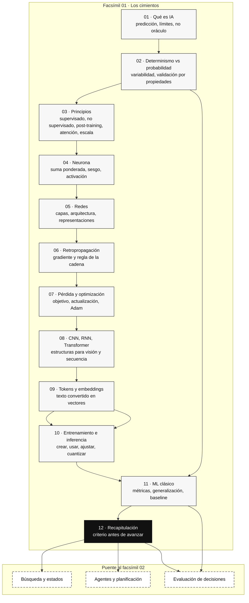

::: {.fasciculo-subtitle}
Facsímil 1 · Los cimientos
:::

# Capítulo 12: Lo que deberías saber: recapitulación de fundamentos

## Entrando en el tema

Has recorrido once capítulos convertidos en una lectura lenta. Has construido una neurona, entrenado una red, propagado errores hacia atrás, tokenizado texto, explorado embeddings y contrastado paradigmas de aprendizaje.

Este capítulo no es un resumen. Es una **revisión activa**: cada sección recupera un concepto nuclear, lo reformula desde otro ángulo, lo conecta con el resto y te confronta con una pregunta. Si algo no te suena, el número de capítulo te dice exactamente dónde volver.

No es un examen. Es un espejo. Si te reconoces en estas páginas, puedes avanzar al facsímil 2.

---

## 1. Qué es y qué no es la IA

**El concepto.** La inteligencia artificial no es consciente, no «piensa» y no es infalible. Es un sistema de predicción estadística de tokens que opera sobre patrones aprendidos de cantidades masivas de datos.^[Russell, S. y Norvig, P. (2021). *Artificial intelligence: a modern approach* (4.ª ed.). Pearson.] La confusión entre elocuencia y corrección es el error más caro que puedes cometer al diseñar sistemas con IA.^[Bender, E. M., Gebru, T., McMillan-Major, A. y Shmitchell, S. (2021). On the dangers of stochastic parrots: can language models be too big? En *Proceedings of the 2021 ACM Conference on Fairness, Accountability, and Transparency* (pp. 610-623). https://doi.org/10.1145/3442188.3445922]

**Para recordar.** Cada vez que un LLM te responde con frases impecables, recuerda: está generando tokens a partir de patrones aprendidos, no deliberando como una persona que contrasta el mundo. La confianza con la que afirma algo no guarda relación directa con la veracidad de lo que afirma.

**Ejemplo fresco.** Imagina que le pides a un LLM que calcule `1573 × 2849`. Si le obligas a descomponer el cálculo paso a paso, aumentas las probabilidades de que cada parte sea coherente y verificable. Si le pides la respuesta directa, puede inventarse un número con total seguridad. No es que «sepa multiplicar» o «no sepa»: es que el contexto y el procedimiento que le das cambian la distribución de tokens que generará.

**Vuelve al capítulo 1 si:** no puedes explicar por qué la IA no es un oráculo ni un buscador.

---

## 2. Sistemas deterministas frente a sistemas probabilísticos

**El concepto.** `sumar(2, 3)` siempre devuelve 5. `preguntar("¿Qué es Rust?")` puede devolver tres respuestas distintas, todas correctas. En IA generativa, la variabilidad suele aparecer en el muestreo, en la configuración de inferencia y en el sistema que rodea al modelo.^[Russell, S. y Norvig, P. (2021). *Artificial intelligence: a modern approach* (4.ª ed.). Pearson. Los capítulos 13-14 abordan la incertidumbre y el razonamiento probabilístico.] Esto cambia cómo diseñas, cómo testeas y cómo despliegas.

**Para recordar.** No puedes hacer `assert respuesta == "Rust es un lenguaje..."`. Validarás propiedades: ¿contiene las palabras clave?, ¿respeta el formato?, ¿menciona los conceptos correctos? El cambio de mentalidad —de igualdad exacta a validación de propiedades— es el paso más importante al trabajar con IA.

**Ejemplo fresco.** Un sistema de atención al cliente usa un LLM para clasificar la urgencia de tickets. Dos ejecuciones con el mismo ticket pueden dar «urgente» y «normal». Si tu sistema despacha automáticamente basándose en esa clasificación, necesitas un umbral de confianza y, probablemente, revisión humana para los casos límite. La variabilidad no es un *bug*: es una característica del sistema que debes diseñar.

**Vuelve al capítulo 2 si:** no puedes explicar por qué `temperature = 0` no garantiza determinismo absoluto.

---

## 3. Los cinco principios

**El concepto.** Cinco ideas sostienen la IA moderna: aprendizaje supervisado (ejemplos etiquetados), no supervisado (encontrar estructura sin etiquetas), post-training (enseñar preferencias), atención (mirar todo a la vez) y *scaling laws* (relaciones empíricas entre datos, parámetros, cómputo y pérdida).^[Kaplan, J. et al. (2020). Scaling laws for neural language models. arXiv:2001.08361. https://doi.org/10.48550/arXiv.2001.08361]

**Para recordar.** No son compartimentos estancos. Un LLM se pre-entrena con aprendizaje auto-supervisado, se post-entrena con SFT (supervisado) y RLHF (refuerzo), y su arquitectura se basa en la atención. Las *scaling laws* ayudan a razonar sobre tendencias de escala bajo condiciones concretas; no sustituyen la evaluación de tu tarea, tu coste y tus datos.

**Ejemplo fresco.** Cuando OpenAI entrena un nuevo modelo, no es un solo paso. Primero, pre-entrenamiento masivo sobre texto de internet (auto-supervisado). Luego, SFT con conversaciones de alta calidad escritas por personas (supervisado). Finalmente, RLHF donde personas comparan respuestas (refuerzo). Tres paradigmas encadenados. La arquitectura Transformer con atención es el soporte que hace posibles los tres.

**Vuelve al capítulo 3 si:** no puedes nombrar los cinco principios y dar un ejemplo de cada uno.

---

## 4. La neurona artificial

**El concepto.** Una neurona artificial es una función matemática: `y = f(Σ wᵢxᵢ + b)`. Entradas multiplicadas por pesos, sumadas, más un sesgo, pasadas por una función de activación.^[McCulloch, W. S. y Pitts, W. (1943). A logical calculus of the ideas immanent in nervous activity. *The Bulletin of Mathematical Biophysics*, 5(4), 115-133. https://doi.org/10.1007/BF02478259] Tres líneas de código. El átomo del *deep learning*.^[Rosenblatt, F. (1958). The perceptron: a probabilistic model for information storage and organization in the brain. *Psychological Review*, 65(6), 386-408. https://doi.org/10.1037/h0042519]

**Para recordar.** La inteligencia no está en una neurona. Está en los miles de millones de parámetros ajustados durante el entrenamiento a lo largo de capas y capas de neuronas interconectadas. Pero la unidad mínima es siempre la misma.

**Ejemplo fresco.** ¿Cuántas neuronas se activan cuando escribes «Buenos días» en ChatGPT? Cada token de entrada atraviesa todas las capas del modelo. En un modelo de 70B parámetros, una sola predicción involucra miles de millones de operaciones `y = f(Σ wᵢxᵢ + b)`. Tu «Buenos días» desencadena una cascada de multiplicaciones y sumas que recorre toda la red en milisegundos.

**Vuelve al capítulo 4 si:** no puedes escribir la fórmula de memoria y calcular la salida para `x₁=0.5, x₂=0.3, w₁=0.2, w₂=-0.4, b=0.1` con activación ReLU.

---

## 5. Redes neuronales: capas y arquitectura

**El concepto.** Una red neuronal es un grafo de neuronas organizadas en capas.^[Goodfellow, I., Bengio, Y. y Courville, A. (2016). *Deep learning*. MIT Press. https://www.deeplearningbook.org] Cada capa transforma los datos y los pasa a la siguiente. Las primeras capas detectan patrones simples; las profundas, conceptos abstractos.^[LeCun, Y., Bengio, Y. y Hinton, G. (2015). Deep learning. *Nature*, 521(7553), 436-444. https://doi.org/10.1038/nature14539]

**Para recordar.** «*Deep*» significa «muchas capas». Más capas permiten más abstracción, pero también requieren más datos, más computación y técnicas para evitar que el gradiente se desvanezca. La arquitectura determina lo que la red puede aprender.

**Ejemplo fresco.** Un MLP de 3 capas puede clasificar dígitos escritos a mano (MNIST). Un Transformer de 96 capas puede mantener una conversación de una hora. La neurona es la misma en ambos. Lo que cambia es la organización. La arquitectura es la decisión de diseño más importante después de elegir los datos.

**Vuelve al capítulo 5 si:** no puedes dibujar la estructura de una red con capa de entrada, dos ocultas y una de salida, y explicar qué aprende cada capa.

---

## 6. Retropropagación

**El concepto.** La retropropagación aplica la regla de la cadena para propagar el error desde la salida hacia atrás.^[Rumelhart, D. E., Hinton, G. E. y Williams, R. J. (1986). Learning representations by back-propagating errors. *Nature*, 323(6088), 533-536. https://doi.org/10.1038/323533a0] Para cada peso, calcula `∂E/∂w`: cuánto cambia el error si modifico este peso. La fórmula completa:

$$\frac{\partial E}{\partial w} = \frac{\partial E}{\partial a} \cdot \sigma'(z) \cdot x$$

**Para recordar.** El gradiente dice «dirección y sensibilidad». El *learning rate* dice «tamaño del paso». Actualizamos con signo menos porque queremos **reducir** el error, no aumentarlo. La regla `w ← w - η · ∂E/∂w` es la ecuación más importante del *deep learning*.

**Ejemplo fresco.** En el capítulo 6 calculaste que con `x=2, w=0.40, b=-0.10, y=1, η=0.1`, el gradiente `∂E/∂w = -0.148`. Tras la actualización, `w = 0.415`. La nueva predicción se acerca más a 1. Una iteración. Millones por delante. Esto —multiplicado por miles de millones de parámetros y repetido durante semanas en clústeres de GPUs— es como se entrena un LLM.

**Vuelve al capítulo 6 si:** no puedes calcular a mano el gradiente para el ejemplo anterior.

---

## 7. Funciones de pérdida y optimizadores

**El concepto.** La función de pérdida define qué significa «equivocarse». El optimizador decide cómo corregirlo.^[Goodfellow, I., Bengio, Y. y Courville, A. (2016). *Deep learning*. MIT Press. https://www.deeplearningbook.org] *Cross-entropy* para clasificar, MSE para regresión. SGD es simple, Adam es adaptativo, AdamW es el estándar para Transformers.^[Kingma, D. P. y Ba, J. (2015). Adam: a method for stochastic optimization. En *International Conference on Learning Representations*. https://arxiv.org/abs/1412.6980]

**Para recordar.** La elección de la función de pérdida es la especificación formal de tu objetivo. Si usas MSE para clasificar, el modelo optimizará la distancia numérica entre probabilidades, no la probabilidad de la clase correcta. Aprenderá algo, pero no lo que quieres.

**Ejemplo fresco.** Tienes que clasificar 10 000 tickets de soporte en 5 categorías. Si usas MSE, el modelo tratará la diferencia entre «categoría 1» y «categoría 2» como numéricamente equivalente a la diferencia entre «categoría 1» y «categoría 5», lo cual no tiene sentido para categorías nominales. *Cross-entropy* con softmax respeta que las categorías son discretas y no ordenadas.

**Vuelve al capítulo 7 si:** no puedes explicar cuándo usar *cross-entropy* y cuándo MSE.

---

## 8. CNNs y RNNs

**El concepto.** Las CNNs detectan patrones locales en imágenes mediante filtros convolucionales.^[Krizhevsky, A., Sutskever, I. y Hinton, G. E. (2012). ImageNet classification with deep convolutional neural networks. En *Advances in Neural Information Processing Systems 25* (pp. 1097-1105). https://papers.nips.cc/paper/4824] Las RNNs procesan secuencias manteniendo un estado oculto. Las LSTMs añaden compuertas para recordar más tiempo.^[Hochreiter, S. y Schmidhuber, J. (1997). Long short-term memory. *Neural Computation*, 9(8), 1735-1780. https://doi.org/10.1162/neco.1997.9.8.1735] El Transformer las superó con paralelismo y atención directa.^[Vaswani, A., Shazeer, N., Parmar, N., Uszkoreit, J., Jones, L., Gomez, A. N., Kaiser, Ł. y Polosukhin, I. (2017). Attention is all you need. En *Advances in Neural Information Processing Systems 30* (pp. 5998-6008). https://papers.nips.cc/paper/7181-attention-is-all-you-need]

**Para recordar.** Cada limitación que el Transformer resolvió era una limitación real de las RNNs. El estado oculto no bastaba para contexto largo. El procesamiento secuencial era demasiado lento. La atención directa y el paralelismo fueron las respuestas.

**Ejemplo fresco.** Procesar «El gato que perseguía al ratón que robó el queso que estaba en la cocina es negro» con una RNN: cuando llega a «es negro», el estado oculto ya ha sido sobrescrito decenas de veces y probablemente ha olvidado que el sujeto era «gato». Con un Transformer, la atención conecta directamente «negro» con «gato» sin importar cuántas palabras haya en medio.

**Vuelve al capítulo 8 si:** no puedes comparar CNN, RNN, LSTM y Transformer en una frase cada una.

---

## 9. Tokens y embeddings

**El concepto.** Un token es la unidad mínima de texto que procesa el modelo.^[Brown, T. B. et al. (2020). Language models are few-shot learners. En *Advances in Neural Information Processing Systems 33* (pp. 1877-1901). https://papers.nips.cc/paper/2020/hash/1457c0d6bfcb4967418bfb8ac142f64a-Abstract.html] Un embedding es un vector denso de números que representa el significado de un token en un espacio de alta dimensionalidad.^[Mikolov, T., Chen, K., Corrado, G. y Dean, J. (2013). Efficient estimation of word representations in vector space. arXiv:1301.3781. https://arxiv.org/abs/1301.3781] Los embeddings son el pegamento entre el mundo del texto y el mundo de las matemáticas.

**Para recordar.** El español gasta más tokens que el inglés. «Machine learning is great» son 4 tokens; «El aprendizaje automático es genial» son 7-8. Todo se mide en tokens: contexto, precio, límites. Y la similitud coseno es la medida estándar para comparar embeddings.

**Ejemplo fresco.** Construyes un buscador semántico para documentación interna. Conviertes 5 000 documentos a embeddings (modelo `text-embedding-3-small`, 1536 dimensiones). Cuando un empleado busca «cómo solicitar vacaciones», el sistema compara el embedding de la consulta con los 5 000 embeddings de documentos y devuelve los más cercanos por similitud coseno. Encuentra la política de vacaciones aunque la consulta no comparta ni una palabra con el título del documento.

**Vuelve al capítulo 9 si:** no puedes explicar la diferencia entre token y embedding, y para qué sirve cada uno.

---

## 10. Entrenamiento frente a inferencia

**El concepto.** Entrenar es cambiar pesos con datos y una función de pérdida. Pre-entrenar un modelo fundacional puede requerir semanas, clústeres enormes y presupuestos altísimos; entrenar modelos pequeños o ajustar adaptadores puede ser mucho más accesible.^[Kaplan, J. et al. (2020). Scaling laws for neural language models. arXiv:2001.08361. https://doi.org/10.48550/arXiv.2001.08361] Inferir es usar pesos ya entrenados para responder. La cuantización reduce la precisión numérica de los pesos (FP16 → INT4) para que un modelo de 14 GB quepa en 3,5 GB.

**Para recordar.** Casi siempre harás inferencia, evaluación, RAG, integración o ajuste parcial antes que pre-entrenamiento de frontera. El *fine-tuning* está a medio camino. Y la cuantización es una herramienta para mover modelos a hardware más modesto, siempre que evalúes la pérdida de calidad en tu tarea.

**Ejemplo fresco.** Descargas un modelo de 7B parámetros en formato GGUF (cuantizado a 4 bits). Ocupa 3,5 GB. Lo ejecutas en tu portátil con llama.cpp, sin GPU, sin conexión a internet. La calidad es ligeramente inferior al modelo original en FP16, pero para resumir documentos internos, clasificar correos o generar primeras versiones, funciona perfectamente. Has pasado de depender de una API a tener el modelo en local.

**Vuelve al capítulo 10 si:** no puedes explicar la diferencia entre entrenamiento, inferencia, *fine-tuning* y cuantización.

---

## 11. Machine learning clásico

**El concepto.** Antes del *deep learning* —y todavía hoy para la mayoría de problemas— existe el ML clásico.^[Hastie, T., Tibshirani, R. y Friedman, J. (2009). *The elements of statistical learning* (2.ª ed.). Springer. https://web.stanford.edu/~hastie/ElemStatLearn/] Clasificación, regresión, clustering, validación, matriz de confusión, *precision*, *recall*: este vocabulario no desaparece con los LLMs, se vuelve más importante.

**Para recordar.** La pregunta no es «¿qué modelo uso?» sino «¿qué salida necesito, qué señal tengo y cómo sé que generaliza?». Un *random forest* con 500 árboles puede ser más rápido, más barato y más interpretable que una red neuronal para tu problema concreto.^[Breiman, L. (2001). Random forests. *Machine Learning*, 45(1), 5-32. https://doi.org/10.1023/A:1010933404324]

**Ejemplo fresco.** Tienes 2 000 transacciones etiquetadas (147 operaciones irregulares, 1 853 legítimas). Un *random forest* te da 94 % de *recall* en la clase irregular (detectas 138 de 147) con 3 % de falsos positivos. Entrenar tarda 3 segundos. No necesitas GPU. Puedes explicar exactamente qué *features* usa el modelo para decidir. ¿Necesitas un LLM para esto?

**Vuelve al capítulo 11 si:** no puedes definir *precision*, *recall* y explicar cuándo importa más uno que otro.

---

## Cómo encaja todo

Este mapa no intenta repetir el facsímil entero. Léelo como una escalera: primero aclaramos qué puede y qué no puede hacer la IA, después construimos el mecanismo que aprende, luego convertimos texto e imágenes en representaciones matemáticas y, al final, aprendemos a usar, medir y comparar modelos.

La salida natural de este mapa es el facsímil 2. Allí la pregunta deja de ser «qué es un modelo» y pasa a ser «cómo busca, decide y planifica un sistema cuando tiene varias acciones posibles».



<svg xmlns="http://www.w3.org/2000/svg" viewBox="0 0 980 660" role="img" aria-label="Mapa de cierre del facsímil 1: cimientos de la inteligencia artificial antes de pasar a búsqueda y agentes">
  <title>Facsímil 01: mapa de los cimientos</title>
  <defs>
    <marker id="f1c12-arrow" viewBox="0 0 10 10" refX="9" refY="5" markerWidth="6" markerHeight="6" orient="auto"><path d="M 0 0 L 10 5 L 0 10 z" fill="#333333"/></marker>
  </defs>
  <rect x="20" y="20" width="940" height="610" rx="18" fill="#FFFFFF" stroke="#111111" stroke-width="1.4"/>
  <text x="490" y="58" text-anchor="middle" font-family="Arial, sans-serif" font-size="24" font-weight="700" fill="#111111">Facsímil 01: el mapa de los cimientos</text>
  <text x="490" y="84" text-anchor="middle" font-family="Arial, sans-serif" font-size="13" fill="#666666">No son doce temas sueltos: son capas que se apoyan unas en otras.</text>
  <g font-family="Arial, sans-serif">
    <rect x="96" y="480" width="788" height="64" rx="12" fill="#F5F5F5" stroke="#111111" stroke-width="1.4"/>
    <text x="128" y="508" font-size="15" font-weight="700" fill="#111111">Base 1: qué es la IA y qué no debes exigirle</text>
    <text x="128" y="529" font-size="12" fill="#555555">01. Predicción estadística · 02. Determinismo frente a probabilidad · 03. Principios modernos</text>
    <rect x="138" y="386" width="704" height="64" rx="12" fill="#FFFFFF" stroke="#111111" stroke-width="1.4"/>
    <text x="170" y="414" font-size="15" font-weight="700" fill="#111111">Base 2: el mecanismo que aprende</text>
    <text x="170" y="435" font-size="12" fill="#555555">04. Neurona · 05. Capas y representaciones · 06. Retropropagación · 07. Pérdida y optimización</text>
    <rect x="180" y="292" width="620" height="64" rx="12" fill="#F5F5F5" stroke="#111111" stroke-width="1.4"/>
    <text x="212" y="320" font-size="15" font-weight="700" fill="#111111">Base 3: estructuras de datos que el modelo aprovecha</text>
    <text x="212" y="341" font-size="12" fill="#555555">08. Visión y secuencia · 09. Tokens y embeddings</text>
    <rect x="222" y="198" width="536" height="64" rx="12" fill="#FFFFFF" stroke="#111111" stroke-width="1.4"/>
    <text x="254" y="226" font-size="15" font-weight="700" fill="#111111">Base 4: usar, medir y decidir</text>
    <text x="254" y="247" font-size="12" fill="#555555">10. Entrenamiento frente a inferencia · 11. ML clásico y métricas</text>
    <rect x="292" y="122" width="396" height="48" rx="24" fill="#111111"/>
    <text x="490" y="152" text-anchor="middle" font-size="16" font-weight="700" fill="#FFFFFF">12. Recapitulación activa</text>
  </g>
  <line x1="490" y1="480" x2="490" y2="454" stroke="#333333" stroke-width="1.5" marker-end="url(#f1c12-arrow)"/>
  <line x1="490" y1="386" x2="490" y2="360" stroke="#333333" stroke-width="1.5" marker-end="url(#f1c12-arrow)"/>
  <line x1="490" y1="292" x2="490" y2="266" stroke="#333333" stroke-width="1.5" marker-end="url(#f1c12-arrow)"/>
  <line x1="490" y1="198" x2="490" y2="174" stroke="#333333" stroke-width="1.5" marker-end="url(#f1c12-arrow)"/>
  <rect x="72" y="122" width="154" height="110" rx="14" fill="#FFFFFF" stroke="#333333" stroke-dasharray="7 5"/>
  <text x="149" y="150" text-anchor="middle" font-family="Arial, sans-serif" font-size="13" font-weight="700" fill="#111111">Preguntas que ya</text>
  <text x="149" y="168" text-anchor="middle" font-family="Arial, sans-serif" font-size="13" font-weight="700" fill="#111111">deberías poder</text>
  <text x="149" y="186" text-anchor="middle" font-family="Arial, sans-serif" font-size="13" font-weight="700" fill="#111111">responder</text>
  <text x="149" y="214" text-anchor="middle" font-family="Arial, sans-serif" font-size="11" fill="#555555">¿qué entra?, ¿qué sale?, ¿cómo mido?</text>
  <rect x="754" y="122" width="154" height="110" rx="14" fill="#F5F5F5" stroke="#333333" stroke-dasharray="7 5"/>
  <text x="831" y="150" text-anchor="middle" font-family="Arial, sans-serif" font-size="13" font-weight="700" fill="#111111">Puente al</text>
  <text x="831" y="168" text-anchor="middle" font-family="Arial, sans-serif" font-size="13" font-weight="700" fill="#111111">facsímil 02</text>
  <text x="831" y="196" text-anchor="middle" font-family="Arial, sans-serif" font-size="11" fill="#555555">búsqueda, agentes,</text>
  <text x="831" y="214" text-anchor="middle" font-family="Arial, sans-serif" font-size="11" fill="#555555">decisiones secuenciales</text>
  <line x1="688" y1="146" x2="750" y2="146" stroke="#333333" stroke-width="1.3" marker-end="url(#f1c12-arrow)"/>
  <rect x="232" y="574" width="516" height="28" rx="14" fill="#FFFFFF" stroke="#333333" stroke-dasharray="6 4"/>
  <text x="490" y="593" text-anchor="middle" font-family="Arial, sans-serif" font-size="12" fill="#555555">Si una capa se tambalea, vuelve al capítulo concreto antes de seguir.</text>
  <text x="940" y="612" text-anchor="end" font-family="Arial, sans-serif" font-size="10" fill="#9A9A9A">IA para gente curiosa / Facsímil 01 / Capítulo 12 / 686f6c61</text>
</svg>

## Dónde solía tropezar yo

| Error | Por qué es un error | Antídoto |
|---|---|---|
| **Creer que recordar títulos es entender el facsímil** | Puedes recitar “tokens, embeddings, backpropagation” y aun así no saber conectar las piezas. | Reexplica cada capítulo con un ejemplo propio y una fórmula mínima cuando exista. |
| **Saltar al facsímil 2 con cimientos flojos** | La búsqueda, los agentes y la planificación se apoyan en los conceptos de coste, error, representación y evaluación. | Si fallas una pregunta de la checklist, vuelve al capítulo concreto antes de seguir. |
| **Confundir uso práctico con comprensión** | Saber llamar a una API no implica entender inferencia, tokens, embeddings o evaluación. | Para cada herramienta que uses, escribe qué entrada transforma, qué salida produce y cómo medirías si funciona. |
| **No medir** | Sin métricas, cualquier demo parece buena hasta que falla en producción. | Antes de avanzar, identifica para cada sistema qué métrica usarías: pérdida, precisión, recall, coste o latencia. |

## Vocabulario aprendido

| Término | Qué deberías poder explicar ya |
|---|---|
| Inteligencia artificial | Sistema que transforma entradas en salidas útiles aprendiendo patrones, no una entidad consciente ni un oráculo. |
| Sistema probabilístico | Sistema cuya salida puede variar porque trabaja con distribuciones, muestreo e incertidumbre. |
| Neurona artificial | Función que combina entradas, pesos, sesgo y activación para producir una señal. |
| Red neuronal | Composición de muchas neuronas en capas que aprenden representaciones cada vez más útiles. |
| Gradiente | Dirección matemática que indica cómo cambiar un parámetro para modificar la pérdida. |
| Función de pérdida | Medida formal de error que define qué intenta mejorar el entrenamiento. |
| Token | Unidad mínima de texto que procesa un modelo de lenguaje. |
| Embedding | Vector numérico que representa texto, imagen u otra señal en un espacio matemático. |
| Inferencia | Uso de un modelo ya entrenado para producir una salida ante una entrada nueva. |
| Métrica | Medida que permite decidir si un modelo funciona para el objetivo real, no solo si parece convincente. |

## Antes de pasar página

Responde sin consultar los capítulos. Sé honesto con tu propio nivel: si fallas, el número te dice dónde volver.

- [ ] **1.** ¿Puedo explicar por qué un LLM no «piensa» ni «entiende», usando el concepto de predicción del siguiente token?
- [ ] **2.** ¿Sé por qué `temperature = 0` no garantiza que el modelo dé siempre la misma respuesta?
- [ ] **3.** ¿Puedo nombrar los cinco principios de la IA moderna y dar un ejemplo concreto de cada uno?
- [ ] **4.** ¿Puedo escribir la fórmula de una neurona artificial de memoria y calcular su salida para valores concretos?
- [ ] **5.** ¿Puedo explicar qué aprende cada capa de una red neuronal profunda?
- [ ] **6.** ¿Puedo calcular a mano el gradiente `∂E/∂w` para una neurona con `x=2, w=0.4, b=-0.1, y=1`?
- [ ] **7.** ¿Sé cuándo usar *cross-entropy* y cuándo MSE? ¿Y qué hace Adam que no hace SGD?
- [ ] **8.** ¿Puedo comparar CNN, RNN, LSTM y Transformer explicando la principal ventaja de cada una?
- [ ] **9.** ¿Entiendo la diferencia entre token y embedding? ¿Sé qué mide la similitud coseno?
- [ ] **10.** ¿Puedo explicar la diferencia entre entrenamiento, inferencia, *fine-tuning* y cuantización?
- [ ] **11.** ¿Sé qué mide la precisión y qué mide el *recall*? ¿Cuándo sacrificaría una por la otra?
- [ ] **12.** ¿Puedo explicar el *overfitting* y cómo detectarlo?

**Diagnóstico:** 10-12 respuestas sólidas: puedes avanzar al facsímil 2. 7-9: repasa los capítulos que fallaste. Menos de 7: vuelve a leer el facsímil con calma. No hay prisa. Los cimientos son eso: cimientos.

## En resumen

| Idea fuerza | Detalle |
|---|---|
| La IA es predicción estadística, no conciencia. | Cada decisión de ingeniería depende de entender esto. |
| La neurona es el átomo, la red la molécula, la retropropagación el motor. | `y = f(Σ wᵢxᵢ + b)` → capas → `∂E/∂w` → `w ← w - η·∂E/∂w`. Todo se reduce a esto. |
| Los embeddings son el puente entre texto y matemáticas. | Sin ellos, las redes no podrían procesar lenguaje. |
| El ML clásico no ha muerto. | Para datos tabulares, pocos ejemplos o necesidad de explicabilidad, sigue siendo la mejor opción. |
| Si no sabes medir, no sabes si funciona. | *Precision*, *recall*, F1, validación, *overfitting*: el vocabulario para saber si tu modelo sirve. |

## Para saber más

Bender, E. M., Gebru, T., McMillan-Major, A. y Shmitchell, S. (2021). On the dangers of stochastic parrots: can language models be too big? En *Proceedings of the 2021 ACM Conference on Fairness, Accountability, and Transparency* (pp. 610-623). https://doi.org/10.1145/3442188.3445922

Breiman, L. (2001). Random forests. *Machine Learning*, 45(1), 5-32. https://doi.org/10.1023/A:1010933404324

Brown, T. B. et al. (2020). Language models are few-shot learners. En *Advances in Neural Information Processing Systems 33* (pp. 1877-1901). https://papers.nips.cc/paper/2020/hash/1457c0d6bfcb4967418bfb8ac142f64a-Abstract.html

Goodfellow, I., Bengio, Y. y Courville, A. (2016). *Deep learning*. MIT Press. https://www.deeplearningbook.org

Hastie, T., Tibshirani, R. y Friedman, J. (2009). *The elements of statistical learning* (2.ª ed.). Springer. https://web.stanford.edu/~hastie/ElemStatLearn/

Kaplan, J. et al. (2020). Scaling laws for neural language models. arXiv:2001.08361. https://doi.org/10.48550/arXiv.2001.08361

Kingma, D. P. y Ba, J. (2015). Adam: a method for stochastic optimization. En *International Conference on Learning Representations*. https://arxiv.org/abs/1412.6980

LeCun, Y., Bengio, Y. y Hinton, G. (2015). Deep learning. *Nature*, 521(7553), 436-444. https://doi.org/10.1038/nature14539

McCulloch, W. S. y Pitts, W. (1943). A logical calculus of the ideas immanent in nervous activity. *The Bulletin of Mathematical Biophysics*, 5(4), 115-133. https://doi.org/10.1007/BF02478259

Rosenblatt, F. (1958). The perceptron: a probabilistic model for information storage and organization in the brain. *Psychological Review*, 65(6), 386-408. https://doi.org/10.1037/h0042519

Rumelhart, D. E., Hinton, G. E. y Williams, R. J. (1986). Learning representations by back-propagating errors. *Nature*, 323(6088), 533-536. https://doi.org/10.1038/323533a0

Russell, S. y Norvig, P. (2021). *Artificial intelligence: a modern approach* (4.ª ed.). Pearson.

Vaswani, A., Shazeer, N., Parmar, N., Uszkoreit, J., Jones, L., Gomez, A. N., Kaiser, Ł. y Polosukhin, I. (2017). Attention is all you need. En *Advances in Neural Information Processing Systems 30* (pp. 5998-6008). https://papers.nips.cc/paper/7181-attention-is-all-you-need

## Laboratorio

Un laboratorio, dentro de este libro, no es un examen escondido ni una lista de ejercicios para rellenar páginas. Es una mesa de trabajo. Aquí tomamos los conceptos del facsímil y los usamos para decidir, calcular, programar y explicar algo que se parece más a una situación real que a una pregunta de test.

En este primer laboratorio vamos a tocar cuatro cimientos:

- Del capítulo 1 y el capítulo 2: una IA no es un oráculo determinista; produce salidas que hay que interpretar y verificar.
- Del capítulo 7 y el capítulo 11: medir no es decorar el informe; medir es decidir qué significa que un sistema funcione.
- Del capítulo 9: el texto puede convertirse en vectores y compararse matemáticamente.
- Del capítulo 10: usar un modelo en inferencia tiene coste, límites y consecuencias de diseño.

La idea es que salgas de este facsímil con dos reflejos profesionales: no creerte una demo sin métricas y no hablar de embeddings como si fueran significado puro.

El kit real está en `labs/f1/laboratorio-fundamentos/`. No es una ruta decorativa: en la versión web aparece como material descargable y contiene datos, contrato, scripts, solución de referencia y tests.

Ejecuta:

```bash
cd labs/f1/laboratorio-fundamentos
make run
make test
```

`make run` genera los artefactos de los dos retos y valida una solución de referencia. `make test` comprueba que el clasificador no se elige solo por una métrica bonita, que el buscador semántico deja trazas auditables y que el checker detecta una entrega completa.

Qué produce:

| Archivo | Qué demuestra |
|---|---|
| `Makefile` | Punto de entrada reproducible para ejecutar y probar la práctica. |
| `requirements.txt` | Dependencias declaradas; aquí solo biblioteca estándar de Python 3.10+. |
| `tests/test_laboratorio_fundamentos.py` | Pruebas de regresión para métricas, trazas y entrega. |
| `output/classifier_metrics.json` | Precision, recall, F1 y cola prioritaria de cada modelo. |
| `output/classifier_decision.md` | Decisión operativa teniendo en cuenta capacidad diaria. |
| `output/semantic_search_report.json` | Hit@1, MRR y cobertura de trazas del mini buscador. |
| `output/semantic_search_decision.md` | Lectura técnica de los resultados. |
| `output/semantic_search_traces.jsonl` | Tokenización, vectorización, scoring y ranking por consulta. |

Si quieres validar una entrega propia, copia esos cinco artefactos a una carpeta y ejecuta `ops/check_student_submission.py` contra ella. El checker no sustituye tu explicación, pero evita entregas vacías.

### Reto 1: decidir si un clasificador sirve para revisar tickets

#### Contexto

Imagina que trabajas en un equipo que recibe tickets internos: problemas de acceso, dudas de facturación, solicitudes administrativas y preguntas técnicas. Queréis usar un modelo para marcar automáticamente los tickets que conviene revisar pronto.

La clase positiva será:

> "Este ticket debe revisarse pronto".

El modelo no cierra tickets, no responde al usuario y no toma decisiones irreversibles. Solo ayuda a ordenar la cola. Aun así, si mide mal, puede hacer perder tiempo al equipo o dejar para más tarde tickets que sí necesitaban atención.

#### Objetivo

Tienes que comparar dos modelos candidatos y decidir cuál pondrías primero en producción. No basta con decir "el que tenga más aciertos". Debes justificarlo con métricas y con el contexto operativo.

Esto sale del capítulo 11, cuando hablamos de matriz de confusión, *precision* y *recall*. También sale del capítulo 2: al ser un sistema probabilístico, no esperamos igualdad exacta, sino comportamiento aceptable bajo incertidumbre.

#### Material base

Se evaluaron ambos modelos sobre 200 tickets ya revisados por una persona:

| Modelo | Verdaderos positivos | Falsos positivos | Falsos negativos | Verdaderos negativos |
|---|---:|---:|---:|---:|
| Modelo A | 44 | 28 | 6 | 122 |
| Modelo B | 36 | 8 | 14 | 142 |

Recuerda las fórmulas:

$$
\text{precision} = \frac{TP}{TP + FP}
$$

$$
\text{recall} = \frac{TP}{TP + FN}
$$

$$
F1 = 2 \cdot \frac{\text{precision} \cdot \text{recall}}{\text{precision} + \text{recall}}
$$

| Símbolo | Significado | Ejemplo |
|---|---|---|
| $TP$ | Casos marcados como importantes que sí lo eran | Ticket urgente marcado para revisión |
| $FP$ | Casos marcados como importantes que no lo eran | Ticket normal que entra en la cola rápida |
| $FN$ | Casos importantes que el modelo dejó pasar | Ticket que debería revisarse pronto y no se marcó |
| $TN$ | Casos normales que el modelo dejó como normales | Ticket rutinario que no sube de prioridad |

#### Enunciado

1. Calcula *precision*, *recall* y F1 para los dos modelos.
2. Calcula cuántos tickets enviaría cada modelo a revisión prioritaria.
3. Decide cuál usarías si el equipo puede revisar como máximo 60 tickets prioritarios al día.
4. Explica tu decisión a una persona que no viene de IA.

#### Resolución paso a paso

Primero calculamos el Modelo A.

$$
\text{precision}_A = \frac{44}{44 + 28} = \frac{44}{72} \approx 0.61
$$

$$
\text{recall}_A = \frac{44}{44 + 6} = \frac{44}{50} = 0.88
$$

$$
F1_A = 2 \cdot \frac{0.61 \cdot 0.88}{0.61 + 0.88} \approx 0.72
$$

El Modelo A manda a revisión prioritaria:

$$
TP + FP = 44 + 28 = 72
$$

Ahora calculamos el Modelo B.

$$
\text{precision}_B = \frac{36}{36 + 8} = \frac{36}{44} \approx 0.82
$$

$$
\text{recall}_B = \frac{36}{36 + 14} = \frac{36}{50} = 0.72
$$

$$
F1_B = 2 \cdot \frac{0.82 \cdot 0.72}{0.82 + 0.72} \approx 0.77
$$

El Modelo B manda a revisión prioritaria:

$$
TP + FP = 36 + 8 = 44
$$

#### Solución

| Modelo | Precision | Recall | F1 | Tickets enviados a revisión |
|---|---:|---:|---:|---:|
| Modelo A | 0.61 | 0.88 | 0.72 | 72 |
| Modelo B | 0.82 | 0.72 | 0.77 | 44 |

Yo pondría primero el **Modelo B** si el límite real del equipo son 60 tickets prioritarios al día. Tiene mejor F1, genera menos ruido operativo y cabe dentro de la capacidad del equipo.

El Modelo A detecta más tickets importantes, porque su *recall* es mayor, pero manda 72 tickets a revisión. Si el equipo solo puede revisar 60, esos 12 tickets extra no desaparecen: se acumulan, retrasan la cola y pueden acabar empeorando el servicio. Aquí se ve una idea muy importante: una métrica no vive sola. Vive dentro de una operación real.

La decisión no significa que el Modelo A sea "malo". Significa que, con esta capacidad concreta, no es el primer candidato. Podría ser útil si aumentamos el equipo de revisión, si añadimos una segunda prioridad dentro de los 72 tickets o si el coste de dejar pasar un ticket importante fuera mucho más alto que el coste de revisar tickets de más.

#### Por qué funciona

Este reto junta tres ideas del facsímil:

- Capítulo 1: una respuesta de IA no se acepta por sonar convincente; se verifica.
- Capítulo 2: no pedimos determinismo perfecto, sino comportamiento medible.
- Capítulo 11: *precision* y *recall* responden preguntas distintas. *Precision* pregunta "de lo que marco, cuánto acierto". *Recall* pregunta "de lo importante, cuánto encuentro".

La clave profesional está en no decir "el modelo tiene un 90 % de acierto" sin explicar qué se está midiendo. En problemas reales, un falso positivo y un falso negativo no cuestan lo mismo.

#### Cómo explicarlo a otra persona

"Tenemos dos ayudantes para ordenar tickets. El primero avisa de casi todo lo importante, pero también mete mucho ruido. El segundo avisa de menos casos importantes, pero cuando avisa suele tener razón y no satura al equipo. Como solo podemos revisar 60 tickets al día, empezaría con el segundo y seguiría midiendo."

#### Variaciones para seguir practicando

- Cambia el límite de revisión diaria de 60 a 80 tickets. ¿Cambia tu decisión?
- Imagina que cada falso negativo cuesta el triple que cada falso positivo. ¿Cómo lo justificarías?
- Añade una tercera opción: usar el Modelo A solo para tickets de acceso y el Modelo B para el resto.

### Reto 2: construir un mini buscador semántico para documentación interna

#### Contexto

Un equipo tiene seis documentos internos y quiere que la gente encuentre el documento correcto aunque no use las mismas palabras exactas. Alguien puede escribir "no puedo entrar en mi perfil" aunque el documento se llame "Restablecer contraseña y recuperar acceso a la cuenta".

En un proyecto real usarías un modelo de embeddings. Aquí construiremos una versión diminuta y transparente para ver la mecánica sin esconderla detrás de una API.

#### Objetivo

Vas a convertir textos en vectores, comparar esos vectores con similitud coseno y devolver los documentos más parecidos a una consulta.

Esto sale del capítulo 9, donde vimos tokens y embeddings. También conecta con el capítulo 10: en producción, esta búsqueda sería una inferencia sobre vectores ya calculados. Y conecta con el capítulo 11, porque luego podrías medir si el buscador devuelve el documento correcto.

#### Material base

Documentos disponibles:

| ID | Documento |
|---:|---|
| 1 | Restablecer contraseña y recuperar acceso a la cuenta |
| 2 | Cambiar tarjeta de pago y datos de facturación |
| 3 | Solicitar vacaciones y registrar una ausencia |
| 4 | Configurar doble factor de autenticación |
| 5 | Descargar factura mensual |
| 6 | Actualizar dirección de envío |

Usaremos cinco dimensiones inventadas:

| Dimensión | Qué representa |
|---|---|
| 1 | Acceso a cuenta |
| 2 | Pagos |
| 3 | Facturas |
| 4 | Personas y ausencias |
| 5 | Seguridad |

No son embeddings reales. Son una maqueta pequeña. Precisamente por eso sirven: podemos ver los números.

#### Enunciado

1. Tokeniza cada texto.
2. Asigna a algunas palabras un vector de cinco dimensiones.
3. Calcula el vector medio de cada documento.
4. Calcula la similitud coseno entre la consulta y cada documento.
5. Devuelve los tres documentos más parecidos.

#### Resolución paso a paso

La similitud coseno mide si dos vectores apuntan en una dirección parecida:

$$
\cos(\theta) = \frac{a \cdot b}{\|a\| \cdot \|b\|}
$$

| Símbolo | Significado | Ejemplo |
|---|---|---|
| $a$ | Vector de la consulta | Vector de "no puedo entrar en mi perfil" |
| $b$ | Vector de un documento | Vector de "Restablecer contraseña..." |
| $a \cdot b$ | Producto escalar | Suma de multiplicar dimensión a dimensión |
| $\|a\|$ | Longitud del vector $a$ | Tamaño del vector de consulta |
| $\cos(\theta)$ | Parecido entre los vectores | 1 significa muy parecido; 0 significa casi sin relación |

Ahora lo programamos con Python puro:

```python
from math import sqrt
import re
import unicodedata

# Dimensiones: acceso, pagos, facturas, personas, seguridad.
word_vectors = {
    "contrasena": [1.00, 0.00, 0.00, 0.00, 0.10],
    "acceso": [1.00, 0.00, 0.00, 0.00, 0.10],
    "cuenta": [0.85, 0.00, 0.00, 0.00, 0.05],
    "entrar": [1.00, 0.00, 0.00, 0.00, 0.00],
    "perfil": [0.85, 0.00, 0.00, 0.00, 0.00],
    "login": [1.00, 0.00, 0.00, 0.00, 0.10],
    "autenticacion": [0.35, 0.00, 0.00, 0.00, 1.00],
    "factor": [0.20, 0.00, 0.00, 0.00, 1.00],
    "tarjeta": [0.00, 1.00, 0.10, 0.00, 0.00],
    "pago": [0.00, 1.00, 0.15, 0.00, 0.00],
    "facturacion": [0.00, 0.55, 0.80, 0.00, 0.00],
    "factura": [0.00, 0.10, 1.00, 0.00, 0.00],
    "recibo": [0.00, 0.05, 1.00, 0.00, 0.00],
    "mensual": [0.00, 0.00, 0.85, 0.00, 0.00],
    "mes": [0.00, 0.00, 0.85, 0.00, 0.00],
    "vacaciones": [0.00, 0.00, 0.00, 1.00, 0.00],
    "ausencia": [0.00, 0.00, 0.00, 1.00, 0.00],
    "permiso": [0.00, 0.00, 0.00, 0.95, 0.00],
    "direccion": [0.05, 0.15, 0.00, 0.20, 0.00],
    "envio": [0.00, 0.20, 0.00, 0.15, 0.00],
}

documents = [
    "Restablecer contraseña y recuperar acceso a la cuenta",
    "Cambiar tarjeta de pago y datos de facturación",
    "Solicitar vacaciones y registrar una ausencia",
    "Configurar doble factor de autenticación",
    "Descargar factura mensual",
    "Actualizar dirección de envío",
]

queries = [
    "No puedo entrar en mi perfil",
    "Necesito el recibo del mes",
]


def normalize(text):
    text = unicodedata.normalize("NFD", text.lower())
    text = "".join(ch for ch in text if unicodedata.category(ch) != "Mn")
    return re.findall(r"[a-z0-9]+", text)


def average_vector(text):
    vectors = [word_vectors[token] for token in normalize(text) if token in word_vectors]
    if not vectors:
        return [0.0, 0.0, 0.0, 0.0, 0.0]
    return [sum(values) / len(values) for values in zip(*vectors)]


def cosine(a, b):
    dot = sum(x * y for x, y in zip(a, b))
    norm_a = sqrt(sum(x * x for x in a))
    norm_b = sqrt(sum(y * y for y in b))
    if norm_a == 0 or norm_b == 0:
        return 0.0
    return dot / (norm_a * norm_b)


for query in queries:
    query_vector = average_vector(query)
    ranked = sorted(
        ((cosine(query_vector, average_vector(document)), document) for document in documents),
        reverse=True,
    )

    print(f"Consulta: {query}")
    for score, document in ranked[:3]:
        print(f"{score:.3f}  {document}")
    print()
```

#### Salida esperada

```text
Consulta: No puedo entrar en mi perfil
0.996  Restablecer contraseña y recuperar acceso a la cuenta
0.265  Configurar doble factor de autenticación
0.101  Actualizar dirección de envío

Consulta: Necesito el recibo del mes
1.000  Descargar factura mensual
0.406  Cambiar tarjeta de pago y datos de facturación
0.019  Actualizar dirección de envío
```

#### Solución

El buscador devuelve primero el documento correcto en las dos consultas:

| Consulta | Primer resultado | Por qué encaja |
|---|---|---|
| No puedo entrar en mi perfil | Restablecer contraseña y recuperar acceso a la cuenta | "entrar" y "perfil" apuntan hacia la dimensión de acceso |
| Necesito el recibo del mes | Descargar factura mensual | "recibo" y "mes" apuntan hacia la dimensión de facturas |

La parte importante no es que este mini sistema sea perfecto. No lo es. La parte importante es que ya reproduce la idea central: el texto se convierte en números, los números se comparan y la búsqueda deja de depender solo de palabras exactas.

#### Por qué funciona

Este reto junta tres ideas del facsímil:

- Capítulo 9: un embedding representa texto como vector. Aquí lo hemos hecho a mano para poder mirar dentro.
- Capítulo 10: una vez calculados los vectores de los documentos, buscar consiste en comparar la consulta con esos vectores. Eso es barato y rápido.
- Capítulo 11: si esto fuera producción, no diríamos "parece que va bien"; mediríamos cuántas veces devuelve el documento correcto en la primera, segunda o tercera posición.

También recuerda algo del capítulo 1: el sistema no "entiende" que una persona está bloqueada fuera de su cuenta. Solo aproxima relaciones entre textos mediante números. La utilidad aparece cuando esa aproximación resuelve una necesidad concreta.

#### Cómo explicarlo a otra persona

"Hemos convertido cada frase en una flecha dentro de un espacio de temas. Si la pregunta y un documento apuntan en una dirección parecida, los consideramos relacionados. No buscamos palabras iguales: buscamos cercanía entre vectores."

#### Variaciones para seguir practicando

- Añade una consulta nueva: "quiero cambiar dónde recibo los pedidos". ¿Qué documento debería salir primero?
- Añade una dimensión nueva llamada "envíos" y ajusta los vectores de `direccion` y `envio`. ¿Mejora el resultado?
- Cambia el ranking para mostrar solo resultados con similitud mayor que 0.30. ¿Qué pierdes y qué ganas?

### Cierre del laboratorio

Si has hecho los dos retos, ya has practicado la idea central del facsímil: la IA no se entiende por una sola pieza, sino por el circuito completo. Representas datos, eliges una función, produces una salida, mides si sirve y decides qué hacer con ella.

Ese circuito vuelve una y otra vez en el resto del libro. En el facsímil 2 aparecerá con otros nombres: estados, acciones, costes, heurísticas, restricciones, planes y conocimiento simbólico. Pero el gesto mental es el mismo: definir bien el problema antes de admirar la herramienta.
