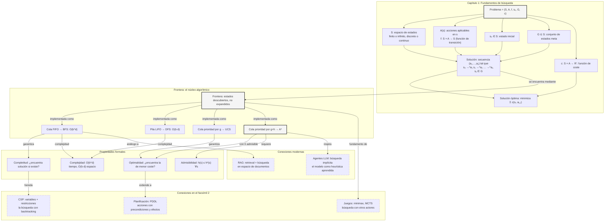

::: {.fasciculo-subtitle}
Facsímil 2 · Inteligencia clásica
:::

# Capítulo 01: Búsqueda: resolver problemas como espacio de estados

## Entrando en el tema

A mediados de los años cincuenta, Allen Newell, J. C. Shaw y Herbert Simon mostraron que un programa podía demostrar teoremas explorando sistemáticamente el espacio de posibles deducciones. Poco después formalizaron el *General Problem Solver* como intento de solucionador general mediante búsqueda en espacios de estados.^[Newell, A., Shaw, J. C. y Simon, H. A. (1959). Report on a general problem-solving program. En *Proceedings of the International Conference on Information Processing* (pp. 256-264). UNESCO.] No usaba redes neuronales. No usaba aprendizaje. Usaba **búsqueda**.

Siete décadas después, la búsqueda sigue siendo el corazón de sistemas que usas a diario. Un sistema de navegación puede encontrar rutas explorando un espacio donde cada estado es una ubicación y cada acción es una carretera. Un videojuego puede mover personajes con A*, un algoritmo de búsqueda de 1968. Y cuando diseñamos un agente LLM que decide qué herramienta llamar a continuación, podemos modelar esa decisión —de forma implícita y heurística— como un problema de búsqueda.

Este capítulo empieza por el principio: ¿qué es exactamente un problema de búsqueda? ¿Cómo se modela? ¿Y por qué algo tan simple es, al mismo tiempo, tan poderoso y tan peligrosamente costoso?

## El vocabulario de la búsqueda

Todo problema de búsqueda empieza con cuatro ideas operativas: estado, acción, meta y coste.^[Russell, S. y Norvig, P. (2021). *Artificial intelligence: a modern approach* (4.ª ed.). Pearson. Los capítulos 3 y 4 abordan la resolución de problemas mediante búsqueda, estableciendo el marco conceptual de estados, acciones, metas y costes que sigue siendo la base de la IA moderna.] Luego, cuando lo escribimos con notación formal, esas ideas se descomponen un poco más para que no quede nada en el aire.

### Estado

Una descripción suficiente de la situación actual. «Estoy en Madrid». «El robot está en la coordenada (3,7) mirando al norte». «El puzzle tiene las piezas en esta configuración».

El estado debe contener **todo lo necesario para decidir qué hacer a continuación**. Si falta información, el algoritmo tomará decisiones incorrectas. Piensa en el estado como una fotografía del problema en un instante: debe capturar todo lo relevante y nada de lo irrelevante.^[Nilsson, N. J. (1998). *Artificial intelligence: a new synthesis*. Morgan Kaufmann. El capítulo 7 presenta los fundamentos de la búsqueda en espacios de estados, incluyendo la distinción entre búsqueda ciega y búsqueda heurística.]

Un error clásico es incluir información redundante en el estado —«la temperatura ambiente», «el color del coche»— que no afecta a las decisiones pero multiplica el número de estados posibles. Cada bit innecesario en el estado duplica el espacio de búsqueda.

### Acción

Una operación que transforma un estado en otro. «Viajar de Madrid a Barcelona» (coste: 620 km). «Avanzar una casilla hacia el norte» (coste: 1 paso). «Mover la pieza A a la posición B» (coste: 1 movimiento).

No todas las acciones están disponibles en todos los estados. Desde Madrid puedes viajar a Barcelona, pero no a Buenos Aires (no hay carretera). Esta restricción —llamada **precondición**— es lo que diferencia un problema bien modelado de uno imposible. Las acciones definen la topología del espacio de búsqueda: qué estados están conectados y a qué precio.^[Rich, E., Knight, K. y Nair, S. B. (2009). *Artificial intelligence* (3.ª ed.). McGraw-Hill. El capítulo 2 describe cómo modelar problemas como espacios de estados, enfatizando la importancia de definir correctamente las precondiciones de cada acción.]

### Meta

La condición que queremos alcanzar. Puede ser un estado concreto («estar en Berlín») o una propiedad («tener todas las cajas en la zona de carga, da igual en qué orden»). La meta puede ser única o múltiple; puede ser un estado exacto o una condición abstracta.

Lo crucial es que la meta sea **verificable**. Dado un estado, debes poder responder «sí» o «no» a la pregunta «¿es este el objetivo?» sin ambigüedad. Si no puedes verificarlo, no puedes saber cuándo has terminado.^[Poole, D., Mackworth, A. y Goebel, R. (1998). *Computational intelligence: a logical approach*. Oxford University Press. La sección 3.3 analiza cómo definir metas verificables y su papel en la terminación correcta de los algoritmos de búsqueda.]

### Coste

El precio de cada acción o del camino completo. Distancia, tiempo, dinero, consumo de combustible, tokens de API: cualquier magnitud que queramos minimizar. El coste es lo que convierte «encuentra un camino cualquiera» en «encuentra el mejor camino».

Sin coste, cualquier camino sirve. Con coste, la búsqueda se convierte en **optimización**: no solo encontrar una solución, sino encontrar la mejor. Esta distinción —satisfacer vs optimizar— es una de las más importantes de la IA.^[Luger, G. F. (2008). *Artificial intelligence: structures and strategies for complex problem solving* (6.ª ed.). Pearson. El capítulo 3 desarrolla la distinción entre búsqueda de cualquier solución y búsqueda de la solución óptima, y cómo el coste transforma el problema.]

## La explosión combinatoria: por qué la búsqueda es difícil

El espacio de estados crece de forma aterradora. Imagina un problema donde cada estado tiene, de media, 10 acciones posibles (factor de ramificación \\(b = 10\\)). A profundidad 1, tienes 10 estados. A profundidad 2, 100. A profundidad 5, 100 000. A profundidad 10, diez mil millones.^[Russell, S. y Norvig, P. (2021). *Artificial intelligence: a modern approach* (4.ª ed.). Pearson. La sección 3.3 introduce el concepto de complejidad de la búsqueda y analiza cómo el factor de ramificación y la profundidad determinan la viabilidad de los algoritmos.]

La forma compacta de verlo es esta:

$$
N(d) = \sum_{i=0}^{d} b^i = \frac{b^{d+1} - 1}{b - 1}
$$

| Símbolo | Significado | Ejemplo |
|---|---|---|
| \(N(d)\) | Número total de nodos que aparecen hasta profundidad \(d\), contando la raíz. | Si exploramos hasta profundidad 5, \(N(5)\). |
| \(b\) | Factor de ramificación medio: cuántas acciones nuevas aparecen desde cada estado. | \(b = 10\). |
| \(d\) | Profundidad máxima explorada: cuántas acciones tiene el camino más largo considerado. | \(d = 5\). |
| \(i\) | Nivel concreto del árbol de búsqueda. | \(i = 0\) es el estado inicial; \(i = 5\), los estados a cinco acciones. |

Con números:

$$
N(5) = 1 + 10 + 100 + 1\,000 + 10\,000 + 100\,000 = 111\,111
$$

Cinco decisiones encadenadas ya generan más de cien mil nodos. Con profundidad 10:

$$
N(10) = \frac{10^{11} - 1}{9} = 11\,111\,111\,111
$$

Más de once mil millones. Por eso no basta con decir «probemos todas las opciones». La búsqueda clásica consiste, en buena medida, en decidir **qué opciones no merece la pena mirar**.

Esto es la **explosión combinatoria**: el número de estados crece exponencialmente con la profundidad. No es un problema de hardware: aunque tuvieras un ordenador mil millones de veces más rápido, solo podrías explorar unos pocos niveles adicionales. La explosión combinatoria es el obstáculo central de la búsqueda.

Por eso los algoritmos de búsqueda no intentan explorar todo el espacio. Usan la **frontera** para decidir qué explorar a continuación, ignorando la mayor parte del espacio. La diferencia entre un algoritmo que encuentra la solución en segundos y uno que no la encuentra nunca está en cómo gestiona esa frontera.

## Árbol de búsqueda vs grafo de estados

Aquí hay una distinción sutil pero crítica. El **grafo de estados** es el mapa real: todas las configuraciones posibles y cómo se conectan. Es la realidad física del problema. El **árbol de búsqueda** es lo que el algoritmo construye mientras explora: un registro de los caminos que ha probado.^[Russell, S. y Norvig, P. (2021). *Artificial intelligence: a modern approach* (4.ª ed.). Pearson. La sección 3.3 detalla la diferencia entre el grafo de estados y el árbol de búsqueda.]

Imagina un laberinto. El grafo de estados es el laberinto completo —cada casilla es un estado, cada pasillo es una acción—. El árbol de búsqueda es el recorrido que haces al explorar: empiezas en la entrada, pruebas un pasillo, vuelves atrás si no lleva a ningún sitio, pruebas otro. El árbol crece a medida que avanzas, pero nunca ves el grafo completo. Si lo vieras, ya habrías resuelto el problema.

¿Por qué importa esta diferencia? Porque el grafo puede tener **ciclos**: puedes ir de A a B y de B a A, dando vueltas. El árbol, si no tienes cuidado, puede crecer infinitamente reflejando esos ciclos una y otra vez. Los buenos algoritmos de búsqueda mantienen un conjunto de estados **visitados** y evitan reexplorarlos. Sin esta precaución, BFS y UCS pueden quedar atrapados en bucles infinitos.^[Poole, D., Mackworth, A. y Goebel, R. (1998). *Computational intelligence: a logical approach*. Oxford University Press. El capítulo 3 aborda la detección de ciclos como una optimización crítica para la viabilidad práctica de los algoritmos de búsqueda.]

## Cómo funciona un algoritmo de búsqueda

Todos los algoritmos de búsqueda clásicos comparten la misma estructura.^[Nilsson, N. J. (1998). *Artificial intelligence: a new synthesis*. Morgan Kaufmann. El capítulo 7 presenta un marco unificado donde la única diferencia entre algoritmos es la política de extracción de la frontera.] Mantienen una **frontera**: el conjunto de estados que han sido descubiertos pero aún no explorados. El bucle es:

1. **Extraer** un estado de la frontera.
2. **Comprobar** si es la meta. Si lo es, reconstruir el camino y terminar.
3. **Expandir**: generar todos los estados alcanzables desde este estado mediante las acciones disponibles.
4. **Añadir** los nuevos estados a la frontera, siempre que no hayan sido visitados antes.
5. **Repetir** desde el paso 1.

Eso es todo. Cuatro pasos y un bucle. La diferencia entre BFS, DFS, coste uniforme, greedy y A* está exclusivamente en el paso 1: **qué estado extraemos de la frontera**. La estructura de datos que usemos —cola, pila, cola de prioridad— determina completamente el comportamiento del algoritmo.

<svg xmlns="http://www.w3.org/2000/svg" viewBox="0 0 920 540" role="img" aria-labelledby="search-anatomy-title search-anatomy-desc">
  <title id="search-anatomy-title">Anatomía de un problema de búsqueda</title>
  <desc id="search-anatomy-desc">Diagrama del bucle de búsqueda: modelo del problema, frontera, nodo extraído, prueba de meta, expansión, visitados y coste acumulado.</desc>
  <defs>
    <marker id="search-anatomy-arrow" viewBox="0 0 10 10" refX="8.8" refY="5" markerWidth="7" markerHeight="7" orient="auto-start-reverse">
      <path d="M 0 0 L 10 5 L 0 10 z" fill="#333333" />
    </marker>
    <filter id="search-anatomy-shadow" x="-6%" y="-8%" width="112%" height="118%">
      <feDropShadow dx="0" dy="1.5" stdDeviation="2" flood-color="#000000" flood-opacity="0.08" />
    </filter>
  </defs>
  <rect x="0" y="0" width="920" height="540" rx="18" fill="#FAFAFA" />
  <text x="460" y="34" text-anchor="middle" font-family="Inter, Arial, sans-serif" font-size="18" fill="#000000" font-weight="800">Anatomía de un problema de búsqueda</text>
  <text x="460" y="56" text-anchor="middle" font-family="Inter, Arial, sans-serif" font-size="12" fill="#666666">un mismo bucle; cambia la política con la que eliges el siguiente nodo de la frontera</text>
  <rect x="28" y="74" width="864" height="92" rx="12" fill="#FFFFFF" stroke="#D8D8D8" stroke-width="1.2" filter="url(#search-anatomy-shadow)" />
  <text x="52" y="104" font-family="Inter, Arial, sans-serif" font-size="12" fill="#555555" font-weight="700" letter-spacing="1.6">MODELO DEL PROBLEMA</text>
  <g font-family="ui-monospace, SFMono-Regular, Menlo, monospace" font-size="12" fill="#000000">
    <rect x="52" y="122" width="90" height="26" rx="13" fill="#F4F4F4" stroke="#BDBDBD" />
    <text x="97" y="140" text-anchor="middle">s0</text>
    <rect x="162" y="122" width="112" height="26" rx="13" fill="#F4F4F4" stroke="#BDBDBD" />
    <text x="218" y="140" text-anchor="middle">S estados</text>
    <rect x="294" y="122" width="122" height="26" rx="13" fill="#F4F4F4" stroke="#BDBDBD" />
    <text x="355" y="140" text-anchor="middle">A(s) acciones</text>
    <rect x="436" y="122" width="126" height="26" rx="13" fill="#F4F4F4" stroke="#BDBDBD" />
    <text x="499" y="140" text-anchor="middle">f(s,a)</text>
    <rect x="582" y="122" width="120" height="26" rx="13" fill="#F4F4F4" stroke="#BDBDBD" />
    <text x="642" y="140" text-anchor="middle">G metas</text>
    <rect x="722" y="122" width="118" height="26" rx="13" fill="#F4F4F4" stroke="#BDBDBD" />
    <text x="781" y="140" text-anchor="middle">c(s,a)</text>
  </g>
  <text x="460" y="203" text-anchor="middle" font-family="Inter, Arial, sans-serif" font-size="12" fill="#555555" font-weight="700" letter-spacing="1.6">MOTOR DE BÚSQUEDA</text>
  <rect x="330" y="222" width="260" height="134" rx="14" fill="#FFFFFF" stroke="#111111" stroke-width="1.8" filter="url(#search-anatomy-shadow)" />
  <text x="460" y="248" text-anchor="middle" font-family="Inter, Arial, sans-serif" font-size="15" fill="#000000" font-weight="800">Frontera</text>
  <text x="460" y="268" text-anchor="middle" font-family="Inter, Arial, sans-serif" font-size="11" fill="#666666">nodos descubiertos, todavía no expandidos</text>
  <rect x="354" y="286" width="212" height="24" rx="6" fill="#EFEFEF" stroke="#CCCCCC" />
  <text x="370" y="302" font-family="ui-monospace, SFMono-Regular, Menlo, monospace" font-size="11" fill="#000000">s3  g=315  h=300</text>
  <rect x="354" y="314" width="212" height="22" rx="6" fill="#FFFFFF" stroke="#DADADA" />
  <text x="370" y="329" font-family="ui-monospace, SFMono-Regular, Menlo, monospace" font-size="10" fill="#555555">s7  g=420  h=180</text>
  <rect x="354" y="340" width="212" height="22" rx="6" fill="#FFFFFF" stroke="#DADADA" />
  <text x="370" y="355" font-family="ui-monospace, SFMono-Regular, Menlo, monospace" font-size="10" fill="#555555">s2  g=510  h=90</text>
  <rect x="48" y="224" width="220" height="124" rx="14" fill="#FFFFFF" stroke="#BDBDBD" stroke-width="1.2" filter="url(#search-anatomy-shadow)" />
  <text x="70" y="252" font-family="Inter, Arial, sans-serif" font-size="12" fill="#555555" font-weight="700" letter-spacing="1.4">1. EXTRAER</text>
  <text x="158" y="288" text-anchor="middle" font-family="ui-monospace, SFMono-Regular, Menlo, monospace" font-size="18" fill="#000000" font-weight="800">n = s3</text>
  <text x="158" y="312" text-anchor="middle" font-family="Inter, Arial, sans-serif" font-size="11" fill="#666666">la estructura decide: FIFO, LIFO, g o g+h</text>
  <rect x="652" y="224" width="220" height="124" rx="14" fill="#FFFFFF" stroke="#BDBDBD" stroke-width="1.2" filter="url(#search-anatomy-shadow)" />
  <text x="674" y="252" font-family="Inter, Arial, sans-serif" font-size="12" fill="#555555" font-weight="700" letter-spacing="1.4">2. PROBAR META</text>
  <path d="M762 270 L822 304 L762 338 L702 304 Z" fill="#F4F4F4" stroke="#111111" stroke-width="1.4" />
  <text x="762" y="302" text-anchor="middle" font-family="ui-monospace, SFMono-Regular, Menlo, monospace" font-size="13" fill="#000000" font-weight="800">n ∈ G?</text>
  <rect x="334" y="408" width="252" height="76" rx="14" fill="#FFFFFF" stroke="#BDBDBD" stroke-width="1.2" filter="url(#search-anatomy-shadow)" />
  <text x="356" y="435" font-family="Inter, Arial, sans-serif" font-size="12" fill="#555555" font-weight="700" letter-spacing="1.4">3. EXPANDIR</text>
  <text x="460" y="458" text-anchor="middle" font-family="ui-monospace, SFMono-Regular, Menlo, monospace" font-size="12" fill="#000000">A(s3) → {s8, s9, s10}</text>
  <text x="460" y="475" text-anchor="middle" font-family="Inter, Arial, sans-serif" font-size="10" fill="#666666">aplicar f(s,a), calcular coste y filtrar ciclos</text>
  <rect x="48" y="396" width="220" height="88" rx="14" fill="#FFFFFF" stroke="#D0D0D0" stroke-width="1.2" />
  <text x="70" y="423" font-family="Inter, Arial, sans-serif" font-size="12" fill="#555555" font-weight="700" letter-spacing="1.4">VISITADOS</text>
  <text x="158" y="453" text-anchor="middle" font-family="ui-monospace, SFMono-Regular, Menlo, monospace" font-size="13" fill="#000000">{s0, s1, s2}</text>
  <text x="158" y="471" text-anchor="middle" font-family="Inter, Arial, sans-serif" font-size="10" fill="#666666">evita repetir estados y bucles</text>
  <rect x="652" y="396" width="220" height="88" rx="14" fill="#FFFFFF" stroke="#D0D0D0" stroke-width="1.2" />
  <text x="674" y="423" font-family="Inter, Arial, sans-serif" font-size="12" fill="#555555" font-weight="700" letter-spacing="1.4">COSTE</text>
  <text x="762" y="453" text-anchor="middle" font-family="ui-monospace, SFMono-Regular, Menlo, monospace" font-size="13" fill="#000000">g(n)=Σ c(si,ai)</text>
  <text x="762" y="471" text-anchor="middle" font-family="Inter, Arial, sans-serif" font-size="10" fill="#666666">permite elegir mejor camino, no solo alguno</text>
  <rect x="698" y="356" width="128" height="28" rx="14" fill="#111111" />
  <text x="762" y="374" text-anchor="middle" font-family="Inter, Arial, sans-serif" font-size="11" fill="#FFFFFF" font-weight="700">SOLUCIÓN</text>
  <path d="M330 288 H278" fill="none" stroke="#333333" stroke-width="1.6" marker-end="url(#search-anatomy-arrow)" />
  <path d="M268 258 C328 184 590 184 652 258" fill="none" stroke="#333333" stroke-width="1.4" marker-end="url(#search-anatomy-arrow)" />
  <path d="M762 348 V354" fill="none" stroke="#333333" stroke-width="1.5" marker-end="url(#search-anatomy-arrow)" />
  <text x="833" y="365" font-family="Inter, Arial, sans-serif" font-size="10" fill="#666666">sí</text>
  <path d="M702 304 C650 336 604 376 586 440" fill="none" stroke="#333333" stroke-width="1.4" stroke-dasharray="5 4" marker-end="url(#search-anatomy-arrow)" />
  <text x="640" y="356" font-family="Inter, Arial, sans-serif" font-size="10" fill="#666666">no</text>
  <path d="M334 448 C300 448 288 438 268 436" fill="none" stroke="#777777" stroke-width="1.2" stroke-dasharray="4 4" marker-end="url(#search-anatomy-arrow)" />
  <path d="M586 448 C620 448 632 438 652 436" fill="none" stroke="#777777" stroke-width="1.2" stroke-dasharray="4 4" marker-end="url(#search-anatomy-arrow)" />
  <path d="M460 408 V366" fill="none" stroke="#333333" stroke-width="1.5" marker-end="url(#search-anatomy-arrow)" />
  <text x="492" y="392" font-family="Inter, Arial, sans-serif" font-size="10" fill="#666666">nuevos nodos</text>
  <text x="890" y="520" text-anchor="end" font-family="Inter, Arial, sans-serif" font-size="11" fill="#8A8A8A">IA para gente curiosa / Facsímil 02 / Capítulo 01 / 686f6c61</text>
</svg>

## Definición formal del problema

Conviene fijar la notación con precisión. Un problema de búsqueda se define formalmente como una tupla:^[Russell, S. y Norvig, P. (2021). *Artificial intelligence: a modern approach* (4.ª ed.). Pearson. La sección 3.1 introduce la definición formal del problema de búsqueda, incluyendo la notación de espacios de estados, función de transición, y función de coste.]

$$
\text{Problema} = (S, A, f, s_0, G, c)
$$

| Símbolo | Significado | Ejemplo |
|---|---|---|
| \(S\) | Espacio de estados: conjunto de todas las configuraciones posibles. | En un mapa, todos los cruces y ciudades que podrían visitarse. |
| \(A(s)\) | Acciones aplicables desde el estado \(s\). | Desde Zaragoza, tomar la carretera hacia Barcelona o hacia Madrid. |
| \(f(s, a)\) | Función de transición: el estado que aparece al aplicar una acción. | \(f(\text{Zaragoza}, \text{ir a Barcelona}) = \text{Barcelona}\). |
| \(s_0\) | Estado inicial. | Madrid. |
| \(G\) | Conjunto de estados meta. | \(\{\text{Barcelona}\}\). |
| \(c(s, a)\) | Coste de aplicar la acción \(a\) en el estado \(s\). | Kilómetros, minutos, euros o tokens consumidos. |

La fórmula dice algo bastante sencillo: para resolver el problema necesitamos saber dónde podemos estar, qué podemos hacer, qué ocurre al hacerlo, dónde empezamos, qué cuenta como llegar y cuánto cuesta cada paso. Si falta una de esas piezas, la búsqueda queda coja.

Una **solución** es una secuencia de acciones:

$$
\pi = (a_1, a_2, \ldots, a_n)
$$

La letra \(\pi\) se lee «pi» y aquí representa un **plan**: una lista ordenada de acciones. No es todavía «la mejor» solución; solo es una candidata. Para comprobar si realmente sirve, aplicamos cada acción una detrás de otra:

$$
s_i = f(s_{i-1}, a_i), \quad i = 1, 2, \ldots, n
$$

| Símbolo | Significado | Ejemplo |
|---|---|---|
| \(\pi\) | Plan o secuencia de acciones. | \((\text{Madrid} \to \text{Zaragoza}, \text{Zaragoza} \to \text{Barcelona})\). |
| \(a_i\) | Acción número \(i\) del plan. | \(a_1 =\) ir de Madrid a Zaragoza. |
| \(s_i\) | Estado alcanzado después de ejecutar \(i\) acciones. | \(s_1 =\) Zaragoza; \(s_2 =\) Barcelona. |
| \(f\) | Función de transición que calcula el siguiente estado. | Aplicar «ir a Zaragoza» desde Madrid produce Zaragoza. |
| \(n\) | Número total de acciones del plan. | \(n = 2\). |

El plan es una solución si el último estado pertenece al conjunto de metas:

$$
s_n \in G
$$

En nuestro ejemplo, \(s_2 = \text{Barcelona}\) y \(G = \{\text{Barcelona}\}\). Por tanto, el plan llega a la meta.

Ahora falta saber cuánto cuesta. El coste total de un plan es la suma de los costes de cada acción:

$$
C(\pi) = \sum_{i=1}^{n} c(s_{i-1}, a_i)
$$

| Símbolo | Significado | Ejemplo |
|---|---|---|
| \(C(\pi)\) | Coste total del plan \(\pi\). | Kilómetros totales recorridos. |
| \(c(s_{i-1}, a_i)\) | Coste de ejecutar la acción \(a_i\) desde el estado anterior. | \(c(\text{Madrid}, \text{ir a Zaragoza}) = 315\) km. |
| \(i\) | Índice de la acción dentro del plan. | \(i = 1\) para el primer tramo; \(i = 2\) para el segundo. |
| \(n\) | Número de acciones del plan. | \(n = 2\). |

Con números:

$$
C(\pi) = 315 + 300 = 615
$$

Si existe otro plan Madrid → Valencia → Barcelona con coste \(720\), ambos llegan a la meta, pero el primero es mejor. Una solución es **óptima** si minimiza \(C(\pi)\) entre todas las soluciones posibles.

Esta formalización permite razonar sobre propiedades como la completitud (¿el algoritmo siempre encuentra solución si existe?), la optimalidad (¿encuentra la mejor?) y la complejidad (¿cuánto tarda y cuánta memoria consume en función del tamaño del problema?).^[Pearl, J. (1984). *Heuristics: intelligent search strategies for computer problem solving*. Addison-Wesley. El capítulo 2 formaliza las propiedades de los algoritmos de búsqueda en términos de completitud, admisibilidad y optimalidad.]


## Búsqueda no informada vs informada

Los algoritmos de búsqueda se dividen en dos familias, y la línea que las separa es la información disponible:

**No informados (ciegos).** No tienen ninguna pista sobre qué acciones son mejores. Solo conocen el coste de las acciones ya realizadas y la definición de la meta. Son como explorar un laberinto a oscuras, tanteando las paredes. BFS, DFS y coste uniforme pertenecen a esta familia. Su gran ventaja es que no necesitan conocimiento específico del dominio: funcionan para cualquier problema bien definido. Su gran desventaja es la ineficiencia: exploran a ciegas, sin priorizar.^[Russell, S. y Norvig, P. (2021). *Artificial intelligence: a modern approach* (4.ª ed.). Pearson. La sección 3.4 clasifica los algoritmos de búsqueda no informada y analiza sus propiedades de completitud, optimalidad y complejidad.]

**Informados (heurísticos).** Disponen de una función heurística \\(h(n)\\) que estima lo lejos que está un estado de la meta. Es una estimación diseñada para ser barata de calcular y suficientemente informativa para ordenar la búsqueda; no sustituye al coste real ni a la prueba de optimalidad. Greedy y A* usan heurísticas para priorizar estados prometedores. Su gran ventaja es la eficiencia: pueden encontrar soluciones explorando órdenes de magnitud menos estados. Su gran desventaja es que necesitan una buena heurística, y diseñar una heurística admisible —que nunca sobreestime el coste real— no siempre es fácil.^[Pearl, J. (1984). *Heuristics: intelligent search strategies for computer problem solving*. Addison-Wesley. Pearl estableció las bases teóricas de la búsqueda heurística, incluyendo las propiedades de admisibilidad y consistencia que garantizan la optimalidad de A*, y el concepto de poder heurístico que permite comparar la eficiencia de distintas heurísticas.]

El resto de este bloque de búsqueda se estructura alrededor de esta división: el capítulo 2 explora los algoritmos ciegos; el capítulo 3, los informados; y el capítulo 4 tiende el puente hacia los agentes modernos.

## En el día a día

La búsqueda en espacios de estados no es una reliquia académica. Aparece en sistemas reales constantemente:

- **Navegación GPS**: encontrar una ruta útil entre dos puntos. Cada cruce puede modelarse como un estado. Cada calle es una acción con un coste, normalmente distancia, tiempo o una combinación de ambas. A* y sus variantes ayudan porque una heurística geométrica permite mirar antes las rutas prometedoras, aunque los sistemas reales añaden tráfico, restricciones de giro, cierres, peajes y optimizaciones de ingeniería.^[Hart, P. E., Nilsson, N. J. y Raphael, B. (1968). A formal basis for the heuristic determination of minimum cost paths. *IEEE Transactions on Systems Science and Cybernetics*, 4(2), 100-107. https://doi.org/10.1109/TSSC.1968.300136.]
- **Planificación logística**: una empresa con 50 paquetes y 5 furgonetas. El espacio de estados es astronómico —combinatorio, con un factor de ramificación enorme— y sin embargo los algoritmos de búsqueda heurística encuentran soluciones casi óptimas en segundos. La diferencia entre una ruta óptima y una subóptima son miles de euros al mes en combustible.
- **Agentes LLM**: cuando un agente decide si llamar a `search_database` o a `check_calendar`, podemos leer esa decisión como una evaluación de acciones en un espacio de estados implícito. El LLM puede actuar como heurística: «dado el contexto actual, ¿qué herramienta parece más prometedora?». El sistema alrededor debe añadir costes, permisos, observación y criterio de parada.

## Antes del algoritmo: auditar el modelo

Un error muy común es discutir si usar BFS, A* o una heurística sofisticada antes de haber comprobado que el problema está bien definido. En ingeniería, el primer paso no es elegir algoritmo: es validar el **contrato de búsqueda**.

| Pregunta | Qué comprueba | Fallo típico |
|---|---|---|
| ¿\(s_0\) pertenece a \(S\)? | Que el estado inicial existe en el modelo. | Arrancar desde un identificador que no está en el grafo. |
| ¿\(G \subseteq S\)? | Que todas las metas son estados válidos. | Definir como meta una etiqueta textual que ninguna transición alcanza. |
| ¿Toda acción tiene origen, destino y coste? | Que \(f(s,a)\) y \(c(s,a)\) están definidos. | Acción sin coste o transición a estado inexistente. |
| ¿Los costes son no negativos? | Que UCS y A* puedan razonar correctamente. | Costes negativos que rompen garantías de optimalidad. |
| ¿Hay ciclos? | Que el algoritmo necesitará `visitados`. | Madrid → Zaragoza → Madrid repitiéndose para siempre. |
| ¿Cuál es \(b\) y hasta qué profundidad buscarías? | Estimación de explosión combinatoria. | Descubrir tarde que \(b^d\) no cabe en memoria. |

Esta auditoría parece humilde, pero es exactamente el tipo de trabajo que evita sistemas frágiles. Si el contrato está mal, el algoritmo puede estar perfectamente implementado y aun así devolver basura.

Un plan candidato también se puede comprobar antes de hablar de optimalidad:

$$
\text{válido}(\pi) \Leftrightarrow s_0 \xrightarrow{a_1} s_1 \xrightarrow{a_2} \cdots \xrightarrow{a_n} s_n \land s_n \in G
$$

Y su coste se compara con otros planes:

$$
C(\pi) = \sum_{i=1}^{n} c(s_{i-1}, a_i)
$$

Una práctica útil es mantener en tus sistemas una salida trazable: qué estados se recorrieron, qué acción llevó a cada estado, qué coste se acumuló y por qué el plan termina o no en meta. Eso conecta este capítulo con planificación, agentes y evaluación: no basta con “llegó”; hay que poder explicar cómo.

## Por qué debería importarte

La búsqueda es el paradigma más antiguo de la IA y, paradójicamente, uno de los más vigentes. No ha sido sustituido por el *deep learning*: ha sido **aumentado** por él. Los LLMs no reemplazan la búsqueda; la hacen más inteligente, proporcionando heurísticas donde antes había que diseñarlas a mano.

Entender la búsqueda te da un marco mental para razonar sobre problemas secuenciales: aquellos donde la solución no es una respuesta única, sino una secuencia de decisiones. Y te prepara para los capítulos siguientes: sin entender el vocabulario de estados, acciones y fronteras, no puedes entender CSP, planificación ni juegos. Todo el facsímil 2 se construye sobre este capítulo.

## Dónde solía tropezar yo

| Error | Por qué es un error | Antídoto |
|---|---|---|
| **Confundir el grafo de estados con el árbol de búsqueda** | El grafo es el mapa completo; el árbol es lo que el algoritmo explora. Tratar el árbol como si fuera el grafo lleva a reexplorar estados innecesariamente y a no detectar ciclos. | Mantén un conjunto `visited` y nunca reexpandas un estado ya visitado. Es la optimización más rentable en búsqueda. |
| **No definir bien el estado** | Si el estado no contiene toda la información necesaria para decidir la siguiente acción, el algoritmo tomará decisiones basadas en información incompleta. | Pregúntate: «con esta información, ¿puedo generar todas las acciones posibles y evaluar si he llegado a la meta?». Si la respuesta es no, tu estado está incompleto. |
| **Subestimar la explosión combinatoria** | Un espacio con b=10 y d=10 tiene 10^10 estados. Explorarlos todos es inviable en cualquier hardware. La búsqueda ciega solo funciona para espacios pequeños. | Calcula b y d antes de elegir algoritmo. Si b^d es mayor que unos pocos millones, necesitas una heurística o una poda. |
| **Olvidar el coste** | Sin coste, cualquier camino sirve. Con costes variables, el camino más corto en pasos no es necesariamente el más barato. BFS encuentra el primero; UCS encuentra el mejor. | Define el coste de cada acción. Si los costes no son uniformes, usa UCS o A*, no BFS. |

## Manos a la obra

La práctica real de este capítulo está en `labs/f2/c01-state-space-contract/`. El kit valida un problema de rutas como tupla de búsqueda, calcula factor de ramificación, detecta ciclos, estima explosión combinatoria y evalúa planes candidatos.

```bash
cd labs/f2/c01-state-space-contract
python3 ops/audit_search_problem.py --write
cat output/search_model_decision.md
```

**Qué deberías ver.** El informe distingue tres cosas: si el modelo del problema es válido, qué planes candidatos llegan a meta y qué coste tiene cada uno. También marca por qué un plan puede ser inválido: acción inexistente, transición imposible o final fuera de \(G\).

| Archivo | Papel |
|---|---|
| `data/search_problem.json` | Estados, acciones, estado inicial, metas y planes candidatos. |
| `contracts/search_policy.json` | Umbrales de explosión combinatoria y reglas de validación. |
| `ops/audit_search_problem.py` | Auditor ejecutable sin dependencias externas. |
| `output/search_model_report.json` | Resultado estructurado para revisar o automatizar. |
| `output/search_model_decision.md` | Informe legible para entregar. |

**Cómo lo adaptas a tu caso.** Cambia las ciudades por estados de un flujo real: pasos de onboarding, estados de un pedido, pantallas de una app, acciones de un agente o rutas de logística. Después añade dos planes: uno que llegue a meta y otro que falle. La entrega interesante no es que el plan “funcione”: es que puedas explicar por qué funciona.

Puedes complementar el kit con recursos visuales:

- [**Pathfinding visualizer**](https://qiao.github.io/PathFinding.js/visual/): dibuja obstáculos, elige BFS, DFS o A* y observa cómo cada algoritmo explora el espacio de estados de forma radicalmente distinta. La diferencia visual entre BFS (explora en ondas concéntricas) y DFS (se lanza por un camino hasta el fondo) es imposible de transmitir solo con texto.
- **Ejercicio mental**: modela el problema de «ir de tu casa al trabajo» como un espacio de estados. Define el estado, las acciones, la meta y el coste. ¿Cuál es el factor de ramificación aproximado? ¿Qué profundidad tiene una solución típica? ¿Qué algoritmo usarías?

**Qué entregaría un alumno.** El Markdown generado, una versión propia de `search_problem.json`, un plan válido, un plan inválido explicado y una estimación honesta de si el espacio de búsqueda es pequeño, manejable o explosivo.

## Cómo encaja todo

Este mapa se lee de izquierda a derecha: primero defines el problema, después eliges cómo gestionar la frontera, y solo entonces aparecen las garantías de completitud, optimalidad y coste. Los capítulos siguientes cambian la política de frontera, añaden heurísticas o convierten estados en asignaciones, planes y decisiones con otros actores.

La conexión con sistemas modernos no es decorativa: un agente con herramientas también necesita estado, acciones, coste, meta y trazabilidad. Cambia la forma de representar el problema, pero no desaparece el patrón.



## Vocabulario aprendido

| Término | Definición |
|---|---|
| **Estado** | Descripción suficiente de la situación actual del problema en un momento dado. |
| **Espacio de estados** | Conjunto de todas las configuraciones posibles que puede alcanzar el problema. |
| **Árbol de búsqueda** | Estructura que el algoritmo construye al explorar, donde cada nodo es un estado y cada rama una acción. |
| **Frontera** | Conjunto de estados descubiertos pero aún no explorados. Su estructura determina el algoritmo. |
| **Factor de ramificación** | Número medio de acciones disponibles en cada estado. Determina la explosión combinatoria. |
| **Heurística** | Función que estima la distancia de un estado a la meta, guiando la búsqueda informada. |
| **Contrato de búsqueda** | Definición verificable de estados, acciones, transición, estado inicial, metas y costes. |
| **Plan candidato** | Secuencia de acciones que debe poder ejecutarse desde \(s_0\) y terminar en \(G\) para ser solución. |
| **Estado visitado** | Estado ya revisado para evitar ciclos y reexpansiones innecesarias. |

## Antes de pasar página

- [ ] ¿Puedo definir los cuatro ingredientes de un problema de búsqueda y poner un ejemplo concreto de cada uno? (Si no, vuelve a «El vocabulario de la búsqueda».)
- [ ] ¿Entiendo por qué la explosión combinatoria hace que la búsqueda ciega sea inviable para espacios grandes? (Si no, vuelve a «La explosión combinatoria».)
- [ ] ¿Sé diferenciar el grafo de estados del árbol de búsqueda y explicar por qué importa la diferencia? (Si no, vuelve a «Árbol de búsqueda vs grafo de estados».)
- [ ] ¿Puedo explicar el bucle genérico de un algoritmo de búsqueda? (Si no, vuelve a «Cómo funciona un algoritmo de búsqueda».)
- [ ] ¿Entiendo la diferencia entre búsqueda no informada e informada? (Si no, vuelve a «Búsqueda no informada vs informada».)
- [ ] ¿Puedo auditar si un problema está bien definido antes de elegir algoritmo? (Si no, vuelve a «Antes del algoritmo: auditar el modelo».)
- [ ] ¿He ejecutado `labs/f2/c01-state-space-contract/` y puedo explicar un plan válido y uno inválido? (Si no, vuelve a «Manos a la obra».)

## En resumen

| Idea fuerza | Detalle |
|---|---|
| Todo problema de búsqueda se define con estados, acciones, meta y coste. | Si no puedes definir estos cuatro elementos, no tienes un problema de búsqueda. Si tu estado contiene información irrelevante, tu espacio de búsqueda explota innecesariamente. |
| La explosión combinatoria es el obstáculo central. | El espacio crece exponencialmente con la profundidad. Más hardware ayuda poco si el modelo explora ramas inútiles. La defensa es modelar mejor, podar, usar heurísticas y medir costes. |
| La frontera es el corazón del algoritmo. | Qué estado extraes de la frontera determina si estás haciendo BFS, DFS, UCS o A*. Todo lo demás es el mismo bucle. |
| El contrato del problema va antes del algoritmo. | Si estados, acciones, transición, meta o coste están mal definidos, ningún algoritmo arregla el modelo. |
| La búsqueda no ha muerto: ha evolucionado. | Los LLMs no reemplazan la búsqueda; pueden aportar heurísticas aprendidas dentro de sistemas con estado, acciones, validación y trazas. El patrón viene de la IA clásica. |

## Para saber más

Hart, P. E., Nilsson, N. J. y Raphael, B. (1968). A formal basis for the heuristic determination of minimum cost paths. *IEEE Transactions on Systems Science and Cybernetics*, 4(2), 100-107. https://doi.org/10.1109/TSSC.1968.300136

Luger, G. F. (2008). *Artificial intelligence: structures and strategies for complex problem solving* (6.ª ed.). Pearson.

Newell, A., Shaw, J. C. y Simon, H. A. (1959). Report on a general problem-solving program. En *Proceedings of the International Conference on Information Processing* (pp. 256-264). UNESCO.

Nilsson, N. J. (1998). *Artificial intelligence: a new synthesis*. Morgan Kaufmann.

Pearl, J. (1984). *Heuristics: intelligent search strategies for computer problem solving*. Addison-Wesley.

Poole, D., Mackworth, A. y Goebel, R. (1998). *Computational intelligence: a logical approach*. Oxford University Press.

Rich, E., Knight, K. y Nair, S. B. (2009). *Artificial intelligence* (3.ª ed.). McGraw-Hill.

Russell, S. y Norvig, P. (2021). *Artificial intelligence: a modern approach* (4.ª ed.). Pearson. https://aima.cs.berkeley.edu/
