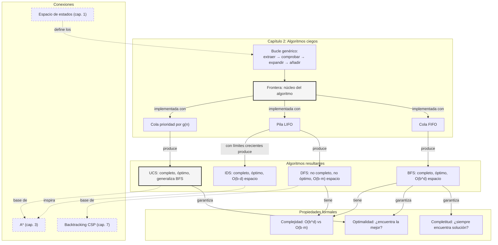

::: {.fasciculo-subtitle}
Facsímil 2 · Inteligencia clásica
:::

# Capítulo 02: BFS, DFS y coste uniforme: los algoritmos ciegos

## Entrando en el tema

En el capítulo anterior definiste el problema: estados, acciones, meta y coste. Construiste el vocabulario. Ahora necesitas algoritmos que resuelvan ese problema sin pistas del dominio y sin función heurística. A ciegas.

Tres algoritmos compiten por el título de «mejor búsqueda ciega». Los tres usan exactamente el mismo bucle —extraer, comprobar, expandir, añadir—. La única diferencia entre ellos es **la estructura de datos de la frontera**.^[Russell, S. y Norvig, P. (2021). *Artificial intelligence: a modern approach* (4.ª ed.). Pearson. La sección 3.4 demuestra que todos los algoritmos de búsqueda no informada comparten la misma estructura algorítmica y que su comportamiento queda completamente determinado por la política de extracción de la frontera.] Una cola produce BFS. Una pila produce DFS. Una cola de prioridad produce UCS. El resto es el mismo código.

Este capítulo desmenuza los tres. Con pseudocódigo. Con análisis de complejidad. Con ejemplos trazados paso a paso. Porque si no entiendes por qué BFS consume memoria exponencial y DFS puede perderse para siempre, no entenderás por qué A* —el algoritmo del próximo capítulo— fue una revolución.

## El bucle genérico

Antes de entrar en cada algoritmo, fijemos el pseudocódigo común.^[Nilsson, N. J. (1998). *Artificial intelligence: a new synthesis*. Morgan Kaufmann. El capítulo 7 presenta el algoritmo genérico de búsqueda en grafos que unifica BFS, DFS y UCS.] Los tres algoritmos ejecutan exactamente esto:

```
función BÚSQUEDA(problema):
    frontera ← [s₀]                    // estructura depende del algoritmo
    visitados ← {s₀}
    
    mientras frontera no esté vacía:
        s ← EXTRAER(frontera)          // ← aquí está toda la diferencia
        si ES-META(s):
            return RECONSTRUIR-CAMINO(s)
        para cada acción a en A(s):
            s' ← f(s, a)
            si s' ∉ visitados:
                visitados ← visitados ∪ {s'}
                AÑADIR(frontera, s')
    
    return FRACASO
```

La línea `s ← EXTRAER(frontera)` es la única que cambia entre algoritmos.^[Poole, D., Mackworth, A. y Goebel, R. (1998). *Computational intelligence: a logical approach*. Oxford University Press. El capítulo 3 presenta este marco unificado y demuestra que encapsula toda la familia de algoritmos de búsqueda no informada.] En BFS, `EXTRAER` es `dequeue` (el primero que entró). En DFS, es `pop` (el último que entró). En UCS, es `extract-min` (el de menor coste). Tres implementaciones. Tres comportamientos radicalmente distintos.

La forma matemática de decirlo es: en cada iteración elegimos un nodo de la frontera según una política \(\pi\):

$$
n_t = \operatorname{extraer}_{\pi}(F_t)
$$

| Símbolo | Significado | Ejemplo |
|---|---|---|
| \(F_t\) | Frontera en el instante \(t\): nodos descubiertos pero no expandidos. | \([B, C, D]\). |
| \(n_t\) | Nodo elegido para expandir en la iteración \(t\). | En BFS sería \(B\); en DFS podría ser \(D\). |
| \(\pi\) | Política de extracción de la frontera. | FIFO, LIFO o menor coste \(g(n)\). |
| \(\operatorname{extraer}_{\pi}\) | Operación que aplica esa política. | `dequeue`, `pop` o `extract-min`. |

Y el resto del bucle actualiza frontera y visitados:

$$
F_{t+1} = \left(F_t \setminus \{n_t\}\right) \cup \left(\operatorname{Succ}(n_t) \setminus V_t\right)
$$

| Símbolo | Significado | Ejemplo |
|---|---|---|
| \(\operatorname{Succ}(n_t)\) | Sucesores generados al expandir \(n_t\). | Si \(n_t=B\), quizá \(\{D,E\}\). |
| \(V_t\) | Estados ya visitados antes de la iteración \(t\). | \(\{A,B\}\). |
| \(\setminus\) | Diferencia de conjuntos: quitar elementos ya presentes. | No reañadir estados visitados. |

Así que los tres algoritmos se reducen a tres políticas:

$$
\pi_{\text{BFS}} = \text{FIFO}, \qquad
\pi_{\text{DFS}} = \text{LIFO}, \qquad
\pi_{\text{UCS}}(n) = \arg\min_{n \in F} g(n)
$$

## BFS: explorar por niveles

### Algoritmo

BFS usa una **cola** (FIFO: *first in, first out*). Cuando expandimos un estado a profundidad \\(d\\), sus sucesores se añaden al final de la cola, detrás de todos los estados de profundidad \\(d\\) que aún no se han expandido. El resultado es una exploración por niveles concéntricos.^[Rich, E., Knight, K. y Nair, S. B. (2009). *Artificial intelligence* (3.ª ed.). McGraw-Hill. El capítulo 3 analiza BFS en detalle, incluyendo su implementación con cola y el análisis de complejidad.]

```
Frontera: [A]           → dequeue A, enqueue(B, C)
Frontera: [B, C]        → dequeue B, enqueue(D, E)
Frontera: [C, D, E]     → dequeue C, enqueue(F)
Frontera: [D, E, F]     → ...
```

### Propiedades formales

Para un espacio de búsqueda con factor de ramificación \\(b\\) y profundidad de la solución más superficial \\(d\\):^[Russell, S. y Norvig, P. (2021). *Artificial intelligence: a modern approach* (4.ª ed.). Pearson.]

| Propiedad | Valor | Explicación |
|---|---|---|
| **Completitud** | Sí (si \\(b\\) es finito) | Si existe solución, BFS la encuentra porque explora sistemáticamente todos los nodos por niveles. |
| **Optimalidad** | Sí (si coste = 1) | BFS encuentra el camino con menos pasos porque el primer nodo meta que descubre está a la profundidad mínima. |
| **Tiempo** | \\(O(b^d)\\) | En el peor caso, explora todos los nodos hasta profundidad \\(d\\). Con \\(b=10, d=10\\): \\(10^{10}\\) expansiones. |
| **Espacio** | \\(O(b^d)\\) | Almacena todos los nodos del nivel actual en la frontera. Este es su talón de Aquiles. |

El conteo de nodos de BFS sale de la suma de niveles del árbol:

$$
N_{\text{BFS}}(d) = \sum_{i=0}^{d} b^i = \frac{b^{d+1}-1}{b-1}
$$

| Símbolo | Significado | Ejemplo |
|---|---|---|
| \(N_{\text{BFS}}(d)\) | Nodos generados hasta profundidad \(d\). | Si \(d=6\), todos los niveles de 0 a 6. |
| \(b\) | Factor de ramificación medio. | \(b=10\). |
| \(d\) | Profundidad de la solución más superficial. | \(d=6\). |
| \(i\) | Nivel del árbol de búsqueda. | \(i=0\) es el estado inicial. |

Con \(b=10\) y \(d=6\):

$$
N_{\text{BFS}}(6) = 1 + 10 + 10^2 + 10^3 + 10^4 + 10^5 + 10^6 = 1\,111\,111
$$

La memoria se aproxima por el tamaño del nivel más profundo que queda en la frontera:

$$
M_{\text{BFS}}(d) \approx b^d
$$

Con \(b=10\) y \(d=12\), BFS puede necesitar almacenar alrededor de \(10^{12}\) nodos. A 1 KB por nodo, eso ronda \(10^{15}\) bytes: aproximadamente 1 PB, no “un ordenador grande”. Imposible para la mayoría de problemas reales.^[Luger, G. F. (2008). *Artificial intelligence: structures and strategies for complex problem solving* (6.ª ed.). Pearson. La sección 3.2 cuantifica el problema de memoria de BFS y motiva la necesidad de DFS e IDS.]

## DFS: lanzarse en profundidad

### Algoritmo

DFS usa una **pila** (LIFO: *last in, first out*). Cuando expandimos un estado, sus sucesores se colocan en el tope de la pila, y el algoritmo explora inmediatamente el que queda arriba. El resultado es una inmersión profunda por la primera rama disponible.^[Poole, D., Mackworth, A. y Goebel, R. (1998). *Computational intelligence: a logical approach*. Oxford University Press.]

```
Convención: el tope de la pila está a la izquierda.

Frontera: [A]           → pop A, push(C), push(B)
Frontera: [B, C]        → pop B (tope de la pila), push(E), push(D)
Frontera: [D, E, C]     → pop D
Frontera: [E, C]        → ...
```

DFS es inherentemente recursivo. De hecho, la implementación más natural de DFS es recursiva, sin frontera explícita:

```
función DFS-RECURSIVO(s, visitados):
    si ES-META(s): return s
    visitados ← visitados ∪ {s}
    para cada acción a en A(s):
        s' ← f(s, a)
        si s' ∉ visitados:
            resultado ← DFS-RECURSIVO(s', visitados)
            si resultado ≠ FRACASO: return resultado
    return FRACASO
```

La pila de llamadas de la recursión es la frontera. Cada llamada anidada es un paso más en profundidad.^[Nilsson, N. J. (1998). *Artificial intelligence: a new synthesis*. Morgan Kaufmann. El capítulo 7 explica la equivalencia entre DFS con pila explícita y DFS recursivo, y analiza las implicaciones para el consumo de memoria.]

### Propiedades formales

| Propiedad | Valor | Explicación |
|---|---|---|
| **Completitud** | No (sin límite) | En espacios infinitos, DFS puede perderse por una rama infinita sin retroceder nunca. Con límite de profundidad, es completo. |
| **Optimalidad** | No | Encuentra el primer camino, no el más corto. Puede devolver uno de 50 pasos cuando existe uno de 3. |
| **Tiempo** | \\(O(b^m)\\) | \\(m\\) es la profundidad máxima. Peor que BFS si \\(m \\gg d\\). |
| **Espacio** | \\(O(b \\cdot m)\\) | Solo almacena el camino actual y sus hermanos no explorados. Esta es su gran ventaja. |

La diferencia entre tiempo y memoria se ve mejor separando las dos fórmulas:

$$
T_{\text{DFS}}(m) = O(b^m)
$$

$$
M_{\text{DFS}}(m) = O(b \cdot m)
$$

| Símbolo | Significado | Ejemplo |
|---|---|---|
| \(T_{\text{DFS}}(m)\) | Trabajo máximo si DFS baja hasta profundidad \(m\). | Puede ser enorme si la rama mala es muy profunda. |
| \(M_{\text{DFS}}(m)\) | Memoria necesaria para camino actual y alternativas pendientes. | Con \(b=10, m=20\), unos \(200\) nodos. |
| \(m\) | Profundidad máxima explorada. | \(m=20\). |

La ventaja de memoria de DFS es dramática. Con \(b=10, m=20\), DFS mantiene del orden de:

$$
b \cdot m = 10 \cdot 20 = 200
$$

nodos de memoria. BFS para una frontera comparable podría necesitar \(10^{20}\) nodos. DFS es el único algoritmo viable para espacios profundos sin heurística, pero esa frugalidad se paga con ausencia de optimalidad y riesgo de perderse.^[Rich, E., Knight, K. y Nair, S. B. (2009). *Artificial intelligence* (3.ª ed.). McGraw-Hill.]

### IDS: lo mejor de dos mundos

El *Iterative Deepening Search* (IDS) combina la optimalidad de BFS con la memoria de DFS.^[Luger, G. F. (2008). *Artificial intelligence: structures and strategies for complex problem solving* (6.ª ed.). Pearson.] La idea es simple: ejecuta DFS con límite de profundidad \\(L = 0, 1, 2, \\ldots\\) hasta encontrar la solución:

```
función IDS(problema):
    para L = 0, 1, 2, ... hasta ∞:
        resultado ← DFS-LIMITADO(s₀, L)
        si resultado ≠ FRACASO: return resultado
```

Parece ineficiente —cada iteración reexplora los niveles anteriores—, pero el coste de la reexploración es sorprendentemente bajo: los niveles profundos dominan el coste total. El número aproximado de nodos expandidos por IDS hasta profundidad \(d\) es:

$$
N_{\text{IDS}}(d) = \sum_{\ell=0}^{d} (d-\ell+1)b^\ell
$$

| Símbolo | Significado | Ejemplo |
|---|---|---|
| \(\ell\) | Nivel del árbol que se reexplora en varias iteraciones. | El nivel 0 se toca \(d+1\) veces. |
| \(d-\ell+1\) | Número de veces que IDS vuelve a visitar el nivel \(\ell\). | Si \(d=3\), el nivel 1 se visita 3 veces. |
| \(b^\ell\) | Nodos aproximados del nivel \(\ell\). | Con \(b=10\), el nivel 3 tiene \(1\,000\) nodos. |

Comparado con BFS:

$$
\frac{N_{\text{IDS}}}{N_{\text{BFS}}} \approx \frac{b}{b-1}
$$

Para \(b=10\):

$$
\frac{10}{9} \approx 1.11
$$

IDS explora aproximadamente un 11 % más de nodos que BFS, pero con un consumo de memoria \(O(b \cdot d)\) en lugar de \(O(b^d)\).^[Russell, S. y Norvig, P. (2021). *Artificial intelligence: a modern approach* (4.ª ed.). Pearson.] Es el algoritmo preferido cuando el espacio de búsqueda es grande, la profundidad de la solución es desconocida y no hay heurística disponible.

## UCS: cuando cada paso cuesta distinto

BFS asume que todos los pasos cuestan lo mismo. Pero en el mundo real, un paso puede costar 5 y otro 500. BFS encuentra el camino con menos pasos, no el más barato.

UCS generaliza BFS reemplazando la cola por una **cola de prioridad** ordenada por \\(g(n)\\), el coste acumulado desde el estado inicial hasta \\(n\\).^[Hart, P. E., Nilsson, N. J. y Raphael, B. (1968). A formal basis for the heuristic determination of minimum cost paths. *IEEE Transactions on Systems Science and Cybernetics*, 4(2), 100-107. https://doi.org/10.1109/TSSC.1968.300136] En cada paso, UCS expande el nodo con menor \\(g(n)\\):

$$
g(n) = \sum_{i=1}^{k} c(s_{i-1}, a_i)
$$

| Símbolo | Significado | Ejemplo |
|---|---|---|
| \(g(n)\) | Coste acumulado desde el estado inicial hasta el nodo \(n\). | Llegar a \(D\) cuesta 7. |
| \(c(s_{i-1}, a_i)\) | Coste de aplicar la acción \(a_i\) desde el estado anterior. | Una carretera de 5 km o una acción con coste 5. |
| \(k\) | Número de acciones del camino hasta \(n\). | Tres movimientos: \(k=3\). |
| \(s_0 \to s_1 \to \ldots \to s_k\) | Secuencia de estados recorrida hasta llegar a \(n\). | \(A \to C \to D\). |

La política de extracción queda así:

$$
n_t = \arg\min_{n \in F_t} g(n)
$$

Si dos caminos llegan al mismo estado, UCS conserva el de menor coste:

$$
g_{\text{nuevo}}(s') = g(n_t) + c(n_t, a)
$$

$$
g(s') \leftarrow \min\left(g(s'), g_{\text{nuevo}}(s')\right)
$$

| Símbolo | Significado | Ejemplo |
|---|---|---|
| \(n_t\) | Nodo extraído de la frontera en la iteración \(t\). | \(C\), porque \(g(C)=2\). |
| \(F_t\) | Frontera ordenada por coste acumulado. | \([(C,2), (B,5)]\). |
| \(g_{\text{nuevo}}(s')\) | Coste candidato para llegar a un sucesor. | Si \(g(C)=2\) y \(c(C,D)=5\), entonces \(g_{\text{nuevo}}(D)=7\). |
| \(\min\) | Operación que se queda con el camino más barato conocido. | Si ya había \(D=9\), se reemplaza por \(D=7\). |

Ejemplo concreto:

```
Frontera: [(A, g=0)]            → extraer A, añadir B(g=5), C(g=2)
Frontera: [(C, g=2), (B, g=5)]  → extraer C (menor coste), añadir D(g=7)
Frontera: [(B, g=5), (D, g=7)]  → extraer B, añadir E(g=11)
```

Observa que B se descubrió antes que C, pero C se expandió primero porque su coste acumulado era menor. UCS no discrimina por antigüedad: solo le importa el coste.

### Propiedades formales

| Propiedad | Valor | Condición |
|---|---|---|
| **Completitud** | Sí | Todos los costes \\(c(s,a) \\geq \\epsilon > 0\\) |
| **Optimalidad** | Sí | El primer nodo meta extraído es óptimo |
| **Tiempo** | \\(O(b^{1 + \\lfloor C^*/\\epsilon \\rfloor})\\) | \\(C^*\\) = coste solución óptima, \\(\\epsilon\\) = coste mínimo |
| **Espacio** | \\(O(b^{1 + \\lfloor C^*/\\epsilon \\rfloor})\\) | Similar al tiempo en el peor caso |

BFS es un caso especial de UCS donde \\(c(s,a) = 1\\) para toda acción. En ese caso, \\(g(n) = \\text{profundidad}(n)\\) y UCS se comporta exactamente como BFS.^[Pearl, J. (1984). *Heuristics: intelligent search strategies for computer problem solving*. Addison-Wesley. El capítulo 2 demuestra formalmente que UCS es una generalización de BFS y que A* es a su vez una generalización de UCS.]

## Comparar búsquedas como ingeniero

Una comparación útil no se queda en “este algoritmo encuentra camino”. Debe registrar la **traza de expansión** y métricas mínimas. Si no las registras, no puedes explicar por qué BFS encontró una solución rápida pero cara, por qué DFS tuvo suerte o por qué UCS tardó más pero devolvió menor coste.

| Métrica | Qué mide | Por qué importa |
|---|---|---|
| Estados expandidos | Cuántas veces sacaste un nodo de la frontera. | Aproxima trabajo computacional. |
| Estados generados | Cuántos sucesores se produjeron. | Mide cuánto crece el árbol aunque no todo se expanda. |
| Frontera máxima | Máximo tamaño de la frontera. | Aproxima presión de memoria. |
| Profundidad de solución | Número de acciones del camino devuelto. | BFS optimiza esto si los costes son uniformes. |
| Coste de solución | Suma de costes \(g(n)\). | UCS optimiza esto si los costes son positivos. |
| Traza | Orden exacto de expansión. | Permite revisar empates, ciclos y decisiones de frontera. |

También hay un detalle profesional que suele pasarse por alto: **el desempate**. Si dos nodos tienen el mismo coste, la implementación debe decidir cuál sale primero. Dos implementaciones correctas de UCS pueden expandir nodos en orden distinto si no fijan una regla estable de desempate. Para comparar runs, fija el orden de sucesores y el criterio de desempate.

<svg xmlns="http://www.w3.org/2000/svg" viewBox="0 0 980 580" role="img" aria-label="Tres algoritmos de búsqueda: mismo bucle y distinta política de frontera">
<defs>
<marker id="arrow-bfs-dfs-ucs" viewBox="0 0 10 10" refX="8" refY="5" markerWidth="7" markerHeight="7" orient="auto-start-reverse"><path d="M 0 0 L 10 5 L 0 10 z" fill="#111111"/></marker>
</defs>
<rect x="0" y="0" width="980" height="580" rx="10" fill="#FFFFFF" stroke="#111111" stroke-width="2"/>
<text x="490" y="34" text-anchor="middle" font-family="Arial, sans-serif" font-size="22" font-weight="700" fill="#111111">Tres algoritmos, mismo bucle, distinta frontera</text>
<text x="490" y="58" text-anchor="middle" font-family="Arial, sans-serif" font-size="13" fill="#555555">El algoritmo base no cambia: cambia la política que decide qué nodo sale de la frontera.</text>
<rect x="44" y="82" width="892" height="100" rx="8" fill="#F7F7F7" stroke="#111111" stroke-width="1.5"/>
<text x="70" y="108" font-family="Arial, sans-serif" font-size="12" font-weight="700" fill="#111111">BUCLE COMÚN</text>
<rect x="95" y="124" width="145" height="34" rx="4" fill="#FFFFFF" stroke="#111111"/>
<rect x="290" y="124" width="145" height="34" rx="4" fill="#FFFFFF" stroke="#111111"/>
<rect x="485" y="124" width="145" height="34" rx="4" fill="#FFFFFF" stroke="#111111"/>
<rect x="680" y="124" width="145" height="34" rx="4" fill="#FFFFFF" stroke="#111111"/>
<text x="167.5" y="146" text-anchor="middle" font-family="Arial, sans-serif" font-size="13" font-weight="700" fill="#111111">EXTRAER(F)</text>
<text x="362.5" y="146" text-anchor="middle" font-family="Arial, sans-serif" font-size="13" font-weight="700" fill="#111111">COMPROBAR META</text>
<text x="557.5" y="146" text-anchor="middle" font-family="Arial, sans-serif" font-size="13" font-weight="700" fill="#111111">EXPANDIR</text>
<text x="752.5" y="146" text-anchor="middle" font-family="Arial, sans-serif" font-size="13" font-weight="700" fill="#111111">AÑADIR SUCESORES</text>
<path d="M240 141 H283" stroke="#111111" stroke-width="1.5" marker-end="url(#arrow-bfs-dfs-ucs)"/>
<path d="M435 141 H478" stroke="#111111" stroke-width="1.5" marker-end="url(#arrow-bfs-dfs-ucs)"/>
<path d="M630 141 H673" stroke="#111111" stroke-width="1.5" marker-end="url(#arrow-bfs-dfs-ucs)"/>
<path d="M825 141 C880 141 900 104 830 96 H260 C205 96 205 116 205 119" fill="none" stroke="#777777" stroke-width="1.2" stroke-dasharray="5 5" marker-end="url(#arrow-bfs-dfs-ucs)"/>
<text x="490" y="174" text-anchor="middle" font-family="Georgia, serif" font-size="18" font-style="italic" fill="#111111">n<tspan baseline-shift="sub" font-size="12">t</tspan> = extraer<tspan baseline-shift="sub" font-size="12">π</tspan>(F<tspan baseline-shift="sub" font-size="12">t</tspan>)</text>
<path d="M170 182 V205" stroke="#111111" stroke-width="1.3" marker-end="url(#arrow-bfs-dfs-ucs)"/>
<path d="M490 182 V205" stroke="#111111" stroke-width="1.3" marker-end="url(#arrow-bfs-dfs-ucs)"/>
<path d="M810 182 V205" stroke="#111111" stroke-width="1.3" marker-end="url(#arrow-bfs-dfs-ucs)"/>
<rect x="38" y="210" width="285" height="320" rx="8" fill="#FFFFFF" stroke="#111111" stroke-width="1.7"/>
<rect x="347.5" y="210" width="285" height="320" rx="8" fill="#FFFFFF" stroke="#111111" stroke-width="1.7"/>
<rect x="657" y="210" width="285" height="320" rx="8" fill="#FFFFFF" stroke="#111111" stroke-width="1.7"/>
<text x="180.5" y="241" text-anchor="middle" font-family="Arial, sans-serif" font-size="19" font-weight="700" fill="#111111">BFS</text>
<text x="490" y="241" text-anchor="middle" font-family="Arial, sans-serif" font-size="19" font-weight="700" fill="#111111">DFS</text>
<text x="799.5" y="241" text-anchor="middle" font-family="Arial, sans-serif" font-size="19" font-weight="700" fill="#111111">UCS</text>
<text x="180.5" y="263" text-anchor="middle" font-family="Arial, sans-serif" font-size="12" fill="#444444">Cola FIFO: sale el primero que entró.</text>
<text x="490" y="263" text-anchor="middle" font-family="Arial, sans-serif" font-size="12" fill="#444444">Pila LIFO: sale el último que entró.</text>
<text x="799.5" y="263" text-anchor="middle" font-family="Arial, sans-serif" font-size="12" fill="#444444">Prioridad: sale el menor g(n).</text>
<line x1="62" y1="282" x2="299" y2="282" stroke="#D0D0D0"/>
<line x1="371.5" y1="282" x2="608.5" y2="282" stroke="#D0D0D0"/>
<line x1="681" y1="282" x2="918" y2="282" stroke="#D0D0D0"/>
<text x="82" y="311" font-family="Arial, sans-serif" font-size="11" fill="#555555">Frontera</text>
<rect x="82" y="323" width="42" height="34" fill="#F3F3F3" stroke="#111111"/>
<rect x="124" y="323" width="42" height="34" fill="#FFFFFF" stroke="#111111"/>
<rect x="166" y="323" width="42" height="34" fill="#FFFFFF" stroke="#111111"/>
<rect x="208" y="323" width="42" height="34" fill="#FFFFFF" stroke="#111111"/>
<text x="103" y="345" text-anchor="middle" font-family="Arial, sans-serif" font-size="13" font-weight="700" fill="#111111">B</text>
<text x="145" y="345" text-anchor="middle" font-family="Arial, sans-serif" font-size="13" fill="#111111">C</text>
<text x="187" y="345" text-anchor="middle" font-family="Arial, sans-serif" font-size="13" fill="#111111">D</text>
<text x="229" y="345" text-anchor="middle" font-family="Arial, sans-serif" font-size="13" fill="#111111">E</text>
<path d="M64 340 H78" stroke="#111111" stroke-width="1.4" marker-end="url(#arrow-bfs-dfs-ucs)"/>
<text x="174" y="377" text-anchor="middle" font-family="Arial, sans-serif" font-size="12" fill="#111111">n = front(F)</text>
<text x="174" y="397" text-anchor="middle" font-family="Arial, sans-serif" font-size="12" fill="#111111">nivel 0, luego nivel 1, luego nivel 2...</text>
<rect x="68" y="419" width="225" height="54" rx="4" fill="#F7F7F7" stroke="#BBBBBB"/>
<text x="180.5" y="440" text-anchor="middle" font-family="Arial, sans-serif" font-size="12" fill="#111111">T = O(b^d) · M ≈ b^d</text>
<text x="180.5" y="460" text-anchor="middle" font-family="Arial, sans-serif" font-size="12" fill="#111111">Completo y óptimo si coste = 1</text>
<text x="392" y="311" font-family="Arial, sans-serif" font-size="11" fill="#555555">Frontera</text>
<rect x="454" y="304" width="74" height="30" fill="#FFFFFF" stroke="#111111"/>
<rect x="454" y="334" width="74" height="30" fill="#FFFFFF" stroke="#111111"/>
<rect x="454" y="364" width="74" height="30" fill="#F3F3F3" stroke="#111111"/>
<text x="491" y="324" text-anchor="middle" font-family="Arial, sans-serif" font-size="13" fill="#111111">B</text>
<text x="491" y="354" text-anchor="middle" font-family="Arial, sans-serif" font-size="13" fill="#111111">C</text>
<text x="491" y="384" text-anchor="middle" font-family="Arial, sans-serif" font-size="13" font-weight="700" fill="#111111">D</text>
<path d="M541 379 H558" stroke="#111111" stroke-width="1.4" marker-end="url(#arrow-bfs-dfs-ucs)"/>
<text x="491" y="412" text-anchor="middle" font-family="Arial, sans-serif" font-size="12" fill="#111111">n = top(F)</text>
<text x="491" y="432" text-anchor="middle" font-family="Arial, sans-serif" font-size="12" fill="#111111">se hunde en una rama antes de volver</text>
<rect x="377.5" y="451" width="225" height="54" rx="4" fill="#F7F7F7" stroke="#BBBBBB"/>
<text x="490" y="472" text-anchor="middle" font-family="Arial, sans-serif" font-size="12" fill="#111111">T = O(b^m) · M ≈ b·m</text>
<text x="490" y="492" text-anchor="middle" font-family="Arial, sans-serif" font-size="12" fill="#111111">Poca memoria, sin garantía de óptimo</text>
<text x="701" y="311" font-family="Arial, sans-serif" font-size="11" fill="#555555">Frontera</text>
<rect x="707" y="322" width="185" height="36" fill="#F3F3F3" stroke="#111111"/>
<rect x="707" y="358" width="185" height="36" fill="#FFFFFF" stroke="#111111"/>
<rect x="707" y="394" width="185" height="36" fill="#FFFFFF" stroke="#111111"/>
<text x="735" y="345" font-family="Arial, sans-serif" font-size="13" font-weight="700" fill="#111111">C</text>
<text x="780" y="345" font-family="Arial, sans-serif" font-size="12" fill="#555555">g=2</text>
<text x="735" y="381" font-family="Arial, sans-serif" font-size="13" fill="#111111">B</text>
<text x="780" y="381" font-family="Arial, sans-serif" font-size="12" fill="#555555">g=5</text>
<text x="735" y="417" font-family="Arial, sans-serif" font-size="13" fill="#111111">D</text>
<text x="780" y="417" font-family="Arial, sans-serif" font-size="12" fill="#555555">g=7</text>
<path d="M894 340 H914" stroke="#111111" stroke-width="1.4" marker-end="url(#arrow-bfs-dfs-ucs)"/>
<text x="799.5" y="448" text-anchor="middle" font-family="Arial, sans-serif" font-size="12" fill="#111111">n = argmin g(n)</text>
<rect x="687" y="463" width="225" height="54" rx="4" fill="#F7F7F7" stroke="#BBBBBB"/>
<text x="799.5" y="484" text-anchor="middle" font-family="Arial, sans-serif" font-size="12" fill="#111111">T, M = O(b^(1+floor(C*/ε)))</text>
<text x="799.5" y="504" text-anchor="middle" font-family="Arial, sans-serif" font-size="12" fill="#111111">Óptimo con costes positivos</text>
<text x="490" y="548" text-anchor="middle" font-family="Arial, sans-serif" font-size="12" fill="#555555">b = ramificación · d = profundidad solución · m = profundidad máxima · C* = coste óptimo · ε = coste mínimo</text>
<text x="940" y="566" text-anchor="end" font-family="Arial, sans-serif" font-size="10" fill="#9A9A9A">IA para gente curiosa / Facsímil 02 / Capítulo 02 / 686f6c61</text>
</svg>

## Tabla comparativa

| Algoritmo | Frontera | Completo | Óptimo | Tiempo | Espacio |
|---|---|---|---|---|---|
| **BFS** | Cola (FIFO) | Sí | Sí (costes = 1) | \\(O(b^d)\\) | \\(O(b^d)\\) |
| **DFS** | Pila (LIFO) | No (sin lím.) | No | \\(O(b^m)\\) | \\(O(b \\cdot m)\\) |
| **UCS** | Cola prioridad (\\(g\\)) | Sí | Sí | \\(O(b^{1+\\lfloor C^*/\\epsilon \\rfloor})\\) | \\(O(b^{1+\\lfloor C^*/\\epsilon \\rfloor})\\) |
| **IDS** | Pila (LIFO, repetido) | Sí | Sí (costes = 1) | \\(O(b^d)\\) | \\(O(b \\cdot d)\\) |

Donde \\(b\\) = factor de ramificación, \\(d\\) = profundidad de la solución más superficial, \\(m\\) = profundidad máxima, \\(C^*\\) = coste de la solución óptima, \\(\\epsilon\\) = coste mínimo de cualquier acción.

## En el día a día

- **BFS** es la base del *web crawling* (explorar internet por niveles de enlaces), de los algoritmos de «seis grados de separación» en redes sociales, y de cualquier problema donde necesites garantizar el camino más corto en un grafo no ponderado.
- **DFS** aparece en analizadores sintácticos (recorrer el árbol de sintaxis en profundidad), en la resolución de laberintos con poca memoria, y como base del *backtracking* que veremos en el capítulo 7 sobre CSP. También es el algoritmo natural para generar permutaciones y combinaciones.
- **UCS** está en el corazón de los sistemas de navegación. Google Maps no usa BFS (las carreteras no miden todas lo mismo): usa UCS (o A*, que es UCS con heurística) para encontrar rutas óptimas en grafos con pesos.
- **IDS** es el algoritmo preferido en motores de ajedrez y otros juegos con espacio de búsqueda profundo y factor de ramificación alto, donde BFS se queda sin memoria y DFS sin garantías.

## Por qué debería importarte

BFS, DFS y UCS no son algoritmos para memorizar: son **patrones de diseño algorítmico**. El patrón es «frontera + bucle». La elección de la estructura de datos para la frontera es la decisión de diseño que determina todas las propiedades del algoritmo resultante.

Este principio —una decisión de implementación aparentemente menor que determina propiedades asintóticas— es recurrente en informática. Y en IA, es la base sobre la que se construye A*: UCS con una heurística añadida a la prioridad. Si no entiendes por qué BFS explora por niveles y DFS se lanza en profundidad, no entenderás por qué A* es mejor que ambos.^[Pearl, J. (1984). *Heuristics: intelligent search strategies for computer problem solving*. Addison-Wesley. El capítulo 3 demuestra cómo A* emerge naturalmente de UCS al incorporar una heurística en la función de evaluación.]

## Dónde solía tropezar yo

| Error | Por qué es un error | Antídoto |
|---|---|---|
| **Usar DFS sin límite en espacios infinitos** | DFS se pierde por una rama infinita sin retroceder. El algoritmo nunca termina. | Usa IDS o establece un límite de profundidad basado en el conocimiento del dominio. |
| **Asumir que BFS es siempre mejor que DFS** | BFS garantiza optimalidad pero su consumo de memoria es exponencial. Para \\(b=10, d=15\\), BFS necesita petabytes de RAM. | Evalúa \\(b\\) y \\(d\\) antes de elegir. Si \\(b^d\\) supera la memoria disponible, usa IDS o DFS con límite. |
| **Usar BFS con costes no uniformes** | BFS optimiza el número de pasos, no el coste. Si las acciones tienen costes distintos, BFS no encuentra el camino óptimo. | Usa UCS. BFS es UCS con \\(c(s,a)=1\\); fuera de ese caso, UCS es la herramienta correcta. |
| **No detectar estados repetidos** | Sin un conjunto `visitados`, los tres algoritmos pueden quedar atrapados en ciclos infinitos. | Mantén `visitados` y comprueba antes de añadir a la frontera. Es la optimización más rentable en búsqueda. |

## Manos a la obra

La práctica real está en `labs/f2/c02-frontier-policies/`. Ejecuta BFS, DFS, UCS e IDS sobre el mismo grafo ponderado y genera un informe con camino, coste, profundidad, nodos expandidos, nodos generados, frontera máxima y traza.

```bash
cd labs/f2/c02-frontier-policies
python3 ops/compare_frontiers.py --write
cat output/frontier_decision.md
```

**Qué deberías ver.** BFS encuentra el camino con menos acciones, pero no necesariamente el más barato. UCS encuentra el menor coste porque ordena por \(g(n)\). DFS puede encontrar una solución válida, pero depende mucho del orden de sucesores. IDS reexplora, pero mantiene memoria baja.

| Archivo | Papel |
|---|---|
| `data/weighted_graph.json` | Grafo ponderado, estado inicial, meta y orden estable de sucesores. |
| `contracts/frontier_policy.json` | Límites y reglas de comparación. |
| `ops/compare_frontiers.py` | Implementación ejecutable sin dependencias externas. |
| `output/frontier_report.json` | Métricas estructuradas por algoritmo. |
| `output/frontier_decision.md` | Informe legible para revisión o entrega. |

**Cómo lo adaptas a tu caso.** Cambia el grafo por un flujo real: navegación en una app, pasos de una herramienta, estados de un pedido o rutas de soporte. Mantén costes distintos para que BFS y UCS puedan diferir.

**Qué entregaría un alumno.** El Markdown generado, un grafo modificado, una explicación de por qué BFS no minimiza coste cuando los pesos cambian y una decisión técnica sobre qué política usaría según memoria, coste y garantías.

## Cómo encaja todo

El capítulo anterior definió el contrato del problema. Este capítulo enseña que, una vez tienes estados y acciones, la decisión crítica es la política de frontera. Cambiar una cola por una pila o por una cola de prioridad cambia garantías, memoria y coste encontrado.

Esto prepara el salto al capítulo 3: A* no aparece de la nada. Es UCS con una estimación del coste restante. Primero entiendes \(g(n)\); después podrás entender \(g(n)+h(n)\).



## Vocabulario aprendido

| Término | Definición |
|---|---|
| **BFS** | Algoritmo de búsqueda por niveles con cola FIFO. Completo y óptimo para costes uniformes. \\(O(b^d)\\) en tiempo y espacio. |
| **DFS** | Algoritmo de búsqueda en profundidad con pila LIFO. \\(O(b \\cdot m)\\) en espacio pero no es completo ni óptimo sin límite. |
| **UCS** | Algoritmo con cola de prioridad por \\(g(n)\\). Generaliza BFS para costes no uniformes. Óptimo con costes positivos. |
| **IDS** | DFS repetido con límites crecientes. Combina optimalidad de BFS con bajo consumo de memoria de DFS. |
| **Factor de ramificación** (\\(b\\)) | Número medio de sucesores por estado. Determina la complejidad exponencial de la búsqueda. |
| **Traza de expansión** | Orden en el que el algoritmo extrae estados de la frontera. Permite auditar la búsqueda. |
| **Frontera máxima** | Tamaño máximo que alcanza la frontera durante la ejecución. Aproxima presión de memoria. |
| **Coste acumulado** | \(g(n)\): suma de costes desde el estado inicial hasta el nodo actual. |

## Antes de pasar página

- [ ] ¿Puedo escribir el pseudocódigo del bucle genérico de búsqueda? (Si no, vuelve a «El bucle genérico».)
- [ ] ¿Sé qué estructura de datos usa la frontera en BFS, DFS y UCS? (Cola, pila, cola de prioridad.)
- [ ] ¿Puedo explicar las propiedades formales (completitud, optimalidad, complejidad) de cada algoritmo? (Si no, vuelve a las tablas de propiedades.)
- [ ] ¿Entiendo por qué IDS es preferible a BFS en espacios profundos? (Si no, vuelve a «IDS: lo mejor de dos mundos».)
- [ ] ¿He ejecutado `labs/f2/c02-frontier-policies/` y puedo explicar camino, coste, expansiones y frontera máxima? (Si no, vuelve a «Manos a la obra».)

## En resumen

| Idea fuerza | Detalle |
|---|---|
| La frontera lo decide todo. | Una cola produce BFS. Una pila produce DFS. Una cola de prioridad por \\(g(n)\\) produce UCS. El resto del bucle es idéntico. |
| BFS es óptimo en pasos pero devorador de memoria. DFS es frugal en memoria pero ni completo ni óptimo. | IDS combina lo mejor de ambos: optimalidad de BFS con memoria de DFS, a costa de reexplorar (~11 % más de nodos). |
| UCS es BFS generalizado: optimiza coste, no pasos. | Con costes uniformes, UCS = BFS. Con costes variables, solo UCS (o A*) garantiza optimalidad. |
| Una búsqueda seria deja traza. | Sin orden de expansión, frontera máxima y coste acumulado no puedes comparar algoritmos de forma profesional. |

## Para saber más

Hart, P. E., Nilsson, N. J. y Raphael, B. (1968). A formal basis for the heuristic determination of minimum cost paths. *IEEE Transactions on Systems Science and Cybernetics*, 4(2), 100-107. https://doi.org/10.1109/TSSC.1968.300136

Luger, G. F. (2008). *Artificial intelligence: structures and strategies for complex problem solving* (6.ª ed.). Pearson.

Nilsson, N. J. (1998). *Artificial intelligence: a new synthesis*. Morgan Kaufmann.

Pearl, J. (1984). *Heuristics: intelligent search strategies for computer problem solving*. Addison-Wesley.

Poole, D., Mackworth, A. y Goebel, R. (1998). *Computational intelligence: a logical approach*. Oxford University Press.

Rich, E., Knight, K. y Nair, S. B. (2009). *Artificial intelligence* (3.ª ed.). McGraw-Hill.

Russell, S. y Norvig, P. (2021). *Artificial intelligence: a modern approach* (4.ª ed.). Pearson. https://aima.cs.berkeley.edu/
