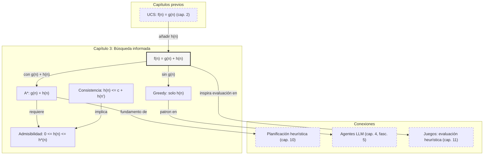

::: {.fasciculo-subtitle}
Facsímil 2 · Inteligencia clásica
:::

# Capítulo 03: Greedy, A* y heurísticas: buscar con estimaciones

## Entrando en el tema

Hasta ahora has explorado a ciegas. BFS, DFS, UCS: algoritmos que no saben nada del problema salvo qué acciones existen y cuánto cuestan. Funcionan, pero son terriblemente ineficientes: exploran miles de estados que no llevan a ninguna parte.

Ahora imagina que tienes una estimación matemática barata. Una función \\(h(n)\\) que, para cualquier estado \\(n\\), estima cuánto falta para llegar a la meta. No es exacta —si lo fuera, ya habrías resuelto el problema—, pero es útil. Con esa estimación, puedes priorizar los estados que *parecen* más prometedores e ignorar los que se alejan. Puedes encontrar la solución explorando cientos de estados en vez de millones.

Esa función se llama **heurística**. Y los algoritmos que la usan —Greedy y A\*— son piezas centrales de la búsqueda informada.^[Pearl, J. (1984). *Heuristics: intelligent search strategies for computer problem solving*. Addison-Wesley. Pearl estableció las bases teóricas de la búsqueda heurística, formalizando conceptos como admisibilidad, consistencia y poder heurístico que permiten comparar rigurosamente distintas heurísticas.] Sin heurísticas, muchos problemas de rutas, planificación y videojuegos tendrían que mirar demasiadas opciones antes de responder.

## Greedy best-first: seguir solo la estimación

El algoritmo *greedy best-first search* es el más simple de los informados. Evalúa cada estado exclusivamente con la heurística \\(h(n)\\) —la estimación de lo que falta hasta la meta— e ignora completamente el coste acumulado \\(g(n)\\).^[Russell, S. y Norvig, P. (2021). *Artificial intelligence: a modern approach* (4.ª ed.). Pearson. La sección 3.5 presenta *greedy best-first* como el primer algoritmo informado, destacando que su velocidad tiene como contrapartida la ausencia de garantías de optimalidad.]

Es como ir de Madrid a Berlín mirando exclusivamente la distancia en línea recta: «Barcelona está más cerca de Berlín que Lisboa, voy a Barcelona. París está más cerca que Roma, voy a París». Nunca mira hacia atrás. Nunca considera si el camino acumulado es bueno o si la ruta aparente esconde un desvío enorme.

Formalmente, Greedy usa esta función de evaluación:

$$
f_{\text{Greedy}}(n) = h(n)
$$

Y en cada iteración extrae de la frontera el nodo que parece más cercano a la meta:

$$
n_t = \arg\min_{n \in F_t} h(n)
$$

| Símbolo | Significado | Ejemplo |
|---|---|---|
| \(f_{\text{Greedy}}(n)\) | Prioridad que Greedy asigna al nodo \(n\). | Si \(h(B)=3\), la prioridad de \(B\) es 3. |
| \(h(n)\) | Estimación de coste desde \(n\) hasta la meta. | Distancia Manhattan hasta la salida. |
| \(F_t\) | Frontera en la iteración \(t\). | \(\{B,C,D\}\). |
| \(\arg\min\) | Operación que devuelve el elemento con menor valor. | Si \(h(C)=2\), Greedy elige \(C\). |

Mira el detalle peligroso: no aparece \(g(n)\). Si llegar hasta \(C\) ya te ha costado 40 pasos y llegar hasta \(B\) solo 2, Greedy no lo ve. Solo pregunta: «¿cuál parece más cerca de la meta desde aquí?».

**Ventaja**: velocidad. Si \\(h(n)\\) es razonablemente buena, Greedy encuentra una solución explorando muy pocos estados. En navegación con distancia euclídea, suele ir directo al destino.

**Riesgo**: no es ni completo ni óptimo. Puede quedarse atascado en un mínimo local, eligiendo repetidamente estados que *parecen* buenos según \\(h\\) pero que no llevan a ninguna parte. Y el camino que encuentra rara vez es el mejor: la heurística puede empujarte hacia una montaña —porque en línea recta parece más corta— cuando el camino óptimo da un rodeo por el valle.^[Nilsson, N. J. (1998). *Artificial intelligence: a new synthesis*. Morgan Kaufmann. La sección 8.2 analiza las limitaciones de Greedy y demuestra con ejemplos concretos por qué ignorar el coste del camino puede llevar a soluciones arbitrariamente malas.]

En agentes LLM modernos, Greedy equivale a elegir la *tool* que parece obvia sin verificar restricciones: «¿cuál es la respuesta? Voy a buscar en la base de datos». Pero quizás antes necesitabas comprobar permisos. La heurística te empujó en una dirección que parecía correcta pero no lo era.

La tabla de propiedades queda así:

| Propiedad | Valor | Por qué |
|---|---|---|
| **Completitud** | No en general | Puede entrar en ciclos o perseguir una rama infinita que parece prometedora. |
| **Optimalidad** | No | Ignora el coste acumulado \(g(n)\). |
| **Tiempo** | \(O(b^m)\) en el peor caso | Si la heurística engaña, puede explorar una rama profunda entera. |
| **Espacio** | \(O(b^m)\) en el peor caso | Mantiene frontera y visitados como otros algoritmos de búsqueda en grafos. |

## A*: coste real + estimación

A\* corrige el defecto fundamental de Greedy combinando dos piezas de información en una sola función de evaluación:^[Hart, P. E., Nilsson, N. J. y Raphael, B. (1968). A formal basis for the heuristic determination of minimum cost paths. *IEEE Transactions on Systems Science and Cybernetics*, 4(2), 100-107. https://doi.org/10.1109/TSSC.1968.300136. Este artículo presentó A\* y demostró formalmente que, con heurística admisible, el algoritmo es óptimo y expande el mínimo número de nodos entre todos los algoritmos óptimos que usan la misma heurística.]

$$f(n) = g(n) + h(n)$$

| Símbolo | Significado | Cálculo |
|---|---|---|
| \\(f(n)\\) | Coste total estimado del camino óptimo que pasa por \\(n\\) | \\(g(n) + h(n)\\) |
| \\(g(n)\\) | Coste real acumulado desde el inicio hasta \\(n\\) | \\(\\sum c(s_{i-1}, a_i)\\) |
| \\(h(n)\\) | Heurística: coste estimado desde \\(n\\) hasta la meta | Específica del problema |
| \\(h^*(n)\\) | Coste real óptimo desde \\(n\\) hasta la meta | Desconocido (es lo que buscamos) |

\\(g(n)\\) es lo que ya has pagado. \\(h(n)\\) es lo que estimas que te queda. \\(f(n)\\) es el total estimado. A\* expande siempre el nodo con menor \\(f(n)\\).^[Poole, D., Mackworth, A. y Goebel, R. (1998). *Computational intelligence: a logical approach*. Oxford University Press.]

La política de extracción de A\* es:

$$
n_t = \arg\min_{n \in F_t} \left(g(n) + h(n)\right)
$$

| Nodo | \(g(n)\): coste ya pagado | \(h(n)\): estimación restante | \(f(n)=g(n)+h(n)\) | Quién lo elegiría |
|---|---:|---:|---:|---|
| \(B\) | 8 | 2 | 10 | Greedy, porque \(h(B)\) es menor. |
| \(C\) | 3 | 4 | 7 | A\*, porque \(f(C)\) es menor. |

Este ejemplo pequeño captura toda la diferencia. Greedy ve \(2 < 4\) y elige \(B\). A\* ve \(10 > 7\) y elige \(C\), porque entiende que lo que ya has pagado también cuenta.

Esto resuelve el problema de Greedy. Si la heurística te empuja hacia un camino que *parece* corto pero es caro, \\(g(n)\\) —el coste real acumulado— penaliza esa decisión. A\* no solo mira lo prometedor: también penaliza los caminos que ya han costado demasiado.^[Luger, G. F. (2008). *Artificial intelligence: structures and strategies for complex problem solving* (6.ª ed.). Pearson.]

### Propiedades formales de A*

**Admisibilidad.** Una heurística \\(h(n)\\) es admisible si nunca sobreestima el coste real hasta la meta. Formalmente:

$$
0 \leq h(n) \leq h^*(n)
$$

| Símbolo | Significado | Ejemplo |
|---|---|---|
| \(h(n)\) | Estimación que calculas rápido. | Distancia en línea recta: 12 km. |
| \(h^*(n)\) | Coste real óptimo desde \(n\) hasta la meta. | Mejor carretera real: 15 km. |
| \(0 \leq h(n)\) | La heurística no puede ser negativa. | No tiene sentido decir “faltan -3 km”. |
| \(h(n) \leq h^*(n)\) | La heurística no promete más de lo que existe. | 12 km no sobreestima 15 km. |

La distancia en línea recta es admisible porque ningún camino por carreteras puede ser más corto que la línea recta. Una heurística que estime tiempos ignorando semáforos, cuestas o peajes puede dejar de ser admisible si promete rutas demasiado optimistas.^[Pearl, J. (1984). *Heuristics: intelligent search strategies for computer problem solving*. Addison-Wesley. El capítulo 3 demuestra el teorema de optimalidad de A\*: si \\(h\\) es admisible, A\* es óptimo en búsqueda en árbol.]

**Teorema de optimalidad.** En búsqueda en árbol, si \\(h(n)\\) es admisible, A\* encuentra un camino de coste mínimo. En búsqueda en grafo, la garantía requiere además gestionar correctamente reaperturas de estados o trabajar con una heurística consistente. La demostración se basa en que A\* no termina hasta haber descartado los nodos que podrían tener \\(f(n) < C^*\\) (el coste óptimo) y, cuando encuentra la meta, su \\(f\\) es igual a \\(g\\) porque \\(h(\\text{meta}) = 0\\).

**Consistencia (monotonicidad).** Una propiedad más fuerte que la admisibilidad:

$$
h(n) \leq c(n,a,n') + h(n')
$$

| Símbolo | Significado | Ejemplo |
|---|---|---|
| \(c(n,a,n')\) | Coste de ir de \(n\) a \(n'\) aplicando \(a\). | Moverte una casilla cuesta 1. |
| \(h(n)\) | Estimación antes de moverte. | Faltan 8 pasos estimados. |
| \(h(n')\) | Estimación después de moverte. | Faltan 7 pasos estimados. |

La lectura es sencilla: la estimación desde \(n\) no puede ser mayor que «lo que cuesta dar un paso» más «lo que estimas desde el siguiente estado». Si \(h\) es consistente, entonces \(f(n)\) nunca baja a lo largo de un camino:

$$
f(n') = g(n) + c(n,a,n') + h(n') \geq g(n) + h(n) = f(n)
$$

Por eso A\* con heurística consistente puede tratar los estados como cerrados la primera vez que los expande: no necesitará reabrirlos más tarde con un coste mejor.^[Rich, E., Knight, K. y Nair, S. B. (2009). *Artificial intelligence* (3.ª ed.). McGraw-Hill.]

## Heurísticas: el arte de saber qué ignorar

Una heurística es una función \\(h: S \\to \\mathbb{R}^+_0\\) que, dado un estado, devuelve una estimación. Diseñar una buena heurística exige escoger información que aporte señal, sea barata de calcular y no rompa las garantías que quieres conservar.^[Pearl, J. (1984). *Heuristics: intelligent search strategies for computer problem solving*. Addison-Wesley. Pearl introdujo el concepto de poder heurístico: una heurística \\(h_1\\) domina a \\(h_2\\) si \\(h_1(n) \\geq h_2(n)\\) para todo \\(n\\), y una heurística más informada produce una búsqueda más eficiente.]

En una rejilla, dos heurísticas clásicas son:

$$
h_{\text{Manhattan}}(n) = |x_n - x_{\text{meta}}| + |y_n - y_{\text{meta}}|
$$

$$
h_{\text{Euclidea}}(n) = \sqrt{(x_n - x_{\text{meta}})^2 + (y_n - y_{\text{meta}})^2}
$$

| Símbolo | Significado | Ejemplo |
|---|---|---|
| \(x_n, y_n\) | Coordenadas del estado actual. | \(n=(2,3)\). |
| \(x_{\text{meta}}, y_{\text{meta}}\) | Coordenadas de la meta. | \(\text{meta}=(7,6)\). |
| \(|x_n-x_{\text{meta}}|\) | Distancia horizontal. | \(|2-7|=5\). |
| \(|y_n-y_{\text{meta}}|\) | Distancia vertical. | \(|3-6|=3\). |

Con esos números:

$$
h_{\text{Manhattan}}(n) = 5 + 3 = 8
$$

$$
h_{\text{Euclidea}}(n) = \sqrt{5^2 + 3^2} = \sqrt{34} \approx 5.83
$$

Si solo puedes moverte en horizontal y vertical, Manhattan suele ser más informativa. Si puedes moverte en cualquier dirección, la euclídea encaja mejor.

| Tipo | Ejemplo | Admisible | Informativa |
|---|---|---|---|
| **Buena** | Distancia euclídea en navegación | Sí | Alta |
| **Aceptable** | Distancia Manhattan en rejilla | Sí | Media |
| **Mala** | «Dificultad del examen = páginas del temario» | No | Baja |
| **Engañosa** | «Número de paquetes que faltan» | No | Engaña |

La diferencia entre una heurística buena y una mala puede ser la diferencia entre explorar 100 estados y 100 000. Una heurística perfecta —\\(h(n) = h^*(n)\\)— haría que A\* fuera directamente a la solución sin explorar nada más, pero calcular \\(h^*(n)\\) es tan difícil como resolver el problema original. El arte está en aproximar \\(h^*(n)\\) sin calcularla exactamente.

Una técnica clásica es **relajar el problema**: eliminar alguna restricción para crear una versión más fácil. La solución del problema relajado es una heurística admisible para el problema original.^[Russell, S. y Norvig, P. (2021). *Artificial intelligence: a modern approach* (4.ª ed.). Pearson. La sección 3.6 explica cómo derivar heurísticas admisibles a partir de versiones relajadas del problema, siendo la distancia en línea recta el ejemplo canónico (ignorar obstáculos es la relajación).] Por ejemplo, la distancia en línea recta es la solución al problema de navegación relajado donde ignoras los obstáculos y las carreteras.

También comparamos heurísticas por **dominancia**:

$$
h_1 \succeq h_2 \quad \Longleftrightarrow \quad \forall n,\; h_1(n) \geq h_2(n)
$$

siempre que ambas sigan siendo admisibles. Si \(h_1\) domina a \(h_2\), A\* con \(h_1\) no expande más nodos que A\* con \(h_2\). Dicho en castellano: cuanto más cerca esté \(h(n)\) de \(h^*(n)\) sin pasarse, menos trabajo hace A\*.

## Auditar una heurística antes de usarla

Una heurística no se acepta porque “suena razonable”. Se audita. Para problemas pequeños, puedes calcular \(h^*(n)\), el coste óptimo real desde cada estado hasta la meta, y comparar.

| Prueba | Fórmula | Qué detecta |
|---|---|---|
| No negatividad | \(h(n)\geq0\) | Estimaciones sin sentido. |
| Meta a cero | \(h(\text{meta})=0\) | Heurísticas que penalizan llegar. |
| Admisibilidad | \(h(n)\leq h^*(n)\) | Sobreestimaciones que rompen optimalidad de A*. |
| Consistencia | \(h(n)\leq c(n,a,n')+h(n')\) | Necesidad de reabrir nodos en grafos. |
| Dominancia | \(h_1(n)\geq h_2(n)\) para todo \(n\) | Qué heurística informará más a A* sin perder garantías. |

En producción no siempre puedes conocer \(h^*(n)\); si pudieras, ya tendrías resuelto el problema. Pero en entornos pequeños, tests, mapas de juguete o fixtures, esta auditoría es oro: te permite validar que tu heurística no está metiendo una promesa falsa en el algoritmo.

También conviene medir el coste de calcular \(h(n)\). Una heurística brillante pero carísima puede perder contra una heurística sencilla si cada evaluación tarda demasiado. A* no solo paga expansiones; también paga evaluaciones de heurística.

<svg xmlns="http://www.w3.org/2000/svg" viewBox="0 0 980 560" role="img" aria-label="Comparación de UCS, Greedy y A estrella mediante coste real, heurística y función de evaluación">
<defs>
<marker id="arrow-greedy-a-star" viewBox="0 0 10 10" refX="8" refY="5" markerWidth="7" markerHeight="7" orient="auto-start-reverse"><path d="M 0 0 L 10 5 L 0 10 z" fill="#111111"/></marker>
</defs>
<rect x="0" y="0" width="980" height="560" rx="10" fill="#FFFFFF" stroke="#111111" stroke-width="2"/>
<text x="490" y="34" text-anchor="middle" font-family="Arial, sans-serif" font-size="22" font-weight="700" fill="#111111">UCS, Greedy y A*: la misma frontera con distinta prioridad</text>
<text x="490" y="58" text-anchor="middle" font-family="Arial, sans-serif" font-size="13" fill="#555555">La decisión cambia según mires solo el coste real, solo la estimación o la suma de ambos.</text>
<rect x="50" y="88" width="880" height="80" rx="8" fill="#F7F7F7" stroke="#111111" stroke-width="1.4"/>
<text x="80" y="116" font-family="Arial, sans-serif" font-size="12" font-weight="700" fill="#111111">FRONTERA EN ESTE INSTANTE</text>
<rect x="270" y="112" width="120" height="34" rx="4" fill="#FFFFFF" stroke="#111111"/>
<rect x="430" y="112" width="120" height="34" rx="4" fill="#FFFFFF" stroke="#111111"/>
<rect x="590" y="112" width="120" height="34" rx="4" fill="#FFFFFF" stroke="#111111"/>
<text x="330" y="134" text-anchor="middle" font-family="Arial, sans-serif" font-size="13" fill="#111111">B: g=8, h=2</text>
<text x="490" y="134" text-anchor="middle" font-family="Arial, sans-serif" font-size="13" fill="#111111">C: g=3, h=4</text>
<text x="650" y="134" text-anchor="middle" font-family="Arial, sans-serif" font-size="13" fill="#111111">D: g=5, h=7</text>
<path d="M330 168 V198" stroke="#111111" stroke-width="1.3" marker-end="url(#arrow-greedy-a-star)"/>
<path d="M490 168 V198" stroke="#111111" stroke-width="1.3" marker-end="url(#arrow-greedy-a-star)"/>
<path d="M650 168 V198" stroke="#111111" stroke-width="1.3" marker-end="url(#arrow-greedy-a-star)"/>
<rect x="44" y="205" width="285" height="250" rx="8" fill="#FFFFFF" stroke="#111111" stroke-width="1.7"/>
<rect x="347.5" y="205" width="285" height="250" rx="8" fill="#FFFFFF" stroke="#111111" stroke-width="1.7"/>
<rect x="651" y="205" width="285" height="250" rx="8" fill="#FFFFFF" stroke="#111111" stroke-width="1.7"/>
<text x="186.5" y="238" text-anchor="middle" font-family="Arial, sans-serif" font-size="19" font-weight="700" fill="#111111">UCS</text>
<text x="490" y="238" text-anchor="middle" font-family="Arial, sans-serif" font-size="19" font-weight="700" fill="#111111">Greedy</text>
<text x="793.5" y="238" text-anchor="middle" font-family="Arial, sans-serif" font-size="19" font-weight="700" fill="#111111">A*</text>
<text x="186.5" y="263" text-anchor="middle" font-family="Arial, sans-serif" font-size="13" fill="#444444">Solo mira lo que ya costó.</text>
<text x="490" y="263" text-anchor="middle" font-family="Arial, sans-serif" font-size="13" fill="#444444">Solo mira lo que parece faltar.</text>
<text x="793.5" y="263" text-anchor="middle" font-family="Arial, sans-serif" font-size="13" fill="#444444">Suma coste real + estimación.</text>
<line x1="70" y1="282" x2="303" y2="282" stroke="#D0D0D0"/>
<line x1="373.5" y1="282" x2="606.5" y2="282" stroke="#D0D0D0"/>
<line x1="677" y1="282" x2="910" y2="282" stroke="#D0D0D0"/>
<text x="186.5" y="318" text-anchor="middle" font-family="Georgia, serif" font-size="18" fill="#111111">f(n) = g(n)</text>
<text x="490" y="318" text-anchor="middle" font-family="Georgia, serif" font-size="18" fill="#111111">f(n) = h(n)</text>
<text x="793.5" y="318" text-anchor="middle" font-family="Georgia, serif" font-size="18" fill="#111111">f(n) = g(n) + h(n)</text>
<rect x="82" y="344" width="210" height="46" rx="4" fill="#F7F7F7" stroke="#BBBBBB"/>
<rect x="385" y="344" width="210" height="46" rx="4" fill="#F7F7F7" stroke="#BBBBBB"/>
<rect x="688.5" y="344" width="210" height="46" rx="4" fill="#F7F7F7" stroke="#BBBBBB"/>
<text x="186.5" y="363" text-anchor="middle" font-family="Arial, sans-serif" font-size="12" fill="#111111">elige C</text>
<text x="186.5" y="381" text-anchor="middle" font-family="Arial, sans-serif" font-size="12" fill="#555555">porque g(C)=3 es menor</text>
<text x="490" y="363" text-anchor="middle" font-family="Arial, sans-serif" font-size="12" fill="#111111">elige B</text>
<text x="490" y="381" text-anchor="middle" font-family="Arial, sans-serif" font-size="12" fill="#555555">porque h(B)=2 es menor</text>
<text x="793.5" y="363" text-anchor="middle" font-family="Arial, sans-serif" font-size="12" fill="#111111">elige C</text>
<text x="793.5" y="381" text-anchor="middle" font-family="Arial, sans-serif" font-size="12" fill="#555555">porque f(C)=3+4=7</text>
<text x="186.5" y="420" text-anchor="middle" font-family="Arial, sans-serif" font-size="12" fill="#111111">Óptimo sin heurística</text>
<text x="490" y="420" text-anchor="middle" font-family="Arial, sans-serif" font-size="12" fill="#111111">Rápido, pero no óptimo</text>
<text x="793.5" y="420" text-anchor="middle" font-family="Arial, sans-serif" font-size="12" fill="#111111">Óptimo si h es admisible</text>
<rect x="120" y="480" width="740" height="46" rx="6" fill="#F7F7F7" stroke="#111111" stroke-width="1.2"/>
<text x="490" y="500" text-anchor="middle" font-family="Arial, sans-serif" font-size="13" font-weight="700" fill="#111111">Condición clave de A*</text>
<text x="490" y="518" text-anchor="middle" font-family="Georgia, serif" font-size="15" fill="#111111">0 ≤ h(n) ≤ h*(n)  ·  h(meta) = 0  ·  consistencia: h(n) ≤ c(n,a,n') + h(n')</text>
<text x="940" y="546" text-anchor="end" font-family="Arial, sans-serif" font-size="10" fill="#9A9A9A">IA para gente curiosa / Facsímil 02 / Capítulo 03 / 686f6c61</text>
</svg>

## En el día a día

- **GPS y navegación**: A\* con \\(h(n)\\) = distancia euclídea es una simplificación útil para entender la idea. Los sistemas reales añaden datos de tráfico, restricciones de giro, jerarquías de carretera y cachés, pero el mecanismo permanece: una heurística buena reduce mucho el espacio que hay que mirar.
- **Videojuegos**: *pathfinding* de NPCs con A\* y distancia Manhattan. Sin A\*, los personajes se quedarían atascados contra las paredes.
- **Agentes LLM**: una decisión de *tool* puede modelarse como un paso de búsqueda. El LLM puede proponer qué herramienta parece más prometedora, pero el sistema debería añadir coste acumulado, riesgo, permisos y observación. Si penalizas caminos que ya han consumido demasiados tokens o llamadas caras, estás metiendo una idea parecida a \(g(n)\) en el diseño.

## Por qué debería importarte

A\* es uno de los algoritmos centrales de la IA clásica: combina coste real y estimación futura de una forma sorprendentemente clara. La ecuación \\(f(n) = g(n) + h(n)\\) resume décadas de investigación. Pero la lección más profunda no es memorizar el algoritmo: es aprender a diseñar **heurísticas** que ahorran búsqueda sin romper las garantías que necesitas.

Y este concepto trasciende la IA: en optimización, en diseño de algoritmos, en toma de decisiones, la habilidad de encontrar atajos informados que no comprometan la calidad de la solución es universal. A\* formaliza esa tensión entre coste observado y estimación restante.

## Dónde solía tropezar yo

| Error | Por qué es un error | Antídoto |
|---|---|---|
| **Heurística no admisible con A\*** | Si \\(h(n)\\) sobreestima el coste real, A\* puede pasar de largo la solución óptima. | Verifica \\(0 \\leq h(n) \\leq h^*(n)\\). La distancia euclídea y Manhattan son admisibles. Las heurísticas basadas en «coste medio» no lo son. |
| **Confundir Greedy con A\*** | Greedy ignora \\(g(n)\\): no garantiza optimalidad. A\* usa \\(g(n) + h(n)\\): sí la garantiza con \\(h\\) admisible. | Usa A\* si necesitas optimalidad. Greedy solo si necesitas una solución rápida y la calidad no es crítica. |
| **Heurística demasiado cara de calcular** | Evaluar \\(h(n)\\) cuesta tiempo. Si calcular \\(h\\) tarda más que expandir unos cientos de nodos extra con una heurística más simple, estás perdiendo eficiencia neta. | Mide el tiempo de \\(h(n)\\). Si es más lento que expandir ~100 nodos, simplifica la heurística. |

## Manos a la obra

La práctica real está en `labs/f2/c03-heuristic-audit/`. Ejecuta UCS, Greedy, A*, A* con heurística nula y Weighted A* sobre el mismo grafo. Además audita heurísticas contra el coste óptimo real \(h^*(n)\).

```bash
cd labs/f2/c03-heuristic-audit
python3 ops/audit_heuristics.py --write
cat output/heuristic_decision.md
```

**Qué deberías ver.** La heurística nula convierte A* en UCS. Una heurística admisible y consistente conserva optimalidad y suele reducir expansiones. Greedy puede encontrar una solución rápida pero no tiene garantías. Weighted A* puede expandir menos, pero si \(w>1\) ya no promete óptimo.

| Archivo | Papel |
|---|---|
| `data/heuristic_graph.json` | Grafo ponderado y valores heurísticos candidatos. |
| `contracts/heuristic_policy.json` | Peso de Weighted A*, reglas de auditoría y límites de comparación. |
| `ops/audit_heuristics.py` | Auditor e implementaciones ejecutables sin dependencias externas. |
| `output/heuristic_report.json` | Resultados estructurados: admisibilidad, consistencia, dominancia y búsquedas. |
| `output/heuristic_decision.md` | Informe legible para entregar. |

**Cómo lo adaptas a tu caso.** Cambia el grafo, añade una heurística nueva y mira si sigue siendo admisible. Después modifica el peso de Weighted A*. Si el coste baja o sube, explica por qué.

**Qué entregaría un alumno.** El Markdown generado, una heurística propia, una prueba de si es admisible/consistente y una comparación entre UCS, Greedy, A* y Weighted A*.

## Cómo encaja todo

Este capítulo añade una pieza nueva a la frontera del capítulo 02: ya no ordenas solo por antigüedad o por coste real acumulado. Ahora introduces una estimación del futuro. Esa estimación puede ahorrar muchísimo trabajo, pero solo mantiene garantías si se comporta matemáticamente bien.

La idea seguirá viva en planificación, juegos y agentes: muchas decisiones inteligentes son una mezcla de coste pagado, coste esperado, riesgo y una función de evaluación.



## Vocabulario aprendido

| Término | Definición |
|---|---|
| **A\*** | \\(f(n)=g(n)+h(n)\\). Óptimo si \\(h\\) es admisible. |
| **Heurística admisible** | Nunca sobreestima: \\(0 \\leq h(n) \\leq h^*(n)\\). |
| **Greedy best-first** | Solo \\(h(n)\\). Rápido, no óptimo. |
| **Consistencia** | \\(h(n) \\leq c(n,a,n') + h(n')\\). Más fuerte que admisibilidad. |
| **Relajación** | Simplificar el problema para obtener una heurística admisible. |
| **Dominancia heurística** | Una heurística admisible domina a otra si estima siempre igual o más sin sobreestimar. Suele reducir expansiones. |
| **Weighted A\*** | Variante \(f(n)=g(n)+w h(n)\). Con \(w>1\) puede ser más rápida, pero pierde optimalidad garantizada. |

## Antes de pasar página

- [ ] ¿Puedo escribir \\(f(n) = g(n) + h(n)\\) y explicar cada término?
- [ ] ¿Entiendo qué significa que \\(h\\) sea admisible?
- [ ] ¿Sé diferenciar Greedy de A\*?
- [ ] ¿Puedo auditar una heurística con admisibilidad, consistencia y dominancia?
- [ ] ¿He ejecutado `labs/f2/c03-heuristic-audit/` y puedo explicar por qué Weighted A* puede perder optimalidad?

## En resumen

| Idea fuerza | Detalle |
|---|---|
| A\* = UCS + heurística. | \\(g(n)\\) garantiza optimalidad; \\(h(n)\\) añade eficiencia. |
| Admisibilidad abre la puerta a la optimalidad. | \\(h(n) \\leq h^*(n)\\) es la condición suficiente que A\* necesita en búsqueda en árbol; en grafos, la consistencia evita reexpansiones. |
| La heurística lo es todo. | De millones de estados a cientos. El arte está en el equilibrio entre precisión y coste. |
| Las heurísticas también se testean. | No basta con una estimación plausible: admisibilidad, consistencia, dominancia y coste de cálculo son parte del contrato. |

## Para saber más

Hart, P. E., Nilsson, N. J. y Raphael, B. (1968). A formal basis for the heuristic determination of minimum cost paths. *IEEE Transactions on Systems Science and Cybernetics*, 4(2), 100-107. https://doi.org/10.1109/TSSC.1968.300136

Luger, G. F. (2008). *Artificial intelligence: structures and strategies for complex problem solving* (6.ª ed.). Pearson.

Nilsson, N. J. (1998). *Artificial intelligence: a new synthesis*. Morgan Kaufmann.

Pearl, J. (1984). *Heuristics: intelligent search strategies for computer problem solving*. Addison-Wesley.

Poole, D., Mackworth, A. y Goebel, R. (1998). *Computational intelligence: a logical approach*. Oxford University Press.

Rich, E., Knight, K. y Nair, S. B. (2009). *Artificial intelligence* (3.ª ed.). McGraw-Hill.

Russell, S. y Norvig, P. (2021). *Artificial intelligence: a modern approach* (4.ª ed.). Pearson. https://aima.cs.berkeley.edu/
