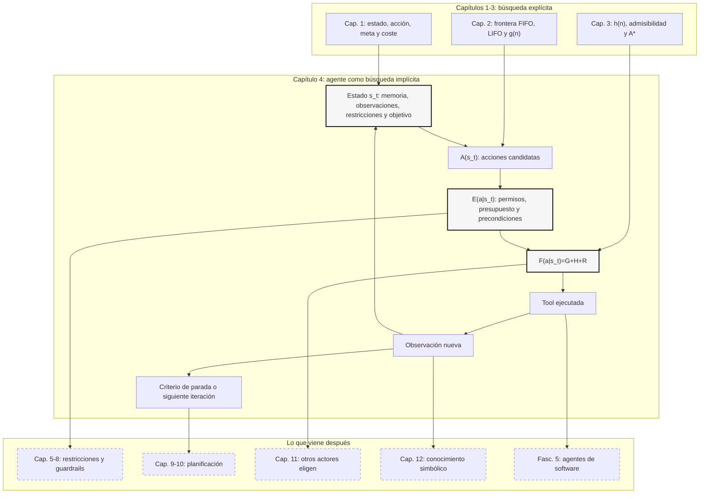

::: {.fasciculo-subtitle}
Facsímil 2 · Inteligencia clásica
:::

# Capítulo 04: Búsqueda en agentes modernos y recapitulación

## Entrando en el tema

Has aprendido a formular un problema como estados, acciones, meta y coste. Has visto qué ocurre cuando exploras a ciegas con BFS, DFS y UCS. Después has añadido estimaciones heurísticas con Greedy y A\*. Ahora toca cerrar el bloque con una pregunta muy práctica: ¿por qué importa todo esto si hoy hablamos de LLMs, agentes y *tools*?

Porque muchas decisiones de un agente moderno pueden modelarse como decisiones en un espacio de posibilidades. Puede que no dibuje un árbol de búsqueda en pantalla. Puede que no tenga una cola de prioridad explícita llamada `frontier`. Pero cuando decide si debe leer un archivo, consultar una base de datos, llamar a una API, pedir aclaración o responder, está eligiendo una acción desde un estado, con costes, restricciones y una meta.^[Russell, S. y Norvig, P. (2021). *Artificial intelligence: a modern approach* (4.ª ed.). Pearson. El capítulo 2 define los agentes racionales como sistemas que seleccionan acciones para maximizar una medida de rendimiento, una idea que conecta directamente con la búsqueda como selección de acciones.]

Este capítulo tiene dos trabajos. Primero, traducir la búsqueda clásica al lenguaje de los agentes actuales. Segundo, recapitular activamente los cuatro primeros capítulos del facsímil 2, igual que hicimos al cerrar el facsímil 1: concepto, recuerdo, ejemplo y punto exacto al que volver si algo no está asentado.

## El agente como motor de búsqueda

Un agente LLM con herramientas puede leerse como un sistema de búsqueda que descubre el espacio mientras actúa.^[Nilsson, N. J. (1998). *Artificial intelligence: a new synthesis*. Morgan Kaufmann. Nilsson conecta búsqueda, planificación y agentes como variantes de un mismo problema de decisión secuencial.] La formulación mínima sería:

$$
s_t = (m_t, o_t, r_t, q)
$$

| Símbolo | Significado | Ejemplo |
|---|---|---|
| \(s_t\) | Estado del agente en el instante \(t\). | Lo que sabe después de dos llamadas a herramientas. |
| \(m_t\) | Memoria o historial disponible. | Mensajes previos, notas, resumen de contexto. |
| \(o_t\) | Observaciones recibidas del entorno. | Resultado de una búsqueda, salida de un test, respuesta de una API. |
| \(r_t\) | Restricciones activas. | Permisos, presupuesto de tokens, formato esperado. |
| \(q\) | Objetivo o pregunta que se intenta resolver. | “Encuentra por qué falla este test”. |

Las acciones son las *tools* que puede ejecutar:

$$
a_t \in A(s_t)
$$

| Símbolo | Significado | Ejemplo |
|---|---|---|
| \(a_t\) | Acción elegida en el paso \(t\). | Leer un archivo, ejecutar un test, buscar documentación. |
| \(A(s_t)\) | Acciones disponibles desde el estado actual. | Si no hay red, “buscar online” no está disponible. |

Después de actuar, el agente recibe una observación y actualiza su estado:

$$
s_{t+1} = T(s_t, a_t, o_{t+1})
$$

Esta es la lectura de búsqueda que nos interesa. El árbol no está escrito antes de empezar: aparece a medida que el agente actúa, observa y actualiza su estado.^[Poole, D., Mackworth, A. y Goebel, R. (1998). *Computational intelligence: a logical approach*. Oxford University Press. Su marco de búsqueda como transición entre estados permite modelar tanto algoritmos clásicos como agentes que intercalan percepción, acción y actualización de creencias.]

## El mecanismo paso a paso

En búsqueda clásica, la frontera contiene nodos. En un agente, la frontera contiene **siguientes acciones plausibles**: “consultar docs”, “leer logs”, “ejecutar test”, “preguntar al usuario”, “responder ya”. Una política de extracción decide cuál probar primero.

**Ejemplo de fórmula.** Podemos escribir una versión operativa inspirada en la función de evaluación de A\*. No es una ley universal de agentes ni un algoritmo estándar: es una plantilla de diseño para obligarnos a separar coste, avance esperado y riesgo antes de elegir una acción.

$$
F(a \mid s_t) = G(a \mid s_t) + H(a \mid s_t) + R(a \mid s_t)
$$

| Símbolo | Significado | Ejemplo |
|---|---|---|
| \(F(a \mid s_t)\) | Prioridad total de una acción \(a\) desde el estado actual. | Menor valor: acción más recomendable. |
| \(G(a \mid s_t)\) | Coste operativo esperado. | Tokens, latencia, dinero, complejidad. |
| \(H(a \mid s_t)\) | Estimación de distancia restante a la meta. | “Leer el error exacto probablemente acerca mucho”. |
| \(R(a \mid s_t)\) | Penalización por riesgo o incertidumbre. | Acción destructiva, datos sensibles, baja confianza. |

Y la política de decisión sería:

$$
a_t = \arg\min_{a \in A(s_t)} F(a \mid s_t)
$$

Esto no significa que todos los agentes implementen literalmente esta ecuación. Significa que la ecuación te da un lenguaje para diseñarlos y auditar una política concreta. Los pesos, unidades y umbrales deben calibrarse con trazas reales: latencia, coste, errores, acciones bloqueadas y consecuencias. Un agente puramente Greedy minimiza solo \(H\): elige lo que parece prometedor. Un agente más cuidadoso incluye \(G\): evita gastar tokens y tiempo sin necesidad. Un agente robusto añade \(R\): no ejecuta acciones arriesgadas solo porque parezcan útiles.^[Hart, P. E., Nilsson, N. J. y Raphael, B. (1968). A formal basis for the heuristic determination of minimum cost paths. *IEEE Transactions on Systems Science and Cybernetics*, 4(2), 100-107. https://doi.org/10.1109/TSSC.1968.300136. A\* formalizó la combinación de coste acumulado y estimación restante; esa idea sigue siendo una plantilla útil para razonar sobre agentes con herramientas.]

## Diseñar una política de agente que se pueda auditar

En ingeniería no basta con decir “el agente decide”. Una decisión de agente debería poder explicarse después: qué sabía, qué acciones podía ejecutar, cuáles estaban bloqueadas, qué coste esperaba pagar, qué riesgo aceptaba y por qué eligió una opción concreta. Si no puedes reconstruir esa historia, tienes una caja negra operativa.

Por eso conviene separar dos capas:

$$
E(a \mid s_t) \in \{0,1\}
$$

$$
a_t = \arg\min_{a \in A(s_t),\; E(a \mid s_t)=1} F(a \mid s_t)
$$

| Capa | Pregunta | Ejemplo |
|---|---|---|
| Elegibilidad \(E(a \mid s_t)\) | ¿Se puede ejecutar esta acción ahora? | No editar producción sin evidencia; no consultar datos personales sin permiso. |
| Ranking \(F(a \mid s_t)\) | Entre las acciones permitidas, ¿cuál conviene primero? | Leer consola cuesta poco y reduce incertidumbre: buena primera acción. |
| Parada | ¿Cuándo dejo de buscar? | Responder si hay evidencia suficiente; pedir aprobación si la acción siguiente es destructiva. |
| Trazabilidad | ¿Qué debería quedar registrado? | Estado inicial, acciones candidatas, puntuación, bloqueos, observaciones y decisión. |

Esta separación evita dos errores frecuentes. El primero es usar una puntuación blanda para permitir acciones que deberían estar prohibidas. Si una acción requiere aprobación, no debería “ganar” por tener buen score: debería quedar bloqueada hasta tener autorización. El segundo es esconder las razones de la política dentro de un prompt. Puedes usar un LLM como parte del sistema, pero el contrato operativo —presupuestos, permisos, formato, evidencias mínimas y criterios de parada— debe existir fuera del texto improvisado.

En agentes con herramientas, esta trazabilidad también sirve para depurar. Si el agente gastó diez llamadas antes de leer el error principal, el problema no era “el modelo”: era la política. Si editó código antes de mirar una prueba mínima, el problema no era “la IA”: era que no había una precondición de evidencia.

<svg xmlns="http://www.w3.org/2000/svg" viewBox="0 0 980 520" role="img" aria-label="Agente moderno como búsqueda sobre acciones, tools, observaciones y coste">
<defs>
<marker id="arrow-agent-search" viewBox="0 0 10 10" refX="8" refY="5" markerWidth="7" markerHeight="7" orient="auto-start-reverse"><path d="M 0 0 L 10 5 L 0 10 z" fill="#111111"/></marker>
</defs>
<rect x="0" y="0" width="980" height="520" rx="10" fill="#FFFFFF" stroke="#111111" stroke-width="2"/>
<text x="490" y="34" text-anchor="middle" font-family="Arial, sans-serif" font-size="22" font-weight="700" fill="#111111">Un agente moderno también busca</text>
<text x="490" y="58" text-anchor="middle" font-family="Arial, sans-serif" font-size="13" fill="#555555">La frontera no contiene solo nodos: contiene próximas acciones posibles.</text>
<rect x="50" y="90" width="210" height="92" rx="8" fill="#F7F7F7" stroke="#111111" stroke-width="1.5"/>
<text x="155" y="120" text-anchor="middle" font-family="Arial, sans-serif" font-size="16" font-weight="700" fill="#111111">Estado s<tspan baseline-shift="sub" font-size="11">t</tspan></text>
<text x="155" y="145" text-anchor="middle" font-family="Arial, sans-serif" font-size="12" fill="#444444">memoria + observaciones</text>
<text x="155" y="164" text-anchor="middle" font-family="Arial, sans-serif" font-size="12" fill="#444444">restricciones + objetivo</text>
<path d="M260 136 H330" stroke="#111111" stroke-width="1.5" marker-end="url(#arrow-agent-search)"/>
<rect x="335" y="84" width="310" height="104" rx="8" fill="#FFFFFF" stroke="#111111" stroke-width="1.7"/>
<text x="490" y="112" text-anchor="middle" font-family="Arial, sans-serif" font-size="16" font-weight="700" fill="#111111">Frontera de acciones</text>
<rect x="370" y="132" width="70" height="28" rx="4" fill="#F7F7F7" stroke="#111111"/>
<rect x="455" y="132" width="70" height="28" rx="4" fill="#FFFFFF" stroke="#111111"/>
<rect x="540" y="132" width="70" height="28" rx="4" fill="#FFFFFF" stroke="#111111"/>
<text x="405" y="151" text-anchor="middle" font-family="Arial, sans-serif" font-size="11" fill="#111111">leer</text>
<text x="490" y="151" text-anchor="middle" font-family="Arial, sans-serif" font-size="11" fill="#111111">test</text>
<text x="575" y="151" text-anchor="middle" font-family="Arial, sans-serif" font-size="11" fill="#111111">preguntar</text>
<path d="M645 136 H720" stroke="#111111" stroke-width="1.5" marker-end="url(#arrow-agent-search)"/>
<rect x="725" y="90" width="205" height="92" rx="8" fill="#F7F7F7" stroke="#111111" stroke-width="1.5"/>
<text x="827.5" y="120" text-anchor="middle" font-family="Arial, sans-serif" font-size="16" font-weight="700" fill="#111111">Tool ejecutada</text>
<text x="827.5" y="145" text-anchor="middle" font-family="Arial, sans-serif" font-size="12" fill="#444444">acción a<tspan baseline-shift="sub" font-size="9">t</tspan></text>
<text x="827.5" y="164" text-anchor="middle" font-family="Arial, sans-serif" font-size="12" fill="#444444">devuelve observación</text>
<path d="M828 182 C828 245 630 245 555 205" fill="none" stroke="#777777" stroke-width="1.2" stroke-dasharray="5 5" marker-end="url(#arrow-agent-search)"/>
<rect x="215" y="250" width="550" height="90" rx="8" fill="#FFFFFF" stroke="#111111" stroke-width="1.5"/>
<text x="490" y="278" text-anchor="middle" font-family="Georgia, serif" font-size="18" font-style="italic" fill="#111111">F(a | s<tspan baseline-shift="sub" font-size="12">t</tspan>) = G(a | s<tspan baseline-shift="sub" font-size="12">t</tspan>) + H(a | s<tspan baseline-shift="sub" font-size="12">t</tspan>) + R(a | s<tspan baseline-shift="sub" font-size="12">t</tspan>)</text>
<text x="490" y="307" text-anchor="middle" font-family="Arial, sans-serif" font-size="12" fill="#444444">coste operativo + distancia estimada + riesgo</text>
<text x="490" y="326" text-anchor="middle" font-family="Georgia, serif" font-size="16" fill="#111111">a<tspan baseline-shift="sub" font-size="11">t</tspan> = argmin F(a | s<tspan baseline-shift="sub" font-size="11">t</tspan>)</text>
<rect x="78" y="382" width="240" height="66" rx="6" fill="#FFFFFF" stroke="#111111"/>
<rect x="370" y="382" width="240" height="66" rx="6" fill="#FFFFFF" stroke="#111111"/>
<rect x="662" y="382" width="240" height="66" rx="6" fill="#FFFFFF" stroke="#111111"/>
<text x="198" y="407" text-anchor="middle" font-family="Arial, sans-serif" font-size="13" font-weight="700" fill="#111111">Agente Greedy</text>
<text x="490" y="407" text-anchor="middle" font-family="Arial, sans-serif" font-size="13" font-weight="700" fill="#111111">Agente tipo A*</text>
<text x="782" y="407" text-anchor="middle" font-family="Arial, sans-serif" font-size="13" font-weight="700" fill="#111111">Agente robusto</text>
<text x="198" y="428" text-anchor="middle" font-family="Arial, sans-serif" font-size="12" fill="#444444">minimiza solo H</text>
<text x="490" y="428" text-anchor="middle" font-family="Arial, sans-serif" font-size="12" fill="#444444">equilibra G + H</text>
<text x="782" y="428" text-anchor="middle" font-family="Arial, sans-serif" font-size="12" fill="#444444">equilibra G + H + R</text>
<text x="940" y="498" text-anchor="end" font-family="Arial, sans-serif" font-size="10" fill="#9A9A9A">IA para gente curiosa / Facsímil 02 / Capítulo 04 / 686f6c61</text>
</svg>

## En el día a día

Imagina un agente de código que recibe: “la página falla al cargar”. Puede hacer muchas cosas. Leer el error de consola. Abrir el navegador. Buscar en el repositorio. Ejecutar tests. Mirar el último commit. Preguntar al usuario. Todas son acciones válidas, pero no todas son igual de buenas.

Una política Greedy elegiría lo que parece más directo: “abrir el navegador”. Puede funcionar. Pero si no mira los logs, quizá pierda diez minutos en la pantalla equivocada. Una política tipo A\* ponderaría el coste y la información esperada: “leer el error de consola cuesta poco y reduce mucho la incertidumbre; hagamos eso primero”.

En producción, esta diferencia se traduce en dinero y fiabilidad. Un agente que llama a diez herramientas para resolver una pregunta sencilla no solo es más lento: también introduce más puntos de fallo. Un agente que responde demasiado pronto parece rápido, pero puede inventar. El buen diseño está en equilibrar información, coste y riesgo.^[Luger, G. F. (2008). *Artificial intelligence: structures and strategies for complex problem solving* (6.ª ed.). Pearson. El capítulo 3 insiste en que la eficiencia de una búsqueda depende tanto de la representación del problema como de la estrategia de control.]

## Por qué debería importarte

La búsqueda clásica te da un vocabulario para diseñar agentes modernos sin confundir una salida fluida con una decisión controlada. Si defines mal el estado, el agente se pierde. Si defines mal las acciones, no puede llegar a la solución. Si ignoras el coste, se vuelve caro. Si ignoras el riesgo, se vuelve peligroso. Si la heurística es mala, parece inteligente mientras da vueltas.

Esto es especialmente importante porque los LLMs son convincentes. Pueden explicar una decisión con mucha seguridad aunque la decisión sea mala. La estructura de búsqueda te obliga a preguntar: ¿qué estado tenía?, ¿qué acciones consideró?, ¿qué coste pagó?, ¿qué evidencia observó?, ¿por qué eligió esa acción y no otra?

## Dónde solía tropezar yo

| Error | Por qué es un error | Antídoto |
|---|---|---|
| **Llamar “agente” a cualquier prompt con herramientas** | Tener tools no basta. Un agente necesita estado, acciones, criterio de decisión y actualización tras observar resultados. | Dibuja \(s_t\), \(A(s_t)\), \(a_t\) y \(s_{t+1}\). Si no puedes, todavía no hay diseño de agente. |
| **Hacer tool selection puramente Greedy** | La herramienta obvia puede ser cara, arriesgada o prematura. | Añade coste \(G\) y riesgo \(R\) al criterio de decisión. |
| **No modelar el coste en tokens y latencia** | Un agente puede ser correcto y aun así inviable si tarda demasiado o cuesta demasiado. | Define presupuesto antes de ejecutar: tokens máximos, llamadas máximas y tiempo máximo. |
| **Confundir observación con verdad** | Una tool puede devolver datos incompletos, antiguos o mal interpretados. | Guarda la fuente de cada observación y verifica las decisiones importantes. |
| **Recapitular sin comprobar** | Leer “ya lo entiendo” no equivale a poder reconstruirlo. | Usa las preguntas de revisión activa; si fallas una, vuelve al capítulo concreto. |

## Manos a la obra

La práctica real está en `labs/f2/c04-agent-action-policy/`. El kit simula un agente de ingeniería que recibe una incidencia: la página de checkout falla. Tiene varias acciones candidatas, pero no todas son elegibles. Algunas son baratas y aportan evidencia; otras son caras; otras requieren aprobación porque tocan datos o podrían modificar código sin pruebas.

```bash
cd labs/f2/c04-agent-action-policy
python3 ops/rank_agent_actions.py --write
cat output/agent_action_decision.md
```

Como gate:

```bash
python3 ops/rank_agent_actions.py --write --fail-on-invalid
```

**Qué deberías ver.** El sistema separa acciones bloqueadas de acciones elegibles. Después ordena las elegibles con \(F=G+H+R\). La mejor primera acción no es “editar rápido”, sino recoger evidencia barata: leer la consola del navegador. Eso enseña una regla práctica: un agente útil no solo elige lo que parece acercarle a la solución; también respeta precondiciones.

| Archivo | Papel |
|---|---|
| `data/agent_case.json` | Incidencia, estado inicial y acciones candidatas. |
| `contracts/action_policy.json` | Pesos de coste, incertidumbre y riesgo; presupuestos y bloqueos duros. |
| `ops/rank_agent_actions.py` | Motor de ranking y auditoría sin dependencias externas. |
| `output/agent_action_report.json` | Resultado estructurado para revisión automática. |
| `output/agent_action_decision.md` | Decisión legible: acción recomendada, ranking y bloqueos. |

**Cómo lo adaptas a tu caso.** Cambia las acciones candidatas por herramientas reales de tu proyecto: leer logs, ejecutar tests, consultar documentación interna, pedir aprobación, abrir un ticket o llamar a una API. Después ajusta pesos y bloqueos. Si una acción peligrosa gana el ranking, el contrato está mal: no deberías arreglarlo con un prompt, sino con una regla de elegibilidad.

**Qué entregaría un alumno.** El Markdown generado, una acción nueva añadida al caso, una justificación de sus valores \(G\), \(H\) y \(R\), y una decisión escrita sobre qué acción ejecutaría primero y cuál quedaría bloqueada.

## Recapitulación activa del bloque de búsqueda

Este cierre funciona como el capítulo 12 del facsímil 1: no es un resumen para leer rápido, sino una revisión activa. Si una sección no te sale, vuelve al capítulo indicado.

## 1. Búsqueda como espacio de estados

**El concepto.** Un problema de búsqueda se define con estado inicial, acciones, función de transición, prueba de meta y coste. Si una de esas piezas está borrosa, el algoritmo no tiene dónde agarrarse.^[Russell, S. y Norvig, P. (2021). *Artificial intelligence: a modern approach* (4.ª ed.). Pearson.]

**Para recordar.** El estado no es “todo lo que existe”: es solo la información necesaria para decidir la siguiente acción. Meter información irrelevante infla el espacio de búsqueda.

**Ejemplo fresco.** En un laberinto, el estado puede ser la coordenada \((x,y)\). No necesitas guardar el color de la pared ni la hora del día. En un agente de código, el estado puede incluir error, archivos leídos y tests ejecutados; no necesita recordar cada token de una conversación si ya tiene un resumen fiable.

**Vuelve al capítulo 1 si:** no puedes definir estado, acción, meta y coste para un problema cotidiano.

## 2. BFS, DFS, UCS e IDS

**El concepto.** La frontera determina el algoritmo. Cola FIFO produce BFS. Pila LIFO produce DFS. Cola de prioridad por \(g(n)\) produce UCS. DFS con límites crecientes produce IDS.^[Poole, D., Mackworth, A. y Goebel, R. (1998). *Computational intelligence: a logical approach*. Oxford University Press.]

**Para recordar.** BFS es completo y óptimo con costes uniformes, pero consume memoria \(O(b^d)\). DFS consume mucha menos memoria, \(O(b \cdot m)\), pero no garantiza optimalidad. UCS generaliza BFS cuando las acciones cuestan distinto.

**Ejemplo fresco.** Si todas las calles pesan igual, BFS encuentra el camino con menos cruces. Si unas calles son autopistas y otras caminos lentos, necesitas UCS. Si el espacio es enorme y solo quieres no quedarte sin memoria, IDS es el puente.

**Vuelve al capítulo 2 si:** no puedes explicar por qué cambiar cola por pila cambia completamente el comportamiento.

## 3. Greedy, A* y heurísticas

**El concepto.** Greedy usa \(f(n)=h(n)\). A\* usa \(f(n)=g(n)+h(n)\). La heurística \(h(n)\) es una estimación de lo que falta, y su calidad decide cuántos estados se exploran.^[Pearl, J. (1984). *Heuristics: intelligent search strategies for computer problem solving*. Addison-Wesley.]

**Para recordar.** Greedy es rápido porque ignora el coste acumulado. A\* es más disciplinado porque suma lo que ya pagaste y lo que estimas que falta. Con \(h\) admisible, A\* conserva garantías de optimalidad.^[Hart, P. E., Nilsson, N. J. y Raphael, B. (1968). A formal basis for the heuristic determination of minimum cost paths. *IEEE Transactions on Systems Science and Cybernetics*, 4(2), 100-107. https://doi.org/10.1109/TSSC.1968.300136.]

**Ejemplo fresco.** En una rejilla, Manhattan puede decirte cuántos pasos mínimos faltan si solo te mueves en horizontal y vertical. Esa estimación no resuelve el problema, pero evita explorar media ciudad.

**Vuelve al capítulo 3 si:** no puedes explicar admisibilidad, consistencia y dominancia de heurísticas.

## 4. Agentes modernos

**El concepto.** Un agente moderno selecciona acciones en un estado parcialmente observado, ejecuta herramientas, recibe observaciones y actualiza su estado. La búsqueda puede ser implícita, pero sigue estando ahí.

**Para recordar.** “LLM + tools” no es automáticamente un buen agente. Hace falta una política: cuándo usar herramientas, cuáles priorizar, cuándo parar, cuándo pedir aclaración y cuándo responder.

**Ejemplo fresco.** Ante un fallo de build, un agente prudente no edita a ciegas. Primero lee el error, identifica el archivo probable, ejecuta el test mínimo, modifica, y vuelve a verificar. Eso es búsqueda guiada por evidencia.

**Vuelve a este capítulo si:** no puedes mapear un agente a \(s_t\), \(A(s_t)\), \(a_t\), observación y \(s_{t+1}\).

## Cómo encaja todo

Este mapa cierra el primer bloque del facsímil. Los capítulos 1, 2 y 3 nos dieron el lenguaje clásico: estado, frontera, coste real y heurística. Aquí usamos ese lenguaje para leer un agente moderno sin caer en la fantasía de que todo ocurre dentro del modelo.

La decisión nueva es separar propuesta, elegibilidad, puntuación, ejecución y observación. Esa separación volverá en restricciones, planificación, agentes de software y operación.



<svg xmlns="http://www.w3.org/2000/svg" viewBox="0 0 980 410" role="img" aria-label="Mapa de recapitulación del bloque de búsqueda del facsímil 2">
<defs>
<marker id="arrow-recap-search" viewBox="0 0 10 10" refX="8" refY="5" markerWidth="7" markerHeight="7" orient="auto-start-reverse"><path d="M 0 0 L 10 5 L 0 10 z" fill="#111111"/></marker>
</defs>
<rect x="0" y="0" width="980" height="410" rx="10" fill="#FFFFFF" stroke="#111111" stroke-width="2"/>
<text x="490" y="34" text-anchor="middle" font-family="Arial, sans-serif" font-size="21" font-weight="700" fill="#111111">Facsímil 2: bloque de búsqueda</text>
<text x="490" y="58" text-anchor="middle" font-family="Arial, sans-serif" font-size="13" fill="#555555">De formular problemas a diseñar agentes que deciden con coste, heurística y riesgo.</text>
<rect x="40" y="96" width="200" height="84" rx="8" fill="#FFFFFF" stroke="#111111" stroke-width="1.5"/>
<rect x="280" y="96" width="200" height="84" rx="8" fill="#FFFFFF" stroke="#111111" stroke-width="1.5"/>
<rect x="520" y="96" width="200" height="84" rx="8" fill="#FFFFFF" stroke="#111111" stroke-width="1.5"/>
<rect x="760" y="96" width="180" height="84" rx="8" fill="#FFFFFF" stroke="#111111" stroke-width="1.5"/>
<text x="140" y="124" text-anchor="middle" font-family="Arial, sans-serif" font-size="14" font-weight="700" fill="#111111">Cap. 1</text>
<text x="380" y="124" text-anchor="middle" font-family="Arial, sans-serif" font-size="14" font-weight="700" fill="#111111">Cap. 2</text>
<text x="620" y="124" text-anchor="middle" font-family="Arial, sans-serif" font-size="14" font-weight="700" fill="#111111">Cap. 3</text>
<text x="850" y="124" text-anchor="middle" font-family="Arial, sans-serif" font-size="14" font-weight="700" fill="#111111">Cap. 4</text>
<text x="140" y="148" text-anchor="middle" font-family="Arial, sans-serif" font-size="12" fill="#444444">espacio de estados</text>
<text x="380" y="148" text-anchor="middle" font-family="Arial, sans-serif" font-size="12" fill="#444444">búsqueda ciega</text>
<text x="620" y="148" text-anchor="middle" font-family="Arial, sans-serif" font-size="12" fill="#444444">heurísticas</text>
<text x="850" y="148" text-anchor="middle" font-family="Arial, sans-serif" font-size="12" fill="#444444">agentes modernos</text>
<text x="140" y="166" text-anchor="middle" font-family="Georgia, serif" font-size="13" fill="#111111">S, A, T, meta, c</text>
<text x="380" y="166" text-anchor="middle" font-family="Georgia, serif" font-size="13" fill="#111111">FIFO · LIFO · g(n)</text>
<text x="620" y="166" text-anchor="middle" font-family="Georgia, serif" font-size="13" fill="#111111">h(n) · g(n)+h(n)</text>
<text x="850" y="166" text-anchor="middle" font-family="Georgia, serif" font-size="13" fill="#111111">G + H + R</text>
<path d="M240 138 H272" stroke="#111111" stroke-width="1.4" marker-end="url(#arrow-recap-search)"/>
<path d="M480 138 H512" stroke="#111111" stroke-width="1.4" marker-end="url(#arrow-recap-search)"/>
<path d="M720 138 H752" stroke="#111111" stroke-width="1.4" marker-end="url(#arrow-recap-search)"/>
<rect x="170" y="235" width="640" height="80" rx="8" fill="#F7F7F7" stroke="#111111" stroke-width="1.3"/>
<text x="490" y="262" text-anchor="middle" font-family="Arial, sans-serif" font-size="14" font-weight="700" fill="#111111">Idea madre</text>
<text x="490" y="282" text-anchor="middle" font-family="Arial, sans-serif" font-size="13" fill="#111111">Diseñar inteligencia práctica es diseñar una buena representación,</text>
<text x="490" y="303" text-anchor="middle" font-family="Arial, sans-serif" font-size="13" fill="#111111">una frontera útil y una política de decisión verificable.</text>
<text x="940" y="388" text-anchor="end" font-family="Arial, sans-serif" font-size="10" fill="#9A9A9A">IA para gente curiosa / Facsímil 02 / Capítulo 04 / 686f6c61</text>
</svg>

## Vocabulario aprendido

| Término | Definición |
|---|---|
| **Agente de búsqueda** | Sistema que elige acciones para avanzar desde un estado hacia una meta. |
| **Estado de agente** | Representación compacta de lo que el agente sabe y de las restricciones activas. |
| **Tool selection** | Elección de la siguiente herramienta o acción que conviene ejecutar. |
| **Coste operacional** | Tokens, latencia, dinero, riesgo y complejidad acumulados al actuar. |
| **Heurística aprendida** | Estimación producida por un modelo o regla para priorizar acciones. |
| **Política de decisión** | Regla que transforma estado y acciones disponibles en una acción concreta. |
| **Criterio de parada** | Condición que decide si el agente responde, pide aprobación, sigue buscando o escala. |
| **Trazabilidad de decisión** | Registro de estado, acciones candidatas, bloqueos, puntuaciones y observaciones. |

## Antes de pasar página

- [ ] ¿Puedo explicar cómo un agente con tools se modela como búsqueda?
- [ ] ¿Puedo escribir qué representa \(s_t = (m_t, o_t, r_t, q)\)?
- [ ] ¿Sé diferenciar una política Greedy de una política que incluye coste y riesgo?
- [ ] ¿Puedo separar acciones bloqueadas de acciones elegibles antes de rankear?
- [ ] ¿Puedo recapitular BFS, DFS, UCS, Greedy y A\* sin mirar?
- [ ] ¿Entiendo por qué el siguiente bloque, CSP, sigue siendo búsqueda pero con restricciones?

## En resumen

| Idea fuerza | Detalle |
|---|---|
| Los agentes modernos no eliminan la búsqueda: la esconden. | Cada decisión de tool es una elección entre acciones candidatas. |
| El estado decide lo que el agente puede razonar. | Si el estado omite información relevante, la política tomará malas decisiones. |
| \(G + H + R\) es una brújula útil. | Coste, heurística y riesgo permiten diseñar agentes menos impulsivos que un Greedy puro. |
| La elegibilidad va antes que el ranking. | Una acción prohibida o sin permisos no debería ganar por tener buen score. |
| El bloque de búsqueda ya está cerrado. | Estados, frontera, coste, heurística y política quedan listos para CSP, planificación y juegos. |

## Para saber más

Hart, P. E., Nilsson, N. J. y Raphael, B. (1968). A formal basis for the heuristic determination of minimum cost paths. *IEEE Transactions on Systems Science and Cybernetics*, 4(2), 100-107. https://doi.org/10.1109/TSSC.1968.300136

Luger, G. F. (2008). *Artificial intelligence: structures and strategies for complex problem solving* (6.ª ed.). Pearson.

Nilsson, N. J. (1998). *Artificial intelligence: a new synthesis*. Morgan Kaufmann.

Pearl, J. (1984). *Heuristics: intelligent search strategies for computer problem solving*. Addison-Wesley.

Poole, D., Mackworth, A. y Goebel, R. (1998). *Computational intelligence: a logical approach*. Oxford University Press.

Rich, E., Knight, K. y Nair, S. B. (2009). *Artificial intelligence* (3.ª ed.). McGraw-Hill.

Russell, S. y Norvig, P. (2021). *Artificial intelligence: a modern approach* (4.ª ed.). Pearson. https://aima.cs.berkeley.edu/
