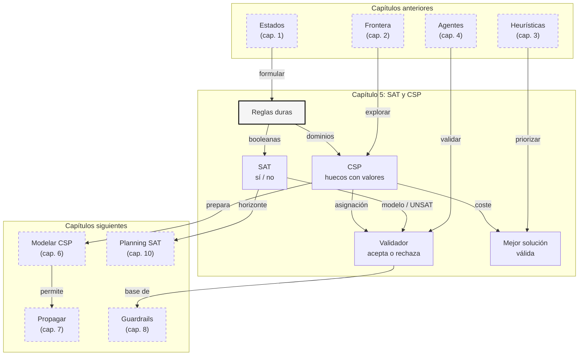

::: {.fasciculo-subtitle}
Facsímil 2 · Inteligencia clásica
:::

# Capítulo 05: SAT y CSP: la IA como restricciones

## Entrando en el tema

Imagina que tienes que organizar una semana de reuniones. Hay salas, franjas horarias, personas que no pueden coincidir, permisos, duraciones distintas y una regla sencilla: la agenda final no puede tener solapes. Un modelo generativo puede proponer una agenda bonita. Pero bonita no significa válida.

Aquí aparece una idea muy antigua y muy viva de la inteligencia artificial: no todo consiste en generar una respuesta; a veces consiste en encontrar una asignación que cumpla reglas exactas.^[Russell, S. y Norvig, P. (2021). *Artificial intelligence: a modern approach* (4.ª ed.). Pearson. Los capítulos sobre búsqueda y satisfacción de restricciones presentan los problemas como asignaciones sometidas a condiciones verificables.] Si una sala no puede estar en dos reuniones a la vez, esa regla no es una sugerencia. Es una restricción.

SAT y CSP son dos formas clásicas de expresar ese tipo de problema. SAT trabaja con variables booleanas: verdadero o falso. CSP trabaja con variables que pueden tomar valores de dominios más ricos: horas, salas, personas, rutas, configuraciones. En ambos casos, la pregunta central es la misma: ¿existe una solución que cumpla todas las reglas?

## No estamos buscando texto plausible

El malentendido habitual es pensar que SAT y CSP son algoritmos viejos para problemas académicos. En realidad, son una forma de disciplina. Te obligan a separar tres cosas que conviene no mezclar:

| Capa | Qué hace | Ejemplo |
|---|---|---|
| **Interpretar** | Entender una petición ambigua. | “Busca una agenda para el equipo esta semana”. |
| **Proponer** | Construir candidatos posibles. | Tres horarios alternativos. |
| **Verificar** | Aceptar solo lo que cumple reglas. | Sin solapes, sala disponible, permisos correctos. |

Un LLM puede ayudar en las dos primeras capas. Puede leer lenguaje natural, resumir preferencias y proponer candidatos. Pero la tercera capa debería ser verificable: un solver, un validador, un esquema JSON, una política de permisos, una regla de negocio o una combinación de todo eso.

La lección del capítulo es esta: cuando hay reglas duras, la aceptación no debe depender de si la respuesta suena convincente.

Antes de entrar en la notación, quédate con dos imágenes sencillas:

| Problema cotidiano | Cómo lo ve SAT o CSP | Pregunta que responde |
|---|---|---|
| Activar o no activar opciones de una campaña. | SAT lo ve como interruptores: email sí/no, banner sí/no, aprobación legal sí/no. | ¿Hay alguna combinación de interruptores compatible con todas las reglas? |
| Colocar reuniones en una agenda. | CSP lo ve como huecos que hay que rellenar: reunión 1 a las 9:00 o 10:00, reunión 2 a las 9:00 o 10:00. | ¿Qué valor pongo en cada hueco para que no haya conflictos? |
| Aceptar una acción de un agente. | Un validador lo ve como una puerta: pasa si cumple permisos, formato, coste y estado. | ¿Esta acción se puede ejecutar o debe rechazarse? |

La matemática que viene ahora formaliza esa idea. SAT habla de interruptores. CSP habla de huecos con valores posibles. Los validadores hablan de puertas que se abren o se cierran.

## SAT: verdadero, falso y contradicción

SAT, abreviatura de satisfacibilidad booleana, pregunta si existe una asignación de valores verdadero/falso que hace verdadera una fórmula lógica. Cook demostró en 1971 que SAT es NP-completo, convirtiéndolo en una piedra angular de la teoría de la complejidad.^[Cook, S. A. (1971). The complexity of theorem-proving procedures. En *Proceedings of the Third Annual ACM Symposium on Theory of Computing* (pp. 151-158). ACM. https://doi.org/10.1145/800157.805047] Hoy SAT sigue siendo práctico porque los solvers modernos explotan estructura, propagación y aprendizaje de cláusulas.^[Biere, A., Heule, M., van Maaren, H. y Walsh, T. (Eds.). (2009). *Handbook of satisfiability*. IOS Press.]

Piensa en una campaña muy simple. El equipo quiere publicar una oferta, pero hay reglas:

| Variable | Significado cotidiano | Valor posible |
|---|---|---|
| \(A\) | Enviar la oferta por email. | Sí o no. |
| \(B\) | Mostrar la oferta como banner en la app. | Sí o no. |
| \(C\) | Tener el texto aprobado por legal. | Sí o no. |

Las reglas son igual de simples:

1. La oferta debe salir por al menos un canal: email o banner.
2. Si sale por email, el texto debe estar aprobado.
3. Si sale por banner, el texto debe estar aprobado.

SAT convierte esas frases en lógica booleana. No está escribiendo la campaña. Solo comprueba si existe una combinación que respete las reglas.

La forma canónica se llama CNF: una conjunción de cláusulas. Cada cláusula es una disyunción de literales.

$$
\varphi = \bigwedge_{j=1}^{m} C_j,
\qquad
C_j = \bigvee_{\ell \in L_j} \ell,
\qquad
\ell \in \{x_i, \neg x_i\}
$$

| Símbolo | Significado | Ejemplo |
|---|---|---|
| \(\varphi\) | Fórmula booleana completa que queremos satisfacer. | \((A \lor B) \land (\neg A \lor C)\). |
| \(C_j\) | Cláusula número \(j\). Debe ser verdadera. | \(C_1 = (A \lor B)\). |
| \(m\) | Número total de cláusulas. | \(m = 3\). |
| \(L_j\) | Conjunto de literales dentro de la cláusula \(j\). | \(L_1 = \{A, B\}\). |
| \(\ell\) | Literal: variable afirmada o negada. | \(A\) o \(\neg A\). |
| \(x_i\) | Variable booleana. | \(A=\text{verdadero}\): se envía email. |

Una asignación es una función que da valor a cada variable:

$$
\alpha : X \rightarrow \{0,1\}
$$

| Símbolo | Significado | Ejemplo |
|---|---|---|
| \(\alpha\) | Asignación concreta de valores. | \(\alpha(A)=1, \alpha(B)=0, \alpha(C)=1\). |
| \(X\) | Conjunto de variables booleanas. | \(X=\{A,B,C\}\). |
| \(\{0,1\}\) | Dominio booleano: falso o verdadero. | \(0=\text{falso}, 1=\text{verdadero}\). |

La fórmula es satisfacible si existe al menos una asignación que hace verdaderas todas las cláusulas:

$$
\exists \alpha \; \forall j \in \{1,\dots,m\}: C_j(\alpha)=1
$$

| Símbolo | Significado | Ejemplo |
|---|---|---|
| \(\exists \alpha\) | Existe una asignación. | Probar \(A=1,B=0,C=1\). |
| \(\forall j\) | Para toda cláusula. | \(C_1, C_2, C_3\) deben cumplirse. |
| \(C_j(\alpha)\) | Valor de la cláusula \(j\) bajo la asignación \(\alpha\). | \(C_2(\alpha)=1\). |
| \(1\) | Verdadero. | La cláusula queda satisfecha. |

Veámoslo con la campaña anterior. Tomemos:

$$
\varphi = (A \lor B) \land (\neg A \lor C) \land (\neg B \lor C)
$$

La primera cláusula dice “usa email o banner”. La segunda dice “si usas email, legal debe estar aprobado”. La tercera dice “si usas banner, legal debe estar aprobado”.

Probamos la asignación \(\alpha(A)=1\), \(\alpha(B)=0\), \(\alpha(C)=1\):

| Cláusula | Sustitución | Resultado |
|---|---|---|
| \(A \lor B\) | \(1 \lor 0\) | \(1\) |
| \(\neg A \lor C\) | \(0 \lor 1\) | \(1\) |
| \(\neg B \lor C\) | \(1 \lor 1\) | \(1\) |

Leído en castellano: enviamos email, no mostramos banner y legal sí ha aprobado el texto. Todas las cláusulas valen \(1\). Por tanto, la fórmula es SAT y \(\alpha\) es un modelo. Si ninguna asignación de las \(2^3=8\) posibles funcionara, la fórmula sería UNSAT.

### Cómo se pasa de frase a cláusula

La parte que más se suele subestimar no es ejecutar un solver, sino **codificar bien el problema**. Un solver SAT no entiende “legal debe aprobar si hay campaña”. Entiende literales y cláusulas. El trabajo de ingeniería está en traducir sin perder significado.

| Frase de negocio | Lógica | CNF |
|---|---|---|
| “Debe haber email o banner.” | \(A \lor B\) | \(A \lor B\) |
| “Si hay email, legal aprueba.” | \(A \rightarrow C\) | \(\neg A \lor C\) |
| “Si hay banner, legal aprueba.” | \(B \rightarrow C\) | \(\neg B \lor C\) |
| “No pueden estar email y banner a la vez.” | \(\neg(A \land B)\) | \(\neg A \lor \neg B\) |

La equivalencia más útil es esta:

$$
p \rightarrow q \equiv \neg p \lor q
$$

| Símbolo | Lectura | Por qué importa |
|---|---|---|
| \(p \rightarrow q\) | Si \(p\), entonces \(q\). | Muchas reglas de negocio tienen esta forma. |
| \(\neg p \lor q\) | O no ocurre \(p\), o sí ocurre \(q\). | Es la forma que un solver SAT puede consumir en CNF. |

Otra familia de reglas aparece continuamente: **exactamente uno**. Por ejemplo, “elige exactamente un plan”. Se suele partir en dos piezas:

$$
\text{al menos uno: } x_1 \lor x_2 \lor \dots \lor x_n
$$

$$
\text{a lo sumo uno: } \bigwedge_{i<j}(\neg x_i \lor \neg x_j)
$$

Esto enseña una lección práctica: a veces una frase sencilla genera muchas cláusulas. Si tienes 100 opciones y codificas “a lo sumo una” por pares, salen \(100 \cdot 99 / 2 = 4950\) cláusulas. No es malo por sí mismo, pero conviene saber qué estás creando.

## CSP: variables, dominios y restricciones

Un CSP, problema de satisfacción de restricciones, generaliza la idea. Ya no trabajamos solo con verdadero/falso. Una variable puede ser una sala, una hora, una persona, una ruta, un plan o una configuración. Los primeros trabajos sobre redes de restricciones formalizaron esta forma de representar problemas combinatorios como relaciones entre variables.^[Montanari, U. (1974). Networks of constraints: Fundamental properties and applications to picture processing. *Information Sciences*, 7, 95-132. https://doi.org/10.1016/0020-0255(74)90008-5] Mackworth popularizó la consistencia de redes de relaciones como herramienta para reducir búsqueda antes de probar soluciones completas.^[Mackworth, A. K. (1977). Consistency in networks of relations. *Artificial Intelligence*, 8(1), 99-118. https://doi.org/10.1016/0004-3702(77)90007-8]

CSP es parecido, pero ya no todo cabe en interruptores. Piensa en una agenda: una reunión no es “verdadera” o “falsa”; hay que ponerla a una hora. Una sala no es “verdadera” o “falsa”; hay que elegir cuál. Por eso CSP habla de variables con dominios.

| Variable | Pregunta cotidiana | Dominio posible |
|---|---|---|
| \(R_1\) | ¿A qué hora va la reunión de producto? | 9:00 o 10:00. |
| \(R_2\) | ¿A qué hora va la reunión con cliente? | 9:00 o 10:00. |
| \(R_3\) | ¿A qué hora va la revisión técnica? | 9:00 o 10:00. |

Formalmente, un CSP se puede escribir así:

$$
\mathcal{P} = (X, D, C)
$$

| Símbolo | Significado | Ejemplo |
|---|---|---|
| \(\mathcal{P}\) | Problema completo de satisfacción de restricciones. | Agenda semanal del equipo. |
| \(X\) | Conjunto de variables que hay que asignar. | \(X=\{R_1,R_2,R_3\}\), tres reuniones. |
| \(D\) | Dominios permitidos para esas variables. | Cada reunión puede ir a las 9:00 o 10:00. |
| \(C\) | Conjunto de restricciones que deben cumplirse. | Sin solapes para la misma persona. |

Cada variable \(X_i\) tiene su dominio:

$$
X = \{X_1,\dots,X_n\},
\qquad
X_i \in D_i
$$

| Símbolo | Significado | Ejemplo |
|---|---|---|
| \(X_i\) | Variable individual. | \(R_1\): reunión de producto. |
| \(n\) | Número de variables. | \(n=3\). |
| \(D_i\) | Dominio de valores posibles para \(X_i\). | \(D_1=\{9,10\}\). |
| \(X_i \in D_i\) | La variable debe tomar un valor permitido. | \(R_1=9\). |

Una restricción es una relación sobre una o varias variables:

$$
C_k = (S_k, R_k)
$$

| Símbolo | Significado | Ejemplo |
|---|---|---|
| \(C_k\) | Restricción número \(k\). | “Ana no puede estar en dos reuniones a la vez”. |
| \(S_k\) | Alcance de la restricción: variables afectadas. | \(S_k=(R_1,R_2)\). |
| \(R_k\) | Relación permitida entre los valores de esas variables. | \(R_1 \neq R_2\). |

Una asignación \(a\) es solución si asigna un valor permitido a cada variable y todas las restricciones se cumplen:

$$
\forall X_i \in X:\; a(X_i) \in D_i
\qquad \text{y} \qquad
\forall C_k \in C:\; C_k(a)=\text{verdadero}
$$

| Símbolo | Significado | Ejemplo |
|---|---|---|
| \(a\) | Asignación de valores a variables. | \(a(R_1)=9, a(R_2)=10, a(R_3)=9\). |
| \(a(X_i)\) | Valor elegido para la variable \(X_i\). | \(a(R_2)=10\). |
| \(C_k(a)\) | Evaluación de la restricción bajo la asignación \(a\). | \(R_1 \neq R_2\) es verdadero. |
| \(\text{verdadero}\) | La restricción queda satisfecha. | No hay conflicto. |

Ejemplo mínimo:

| Variable | Dominio | Significado |
|---|---|---|
| \(R_1\) | \(\{9,10\}\) | Reunión de producto. |
| \(R_2\) | \(\{9,10\}\) | Reunión con cliente. |
| \(R_3\) | \(\{9,10\}\) | Revisión técnica. |

Restricciones:

1. \(R_1 \neq R_2\), porque Ana participa en ambas.
2. \(R_2 = 10\), porque el cliente solo puede a las 10:00.
3. \(R_3 \neq R_2\), porque comparten sala.

Sin restricciones hay \(2^3=8\) asignaciones. Con restricciones, una solución válida es:

$$
a(R_1)=9,\qquad a(R_2)=10,\qquad a(R_3)=9
$$

Comprueba:

| Restricción | Sustitución | Resultado |
|---|---|---|
| \(R_1 \neq R_2\) | \(9 \neq 10\) | Verdadero |
| \(R_2 = 10\) | \(10 = 10\) | Verdadero |
| \(R_3 \neq R_2\) | \(9 \neq 10\) | Verdadero |

Esta asignación no es “plausible”. Es válida. Esa diferencia es el corazón del capítulo.

### Modelar CSP como ingeniería, no como decoración matemática

Un CSP bien modelado empieza con decisiones de representación. Si eliges mal las variables, el problema explota. Si eliges dominios demasiado grandes, el solver prueba demasiado. Si escondes restricciones globales como muchas restricciones pequeñas sin necesidad, pierdes estructura.

| Decisión de modelado | Pregunta de ingeniería | Consecuencia |
|---|---|---|
| Variables | ¿Qué estoy asignando realmente? | Reunión-franja, persona-turno, tarea-máquina. |
| Dominio | ¿Qué valores son posibles antes de buscar? | Cuanto más limpio el dominio, menos combinatoria. |
| Restricciones duras | ¿Qué no puede violarse nunca? | Filtran candidatos inválidos. |
| Restricciones blandas | ¿Qué preferimos si se puede? | Definen coste entre soluciones válidas. |
| Granularidad | ¿Una variable enorme o varias pequeñas? | Afecta a propagación, explicación y depuración. |

En un sistema real conviene registrar también por qué falla una asignación. “No hay solución” puede ser correcto, pero no siempre es suficiente para operar. Si un horario no existe porque Ana, la sala 2 y el cliente tienen ventanas incompatibles, esa explicación permite corregir datos, relajar preferencias o pedir una decisión humana.

<svg xmlns="http://www.w3.org/2000/svg" viewBox="0 0 980 680" role="img" aria-label="SAT y CSP explicados con ejemplos cotidianos de campaña, agenda y validador">
<defs>
<marker id="arrow-sat-csp-map-v2" viewBox="0 0 10 10" refX="8" refY="5" markerWidth="7" markerHeight="7" orient="auto-start-reverse"><path d="M 0 0 L 10 5 L 0 10 z" fill="#111111"/></marker>
</defs>
<rect x="0" y="0" width="980" height="680" rx="10" fill="#FFFFFF" stroke="#111111" stroke-width="2"/>
<text x="490" y="38" text-anchor="middle" font-family="Arial, sans-serif" font-size="23" font-weight="700" fill="#111111">SAT y CSP: de una idea bonita a una solución válida</text>
<text x="490" y="63" text-anchor="middle" font-family="Arial, sans-serif" font-size="13" fill="#555555">El modelo puede proponer. Las reglas comprobables deciden si algo pasa o se rechaza.</text>
<rect x="48" y="96" width="252" height="118" rx="8" fill="#F5F5F5" stroke="#111111" stroke-width="1.4"/>
<text x="174" y="123" text-anchor="middle" font-family="Arial, sans-serif" font-size="16" font-weight="700" fill="#111111">Petición humana</text>
<text x="174" y="151" text-anchor="middle" font-family="Arial, sans-serif" font-size="12" fill="#555555">“Haz una campaña”</text>
<text x="174" y="171" text-anchor="middle" font-family="Arial, sans-serif" font-size="12" fill="#555555">“Organiza mi agenda”</text>
<text x="174" y="191" text-anchor="middle" font-family="Arial, sans-serif" font-size="12" fill="#555555">lenguaje ambiguo</text>
<rect x="364" y="96" width="252" height="118" rx="8" fill="#FFFFFF" stroke="#111111" stroke-width="1.4"/>
<text x="490" y="123" text-anchor="middle" font-family="Arial, sans-serif" font-size="16" font-weight="700" fill="#111111">Candidato</text>
<text x="490" y="151" text-anchor="middle" font-family="Arial, sans-serif" font-size="12" fill="#555555">texto, plan u horario</text>
<text x="490" y="171" text-anchor="middle" font-family="Arial, sans-serif" font-size="12" fill="#555555">puede sonar perfecto</text>
<text x="490" y="191" text-anchor="middle" font-family="Arial, sans-serif" font-size="12" fill="#555555">todavía no es válido</text>
<rect x="680" y="96" width="252" height="118" rx="8" fill="#F5F5F5" stroke="#111111" stroke-width="1.4"/>
<text x="806" y="123" text-anchor="middle" font-family="Arial, sans-serif" font-size="16" font-weight="700" fill="#111111">Filtro duro</text>
<text x="806" y="151" text-anchor="middle" font-family="Arial, sans-serif" font-size="12" fill="#555555">sin solapes</text>
<text x="806" y="171" text-anchor="middle" font-family="Arial, sans-serif" font-size="12" fill="#555555">con permisos</text>
<text x="806" y="191" text-anchor="middle" font-family="Arial, sans-serif" font-size="12" fill="#555555">con aprobación</text>
<path d="M300 155 H358" stroke="#111111" stroke-width="1.4" marker-end="url(#arrow-sat-csp-map-v2)"/>
<path d="M616 155 H674" stroke="#111111" stroke-width="1.4" marker-end="url(#arrow-sat-csp-map-v2)"/>
<rect x="50" y="256" width="420" height="292" rx="8" fill="#FFFFFF" stroke="#111111" stroke-width="1.8"/>
<text x="260" y="287" text-anchor="middle" font-family="Arial, sans-serif" font-size="20" font-weight="700" fill="#111111">SAT: interruptores sí/no</text>
<text x="260" y="311" text-anchor="middle" font-family="Arial, sans-serif" font-size="12" fill="#555555">Caso: publicar una oferta sin saltarse legal.</text>
<rect x="82" y="338" width="120" height="42" rx="5" fill="#F5F5F5" stroke="#333333"/>
<rect x="212" y="338" width="120" height="42" rx="5" fill="#FFFFFF" stroke="#333333"/>
<rect x="342" y="338" width="96" height="42" rx="5" fill="#F5F5F5" stroke="#333333"/>
<text x="142" y="356" text-anchor="middle" font-family="Arial, sans-serif" font-size="12" font-weight="700" fill="#111111">A: email</text>
<text x="142" y="373" text-anchor="middle" font-family="Arial, sans-serif" font-size="12" fill="#555555">sí</text>
<text x="272" y="356" text-anchor="middle" font-family="Arial, sans-serif" font-size="12" font-weight="700" fill="#111111">B: banner</text>
<text x="272" y="373" text-anchor="middle" font-family="Arial, sans-serif" font-size="12" fill="#555555">no</text>
<text x="390" y="356" text-anchor="middle" font-family="Arial, sans-serif" font-size="12" font-weight="700" fill="#111111">C: legal</text>
<text x="390" y="373" text-anchor="middle" font-family="Arial, sans-serif" font-size="12" fill="#555555">sí</text>
<line x1="82" y1="406" x2="438" y2="406" stroke="#D8D8D8"/>
<text x="86" y="431" font-family="Arial, sans-serif" font-size="12" fill="#111111">Regla 1: A o B</text>
<text x="258" y="431" font-family="Arial, sans-serif" font-size="12" fill="#555555">hay al menos un canal</text>
<text x="86" y="456" font-family="Arial, sans-serif" font-size="12" fill="#111111">Regla 2: si A, entonces C</text>
<text x="258" y="456" font-family="Arial, sans-serif" font-size="12" fill="#555555">email requiere legal</text>
<text x="86" y="481" font-family="Arial, sans-serif" font-size="12" fill="#111111">Regla 3: si B, entonces C</text>
<text x="258" y="481" font-family="Arial, sans-serif" font-size="12" fill="#555555">banner requiere legal</text>
<rect x="118" y="500" width="284" height="34" rx="5" fill="#F5F5F5" stroke="#111111" stroke-width="1.2"/>
<text x="260" y="522" text-anchor="middle" font-family="Arial, sans-serif" font-size="13" font-weight="700" fill="#111111">Resultado: SAT, combinación válida</text>
<rect x="510" y="256" width="420" height="292" rx="8" fill="#FFFFFF" stroke="#111111" stroke-width="1.8"/>
<text x="720" y="287" text-anchor="middle" font-family="Arial, sans-serif" font-size="20" font-weight="700" fill="#111111">CSP: rellenar huecos</text>
<text x="720" y="311" text-anchor="middle" font-family="Arial, sans-serif" font-size="12" fill="#555555">Caso: colocar tres reuniones en dos horas.</text>
<rect x="548" y="337" width="344" height="124" rx="5" fill="#F5F5F5" stroke="#333333"/>
<line x1="548" y1="369" x2="892" y2="369" stroke="#D8D8D8"/>
<line x1="548" y1="401" x2="892" y2="401" stroke="#D8D8D8"/>
<line x1="548" y1="433" x2="892" y2="433" stroke="#D8D8D8"/>
<line x1="662" y1="337" x2="662" y2="461" stroke="#D8D8D8"/>
<line x1="778" y1="337" x2="778" y2="461" stroke="#D8D8D8"/>
<text x="605" y="359" text-anchor="middle" font-family="Arial, sans-serif" font-size="12" font-weight="700" fill="#111111">Variable</text>
<text x="720" y="359" text-anchor="middle" font-family="Arial, sans-serif" font-size="12" font-weight="700" fill="#111111">Dominio</text>
<text x="835" y="359" text-anchor="middle" font-family="Arial, sans-serif" font-size="12" font-weight="700" fill="#111111">Valor</text>
<text x="605" y="391" text-anchor="middle" font-family="Arial, sans-serif" font-size="12" fill="#111111">R1 producto</text>
<text x="720" y="391" text-anchor="middle" font-family="Arial, sans-serif" font-size="12" fill="#555555">9 o 10</text>
<text x="835" y="391" text-anchor="middle" font-family="Arial, sans-serif" font-size="12" fill="#111111">9</text>
<text x="605" y="423" text-anchor="middle" font-family="Arial, sans-serif" font-size="12" fill="#111111">R2 cliente</text>
<text x="720" y="423" text-anchor="middle" font-family="Arial, sans-serif" font-size="12" fill="#555555">9 o 10</text>
<text x="835" y="423" text-anchor="middle" font-family="Arial, sans-serif" font-size="12" fill="#111111">10</text>
<text x="605" y="455" text-anchor="middle" font-family="Arial, sans-serif" font-size="12" fill="#111111">R3 técnica</text>
<text x="720" y="455" text-anchor="middle" font-family="Arial, sans-serif" font-size="12" fill="#555555">9 o 10</text>
<text x="835" y="455" text-anchor="middle" font-family="Arial, sans-serif" font-size="12" fill="#111111">9</text>
<text x="548" y="486" font-family="Arial, sans-serif" font-size="12" fill="#111111">Reglas: R1 != R2, R2 = 10, R3 != R2</text>
<text x="548" y="508" font-family="Arial, sans-serif" font-size="12" fill="#555555">No basta con que parezca una agenda: debe pasar cada regla.</text>
<rect x="578" y="520" width="284" height="34" rx="5" fill="#F5F5F5" stroke="#111111" stroke-width="1.2"/>
<text x="720" y="542" text-anchor="middle" font-family="Arial, sans-serif" font-size="13" font-weight="700" fill="#111111">Resultado: agenda consistente</text>
<rect x="145" y="590" width="690" height="48" rx="7" fill="#F5F5F5" stroke="#111111" stroke-width="1.2"/>
<text x="490" y="610" text-anchor="middle" font-family="Arial, sans-serif" font-size="13" font-weight="700" fill="#111111">La regla práctica</text>
<text x="490" y="630" text-anchor="middle" font-family="Arial, sans-serif" font-size="13" fill="#555555">Si incumple una restricción dura, se rechaza aunque esté muy bien escrito.</text>
<text x="940" y="658" text-anchor="end" font-family="Arial, sans-serif" font-size="10" fill="#9A9A9A">IA para gente curiosa / Facsímil 02 / Capítulo 05 / 686f6c61</text>
</svg>

## De validez a optimización

Hasta ahora solo hemos preguntado si existe una solución válida. Muchas veces queremos algo más: la mejor solución válida según un coste. Eso nos lleva a la optimización con restricciones, que se puede escribir así:

$$
a^* = \arg\min_{a \in \mathcal{A}} J(a)
\quad \text{sujeto a} \quad
\forall C_k \in C:\; C_k(a)=\text{verdadero}
$$

| Símbolo | Significado | Ejemplo |
|---|---|---|
| \(a^*\) | Mejor asignación válida encontrada. | Agenda con menos cambios respecto a la semana anterior. |
| \(\mathcal{A}\) | Conjunto de asignaciones candidatas. | Todas las agendas posibles. |
| \(J(a)\) | Función de coste o penalización. | Número de cambios de sala + preferencias incumplidas. |
| \(C_k\) | Restricción dura. | Nadie puede estar en dos reuniones a la vez. |
| \(C_k(a)=\text{verdadero}\) | La asignación cumple la regla \(k\). | El calendario no tiene solapes. |

La parte importante es el orden mental: primero validez, después preferencia. Si mezclas reglas duras y preferencias blandas, puedes convertir un problema resoluble en uno imposible.

Ejemplo:

| Agenda | Restricciones duras | Coste \(J(a)\) | Decisión |
|---|---|---:|---|
| \(a_1\) | Cumple todas | 5 | Válida, pero mejorable |
| \(a_2\) | Incumple un solape | 1 | Rechazada aunque sea barata |
| \(a_3\) | Cumple todas | 2 | Mejor válida |

La agenda \(a_2\) no gana porque su coste sea menor. Si viola una restricción dura, queda fuera. Entre las válidas, elegimos la de menor coste: \(a_3\).

## En el día a día

SAT y CSP aparecen cada vez que un sistema debe decir “esto se puede” o “esto no se puede” de forma verificable.

En configuración de producto, un cliente puede activar módulos, planes, complementos y permisos. Algunas combinaciones son incompatibles: si `plan_basic=true`, quizá `soporte_dedicado=false`. Eso se parece mucho a SAT.

En planificación de turnos, cada persona tiene disponibilidad, descansos mínimos, habilidades, límites legales y preferencias. Eso se parece mucho a CSP: variables con dominios y restricciones entre ellas. Dechter lo trata precisamente como procesamiento de restricciones: reducir dominios, propagar consecuencias y buscar solo donde todavía puede existir solución.^[Dechter, R. (2003). *Constraint processing*. Morgan Kaufmann.]

En sistemas con LLMs, la conexión es todavía más práctica. El modelo puede redactar un plan, pero el sistema debería validar permisos, formato, estados permitidos y acciones peligrosas antes de ejecutar. Ahí SAT y CSP se convierten en arquitectura: no son solo algoritmos, son una forma de separar creatividad y garantía.

## Por qué debería importarte

Porque los LLMs son buenos generando candidatos, pero no son garantías. Si pides “haz un horario sin conflictos”, puede devolver algo que parece correcto y contiene un solape escondido. Si pides “crea una configuración compatible”, puede inventar una combinación que viola una regla comercial.

SAT y CSP te enseñan a diseñar sistemas donde la respuesta final no se acepta por estilo, sino por verificación. Esta idea conecta directamente con *guardrails*, validadores, permisos, planificación, agentes y evaluación. Poole, Mackworth y Goebel presentan esta separación entre representación, inferencia y búsqueda como una de las bases de la IA computacional.^[Poole, D., Mackworth, A. y Goebel, R. (1998). *Computational intelligence: a logical approach*. Oxford University Press.]

## Dónde solía tropezar yo

| Error | Por qué es un error | Antídoto |
|---|---|---|
| **Tratar una preferencia como restricción dura** | “Ana prefiere mañana” no es lo mismo que “Ana solo puede mañana”. Si lo endureces todo, el problema puede volverse imposible. | Marca cada regla como dura o blanda antes de modelar. Lo duro filtra; lo blando puntúa. |
| **Pensar que SAT y CSP generan explicaciones** | Un solver puede decir SAT, UNSAT o devolver una asignación. La explicación pedagógica es otra capa. | Usa el solver para validez y una capa aparte para explicar por qué una solución cumple o falla. |
| **Validar después de actuar** | Si ejecutas una acción y luego descubres que violaba una restricción, ya has convertido un problema lógico en un incidente operativo. | Valida antes de hacer *commit*: antes de enviar, reservar, desplegar o cobrar. |
| **Modelar variables enormes** | Una variable gigante tiene un dominio inmenso y restricciones difíciles de expresar. | Divide el problema en decisiones pequeñas: persona-día, reunión-franja, permiso-acción. |

## Manos a la obra

La práctica real está en `labs/f2/c05-sat-csp-validator/`. El kit contiene dos problemas: una campaña codificada como SAT y una agenda codificada como CSP con restricciones duras y preferencias blandas. No usa librerías externas; enumera combinaciones para que se vea el mecanismo completo.

```bash
cd labs/f2/c05-sat-csp-validator
python3 ops/validate_constraints.py --write
cat output/constraint_decision.md
```

Como gate:

```bash
python3 ops/validate_constraints.py --write --fail-on-invalid
```

**Qué deberías ver.** La parte SAT devuelve modelos que satisfacen todas las cláusulas. La parte CSP enumera horarios válidos, rechaza candidatos inválidos con motivo concreto y elige la mejor agenda válida según preferencias blandas.

| Archivo | Papel |
|---|---|
| `data/constraint_case.json` | Fórmula SAT, CSP de agenda y candidatos a validar. |
| `contracts/constraint_policy.json` | Número esperado de modelos, reglas mínimas y coste máximo aceptable. |
| `ops/validate_constraints.py` | Enumerador, validador y explicador sin dependencias externas. |
| `output/constraint_report.json` | Resultado estructurado para tests o revisión automática. |
| `output/constraint_decision.md` | Informe legible para entregar. |

**Cómo lo adaptas a tu caso.** Cambia las variables SAT por flags reales de configuración y cambia el CSP por turnos, salas, rutas o permisos. Después añade un candidato inválido y comprueba que el validador explica qué regla falla.

**Qué entregaría un alumno.** El Markdown generado, una cláusula SAT nueva, una restricción CSP nueva, un candidato inválido con explicación y una decisión sobre qué reglas deberían ser duras y cuáles blandas.

## Cómo encaja todo

Este mapa marca el cambio de fase del facsímil: dejamos de pensar solo en caminos y empezamos a pensar en reglas que una solución debe satisfacer. La búsqueda sigue estando debajo, pero ahora el criterio principal no es “qué nodo miro primero”, sino “qué combinaciones quedan permitidas”.

La decisión aprendida aquí es convertir frases del mundo en restricciones verificables. Esa idea se reutiliza en CSP, guardrails, planificación y sistemas con permisos.



## Vocabulario aprendido

| Término | Definición |
|---|---|
| **SAT** | Problema de decidir si una fórmula booleana tiene alguna asignación que la haga verdadera. |
| **UNSAT** | Resultado que indica que ninguna asignación cumple todas las cláusulas. |
| **Modelo SAT** | Asignación concreta que satisface la fórmula. |
| **CSP** | Problema definido por variables, dominios y restricciones. |
| **Dominio** | Conjunto de valores permitidos para una variable. |
| **Restricción dura** | Regla que no se puede violar. Si se viola, la solución se rechaza. |
| **Restricción blanda** | Preferencia que puede incumplirse pagando un coste o penalización. |
| **Validador determinista** | Componente que decide validez aplicando reglas comprobables. |

## Antes de pasar página

- [ ] ¿Puedo explicar la diferencia entre SAT y CSP sin usar jerga?
- [ ] ¿Sé escribir una fórmula CNF pequeña y probar una asignación?
- [ ] ¿Puedo formular un CSP como \(\mathcal{P}=(X,D,C)\)?
- [ ] ¿Distingo una restricción dura de una preferencia blanda?
- [ ] ¿He ejecutado `labs/f2/c05-sat-csp-validator/` y puedo explicar por qué un candidato válido no tiene por qué ser el mejor?
- [ ] ¿Entiendo por qué un LLM puede proponer, pero no debería ser quien garantice la validez final?

## En resumen

| Idea fuerza | Detalle |
|---|---|
| SAT pregunta por verdad booleana. | Busca una asignación de verdadero/falso que satisfaga todas las cláusulas. |
| CSP amplía la idea a dominios ricos. | Variables, valores permitidos y restricciones describen horarios, permisos, recursos y configuraciones. |
| Validez y preferencia no son lo mismo. | Primero se descartan soluciones inválidas; después se optimiza entre las válidas. |
| La IA moderna necesita restricciones clásicas. | Un LLM puede generar candidatos, pero la aceptación debe pasar por reglas verificables. |

## Para saber más

Biere, A., Heule, M., van Maaren, H. y Walsh, T. (Eds.). (2009). *Handbook of satisfiability*. IOS Press.

Cook, S. A. (1971). The complexity of theorem-proving procedures. En *Proceedings of the Third Annual ACM Symposium on Theory of Computing* (pp. 151-158). ACM. https://doi.org/10.1145/800157.805047

Dechter, R. (2003). *Constraint processing*. Morgan Kaufmann.

Mackworth, A. K. (1977). Consistency in networks of relations. *Artificial Intelligence*, 8(1), 99-118. https://doi.org/10.1016/0004-3702(77)90007-8

Montanari, U. (1974). Networks of constraints: Fundamental properties and applications to picture processing. *Information Sciences*, 7, 95-132. https://doi.org/10.1016/0020-0255(74)90008-5

Poole, D., Mackworth, A. y Goebel, R. (1998). *Computational intelligence: a logical approach*. Oxford University Press.

Rossi, F., van Beek, P. y Walsh, T. (Eds.). (2006). *Handbook of constraint programming*. Elsevier.

Russell, S. y Norvig, P. (2021). *Artificial intelligence: a modern approach* (4.ª ed.). Pearson.
