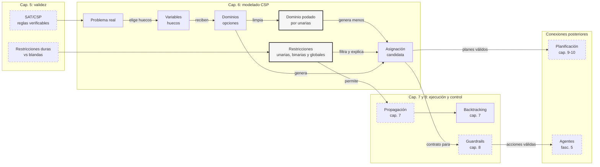

::: {.fasciculo-subtitle}
Facsímil 2 · Inteligencia clásica
:::

# Capítulo 06: CSP: variables, dominios y restricciones

## Entrando en el tema

En el capítulo anterior vimos la idea general: un CSP busca una asignación válida. Ahora toca la parte que parece pequeña y lo cambia todo: cómo eliges las variables, qué valores permites en cada dominio y qué reglas escribes como restricciones.

Parece una decisión de nomenclatura, pero no lo es. Si modelas mal, el solver se ahoga. Si modelas bien, el problema se vuelve transparente. Es la diferencia entre decir “organiza todos los turnos de la semana” y decir “para cada persona y cada día, elige mañana, tarde, noche o libre”.

Un CSP bien modelado no empieza con un algoritmo. Empieza con una pregunta humilde: ¿cuáles son exactamente los huecos que tengo que rellenar?

## El problema no es el solver, es el modelado

Piensa en una hoja de cálculo. Cada celda vacía es una decisión pendiente. Algunas celdas solo aceptan ciertos valores. Algunas combinaciones entre celdas están prohibidas. Si rellenas todo sin romper ninguna regla, tienes una solución.

| Pieza del CSP | Imagen cotidiana | Ejemplo |
|---|---|---|
| **Variable** | Hueco que hay que rellenar. | Hora de la reunión de producto. |
| **Dominio** | Valores permitidos para ese hueco. | 9:00, 10:00 o 11:00. |
| **Restricción** | Regla que descarta combinaciones. | Ana no puede estar en dos reuniones a la vez. |
| **Asignación parcial** | Hoja a medio rellenar. | Producto a las 9:00; cliente todavía sin hora. |
| **Solución** | Hoja completa sin reglas rotas. | Todas las reuniones colocadas sin solapes. |

Esta forma de pensar viene de la programación con restricciones: representar un problema como variables, dominios y relaciones permitidas, y después buscar o propagar hasta encontrar consistencia.^[Rossi, F., van Beek, P. y Walsh, T. (Eds.). (2006). *Handbook of constraint programming*. Elsevier. El manual organiza el campo precisamente alrededor de modelado, propagación, búsqueda y optimización.] La parte difícil rara vez es escribir `for value in domain`. La parte difícil es decidir qué cuenta como variable.

## Variables: qué huecos vamos a rellenar

Una variable CSP representa una decisión pendiente. No tiene por qué ser “una cosa del mundo”; puede ser una combinación que nos conviene para modelar. En horarios, una variable puede ser `reunión`, `persona-día`, `aula-hora`, `paquete-versión` o `tarea-máquina`.

Formalmente:

$$
X = \{X_1, X_2, \dots, X_n\}
$$

| Símbolo | Significado | Ejemplo |
|---|---|---|
| \(X\) | Conjunto de todas las variables del problema. | Tres cursos que hay que colocar en horario. |
| \(X_i\) | Variable individual número \(i\). | \(X_1=\text{Curso IA}\). |
| \(n\) | Número total de variables. | \(n=3\). |

Ejemplo concreto:

| Variable | Qué decisión representa | Comentario |
|---|---|---|
| \(X_1\) | Dónde y cuándo colocar “Curso IA”. | Lo imparte Ana. |
| \(X_2\) | Dónde y cuándo colocar “Curso Python”. | También lo imparte Ana. |
| \(X_3\) | Dónde y cuándo colocar “Curso Datos”. | Necesita sala B. |

Aquí hemos elegido una variable por curso. Podríamos haber elegido una variable por franja horaria y sala, pero entonces el valor sería “qué curso pongo aquí”. Las dos opciones pueden ser correctas. La buena es la que permite expresar reglas con menos esfuerzo y menos confusión.

## Dominios: qué valores puede tomar cada variable

El dominio de una variable es el conjunto de valores que puede tomar. Si la variable es un curso, su dominio puede ser el conjunto de pares `(hora, sala)`.

$$
D_i = \{v_{i1}, v_{i2}, \dots, v_{ik_i}\}
\qquad
X_i \in D_i
$$

| Símbolo | Significado | Ejemplo |
|---|---|---|
| \(D_i\) | Dominio de la variable \(X_i\). | Posibles combinaciones de hora y sala. |
| \(v_{ij}\) | Valor \(j\) permitido para \(X_i\). | \((9,\text{A})\). |
| \(k_i\) | Tamaño del dominio de \(X_i\). | Si hay 2 horas y 2 salas, \(k_i=4\). |
| \(X_i \in D_i\) | La variable debe recibir un valor de su dominio. | “Curso IA” puede ir a \((9,\text{A})\). |

Para nuestro ejemplo:

$$
D_1 = D_2 = D_3 = \{(9,A), (9,B), (10,A), (10,B)\}
$$

Cada curso puede colocarse a las 9:00 o a las 10:00, en sala A o B. Sin restricciones, el número de asignaciones posibles es:

$$
|\mathcal{A}| = \prod_{i=1}^{n} |D_i|
$$

| Símbolo | Significado | Ejemplo |
|---|---|---|
| \(\mathcal{A}\) | Conjunto de asignaciones completas candidatas. | Todos los horarios posibles antes de filtrar. |
| \(|\mathcal{A}|\) | Número de asignaciones candidatas. | \(4 \times 4 \times 4 = 64\). |
| \(|D_i|\) | Tamaño del dominio de la variable \(i\). | Cada curso tiene 4 opciones. |
| \(\prod\) | Producto de los tamaños de dominio. | Multiplicar \(4\cdot4\cdot4\). |

Con tres cursos y cuatro opciones por curso:

$$
|\mathcal{A}| = 4^3 = 64
$$

Sesenta y cuatro horarios candidatos no parecen muchos. Pero si tienes 30 eventos y cada uno tiene 20 opciones, el espacio sería \(20^{30}\). Ahí ya no estás rellenando una hoja: estás mirando un océano.

### Auditar dominios antes de resolver

Un buen modelo CSP no espera al solver para eliminar lo obvio. Si una restricción unaria dice que Python solo puede ir a las 10:00, no tiene sentido conservar valores de Python a las 9:00 en el dominio inicial. Eso no es “hacer trampa”: es escribir mejor el problema.

Podemos comparar dos tamaños:

$$
|\mathcal{A}_{bruta}| = \prod_i |D_i|
$$

$$
|\mathcal{A}_{podada}| = \prod_i |D'_i|
$$

| Símbolo | Significado | Ejemplo |
|---|---|---|
| \(D_i\) | Dominio original. | Python: \((9,A),(9,B),(10,A),(10,B)\). |
| \(D'_i\) | Dominio podado por reglas unarias. | Python: \((10,A),(10,B)\). |
| \(|\mathcal{A}_{bruta}|\) | Candidatos antes de podar. | \(4^3=64\). |
| \(|\mathcal{A}_{podada}|\) | Candidatos tras podar dominios. | \(4 \cdot 2 \cdot 2 = 16\). |

La diferencia entre 64 y 16 en un ejemplo pequeño no impresiona demasiado. La diferencia entre \(20^{30}\) y algo dos órdenes de magnitud menor sí puede decidir si tu sistema responde hoy o nunca.

## Restricciones: qué combinaciones quedan prohibidas

Una restricción dice qué combinaciones de valores son aceptables. Puede afectar a una variable, a dos o a muchas. Montanari formalizó estas redes de restricciones como relaciones entre variables, una idea que después se volvió central en CSP.^[Montanari, U. (1974). Networks of constraints: Fundamental properties and applications to picture processing. *Information Sciences*, 7, 95-132. https://doi.org/10.1016/0020-0255(74)90008-5]

Formalmente:

$$
C_k = (S_k, R_k)
$$

| Símbolo | Significado | Ejemplo |
|---|---|---|
| \(C_k\) | Restricción número \(k\). | “Ana no puede impartir dos cursos a la misma hora”. |
| \(S_k\) | Alcance: variables afectadas por la restricción. | \(S_k=(X_1, X_2)\). |
| \(R_k\) | Relación permitida entre valores. | Hora de \(X_1\) distinta de hora de \(X_2\). |

En nuestro horario:

| Tipo | Regla | Cómo se lee |
|---|---|---|
| **Unaria** | \(hora(X_2)=10\) | Python solo puede ir a las 10:00. |
| **Unaria** | \(sala(X_3)=B\) | Datos necesita sala B. |
| **Binaria** | \(hora(X_1)\neq hora(X_2)\) | Ana imparte IA y Python; no puede duplicarse. |
| **Global** | `all_different((hora, sala))` | Dos cursos no pueden ocupar la misma sala a la misma hora. |

Una asignación \(a\) es válida cuando todas las restricciones son verdaderas:

$$
\operatorname{valida}(a) =
\bigwedge_{C_k \in C} C_k(a)
$$

| Símbolo | Significado | Ejemplo |
|---|---|---|
| \(a\) | Asignación completa de valores. | IA \((9,A)\), Python \((10,A)\), Datos \((9,B)\). |
| \(\operatorname{valida}(a)\) | Indica si la asignación cumple todas las reglas. | Verdadero si no hay solapes ni salas incorrectas. |
| \(\bigwedge\) | “Y” lógico: todo debe cumplirse. | Si una regla falla, toda la asignación falla. |
| \(C_k(a)\) | Resultado de evaluar la restricción \(k\) sobre \(a\). | \(hora(X_1)\neq hora(X_2)\). |

Probemos esta asignación:

$$
a(X_1)=(9,A),\qquad a(X_2)=(10,A),\qquad a(X_3)=(9,B)
$$

| Restricción | Sustitución | Resultado |
|---|---|---|
| \(hora(X_2)=10\) | \(10=10\) | Verdadero |
| \(sala(X_3)=B\) | \(B=B\) | Verdadero |
| \(hora(X_1)\neq hora(X_2)\) | \(9\neq10\) | Verdadero |
| No compartir sala y hora | \((9,A),(10,A),(9,B)\) son distintos | Verdadero |

La asignación es válida. No porque “parezca buena”, sino porque supera cada regla.

<svg xmlns="http://www.w3.org/2000/svg" viewBox="0 0 980 700" role="img" aria-label="Anatomía de un CSP como mesa de modelado de horarios con huecos, opciones, reglas y solución">
<defs>
<marker id="arrow-csp-studio" viewBox="0 0 10 10" refX="8" refY="5" markerWidth="7" markerHeight="7" orient="auto-start-reverse"><path d="M 0 0 L 10 5 L 0 10 z" fill="#111111"/></marker>
</defs>
<rect x="0" y="0" width="980" height="700" rx="10" fill="#FFFFFF" stroke="#111111" stroke-width="2"/>
<text x="490" y="38" text-anchor="middle" font-family="Arial, sans-serif" font-size="23" font-weight="700" fill="#111111">Anatomía de un CSP: una mesa de modelado</text>
<text x="490" y="63" text-anchor="middle" font-family="Arial, sans-serif" font-size="13" fill="#555555">Convertimos una petición cotidiana en huecos, opciones, reglas y una solución verificable.</text>
<rect x="48" y="95" width="884" height="72" rx="8" fill="#F5F5F5" stroke="#111111" stroke-width="1.4"/>
<text x="72" y="124" font-family="Arial, sans-serif" font-size="13" font-weight="700" fill="#111111">Petición original</text>
<text x="72" y="146" font-family="Arial, sans-serif" font-size="13" fill="#555555">“Coloca tres cursos en dos horas y dos salas, sin solapes y respetando condiciones especiales.”</text>
<path d="M490 167 V196" stroke="#111111" stroke-width="1.4" marker-end="url(#arrow-csp-studio)"/>
<rect x="52" y="210" width="276" height="182" rx="8" fill="#FFFFFF" stroke="#111111" stroke-width="1.6"/>
<text x="190" y="238" text-anchor="middle" font-family="Arial, sans-serif" font-size="18" font-weight="700" fill="#111111">Huecos</text>
<text x="190" y="260" text-anchor="middle" font-family="Arial, sans-serif" font-size="12" fill="#555555">las variables que vamos a rellenar</text>
<line x1="80" y1="284" x2="300" y2="284" stroke="#D8D8D8"/>
<text x="88" y="312" font-family="Arial, sans-serif" font-size="13" fill="#111111">X1 · Curso IA</text>
<text x="88" y="340" font-family="Arial, sans-serif" font-size="13" fill="#111111">X2 · Curso Python</text>
<text x="88" y="368" font-family="Arial, sans-serif" font-size="13" fill="#111111">X3 · Curso Datos</text>
<rect x="352" y="210" width="276" height="182" rx="8" fill="#F5F5F5" stroke="#111111" stroke-width="1.6"/>
<text x="490" y="238" text-anchor="middle" font-family="Arial, sans-serif" font-size="18" font-weight="700" fill="#111111">Opciones</text>
<text x="490" y="260" text-anchor="middle" font-family="Arial, sans-serif" font-size="12" fill="#555555">el dominio de cada variable</text>
<rect x="384" y="292" width="84" height="36" rx="5" fill="#FFFFFF" stroke="#333333"/>
<rect x="512" y="292" width="84" height="36" rx="5" fill="#FFFFFF" stroke="#333333"/>
<rect x="384" y="340" width="84" height="36" rx="5" fill="#FFFFFF" stroke="#333333"/>
<rect x="512" y="340" width="84" height="36" rx="5" fill="#FFFFFF" stroke="#333333"/>
<text x="426" y="315" text-anchor="middle" font-family="Arial, sans-serif" font-size="13" fill="#111111">9 · A</text>
<text x="554" y="315" text-anchor="middle" font-family="Arial, sans-serif" font-size="13" fill="#111111">9 · B</text>
<text x="426" y="363" text-anchor="middle" font-family="Arial, sans-serif" font-size="13" fill="#111111">10 · A</text>
<text x="554" y="363" text-anchor="middle" font-family="Arial, sans-serif" font-size="13" fill="#111111">10 · B</text>
<rect x="652" y="210" width="276" height="182" rx="8" fill="#FFFFFF" stroke="#111111" stroke-width="1.6"/>
<text x="790" y="238" text-anchor="middle" font-family="Arial, sans-serif" font-size="18" font-weight="700" fill="#111111">Reglas</text>
<text x="790" y="260" text-anchor="middle" font-family="Arial, sans-serif" font-size="12" fill="#555555">restricciones que filtran</text>
<line x1="682" y1="284" x2="898" y2="284" stroke="#D8D8D8"/>
<text x="684" y="310" font-family="Arial, sans-serif" font-size="12" fill="#111111">Python solo a las 10</text>
<text x="684" y="336" font-family="Arial, sans-serif" font-size="12" fill="#111111">Datos necesita sala B</text>
<text x="684" y="362" font-family="Arial, sans-serif" font-size="12" fill="#111111">Ana no puede duplicarse</text>
<text x="684" y="386" font-family="Arial, sans-serif" font-size="12" fill="#111111">Nadie comparte sala-hora</text>
<path d="M328 301 H347" stroke="#111111" stroke-width="1.3" marker-end="url(#arrow-csp-studio)"/>
<path d="M628 301 H647" stroke="#111111" stroke-width="1.3" marker-end="url(#arrow-csp-studio)"/>
<rect x="74" y="448" width="832" height="142" rx="8" fill="#FFFFFF" stroke="#111111" stroke-width="1.8"/>
<text x="490" y="477" text-anchor="middle" font-family="Arial, sans-serif" font-size="18" font-weight="700" fill="#111111">Una candidata se coloca en la mesa y se verifica</text>
<rect x="118" y="510" width="166" height="48" rx="5" fill="#F5F5F5" stroke="#333333"/>
<rect x="312" y="510" width="166" height="48" rx="5" fill="#F5F5F5" stroke="#333333"/>
<rect x="506" y="510" width="166" height="48" rx="5" fill="#F5F5F5" stroke="#333333"/>
<rect x="700" y="510" width="166" height="48" rx="5" fill="#F5F5F5" stroke="#333333"/>
<text x="201" y="530" text-anchor="middle" font-family="Arial, sans-serif" font-size="12" font-weight="700" fill="#111111">IA</text>
<text x="201" y="548" text-anchor="middle" font-family="Arial, sans-serif" font-size="12" fill="#111111">9 · A</text>
<text x="395" y="530" text-anchor="middle" font-family="Arial, sans-serif" font-size="12" font-weight="700" fill="#111111">Python</text>
<text x="395" y="548" text-anchor="middle" font-family="Arial, sans-serif" font-size="12" fill="#111111">10 · A</text>
<text x="589" y="530" text-anchor="middle" font-family="Arial, sans-serif" font-size="12" font-weight="700" fill="#111111">Datos</text>
<text x="589" y="548" text-anchor="middle" font-family="Arial, sans-serif" font-size="12" fill="#111111">9 · B</text>
<text x="783" y="530" text-anchor="middle" font-family="Arial, sans-serif" font-size="12" font-weight="700" fill="#111111">Veredicto</text>
<text x="783" y="548" text-anchor="middle" font-family="Arial, sans-serif" font-size="12" fill="#111111">válida</text>
<path d="M284 534 H306" stroke="#555555" stroke-width="1.1" stroke-dasharray="5 5" marker-end="url(#arrow-csp-studio)"/>
<path d="M478 534 H500" stroke="#555555" stroke-width="1.1" stroke-dasharray="5 5" marker-end="url(#arrow-csp-studio)"/>
<path d="M672 534 H694" stroke="#555555" stroke-width="1.1" stroke-dasharray="5 5" marker-end="url(#arrow-csp-studio)"/>
<rect x="220" y="622" width="540" height="42" rx="7" fill="#F5F5F5" stroke="#111111" stroke-width="1.2"/>
<text x="490" y="648" text-anchor="middle" font-family="Arial, sans-serif" font-size="13" font-weight="700" fill="#111111">La solución no se cree: pasa por todas las reglas</text>
<text x="940" y="682" text-anchor="end" font-family="Arial, sans-serif" font-size="10" fill="#9A9A9A">IA para gente curiosa / Facsímil 02 / Capítulo 06 / 686f6c61</text>
</svg>

## Restricciones unarias, binarias y globales

Conviene poner nombre a los tipos de restricción porque cada uno cambia cómo se resuelve el problema.

| Tipo | Afecta a | Ejemplo entendible | Papel práctico |
|---|---|---|---|
| **Unaria** | Una variable. | Python solo puede ir a las 10:00. | Reduce un dominio individual. |
| **Binaria** | Dos variables. | IA y Python no pueden tener la misma hora. | Conecta dos decisiones. |
| **Global** | Muchas variables. | Ningún curso comparte sala y hora. | Expresa reglas de conjunto sin escribir miles de pares. |
| **Blanda** | Una o muchas variables, con penalización. | Preferimos sala A, pero sala B vale. | Optimiza sin convertir preferencias en imposibles. |

Mackworth mostró que muchas restricciones binarias pueden verse como arcos entre variables y que limpiar inconsistencias locales reduce muchísimo la búsqueda posterior.^[Mackworth, A. K. (1977). Consistency in networks of relations. *Artificial Intelligence*, 8(1), 99-118. https://doi.org/10.1016/0004-3702(77)90007-8] Esta idea nos llevará al capítulo 7: propagación y *backtracking*.

La **aridad** de una restricción es cuántas variables toca. Una unaria tiene aridad 1; una binaria, aridad 2; una global puede tener aridad \(n\). Esto importa porque afecta a cómo depuras el problema. Una restricción unaria suele explicar fallos muy localmente: “Python no puede ir a las 9”. Una global puede explicar fallos de conjunto: “dos cursos comparten sala-hora”. En sistemas reales conviene que cada restricción tenga identificador, descripción humana y datos suficientes para explicar por qué rechazó una asignación.

## En el día a día

En producto, los dominios aparecen como opciones de configuración. Un plan puede aceptar o no ciertos módulos, regiones, monedas, permisos o límites. Cada elección abre y cierra posibilidades.

En operaciones, los dominios aparecen como calendarios, turnos, recursos y máquinas disponibles. Si el dominio incluye valores que nunca deberían usarse, el solver perderá tiempo y quizás proponga soluciones absurdas.

En agentes con LLMs, las variables pueden ser más abstractas: qué herramienta usar, qué permisos pedir, qué paso ejecutar después, qué formato devolver. Nilsson ya presentaba búsqueda, planificación y agentes como problemas de decisión secuencial; los CSP añaden una capa útil cuando esas decisiones deben respetar restricciones explícitas.^[Nilsson, N. J. (1998). *Artificial intelligence: a new synthesis*. Morgan Kaufmann.]

## Por qué debería importarte

Porque modelar un CSP es diseñar el contrato entre el mundo y el solver. Si haces variables demasiado grandes, el dominio explota. Si haces variables demasiado pequeñas, las restricciones se vuelven difíciles de leer. Si confundes reglas duras con preferencias, el sistema rechaza soluciones útiles o acepta soluciones peligrosas.

Russell y Norvig insisten en que la representación importa tanto como el algoritmo: un buen espacio de estados o una buena formulación de restricciones puede hacer que una búsqueda difícil se vuelva manejable.^[Russell, S. y Norvig, P. (2021). *Artificial intelligence: a modern approach* (4.ª ed.). Pearson.] En IA aplicada, esa frase se traduce así: antes de pedirle inteligencia al solver, dale un problema bien escrito.

## Dónde solía tropezar yo

| Error | Por qué es un error | Antídoto |
|---|---|---|
| **Elegir variables demasiado grandes** | Una variable “horario completo de la semana” tiene un dominio gigantesco y opaco. | Divide en decisiones pequeñas: curso, reunión, persona-día, tarea-máquina. |
| **Meter valores imposibles en el dominio** | Si Ana nunca trabaja de noche, no pongas “noche” en su dominio para filtrarlo después. | Limpia dominios antes de escribir restricciones complejas. |
| **Escribir restricciones repetidas a mano** | Cien reglas binarias pueden ocultar una regla global sencilla. | Busca patrones: “todos distintos”, “exactamente dos”, “al menos uno”, “capacidad máxima”. |
| **Confundir ausencia de solución con fallo del solver** | A veces el problema está realmente sobre-restringido. | Prueba con menos restricciones y añade reglas una a una para localizar la contradicción. |

## Manos a la obra

La práctica real está en `labs/f2/c06-csp-model-audit/`. El kit toma el horario de este capítulo, lo guarda como modelo JSON y produce una auditoría: tamaño bruto del espacio, dominios podados por restricciones unarias, soluciones válidas, coste de preferencias y explicación de candidatos rechazados.

```bash
cd labs/f2/c06-csp-model-audit
python3 ops/audit_csp_model.py --write
cat output/csp_model_decision.md
```

Como gate:

```bash
python3 ops/audit_csp_model.py --write --fail-on-invalid
```

**Qué deberías ver.** El espacio bruto tiene \(4^3=64\) candidatos. Tras aplicar restricciones unarias al dominio, baja a 16. Después las restricciones binarias y globales dejan cuatro soluciones válidas. Esta es la lectura importante: modelar bien reduce búsqueda antes de buscar.

| Archivo | Papel |
|---|---|
| `data/course_schedule_model.json` | Variables, dominios, restricciones, preferencias y candidatos. |
| `contracts/csp_model_policy.json` | Condiciones esperadas para validar la auditoría. |
| `ops/audit_csp_model.py` | Auditor de dominios, restricciones y soluciones sin dependencias externas. |
| `output/csp_model_report.json` | Resultado estructurado del modelo. |
| `output/csp_model_decision.md` | Informe legible para entregar. |

**Cómo lo adaptas a tu caso.** Añade un curso, una sala o una restricción global nueva. Mira cómo cambia \(|\mathcal{A}_{bruta}|\), \(|\mathcal{A}_{podada}|\) y el número de soluciones. Si al añadir una regla te quedas sin soluciones, el informe te dirá qué restricciones están rechazando candidatos.

**Qué entregaría un alumno.** El Markdown generado, una variable nueva, una restricción nueva con identificador y explicación, y una comparación de tamaño antes y después de podar dominios.

## Cómo encaja todo

Este mapa se lee como una cadena de modelado. El capítulo 5 nos dio la idea general de restricción; este capítulo baja al contrato operativo de un CSP: qué variables existen, qué valores pueden tomar y qué reglas eliminan combinaciones.

La decisión importante no es elegir solver todavía. Es escribir un modelo que se pueda auditar, podar y explicar antes de buscar soluciones.



## Vocabulario aprendido

| Término | Definición |
|---|---|
| **Variable CSP** | Decisión pendiente que hay que rellenar con un valor. |
| **Dominio** | Conjunto de valores permitidos para una variable. |
| **Restricción unaria** | Regla que afecta a una sola variable. |
| **Restricción binaria** | Regla que relaciona dos variables. |
| **Restricción global** | Regla que afecta a muchas variables a la vez. |
| **Asignación parcial** | Estado donde algunas variables ya tienen valor y otras no. |
| **Asignación completa** | Estado donde todas las variables tienen valor. |
| **Solución** | Asignación completa que cumple todas las restricciones duras. |
| **Aridad** | Número de variables que toca una restricción. |
| **Dominio podado** | Dominio reducido antes de buscar, normalmente por restricciones unarias. |

## Antes de pasar página

- [ ] ¿Puedo explicar qué es una variable CSP usando el ejemplo de una agenda?
- [ ] ¿Sé calcular el número de candidatos con \(|\mathcal{A}|=\prod_i |D_i|\)?
- [ ] ¿Distingo una restricción unaria de una binaria y una global?
- [ ] ¿Entiendo por qué elegir variables demasiado grandes puede hacer explotar el problema?
- [ ] ¿He ejecutado `labs/f2/c06-csp-model-audit/` y puedo explicar la diferencia entre espacio bruto y dominio podado?

## En resumen

| Idea fuerza | Detalle |
|---|---|
| Modelar es elegir huecos. | Las variables son las decisiones que el solver debe rellenar. |
| El dominio controla el tamaño del problema. | Tres variables con cuatro opciones generan \(4^3=64\) candidatos; con muchas variables, el crecimiento explota. |
| Podar dominios también es ingeniería. | Las restricciones unarias pueden eliminar valores antes de que empiece la búsqueda. |
| Las restricciones convierten candidatos en soluciones. | Una asignación solo vale si pasa todas las reglas duras. |
| La calidad del CSP depende del modelado. | Un solver bueno no compensa variables mal elegidas ni dominios llenos de valores imposibles. |

## Para saber más

Dechter, R. (2003). *Constraint processing*. Morgan Kaufmann.

Mackworth, A. K. (1977). Consistency in networks of relations. *Artificial Intelligence*, 8(1), 99-118. https://doi.org/10.1016/0004-3702(77)90007-8

Montanari, U. (1974). Networks of constraints: Fundamental properties and applications to picture processing. *Information Sciences*, 7, 95-132. https://doi.org/10.1016/0020-0255(74)90008-5

Nilsson, N. J. (1998). *Artificial intelligence: A new synthesis*. Morgan Kaufmann.

Poole, D., Mackworth, A. y Goebel, R. (1998). *Computational intelligence: a logical approach*. Oxford University Press.

Rossi, F., van Beek, P. y Walsh, T. (Eds.). (2006). *Handbook of constraint programming*. Elsevier.

Russell, S. y Norvig, P. (2021). *Artificial intelligence: a modern approach* (4.ª ed.). Pearson.
