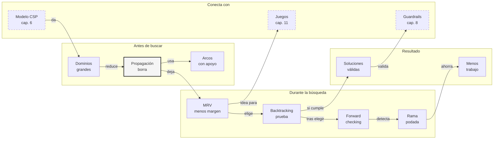

::: {.fasciculo-subtitle}
Facsímil 2 · Inteligencia clásica
:::

# Capítulo 07: Propagación, backtracking y heurísticas en CSP

## Entrando en el tema

En el capítulo anterior construimos un CSP pequeño: tres cursos, dos horas, dos salas y varias reglas. Sin restricciones había \(4^3=64\) horarios candidatos. Con reglas, solo quedaban cuatro soluciones válidas.

La pregunta ahora es: ¿tenemos que probar los 64 horarios para descubrirlo? No. Esa es la belleza de los CSP. Antes de buscar, podemos **podar**. Podemos mirar las reglas y eliminar valores imposibles. Después, cuando toque probar, podemos hacerlo con cabeza: elegir primero la variable más estrecha, detectar contradicciones temprano y volver atrás sin dramatismo.

Este capítulo explica tres ideas que convierten un CSP ingenuo en un método práctico: propagación, *backtracking* y heurísticas.

## No queremos probarlo todo

Imagina que estás rellenando un sudoku. No pruebas números al azar hasta completar la cuadrícula. Primero miras filas, columnas y bloques. Si en una casilla solo puede ir un 7, lo escribes. Si al poner un 7 otra casilla pierde esa opción, actualizas. Solo cuando ya no puedes deducir más, pruebas.

Eso es exactamente lo que hacen los CSP bien resueltos: deducir antes de explorar. Dechter lo resume como procesamiento de restricciones: reducir dominios, detectar inconsistencias y combinar inferencia local con búsqueda.^[Dechter, R. (2003). *Constraint processing*. Morgan Kaufmann. La obra presenta la propagación y la búsqueda como dos piezas complementarias: una reduce el espacio y la otra explora lo que queda.]

| Estrategia | Qué hace | Imagen cotidiana |
|---|---|---|
| **Propagación** | Elimina valores imposibles antes de probar. | “Python solo puede ir a las 10:00; borra las 9:00”. |
| **Backtracking** | Prueba una opción y vuelve atrás si contradice algo. | “Si esta sala causa conflicto, deshaz y prueba otra”. |
| **Heurísticas** | Decide qué variable y qué valor probar primero. | “Empieza por quien tiene menos disponibilidad”. |

La clave es no confundir inteligencia con fuerza bruta. A veces el algoritmo parece listo porque en realidad evita mirar tonterías.

## Propagación: borrar antes de buscar

Propagar significa usar restricciones para reducir dominios. Si una regla dice que Python solo puede ir a las 10:00, no tiene sentido conservar valores a las 9:00 en el dominio de Python.

Podemos escribirlo así:

$$
D_i' = \{v \in D_i \mid C_k(X_i=v)=\text{verdadero}\}
$$

| Símbolo | Significado | Ejemplo |
|---|---|---|
| \(D_i\) | Dominio original de la variable \(X_i\). | Python: \(\{(9,A),(9,B),(10,A),(10,B)\}\). |
| \(D_i'\) | Dominio reducido después de aplicar una restricción. | Python: \(\{(10,A),(10,B)\}\). |
| \(v\) | Valor candidato dentro del dominio. | \((9,A)\). |
| \(C_k(X_i=v)\) | Restricción evaluada al asignar \(v\) a \(X_i\). | “La hora de Python es 10”. |

Con nuestro ejemplo:

| Variable | Dominio inicial | Regla aplicada | Dominio tras propagar |
|---|---|---|---|
| IA | \((9,A),(9,B),(10,A),(10,B)\) | Ninguna unaria | \((9,A),(9,B),(10,A),(10,B)\) |
| Python | \((9,A),(9,B),(10,A),(10,B)\) | Python a las 10 | \((10,A),(10,B)\) |
| Datos | \((9,A),(9,B),(10,A),(10,B)\) | Datos en sala B | \((9,B),(10,B)\) |

Solo con dos reglas unarias hemos pasado de \(4 \times 4 \times 4 = 64\) combinaciones a \(4 \times 2 \times 2 = 16\). Todavía no hemos buscado. Solo hemos borrado valores imposibles.

## Consistencia de arco: cada valor necesita apoyo

La propagación más interesante aparece cuando una restricción conecta dos variables. Mackworth formuló la consistencia de arco como una manera de limpiar dominios mirando si cada valor tiene “apoyo” en la variable vecina.^[Mackworth, A. K. (1977). Consistency in networks of relations. *Artificial Intelligence*, 8(1), 99-118. https://doi.org/10.1016/0004-3702(77)90007-8]

Un arco \((X_i, X_j)\) es consistente si:

$$
\forall x \in D_i,\; \exists y \in D_j:\; C_{ij}(x,y)=\text{verdadero}
$$

| Símbolo | Significado | Ejemplo |
|---|---|---|
| \(X_i, X_j\) | Variables conectadas por una restricción. | IA y Python. |
| \(x \in D_i\) | Valor candidato para \(X_i\). | IA a las 10:00 en sala A. |
| \(y \in D_j\) | Valor candidato para \(X_j\). | Python a las 10:00 en sala B. |
| \(C_{ij}(x,y)\) | Restricción entre ambas variables. | IA y Python no pueden tener la misma hora. |
| \(\exists y\) | Existe al menos un valor compatible al otro lado. | IA a las 9:00 sí tiene apoyo. |

Como Python ya solo puede ir a las 10:00, cualquier valor de IA a las 10:00 deja de tener apoyo. Si IA va a las 10:00, Ana tendría IA y Python a la vez. Por tanto, se elimina.

| Valor de IA | ¿Hay algún valor de Python compatible? | Acción |
|---|---|---|
| \((9,A)\) | Sí: Python puede ir a \((10,A)\) o \((10,B)\). | Se conserva. |
| \((9,B)\) | Sí: Python puede ir a \((10,A)\) o \((10,B)\). | Se conserva. |
| \((10,A)\) | No: Python siempre va a las 10:00. | Se elimina. |
| \((10,B)\) | No: Python siempre va a las 10:00. | Se elimina. |

Después de esta limpieza:

$$
D_{\text{IA}}'=\{(9,A),(9,B)\}
$$

No hemos probado horarios completos. Solo hemos dicho: “si esta opción nunca puede convivir con ninguna opción vecina, fuera”.

## Backtracking: probar, fallar, volver

La propagación no siempre resuelve todo. Cuando quedan varias opciones posibles, necesitamos buscar. El método clásico es *backtracking*: asignar una variable, comprobar consistencia y, si algo falla, deshacer.

Russell y Norvig presentan el *backtracking* como la búsqueda básica para CSP: una asignación parcial se extiende mientras siga siendo consistente; cuando no puede extenderse, se retrocede.^[Russell, S. y Norvig, P. (2021). *Artificial intelligence: a modern approach* (4.ª ed.). Pearson. En el tratamiento de CSP, el backtracking aparece como búsqueda en profundidad sobre asignaciones parciales, reforzada con propagación y heurísticas.]

La condición de consistencia parcial se puede escribir así:

$$
\operatorname{consistente}(a_p)=
\bigwedge_{C_k \in C_p} C_k(a_p)
$$

| Símbolo | Significado | Ejemplo |
|---|---|---|
| \(a_p\) | Asignación parcial. | Python \((10,A)\), IA todavía vacía. |
| \(C_p\) | Restricciones que ya pueden evaluarse con lo asignado. | “Python a las 10” sí; “IA distinta de Python” aún no si IA está vacía. |
| \(C_k(a_p)\) | Resultado de evaluar la restricción \(k\). | Verdadero o falso. |
| \(\bigwedge\) | Todas las restricciones evaluables deben cumplirse. | Si una falla, se vuelve atrás. |

El esquema mental es:

```text
elige variable
prueba valor
si sigue siendo consistente:
    propaga consecuencias
    continúa
si aparece contradicción:
    deshaz y prueba otro valor
```

No es una caja negra. Es una búsqueda ordenada, con freno y marcha atrás.

## Heurísticas: fallar pronto y dejar opciones

Si hay muchas variables, el orden importa. Una buena heurística no “adivina” la solución. Lo que hace es ordenar la búsqueda para descubrir contradicciones pronto y conservar alternativas útiles.^[Pearl, J. (1984). *Heuristics: intelligent search strategies for computer problem solving*. Addison-Wesley. Aunque el libro se centra en búsqueda heurística general, su idea central aplica aquí: una buena estimación reduce exploración inútil.]

La primera heurística es MRV (*minimum remaining values*): elige la variable con menos valores legales restantes.

$$
X^* = \arg\min_{X_i \notin a_p} |D_i^{(a_p)}|
$$

| Símbolo | Significado | Ejemplo |
|---|---|---|
| \(X^*\) | Variable elegida para asignar ahora. | Python, si solo tiene dos opciones. |
| \(X_i \notin a_p\) | Variable todavía no asignada. | IA o Datos si Python ya está fijada. |
| \(D_i^{(a_p)}\) | Dominio restante después de la asignación parcial. | Valores que siguen siendo legales. |
| \(\arg\min\) | Elige quien minimiza el tamaño del dominio. | “Empieza por quien tiene menos margen”. |

La segunda es la heurística de grado: si dos variables empatan, elige la que participa en más restricciones pendientes.

$$
X^* = \arg\max_{X_i \notin a_p} \operatorname{grado}(X_i)
$$

Y la tercera es LCV (*least constraining value*): prueba primero el valor que menos opciones elimina a las demás.

$$
v^* = \arg\min_{v \in D_i} \sum_{X_j \neq X_i} \operatorname{eliminados}(X_j \mid X_i=v)
$$

| Símbolo | Significado | Ejemplo |
|---|---|---|
| \(v^*\) | Valor que conviene probar primero. | IA a las 9:00 en sala A. |
| \(\operatorname{eliminados}\) | Número de valores que se pierden en otra variable. | Si elegir sala A bloquea muchas opciones, es peor. |
| \(\sum\) | Suma de pérdidas sobre variables vecinas. | Total de opciones que dejamos fuera. |

Luger resume estas heurísticas como conocimiento de control: no cambian las soluciones válidas, cambian el camino por el que llegas a ellas.^[Luger, G. F. (2008). *Artificial intelligence: structures and strategies for complex problem solving* (6.ª ed.). Pearson.]

## Qué se mide en una búsqueda CSP seria

Si quieres saber si una estrategia de CSP mejora algo, no basta con decir “encuentra solución”. Hay que medir el trabajo que ha evitado. Dos estrategias pueden devolver las mismas cuatro soluciones y, aun así, una visitar diez nodos y otra sesenta.

| Métrica | Qué mide | Por qué importa |
|---|---|---|
| Nodos visitados | Asignaciones parciales exploradas. | Aproxima el trabajo real del backtracking. |
| Valores podados | Opciones eliminadas de dominios futuros. | Enseña si la propagación está haciendo algo útil. |
| Dominios vacíos | Contradicciones detectadas pronto. | Indica dónde se corta una rama. |
| Profundidad máxima | Cuánto llega a comprometerse la búsqueda. | Ayuda a entender si falla pronto o tarde. |
| Orden de variables | Qué decide MRV o grado en cada paso. | Permite depurar heurísticas de selección. |
| Soluciones encontradas | Asignaciones completas válidas. | Resultado final, pero no única métrica. |

Esta traza es especialmente útil cuando un CSP real no encuentra solución. Sin traza solo tienes un “no”. Con traza puedes ver si el problema está sobre-restringido, si una variable se queda sin dominio demasiado pronto o si una restricción global está eliminando casi todo.

<svg xmlns="http://www.w3.org/2000/svg" viewBox="0 0 980 720" role="img" aria-label="Resolver un CSP como poda progresiva de dominios y ramas de búsqueda">
<defs>
<marker id="arrow-csp-prune-v2" viewBox="0 0 10 10" refX="8" refY="5" markerWidth="7" markerHeight="7" orient="auto-start-reverse"><path d="M 0 0 L 10 5 L 0 10 z" fill="#111111"/></marker>
</defs>
<rect x="0" y="0" width="980" height="720" rx="10" fill="#FFFFFF" stroke="#111111" stroke-width="2"/>
<text x="490" y="38" text-anchor="middle" font-family="Arial, sans-serif" font-size="23" font-weight="700" fill="#111111">Resolver un CSP es cerrar puertas cuanto antes</text>
<text x="490" y="63" text-anchor="middle" font-family="Arial, sans-serif" font-size="13" fill="#555555">La solución no aparece por mirar más ramas, sino por borrar las que ya no pueden funcionar.</text>
<rect x="54" y="102" width="250" height="168" rx="8" fill="#FFFFFF" stroke="#111111" stroke-width="1.6"/>
<text x="179" y="130" text-anchor="middle" font-family="Arial, sans-serif" font-size="17" font-weight="700" fill="#111111">1. Espacio ingenuo</text>
<text x="179" y="154" text-anchor="middle" font-family="Arial, sans-serif" font-size="12" fill="#555555">todo parece posible</text>
<circle cx="112" cy="196" r="10" fill="#F5F5F5" stroke="#333333"/>
<circle cx="152" cy="196" r="10" fill="#F5F5F5" stroke="#333333"/>
<circle cx="192" cy="196" r="10" fill="#F5F5F5" stroke="#333333"/>
<circle cx="232" cy="196" r="10" fill="#F5F5F5" stroke="#333333"/>
<circle cx="112" cy="232" r="10" fill="#F5F5F5" stroke="#333333"/>
<circle cx="152" cy="232" r="10" fill="#F5F5F5" stroke="#333333"/>
<circle cx="192" cy="232" r="10" fill="#F5F5F5" stroke="#333333"/>
<circle cx="232" cy="232" r="10" fill="#F5F5F5" stroke="#333333"/>
<text x="179" y="258" text-anchor="middle" font-family="Georgia, serif" font-size="17" fill="#111111">4³ = 64 candidatos</text>
<rect x="365" y="102" width="250" height="168" rx="8" fill="#F5F5F5" stroke="#111111" stroke-width="1.6"/>
<text x="490" y="130" text-anchor="middle" font-family="Arial, sans-serif" font-size="17" font-weight="700" fill="#111111">2. Propagación</text>
<text x="490" y="154" text-anchor="middle" font-family="Arial, sans-serif" font-size="12" fill="#555555">reglas unarias y arcos</text>
<rect x="402" y="181" width="70" height="28" rx="4" fill="#FFFFFF" stroke="#333333"/>
<rect x="508" y="181" width="70" height="28" rx="4" fill="#FFFFFF" stroke="#333333"/>
<rect x="402" y="224" width="70" height="28" rx="4" fill="#FFFFFF" stroke="#333333" stroke-dasharray="5 5"/>
<rect x="508" y="224" width="70" height="28" rx="4" fill="#FFFFFF" stroke="#333333" stroke-dasharray="5 5"/>
<text x="437" y="199" text-anchor="middle" font-family="Arial, sans-serif" font-size="11" fill="#111111">10,A</text>
<text x="543" y="199" text-anchor="middle" font-family="Arial, sans-serif" font-size="11" fill="#111111">10,B</text>
<text x="437" y="242" text-anchor="middle" font-family="Arial, sans-serif" font-size="11" fill="#777777">9,A</text>
<text x="543" y="242" text-anchor="middle" font-family="Arial, sans-serif" font-size="11" fill="#777777">9,B</text>
<line x1="392" y1="219" x2="588" y2="251" stroke="#555555" stroke-width="1.2"/>
<line x1="588" y1="219" x2="392" y2="251" stroke="#555555" stroke-width="1.2"/>
<text x="490" y="258" text-anchor="middle" font-family="Georgia, serif" font-size="17" fill="#111111">64 → 16 candidatos</text>
<rect x="676" y="102" width="250" height="168" rx="8" fill="#FFFFFF" stroke="#111111" stroke-width="1.6"/>
<text x="801" y="130" text-anchor="middle" font-family="Arial, sans-serif" font-size="17" font-weight="700" fill="#111111">3. Orden inteligente</text>
<text x="801" y="154" text-anchor="middle" font-family="Arial, sans-serif" font-size="12" fill="#555555">MRV · grado · LCV</text>
<rect x="716" y="182" width="170" height="30" rx="5" fill="#F5F5F5" stroke="#333333"/>
<rect x="716" y="222" width="170" height="30" rx="5" fill="#FFFFFF" stroke="#333333"/>
<text x="801" y="202" text-anchor="middle" font-family="Arial, sans-serif" font-size="12" fill="#111111">elige Python primero</text>
<text x="801" y="242" text-anchor="middle" font-family="Arial, sans-serif" font-size="12" fill="#111111">deja opciones vivas</text>
<path d="M304 186 H360" stroke="#111111" stroke-width="1.3" marker-end="url(#arrow-csp-prune-v2)"/>
<path d="M615 186 H671" stroke="#111111" stroke-width="1.3" marker-end="url(#arrow-csp-prune-v2)"/>
<rect x="72" y="330" width="836" height="270" rx="8" fill="#FFFFFF" stroke="#111111" stroke-width="1.8"/>
<text x="490" y="360" text-anchor="middle" font-family="Arial, sans-serif" font-size="18" font-weight="700" fill="#111111">4. Backtracking: caminar por el árbol podado</text>
<circle cx="490" cy="402" r="26" fill="#F5F5F5" stroke="#111111" stroke-width="1.4"/>
<text x="490" y="406" text-anchor="middle" font-family="Arial, sans-serif" font-size="12" font-weight="700" fill="#111111">Python</text>
<circle cx="315" cy="486" r="30" fill="#F5F5F5" stroke="#111111" stroke-width="1.4"/>
<circle cx="665" cy="486" r="30" fill="#F5F5F5" stroke="#111111" stroke-width="1.4"/>
<text x="315" y="483" text-anchor="middle" font-family="Arial, sans-serif" font-size="12" font-weight="700" fill="#111111">10,A</text>
<text x="315" y="500" text-anchor="middle" font-family="Arial, sans-serif" font-size="11" fill="#555555">rama útil</text>
<text x="665" y="483" text-anchor="middle" font-family="Arial, sans-serif" font-size="12" font-weight="700" fill="#111111">10,B</text>
<text x="665" y="500" text-anchor="middle" font-family="Arial, sans-serif" font-size="11" fill="#555555">rama útil</text>
<path d="M467 415 L342 470" stroke="#111111" stroke-width="1.3" marker-end="url(#arrow-csp-prune-v2)"/>
<path d="M513 415 L638 470" stroke="#111111" stroke-width="1.3" marker-end="url(#arrow-csp-prune-v2)"/>
<rect x="140" y="540" width="150" height="34" rx="5" fill="#F5F5F5" stroke="#333333"/>
<rect x="320" y="540" width="150" height="34" rx="5" fill="#FFFFFF" stroke="#333333" stroke-dasharray="5 5"/>
<rect x="510" y="540" width="150" height="34" rx="5" fill="#FFFFFF" stroke="#333333" stroke-dasharray="5 5"/>
<rect x="690" y="540" width="150" height="34" rx="5" fill="#F5F5F5" stroke="#333333"/>
<text x="215" y="562" text-anchor="middle" font-family="Arial, sans-serif" font-size="12" fill="#111111">IA 9,A</text>
<text x="395" y="562" text-anchor="middle" font-family="Arial, sans-serif" font-size="12" fill="#777777">IA 10,A</text>
<text x="585" y="562" text-anchor="middle" font-family="Arial, sans-serif" font-size="12" fill="#777777">Datos 10,A</text>
<text x="765" y="562" text-anchor="middle" font-family="Arial, sans-serif" font-size="12" fill="#111111">Datos 9,B</text>
<line x1="328" y1="536" x2="462" y2="578" stroke="#555555" stroke-width="1.2"/>
<line x1="462" y1="536" x2="328" y2="578" stroke="#555555" stroke-width="1.2"/>
<line x1="518" y1="536" x2="652" y2="578" stroke="#555555" stroke-width="1.2"/>
<line x1="652" y1="536" x2="518" y2="578" stroke="#555555" stroke-width="1.2"/>
<rect x="210" y="638" width="560" height="42" rx="7" fill="#F5F5F5" stroke="#111111" stroke-width="1.2"/>
<text x="490" y="664" text-anchor="middle" font-family="Arial, sans-serif" font-size="13" font-weight="700" fill="#111111">Poda no cambia la respuesta: cambia cuánto trabajo haces para llegar</text>
<text x="940" y="700" text-anchor="end" font-family="Arial, sans-serif" font-size="10" fill="#9A9A9A">IA para gente curiosa / Facsímil 02 / Capítulo 07 / 686f6c61</text>
</svg>

## En el día a día

En planificación de turnos, propagación es borrar turnos imposibles antes de construir el calendario: quien no trabaja sábados pierde todos los valores de sábado; quien necesita descanso tras una noche pierde la mañana siguiente.

En configuración de producto, *backtracking* aparece cuando eliges módulos compatibles. Si activar “facturación avanzada” exige “plan empresa”, y el cliente tiene “plan básico”, esa rama se corta antes de seguir configurando complementos.

En agentes con herramientas, la analogía práctica es clara: no pruebes acciones imposibles. Antes de pedirle al modelo que elija una herramienta, filtra por permisos, estado, coste y disponibilidad. Poole, Mackworth y Goebel conectan esta idea con la separación entre representación e inferencia: si el conocimiento del dominio está bien representado, el razonamiento puede descartar opciones temprano.^[Poole, D., Mackworth, A. y Goebel, R. (1998). *Computational intelligence: a logical approach*. Oxford University Press.]

## Por qué debería importarte

Porque la diferencia entre resolver y no resolver suele estar en la poda. Dos formulaciones con las mismas soluciones pueden comportarse de forma muy distinta si una detecta contradicciones pronto y la otra las descubre al final.

En sistemas modernos, esto se traduce a coste real: menos llamadas a herramientas, menos tokens, menos latencia, menos acciones rechazadas tarde. La programación con restricciones no es una reliquia; es una forma de diseñar sistemas que no gastan energía explorando lo que ya sabemos que no puede funcionar.^[Rossi, F., van Beek, P. y Walsh, T. (Eds.). (2006). *Handbook of constraint programming*. Elsevier.]

## Dónde solía tropezar yo

| Error | Por qué es un error | Antídoto |
|---|---|---|
| **Propagar una sola vez y olvidarme** | Al borrar valores de un dominio, otras restricciones pueden empezar a borrar nuevos valores. | Repite hasta que no cambie nada o hasta encontrar un dominio vacío. |
| **Confundir forward checking con consistencia de arco** | Forward checking mira consecuencias inmediatas de una asignación; consistencia de arco limpia apoyos entre pares de variables. | Recuerda: forward checking ocurre tras elegir; AC mira compatibilidad entre dominios. |
| **Elegir variables en orden arbitrario** | Puedes dejar el cuello de botella para el final y descubrir tarde que todo era imposible. | Usa MRV y, si hay empate, grado. |
| **Probar primero valores muy restrictivos** | Un valor que bloquea muchas opciones puede encerrar la búsqueda sin necesidad. | Usa LCV cuando conservar alternativas importe. |

## Manos a la obra

La práctica real está en `labs/f2/c07-csp-backtracking-trace/`. El kit resuelve el mismo horario del capítulo 6, pero ahora genera una traza completa de backtracking con MRV y forward checking.

```bash
cd labs/f2/c07-csp-backtracking-trace
python3 ops/trace_backtracking.py --write
cat output/backtracking_decision.md
```

Como gate:

```bash
python3 ops/trace_backtracking.py --write --fail-on-invalid
```

**Qué deberías ver.** El informe compara candidatos brutos, dominios tras propagación unaria, nodos visitados por backtracking y soluciones encontradas. Además se genera `output/backtracking_trace.jsonl`, que puedes abrir línea a línea para ver qué variable eligió MRV, qué valores probó y qué dominios se redujeron.

| Archivo | Papel |
|---|---|
| `data/backtracking_problem.json` | Variables, dominios y restricciones del horario. |
| `contracts/backtracking_policy.json` | Expectativas mínimas del ejercicio: soluciones, nodos y poda. |
| `ops/trace_backtracking.py` | Backtracking con MRV y forward checking sin dependencias externas. |
| `output/backtracking_report.json` | Métricas estructuradas. |
| `output/backtracking_trace.jsonl` | Traza evento a evento. |
| `output/backtracking_decision.md` | Informe legible para entregar. |

**Cómo lo adaptas a tu caso.** Añade una variable nueva y observa cómo suben los candidatos brutos. Después añade una restricción unaria y mira cuánto baja el espacio podado. Si el número de soluciones cae a cero, lee la traza para localizar dónde se vacía un dominio.

**Qué entregaría un alumno.** El Markdown generado, una captura de tres eventos de la traza, una explicación de por qué MRV eligió una variable concreta y una comparación entre candidatos brutos y nodos visitados.

## Cómo encaja todo

Este mapa muestra el paso de modelar a resolver. Venimos de variables, dominios y restricciones; ahora añadimos mecanismos que reducen búsqueda: propagación antes de probar, MRV para elegir dónde duele más y backtracking para volver atrás con criterio.

La idea se reutiliza después en guardrails, planificación y agentes: antes de gastar pasos caros, intenta eliminar opciones imposibles con información barata.



## Vocabulario aprendido

| Término | Definición |
|---|---|
| **Propagación** | Reducción de dominios usando restricciones. |
| **Backtracking** | Probar, comprobar, avanzar y volver atrás si aparece contradicción. |
| **Forward checking** | Eliminar valores futuros incompatibles con una asignación recién tomada. |
| **Consistencia de arco** | Cada valor de una variable debe tener algún valor compatible en la variable vecina. |
| **MRV** | Elegir primero la variable con menos valores legales restantes. |
| **Grado** | Elegir la variable que participa en más restricciones pendientes. |
| **LCV** | Probar primero el valor que menos opciones elimina a las demás variables. |
| **Nodo de búsqueda** | Asignación parcial visitada por el backtracking. |
| **Traza de propagación** | Registro de decisiones, podas, dominios vacíos y soluciones. |

## Antes de pasar página

- [ ] ¿Puedo explicar por qué propagar no es lo mismo que buscar?
- [ ] ¿Sé escribir la condición de consistencia de arco?
- [ ] ¿Entiendo qué hace backtracking cuando encuentra una contradicción?
- [ ] ¿Sé cuándo usar MRV, grado y LCV?
- [ ] ¿He ejecutado `labs/f2/c07-csp-backtracking-trace/` y puedo leer tres eventos de la traza?

## En resumen

| Idea fuerza | Detalle |
|---|---|
| Propagar es borrar imposibles. | Antes de buscar, las restricciones reducen dominios. |
| La consistencia de arco exige apoyo. | Un valor sin valor compatible en la variable vecina se elimina. |
| Backtracking evita comprometerse con errores. | Si una rama contradice reglas, se deshace y se prueba otra. |
| Las heurísticas ordenan la búsqueda. | MRV, grado y LCV no cambian las soluciones, pero reducen trabajo inútil. |
| La traza convierte el solver en algo depurable. | Sin traza solo sabes si hay solución; con traza ves por qué se poda cada rama. |

## Para saber más

Dechter, R. (2003). *Constraint processing*. Morgan Kaufmann.

Luger, G. F. (2008). *Artificial intelligence: structures and strategies for complex problem solving* (6.ª ed.). Pearson.

Mackworth, A. K. (1977). Consistency in networks of relations. *Artificial Intelligence*, 8(1), 99-118. https://doi.org/10.1016/0004-3702(77)90007-8

Pearl, J. (1984). *Heuristics: intelligent search strategies for computer problem solving*. Addison-Wesley.

Poole, D., Mackworth, A. y Goebel, R. (1998). *Computational intelligence: a logical approach*. Oxford University Press.

Rossi, F., van Beek, P. y Walsh, T. (Eds.). (2006). *Handbook of constraint programming*. Elsevier.

Russell, S. y Norvig, P. (2021). *Artificial intelligence: a modern approach* (4.ª ed.). Pearson. https://aima.cs.berkeley.edu/
