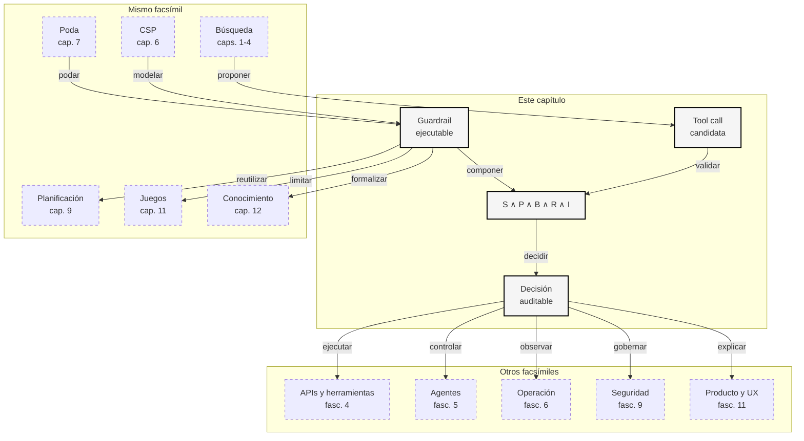

::: {.fasciculo-subtitle}
Facsímil 2 · Inteligencia clásica
:::

# Capítulo 08: Restricciones como guardrails

## Entrando en el tema

Imagina un agente de soporte. El usuario escribe: “Devuélveme el dinero del pedido A101; estoy muy enfadado”. El LLM entiende la intención, redacta una respuesta amable y propone llamar a una herramienta: `refund_order(order_id="A101", amount_eur=850)`.

Ahora viene la pregunta importante: ¿puede hacerlo?

La respuesta no debería estar escondida en un prompt. No basta con escribir “no hagas reembolsos grandes sin permiso” y esperar que el modelo obedezca siempre. Si una acción cambia dinero, permisos, datos personales, contratos, infraestructura o comunicaciones externas, necesitamos controles ejecutables. En el lenguaje de este facsímil: necesitamos restricciones duras.

## El prompt orienta, el guardrail decide

Un prompt es útil para tono, intención y ejemplos. Pero no es un sistema de permisos. Tampoco es un validador de tipos, ni una política de negocio, ni una auditoría. OWASP sitúa *prompt injection*, exposición de información sensible y uso inseguro de salidas entre los riesgos principales de aplicaciones con LLMs.^[OWASP Foundation. (2025). *OWASP Top 10 for LLM and Generative AI Applications 2025*. https://genai.owasp.org/. La lista enfatiza que la seguridad de aplicaciones con LLM requiere controles fuera del texto del prompt, especialmente ante instrucciones no confiables, datos sensibles y acciones de herramientas.]

Fecha de corte: 10 de junio de 2026. Para esta parte he tomado como fuentes de referencia la documentación de OpenAI sobre salidas estructuradas, la lista OWASP Top 10 para aplicaciones con LLM de 2025 y el AI RMF 1.0 de NIST. Los principios de permisos, schema, política y trazabilidad son estables; las APIs concretas, nombres comerciales y categorías de riesgo pueden cambiar.

| Capa | Sirve para | No debería ser la única barrera |
|---|---|---|
| **Prompt** | Explicar intención, tono y criterio general. | “No hagas reembolsos grandes”. |
| **Schema** | Comprobar forma, tipos y valores. | `amount_eur` debe ser número positivo. |
| **Permisos** | Decidir quién puede ejecutar una acción. | Soporte solo puede reembolsar hasta 100 EUR. |
| **Política** | Aplicar reglas del negocio y del estado. | No reembolsar pedidos en disputa. |
| **Riesgo** | Escalar acciones costosas o irreversibles. | Reembolso grande requiere aprobación humana. |
| **Auditoría** | Registrar qué pasó y por qué. | Trazabilidad para revisar incidentes. |

La idea central es sencilla: el LLM puede proponer; el sistema acepta o rechaza.

## La llamada a herramienta como candidato

Una llamada a herramienta es una asignación candidata. Igual que en un CSP, tiene variables, dominios y restricciones.

| Pieza CSP | En una tool de agente | Ejemplo |
|---|---|---|
| Variable | Argumento pendiente. | `amount_eur`. |
| Dominio | Valores permitidos. | Entre 0 y 1000. |
| Restricción | Regla que filtra. | Soporte no aprueba más de 100 EUR. |
| Solución | Tool call aceptada. | Reembolso pequeño, pedido pagado, usuario autorizado. |

OpenAI llama *Structured Outputs* a la capacidad de hacer que la salida del modelo se ajuste a un esquema especificado; aun así, el propio enfoque distingue entre generar estructura y validar lo que una aplicación permite hacer.^[OpenAI. (2026). *Structured model outputs*. https://platform.openai.com/docs/guides/structured-outputs. La documentación diferencia la generación estructurada de JSON de la adhesión a un esquema y recomienda usar esquemas estrictos cuando se necesita forma controlada.] JSON Schema, por su parte, formaliza vocabularios para validar estructura y valores de documentos JSON.^[JSON Schema. (2020). *JSON Schema Validation: A Vocabulary for Structural Validation of JSON*. https://json-schema.org/draft/2020-12/json-schema-validation]

Pero un schema no basta. Que una llamada tenga forma correcta no significa que esté autorizada.

## La fórmula del guardrail

Podemos modelar un guardrail como una conjunción de controles:

$$
\operatorname{permitida}(a,s,u)=
S(a)\land P(a,u)\land B(a,s)\land R(a)\land I(a,s)
$$

| Símbolo | Significado | Ejemplo |
|---|---|---|
| \(a\) | Acción candidata propuesta por el agente. | Reembolsar pedido A101 por 850 EUR. |
| \(s\) | Estado actual del sistema. | Pedido pagado, en disputa o ya reembolsado. |
| \(u\) | Usuario o identidad que solicita la acción. | Agente de soporte con rol `support`. |
| \(S(a)\) | Validación de schema. | Campos presentes y tipos correctos. |
| \(P(a,u)\) | Política de permisos. | Soporte solo puede reembolsar hasta 100 EUR. |
| \(B(a,s)\) | Regla de negocio dependiente del estado. | No reembolsar pedido en disputa. |
| \(R(a)\) | Control de riesgo. | Riesgo menor o igual que el umbral. |
| \(I(a,s)\) | Invariante que debe conservarse. | El pedido no queda reembolsado dos veces. |

Si cualquiera de esas piezas es falsa, la acción no se ejecuta.

## Tres decisiones, no dos

En sistemas reales no todo debería acabar en “sí” o “no”. Muchas acciones deberían tener tres salidas:

| Decisión | Cuándo ocurre | Qué hace el sistema |
|---|---|---|
| `ALLOW` | Todos los controles pasan y el riesgo es bajo. | Ejecuta la herramienta y registra la acción. |
| `DENY` | Falta schema, estado válido, invariante o permiso imprescindible. | Bloquea y explica qué control falló. |
| `HITL` | La acción puede ser legítima, pero supera umbral de riesgo o importe. | Pide aprobación humana con contexto y trazas. |

Esto evita dos extremos malos. El primero es permitir demasiado porque el modelo “parece seguro”. El segundo es bloquear todo lo que se salga de un caso pequeño, haciendo el sistema inútil. La ingeniería buena suele estar en el medio: automatizar lo seguro, denegar lo inválido y escalar lo delicado.

También conviene separar el punto que **decide** del punto que **ejecuta**. En seguridad se habla a menudo de *policy decision point* y *policy enforcement point*: una pieza evalúa la política; otra impide que la herramienta se ejecute si la decisión no lo permite. Para un agente, esto significa que el LLM no llama directamente a la API sensible. Propone una llamada; el guardrail decide; el ejecutor obedece solo si la decisión es permitida.

La regla por defecto debería ser *fail closed*: si falta un campo, no se sabe el rol, el estado no está cargado o el cálculo de riesgo falla, la acción no se ejecuta automáticamente. Un sistema puede ser amable en el mensaje de rechazo, pero no debe ser generoso con permisos incompletos.

Ejemplo 1:

| Control | Evaluación | Resultado |
|---|---|---|
| \(S(a)\) | `order_id` es texto y `amount_eur=80` es número positivo. | Verdadero |
| \(P(a,u)\) | Rol `support`; importe 80 EUR. | Verdadero |
| \(B(a,s)\) | Pedido pagado y no reembolsado. | Verdadero |
| \(R(a)\) | Riesgo bajo. | Verdadero |
| \(I(a,s)\) | No duplica reembolso. | Verdadero |

La acción se permite.

Ejemplo 2:

| Control | Evaluación | Resultado |
|---|---|---|
| \(S(a)\) | La llamada tiene forma correcta. | Verdadero |
| \(P(a,u)\) | Rol `support`; importe 850 EUR. | Falso |
| \(B(a,s)\) | Pedido pagado. | Verdadero |
| \(R(a)\) | Riesgo alto. | Falso |
| \(I(a,s)\) | No duplica reembolso. | Verdadero |

La acción se rechaza aunque el LLM la haya propuesto con mucha seguridad.

## Riesgo, umbrales y aprobación humana

**Ejemplo de fórmula.** Para decidir cuándo escalar a una persona, podemos usar una puntuación simple de riesgo. Esta fórmula no pretende sustituir una matriz de riesgo formal ni una política legal; sirve para que el equipo haga explícitos los factores que está mezclando antes de ejecutar una acción.

$$
\operatorname{riesgo}(a)=impacto(a)\cdot probabilidad(a)\cdot irreversibilidad(a)
$$

| Símbolo | Significado | Ejemplo |
|---|---|---|
| \(impacto(a)\) | Daño si la acción sale mal. | 5 para un reembolso grande. |
| \(probabilidad(a)\) | Probabilidad estimada de error o abuso. | 2 si hay señales dudosas. |
| \(irreversibilidad(a)\) | Dificultad de deshacer la acción. | 2 si requiere proceso externo. |
| \(\operatorname{riesgo}(a)\) | Puntuación total de riesgo. | \(5\cdot2\cdot2=20\). |

Definimos:

$$
R(a)=\operatorname{riesgo}(a)\leq \tau
$$

| Símbolo | Significado | Ejemplo |
|---|---|---|
| \(R(a)\) | Control que dice si el riesgo es aceptable. | Verdadero si no supera el umbral. |
| \(\tau\) | Umbral de ejecución automática. | \(\tau=8\). |

Si el riesgo es \(20\) y el umbral es \(8\), la acción no se ejecuta automáticamente. Puede pasar a revisión humana. En un sistema real, los valores de impacto, probabilidad e irreversibilidad deben venir de incidentes, políticas internas, auditorías y límites de negocio, no de una sensación improvisada. NIST propone gestionar riesgos de IA de forma medible, trazable y adaptada al contexto; esa filosofía encaja con convertir acciones peligrosas en decisiones explícitas, no en obediencia ciega al modelo.^[Tabassi, E. (2023). *Artificial Intelligence Risk Management Framework (AI RMF 1.0)*. National Institute of Standards and Technology. https://doi.org/10.6028/NIST.AI.100-1]

## Permisos: el modelo no es identidad

Los permisos deben vivir fuera del LLM. La idea de control de acceso basado en roles aparece formalizada en trabajos clásicos de Ferraiolo y Kuhn, donde los permisos se asocian a roles y no a frases libres.^[Ferraiolo, D. F. y Kuhn, D. R. (1992). Role-Based Access Controls. En *Proceedings of the 15th National Computer Security Conference* (pp. 554-563). https://www.nist.gov/publications/role-based-access-controls]

Un modelo puede decir “el usuario parece administrador”. Eso no convierte al usuario en administrador. El sistema debe comprobarlo.

| Pregunta | Debe contestarla | Ejemplo |
|---|---|---|
| ¿Quién pide la acción? | Identidad/autenticación. | Usuario `u2`. |
| ¿Qué rol tiene? | Sistema de permisos. | `support`, no `admin`. |
| ¿Qué intenta hacer? | Tool call estructurada. | Reembolsar 850 EUR. |
| ¿Puede hacerlo? | Política ejecutable. | No sin aprobación. |

Saltzer y Schroeder ya defendían principios como mínimo privilegio y mediación completa: cada acceso relevante debe comprobarse, no asumirse.^[Saltzer, J. H. y Schroeder, M. D. (1975). The protection of information in computer systems. *Proceedings of the IEEE*, 63(9), 1278-1308. https://doi.org/10.1109/PROC.1975.9939] Los agentes no eliminan esos principios. Los hacen más importantes.

<svg xmlns="http://www.w3.org/2000/svg" viewBox="0 0 980 760" role="img" aria-label="Guardrails como esclusa de validación entre una propuesta de LLM y una herramienta con efectos reales">
<defs>
<marker id="arrow-guardrails" viewBox="0 0 10 10" refX="8" refY="5" markerWidth="7" markerHeight="7" orient="auto-start-reverse">
<path d="M 0 0 L 10 5 L 0 10 z" fill="#111111"/>
</marker>
<pattern id="hatch-guardrails" width="8" height="8" patternUnits="userSpaceOnUse" patternTransform="rotate(45)">
<line x1="0" y1="0" x2="0" y2="8" stroke="#E5E5E5" stroke-width="3"/>
</pattern>
</defs>
<rect x="0" y="0" width="980" height="760" rx="10" fill="#FFFFFF" stroke="#111111" stroke-width="2"/>
<text x="490" y="38" text-anchor="middle" font-family="Arial, sans-serif" font-size="23" font-weight="700" fill="#111111">Guardrails: la esclusa entre proponer y ejecutar</text>
<text x="490" y="63" text-anchor="middle" font-family="Arial, sans-serif" font-size="13" fill="#555555">El modelo redacta una intención; la aplicación decide con controles verificables.</text>

<rect x="42" y="110" width="214" height="250" rx="9" fill="#F5F5F5" stroke="#111111" stroke-width="1.6"/>
<text x="149" y="138" text-anchor="middle" font-family="Arial, sans-serif" font-size="17" font-weight="700" fill="#111111">Propuesta del LLM</text>
<rect x="72" y="166" width="154" height="122" rx="7" fill="#FFFFFF" stroke="#333333" stroke-width="1.2"/>
<path d="M92 193 H205 M92 221 H205 M92 249 H174" stroke="#555555" stroke-width="1.2"/>
<circle cx="94" cy="316" r="13" fill="#FFFFFF" stroke="#111111" stroke-width="1.5"/>
<path d="M88 316 L93 321 L102 310" fill="none" stroke="#111111" stroke-width="2"/>
<text x="149" y="312" text-anchor="middle" font-family="Arial, sans-serif" font-size="12" font-weight="700" fill="#111111">refund_order</text>
<text x="149" y="333" text-anchor="middle" font-family="Arial, sans-serif" font-size="11" fill="#555555">amount_eur = 850</text>

<path d="M256 236 H316" stroke="#111111" stroke-width="1.6" marker-end="url(#arrow-guardrails)"/>
<text x="286" y="221" text-anchor="middle" font-family="Arial, sans-serif" font-size="11" fill="#555555">candidata</text>

<rect x="318" y="94" width="360" height="486" rx="12" fill="#FFFFFF" stroke="#111111" stroke-width="2"/>
<rect x="338" y="122" width="320" height="48" rx="6" fill="url(#hatch-guardrails)" stroke="#111111" stroke-width="1.2"/>
<text x="498" y="143" text-anchor="middle" font-family="Arial, sans-serif" font-size="16" font-weight="700" fill="#111111">Esclusa de validación</text>
<text x="498" y="160" text-anchor="middle" font-family="Arial, sans-serif" font-size="11" fill="#555555">cada compuerta puede bloquear la acción</text>

<line x1="368" y1="200" x2="368" y2="488" stroke="#111111" stroke-width="2"/>
<circle cx="368" cy="214" r="17" fill="#FFFFFF" stroke="#111111" stroke-width="1.7"/>
<circle cx="368" cy="276" r="17" fill="#FFFFFF" stroke="#111111" stroke-width="1.7"/>
<circle cx="368" cy="338" r="17" fill="#FFFFFF" stroke="#111111" stroke-width="1.7"/>
<circle cx="368" cy="400" r="17" fill="#FFFFFF" stroke="#111111" stroke-width="1.7"/>
<circle cx="368" cy="462" r="17" fill="#FFFFFF" stroke="#111111" stroke-width="1.7"/>
<text x="368" y="219" text-anchor="middle" font-family="Arial, sans-serif" font-size="12" font-weight="700" fill="#111111">1</text>
<text x="368" y="281" text-anchor="middle" font-family="Arial, sans-serif" font-size="12" font-weight="700" fill="#111111">2</text>
<text x="368" y="343" text-anchor="middle" font-family="Arial, sans-serif" font-size="12" font-weight="700" fill="#111111">3</text>
<text x="368" y="405" text-anchor="middle" font-family="Arial, sans-serif" font-size="12" font-weight="700" fill="#111111">4</text>
<text x="368" y="467" text-anchor="middle" font-family="Arial, sans-serif" font-size="12" font-weight="700" fill="#111111">5</text>

<rect x="404" y="190" width="226" height="48" rx="6" fill="#F5F5F5" stroke="#333333" stroke-width="1.2"/>
<rect x="404" y="252" width="226" height="48" rx="6" fill="#F5F5F5" stroke="#333333" stroke-width="1.2"/>
<rect x="404" y="314" width="226" height="48" rx="6" fill="#F5F5F5" stroke="#333333" stroke-width="1.2"/>
<rect x="404" y="376" width="226" height="48" rx="6" fill="#F5F5F5" stroke="#333333" stroke-width="1.2"/>
<rect x="404" y="438" width="226" height="48" rx="6" fill="#F5F5F5" stroke="#333333" stroke-width="1.2"/>
<text x="424" y="210" font-family="Arial, sans-serif" font-size="12" font-weight="700" fill="#111111">Schema</text>
<text x="424" y="228" font-family="Arial, sans-serif" font-size="11" fill="#555555">campos, tipos y rango</text>
<text x="424" y="272" font-family="Arial, sans-serif" font-size="12" font-weight="700" fill="#111111">Permisos</text>
<text x="424" y="290" font-family="Arial, sans-serif" font-size="11" fill="#555555">rol, identidad y alcance</text>
<text x="424" y="334" font-family="Arial, sans-serif" font-size="12" font-weight="700" fill="#111111">Política</text>
<text x="424" y="352" font-family="Arial, sans-serif" font-size="11" fill="#555555">estado del pedido</text>
<text x="424" y="396" font-family="Arial, sans-serif" font-size="12" font-weight="700" fill="#111111">Riesgo</text>
<text x="424" y="414" font-family="Arial, sans-serif" font-size="11" fill="#555555">umbral o revisión humana</text>
<text x="424" y="458" font-family="Arial, sans-serif" font-size="12" font-weight="700" fill="#111111">Invariante</text>
<text x="424" y="476" font-family="Arial, sans-serif" font-size="11" fill="#555555">no romper reglas globales</text>

<rect x="348" y="516" width="300" height="38" rx="6" fill="#FFFFFF" stroke="#111111" stroke-width="1.2"/>
<text x="498" y="540" text-anchor="middle" font-family="Georgia, serif" font-size="15" fill="#111111">permitida = S ∧ P ∧ B ∧ R ∧ I</text>

<path d="M678 230 C722 230 724 180 760 180" stroke="#111111" stroke-width="1.6" fill="none" marker-end="url(#arrow-guardrails)"/>
<path d="M678 410 C722 410 724 508 760 508" stroke="#555555" stroke-width="1.6" fill="none" stroke-dasharray="6 5" marker-end="url(#arrow-guardrails)"/>

<rect x="760" y="122" width="178" height="142" rx="9" fill="#F5F5F5" stroke="#111111" stroke-width="1.6"/>
<circle cx="790" cy="170" r="19" fill="#FFFFFF" stroke="#111111" stroke-width="1.5"/>
<path d="M781 170 L789 178 L804 159" fill="none" stroke="#111111" stroke-width="2.6"/>
<text x="860" y="160" text-anchor="middle" font-family="Arial, sans-serif" font-size="17" font-weight="700" fill="#111111">Ejecutar</text>
<text x="860" y="188" text-anchor="middle" font-family="Arial, sans-serif" font-size="11" fill="#555555">tool con efecto real</text>
<text x="860" y="210" text-anchor="middle" font-family="Arial, sans-serif" font-size="11" fill="#111111">solo si todo pasa</text>
<text x="860" y="232" text-anchor="middle" font-family="Arial, sans-serif" font-size="11" fill="#555555">acción registrada</text>

<rect x="760" y="438" width="178" height="142" rx="9" fill="#FFFFFF" stroke="#111111" stroke-width="1.6" stroke-dasharray="7 5"/>
<circle cx="790" cy="486" r="19" fill="#F5F5F5" stroke="#111111" stroke-width="1.5"/>
<path d="M781 477 L799 495 M799 477 L781 495" stroke="#111111" stroke-width="2.4"/>
<text x="860" y="476" text-anchor="middle" font-family="Arial, sans-serif" font-size="17" font-weight="700" fill="#111111">Bloquear</text>
<text x="860" y="504" text-anchor="middle" font-family="Arial, sans-serif" font-size="11" fill="#555555">rechazar o escalar</text>
<text x="860" y="526" text-anchor="middle" font-family="Arial, sans-serif" font-size="11" fill="#111111">explicar el control</text>
<text x="860" y="548" text-anchor="middle" font-family="Arial, sans-serif" font-size="11" fill="#555555">pedir aprobación</text>

<path d="M846 264 V626" stroke="#555555" stroke-width="1.2" stroke-dasharray="5 5" marker-end="url(#arrow-guardrails)"/>
<path d="M846 580 V626" stroke="#555555" stroke-width="1.2" stroke-dasharray="5 5" marker-end="url(#arrow-guardrails)"/>
<rect x="120" y="626" width="740" height="74" rx="8" fill="#F5F5F5" stroke="#111111" stroke-width="1.4"/>
<text x="490" y="652" text-anchor="middle" font-family="Arial, sans-serif" font-size="15" font-weight="700" fill="#111111">Auditoría: dejar rastro de la decisión</text>
<line x1="176" y1="674" x2="804" y2="674" stroke="#333333" stroke-width="1"/>
<text x="210" y="690" text-anchor="middle" font-family="Arial, sans-serif" font-size="10" fill="#555555">quién</text>
<text x="344" y="690" text-anchor="middle" font-family="Arial, sans-serif" font-size="10" fill="#555555">qué pidió</text>
<text x="490" y="690" text-anchor="middle" font-family="Arial, sans-serif" font-size="10" fill="#555555">qué falló</text>
<text x="640" y="690" text-anchor="middle" font-family="Arial, sans-serif" font-size="10" fill="#555555">decisión</text>
<text x="770" y="690" text-anchor="middle" font-family="Arial, sans-serif" font-size="10" fill="#555555">resultado</text>
<text x="490" y="724" text-anchor="middle" font-family="Arial, sans-serif" font-size="13" font-weight="700" fill="#111111">El prompt orienta. La esclusa decide. El log permite auditar.</text>
<text x="940" y="742" text-anchor="end" font-family="Arial, sans-serif" font-size="10" fill="#9A9A9A">IA para gente curiosa / Facsímil 02 / Capítulo 08 / 686f6c61</text>
</svg>

## En el día a día

En una aplicación de soporte, el guardrail no es una pantalla bonita de “confirmar”. Es una cadena de controles antes de llamar a la herramienta. Primero se valida que los argumentos tienen forma. Después se comprueba el rol. Luego se revisa el estado del pedido. Después se calcula el riesgo. Finalmente se registra todo.

En un sistema RAG, el guardrail puede exigir que toda respuesta legal cite documentos recuperados. En un agente de despliegue, puede impedir `deploy` si no hay build verde. En una herramienta financiera, puede escalar toda operación por encima de cierto importe.

La idea no cambia: donde haya reglas duras, no las delegues a una frase del prompt.

## Por qué debería importarte

Porque el fallo caro no suele ser que el modelo redacte mal. El fallo caro es que una salida plausible atraviese el sistema y ejecute algo que no debía. En aplicaciones con herramientas, una respuesta deja de ser solo texto: puede cambiar el mundo.

Los guardrails son la traducción operativa de lo que venimos aprendiendo desde SAT y CSP. Separan propuesta de aceptación. Hacen visible qué regla falló. Permiten auditar. Y, sobre todo, reducen la superficie donde el modelo puede improvisar.

En programación con restricciones, esta separación entre variables, dominios, restricciones y soluciones es la forma natural de modelar decisiones que no admiten “casi correcto”.^[Rossi, F., van Beek, P. y Walsh, T. (Eds.). (2006). *Handbook of constraint programming*. Elsevier.]

## Dónde solía tropezar yo

| Error | Por qué es un error | Antídoto |
|---|---|---|
| **Poner una regla dura solo en el prompt** | Un prompt puede ser ignorado, contradicho o rodeado por instrucciones no confiables. | Codifica la regla como schema, permiso, política o validador. |
| **Confundir JSON válido con acción válida** | Una llamada puede tener campos correctos y aun así no estar autorizada. | Separa schema, permisos, estado y riesgo. |
| **Validar después de ejecutar** | Si la herramienta ya cambió dinero o datos, el daño puede estar hecho. | Valida antes de ejecutar y registra después. |
| **No explicar el rechazo** | Un “no” opaco parece fallo del sistema. | Devuelve qué control falló y qué alternativa segura existe. |

## Manos a la obra

La práctica real está en `labs/f2/c08-guardrail-gate/`. El kit simula llamadas a una tool de reembolso y las pasa por schema, permisos, política de negocio, riesgo e invariantes. Produce tres decisiones: `ALLOW`, `DENY` y `HITL`.

```bash
cd labs/f2/c08-guardrail-gate
python3 ops/evaluate_guardrails.py --write
cat output/guardrail_decision.md
```

Como gate:

```bash
python3 ops/evaluate_guardrails.py --write --fail-on-invalid
```

**Qué deberías ver.** Una llamada pequeña y válida se permite. Una llamada de importe alto no se ejecuta automáticamente: pasa a aprobación humana. Una llamada sobre pedido en disputa se deniega. Una llamada con importe inválido falla en schema. Una llamada duplicada falla por invariante.

| Archivo | Papel |
|---|---|
| `data/refund_calls.json` | Tool calls candidatas, usuario, estado y riesgo. |
| `contracts/guardrail_policy.json` | Límites de rol, umbrales HITL, estados válidos e invariantes. |
| `ops/evaluate_guardrails.py` | Evaluador sin dependencias externas. |
| `output/guardrail_report.json` | Resultado estructurado. |
| `output/guardrail_audit_log.jsonl` | Log de auditoría línea a línea. |
| `output/guardrail_decision.md` | Informe legible para entregar. |

**Cómo lo adaptas a tu caso.** Cambia `refund_order` por una herramienta real: `deploy_service`, `send_email`, `delete_user`, `create_invoice` o `query_database`. Mantén la idea: schema primero, permisos después, reglas de estado, riesgo, invariantes y auditoría.

**Qué entregaría un alumno.** El Markdown generado, una tool nueva, una política de límites por rol, un caso `HITL` y una explicación de por qué *fail closed* protege mejor que permitir por defecto.

## Cómo encaja todo

Este mapa traduce SAT y CSP a una arquitectura de producto. Una llamada a herramienta es una candidata, no una orden. Antes de ejecutarla, el sistema debe validar forma, permisos, estado, riesgo e invariantes.

La decisión aprendida es separar el texto que propone de los controles que autorizan. Esa separación se reutiliza en planificación, agentes, operación y seguridad.



## Vocabulario aprendido

| Término | Definición |
|---|---|
| **Guardrail** | Control ejecutable que limita, valida o bloquea una acción de IA. |
| **Schema** | Contrato que define campos, tipos y valores aceptados. |
| **Política de permisos** | Regla que decide quién puede ejecutar qué acción. |
| **Invariante** | Condición que debe seguir siendo cierta antes y después de actuar. |
| **HITL** | Aprobación humana cuando el riesgo supera un umbral. |
| **Auditoría** | Registro revisable de petición, decisión, acción y resultado. |
| **Fail closed** | Ante duda o error, bloquear o escalar en vez de ejecutar automáticamente. |
| **Policy decision point** | Componente que evalúa la política antes de que el ejecutor llame a la herramienta. |

## Antes de pasar página

- [ ] ¿Puedo explicar por qué un prompt no es un guardrail suficiente?
- [ ] ¿Distingo schema correcto de acción autorizada?
- [ ] ¿Sé escribir \(\operatorname{permitida}(a,s,u)=S\land P\land B\land R\land I\)?
- [ ] ¿Entiendo cuándo una acción debe escalar a una persona?
- [ ] ¿He ejecutado `labs/f2/c08-guardrail-gate/` y puedo explicar una decisión `ALLOW`, una `DENY` y una `HITL`?

## En resumen

| Idea fuerza | Detalle |
|---|---|
| El LLM propone, la aplicación decide. | La aceptación debe depender de controles ejecutables. |
| El schema no basta. | Forma correcta no implica permiso, estado válido ni riesgo aceptable. |
| Los guardrails son restricciones duras. | Schema, permisos, políticas, riesgo e invariantes son filtros antes de ejecutar. |
| Algunas acciones no se deniegan: se escalan. | `HITL` permite tratar riesgo alto sin convertir el sistema en todo o nada. |
| La auditoría convierte decisiones en trazas. | Si algo falla, necesitamos saber quién pidió qué, qué se validó y qué ocurrió. |

## Para saber más

Ferraiolo, D. F. y Kuhn, D. R. (1992). Role-Based Access Controls. En *Proceedings of the 15th National Computer Security Conference* (pp. 554-563). https://www.nist.gov/publications/role-based-access-controls

JSON Schema. (2020). *JSON Schema Validation: A Vocabulary for Structural Validation of JSON*. https://json-schema.org/draft/2020-12/json-schema-validation

OpenAI. (2026). *Structured model outputs*. https://platform.openai.com/docs/guides/structured-outputs

OWASP Foundation. (2025). *OWASP Top 10 for LLM and Generative AI Applications 2025*. https://genai.owasp.org/

Rossi, F., van Beek, P. y Walsh, T. (Eds.). (2006). *Handbook of constraint programming*. Elsevier.

Saltzer, J. H. y Schroeder, M. D. (1975). The protection of information in computer systems. *Proceedings of the IEEE*, 63(9), 1278-1308. https://doi.org/10.1109/PROC.1975.9939

Tabassi, E. (2023). *Artificial Intelligence Risk Management Framework (AI RMF 1.0)*. National Institute of Standards and Technology. https://doi.org/10.6028/NIST.AI.100-1
