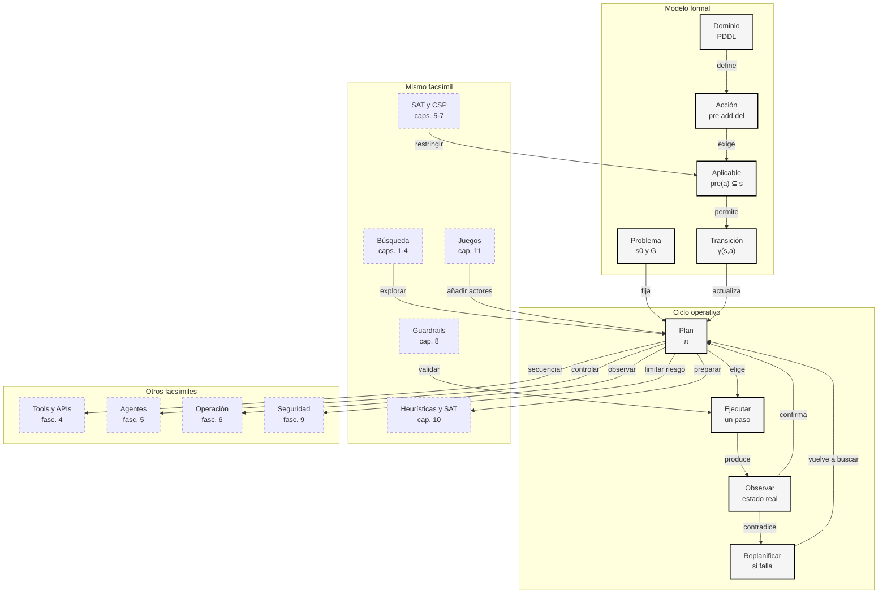

::: {.fasciculo-subtitle}
Facsímil 2 · Inteligencia clásica
:::

# Capítulo 09: Planificación automática: PDDL y modelado de dominios

## Entrando en el tema

Imagina una tarea aparentemente simple: “envía la factura al cliente”. Parece una instrucción de una sola línea. Pero si intentamos automatizarla de verdad, enseguida aparecen preguntas incómodas.

¿Existe el cliente? ¿La factura está completa? ¿El importe está calculado? ¿El correo está confirmado? ¿Hay permiso para enviarla? ¿Qué pasa si ya se envió ayer?

Un humano puede resolver esas preguntas con contexto y prudencia. Una automatización necesita otra cosa: un modelo explícito de estado, acciones, precondiciones y efectos. Eso es planificación automática.

## Un plan no es una lista de tareas

Una lista dice qué pasos suenan razonables. Un plan dice qué pasos son ejecutables, en qué orden y bajo qué condiciones. La diferencia parece pequeña hasta que una acción tiene efectos reales.

En planificación clásica, el mundo se representa como un estado; las acciones solo se pueden aplicar si sus precondiciones se cumplen, y al aplicarlas cambian el estado. Ghallab, Nau y Traverso presentan esta idea como el modelo básico de la planificación automática: encontrar una forma de pasar de una situación inicial a una situación objetivo mediante acciones descritas formalmente.^[Ghallab, M., Nau, D. y Traverso, P. (2004). *Automated Planning: Theory and Practice*. Morgan Kaufmann.]

En agentes modernos pasa lo mismo, aunque el vocabulario sea distinto. El estado puede ser memoria, ficheros, base de datos, tickets, logs o respuestas de herramientas. Las acciones pueden ser tool calls. Las precondiciones son permisos, datos disponibles y reglas del negocio. Los efectos son cambios observables.

Russell y Norvig tratan la planificación como una extensión natural de la búsqueda: ya no buscamos solo un camino entre nodos, sino una secuencia de acciones que respete un modelo explícito del mundo.^[Russell, S. y Norvig, P. (2021). *Artificial Intelligence: A Modern Approach* (4.ª ed.). Pearson.]

## La planificación como sistema formal

Podemos escribir una tarea de planificación como:

$$
\Pi=(S,A,\gamma,s_0,G)
$$

| Símbolo | Significado | Ejemplo |
|---|---|---|
| \(\Pi\) | Problema de planificación completo. | Enviar una factura validada. |
| \(S\) | Conjunto de estados posibles. | Todas las combinaciones de hechos sobre cliente, factura y envío. |
| \(A\) | Conjunto de acciones disponibles. | `validar_factura`, `enviar_email`, `registrar_log`. |
| \(\gamma\) | Función de transición: aplica una acción y devuelve el nuevo estado. | Si envío el email, aparece `email_enviado`. |
| \(s_0\) | Estado inicial. | Cliente identificado, factura preparada. |
| \(G\) | Objetivo: hechos que deben ser ciertos al final. | Factura enviada y log creado. |

Una acción \(a\) tiene tres piezas:

$$
a=(pre(a),add(a),del(a))
$$

| Símbolo | Significado | Ejemplo |
|---|---|---|
| \(pre(a)\) | Precondiciones: hechos requeridos antes de actuar. | `factura_validada` y `email_confirmado`. |
| \(add(a)\) | Hechos que pasan a ser verdaderos. | `email_enviado`. |
| \(del(a)\) | Hechos que dejan de ser verdaderos. | `factura_preparada`. |

Esta forma de pensar viene de STRIPS, uno de los lenguajes clásicos para describir acciones mediante precondiciones y efectos de añadir o borrar hechos.^[Fikes, R. E. y Nilsson, N. J. (1971). STRIPS: A new approach to the application of theorem proving to problem solving. *Artificial Intelligence*, 2(3-4), 189-208. https://doi.org/10.1016/0004-3702(71)90010-5]

Una acción es aplicable si todas sus precondiciones están en el estado actual:

$$
\operatorname{aplicable}(a,s)\Leftrightarrow pre(a)\subseteq s
$$

| Símbolo | Significado | Ejemplo |
|---|---|---|
| \(a\) | Acción que queremos ejecutar. | `enviar_factura`. |
| \(s\) | Estado actual. | Conjunto de hechos verdaderos ahora. |
| \(pre(a)\) | Hechos requeridos por la acción. | `{factura_validada, email_confirmado}`. |
| \(pre(a)\subseteq s\) | Todas las precondiciones están presentes en el estado. | La factura está validada y el email confirmado. |

Si la acción es aplicable, el nuevo estado se calcula así:

$$
\gamma(s,a)=(s\setminus del(a))\cup add(a)
$$

| Símbolo | Significado | Ejemplo |
|---|---|---|
| \(\gamma(s,a)\) | Estado resultante tras ejecutar la acción. | Estado después de enviar la factura. |
| \(s\setminus del(a)\) | Estado sin los hechos que la acción elimina. | Quitamos `factura_preparada`. |
| \(add(a)\) | Hechos nuevos que la acción añade. | Añadimos `email_enviado`. |
| \(\cup\) | Unión de hechos. | Juntamos lo que queda con lo nuevo. |

Por último, un plan es una secuencia de acciones:

$$
\pi=\langle a_1,a_2,\ldots,a_k\rangle
$$

| Símbolo | Significado | Ejemplo |
|---|---|---|
| \(\pi\) | Plan completo. | Validar, enviar, registrar. |
| \(a_i\) | Acción en la posición \(i\). | \(a_2=\) `enviar_factura`. |
| \(k\) | Longitud del plan. | Tres acciones. |

El plan es válido si, al aplicar sus acciones una a una desde \(s_0\), llegamos a un estado final \(s_k\) donde el objetivo se cumple:

$$
G\subseteq s_k
$$

| Símbolo | Significado | Ejemplo |
|---|---|---|
| \(G\) | Objetivo que queremos lograr. | `{email_enviado, log_creado}`. |
| \(s_k\) | Estado después de ejecutar las \(k\) acciones. | Estado final tras validar, enviar y registrar. |
| \(G\subseteq s_k\) | Todos los hechos objetivo son verdaderos al final. | El email se envió y quedó registrado. |

## Un ejemplo pequeño: enviar una factura

Tomemos este estado inicial:

$$
s_0=\{cliente\_identificado,\ factura\_preparada,\ importe\_calculado,\ email\_confirmado\}
$$

Y este objetivo:

$$
G=\{factura\_validada,\ email\_enviado,\ log\_creado\}
$$

| Acción | Precondiciones | Añade | Elimina |
|---|---|---|---|
| `validar_factura` | `cliente_identificado`, `importe_calculado`, `factura_preparada` | `factura_validada` | `factura_preparada` |
| `enviar_factura` | `factura_validada`, `email_confirmado` | `email_enviado` | Nada |
| `registrar_envio` | `email_enviado` | `log_creado` | Nada |

El plan válido es:

$$
\pi=\langle validar\_factura,\ enviar\_factura,\ registrar\_envio\rangle
$$

No porque suene bien, sino porque cada paso se puede comprobar.

Si intentamos `enviar_factura` primero, falla: `factura_validada` todavía no pertenece a \(s_0\). Si intentamos `registrar_envio` primero, falla: `email_enviado` todavía no es cierto.

## PDDL: separar dominio y problema

PDDL, *Planning Domain Definition Language*, se creó para estandarizar cómo describir problemas de planificación en competiciones y sistemas de planning.^[McDermott, D., Ghallab, M., Howe, A., Knoblock, C., Ram, A., Veloso, M., Weld, D. y Wilkins, D. (1998). *PDDL: The Planning Domain Definition Language, Version 1.2*. Yale Center for Computational Vision and Control. https://www.isi.edu/results/publications/19837/pddl-the-planning-domain-definition-language-version-1-2]

La idea más importante no es memorizar la sintaxis. La idea importante es separar dos cosas:

| Pieza | Qué contiene | Qué no debería contener |
|---|---|---|
| **Dominio** | Reglas reutilizables: tipos, predicados y acciones. | Datos concretos del caso de hoy. |
| **Problema** | Objetos, estado inicial y objetivo concreto. | Lógica general de las acciones. |

El dominio describe cómo funciona el mundo:

```lisp
(define (domain facturas)
  (:requirements :strips)
  (:predicates
    (cliente-identificado)
    (factura-preparada)
    (importe-calculado)
    (factura-validada)
    (email-confirmado)
    (email-enviado)
    (log-creado))

  (:action validar-factura
    :precondition (and
      (cliente-identificado)
      (importe-calculado)
      (factura-preparada))
    :effect (and
      (factura-validada)
      (not (factura-preparada))))

  (:action enviar-factura
    :precondition (and
      (factura-validada)
      (email-confirmado))
    :effect (email-enviado))

  (:action registrar-envio
    :precondition (email-enviado)
    :effect (log-creado)))
```

El problema describe el caso concreto:

```lisp
(define (problem envio-factura-123)
  (:domain facturas)
  (:init
    (cliente-identificado)
    (factura-preparada)
    (importe-calculado)
    (email-confirmado))
  (:goal (and
    (factura-validada)
    (email-enviado)
    (log-creado))))
```

Separar dominio y problema es parecido a separar código y configuración. No reescribes la acción `enviar-factura` cada vez que cambia el número de factura. Cambias la instancia.

PDDL también nos enseña una disciplina útil aunque nunca lo usemos en producción: cada acción debe declarar qué espera del mundo y qué promete cambiar. Ese contrato permite detectar tres clases de errores que un texto libre disimula muy bien.

| Error | Cómo lo detecta el modelo de planificación | Ejemplo |
|---|---|---|
| **Paso imposible** | Falta una precondición. | Intentar enviar sin `factura_validada`. |
| **Paso inútil** | El efecto no acerca al objetivo. | Consultar tres veces el mismo pedido. |
| **Paso peligroso** | El efecto rompe una regla o requiere aprobación. | Enviar una factura de alto importe sin revisión. |

Por eso PDDL encaja tan bien con tools y agentes: convierte una acción de “parece razonable” en una acción de “puedo comprobar si es legal”.

<svg xmlns="http://www.w3.org/2000/svg" viewBox="0 0 980 800" role="img" aria-label="Planificación automática con dominio, problema, planificador, ejecución y replanificación">
<defs>
<marker id="arrow-planning09" viewBox="0 0 10 10" refX="8" refY="5" markerWidth="7" markerHeight="7" orient="auto-start-reverse">
<path d="M 0 0 L 10 5 L 0 10 z" fill="#111111"/>
</marker>
<pattern id="hatch-planning09" width="8" height="8" patternUnits="userSpaceOnUse" patternTransform="rotate(45)">
<line x1="0" y1="0" x2="0" y2="8" stroke="#E5E5E5" stroke-width="3"/>
</pattern>
</defs>
<rect x="0" y="0" width="980" height="800" rx="10" fill="#FFFFFF" stroke="#111111" stroke-width="2"/>
<text x="490" y="38" text-anchor="middle" font-family="Arial, sans-serif" font-size="23" font-weight="700" fill="#111111">Planificar, ejecutar, observar, corregir</text>
<text x="490" y="63" text-anchor="middle" font-family="Arial, sans-serif" font-size="13" fill="#555555">Un plan útil no termina al elegir pasos: comprueba cada acción y aprende del estado observado.</text>
<rect x="42" y="98" width="246" height="210" rx="9" fill="#F5F5F5" stroke="#111111" stroke-width="1.6"/>
<text x="165" y="126" text-anchor="middle" font-family="Arial, sans-serif" font-size="17" font-weight="700" fill="#111111">Dominio reutilizable</text>
<rect x="70" y="154" width="190" height="42" rx="6" fill="#FFFFFF" stroke="#333333"/>
<rect x="70" y="210" width="190" height="70" rx="6" fill="#FFFFFF" stroke="#333333"/>
<text x="92" y="179" font-family="Arial, sans-serif" font-size="12" font-weight="700" fill="#111111">Predicados</text>
<text x="92" y="234" font-family="Arial, sans-serif" font-size="12" font-weight="700" fill="#111111">Acciones</text>
<text x="92" y="253" font-family="Arial, sans-serif" font-size="11" fill="#555555">pre(a), add(a), del(a)</text>
<text x="92" y="269" font-family="Arial, sans-serif" font-size="11" fill="#555555">validar, enviar, registrar</text>
<rect x="42" y="344" width="246" height="166" rx="9" fill="#FFFFFF" stroke="#111111" stroke-width="1.6"/>
<text x="165" y="372" text-anchor="middle" font-family="Arial, sans-serif" font-size="17" font-weight="700" fill="#111111">Problema concreto</text>
<text x="72" y="407" font-family="Arial, sans-serif" font-size="12" font-weight="700" fill="#111111">s0</text>
<text x="104" y="407" font-family="Arial, sans-serif" font-size="11" fill="#555555">cliente, factura, email</text>
<text x="72" y="436" font-family="Arial, sans-serif" font-size="12" font-weight="700" fill="#111111">G</text>
<text x="104" y="436" font-family="Arial, sans-serif" font-size="11" fill="#555555">email enviado + log</text>
<text x="72" y="470" font-family="Arial, sans-serif" font-size="12" font-weight="700" fill="#111111">Instancia</text>
<text x="72" y="490" font-family="Arial, sans-serif" font-size="11" fill="#555555">pedido, cliente y permisos de hoy</text>
<path d="M288 202 H340" stroke="#111111" stroke-width="1.5" marker-end="url(#arrow-planning09)"/>
<path d="M288 428 H340" stroke="#111111" stroke-width="1.5" marker-end="url(#arrow-planning09)"/>
<rect x="340" y="136" width="300" height="214" rx="12" fill="url(#hatch-planning09)" stroke="#111111" stroke-width="1.8"/>
<text x="490" y="168" text-anchor="middle" font-family="Arial, sans-serif" font-size="18" font-weight="700" fill="#111111">Planificador</text>
<rect x="370" y="198" width="240" height="40" rx="6" fill="#FFFFFF" stroke="#333333"/>
<rect x="370" y="254" width="240" height="54" rx="6" fill="#FFFFFF" stroke="#333333"/>
<text x="490" y="223" text-anchor="middle" font-family="Georgia, serif" font-size="14" fill="#111111">aplicable(a,s) ⇔ pre(a) ⊆ s</text>
<text x="490" y="276" text-anchor="middle" font-family="Georgia, serif" font-size="14" fill="#111111">γ(s,a)=(s - del(a)) ∪ add(a)</text>
<text x="490" y="294" text-anchor="middle" font-family="Arial, sans-serif" font-size="11" fill="#555555">si falla una precondición, se descarta</text>
<rect x="354" y="388" width="272" height="104" rx="9" fill="#FFFFFF" stroke="#111111" stroke-width="1.5"/>
<text x="490" y="416" text-anchor="middle" font-family="Arial, sans-serif" font-size="16" font-weight="700" fill="#111111">Contrato de acción</text>
<text x="390" y="449" font-family="Arial, sans-serif" font-size="11" fill="#555555">1. comprobar precondiciones</text>
<text x="390" y="468" font-family="Arial, sans-serif" font-size="11" fill="#555555">2. aplicar efectos esperados</text>
<text x="390" y="487" font-family="Arial, sans-serif" font-size="11" fill="#555555">3. observar el estado real</text>
<path d="M640 244 H690" stroke="#111111" stroke-width="1.5" marker-end="url(#arrow-planning09)"/>
<rect x="690" y="118" width="246" height="262" rx="10" fill="#FFFFFF" stroke="#111111" stroke-width="1.7"/>
<text x="813" y="146" text-anchor="middle" font-family="Arial, sans-serif" font-size="17" font-weight="700" fill="#111111">Ejecución vigilada</text>
<circle cx="728" cy="190" r="15" fill="#FFFFFF" stroke="#111111" stroke-width="1.5"/>
<circle cx="728" cy="252" r="15" fill="#FFFFFF" stroke="#111111" stroke-width="1.5"/>
<circle cx="728" cy="314" r="15" fill="#FFFFFF" stroke="#111111" stroke-width="1.5"/>
<line x1="728" y1="205" x2="728" y2="299" stroke="#111111" stroke-width="1.5"/>
<text x="728" y="195" text-anchor="middle" font-family="Arial, sans-serif" font-size="10" font-weight="700" fill="#111111">1</text>
<text x="728" y="257" text-anchor="middle" font-family="Arial, sans-serif" font-size="10" font-weight="700" fill="#111111">2</text>
<text x="728" y="319" text-anchor="middle" font-family="Arial, sans-serif" font-size="10" font-weight="700" fill="#111111">3</text>
<text x="760" y="186" font-family="Arial, sans-serif" font-size="12" font-weight="700" fill="#111111">validar</text>
<text x="760" y="204" font-family="Arial, sans-serif" font-size="11" fill="#555555">observar factura válida</text>
<text x="760" y="248" font-family="Arial, sans-serif" font-size="12" font-weight="700" fill="#111111">enviar</text>
<text x="760" y="266" font-family="Arial, sans-serif" font-size="11" fill="#555555">observar email enviado</text>
<text x="760" y="310" font-family="Arial, sans-serif" font-size="12" font-weight="700" fill="#111111">registrar</text>
<text x="760" y="328" font-family="Arial, sans-serif" font-size="11" fill="#555555">observar log creado</text>
<rect x="694" y="414" width="242" height="118" rx="9" fill="#F5F5F5" stroke="#111111" stroke-width="1.5"/>
<text x="815" y="442" text-anchor="middle" font-family="Arial, sans-serif" font-size="16" font-weight="700" fill="#111111">Monitor</text>
<text x="722" y="474" font-family="Arial, sans-serif" font-size="11" fill="#555555">compara estado esperado</text>
<text x="722" y="493" font-family="Arial, sans-serif" font-size="11" fill="#555555">con observación real</text>
<text x="722" y="512" font-family="Arial, sans-serif" font-size="11" fill="#111111">si contradice: replanificación</text>
<path d="M815 532 C815 618 184 620 184 520" stroke="#555555" stroke-width="1.4" fill="none" stroke-dasharray="7 5" marker-end="url(#arrow-planning09)"/>
<path d="M490 492 V586" stroke="#111111" stroke-width="1.5" marker-end="url(#arrow-planning09)"/>
<rect x="94" y="588" width="792" height="96" rx="9" fill="#FFFFFF" stroke="#111111" stroke-width="1.5"/>
<text x="490" y="616" text-anchor="middle" font-family="Arial, sans-serif" font-size="16" font-weight="700" fill="#111111">Plan válido: no solo pasos, también evidencia</text>
<line x1="148" y1="646" x2="832" y2="646" stroke="#333333" stroke-width="1"/>
<text x="184" y="665" text-anchor="middle" font-family="Arial, sans-serif" font-size="10" fill="#555555">s0</text>
<text x="318" y="665" text-anchor="middle" font-family="Arial, sans-serif" font-size="10" fill="#555555">validar</text>
<text x="456" y="665" text-anchor="middle" font-family="Arial, sans-serif" font-size="10" fill="#555555">enviar</text>
<text x="604" y="665" text-anchor="middle" font-family="Arial, sans-serif" font-size="10" fill="#555555">registrar</text>
<text x="776" y="665" text-anchor="middle" font-family="Arial, sans-serif" font-size="10" fill="#555555">G cumplido</text>
<text x="490" y="720" text-anchor="middle" font-family="Arial, sans-serif" font-size="13" font-weight="700" fill="#111111">Un agente fiable planifica con modelo, actúa con guardrails y corrige con observaciones.</text>
<text x="940" y="776" text-anchor="end" font-family="Arial, sans-serif" font-size="10" fill="#9A9A9A">IA para gente curiosa / Facsímil 02 / Capítulo 09 / 686f6c61</text>
</svg>

## En el día a día

PDDL puede parecer antiguo, pero su disciplina es muy moderna. Cuando diseñas una tool para un agente, estás definiendo algo muy parecido a una acción de planificación.

| Pregunta de diseño | En PDDL | En una tool moderna |
|---|---|---|
| ¿Qué recibe? | Parámetros. | JSON schema o tipos. |
| ¿Cuándo puede ejecutarse? | Precondiciones. | Permisos, estado y validadores. |
| ¿Qué cambia? | Efectos. | Base de datos, fichero, ticket, email o log. |
| ¿Cómo sé que funcionó? | Nuevo estado. | Observación verificable, test o evento registrado. |

El capítulo anterior hablaba de guardrails. Este capítulo dice dónde viven muchos de esos guardrails: antes y después de cada acción. Antes, para comprobar precondiciones. Después, para comprobar efectos.

## Cuando el mundo no coincide con el plan

La planificación clásica suele empezar con un modelo limpio: sabemos qué hechos son ciertos, qué acciones existen y qué efectos tienen. El mundo real rara vez es tan educado. Una API puede fallar, una credencial puede caducar, otra persona puede cambiar el ticket o una herramienta puede devolver un resultado parcial.

Por eso, en sistemas modernos, planificar no debería significar “generar diez pasos y ejecutarlos sin mirar”. El patrón más sano es planificar, ejecutar un paso, observar, actualizar estado y decidir otra vez. Si la observación coincide con el efecto esperado, seguimos. Si no coincide, replanificamos.

| Momento | Pregunta | Ejemplo |
|---|---|---|
| Antes de actuar | ¿Se cumplen las precondiciones? | ¿La factura está validada y el email confirmado? |
| Al actuar | ¿La tool devuelve un resultado estructurado? | `send_email` devuelve `message_id`. |
| Después de actuar | ¿El efecto esperado aparece en el estado? | Existe `email_enviado`. |
| Si falla | ¿Qué acción sigue siendo legal ahora? | Reintentar, pedir dato, escalar o parar. |

En un agente con LLM, esta tabla vale oro. El modelo puede proponer el siguiente paso, pero el sistema debe mirar el estado real antes de aceptarlo. Esa es la diferencia entre un plan textual y una automatización operable.

## Por qué debería importarte

Porque muchos agentes fallan no por falta de lenguaje, sino por falta de modelo de mundo. Redactan pasos razonables, pero no saben qué pasos son aplicables, qué dependencias faltan, qué efecto real produjo cada herramienta o cuándo deben parar.

La planificación automática te da una forma de depurar esas automatizaciones: mira el estado inicial, las acciones disponibles, las precondiciones, los efectos y el objetivo. Si alguna pieza no está escrita, el sistema puede estar improvisando.

Además, la planificación crece rápido. Si en cada estado hay \(b\) acciones aplicables y buscamos planes de longitud \(d\), el árbol bruto puede crecer como:

$$
O(b^d)
$$

| Símbolo | Significado | Ejemplo |
|---|---|---|
| \(b\) | Factor de ramificación: acciones candidatas por estado. | 4 acciones disponibles. |
| \(d\) | Profundidad o longitud máxima del plan. | 5 pasos. |
| \(O(b^d)\) | Crecimiento aproximado de combinaciones a explorar. | \(4^5=1024\) secuencias posibles. |

Bylander mostró que la planificación proposicional STRIPS tiene una complejidad computacional dura incluso con representaciones relativamente simples.^[Bylander, T. (1994). The computational complexity of propositional STRIPS planning. *Artificial Intelligence*, 69(1-2), 165-204. https://doi.org/10.1016/0004-3702(94)90081-7] Por eso el siguiente capítulo hablará de heurísticas, planificación con SAT y técnicas para no explorar planes absurdos. Graphplan fue una de las grandes ideas para usar grafos de planificación y restricciones mutuas de forma eficiente.^[Blum, A. L. y Furst, M. L. (1997). Fast planning through planning graph analysis. *Artificial Intelligence*, 90(1-2), 281-300. https://doi.org/10.1016/S0004-3702(96)00047-1] FF, más tarde, hizo popular el uso de búsqueda hacia delante con heurísticas derivadas de planes relajados.^[Hoffmann, J. y Nebel, B. (2001). The FF planning system: fast plan generation through heuristic search. *Journal of Artificial Intelligence Research*, 14, 253-302. https://doi.org/10.1613/jair.855]

## Dónde solía tropezar yo

| Error | Por qué es un error | Antídoto |
|---|---|---|
| **Confundir plan con lista bonita** | Una lista puede ignorar precondiciones y efectos. | Pregunta qué debe ser cierto antes y después de cada paso. |
| **Meter el caso concreto dentro del dominio** | Hace que cada instancia obligue a reescribir reglas. | Separa dominio reutilizable y problema de hoy. |
| **No modelar efectos negativos** | El sistema recuerda hechos que ya no son ciertos. | Escribe también qué se elimina: `del(a)` o `not (...)`. |
| **Asumir que ejecutar es verificar** | Una tool puede ejecutarse y aun así no lograr el objetivo. | Comprueba el estado resultante y registra evidencia. |
| **Olvidar el coste de búsqueda** | Los planes posibles crecen muy rápido. | Usa límites, heurísticas, SAT o descomposición. |

## Manos a la obra

La práctica real está en `labs/f2/c09-strips-planner/`. El kit implementa un planificador STRIPS mínimo con búsqueda en anchura, pero lo hace como artefacto reutilizable: dominio, problema, contrato, planes candidatos, trazas y salida de decisión.

No basta con que el plan «suene bien». El script valida si cada acción es aplicable en el estado donde aparece, aplica efectos positivos y negativos, y comprueba que el estado final contiene el objetivo. También incluye planes candidatos inválidos para que puedas ver exactamente dónde fallan.

| Archivo | Qué contiene |
|---|---|
| `data/planning_problem.json` | Estado inicial, objetivo, acciones STRIPS y planes candidatos. |
| `contracts/planning_policy.json` | Longitud máxima, hechos obligatorios y checks mínimos. |
| `ops/solve_strips_plan.py` | Planificador BFS, validador de planes y generador de informe. |
| `output/strips_plan_report.json` | Plan encontrado, estados intermedios, candidatos válidos e inválidos. |
| `output/strips_plan_decision.md` | Lectura técnica del plan y de los fallos. |

Ejecuta:

```bash
cd labs/f2/c09-strips-planner
python3 ops/solve_strips_plan.py --write
cat output/strips_plan_decision.md
```

Como gate:

```bash
python3 ops/solve_strips_plan.py --write --fail-on-invalid
```

**Qué entregaría un alumno.** El Markdown generado, una acción nueva añadida al JSON, un plan candidato inválido con su explicación y una decisión: qué precondición falta para que el proceso sea seguro en un caso real.

## Cómo encaja todo

Este mapa une búsqueda, restricciones y acción. Un dominio PDDL no es una lista bonita: define acciones con precondiciones y efectos. Un problema fija estado inicial y objetivo. El plan aparece cuando esas piezas encajan paso a paso.

La decisión nueva es tratar cada acción como contrato verificable. Esa idea prepara el capítulo 10, donde el plan se guía con heurísticas, SAT y observación real.



## Vocabulario aprendido

| Término | Definición |
|---|---|
| **Planificación automática** | Búsqueda de una secuencia de acciones que transforma un estado inicial en un objetivo. |
| **Predicado** | Hecho verificable que puede ser verdadero o falso. |
| **Precondición** | Hecho que debe cumplirse antes de ejecutar una acción. |
| **Efecto** | Cambio que una acción produce en el estado. |
| **Dominio PDDL** | Descripción reutilizable de tipos, predicados y acciones. |
| **Problema PDDL** | Instancia concreta con objetos, estado inicial y objetivo. |
| **Observación** | Evidencia real que confirma o corrige el estado esperado tras actuar. |
| **Replanificación** | Construcción de un nuevo plan cuando la observación contradice el plan anterior. |

## Antes de pasar página

- [ ] ¿Puedo explicar por qué un plan no es solo una lista de pasos?
- [ ] ¿Sé distinguir estado inicial, acciones y objetivo?
- [ ] ¿Entiendo cuándo una acción es aplicable: \(pre(a)\subseteq s\)?
- [ ] ¿Sé calcular el nuevo estado con \((s\setminus del(a))\cup add(a)\)?
- [ ] ¿Distingo dominio PDDL de problema PDDL?
- [ ] ¿Entiendo por qué ejecutar un paso debe producir una observación verificable?
- [ ] ¿He ejecutado `labs/f2/c09-strips-planner/` y entendido por qué el orden del plan importa?

## En resumen

| Idea fuerza | Detalle |
|---|---|
| Planificar es transformar estado. | Partimos de \(s_0\), aplicamos acciones legales y buscamos llegar a \(G\). |
| Una acción tiene contrato. | Precondiciones antes; efectos después. Sin eso, una tool opera a ciegas. |
| PDDL separa reglas e instancia. | Dominio es la lógica reutilizable; problema es el caso concreto. |
| Los planes se verifican y se corrigen. | Ejecutar, observar y replanificar evita seguir una ruta que el mundo ya contradijo. |

## Para saber más

Blum, A. L. y Furst, M. L. (1997). Fast planning through planning graph analysis. *Artificial Intelligence*, 90(1-2), 281-300. https://doi.org/10.1016/S0004-3702(96)00047-1

Bylander, T. (1994). The computational complexity of propositional STRIPS planning. *Artificial Intelligence*, 69(1-2), 165-204. https://doi.org/10.1016/0004-3702(94)90081-7

Fikes, R. E. y Nilsson, N. J. (1971). STRIPS: A new approach to the application of theorem proving to problem solving. *Artificial Intelligence*, 2(3-4), 189-208. https://doi.org/10.1016/0004-3702(71)90010-5

Ghallab, M., Nau, D. y Traverso, P. (2004). *Automated Planning: Theory and Practice*. Morgan Kaufmann.

Hoffmann, J. y Nebel, B. (2001). The FF planning system: fast plan generation through heuristic search. *Journal of Artificial Intelligence Research*, 14, 253-302. https://doi.org/10.1613/jair.855

McDermott, D., Ghallab, M., Howe, A., Knoblock, C., Ram, A., Veloso, M., Weld, D. y Wilkins, D. (1998). *PDDL: The Planning Domain Definition Language, Version 1.2*. Yale Center for Computational Vision and Control. https://www.isi.edu/results/publications/19837/pddl-the-planning-domain-definition-language-version-1-2

Russell, S. y Norvig, P. (2021). *Artificial Intelligence: A Modern Approach* (4.ª ed.). Pearson.
