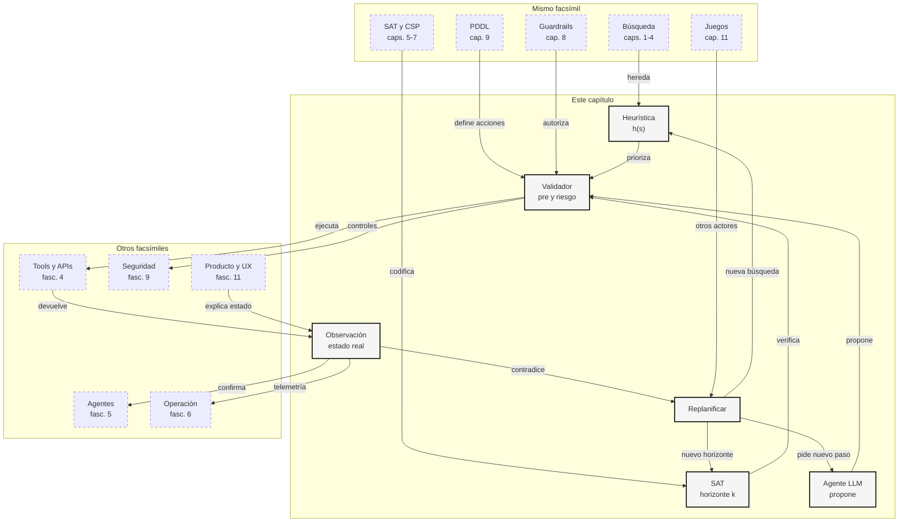

::: {.fasciculo-subtitle}
Facsímil 2 · Inteligencia clásica
:::

# Capítulo 10: Planificación heurística, con SAT y agentes LLM

## Entrando en el tema

En el capítulo anterior construimos un plan pequeño: validar una factura, enviarla y registrar el envío. Tres acciones. Mundo amable. Todo cabía en la cabeza.

Ahora subamos un poco la temperatura. Imagina un agente que prepara una release de software: ejecutar tests, revisar migraciones, comprobar permisos, generar changelog, pedir aprobación si hay riesgo, desplegar en staging, observar logs, desplegar en producción y dejar trazas. Además, cualquier paso puede fallar.

Ahí una lista de tareas ya no basta. Necesitamos decidir qué probar primero, cómo evitar combinaciones absurdas, cuándo preguntar a un solver y cuándo dejar que un LLM proponga el siguiente paso sin convertirlo en autoridad absoluta.

## Tres maneras de no perderse

La planificación clásica enseña una idea sencilla: un plan es una secuencia de acciones aplicables que llega al objetivo. El problema es que las secuencias posibles crecen muy deprisa. Bylander mostró que incluso versiones proposicionales de STRIPS tienen complejidad computacional dura.^[Bylander, T. (1994). The computational complexity of propositional STRIPS planning. *Artificial Intelligence*, 69(1-2), 165-204. https://doi.org/10.1016/0004-3702(94)90081-7]

En la práctica, se suelen combinar tres estrategias:

| Estrategia | Qué hace | Cuándo ayuda |
|---|---|---|
| **Heurística** | Ordena la búsqueda por promesa. | Cuando hay muchas acciones posibles. |
| **SAT** | Pregunta si existe un plan de longitud \(k\). | Cuando queremos una prueba lógica de factibilidad. |
| **Agente LLM** | Propone pasos y explica decisiones. | Cuando el entorno es abierto o lingüístico. |

La clave es no confundir sus papeles. Una heurística orienta, pero puede equivocarse. SAT verifica una codificación, pero necesita un horizonte y un modelo. Un LLM propone y adapta lenguaje, pero sus pasos deben validarse.

Antes de elegir motor, conviene tener una definición mínima. Un plan \(\pi\) no es una intención ni una explicación bonita. Es una secuencia de acciones que transforma estados sin saltarse precondiciones:

$$
\pi=\langle a_0,a_1,\ldots,a_{n-1}\rangle,\quad s_{t+1}=\gamma(s_t,a_t),\quad G\subseteq s_n
$$

| Símbolo | Significado | Ejemplo |
|---|---|---|
| \(\pi\) | Plan completo. | Validar, enviar, registrar. |
| \(a_t\) | Acción elegida en el paso \(t\). | `enviar_factura`. |
| \(\gamma(s_t,a_t)\) | Función de transición: aplica una acción a un estado. | Si la factura está validada, pasa a enviada. |
| \(G\subseteq s_n\) | El estado final contiene todos los objetivos. | Hay email enviado y log creado. |

Si además hay costes, no basta con llegar. También importa cómo llegamos:

$$
C(\pi)=\sum_{t=0}^{n-1}c(a_t)
$$

Un plan de tres pasos puede ser peor que uno de cinco si el tercero manda un email irreversible sin revisión humana. Por eso en sistemas reales solemos mezclar longitud, coste, riesgo, permisos y confianza en la observación.

La misma tarea se ve distinta según la lente:

| Lente | Pregunta que hace | Respuesta útil |
|---|---|---|
| Heurística | ¿Qué estado parece más cerca del objetivo? | “Prueba primero el camino que ya tiene tests y changelog”. |
| SAT | ¿Existe algún plan de \(k\) pasos que cumpla todas las reglas? | “Con \(k=2\) no; con \(k=3\) sí”. |
| Agente LLM | ¿Qué paso tiene sentido proponer con este contexto textual? | “Pide aprobación antes de desplegar porque hay una migración”. |

## Planificación como búsqueda heurística

Podemos leer un planner como un buscador en estados. Desde un estado \(s\), aplicamos acciones válidas y avanzamos. Para no probar todo a ciegas, usamos una función de evaluación:

$$
f(s)=g(s)+h(s)
$$

| Símbolo | Significado | Ejemplo |
|---|---|---|
| \(s\) | Estado candidato durante la búsqueda. | Tests pasados, changelog pendiente. |
| \(g(s)\) | Coste acumulado desde el inicio. | Dos acciones ejecutadas. |
| \(h(s)\) | Estimación del coste restante hasta el objetivo. | Faltan deploy y verificación. |
| \(f(s)\) | Prioridad total del estado. | \(2+2=4\). |

Esta idea conecta con A*, que ya vimos en búsqueda, pero en planificación la heurística suele estimar cuántas acciones faltan o qué hechos objetivo siguen sin cumplirse. Bonet y Geffner formularon la planificación como búsqueda heurística y mostraron cómo estimaciones relativamente simples podían guiar planners hacia soluciones útiles.^[Bonet, B. y Geffner, H. (2001). Planning as heuristic search. *Artificial Intelligence*, 129(1-2), 5-33. https://doi.org/10.1016/S0004-3702(01)00108-4]

**Ejemplo de fórmula.** Una heurística pedagógica muy simple sería contar cuántos objetivos faltan:

$$
h(s)=|G\setminus s|
$$

| Símbolo | Significado | Ejemplo |
|---|---|---|
| \(G\) | Conjunto de hechos objetivo. | `{tests_ok, deploy_hecho, logs_ok}`. |
| \(s\) | Hechos verdaderos ahora. | `{tests_ok}`. |
| \(G\setminus s\) | Objetivos que todavía faltan. | `{deploy_hecho, logs_ok}`. |
| \(|G\setminus s|\) | Número de objetivos pendientes. | \(2\). |

Esta heurística es pobre, pero pedagógica: si un estado ya logró más objetivos, lo miramos antes. No cuenta mutex, recursos, precondiciones ocultas ni coste de acciones; por eso puede ordenar mal. Los planners reales usan heurísticas más informativas, como planes relajados o grafos de planificación. Graphplan introdujo una forma influyente de razonar con grafos de niveles y exclusiones mutuas.^[Blum, A. L. y Furst, M. L. (1997). Fast planning through planning graph analysis. *Artificial Intelligence*, 90(1-2), 281-300. https://doi.org/10.1016/S0004-3702(96)00047-1] FF popularizó heurísticas basadas en planes relajados: ignorar ciertos efectos negativos para estimar una ruta optimista hacia el objetivo.^[Hoffmann, J. y Nebel, B. (2001). The FF planning system: fast plan generation through heuristic search. *Journal of Artificial Intelligence Research*, 14, 253-302. https://doi.org/10.1613/jair.855]

## Planificación con SAT

Otra forma de plantear el problema es fijar un horizonte \(k\): “¿existe un plan de \(k\) pasos o menos?”. En vez de recorrer estados, construimos una fórmula booleana. Si la fórmula es SAT, el modelo nos dice qué acciones ocurren en cada tiempo. Si es UNSAT, no existe plan bajo esa codificación y ese horizonte.

Kautz y Selman hicieron célebre esta idea al formular planificación como satisfacibilidad.^[Kautz, H. A. y Selman, B. (1992). Planning as satisfiability. En *Proceedings of the 10th European Conference on Artificial Intelligence* (pp. 359-363). John Wiley and Sons.]

Podemos resumirlo así:

$$
\Phi_k = I_0 \land T_0 \land T_1 \land \cdots \land T_{k-1} \land G_k
$$

| Símbolo | Significado | Ejemplo |
|---|---|---|
| \(\Phi_k\) | Fórmula SAT del problema con horizonte \(k\). | “¿Hay plan de 3 pasos?”. |
| \(I_0\) | Estado inicial codificado en tiempo 0. | `tests_pendientes@0`. |
| \(T_t\) | Restricciones de transición entre \(t\) y \(t+1\). | Si `deploy@1`, entonces `build_ok@1`. |
| \(G_k\) | Objetivo exigido en el tiempo final. | `produccion_actualizada@3`. |

Las restricciones típicas son:

| Restricción | Forma mental | Qué impide |
|---|---|---|
| Precondición | \(a_t\Rightarrow pre(a)_t\) | Ejecutar acciones sin requisitos. |
| Efecto positivo | \(a_t\Rightarrow add(a)_{t+1}\) | Acciones que no cambian nada. |
| Efecto negativo | \(a_t\Rightarrow \neg del(a)_{t+1}\) | Hechos que sobreviven aunque fueron eliminados. |
| Persistencia | Si nadie cambia \(p\), \(p\) persiste. | Mundos que olvidan hechos arbitrariamente. |
| Mutex | Acciones incompatibles no ocurren juntas. | Dos acciones compiten por el mismo recurso. |

SAT no “entiende” el mundo. Solo decide si la fórmula tiene una asignación que cumple todo. La potencia está en que esa asignación es verificable.

## Agentes LLM: propuesta no es permiso

Los agentes LLM reabren la planificación desde otro ángulo. No siempre tenemos un dominio PDDL completo. A veces el mundo es texto, páginas web, APIs, tickets, ficheros y decisiones humanas. Ahí el LLM es útil para proponer pasos, interpretar observaciones y decidir qué información falta.

ReAct mostró una forma influyente de intercalar razonamiento y actuación: el modelo razona, actúa sobre un entorno, observa y continúa.^[Yao, S., Zhao, J., Yu, D., Du, N., Shafran, I., Narasimhan, K. y Cao, Y. (2023). *ReAct: Synergizing Reasoning and Acting in Language Models*. International Conference on Learning Representations. https://arxiv.org/abs/2210.03629] Toolformer exploró cómo un modelo puede aprender a invocar herramientas externas mediante APIs.^[Schick, T., Dwivedi-Yu, J., Dessì, R., Raileanu, R., Lomeli, M., Zettlemoyer, L., Cancedda, N. y Scialom, T. (2023). Toolformer: Language Models Can Teach Themselves to Use Tools. https://doi.org/10.48550/arXiv.2302.04761]

Pero aquí conviene ser muy estrictos: un agente LLM no sustituye el modelo de planificación. Lo complementa.

| Pieza | En planning clásico | En agente LLM |
|---|---|---|
| Estado | Hechos explícitos. | Contexto, memoria, ficheros, logs. |
| Acción | Operador formal. | Tool call propuesta. |
| Precondición | Fórmula verificable. | Validador antes de ejecutar. |
| Efecto | Add/delete list. | Observación estructurada tras tool. |
| Replanificación | Nueva búsqueda. | Nuevo paso tras observar realidad. |

El patrón sano es:

$$
s_{t+1}=\operatorname{observe}(\operatorname{exec}(a_t,s_t))
$$

| Símbolo | Significado | Ejemplo |
|---|---|---|
| \(s_t\) | Estado antes del paso. | Build verde, deploy pendiente. |
| \(a_t\) | Acción elegida para el paso \(t\). | Ejecutar deploy en staging. |
| \(\operatorname{exec}\) | Ejecución real de la herramienta. | Llamada a CI/CD. |
| \(\operatorname{observe}\) | Lectura verificable del resultado. | Logs, código de salida, métricas. |
| \(s_{t+1}\) | Estado actualizado tras observar. | Staging desplegado o fallo registrado. |

Si \(s_{t+1}\) contradice lo esperado, no seguimos “porque el plan lo decía”. Replanificamos.

<svg xmlns="http://www.w3.org/2000/svg" viewBox="0 0 980 800" role="img" aria-label="Planificación avanzada con heurística, SAT y agentes LLM conectados por validación y observación">
<defs>
<marker id="arrow-planning10" viewBox="0 0 10 10" refX="8" refY="5" markerWidth="7" markerHeight="7" orient="auto-start-reverse">
<path d="M 0 0 L 10 5 L 0 10 z" fill="#111111"/>
</marker>
<pattern id="hatch-planning10" width="8" height="8" patternUnits="userSpaceOnUse" patternTransform="rotate(45)">
<line x1="0" y1="0" x2="0" y2="8" stroke="#E5E5E5" stroke-width="3"/>
</pattern>
</defs>
<rect x="0" y="0" width="980" height="800" rx="10" fill="#FFFFFF" stroke="#111111" stroke-width="2"/>
<text x="490" y="38" text-anchor="middle" font-family="Arial, sans-serif" font-size="23" font-weight="700" fill="#111111">Tres motores para planificar sin ir a ciegas</text>
<text x="490" y="63" text-anchor="middle" font-family="Arial, sans-serif" font-size="13" fill="#555555">Heurística ordena, SAT verifica horizontes y el agente propone pasos bajo validación.</text>

<rect x="46" y="114" width="254" height="206" rx="10" fill="#F5F5F5" stroke="#111111" stroke-width="1.6"/>
<text x="173" y="145" text-anchor="middle" font-family="Arial, sans-serif" font-size="17" font-weight="700" fill="#111111">Búsqueda heurística</text>
<text x="78" y="184" font-family="Georgia, serif" font-size="14" fill="#111111">f(s)=g(s)+h(s)</text>
<text x="78" y="216" font-family="Arial, sans-serif" font-size="11" fill="#555555">prioriza estados prometedores</text>
<text x="78" y="240" font-family="Arial, sans-serif" font-size="11" fill="#555555">usa planes relajados</text>
<text x="78" y="264" font-family="Arial, sans-serif" font-size="11" fill="#555555">reduce exploración inútil</text>

<rect x="362" y="94" width="256" height="246" rx="12" fill="url(#hatch-planning10)" stroke="#111111" stroke-width="1.8"/>
<text x="490" y="126" text-anchor="middle" font-family="Arial, sans-serif" font-size="17" font-weight="700" fill="#111111">SAT por horizonte</text>
<text x="490" y="164" text-anchor="middle" font-family="Georgia, serif" font-size="14" fill="#111111">Φk = I0 ∧ T0...Tk-1 ∧ Gk</text>
<rect x="392" y="194" width="196" height="38" rx="6" fill="#FFFFFF" stroke="#333333"/>
<rect x="392" y="248" width="196" height="38" rx="6" fill="#FFFFFF" stroke="#333333"/>
<text x="490" y="218" text-anchor="middle" font-family="Arial, sans-serif" font-size="11" fill="#111111">k=2 → UNSAT</text>
<text x="490" y="272" text-anchor="middle" font-family="Arial, sans-serif" font-size="11" fill="#111111">k=3 → SAT</text>
<text x="490" y="310" text-anchor="middle" font-family="Arial, sans-serif" font-size="11" fill="#555555">devuelve acciones por tiempo</text>

<rect x="680" y="114" width="254" height="206" rx="10" fill="#FFFFFF" stroke="#111111" stroke-width="1.6"/>
<text x="807" y="145" text-anchor="middle" font-family="Arial, sans-serif" font-size="17" font-weight="700" fill="#111111">Agente LLM</text>
<text x="712" y="184" font-family="Arial, sans-serif" font-size="11" fill="#555555">propone el siguiente paso</text>
<text x="712" y="208" font-family="Arial, sans-serif" font-size="11" fill="#555555">lee observaciones</text>
<text x="712" y="232" font-family="Arial, sans-serif" font-size="11" fill="#555555">explica fallos y alternativas</text>
<text x="712" y="264" font-family="Arial, sans-serif" font-size="11" font-weight="700" fill="#111111">no ejecuta sin validación</text>

<path d="M300 218 H362" stroke="#111111" stroke-width="1.4" marker-end="url(#arrow-planning10)"/>
<path d="M618 218 H680" stroke="#111111" stroke-width="1.4" marker-end="url(#arrow-planning10)"/>
<path d="M807 320 C807 382 632 382 632 438" stroke="#555555" stroke-width="1.4" fill="none" stroke-dasharray="6 5" marker-end="url(#arrow-planning10)"/>
<path d="M173 320 C173 382 348 382 348 438" stroke="#555555" stroke-width="1.4" fill="none" stroke-dasharray="6 5" marker-end="url(#arrow-planning10)"/>
<path d="M490 340 V438" stroke="#111111" stroke-width="1.4" marker-end="url(#arrow-planning10)"/>

<rect x="268" y="438" width="444" height="106" rx="10" fill="#F5F5F5" stroke="#111111" stroke-width="1.7"/>
<text x="490" y="468" text-anchor="middle" font-family="Arial, sans-serif" font-size="17" font-weight="700" fill="#111111">Validador de pasos</text>
<text x="308" y="500" font-family="Arial, sans-serif" font-size="11" fill="#555555">precondiciones · permisos · coste · riesgo · objetivo</text>
<text x="308" y="522" font-family="Arial, sans-serif" font-size="11" fill="#111111">la propuesta se acepta solo si el estado la permite</text>

<path d="M490 544 V604" stroke="#111111" stroke-width="1.5" marker-end="url(#arrow-planning10)"/>
<rect x="268" y="604" width="444" height="86" rx="10" fill="#FFFFFF" stroke="#111111" stroke-width="1.7"/>
<text x="490" y="634" text-anchor="middle" font-family="Arial, sans-serif" font-size="17" font-weight="700" fill="#111111">Ejecutar y observar</text>
<text x="490" y="662" text-anchor="middle" font-family="Arial, sans-serif" font-size="12" fill="#555555">si la observación contradice el plan, se vuelve al motor adecuado</text>

<path d="M268 648 C116 648 116 212 46 212" stroke="#555555" stroke-width="1.3" fill="none" stroke-dasharray="7 5" marker-end="url(#arrow-planning10)"/>
<path d="M712 648 C872 648 872 212 934 212" stroke="#555555" stroke-width="1.3" fill="none" stroke-dasharray="7 5" marker-end="url(#arrow-planning10)"/>
<text x="490" y="730" text-anchor="middle" font-family="Arial, sans-serif" font-size="13" font-weight="700" fill="#111111">El LLM propone; la heurística prioriza; SAT verifica; el sistema observa.</text>
<text x="940" y="776" text-anchor="end" font-family="Arial, sans-serif" font-size="10" fill="#9A9A9A">IA para gente curiosa / Facsímil 02 / Capítulo 10 / 686f6c61</text>
</svg>

## En el día a día

En un equipo que construye agentes, este capítulo se traduce en decisiones muy prácticas. No basta con preguntar al modelo “qué harías ahora”. Hay que decidir qué propuestas pasan a ejecución y cuáles se descartan.

| Situación | Lectura de planificación | Control útil |
|---|---|---|
| Muchas tools posibles | Alto factor de ramificación. | Heurística por coste, riesgo o progreso. |
| Duda sobre si existe plan corto | Horizonte \(k\). | Codificación SAT o búsqueda acotada. |
| Tool crítica | Acción con precondiciones duras. | Guardrails antes de ejecutar. |
| Resultado inesperado | Estado observado distinto. | Replanificación, no insistencia ciega. |

En producción, una buena arquitectura suele separar cuatro capas: el LLM propone, el planificador o política ordena, los validadores autorizan y el monitor observa. Si esas capas se mezclan en un prompt enorme, el sistema puede parecer inteligente en la demo y volverse frágil con usuarios reales.

## Por qué debería importarte

Porque los costes de un mal plan no son solo tokens. Un agente que reintenta sin nueva evidencia consume tiempo, dinero y confianza. Un agente que ejecuta pasos en el orden equivocado puede romper datos. Y un agente que no observa efectos reales vive en una ficción: cree que hizo algo porque lo escribió.

La planificación avanzada no consiste en meter más matemática por gusto. Consiste en elegir qué parte del sistema debe decidir qué. Las heurísticas reducen búsqueda, SAT da verificaciones fuertes para horizontes concretos, y los LLMs aportan flexibilidad lingüística. Juntos funcionan mejor cuando cada uno tiene límites claros.

## Dónde solía tropezar yo

| Error | Por qué es un error | Antídoto |
|---|---|---|
| **Creer que la heurística es una garantía** | Una heurística ordena la búsqueda, no demuestra que un paso sea válido. | Validar precondiciones y efectos después de elegir. |
| **Usar SAT sin mirar la codificación** | SAT solo verifica lo que hemos escrito en la fórmula. | Revisar transiciones, persistencia y mutex. |
| **Pedir al LLM un plan largo y ejecutarlo entero** | El mundo puede cambiar tras el primer paso. | Ejecutar un paso, observar y replanificar. |
| **No contar el coste de las acciones** | El plan más corto puede ser caro o peligroso. | Añadir coste, riesgo y aprobación humana. |
| **Reintentar sin nueva información** | Un bucle no es planificación; es ausencia de criterio de parada. | Registrar observación nueva o escalar. |

## Manos a la obra

La práctica real está en `labs/f2/c10-planning-horizons/`. Compara tres cosas que conviene no mezclar: una heurística que ordena búsqueda, una comprobación por horizonte que dice `SAT/UNSAT` para una longitud concreta y una observación que puede romper el plan tras ejecutar el primer paso.

El caso base parece sencillo: validar, enviar y registrar. Pero el kit añade coste, riesgo irreversible y una observación de mundo real: después de validar, el correo deja de estar confirmado. Con esa observación, el sistema no debe insistir. Debe replanificar o escalar.

| Archivo | Qué contiene |
|---|---|
| `data/planning_horizon_case.json` | Estado inicial, objetivo, acciones, costes y observación de fallo. |
| `contracts/planning_horizon_policy.json` | Horizonte máximo y reglas mínimas de validación. |
| `ops/compare_planning_strategies.py` | Búsqueda heurística, enumeración de horizontes y replanificación. |
| `output/planning_horizon_report.json` | Resultados por horizonte, plan heurístico y replan tras observación. |
| `output/planning_horizon_decision.md` | Informe técnico del experimento. |

Ejecuta:

```bash
cd labs/f2/c10-planning-horizons
python3 ops/compare_planning_strategies.py --write
cat output/planning_horizon_decision.md
```

Como gate:

```bash
python3 ops/compare_planning_strategies.py --write --fail-on-invalid
```

**Qué entregaría un alumno.** El Markdown generado, una acción alternativa con coste alto, una observación que rompa el plan y una decisión escrita: usar heurística, horizonte, aprobación humana o replanificación.

## Cómo encaja todo

Este mapa compara tres formas de no perderse al planificar: una heurística ordena búsqueda, SAT verifica si existe plan para un horizonte concreto y el LLM propone pasos en entornos abiertos. Ninguna pieza debería ocupar el lugar de las otras.

La decisión aprendida es diseñar un bucle donde proponer, validar, ejecutar, observar y replanificar sean fases separadas. Esa arquitectura se reutiliza directamente en agentes y operación.



## Vocabulario aprendido

| Término | Definición |
|---|---|
| **Heurística de planificación** | Estimación del coste restante hasta el objetivo. |
| **Horizonte** | Número máximo de pasos permitido en el plan. |
| **Función de transición** | Regla que calcula el siguiente estado tras aplicar una acción válida. |
| **Planificación con SAT** | Traducción de planning a una fórmula booleana. |
| **Mutex** | Relación de incompatibilidad entre acciones o hechos simultáneos. |
| **Plan relajado** | Estimación optimista que ignora algunos efectos negativos. |
| **Bucle agente** | Ciclo de proponer, validar, ejecutar, observar y replanificar. |

## Antes de pasar página

- [ ] ¿Puedo explicar para qué sirve una heurística en planificación?
- [ ] ¿Distingo una heurística de una garantía lógica?
- [ ] ¿Entiendo qué significa preguntar si \(\Phi_k\) es SAT?
- [ ] ¿Sé nombrar al menos tres restricciones de una codificación SAT de planning?
- [ ] ¿Puedo explicar por qué un agente LLM debe observar antes de seguir?
- [ ] ¿He ejecutado `labs/f2/c10-planning-horizons/` y entendido por qué \(k=2\) es UNSAT?

## En resumen

| Idea fuerza | Detalle |
|---|---|
| La heurística ordena la búsqueda. | Ayuda a mirar primero los estados prometedores, pero no garantiza validez. |
| SAT verifica horizontes. | Si \(\Phi_k\) es SAT, tenemos una asignación coherente de acciones y hechos. |
| El LLM propone, no autoriza. | Sus pasos deben pasar por precondiciones, permisos, coste y observación. |
| La observación manda. | Si el mundo contradice el plan, el sistema debe replanificar. |

## Para saber más

Blum, A. L. y Furst, M. L. (1997). Fast planning through planning graph analysis. *Artificial Intelligence*, 90(1-2), 281-300. https://doi.org/10.1016/S0004-3702(96)00047-1

Bonet, B. y Geffner, H. (2001). Planning as heuristic search. *Artificial Intelligence*, 129(1-2), 5-33. https://doi.org/10.1016/S0004-3702(01)00108-4

Bylander, T. (1994). The computational complexity of propositional STRIPS planning. *Artificial Intelligence*, 69(1-2), 165-204. https://doi.org/10.1016/0004-3702(94)90081-7

Ghallab, M., Nau, D. y Traverso, P. (2004). *Automated Planning: Theory and Practice*. Morgan Kaufmann.

Hoffmann, J. y Nebel, B. (2001). The FF planning system: fast plan generation through heuristic search. *Journal of Artificial Intelligence Research*, 14, 253-302. https://doi.org/10.1613/jair.855

Kautz, H. A. y Selman, B. (1992). Planning as satisfiability. En *Proceedings of the 10th European Conference on Artificial Intelligence* (pp. 359-363). John Wiley and Sons.

Schick, T., Dwivedi-Yu, J., Dessì, R., Raileanu, R., Lomeli, M., Zettlemoyer, L., Cancedda, N. y Scialom, T. (2023). Toolformer: Language Models Can Teach Themselves to Use Tools. https://doi.org/10.48550/arXiv.2302.04761

Yao, S., Zhao, J., Yu, D., Du, N., Shafran, I., Narasimhan, K. y Cao, Y. (2023). *ReAct: Synergizing Reasoning and Acting in Language Models*. International Conference on Learning Representations. https://arxiv.org/abs/2210.03629
