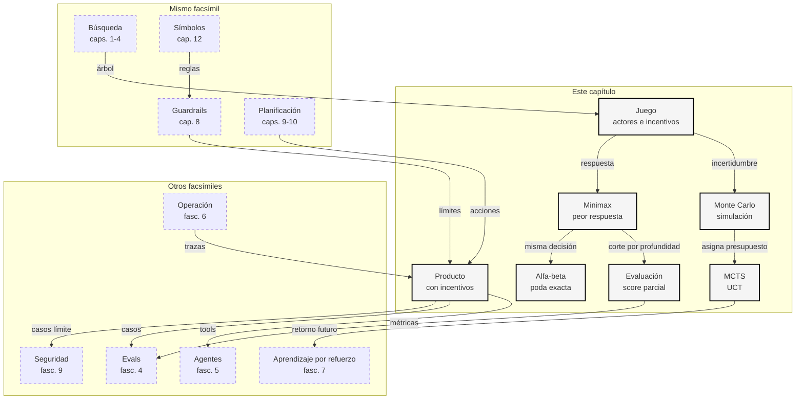

::: {.fasciculo-subtitle}
Facsímil 2 · Inteligencia clásica
:::

# Capítulo 11: Juegos: decidir con otros actores

## Entrando en el tema

Hasta ahora hemos buscado caminos, satisfecho restricciones y construido planes. En todos esos casos el mundo podía ser difícil, pero no necesariamente estaba intentando ganarnos.

Un juego cambia la pregunta. Ya no basta con “¿qué acción me acerca al objetivo?”. Ahora hay que preguntar: “¿qué acción sigue siendo buena cuando otra persona, sistema, regla o instrucción externa reacciona?”.

Esto aparece en sitios muy cotidianos. Un sistema de validación mueve un umbral y los casos límite cambian de forma. Un moderador bloquea una formulación y aparecen rodeos lingüísticos. Un agente con herramientas lee una página web y esa página contiene otra orden que compite con la del usuario. Un competidor responde a tu precio. La distribución no está quieta: aprende de ti.

La teoría de juegos moderna nace con la idea de modelar decisiones interdependientes, popularizada por von Neumann y Morgenstern.^[von Neumann, J. y Morgenstern, O. (1944). *Theory of Games and Economic Behavior*. Princeton University Press.] En IA, los juegos fueron uno de los laboratorios clásicos para estudiar búsqueda con otros actores que responden. Shannon ya formulaba en 1950 cómo programar una computadora para jugar al ajedrez mediante búsqueda, evaluación y elección de jugadas.^[Shannon, C. E. (1950). Programming a computer for playing chess. *The London, Edinburgh, and Dublin Philosophical Magazine and Journal of Science*, 41(314), 256-275. https://doi.org/10.1080/14786445008521796]

## Cuando otro actor también elige

Podemos modelar un juego de forma mínima como:

$$
\mathcal{J}=(S,A,T,u,\tau)
$$

| Símbolo | Significado | Ejemplo |
|---|---|---|
| \(S\) | Estados posibles del juego. | Posiciones de un tablero o estados de un flujo. |
| \(A(s)\) | Acciones legales en el estado \(s\). | Mover pieza, aprobar, bloquear, escalar. |
| \(T(s,a)\) | Transición tras aplicar una acción. | Nuevo tablero o nuevo estado del sistema. |
| \(u(s)\) | Utilidad de un resultado. | Ganar \(+1\), perder \(-1\), coste alto \(-5\). |
| \(\tau(s)\) | Jugador que decide en ese estado. | MAX, MIN, usuario, sistema. |

La diferencia con la planificación del capítulo anterior es sutil pero enorme: la transición ya no depende solo de mis acciones. También depende de respuestas.

| Problema | Pregunta central | Riesgo si lo olvidas |
|---|---|---|
| Búsqueda | ¿Cómo llego al objetivo? | Explorar demasiado. |
| Planificación | ¿Qué secuencia es ejecutable? | Saltarte precondiciones. |
| Juego | ¿Qué pasa si alguien responde con un objetivo distinto? | Diseñar solo para el caso feliz. |

En un juego de suma cero, lo que MAX gana lo pierde MIN. Muchos productos reales no son suma cero pura, pero el modelo sigue siendo útil como gimnasia mental: obliga a imaginar al actor que persigue un objetivo propio.

Antes de seguir con fórmulas, bajémoslo a escenas reconocibles:

| Escena | Qué eliges tú | Qué elige la otra parte | Qué enseña |
|---|---|---|---|
| Trabajo de clase | Escribir una respuesta rápida. | La rúbrica exige justificar pasos. | No optimices solo velocidad. |
| Agente con correo | Resumir un email. | El email contiene otra orden. | Datos e instrucciones no son lo mismo. |
| Soporte | Cerrar un ticket. | El usuario vuelve si no resolviste la causa. | El resultado real llega después. |
| Planificación de turnos | Dar el turno preferido a alguien. | Otra regla exige cubrir una franja crítica. | Hay objetivos que compiten. |
| Producto con precios | Bajar el precio. | Clientes y competidores reajustan conducta. | Una acción cambia el entorno. |

La palabra “juego” no significa pelea. Significa interdependencia: mi decisión modifica tus opciones, y tu respuesta modifica el valor de mi decisión.

## Minimax: elegir contra una respuesta buena

Minimax es la versión más limpia de esta idea. MAX quiere maximizar la utilidad. MIN quiere minimizarla. La función de valor se define recursivamente:

$$
V(s)=
\begin{cases}
u(s) & \text{si }s\text{ es terminal}\\
\max_{a\in A(s)}V(T(s,a)) & \text{si }\tau(s)=MAX\\
\min_{a\in A(s)}V(T(s,a)) & \text{si }\tau(s)=MIN
\end{cases}
$$

| Pieza | Lectura sencilla | Ejemplo |
|---|---|---|
| Hoja terminal | Resultado ya evaluado. | Victoria, derrota, caso resuelto. |
| Turno de MIN | La otra parte elige tu peor continuación. | Una instrucción externa compite con la orden principal. |
| Turno de MAX | Tú eliges la mejor garantía. | Control que sigue bien ante respuestas distintas. |
| Valor de raíz | Decisión recomendada. | Acción robusta, no acción optimista. |

La enseñanza importante no es que todos los otros actores sean perfectos. Es que una decisión no se evalúa sola. Se evalúa por el árbol de respuestas que permite.

Si una acción parece brillante solo cuando nadie reacciona, no era una buena acción: era un deseo.

Ejemplo cercano: un agente puede hacer tres cosas con una herramienta delicada.

| Acción de MAX | Si todo va fácil | Si aparece una instrucción conflictiva | Valor minimax | Lectura humana |
|---|---:|---:|---:|---|
| `seguir_automatico` | \(+9\) | \(-8\) | \(-8\) | Brilla en el caso cómodo, pero se cae cuando hay tensión. |
| `pedir_revision` | \(+7\) | \(+3\) | \(+3\) | Más lento, pero razonable. |
| `limitar_tool` | \(+5\) | \(+4\) | \(+4\) | No es espectacular, pero aguanta mejor. |

Minimax elegiría `limitar_tool`: no porque sea la opción más vistosa, sino porque su resultado garantizado es mejor. Esta es la idea que quiero que te lleves: a veces la decisión madura no maximiza el mejor caso, sino que cuida el caso difícil.

## Poda alfa-beta: no mirar lo que ya no decide

Minimax exacto puede crecer como una bestia:

$$
O(b^d)
$$

| Símbolo | Significado | Ejemplo |
|---|---|---|
| \(b\) | Factor de ramificación: acciones por estado. | 30 jugadas posibles. |
| \(d\) | Profundidad explorada. | 6 turnos. |
| \(b^d\) | Nodos aproximados a explorar. | \(30^6\), demasiado grande. |

La poda alfa-beta llega con una idea preciosa: no cambia la respuesta de minimax, cambia cuánto trabajo hace para encontrarla. Knuth y Moore analizaron formalmente esta técnica y su dependencia del orden de exploración.^[Knuth, D. E. y Moore, R. W. (1975). An analysis of alpha-beta pruning. *Artificial Intelligence*, 6(4), 293-326. https://doi.org/10.1016/0004-3702(75)90019-3]

Mantenemos dos límites:

$$
\alpha=\text{mejor valor garantizado para MAX},\quad
\beta=\text{mejor valor garantizado para MIN}
$$

Una rama se poda cuando:

$$
\alpha\geq\beta
$$

| Concepto | Qué significa | Intuición |
|---|---|---|
| \(\alpha\) | MAX ya tiene una alternativa al menos así de buena. | “No acepto menos que esto”. |
| \(\beta\) | MIN ya puede forzar una alternativa al menos así de mala para MAX. | “La otra parte no me dejará mejorar por aquí”. |
| \(\alpha\geq\beta\) | La rama no puede cambiar la decisión. | Cortamos sin perder exactitud. |
| Orden de acciones | Qué rama miramos primero. | Buen orden produce más poda. |

En agentes modernos, esta idea se parece a no gastar herramientas caras, llamadas a modelos o exploraciones que ya no pueden cambiar la decisión. Para podar necesitas límites parciales: coste, riesgo, probabilidad, permisos o valor esperado.

Siguiendo el ejemplo anterior, imagina que ya evaluamos `limitar_tool` y sabemos que garantiza \(4\). Ese \(4\) se convierte en \(\alpha\): MAX ya tiene una alternativa aceptable.

Ahora exploramos `seguir_automatico`. La primera respuesta posible nos da \(-8\). Como estamos en turno de MIN, la otra parte puede quedarse con ese \(-8\). Da igual que todavía exista una rama cómoda con \(+9\): MIN no tiene por qué escogerla. Esa rama ya no puede superar el \(4\) garantizado de `limitar_tool`, así que podemos cortarla.

| Momento | Qué sabemos | Qué hacemos |
|---|---|---|
| Ya vimos `limitar_tool` | MAX puede garantizar \(4\). | \(\alpha=4\). |
| Entramos en `seguir_automatico` | MIN encuentra una continuación con \(-8\). | \(\beta=-8\). |
| Comparamos | \(\alpha=4\geq\beta=-8\). | Podamos lo que queda de esa rama. |
| Resultado | La decisión no cambia. | Ahorramos exploración. |

En clase suele costar porque parece contraintuitivo: “¿cómo voy a ignorar una rama que podría tener \(+9\)?”. La respuesta es que esa rama depende de que MIN quiera ayudarte. Minimax no asume eso.

## Funciones de evaluación

No siempre podemos llegar al final del árbol. En ajedrez, en Go, en un flujo de revisión o en un agente con herramientas, la profundidad útil se acaba antes que el mundo. **Ejemplo de fórmula.** Entonces podemos usar una función de evaluación. La forma lineal siguiente es una plantilla habitual para explicar la idea, pero en un sistema real las señales, pesos y escala se aprenden, se ajustan o se validan contra partidas, simulaciones o decisiones históricas:

$$
\operatorname{Eval}(s)=\sum_i w_i\phi_i(s)
$$

| Símbolo | Significado | Ejemplo |
|---|---|---|
| \(\phi_i(s)\) | Señal observable del estado. | Riesgo, coste, evidencia, satisfacción. |
| \(w_i\) | Peso de esa señal. | Seguridad pesa más que velocidad. |
| \(\operatorname{Eval}(s)\) | Puntuación aproximada del estado. | Estado prometedor o peligroso. |

La función de evaluación es conocimiento del dominio convertido en número. Ahí está su poder y su peligro: si eliges señales pobres, el algoritmo optimiza una caricatura del problema. Si eliges señales medibles y las validas contra casos reales, la evaluación se vuelve una pieza de ingeniería, no una opinión.

| Dominio | Señales útiles | Error típico |
|---|---|---|
| Ajedrez | Material, movilidad, seguridad del rey. | Capturar material y dejar mate. |
| Soporte | Resolución, satisfacción, coste, riesgo. | Cerrar tickets rápido sin resolver. |
| RAG | Relevancia, evidencia, cita, actualidad. | Respuesta fluida sin soporte. |
| Seguridad | Impacto, probabilidad, detectabilidad. | Optimizar falsos positivos y dejar casos importantes fuera. |

Si premias mal, el sistema buscará bien lo equivocado. Esa frase conviene tenerla muy subrayada.

Una forma de empatizar con esto es pensar en una rúbrica. Si en un examen solo puntúas que el resultado final sea correcto, alguien puede acertar por casualidad y parecer competente. Si también puntúas pasos, unidades, justificación y límites, la evaluación se parece más a lo que realmente querías medir.

| Sistema | Señal que parece buena | Lo que faltaba medir |
|---|---|---|
| Agente de soporte | Ticket cerrado rápido. | Reapertura, satisfacción y evidencia. |
| Respuesta RAG | Texto convincente. | Citas, actualidad y trazabilidad. |
| Moderación | Pocas revisiones manuales. | Casos dudosos que el sistema dejó pasar. |
| Agente con tools | Tarea completada. | Coste, permisos y reversibilidad. |

La función de evaluación siempre educa al sistema. Si educas con una señal pobre, no te sorprendas de recibir un comportamiento pobre con buena presentación.

## Monte Carlo: decidir simulando

Monte Carlo acepta una concesión: quizá no puedo calcular el árbol completo, pero puedo simular muchas trayectorias y estimar el valor medio de una acción.

$$
\hat V(a)=\frac{1}{n}\sum_{i=1}^{n}R_i
$$

| Símbolo | Significado | Ejemplo |
|---|---|---|
| \(a\) | Acción que estamos estimando. | Limitar una herramienta. |
| \(R_i\) | Retorno observado en la simulación \(i\). | Resultado de un caso simulado. |
| \(n\) | Número de simulaciones. | 100, 1 000, 10 000. |
| \(\hat V(a)\) | Valor medio estimado. | Calidad esperada de la acción. |

La incertidumbre baja despacio:

$$
\operatorname{error}\approx \frac{\sigma}{\sqrt n}
$$

Cuadruplicar simulaciones no divide el error entre cuatro; lo divide aproximadamente entre dos. Esta humildad estadística es importante. Monte Carlo no convierte un simulador malo en verdad: solo estima bien lo que el simulador representa.

Ejemplo: antes de permitir que un agente ejecute una herramienta, simulas conversaciones con tres políticas.

| Política | Simulaciones observadas | Media | Lectura |
|---|---|---:|---|
| `limitar_tool` | 4, 5, 4, 3, 4, 5 | 4,17 | Bastante estable. |
| `seguir_automatico` | 9, -8, -8, 2, -8, 9 | -0,67 | Puede ir muy bien o muy mal. |
| `pedir_revision` | 3, 7, 3, 6, 3, 7 | 4,83 | Buena media, con coste operativo. |

Monte Carlo te ayuda a ver distribución, no solo una historia. Si solo miras el primer \(9\), `seguir_automatico` parece brillante. Si miras varias trayectorias, aparece la fragilidad.

## MCTS: explorar y explotar

Monte Carlo Tree Search añade una pregunta: si tengo presupuesto limitado, ¿dónde simulo?

La respuesta clásica es equilibrar explotación y exploración. Kocsis y Szepesvári propusieron UCT, que aplica ideas de bandidos multi-brazo al árbol de búsqueda.^[Kocsis, L. y Szepesvári, C. (2006). Bandit based Monte-Carlo planning. En *Machine Learning: ECML 2006* (LNCS 4212, pp. 282-293). Springer. https://doi.org/10.1007/11871842_29] Browne y colaboradores ofrecen una revisión amplia de MCTS y sus variantes.^[Browne, C. B., Powley, E., Whitehouse, D., Lucas, S. M., Cowling, P. I., Rohlfshagen, P., Tavener, S., Perez, D., Samothrakis, S. y Colton, S. (2012). A survey of Monte Carlo Tree Search methods. *IEEE Transactions on Computational Intelligence and AI in Games*, 4(1), 1-43. https://doi.org/10.1109/TCIAIG.2012.2186810]

Una forma habitual de seleccionar acción es:

$$
UCT(s,a)=Q(s,a)+c\sqrt{\frac{\ln N(s)}{N(s,a)}}
$$

| Símbolo | Significado | Intuición |
|---|---|---|
| \(Q(s,a)\) | Valor medio observado de la acción. | Explotar lo que va bien. |
| \(N(s)\) | Visitas al estado. | Cuánto sabemos del nodo padre. |
| \(N(s,a)\) | Veces que probamos esa acción. | Cuánto sabemos de esa rama. |
| \(c\) | Peso de exploración. | Más alto: más curiosidad. |

El primer término explota: elige acciones con buena media. El segundo explora: empuja ramas poco visitadas para no casarnos demasiado pronto con la primera señal buena.

En una clase, esto se parece a preparar un examen. Si siempre estudias el tema que ya te sale bien, explotas. Si dedicas algo de tiempo al tema que apenas has mirado, exploras. MCTS formaliza ese equilibrio: profundiza donde hay señal, pero reserva presupuesto para descubrir sorpresas.

| Situación | Explotar | Explorar |
|---|---|---|
| Agente con tools | Probar más la política que ya funciona. | Revisar una tool poco usada pero crítica. |
| Producto | Optimizar el flujo con mejor conversión. | Probar una variante nueva con pocos datos. |
| Evaluación | Añadir casos parecidos a los conocidos. | Buscar casos límite que no aparecen en la muestra. |
| Estudio | Repasar lo que dominas. | Entrenar el punto que todavía te incomoda. |

Por eso \(c\) importa tanto en UCT. Si \(c\) es pequeño, el sistema se queda cerca de lo que ya parece bueno. Si \(c\) es grande, se permite investigar más. No hay valor universal: depende del coste de equivocarte y de cuánto te duela no descubrir una opción mejor.

## Simular con LLMs no es lo mismo

Un LLM puede generar escenarios, usuarios sintéticos, instrucciones alternativas o diálogos de prueba. Eso es útil. Pero no debemos confundir plausibilidad textual con muestra estadística de un proceso real.

| Uso de LLM | Sí aporta | No demuestra |
|---|---|---|
| Pruebas de tensión | Ideas de casos límite y variaciones de instrucción. | Frecuencia real de esos casos. |
| Producto | Objeciones y casos límite. | Conversión esperada. |
| Soporte | Tickets sintéticos para ampliar criterios. | Distribución real de incidencias. |
| Evals | Casos iniciales para cubrir huecos. | Calidad final sin datos reales. |

La regla práctica: usa el LLM para descubrir hipótesis; usa datos, experimentos, revisión humana o simuladores formales para justificar decisiones.

## Decisión con instrucciones en tensión

La conexión con agentes modernos es directa. Un sistema que llama herramientas tiene superficie de interacción. Documentos recuperados, páginas web, tickets, correos o entradas de usuario pueden contener instrucciones que compiten con la tarea principal.

Fecha de corte: 10 de junio de 2026. En esta sección uso OWASP 2025 como marco de riesgos vigente para aplicaciones con LLM, pero lo importante para este capítulo no es memorizar una lista concreta: es aprender a modelar instrucciones externas, permisos, presupuesto y acciones excesivas como respuestas posibles dentro del árbol de decisión.

OWASP incluye riesgos específicos de aplicaciones con LLM, como instrucciones no confiables, exposición de datos, uso inseguro de salidas y acciones excesivas de agentes.^[OWASP Foundation. (2025). *OWASP Top 10 for LLM and Generative AI Applications 2025*. https://genai.owasp.org/] Visto desde juegos, eso significa que una instrucción externa no es ruido: es otra fuerza dentro del sistema.

| Control | Pregunta de tensión |
|---|---|
| Permisos mínimos | ¿Qué pasa si el modelo intenta una herramienta que no debería? |
| Separar datos e instrucciones | ¿Un documento recuperado puede dar órdenes al agente? |
| Límites de presupuesto | ¿Pueden forzar llamadas infinitas o caras? |
| Trazas | ¿Verás una desviación antes de que tenga efecto real? |
| Pruebas de tensión continuas | ¿Tu eval incluye casos nuevos o solo los de lanzamiento? |

## Puente hacia aprendizaje por refuerzo

Juegos, MCTS y aprendizaje por refuerzo comparten una pregunta: qué acción conviene ahora para mejorar el valor futuro.

Sutton y Barto formulan el retorno como acumulación de recompensas, normalmente descontadas.^[Sutton, R. S. y Barto, A. G. (2018). *Reinforcement Learning: An Introduction* (2.ª ed.). MIT Press. https://incompleteideas.net/book/the-book-2nd.html]

$$
G_t=\sum_{k=0}^{\infty}\gamma^k r_{t+k+1}
$$

| Símbolo | Significado | Ejemplo |
|---|---|---|
| \(G_t\) | Retorno desde el tiempo \(t\). | Valor futuro de una política. |
| \(r_{t+k+1}\) | Recompensa futura. | Éxito, coste, seguridad, satisfacción. |
| \(\gamma\) | Factor de descuento. | Cuánto importa el futuro lejano. |
| Política | Regla para elegir acciones. | Modelo + reglas + routing + permisos. |

Esto prepara el terreno para capítulos posteriores: no evaluaremos solo respuestas aisladas, sino comportamiento a lo largo de una trayectoria.

<svg xmlns="http://www.w3.org/2000/svg" viewBox="0 0 1000 820" role="img" aria-label="Mapa visual de juegos, minimax, poda alfa-beta, MCTS y decisiones con otros actores">
<defs>
<marker id="arrow-games11" viewBox="0 0 10 10" refX="8" refY="5" markerWidth="7" markerHeight="7" orient="auto-start-reverse">
<path d="M 0 0 L 10 5 L 0 10 z" fill="#111111"/>
</marker>
<pattern id="hatch-games11" width="8" height="8" patternUnits="userSpaceOnUse" patternTransform="rotate(45)">
<line x1="0" y1="0" x2="0" y2="8" stroke="#E5E5E5" stroke-width="3"/>
</pattern>
</defs>
<rect x="0" y="0" width="1000" height="820" rx="10" fill="#FFFFFF" stroke="#111111" stroke-width="2"/>
<text x="500" y="38" text-anchor="middle" font-family="Arial, sans-serif" font-size="24" font-weight="700" fill="#111111">Decidir cuando alguien responde</text>
<text x="500" y="64" text-anchor="middle" font-family="Arial, sans-serif" font-size="13" fill="#555555">Minimax garantiza, alfa-beta poda, MCTS simula y producto pregunta por incentivos.</text>
<rect x="40" y="104" width="410" height="330" rx="10" fill="#F5F5F5" stroke="#111111" stroke-width="1.8"/>
<text x="245" y="134" text-anchor="middle" font-family="Arial, sans-serif" font-size="18" font-weight="700" fill="#111111">Árbol con respuestas</text>
<circle cx="245" cy="178" r="28" fill="#FFFFFF" stroke="#111111" stroke-width="1.7"/>
<text x="245" y="174" text-anchor="middle" font-family="Arial, sans-serif" font-size="12" font-weight="700" fill="#111111">MAX</text>
<text x="245" y="190" text-anchor="middle" font-family="Arial, sans-serif" font-size="10" fill="#555555">elige</text>
<circle cx="115" cy="278" r="27" fill="#FFFFFF" stroke="#111111" stroke-width="1.5"/>
<circle cx="245" cy="278" r="27" fill="#FFFFFF" stroke="#111111" stroke-width="1.5"/>
<circle cx="375" cy="278" r="27" fill="#FFFFFF" stroke="#111111" stroke-width="1.5"/>
<text x="115" y="283" text-anchor="middle" font-family="Arial, sans-serif" font-size="12" font-weight="700" fill="#111111">MIN</text>
<text x="245" y="283" text-anchor="middle" font-family="Arial, sans-serif" font-size="12" font-weight="700" fill="#111111">MIN</text>
<text x="375" y="283" text-anchor="middle" font-family="Arial, sans-serif" font-size="12" font-weight="700" fill="#111111">MIN</text>
<path d="M225 199 L134 258" stroke="#111111" stroke-width="1.3" marker-end="url(#arrow-games11)"/>
<path d="M245 206 L245 250" stroke="#111111" stroke-width="1.3" marker-end="url(#arrow-games11)"/>
<path d="M265 199 L356 258" stroke="#111111" stroke-width="1.3" marker-end="url(#arrow-games11)"/>
<rect x="68" y="354" width="52" height="34" rx="6" fill="#FFFFFF" stroke="#333333"/>
<rect x="132" y="354" width="52" height="34" rx="6" fill="#FFFFFF" stroke="#333333"/>
<rect x="198" y="354" width="52" height="34" rx="6" fill="#FFFFFF" stroke="#333333"/>
<rect x="262" y="354" width="52" height="34" rx="6" fill="#FFFFFF" stroke="#333333"/>
<rect x="328" y="354" width="52" height="34" rx="6" fill="#FFFFFF" stroke="#333333"/>
<rect x="392" y="354" width="32" height="34" rx="6" fill="#FFFFFF" stroke="#333333"/>
<text x="94" y="376" text-anchor="middle" font-family="Arial, sans-serif" font-size="12" fill="#111111">5</text>
<text x="158" y="376" text-anchor="middle" font-family="Arial, sans-serif" font-size="12" fill="#111111">4</text>
<text x="224" y="376" text-anchor="middle" font-family="Arial, sans-serif" font-size="12" fill="#111111">-8</text>
<text x="288" y="376" text-anchor="middle" font-family="Arial, sans-serif" font-size="12" fill="#111111">9</text>
<text x="354" y="376" text-anchor="middle" font-family="Arial, sans-serif" font-size="12" fill="#111111">3</text>
<text x="408" y="376" text-anchor="middle" font-family="Arial, sans-serif" font-size="12" fill="#111111">7</text>
<path d="M106 304 L94 354" stroke="#111111" stroke-width="1.2"/>
<path d="M124 304 L158 354" stroke="#111111" stroke-width="1.2"/>
<path d="M236 304 L224 354" stroke="#111111" stroke-width="1.2"/>
<path d="M254 304 L288 354" stroke="#111111" stroke-width="1.2"/>
<path d="M366 304 L354 354" stroke="#111111" stroke-width="1.2"/>
<path d="M384 304 L408 354" stroke="#111111" stroke-width="1.2"/>
<path d="M280 344 L300 392" stroke="#555555" stroke-width="2.2"/>
<path d="M302 344 L280 392" stroke="#555555" stroke-width="2.2"/>
<path d="M400 344 L420 392" stroke="#555555" stroke-width="2.2"/>
<path d="M422 344 L400 392" stroke="#555555" stroke-width="2.2"/>
<text x="245" y="418" text-anchor="middle" font-family="Arial, sans-serif" font-size="12" fill="#555555">MIN propaga mínimos; MAX elige la mejor garantía.</text>
<rect x="502" y="104" width="454" height="330" rx="10" fill="#FFFFFF" stroke="#111111" stroke-width="1.8"/>
<text x="729" y="134" text-anchor="middle" font-family="Arial, sans-serif" font-size="18" font-weight="700" fill="#111111">MCTS con presupuesto</text>
<rect x="645" y="166" width="168" height="44" rx="8" fill="#F5F5F5" stroke="#111111"/>
<rect x="782" y="254" width="138" height="44" rx="8" fill="#FFFFFF" stroke="#111111"/>
<rect x="645" y="342" width="168" height="44" rx="8" fill="#F5F5F5" stroke="#111111"/>
<rect x="540" y="254" width="138" height="44" rx="8" fill="#FFFFFF" stroke="#111111"/>
<text x="729" y="194" text-anchor="middle" font-family="Arial, sans-serif" font-size="12" font-weight="700" fill="#111111">Seleccionar</text>
<text x="851" y="282" text-anchor="middle" font-family="Arial, sans-serif" font-size="12" font-weight="700" fill="#111111">Expandir</text>
<text x="729" y="370" text-anchor="middle" font-family="Arial, sans-serif" font-size="12" font-weight="700" fill="#111111">Simular</text>
<text x="609" y="282" text-anchor="middle" font-family="Arial, sans-serif" font-size="12" font-weight="700" fill="#111111">Actualizar</text>
<path d="M813 188 C864 188 876 218 862 254" stroke="#111111" stroke-width="1.4" fill="none" marker-end="url(#arrow-games11)"/>
<path d="M851 298 C851 331 814 348 813 360" stroke="#111111" stroke-width="1.4" fill="none" marker-end="url(#arrow-games11)"/>
<path d="M645 364 C593 364 582 326 604 298" stroke="#111111" stroke-width="1.4" fill="none" marker-end="url(#arrow-games11)"/>
<path d="M609 254 C590 214 618 188 645 188" stroke="#111111" stroke-width="1.4" fill="none" marker-end="url(#arrow-games11)"/>
<text x="729" y="244" text-anchor="middle" font-family="Georgia, serif" font-size="14" fill="#111111">Q(s,a)+c√(ln N / Nₐ)</text>
<text x="729" y="416" text-anchor="middle" font-family="Arial, sans-serif" font-size="12" fill="#555555">Más valor medio, pero también curiosidad por ramas poco visitadas.</text>
<rect x="92" y="480" width="816" height="206" rx="12" fill="url(#hatch-games11)" stroke="#111111" stroke-width="1.8"/>
<text x="500" y="512" text-anchor="middle" font-family="Arial, sans-serif" font-size="18" font-weight="700" fill="#111111">Lectura de producto</text>
<rect x="132" y="552" width="160" height="70" rx="8" fill="#FFFFFF" stroke="#111111"/>
<rect x="318" y="552" width="160" height="70" rx="8" fill="#FFFFFF" stroke="#111111"/>
<rect x="504" y="552" width="160" height="70" rx="8" fill="#FFFFFF" stroke="#111111"/>
<rect x="690" y="552" width="160" height="70" rx="8" fill="#FFFFFF" stroke="#111111"/>
<text x="212" y="580" text-anchor="middle" font-family="Arial, sans-serif" font-size="13" font-weight="700" fill="#111111">Incentivo</text>
<text x="212" y="602" text-anchor="middle" font-family="Arial, sans-serif" font-size="11" fill="#555555">qué gana el otro</text>
<text x="398" y="580" text-anchor="middle" font-family="Arial, sans-serif" font-size="13" font-weight="700" fill="#111111">Capacidad</text>
<text x="398" y="602" text-anchor="middle" font-family="Arial, sans-serif" font-size="11" fill="#555555">qué puede probar</text>
<text x="584" y="580" text-anchor="middle" font-family="Arial, sans-serif" font-size="13" font-weight="700" fill="#111111">Superficie</text>
<text x="584" y="602" text-anchor="middle" font-family="Arial, sans-serif" font-size="11" fill="#555555">inputs y tools</text>
<text x="770" y="580" text-anchor="middle" font-family="Arial, sans-serif" font-size="13" font-weight="700" fill="#111111">Respuesta</text>
<text x="770" y="602" text-anchor="middle" font-family="Arial, sans-serif" font-size="11" fill="#555555">cómo se adapta</text>
<path d="M292 587 H318" stroke="#111111" stroke-width="1.3" marker-end="url(#arrow-games11)"/>
<path d="M478 587 H504" stroke="#111111" stroke-width="1.3" marker-end="url(#arrow-games11)"/>
<path d="M664 587 H690" stroke="#111111" stroke-width="1.3" marker-end="url(#arrow-games11)"/>
<text x="500" y="660" text-anchor="middle" font-family="Arial, sans-serif" font-size="12" fill="#555555">Si otra orden o incentivo puede cambiar el resultado, modela el juego.</text>
<text x="500" y="742" text-anchor="middle" font-family="Arial, sans-serif" font-size="13" font-weight="700" fill="#111111">La pregunta no es solo “qué hago”, sino “qué respuesta habilito”.</text>
<text x="960" y="792" text-anchor="end" font-family="Arial, sans-serif" font-size="10" fill="#9A9A9A">IA para gente curiosa / Facsímil 02 / Capítulo 11 / 686f6c61</text>
</svg>

## En el día a día

La mentalidad de juegos cambia cómo diseñamos sistemas con IA.

| Situación | Lectura de juego | Control útil |
|---|---|---|
| Usuario bordea una política. | MIN representa la respuesta que presiona tu regla. | Evals de tensión y trazas. |
| Agente lee contenido externo. | El documento puede traer otra instrucción. | Separar instrucciones de datos. |
| Tool cara o irreversible. | Una entrada externa puede forzar coste o efecto no deseado. | Presupuesto, permisos y aprobación humana. |
| Métrica fácil de manipular. | El sistema optimiza el marcador, no el objetivo. | Métricas compuestas y revisión. |

Cuando una decisión importante depende de cómo responde otra parte, diseña como si estuvieras jugando una partida. No por paranoia: por respeto a la realidad.

## Por qué debería importarte

Porque muchos fallos de IA no ocurren en el primer uso feliz. Ocurren cuando alguien descubre cómo responde el sistema y empieza a optimizar contra esa respuesta.

Si tu agente siempre confía en el documento recuperado, el documento se vuelve un canal de instrucciones. Si tu moderador solo detecta palabras obvias, los rodeos cambian de forma. Si tu eval premia rapidez, el agente aprende atajos. Si tu política no limita presupuesto, una conversación puede acabar en una acción costosa.

Los juegos enseñan a preguntar por el segundo movimiento.

## Dónde solía tropezar yo

| Error | Por qué es un error | Antídoto |
|---|---|---|
| **Evaluar solo la acción propia** | La calidad depende de la respuesta que habilita. | Dibujar al menos un turno del otro actor. |
| **Pensar que minimax describe a toda persona** | No todo usuario es racional ni persigue un objetivo opuesto. | Usarlo como caso de tensión, no como psicología humana. |
| **Creer que alfa-beta cambia la decisión** | La poda exacta conserva el resultado de minimax. | Separar semántica de eficiencia. |
| **Usar Monte Carlo con simulador débil** | Simular mucho no corrige un modelo malo del mundo. | Validar el simulador con datos reales. |
| **Tratar al LLM como simulador estadístico** | Genera plausibilidad, no muestras independientes. | Usarlo para hipótesis; contrastar con evidencia. |
| **Diseñar solo para el usuario ideal** | Los sistemas reales tienen incentivos, fricción y órdenes en conflicto. | Preguntar qué cambia si el sistema falla. |

## Manos a la obra

La práctica real está en `labs/f2/c11-game-search-audit/`. El kit compara minimax, alfa-beta, medias Monte Carlo y UCT sobre el mismo árbol de decisión. El escenario no habla de un oponente caricaturesco: habla de otro actor, otro sistema o un entorno que puede responder de forma desfavorable.

El aprendizaje útil es que la decisión cambia según el criterio. Minimax protege el peor caso. Monte Carlo estima comportamiento medio. UCT decide dónde gastar más simulación. Alfa-beta no cambia la respuesta exacta de minimax; solo evita mirar ramas que ya no pueden mejorar la decisión.

| Archivo | Qué contiene |
|---|---|
| `data/game_tree.json` | Árbol de decisiones, utilidades terminales, rollouts y visitas UCT. |
| `contracts/game_policy.json` | Constante UCT y checks mínimos de poda/consistencia. |
| `ops/audit_game_search.py` | Minimax, alfa-beta, media Monte Carlo y UCT. |
| `output/game_search_report.json` | Scores, hojas visitadas, podas, medias y UCT. |
| `output/game_search_decision.md` | Lectura técnica para defender la decisión. |

Ejecuta:

```bash
cd labs/f2/c11-game-search-audit
python3 ops/audit_game_search.py --write
cat output/game_search_decision.md
```

Como gate:

```bash
python3 ops/audit_game_search.py --write --fail-on-invalid
```

**Qué entregaría un alumno.** El Markdown generado, un nodo nuevo con utilidades terminales, una comparación entre minimax y Monte Carlo y una decisión escrita: optimizar peor caso, media, revisión humana o más simulación.

## Cómo encaja todo

Este mapa añade una capa que no estaba en la planificación simple: otras personas, sistemas, reglas o instrucciones también pueden responder. Por eso aparecen minimax, poda alfa-beta, evaluación, Monte Carlo y MCTS.

La decisión aprendida es no evaluar solo el primer movimiento. Hay que mirar qué respuestas habilita una acción, qué peor caso toleras y cuándo merece la pena simular más.



## Vocabulario aprendido

| Término | Definición |
|---|---|
| **Juego con otros actores** | Decisión donde otras partes responden con objetivos propios. |
| **Utilidad** | Valor numérico de un resultado para un jugador. |
| **Estrategia** | Regla para elegir acciones según estado e información. |
| **Minimax** | Elección con mejor valor garantizado ante respuesta óptima de MIN. |
| **Poda alfa-beta** | Descarte de ramas que no pueden cambiar la decisión de minimax. |
| **Función de evaluación** | Heurística que puntúa estados no terminales. |
| **Monte Carlo** | Estimación por simulaciones repetidas. |
| **MCTS** | Búsqueda en árbol que reparte simulaciones de forma adaptativa. |
| **UCT** | Fórmula que mezcla valor observado y exploración de ramas poco visitadas. |
| **Retorno** | Recompensa acumulada futura de una trayectoria. |

## Antes de pasar página

- [ ] ¿Puedo explicar por qué un juego no es una búsqueda normal?
- [ ] ¿Entiendo la recursión de minimax para MAX y MIN?
- [ ] ¿Sé qué representan \(\alpha\) y \(\beta\)?
- [ ] ¿Distingo función de evaluación de utilidad terminal?
- [ ] ¿Puedo explicar qué estima Monte Carlo y qué no demuestra?
- [ ] ¿Entiendo por qué MCTS necesita explorar y explotar?
- [ ] ¿Puedo traducir un problema de producto a actores, incentivos y respuestas?

## En resumen

| Idea fuerza | Detalle |
|---|---|
| Juegos añaden respuesta. | La acción importa por las opciones que habilita al otro actor. |
| Minimax busca garantía. | Elige la mejor jugada bajo peor respuesta racional. |
| Alfa-beta ahorra trabajo. | Poda ramas sin cambiar la decisión exacta de minimax. |
| Evaluar es diseñar criterio. | Si puntúas mal, el sistema buscará bien lo incorrecto. |
| Monte Carlo estima. | Simular ayuda con presupuesto finito, pero depende del simulador. |
| Producto también tiene incentivos. | Si otra orden o interés cambia el resultado, hay un juego que modelar. |

## Para saber más

Browne, C. B., Powley, E., Whitehouse, D., Lucas, S. M., Cowling, P. I., Rohlfshagen, P., Tavener, S., Perez, D., Samothrakis, S. y Colton, S. (2012). A survey of Monte Carlo Tree Search methods. *IEEE Transactions on Computational Intelligence and AI in Games*, 4(1), 1-43. https://doi.org/10.1109/TCIAIG.2012.2186810

Knuth, D. E. y Moore, R. W. (1975). An analysis of alpha-beta pruning. *Artificial Intelligence*, 6(4), 293-326. https://doi.org/10.1016/0004-3702(75)90019-3

Kocsis, L. y Szepesvári, C. (2006). Bandit based Monte-Carlo planning. En *Machine Learning: ECML 2006* (LNCS 4212, pp. 282-293). Springer. https://doi.org/10.1007/11871842_29

OWASP Foundation. (2025). *OWASP Top 10 for LLM and Generative AI Applications 2025*. https://genai.owasp.org/

Russell, S. y Norvig, P. (2021). *Artificial Intelligence: A Modern Approach* (4.ª ed.). Pearson.

Shannon, C. E. (1950). Programming a computer for playing chess. *The London, Edinburgh, and Dublin Philosophical Magazine and Journal of Science*, 41(314), 256-275. https://doi.org/10.1080/14786445008521796

Sutton, R. S. y Barto, A. G. (2018). *Reinforcement Learning: An Introduction* (2.ª ed.). MIT Press. https://incompleteideas.net/book/the-book-2nd.html

von Neumann, J. y Morgenstern, O. (1944). *Theory of Games and Economic Behavior*. Princeton University Press.
