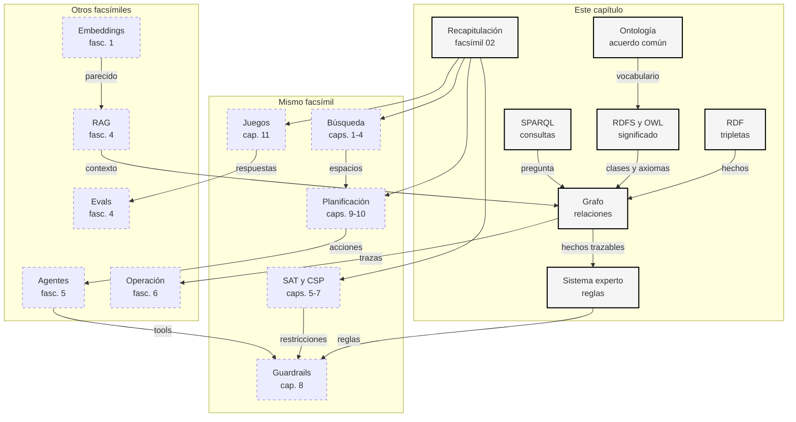

::: {.fasciculo-subtitle}
Facsímil 2 · Inteligencia clásica
:::

# Capítulo 12: Conocimiento simbólico y recapitulación

## Entrando en el tema

Este facsímil empezó con una pregunta humilde: ¿cómo resuelve problemas la IA cuando el mundo se puede modelar como estados, acciones, restricciones y decisiones?

Hemos recorrido búsqueda, heurísticas, SAT, CSP, planificación, guardrails y juegos con otros actores. Todas esas piezas tienen algo en común: no viven solo de texto plausible. Necesitan estructura.

El conocimiento simbólico es la parte de la IA que intenta decir cosas explícitas sobre el mundo: qué entidades existen, cómo se relacionan, qué reglas valen, qué se puede inferir y qué pregunta exacta queremos hacer. No sustituye a los modelos neuronales. Los complementa.

Un LLM puede redactar una respuesta magnífica. Un vector store puede encontrar el fragmento parecido. Un grafo de conocimiento puede decir: “esta factura pertenece a este cliente, este cliente tiene este contrato, este contrato exige esta condición y por eso esta acción está permitida”.

Ese “por eso” es la pieza clave.

## Cuando parecerse no basta

En un buscador semántico, convertimos textos y preguntas en vectores. Luego medimos similitud. Una fórmula habitual es la similitud coseno:

$$
\operatorname{sim}(q,d)=\cos(q,d)=\frac{q\cdot d}{\|q\|\,\|d\|}
$$

| Símbolo | Significado | Lectura sencilla |
|---|---|---|
| \(q\) | Embedding de la pregunta. | La consulta convertida en vector. |
| \(d\) | Embedding del documento. | Un fragmento convertido en vector. |
| \(q\cdot d\) | Producto escalar. | Cuánto apuntan en dirección parecida. |
| \(\|q\|\), \(\|d\|\) | Norma de cada vector. | Tamaño del vector. |
| \(\cos(q,d)\) | Similitud normalizada. | Cercanía semántica entre pregunta y documento. |

Esto es potentísimo para recuperar contexto. Pero tiene un límite: la similitud no es una prueba.

| Pregunta | Un vector store puede hacer | Un grafo puede hacer |
|---|---|---|
| “Busca documentos parecidos a esta duda” | Recuperar fragmentos relacionados. | No es su punto fuerte. |
| “¿Qué servicios dependen de esta base de datos?” | Encontrar textos que lo mencionan. | Seguir relaciones `dependeDe`. |
| “¿Puede este usuario aprobar esta factura?” | Encontrar políticas similares. | Evaluar permisos, roles y umbrales. |
| “¿Por qué se tomó esta decisión?” | Mostrar fragmentos usados. | Devolver una cadena de hechos y reglas. |

La diferencia no es estética. Es operativa. Cuando estás explorando, el parecido ayuda. Cuando estás tomando decisiones, la relación exacta importa.

## RDF: hechos pequeños con identidad

RDF representa conocimiento como tripletas: sujeto, predicado y objeto.^[W3C. (2014). *RDF 1.1 Concepts and Abstract Syntax*. https://www.w3.org/TR/rdf11-concepts/]

$$
t=(s,p,o),\qquad \mathcal{G}=\{t_1,t_2,\ldots,t_n\}
$$

| Símbolo | Significado | Ejemplo |
|---|---|---|
| \(s\) | Sujeto. | `factura:f9` |
| \(p\) | Predicado o relación. | `perteneceA` |
| \(o\) | Objeto. | `cliente:c42` |
| \(t\) | Una tripleta. | Un hecho elemental. |
| \(\mathcal{G}\) | Grafo RDF. | Conjunto de tripletas. |

Ejemplos cotidianos:

| Sujeto | Predicado | Objeto |
|---|---|---|
| `factura:f9` | `perteneceA` | `cliente:c42` |
| `factura:f9` | `importe` | `1280` |
| `cliente:c42` | `tienePlan` | `plan:empresa` |
| `servicio:api` | `dependeDe` | `servicio:db` |
| `servicio:db` | `almacena` | `tabla:facturas` |
| `persona:ana` | `tieneRol` | `rol:finanzas` |

La parte importante no es solo el formato. Es la identidad. `cliente:c42` no es una palabra suelta. Es una referencia estable. Si otra tabla, documento, API o agente habla de `cliente:c42`, estamos hablando de la misma cosa.

Ese detalle evita un montón de niebla. “Ana”, “A. García”, “ana@empresa.com” y `persona:ana-garcia` pueden ser cuatro formas de referirse a una entidad. El conocimiento simbólico obliga a decidir cuándo son lo mismo y cuándo no.

## RDFS y OWL: decir qué significa el grafo

RDF dice hechos. RDFS y OWL ayudan a decir qué significan esos hechos. Si RDF es “Ana trabaja en Finanzas”, RDFS y OWL son el vocabulario que permite entender qué es una persona, qué es un departamento, qué significa `trabajaEn` y qué consecuencias se derivan de esa relación.

No son grafos aparte. Son capas de significado encima del mismo grafo.

| Capa | Qué aporta | Pregunta que responde |
|---|---|---|
| RDF | Hechos como tripletas. | ¿Qué relaciones concretas existen? |
| RDFS | Clases, subclases, dominio y rango. | ¿Qué tipo de cosas conectan esas relaciones? |
| OWL | Axiomas más expresivos para ontologías. | ¿Qué reglas lógicas adicionales valen en el dominio? |

RDFS es útil cuando quieres que el grafo tenga una gramática compartida. Permite declarar que `Factura` es una clase, que `Factura` es subclase de `DocumentoFiscal`, que `perteneceA` conecta documentos fiscales con clientes y que ciertos tipos se heredan.^[W3C. (2014). *RDF Schema 1.1*. https://www.w3.org/TR/rdf-schema/] OWL añade más expresividad: clases disjuntas, equivalencias, propiedades inversas, restricciones de cardinalidad y axiomas para razonar con más precisión.^[W3C. (2012). *OWL 2 Web Ontology Language Document Overview*. https://www.w3.org/TR/owl2-overview/]

Una forma rápida de verlo:

| Necesidad | RDFS suele bastar | OWL empieza a tener sentido |
|---|---|---|
| Heredar tipos. | `Factura` subclase de `DocumentoFiscal`. | También, pero con más axiomas alrededor. |
| Decir qué conecta una relación. | `perteneceA` tiene dominio y rango. | Puedes añadir inversas o restricciones. |
| Evitar categorías incompatibles. | Limitado. | `Cliente` disjunto de `Servicio`. |
| Decir que dos clases son equivalentes. | Limitado. | `CompradorEmpresa` equivalente a cierta combinación de condiciones. |
| Expresar “exactamente uno”. | No es su fuerte. | Cardinalidad sobre una propiedad. |

Una inferencia sencilla:

$$
\operatorname{type}(x,C)\land C\sqsubseteq D\Rightarrow \operatorname{type}(x,D)
$$

| Símbolo | Significado | Ejemplo |
|---|---|---|
| \(\operatorname{type}(x,C)\) | \(x\) pertenece a la clase \(C\). | `factura:f9` es `Factura`. |
| \(C\sqsubseteq D\) | \(C\) es subclase de \(D\). | `Factura` subclase de `DocumentoFiscal`. |
| \(\Rightarrow\) | Podemos derivar. | `factura:f9` es `DocumentoFiscal`. |

Esto parece pequeño, pero cambia cómo trabajamos. Si una regla aplica a todo `DocumentoFiscal`, también aplica a facturas, abonos o recibos que hereden de esa clase.

RDFS también permite inferir tipos desde dominio y rango:

$$
(s,p,o)\land \operatorname{domain}(p,C)\Rightarrow \operatorname{type}(s,C)
$$

$$
(s,p,o)\land \operatorname{range}(p,D)\Rightarrow \operatorname{type}(o,D)
$$

| Pieza | Lectura sencilla | Ejemplo |
|---|---|---|
| \(\operatorname{domain}(p,C)\) | Quien usa la relación \(p\) como sujeto pertenece a \(C\). | Si algo `perteneceA`, ese algo es `DocumentoFiscal`. |
| \(\operatorname{range}(p,D)\) | Quien aparece como objeto de \(p\) pertenece a \(D\). | Si algo recibe `perteneceA`, ese algo es `Cliente`. |
| \((s,p,o)\) | Hecho observado. | `factura:f9 perteneceA cliente:c42`. |
| Tipo inferido | Conclusión derivada. | `factura:f9` es `DocumentoFiscal`; `cliente:c42` es `Cliente`. |

| Declaración | Lectura humana | Utilidad |
|---|---|---|
| `Factura subClassOf DocumentoFiscal` | Toda factura es un documento fiscal. | Reutilizar reglas. |
| `perteneceA domain DocumentoFiscal` | Si algo pertenece a un cliente, esperamos que sea documento fiscal. | Detectar modelado raro. |
| `perteneceA range Cliente` | El objeto de esa relación debe ser cliente. | Validar datos. |
| `Cliente disjointWith Servicio` | Una entidad no debería ser ambas cosas. | Evitar mezclas de dominio. |

OWL conviene cuando la frase que quieres modelar ya no cabe bien en “subclase, dominio y rango”.

| Axioma OWL | Lectura humana | Ejemplo comprensible |
|---|---|---|
| `disjointWith` | Dos clases no deberían solaparse. | Un `Cliente` no es un `Servicio`. |
| `equivalentClass` | Dos descripciones nombran la misma clase. | `ClientePremium` equivale a cliente con plan empresa y contrato activo. |
| `inverseOf` | Una relación es la inversa de otra. | Si factura `perteneceA` cliente, cliente `tieneFactura` factura. |
| `cardinality` | Una relación debe aparecer cierto número de veces. | Una factura debería tener un único cliente responsable. |
| `sameAs` | Dos identificadores nombran la misma entidad. | `persona:ana` y `usuario:u17` son la misma persona. |

La parte delicada: más expresividad también trae más responsabilidad. OWL razona con una lógica formal y, en muchos usos, con una mentalidad de mundo abierto: que no sepas un dato no significa que sea falso. Para producto, permisos o formularios, muchas veces conviene traducir las reglas críticas a validadores ejecutables además de modelarlas en la ontología.

<svg xmlns="http://www.w3.org/2000/svg" viewBox="0 0 1000 760" role="img" aria-label="RDFS y OWL como capas de significado sobre un grafo RDF">
<defs>
<marker id="arrow-rdfsowl12" viewBox="0 0 10 10" refX="8" refY="5" markerWidth="7" markerHeight="7" orient="auto-start-reverse">
<path d="M 0 0 L 10 5 L 0 10 z" fill="#111111"/>
</marker>
<pattern id="hatch-rdfsowl12" width="8" height="8" patternUnits="userSpaceOnUse" patternTransform="rotate(45)">
<line x1="0" y1="0" x2="0" y2="8" stroke="#E5E5E5" stroke-width="2"/>
</pattern>
</defs>
<rect x="0" y="0" width="1000" height="760" rx="10" fill="#FFFFFF" stroke="#111111" stroke-width="2"/>
<text x="500" y="38" text-anchor="middle" font-family="Arial, sans-serif" font-size="24" font-weight="700" fill="#111111">RDFS y OWL: significado sobre el grafo</text>
<text x="500" y="64" text-anchor="middle" font-family="Arial, sans-serif" font-size="13" fill="#555555">RDF declara hechos; RDFS hereda tipos; OWL añade axiomas para razonar con más cuidado.</text>
<rect x="50" y="104" width="900" height="152" rx="12" fill="#FFFFFF" stroke="#111111" stroke-width="1.8"/>
<text x="84" y="134" font-family="Arial, sans-serif" font-size="16" font-weight="700" fill="#111111">1 · Datos RDF</text>
<circle cx="188" cy="190" r="32" fill="#F5F5F5" stroke="#111111" stroke-width="1.7"/>
<circle cx="376" cy="190" r="32" fill="#FFFFFF" stroke="#111111" stroke-width="1.7"/>
<circle cx="638" cy="190" r="32" fill="#F5F5F5" stroke="#111111" stroke-width="1.7"/>
<circle cx="826" cy="190" r="32" fill="#FFFFFF" stroke="#111111" stroke-width="1.7"/>
<text x="188" y="186" text-anchor="middle" font-family="Arial, sans-serif" font-size="11" font-weight="700" fill="#111111">factura</text>
<text x="188" y="201" text-anchor="middle" font-family="Arial, sans-serif" font-size="10" fill="#555555">f9</text>
<text x="376" y="186" text-anchor="middle" font-family="Arial, sans-serif" font-size="11" font-weight="700" fill="#111111">cliente</text>
<text x="376" y="201" text-anchor="middle" font-family="Arial, sans-serif" font-size="10" fill="#555555">c42</text>
<text x="638" y="186" text-anchor="middle" font-family="Arial, sans-serif" font-size="11" font-weight="700" fill="#111111">servicio</text>
<text x="638" y="201" text-anchor="middle" font-family="Arial, sans-serif" font-size="10" fill="#555555">api</text>
<text x="826" y="186" text-anchor="middle" font-family="Arial, sans-serif" font-size="11" font-weight="700" fill="#111111">servicio</text>
<text x="826" y="201" text-anchor="middle" font-family="Arial, sans-serif" font-size="10" fill="#555555">db</text>
<path d="M220 190 H344" stroke="#111111" stroke-width="1.4" marker-end="url(#arrow-rdfsowl12)"/>
<path d="M670 190 H794" stroke="#111111" stroke-width="1.4" marker-end="url(#arrow-rdfsowl12)"/>
<text x="282" y="176" text-anchor="middle" font-family="Arial, sans-serif" font-size="11" fill="#555555">perteneceA</text>
<text x="732" y="176" text-anchor="middle" font-family="Arial, sans-serif" font-size="11" fill="#555555">dependeDe</text>
<rect x="50" y="304" width="900" height="170" rx="12" fill="#F5F5F5" stroke="#111111" stroke-width="1.8"/>
<text x="84" y="334" font-family="Arial, sans-serif" font-size="16" font-weight="700" fill="#111111">2 · RDFS</text>
<rect x="112" y="374" width="142" height="50" rx="8" fill="#FFFFFF" stroke="#111111"/>
<rect x="306" y="374" width="176" height="50" rx="8" fill="#FFFFFF" stroke="#111111"/>
<rect x="542" y="374" width="142" height="50" rx="8" fill="#FFFFFF" stroke="#111111"/>
<rect x="736" y="374" width="142" height="50" rx="8" fill="#FFFFFF" stroke="#111111"/>
<text x="183" y="396" text-anchor="middle" font-family="Arial, sans-serif" font-size="12" font-weight="700" fill="#111111">Factura</text>
<text x="183" y="413" text-anchor="middle" font-family="Arial, sans-serif" font-size="10" fill="#555555">clase</text>
<text x="394" y="396" text-anchor="middle" font-family="Arial, sans-serif" font-size="12" font-weight="700" fill="#111111">DocumentoFiscal</text>
<text x="394" y="413" text-anchor="middle" font-family="Arial, sans-serif" font-size="10" fill="#555555">superclase</text>
<text x="613" y="396" text-anchor="middle" font-family="Arial, sans-serif" font-size="12" font-weight="700" fill="#111111">Cliente</text>
<text x="613" y="413" text-anchor="middle" font-family="Arial, sans-serif" font-size="10" fill="#555555">rango</text>
<text x="807" y="396" text-anchor="middle" font-family="Arial, sans-serif" font-size="12" font-weight="700" fill="#111111">BaseDatos</text>
<text x="807" y="413" text-anchor="middle" font-family="Arial, sans-serif" font-size="10" fill="#555555">clase</text>
<path d="M254 399 H306" stroke="#111111" stroke-width="1.3" marker-end="url(#arrow-rdfsowl12)"/>
<text x="280" y="386" text-anchor="middle" font-family="Arial, sans-serif" font-size="10" fill="#555555">subClassOf</text>
<path d="M188 222 C188 275 183 320 183 374" stroke="#111111" stroke-width="1.2" fill="none" marker-end="url(#arrow-rdfsowl12)"/>
<path d="M376 222 C422 278 548 318 613 374" stroke="#111111" stroke-width="1.2" fill="none" marker-end="url(#arrow-rdfsowl12)"/>
<path d="M826 222 C826 274 807 320 807 374" stroke="#111111" stroke-width="1.2" fill="none" marker-end="url(#arrow-rdfsowl12)"/>
<text x="500" y="452" text-anchor="middle" font-family="Arial, sans-serif" font-size="12" fill="#555555">Dominio y rango permiten inferir tipos desde relaciones observadas.</text>
<rect x="50" y="522" width="900" height="150" rx="12" fill="url(#hatch-rdfsowl12)" stroke="#111111" stroke-width="1.8"/>
<text x="84" y="552" font-family="Arial, sans-serif" font-size="16" font-weight="700" fill="#111111">3 · OWL</text>
<rect x="110" y="584" width="150" height="48" rx="8" fill="#FFFFFF" stroke="#111111"/>
<rect x="310" y="584" width="150" height="48" rx="8" fill="#FFFFFF" stroke="#111111"/>
<rect x="510" y="584" width="150" height="48" rx="8" fill="#FFFFFF" stroke="#111111"/>
<rect x="710" y="584" width="150" height="48" rx="8" fill="#FFFFFF" stroke="#111111"/>
<text x="185" y="604" text-anchor="middle" font-family="Arial, sans-serif" font-size="12" font-weight="700" fill="#111111">disjointWith</text>
<text x="185" y="621" text-anchor="middle" font-family="Arial, sans-serif" font-size="10" fill="#555555">clases incompatibles</text>
<text x="385" y="604" text-anchor="middle" font-family="Arial, sans-serif" font-size="12" font-weight="700" fill="#111111">inverseOf</text>
<text x="385" y="621" text-anchor="middle" font-family="Arial, sans-serif" font-size="10" fill="#555555">relación inversa</text>
<text x="585" y="604" text-anchor="middle" font-family="Arial, sans-serif" font-size="12" font-weight="700" fill="#111111">cardinality</text>
<text x="585" y="621" text-anchor="middle" font-family="Arial, sans-serif" font-size="10" fill="#555555">cantidad esperada</text>
<text x="785" y="604" text-anchor="middle" font-family="Arial, sans-serif" font-size="12" font-weight="700" fill="#111111">sameAs</text>
<text x="785" y="621" text-anchor="middle" font-family="Arial, sans-serif" font-size="10" fill="#555555">misma entidad</text>
<text x="500" y="704" text-anchor="middle" font-family="Arial, sans-serif" font-size="13" font-weight="700" fill="#111111">Más semántica no es decoración: es más contrato que mantener.</text>
<text x="960" y="732" text-anchor="end" font-family="Arial, sans-serif" font-size="10" fill="#9A9A9A">IA para gente curiosa / Facsímil 02 / Capítulo 12 / 686f6c61</text>
</svg>

La tentación es convertir la ontología en una catedral perfecta. Suele ser mala idea. Una ontología útil empieza pequeña: nombres claros, relaciones estables, restricciones que de verdad ayuden y ejemplos que el equipo entienda.

## SPARQL: preguntar por relaciones exactas

SPARQL es el lenguaje estándar para consultar grafos RDF.^[W3C. (2013). *SPARQL 1.1 Query Language*. https://www.w3.org/TR/sparql11-query/] En vez de pedir “texto parecido”, buscamos patrones de tripletas.

La forma mental más útil no es “SQL para grafos”, aunque el nombre se parezca. Es mejor leerlo así: dibujo un pequeño patrón con huecos, y el motor busca en el grafo todas las formas de rellenar esos huecos.

Un patrón mínimo:

$$
q=\{(?x,\texttt{:dependeDe},\texttt{:servicioDB})\}
$$

La variable \(\ ?x\) se rellena con las entidades que encajan.

Formalmente, una consulta de patrones devuelve asignaciones de variables:

$$
\operatorname{Sol}(P,\mathcal{G})=\{\mu\mid \forall t\in P,\ \mu(t)\in \mathcal{G}\}
$$

| Símbolo | Significado | Lectura sencilla |
|---|---|---|
| \(P\) | Patrón de tripletas. | Lo que preguntamos. |
| \(\mathcal{G}\) | Grafo RDF. | Los hechos disponibles. |
| \(\mu\) | Asignación de variables. | Qué valor toma cada `?variable`. |
| \(\operatorname{Sol}(P,\mathcal{G})\) | Soluciones. | Filas de la tabla resultado. |

```sparql
SELECT ?factura WHERE {
  ?factura :perteneceA :clienteC42 .
  ?factura rdf:type :DocumentoFiscal .
}
```

Lectura humana: “dame las facturas que pertenecen al cliente C42 y además son documentos fiscales”.

La consulta se lee de dentro hacia fuera:

| Parte | Qué hace | Lectura humana |
|---|---|---|
| `?factura` | Variable. | “Algo que todavía no sé”. |
| `:perteneceA :clienteC42` | Relación obligatoria. | Ese algo pertenece al cliente C42. |
| `rdf:type :DocumentoFiscal` | Tipo obligatorio. | Ese algo es documento fiscal. |
| `SELECT ?factura` | Proyección. | Devuelve solo la variable `?factura`. |

Un ejemplo algo más realista:

```sparql
PREFIX : <https://empresa.ejemplo/>
PREFIX rdf: <http://www.w3.org/1999/02/22-rdf-syntax-ns#>

SELECT ?factura ?importe WHERE {
  ?factura rdf:type :DocumentoFiscal ;
           :perteneceA :clienteC42 ;
           :importe ?importe .

  FILTER(?importe > 1000)
}
ORDER BY DESC(?importe)
```

Lectura humana: “dame documentos fiscales del cliente C42 cuyo importe supere 1000, ordenados de mayor a menor”.

Hay tres detalles prácticos aquí:

| Detalle | Qué significa | Por qué importa |
|---|---|---|
| `PREFIX` | Abrevia URIs largas. | Hace legible la consulta. |
| `;` | Reutiliza el mismo sujeto. | Evita repetir `?factura` tres veces. |
| `FILTER` | Restringe soluciones. | No basta con encajar: debe cumplir una condición. |

`OPTIONAL` sirve cuando un dato ayuda, pero no debería eliminar la fila si falta:

```sparql
SELECT ?factura ?importe ?fechaPago WHERE {
  ?factura rdf:type :DocumentoFiscal ;
           :perteneceA :clienteC42 ;
           :importe ?importe .

  OPTIONAL {
    ?factura :fechaPago ?fechaPago .
  }
}
```

Lectura humana: “dame las facturas y su importe; si existe fecha de pago, añádela, pero no descartes facturas sin fecha”.

Esto es muy importante en producto. Si usas una relación obligatoria cuando el dato es opcional, desaparecen resultados válidos. Si usas `OPTIONAL` para algo que de verdad debería existir, puedes ocultar un problema de calidad de datos.

SPARQL también tiene distintas formas de preguntar:

| Forma | Devuelve | Cuándo usarla |
|---|---|---|
| `SELECT` | Tabla de variables. | Listar facturas, servicios, permisos. |
| `ASK` | `true` o `false`. | Comprobar si existe una relación. |
| `CONSTRUCT` | Nuevas tripletas RDF. | Crear una vista o grafo derivado. |
| `DESCRIBE` | Descripción de un recurso. | Explorar una entidad concreta. |

Ejemplo con `ASK`:

```sparql
ASK WHERE {
  :usuarioU17 :tienePermiso :permisoExportar .
  :permisoExportar :autorizaFuncion :exportarDatos .
}
```

Lectura humana: “¿tiene este usuario un permiso que autoriza exportar datos?”.

Ejemplo con `CONSTRUCT`:

```sparql
CONSTRUCT {
  ?servicio :afectadoPor :servicioDB .
}
WHERE {
  ?servicio :dependeDe+ :servicioDB .
}
```

Lectura humana: “construye nuevas tripletas diciendo qué servicios quedan afectados por `servicioDB`, siguiendo una o más dependencias”.

El `+` de `:dependeDe+` es un camino de propiedad. Permite seguir relaciones encadenadas:

| Expresión | Lectura |
|---|---|
| `:dependeDe` | Una dependencia directa. |
| `:dependeDe+` | Una o más dependencias encadenadas. |
| `:dependeDe*` | Cero o más dependencias encadenadas. |
| `^:dependeDe` | La relación en sentido inverso. |

En operaciones, esto es oro. Si `api` depende de `db`, y `web` depende de `api`, preguntar por `:dependeDe+ :db` permite encontrar tanto `api` como `web`.

<svg xmlns="http://www.w3.org/2000/svg" viewBox="0 0 1000 760" role="img" aria-label="Cómo SPARQL enlaza variables de una consulta con un grafo RDF y produce una tabla de resultados">
<defs>
<marker id="arrow-sparql12" viewBox="0 0 10 10" refX="8" refY="5" markerWidth="7" markerHeight="7" orient="auto-start-reverse">
<path d="M 0 0 L 10 5 L 0 10 z" fill="#111111"/>
</marker>
<pattern id="grid-sparql12" width="10" height="10" patternUnits="userSpaceOnUse">
<path d="M 10 0 L 0 0 0 10" fill="none" stroke="#E5E5E5" stroke-width="1"/>
</pattern>
</defs>
<rect x="0" y="0" width="1000" height="760" rx="10" fill="#FFFFFF" stroke="#111111" stroke-width="2"/>
<text x="500" y="38" text-anchor="middle" font-family="Arial, sans-serif" font-size="24" font-weight="700" fill="#111111">SPARQL: patrón, grafo y resultado</text>
<text x="500" y="64" text-anchor="middle" font-family="Arial, sans-serif" font-size="13" fill="#555555">La consulta dibuja huecos; el grafo los rellena con entidades que cumplen todas las relaciones.</text>
<rect x="46" y="106" width="278" height="346" rx="12" fill="#F5F5F5" stroke="#111111" stroke-width="1.8"/>
<text x="185" y="138" text-anchor="middle" font-family="Arial, sans-serif" font-size="17" font-weight="700" fill="#111111">Patrón WHERE</text>
<circle cx="185" cy="214" r="34" fill="#FFFFFF" stroke="#111111" stroke-width="1.7"/>
<circle cx="185" cy="338" r="34" fill="#FFFFFF" stroke="#111111" stroke-width="1.7"/>
<rect x="87" y="272" width="196" height="38" rx="8" fill="#FFFFFF" stroke="#111111"/>
<text x="185" y="210" text-anchor="middle" font-family="Arial, sans-serif" font-size="12" font-weight="700" fill="#111111">?factura</text>
<text x="185" y="229" text-anchor="middle" font-family="Arial, sans-serif" font-size="10" fill="#555555">hueco</text>
<text x="185" y="294" text-anchor="middle" font-family="Arial, sans-serif" font-size="11" fill="#111111">:perteneceA</text>
<text x="185" y="334" text-anchor="middle" font-family="Arial, sans-serif" font-size="12" font-weight="700" fill="#111111">cliente</text>
<text x="185" y="353" text-anchor="middle" font-family="Arial, sans-serif" font-size="10" fill="#555555">c42</text>
<path d="M185 248 V272" stroke="#111111" stroke-width="1.3" marker-end="url(#arrow-sparql12)"/>
<path d="M185 310 V304" stroke="#111111" stroke-width="1.3"/>
<rect x="80" y="388" width="210" height="38" rx="8" fill="#FFFFFF" stroke="#111111"/>
<text x="185" y="412" text-anchor="middle" font-family="Arial, sans-serif" font-size="11" fill="#111111">FILTER(?importe &gt; 1000)</text>
<rect x="362" y="106" width="282" height="346" rx="12" fill="#FFFFFF" stroke="#111111" stroke-width="1.8"/>
<text x="503" y="138" text-anchor="middle" font-family="Arial, sans-serif" font-size="17" font-weight="700" fill="#111111">Grafo RDF</text>
<circle cx="444" cy="210" r="32" fill="#F5F5F5" stroke="#111111" stroke-width="1.7"/>
<circle cx="562" cy="210" r="32" fill="#FFFFFF" stroke="#111111" stroke-width="1.7"/>
<circle cx="444" cy="348" r="32" fill="#FFFFFF" stroke="#111111" stroke-width="1.7"/>
<circle cx="562" cy="348" r="32" fill="#F5F5F5" stroke="#111111" stroke-width="1.7"/>
<text x="444" y="207" text-anchor="middle" font-family="Arial, sans-serif" font-size="11" font-weight="700" fill="#111111">factura</text>
<text x="444" y="222" text-anchor="middle" font-family="Arial, sans-serif" font-size="10" fill="#555555">f9</text>
<text x="562" y="207" text-anchor="middle" font-family="Arial, sans-serif" font-size="11" font-weight="700" fill="#111111">cliente</text>
<text x="562" y="222" text-anchor="middle" font-family="Arial, sans-serif" font-size="10" fill="#555555">c42</text>
<text x="444" y="345" text-anchor="middle" font-family="Arial, sans-serif" font-size="11" font-weight="700" fill="#111111">factura</text>
<text x="444" y="360" text-anchor="middle" font-family="Arial, sans-serif" font-size="10" fill="#555555">f8</text>
<text x="562" y="345" text-anchor="middle" font-family="Arial, sans-serif" font-size="11" font-weight="700" fill="#111111">cliente</text>
<text x="562" y="360" text-anchor="middle" font-family="Arial, sans-serif" font-size="10" fill="#555555">c42</text>
<path d="M476 210 H530" stroke="#111111" stroke-width="1.4" marker-end="url(#arrow-sparql12)"/>
<path d="M476 348 H530" stroke="#111111" stroke-width="1.4" marker-end="url(#arrow-sparql12)"/>
<text x="503" y="196" text-anchor="middle" font-family="Arial, sans-serif" font-size="10" fill="#555555">perteneceA</text>
<text x="503" y="334" text-anchor="middle" font-family="Arial, sans-serif" font-size="10" fill="#555555">perteneceA</text>
<rect x="386" y="262" width="116" height="34" rx="7" fill="#FFFFFF" stroke="#111111"/>
<rect x="504" y="262" width="96" height="34" rx="7" fill="#FFFFFF" stroke="#111111"/>
<text x="444" y="284" text-anchor="middle" font-family="Arial, sans-serif" font-size="10" fill="#111111">importe 1280</text>
<text x="552" y="284" text-anchor="middle" font-family="Arial, sans-serif" font-size="10" fill="#111111">tipo fiscal</text>
<rect x="386" y="400" width="116" height="34" rx="7" fill="#FFFFFF" stroke="#111111"/>
<rect x="504" y="400" width="96" height="34" rx="7" fill="#FFFFFF" stroke="#111111"/>
<text x="444" y="422" text-anchor="middle" font-family="Arial, sans-serif" font-size="10" fill="#111111">importe 650</text>
<text x="552" y="422" text-anchor="middle" font-family="Arial, sans-serif" font-size="10" fill="#111111">tipo fiscal</text>
<path d="M324 280 H362" stroke="#111111" stroke-width="1.4" marker-end="url(#arrow-sparql12)"/>
<rect x="682" y="106" width="272" height="346" rx="12" fill="url(#grid-sparql12)" stroke="#111111" stroke-width="1.8"/>
<text x="818" y="138" text-anchor="middle" font-family="Arial, sans-serif" font-size="17" font-weight="700" fill="#111111">Tabla SELECT</text>
<rect x="728" y="184" width="180" height="42" rx="8" fill="#111111"/>
<text x="776" y="211" text-anchor="middle" font-family="Arial, sans-serif" font-size="12" font-weight="700" fill="#FFFFFF">?factura</text>
<text x="858" y="211" text-anchor="middle" font-family="Arial, sans-serif" font-size="12" font-weight="700" fill="#FFFFFF">?importe</text>
<rect x="728" y="226" width="180" height="42" rx="0" fill="#FFFFFF" stroke="#111111"/>
<text x="776" y="252" text-anchor="middle" font-family="Arial, sans-serif" font-size="11" fill="#111111">factura:f9</text>
<text x="858" y="252" text-anchor="middle" font-family="Arial, sans-serif" font-size="11" fill="#111111">1280</text>
<path d="M644 280 H682" stroke="#111111" stroke-width="1.4" marker-end="url(#arrow-sparql12)"/>
<text x="818" y="326" text-anchor="middle" font-family="Arial, sans-serif" font-size="12" fill="#555555">factura:f8 encaja en cliente y tipo,</text>
<text x="818" y="344" text-anchor="middle" font-family="Arial, sans-serif" font-size="12" fill="#555555">pero cae por el filtro de importe.</text>
<rect x="106" y="526" width="788" height="92" rx="12" fill="#FFFFFF" stroke="#111111" stroke-width="1.8"/>
<text x="500" y="556" text-anchor="middle" font-family="Arial, sans-serif" font-size="17" font-weight="700" fill="#111111">La consulta no inventa: solo enlaza variables con hechos existentes.</text>
<text x="500" y="584" text-anchor="middle" font-family="Arial, sans-serif" font-size="12" fill="#555555">Si el grafo está incompleto, SPARQL será exacto sobre un mundo incompleto.</text>
<text x="500" y="696" text-anchor="middle" font-family="Arial, sans-serif" font-size="13" font-weight="700" fill="#111111">Para decidir, primero modela bien; después consulta con precisión.</text>
<text x="960" y="732" text-anchor="end" font-family="Arial, sans-serif" font-size="10" fill="#9A9A9A">IA para gente curiosa / Facsímil 02 / Capítulo 12 / 686f6c61</text>
</svg>

Otro ejemplo:

```sparql
SELECT ?servicio WHERE {
  ?servicio :dependeDe+ :servicioDB .
}
```

Lectura humana: “dime qué servicios dependen directa o indirectamente de esta base de datos”.

En sistemas con LLM, SPARQL suele entrar después de resolver entidades. El modelo puede entender que “la base de datos de facturación” se refiere a `:servicioDB`. Pero la consulta que decide qué servicios dependen de ella debería ser formal, trazable y repetible.

| Paso | Qué hace el LLM | Qué hace SPARQL |
|---|---|---|
| Entender la pregunta | Detecta intención y entidades candidatas. | No interpreta lenguaje natural. |
| Resolver entidad | Propone `:servicioDB`. | Usa la URI exacta. |
| Consultar relaciones | Puede explicar la consulta. | Devuelve coincidencias del grafo. |
| Responder | Redacta con contexto. | Aporta hechos y trazabilidad. |

SPARQL no arregla un grafo pobre. Si falta una relación, no aparecerá. Si dos entidades están duplicadas, puede devolver resultados partidos. Si una propiedad se usa con significados distintos, la consulta será técnicamente correcta y semánticamente frágil.

Por eso SPARQL y ontología van juntas: una buena consulta depende de un buen vocabulario.

La diferencia con una búsqueda textual es clara:

| Búsqueda textual | Consulta simbólica |
|---|---|
| “Devuélveme textos donde parezca hablarse de dependencias.” | “Devuélveme entidades con relación `dependeDe` hacia `servicioDB`.” |
| Puede recuperar fragmentos útiles aunque usen otras palabras. | Devuelve coincidencias exactas del modelo. |
| Tolera ambigüedad. | Exige datos bien modelados. |
| Ideal para explorar. | Ideal para decidir, auditar y explicar. |

## Ontologías y sistemas expertos

Thomas Gruber definió una ontología como una especificación explícita de una conceptualización.^[Gruber, T. R. (1993). A translation approach to portable ontology specifications. *Knowledge Acquisition*, 5(2), 199-220. https://doi.org/10.1006/knac.1993.1008] Dicho sin solemnidad: una ontología es el acuerdo sobre cómo vamos a nombrar y relacionar las cosas importantes.

Ese acuerdo es más profundo que un glosario. Un glosario define palabras. Una ontología define qué tipos de cosas existen, qué relaciones son válidas, qué restricciones importan y qué se puede inferir. Noy y McGuinness popularizaron una guía práctica para crear ontologías empezando por alcance, reutilización, clases, propiedades, restricciones e instancias.^[Noy, N. F. y McGuinness, D. L. (2001). *Ontology Development 101: A Guide to Creating Your First Ontology*. Stanford Knowledge Systems Laboratory Technical Report KSL-01-05. https://protege.stanford.edu/publications/ontology_development/ontology101.pdf]

Una forma compacta de escribirlo:

$$
\mathcal{O}=(\mathcal{C},\mathcal{P},\mathcal{R},\mathcal{A})
$$

| Símbolo | Significado | Ejemplo |
|---|---|---|
| \(\mathcal{C}\) | Clases del dominio. | `Cliente`, `Factura`, `Servicio`. |
| \(\mathcal{P}\) | Propiedades o relaciones. | `perteneceA`, `dependeDe`, `autoriza`. |
| \(\mathcal{R}\) | Restricciones. | “Una factura tiene un cliente responsable”. |
| \(\mathcal{A}\) | Axiomas. | Subclases, equivalencias, incompatibilidades. |

Y la base de conocimiento queda como:

$$
\mathcal{KB}=\mathcal{O}\cup \mathcal{I}
$$

| Pieza | Qué es | Ejemplo |
|---|---|---|
| \(\mathcal{O}\) | Ontología: el modelo del dominio. | Qué es una factura y cómo se relaciona con clientes. |
| \(\mathcal{I}\) | Instancias: datos concretos. | `factura:f9`, `cliente:c42`, `servicio:api`. |
| \(\mathcal{KB}\) | Base de conocimiento. | Modelo + datos + inferencias posibles. |

La distinción importa porque una ontología sin instancias es un mapa vacío, y muchas instancias sin ontología son una habitación llena de etiquetas sueltas.

| No confundir | Qué hace | Qué le falta |
|---|---|---|
| Glosario | Define términos. | Relaciones formales e inferencia. |
| Taxonomía | Ordena categorías. | Propiedades, restricciones y reglas. |
| Esquema de base de datos | Define tablas y columnas. | Semántica compartida entre sistemas. |
| JSON Schema | Valida forma de datos. | Significado del dominio y herencia. |
| Ontología | Modela conceptos, relaciones y restricciones. | Datos concretos si no se instancia. |

Una ontología nace bien cuando empieza por preguntas de competencia: preguntas concretas que el sistema debería poder responder. No son preguntas decorativas; son el test de alcance.

| Pregunta de competencia | Qué obliga a modelar |
|---|---|
| ¿Quién puede aprobar esta factura y por qué? | Persona, rol, factura, importe, política, autorización. |
| ¿Qué servicios se ven afectados si cae esta base de datos? | Servicio, dependencia, equipo responsable, criticidad. |
| ¿Qué documentos fiscales tiene este cliente? | Cliente, documento fiscal, relación de pertenencia. |
| ¿Qué funciones incluye este plan de producto? | Plan, función, contrato, disponibilidad. |
| ¿Qué regla explica que esta acción se escale a una persona? | Umbral, riesgo, aprobación, traza. |

Si no puedes escribir cinco preguntas así, todavía no necesitas una ontología completa. Necesitas entender mejor el dominio.

El proceso práctico suele parecerse a esto:

1. Fijar alcance: qué preguntas debe responder y cuáles no.
2. Reutilizar vocabularios existentes cuando encajen.
3. Nombrar clases: cosas del dominio, no pantallas ni tablas.
4. Nombrar propiedades: verbos o relaciones estables.
5. Añadir restricciones: lo mínimo que evita ambigüedad peligrosa.
6. Crear instancias de ejemplo: casos reales, no juguetes perfectos.
7. Probar consultas: SPARQL, reglas o validadores.
8. Revisar con personas del dominio: contabilidad, legal, soporte, producto, operaciones.
9. Versionar cambios: una ontología viva necesita dueño y criterio de evolución.

| Dominio | Entidades | Relaciones | Regla útil |
|---|---|---|---|
| Universidad | Alumno, asignatura, matrícula. | `cursa`, `aprueba`, `requiere`. | No matricular si falta prerrequisito. |
| Finanzas | Factura, cliente, contrato, rol. | `perteneceA`, `autoriza`, `superaUmbral`. | Escalar si importe supera límite. |
| Producto | Plan, función, usuario, permiso. | `incluye`, `puedeUsar`, `requiere`. | Mostrar solo funciones disponibles. |
| Operación | Servicio, base de datos, equipo. | `dependeDe`, `mantiene`, `expone`. | Avisar a equipos afectados. |

Ejemplo: en un producto SaaS, una ontología mínima podría decir:

| Clase | Instancias | Propiedades |
|---|---|---|
| `Cliente` | `cliente:c42` | `tieneContrato`, `tienePlan`. |
| `Plan` | `plan:empresa` | `incluyeFuncion`. |
| `Funcion` | `funcion:exportarDatos` | `requierePermiso`. |
| `Usuario` | `usuario:u17` | `perteneceACliente`, `tieneRol`. |
| `Permiso` | `permiso:exportar` | `autorizaFuncion`. |

Con eso puedes contestar algo muy concreto: “¿puede este usuario exportar datos?”. El LLM puede explicar la respuesta en lenguaje humano, pero la decisión debería apoyarse en relaciones verificables:

$$
\operatorname{puedeUsar}(u,f)\Leftarrow
\operatorname{perteneceACliente}(u,c)\land
\operatorname{tienePlan}(c,p)\land
\operatorname{incluyeFuncion}(p,f)\land
\operatorname{tienePermiso}(u,\pi)\land
\operatorname{autorizaFuncion}(\pi,f)
$$

| Parte de la regla | Lectura humana |
|---|---|
| `perteneceACliente` | El usuario pertenece a ese cliente. |
| `tienePlan` | El cliente tiene un plan contratado. |
| `incluyeFuncion` | El plan incluye la función pedida. |
| `tienePermiso` | El usuario tiene un permiso concreto. |
| `autorizaFuncion` | Ese permiso autoriza esa función. |

<svg xmlns="http://www.w3.org/2000/svg" viewBox="0 0 1000 780" role="img" aria-label="Proceso para diseñar una ontología útil desde preguntas de competencia hasta consultas y reglas">
<defs>
<marker id="arrow-ontology12" viewBox="0 0 10 10" refX="8" refY="5" markerWidth="7" markerHeight="7" orient="auto-start-reverse">
<path d="M 0 0 L 10 5 L 0 10 z" fill="#111111"/>
</marker>
<pattern id="grid-ontology12" width="12" height="12" patternUnits="userSpaceOnUse">
<path d="M 12 0 L 0 0 0 12" fill="none" stroke="#E5E5E5" stroke-width="1"/>
</pattern>
</defs>
<rect x="0" y="0" width="1000" height="780" rx="10" fill="#FFFFFF" stroke="#111111" stroke-width="2"/>
<text x="500" y="38" text-anchor="middle" font-family="Arial, sans-serif" font-size="24" font-weight="700" fill="#111111">Cómo nace una ontología útil</text>
<text x="500" y="64" text-anchor="middle" font-family="Arial, sans-serif" font-size="13" fill="#555555">No empieza por dibujar cajas: empieza por preguntas que el sistema debe poder contestar.</text>
<rect x="52" y="108" width="896" height="132" rx="12" fill="#F5F5F5" stroke="#111111" stroke-width="1.8"/>
<text x="90" y="140" font-family="Arial, sans-serif" font-size="16" font-weight="700" fill="#111111">1 · Preguntas de competencia</text>
<rect x="96" y="168" width="242" height="42" rx="8" fill="#FFFFFF" stroke="#111111"/>
<rect x="379" y="168" width="242" height="42" rx="8" fill="#FFFFFF" stroke="#111111"/>
<rect x="662" y="168" width="242" height="42" rx="8" fill="#FFFFFF" stroke="#111111"/>
<text x="217" y="194" text-anchor="middle" font-family="Arial, sans-serif" font-size="11" font-weight="700" fill="#111111">¿quién puede aprobar?</text>
<text x="500" y="194" text-anchor="middle" font-family="Arial, sans-serif" font-size="11" font-weight="700" fill="#111111">¿qué depende de qué?</text>
<text x="783" y="194" text-anchor="middle" font-family="Arial, sans-serif" font-size="11" font-weight="700" fill="#111111">¿por qué se escala?</text>
<rect x="52" y="292" width="896" height="184" rx="12" fill="#FFFFFF" stroke="#111111" stroke-width="1.8"/>
<text x="90" y="324" font-family="Arial, sans-serif" font-size="16" font-weight="700" fill="#111111">2 · Modelo semántico</text>
<rect x="96" y="356" width="160" height="70" rx="8" fill="#F5F5F5" stroke="#111111"/>
<rect x="306" y="356" width="160" height="70" rx="8" fill="#FFFFFF" stroke="#111111"/>
<rect x="516" y="356" width="160" height="70" rx="8" fill="#F5F5F5" stroke="#111111"/>
<rect x="726" y="356" width="160" height="70" rx="8" fill="#FFFFFF" stroke="#111111"/>
<text x="176" y="385" text-anchor="middle" font-family="Arial, sans-serif" font-size="13" font-weight="700" fill="#111111">Clases</text>
<text x="176" y="406" text-anchor="middle" font-family="Arial, sans-serif" font-size="10" fill="#555555">Cliente, Factura</text>
<text x="386" y="385" text-anchor="middle" font-family="Arial, sans-serif" font-size="13" font-weight="700" fill="#111111">Propiedades</text>
<text x="386" y="406" text-anchor="middle" font-family="Arial, sans-serif" font-size="10" fill="#555555">perteneceA</text>
<text x="596" y="385" text-anchor="middle" font-family="Arial, sans-serif" font-size="13" font-weight="700" fill="#111111">Restricciones</text>
<text x="596" y="406" text-anchor="middle" font-family="Arial, sans-serif" font-size="10" fill="#555555">un cliente responsable</text>
<text x="806" y="385" text-anchor="middle" font-family="Arial, sans-serif" font-size="13" font-weight="700" fill="#111111">Axiomas</text>
<text x="806" y="406" text-anchor="middle" font-family="Arial, sans-serif" font-size="10" fill="#555555">subclases, inversas</text>
<path d="M256 391 H306" stroke="#111111" stroke-width="1.3" marker-end="url(#arrow-ontology12)"/>
<path d="M466 391 H516" stroke="#111111" stroke-width="1.3" marker-end="url(#arrow-ontology12)"/>
<path d="M676 391 H726" stroke="#111111" stroke-width="1.3" marker-end="url(#arrow-ontology12)"/>
<text x="500" y="455" text-anchor="middle" font-family="Arial, sans-serif" font-size="12" fill="#555555">La ontología define el idioma compartido antes de llenar el grafo de datos.</text>
<rect x="52" y="526" width="896" height="132" rx="12" fill="url(#grid-ontology12)" stroke="#111111" stroke-width="1.8"/>
<text x="90" y="558" font-family="Arial, sans-serif" font-size="16" font-weight="700" fill="#111111">3 · Prueba de realidad</text>
<rect x="118" y="590" width="180" height="42" rx="8" fill="#FFFFFF" stroke="#111111"/>
<rect x="410" y="590" width="180" height="42" rx="8" fill="#FFFFFF" stroke="#111111"/>
<rect x="702" y="590" width="180" height="42" rx="8" fill="#FFFFFF" stroke="#111111"/>
<text x="208" y="616" text-anchor="middle" font-family="Arial, sans-serif" font-size="12" font-weight="700" fill="#111111">SPARQL</text>
<text x="500" y="616" text-anchor="middle" font-family="Arial, sans-serif" font-size="12" font-weight="700" fill="#111111">Reglas</text>
<text x="792" y="616" text-anchor="middle" font-family="Arial, sans-serif" font-size="12" font-weight="700" fill="#111111">Validación humana</text>
<path d="M500 240 V292" stroke="#111111" stroke-width="1.4" marker-end="url(#arrow-ontology12)"/>
<path d="M500 476 V526" stroke="#111111" stroke-width="1.4" marker-end="url(#arrow-ontology12)"/>
<text x="500" y="710" text-anchor="middle" font-family="Arial, sans-serif" font-size="13" font-weight="700" fill="#111111">Si no responde preguntas reales, no es ontología: es decoración técnica.</text>
<text x="960" y="752" text-anchor="end" font-family="Arial, sans-serif" font-size="10" fill="#9A9A9A">IA para gente curiosa / Facsímil 02 / Capítulo 12 / 686f6c61</text>
</svg>

La ontología también necesita gobierno. Alguien debe poder responder: quién puede añadir una clase, cuándo una relación queda obsoleta, cómo se migran instancias, qué cambios rompen consultas y cómo se documenta una decisión de modelado. Sin eso, el grafo envejece rápido.

| Decisión de gobierno | Pregunta práctica |
|---|---|
| Dueño del vocabulario | ¿Quién aprueba cambios de clases y propiedades? |
| Versionado | ¿Qué consultas o agentes dependen de esta versión? |
| Calidad de datos | ¿Qué instancias están incompletas o duplicadas? |
| Deprecación | ¿Qué relación antigua sigue existiendo solo por compatibilidad? |
| Trazabilidad | ¿Qué fuente justifica este hecho o regla? |

Un sistema experto combina cinco piezas:

| Pieza | Qué contiene | Pregunta que responde |
|---|---|---|
| Base de conocimiento | Hechos del dominio. | ¿Qué sabemos? |
| Ontología | Vocabulario y estructura. | ¿Qué significa lo que sabemos? |
| Reglas | Condiciones explícitas. | ¿Qué se deriva? |
| Motor de inferencia | Mecanismo que aplica reglas. | ¿Qué conclusiones siguen? |
| Explicación | Trazas de hechos y reglas. | ¿Por qué? |

Esto suena antiguo hasta que lo conectas con agentes modernos. Un LLM puede interpretar una solicitud. Un RAG puede traer contexto. Pero una ontología y una regla simbólica pueden decidir si una tool está permitida, si falta una aprobación o si una respuesta debe incluir una fuente.

No es nostalgia. Es ingeniería.

## Grafo de conocimiento, vector store y GraphRAG

Un vector store recupera por parecido. Un grafo de conocimiento consulta por relación. GraphRAG intenta usar estructura de grafo para mejorar recuperación, agregación y explicación en sistemas RAG.^[Microsoft. (2024). *GraphRAG*. https://microsoft.github.io/graphrag/] La idea es atractiva, pero conviene no confundir extracción automática con conocimiento fiable.

| Necesidad | Vector store | Grafo de conocimiento | Híbrido |
|---|---|---|---|
| Encontrar texto relevante. | Muy fuerte. | Menos directo. | Recupera documentos y entidades. |
| Responder “quién depende de quién”. | Débil si no hay frases explícitas. | Muy fuerte. | Consulta grafo y cita documentos. |
| Explicar una decisión. | Muestra fragmentos. | Muestra hechos y reglas. | Une evidencia textual y trazabilidad. |
| Actualizar permisos. | Reindexar texto no basta. | Cambiar regla o relación. | Validar acciones con reglas. |

La combinación madura suele verse así:

1. El LLM entiende la pregunta y propone una intención.
2. El vector store recupera fragmentos útiles.
3. El grafo resuelve entidades y relaciones.
4. Las reglas validan permisos, límites y coherencia.
5. La respuesta cita evidencia y explica el camino.

Cuando alguien dice “hagamos GraphRAG”, la pregunta buena es: ¿qué relaciones sabemos de verdad, quién las mantiene y cómo sabremos que siguen siendo correctas?

<svg xmlns="http://www.w3.org/2000/svg" viewBox="0 0 1000 840" role="img" aria-label="Mapa visual de conocimiento simbólico, grafos, vector store y recapitulación del facsímil dos">
<defs>
<marker id="arrow-knowledge12" viewBox="0 0 10 10" refX="8" refY="5" markerWidth="7" markerHeight="7" orient="auto-start-reverse">
<path d="M 0 0 L 10 5 L 0 10 z" fill="#111111"/>
</marker>
<pattern id="grid-knowledge12" width="12" height="12" patternUnits="userSpaceOnUse">
<path d="M 12 0 L 0 0 0 12" fill="none" stroke="#E5E5E5" stroke-width="1"/>
</pattern>
</defs>
<rect x="0" y="0" width="1000" height="840" rx="10" fill="#FFFFFF" stroke="#111111" stroke-width="2"/>
<text x="500" y="38" text-anchor="middle" font-family="Arial, sans-serif" font-size="24" font-weight="700" fill="#111111">Del texto parecido al conocimiento trazable</text>
<text x="500" y="65" text-anchor="middle" font-family="Arial, sans-serif" font-size="13" fill="#555555">El cierre del facsímil: buscar, restringir, planificar, decidir con otros actores y explicar con símbolos.</text>
<rect x="44" y="102" width="416" height="250" rx="10" fill="#F5F5F5" stroke="#111111" stroke-width="1.8"/>
<text x="252" y="132" text-anchor="middle" font-family="Arial, sans-serif" font-size="18" font-weight="700" fill="#111111">Recuperar por parecido</text>
<rect x="82" y="174" width="136" height="48" rx="8" fill="#FFFFFF" stroke="#111111"/>
<rect x="286" y="174" width="136" height="48" rx="8" fill="#FFFFFF" stroke="#111111"/>
<text x="150" y="203" text-anchor="middle" font-family="Arial, sans-serif" font-size="13" font-weight="700" fill="#111111">Pregunta q</text>
<text x="354" y="203" text-anchor="middle" font-family="Arial, sans-serif" font-size="13" font-weight="700" fill="#111111">Documento d</text>
<path d="M218 198 H286" stroke="#111111" stroke-width="1.4" marker-end="url(#arrow-knowledge12)"/>
<text x="252" y="258" text-anchor="middle" font-family="Georgia, serif" font-size="17" fill="#111111">cos(q,d)= q·d / ||q|| ||d||</text>
<text x="252" y="304" text-anchor="middle" font-family="Arial, sans-serif" font-size="12" fill="#555555">Ideal para explorar contexto; insuficiente para probar una relación.</text>
<rect x="540" y="102" width="416" height="250" rx="10" fill="#FFFFFF" stroke="#111111" stroke-width="1.8"/>
<text x="748" y="132" text-anchor="middle" font-family="Arial, sans-serif" font-size="18" font-weight="700" fill="#111111">Consultar por relación</text>
<circle cx="626" cy="204" r="32" fill="#FFFFFF" stroke="#111111" stroke-width="1.8"/>
<circle cx="748" cy="204" r="32" fill="#F5F5F5" stroke="#111111" stroke-width="1.8"/>
<circle cx="870" cy="204" r="32" fill="#FFFFFF" stroke="#111111" stroke-width="1.8"/>
<text x="626" y="199" text-anchor="middle" font-family="Arial, sans-serif" font-size="11" font-weight="700" fill="#111111">factura</text>
<text x="626" y="213" text-anchor="middle" font-family="Arial, sans-serif" font-size="10" fill="#555555">f9</text>
<text x="748" y="199" text-anchor="middle" font-family="Arial, sans-serif" font-size="11" font-weight="700" fill="#111111">cliente</text>
<text x="748" y="213" text-anchor="middle" font-family="Arial, sans-serif" font-size="10" fill="#555555">c42</text>
<text x="870" y="199" text-anchor="middle" font-family="Arial, sans-serif" font-size="11" font-weight="700" fill="#111111">plan</text>
<text x="870" y="213" text-anchor="middle" font-family="Arial, sans-serif" font-size="10" fill="#555555">empresa</text>
<path d="M658 204 H716" stroke="#111111" stroke-width="1.5" marker-end="url(#arrow-knowledge12)"/>
<path d="M780 204 H838" stroke="#111111" stroke-width="1.5" marker-end="url(#arrow-knowledge12)"/>
<text x="687" y="190" text-anchor="middle" font-family="Arial, sans-serif" font-size="10" fill="#555555">perteneceA</text>
<text x="809" y="190" text-anchor="middle" font-family="Arial, sans-serif" font-size="10" fill="#555555">tienePlan</text>
<rect x="646" y="274" width="204" height="38" rx="7" fill="#F5F5F5" stroke="#111111"/>
<text x="748" y="298" text-anchor="middle" font-family="Arial, sans-serif" font-size="12" font-weight="700" fill="#111111">hechos + reglas = explicación</text>
<path d="M748 236 V274" stroke="#111111" stroke-width="1.3" marker-end="url(#arrow-knowledge12)"/>
<rect x="70" y="418" width="860" height="148" rx="12" fill="url(#grid-knowledge12)" stroke="#111111" stroke-width="1.8"/>
<text x="500" y="448" text-anchor="middle" font-family="Arial, sans-serif" font-size="18" font-weight="700" fill="#111111">Recapitulación del facsímil 02</text>
<rect x="105" y="486" width="120" height="48" rx="8" fill="#FFFFFF" stroke="#111111"/>
<rect x="255" y="486" width="120" height="48" rx="8" fill="#FFFFFF" stroke="#111111"/>
<rect x="405" y="486" width="120" height="48" rx="8" fill="#FFFFFF" stroke="#111111"/>
<rect x="555" y="486" width="120" height="48" rx="8" fill="#FFFFFF" stroke="#111111"/>
<rect x="705" y="486" width="120" height="48" rx="8" fill="#FFFFFF" stroke="#111111"/>
<text x="165" y="505" text-anchor="middle" font-family="Arial, sans-serif" font-size="12" font-weight="700" fill="#111111">Búsqueda</text>
<text x="165" y="522" text-anchor="middle" font-family="Arial, sans-serif" font-size="10" fill="#555555">espacios</text>
<text x="315" y="505" text-anchor="middle" font-family="Arial, sans-serif" font-size="12" font-weight="700" fill="#111111">Restricciones</text>
<text x="315" y="522" text-anchor="middle" font-family="Arial, sans-serif" font-size="10" fill="#555555">SAT y CSP</text>
<text x="465" y="505" text-anchor="middle" font-family="Arial, sans-serif" font-size="12" font-weight="700" fill="#111111">Guardrails</text>
<text x="465" y="522" text-anchor="middle" font-family="Arial, sans-serif" font-size="10" fill="#555555">reglas duras</text>
<text x="615" y="505" text-anchor="middle" font-family="Arial, sans-serif" font-size="12" font-weight="700" fill="#111111">Planes</text>
<text x="615" y="522" text-anchor="middle" font-family="Arial, sans-serif" font-size="10" fill="#555555">acciones</text>
<text x="765" y="505" text-anchor="middle" font-family="Arial, sans-serif" font-size="12" font-weight="700" fill="#111111">Juegos</text>
<text x="765" y="522" text-anchor="middle" font-family="Arial, sans-serif" font-size="10" fill="#555555">respuestas</text>
<path d="M225 510 H255" stroke="#111111" stroke-width="1.2" marker-end="url(#arrow-knowledge12)"/>
<path d="M375 510 H405" stroke="#111111" stroke-width="1.2" marker-end="url(#arrow-knowledge12)"/>
<path d="M525 510 H555" stroke="#111111" stroke-width="1.2" marker-end="url(#arrow-knowledge12)"/>
<path d="M675 510 H705" stroke="#111111" stroke-width="1.2" marker-end="url(#arrow-knowledge12)"/>
<path d="M765 534 C765 604 500 594 500 650" stroke="#111111" stroke-width="1.2" fill="none" marker-end="url(#arrow-knowledge12)"/>
<path d="M165 534 C165 604 500 594 500 650" stroke="#111111" stroke-width="1.2" fill="none" marker-end="url(#arrow-knowledge12)"/>
<rect x="214" y="650" width="572" height="82" rx="12" fill="#F5F5F5" stroke="#111111" stroke-width="1.8"/>
<text x="500" y="678" text-anchor="middle" font-family="Arial, sans-serif" font-size="17" font-weight="700" fill="#111111">Agentes modernos fiables</text>
<text x="500" y="704" text-anchor="middle" font-family="Arial, sans-serif" font-size="12" fill="#555555">LLM para lenguaje, retrieval para contexto, símbolos para reglas y trazabilidad.</text>
<text x="500" y="778" text-anchor="middle" font-family="Arial, sans-serif" font-size="13" font-weight="700" fill="#111111">La IA clásica no desaparece: se convierte en el esqueleto del sistema.</text>
<text x="960" y="812" text-anchor="end" font-family="Arial, sans-serif" font-size="10" fill="#9A9A9A">IA para gente curiosa / Facsímil 02 / Capítulo 12 / 686f6c61</text>
</svg>

## En el día a día

El conocimiento simbólico aparece cuando necesitas que el sistema recuerde hechos con nombre propio.

| Situación | Sin símbolos | Con símbolos |
|---|---|---|
| Soporte interno | Buscar tickets parecidos. | Saber qué cliente, contrato y SLA aplican. |
| Agente con tools | El modelo decide desde texto. | Las tools consultan permisos y estado. |
| Compliance | Resumen libre de políticas. | Reglas ejecutables y trazas revisables. |
| Operaciones | Documentos de arquitectura. | Grafo de dependencias vivo. |
| Producto | Preguntas frecuentes. | Planes, funciones y permisos consultables. |

La señal práctica es sencilla: si la frase contiene “siempre”, “solo si”, “depende de”, “pertenece a”, “autoriza”, “requiere” o “explica por qué”, probablemente hay conocimiento simbólico esperando salir.

## Por qué debería importarte

Porque muchos sistemas de IA fallan no por falta de modelo, sino por falta de estructura alrededor del modelo.

Si todo vive como texto, cada decisión vuelve a interpretarse desde cero. Si una regla está en un prompt, no es una regla operativa. Si una entidad no tiene identidad estable, dos sistemas pueden hablar de lo mismo sin saberlo. Si una relación no está modelada, el sistema solo podrá adivinarla por parecido.

El conocimiento simbólico no hace que un sistema sea perfecto. Hace algo igual de importante: permite preguntar, validar y explicar.

## Recapitulación activa del facsímil

Este cierre funciona como el capítulo 12 del facsímil 1: no es un resumen para leer rápido, sino una revisión activa. Cada sección recupera un concepto nuclear, lo reformula desde otro ángulo, lo conecta con el resto y te confronta con una pregunta. Si algo no te sale, el número de capítulo te dice exactamente dónde volver.

No es un examen. Es un espejo. Si te reconoces en estas páginas, tienes el vocabulario clásico que permite mirar los agentes modernos como sistemas de decisión, no como cajas negras.

---

## 1. Búsqueda: resolver problemas como espacio de estados

**El concepto.** Un problema de búsqueda se define por estado inicial, acciones, transición, objetivo y coste. Resolverlo es recorrer un espacio hasta encontrar una ruta aceptable.

**Para recordar.** Si no sabes nombrar estados y acciones, todavía no tienes un problema de IA: tienes una idea sin contrato operativo.

**Ejemplo fresco.** Un agente que reserva una cita médica tiene estados: especialidad elegida, fecha filtrada, seguro validado, cita confirmada. Cada click cambia el estado.

**Vuelve al capítulo 1 si:** no puedes escribir \(P=(S,A,T,s_0,G,c)\) y explicar cada pieza.

---

## 2. BFS, DFS y coste uniforme

**El concepto.** Los algoritmos ciegos comparten el mismo bucle: extraer de una frontera, expandir vecinos y decidir qué entra después. Cambia la estructura de la frontera.

**Para recordar.** BFS prioriza poca profundidad, DFS poca memoria, UCS menor coste acumulado.

**Ejemplo fresco.** Si todas las acciones cuestan igual, BFS puede encontrar la solución más corta. Si llamar a una API cuesta más que leer caché, necesitas coste uniforme.

**Vuelve al capítulo 2 si:** confundes profundidad, anchura y coste acumulado.

---

## 3. Greedy, A* y heurísticas

**El concepto.** Una heurística estima cuánto falta. Greedy mira solo \(h(n)\). A* combina lo recorrido y lo estimado:

$$
f(n)=g(n)+h(n)
$$

**Para recordar.** Una buena estimación no reemplaza el coste real. A* funciona tan bien porque equilibra ambos.

**Ejemplo fresco.** En un asistente que depura código, \(g(n)\) puede ser coste ya gastado y \(h(n)\) la cercanía estimada al fallo. Si solo sigues la pista más prometedora, puedes ignorar una solución barata.

**Vuelve al capítulo 3 si:** no puedes explicar por qué Greedy puede ser rápido y equivocarse.

---

## 4. Búsqueda en agentes modernos

**El concepto.** Un agente moderno también busca: propone pasos, ejecuta tools, observa resultados y replanifica.

**Para recordar.** El LLM no es todo el sistema. Es una pieza dentro de un bucle con estado, herramientas, validaciones y memoria.

**Ejemplo fresco.** Un agente de datos prueba una consulta SQL, recibe error de columna inexistente, revisa el esquema y genera otra consulta. Eso es búsqueda con observación.

**Vuelve al capítulo 4 si:** ves un agente como una respuesta larga en vez de como un proceso iterativo.

---

## 5. SAT y CSP

**El concepto.** SAT pregunta si existe una asignación booleana que hace verdadera una fórmula. CSP generaliza a variables, dominios y restricciones.

**Para recordar.** A veces la IA no “predice”: satisface condiciones.

**Ejemplo fresco.** Crear horarios de un curso no es escribir texto bonito. Es asignar aulas, docentes y franjas sin romper restricciones.

**Vuelve al capítulo 5 si:** no puedes distinguir validez, satisfacibilidad y optimización.

---

## 6. Variables, dominios y restricciones

**El concepto.** Un CSP se modela como:

$$
\mathcal{P}=(X,D,C)
$$

**Para recordar.** Modelar bien decide más que elegir solver. Variables malas producen problemas raros.

**Ejemplo fresco.** Si una variable representa “turno completo” quizá el dominio explota. Si separas día, hora y persona, aparecen restricciones más claras.

**Vuelve al capítulo 6 si:** te cuesta convertir un problema cotidiano en variables, dominios y restricciones.

---

## 7. Propagación, backtracking y heurísticas en CSP

**El concepto.** Propagar reduce dominios antes de buscar. Backtracking prueba asignaciones parciales y vuelve atrás cuando una restricción falla. Heurísticas como MRV eligen primero lo más limitado.

**Para recordar.** El gran ahorro no está en probar más rápido, sino en probar menos.

**Ejemplo fresco.** Si Ana solo puede lunes o martes, decidir su turno antes puede revelar pronto si el horario es viable.

**Vuelve al capítulo 7 si:** no puedes explicar por qué “fallar pronto” es una virtud.

---

## 8. Restricciones como guardrails

**El concepto.** Un guardrail convierte una regla de negocio o seguridad en validación ejecutable.

**Para recordar.** Un prompt orienta. Un control decide.

**Ejemplo fresco.** “No borres datos sin aprobación” no debería vivir solo como frase. Debe ser permiso, schema, umbral y traza.

**Vuelve al capítulo 8 si:** todavía pones reglas duras únicamente en texto libre.

---

## 9. Planificación automática

**El concepto.** Planificar es encontrar una secuencia de acciones que transforma un estado inicial en un estado objetivo respetando precondiciones y efectos.

**Para recordar.** Una lista de tareas no es un plan si no dice qué debe ser cierto antes y después de cada acción.

**Ejemplo fresco.** Para enviar una factura: validar cliente, calcular importe, generar PDF, aprobar, enviar y registrar. Si falta aprobación, el plan no es ejecutable.

**Vuelve al capítulo 9 si:** no puedes distinguir acción, precondición, efecto y objetivo.

---

## 10. Planificación heurística, SAT y agentes LLM

**El concepto.** La planificación avanzada usa heurísticas para ordenar búsqueda, codificación SAT para probar horizontes y bucles agente para observar y replanificar.

**Para recordar.** Proponer una acción no equivale a tener permiso para ejecutarla.

**Ejemplo fresco.** Un agente puede proponer actualizar una base de datos. El sistema debe comprobar estado, permisos, coste, reversibilidad y trazas antes de actuar.

**Vuelve al capítulo 10 si:** no puedes explicar qué significa horizonte \(k\) en planificación con SAT.

---

## 11. Juegos: decidir con otros actores

**El concepto.** Los juegos añaden interdependencia: otras personas, sistemas, reglas o instrucciones también pueden elegir.

**Para recordar.** La calidad de una acción depende de las respuestas que habilita.

**Ejemplo fresco.** Si un documento recuperado contiene otra orden, tu agente debe distinguir datos de instrucciones antes de llamar una tool.

**Vuelve al capítulo 11 si:** evalúas decisiones solo por el primer movimiento.

---

## 12. Conocimiento simbólico

**El concepto.** Entidades, relaciones, reglas y consultas explícitas permiten representar conocimiento trazable.

**Para recordar.** Los embeddings recuperan parecido. Los símbolos expresan relación.

**Ejemplo fresco.** “Cliente C42 puede usar la función X porque su plan la incluye y su contrato está activo” es una explicación simbólica.

**Vuelve a este capítulo si:** no puedes distinguir un vector store de un grafo de conocimiento.

---

## Dónde solía tropezar yo

| Error | Por qué es un error | Antídoto |
|---|---|---|
| **Pensar que simbólico significa viejo** | Muchas arquitecturas modernas necesitan reglas, permisos, grafos y consultas. | Preguntar qué parte del sistema debe ser trazable. |
| **Confundir similitud con verdad** | Un texto cercano puede no probar una relación. | Separar recuperación, verificación e inferencia. |
| **Sobremodelar una ontología** | Una ontología enorme se vuelve inmantenible. | Empezar con pocas clases y relaciones críticas. |
| **Creer que GraphRAG aparece solo** | Extraer entidades no garantiza conocimiento correcto. | Definir dueños, validación y actualización del grafo. |
| **Meter reglas duras en prompts** | El prompt no es una base de conocimiento ejecutable. | Convertir reglas en políticas, schemas o consultas. |
| **Recapitular como quien pasa lista** | Recordar nombres no asegura comprensión. | Volver a explicar cada pieza con un ejemplo nuevo. |

## Manos a la obra

La práctica breve está en `labs/f2/c12-symbolic-graph-query/`. Construye un micrografo con tripletas, ejecuta consultas sencillas e infiere tipos por subclases. No es una implementación completa de RDF, RDFS, OWL ni SPARQL; es una maqueta para ver el mecanismo funcionando sin esconderlo detrás de una base de datos.

La diferencia importante es esta: un vector store puede recuperar texto parecido; un grafo puede decir qué relación sostiene una decisión. Si el sistema necesita explicar por qué una factura pertenece a un cliente o por qué una entidad hereda una clase, los hechos explícitos importan.

| Archivo | Qué contiene |
|---|---|
| `data/triples.json` | Tripletas base de factura, cliente, plan y servicios. |
| `contracts/graph_policy.json` | Consultas esperadas e inferencias obligatorias. |
| `ops/query_symbolic_graph.py` | Motor mínimo de consulta e inferencia por subclase. |
| `output/symbolic_graph_report.json` | Tripletas base, inferidas y respuestas. |
| `output/symbolic_graph_decision.md` | Lectura técnica del micrografo. |

Ejecuta:

```bash
cd labs/f2/c12-symbolic-graph-query
python3 ops/query_symbolic_graph.py --write
cat output/symbolic_graph_decision.md
```

Como gate:

```bash
python3 ops/query_symbolic_graph.py --write --fail-on-invalid
```

**Qué entregaría un alumno.** El Markdown generado, tres tripletas nuevas, una consulta nueva con su respuesta y una explicación de cuándo usaría grafo, vector store o ambos.

## Cómo encaja todo

Este mapa es el cierre del facsímil. La búsqueda, las restricciones, la planificación y los juegos nos han dado mecanismos para decidir. El conocimiento simbólico añade identidad, relaciones y explicación: qué entidad es cuál, qué regla aplica y qué consulta demuestra una decisión.

La decisión aprendida es cuándo no basta con parecido semántico. Si necesitas trazabilidad, permisos, dependencias o una explicación reproducible, los hechos y relaciones explícitas se vuelven parte de la arquitectura.



## Vocabulario aprendido

| Término | Definición |
|---|---|
| **Entidad** | Objeto identificable del dominio. |
| **Tripleta RDF** | Hecho con forma sujeto-predicado-objeto. |
| **Grafo de conocimiento** | Conjunto de entidades y relaciones explícitas. |
| **Ontología** | Acuerdo formal sobre clases, relaciones y restricciones. |
| **Clase** | Categoría de entidades dentro de una ontología. |
| **Instancia** | Entidad concreta que pertenece a una clase. |
| **Propiedad** | Relación o atributo que conecta entidades o asigna valores. |
| **Pregunta de competencia** | Pregunta que la ontología debería poder responder. |
| **RDFS** | Vocabulario para clases, subclases, dominio y rango. |
| **OWL** | Lenguaje de ontologías con axiomas más expresivos. |
| **SPARQL** | Lenguaje para consultar patrones de tripletas. |
| **Consulta SPARQL** | Pregunta formal que enlaza variables con hechos del grafo. |
| **FILTER** | Condición que restringe las soluciones de una consulta. |
| **OPTIONAL** | Bloque que añade datos si existen sin eliminar la solución principal. |
| **Camino de propiedad** | Expresión para recorrer relaciones encadenadas. |
| **Linked Data** | Datos publicados con identificadores estables y enlaces. |
| **Sistema experto** | Ontología, hechos, reglas, inferencia y explicación. |
| **Vector store** | Almacén de embeddings para recuperar por similitud. |

## Antes de pasar página

- [ ] ¿Puedo explicar la diferencia entre parecido semántico y relación explícita?
- [ ] ¿Sé leer una tripleta RDF como sujeto, predicado y objeto?
- [ ] ¿Entiendo qué añade una ontología frente a una lista de hechos?
- [ ] ¿Puedo distinguir clase, instancia, propiedad, restricción y axioma?
- [ ] ¿Sé escribir preguntas de competencia para acotar una ontología?
- [ ] ¿Puedo explicar para qué sirve SPARQL?
- [ ] ¿Sé leer `SELECT`, `WHERE`, `FILTER`, `OPTIONAL`, `ASK` y `CONSTRUCT`?
- [ ] ¿Entiendo por qué `:dependeDe+` encuentra dependencias encadenadas?
- [ ] ¿Sé cuándo usar vector store, grafo o una combinación?
- [ ] ¿Puedo resumir los doce capítulos del facsímil con un ejemplo de cada uno?
- [ ] ¿Tengo claro qué aporta la IA clásica a los agentes modernos?

## En resumen

| Idea fuerza | Detalle |
|---|---|
| Los vectores recuperan parecido. | Muy útiles para contexto, menos para probar relaciones. |
| Los símbolos dan identidad. | Entidades y relaciones permiten consultar y explicar. |
| RDF modela hechos mínimos. | Una tripleta basta para declarar una relación. |
| Una ontología es contrato semántico. | Define clases, propiedades, restricciones, axiomas y alcance. |
| RDFS y OWL añaden significado. | Clases, subclases, dominio, rango y axiomas. |
| SPARQL pregunta al grafo. | Enlaza variables con patrones exactos, filtros, opcionales y caminos de propiedad. |
| GraphRAG necesita cuidado. | Un grafo útil requiere validación, mantenimiento y dueños. |
| La IA clásica sigue viva. | Búsqueda, restricciones, planificación, juegos y símbolos son infraestructura para sistemas modernos. |

## Para saber más

Berners-Lee, T. (2006). *Linked Data*. https://www.w3.org/DesignIssues/LinkedData.html

Gruber, T. R. (1993). A translation approach to portable ontology specifications. *Knowledge Acquisition*, 5(2), 199-220. https://doi.org/10.1006/knac.1993.1008

Microsoft. (2024). *GraphRAG*. https://microsoft.github.io/graphrag/

Noy, N. F. y McGuinness, D. L. (2001). *Ontology Development 101: A Guide to Creating Your First Ontology*. Stanford Knowledge Systems Laboratory Technical Report KSL-01-05. https://protege.stanford.edu/publications/ontology_development/ontology101.pdf

Russell, S. y Norvig, P. (2021). *Artificial Intelligence: A Modern Approach* (4.ª ed.). Pearson.

W3C. (2014). *RDF 1.1 Concepts and Abstract Syntax*. https://www.w3.org/TR/rdf11-concepts/

W3C. (2014). *RDF Schema 1.1*. https://www.w3.org/TR/rdf-schema/

W3C. (2012). *OWL 2 Web Ontology Language Document Overview*. https://www.w3.org/TR/owl2-overview/

W3C. (2013). *SPARQL 1.1 Query Language*. https://www.w3.org/TR/sparql11-query/

## Laboratorio

Este laboratorio sirve para convertir el facsímil 2 en práctica. Hemos hablado de búsqueda, fronteras, heurísticas, restricciones, planificación, juegos con otros actores y conocimiento simbólico. Ahora vamos a usarlos como se usan de verdad: para ordenar un problema, reducir posibilidades, validar una decisión y dejar una explicación que otra persona pueda revisar.

En este laboratorio vas a trabajar cuatro gestos importantes:

- Del capítulo 1 al 4: modelar una situación como estados, acciones, costes y prioridades.
- Del capítulo 5 al 8: convertir reglas del mundo en restricciones verificables.
- Del capítulo 9 al 11: pensar en planes y decisiones donde no todo depende de una sola elección.
- Del capítulo 12: usar hechos explícitos para justificar una acción y no depender solo de texto parecido.

La intención no es que memorices nombres de algoritmos. La intención es que puedas mirar un problema cotidiano y preguntarte: ¿qué estoy buscando?, ¿qué está prohibido?, ¿qué coste tiene cada paso?, ¿qué puedo comprobar antes de actuar?, ¿cómo explico la decisión?

El kit real está en:

```text
labs/f2/laboratorio-ia-clasica/
```

Ejecuta:

```bash
cd labs/f2/laboratorio-ia-clasica
python3 ops/solve_csp_schedule.py --write
python3 ops/evaluate_symbolic_plan.py --write
python3 ops/check_student_submission.py --submission-dir solutions/reference --write --fail-on-missing
```

Qué produce:

| Archivo | Qué demuestra |
|---|---|
| `output/csp_solution.json` | Asignación válida y eventos de búsqueda. |
| `output/csp_decision.md` | Por qué la agenda cumple restricciones. |
| `output/csp_trace.jsonl` | Variable elegida, valor probado y poda. |
| `output/symbolic_plan_report.json` | Checks, acción y plan final sobre el grafo. |
| `output/symbolic_plan_decision.md` | Decisión explicada con precondiciones. |
| `output/symbolic_plan_trace.jsonl` | Entidades, consulta de grafo, validación y registro. |

La práctica completa no consiste en “encontrar una solución”, sino en poder explicar qué restricciones se respetaron y qué hechos sostienen la acción final.

### Reto 1: organizar un pequeño taller sin romper restricciones

#### Contexto

Imagina que tienes que organizar tres sesiones de apoyo para un grupo de estudiantes: una sesión de repaso, una práctica con ordenador y una tutoría de proyectos. Parece una agenda sencilla, pero enseguida aparecen reglas: la práctica necesita laboratorio, la tutoría solo puede ser el martes y no puedes poner dos sesiones a la misma hora porque el docente es la misma persona.

Esto es un CSP pequeño. No estamos pidiendo a un modelo que "proponga un horario bonito". Estamos definiendo variables, dominios y restricciones para saber qué horarios son válidos.

#### Objetivo

Construir un solucionador mínimo de horarios con *backtracking* y una heurística sencilla de elección de variable. Debe devolver una asignación válida y permitir explicar por qué cumple las reglas.

Esto sale del capítulo 6, cuando modelamos un CSP como variables, dominios y restricciones, y del capítulo 7, cuando vimos que resolver un CSP consiste en podar antes de probarlo todo.

#### Material base

Tenemos tres sesiones:

| Variable | Significado |
|---|---|
| `repaso` | Sesión inicial de repaso de búsqueda y heurísticas. |
| `practica` | Sesión con ordenador para trabajar CSP. |
| `tutoria` | Tutoría de proyectos. |

Cada sesión debe recibir un valor de la forma `(hora, sala)`.

| Hora disponible | Salas |
|---|---|
| `lun_09` | `Aula`, `Lab` |
| `lun_11` | `Aula`, `Lab` |
| `mar_09` | `Aula`, `Lab` |
| `mar_11` | `Aula`, `Lab` |

Restricciones:

1. No puede haber dos sesiones en la misma hora.
2. `practica` debe hacerse en `Lab`.
3. `repaso` debe ocurrir antes que `practica`.
4. `tutoria` solo puede ocurrir el martes.

Formalmente:

$$
\mathcal{P}=(X,D,C)
$$

| Símbolo | Significado | En este reto |
|---|---|---|
| \(X\) | Variables del problema. | `repaso`, `practica`, `tutoria`. |
| \(D\) | Dominios de valores posibles. | Pares `(hora, sala)`. |
| \(C\) | Restricciones que debe cumplir la asignación. | No solapar, usar laboratorio, respetar orden y disponibilidad. |

Una asignación completa \(A\) es válida si satisface todas las restricciones:

$$
\forall c_i \in C,\quad c_i(A)=\text{verdadero}
$$

#### Enunciado

1. Escribe los dominios de cada variable.
2. Implementa una función `is_consistent` que rechace asignaciones parciales inválidas.
3. Usa *backtracking* para buscar una solución.
4. Elige primero la variable con menos valores disponibles.
5. Explica por qué la solución encontrada cumple todas las reglas.

#### Resolución paso a paso

Primero reducimos dominios antes de buscar:

- `practica` solo puede usar `Lab`.
- `tutoria` solo puede usar horarios del martes.
- `repaso` puede usar cualquier hueco.

Después buscamos por asignaciones parciales. Si una asignación ya incumple una regla, no seguimos por esa rama. Esto conecta directamente con el capítulo 7: no buscamos por fuerza bruta; podamos.

```python
sessions = ["repaso", "practica", "tutoria"]
slots = ["lun_09", "lun_11", "mar_09", "mar_11"]
rooms = ["Aula", "Lab"]
slot_order = {slot: i for i, slot in enumerate(slots)}

base_domain = [(slot, room) for slot in slots for room in rooms]
domains = {
    "repaso": base_domain,
    "practica": [(slot, "Lab") for slot in slots],
    "tutoria": [(slot, room) for slot in ["mar_09", "mar_11"] for room in rooms],
}


def is_consistent(assignment):
    used_slots = [value[0] for value in assignment.values()]
    if len(used_slots) != len(set(used_slots)):
        return False

    if assignment.get("practica", (None, None))[1] not in (None, "Lab"):
        return False

    if "repaso" in assignment and "practica" in assignment:
        if slot_order[assignment["repaso"][0]] >= slot_order[assignment["practica"][0]]:
            return False

    if "tutoria" in assignment and not assignment["tutoria"][0].startswith("mar"):
        return False

    return True


def select_unassigned(assignment):
    candidates = [session for session in sessions if session not in assignment]
    return min(candidates, key=lambda session: len(domains[session]))


def backtrack(assignment):
    if len(assignment) == len(sessions):
        return assignment

    session = select_unassigned(assignment)
    for value in domains[session]:
        candidate = {**assignment, session: value}
        if is_consistent(candidate):
            result = backtrack(candidate)
            if result:
                return result
    return None


solution = backtrack({})

for session in sessions:
    slot, room = solution[session]
    print(f"{session}: {slot} en {room}")
```

#### Salida esperada

```text
repaso: lun_09 en Aula
practica: lun_11 en Lab
tutoria: mar_09 en Aula
```

#### Solución

La solución cumple las cuatro restricciones:

| Restricción | Comprobación |
|---|---|
| No coinciden horas | `lun_09`, `lun_11` y `mar_09` son distintas. |
| La práctica usa laboratorio | `practica` queda en `Lab`. |
| El repaso ocurre antes de la práctica | `lun_09` va antes que `lun_11`. |
| La tutoría ocurre el martes | `tutoria` queda en `mar_09`. |

La heurística de elegir primero la variable con menos valores disponibles ayuda porque `tutoria` y `practica` están más restringidas que `repaso`. Si las colocamos pronto, detectamos contradicciones antes.

#### Por qué funciona

Este reto junta varias piezas del facsímil:

- Capítulo 1: una agenda se convierte en espacio de estados si cada asignación parcial es un estado.
- Capítulo 2: el *backtracking* se parece a DFS, pero con poda.
- Capítulo 6: variables, dominios y restricciones definen el problema.
- Capítulo 7: elegir primero lo más restringido reduce ramas inútiles.
- Capítulo 8: una restricción funciona como guardrail porque bloquea salidas inválidas.

Lo importante es la disciplina: antes de pedir una solución, escribimos qué significa que una solución sea válida.

#### Cómo explicarlo a otra persona

"No hemos pedido al sistema que invente un horario. Le hemos dado huecos posibles y reglas. El programa prueba opciones, pero en cuanto una opción incumple una regla, deja de seguir por ahí. Por eso encuentra un horario válido sin revisar combinaciones que ya sabemos que no pueden funcionar."

#### Variaciones para seguir practicando

- Añade una cuarta sesión llamada `demo_final` que debe ocurrir después de `tutoria`.
- Añade una sala nueva `Seminario` y prohíbe usarla para `practica`.
- Cambia la regla para que `repaso` y `practica` no puedan estar el mismo día. ¿Sigue habiendo solución?

### Reto 2: decidir una acción de soporte con plan, reglas y grafo

#### Contexto

Ahora imagina un asistente interno de soporte. Llega un ticket: una persona necesita acceso temporal a un panel de facturas. Un LLM podría redactar una respuesta muy convincente, pero el sistema no debería conceder nada solo porque el texto suena razonable.

Queremos una arquitectura mínima con tres capas:

1. Un plan de pasos.
2. Guardrails que validan si la acción se puede ejecutar.
3. Un grafo de conocimiento que contiene hechos consultables sobre personas, roles, recursos y aprobaciones.

Este reto conecta planificación, restricciones y conocimiento simbólico. Es exactamente el tipo de mezcla que aparece en sistemas de IA modernos: el modelo puede ayudar a interpretar el ticket, pero la decisión debe apoyarse en reglas verificables.

#### Objetivo

Construir una maqueta que reciba un ticket, consulte hechos del grafo, valide restricciones y devuelva un plan trazable. No buscamos un agente completo. Buscamos la columna vertebral: qué se puede comprobar antes de actuar.

Esto sale del capítulo 9, cuando hablamos de planificación como secuencia de acciones con precondiciones y efectos; del capítulo 8, cuando vimos restricciones como guardrails; y del capítulo 12, cuando usamos tripletas y consultas para justificar decisiones.

#### Material base

Hechos del dominio:

| Sujeto | Predicado | Objeto |
|---|---|---|
| `ticket:t1` | `paraPersona` | `persona:ana` |
| `ticket:t1` | `solicitaAccesoA` | `recurso:facturas` |
| `ticket:t1` | `tieneAprobacion` | `persona:luis` |
| `persona:ana` | `perteneceA` | `equipo:finanzas` |
| `persona:ana` | `tieneRol` | `rol:finanzas` |
| `persona:luis` | `responsableDe` | `equipo:finanzas` |
| `recurso:facturas` | `requiereRol` | `rol:finanzas` |
| `recurso:facturas` | `permiteAcceso` | `temporal` |

La acción final `conceder_acceso_temporal(persona, recurso)` solo puede ejecutarse si:

1. La persona tiene el rol requerido por el recurso.
2. La aprobación viene de alguien responsable del equipo de la persona.
3. El recurso permite acceso temporal.

Podemos verlo como una precondición:

$$
\operatorname{pre}(a)=
\operatorname{rolOK}(u,r)\land
\operatorname{aprobacionOK}(t,u)\land
\operatorname{modoOK}(r)
$$

| Símbolo | Significado | En este reto |
|---|---|---|
| \(a\) | Acción candidata. | `conceder_acceso_temporal`. |
| \(u\) | Persona afectada. | `persona:ana`. |
| \(r\) | Recurso solicitado. | `recurso:facturas`. |
| \(t\) | Ticket. | `ticket:t1`. |
| \(\operatorname{pre}(a)\) | Condiciones que deben cumplirse antes de ejecutar. | Rol, aprobación y modo temporal. |

La consulta SPARQL equivalente tendría esta pinta:

```sparql
SELECT ?persona ?recurso ?aprobador
WHERE {
  :ticketT1 :paraPersona ?persona ;
            :solicitaAccesoA ?recurso ;
            :tieneAprobacion ?aprobador .

  ?persona :tieneRol ?rol ;
           :perteneceA ?equipo .

  ?recurso :requiereRol ?rol ;
           :permiteAcceso "temporal" .

  ?aprobador :responsableDe ?equipo .
}
```

#### Enunciado

1. Representa los hechos como tripletas.
2. Escribe una función de consulta sencilla.
3. Comprueba las tres precondiciones.
4. Devuelve una decisión: conceder acceso temporal o pedir revisión humana.
5. Devuelve un plan trazable con los pasos que se han seguido.

#### Resolución paso a paso

Primero guardamos los hechos como tripletas. Después hacemos consultas pequeñas: objetos de un sujeto y predicado, y comprobación de si una tripleta existe.

```python
triples = {
    ("ticket:t1", "paraPersona", "persona:ana"),
    ("ticket:t1", "solicitaAccesoA", "recurso:facturas"),
    ("ticket:t1", "tieneAprobacion", "persona:luis"),
    ("persona:ana", "perteneceA", "equipo:finanzas"),
    ("persona:ana", "tieneRol", "rol:finanzas"),
    ("persona:luis", "responsableDe", "equipo:finanzas"),
    ("recurso:facturas", "requiereRol", "rol:finanzas"),
    ("recurso:facturas", "permiteAcceso", "temporal"),
}


def objects(subject, predicate):
    return sorted(o for s, p, o in triples if s == subject and p == predicate)


def has(subject, predicate, obj):
    return (subject, predicate, obj) in triples


def evaluate_ticket(ticket):
    user = objects(ticket, "paraPersona")[0]
    resource = objects(ticket, "solicitaAccesoA")[0]
    approver = objects(ticket, "tieneAprobacion")[0]
    required_role = objects(resource, "requiereRol")[0]
    user_team = objects(user, "perteneceA")[0]

    checks = {
        "rol requerido": has(user, "tieneRol", required_role),
        "aprobación del equipo": has(approver, "responsableDe", user_team),
        "acceso temporal permitido": has(resource, "permiteAcceso", "temporal"),
    }

    if all(checks.values()):
        action = "conceder_acceso_temporal"
    else:
        action = "pedir_revision_humana"

    plan = [
        f"resolver_entidades({ticket})",
        f"consultar_grafo({user}, {resource})",
        f"validar_rol({required_role})",
        f"validar_aprobacion({approver})",
        f"{action}({user}, {resource})",
        f"registrar_traza({ticket})",
    ]
    return action, checks, plan


action, checks, plan = evaluate_ticket("ticket:t1")

print("Decisión:", action)
print("Comprobaciones:")
for name, ok in checks.items():
    print(f"- {name}: {'sí' if ok else 'no'}")

print("Plan:")
for step in plan:
    print("-", step)
```

#### Salida esperada

```text
Decisión: conceder_acceso_temporal
Comprobaciones:
- rol requerido: sí
- aprobación del equipo: sí
- acceso temporal permitido: sí
Plan:
- resolver_entidades(ticket:t1)
- consultar_grafo(persona:ana, recurso:facturas)
- validar_rol(rol:finanzas)
- validar_aprobacion(persona:luis)
- conceder_acceso_temporal(persona:ana, recurso:facturas)
- registrar_traza(ticket:t1)
```

#### Solución

La decisión es `conceder_acceso_temporal` porque las tres comprobaciones dan `sí`.

| Comprobación | Hecho que la sostiene |
|---|---|
| Ana tiene el rol requerido | `persona:ana tieneRol rol:finanzas` y `recurso:facturas requiereRol rol:finanzas`. |
| La aprobación viene del equipo correcto | `persona:luis responsableDe equipo:finanzas` y `persona:ana perteneceA equipo:finanzas`. |
| El recurso permite acceso temporal | `recurso:facturas permiteAcceso temporal`. |

El plan resultante no es una cadena de texto decorativa. Es la traza de razonamiento operativo:

1. Resolver entidades.
2. Consultar grafo.
3. Validar rol.
4. Validar aprobación.
5. Ejecutar o pedir revisión.
6. Registrar lo ocurrido.

Si mañana el resultado fuera `pedir_revision_humana`, podríamos mirar exactamente qué comprobación falló.

#### Por qué funciona

Este reto junta casi todo el facsímil:

- Capítulo 1: el problema se puede modelar como estados y acciones.
- Capítulo 3: una heurística podría priorizar tickets urgentes, pero no debe saltarse las reglas.
- Capítulo 8: el guardrail decide si una acción candidata es ejecutable.
- Capítulo 9: el plan tiene pasos con precondiciones.
- Capítulo 10: SAT o CSP podrían validar planes más grandes.
- Capítulo 12: el grafo da hechos explícitos y trazables.

La idea potente es separar papeles. El LLM puede leer el ticket y sugerir entidades. El grafo responde relaciones. Las restricciones validan la acción. El plan deja traza. Cada pieza hace su trabajo.

#### Cómo explicarlo a otra persona

"Antes de dar acceso, el sistema no se fía de una frase bonita. Mira hechos: quién lo pide, a qué recurso, qué rol tiene, quién aprobó y qué permite ese recurso. Si todo encaja, ejecuta un plan corto y deja registro. Si algo no encaja, no improvisa: pide revisión."

#### Variaciones para seguir practicando

- Quita la tripleta `persona:ana tieneRol rol:finanzas`. ¿Qué decisión devuelve ahora?
- Cambia `permiteAcceso temporal` por `permiteAcceso permanente`. ¿Debe conceder acceso temporal?
- Añade otro ticket para una persona de otro equipo y comprueba si la aprobación sigue siendo válida.
- Escribe una consulta SPARQL que devuelva todos los recursos que Ana puede solicitar con acceso temporal.

### Cierre del laboratorio

Si has trabajado estos dos retos, ya has usado la IA clásica como una caja de herramientas moderna. No como museo. Como ingeniería.

El primer reto te obligó a convertir una agenda en un CSP. El segundo te obligó a separar plan, reglas y hechos. Esa separación es la lección más importante del facsímil: cuando un sistema de IA va a hacer algo en el mundo, no basta con que la respuesta parezca buena. Hay que saber qué buscaba, qué restricciones respetó, qué hechos consultó y por qué eligió ese paso.

Ese criterio nos va a acompañar en los siguientes facsímiles. Cambiarán los modelos, las APIs, las arquitecturas y los agentes. La pregunta de fondo seguirá siendo la misma: ¿qué parte debe generar, qué parte debe verificar y qué parte debe explicar?
