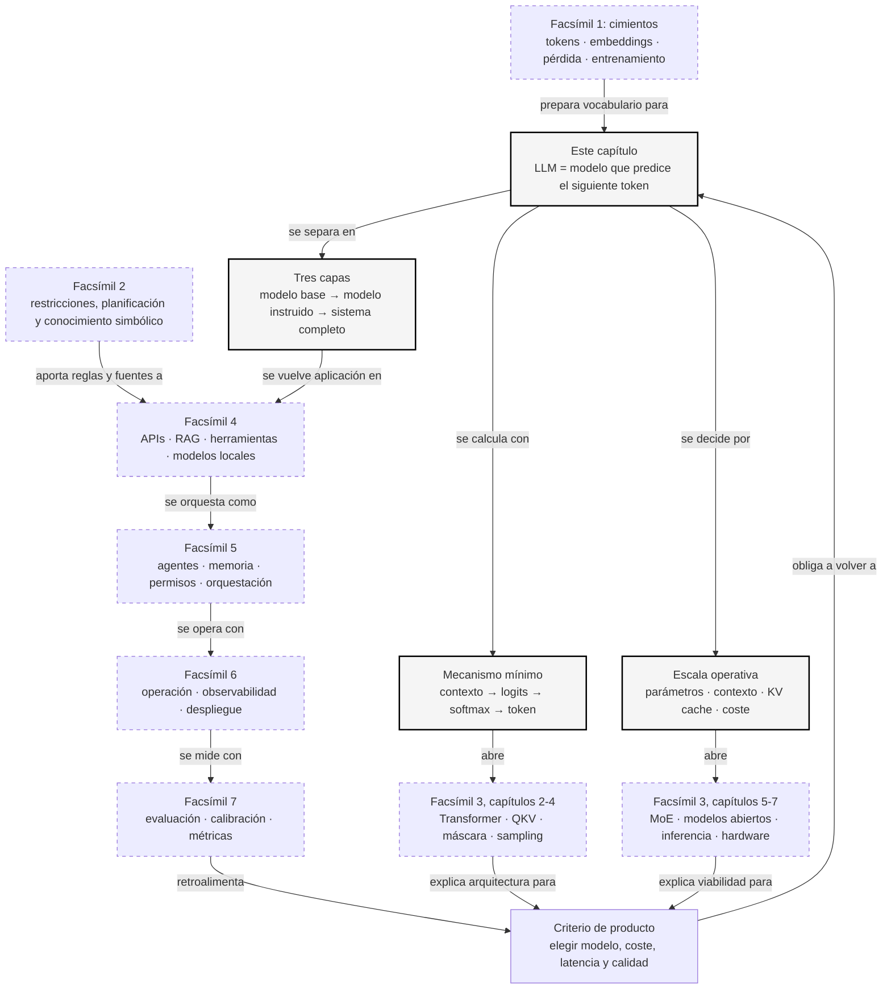

::: {.fasciculo-subtitle}
Facsímil 3 · Arquitecturas y modelos
:::

# Capítulo 01: Qué es un LLM: modelo, parámetros y escala

## El objeto que hay detrás del chat

Cuando alguien dice «he usado una IA», casi nunca se refiere al sistema completo. Se refiere a una experiencia: una caja de texto, una respuesta, quizá una voz o una imagen. Pero debajo de esa experiencia hay varias piezas: una interfaz, una API, reglas de producto, herramientas, bases de datos, filtros, cachés y, en el centro, un **modelo**.

Este capítulo va de ese centro. No del producto de chat. No del proveedor. No del envoltorio. Del objeto técnico que hace posible que escribas una frase y recibas otra frase: un **LLM**, un *Large Language Model*, o modelo de lenguaje de gran escala.

La pregunta no es solo «qué es». La pregunta buena es: ¿qué tipo de máquina matemática estoy usando?, ¿qué significan sus parámetros?, ¿por qué la escala cambia tanto el comportamiento?, ¿qué puedo esperar de él y qué no debería pedirle sin apoyo externo?

## Qué no es un LLM

Un LLM no es una base de datos. Puede devolver datos que parecen almacenados, pero su mecanismo no consiste en buscar una fila exacta y traerla de vuelta. Si necesitas el saldo de una cuenta, el precio de un pedido o el estado real de un envío, necesitas consultar el sistema que contiene ese dato. El LLM puede ayudar a formular, resumir o explicar; no sustituye a la fuente de verdad.

Tampoco es un programa clásico lleno de reglas escritas a mano. Nadie ha codificado millones de condiciones del tipo «si el usuario pregunta por una receta, responde así». El comportamiento emerge de muchos números ajustados durante entrenamiento, no de una lista legible de instrucciones.

Y, aunque produzca lenguaje muy convincente, un LLM no es una persona que recuerda, razona y decide con intención. La forma honesta de pensarlo es más sobria: recibe tokens, los transforma en vectores, aplica muchas capas de álgebra lineal y devuelve una distribución de probabilidad sobre el siguiente token. Esa frase suena menos espectacular, pero es justo lo que necesitamos para poder construir con criterio.

## Qué sí es un LLM

Un LLM es un modelo probabilístico que aprende patrones del lenguaje a gran escala. Su tarea base es sencilla de enunciar: dado un contexto, estimar qué token viene después.^[Shannon, C. E. (1948). A mathematical theory of communication. *The Bell System Technical Journal*, 27(3), 379-423. https://doi.org/10.1002/j.1538-7305.1948.tb01338.x. Shannon formalizó el lenguaje como una fuente estadística de símbolos, una idea que está en la raíz de los modelos probabilísticos de secuencias.]

Si el contexto es:

> La capital de Francia es

el modelo asigna puntuaciones a muchos tokens posibles. «París» debería recibir una puntuación alta. «azul» debería recibir una puntuación baja. «porque» quizá tenga una puntuación pequeña pero no imposible, dependiendo del contexto.

La idea moderna no empieza con los LLM actuales. Los modelos neuronales de lenguaje ya buscaban representar palabras como vectores y estimar probabilidades de secuencias antes de la explosión generativa reciente.^[Bengio, Y., Ducharme, R., Vincent, P. y Janvin, C. (2003). A neural probabilistic language model. *Journal of Machine Learning Research*, 3, 1137-1155. https://www.jmlr.org/papers/volume3/bengio03a/bengio03a.pdf. El artículo introdujo una forma neuronal de modelar lenguaje mediante representaciones distribuidas.] Lo que cambió después fue la arquitectura, los datos, el cómputo y la escala.

Por eso un LLM no es «una IA» en abstracto. Es una familia concreta de modelos: redes neuronales profundas entrenadas sobre enormes cantidades de texto y, en modelos multimodales, también otros tipos de datos. En este facsímil abriremos esa familia pieza a pieza.

## Un poco de historia: cuándo empezó eso de «LLM»

Aquí hay una pequeña trampa histórica. Si preguntas «cuál fue el primer LLM», la respuesta depende de qué estés llamando LLM.

La expresión **large language model** aparece en la literatura bastante antes de ChatGPT. Un ejemplo temprano y muy claro es el paper de Google **“Large Language Models in Machine Translation”**, publicado en 2007, donde Brants y sus coautores hablaban de modelos de lenguaje enormes para mejorar traducción automática.^[Brants, T., Popat, A. C., Xu, P., Och, F. J. y Dean, J. (2007). Large language models in machine translation. En *Proceedings of EMNLP-CoNLL 2007* (pp. 858-867). https://aclanthology.org/D07-1090/. Ojo: estos «large language models» eran modelos estadísticos a escala masiva, no LLMs Transformer conversacionales como los actuales.] Pero aquellos modelos no eran lo que hoy imaginas cuando dices LLM. Eran modelos estadísticos grandes, muy útiles, pero no redes Transformer generativas de propósito general.

La familia moderna se entiende mejor como una cadena:

| Año | Hito | Por qué importa |
|---|---|---|
| 1948 | Shannon modela el lenguaje como una fuente estadística. | Abre la puerta a pensar el texto como secuencia de símbolos con probabilidades. |
| 2003 | Bengio y coautores proponen un modelo neuronal probabilístico de lenguaje. | Las palabras empiezan a representarse como vectores aprendidos, no solo como cuentas discretas. |
| 2017 | Transformer. | La atención permite entrenar modelos grandes de secuencias de forma mucho más paralela.^[Vaswani, A. et al. (2017). Attention is all you need. En *Advances in Neural Information Processing Systems 30* (pp. 5998-6008). https://papers.nips.cc/paper/7181-attention-is-all-you-need. El Transformer hizo viable una arquitectura basada en atención que acabaría dominando los LLM modernos.] |
| 2018 | GPT-1. | OpenAI muestra que el preentrenamiento generativo seguido de adaptación a tareas funciona muy bien.^[Radford, A., Narasimhan, K., Salimans, T. y Sutskever, I. (2018). *Improving language understanding by generative pre-training*. OpenAI. https://cdn.openai.com/research-covers/language-unsupervised/language_understanding_paper.pdf. El paper introdujo el enfoque GPT original: preentrenar un Transformer decoder y adaptarlo después a tareas.] |
| 2019 | GPT-2. | La escala empieza a enseñar una idea fuerte: un modelo de lenguaje puede comportarse como aprendiz multitarea sin entrenarlo de nuevo para cada tarea.^[Radford, A. et al. (2019). *Language models are unsupervised multitask learners*. OpenAI. https://cdn.openai.com/better-language-models/language_models_are_unsupervised_multitask_learners.pdf.] |
| 2020 | GPT-3. | Con 175B parámetros, el paper populariza la idea de modelos capaces de hacer tareas con ejemplos en el propio prompt.^[Brown, T. B. et al. (2020). Language models are few-shot learners. En *Advances in Neural Information Processing Systems 33* (pp. 1877-1901). https://papers.nips.cc/paper/2020/hash/1457c0d6bfcb4967418bfb8ac142f64a-Abstract.html.] |
| 2022 | Modelos instruidos y chat. | El post-entrenamiento para seguir instrucciones convierte modelos generativos en asistentes mucho más útiles. |

Así que, si somos precisos: **el término «large language model» ya se usaba en papers antes de los Transformers modernos**. Pero **el LLM moderno que solemos tener en la cabeza** nace de la combinación de Transformer, preentrenamiento generativo, escala, post-entrenamiento e interfaz conversacional.

## Tres capas que conviene no mezclar

Para entender bien un LLM hay que separar tres niveles que en una app aparecen pegados. Si no los separamos, acabamos discutiendo frases como «este modelo es educado», «este modelo sabe usar herramientas» o «este modelo recuerda mi proyecto» sin saber qué parte del sistema produce cada comportamiento.

**Modelo base.** Es el modelo entrenado sobre grandes cantidades de texto para predecir el siguiente token. Aprende regularidades del lenguaje, código, formatos, estilos, relaciones estadísticas y patrones de razonamiento presentes en los datos. Pero un modelo base no tiene por qué comportarse como un asistente amable. Si le escribes una pregunta, puede continuar la pregunta, imitar un documento, cerrar una lista o producir algo extraño. Su entrenamiento principal no dice «ayuda al usuario»: dice «predice bien la continuación».

**Modelo instruido.** Después del preentrenamiento, muchos modelos pasan por una fase de ajuste para seguir instrucciones, responder en formato conversacional, rechazar peticiones que no debe completar y preferir respuestas útiles según ejemplos humanos o sintéticos.^[Ouyang, L. et al. (2022). Training language models to follow instructions with human feedback. En *Advances in Neural Information Processing Systems 35* (pp. 27730-27744). https://arxiv.org/abs/2203.02155. El trabajo muestra cómo el ajuste con instrucciones y feedback humano cambió el comportamiento observable de modelos de lenguaje sin cambiar la idea base de predicción token a token.] Esta capa explica por qué un modelo puede contestar «claro, te ayudo» en vez de limitarse a completar texto.

**Sistema completo.** Es lo que tú usas en producción: modelo, prompt de sistema, contexto recuperado, herramientas, validadores, memoria conversacional, permisos, logs, interfaz, evaluaciones y reglas de negocio. Cuando un asistente consulta una base de datos o llama a una función, eso no significa que el LLM sea una base de datos. Significa que el sistema que rodea al LLM le ha dado una herramienta y ha decidido cómo usar su salida.

| Nivel | Qué aprende o contiene | Qué no conviene atribuirle |
|---|---|---|
| Modelo base | Patrones estadísticos del lenguaje y del código. | Obediencia conversacional fiable o conocimiento actualizado. |
| Modelo instruido | Preferencias de respuesta, formato, seguimiento de instrucciones y estilo de ayuda. | Acceso real a tus datos, herramientas o estado de la aplicación. |
| Sistema completo | Contexto externo, permisos, herramientas, validadores, trazas y experiencia de usuario. | Que todo el comportamiento venga «de dentro» del modelo. |

Esta separación volverá mucho. En el [facsímil 4](/libro/fasciculo-04/), cuando hablemos de APIs y RAG, estaremos construyendo parte del sistema completo. En el [facsímil 5](/libro/fasciculo-05/), cuando hablemos de agentes, estaremos añadiendo decisiones, herramientas y memoria alrededor del modelo. En el [facsímil 7](/libro/fasciculo-07/), cuando evaluemos, tendremos que medir cada capa por separado: no es lo mismo fallar por un mal modelo que fallar por un mal contexto o por una herramienta mal diseñada.

## La arquitectura interna de un LLM base

El LLM base típico de la familia GPT es un **Transformer decoder-only autoregresivo**. Suena largo, pero se puede leer despacio:

**Transformer** porque usa bloques de atención, MLP, conexiones residuales y normalización.

**Decoder-only** porque usa la parte generativa de la arquitectura Transformer: recibe una secuencia previa y genera continuación.

**Autoregresivo** porque predice el siguiente token usando tokens anteriores, añade ese token al contexto y repite el proceso.

La arquitectura interna mínima es esta:

| Pieza | Qué hace | Qué debes recordar |
|---|---|---|
| Tokenizador | Convierte texto en IDs de token. | El modelo no recibe palabras; recibe enteros. |
| Embedding de token | Convierte cada ID en un vector. | Aquí el texto entra al espacio numérico. |
| Información de posición | Indica orden o distancia entre tokens. | Sin posición, la atención no sabe qué va antes o después. |
| Bloques Transformer | Repiten atención, MLP, residual y normalización. | Aquí se transforma la representación capa a capa. |
| Atención causal | Permite mirar hacia atrás, no hacia tokens futuros. | Hace honesta la predicción de izquierda a derecha. |
| MLP | Reprocesa cada token después de mezclar contexto. | No todo ocurre en atención; el MLP aporta mucha capacidad. |
| Cabeza de lenguaje | Proyecta el último vector al tamaño del vocabulario. | De aquí salen los logits. |
| Softmax y muestreo | Convierte logits en probabilidades y elige token. | Aquí aparecen temperature, `top_p`, `top_k` y decisiones de generación. |

El flujo completo, dicho como sistema, sería:

```text
texto -> tokens -> embeddings + posición -> bloques Transformer -> logits -> softmax -> siguiente token
```

En el capítulo 02 abriremos el tramo `tokens -> embeddings -> tensores -> atención`. En el capítulo 03 nos detendremos en Q, K, V y máscara causal. En el capítulo 04 veremos lo que pasa entre atenciones y cómo los logits se convierten en texto. Este capítulo solo coloca el mapa.

## Dónde se encuentran los LLMs

Un LLM no vive solo en una web de chat. Puede aparecer en varios sitios, con formas muy distintas:

| Lugar | Qué significa | Ejemplo de uso |
|---|---|---|
| API de proveedor | El modelo vive en infraestructura externa y tú lo llamas por red. | Chat, extracción, clasificación, generación de código, análisis de documentos. |
| Producto final | El usuario no ve el modelo; ve una función integrada. | Asistente en un editor, buscador mejorado, soporte interno, copiloto de datos. |
| Repositorio de pesos abiertos | Descargas pesos o variantes cuantizadas y los sirves tú. | Prototipos locales, investigación, privacidad, control de coste. |
| Runtime local | Un programa carga el modelo en tu máquina o servidor. | Ollama, LM Studio, Transformers, vLLM, SGLang o TensorRT-LLM, según caso. |
| Dispositivo o edge | Modelo pequeño o cuantizado ejecutado cerca del usuario. | Móvil, portátil, navegador, dispositivo industrial, app sin conexión estable. |
| Sistema de agentes | El LLM decide o ayuda a decidir pasos dentro de un bucle con herramientas. | Revisar un repositorio, consultar documentos, preparar tareas, ejecutar flujos internos. |

La diferencia práctica es enorme. Un modelo por API puede darte calidad alta sin ocuparte del hardware, pero dependes de red, coste por uso y condiciones del proveedor. Un modelo local te da control y privacidad, pero te obliga a pelear con memoria, cuantización, runtime y actualizaciones. Un modelo dentro de un producto puede parecer «inteligente» porque el sistema le da contexto y herramientas, no porque el modelo por sí solo lo sepa todo.

## Qué tipos de LLM podrías encontrarte

No todos los LLMs son iguales. Algunos nombres describen arquitectura, otros describen acceso, otros describen entrenamiento y otros describen despliegue. Mezclarlos es una fuente deliciosa de confusión.

| Tipo | Qué significa | Pregunta útil |
|---|---|---|
| Base | Entrenado para continuar texto. | ¿Necesito adaptarlo o usar una versión instruida? |
| Instruct o chat | Ajustado para seguir instrucciones y conversar. | ¿Sigue bien formato, tono, límites y herramientas? |
| Denso | Activa casi todos sus parámetros relevantes por token. | ¿Cuánto cuesta cada token frente a un MoE? |
| MoE | Tiene expertos y activa solo algunos por token. | ¿Cuántos parámetros son totales y cuántos activos? |
| Text-only | Entrada y salida principalmente texto. | ¿Mi caso necesita imagen, audio, vídeo o documentos complejos? |
| Multimodal | Acepta o genera más de un tipo de dato. | ¿Qué modalidades acepta y cuáles produce realmente? |
| Open weights | Los pesos están disponibles bajo una licencia. | ¿Puedo servirlo, modificarlo o usarlo comercialmente? |
| Propietario cerrado | Se usa por API o producto, sin acceso a pesos. | ¿Me compensa calidad y mantenimiento frente a dependencia externa? |
| Modelo pequeño | Optimizado para coste, latencia o dispositivo. | ¿La tarea requiere un modelo grande o solo uno fiable y barato? |
| Modelo de razonamiento | Dedica más presupuesto a pasos internos o deliberación. | ¿La mejora compensa coste y latencia en mi evaluación? |

Una misma familia puede ocupar varias filas a la vez: puede ser `instruct`, `MoE`, `multimodal`, `open weights` y además tener variantes cuantizadas para local. Por eso conviene leer las fichas con calma. El nombre comercial rara vez basta.

## El mecanismo matemático mínimo

Un modelo de lenguaje autoregresivo factoriza una secuencia token a token. Si tenemos una secuencia:

$$
x_1, x_2, \ldots, x_T
$$

el modelo estima la probabilidad conjunta así:

$$
P(x_1, x_2, \ldots, x_T) = \prod_{t=1}^{T} P(x_t \mid x_{<t}; \theta)
$$

| Símbolo | Significado | Ejemplo |
|---|---|---|
| \(x_t\) | Token en la posición \(t\). | En «la casa azul», \(x_2\) podría ser «casa». |
| \(x_{<t}\) | Todos los tokens anteriores a la posición \(t\). | Para predecir «azul», el contexto previo es «la casa». |
| \(T\) | Longitud total de la secuencia. | Una frase de 12 tokens tiene \(T = 12\). |
| \(\theta\) | Conjunto de parámetros aprendidos del modelo. | Los miles de millones de pesos de una red. |
| \(P(x_t \mid x_{<t}; \theta)\) | Probabilidad de un token dado el contexto anterior y los parámetros. | \(P(\text{azul} \mid \text{la casa})\). |

La expresión puede intimidar, pero dice algo cotidiano: para escribir una frase, el modelo predice el primer token, luego el segundo condicionado al primero, luego el tercero condicionado a los dos anteriores, y así hasta terminar. La respuesta larga aparece porque este paso se repite muchas veces.

Durante entrenamiento, el objetivo típico es minimizar la sorpresa del modelo ante el siguiente token correcto. Una forma de escribirlo es la **pérdida de entropía cruzada negativa**:

$$
\mathcal{L}(\theta) = - \sum_{t=1}^{T} \log P_{\theta}(x_t \mid x_{<t})
$$

| Símbolo | Significado | Ejemplo |
|---|---|---|
| \(\mathcal{L}(\theta)\) | Pérdida que queremos reducir durante entrenamiento. | Cuanto menor, mejor predice el texto de entrenamiento. |
| \(\log\) | Logaritmo de la probabilidad. | Penaliza mucho asignar probabilidad muy baja al token correcto. |
| \(P_{\theta}\) | Probabilidad producida por el modelo con parámetros \(\theta\). | Si el modelo da 0,80 al token correcto, la pérdida baja. |
| \(\sum_{t=1}^{T}\) | Suma sobre todas las posiciones de la secuencia. | Se evalúa token por token. |

Ejemplo pequeño. Imagina que el texto correcto es:

> la casa azul

y el modelo asigna estas probabilidades a los tokens correctos:

| Paso | Contexto previo | Token correcto | Probabilidad asignada |
|---|---|---|---|
| 1 | Inicio | la | 0,50 |
| 2 | la | casa | 0,25 |
| 3 | la casa | azul | 0,80 |

La pérdida sería:

$$
\mathcal{L} = -(\log 0{,}50 + \log 0{,}25 + \log 0{,}80)
$$

Con logaritmo natural:

$$
\mathcal{L} \approx -( -0{,}693 -1{,}386 -0{,}223 ) = 2{,}302
$$

Si después de entrenar el modelo asigna 0,80, 0,60 y 0,95 a esos mismos tokens, la pérdida baja. Eso es aprender: ajustar parámetros para que el texto observado resulte menos sorprendente.

## De logits a probabilidades

El modelo no empieza devolviendo probabilidades limpias. Primero produce **logits**: puntuaciones sin normalizar, una por cada token del vocabulario. Después usamos softmax para convertir esas puntuaciones en probabilidades:

$$
P(x_i \mid c) = \frac{e^{z_i}}{\sum_{j=1}^{V} e^{z_j}}
$$

| Símbolo | Significado | Ejemplo |
|---|---|---|
| \(x_i\) | Token candidato número \(i\). | «París», «Madrid», «azul»... |
| \(c\) | Contexto que recibe el modelo. | «La capital de Francia es». |
| \(z_i\) | Logit del token \(x_i\). | \(z_{\text{París}} = 5{,}1\). |
| \(V\) | Tamaño del vocabulario del modelo. | 50 000, 100 000 o más tokens posibles. |
| \(e^{z_i}\) | Exponencial del logit. | Convierte puntuaciones en valores positivos. |

Supongamos tres candidatos:

| Token | Logit |
|---|---:|
| París | 5,0 |
| Lyon | 2,0 |
| azul | 0,0 |

Aplicamos softmax:

$$
P(\text{París}) = \frac{e^5}{e^5 + e^2 + e^0} \approx \frac{148{,}41}{156{,}80} \approx 0{,}947
$$

$$
P(\text{Lyon}) \approx 0{,}047, \quad P(\text{azul}) \approx 0{,}006
$$

El modelo no «elige la verdad». Calcula una distribución. Luego el sistema de generación decide si toma el token más probable, si muestrea con temperatura, si restringe candidatos con `top_p`, o si aplica alguna regla adicional. Volveremos a esto en el capítulo 04.

<svg id="f3-c01-anatomia-llm" xmlns="http://www.w3.org/2000/svg" viewBox="0 0 980 760" role="img" aria-label="Corte anatómico de un LLM: modelo base, contexto, parámetros, logits, escala y sistema completo">
  <title>Corte anatómico de un LLM</title>
  <defs>
    <marker id="f3c01-arrow" viewBox="0 0 10 10" refX="9" refY="5" markerWidth="6" markerHeight="6" orient="auto">
      <path d="M 0 0 L 10 5 L 0 10 z" fill="#333333"/>
    </marker>
    <pattern id="f3c01-matrix" width="20" height="20" patternUnits="userSpaceOnUse">
      <rect width="20" height="20" fill="#FFFFFF"/>
      <path d="M20 0H0V20" fill="none" stroke="#D7D7D7" stroke-width="1"/>
      <circle cx="10" cy="10" r="2.4" fill="#111111"/>
    </pattern>
  </defs>
  <rect x="20" y="20" width="940" height="700" rx="18" fill="#FFFFFF" stroke="#111111" stroke-width="1.4"/>
  <text x="490" y="58" text-anchor="middle" font-family="Arial, sans-serif" font-size="24" font-weight="700" fill="#111111">Anatomía de un LLM en una aplicación real</text>
  <text x="490" y="84" text-anchor="middle" font-family="Arial, sans-serif" font-size="13" fill="#666666">El modelo predice tokens; el sistema decide qué contexto entra, qué herramientas rodean la salida y cómo se evalúa.</text>

  <rect x="70" y="112" width="840" height="118" rx="16" fill="#FFFFFF" stroke="#555555" stroke-width="1.2" stroke-dasharray="8 6"/>
  <text x="98" y="142" font-family="Arial, sans-serif" font-size="12" font-weight="700" fill="#555555">SISTEMA COMPLETO</text>
  <g font-family="Arial, sans-serif" font-size="12" fill="#333333">
    <rect x="96" y="162" width="132" height="42" rx="9" fill="#F6F6F6" stroke="#BDBDBD"/>
    <text x="162" y="179" text-anchor="middle" font-weight="700">Prompt</text>
    <text x="162" y="195" text-anchor="middle">del sistema</text>
    <rect x="246" y="162" width="112" height="42" rx="9" fill="#F6F6F6" stroke="#BDBDBD"/>
    <text x="302" y="187" text-anchor="middle" font-weight="700">RAG</text>
    <rect x="376" y="162" width="132" height="42" rx="9" fill="#F6F6F6" stroke="#BDBDBD"/>
    <text x="442" y="179" text-anchor="middle" font-weight="700">Herramientas</text>
    <text x="442" y="195" text-anchor="middle">y funciones</text>
    <rect x="526" y="162" width="132" height="42" rx="9" fill="#F6F6F6" stroke="#BDBDBD"/>
    <text x="592" y="179" text-anchor="middle" font-weight="700">Validadores</text>
    <text x="592" y="195" text-anchor="middle">de salida</text>
    <rect x="676" y="162" width="164" height="42" rx="9" fill="#F6F6F6" stroke="#BDBDBD"/>
    <text x="758" y="179" text-anchor="middle" font-weight="700">Observabilidad</text>
    <text x="758" y="195" text-anchor="middle">trazas y métricas</text>
  </g>

  <rect x="70" y="270" width="250" height="238" rx="16" fill="#F6F6F6" stroke="#111111" stroke-width="1.3"/>
  <text x="195" y="302" text-anchor="middle" font-family="Arial, sans-serif" font-size="18" font-weight="700" fill="#111111">Ventana de contexto</text>
  <text x="195" y="329" text-anchor="middle" font-family="Menlo, monospace" font-size="13" fill="#111111">c = tokens visibles</text>
  <line x1="100" y1="354" x2="290" y2="354" stroke="#C8C8C8"/>
  <g font-family="Arial, sans-serif" font-size="13" fill="#333333">
    <text x="110" y="386">instrucciones</text>
    <text x="110" y="417">conversación reciente</text>
    <text x="110" y="448">fragmentos recuperados</text>
    <text x="110" y="479">token anterior</text>
  </g>
  <path d="M96 372 C88 372 88 488 96 488" fill="none" stroke="#111111" stroke-width="1.4"/>
  <text x="195" y="500" text-anchor="middle" font-family="Arial, sans-serif" font-size="12" fill="#666666">No es memoria permanente.</text>

  <line x1="330" y1="386" x2="362" y2="386" stroke="#333333" stroke-width="1.5" marker-end="url(#f3c01-arrow)"/>
  <text x="346" y="366" text-anchor="middle" font-family="Arial, sans-serif" font-size="12" fill="#666666">entrada</text>

  <rect x="370" y="250" width="240" height="278" rx="18" fill="#FFFFFF" stroke="#111111" stroke-width="1.6"/>
  <text x="490" y="282" text-anchor="middle" font-family="Arial, sans-serif" font-size="19" font-weight="700" fill="#111111">Modelo base</text>
  <text x="490" y="307" text-anchor="middle" font-family="Menlo, monospace" font-size="13" fill="#333333">h = fθ(c)</text>
  <rect x="408" y="330" width="164" height="64" rx="10" fill="url(#f3c01-matrix)" stroke="#555555"/>
  <text x="490" y="418" text-anchor="middle" font-family="Arial, sans-serif" font-size="13" font-weight="700" fill="#111111">θ: parámetros aprendidos</text>
  <g font-family="Arial, sans-serif" font-size="12" fill="#333333">
    <rect x="406" y="438" width="168" height="28" rx="7" fill="#F6F6F6" stroke="#999999"/>
    <text x="490" y="457" text-anchor="middle">atención causal</text>
    <rect x="406" y="474" width="168" height="28" rx="7" fill="#F6F6F6" stroke="#999999"/>
    <text x="490" y="493" text-anchor="middle">MLP · residual · norma</text>
  </g>

  <line x1="618" y1="386" x2="650" y2="386" stroke="#333333" stroke-width="1.5" marker-end="url(#f3c01-arrow)"/>
  <text x="634" y="366" text-anchor="middle" font-family="Arial, sans-serif" font-size="12" fill="#666666">logits</text>

  <rect x="660" y="270" width="250" height="238" rx="16" fill="#F6F6F6" stroke="#111111" stroke-width="1.3"/>
  <text x="785" y="302" text-anchor="middle" font-family="Arial, sans-serif" font-size="18" font-weight="700" fill="#111111">Distribución</text>
  <text x="785" y="329" text-anchor="middle" font-family="Menlo, monospace" font-size="13" fill="#111111">P(x | c) = softmax(z)</text>
  <g font-family="Arial, sans-serif" font-size="13" fill="#111111">
    <text x="690" y="382">París</text>
    <rect x="748" y="369" width="104" height="15" rx="8" fill="#111111"/>
    <text x="876" y="382" text-anchor="end">0,947</text>
    <text x="690" y="419">Lyon</text>
    <rect x="748" y="406" width="36" height="15" rx="8" fill="#8C8C8C"/>
    <text x="876" y="419" text-anchor="end">0,047</text>
    <text x="690" y="456">azul</text>
    <rect x="748" y="443" width="16" height="15" rx="8" fill="#CFCFCF"/>
    <text x="876" y="456" text-anchor="end">0,006</text>
  </g>
  <rect x="704" y="478" width="162" height="32" rx="16" fill="#111111"/>
  <text x="785" y="499" text-anchor="middle" font-family="Arial, sans-serif" font-size="13" font-weight="700" fill="#FFFFFF">token: París</text>

  <text x="490" y="560" text-anchor="middle" font-family="Arial, sans-serif" font-size="13" fill="#666666">El token elegido vuelve a la ventana de contexto y el ciclo continúa.</text>

  <rect x="70" y="592" width="840" height="86" rx="16" fill="#FFFFFF" stroke="#111111" stroke-width="1.3"/>
  <text x="98" y="623" font-family="Arial, sans-serif" font-size="12" font-weight="700" fill="#555555">ESCALA</text>
  <g font-family="Arial, sans-serif" font-size="12" fill="#111111">
    <rect x="164" y="616" width="118" height="36" rx="8" fill="#F6F6F6" stroke="#BDBDBD"/>
    <text x="223" y="638" text-anchor="middle">parámetros</text>
    <rect x="300" y="616" width="118" height="36" rx="8" fill="#F6F6F6" stroke="#BDBDBD"/>
    <text x="359" y="638" text-anchor="middle">datos</text>
    <rect x="436" y="616" width="118" height="36" rx="8" fill="#F6F6F6" stroke="#BDBDBD"/>
    <text x="495" y="638" text-anchor="middle">cómputo</text>
    <rect x="572" y="616" width="118" height="36" rx="8" fill="#F6F6F6" stroke="#BDBDBD"/>
    <text x="631" y="638" text-anchor="middle">contexto</text>
    <rect x="708" y="616" width="132" height="36" rx="8" fill="#F6F6F6" stroke="#BDBDBD"/>
    <text x="774" y="638" text-anchor="middle">coste y latencia</text>
  </g>

  <text x="940" y="704" text-anchor="end" font-family="Arial, sans-serif" font-size="10" fill="#9A9A9A">IA para gente curiosa / Facsímil 03 / Capítulo 01 / 686f6c61</text>
</svg>

## Parámetros: la memoria no es una carpeta

La palabra **parámetro** suele crear confusión. Un parámetro no es una página guardada. No es una ficha con «París = capital de Francia». Es un número dentro de una matriz o un vector. Durante entrenamiento, esos números se ajustan para que las predicciones mejoren.^[Goodfellow, I., Bengio, Y. y Courville, A. (2016). *Deep learning*. MIT Press. https://www.deeplearningbook.org. El libro explica los parámetros como pesos aprendidos que definen transformaciones entre representaciones.]

Una capa lineal simple transforma una entrada así:

$$
y = xW + b
$$

| Símbolo | Significado | Ejemplo |
|---|---|---|
| \(x\) | Vector o matriz de entrada. | Un token representado con \(d_{in}=4\) números. |
| \(W\) | Matriz de pesos aprendidos. | Una tabla de \(4 \times 3\) números. |
| \(b\) | Sesgo aprendido que se suma al resultado. | Un vector de 3 números. |
| \(y\) | Salida transformada. | Nuevo vector de \(d_{out}=3\) números. |

El número de parámetros de esa capa es:

$$
N_{\text{params}} = d_{in} \cdot d_{out} + d_{out}
$$

Si \(d_{in}=4\) y \(d_{out}=3\):

$$
N_{\text{params}} = 4 \cdot 3 + 3 = 15
$$

Doce pesos en la matriz y tres sesgos. En un LLM real, estas matrices tienen miles de dimensiones y se repiten capa tras capa. Por eso hablamos de millones, miles de millones o billones de parámetros.

La intuición importante es esta: los parámetros son la forma en la que el modelo **ha comprimido regularidades del entrenamiento**. No guarda el mundo como una biblioteca; guarda transformaciones numéricas que suelen producir continuaciones plausibles.

## Escala: tamaño, datos, cómputo y contexto

La escala de un LLM no es una sola cifra. Cuando alguien dice «este modelo es grande», puede estar mezclando al menos cinco dimensiones:

| Dimensión | Qué mide | Por qué importa |
|---|---|---|
| Parámetros | Cuántos números aprendidos tiene el modelo. | Aumentan capacidad, memoria necesaria y coste de servirlo. |
| Datos | Cuántos tokens se usaron durante entrenamiento. | Determinan cobertura de patrones, idiomas, estilos y dominios. |
| Cómputo de entrenamiento | Cuántas operaciones se invirtieron en ajustar parámetros. | Marca el coste de crear el modelo y parte de su calidad. |
| Contexto | Cuántos tokens puede leer de una vez. | Afecta a documentos largos, RAG, agentes y memoria de conversación. |
| Cómputo de inferencia | Cuánto trabajo cuesta generar cada token. | Impacta en latencia, precio y capacidad de escalar un producto. |

Las leyes de escalado mostraron que, durante una etapa importante del desarrollo de modelos de lenguaje, aumentar parámetros, datos y cómputo de forma coordinada mejoraba de manera predecible la pérdida.^[Kaplan, J. et al. (2020). Scaling laws for neural language models. *arXiv preprint*. https://doi.org/10.48550/arXiv.2001.08361. El trabajo formalizó relaciones empíricas entre tamaño del modelo, datos, cómputo y pérdida.] Más tarde, el trabajo conocido como Chinchilla subrayó algo muy práctico: no basta con hacer modelos enormes; hay que equilibrar tamaño del modelo y cantidad de tokens de entrenamiento.^[Hoffmann, J. et al. (2022). Training compute-optimal large language models. En *Advances in Neural Information Processing Systems 35*. https://doi.org/10.48550/arXiv.2203.15556. El artículo mostró que muchos modelos grandes estaban infraentrenados respecto al cómputo disponible y propuso un equilibrio distinto entre parámetros y datos.]

Esto nos deja una regla de lectura útil: **más parámetros no significa automáticamente mejor modelo para tu caso**. Un modelo menor, bien entrenado, bien alineado con tu idioma, más barato de servir y con buena ventana de contexto puede ser mejor elección que uno mucho mayor.

## Leer una ficha de modelo sin marearse

Una *model card* es una ficha técnica. Puede estar en Hugging Face, en la documentación de un proveedor o en un paper. No siempre trae todo lo que querríamos, pero cuando está bien hecha responde a una pregunta muy práctica: «¿puedo usar este modelo para mi caso sin engañarme?».

La forma de leerla no es empezar por el benchmark más vistoso. Es ir de lo más operativo a lo más fino:

| Dato de la ficha | Pregunta que responde | Dónde volverá |
|---|---|---|
| Arquitectura | ¿Es denso, MoE, multimodal, encoder-decoder, decoder-only? | [Facsímil 3, capítulo 2](/libro/fasciculo-03/#capitulo-02) y [capítulo 5](/libro/fasciculo-03/#capitulo-05). |
| Parámetros totales | ¿Cuánta capacidad y memoria bruta puede requerir? | [Facsímil 3, capítulo 5](/libro/fasciculo-03/#capitulo-05) y [capítulo 7](/libro/fasciculo-03/#capitulo-07). |
| Parámetros activos | Si es MoE, ¿cuánto cómputo se activa por token? | [Facsímil 3, capítulo 5](/libro/fasciculo-03/#capitulo-05). |
| Context window | ¿Cuánto texto puede recibir sin RAG ni resumen previo? | [Facsímil 4](/libro/fasciculo-04/), [facsímil 5](/libro/fasciculo-05/) y [facsímil 6](/libro/fasciculo-06/). |
| Tokenizer y vocabulario | ¿Cómo trocea idiomas, código, números o nombres raros? | [Facsímil 1, capítulo 9](/libro/fasciculo-01/#capitulo-09). |
| Precisión y cuantización | ¿FP16, BF16, FP8, INT8, 4-bit? ¿Cabe y con qué pérdida? | [Facsímil 3, capítulo 7](/libro/fasciculo-03/#capitulo-07). |
| Licencia | ¿Puedo usarlo, modificarlo, servirlo o vender un producto encima? | [Facsímil 4](/libro/fasciculo-04/) y [bloque de licencia del proyecto](/libro/licencia/). |
| Benchmarks | ¿Qué mide realmente la tabla y con qué metodología? | [Facsímil 7](/libro/fasciculo-07/). |
| Runtime recomendado | ¿Transformers, vLLM, SGLang, Ollama, TensorRT-LLM? | [Facsímil 4](/libro/fasciculo-04/), [facsímil 6](/libro/fasciculo-06/) y [facsímil 7](/libro/fasciculo-07/). |
| Limitaciones declaradas | ¿En qué idiomas, dominios o tareas falla más? | [Facsímil 7](/libro/fasciculo-07/), [facsímil 8](/libro/fasciculo-08/) y [facsímil 9](/libro/fasciculo-09/). |

Ejemplo: si una ficha dice «70B, contexto 128k, instruct, FP16», no has terminado de leer. Has empezado. Falta preguntar: ¿tengo memoria para servirlo?, ¿necesito realmente 128k tokens?, ¿qué latencia tolera mi usuario?, ¿hay versión cuantizada?, ¿funciona en español?, ¿qué licencia tiene?, ¿qué benchmark se parece a mi tarea?, ¿necesito RAG aunque tenga mucho contexto?

Otra trampa: comparar una ficha de modelo base con una ficha de modelo instruido. Puede que compartan arquitectura y tamaño, pero no comportamiento. El modelo base puede ser excelente para continuar texto y torpe para seguir instrucciones; el instruido puede ser mucho más útil en chat aunque tenga el mismo número de parámetros. Por eso, cuando alguien diga «uso tal modelo», la pregunta completa es: ¿base o instruct?, ¿qué versión?, ¿qué cuantización?, ¿qué contexto?, ¿qué parámetros de generación?, ¿qué sistema lo rodea?

## Cuánto pesa un modelo

La primera consecuencia de los parámetros es física: ocupan memoria. Si un modelo tiene \(N\) parámetros y cada parámetro ocupa \(B\) bytes, la memoria aproximada solo para pesos es:

$$
M_{\text{pesos}} \approx N \cdot B
$$

| Símbolo | Significado | Ejemplo |
|---|---|---|
| \(M_{\text{pesos}}\) | Memoria necesaria para guardar los pesos del modelo. | 14 GB para 7B en FP16, aproximadamente. |
| \(N\) | Número de parámetros. | \(7\,000\,000\,000\). |
| \(B\) | Bytes por parámetro según precisión. | FP16 usa 2 bytes; INT8 usa 1 byte; 4-bit usa 0,5 bytes. |

Ejemplo:

$$
M_{\text{pesos}} \approx 7\,000\,000\,000 \cdot 2 = 14\,000\,000\,000 \text{ bytes}
$$

Es decir, unos 14 GB decimales solo para los pesos. Y eso no incluye todo lo demás: memoria de activaciones, caché KV durante generación, buffers del runtime, batch, contexto ni el sistema que rodea al modelo.

Para verlo con código:

```python
def memoria_pesos(parametros_miles_millones, bytes_por_parametro):
    parametros = parametros_miles_millones * 1_000_000_000
    gb_decimales = parametros * bytes_por_parametro / 1_000_000_000
    gib_binarios = parametros * bytes_por_parametro / (1024 ** 3)
    return gb_decimales, gib_binarios

for nombre, bytes_param in [("FP16", 2), ("INT8", 1), ("4-bit", 0.5)]:
    gb, gib = memoria_pesos(7, bytes_param)
    print(f"{nombre}: {gb:.1f} GB decimales / {gib:.1f} GiB binarios")
```

Salida esperada:

```text
FP16: 14.0 GB decimales / 13.0 GiB binarios
INT8: 7.0 GB decimales / 6.5 GiB binarios
4-bit: 3.5 GB decimales / 3.3 GiB binarios
```

Este cálculo no decide si un modelo cabe en tu máquina, pero evita autoengaños. Cuando alguien dice «tengo una GPU de 8 GB, ¿puedo servir un 7B?», la respuesta empieza aquí: pesos, precisión, contexto, batch y runtime.

## El contexto también pesa

Hay una segunda memoria que al principio se nos escapa: la memoria de generación. Cuando el modelo genera token a token, no recalcula todo desde cero. Guarda una caché de claves y valores de atención, normalmente llamada **KV cache**. Esa caché crece con el número de capas, la longitud de contexto, la dimensión interna, la precisión y el batch.

Una aproximación útil es:

$$
M_{\text{KV}} \approx 2 \cdot L \cdot n \cdot d \cdot B
$$

| Símbolo | Significado | Ejemplo |
|---|---|---|
| \(M_{\text{KV}}\) | Memoria aproximada de la caché de atención. | Alrededor de 2 GiB en el ejemplo de abajo. |
| \(2\) | Guardamos claves \(K\) y valores \(V\). | Dos tensores por capa. |
| \(L\) | Número de capas del modelo. | \(L = 32\). |
| \(n\) | Tokens de contexto almacenados. | \(n = 4096\). |
| \(d\) | Dimensión interna aproximada por token. | \(d = 4096\). |
| \(B\) | Bytes por valor. | FP16 usa \(B = 2\). |

Con esos números:

$$
M_{\text{KV}} \approx 2 \cdot 32 \cdot 4096 \cdot 4096 \cdot 2 = 2\,147\,483\,648 \text{ bytes}
$$

Unos 2 GiB solo para la caché, en batch 1 y con una aproximación simplificada. En modelos reales hay optimizaciones, variantes de atención y detalles de implementación, pero la intuición se mantiene: **más contexto no es gratis**. Si duplicas el contexto, sube la memoria de la caché. Si subes el batch, también. Por eso un modelo puede caber con un prompt corto y quedarse sin memoria cuando le pasas un documento largo.

Esta idea conecta directamente con RAG, agentes y producto. No todo documento largo debe meterse entero en contexto. A veces conviene recuperar fragmentos, resumir, estructurar, hacer varias llamadas o diseñar una memoria externa. El contexto es una herramienta, no un trastero infinito.

## En el día a día

Entender qué es un LLM cambia cómo eliges tecnología.

**Elegir modelo para un producto.** No empiezas por «el más grande». Empiezas por la tarea: extracción, soporte, programación, razonamiento, redacción, búsqueda, resumen, clasificación. Luego preguntas: ¿qué calidad necesito?, ¿qué latencia tolero?, ¿cuánto contexto requiere?, ¿qué presupuesto por llamada tengo?, ¿necesito modelo local por privacidad o coste? La arquitectura viene después del problema.

**Leer una ficha de modelo.** Cuando veas parámetros, contexto, tamaño de vocabulario, arquitectura densa o MoE, precisión, cuantización y benchmarks, no lo leas como marketing suelto. Léelo como restricciones de ingeniería. Cada número te dice algo sobre memoria, latencia, coste, calidad esperable o compatibilidad con tu runtime.

**Diseñar una aplicación con IA.** Un LLM no debería vivir solo. A su alrededor suelen aparecer recuperación de documentos, herramientas, validadores, observabilidad, pruebas y revisión humana cuando la salida importa. El modelo predice tokens; el sistema completo convierte esa predicción en una experiencia útil y responsable.

**Diagnosticar un fallo.** Si una respuesta sale mal, no basta con decir «el modelo falla». Puede fallar el prompt, el contexto, el retrieval, el formato esperado, el parámetro de generación, la herramienta llamada, la validación posterior o la expectativa del producto. Separar modelo base, modelo instruido y sistema completo te permite depurar con lupa en vez de cambiar de modelo cada vez que algo se tuerce.

## Por qué debería importarte

Porque el error más común al empezar con LLMs es tratarlos como cajas opacas intercambiables. «Ponemos un modelo potente y ya está». Esa frase suele ocultar casi todas las decisiones importantes.

Si sabes qué es un parámetro, entiendes por qué un modelo ocupa memoria. Si sabes qué es un logit, entiendes por qué la salida no es una verdad sino una distribución. Si sabes qué es escala, entiendes por qué comparar modelos exige mirar más que una cifra. Si sabes qué es una KV cache, entiendes por qué el contexto largo tiene coste real. Y si sabes que el modelo predice tokens, entiendes por qué muchas aplicaciones necesitan datos externos, restricciones, evaluación y trazabilidad.

## Dónde volverá a aparecer

Este capítulo es una bisagra. Parece que solo habla de «qué es un modelo», pero en realidad deja colocadas varias piezas que volverán una y otra vez en el temario. Conviene verlas ahora como conexiones, no como conceptos aislados.

| Concepto de este capítulo | Dónde vuelve en el libro | Por qué se conecta |
|---|---|---|
| **Token** | [Facsímil 1, capítulo 9](/libro/fasciculo-01/#capitulo-09); [facsímil 3, capítulo 2](/libro/fasciculo-03/#capitulo-02) y [capítulo 3](/libro/fasciculo-03/#capitulo-03); [facsímil 4](/libro/fasciculo-04/). | En el capítulo 9 aprendimos que el texto se trocea. Aquí vemos que el LLM predice tokens. En los próximos capítulos esos tokens se convertirán en tensores, entrarán en atención y después condicionarán coste, contexto, RAG y prompts. |
| **Embedding y vector** | [Facsímil 1, capítulo 9](/libro/fasciculo-01/#capitulo-09); [facsímil 3, capítulo 2](/libro/fasciculo-03/#capitulo-02); [facsímil 4](/libro/fasciculo-04/). | Un LLM no trabaja con palabras, trabaja con vectores. Esa misma idea reaparece cuando expliquemos Transformer por dentro y cuando usemos embeddings para búsqueda semántica. |
| **Parámetros** | [Facsímil 1, capítulos 5](/libro/fasciculo-01/#capitulo-05), [6](/libro/fasciculo-01/#capitulo-06) y [10](/libro/fasciculo-01/#capitulo-10); [facsímil 3, capítulo 5](/libro/fasciculo-03/#capitulo-05), [capítulo 6](/libro/fasciculo-03/#capitulo-06) y [capítulo 7](/libro/fasciculo-03/#capitulo-07). | En redes neuronales ya vimos pesos y entrenamiento. Aquí los escalamos a miles de millones. Más adelante nos servirán para entender MoE, destilación, modelos abiertos, cuantización, memoria y hardware. |
| **Pérdida** | [Facsímil 1, capítulo 7](/libro/fasciculo-01/#capitulo-07); [facsímil 3, capítulo 6](/libro/fasciculo-03/#capitulo-06); [facsímil 7](/libro/fasciculo-07/). | La pérdida explica cómo aprende un modelo durante entrenamiento. Después reaparece en fine-tuning, destilación y evaluación: si no medimos algo, no sabemos si hemos mejorado. |
| **Logits y softmax** | [Facsímil 3, capítulo 4](/libro/fasciculo-03/#capitulo-04); [facsímil 7](/libro/fasciculo-07/). | Aquí aparecen como mecanismo mínimo. Luego veremos cómo temperature, `top_p`, `top_k` y calibración convierten esas puntuaciones en salidas útiles o engañosamente seguras. |
| **Contexto** | [Facsímil 4](/libro/fasciculo-04/); [facsímil 5](/libro/fasciculo-05/); [facsímil 6](/libro/fasciculo-06/). | El contexto no es memoria humana: son tokens disponibles. Esa diferencia será clave para RAG, agentes con herramientas, handoffs, compaction y observabilidad. |
| **KV cache** | [Facsímil 3, capítulo 7](/libro/fasciculo-03/#capitulo-07); [facsímil 6](/libro/fasciculo-06/). | La caché explica por qué contexto, batch y latencia son decisiones de arquitectura, no detalles invisibles del runtime. |
| **Modelo base vs modelo instruido** | [Facsímil 3, capítulo 6](/libro/fasciculo-03/#capitulo-06); [facsímil 4](/libro/fasciculo-04/); [facsímil 7](/libro/fasciculo-07/). | Separar entrenamiento base, post-entrenamiento y evaluación evita comparar modelos distintos como si fueran la misma cosa. |
| **Modelo ≠ base de datos** | [Facsímil 2, capítulo 12](/libro/fasciculo-02/#capitulo-12); [facsímil 4](/libro/fasciculo-04/). | Cuando necesitemos hechos verificables, no bastará con pedirle al modelo que recuerde. Conectaremos LLMs con grafos, documentos, consultas, fuentes y sistemas de recuperación. |
| **Escala** | [Facsímil 3, capítulo 5](/libro/fasciculo-03/#capitulo-05) y [capítulo 7](/libro/fasciculo-03/#capitulo-07); [facsímil 6](/libro/fasciculo-06/); [facsímil 11](/libro/fasciculo-11/). | La escala no es presumir de tamaño: decide coste, latencia, despliegue, experiencia de usuario y viabilidad de producto. Un modelo que no cabe o tarda demasiado no sirve para ese caso. |
| **Sistema completo** | [Facsímil 2, capítulo 8](/libro/fasciculo-02/#capitulo-08); [facsímil 4](/libro/fasciculo-04/), [facsímil 5](/libro/fasciculo-05/), [facsímil 6](/libro/fasciculo-06/), [facsímil 7](/libro/fasciculo-07/) y [facsímil 9](/libro/fasciculo-09/). | El LLM predice tokens; el sistema decide qué contexto entra, qué herramientas puede usar, qué validadores revisan la salida, qué métricas se registran y cuándo participa una persona. |

Una forma útil de leer el resto del libro es esta: cada vez que aparezca una palabra grande —RAG, agente, evaluación, modelo abierto, inferencia local, gobernanza— pregúntate qué parte toca del mecanismo de este capítulo. ¿Cambia el contexto? ¿Cambia los parámetros? ¿Cambia la forma de elegir tokens? ¿Añade una fuente externa? ¿Mide mejor la salida? Así el temario deja de ser una lista de temas y se convierte en un mapa.

## Dónde solía tropezar yo

| Error | Por qué es un error | Antídoto |
|---|---|---|
| **Confundir modelo con producto** | El chat que usas incluye interfaz, herramientas, reglas y memoria de conversación. El LLM es solo una pieza. Si comparas experiencias completas como si fueran modelos puros, sacas conclusiones débiles. | Pregunta siempre qué parte estás evaluando: modelo base, modelo instruido, API, app, RAG, tool use o sistema completo. |
| **Creer que parámetros son conocimiento literal** | Un parámetro no guarda una frase ni una tabla. Es un número dentro de una transformación. Hablar de «memoria» del modelo puede ser útil como metáfora, pero mala como descripción técnica. | Traduce «memoria» por «regularidades comprimidas en pesos». Para hechos exactos, usa fuentes externas verificables. |
| **Pensar que más grande siempre gana** | Más parámetros suelen dar más capacidad, pero también más coste, memoria y latencia. Además, datos, entrenamiento, post-entrenamiento y evaluación importan muchísimo. | Compara con una eval propia y restricciones reales: calidad, coste, latencia, contexto, privacidad y mantenimiento. |
| **Olvidar que genera token a token** | Una respuesta larga no aparece de golpe. Cada token depende de lo anterior y consume cómputo. Por eso salidas largas cuestan más y tardan más. | Mide tokens de entrada y salida. Diseña límites, streaming y presupuestos antes de producción. |
| **Leer softmax como certeza** | Un 94 % de probabilidad para un token no significa que la afirmación sea verdadera. Significa que ese token encaja muy bien con el contexto según el modelo. | Diferencia probabilidad lingüística de veracidad factual. Para hechos, conecta fuentes, citas y validadores. |
| **No separar base, instruct y sistema** | Puedes culpar al modelo de un fallo que viene del contexto, de una herramienta o de una regla de producto. También puedes atribuir al modelo capacidades que en realidad vienen del sistema que lo envuelve. | Cuando algo funcione o falle, pregunta: ¿lo produjo el modelo base, el post-entrenamiento, el prompt, el contexto, una herramienta o un validador? |

## Manos a la obra

La práctica real está en `labs/f3/c01-loss-memory-estimator/`. El kit convierte dos ideas básicas en cálculos reproducibles: pérdida token a token y memoria mínima de pesos por precisión. No necesitas GPU ni librerías externas.

| Archivo | Qué contiene |
|---|---|
| `data/loss_memory_case.json` | Probabilidades antes/después y tamaños de modelo. |
| `contracts/loss_memory_policy.json` | Umbrales mínimos: la pérdida debe bajar y la memoria debe cuadrar. |
| `ops/estimate_loss_memory.py` | Calcula pérdida, perplexity y memoria por precisión. |
| `output/loss_memory_report.json` | Resultados estructurados. |
| `output/loss_memory_decision.md` | Informe legible para entregar. |

Ejecuta:

```bash
cd labs/f3/c01-loss-memory-estimator
python3 ops/estimate_loss_memory.py --write
cat output/loss_memory_decision.md
```

Como gate:

```bash
python3 ops/estimate_loss_memory.py --write --fail-on-invalid
```

**Qué entregaría un alumno.** El Markdown generado, una secuencia nueva de probabilidades, una precisión nueva y una decisión: qué falta todavía para saber si un modelo cabe de verdad en una máquina.

## Cómo encaja todo

Este mapa se lee de izquierda a derecha: primero recupera los cimientos del facsímil 1, después separa qué es el modelo y qué es el sistema, y finalmente muestra por qué arquitectura, herramientas, operación y evaluación no son temas sueltos.

La decisión nueva de este capítulo es llamar a cada cosa por su nombre: parámetros, contexto, logits, KV cache y sistema completo. Si esa separación queda clara aquí, los próximos capítulos dejan de parecer una colección de siglas.



## Vocabulario aprendido

| Término | Definición |
|---|---|
| **LLM** | Modelo de lenguaje de gran escala entrenado para predecir el siguiente token a partir de un contexto. |
| **Modelo** | Función matemática con parámetros aprendidos que transforma entradas en salidas. |
| **Parámetro** | Número aprendido durante entrenamiento. Los parámetros determinan cómo se transforman los vectores dentro de la red. |
| **Escala** | Conjunto de tamaño del modelo, datos, cómputo, contexto e inferencia. No es solo número de parámetros. |
| **Logit** | Puntuación no normalizada para un token candidato. |
| **Softmax** | Función que transforma logits en probabilidades que suman uno. |
| **Contexto** | Tokens disponibles para que el modelo calcule la siguiente predicción. |
| **KV cache** | Memoria que guarda claves y valores de atención para no recalcular todo el contexto en cada token generado. |
| **Modelo base** | Modelo entrenado principalmente para continuar texto, antes de adaptarlo para conversar o seguir instrucciones. |
| **Modelo instruido** | Modelo ajustado para seguir instrucciones y producir respuestas más útiles en interacción humana. |
| **Model card** | Ficha técnica que documenta arquitectura, tamaño, contexto, licencia, evaluación y límites de un modelo. |
| **Inferencia** | Uso del modelo ya entrenado para generar respuestas o predicciones. |
| **Cuantización** | Técnica que guarda pesos con menos bits para reducir memoria y acelerar inferencia, a cambio de posible pérdida de precisión. |

## Antes de pasar página

- [ ] ¿Puedo explicar la diferencia entre un LLM, una app de chat y un sistema completo con herramientas? (Si no, vuelve a «El objeto que hay detrás del chat».)
- [ ] ¿Entiendo por qué un LLM no es una base de datos? (Si no, vuelve a «Qué no es un LLM».)
- [ ] ¿Sé distinguir modelo base, modelo instruido y sistema completo? (Si no, vuelve a «Tres capas que conviene no mezclar».)
- [ ] ¿Puedo leer la fórmula \(P(x_1, \ldots, x_T) = \prod_t P(x_t \mid x_{<t}; \theta)\) sin asustarme? (Si no, vuelve a «El mecanismo matemático mínimo».)
- [ ] ¿Sé qué es un logit y por qué softmax lo convierte en probabilidad? (Si no, vuelve a «De logits a probabilidades».)
- [ ] ¿Puedo leer una ficha de modelo y separar arquitectura, parámetros, contexto, licencia, runtime y benchmarks? (Si no, vuelve a «Leer una ficha de modelo sin marearse».)
- [ ] ¿Puedo calcular cuánta memoria ocupan los pesos de un modelo de 7B en FP16? (Si no, vuelve a «Cuánto pesa un modelo».)
- [ ] ¿Entiendo por qué el contexto largo consume memoria aunque los pesos no cambien? (Si no, vuelve a «El contexto también pesa».)
- [ ] ¿Puedo relacionar tokens, parámetros, contexto, logits y escala con otras partes del temario? (Si no, vuelve a «Dónde volverá a aparecer».)
- [ ] ¿Entiendo por qué «más parámetros» no equivale automáticamente a «mejor modelo para mi caso»? (Si no, vuelve a «Dónde solía tropezar yo».)

## En resumen

| Idea fuerza | Detalle |
|---|---|
| Un LLM predice el siguiente token. | La respuesta larga aparece porque esa predicción se repite una y otra vez, token a token. |
| Los parámetros son números aprendidos, no recuerdos literales. | Comprimen regularidades del entrenamiento en matrices y vectores que transforman representaciones. |
| La salida es una distribución, no una garantía de verdad. | Softmax convierte logits en probabilidades lingüísticas; la veracidad requiere contexto, fuentes y validación. |
| Modelo base, modelo instruido y sistema completo no son lo mismo. | Separarlos permite depurar fallos y elegir mejor arquitectura, contexto, herramientas y evaluación. |
| La escala tiene varias dimensiones. | Parámetros, datos, cómputo, contexto, KV cache e inferencia afectan calidad, coste, latencia y viabilidad técnica. |

## Para saber más

Bender, E. M., Gebru, T., McMillan-Major, A. y Shmitchell, S. (2021). On the dangers of stochastic parrots: can language models be too big? En *Proceedings of the 2021 ACM Conference on Fairness, Accountability, and Transparency* (pp. 610-623). https://doi.org/10.1145/3442188.3445922

Bengio, Y., Ducharme, R., Vincent, P. y Janvin, C. (2003). A neural probabilistic language model. *Journal of Machine Learning Research*, 3, 1137-1155. https://www.jmlr.org/papers/volume3/bengio03a/bengio03a.pdf

Brown, T. B. et al. (2020). Language models are few-shot learners. En *Advances in Neural Information Processing Systems 33* (pp. 1877-1901). https://papers.nips.cc/paper/2020/hash/1457c0d6bfcb4967418bfb8ac142f64a-Abstract.html

Goodfellow, I., Bengio, Y. y Courville, A. (2016). *Deep learning*. MIT Press. https://www.deeplearningbook.org

Hoffmann, J. et al. (2022). Training compute-optimal large language models. En *Advances in Neural Information Processing Systems 35*. https://doi.org/10.48550/arXiv.2203.15556

Kaplan, J. et al. (2020). Scaling laws for neural language models. *arXiv preprint*. https://doi.org/10.48550/arXiv.2001.08361

Ouyang, L. et al. (2022). Training language models to follow instructions with human feedback. En *Advances in Neural Information Processing Systems 35* (pp. 27730-27744). https://arxiv.org/abs/2203.02155

Shannon, C. E. (1948). A mathematical theory of communication. *The Bell System Technical Journal*, 27(3), 379-423. https://doi.org/10.1002/j.1538-7305.1948.tb01338.x

Vaswani, A. et al. (2017). Attention is all you need. En *Advances in Neural Information Processing Systems 30* (pp. 5998-6008). https://papers.nips.cc/paper/7181-attention-is-all-you-need
