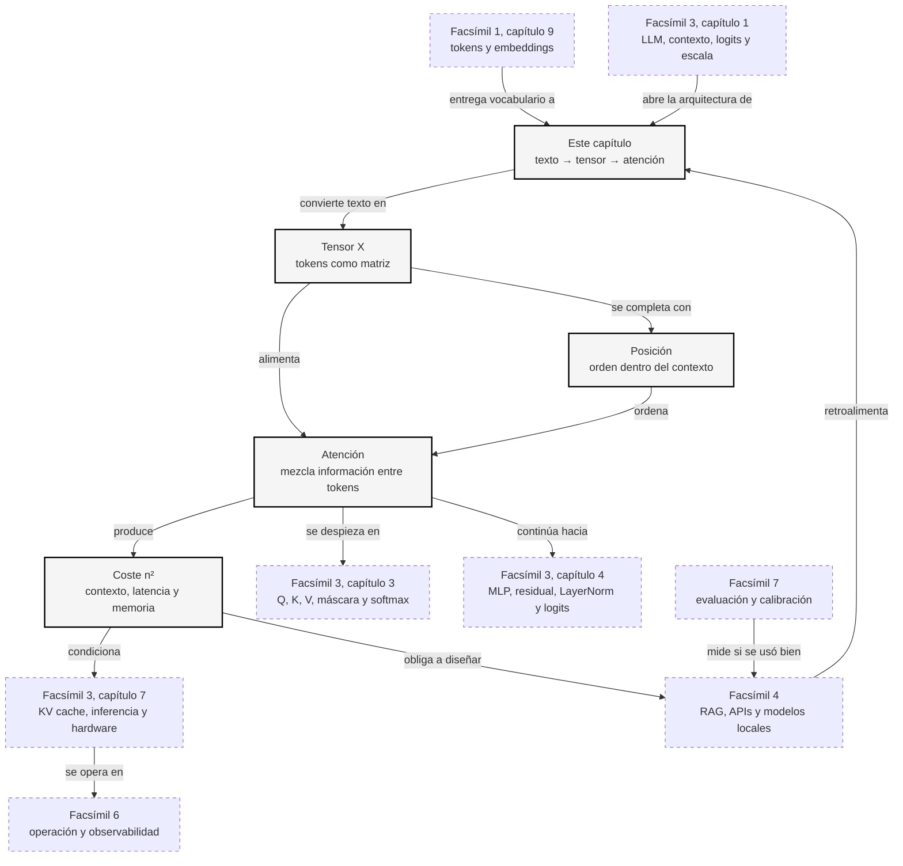

::: {.fasciculo-subtitle}
Facsímil 3 · Arquitecturas y modelos
:::

# Capítulo 02: Transformer por dentro: de texto a tensores y atención

## El momento en que el texto deja de ser texto

En el capítulo anterior vimos el LLM desde fuera: contexto, parámetros, logits, escala y sistema completo. Ahora vamos a abrir una puerta más pequeña y más concreta: ¿qué ocurre justo después de tokenizar?

Para nosotros, una frase sigue siendo una frase. Para el modelo, ya no. La frase se convierte en una tabla de números. Esa tabla tiene filas, columnas, tamaño, memoria y operaciones permitidas. Cuando un modelo «lee» una oración, en realidad está multiplicando matrices, sumando vectores y calculando pesos de atención.

Este capítulo va de ese paso. No vamos todavía a exprimir Q, K, V, máscara causal y softmax con todo detalle; eso será el [capítulo 03](/libro/fasciculo-03/#capitulo-03). Aquí queremos entender la carretera principal: texto → tokens → tensores → atención → representación contextual.

## Qué no es un Transformer

Un Transformer no es una lista de reglas gramaticales. No tiene una tabla escrita a mano con «si aparece sujeto, busca verbo». Aprende transformaciones numéricas durante entrenamiento y las aplica a vectores.

Tampoco es una memoria que recorra el texto palabra por palabra como una persona leyendo en voz alta. Antes de los Transformers, muchas arquitecturas secuenciales procesaban una posición tras otra y llevaban un estado interno hacia delante.^[Sutskever, I., Vinyals, O. y Le, Q. V. (2014). Sequence to sequence learning with neural networks. En *Advances in Neural Information Processing Systems 27* (pp. 3104-3112). https://papers.nips.cc/paper/5346-sequence-to-sequence-learning-with-neural-networks. Los modelos sequence-to-sequence con redes recurrentes fueron un paso clave para traducir y generar secuencias antes del dominio del Transformer.] Eso funcionaba, pero tenía un cuello de botella: si cada paso depende del paso anterior, paralelizar se vuelve más difícil.

Y no es «atención humana» en sentido psicológico. La palabra atención es útil, pero técnica: significa calcular pesos para mezclar información. Si un token atiende a otro, no está «pensando» en él. Está usando su vector para decidir cuánto de otro vector debe entrar en la nueva representación.

## Qué sí es un Transformer

Un Transformer es una arquitectura de red neuronal diseñada para procesar secuencias mediante atención y operaciones paralelas sobre matrices.^[Vaswani, A., Shazeer, N., Parmar, N., Uszkoreit, J., Jones, L., Gomez, A. N., Kaiser, Ł. y Polosukhin, I. (2017). Attention is all you need. En *Advances in Neural Information Processing Systems 30* (pp. 5998-6008). https://papers.nips.cc/paper/7181-attention-is-all-you-need. El artículo presentó una arquitectura sin recurrencia ni convolución, basada en atención, capaz de entrenar modelos de secuencia de forma mucho más paralela.]

La idea central es sencilla de decir y potente de ejecutar: cada token empieza con un vector, y cada capa transforma ese vector usando información de otros tokens. Al final, el vector de cada posición ya no representa solo ese token aislado, sino ese token **dentro de su contexto**.

Por ejemplo, en estas dos frases:

> Me senté en el banco  
> El banco aprobó el préstamo

El token «banco» podría empezar con un embedding parecido en ambos casos. Pero tras pasar por atención, su representación debería cambiar: en la primera frase se acerca a asiento; en la segunda, a entidad financiera. El Transformer no recibe una definición explícita: aprende a usar el contexto.

La atención moderna no apareció de la nada. Antes del Transformer, Bahdanau, Cho y Bengio ya habían mostrado que un modelo de traducción podía aprender a alinear partes de una frase origen con partes de una frase destino.^[Bahdanau, D., Cho, K. y Bengio, Y. (2015). Neural machine translation by jointly learning to align and translate. En *International Conference on Learning Representations*. https://arxiv.org/abs/1409.0473. El trabajo introdujo un mecanismo de atención para traducción neuronal que permitía al decodificador consultar partes relevantes de la entrada.] Luong, Pham y Manning estudiaron variantes eficaces de atención para traducción neuronal.^[Luong, M.-T., Pham, H. y Manning, C. D. (2015). Effective approaches to attention-based neural machine translation. En *Proceedings of the 2015 Conference on Empirical Methods in Natural Language Processing* (pp. 1412-1421). https://doi.org/10.18653/v1/D15-1166. El artículo comparó formas prácticas de calcular atención en traducción automática neuronal.] El salto del Transformer fue llevar esa intuición al centro de la arquitectura.

## El paper original: por qué fue tan raro y tan importante

El paper **“Attention Is All You Need”** se envió a arXiv el 12 de junio de 2017 y fue presentado en NeurIPS 2017.^[Vaswani, A., Shazeer, N., Parmar, N., Uszkoreit, J., Jones, L., Gomez, A. N., Kaiser, Ł. y Polosukhin, I. (2017). Attention is all you need. En *Advances in Neural Information Processing Systems 30* (pp. 5998-6008). https://arxiv.org/abs/1706.03762. La página de arXiv muestra la fecha de envío, los autores y el resumen del trabajo.] Lo firmaron ocho autores: **Ashish Vaswani, Noam Shazeer, Niki Parmar, Jakob Uszkoreit, Llion Jones, Aidan N. Gomez, Łukasz Kaiser e Illia Polosukhin**.

La propuesta era incómoda para su época porque quitaba dos muletas habituales en modelos de secuencia: recurrencia y convolución. Hasta entonces, para traducir o generar secuencias era normal procesar tokens en orden, mantener un estado oculto y apoyarse en atención como complemento. El Transformer dijo: probemos a construir toda la arquitectura alrededor de atención.

El paper original no nació pensando en chats modernos. Su tarea principal era **traducción automática**. La entrada era una frase en un idioma y la salida una frase en otro. La arquitectura completa tenía dos mitades:

| Parte del paper | Qué hacía | Cómo lo leemos hoy |
|---|---|---|
| **Encoder** | Leía toda la frase de entrada y construía representaciones contextuales. | Se parece a modelos de comprensión como BERT. |
| **Decoder** | Generaba la frase de salida token a token mirando lo ya generado. | Se parece a la familia GPT cuando hablamos de generación autoregresiva. |
| **Atención encoder-decoder** | Permitía que cada token generado mirase partes relevantes de la entrada. | Es una forma temprana de conectar generación con contexto fuente. |
| **Multi-head attention** | Usaba varias atenciones en paralelo para capturar relaciones distintas. | En el [capítulo 03](/libro/fasciculo-03/#capitulo-03) veremos por qué varias cabezas miran patrones distintos. |
| **Feed-forward, residual y normalización** | Completaba cada bloque para hacerlo entrenable y expresivo. | En el [capítulo 04](/libro/fasciculo-03/#capitulo-04) lo abriremos despacio. |

La idea que debemos llevarnos no es «inventaron los LLMs de golpe». Es más precisa: inventaron una arquitectura que hacía mucho más natural entrenar modelos grandes de secuencias con paralelismo y atención directa. Los LLMs modernos heredan esa carretera y la llevan a otra escala.

## De tokens a tensores

Empezamos con texto:

```text
El banco aprobó el préstamo
```

El tokenizador lo convierte en identificadores. No importa ahora si salen cinco o seis tokens; usemos cinco para entender el mecanismo:

$$
I = [i_1, i_2, i_3, i_4, i_5]
$$

| Símbolo | Significado | Ejemplo |
|---|---|---|
| \(I\) | Secuencia de identificadores de token. | \([42, 981, 774, 42, 1503]\). |
| \(i_t\) | Identificador del token en la posición \(t\). | \(i_2 = 981\) para «banco». |
| \(t\) | Posición dentro de la secuencia. | \(t=1\) es el primer token. |

Cada identificador selecciona una fila de la matriz de embeddings:

$$
E \in \mathbb{R}^{V \times d_{\text{model}}}
$$

| Símbolo | Significado | Ejemplo |
|---|---|---|
| \(E\) | Matriz de embeddings aprendida. | Una tabla gigante de vectores. |
| \(V\) | Tamaño del vocabulario. | 100 000 tokens posibles. |
| \(d_{\text{model}}\) | Dimensión interna del modelo. | 4096 números por token. |
| \(\mathbb{R}\) | Conjunto de números reales. | Valores como 0,37 o -1,12. |

Después de buscar esas filas, obtenemos una matriz:

$$
X = E[I] + P_{1:n}
$$

| Símbolo | Significado | Ejemplo |
|---|---|---|
| \(X\) | Tensor de entrada al Transformer. | Una matriz de \(5 \times 4096\). |
| \(E[I]\) | Filas de embedding seleccionadas por los IDs. | Los vectores de «El», «banco», «aprobó»... |
| \(P_{1:n}\) | Información de posición para las \(n\) posiciones. | Permite distinguir «perro muerde hombre» de «hombre muerde perro». |
| \(n\) | Número de tokens de la secuencia. | \(n=5\). |

Este punto es importante: el Transformer no recibe una frase como texto. Recibe un tensor. Esa forma de pensar —representar datos como vectores, matrices y transformaciones diferenciables— es la base común del *deep learning* moderno.^[Goodfellow, I., Bengio, Y. y Courville, A. (2016). *Deep learning*. MIT Press. https://www.deeplearningbook.org. El libro presenta las redes profundas como composiciones de funciones diferenciables sobre tensores, justo el marco matemático que usamos aquí para leer el Transformer.] En la práctica, si procesamos una sola frase con 5 tokens y \(d_{\text{model}}=4\) para simplificar, podríamos imaginar algo así:

| Token | Vector interno simplificado |
|---|---|
| El | \([0{,}20,\ 0{,}10,\ -0{,}30,\ 0{,}40]\) |
| banco | \([0{,}80,\ -0{,}20,\ 0{,}10,\ 0{,}50]\) |
| aprobó | \([0{,}10,\ 0{,}70,\ 0{,}20,\ -0{,}10]\) |
| el | \([0{,}18,\ 0{,}08,\ -0{,}25,\ 0{,}36]\) |
| préstamo | \([0{,}60,\ 0{,}40,\ 0{,}70,\ 0{,}20]\) |

En un modelo real no habría 4 columnas, sino cientos o miles. Pero la idea es la misma: una fila por token, una columna por dimensión interna.

## La atención como mesa de mezclas

La atención responde a una pregunta: para actualizar la representación de este token, ¿cuánto debería mezclar información de los demás tokens?

En una capa de atención simplificada, el modelo calcula tres proyecciones desde \(X\):

$$
Q = XW_Q,\quad K = XW_K,\quad V = XW_V
$$

| Símbolo | Significado | Ejemplo |
|---|---|---|
| \(Q\) | Consultas (*queries*): qué busca cada token. | «banco» pregunta qué contexto le da sentido. |
| \(K\) | Claves (*keys*): qué ofrece cada token para ser encontrado. | «préstamo» ofrece pista financiera. |
| \(V\) | Valores (*values*): información que se mezclará si recibe atención. | Vector que aporta contenido al resultado. |
| \(W_Q, W_K, W_V\) | Matrices aprendidas que proyectan \(X\). | Parámetros entrenados. |

Después se calculan puntuaciones comparando consultas con claves:

$$
S = \frac{QK^T}{\sqrt{d_k}}
$$

| Símbolo | Significado | Ejemplo |
|---|---|---|
| \(S\) | Matriz de puntuaciones de atención. | Una tabla \(n \times n\). |
| \(QK^T\) | Producto entre consultas y claves. | Mide afinidad entre posiciones. |
| \(d_k\) | Dimensión de las claves. | 64, 128 u otra dimensión por cabeza. |
| \(\sqrt{d_k}\) | Escalado para estabilizar valores. | Si \(d_k=64\), dividimos por 8. |

Convertimos esas puntuaciones en pesos con softmax:

$$
A = \operatorname{softmax}(S)
$$

| Símbolo | Significado | Ejemplo |
|---|---|---|
| \(A\) | Matriz de atención. | Cada fila suma 1. |
| \(\operatorname{softmax}\) | Convierte puntuaciones en pesos positivos. | 2,0 se vuelve más importante que 0,2. |
| \(A_{ij}\) | Peso con el que el token \(i\) mira al token \(j\). | «banco» mira a «préstamo» con peso alto. |

Por último, mezclamos los valores:

$$
O = AV
$$

| Símbolo | Significado | Ejemplo |
|---|---|---|
| \(O\) | Salida de atención. | Nueva representación contextual. |
| \(A\) | Pesos de mezcla. | Cuánto mirar a cada token. |
| \(V\) | Valores disponibles para mezclar. | Información que aporta cada posición. |

Leído sin símbolos: cada token produce una pregunta, compara esa pregunta con las claves de todos los tokens, convierte las coincidencias en pesos y mezcla valores según esos pesos. Eso es atención.

## Cómo funcionaría una pasada completa

Ahora juntemos las piezas sin perdernos. Imagina que queremos generar una respuesta a partir del prompt:

```text
Resume este contrato en tres puntos
```

Una pasada de inferencia, simplificada, seguiría estos pasos:

1. **Tokenizar.** El texto se trocea en IDs: el modelo no recibe caracteres, recibe números.
2. **Buscar embeddings.** Cada ID selecciona una fila de la matriz \(E\).
3. **Añadir posición.** A cada vector se le suma o aplica información de orden para distinguir la primera posición de la segunda.
4. **Construir el tensor \(X\).** La entrada queda como una matriz \(n \times d_{\text{model}}\).
5. **Proyectar a \(Q\), \(K\), \(V\).** Cada capa aprende tres formas de mirar la misma entrada: qué busca, qué ofrece y qué información puede mezclar.
6. **Calcular atención.** Se comparan consultas y claves, se aplica softmax y se obtiene una matriz de pesos.
7. **Mezclar valores.** Cada token recibe una combinación ponderada de información del contexto.
8. **Pasar por residual, normalización y MLP.** La representación se estabiliza y se transforma dentro del bloque.
9. **Repetir capas.** Un modelo real tiene muchas capas; cada una refina las representaciones.
10. **Proyectar a logits.** El último vector se convierte en puntuaciones para todos los tokens del vocabulario.
11. **Elegir el siguiente token.** El sistema aplica temperatura, `top_p`, `top_k` u otra política de generación.
12. **Volver a empezar.** El token elegido se añade al contexto y la siguiente pasada genera el siguiente token.

Si lo escribimos como pseudocódigo conceptual:

```text
ids = tokenizador(texto)
X = embeddings(ids) + posicion(ids)

para cada bloque Transformer:
    Q = X W_Q
    K = X W_K
    V = X W_V
    A = softmax(Q K^T / sqrt(d_k))
    X = normalizacion(X + A V)
    X = normalizacion(X + MLP(X))

logits = X_ultimo W_vocab
siguiente_token = muestrear(logits)
```

Ese pseudocódigo no sirve para entrenar un modelo real, pero sí para orientarse. Si alguna vez te pierdes, vuelve a la pregunta: ¿en qué punto estoy? ¿Tokenizando, mezclando contexto, transformando representación o eligiendo el siguiente token?

## Un ejemplo pequeño con números

Usemos solo tres tokens para mirar la fila de atención de «banco»:

```text
El banco aprobó
```

Imagina que, después de proyectar consultas y claves, las puntuaciones de «banco» hacia cada token son:

| Token al que mira «banco» | Puntuación |
|---|---:|
| El | 0,2 |
| banco | 2,0 |
| aprobó | 1,0 |

Aplicamos softmax:

$$
\operatorname{softmax}([0{,}2,\ 2{,}0,\ 1{,}0]) \approx [0{,}108,\ 0{,}652,\ 0{,}240]
$$

| Valor | Significado | Lectura |
|---|---|---|
| 0,108 | Peso hacia «El». | Aporta poco. |
| 0,652 | Peso hacia «banco». | Mantiene mucho de sí mismo. |
| 0,240 | Peso hacia «aprobó». | Aporta contexto de acción. |

Ahora supongamos valores simplificados de dos dimensiones:

| Token | Valor \(V\) |
|---|---|
| El | \([0{,}1,\ 0{,}0]\) |
| banco | \([1{,}0,\ 0{,}2]\) |
| aprobó | \([0{,}4,\ 1{,}0]\) |

La nueva representación de «banco» es la mezcla ponderada:

$$
o_{\text{banco}} =
0{,}108[0{,}1,\ 0{,}0] +
0{,}652[1{,}0,\ 0{,}2] +
0{,}240[0{,}4,\ 1{,}0]
$$

Resultado:

$$
o_{\text{banco}} \approx [0{,}759,\ 0{,}370]
$$

| Símbolo | Significado | Ejemplo |
|---|---|---|
| \(o_{\text{banco}}\) | Vector contextualizado del token «banco». | Ya no es solo el embedding inicial. |
| \(0{,}652[1{,}0,\ 0{,}2]\) | Parte que conserva de sí mismo. | El token sigue siendo «banco». |
| \(0{,}240[0{,}4,\ 1{,}0]\) | Parte que recibe de «aprobó». | El verbo cambia el sentido posible. |

Esto es pequeño, casi de juguete, pero contiene la intuición completa. La atención no reemplaza el token: lo contextualiza.

Dentro de un bloque Transformer hay más piezas además de atención. Las conexiones residuales permiten que la información original siga circulando a través de capas profundas, una idea que se volvió central tras ResNet.^[He, K., Zhang, X., Ren, S. y Sun, J. (2016). Deep residual learning for image recognition. En *Proceedings of the IEEE Conference on Computer Vision and Pattern Recognition* (pp. 770-778). https://doi.org/10.1109/CVPR.2016.90. Aunque ResNet nació en visión por computador, popularizó las conexiones residuales que ayudan a entrenar redes muy profundas.] La normalización por capa ayuda a estabilizar las activaciones dentro de la red.^[Ba, J. L., Kiros, J. R. y Hinton, G. E. (2016). *Layer normalization*. https://arxiv.org/abs/1607.06450. LayerNorm normaliza activaciones dentro de una capa y se convirtió en una pieza habitual de arquitecturas Transformer.] En el [capítulo 04](/libro/fasciculo-03/#capitulo-04) entraremos con calma en residual, normalización, MLP y logits.

## Simuladores para verlo funcionando

Hay conceptos que se entienden mejor cuando los ves moverse. Estos recursos no sustituyen al capítulo, pero ayudan mucho a mirar la arquitectura con las manos:

| Recurso | Qué puedes mirar | Cuándo abrirlo |
|---|---|---|
| [Transformer Explainer](https://poloclub.github.io/transformer-explainer/) | Visualiza un GPT-2 pequeño en el navegador, con flujo de tokens, componentes internos y predicción del siguiente token.^[Cho, A., Kim, G. C., Karpekov, A., Helbling, A., Wang, Z. J., Lee, S., Hoover, B. y Chau, D. H. (2025). Transformer Explainer: interactive learning of text-generative models. En *Proceedings of the AAAI Conference on Artificial Intelligence*. https://ojs.aaai.org/index.php/AAAI/article/download/35347/37502. El artículo describe la herramienta como una visualización web interactiva que ejecuta un modelo GPT-2 localmente en el navegador.] | Después de «Cómo funcionaría una pasada completa». |
| [LLM Visualization](https://bbycroft.net/llm) | Un recorrido 3D por un Transformer estilo GPT, con capas, atención y operaciones internas.^[Bycroft, B. (2023). *LLM Visualization*. https://bbycroft.net/llm. Visualización interactiva 3D de un modelo Transformer estilo GPT.] | Cuando quieras una intuición espacial de las capas. |
| [The Illustrated Transformer](https://jalammar.github.io/illustrated-transformer/) | Explicación visual paso a paso del Transformer original, muy buena para fijar encoder, decoder y atención.^[Alammar, J. (2018). *The Illustrated Transformer*. https://jalammar.github.io/illustrated-transformer/. Recurso visual ampliamente usado para entender la arquitectura Transformer.] | Antes o después de leer el bloque del paper original. |
| [The Annotated Transformer](https://nlp.seas.harvard.edu/annotated-transformer/) | Implementación anotada del paper, con código y explicación matemática.^[Rush, A. M. (2018). *The Annotated Transformer*. https://nlp.seas.harvard.edu/annotated-transformer/. Implementación comentada de la arquitectura Transformer original.] | Cuando ya quieras pasar de dibujo a código. |

Una forma útil de usarlos: primero abre Transformer Explainer y escribe una frase corta. Mira cómo cambia la distribución del siguiente token. Después vuelve al pseudocódigo de este capítulo y localiza en qué parte del simulador está cada paso. Si una visualización te abruma, no intentes entender todo a la vez: busca solo tokens, atención y logits.

<svg id="f3-c02-texto-tensores-atencion" xmlns="http://www.w3.org/2000/svg" viewBox="0 0 980 760" role="img" aria-label="Del texto a tensores y atención: tokens, matriz de embeddings, matriz de atención y salida contextual">
  <title>Del texto a tensores y atención</title>
  <defs>
    <marker id="f3c02-arrow" viewBox="0 0 10 10" refX="9" refY="5" markerWidth="6" markerHeight="6" orient="auto">
      <path d="M 0 0 L 10 5 L 0 10 z" fill="#333333"/>
    </marker>
  </defs>
  <rect x="20" y="20" width="940" height="700" rx="18" fill="#FFFFFF" stroke="#111111" stroke-width="1.4"/>
  <text x="490" y="58" text-anchor="middle" font-family="Arial, sans-serif" font-size="24" font-weight="700" fill="#111111">Transformer: de texto a atención</text>
  <text x="490" y="84" text-anchor="middle" font-family="Arial, sans-serif" font-size="13" fill="#666666">La frase se convierte en una matriz; la atención decide cómo se mezcla la información entre posiciones.</text>

  <rect x="70" y="122" width="840" height="96" rx="16" fill="#F6F6F6" stroke="#111111" stroke-width="1.3"/>
  <text x="100" y="152" font-family="Arial, sans-serif" font-size="13" font-weight="700" fill="#555555">TEXTO Y TOKENS</text>
  <g font-family="Arial, sans-serif">
    <rect x="150" y="168" width="128" height="32" rx="8" fill="#FFFFFF" stroke="#111111"/>
    <rect x="302" y="168" width="128" height="32" rx="8" fill="#FFFFFF" stroke="#111111"/>
    <rect x="454" y="168" width="128" height="32" rx="8" fill="#FFFFFF" stroke="#111111"/>
    <rect x="606" y="168" width="128" height="32" rx="8" fill="#FFFFFF" stroke="#111111"/>
    <text x="214" y="189" text-anchor="middle" font-size="13" font-weight="700">El</text>
    <text x="366" y="189" text-anchor="middle" font-size="13" font-weight="700">banco</text>
    <text x="518" y="189" text-anchor="middle" font-size="13" font-weight="700">aprobó</text>
    <text x="670" y="189" text-anchor="middle" font-size="13" font-weight="700">préstamo</text>
  </g>

  <line x1="490" y1="232" x2="490" y2="266" stroke="#333333" stroke-width="1.5" marker-end="url(#f3c02-arrow)"/>
  <text x="512" y="254" font-family="Arial, sans-serif" font-size="12" fill="#666666">lookup + posición</text>

  <rect x="70" y="286" width="250" height="230" rx="16" fill="#FFFFFF" stroke="#111111" stroke-width="1.3"/>
  <text x="100" y="316" font-family="Arial, sans-serif" font-size="13" font-weight="700" fill="#555555">TENSOR X</text>
  <text x="195" y="342" text-anchor="middle" font-family="Menlo, monospace" font-size="13" fill="#111111">X ∈ R^(n × d_model)</text>
  <g stroke="#777777" stroke-width="1">
    <rect x="105" y="370" width="180" height="108" fill="#FFFFFF"/>
    <line x1="105" y1="397" x2="285" y2="397"/>
    <line x1="105" y1="424" x2="285" y2="424"/>
    <line x1="105" y1="451" x2="285" y2="451"/>
    <line x1="150" y1="370" x2="150" y2="478"/>
    <line x1="195" y1="370" x2="195" y2="478"/>
    <line x1="240" y1="370" x2="240" y2="478"/>
  </g>
  <g font-family="Arial, sans-serif" font-size="11" fill="#555555">
    <text x="92" y="388">El</text>
    <text x="74" y="415">banco</text>
    <text x="73" y="442">aprobó</text>
    <text x="55" y="469">préstamo</text>
    <text x="126" y="498">dimensiones internas</text>
  </g>

  <line x1="330" y1="402" x2="372" y2="402" stroke="#333333" stroke-width="1.5" marker-end="url(#f3c02-arrow)"/>

  <rect x="382" y="276" width="216" height="252" rx="16" fill="#F6F6F6" stroke="#111111" stroke-width="1.5"/>
  <text x="490" y="310" text-anchor="middle" font-family="Arial, sans-serif" font-size="17" font-weight="700" fill="#111111">Bloque Transformer</text>
  <rect x="418" y="340" width="144" height="34" rx="8" fill="#FFFFFF" stroke="#999999"/>
  <text x="490" y="362" text-anchor="middle" font-family="Arial, sans-serif" font-size="12">atención</text>
  <rect x="418" y="390" width="144" height="34" rx="8" fill="#FFFFFF" stroke="#999999"/>
  <text x="490" y="412" text-anchor="middle" font-family="Arial, sans-serif" font-size="12">residual + norma</text>
  <rect x="418" y="440" width="144" height="34" rx="8" fill="#FFFFFF" stroke="#999999"/>
  <text x="490" y="462" text-anchor="middle" font-family="Arial, sans-serif" font-size="12">MLP</text>
  <text x="490" y="504" text-anchor="middle" font-family="Menlo, monospace" font-size="12" fill="#111111">X → X'</text>

  <line x1="608" y1="402" x2="650" y2="402" stroke="#333333" stroke-width="1.5" marker-end="url(#f3c02-arrow)"/>

  <rect x="660" y="286" width="250" height="230" rx="16" fill="#FFFFFF" stroke="#111111" stroke-width="1.3"/>
  <text x="690" y="316" font-family="Arial, sans-serif" font-size="13" font-weight="700" fill="#555555">MATRIZ DE ATENCIÓN</text>
  <text x="785" y="342" text-anchor="middle" font-family="Menlo, monospace" font-size="13" fill="#111111">A ∈ R^(n × n)</text>
  <g stroke="#777777" stroke-width="1">
    <rect x="716" y="370" width="136" height="136" fill="#FFFFFF"/>
    <line x1="750" y1="370" x2="750" y2="506"/>
    <line x1="784" y1="370" x2="784" y2="506"/>
    <line x1="818" y1="370" x2="818" y2="506"/>
    <line x1="716" y1="404" x2="852" y2="404"/>
    <line x1="716" y1="438" x2="852" y2="438"/>
    <line x1="716" y1="472" x2="852" y2="472"/>
    <rect x="750" y="404" width="34" height="34" fill="#111111"/>
    <rect x="818" y="404" width="34" height="34" fill="#8C8C8C"/>
    <rect x="784" y="438" width="34" height="34" fill="#CFCFCF"/>
  </g>
  <text x="785" y="542" text-anchor="middle" font-family="Arial, sans-serif" font-size="12" fill="#666666">cada fila dice qué mezcla cada token</text>

  <rect x="160" y="582" width="660" height="58" rx="16" fill="#111111"/>
  <text x="490" y="607" text-anchor="middle" font-family="Arial, sans-serif" font-size="14" font-weight="700" fill="#FFFFFF">salida contextualizada</text>
  <text x="490" y="628" text-anchor="middle" font-family="Arial, sans-serif" font-size="12" fill="#FFFFFF">el vector de «banco» ya incorpora pistas de «aprobó» y «préstamo»</text>

  <text x="940" y="704" text-anchor="end" font-family="Arial, sans-serif" font-size="10" fill="#9A9A9A">IA para gente curiosa / Facsímil 03 / Capítulo 02 / 686f6c61</text>
</svg>

## Por qué el Transformer cambió el juego

La ventaja práctica del Transformer está en dos ideas que se refuerzan.

**Primera: paralelismo.** En una arquitectura recurrente clásica, procesar el token 200 depende de haber procesado antes los 199 tokens previos. En un Transformer, muchas operaciones se expresan como multiplicaciones de matrices. Eso encaja muy bien con GPU y TPU, que son máquinas excelentes para operar con bloques grandes de números.

**Segunda: acceso directo al contexto.** Si el token de la posición 200 necesita información de la posición 12, la atención puede crear una conexión directa dentro de la matriz. No necesita transportar todo a través de un único estado oculto. Esa es una de las razones por las que el Transformer se volvió la arquitectura dominante para modelos grandes de lenguaje.

Pero no todo es gratis. La atención estándar compara cada token con cada token. Si hay \(n\) tokens, la matriz de atención tiene \(n \times n\) entradas:

$$
\text{coste de atención} \propto n^2
$$

| Símbolo | Significado | Ejemplo |
|---|---|---|
| \(n\) | Número de tokens de contexto. | 1 000 tokens. |
| \(n^2\) | Comparaciones entre posiciones. | 1 000 000 relaciones posibles. |
| \(\propto\) | «Proporcional a». | Si duplicas \(n\), el coste crece aproximadamente por cuatro. |

Esto explica por qué el contexto largo es tan valioso y tan caro. No basta con decir «metamos más texto». El diseño del sistema debe decidir qué entra, qué se resume, qué se recupera con RAG y qué conviene dejar fuera.

Además, no todos los Transformers leen igual. BERT usa una arquitectura orientada a entender texto mirando a ambos lados del contexto, muy útil para tareas de comprensión.^[Devlin, J., Chang, M. W., Lee, K. y Toutanova, K. (2019). BERT: pre-training of deep bidirectional transformers for language understanding. En *Proceedings of NAACL-HLT* (pp. 4171-4186). https://doi.org/10.18653/v1/N19-1423. BERT popularizó el preentrenamiento bidireccional con Transformer encoder para comprensión de lenguaje.] La familia GPT usa el enfoque autoregresivo: predice el siguiente token mirando el contexto disponible hacia atrás, que es la base de los LLMs generativos modernos.^[Brown, T. B. et al. (2020). Language models are few-shot learners. En *Advances in Neural Information Processing Systems 33* (pp. 1877-1901). https://papers.nips.cc/paper/2020/hash/1457c0d6bfcb4967418bfb8ac142f64a-Abstract.html. GPT-3 mostró que un Transformer decoder autoregresivo a gran escala podía realizar muchas tareas mediante ejemplos en el propio prompt.]

## Esto en un proyecto real

Cuando integras un modelo en una aplicación, rara vez manipulas \(Q\), \(K\), \(V\) a mano. Pero sí pagas sus consecuencias.

**Diseñar prompts largos.** Si añades instrucciones, documentos, historial y ejemplos, estás aumentando \(n\). Más tokens significan más memoria, más latencia y más coste. Este capítulo te ayuda a entender por qué el contexto debe diseñarse, no solo rellenarse.

**Elegir entre modelos.** Dos modelos pueden tener calidades parecidas, pero arquitecturas internas distintas. Uno puede ser más rápido con contexto corto; otro puede estar optimizado para contexto largo. Cuando leas una ficha técnica, «context window», «attention implementation», «KV cache» y «throughput» dejan de ser palabras decorativas.

**Depurar respuestas raras.** A veces el problema no está en que el modelo «no sepa», sino en que la información relevante no está en el contexto, queda enterrada entre demasiado ruido o llega en un formato difícil de usar. Entender atención te recuerda que el modelo mezcla señales: si la señal útil está muy diluida, la salida también puede estarlo.

**Conectar con RAG.** En [RAG](/libro/fasciculo-04/), no meteremos todos los documentos en el prompt. Recuperaremos fragmentos. La razón no es solo comodidad: es arquitectura. El contexto es una ventana cara y limitada.

## Por qué debería importarte

Porque el Transformer es la bisagra entre «texto» y «sistema de IA moderno». Si solo sabes que los LLMs predicen tokens, entiendes el comportamiento externo. Si además entiendes tensores y atención, empiezas a leer por dentro por qué el contexto importa, por qué el orden importa, por qué el coste crece y por qué algunos errores se arreglan cambiando el contexto en vez de cambiando de modelo.

También te prepara para el capítulo siguiente. Q, K, V, máscara causal y softmax no son nombres sueltos: son las piezas concretas que hacen posible esta mesa de mezclas.

## Dónde volverá a aparecer

| Concepto de este capítulo | Dónde vuelve en el libro | Por qué se conecta |
|---|---|---|
| **Tensor \(X\)** | [Facsímil 1, capítulo 9](/libro/fasciculo-01/#capitulo-09); [facsímil 3, capítulo 3](/libro/fasciculo-03/#capitulo-03). | Los embeddings dejan de ser una idea abstracta: se convierten en una matriz que entra en el Transformer. |
| **Atención** | [Facsímil 3, capítulo 3](/libro/fasciculo-03/#capitulo-03); [capítulo 4](/libro/fasciculo-03/#capitulo-04); [capítulo 7](/libro/fasciculo-03/#capitulo-07). | Primero veremos Q, K, V; después cómo la salida llega a logits; y más adelante cómo se optimiza la inferencia. |
| **Posición** | [Facsímil 3, capítulo 3](/libro/fasciculo-03/#capitulo-03); [facsímil 5](/libro/fasciculo-05/). | El orden del contexto afecta a qué puede usar el modelo y a cómo diseñamos memoria conversacional. |
| **Coste \(n^2\)** | [Facsímil 3, capítulo 7](/libro/fasciculo-03/#capitulo-07); [facsímil 6](/libro/fasciculo-06/). | Contexto, batch, caché y latencia se vuelven decisiones de operación. |
| **Representación contextual** | [Facsímil 4](/libro/fasciculo-04/); [facsímil 7](/libro/fasciculo-07/). | RAG y evaluación dependen de que el modelo use bien las señales que le damos. |
| **Encoder y decoder** | [Facsímil 3, capítulo 5](/libro/fasciculo-03/#capitulo-05). | BERT, GPT, encoder-decoder y modelos multimodales comparten familia, pero no la misma dirección de lectura. |
| **Simuladores visuales** | [Facsímil 3, capítulo 3](/libro/fasciculo-03/#capitulo-03); [facsímil 3, capítulo 7](/libro/fasciculo-03/#capitulo-07). | Los volveremos a usar para mirar cabezas de atención, KV cache y coste de inferencia con más criterio. |

## Dónde solía tropezar yo

| Error | Por qué es un error | Antídoto |
|---|---|---|
| **Pensar que el tensor es un detalle de implementación** | El tensor \(X\) define cuántos tokens hay, cuántas dimensiones maneja el modelo y qué coste tendrá procesar la entrada. | Cuando leas una arquitectura, pregunta siempre por las formas: \(n\), \(d_{\text{model}}\), capas y cabezas. |
| **Creer que atención es explicación perfecta** | Un peso de atención alto indica mezcla de información, pero no equivale automáticamente a una explicación humana completa. | Úsala como pista técnica, no como prueba definitiva de causalidad. |
| **Olvidar la posición** | Si solo sumas embeddings de tokens sin posición, pierdes orden. Y en lenguaje, el orden cambia el significado. | Repite mentalmente: token + posición = entrada útil para secuencia. |
| **Meter todo en contexto por tranquilidad** | Más contexto puede añadir ruido, coste y latencia. No todo lo disponible es útil. | Recupera, resume y ordena. El contexto es una superficie de diseño. |
| **Separar demasiado los capítulos** | Tokens, embeddings, atención, logits y evaluación parecen temas distintos, pero son una cadena. | Sigue el flujo: texto → tensor → atención → logits → decisión de producto. |

## Manos a la obra

La práctica real está en `labs/f3/c02-attention-mixer/`. El kit calcula una fila de atención en Python puro y muestra cómo un token mezcla vectores de valor. La idea no es optimizar: es ver el mecanismo completo antes de hablar de Transformers grandes.

| Archivo | Qué contiene |
|---|---|
| `data/attention_case.json` | Tokens, puntuaciones y vectores de valor. |
| `contracts/attention_policy.json` | Token observado y umbrales de suma de pesos. |
| `ops/run_attention_mixer.py` | Softmax estable y mezcla ponderada. |
| `output/attention_mixer_report.json` | Pesos y vector contextual. |
| `output/attention_mixer_decision.md` | Lectura técnica. |

Ejecuta:

```bash
cd labs/f3/c02-attention-mixer
python3 ops/run_attention_mixer.py --write
cat output/attention_mixer_decision.md
```

Como gate:

```bash
python3 ops/run_attention_mixer.py --write --fail-on-invalid
```

**Qué entregaría un alumno.** El Markdown generado, una variante de puntuaciones y una explicación de qué token domina el vector contextual y por qué.

## Cómo encaja todo

Este mapa baja un nivel respecto al capítulo anterior. Ya no miramos solo el LLM como producto matemático: miramos cómo una frase se vuelve tensor, cómo la posición evita perder el orden y cómo la atención empieza a mezclar señales.

La conexión importante es práctica: cada vez que en facsímiles posteriores hablemos de contexto, RAG, coste o latencia, estaremos pagando decisiones que nacen aquí, en el tamaño de \(n\), \(d_{\text{model}}\) y la matriz de atención.



## Vocabulario aprendido

| Término | Definición |
|---|---|
| **Tensor** | Estructura numérica con dimensiones. Una matriz \(n \times d\) es un tensor de dos dimensiones. |
| **\(d_{\text{model}}\)** | Dimensión interna del modelo: cuántos números representan cada token dentro del Transformer. |
| **Embedding posicional** | Información que indica la posición de cada token para que el modelo no pierda el orden. |
| **Atención** | Mecanismo que calcula pesos para mezclar información entre posiciones de una secuencia. |
| **Matriz de atención** | Tabla \(n \times n\) donde cada fila indica cuánto mira un token a los demás. |
| **Consulta, clave y valor** | Tres proyecciones aprendidas que permiten preguntar, comparar y mezclar información. |
| **Residual** | Conexión que suma la entrada del bloque a su salida para no perder señal y entrenar mejor. |
| **Normalización** | Operación que estabiliza activaciones dentro de la red. |
| **Paralelismo** | Capacidad de ejecutar muchas operaciones a la vez, especialmente multiplicaciones de matrices. |

## Antes de pasar página

- [ ] ¿Puedo explicar por qué el Transformer recibe una matriz y no texto en bruto? (Si no, vuelve a «De tokens a tensores».)
- [ ] ¿Entiendo qué significa \(X \in \mathbb{R}^{n \times d_{\text{model}}}\)? (Si no, vuelve a «De tokens a tensores».)
- [ ] ¿Sé decir para qué sirve la información de posición? (Si no, vuelve a «De tokens a tensores».)
- [ ] ¿Puedo explicar la atención como una mezcla ponderada de valores? (Si no, vuelve a «La atención como mesa de mezclas».)
- [ ] ¿Puedo calcular una softmax pequeña y leer sus pesos? (Si no, vuelve a «Un ejemplo pequeño con números».)
- [ ] ¿Puedo narrar una pasada completa desde el texto hasta el siguiente token? (Si no, vuelve a «Cómo funcionaría una pasada completa».)
- [ ] ¿He abierto al menos un simulador y sé localizar tokens, atención y logits? (Si no, vuelve a «Simuladores para verlo funcionando».)
- [ ] ¿Entiendo por qué el coste de atención crece con \(n^2\)? (Si no, vuelve a «Por qué el Transformer cambió el juego».)
- [ ] ¿Sé conectar este capítulo con Q, K, V y máscara causal del capítulo siguiente? (Si no, vuelve a «Cómo encaja todo».)
- [ ] ¿Puedo explicar por qué meter más contexto no siempre mejora una aplicación? (Si no, vuelve a «Dónde solía tropezar yo».)

## En resumen

| Idea fuerza | Detalle |
|---|---|
| El texto entra al Transformer como tensor. | Después de tokenizar y buscar embeddings, la entrada tiene forma \(n \times d_{\text{model}}\): filas para tokens, columnas para dimensiones internas. |
| La atención contextualiza cada token. | Cada posición calcula pesos sobre otras posiciones y mezcla valores para construir una representación dependiente del contexto. |
| El Transformer ganó por paralelismo y acceso directo. | Procesa secuencias con operaciones matriciales y permite que posiciones lejanas se conecten sin pasar por un único estado oculto. |
| El contexto largo tiene coste real. | La matriz de atención crece como \(n^2\), así que diseñar contexto es una decisión técnica y de producto. |

## Para saber más

Alammar, J. (2018). *The Illustrated Transformer*. https://jalammar.github.io/illustrated-transformer/

Ba, J. L., Kiros, J. R. y Hinton, G. E. (2016). *Layer normalization*. https://arxiv.org/abs/1607.06450

Bahdanau, D., Cho, K. y Bengio, Y. (2015). Neural machine translation by jointly learning to align and translate. En *International Conference on Learning Representations*. https://arxiv.org/abs/1409.0473

Brown, T. B. et al. (2020). Language models are few-shot learners. En *Advances in Neural Information Processing Systems 33* (pp. 1877-1901). https://papers.nips.cc/paper/2020/hash/1457c0d6bfcb4967418bfb8ac142f64a-Abstract.html

Bycroft, B. (2023). *LLM Visualization*. https://bbycroft.net/llm

Cho, A., Kim, G. C., Karpekov, A., Helbling, A., Wang, Z. J., Lee, S., Hoover, B. y Chau, D. H. (2025). Transformer Explainer: interactive learning of text-generative models. En *Proceedings of the AAAI Conference on Artificial Intelligence*. https://ojs.aaai.org/index.php/AAAI/article/download/35347/37502

Devlin, J., Chang, M. W., Lee, K. y Toutanova, K. (2019). BERT: pre-training of deep bidirectional transformers for language understanding. En *Proceedings of NAACL-HLT* (pp. 4171-4186). https://doi.org/10.18653/v1/N19-1423

Goodfellow, I., Bengio, Y. y Courville, A. (2016). *Deep learning*. MIT Press. https://www.deeplearningbook.org

He, K., Zhang, X., Ren, S. y Sun, J. (2016). Deep residual learning for image recognition. En *Proceedings of the IEEE Conference on Computer Vision and Pattern Recognition* (pp. 770-778). https://doi.org/10.1109/CVPR.2016.90

Luong, M.-T., Pham, H. y Manning, C. D. (2015). Effective approaches to attention-based neural machine translation. En *Proceedings of the 2015 Conference on Empirical Methods in Natural Language Processing* (pp. 1412-1421). https://doi.org/10.18653/v1/D15-1166

Rush, A. M. (2018). *The Annotated Transformer*. https://nlp.seas.harvard.edu/annotated-transformer/

Sutskever, I., Vinyals, O. y Le, Q. V. (2014). Sequence to sequence learning with neural networks. En *Advances in Neural Information Processing Systems 27* (pp. 3104-3112). https://papers.nips.cc/paper/5346-sequence-to-sequence-learning-with-neural-networks

Vaswani, A., Shazeer, N., Parmar, N., Uszkoreit, J., Jones, L., Gomez, A. N., Kaiser, Ł. y Polosukhin, I. (2017). Attention is all you need. En *Advances in Neural Information Processing Systems 30* (pp. 5998-6008). https://papers.nips.cc/paper/7181-attention-is-all-you-need
