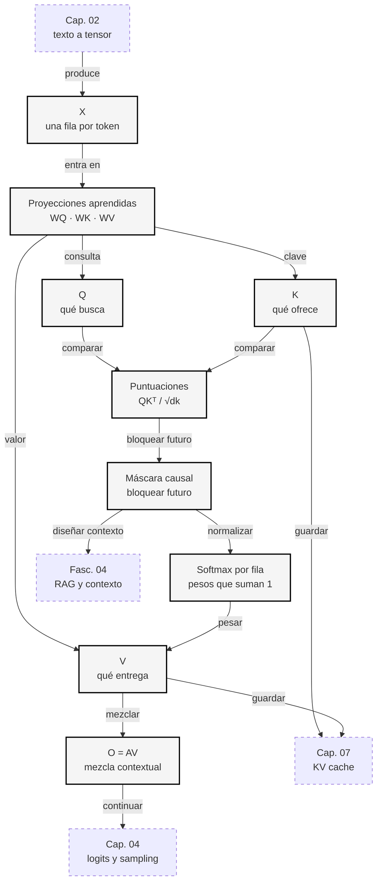
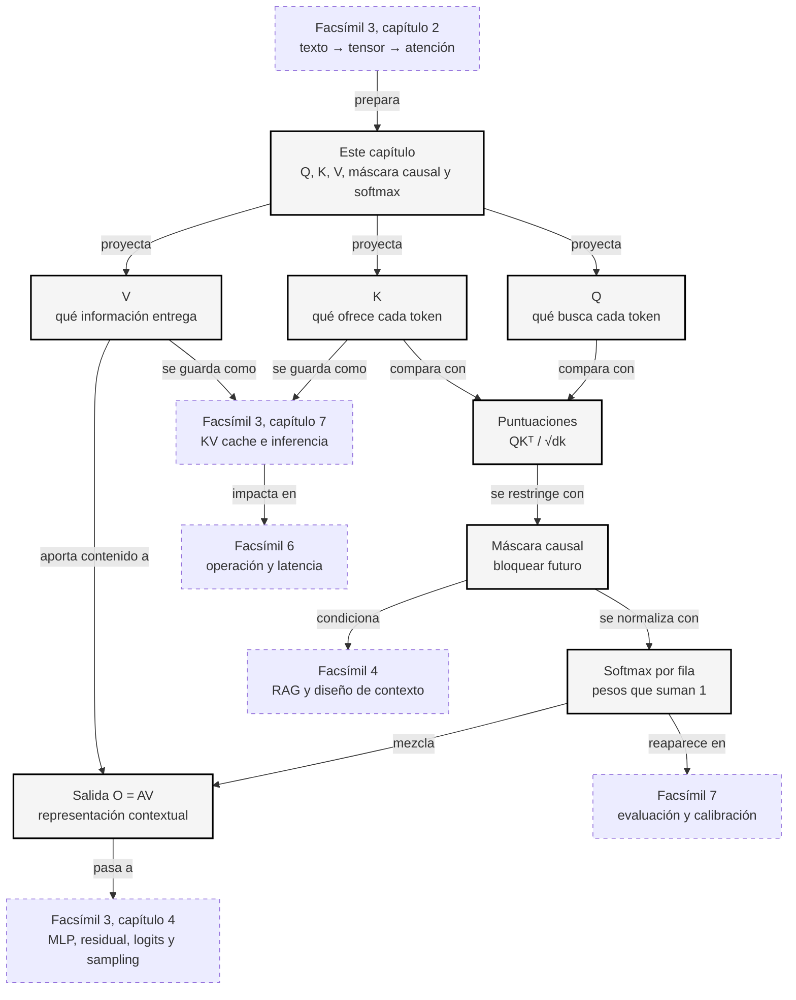

::: {.fasciculo-subtitle}
Facsímil 3 · Arquitecturas y modelos
:::

# Capítulo 03: Q, K, V, máscara causal y softmax

## La mesa de mezclas ya tiene mandos

En el capítulo anterior dijimos que la atención era una mesa de mezclas: cada token decide cuánto tomar de otros tokens para construir una representación contextual. Pero dejamos sin abrir los mandos concretos.

Ahora entran tres letras que aparecen por todas partes cuando alguien explica Transformers: **Q**, **K** y **V**. Al principio parecen una contraseña. En realidad son tres formas distintas de mirar el mismo tensor: qué busca cada token, qué ofrece cada token y qué información se mezcla al final.

También aparece una regla silenciosa pero decisiva: la **máscara causal**. Sin ella, un modelo generativo haría trampas durante entrenamiento: para predecir el token 3 podría mirar el token 4, que en generación real todavía no existe.

## Qué no son Q, K y V

Q, K y V no son tres bases de datos internas. No hay una tabla llamada «preguntas», otra llamada «claves» y otra llamada «valores» con significado humano directo. Son proyecciones lineales aprendidas a partir del tensor de entrada.

Tampoco son conceptos nuevos separados del capítulo anterior. En el [capítulo 02](/libro/fasciculo-03/#capitulo-02) ya teníamos una matriz \(X\) con una fila por token. Q, K y V salen de esa misma matriz, multiplicándola por tres matrices de pesos distintas.

Y la máscara causal no es un filtro moral ni una regla de producto. Es una restricción geométrica sobre qué posiciones pueden verse entre sí. Su función es mantener honesta la generación de izquierda a derecha.

## Qué sí son Q, K y V

En self-attention, cada token produce tres vectores: una consulta (*query*), una clave (*key*) y un valor (*value*). El Transformer original formalizó este mecanismo como atención escalada por producto punto y lo convirtió en la pieza central de la arquitectura.^[Vaswani, A., Shazeer, N., Parmar, N., Uszkoreit, J., Jones, L., Gomez, A. N., Kaiser, Ł. y Polosukhin, I. (2017). Attention is all you need. En *Advances in Neural Information Processing Systems 30* (pp. 5998-6008). https://papers.nips.cc/paper/7181-attention-is-all-you-need. El paper define la atención como \(\operatorname{softmax}(QK^T / \sqrt{d_k})V\), que es la fórmula que vamos a desmenuzar aquí.]

La intuición:

| Letra | Nombre | Pregunta informal |
|---|---|---|
| \(Q\) | Query / consulta | ¿Qué estoy buscando desde esta posición? |
| \(K\) | Key / clave | ¿Qué tipo de información ofrezco para que otros me encuentren? |
| \(V\) | Value / valor | Si alguien me mira, ¿qué información le entrego? |

Como lectura pedagógica complementaria, Alyona Vert resume esta intuición de forma muy útil: Q busca, K permite decidir si algo merece atención y V transporta el contenido que se mezcla; además conecta esa separación con la KV cache que veremos en inferencia.^[Vert, A. (2026, 13 de mayo). *AI 101: Your Ultimate Guide to Attention: Mechanism, QKV, and KV Cache*. Turing Post. https://www.turingpost.com/p/your-ultimate-guide-to-attention-mechanism-qkv-and-kv-cache. Consultado el 10 de junio de 2026.]

Imagina la frase:

> El banco aprobó el préstamo

Para la posición «banco», la consulta puede aprender a buscar señales que aclaren el sentido. Las claves de «aprobó» y «préstamo» pueden ofrecer pistas financieras. Los valores son la información que realmente se mezcla cuando esas posiciones reciben peso.

## Las proyecciones lineales

Partimos de la matriz \(X\):

$$
X \in \mathbb{R}^{n \times d_{\text{model}}}
$$

| Símbolo | Significado | Ejemplo |
|---|---|---|
| \(X\) | Tensor de entrada a la capa de atención. | 4 tokens por 3 dimensiones en el ejemplo pequeño. |
| \(n\) | Número de tokens. | \(n=4\). |
| \(d_{\text{model}}\) | Dimensión interna del modelo. | En un modelo real, 768, 4096 o más. |

Calculamos:

$$
Q = XW_Q,\quad K = XW_K,\quad V = XW_V
$$

| Símbolo | Significado | Ejemplo |
|---|---|---|
| \(W_Q\) | Matriz aprendida para consultas. | Transforma cada fila de \(X\) en lo que busca. |
| \(W_K\) | Matriz aprendida para claves. | Transforma cada fila de \(X\) en lo que ofrece. |
| \(W_V\) | Matriz aprendida para valores. | Transforma cada fila de \(X\) en lo que se mezclará. |
| \(Q, K, V\) | Tres matrices derivadas de la misma entrada. | Tres versiones útiles del contexto. |

Estas multiplicaciones son capas lineales, una idea básica de redes neuronales profundas.^[Goodfellow, I., Bengio, Y. y Courville, A. (2016). *Deep learning*. MIT Press. https://www.deeplearningbook.org. Las capas lineales y las composiciones de funciones diferenciables forman la base matemática de las redes profundas.] Lo interesante no es que la operación sea exótica, sino que el entrenamiento aprende qué proyecciones convienen para comparar tokens.

## Puntuaciones: comparar lo que busco con lo que ofreces

Para saber cuánto debe mirar cada token a cada otro token, comparamos consultas con claves:

$$
S = \frac{QK^T}{\sqrt{d_k}}
$$

| Símbolo | Significado | Ejemplo |
|---|---|---|
| \(S\) | Matriz de puntuaciones antes de softmax. | Una tabla \(n \times n\). |
| \(QK^T\) | Producto entre consultas y claves. | Afinidad entre cada par de posiciones. |
| \(K^T\) | Transpuesta de \(K\). | Convierte columnas en filas para multiplicar. |
| \(d_k\) | Dimensión de las claves. | Si las claves tienen 64 dimensiones, \(d_k=64\). |
| \(\sqrt{d_k}\) | Factor de escala. | Evita puntuaciones demasiado grandes. |

El escalado por \(\sqrt{d_k}\) ayuda a que las puntuaciones no crezcan demasiado cuando la dimensión aumenta. Si las puntuaciones llegan enormes a softmax, la distribución puede volverse muy extrema y los gradientes menos útiles. Esto lo verás también al estudiar optimización y estabilidad numérica.

## La máscara causal: no mirar el futuro

En un modelo generativo autoregresivo, la posición \(i\) solo puede mirar posiciones anteriores o la misma posición. No puede mirar posiciones futuras. La máscara causal se puede escribir así:

$$
M_{ij} =
\begin{cases}
0 & \text{si } j \le i \\
-\infty & \text{si } j > i
\end{cases}
$$

| Símbolo | Significado | Ejemplo |
|---|---|---|
| \(M_{ij}\) | Valor de la máscara para la fila \(i\), columna \(j\). | Fila 2 no puede mirar columna 4. |
| \(j \le i\) | Posición visible. | El token actual puede mirar lo anterior. |
| \(j > i\) | Posición futura. | Se bloquea antes de softmax. |
| \(-\infty\) | Valor ideal que softmax convierte en peso 0. | El futuro queda con probabilidad cero. |

Aplicamos la máscara a las puntuaciones:

$$
\tilde{S} = S + M
$$

Después:

$$
A = \operatorname{softmax}(\tilde{S})
$$

| Símbolo | Significado | Ejemplo |
|---|---|---|
| \(\tilde{S}\) | Puntuaciones ya enmascaradas. | Futuro sustituido por \(-\infty\). |
| \(A\) | Matriz final de atención. | Cada fila suma 1. |
| \(\operatorname{softmax}\) | Función que convierte puntuaciones en pesos positivos. | Muy usada en clasificación y en LLMs.^[Bishop, C. M. (2006). *Pattern recognition and machine learning*. Springer. Bishop explica softmax como transformación de puntuaciones en probabilidades normalizadas, una pieza común en modelos probabilísticos y clasificación.] |

La máscara causal es una de las diferencias importantes entre un modelo que genera texto de izquierda a derecha y un modelo de comprensión que puede mirar ambos lados del texto. GPT usa atención causal para generación autoregresiva.^[Brown, T. B. et al. (2020). Language models are few-shot learners. En *Advances in Neural Information Processing Systems 33* (pp. 1877-1901). https://papers.nips.cc/paper/2020/hash/1457c0d6bfcb4967418bfb8ac142f64a-Abstract.html. GPT-3 es un ejemplo de Transformer decoder autoregresivo a gran escala.] BERT, en cambio, usa una arquitectura bidireccional pensada para comprensión.^[Devlin, J., Chang, M. W., Lee, K. y Toutanova, K. (2019). BERT: pre-training of deep bidirectional transformers for language understanding. En *Proceedings of NAACL-HLT* (pp. 4171-4186). https://doi.org/10.18653/v1/N19-1423. BERT popularizó el uso de Transformer encoder bidireccional para comprensión de lenguaje.]

## Cómo leer la matriz sin perderse

La matriz de atención se lee **fila a fila**. Cada fila responde a una pregunta concreta: «desde este token, ¿cuánto miro a cada posición disponible?». Por eso no tiene sentido mirar un número aislado sin saber en qué fila vive.

En una frase de cuatro tokens, la máscara causal deja esta forma:

| Fila | Token que mira | Puede mirar | No puede mirar todavía | Lectura |
|---|---|---|---|---|
| 1 | El | El | banco, aprobó, préstamo | No hay pasado; solo se ve a sí mismo. |
| 2 | banco | El, banco | aprobó, préstamo | Tiene un poco de contexto, pero no sabe lo que viene después. |
| 3 | aprobó | El, banco, aprobó | préstamo | Puede usar el sujeto y el verbo, pero no el objeto futuro. |
| 4 | préstamo | El, banco, aprobó, préstamo | — | Ya puede mirar toda la frase disponible. |

Después de aplicar softmax, cada fila suma 1. Eso significa que el token reparte toda su atención entre las posiciones permitidas. Si una fila tiene cuatro posiciones posibles, no significa que las cuatro importen igual; significa que el reparto completo se hace dentro de esas cuatro posiciones.

Una forma sana de leerlo es esta:

1. Elige una fila.
2. Mira qué columnas permite la máscara.
3. Aplica softmax solo a esas puntuaciones útiles.
4. Usa esos pesos para mezclar los valores \(V\).

Si sigues esos cuatro pasos, la fórmula deja de ser una pared y se convierte en una receta.

## Valores: mezclar la información

Una vez tenemos los pesos de atención \(A\), mezclamos los valores:

$$
O = AV
$$

| Símbolo | Significado | Ejemplo |
|---|---|---|
| \(O\) | Salida de la atención. | Nueva matriz con representaciones contextualizadas. |
| \(A\) | Pesos de atención. | Cuánto mira cada token a cada posición permitida. |
| \(V\) | Valores. | Información que se mezcla. |

Esta fórmula es la parte más importante para la intuición: \(Q\) y \(K\) deciden **cuánto** mirar; \(V\) decide **qué información** se toma cuando miras.

## Un ejemplo pequeño con máscara causal

Usemos cuatro tokens:

```text
El banco aprobó préstamo
```

Tras las proyecciones, supongamos que obtenemos estas matrices pequeñas:

| Token | \(Q\) | \(K\) | \(V\) |
|---|---|---|---|
| El | \([-0{,}01,\ -0{,}04]\) | \([0{,}18,\ -0{,}19]\) | \([-0{,}02,\ 0{,}24]\) |
| banco | \([0{,}47,\ 0{,}00]\) | \([0{,}17,\ -0{,}23]\) | \([0{,}51,\ -0{,}04]\) |
| aprobó | \([-0{,}03,\ 0{,}51]\) | \([0{,}51,\ 0{,}21]\) | \([0{,}23,\ 0{,}50]\) |
| préstamo | \([0{,}43,\ 0{,}58]\) | \([0{,}45,\ 0{,}25]\) | \([0{,}75,\ 0{,}16]\) |

La matriz de puntuaciones enmascarada queda así, redondeada:

| Token que mira | El | banco | aprobó | préstamo |
|---|---:|---:|---:|---:|
| El | 0,004 | — | — | — |
| banco | 0,060 | 0,056 | — | — |
| aprobó | -0,072 | -0,087 | 0,065 | — |
| préstamo | -0,023 | -0,043 | 0,241 | 0,239 |

El guion largo significa «posición futura bloqueada por la máscara». Cuando aplicamos softmax por fila:

| Token que mira | El | banco | aprobó | préstamo |
|---|---:|---:|---:|---:|
| El | 1,000 | 0,000 | 0,000 | 0,000 |
| banco | 0,501 | 0,499 | 0,000 | 0,000 |
| aprobó | 0,319 | 0,315 | 0,366 | 0,000 |
| préstamo | 0,218 | 0,214 | 0,284 | 0,284 |

Mira la segunda fila. El token «banco» solo puede mirar «El» y «banco». Aunque «aprobó» y «préstamo» serían pistas útiles, todavía son futuro para esa posición en generación autoregresiva. Por eso su peso es 0.

Después multiplicamos por \(V\):

$$
O = AV
$$

La salida redondeada es:

| Token | Salida contextualizada |
|---|---|
| El | \([-0{,}020,\ 0{,}240]\) |
| banco | \([0{,}245,\ 0{,}100]\) |
| aprobó | \([0{,}238,\ 0{,}247]\) |
| préstamo | \([0{,}383,\ 0{,}231]\) |

Esta tabla enseña una idea que cuesta ver al principio: el mismo mecanismo sirve para todos los tokens, pero cada fila tiene una frontera temporal distinta.

<svg id="f3-c03-qkv-mascara-softmax" xmlns="http://www.w3.org/2000/svg" viewBox="0 0 980 780" role="img" aria-label="Q K V, máscara causal y softmax en atención autoregresiva">
  <title>Q, K, V, máscara causal y softmax</title>
  <defs>
    <marker id="f3c03-arrow" viewBox="0 0 10 10" refX="9" refY="5" markerWidth="6" markerHeight="6" orient="auto">
      <path d="M 0 0 L 10 5 L 0 10 z" fill="#333333"/>
    </marker>
  </defs>
  <rect x="20" y="20" width="940" height="720" rx="18" fill="#FFFFFF" stroke="#111111" stroke-width="1.4"/>
  <text x="490" y="58" text-anchor="middle" font-family="Arial, sans-serif" font-size="24" font-weight="700" fill="#111111">Atención causal: preguntar, comparar, enmascarar y mezclar</text>
  <text x="490" y="84" text-anchor="middle" font-family="Arial, sans-serif" font-size="13" fill="#666666">Q y K calculan pesos; la máscara bloquea el futuro; V aporta la información mezclada.</text>

  <rect x="70" y="118" width="840" height="78" rx="16" fill="#F6F6F6" stroke="#111111" stroke-width="1.2"/>
  <text x="100" y="148" font-family="Arial, sans-serif" font-size="13" font-weight="700" fill="#555555">TENSOR DE ENTRADA X</text>
  <text x="490" y="172" text-anchor="middle" font-family="Arial, sans-serif" font-size="16" font-weight="700" fill="#111111">El · banco · aprobó · préstamo</text>

  <line x1="490" y1="208" x2="490" y2="238" stroke="#333333" stroke-width="1.5" marker-end="url(#f3c03-arrow)"/>

  <g font-family="Arial, sans-serif">
    <rect x="90" y="258" width="220" height="92" rx="14" fill="#FFFFFF" stroke="#111111" stroke-width="1.3"/>
    <rect x="380" y="258" width="220" height="92" rx="14" fill="#FFFFFF" stroke="#111111" stroke-width="1.3"/>
    <rect x="670" y="258" width="220" height="92" rx="14" fill="#FFFFFF" stroke="#111111" stroke-width="1.3"/>
    <text x="200" y="290" text-anchor="middle" font-size="18" font-weight="700" fill="#111111">Q</text>
    <text x="490" y="290" text-anchor="middle" font-size="18" font-weight="700" fill="#111111">K</text>
    <text x="780" y="290" text-anchor="middle" font-size="18" font-weight="700" fill="#111111">V</text>
    <text x="200" y="318" text-anchor="middle" font-size="12" fill="#555555">qué busca cada token</text>
    <text x="490" y="318" text-anchor="middle" font-size="12" fill="#555555">qué ofrece cada token</text>
    <text x="780" y="318" text-anchor="middle" font-size="12" fill="#555555">qué información entrega</text>
  </g>

  <line x1="310" y1="304" x2="370" y2="304" stroke="#333333" stroke-width="1.3" marker-end="url(#f3c03-arrow)"/>
  <line x1="600" y1="304" x2="660" y2="304" stroke="#333333" stroke-width="1.3" marker-end="url(#f3c03-arrow)"/>

  <rect x="90" y="398" width="250" height="184" rx="16" fill="#F6F6F6" stroke="#111111" stroke-width="1.3"/>
  <text x="215" y="428" text-anchor="middle" font-family="Arial, sans-serif" font-size="16" font-weight="700" fill="#111111">1. Puntuaciones</text>
  <text x="215" y="454" text-anchor="middle" font-family="Menlo, monospace" font-size="12" fill="#111111">S = QKᵀ / √dₖ</text>
  <g stroke="#777777" stroke-width="1">
    <rect x="154" y="480" width="120" height="80" fill="#FFFFFF"/>
    <line x1="184" y1="480" x2="184" y2="560"/>
    <line x1="214" y1="480" x2="214" y2="560"/>
    <line x1="244" y1="480" x2="244" y2="560"/>
    <line x1="154" y1="500" x2="274" y2="500"/>
    <line x1="154" y1="520" x2="274" y2="520"/>
    <line x1="154" y1="540" x2="274" y2="540"/>
  </g>
  <text x="215" y="604" text-anchor="middle" font-family="Arial, sans-serif" font-size="11" fill="#666666">afinidad entre posiciones</text>

  <line x1="348" y1="490" x2="382" y2="490" stroke="#333333" stroke-width="1.5" marker-end="url(#f3c03-arrow)"/>

  <rect x="390" y="398" width="250" height="184" rx="16" fill="#FFFFFF" stroke="#111111" stroke-width="1.3"/>
  <text x="515" y="428" text-anchor="middle" font-family="Arial, sans-serif" font-size="16" font-weight="700" fill="#111111">2. Máscara causal</text>
  <text x="515" y="454" text-anchor="middle" font-family="Arial, sans-serif" font-size="12" fill="#555555">el futuro queda bloqueado</text>
  <g stroke="#777777" stroke-width="1">
    <rect x="454" y="480" width="120" height="80" fill="#FFFFFF"/>
    <line x1="484" y1="480" x2="484" y2="560"/>
    <line x1="514" y1="480" x2="514" y2="560"/>
    <line x1="544" y1="480" x2="544" y2="560"/>
    <line x1="454" y1="500" x2="574" y2="500"/>
    <line x1="454" y1="520" x2="574" y2="520"/>
    <line x1="454" y1="540" x2="574" y2="540"/>
    <rect x="484" y="480" width="90" height="20" fill="#111111"/>
    <rect x="514" y="500" width="60" height="20" fill="#111111"/>
    <rect x="544" y="520" width="30" height="20" fill="#111111"/>
  </g>
  <text x="515" y="604" text-anchor="middle" font-family="Arial, sans-serif" font-size="11" fill="#666666">negro = peso final cero</text>

  <line x1="648" y1="490" x2="682" y2="490" stroke="#333333" stroke-width="1.5" marker-end="url(#f3c03-arrow)"/>

  <rect x="690" y="398" width="220" height="184" rx="16" fill="#F6F6F6" stroke="#111111" stroke-width="1.3"/>
  <text x="800" y="428" text-anchor="middle" font-family="Arial, sans-serif" font-size="16" font-weight="700" fill="#111111">3. Softmax + V</text>
  <text x="800" y="454" text-anchor="middle" font-family="Menlo, monospace" font-size="12" fill="#111111">A = softmax(S+M)</text>
  <g font-family="Arial, sans-serif" font-size="12" fill="#111111">
    <text x="724" y="494">El</text><rect x="786" y="482" width="64" height="14" rx="7" fill="#111111"/>
    <text x="724" y="524">banco</text><rect x="786" y="512" width="56" height="14" rx="7" fill="#777777"/>
    <text x="724" y="554">aprobó</text><rect x="786" y="542" width="72" height="14" rx="7" fill="#999999"/>
  </g>
  <text x="800" y="604" text-anchor="middle" font-family="Arial, sans-serif" font-size="11" fill="#666666">O = AV, nueva representación</text>

  <rect x="180" y="650" width="620" height="42" rx="16" fill="#111111"/>
  <text x="490" y="676" text-anchor="middle" font-family="Arial, sans-serif" font-size="14" font-weight="700" fill="#FFFFFF">cada fila atiende solo al pasado disponible y mezcla valores</text>

  <text x="940" y="724" text-anchor="end" font-family="Arial, sans-serif" font-size="10" fill="#9A9A9A">IA para gente curiosa / Facsímil 03 / Capítulo 03 / 686f6c61</text>
</svg>

## El mapa operativo de Q, K, V

Antes de hablar de varias cabezas, dejemos el circuito en un mapa. Este Mermaid no es decoración: sirve para comprobar que el orden mental está bien colocado.



Si quieres auditar tu propia comprensión, recorre las flechas en voz alta. Si en algún punto dices «esto pasa porque sí», ahí está el hueco que hay que volver a mirar.

## Varias cabezas: mirar relaciones distintas

El Transformer no usa una sola atención. Usa varias cabezas en paralelo:

$$
\operatorname{head}_h = \operatorname{Attention}(XW_Q^{(h)}, XW_K^{(h)}, XW_V^{(h)})
$$

| Símbolo | Significado | Ejemplo |
|---|---|---|
| \(h\) | Índice de la cabeza de atención. | Cabeza 1, cabeza 2, etc. |
| \(W_Q^{(h)}, W_K^{(h)}, W_V^{(h)}\) | Proyecciones propias de la cabeza \(h\). | Cada cabeza aprende una mirada distinta. |
| \(\operatorname{head}_h\) | Salida de una cabeza. | Una matriz contextual. |

Después concatena las cabezas y proyecta:

$$
\operatorname{MultiHead}(X) =
\operatorname{Concat}(\operatorname{head}_1,\ldots,\operatorname{head}_H)W_O
$$

| Símbolo | Significado | Ejemplo |
|---|---|---|
| \(H\) | Número de cabezas. | 12, 32, 64... según modelo. |
| \(\operatorname{Concat}\) | Concatenación de salidas. | Une las cabezas por dimensión. |
| \(W_O\) | Matriz de salida aprendida. | Recombina lo que miraron las cabezas. |

La intuición: una cabeza puede aprender relaciones de proximidad, otra relaciones sintácticas, otra dependencias de nombres, otra patrones de formato. No hay que imaginarlo como roles fijos garantizados, pero sí como capacidad de mirar varios tipos de relación en paralelo.

Recursos como *The Illustrated Transformer* ayudan a ver esta estructura con dibujo.^[Alammar, J. (2018). *The Illustrated Transformer*. https://jalammar.github.io/illustrated-transformer/. Recurso visual para seguir el flujo de Q, K, V y multi-head attention.] *The Annotated Transformer* la baja además a código comentado.^[Rush, A. M. (2018). *The Annotated Transformer*. https://nlp.seas.harvard.edu/annotated-transformer/. Implementación anotada del Transformer original con código y explicación matemática.]

## Qué aprende una cabeza de atención

Una cabeza no viene de fábrica con una misión escrita. No podemos decir «esta cabeza es la de fechas» como si fuera una etiqueta estable. Lo que sí podemos decir es que cada cabeza tiene sus propias matrices \(W_Q^{(h)}\), \(W_K^{(h)}\) y \(W_V^{(h)}\), así que dispone de una forma propia de comparar y mezclar.

Eso permite que distintas cabezas se especialicen de manera útil:

| Patrón que puede capturar | Qué significa en una frase | Por qué ayuda |
|---|---|---|
| Proximidad | Mirar mucho a tokens cercanos. | Muchas dependencias locales viven cerca: artículo, nombre, puntuación, formato. |
| Referencia | Conectar una palabra con otra anterior. | Ayuda a mantener entidades: «Marta llegó. Ella...». |
| Estructura | Detectar patrones de frase o de código. | Un cierre de paréntesis, una coma o una indentación pueden depender de señales previas. |
| Tema | Mantener pistas semánticas repartidas por el contexto. | Si una conversación habla de medicina, finanzas o cocina, algunas posiciones arrastran ese marco. |
| Formato | Seguir listas, tablas, JSON o Markdown. | La forma del texto también es información que el modelo usa para continuar. |

La clave para el lector es no convertir esto en una caja negra. Una cabeza calcula pesos; varias cabezas calculan varios repartos; la proyección final recombina esos repartos. La complejidad emerge de repetir este patrón muchas veces, no de que una pieza aislada «entienda» el texto como una persona.

## Para verlo en pantalla

Aquí conviene jugar un poco:

| Recurso | Qué mirar en este capítulo |
|---|---|
| [Transformer Explainer](https://poloclub.github.io/transformer-explainer/) | Escribe una frase corta y observa cómo la predicción del siguiente token cambia con el contexto. Busca la parte de atención y fíjate en qué posiciones reciben más peso.^[Cho, A., Kim, G. C., Karpekov, A., Helbling, A., Wang, Z. J., Lee, S., Hoover, B. y Chau, D. H. (2025). Transformer Explainer: interactive learning of text-generative models. En *Proceedings of the AAAI Conference on Artificial Intelligence*. https://ojs.aaai.org/index.php/AAAI/article/download/35347/37502. La herramienta permite visualizar componentes de un GPT-2 pequeño en navegador.] |
| [The Annotated Transformer](https://nlp.seas.harvard.edu/annotated-transformer/) | Localiza la función de atención y compara el código con la fórmula \(\operatorname{softmax}(QK^T/\sqrt{d_k})V\). |
| [The Illustrated Transformer](https://jalammar.github.io/illustrated-transformer/) | Repasa el dibujo de Q, K y V después de leer este capítulo. |

No intentes verlo todo a la vez. Una buena práctica es abrir el simulador con una frase de cuatro o cinco tokens y preguntar: ¿qué fila estoy mirando?, ¿qué columnas quedan permitidas?, ¿qué pesos suman 1?

## En el día a día

**Diseñar contexto.** Si sabes que cada fila de atención reparte peso entre posiciones disponibles, empiezas a cuidar dónde pones la información importante. No es lo mismo abrir un prompt con instrucciones claras que enterrarlas al final de un bloque enorme.

**Entender por qué existe la KV cache.** En inferencia, \(K\) y \(V\) de tokens ya procesados pueden guardarse para no recalcularlos una y otra vez. En el [capítulo 07](/libro/fasciculo-03/#capitulo-07) conectaremos esta idea con memoria, latencia y hardware.

**Leer parámetros de generación.** Después de la atención y las capas siguientes llegan logits. Softmax reaparece cuando convertimos puntuaciones en probabilidades y elegimos tokens. Métodos como `top_p` y `top_k` se entienden mejor cuando ya has visto qué significa normalizar una distribución.^[Holtzman, A., Buys, J., Du, L., Forbes, M. y Choi, Y. (2020). The curious case of neural text degeneration. En *International Conference on Learning Representations*. https://openreview.net/forum?id=rygGQyrFvH. El artículo analiza cómo distintas estrategias de muestreo afectan a la calidad del texto generado.]

**No sobrerreaccionar a un mapa de atención.** Mirar pesos de atención puede ser útil, pero no basta para explicar todo un comportamiento. La red tiene muchas capas, cabezas, MLPs y proyecciones. La atención es una ventana técnica, no una explicación completa del sistema.

## Por qué debería importarte

Porque Q, K, V y la máscara causal son el punto donde la arquitectura deja de ser una caja negra total. No necesitas memorizar cada matriz, pero sí entender la película: el modelo proyecta, compara, bloquea lo que no debe ver, normaliza y mezcla.

Si entiendes eso, muchas decisiones dejan de sonar arbitrarias: por qué los modelos autoregresivos generan token a token, por qué el contexto largo cuesta, por qué la KV cache importa, por qué el orden del prompt afecta y por qué softmax no significa «verdad», sino distribución de pesos.

## Dónde volverá a aparecer

| Concepto de este capítulo | Dónde vuelve en el libro | Por qué se conecta |
|---|---|---|
| **Softmax** | [Facsímil 1, capítulo 7](/libro/fasciculo-01/#capitulo-07); [facsímil 3, capítulo 4](/libro/fasciculo-03/#capitulo-04); [facsímil 7](/libro/fasciculo-07/). | Aparece en atención, logits, muestreo y calibración. |
| **Máscara causal** | [Facsímil 3, capítulo 4](/libro/fasciculo-03/#capitulo-04); [facsímil 5](/libro/fasciculo-05/). | La generación token a token condiciona cómo diseñamos memoria y herramientas. |
| **Q, K, V** | [Facsímil 3, capítulo 7](/libro/fasciculo-03/#capitulo-07); [facsímil 6](/libro/fasciculo-06/). | La KV cache guarda claves y valores; por eso latencia y memoria dependen de estas matrices. |
| **Multi-head attention** | [Facsímil 3, capítulo 5](/libro/fasciculo-03/#capitulo-05); [facsímil 7](/libro/fasciculo-07/). | Las arquitecturas modernas cambian cabezas, tamaños y patrones; evaluación ayuda a medir si compensa. |
| **Pesos de atención** | [Facsímil 4](/libro/fasciculo-04/); [facsímil 7](/libro/fasciculo-07/). | RAG y evaluación necesitan saber si el contexto útil está entrando de forma aprovechable. |

## Dónde solía tropezar yo

| Error | Por qué es un error | Antídoto |
|---|---|---|
| **Pensar que Q, K y V tienen significado humano fijo** | Son proyecciones aprendidas. Una dimensión o una cabeza no trae una etiqueta estable como «sujeto» o «fecha». | Usa las metáforas como andamio, no como definición literal. |
| **Olvidar que softmax se aplica por fila** | Cada token reparte su atención entre posiciones permitidas. Si normalizas toda la matriz de golpe, rompes la interpretación. | Pregunta siempre: ¿qué fila estoy leyendo? |
| **No ver la máscara causal** | Sin máscara, parece que todos miran a todos. En generación autoregresiva, eso sería mirar tokens futuros. | Dibuja el triángulo inferior de la matriz antes de calcular softmax. |
| **Confundir atención alta con importancia total** | Un peso alto indica mezcla en una cabeza y una capa, pero el comportamiento final depende de muchas operaciones. | Lee atención como señal local, no como explicación completa. |
| **Creer que V es menos importante que Q y K** | Q y K deciden pesos, pero V contiene lo que se mezcla. Sin V, no hay salida contextual. | Recita la película: comparar con \(QK^T\), normalizar con softmax, mezclar con \(V\). |

## Manos a la obra

La práctica real está en `labs/f3/c03-causal-attention-audit/`. El kit implementa una self-attention causal mínima con Q, K, V y comprueba que ningún token mira al futuro.

| Archivo | Qué contiene |
|---|---|
| `data/qkv_case.json` | Matriz de entrada y pesos `Wq`, `Wk`, `Wv`. |
| `contracts/causal_attention_policy.json` | Tolerancia y regla de no mirar al futuro. |
| `ops/audit_causal_attention.py` | Matmul, softmax, atención causal y checks. |
| `output/causal_attention_report.json` | Q, K, V, pesos y salida. |
| `output/causal_attention_decision.md` | Informe legible. |

Ejecuta:

```bash
cd labs/f3/c03-causal-attention-audit
python3 ops/audit_causal_attention.py --write
cat output/causal_attention_decision.md
```

Como gate:

```bash
python3 ops/audit_causal_attention.py --write --fail-on-invalid
```

**Qué entregaría un alumno.** El Markdown generado, una fila nueva de entrada y una explicación de qué posiciones están enmascaradas.

## Cómo encaja todo

Este mapa coloca Q, K, V y la máscara causal en la cadena completa. El capítulo anterior entrega el tensor; este capítulo decide qué posiciones pueden mirarse, cómo se normalizan los pesos y qué información se mezcla.

La conexión hacia delante es igual de importante: las mismas claves y valores que aquí parecen una fórmula serán memoria real en la KV cache, coste real en serving y criterio real cuando diseñemos contexto, RAG o evaluación.



## Vocabulario aprendido

| Término | Definición |
|---|---|
| **Query \(Q\)** | Proyección que representa lo que una posición busca en el contexto. |
| **Key \(K\)** | Proyección que representa lo que una posición ofrece para ser encontrada. |
| **Value \(V\)** | Proyección que contiene la información que se mezclará al final. |
| **Producto punto** | Suma de productos entre dos vectores; mide afinidad en atención. |
| **Máscara causal** | Regla que pone peso cero a posiciones futuras durante generación autoregresiva. |
| **Softmax por fila** | Normalización de cada fila de puntuaciones para convertirla en pesos que suman 1. |
| **Cabeza de atención** | Una atención independiente con sus propias proyecciones \(Q\), \(K\) y \(V\). |
| **Multi-head attention** | Varias cabezas trabajando en paralelo y recombinadas al final. |

## Antes de pasar página

- [ ] ¿Puedo explicar Q, K y V sin decir solo «consulta, clave y valor»? (Si no, vuelve a «Qué sí son Q, K y V».)
- [ ] ¿Entiendo por qué \(QK^T\) produce una matriz \(n \times n\)? (Si no, vuelve a «Puntuaciones».)
- [ ] ¿Puedo escribir la máscara causal y explicar qué significa \(j > i\)? (Si no, vuelve a «La máscara causal».)
- [ ] ¿Sé por qué softmax se aplica por fila? (Si no, vuelve a «La máscara causal».)
- [ ] ¿Puedo explicar por qué \(O = AV\) mezcla información? (Si no, vuelve a «Valores».)
- [ ] ¿Puedo recorrer el mapa operativo Q → K → máscara → softmax → V sin saltarme pasos? (Si no, vuelve a «El mapa operativo de Q, K, V».)
- [ ] ¿Entiendo por qué BERT y GPT no miran el texto de la misma forma? (Si no, vuelve a «La máscara causal».)
- [ ] ¿Puedo ejecutar el código y explicar por qué aparecen ceros en la parte derecha de cada fila? (Si no, vuelve a «Manos a la obra».)
- [ ] ¿Sé conectar \(K\) y \(V\) con la futura KV cache? (Si no, vuelve a «Dónde volverá a aparecer».)

## En resumen

| Idea fuerza | Detalle |
|---|---|
| Q, K y V son tres proyecciones aprendidas de la misma entrada. | Q busca, K permite comparar y V aporta la información que se mezcla. |
| La atención compara todos los pares permitidos de posiciones. | \(QK^T/\sqrt{d_k}\) produce puntuaciones; softmax las convierte en pesos. |
| La máscara causal hace honesta la generación. | Una posición no puede mirar tokens futuros, así que esos pesos acaban siendo cero. |
| Multi-head attention permite varias miradas en paralelo. | Distintas cabezas pueden aprender patrones de relación diferentes y luego recombinarse. |

## Para saber más

Alammar, J. (2018). *The Illustrated Transformer*. https://jalammar.github.io/illustrated-transformer/

Bishop, C. M. (2006). *Pattern recognition and machine learning*. Springer.

Brown, T. B. et al. (2020). Language models are few-shot learners. En *Advances in Neural Information Processing Systems 33* (pp. 1877-1901). https://papers.nips.cc/paper/2020/hash/1457c0d6bfcb4967418bfb8ac142f64a-Abstract.html

Cho, A., Kim, G. C., Karpekov, A., Helbling, A., Wang, Z. J., Lee, S., Hoover, B. y Chau, D. H. (2025). Transformer Explainer: interactive learning of text-generative models. En *Proceedings of the AAAI Conference on Artificial Intelligence*. https://ojs.aaai.org/index.php/AAAI/article/download/35347/37502

Devlin, J., Chang, M. W., Lee, K. y Toutanova, K. (2019). BERT: pre-training of deep bidirectional transformers for language understanding. En *Proceedings of NAACL-HLT* (pp. 4171-4186). https://doi.org/10.18653/v1/N19-1423

Goodfellow, I., Bengio, Y. y Courville, A. (2016). *Deep learning*. MIT Press. https://www.deeplearningbook.org

Holtzman, A., Buys, J., Du, L., Forbes, M. y Choi, Y. (2020). The curious case of neural text degeneration. En *International Conference on Learning Representations*. https://openreview.net/forum?id=rygGQyrFvH

Rush, A. M. (2018). *The Annotated Transformer*. https://nlp.seas.harvard.edu/annotated-transformer/

Vert, A. (2026, 13 de mayo). *AI 101: Your Ultimate Guide to Attention: Mechanism, QKV, and KV Cache*. Turing Post. https://www.turingpost.com/p/your-ultimate-guide-to-attention-mechanism-qkv-and-kv-cache

Vaswani, A., Shazeer, N., Parmar, N., Uszkoreit, J., Jones, L., Gomez, A. N., Kaiser, Ł. y Polosukhin, I. (2017). Attention is all you need. En *Advances in Neural Information Processing Systems 30* (pp. 5998-6008). https://papers.nips.cc/paper/7181-attention-is-all-you-need
