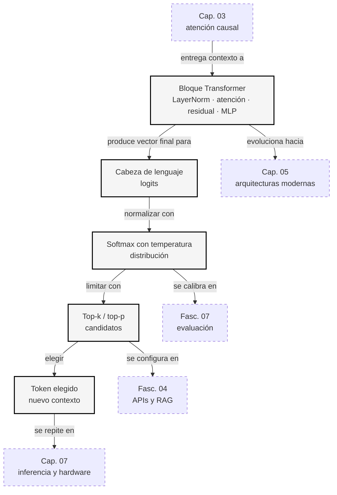
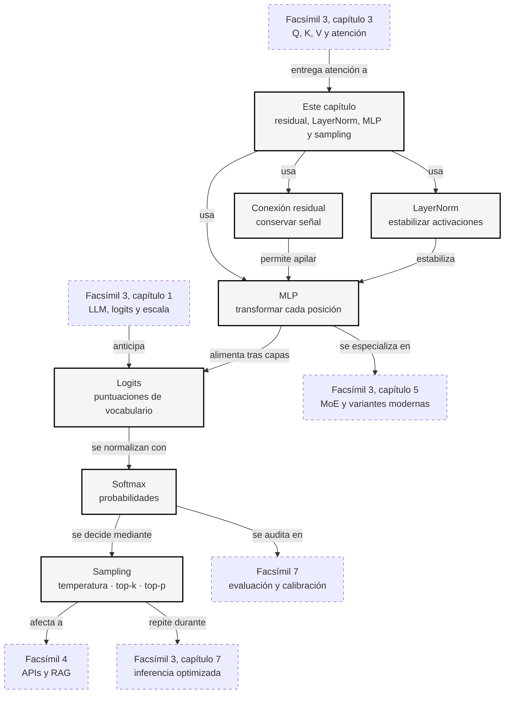

::: {.fasciculo-subtitle}
Facsímil 3 · Arquitecturas y modelos
:::

# Capítulo 04: MLP, residual, LayerNorm, logits y sampling

## Después de mirar, hay que pensar y decidir

En el capítulo anterior abrimos la atención por dentro: \(Q\), \(K\), \(V\), máscara causal y softmax. Vimos cómo cada token mezcla información de posiciones permitidas. Pero un bloque Transformer no termina ahí.

Después de la atención queda trabajo: estabilizar números, dejar pasar información antigua, transformar cada posición con una red interna y, al final de muchas capas, convertir el último vector en una lista enorme de puntuaciones para tokens posibles.

Este capítulo va de ese tramo menos vistoso y muy importante. La atención decide **de dónde** tomar información. El MLP ayuda a transformar **qué significa** esa información. Las conexiones residuales permiten que las capas se apilen sin destruir lo anterior. LayerNorm mantiene los números en una zona manejable. Los logits y el sampling convierten todo eso en una palabra, un signo, un salto de línea o un fragmento de código.

## Qué no es esta parte del Transformer

El MLP no es una memoria externa. No guarda documentos ni hechos como una base de datos. Es una transformación aprendida que se aplica a cada posición del tensor.

LayerNorm tampoco es una limpieza semántica del texto. No corrige ideas ni comprueba si algo es cierto. Normaliza números para que el entrenamiento y la inferencia sean más estables.

Y sampling no es una votación de verdad. Cuando el modelo elige el siguiente token, está usando una distribución de probabilidad lingüística. Que un token tenga mucha probabilidad significa que encaja con el contexto y con lo aprendido, no que la frase resultante sea necesariamente cierta.

## Qué sí ocurre dentro de un bloque

Un bloque Transformer moderno suele seguir una idea parecida a esta:

```text
entrada
  -> normalización
  -> atención
  -> suma residual
  -> normalización
  -> MLP
  -> suma residual
salida
```

El Transformer original ya combinaba atención, red feed-forward, normalización y conexiones residuales.^[Vaswani, A., Shazeer, N., Parmar, N., Uszkoreit, J., Jones, L., Gomez, A. N., Kaiser, Ł. y Polosukhin, I. (2017). Attention is all you need. En *Advances in Neural Information Processing Systems 30* (pp. 5998-6008). https://papers.nips.cc/paper/7181-attention-is-all-you-need. El artículo introduce capas de atención multi-cabeza, redes feed-forward por posición, conexiones residuales y normalización.] Muchas implementaciones actuales usan una variante llamada **pre-norm**: normalizan antes de la atención y antes del MLP.

Una forma compacta de escribirlo es:

$$
a_l = x_l + \operatorname{Attention}(\operatorname{LN}(x_l))
$$

$$
x_{l+1} = a_l + \operatorname{MLP}(\operatorname{LN}(a_l))
$$

| Símbolo | Significado | Ejemplo |
|---|---|---|
| \(x_l\) | Entrada del bloque \(l\). | Tensor después del bloque anterior. |
| \(a_l\) | Estado intermedio después de atención y residual. | Lo que sale antes del MLP. |
| \(x_{l+1}\) | Salida del bloque. | Entrada del siguiente bloque. |
| \(\operatorname{LN}\) | LayerNorm. | Normaliza cada vector de posición. |
| \(\operatorname{Attention}\) | Atención causal vista en el capítulo 03. | Q, K, V, máscara y softmax. |
| \(\operatorname{MLP}\) | Red interna aplicada por posición. | Dos o tres proyecciones con una activación. |

La lectura humana es sencilla: no borramos lo anterior, sumamos una transformación nueva encima. Esa suma residual es una de las razones por las que podemos apilar muchas capas.

## Un ejemplo entendible: autocompletar un mensaje

Imagina que escribes en una aplicación de correo:

> Nos vemos mañana a las

El modelo no piensa en castellano con una libreta al lado. Lo que tiene es una representación numérica del contexto y debe decidir el siguiente token. Aun así, podemos traducir las piezas del bloque a una historia bastante humana:

| Pieza | En el ejemplo | Qué aporta |
|---|---|---|
| Atención | Mira «vemos», «mañana» y «a las». | Recupera que probablemente viene una hora. |
| Residual | Conserva la frase completa mientras añade señales nuevas. | No pierde que estamos hablando de una cita. |
| LayerNorm | Pone las señales numéricas en una escala comparable. | Evita que una dimensión grande domine solo por tamaño. |
| MLP | Transforma la representación de la última posición. | Refuerza patrones como «a las» → hora o número. |
| Logits | Asigna puntuaciones a tokens candidatos. | «10», «9», «reunión», «azul» reciben valores distintos. |
| Sampling | Elige el siguiente token según la distribución y la configuración. | Puede elegir «10» de forma conservadora o explorar alternativas. |

Supongamos que, tras muchas capas, la cabeza de lenguaje produce estos logits:

| Token candidato | Logit | Lectura informal |
|---|---:|---|
| 10 | 4,2 | Muy compatible con «a las». |
| 9 | 3,9 | También muy compatible. |
| reunión | 1,1 | Tiene relación con el contexto, pero encaja peor justo después de «a las». |
| azul | -0,7 | Gramatical y semánticamente flojo aquí. |

Si usamos temperatura baja, el sistema tenderá a elegir entre «10» y «9». Si subimos la temperatura o abrimos mucho `top_p`, aumenta la posibilidad de tokens menos esperados. Esto no vuelve al modelo más profundo; cambia el margen de exploración.

Este ejemplo resume el capítulo entero: el bloque procesa la frase, los logits proponen continuaciones y el sampling decide cuánto riesgo aceptamos al elegir una.

## Residual: dejar una vía abierta

Una conexión residual suma la entrada original con una transformación:

$$
y = x + F(x)
$$

| Símbolo | Significado | Ejemplo |
|---|---|---|
| \(x\) | Representación que llega a una subcapa. | Vector de un token antes de la atención. |
| \(F(x)\) | Transformación aprendida. | Atención o MLP. |
| \(y\) | Resultado después de sumar entrada y transformación. | Vector actualizado. |

La idea se popularizó con ResNet en visión por computador: una red profunda entrena mejor si cada bloque puede aprender una corrección sobre lo que ya venía circulando.^[He, K., Zhang, X., Ren, S. y Sun, J. (2016). Deep residual learning for image recognition. En *Proceedings of the IEEE Conference on Computer Vision and Pattern Recognition* (pp. 770-778). https://doi.org/10.1109/CVPR.2016.90. Las conexiones residuales ayudaron a entrenar redes mucho más profundas al permitir que la información y el gradiente circularan con menos degradación.]

En un LLM, la intuición práctica es esta:

| Sin residual | Con residual |
|---|---|
| Cada subcapa tiene que reconstruir todo lo útil. | Cada subcapa puede añadir una corrección. |
| Es más fácil degradar información anterior. | La representación anterior sigue disponible. |
| Entrenar muchas capas se vuelve más frágil. | Apilar capas profundas es más viable. |

Ejemplo pequeño:

$$
x = [2,\ -1,\ 0{,}5]
$$

$$
F(x) = [0{,}1,\ 0{,}4,\ -0{,}2]
$$

$$
y = x + F(x) = [2{,}1,\ -0{,}6,\ 0{,}3]
$$

La transformación ha modificado el vector, pero no lo ha sustituido por completo. Ese matiz importa mucho en redes profundas.

## LayerNorm: poner los números en una escala manejable

LayerNorm normaliza cada vector de activaciones usando su propia media y desviación típica.^[Ba, J. L., Kiros, J. R. y Hinton, G. E. (2016). *Layer normalization*. https://arxiv.org/abs/1607.06450. LayerNorm normaliza las activaciones de una capa para cada ejemplo, lo que resulta útil en arquitecturas de secuencia y Transformer.] Para un vector \(x\), calculamos:

$$
\mu = \frac{1}{d}\sum_{i=1}^{d} x_i
$$

$$
\sigma = \sqrt{\frac{1}{d}\sum_{i=1}^{d}(x_i-\mu)^2+\epsilon}
$$

$$
\operatorname{LN}(x)_i = \gamma_i \frac{x_i-\mu}{\sigma} + \beta_i
$$

| Símbolo | Significado | Ejemplo |
|---|---|---|
| \(x_i\) | Componente \(i\) del vector. | \(x_2=-1\). |
| \(d\) | Dimensión del vector. | \(d=3\). |
| \(\mu\) | Media del vector. | Media de \([2,-1,0{,}5]\). |
| \(\sigma\) | Desviación típica con estabilidad numérica. | Incluye \(\epsilon\). |
| \(\epsilon\) | Número pequeño para evitar división por cero. | \(10^{-5}\). |
| \(\gamma_i\) | Escala aprendida. | Permite ajustar la salida normalizada. |
| \(\beta_i\) | Sesgo aprendido. | Permite desplazar la salida. |

Si tomamos:

$$
x = [2,\ -1,\ 0{,}5]
$$

La media es:

$$
\mu = \frac{2-1+0{,}5}{3}=0{,}5
$$

Las diferencias respecto a la media son:

$$
[1{,}5,\ -1{,}5,\ 0]
$$

La desviación típica, ignorando \(\epsilon\) para leer el ejemplo, es:

$$
\sigma = \sqrt{\frac{1{,}5^2 + (-1{,}5)^2 + 0^2}{3}} \approx 1{,}225
$$

Si \(\gamma=[1,1,1]\) y \(\beta=[0,0,0]\), la salida aproximada es:

$$
\operatorname{LN}(x) \approx [1{,}225,\ -1{,}225,\ 0]
$$

LayerNorm no cambia el orden de las ideas por sí sola. Cambia la escala de los números para que las siguientes operaciones trabajen en una zona más estable.

## MLP: transformar cada posición por dentro

Después de la atención, el bloque Transformer aplica una red feed-forward por posición. En muchos textos se llama MLP, aunque técnicamente es una red pequeña aplicada a cada token por separado.

Una versión clásica es:

$$
\operatorname{MLP}(x)=W_2\phi(W_1x+b_1)+b_2
$$

| Símbolo | Significado | Ejemplo |
|---|---|---|
| \(x\) | Vector de una posición. | Representación contextual de «banco». |
| \(W_1\) | Primera matriz aprendida. | Expande la dimensión interna. |
| \(b_1\) | Sesgo de la primera proyección. | Vector sumado antes de la activación. |
| \(\phi\) | Función de activación. | GELU, ReLU o una variante con puerta. |
| \(W_2\) | Segunda matriz aprendida. | Devuelve la dimensión al tamaño del modelo. |
| \(b_2\) | Sesgo final. | Ajuste aprendido de salida. |

Las redes profundas usan activaciones no lineales para poder representar funciones más ricas que una sola multiplicación de matrices.^[Goodfellow, I., Bengio, Y. y Courville, A. (2016). *Deep learning*. MIT Press. https://www.deeplearningbook.org. El libro explica cómo las capas lineales y activaciones no lineales permiten componer funciones complejas.] En Transformers modernos, GELU se hizo muy común en modelos de lenguaje.^[Hendrycks, D. y Gimpel, K. (2016). *Gaussian Error Linear Units (GELUs)*. https://arxiv.org/abs/1606.08415. GELU propone una activación suave que se adoptó en varias arquitecturas de lenguaje.] También hay variantes con puertas, como GLU y SwiGLU, que permiten modular qué información pasa.^[Shazeer, N. (2020). *GLU variants improve Transformer*. https://arxiv.org/abs/2002.05202. El trabajo estudia variantes con puertas para mejorar el bloque feed-forward de Transformers.]

La intuición:

| Pieza | Qué hace |
|---|---|
| Atención | Mezcla información entre posiciones. |
| MLP | Transforma cada posición internamente. |
| Residual | Conserva una vía para lo que ya estaba. |
| LayerNorm | Mantiene los números en una escala razonable. |

Si la atención es una mesa de mezclas entre tokens, el MLP es el taller interno de cada token. No decide a qué otros tokens mirar; trabaja con lo que ya recibió.

## Del último vector a los logits

Tras repetir muchos bloques, el modelo tiene una representación final. Para predecir el siguiente token, toma el vector de la última posición y lo proyecta al tamaño del vocabulario:

$$
z = h W_{\text{vocab}} + b
$$

| Símbolo | Significado | Ejemplo |
|---|---|---|
| \(h\) | Vector final de la última posición. | Representación de todo el contexto disponible. |
| \(W_{\text{vocab}}\) | Matriz que lleva de dimensión interna a vocabulario. | De \(d_{\text{model}}\) a 50 000 tokens. |
| \(b\) | Sesgo de vocabulario. | Una puntuación adicional por token. |
| \(z\) | Vector de logits. | Una puntuación por token candidato. |

Un logit no es una probabilidad. Puede ser negativo, positivo, grande o pequeño. Para convertir logits en una distribución usamos softmax, igual que vimos en el [capítulo 01](/libro/fasciculo-03/#capitulo-01) y en el [capítulo 03](/libro/fasciculo-03/#capitulo-03):

$$
p_i = \frac{e^{z_i}}{\sum_{j=1}^{V}e^{z_j}}
$$

| Símbolo | Significado | Ejemplo |
|---|---|---|
| \(p_i\) | Probabilidad asignada al token \(i\). | \(p_{\text{Madrid}}=0{,}256\). |
| \(z_i\) | Logit del token \(i\). | \(z_{\text{París}}=4{,}0\). |
| \(V\) | Tamaño del vocabulario. | 50 000 tokens candidatos. |
| \(\sum_{j=1}^{V}\) | Suma sobre todos los tokens. | Normaliza para que las probabilidades sumen 1. |

Bishop presenta softmax como una transformación estándar de puntuaciones en probabilidades normalizadas.^[Bishop, C. M. (2006). *Pattern recognition and machine learning*. Springer. Softmax aparece como una forma de convertir puntuaciones reales en probabilidades multinomiales.] En LLMs, esa transformación no juzga la verdad de una frase: convierte puntuaciones de continuación en una distribución de tokens.

## Temperatura: abrir o cerrar el abanico

La temperatura modifica los logits antes de softmax:

$$
p_i(T) = \frac{e^{z_i/T}}{\sum_{j=1}^{V}e^{z_j/T}}
$$

| Símbolo | Significado | Ejemplo |
|---|---|---|
| \(T\) | Temperatura. | \(T=0{,}5\), \(T=1\), \(T=2\). |
| \(z_i/T\) | Logit ajustado por temperatura. | Si \(T<1\), las diferencias crecen. |
| \(p_i(T)\) | Probabilidad después de aplicar temperatura. | Distribución más concentrada o más suave. |

Supongamos cuatro tokens candidatos:

| Token | Logit |
|---|---:|
| París | 4,0 |
| Madrid | 3,0 |
| Lyon | 1,0 |
| azul | 0,0 |

Con \(T=1\):

| Token | Probabilidad aprox. |
|---|---:|
| París | 0,696 |
| Madrid | 0,256 |
| Lyon | 0,035 |
| azul | 0,013 |

Con \(T=0{,}5\), las diferencias se agrandan:

| Token | Probabilidad aprox. |
|---|---:|
| París | 0,879 |
| Madrid | 0,119 |
| Lyon | 0,002 |
| azul | 0,000 |

Con \(T=2\), las diferencias se suavizan:

| Token | Probabilidad aprox. |
|---|---:|
| París | 0,509 |
| Madrid | 0,309 |
| Lyon | 0,114 |
| azul | 0,069 |

Temperatura baja no significa «más inteligente». Significa más conservadora en la elección del siguiente token. Temperatura alta no significa «mejor creatividad». Significa más dispersión en la distribución. En producto, esto se decide según la tarea: extracción estructurada, redacción, lluvia de ideas, código, resumen o conversación.

## Top-k y top-p: limitar candidatos

Además de temperatura, se suelen aplicar reglas para limitar el conjunto de tokens candidatos.

**Top-k** conserva los \(k\) tokens con mayor probabilidad y pone el resto a cero:

$$
C_k = \operatorname{TopK}(p, k)
$$

$$
p'_i =
\begin{cases}
\frac{p_i}{\sum_{j \in C_k}p_j} & \text{si } i \in C_k \\
0 & \text{si } i \notin C_k
\end{cases}
$$

| Símbolo | Significado | Ejemplo |
|---|---|---|
| \(C_k\) | Conjunto de tokens conservados. | Con \(k=2\): París y Madrid. |
| \(p'_i\) | Probabilidad renormalizada. | Probabilidad después de eliminar candidatos. |
| \(i \notin C_k\) | Token descartado por top-k. | Lyon y azul reciben 0. |

**Top-p**, también llamado nucleus sampling, conserva el conjunto mínimo de tokens cuya probabilidad acumulada alcanza un umbral \(p\). Holtzman y coautores popularizaron esta estrategia para reducir degeneraciones en generación abierta.^[Holtzman, A., Buys, J., Du, L., Forbes, M. y Choi, Y. (2020). The curious case of neural text degeneration. En *International Conference on Learning Representations*. https://openreview.net/forum?id=rygGQyrFvH. El artículo analiza problemas de decodificación y propone nucleus sampling como alternativa a estrategias demasiado rígidas.]

Si ordenamos de mayor a menor:

| Token | Probabilidad | Acumulada |
|---|---:|---:|
| París | 0,696 | 0,696 |
| Madrid | 0,256 | 0,952 |
| Lyon | 0,035 | 0,987 |
| azul | 0,013 | 1,000 |

Con \(p=0{,}9\), top-p conserva París y Madrid, porque con esos dos ya alcanza 0,952. Después renormaliza solo dentro de ese conjunto.

La diferencia importante:

| Regla | Qué fija | Qué cambia |
|---|---|---|
| Top-k | Número de candidatos. | La masa de probabilidad conservada. |
| Top-p | Masa de probabilidad mínima. | El número de candidatos. |

En una distribución muy concentrada, top-p puede conservar pocos tokens. En una distribución muy plana, puede conservar muchos. Esa elasticidad es la gracia.

<svg id="f3-c04-bloque-logits-sampling" xmlns="http://www.w3.org/2000/svg" viewBox="0 0 980 760" role="img" aria-label="Bloque Transformer: LayerNorm, atención, residual, MLP, logits y sampling">
  <title>Del bloque Transformer al siguiente token</title>
  <defs>
    <marker id="f3c04-arrow" viewBox="0 0 10 10" refX="9" refY="5" markerWidth="6" markerHeight="6" orient="auto">
      <path d="M 0 0 L 10 5 L 0 10 z" fill="#333333"/>
    </marker>
    <pattern id="f3c04-grid" width="18" height="18" patternUnits="userSpaceOnUse">
      <rect width="18" height="18" fill="#FFFFFF"/>
      <path d="M18 0H0V18" fill="none" stroke="#DDDDDD" stroke-width="1"/>
      <circle cx="9" cy="9" r="1.8" fill="#111111"/>
    </pattern>
  </defs>
  <rect x="20" y="20" width="940" height="700" rx="18" fill="#FFFFFF" stroke="#111111" stroke-width="1.4"/>
  <text x="490" y="58" text-anchor="middle" font-family="Arial, sans-serif" font-size="24" font-weight="700" fill="#111111">Del bloque Transformer al siguiente token</text>
  <text x="490" y="84" text-anchor="middle" font-family="Arial, sans-serif" font-size="13" fill="#666666">La atención mezcla contexto; residual, normalización y MLP refinan; logits y sampling deciden la continuación.</text>

  <rect x="64" y="126" width="118" height="86" rx="14" fill="#F5F5F5" stroke="#111111" stroke-width="1.2"/>
  <text x="123" y="154" text-anchor="middle" font-family="Arial, sans-serif" font-size="13" font-weight="700" fill="#111111">Entrada</text>
  <rect x="94" y="166" width="58" height="28" fill="url(#f3c04-grid)" stroke="#777777"/>
  <text x="123" y="230" text-anchor="middle" font-family="Menlo, monospace" font-size="12" fill="#555555">x_l</text>

  <line x1="182" y1="169" x2="226" y2="169" stroke="#333333" stroke-width="1.5" marker-end="url(#f3c04-arrow)"/>

  <rect x="232" y="126" width="118" height="86" rx="14" fill="#FFFFFF" stroke="#111111" stroke-width="1.2"/>
  <text x="291" y="158" text-anchor="middle" font-family="Arial, sans-serif" font-size="13" font-weight="700" fill="#111111">LayerNorm</text>
  <text x="291" y="184" text-anchor="middle" font-family="Arial, sans-serif" font-size="11" fill="#666666">escala estable</text>

  <line x1="350" y1="169" x2="394" y2="169" stroke="#333333" stroke-width="1.5" marker-end="url(#f3c04-arrow)"/>

  <rect x="400" y="126" width="118" height="86" rx="14" fill="#F5F5F5" stroke="#111111" stroke-width="1.2"/>
  <text x="459" y="158" text-anchor="middle" font-family="Arial, sans-serif" font-size="13" font-weight="700" fill="#111111">Atención</text>
  <text x="459" y="184" text-anchor="middle" font-family="Arial, sans-serif" font-size="11" fill="#666666">Q · K · V</text>

  <line x1="518" y1="169" x2="562" y2="169" stroke="#333333" stroke-width="1.5" marker-end="url(#f3c04-arrow)"/>

  <circle cx="592" cy="169" r="22" fill="#FFFFFF" stroke="#111111" stroke-width="1.3"/>
  <text x="592" y="176" text-anchor="middle" font-family="Arial, sans-serif" font-size="24" font-weight="700" fill="#111111">+</text>
  <path d="M123 214 C123 260, 592 260, 592 196" fill="none" stroke="#777777" stroke-width="1.3" stroke-dasharray="6 6" marker-end="url(#f3c04-arrow)"/>
  <text x="350" y="278" text-anchor="middle" font-family="Arial, sans-serif" font-size="11" fill="#666666">vía residual: la entrada sigue circulando</text>

  <line x1="614" y1="169" x2="658" y2="169" stroke="#333333" stroke-width="1.5" marker-end="url(#f3c04-arrow)"/>

  <rect x="664" y="126" width="118" height="86" rx="14" fill="#FFFFFF" stroke="#111111" stroke-width="1.2"/>
  <text x="723" y="158" text-anchor="middle" font-family="Arial, sans-serif" font-size="13" font-weight="700" fill="#111111">LayerNorm</text>
  <text x="723" y="184" text-anchor="middle" font-family="Arial, sans-serif" font-size="11" fill="#666666">antes del MLP</text>

  <line x1="723" y1="214" x2="723" y2="276" stroke="#333333" stroke-width="1.5" marker-end="url(#f3c04-arrow)"/>

  <rect x="610" y="288" width="226" height="104" rx="16" fill="#F5F5F5" stroke="#111111" stroke-width="1.3"/>
  <text x="723" y="319" text-anchor="middle" font-family="Arial, sans-serif" font-size="14" font-weight="700" fill="#111111">MLP por posición</text>
  <text x="723" y="346" text-anchor="middle" font-family="Menlo, monospace" font-size="12" fill="#111111">W1 → activación → W2</text>
  <text x="723" y="370" text-anchor="middle" font-family="Arial, sans-serif" font-size="11" fill="#666666">transforma cada token sin mezclar posiciones</text>

  <line x1="610" y1="340" x2="546" y2="340" stroke="#333333" stroke-width="1.5" marker-end="url(#f3c04-arrow)"/>
  <circle cx="516" cy="340" r="22" fill="#FFFFFF" stroke="#111111" stroke-width="1.3"/>
  <text x="516" y="347" text-anchor="middle" font-family="Arial, sans-serif" font-size="24" font-weight="700" fill="#111111">+</text>
  <path d="M592 192 C592 240, 516 260, 516 313" fill="none" stroke="#777777" stroke-width="1.3" stroke-dasharray="6 6" marker-end="url(#f3c04-arrow)"/>

  <line x1="494" y1="340" x2="430" y2="340" stroke="#333333" stroke-width="1.5" marker-end="url(#f3c04-arrow)"/>

  <rect x="230" y="288" width="190" height="104" rx="16" fill="#FFFFFF" stroke="#111111" stroke-width="1.3"/>
  <text x="325" y="320" text-anchor="middle" font-family="Arial, sans-serif" font-size="14" font-weight="700" fill="#111111">Salida de bloque</text>
  <text x="325" y="348" text-anchor="middle" font-family="Menlo, monospace" font-size="12" fill="#111111">x_(l+1)</text>
  <text x="325" y="370" text-anchor="middle" font-family="Arial, sans-serif" font-size="11" fill="#666666">entra al siguiente bloque</text>

  <line x1="325" y1="392" x2="325" y2="456" stroke="#333333" stroke-width="1.5" marker-end="url(#f3c04-arrow)"/>

  <rect x="180" y="470" width="290" height="88" rx="16" fill="#F5F5F5" stroke="#111111" stroke-width="1.3"/>
  <text x="325" y="500" text-anchor="middle" font-family="Arial, sans-serif" font-size="14" font-weight="700" fill="#111111">Cabeza de lenguaje</text>
  <text x="325" y="526" text-anchor="middle" font-family="Menlo, monospace" font-size="12" fill="#111111">z = h W_vocab + b</text>
  <text x="325" y="546" text-anchor="middle" font-family="Arial, sans-serif" font-size="11" fill="#666666">un logit por token candidato</text>

  <line x1="470" y1="514" x2="534" y2="514" stroke="#333333" stroke-width="1.5" marker-end="url(#f3c04-arrow)"/>

  <rect x="548" y="470" width="250" height="88" rx="16" fill="#FFFFFF" stroke="#111111" stroke-width="1.3"/>
  <text x="673" y="500" text-anchor="middle" font-family="Arial, sans-serif" font-size="14" font-weight="700" fill="#111111">Softmax y sampling</text>
  <text x="673" y="526" text-anchor="middle" font-family="Menlo, monospace" font-size="12" fill="#111111">T · top-k · top-p</text>
  <text x="673" y="546" text-anchor="middle" font-family="Arial, sans-serif" font-size="11" fill="#666666">se elige el siguiente token</text>

  <rect x="230" y="606" width="520" height="48" rx="16" fill="#111111"/>
  <text x="490" y="636" text-anchor="middle" font-family="Arial, sans-serif" font-size="14" font-weight="700" fill="#FFFFFF">texto → capas → logits → distribución → token</text>

  <text x="940" y="704" text-anchor="end" font-family="Arial, sans-serif" font-size="10" fill="#9A9A9A">IA para gente curiosa / Facsímil 03 / Capítulo 04 / 686f6c61</text>
</svg>

## El mapa operativo del capítulo

Este es el circuito que conviene tener en la cabeza antes de seguir. No hace falta memorizarlo como una lista; basta con poder recorrerlo de izquierda a derecha.



## Simuladores para verlo en pantalla

Dos recursos ayudan especialmente aquí:

| Recurso | Qué mirar |
|---|---|
| [LLM Visualization](https://bbycroft.net/llm) | Recorre las capas y localiza el paso desde bloques internos a logits.^[Bycroft, B. (2023). *LLM Visualization*. https://bbycroft.net/llm. Visualización interactiva 3D de un Transformer estilo GPT.] |
| [Transformer Explainer](https://poloclub.github.io/transformer-explainer/) | Cambia texto de entrada y observa cómo varía la distribución del siguiente token.^[Cho, A., Kim, G. C., Karpekov, A., Helbling, A., Wang, Z. J., Lee, S., Hoover, B. y Chau, D. H. (2025). Transformer Explainer: interactive learning of text-generative models. En *Proceedings of the AAAI Conference on Artificial Intelligence*. https://ojs.aaai.org/index.php/AAAI/article/download/35347/37502. La herramienta permite visualizar componentes de un GPT-2 pequeño en navegador.] |

Úsalos con una pregunta concreta: ¿dónde se convierte el vector final en logits?, ¿dónde aparece softmax?, ¿qué cambia si modifico el texto anterior?

## En el día a día

**Cuando quieres salida estable.** Para extracción JSON, clasificación o tareas con formato rígido, normalmente quieres menos variación: temperatura baja, pocos candidatos y validación posterior. No porque el modelo «sepa más», sino porque reduces el abanico de continuaciones posibles.

**Cuando quieres explorar.** Para escritura creativa, alternativas de copy o lluvia de ideas, puedes permitir más variedad. Ahí temperatura y top-p se convierten en mandos de exploración. Conviene medir resultados, no elegir parámetros por superstición.

**Cuando depuras una respuesta extraña.** Si una salida cambia mucho entre ejecuciones, no siempre es un problema de prompt. Puede haber temperatura alta, top-p amplio o muestreo activado. Antes de cambiar de modelo, mira la configuración de generación.

**Cuando eliges arquitectura.** MLP, normalización y residuales parecen detalles internos, pero afectan a estabilidad, velocidad, memoria y calidad. En el [capítulo 05](/libro/fasciculo-03/#capitulo-05) veremos cómo modelos modernos cambian estas piezas: MoE, activaciones con puerta y variaciones de arquitectura.

## Por qué debería importarte

Porque esta parte une dos mundos: arquitectura interna y comportamiento visible. El lector ve texto, pero por debajo hay logits, temperatura, filtros de candidatos y muestreo. Entender esa cadena evita explicaciones vagas.

Si un modelo responde siempre igual, puede ser por una distribución muy concentrada o por una configuración conservadora. Si responde con demasiada dispersión, quizá la temperatura o top-p están abriendo demasiado el abanico. Si un modelo grande cuesta mucho, parte del coste está en repetir bloques con atención, MLP y proyecciones a vocabulario miles de veces por segundo.

## Dónde volverá a aparecer

| Concepto de este capítulo | Dónde vuelve en el libro | Por qué se conecta |
|---|---|---|
| **MLP** | [Facsímil 3, capítulo 05](/libro/fasciculo-03/#capitulo-05); [facsímil 6](/libro/fasciculo-06/). | MoE cambia la forma de usar redes internas; operación y coste dependen de estas capas. |
| **Residual y LayerNorm** | [Facsímil 3, capítulo 06](/libro/fasciculo-03/#capitulo-06); [facsímil 7](/libro/fasciculo-07/). | Ajuste, destilación y evaluación heredan decisiones de estabilidad de la arquitectura base. |
| **Logits** | [Facsímil 1, capítulo 07](/libro/fasciculo-01/#capitulo-07); [facsímil 7](/libro/fasciculo-07/). | Calibración, confianza y evaluación necesitan separar puntuación de verdad. |
| **Temperatura, top-k y top-p** | [Facsímil 4](/libro/fasciculo-04/); [facsímil 5](/libro/fasciculo-05/). | APIs, agentes y herramientas exponen estos parámetros como decisiones de producto. |
| **Sampling** | [Facsímil 6](/libro/fasciculo-06/); [facsímil 11](/libro/fasciculo-11/). | Operación y UX dependen de cuánta variación aceptas en una tarea real. |

## Dónde solía tropezar yo

| Error | Por qué es un error | Antídoto |
|---|---|---|
| **Pensar que LayerNorm entiende el texto** | Normaliza números; no valida significado. | Pregunta siempre si una pieza trabaja con escala numérica o con decisión de contenido. |
| **Confundir logit con probabilidad** | Un logit es una puntuación cruda; puede ser negativa y no suma nada. | No hables de probabilidad hasta aplicar softmax. |
| **Creer que temperatura baja equivale a verdad** | Solo concentra la distribución en tokens más probables. | Para verdad factual, usa contexto, fuentes y validación. |
| **Olvidar que el MLP no mezcla posiciones** | La mezcla entre tokens la hizo la atención; el MLP transforma cada posición. | Repite: atención mezcla entre posiciones, MLP transforma dentro de una posición. |
| **Usar top-k y top-p como si fueran lo mismo** | Top-k fija número de candidatos; top-p fija masa acumulada. | Mira una tabla ordenada de probabilidades y calcula ambos a mano una vez. |

## Manos a la obra

La práctica real está en `labs/f3/c04-sampling-controls/`. El kit aísla LayerNorm, softmax con temperatura, top-k y top-p para que puedas ver qué cambia cada mando sin construir un LLM completo.

| Archivo | Qué contiene |
|---|---|
| `data/sampling_case.json` | Vector, logits, tokens y parámetros de sampling. |
| `contracts/sampling_policy.json` | Umbrales de distribución válida. |
| `ops/run_sampling_controls.py` | LayerNorm, softmax, top-k, top-p y entropía. |
| `output/sampling_controls_report.json` | Distribuciones y métricas. |
| `output/sampling_controls_decision.md` | Lectura técnica. |

Ejecuta:

```bash
cd labs/f3/c04-sampling-controls
python3 ops/run_sampling_controls.py --write
cat output/sampling_controls_decision.md
```

Como gate:

```bash
python3 ops/run_sampling_controls.py --write --fail-on-invalid
```

**Qué entregaría un alumno.** El Markdown generado, una configuración nueva de temperatura/top-p y una decisión sobre estabilidad frente a diversidad.

## Cómo encaja todo

Este mapa enseña el tramo que suele quedar invisible entre “atención” y “respuesta”. La atención entrega una representación contextual; residual, LayerNorm y MLP la estabilizan y transforman; logits, softmax y sampling la convierten en comportamiento visible.

Por eso el capítulo conecta arquitectura con producto: temperatura, `top_k` y `top_p` no son adornos de API, sino controles sobre una distribución que nace de todo el bloque Transformer.



## Vocabulario aprendido

| Término | Definición |
|---|---|
| **Conexión residual** | Suma que conserva la entrada y añade una transformación aprendida. |
| **LayerNorm** | Normalización que usa media y desviación típica dentro de cada vector. |
| **MLP** | Red interna aplicada por posición después de la atención. |
| **Activación** | Función no lineal que permite representar transformaciones más ricas. |
| **Logit** | Puntuación cruda de un token antes de softmax. |
| **Temperatura** | Parámetro que concentra o suaviza la distribución de salida. |
| **Top-k** | Muestreo que conserva solo los \(k\) candidatos principales. |
| **Top-p** | Muestreo que conserva candidatos hasta alcanzar una probabilidad acumulada. |
| **Sampling** | Proceso de elegir el siguiente token a partir de una distribución. |

## Antes de pasar página

- [ ] ¿Puedo explicar por qué una conexión residual suma en vez de reemplazar? (Si no, vuelve a «Residual: dejar una vía abierta».)
- [ ] ¿Sé calcular la media y desviación típica de una LayerNorm pequeña? (Si no, vuelve a «LayerNorm».)
- [ ] ¿Entiendo por qué el MLP transforma cada posición pero no mezcla tokens? (Si no, vuelve a «MLP».)
- [ ] ¿Puedo distinguir logit, probabilidad y token elegido? (Si no, vuelve a «Del último vector a los logits».)
- [ ] ¿Puedo explicar el ejemplo de «Nos vemos mañana a las» usando residual, LayerNorm, MLP, logits y sampling? (Si no, vuelve a «Un ejemplo entendible».)
- [ ] ¿Sé qué cambia cuando bajo o subo la temperatura? (Si no, vuelve a «Temperatura».)
- [ ] ¿Puedo calcular top-k y top-p con una tabla de cuatro tokens? (Si no, vuelve a «Top-k y top-p».)
- [ ] ¿He ejecutado el código y cambiado al menos un parámetro de muestreo? (Si no, vuelve a «Manos a la obra».)
- [ ] ¿Puedo conectar estos mandos con APIs, agentes y evaluación futura? (Si no, vuelve a «Dónde volverá a aparecer».)

## En resumen

| Idea fuerza | Detalle |
|---|---|
| Un bloque Transformer no es solo atención. | Residual, LayerNorm y MLP hacen que la información circule, se estabilice y se transforme. |
| Los logits son puntuaciones, no probabilidades. | Softmax convierte esas puntuaciones en una distribución sobre el vocabulario. |
| Sampling es una decisión de comportamiento. | Temperatura, top-k y top-p cambian cuánta variación permitimos al generar. |
| La arquitectura interna afecta al producto visible. | Estabilidad, coste, latencia y estilo de respuesta dependen de estas piezas. |

## Para saber más

Ba, J. L., Kiros, J. R. y Hinton, G. E. (2016). *Layer normalization*. https://arxiv.org/abs/1607.06450

Bishop, C. M. (2006). *Pattern recognition and machine learning*. Springer.

Brown, T. B. et al. (2020). Language models are few-shot learners. En *Advances in Neural Information Processing Systems 33* (pp. 1877-1901). https://papers.nips.cc/paper/2020/hash/1457c0d6bfcb4967418bfb8ac142f64a-Abstract.html

Bycroft, B. (2023). *LLM Visualization*. https://bbycroft.net/llm

Cho, A., Kim, G. C., Karpekov, A., Helbling, A., Wang, Z. J., Lee, S., Hoover, B. y Chau, D. H. (2025). Transformer Explainer: interactive learning of text-generative models. En *Proceedings of the AAAI Conference on Artificial Intelligence*. https://ojs.aaai.org/index.php/AAAI/article/download/35347/37502

Goodfellow, I., Bengio, Y. y Courville, A. (2016). *Deep learning*. MIT Press. https://www.deeplearningbook.org

He, K., Zhang, X., Ren, S. y Sun, J. (2016). Deep residual learning for image recognition. En *Proceedings of the IEEE Conference on Computer Vision and Pattern Recognition* (pp. 770-778). https://doi.org/10.1109/CVPR.2016.90

Hendrycks, D. y Gimpel, K. (2016). *Gaussian Error Linear Units (GELUs)*. https://arxiv.org/abs/1606.08415

Holtzman, A., Buys, J., Du, L., Forbes, M. y Choi, Y. (2020). The curious case of neural text degeneration. En *International Conference on Learning Representations*. https://openreview.net/forum?id=rygGQyrFvH

Radford, A., Wu, J., Child, R., Luan, D., Amodei, D. y Sutskever, I. (2019). *Language models are unsupervised multitask learners*. https://cdn.openai.com/better-language-models/language_models_are_unsupervised_multitask_learners.pdf

Shazeer, N. (2020). *GLU variants improve Transformer*. https://arxiv.org/abs/2002.05202

Vaswani, A., Shazeer, N., Parmar, N., Uszkoreit, J., Jones, L., Gomez, A. N., Kaiser, Ł. y Polosukhin, I. (2017). Attention is all you need. En *Advances in Neural Information Processing Systems 30* (pp. 5998-6008). https://papers.nips.cc/paper/7181-attention-is-all-you-need
