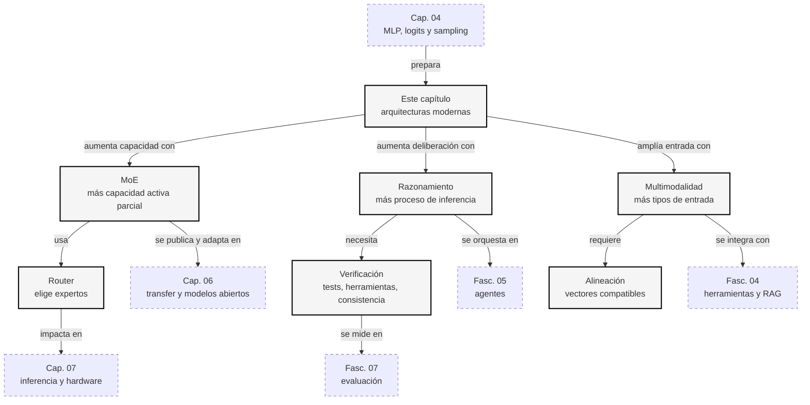
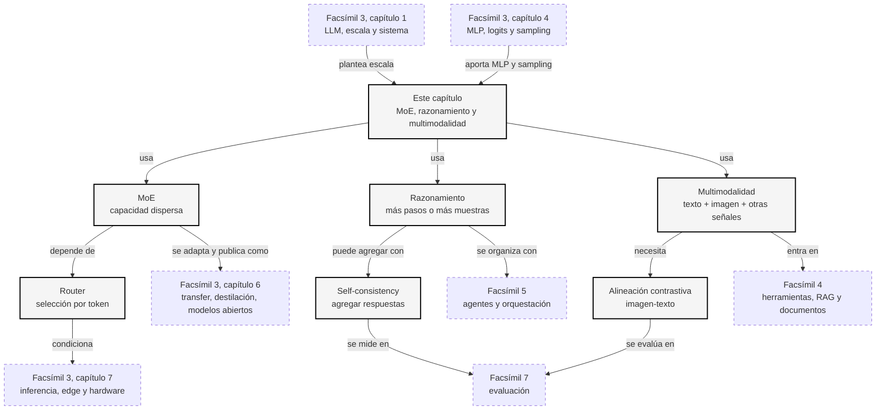

::: {.fasciculo-subtitle}
Facsímil 3 · Arquitecturas y modelos
:::

# Capítulo 05: Arquitecturas modernas: familias, MoE, razonamiento y multimodalidad

## Tres formas de hacer que un modelo sea más capaz

Hasta ahora hemos mirado el Transformer clásico por dentro: tokens, tensores, atención, \(Q\), \(K\), \(V\), residual, LayerNorm, MLP, logits y sampling. Ya tenemos la maquinaria básica. Ahora aparece una pregunta natural: si eso funciona, ¿cómo lo hacemos más capaz sin limitarnos a hacerlo todo más grande?

Las arquitecturas modernas suelen tocar tres palancas:

| Palanca | Pregunta que responde | Ejemplo |
|---|---|---|
| **Capacidad** | ¿Cómo meto más conocimiento y patrones sin pagar todo el coste en cada token? | Mixture of Experts, o MoE. |
| **Proceso** | ¿Cómo doy más tiempo de cálculo a problemas que necesitan varios pasos? | Razonamiento, varias muestras, verificación. |
| **Entrada** | ¿Cómo hago que el modelo trabaje con texto, imágenes, audio o acciones? | Modelos multimodales. |

Este capítulo va de esas tres palancas. No son trucos aislados. Son respuestas distintas a la misma tensión: queremos modelos más útiles, pero tenemos límites de memoria, latencia, coste, datos y evaluación.

## Qué no significan estas palabras

**MoE no significa que haya expertos humanos dentro del modelo.** La palabra experto engaña un poco. En la práctica, un experto suele ser una red interna, normalmente parecida al MLP del capítulo anterior, y un router decide qué expertos se activan para cada token.

**Razonamiento no significa que el modelo piense como una persona.** En IA moderna, muchas veces llamamos razonamiento a dedicar más pasos de generación, probar varias rutas, verificar resultados o entrenar el modelo para resolver tareas paso a paso. Eso puede mejorar resultados, pero no convierte al modelo en una mente humana.

**Multimodal no significa que el modelo vea como tú.** Un modelo puede procesar una imagen, pero lo hace transformándola en representaciones numéricas. A veces esas representaciones son muy útiles; otras veces fallan en detalles espaciales, texto pequeño, conteos o relaciones visuales delicadas.

**Más moderno no significa automáticamente mejor para tu caso.** Un modelo MoE puede ser excelente, pero más complejo de servir. Un modelo multimodal puede ser muy útil, pero más caro y más difícil de evaluar. Un modelo con razonamiento puede resolver mejor ciertas tareas, pero tardar más o necesitar controles de calidad distintos.

## El mapa amplio de arquitecturas

Antes de entrar en MoE, razonamiento y multimodalidad, conviene abrir el plano completo. No existe una lista cerrada de «todas las arquitecturas», porque la investigación mezcla familias continuamente. Pero sí hay un mapa útil para no perderse.

Una primera separación:

| Nivel | Qué es | Ejemplo |
|---|---|---|
| **Arquitectura neuronal** | La forma interna de la red. | Transformer, CNN, RNN, MoE, Mamba, difusión. |
| **Modelo entrenado** | Una arquitectura con pesos aprendidos en datos concretos. | BERT, GPT-2, T5, Mixtral, CLIP. |
| **Arquitectura de sistema** | Cómo conectas modelos, datos, herramientas y validadores. | RAG, agente con herramientas, pipeline multimodal. |

Esta distinción evita una confusión muy común: RAG, por ejemplo, no es una capa neuronal como LayerNorm. Es una arquitectura de sistema que combina recuperación de información con generación.^[Lewis, P. et al. (2020). Retrieval-augmented generation for knowledge-intensive NLP tasks. *Advances in Neural Information Processing Systems 33*, 9459-9474. https://papers.nips.cc/paper/2020/hash/6b493230205f780e1bc26945df7481e5-Abstract.html. RAG combina memoria paramétrica del modelo con recuperación externa de documentos.]

### Familias neuronales clásicas y actuales

| Familia | Idea central | Se usa mucho en | Qué debes recordar |
|---|---|---|---|
| **MLP** | Capas densas que transforman vectores. | Tabular, bloques internos de Transformers. | No mezcla posiciones; transforma representaciones. |
| **CNN** | Filtros locales que detectan patrones espaciales. | Imagen, audio, visión industrial. | Muy fuertes cuando importa la vecindad local.^[LeCun, Y., Bengio, Y. y Hinton, G. (2015). Deep learning. *Nature, 521*(7553), 436-444. https://doi.org/10.1038/nature14539. El artículo revisa CNNs, redes recurrentes y aprendizaje profundo moderno.] |
| **RNN / LSTM / GRU** | Procesan secuencias manteniendo un estado. | Series temporales, lenguaje antes del dominio Transformer. | Buen punto histórico para entender secuencia, aunque hoy compiten con Transformers y SSM.^[Sutskever, I., Vinyals, O. y Le, Q. V. (2014). Sequence to sequence learning with neural networks. *Advances in Neural Information Processing Systems 27*, 3104-3112. https://papers.nips.cc/paper/5346-sequence-to-sequence-learning-with-neural-networks. El trabajo mostró modelos secuencia-a-secuencia basados en redes recurrentes para traducción.] |
| **Transformer** | Atención para mezclar información entre posiciones. | LLMs, traducción, visión, multimodalidad. | Es la familia dominante en lenguaje moderno, pero no la única. |
| **GNN** | Mensajes entre nodos de un grafo. | Moléculas, redes, conocimiento estructurado. | Sirven cuando la estructura no es una secuencia sino un grafo.^[Kipf, T. N. y Welling, M. (2017). Semi-supervised classification with graph convolutional networks. *International Conference on Learning Representations*. https://arxiv.org/abs/1609.02907. El trabajo presenta una forma eficiente de aplicar redes convolucionales a datos con estructura de grafo.] |
| **Autoencoders / VAE** | Comprimir y reconstruir datos mediante una representación latente. | Generación, compresión, representación. | Enseñan la idea de espacio latente.^[Kingma, D. P. y Welling, M. (2014). Auto-encoding variational Bayes. *International Conference on Learning Representations*. https://arxiv.org/abs/1312.6114. El VAE aprende una representación latente probabilística que permite generación y reconstrucción.] |
| **Diffusion models** | Aprenden a quitar ruido paso a paso. | Imagen, audio, vídeo, generación visual. | Generan invirtiendo un proceso de ruido.^[Ho, J., Jain, A. y Abbeel, P. (2020). Denoising diffusion probabilistic models. *Advances in Neural Information Processing Systems 33*, 6840-6851. https://papers.nips.cc/paper/2020/file/4c5bcfec8584af0d967f1ab10179ca4b-Abstract.html. DDPM formaliza generación como un proceso de denoising iterativo.] |
| **State Space Models** | Mantienen un estado y procesan secuencias con coste favorable. | Secuencias largas, lenguaje, audio, señales. | Mamba reabrió el interés por alternativas al Transformer puro.^[Gu, A. y Dao, T. (2023). *Mamba: Linear-time sequence modeling with selective state spaces*. https://arxiv.org/abs/2312.00752. Mamba propone modelos de espacio de estados selectivos para modelar secuencias en tiempo lineal.] |

### Familias Transformer en lenguaje

Dentro de Transformers hay varias arquitecturas que conviene distinguir:

| Familia | Cómo lee | Cómo genera | Ejemplo | Uso típico |
|---|---|---|---|---|
| **Encoder-only** | Mira el texto completo a ambos lados. | No está pensado principalmente para generar de izquierda a derecha. | BERT.^[Devlin, J., Chang, M.-W., Lee, K. y Toutanova, K. (2019). BERT: pre-training of deep bidirectional transformers for language understanding. *Proceedings of NAACL-HLT*, 4171-4186. https://doi.org/10.18653/v1/N19-1423. BERT usa una arquitectura encoder bidireccional orientada a comprensión.] | Clasificación, búsqueda semántica, extracción, embeddings. |
| **Decoder-only** | Mira solo el pasado disponible. | Predice el siguiente token. | GPT-2.^[Radford, A., Wu, J., Child, R., Luan, D., Amodei, D. y Sutskever, I. (2019). *Language models are unsupervised multitask learners*. https://cdn.openai.com/better-language-models/language_models_are_unsupervised_multitask_learners.pdf. GPT-2 popularizó el Transformer decoder autoregresivo a escala.] | Chat, completado, código, generación libre. |
| **Encoder-decoder** | Un encoder lee la entrada; un decoder genera la salida. | Genera condicionándose en lo leído. | T5 y BART.^[Raffel, C. et al. (2020). Exploring the limits of transfer learning with a unified text-to-text Transformer. *Journal of Machine Learning Research, 21*(140), 1-67. https://www.jmlr.org/papers/v21/20-074.html. T5 convierte tareas de NLP a un formato texto-a-texto con arquitectura encoder-decoder.] BART combina un encoder bidireccional y un decoder autoregresivo.^[Lewis, M. et al. (2020). BART: Denoising sequence-to-sequence pre-training for natural language generation, translation, and comprehension. *Proceedings of ACL*, 7871-7880. https://doi.org/10.18653/v1/2020.acl-main.703.] | Traducción, resumen, transformación de texto. |
| **Vision Transformer** | Divide imágenes en parches tratados como tokens. | Depende de la tarea: clasificar, detectar, generar en sistemas híbridos. | ViT.^[Dosovitskiy, A. et al. (2021). An image is worth 16x16 words: Transformers for image recognition at scale. *International Conference on Learning Representations*. https://arxiv.org/abs/2010.11929. ViT aplica Transformers a imágenes dividiéndolas en parches.] | Visión y multimodalidad. |
| **MoE Transformer** | Usa atención y sustituye partes densas por expertos. | Igual que su base, pero con cómputo disperso. | Switch, Mixtral. | Más capacidad con menos parámetros activos por token. |
| **Long-context / eficiente** | Cambia atención, memoria o estado para manejar contextos largos. | Puede ser decoder, encoder o híbrido. | Mamba, variantes de atención eficiente. | Documentos largos, audio, series, agentes con memoria. |

La pregunta útil no es «¿cuál es mejor?», sino «¿qué forma de leer y generar necesita mi problema?».

### Arquitecturas de sistema que parecen arquitectura neuronal, pero no lo son

| Sistema | Qué combina | Cuándo aparece |
|---|---|---|
| **RAG** | Recuperador, base documental, modelo generativo y citas o validadores. | Preguntas sobre conocimiento cambiante o privado. |
| **Agente con herramientas** | Modelo, herramientas, permisos, memoria, evaluadores y orquestación. | Tareas de varios pasos con acciones externas. |
| **Pipeline multimodal** | Codificadores de imagen/audio/documento, conectores y LLM. | Facturas, fotos, capturas, vídeo, voz. |
| **Modelo local cuantizado** | Pesos comprimidos, runtime local y límites de hardware. | Privacidad, coste, edge AI, baja latencia local. |

Esto importa porque a veces se intenta resolver con arquitectura neuronal lo que en realidad es un problema de sistema. Si tu modelo falla porque no tiene el documento correcto, quizá no necesitas cambiar de LLM: necesitas recuperación, trazabilidad y evaluación.

```mermaid
flowchart TD
    ARCH["Arquitecturas de IA"]
    NEURAL["Arquitectura neuronal"]
    MODEL["Modelo entrenado"]
    SYSTEM["Arquitectura de sistema"]

    SEQ["Secuencia<br/>RNN · Transformer · SSM"]
    VISION["Visión<br/>CNN · ViT · difusión"]
    GRAPH["Grafos<br/>GNN"]
    GENERATIVE["Generación<br/>VAE · difusión · decoder"]

    ENCODER["Encoder-only<br/>BERT"]
    DECODER["Decoder-only<br/>GPT"]
    ENCDEC["Encoder-decoder<br/>T5 · BART"]
    MOE_NODE["MoE<br/>Switch · Mixtral"]
    MULTI_NODE["Multimodal<br/>CLIP · LLaVA"]

    RAG_NODE["RAG"]
    AGENT_NODE["Agentes"]
    LOCAL_NODE["Local / edge"]

    ARCH --> NEURAL
    ARCH --> MODEL
    ARCH --> SYSTEM
    NEURAL --> SEQ
    NEURAL --> VISION
    NEURAL --> GRAPH
    NEURAL --> GENERATIVE
    MODEL --> ENCODER
    MODEL --> DECODER
    MODEL --> ENCDEC
    MODEL --> MOE_NODE
    MODEL --> MULTI_NODE
    SYSTEM --> RAG_NODE
    SYSTEM --> AGENT_NODE
    SYSTEM --> LOCAL_NODE

    style ARCH fill:#F5F5F5,stroke:#000000,stroke-width:2
    style NEURAL fill:#F5F5F5,stroke:#000000,stroke-width:2
    style MODEL fill:#F5F5F5,stroke:#000000,stroke-width:2
    style SYSTEM fill:#F5F5F5,stroke:#000000,stroke-width:2
    style SEQ fill:#FFFFFF,stroke:#000000
    style VISION fill:#FFFFFF,stroke:#000000
    style GRAPH fill:#FFFFFF,stroke:#000000
    style GENERATIVE fill:#FFFFFF,stroke:#000000
    style ENCODER fill:#FFFFFF,stroke:#000000
    style DECODER fill:#FFFFFF,stroke:#000000
    style ENCDEC fill:#FFFFFF,stroke:#000000
    style MOE_NODE fill:#FFFFFF,stroke:#000000
    style MULTI_NODE fill:#FFFFFF,stroke:#000000
    style RAG_NODE fill:#FFFFFF,stroke:#000000
    style AGENT_NODE fill:#FFFFFF,stroke:#000000
    style LOCAL_NODE fill:#FFFFFF,stroke:#000000
```



## Un ejemplo cotidiano: el ticket de soporte

Imagina que una tienda recibe este mensaje:

> Compré unos auriculares ayer. Han llegado rotos y necesito cambiarlos antes del viernes porque son para un regalo.

Un sistema sencillo podría mandar todo el texto al mismo modelo denso y pedir una respuesta. Eso funciona muchas veces. Pero una arquitectura moderna puede repartir mejor el trabajo:

| Parte del problema | Qué necesita entender |
|---|---|
| «han llegado rotos» | Incidencia de producto o envío. |
| «cambiarlos» | Política de cambios y devoluciones. |
| «antes del viernes» | Urgencia temporal. |
| «son para un regalo» | Tono empático y prioridad percibida. |

Un MoE intentaría activar rutas internas útiles para ese tipo de patrón. Un sistema con razonamiento podría separar pasos: identificar intención, comprobar restricciones, decidir respuesta, revisar si falta información. Un modelo multimodal entraría si el usuario adjunta una foto de los auriculares dañados o una captura del pedido.

Esta es la idea del capítulo: no nos interesan las siglas por sí mismas. Nos interesa qué problema resuelve cada arquitectura.

## MoE: más capacidad sin activar todo

En el capítulo 04 vimos que cada bloque Transformer tiene un MLP. En muchos modelos MoE, esa parte se sustituye por varios MLPs llamados expertos. Para cada token, un router elige uno o varios expertos y solo esos se ejecutan.

La idea de activar partes del modelo según la entrada aparece en las capas sparsely-gated Mixture-of-Experts de Shazeer y coautores.^[Shazeer, N., Mirhoseini, A., Maziarz, K., Davis, A., Le, Q., Hinton, G. y Dean, J. (2017). Outrageously large neural networks: The sparsely-gated mixture-of-experts layer. *International Conference on Learning Representations*. https://arxiv.org/abs/1701.06538. El trabajo introduce una capa MoE con una red de gating que selecciona una combinación escasa de expertos por ejemplo.]

Después, GShard llevó esta idea a escalado con sharding automático y cómputo condicional.^[Lepikhin, D. et al. (2021). GShard: Scaling giant models with conditional computation and automatic sharding. *International Conference on Learning Representations*. https://arxiv.org/abs/2006.16668.] Switch Transformer simplificó el routing activando un experto por token.^[Fedus, W., Zoph, B. y Shazeer, N. (2022). Switch Transformers: Scaling to trillion parameter models with simple and efficient sparsity. *Journal of Machine Learning Research, 23*(120), 1-39. https://jmlr.org/papers/v23/21-0998.html.]

La fórmula básica:

$$
s = W_r x
$$

$$
g = \operatorname{softmax}(s)
$$

$$
C_k = \operatorname{TopK}(g,k)
$$

$$
\operatorname{MoE}(x)=\sum_{i \in C_k}\frac{g_i}{\sum_{j \in C_k}g_j}E_i(x)
$$

| Símbolo | Significado | Ejemplo |
|---|---|---|
| \(x\) | Vector del token o posición que entra al bloque. | Representación de «rotos». |
| \(W_r\) | Matriz del router. | Produce puntuaciones para expertos. |
| \(s\) | Logits del router. | Una puntuación por experto. |
| \(g\) | Pesos tras softmax. | Probabilidad de usar cada experto. |
| \(C_k\) | Expertos seleccionados. | Si \(k=2\), se activan dos expertos. |
| \(E_i(x)\) | Salida del experto \(i\). | MLP especializado por entrenamiento. |
| \(\operatorname{MoE}(x)\) | Mezcla final de expertos activados. | Sustituye o complementa al MLP denso. |

Ejemplo pequeño con cuatro expertos:

| Experto | Peso del router \(g_i\) |
|---|---:|
| \(E_1\) | 0,62 |
| \(E_2\) | 0,24 |
| \(E_3\) | 0,09 |
| \(E_4\) | 0,05 |

Si usamos top-2, conservamos \(E_1\) y \(E_2\). Renormalizamos:

$$
\hat{g}_1=\frac{0{,}62}{0{,}62+0{,}24}\approx 0{,}721
$$

$$
\hat{g}_2=\frac{0{,}24}{0{,}62+0{,}24}\approx 0{,}279
$$

La salida sería:

$$
\operatorname{MoE}(x)\approx 0{,}721E_1(x)+0{,}279E_2(x)
$$

La clave: el modelo puede tener muchos parámetros, pero no los usa todos en cada token. Eso aumenta capacidad sin multiplicar de la misma forma el coste por token. Mixtral 8x7B es un ejemplo conocido de modelo de lenguaje sparse MoE: tiene varios expertos por capa y activa solo una parte para cada token.^[Jiang, A. Q. et al. (2024). *Mixtral of experts*. https://arxiv.org/abs/2401.04088. El artículo presenta Mixtral 8x7B como un modelo sparse MoE donde cada capa usa varios expertos feed-forward y selecciona algunos por token.]

## La parte incómoda de MoE

MoE suena precioso en una frase: más capacidad, menos cómputo activo. Pero la ingeniería no sale gratis.

| Problema | Qué ocurre | Por qué importa |
|---|---|---|
| Balanceo | El router puede mandar demasiados tokens a pocos expertos. | Algunos expertos se saturan y otros apenas aprenden. |
| Comunicación | En entrenamiento distribuido, los tokens viajan hacia expertos en distintos dispositivos. | Puede aumentar latencia y complejidad. |
| Servicio | No basta con contar parámetros totales. | Importa cuántos expertos se activan, dónde viven y cómo se cargan. |
| Interpretación | Un experto activado no siempre tiene una etiqueta humana clara. | No podemos decir sin prueba: «este experto sabe medicina». |

Una analogía útil: MoE no es una empresa con departamentos perfectamente etiquetados. Se parece más a un edificio con varias salas de trabajo y un recepcionista que aprende a enviar cada ficha a unas salas concretas. Algunas salas acaban especializándose, pero esa especialización no tiene por qué coincidir con nuestras categorías humanas.

## Razonamiento: más proceso, no solo más parámetros

En el uso cotidiano decimos que un modelo razona cuando resuelve algo que parece necesitar pasos: un problema matemático, una planificación, una comparación de opciones, una depuración de código o una decisión con restricciones.

En términos técnicos, muchas mejoras de razonamiento vienen de cambiar **cómo se usa** el modelo durante inferencia o entrenamiento:

| Técnica | Qué hace | Ejemplo |
|---|---|---|
| Chain-of-thought | Usa ejemplos o instrucciones con pasos intermedios. | «Primero calcula el tiempo, luego comprueba la restricción». |
| Self-consistency | Genera varias soluciones y elige la respuesta más consistente. | Cinco rutas llegan a «14:30»; una ruta llega a «14:00». |
| Tree of Thoughts | Explora varias ramas de solución y evalúa avances parciales. | Planificar una agenda probando varias secuencias. |
| Verificación | Comprueba el resultado con reglas, código, tests o herramientas. | Ejecutar una consulta SQL o un test unitario. |

El paper de chain-of-thought mostró que dar ejemplos con pasos intermedios podía mejorar tareas de razonamiento en modelos grandes.^[Wei, J. et al. (2022). Chain-of-thought prompting elicits reasoning in large language models. *Advances in Neural Information Processing Systems 35*, 24824-24837. https://arxiv.org/abs/2201.11903. El trabajo estudia cómo ejemplos con razonamiento paso a paso mejoran el rendimiento en tareas que requieren varios pasos.] Self-consistency propuso generar varias rutas y escoger la respuesta que aparece de forma más consistente.^[Wang, X. et al. (2023). Self-consistency improves chain of thought reasoning in language models. *International Conference on Learning Representations*. https://arxiv.org/abs/2203.11171. El método muestrea múltiples cadenas de solución y agrega respuestas para mejorar robustez.] Tree of Thoughts extendió esa idea hacia búsqueda sobre pasos intermedios.^[Yao, S. et al. (2023). *Tree of thoughts: Deliberate problem solving with large language models*. https://arxiv.org/abs/2305.10601. El marco explora unidades de pensamiento como nodos de búsqueda y permite evaluar caminos parciales.]

Podemos escribir self-consistency de forma simple:

$$
r^{(m)} \sim p(r \mid x)
$$

$$
a^{(m)} = \operatorname{extraer\_respuesta}(r^{(m)})
$$

$$
\hat{a} = \operatorname{moda}(a^{(1)},a^{(2)},\ldots,a^{(M)})
$$

| Símbolo | Significado | Ejemplo |
|---|---|---|
| \(x\) | Problema de entrada. | «¿A qué hora debo salir?» |
| \(r^{(m)}\) | Ruta de solución número \(m\). | Un intento de resolver paso a paso. |
| \(M\) | Número de rutas generadas. | \(M=5\). |
| \(a^{(m)}\) | Respuesta extraída de la ruta \(m\). | «14:30». |
| \(\hat{a}\) | Respuesta final por consistencia. | La que más se repite o mejor verifica. |

Ejemplo:

| Ruta | Respuesta |
|---|---|
| 1 | 14:30 |
| 2 | 14:30 |
| 3 | 14:00 |
| 4 | 14:30 |
| 5 | 14:45 |

La moda es 14:30. No garantiza verdad absoluta, pero reduce la dependencia de una sola muestra. En tareas profesionales, lo fuerte no es pedir «razona más» sin más. Lo fuerte es combinar pasos, herramientas, verificaciones y criterios de aceptación.

## Un ejemplo entendible: planificar una salida

Supongamos:

> La reunión empieza a las 16:00. Tardo 25 minutos en taxi. Quiero llegar 10 minutos antes. Necesito 15 minutos para preparar la mochila. ¿A qué hora empiezo a prepararme?

Un modelo que responde rápido podría saltar a una respuesta plausible. Un proceso más cuidadoso separa restricciones:

| Paso | Cálculo | Resultado |
|---|---|---|
| Llegar 10 minutos antes | 16:00 - 10 min | 15:50 |
| Restar taxi | 15:50 - 25 min | 15:25 |
| Restar preparación | 15:25 - 15 min | 15:10 |

La respuesta es: empezar a prepararse a las **15:10**.

La lección no es que el modelo tenga una calculadora perfecta dentro. La lección es que algunas tareas mejoran cuando obligamos al sistema a separar pasos, comprobar restricciones y, si hace falta, usar una herramienta externa. Esto conecta directamente con [facsímil 5](/libro/fasciculo-05/), donde hablaremos de agentes y herramientas, y con [facsímil 7](/libro/fasciculo-07/), donde hablaremos de evaluación.

## Multimodalidad: convertir otros mundos en tokens útiles

Un modelo de lenguaje trabaja con tokens. Para trabajar con imágenes, audio, vídeo o acciones, necesita convertir esas señales en representaciones que puedan relacionarse con el lenguaje.

Hay varias familias de aproximaciones:

| Familia | Idea | Ejemplo |
|---|---|---|
| Alineación contrastiva | Aprender que una imagen y su texto cercano deben quedar cerca en un espacio común. | CLIP. |
| Conectores visuales | Usar un codificador de imagen y proyectar sus salidas al LLM. | LLaVA. |
| Cross-attention | Dejar que el modelo de lenguaje atienda a representaciones visuales. | Flamingo. |
| Modelos incorporados en entornos | Combinar lenguaje, visión y señales de acción u observación. | PaLM-E. |

CLIP entrenó un codificador de imagen y otro de texto para acercar pares imagen-texto correctos y separar pares incorrectos.^[Radford, A. et al. (2021). Learning transferable visual models from natural language supervision. *Proceedings of the 38th International Conference on Machine Learning*, 8748-8763. https://arxiv.org/abs/2103.00020. CLIP aprende representaciones visuales usando supervisión en lenguaje natural y permite transferencia zero-shot.] Una similitud típica es el coseno:

$$
\operatorname{sim}(v,t)=\frac{v \cdot t}{\|v\|\|t\|}
$$

| Símbolo | Significado | Ejemplo |
|---|---|---|
| \(v\) | Vector de imagen. | Representación de una foto de un perro. |
| \(t\) | Vector de texto. | Representación de «foto de un perro». |
| \(v \cdot t\) | Producto punto. | Mide alineación entre vectores. |
| \(\|v\|\), \(\|t\|\) | Normas de los vectores. | Sirven para normalizar magnitudes. |
| \(\operatorname{sim}(v,t)\) | Similitud coseno. | Cerca de 1 si encajan mucho. |

Ejemplo:

| Texto candidato | Similitud con la imagen |
|---|---:|
| «auriculares rotos» | 0,82 |
| «caja de zapatos» | 0,31 |
| «perro en un parque» | 0,08 |

El sistema no «ve» como una persona; compara representaciones. Esa comparación puede ser muy útil para buscar, clasificar o describir, pero hay que evaluarla en el dominio real.

Modelos posteriores conectaron visión y lenguaje de formas más generativas. Flamingo combinó modelos visuales y de lenguaje para manejar secuencias intercaladas de imágenes, vídeo y texto.^[Alayrac, J.-B. et al. (2022). Flamingo: a visual language model for few-shot learning. *Advances in Neural Information Processing Systems 35*, 23716-23736. https://arxiv.org/abs/2204.14198. Flamingo integra información visual y textual con mecanismos que permiten few-shot learning multimodal.] LLaVA conectó un codificador visual con un LLM y usó ajuste con instrucciones visuales para diálogo imagen-texto.^[Liu, H., Li, C., Wu, Q. y Lee, Y. J. (2023). Visual instruction tuning. *Advances in Neural Information Processing Systems 36*. https://arxiv.org/abs/2304.08485. LLaVA conecta un encoder visual y un LLM, y ajusta el sistema con datos de instrucciones multimodales.] PaLM-E exploró modelos que integran lenguaje, visión y señales de entornos físicos.^[Driess, D. et al. (2023). *PaLM-E: An embodied multimodal language model*. https://arxiv.org/abs/2303.03378. PaLM-E integra observaciones multimodales en un modelo de lenguaje para tareas encarnadas.]

## El patrón común: adaptar representaciones

Aunque las arquitecturas cambien, hay una receta recurrente:

```text
entrada no textual -> codificador -> vectores -> conector -> modelo de lenguaje -> salida
```

Para una imagen:

$$
u = f_{\text{vision}}(I)
$$

$$
\tilde{u} = P(u)
$$

$$
y \sim p(y \mid \tilde{u}, x_{\text{text}})
$$

| Símbolo | Significado | Ejemplo |
|---|---|---|
| \(I\) | Imagen de entrada. | Foto del producto dañado. |
| \(f_{\text{vision}}\) | Codificador visual. | Convierte píxeles en vectores. |
| \(u\) | Tokens o vectores visuales. | Representaciones de regiones o parches. |
| \(P\) | Proyector o conector. | Adapta dimensión y formato al LLM. |
| \(\tilde{u}\) | Representación visual ya conectada. | Lo que el LLM puede consumir. |
| \(x_{\text{text}}\) | Texto del usuario. | «¿Me lo cambian?» |
| \(y\) | Respuesta generada. | Explicación o siguiente acción. |

El punto importante: multimodalidad no es solo añadir una imagen al prompt. Hay que decidir cómo se codifica, cómo se alinea, en qué capas se integra, qué datos se usaron para entrenar y cómo se evalúa el resultado.

<svg id="f3-c05-moe-razonamiento-multimodalidad" xmlns="http://www.w3.org/2000/svg" viewBox="0 0 980 820" role="img" aria-label="Tres palancas de arquitecturas modernas: MoE, razonamiento y multimodalidad">
  <title>Arquitecturas modernas: capacidad, proceso y entrada</title>
  <defs>
    <marker id="f3c05-arrow" viewBox="0 0 10 10" refX="9" refY="5" markerWidth="6" markerHeight="6" orient="auto">
      <path d="M 0 0 L 10 5 L 0 10 z" fill="#333333"/>
    </marker>
  </defs>
  <rect x="20" y="20" width="940" height="760" rx="18" fill="#FFFFFF" stroke="#111111" stroke-width="1.4"/>
  <text x="490" y="58" text-anchor="middle" font-family="Arial, sans-serif" font-size="24" font-weight="700" fill="#111111">Tres palancas de las arquitecturas modernas</text>
  <text x="490" y="84" text-anchor="middle" font-family="Arial, sans-serif" font-size="13" fill="#666666">Más capacidad, más proceso o más tipos de entrada: no son lo mismo y se evalúan distinto.</text>

  <rect x="86" y="130" width="808" height="74" rx="16" fill="#F5F5F5" stroke="#111111" stroke-width="1.3"/>
  <text x="490" y="160" text-anchor="middle" font-family="Arial, sans-serif" font-size="15" font-weight="700" fill="#111111">Problema real</text>
  <text x="490" y="184" text-anchor="middle" font-family="Arial, sans-serif" font-size="13" fill="#555555">ticket con texto, urgencia, política de cambios y quizá una imagen adjunta</text>

  <line x1="490" y1="204" x2="490" y2="246" stroke="#333333" stroke-width="1.5" marker-end="url(#f3c05-arrow)"/>

  <g font-family="Arial, sans-serif">
    <rect x="62" y="266" width="264" height="250" rx="16" fill="#FFFFFF" stroke="#111111" stroke-width="1.3"/>
    <text x="194" y="302" text-anchor="middle" font-size="17" font-weight="700" fill="#111111">1. Capacidad</text>
    <text x="194" y="328" text-anchor="middle" font-size="13" fill="#555555">Mixture of Experts</text>
    <rect x="96" y="358" width="196" height="44" rx="12" fill="#F5F5F5" stroke="#111111"/>
    <text x="194" y="385" text-anchor="middle" font-size="12" font-weight="700" fill="#111111">router</text>
    <line x1="194" y1="402" x2="194" y2="428" stroke="#333333" stroke-width="1.3" marker-end="url(#f3c05-arrow)"/>
    <rect x="86" y="440" width="72" height="44" rx="10" fill="#FFFFFF" stroke="#111111"/>
    <rect x="162" y="440" width="72" height="44" rx="10" fill="#FFFFFF" stroke="#111111"/>
    <rect x="238" y="440" width="72" height="44" rx="10" fill="#EEEEEE" stroke="#111111" stroke-dasharray="5 5"/>
    <text x="122" y="467" text-anchor="middle" font-size="11" fill="#111111">E1</text>
    <text x="198" y="467" text-anchor="middle" font-size="11" fill="#111111">E2</text>
    <text x="274" y="467" text-anchor="middle" font-size="11" fill="#555555">E3</text>
    <text x="194" y="504" text-anchor="middle" font-size="11" fill="#666666">solo algunos expertos se activan</text>
  </g>

  <g font-family="Arial, sans-serif">
    <rect x="358" y="266" width="264" height="250" rx="16" fill="#F5F5F5" stroke="#111111" stroke-width="1.3"/>
    <text x="490" y="302" text-anchor="middle" font-size="17" font-weight="700" fill="#111111">2. Proceso</text>
    <text x="490" y="328" text-anchor="middle" font-size="13" fill="#555555">razonamiento y verificación</text>
    <rect x="392" y="356" width="196" height="34" rx="10" fill="#FFFFFF" stroke="#111111"/>
    <rect x="392" y="404" width="196" height="34" rx="10" fill="#FFFFFF" stroke="#111111"/>
    <rect x="392" y="452" width="196" height="34" rx="10" fill="#FFFFFF" stroke="#111111"/>
    <text x="490" y="378" text-anchor="middle" font-size="11" fill="#111111">ruta 1: 15:10</text>
    <text x="490" y="426" text-anchor="middle" font-size="11" fill="#111111">ruta 2: 15:10</text>
    <text x="490" y="474" text-anchor="middle" font-size="11" fill="#111111">ruta 3: 15:25</text>
    <line x1="490" y1="486" x2="490" y2="506" stroke="#333333" stroke-width="1.3" marker-end="url(#f3c05-arrow)"/>
    <text x="490" y="524" text-anchor="middle" font-size="11" fill="#666666">elegir respuesta consistente</text>
  </g>

  <g font-family="Arial, sans-serif">
    <rect x="654" y="266" width="264" height="250" rx="16" fill="#FFFFFF" stroke="#111111" stroke-width="1.3"/>
    <text x="786" y="302" text-anchor="middle" font-size="17" font-weight="700" fill="#111111">3. Entrada</text>
    <text x="786" y="328" text-anchor="middle" font-size="13" fill="#555555">multimodalidad</text>
    <rect x="694" y="358" width="76" height="58" rx="12" fill="#F5F5F5" stroke="#111111"/>
    <text x="732" y="392" text-anchor="middle" font-size="11" fill="#111111">imagen</text>
    <rect x="802" y="358" width="76" height="58" rx="12" fill="#FFFFFF" stroke="#111111"/>
    <text x="840" y="392" text-anchor="middle" font-size="11" fill="#111111">texto</text>
    <line x1="732" y1="416" x2="786" y2="452" stroke="#333333" stroke-width="1.3" marker-end="url(#f3c05-arrow)"/>
    <line x1="840" y1="416" x2="786" y2="452" stroke="#333333" stroke-width="1.3" marker-end="url(#f3c05-arrow)"/>
    <rect x="710" y="458" width="152" height="42" rx="12" fill="#F5F5F5" stroke="#111111"/>
    <text x="786" y="484" text-anchor="middle" font-size="11" font-weight="700" fill="#111111">espacio común</text>
    <text x="786" y="524" text-anchor="middle" font-size="11" fill="#666666">alinear señales distintas</text>
  </g>

  <line x1="194" y1="516" x2="194" y2="584" stroke="#333333" stroke-width="1.4" marker-end="url(#f3c05-arrow)"/>
  <line x1="490" y1="530" x2="490" y2="584" stroke="#333333" stroke-width="1.4" marker-end="url(#f3c05-arrow)"/>
  <line x1="786" y1="516" x2="786" y2="584" stroke="#333333" stroke-width="1.4" marker-end="url(#f3c05-arrow)"/>

  <rect x="176" y="596" width="628" height="70" rx="18" fill="#111111"/>
  <text x="490" y="625" text-anchor="middle" font-family="Arial, sans-serif" font-size="14" font-weight="700" fill="#FFFFFF">la arquitectura cambia coste, latencia, datos y evaluación</text>
  <text x="490" y="648" text-anchor="middle" font-family="Arial, sans-serif" font-size="12" fill="#DDDDDD">elegir modelo es elegir compromisos, no coleccionar siglas</text>

  <text x="940" y="744" text-anchor="end" font-family="Arial, sans-serif" font-size="10" fill="#9A9A9A">IA para gente curiosa / Facsímil 03 / Capítulo 05 / 686f6c61</text>
</svg>

## El mapa operativo del capítulo

Este mapa no intenta vender una arquitectura ganadora. Ordena tres formas de aumentar utilidad: más capacidad interna, más proceso durante inferencia y más tipos de entrada. Cada una trae un coste distinto.



## En el día a día

**Elegir un modelo para soporte.** Si atiendes miles de tickets diarios, un MoE puede parecer atractivo por capacidad y coste activo. Pero tienes que medir latencia real, disponibilidad, memoria, precio por token y calidad en tus casos. No basta con leer «8x7B» o «experts» en una ficha.

**Diseñar un flujo con razonamiento.** Para una tarea legal, médica, financiera o de ingeniería, no deberías conformarte con una respuesta directa si hay pasos verificables. Puedes pedir estructura, usar herramientas, ejecutar comprobaciones y registrar evidencias. El razonamiento útil se diseña como proceso, no como decoración textual.

**Añadir imágenes a un producto.** Si un usuario sube una foto de un daño, una factura o una pizarra, el sistema debe saber qué espera extraer. No es lo mismo describir la imagen que localizar un número de serie, leer una tabla o decidir si falta información.

**Evaluar de verdad.** Cada palanca trae fallos distintos. MoE puede fallar por routing o servicio. Razonamiento puede fallar por pasos plausibles pero incorrectos. Multimodalidad puede fallar por lectura visual, alineación o detalle espacial. La evaluación debe cubrir esos modos, no solo una puntuación global.

## Por qué debería importarte

Porque aquí empiezas a leer fichas técnicas con criterio. Cuando alguien dice «modelo MoE», ya no preguntas solo cuántos parámetros tiene: preguntas cuántos expertos se activan, cómo se sirve y qué latencia tiene. Cuando alguien dice «modelo de razonamiento», preguntas si mejora en tus tareas, cuánto tarda y cómo se verifica. Cuando alguien dice «multimodal», preguntas qué modalidades entran, cómo se alinean y qué errores has medido.

También importa por coste. Una arquitectura moderna no es una pegatina comercial; cambia memoria, inferencia, datos, evaluación y producto. Elegir mal puede darte un sistema caro, lento o difícil de depurar. Elegir bien puede convertir una tarea imposible en una herramienta útil.

## Dónde volverá a aparecer

| Concepto de este capítulo | Dónde vuelve en el libro | Por qué se conecta |
|---|---|---|
| **MoE y routing** | [Facsímil 3, capítulo 07](/libro/fasciculo-03/#capitulo-07); [facsímil 6](/libro/fasciculo-06/). | Servir expertos afecta memoria, paralelismo y latencia. |
| **Razonamiento como proceso** | [Facsímil 5](/libro/fasciculo-05/); [facsímil 7](/libro/fasciculo-07/). | Agentes y evaluación necesitan pasos, herramientas y verificación. |
| **Multimodalidad** | [Facsímil 4](/libro/fasciculo-04/); [facsímil 8](/libro/fasciculo-08/). | RAG, documentos, datos e imágenes exigen tratar entradas no textuales. |
| **Alineación imagen-texto** | [Facsímil 7](/libro/fasciculo-07/); [facsímil 11](/libro/fasciculo-11/). | UX y evaluación deben comprobar si la interpretación visual sostiene la respuesta. |
| **Familias de arquitectura** | [Facsímil 3, capítulo 06](/libro/fasciculo-03/#capitulo-06); [facsímil 8](/libro/fasciculo-08/). | Transfer, destilación, datos y ciencia aplicada dependen de saber qué familia estás usando. |
| **Arquitecturas de sistema** | [Facsímil 4](/libro/fasciculo-04/); [facsímil 5](/libro/fasciculo-05/). | RAG, herramientas y agentes combinan modelos con recuperación, permisos y validación. |
| **Compromisos de arquitectura** | [Facsímil 6](/libro/fasciculo-06/). | Operar IA es elegir entre calidad, coste, velocidad y mantenibilidad. |

## Dónde solía tropezar yo

| Error | Por qué es un error | Antídoto |
|---|---|---|
| **Pensar que los expertos tienen profesiones humanas** | Un experto MoE es una subred aprendida, no un departamento etiquetado. | Habla de routing y activación, no de «el experto de derecho» sin evidencia. |
| **Comparar parámetros totales sin mirar parámetros activos** | En MoE, no todos los parámetros se usan en cada token. | Pregunta cuántos expertos se activan y cuál es el coste por token. |
| **Creer que razonar es escribir más texto** | Un texto largo puede sonar convincente y estar mal. | Diseña verificación: cálculo, tests, fuentes o consistencia. |
| **Tratar multimodalidad como OCR con esteroides** | Una imagen no siempre se reduce a leer texto. Puede implicar objetos, posición, contexto y ambigüedad. | Define qué tarea visual necesitas y evalúala con ejemplos reales. |
| **Meter una arquitectura moderna sin cambiar evaluación** | Cada arquitectura trae fallos propios. | Añade pruebas específicas para routing, latencia, pasos y entrada visual. |

## Manos a la obra

La práctica real está en `labs/f3/c05-modern-architecture-probes/`. El kit simula tres piezas del capítulo con datos pequeños: routing MoE, self-consistency y alineación imagen-texto mediante similitud coseno.

| Archivo | Qué contiene |
|---|---|
| `data/modern_architecture_case.json` | Scores de expertos, respuestas y vectores multimodales. |
| `contracts/modern_architecture_policy.json` | Top-k, umbrales y experto esperado. |
| `ops/probe_modern_architectures.py` | Routing, self-consistency y similitud coseno. |
| `output/modern_architecture_report.json` | Resultados estructurados. |
| `output/modern_architecture_decision.md` | Informe legible. |

Ejecuta:

```bash
cd labs/f3/c05-modern-architecture-probes
python3 ops/probe_modern_architectures.py --write
cat output/modern_architecture_decision.md
```

Como gate:

```bash
python3 ops/probe_modern_architectures.py --write --fail-on-invalid
```

**Qué entregaría un alumno.** El Markdown generado, un ticket nuevo con routing distinto y una decisión sobre qué señal usaría para activar revisión humana.

## Cómo encaja todo

Este mapa relaciona las familias modernas con lo aprendido antes y con lo que vendrá después. MoE hereda el MLP y cambia coste activo; razonamiento hereda sampling y añade proceso; multimodalidad hereda embeddings y exige alineación.

La decisión de ingeniería no es “usar lo más moderno”, sino saber qué compromiso estás moviendo: memoria, latencia, datos, evaluación, herramientas o UX.



## Vocabulario aprendido

| Término | Definición |
|---|---|
| **Mixture of Experts** | Arquitectura con varios expertos donde solo algunos se activan por token o ejemplo. |
| **Router** | Módulo que asigna tokens a expertos mediante puntuaciones aprendidas. |
| **Cómputo disperso** | Uso de una parte del modelo en cada paso, no de todo el modelo. |
| **Parámetros activos** | Parámetros que participan realmente en una pasada concreta. |
| **Encoder-only** | Transformer orientado a comprender una entrada completa y producir representaciones. |
| **Decoder-only** | Transformer causal orientado a generar el siguiente token. |
| **Encoder-decoder** | Arquitectura que lee una entrada con encoder y genera salida con decoder. |
| **State Space Model** | Modelo de secuencia que mantiene un estado interno y puede escalar bien en secuencias largas. |
| **Diffusion model** | Modelo generativo que aprende a quitar ruido progresivamente. |
| **Graph Neural Network** | Red que opera sobre nodos y aristas de un grafo. |
| **Arquitectura de sistema** | Diseño que combina modelos, datos, herramientas, memoria, recuperación y validadores. |
| **Chain-of-thought** | Técnica que usa pasos intermedios para resolver tareas de varios pasos. |
| **Self-consistency** | Generar varias soluciones y escoger la respuesta más consistente. |
| **Multimodalidad** | Integración de texto, imagen, audio, vídeo u otras señales. |
| **Alineación contrastiva** | Entrenar representaciones para acercar pares relacionados y separar pares no relacionados. |
| **Conector multimodal** | Proyección que traduce representaciones visuales u otras señales al espacio que usa el LLM. |

## Antes de pasar página

- [ ] ¿Puedo explicar MoE sin decir que los expertos son humanos en miniatura? (Si no, vuelve a «MoE».)
- [ ] ¿Puedo distinguir arquitectura neuronal, modelo entrenado y arquitectura de sistema? (Si no, vuelve a «El mapa amplio de arquitecturas».)
- [ ] ¿Sé diferenciar encoder-only, decoder-only y encoder-decoder con un ejemplo de uso? (Si no, vuelve a «Familias Transformer en lenguaje».)
- [ ] ¿Sé calcular una ruta top-2 con pesos de router? (Si no, vuelve al ejemplo numérico de MoE.)
- [ ] ¿Puedo distinguir parámetros totales de parámetros activos? (Si no, vuelve a «La parte incómoda de MoE».)
- [ ] ¿Entiendo por qué razonamiento no es solo escribir más texto? (Si no, vuelve a «Razonamiento».)
- [ ] ¿Puedo resolver el ejemplo de la salida a las 15:10 paso a paso? (Si no, vuelve a «Un ejemplo entendible».)
- [ ] ¿Sé explicar cómo una imagen llega a un modelo de lenguaje? (Si no, vuelve a «El patrón común».)
- [ ] ¿He ejecutado el código y cambiado un ejemplo de routing o alineación? (Si no, vuelve a «Manos a la obra».)
- [ ] ¿Puedo relacionar MoE, razonamiento y multimodalidad con coste, latencia y evaluación? (Si no, vuelve a «Por qué debería importarte».)

## En resumen

| Idea fuerza | Detalle |
|---|---|
| No hay una sola familia de arquitectura. | MLP, CNN, RNN, Transformer, GNN, difusión, SSM y sistemas RAG resuelven problemas distintos. |
| Hay que separar arquitectura neuronal, modelo y sistema. | BERT, GPT, T5 o RAG no son el mismo tipo de cosa aunque aparezcan juntos en conversaciones de producto. |
| MoE aumenta capacidad activando solo parte del modelo. | El router decide qué expertos procesan cada token, pero eso añade retos de balanceo y servicio. |
| Razonamiento es proceso, no eslogan. | Más pasos, varias muestras y verificación pueden mejorar tareas complejas si se evalúan bien. |
| Multimodalidad convierte señales distintas en representaciones compatibles. | Imagen y texto deben alinearse antes de que el LLM pueda usarlos de forma útil. |
| Las arquitecturas modernas cambian compromisos. | Calidad, coste, latencia, memoria y evaluación se mueven a la vez. |

## Para saber más

Alayrac, J.-B. et al. (2022). Flamingo: a visual language model for few-shot learning. *Advances in Neural Information Processing Systems 35*, 23716-23736. https://arxiv.org/abs/2204.14198

Devlin, J., Chang, M.-W., Lee, K. y Toutanova, K. (2019). BERT: pre-training of deep bidirectional transformers for language understanding. *Proceedings of NAACL-HLT*, 4171-4186. https://doi.org/10.18653/v1/N19-1423

Dosovitskiy, A. et al. (2021). An image is worth 16x16 words: Transformers for image recognition at scale. *International Conference on Learning Representations*. https://arxiv.org/abs/2010.11929

Driess, D. et al. (2023). *PaLM-E: An embodied multimodal language model*. https://arxiv.org/abs/2303.03378

Fedus, W., Zoph, B. y Shazeer, N. (2022). Switch Transformers: Scaling to trillion parameter models with simple and efficient sparsity. *Journal of Machine Learning Research, 23*(120), 1-39. https://jmlr.org/papers/v23/21-0998.html

Gu, A. y Dao, T. (2023). *Mamba: Linear-time sequence modeling with selective state spaces*. https://arxiv.org/abs/2312.00752

Ho, J., Jain, A. y Abbeel, P. (2020). Denoising diffusion probabilistic models. *Advances in Neural Information Processing Systems 33*, 6840-6851. https://papers.nips.cc/paper/2020/file/4c5bcfec8584af0d967f1ab10179ca4b-Abstract.html

Jiang, A. Q. et al. (2024). *Mixtral of experts*. https://arxiv.org/abs/2401.04088

Kingma, D. P. y Welling, M. (2014). Auto-encoding variational Bayes. *International Conference on Learning Representations*. https://arxiv.org/abs/1312.6114

Kipf, T. N. y Welling, M. (2017). Semi-supervised classification with graph convolutional networks. *International Conference on Learning Representations*. https://arxiv.org/abs/1609.02907

Lepikhin, D. et al. (2021). GShard: Scaling giant models with conditional computation and automatic sharding. *International Conference on Learning Representations*. https://arxiv.org/abs/2006.16668

Lewis, M. et al. (2020). BART: Denoising sequence-to-sequence pre-training for natural language generation, translation, and comprehension. *Proceedings of ACL*, 7871-7880. https://doi.org/10.18653/v1/2020.acl-main.703

Lewis, P. et al. (2020). Retrieval-augmented generation for knowledge-intensive NLP tasks. *Advances in Neural Information Processing Systems 33*, 9459-9474. https://papers.nips.cc/paper/2020/hash/6b493230205f780e1bc26945df7481e5-Abstract.html

Liu, H., Li, C., Wu, Q. y Lee, Y. J. (2023). Visual instruction tuning. *Advances in Neural Information Processing Systems 36*. https://arxiv.org/abs/2304.08485

Radford, A. et al. (2021). Learning transferable visual models from natural language supervision. *Proceedings of the 38th International Conference on Machine Learning*, 8748-8763. https://arxiv.org/abs/2103.00020

Radford, A., Wu, J., Child, R., Luan, D., Amodei, D. y Sutskever, I. (2019). *Language models are unsupervised multitask learners*. https://cdn.openai.com/better-language-models/language_models_are_unsupervised_multitask_learners.pdf

Raffel, C. et al. (2020). Exploring the limits of transfer learning with a unified text-to-text Transformer. *Journal of Machine Learning Research, 21*(140), 1-67. https://www.jmlr.org/papers/v21/20-074.html

Shazeer, N. et al. (2017). Outrageously large neural networks: The sparsely-gated mixture-of-experts layer. *International Conference on Learning Representations*. https://arxiv.org/abs/1701.06538

Sutskever, I., Vinyals, O. y Le, Q. V. (2014). Sequence to sequence learning with neural networks. *Advances in Neural Information Processing Systems 27*, 3104-3112. https://papers.nips.cc/paper/5346-sequence-to-sequence-learning-with-neural-networks

Wang, X. et al. (2023). Self-consistency improves chain of thought reasoning in language models. *International Conference on Learning Representations*. https://arxiv.org/abs/2203.11171

Wei, J. et al. (2022). Chain-of-thought prompting elicits reasoning in large language models. *Advances in Neural Information Processing Systems 35*, 24824-24837. https://arxiv.org/abs/2201.11903

Yao, S. et al. (2023). *Tree of thoughts: Deliberate problem solving with large language models*. https://arxiv.org/abs/2305.10601
