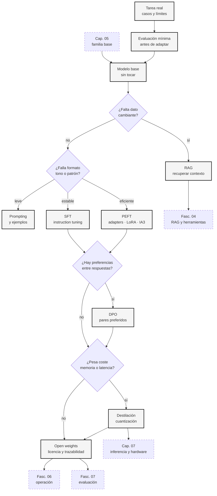
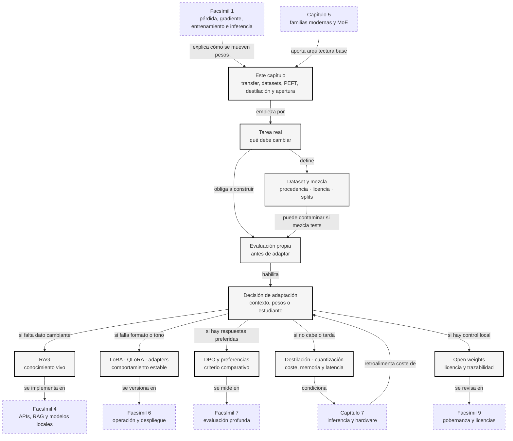

::: {.fasciculo-subtitle}
Facsímil 3 · Arquitecturas y modelos
:::

# Capítulo 06: Transfer learning, destilación y modelos abiertos

## Casi nadie empieza desde cero

Entrenar un modelo grande desde cero es caro, lento y exige datos, infraestructura, evaluación y experiencia. La mayoría de equipos no empieza ahí. Empieza con un modelo que ya sabe mucho y lo adapta a una tarea concreta.

Ese cambio de mentalidad es enorme. En vez de preguntar «¿cómo entreno mi propio LLM desde cero?», preguntamos:

| Pregunta práctica | Técnica que suele aparecer |
|---|---|
| ¿Puedo reutilizar un modelo ya entrenado? | Transfer learning. |
| ¿Puedo ajustarlo a mi dominio? | Fine-tuning o instruction tuning. |
| ¿Puedo entrenar pocos parámetros? | LoRA, adapters, QLoRA. |
| ¿Puedo hacerlo más pequeño? | Destilación y cuantización. |
| ¿Puedo ejecutarlo y modificarlo legalmente? | Modelos abiertos, licencias y documentación. |

Este capítulo une esas piezas. Es menos espectacular que hablar de billones de parámetros, pero mucho más cercano a la realidad profesional: elegir una base, adaptarla, medirla, comprimirla si hace falta y entender qué te permite su licencia.

Cuando aparezcan herramientas, catálogos, modelos abiertos o librerías de evaluación, toma la sección como estado observado a **10 de junio de 2026**. Las ideas estables son el mecanismo y el criterio de decisión; los nombres, versiones, licencias y capacidades concretas deben revisarse antes de usarlos en un proyecto real.

## Qué no es adaptar un modelo

Adaptar un modelo no es «meterle documentos» como quien mete libros en una estantería. Si haces fine-tuning, cambias pesos. Si haces RAG, conectas recuperación externa. Si haces prompt engineering, cambias el contexto. Son mecanismos distintos.

Tampoco conviene pensar que fine-tuning arregla cualquier problema. Si el modelo falla porque no tiene el dato actualizado, puede que necesites recuperación. Si falla porque no sigue un formato, quizá necesitas mejores ejemplos, validación o una interfaz más estricta. Si falla porque la tarea requiere cálculo exacto, puede que necesites una herramienta.

Y un modelo abierto no siempre significa lo mismo. A veces puedes descargar pesos, pero no tienes datos de entrenamiento. A veces la licencia permite investigación pero limita uso comercial. A veces hay código, tokenizer y evaluación; otras veces solo un checkpoint. La palabra «abierto» exige mirar detalles.

## Transfer learning: reutilizar una base

Transfer learning significa usar conocimiento aprendido en un contexto para mejorar otro. En NLP moderno, el patrón se volvió muy claro con modelos preentrenados: primero se entrena una base con grandes cantidades de texto; después se adapta a tareas concretas.^[Devlin, J., Chang, M.-W., Lee, K. y Toutanova, K. (2019). BERT: pre-training of deep bidirectional transformers for language understanding. *Proceedings of NAACL-HLT*, 4171-4186. https://doi.org/10.18653/v1/N19-1423. BERT popularizó el esquema de preentrenar representaciones de lenguaje y ajustarlas en tareas posteriores.] T5 lo llevó a una formulación texto-a-texto muy amplia.^[Raffel, C. et al. (2020). Exploring the limits of transfer learning with a unified text-to-text Transformer. *Journal of Machine Learning Research, 21*(140), 1-67. https://www.jmlr.org/papers/v21/20-074.html. T5 estudia transferencia en un marco unificado donde muchas tareas se expresan como entrada de texto y salida de texto.]

Una forma simple de verlo:

```text
modelo base -> adaptación -> modelo útil para una tarea concreta
```

| Fase | Qué aprende | Ejemplo |
|---|---|---|
| Preentrenamiento | Patrones generales del lenguaje y del mundo textual. | Continuar texto, relacionar conceptos, estilo, idiomas. |
| Instruction tuning | Seguir instrucciones humanas en formato pregunta/respuesta. | «Resume esto», «extrae estos campos», «clasifica». |
| Fine-tuning de dominio | Patrones de un sector o tarea concreta. | Soporte técnico, documentos jurídicos, código interno. |
| Evaluación | Si la adaptación ayuda o daña. | Tests propios, casos reales, comparación contra base. |

Instruction tuning se volvió central para convertir modelos base en asistentes útiles.^[Ouyang, L. et al. (2022). Training language models to follow instructions with human feedback. *Advances in Neural Information Processing Systems 35*, 27730-27744. https://arxiv.org/abs/2203.02155. El trabajo muestra cómo el ajuste con instrucciones y preferencias humanas mejora la capacidad de seguir peticiones.] Pero no hay que confundirlo con una capacidad espontánea: es entrenamiento sobre ejemplos de comportamiento deseado.

## Datasets: qué se entrena realmente

Cuando hablamos de entrenamiento, la palabra “datos” se queda corta. Un LLM no se entrena con “internet” como una masa uniforme. Se entrena con mezclas de documentos, código, conversaciones, instrucciones, comparaciones, problemas, imágenes, etiquetas, filtros y evaluaciones. Cada familia de datos empuja una capacidad distinta.

Un dataset no es solo una carpeta con archivos. Es una decisión de producto y de ingeniería:

| Pregunta | Por qué importa |
|---|---|
| ¿De dónde sale? | Derechos, licencia, idioma, sesgo de dominio y calidad. |
| ¿Qué formato tiene? | Texto libre, pares pregunta-respuesta, preferencias, imagen-texto, código, tablas. |
| ¿Qué enseña? | Continuar texto, seguir instrucciones, razonar, preferir una respuesta, ver imágenes. |
| ¿Qué no enseña? | Ningún dataset cubre todo; cada mezcla tiene huecos. |
| ¿Cómo se filtra? | Duplicados, baja calidad, datos sensibles, idioma, toxicidad, contenido roto. |
| ¿Cómo se mezcla? | La proporción entre web, código, matemáticas o diálogo cambia el modelo. |
| ¿Cómo se evalúa? | Sin conjunto de evaluación separado, puedes entrenar para memorizar tus pruebas. |

La arquitectura de entrenamiento cambia según el tipo de dataset.

| Tipo de dataset | Forma típica | Qué entrena | Ejemplos conocidos |
|---|---|---|---|
| **Preentrenamiento textual** | Texto largo no etiquetado. | Predicción del siguiente token o reconstrucción. | C4/T5, The Pile.^[Raffel et al. (2020) crearon C4 para T5 como corpus web filtrado. Gao, L. et al. (2020). *The Pile: An 800GB Dataset of Diverse Text for Language Modeling*. https://arxiv.org/abs/2101.00027.] |
| **Código** | Repositorios, archivos, funciones, comentarios. | Sintaxis, APIs, patrones de programación. | The Stack.^[Kocetkov, D. et al. (2022). *The Stack: 3 TB of permissively licensed source code*. https://arxiv.org/abs/2211.15533.] |
| **SFT / instrucciones** | `instrucción -> respuesta esperada`. | Seguir tareas, formato, tono, extracción, resumen. | FLAN, Dolly-15K.^[Longpre, S. et al. (2023). *The Flan Collection*. https://arxiv.org/abs/2301.13688. Databricks. (2023). *databricks-dolly-15k*. https://huggingface.co/datasets/databricks/databricks-dolly-15k.] |
| **Preferencias** | `prompt, respuesta A, respuesta B, preferida`. | Elegir entre salidas plausibles. | HH-RLHF, UltraFeedback.^[Bai, Y. et al. (2022). *Training a Helpful and Harmless Assistant with Reinforcement Learning from Human Feedback*. https://arxiv.org/abs/2204.05862. Cui, G. et al. (2023). *UltraFeedback*. https://arxiv.org/abs/2310.01377.] |
| **Razonamiento** | Problema, solución, pasos o verificador. | Matemáticas, cadenas de inferencia, comprobación. | GSM8K.^[Cobbe, K. et al. (2021). *Training Verifiers to Solve Math Word Problems*. https://arxiv.org/abs/2110.14168.] |
| **Multimodal** | Imagen-texto, imagen-instrucción-respuesta, vídeo-texto. | Alinear señales visuales y lenguaje. | LAION-5B, LLaVA.^[Schuhmann, C. et al. (2022). *LAION-5B*. https://arxiv.org/abs/2210.08402. Liu, H. et al. (2023). *Visual Instruction Tuning*. https://arxiv.org/abs/2304.08485.] |
| **Evaluación** | Preguntas con respuesta esperada o rúbrica. | No entrena; mide. | MMLU, BEIR, MTEB.^[Hendrycks, D. et al. (2021). *Measuring Massive Multitask Language Understanding*. https://arxiv.org/abs/2009.03300. BEIR y MTEB aparecen en los capítulos de embeddings y evaluación.] |

No confundas dataset de entrenamiento con dataset de evaluación. El primero mueve el modelo. El segundo mide si el modelo se comporta mejor. Si una pregunta de evaluación se cuela en entrenamiento, la nota puede subir sin que el modelo haya aprendido a generalizar. A eso se le suele llamar contaminación de datos.

## Arquitecturas de datos para entrenar y adaptar

La palabra arquitectura no solo habla de capas del Transformer. También habla de cómo conectas datos, filtros, pérdidas, modelo base, evaluadores y artefactos finales. Aquí tienes el mapa de las arquitecturas de entrenamiento más comunes.

<svg id="f3-c06-datasets-arquitecturas" xmlns="http://www.w3.org/2000/svg" viewBox="0 0 1320 1040" role="img" aria-label="Arquitecturas de datasets para preentrenamiento, SFT, preferencias, destilación, multimodalidad y evaluación">
  <defs>
    <marker id="f3c06data-arrow" viewBox="0 0 10 10" refX="9" refY="5" markerWidth="7" markerHeight="7" orient="auto-start-reverse">
      <path d="M 0 0 L 10 5 L 0 10 z" fill="#111111"/>
    </marker>
    <pattern id="f3c06data-grid" width="18" height="18" patternUnits="userSpaceOnUse">
      <path d="M 18 0 L 0 0 0 18" fill="none" stroke="#ECECEC" stroke-width="1"/>
    </pattern>
  </defs>

  <rect x="24" y="24" width="1272" height="992" rx="18" fill="#FFFFFF" stroke="#111111" stroke-width="2"/>
  <rect x="52" y="96" width="1216" height="850" rx="14" fill="url(#f3c06data-grid)" stroke="#DDDDDD"/>
  <text x="660" y="62" text-anchor="middle" font-family="Arial, sans-serif" font-size="27" font-weight="700" fill="#111111">Arquitecturas de datos para entrenar y adaptar LLMs</text>
  <text x="660" y="88" text-anchor="middle" font-family="Arial, sans-serif" font-size="13" fill="#555555">Cada tipo de dataset cambia entrada, pérdida, artefacto final y riesgo principal.</text>

  <g font-family="Arial, sans-serif">
    <rect x="80" y="130" width="360" height="232" rx="14" fill="#FFFFFF" stroke="#111111" stroke-width="1.8"/>
    <text x="108" y="162" font-size="15" font-weight="700" fill="#111111">1. Preentrenamiento</text>
    <rect x="108" y="194" width="98" height="48" rx="8" fill="#F7F7F7" stroke="#111111"/>
    <text x="157" y="214" text-anchor="middle" font-size="11" font-weight="700" fill="#111111">texto masivo</text>
    <text x="157" y="230" text-anchor="middle" font-size="9.5" fill="#555555">web · libros</text>
    <line x1="206" y1="218" x2="248" y2="218" stroke="#111111" stroke-width="1.3" marker-end="url(#f3c06data-arrow)"/>
    <rect x="248" y="194" width="76" height="48" rx="8" fill="#111111" stroke="#111111"/>
    <text x="286" y="214" text-anchor="middle" font-size="11" font-weight="700" fill="#FFFFFF">filtros</text>
    <text x="286" y="230" text-anchor="middle" font-size="9.5" fill="#E5E5E5">calidad</text>
    <line x1="324" y1="218" x2="360" y2="218" stroke="#111111" stroke-width="1.3" marker-end="url(#f3c06data-arrow)"/>
    <rect x="108" y="282" width="112" height="48" rx="8" fill="#FFFFFF" stroke="#111111"/>
    <text x="164" y="302" text-anchor="middle" font-size="11" font-weight="700" fill="#111111">next token</text>
    <text x="164" y="318" text-anchor="middle" font-size="9.5" fill="#555555">pérdida CE</text>
    <line x1="220" y1="306" x2="266" y2="306" stroke="#111111" stroke-width="1.3" marker-end="url(#f3c06data-arrow)"/>
    <rect x="266" y="282" width="130" height="48" rx="8" fill="#F7F7F7" stroke="#111111"/>
    <text x="331" y="302" text-anchor="middle" font-size="11" font-weight="700" fill="#111111">modelo base</text>
    <text x="331" y="318" text-anchor="middle" font-size="9.5" fill="#555555">capacidad general</text>
    <rect x="360" y="194" width="56" height="48" rx="8" fill="#FFFFFF" stroke="#111111"/>
    <text x="388" y="215" text-anchor="middle" font-size="10" fill="#111111">tokens</text>
    <text x="388" y="231" text-anchor="middle" font-size="9" fill="#555555">mezcla</text>

    <rect x="480" y="130" width="360" height="232" rx="14" fill="#FFFFFF" stroke="#111111" stroke-width="1.8"/>
    <text x="508" y="162" font-size="15" font-weight="700" fill="#111111">2. SFT / instruction tuning</text>
    <rect x="508" y="194" width="116" height="48" rx="8" fill="#F7F7F7" stroke="#111111"/>
    <text x="566" y="214" text-anchor="middle" font-size="11" font-weight="700" fill="#111111">instrucción</text>
    <text x="566" y="230" text-anchor="middle" font-size="9.5" fill="#555555">entrada</text>
    <line x1="624" y1="218" x2="666" y2="218" stroke="#111111" stroke-width="1.3" marker-end="url(#f3c06data-arrow)"/>
    <rect x="666" y="194" width="132" height="48" rx="8" fill="#FFFFFF" stroke="#111111"/>
    <text x="732" y="214" text-anchor="middle" font-size="11" font-weight="700" fill="#111111">respuesta ideal</text>
    <text x="732" y="230" text-anchor="middle" font-size="9.5" fill="#555555">formato y tono</text>
    <rect x="508" y="282" width="112" height="48" rx="8" fill="#111111" stroke="#111111"/>
    <text x="564" y="302" text-anchor="middle" font-size="11" font-weight="700" fill="#FFFFFF">pérdida</text>
    <text x="564" y="318" text-anchor="middle" font-size="9.5" fill="#E5E5E5">sobre salida</text>
    <line x1="620" y1="306" x2="664" y2="306" stroke="#111111" stroke-width="1.3" marker-end="url(#f3c06data-arrow)"/>
    <rect x="664" y="282" width="134" height="48" rx="8" fill="#F7F7F7" stroke="#111111"/>
    <text x="731" y="302" text-anchor="middle" font-size="11" font-weight="700" fill="#111111">modelo instruct</text>
    <text x="731" y="318" text-anchor="middle" font-size="9.5" fill="#555555">sigue tareas</text>

    <rect x="880" y="130" width="360" height="232" rx="14" fill="#FFFFFF" stroke="#111111" stroke-width="1.8"/>
    <text x="908" y="162" font-size="15" font-weight="700" fill="#111111">3. Preferencias</text>
    <rect x="908" y="194" width="92" height="48" rx="8" fill="#F7F7F7" stroke="#111111"/>
    <text x="954" y="214" text-anchor="middle" font-size="11" font-weight="700" fill="#111111">prompt</text>
    <text x="954" y="230" text-anchor="middle" font-size="9.5" fill="#555555">caso</text>
    <line x1="1000" y1="218" x2="1038" y2="218" stroke="#111111" stroke-width="1.3" marker-end="url(#f3c06data-arrow)"/>
    <rect x="1038" y="186" width="82" height="42" rx="8" fill="#FFFFFF" stroke="#111111"/>
    <text x="1079" y="211" text-anchor="middle" font-size="10" fill="#111111">elegida</text>
    <rect x="1038" y="238" width="82" height="42" rx="8" fill="#FFFFFF" stroke="#111111"/>
    <text x="1079" y="263" text-anchor="middle" font-size="10" fill="#111111">rechazada</text>
    <line x1="1120" y1="234" x2="1160" y2="234" stroke="#111111" stroke-width="1.3" marker-end="url(#f3c06data-arrow)"/>
    <rect x="1160" y="208" width="58" height="52" rx="8" fill="#111111" stroke="#111111"/>
    <text x="1189" y="231" text-anchor="middle" font-size="10.5" font-weight="700" fill="#FFFFFF">DPO</text>
    <text x="1189" y="247" text-anchor="middle" font-size="9" fill="#E5E5E5">RLHF</text>
    <rect x="948" y="300" width="224" height="40" rx="8" fill="#F7F7F7" stroke="#111111"/>
    <text x="1060" y="324" text-anchor="middle" font-size="11" font-weight="700" fill="#111111">preferencias alinean criterios</text>

    <rect x="80" y="402" width="360" height="232" rx="14" fill="#FFFFFF" stroke="#111111" stroke-width="1.8"/>
    <text x="108" y="434" font-size="15" font-weight="700" fill="#111111">4. Razonamiento</text>
    <rect x="108" y="466" width="110" height="48" rx="8" fill="#F7F7F7" stroke="#111111"/>
    <text x="163" y="486" text-anchor="middle" font-size="11" font-weight="700" fill="#111111">problema</text>
    <text x="163" y="502" text-anchor="middle" font-size="9.5" fill="#555555">math · lógica</text>
    <line x1="218" y1="490" x2="262" y2="490" stroke="#111111" stroke-width="1.3" marker-end="url(#f3c06data-arrow)"/>
    <rect x="262" y="466" width="122" height="48" rx="8" fill="#FFFFFF" stroke="#111111"/>
    <text x="323" y="486" text-anchor="middle" font-size="11" font-weight="700" fill="#111111">solución</text>
    <text x="323" y="502" text-anchor="middle" font-size="9.5" fill="#555555">pasos o verificador</text>
    <rect x="126" y="548" width="112" height="48" rx="8" fill="#111111" stroke="#111111"/>
    <text x="182" y="568" text-anchor="middle" font-size="11" font-weight="700" fill="#FFFFFF">verificar</text>
    <text x="182" y="584" text-anchor="middle" font-size="9.5" fill="#E5E5E5">no solo copiar</text>
    <line x1="238" y1="572" x2="286" y2="572" stroke="#111111" stroke-width="1.3" marker-end="url(#f3c06data-arrow)"/>
    <rect x="286" y="548" width="116" height="48" rx="8" fill="#F7F7F7" stroke="#111111"/>
    <text x="344" y="568" text-anchor="middle" font-size="11" font-weight="700" fill="#111111">eval separada</text>
    <text x="344" y="584" text-anchor="middle" font-size="9.5" fill="#555555">sin contaminar</text>

    <rect x="480" y="402" width="360" height="232" rx="14" fill="#FFFFFF" stroke="#111111" stroke-width="1.8"/>
    <text x="508" y="434" font-size="15" font-weight="700" fill="#111111">5. Destilación</text>
    <rect x="508" y="466" width="104" height="48" rx="8" fill="#111111" stroke="#111111"/>
    <text x="560" y="486" text-anchor="middle" font-size="11" font-weight="700" fill="#FFFFFF">profesor</text>
    <text x="560" y="502" text-anchor="middle" font-size="9.5" fill="#E5E5E5">grande</text>
    <line x1="612" y1="490" x2="656" y2="490" stroke="#111111" stroke-width="1.3" marker-end="url(#f3c06data-arrow)"/>
    <rect x="656" y="466" width="116" height="48" rx="8" fill="#FFFFFF" stroke="#111111"/>
    <text x="714" y="486" text-anchor="middle" font-size="11" font-weight="700" fill="#111111">salidas suaves</text>
    <text x="714" y="502" text-anchor="middle" font-size="9.5" fill="#555555">logits · trazas</text>
    <rect x="548" y="548" width="112" height="48" rx="8" fill="#F7F7F7" stroke="#111111"/>
    <text x="604" y="568" text-anchor="middle" font-size="11" font-weight="700" fill="#111111">estudiante</text>
    <text x="604" y="584" text-anchor="middle" font-size="9.5" fill="#555555">pequeño</text>
    <line x1="660" y1="572" x2="704" y2="572" stroke="#111111" stroke-width="1.3" marker-end="url(#f3c06data-arrow)"/>
    <rect x="704" y="548" width="96" height="48" rx="8" fill="#F7F7F7" stroke="#111111"/>
    <text x="752" y="568" text-anchor="middle" font-size="11" font-weight="700" fill="#111111">servir</text>
    <text x="752" y="584" text-anchor="middle" font-size="9.5" fill="#555555">barato</text>

    <rect x="880" y="402" width="360" height="232" rx="14" fill="#FFFFFF" stroke="#111111" stroke-width="1.8"/>
    <text x="908" y="434" font-size="15" font-weight="700" fill="#111111">6. Multimodal</text>
    <rect x="908" y="466" width="92" height="48" rx="8" fill="#F7F7F7" stroke="#111111"/>
    <text x="954" y="486" text-anchor="middle" font-size="11" font-weight="700" fill="#111111">imagen</text>
    <text x="954" y="502" text-anchor="middle" font-size="9.5" fill="#555555">audio · vídeo</text>
    <line x1="1000" y1="490" x2="1038" y2="490" stroke="#111111" stroke-width="1.3" marker-end="url(#f3c06data-arrow)"/>
    <rect x="1038" y="466" width="96" height="48" rx="8" fill="#111111" stroke="#111111"/>
    <text x="1086" y="486" text-anchor="middle" font-size="11" font-weight="700" fill="#FFFFFF">encoder</text>
    <text x="1086" y="502" text-anchor="middle" font-size="9.5" fill="#E5E5E5">visual</text>
    <line x1="1134" y1="490" x2="1170" y2="490" stroke="#111111" stroke-width="1.3" marker-end="url(#f3c06data-arrow)"/>
    <rect x="1170" y="466" width="48" height="48" rx="8" fill="#FFFFFF" stroke="#111111"/>
    <text x="1194" y="493" text-anchor="middle" font-size="10" fill="#111111">LLM</text>
    <rect x="944" y="548" width="224" height="48" rx="8" fill="#F7F7F7" stroke="#111111"/>
    <text x="1056" y="568" text-anchor="middle" font-size="11" font-weight="700" fill="#111111">alinear representación</text>
    <text x="1056" y="584" text-anchor="middle" font-size="9.5" fill="#555555">imagen-texto-instrucción</text>

    <rect x="180" y="700" width="960" height="94" rx="14" fill="#111111" stroke="#111111"/>
    <text x="660" y="732" text-anchor="middle" font-size="16" font-weight="700" fill="#FFFFFF">La evaluación no se mezcla con entrenamiento</text>
    <text x="660" y="758" text-anchor="middle" font-size="12" fill="#E5E5E5">si el test entra en el train, el modelo puede memorizar la prueba y parecer mejor de lo que es</text>
    <text x="660" y="780" text-anchor="middle" font-size="12" fill="#E5E5E5">guarda versión de datos, filtros, mezcla, tokenizer, receta y métrica</text>
  </g>

  <text x="1268" y="990" text-anchor="end" font-family="Arial, sans-serif" font-size="11" fill="#888888">IA para gente curiosa / Facsímil 03 / Capítulo 06 / 686f6c61</text>
</svg>

El SVG muestra seis arquitecturas porque no todas optimizan lo mismo. Preentrenar busca capacidad general. SFT enseña formato y seguimiento de instrucciones. Preferencias enseñan criterios comparativos. Razonamiento necesita problemas verificables. Destilación pasa señales de un profesor a un estudiante. Multimodalidad alinea señales no textuales con lenguaje.

## Qué optimiza cada arquitectura

Para leer bien un dataset hay que mirar tres cosas a la vez: entrada, pérdida y artefacto final. Dos datasets pueden tener el mismo tamaño y servir para cosas muy distintas.

| Arquitectura | Entrada real | Objetivo matemático | Artefacto que produce | Qué debes comprobar |
|---|---|---|---|---|
| **Preentrenamiento causal** | Texto tokenizado \(x_1, x_2, \dots, x_T\). | Predecir el siguiente token: \(\mathcal{L}=-\sum_t \log p(x_t \mid x_{<t})\). | Modelo base. | Mezcla, deduplicación, idiomas, licencias y benchmarks filtrados. |
| **Preentrenamiento texto-a-texto / denoising** | Texto con huecos o transformación entrada-salida. | Reconstruir partes ocultas o salida esperada. | Modelo base transferible. | Cómo se generan corrupciones, tareas y plantillas. |
| **SFT / instruction tuning** | Instrucción, contexto opcional y respuesta ideal. | Entropía cruzada sobre los tokens de respuesta. | Modelo que sigue formato y tarea. | Calidad de respuestas, diversidad de instrucciones y ejemplos contradictorios. |
| **Preferencias** | Prompt, respuesta elegida y respuesta descartada. | Aumentar la probabilidad relativa de la elegida; en DPO aparece una pérdida logística sobre diferencias de log-probabilidad. | Modelo o adaptador alineado con una rúbrica. | Quién decide la preferencia, con qué criterio y si hay sesgo de longitud o estilo. |
| **Razonamiento verificable** | Problema, solución, pasos y a veces verificador. | Premiar soluciones que llegan a una respuesta comprobable. | Modelo mejor en problemas estructurados. | Separar entrenamiento y test; comprobar que no aprende plantillas memorizadas. |
| **Destilación** | Entradas y salidas del profesor: logits, respuestas o trazas. | Acercar distribución del estudiante a la del profesor, por ejemplo con KL. | Modelo estudiante más barato. | Qué capacidades pierde el estudiante fuera de la tarea. |
| **Multimodal** | Pares imagen-texto, imagen-instrucción-respuesta, audio-texto o vídeo-texto. | Alinear representaciones y generar texto condicionado por otra señal. | Modelo capaz de razonar sobre varias modalidades. | Calidad de pares, resolución, licencias y si la descripción textual corresponde a la señal. |
| **Evaluación** | Preguntas, respuestas esperadas, qrels, rúbricas o casos no respondibles. | No debería optimizar el modelo; mide una versión. | Métrica, traza y decisión de publicación. | Que no se mezcle con entrenamiento y que represente uso real. |

La mezcla de datos también es una arquitectura. Si tienes familias \(D_1, D_2, \dots, D_n\), no basta con juntarlas.

**Ejemplo de fórmula.** Para razonar de forma pedagógica sobre una mezcla, podemos escribir un conjunto de entrenamiento como suma ponderada de familias:

$$
D_{\text{train}} = \lambda_1 D_1 + \lambda_2 D_2 + \dots + \lambda_n D_n
$$

Aquí \(D_i\) representa una familia de datos —web filtrada, código, instrucciones, preferencias, razonamiento, imagen-texto— y \(\lambda_i\) representa su peso relativo en la mezcla. Esta fórmula no describe por sí sola cómo se implementa un *data loader* de entrenamiento real: sirve para recordar que cambiar proporciones cambia capacidades, sesgos, coste y contaminación posible. En un sistema real habría que documentar muestreo, filtros, deduplicación, licencias, idioma, fechas, splits y evaluación.

| Símbolo | Significado |
|---|---|
| \(D_i\) | Familia de datos: web, código, matemáticas, conversación, imagen-texto... |
| \(\lambda_i\) | Peso o proporción de esa familia en la mezcla. |
| \(D_{\text{train}}\) | Conjunto efectivo que verá el entrenamiento. |

Subir \(\lambda_{\text{código}}\) puede mejorar programación y cambiar estilo de respuesta. Subir \(\lambda_{\text{math}}\) puede ayudar en problemas formales y no mover demasiado tareas conversacionales. Por eso los informes técnicos serios hablan de mezcla, filtros y etapas; no solo de “tamaño del dataset”.

## Tipos de dataset con ejemplos

**1. Preentrenamiento textual.** Aquí el modelo aprende a predecir texto. No recibe una tarea humana explícita; recibe secuencias y aprende regularidades. C4 y The Pile son ejemplos conocidos de corpora grandes. Lo importante no es solo el tamaño: importan filtros, deduplicación, idiomas, licencias, dominios y contaminación de evaluación.

**2. Código.** Entrenar con código no es igual que entrenar con prosa. Un dataset como The Stack contiene repositorios y lenguajes de programación. Eso ayuda a aprender sintaxis, patrones de APIs, comentarios, tests y estructura de proyectos. También obliga a mirar licencias y duplicados con mucho cuidado.

**3. SFT o instruction tuning.** Aquí cada ejemplo suele tener una instrucción y una respuesta deseada. FLAN mezcla tareas y plantillas para enseñar a seguir instrucciones. Dolly-15K ilustra un dataset más pequeño y humano de instrucciones/respuestas. Esta familia enseña comportamiento, no conocimiento vivo.

**4. Preferencias.** En DPO/RLHF no basta con una respuesta correcta. El dataset dice cuál de dos respuestas se prefiere. HH-RLHF y UltraFeedback ilustran esta familia. La arquitectura cambia: el modelo aprende de comparaciones, no solo de una salida ideal.

**5. Razonamiento y verificación.** GSM8K contiene problemas matemáticos con soluciones. Sirve para entrenar o evaluar razonamiento paso a paso, pero hay que evitar que los ejemplos de evaluación entren en entrenamiento. En razonamiento, la solución no debe ser una decoración: debe poder comprobarse.

**6. Multimodalidad.** LAION-5B ilustra pares imagen-texto a gran escala; LLaVA usa instrucción visual para conectar imagen y diálogo. Aquí el dataset no solo enseña palabras. Enseña alineación entre una representación visual y lenguaje.

**7. Evaluación.** MMLU, BEIR o MTEB no deberían tratarse como entrenamiento de conveniencia. Son instrumentos de medida. Puedes inspirarte en ellos, pero tu producto necesita evaluación propia, como vimos en el [capítulo 10 del facsímil 4](/libro/fasciculo-04/#capitulo-10).

## Qué debe mirar un ingeniero en un dataset

La ficha de un dataset debería leerse como una ficha de arquitectura:

| Campo | Qué preguntas hacer |
|---|---|
| Procedencia | ¿Quién creó los datos? ¿Con qué permisos? ¿De qué dominios vienen? |
| Formato | ¿Texto libre, instrucciones, preferencias, código, imagen-texto, tablas? |
| Tamaño | ¿Número de ejemplos, tokens, documentos o pares? |
| Calidad | ¿Hay filtros, deduplicación, revisión humana o heurísticas claras? |
| Licencia | ¿Permite entrenamiento, redistribución, uso comercial o derivados? |
| Cobertura | ¿Qué idiomas, dominios, estilos y tareas incluye? |
| Huecos | ¿Qué casos no cubre o cubre mal? |
| Riesgos | ¿Datos personales, duplicados, baja calidad, sesgos de fuente? |
| Contaminación | ¿Se mezcló con benchmarks o tests que luego se reportan? |
| Trazabilidad | ¿Puedo reconstruir versión, filtros y mezcla usada? |

Una regla simple: un dataset pequeño y muy bueno puede ganar a un dataset enorme y sucio en una adaptación concreta. Para preentrenamiento, el volumen importa mucho; para SFT, preferencias o destilación, la calidad y la cobertura del caso real pesan muchísimo.

## Software que ayuda a auditar datasets y evaluar modelos

Sí, existe software para ayudar, pero conviene no meterlo todo en el mismo saco. Una herramienta puede limpiar datos, otra puede detectar ejemplos sospechosos, otra puede ejecutar benchmarks y otra puede evaluar un RAG. “Evaluar el dataset” no es una única operación.

| Herramienta | Qué evalúa o cura | Cuándo usarla | Qué no debes pedirle |
|---|---|---|---|
| **DataTrove** | Procesa, filtra, deduplica y calcula estadísticas sobre texto a gran escala.^[Hugging Face. (2026). *DataTrove*. https://github.com/huggingface/datatrove. La documentación lo presenta como una librería para procesar, filtrar y deduplicar texto a gran escala, con bloques de estadísticas, filtros, tokens y deduplicación.] | Antes de preentrenar o construir un corpus grande. | No decide por sí sola si una respuesta SFT es pedagógicamente buena. |
| **NVIDIA NeMo Curator** | Curation multimodal: texto, imagen, vídeo y audio; filtrado, deduplicación y calidad a escala.^[NVIDIA. (2026). *Overview of NeMo Curator*. https://docs.nvidia.com/nemo/curator/latest/about. La documentación describe una plataforma abierta para curation de datos escalable y consciente de privacidad para datasets de entrenamiento de IA generativa.] | Cuando el volumen exige pipelines distribuidos o multimodales. | No sustituye tu criterio de dominio ni una licencia clara. |
| **Cleanlab TLM / Studio** | Detecta ejemplos problemáticos en pares instrucción-respuesta: baja calidad, prompts vagos, PII, lenguaje tóxico, gramática, etc.^[Cleanlab. (2026). *Discover Bad Data/Responses in any LLM/Human-Written Dataset*. https://help.cleanlab.ai/tlm/use-cases/instruction_tuning_data/. El tutorial muestra cómo puntuar pares prompt-respuesta y localizar ejemplos de baja calidad en datasets de instruction tuning o evals.] | Para revisar SFT, datasets de preferencias o conjuntos de evaluación con respuestas. | No convierte automáticamente una mala rúbrica en una buena. |
| **Deepchecks** | Integridad de datos, distribuciones, splits, comparación de modelos y validación clásica de ML.^[Deepchecks. (2026). *Welcome to Deepchecks*. https://docs.deepchecks.com/0.8/getting-started/welcome.html. La documentación lo define como herramienta para validar datos y modelos: integridad, distribuciones, splits y comparación entre modelos.] | En datasets tabulares, visión o ML tradicional; también para detectar problemas de splits. | No es el evaluador principal de un LLM conversacional. |
| **Hugging Face Evaluate** | Métricas, mediciones y comparaciones reproducibles para modelos y datasets.^[Hugging Face. (2026). *Evaluate*. https://huggingface.co/docs/evaluate/index. La documentación lo presenta como librería para evaluar modelos y datasets con métodos de evaluación de NLP, visión, RL y otros dominios.] | Cuando necesitas métricas conocidas y resultados reproducibles. | No entiende tu negocio si no defines bien la tarea. |
| **LightEval** | Evaluación de LLMs en múltiples backends, tareas existentes, tareas propias y resultados muestra a muestra.^[Hugging Face. (2026). *Lighteval*. https://huggingface.co/docs/lighteval/index. La documentación lo describe como toolkit para evaluar LLMs con distintos backends, tareas, métricas y resultados detallados.] | Después de adaptar un modelo o comparar variantes. | No audita por sí solo el dataset de entrenamiento. |
| **lm-evaluation-harness** | Benchmarks académicos y tareas reproducibles para modelos de lenguaje.^[EleutherAI. (2026). *Language Model Evaluation Harness*. https://github.com/EleutherAI/lm-evaluation-harness. El repositorio lo describe como framework unificado para probar modelos generativos en muchas tareas, con benchmarks públicos y soporte para modelos locales, APIs y adaptadores.] | Para comparar contra MMLU, GSM8K, BBH y otros benchmarks públicos. | No sustituye tu evaluación privada de producto. |
| **HELM** | Evaluación holística: escenarios, métricas, robustez, transparencia y comparación amplia.^[Liang, P. et al. (2022). *Holistic Evaluation of Language Models*. https://arxiv.org/abs/2211.09110. HELM propone evaluar modelos con múltiples escenarios y métricas para evitar una lectura estrecha del rendimiento.] | Como marco mental o benchmark amplio. | No te dice si tu asistente responde bien a tus usuarios concretos. |

Un flujo profesional mínimo sería:

1. **Antes de entrenar:** perfilar, filtrar, deduplicar, detectar idioma, longitud, PII, duplicados y baja calidad con DataTrove, NeMo Curator, Cleanlab o checks propios.
2. **Antes de tocar pesos:** congelar splits `train`, `validation` y `test`, con hashes y versión de dataset.
3. **Después de adaptar:** evaluar con LightEval, lm-evaluation-harness, Hugging Face Evaluate o un harness propio.
4. **Antes de publicar:** pasar tu dataset privado de evaluación, no solo benchmarks públicos.
5. **Si es RAG:** usar evaluación por capas como la del [facsímil 4, capítulo 10](/libro/fasciculo-04/#capitulo-10): retrieval, contexto, groundedness, citas y abstención.

La idea importante es esta: el software ayuda a encontrar problemas, pero no define por ti qué significa “bueno”. Esa definición sigue siendo del equipo: tarea, rúbrica, usuario, coste, licencia y riesgo de error.

## Fine-tuning completo: mover todos los pesos

En fine-tuning completo, partimos de unos pesos \(\theta\) y los actualizamos con nuevos datos:

$$
\theta' = \theta - \eta \nabla_{\theta}\mathcal{L}
$$

| Símbolo | Significado | Ejemplo |
|---|---|---|
| \(\theta\) | Pesos iniciales del modelo base. | Pesos de un LLM preentrenado. |
| \(\theta'\) | Pesos después del ajuste. | Modelo especializado. |
| \(\eta\) | Tasa de aprendizaje. | \(2 \times 10^{-5}\). |
| \(\nabla_{\theta}\mathcal{L}\) | Gradiente de la pérdida respecto a los pesos. | Dirección para reducir error. |
| \(\mathcal{L}\) | Función de pérdida. | Error en respuestas esperadas. |

Esto puede funcionar muy bien, pero tiene costes:

| Ventaja | Coste |
|---|---|
| Gran capacidad de adaptación. | Mucha memoria y cómputo. |
| Puede modificar profundamente el comportamiento. | Riesgo de olvidar capacidades útiles si los datos son estrechos. |
| Produce un único modelo ajustado. | Guardar y servir muchas variantes puede ser caro. |

En equipos pequeños, fine-tuning completo no suele ser la primera opción. Antes se prueba prompt, RAG, evaluación, datos mejores y métodos eficientes como LoRA.

## La pérdida y los gradientes: qué cambia de verdad

Cuando decimos «ajustar pesos», estamos diciendo algo muy concreto: calcular una pérdida, derivarla y mover parámetros para reducirla.

Supongamos que queremos enseñar al modelo a continuar esta frase:

> El cliente quiere cambiar unos auriculares porque llegaron...

Y el token correcto en nuestro ejemplo es:

> rotos

El modelo produce logits para tres candidatos:

| Token candidato | Logit |
|---|---:|
| factura | 2,0 |
| rotos | 1,0 |
| saludo | 0,0 |

Aplicamos softmax:

$$
p_i = \frac{e^{z_i}}{\sum_j e^{z_j}}
$$

| Token | Probabilidad \(p_i\) | Etiqueta \(y_i\) | Gradiente \(p_i-y_i\) |
|---|---:|---:|---:|
| factura | 0,665 | 0 | 0,665 |
| rotos | 0,245 | 1 | -0,755 |
| saludo | 0,090 | 0 | 0,090 |

La pérdida de entropía cruzada para el token correcto es:

$$
\mathcal{L} = -\log(p_{\text{rotos}})
$$

$$
\mathcal{L} \approx -\log(0{,}245) \approx 1{,}408
$$

La derivada respecto a cada logit, cuando usamos softmax y entropía cruzada, queda así:

$$
\frac{\partial \mathcal{L}}{\partial z_i}=p_i-y_i
$$

| Símbolo | Significado | Ejemplo |
|---|---|---|
| \(z_i\) | Logit del token candidato \(i\). | \(z_{\text{factura}}=2{,}0\). |
| \(p_i\) | Probabilidad tras softmax. | \(p_{\text{rotos}}=0{,}245\). |
| \(y_i\) | Etiqueta real en formato one-hot. | Para «rotos», \(y=1\). |
| \(p_i-y_i\) | Gradiente respecto al logit. | Para «rotos», \(-0{,}755\). |

Lectura práctica:

| Token | Qué le dice el gradiente al entrenamiento |
|---|---|
| factura | «Te estás pasando con este token; baja su puntuación». |
| rotos | «Este era el bueno; sube su puntuación». |
| saludo | «También está algo alto; bájalo un poco». |

Si la última capa calcula:

$$
z = hW
$$

entonces el gradiente llega a \(W\) así:

$$
\frac{\partial \mathcal{L}}{\partial W}=h^T(p-y)
$$

En la práctica no entrenamos con una frase, sino con lotes de ejemplos. Si tenemos \(B\) ejemplos, una pérdida media sería:

$$
\mathcal{L}_{\text{lote}}=-\frac{1}{B}\sum_{b=1}^{B}\log p(y^{(b)}\mid x^{(b)})
$$

El optimizador no ve «atención al cliente», «factura» o «tono educado». Ve números. Si el lote contiene muchos ejemplos donde una devolución debe terminar en un formato concreto, los gradientes empujan al modelo hacia ese patrón. Si los ejemplos son pobres, repetidos o demasiado estrechos, el modelo puede mejorar esa plantilla y empeorar fuera de ella.

| Técnica | Por dónde dejamos pasar el gradiente | Qué queda congelado | Lectura práctica |
|---|---|---|---|
| Fine-tuning completo | Casi todo el modelo. | Poco o nada. | Máxima capacidad de cambio, máximo coste y más riesgo de tocar cosas que funcionaban. |
| LoRA / QLoRA | Matrices pequeñas \(A\) y \(B\). | Matriz grande \(W\) y la mayor parte del modelo. | Adaptas el comportamiento con una pieza pequeña que se puede guardar aparte. |
| Adapters | Módulos añadidos entre capas. | La red base. | Útil si quieres muchas tareas sobre una base común. |
| Prompt tuning / prefix tuning | Vectores continuos aprendidos. | Los pesos del modelo. | Cambia la entrada interna, no el modelo base. |
| IA3 | Vectores que escalan activaciones. | Casi todos los pesos. | Ajuste muy ligero: más fino, pero también menos expresivo. |
| DPO | Pesos o adaptadores a partir de preferencias. | Depende de la implementación. | Enseña qué respuesta preferimos cuando hay varias plausibles. |
| Destilación | El estudiante. | El profesor. | El grande enseña señales; el pequeño aprende a imitar lo suficiente. |

Esa es la diferencia real entre técnicas: **por dónde dejamos pasar el gradiente**. Y por eso la pérdida no basta como única brújula. Puede bajar la pérdida en tus ejemplos y aun así empeorar una tarea real si el conjunto de evaluación no representa el uso diario.

## No todo es LoRA: mapa de técnicas de adaptación

LoRA y QLoRA son importantes, pero no son las únicas opciones. Esta tabla sirve como brújula rápida. No hace falta memorizar todos los nombres; lo importante es saber qué parte se entrena, qué problema resuelve y qué puede salir mal.

| Técnica | Qué se entrena | Cuándo encaja | Cuidado |
|---|---|---|---|
| **Prompting** | Nada. Solo contexto escrito. | Primer intento, prototipos, tareas simples. | Si el contexto cambia mucho, puede volverse frágil. |
| **RAG** | Normalmente nada del modelo; se entrena o configura recuperación. | Conocimiento privado o cambiante. | Si recupera mal, el modelo contesta con mala base. |
| **Fine-tuning completo** | Todos o casi todos los pesos. | Cambio profundo de dominio o comportamiento. | Caro; riesgo de olvidar capacidades útiles. |
| **SFT / instruction tuning** | Pesos del modelo, con pares instrucción-respuesta. | Enseñar formato, estilo y seguimiento de tareas. | La calidad de ejemplos manda más que el nombre de la técnica. |
| **Adapters** | Módulos pequeños insertados en capas. | Muchas tareas con una base compartida. | Añaden algo de latencia y complejidad.^[Houlsby, N. et al. (2019). Parameter-efficient transfer learning for NLP. *International Conference on Machine Learning*. https://arxiv.org/abs/1902.00751. El trabajo propone adaptar modelos de lenguaje con módulos pequeños manteniendo la mayoría de parámetros congelados.] |
| **Prompt tuning** | Vectores de prompt continuos. | Modelos grandes, tareas concretas y bajo coste. | No es texto legible; es un prompt aprendido.^[Lester, B., Al-Rfou, R. y Constant, N. (2021). The power of scale for parameter-efficient prompt tuning. *Proceedings of EMNLP*, 3045-3059. https://doi.org/10.18653/v1/2021.emnlp-main.243. El método aprende soft prompts manteniendo congelado el modelo base.] |
| **Prefix tuning** | Vectores de prefijo para condicionar capas. | Generación controlada con pocos parámetros. | Requiere saber dónde insertar el prefijo.^[Li, X. L. y Liang, P. (2021). Prefix-tuning: Optimizing continuous prompts for generation. *Proceedings of ACL*, 4582-4597. https://doi.org/10.18653/v1/2021.acl-long.353. Prefix tuning optimiza vectores continuos de prefijo con el modelo base congelado.] |
| **P-tuning v2** | Prompts continuos profundos, a menudo en varias capas. | Cuando quieres prompt tuning más expresivo en tareas de comprensión. | Sigue siendo menos interpretable que ejemplos escritos.^[Liu, X. et al. (2022). P-Tuning v2: Prompt tuning can be comparable to fine-tuning universally across scales and tasks. *Proceedings of ACL*. https://arxiv.org/abs/2110.07602. P-tuning v2 muestra que prompts continuos bien optimizados pueden acercarse al fine-tuning con pocos parámetros.] |
| **BitFit** | Principalmente sesgos del modelo. | Prueba barata cuando tienes pocos datos. | Puede quedarse corto si la tarea exige cambiar representaciones profundas.^[Ben-Zaken, E., Ravfogel, S. y Goldberg, Y. (2022). BitFit: Simple parameter-efficient fine-tuning for transformer-based masked language-models. *Proceedings of ACL*. https://arxiv.org/abs/2106.10199. BitFit ajusta solo términos de sesgo y aun así puede competir en algunos escenarios.] |
| **LoRA** | Matrices pequeñas \(A\) y \(B\). | Ajuste eficiente y práctico en LLMs. | Depende de rango, capas elegidas y datos. |
| **QLoRA** | LoRA sobre modelo base cuantizado. | Ajustar modelos grandes con poca memoria. | Cuantización y configuración importan mucho. |
| **IA3** | Vectores que escalan activaciones. | Ajuste muy ligero con pocos ejemplos. | Menos flexible que métodos con más parámetros.^[Liu, H. et al. (2022). *Few-shot parameter-efficient fine-tuning is better and cheaper than in-context learning*. https://arxiv.org/abs/2205.05638. El trabajo introduce IA3, que aprende vectores de escala para adaptar activaciones con pocos parámetros.] |
| **AdaLoRA** | Bajo rango con presupuesto adaptativo. | Cuando no quieres repartir el mismo rango a todas las matrices. | Más configuración; no siempre merece la complejidad.^[Zhang, Q. et al. (2023). AdaLoRA: Adaptive budget allocation for parameter-efficient fine-tuning. *International Conference on Learning Representations*. https://arxiv.org/abs/2303.10512. AdaLoRA reparte el presupuesto entrenable según la importancia estimada de cada matriz.] |
| **DoRA** | Magnitud y dirección del peso, usando bajo rango para la dirección. | Cuando LoRA se queda algo corto y quieres más capacidad. | Es una variante más especializada; conviene validar contra LoRA simple.^[Liu, S.-Y. et al. (2024). DoRA: Weight-decomposed low-rank adaptation. *International Conference on Machine Learning*. https://arxiv.org/abs/2402.09353. DoRA separa magnitud y dirección para acercarse más al fine-tuning completo con pocos parámetros.] |
| **DPO / preferencias** | Pesos o adaptadores usando pares preferido/rechazado. | Alinear estilo y preferencias tras SFT. | No sustituye datos correctos ni evaluación.^[Rafailov, R. et al. (2023). Direct preference optimization: Your language model is secretly a reward model. *Advances in Neural Information Processing Systems 36*. https://arxiv.org/abs/2305.18290. DPO optimiza preferencias directamente sin entrenar un modelo de recompensa separado.] |
| **Destilación** | Un estudiante que imita al profesor. | Reducir tamaño o coste. | Puede perder capacidades fuera de la tarea. |
| **Cuantización** | A veces nada; a veces calibración. | Reducir memoria e inferencia. | Puede bajar calidad si se aprieta demasiado. |

Una regla práctica: si no tienes evaluación, no elijas técnica todavía. Primero crea diez, cincuenta o cien casos reales que puedas revisar. Sin eso, fine-tuning, LoRA o DPO son formas sofisticadas de adivinar.

## Casos cercanos: elegir sin ponerse solemne

**La tienda online.** El catálogo cambia cada día, pero el tono de atención al cliente debe ser siempre claro y amable. Para el catálogo, RAG: recuperar precio, stock, plazo y política vigente. Para el tono y el formato, quizá basten buenos ejemplos; si se repite mucho, LoRA o adapters pueden fijar esa forma de responder.

**El departamento de compras.** Recibe presupuestos en PDF y quiere extraer proveedor, importes, plazos y condiciones. Si el problema es leer documentos nuevos, empieza por extracción, validación y RAG. Si el problema es que el modelo devuelve JSON desordenado, SFT o LoRA con ejemplos muy buenos puede ayudar. Si las respuestas son largas y caras, destilar un modelo pequeño para esa tarea empieza a tener sentido.

**La app que debe funcionar en un portátil normal.** Aquí la pregunta no es solo «qué modelo sabe más», sino «qué modelo cabe, responde rápido y no quema presupuesto». Un modelo open weights cuantizado puede ser suficiente. Si además quieres una tarea muy concreta, QLoRA para adaptar y cuantización para servir son dos piezas que se hablan entre sí.

**El equipo docente.** Quiere un asistente para generar ejercicios de práctica con el estilo del curso. No necesita memorizar todos los materiales: necesita seguir una plantilla, respetar nivel y producir soluciones revisables. Puedes empezar con prompting y evaluación; si funciona pero se repite cada semana, una adaptación ligera puede ahorrar trabajo.

## LoRA: adaptar sin tocar todo

LoRA, *Low-Rank Adaptation*, parte de una observación práctica: quizá no necesitamos actualizar toda una matriz grande para adaptar un modelo. Podemos congelar el peso original \(W\) y aprender una actualización de bajo rango.^[Hu, E. J. et al. (2022). LoRA: Low-rank adaptation of large language models. *International Conference on Learning Representations*. https://arxiv.org/abs/2106.09685. LoRA congela los pesos preentrenados e introduce matrices entrenables de bajo rango para adaptar modelos grandes con muchos menos parámetros.]

En una capa lineal:

$$
y = Wx
$$

LoRA usa:

$$
y = Wx + \frac{\alpha}{r}BAx
$$

| Símbolo | Significado | Ejemplo |
|---|---|---|
| \(W\) | Matriz original congelada. | No se entrena durante LoRA. |
| \(A\) | Matriz pequeña entrenable. | Reduce dimensión hacia rango \(r\). |
| \(B\) | Matriz pequeña entrenable. | Vuelve a la dimensión original. |
| \(r\) | Rango de la adaptación. | \(r=8\), \(r=16\), \(r=64\). |
| \(\alpha\) | Escala de la adaptación. | Controla fuerza de LoRA. |
| \(BA\) | Actualización de bajo rango. | Aproxima el cambio necesario en \(W\). |

Si \(W\) mide \(4096 \times 4096\), tiene:

$$
4096 \cdot 4096 = 16\,777\,216
$$

parámetros.

Con LoRA de rango \(r=16\):

$$
16(4096 + 4096)=131\,072
$$

parámetros entrenables.

| Método | Parámetros entrenables en la matriz del ejemplo |
|---|---:|
| Fine-tuning completo | 16 777 216 |
| LoRA con \(r=16\) | 131 072 |

No es gratis ni siempre suficiente, pero cambia la escala del problema. Puedes adaptar un modelo grande entrenando una fracción pequeña de sus parámetros.

## QLoRA: adaptar con menos memoria

QLoRA combina cuantización y LoRA: mantiene el modelo base cuantizado y entrena adaptadores LoRA encima.^[Dettmers, T., Pagnoni, A., Holtzman, A. y Zettlemoyer, L. (2023). QLoRA: Efficient finetuning of quantized LLMs. *Advances in Neural Information Processing Systems 36*. https://arxiv.org/abs/2305.14314. QLoRA reduce memoria al ajustar modelos grandes cuantizados en 4 bits mientras entrena adaptadores de bajo rango.]

La idea:

```text
pesos base cuantizados y congelados + adaptadores LoRA entrenables
```

Si un modelo tiene \(N\) parámetros y cada parámetro usa \(b\) bits, la memoria aproximada solo para pesos es:

$$
\operatorname{memoria} \approx \frac{N \cdot b}{8}
$$

| Símbolo | Significado | Ejemplo |
|---|---|---|
| \(N\) | Número de parámetros. | \(7 \times 10^9\). |
| \(b\) | Bits por parámetro. | 16, 8, 4. |
| \(8\) | Bits por byte. | Conversión a bytes. |

Para un modelo de 7B:

| Precisión | Cálculo aproximado | Memoria aproximada |
|---|---:|---:|
| 16 bits | \(7B \cdot 16 / 8\) | 14 GB |
| 8 bits | \(7B \cdot 8 / 8\) | 7 GB |
| 4 bits | \(7B \cdot 4 / 8\) | 3,5 GB |

La realidad añade metadatos, activaciones, KV cache y sobrecostes del runtime, pero la intuición sirve: menos bits reducen memoria. En el capítulo 07 conectaremos esto con inferencia, hardware y ejecución local.

## Destilación: enseñar a un modelo más pequeño

Destilación significa entrenar un modelo estudiante para imitar señales de un modelo profesor. Hinton, Vinyals y Dean popularizaron la idea de transferir conocimiento usando las probabilidades suaves del profesor, no solo etiquetas duras.^[Hinton, G., Vinyals, O. y Dean, J. (2015). *Distilling the knowledge in a neural network*. https://arxiv.org/abs/1503.02531. El trabajo propone entrenar modelos más pequeños usando la distribución de salida de modelos más grandes o conjuntos de modelos.]

La intuición:

| Etiqueta dura | Distribución suave del profesor |
|---|---|
| «La respuesta es París». | París 0,82; Lyon 0,10; Madrid 0,05; azul 0,03. |

La segunda señal enseña más. No solo dice cuál es la respuesta más probable; también dice qué alternativas eran más plausibles.

Con temperatura \(T\):

$$
p_t^{(T)} = \operatorname{softmax}\left(\frac{z_t}{T}\right)
$$

$$
p_s^{(T)} = \operatorname{softmax}\left(\frac{z_s}{T}\right)
$$

Una pérdida habitual combina etiqueta real y distilación:

$$
\mathcal{L} = (1-\lambda)\operatorname{CE}(y,p_s) + \lambda T^2 \operatorname{KL}(p_t^{(T)} \parallel p_s^{(T)})
$$

| Símbolo | Significado | Ejemplo |
|---|---|---|
| \(p_t^{(T)}\) | Distribución del profesor con temperatura. | Probabilidades suaves. |
| \(p_s^{(T)}\) | Distribución del estudiante con temperatura. | Lo que intenta imitar. |
| \(y\) | Etiqueta real o respuesta esperada. | Token correcto o clase correcta. |
| \(\operatorname{CE}\) | Entropía cruzada. | Pérdida con etiqueta real. |
| \(\operatorname{KL}\) | Divergencia KL. | Distancia entre distribuciones. |
| \(\lambda\) | Peso de la parte de distilación. | 0,5, 0,7... |
| \(T\) | Temperatura. | Suaviza probabilidades. |

DistilBERT es un ejemplo clásico: reduce tamaño y mejora velocidad manteniendo buena parte del rendimiento de BERT en tareas de comprensión.^[Sanh, V., Debut, L., Chaumond, J. y Wolf, T. (2019). *DistilBERT, a distilled version of BERT: smaller, faster, cheaper and lighter*. https://arxiv.org/abs/1910.01108. DistilBERT usa destilación durante preentrenamiento para obtener un modelo más pequeño y rápido que conserva gran parte de las capacidades de BERT.]

## Un ejemplo entendible: la academia que prepara apuntes

Imagina una academia con una profesora experta y una ayudante nueva. La profesora corrige exámenes desde hace años. La ayudante todavía está aprendiendo.

Podemos enseñar a la ayudante de tres maneras:

| Método | Qué recibe la ayudante | Equivalente en modelos |
|---|---|---|
| Solo soluciones finales | «Esta respuesta está bien, está mal». | Etiquetas duras. |
| Explicaciones y matices | «Esta está bien; esta otra casi, pero confunde una fecha». | Distribuciones suaves o razonamiento. |
| Casos seleccionados | Ejercicios representativos del curso. | Datos curados para adaptación. |

La destilación se parece al segundo caso. No obliga al estudiante a ser idéntico al profesor, pero intenta que aprenda su criterio de salida. En producto, esto puede servir para tener un modelo más barato o rápido que mantiene suficiente calidad en una tarea concreta.

## Modelos abiertos: abrir qué, exactamente

La palabra «abierto» se usa demasiado deprisa. Conviene separar piezas:

| Pieza | Pregunta que debes hacer |
|---|---|
| Pesos | ¿Puedo descargar y ejecutar el checkpoint? |
| Licencia | ¿Puedo usarlo comercialmente? ¿Puedo redistribuir adaptaciones? |
| Código | ¿Está el código de entrenamiento o inferencia? |
| Tokenizer | ¿Está disponible y versionado? |
| Configuración | ¿Conozco arquitectura, contexto, formato de chat y parámetros? |
| Datos | ¿Sé qué datos o mezcla de datos se usaron? |
| Receta de entrenamiento | ¿Puedo reproducir el proceso? |
| Evaluación | ¿Hay benchmarks, limitaciones y resultados verificables? |
| Model card | ¿Hay descripción de uso previsto, límites y supuestos? |

La Open Source Initiative publicó en 2024 la versión 1.0 de su definición de Open Source AI, centrada en libertades para usar, estudiar, modificar y compartir sistemas de IA.^[Open Source Initiative. (2024). *The Open Source AI Definition -- 1.0*. https://opensource.org/ai/open-source-ai-definition. La definición busca aclarar qué condiciones debería cumplir un sistema de IA para considerarse open source.] En la práctica, muchos modelos populares son **open weights**: los pesos están disponibles, pero no necesariamente todo el sistema cumple una definición estricta de open source.

Ejemplos de familias abiertas o de pesos disponibles, con matices:

| Familia | Qué ilustra | Matiz |
|---|---|---|
| Llama 3 | Pesos y documentación técnica ampliamente usados.^[Dubey, A. et al. (2024). *The Llama 3 herd of models*. https://arxiv.org/abs/2407.21783. El informe presenta modelos Llama 3 preentrenados y postentrenados, incluyendo tamaños grandes y variantes para distintos usos.] | Licencia propia; no equivale automáticamente a open source completo. |
| Mistral 7B | Modelo eficiente de 7B con publicación técnica.^[Jiang, A. Q. et al. (2023). *Mistral 7B*. https://arxiv.org/abs/2310.06825. El trabajo presenta un modelo de 7B con decisiones de eficiencia como sliding window attention y grouped-query attention.] | Hay que mirar licencia y versión concreta. |
| Qwen2.5 | Familia de modelos con informe técnico amplio.^[Yang, A. et al. (2024). *Qwen2.5 technical report*. https://arxiv.org/abs/2412.15115. El informe describe la familia Qwen2.5 y resultados en múltiples tareas.] | Cada tamaño y variante puede tener condiciones propias. |

La conclusión importante: abierto no es binario. Hay grados de apertura y permisos concretos. Para uso profesional, mirar solo si «se puede descargar» es insuficiente.

## Qué elegir según el caso

| Situación | Primera opción razonable | Por qué |
|---|---|---|
| Necesitas datos actualizados o privados. | RAG antes que fine-tuning. | No quieres reentrenar para cada documento nuevo. |
| Necesitas formato muy específico. | Instruction tuning o ejemplos muy cuidados. | Enseñas patrón de salida. |
| Tienes pocos recursos de entrenamiento. | LoRA o QLoRA. | Entrenas pocos parámetros. |
| Necesitas baja latencia o edge. | Destilación, cuantización o modelo pequeño. | Reducen coste de inferencia. |
| Necesitas control local. | Modelo open weights con licencia compatible. | Puedes ejecutar y adaptar en tu infraestructura. |
| Necesitas máxima calidad general. | Modelo grande servido por API o modelo abierto fuerte bien evaluado. | A veces el coste compensa. |

La decisión profesional no es «fine-tuning sí o no». Es una secuencia:

```text
definir tarea -> crear evaluación -> probar base -> probar prompt/RAG -> adaptar si hace falta -> comprimir si compensa -> revisar licencia
```

<svg id="f3-c06-transfer-destilacion-abiertos" xmlns="http://www.w3.org/2000/svg" viewBox="0 0 980 780" role="img" aria-label="Cómo elegir entre RAG, fine-tuning, LoRA, QLoRA, destilación, cuantización y modelos abiertos">
  <title>Elegir técnica de adaptación</title>
  <defs>
    <marker id="f3c06-arrow" viewBox="0 0 10 10" refX="9" refY="5" markerWidth="6" markerHeight="6" orient="auto">
      <path d="M 0 0 L 10 5 L 0 10 z" fill="#333333"/>
    </marker>
  </defs>
  <rect x="20" y="20" width="940" height="710" rx="16" fill="#FFFFFF" stroke="#111111" stroke-width="1.4"/>
  <text x="490" y="56" text-anchor="middle" font-family="Arial, sans-serif" font-size="24" font-weight="700" fill="#111111">Elegir técnica de adaptación</text>
  <text x="490" y="82" text-anchor="middle" font-family="Arial, sans-serif" font-size="13" fill="#666666">La pregunta no es “LoRA sí o no”, sino qué problema estás intentando resolver.</text>

  <rect x="80" y="112" width="820" height="74" rx="14" fill="#111111"/>
  <text x="490" y="142" text-anchor="middle" font-family="Arial, sans-serif" font-size="17" font-weight="700" fill="#FFFFFF">Caso real + evaluación mínima</text>
  <text x="490" y="166" text-anchor="middle" font-family="Arial, sans-serif" font-size="12" fill="#DADADA">casos de prueba · métrica · coste · licencia · latencia · errores aceptables</text>

  <line x1="490" y1="186" x2="490" y2="224" stroke="#333333" stroke-width="1.5" marker-end="url(#f3c06-arrow)"/>
  <line x1="158" y1="224" x2="822" y2="224" stroke="#333333" stroke-width="1.3"/>
  <line x1="158" y1="224" x2="158" y2="252" stroke="#333333" stroke-width="1.3"/>
  <line x1="379" y1="224" x2="379" y2="252" stroke="#333333" stroke-width="1.3"/>
  <line x1="600" y1="224" x2="600" y2="252" stroke="#333333" stroke-width="1.3"/>
  <line x1="822" y1="224" x2="822" y2="252" stroke="#333333" stroke-width="1.3"/>

  <g font-family="Arial, sans-serif">
    <rect x="60" y="252" width="196" height="322" rx="14" fill="#F7F7F7" stroke="#111111" stroke-width="1.2"/>
    <rect x="60" y="252" width="196" height="48" rx="14" fill="#111111"/>
    <text x="158" y="282" text-anchor="middle" font-size="14" font-weight="700" fill="#FFFFFF">Dato cambiante</text>
    <text x="158" y="330" text-anchor="middle" font-size="13" font-weight="700" fill="#111111">RAG</text>
    <text x="158" y="354" text-anchor="middle" font-size="11" fill="#555555">recuperar documentos</text>
    <line x1="158" y1="372" x2="158" y2="410" stroke="#333333" stroke-width="1.2" marker-end="url(#f3c06-arrow)"/>
    <text x="158" y="434" text-anchor="middle" font-size="12" fill="#111111">no cambias pesos</text>
    <text x="158" y="456" text-anchor="middle" font-size="11" fill="#666666">cambias contexto</text>
    <line x1="158" y1="474" x2="158" y2="512" stroke="#333333" stroke-width="1.2" marker-end="url(#f3c06-arrow)"/>
    <text x="158" y="532" text-anchor="middle" font-size="11" fill="#666666">si recupera mal,</text>
    <text x="158" y="548" text-anchor="middle" font-size="11" fill="#666666">todo se resiente</text>

    <rect x="281" y="252" width="196" height="322" rx="14" fill="#FFFFFF" stroke="#111111" stroke-width="1.2"/>
    <rect x="281" y="252" width="196" height="48" rx="14" fill="#111111"/>
    <text x="379" y="282" text-anchor="middle" font-size="14" font-weight="700" fill="#FFFFFF">Formato o tono</text>
    <text x="379" y="330" text-anchor="middle" font-size="13" font-weight="700" fill="#111111">SFT · adapters</text>
    <text x="379" y="354" text-anchor="middle" font-size="11" fill="#555555">ejemplos entrada-salida</text>
    <line x1="379" y1="372" x2="379" y2="410" stroke="#333333" stroke-width="1.2" marker-end="url(#f3c06-arrow)"/>
    <text x="379" y="434" text-anchor="middle" font-size="12" fill="#111111">LoRA · IA3 · DoRA</text>
    <text x="379" y="456" text-anchor="middle" font-size="11" fill="#666666">pocos parámetros</text>
    <line x1="379" y1="474" x2="379" y2="512" stroke="#333333" stroke-width="1.2" marker-end="url(#f3c06-arrow)"/>
    <text x="379" y="532" text-anchor="middle" font-size="11" fill="#666666">gradiente limitado</text>
    <text x="379" y="548" text-anchor="middle" font-size="11" fill="#666666">a piezas pequeñas</text>

    <rect x="502" y="252" width="196" height="322" rx="14" fill="#F7F7F7" stroke="#111111" stroke-width="1.2"/>
    <rect x="502" y="252" width="196" height="48" rx="14" fill="#111111"/>
    <text x="600" y="282" text-anchor="middle" font-size="14" font-weight="700" fill="#FFFFFF">Coste o latencia</text>
    <text x="600" y="330" text-anchor="middle" font-size="13" font-weight="700" fill="#111111">Cuantización</text>
    <text x="600" y="354" text-anchor="middle" font-size="11" fill="#555555">menos bits por peso</text>
    <line x1="600" y1="372" x2="600" y2="410" stroke="#333333" stroke-width="1.2" marker-end="url(#f3c06-arrow)"/>
    <text x="600" y="434" text-anchor="middle" font-size="12" fill="#111111">Destilación</text>
    <text x="600" y="456" text-anchor="middle" font-size="11" fill="#666666">profesor a estudiante</text>
    <line x1="600" y1="474" x2="600" y2="512" stroke="#333333" stroke-width="1.2" marker-end="url(#f3c06-arrow)"/>
    <text x="600" y="532" text-anchor="middle" font-size="11" fill="#666666">mide calidad antes</text>
    <text x="600" y="548" text-anchor="middle" font-size="11" fill="#666666">y después</text>

    <rect x="724" y="252" width="196" height="322" rx="14" fill="#FFFFFF" stroke="#111111" stroke-width="1.2"/>
    <rect x="724" y="252" width="196" height="48" rx="14" fill="#111111"/>
    <text x="822" y="282" text-anchor="middle" font-size="14" font-weight="700" fill="#FFFFFF">Control y licencia</text>
    <text x="822" y="330" text-anchor="middle" font-size="13" font-weight="700" fill="#111111">Open weights</text>
    <text x="822" y="354" text-anchor="middle" font-size="11" fill="#555555">pesos descargables</text>
    <line x1="822" y1="372" x2="822" y2="410" stroke="#333333" stroke-width="1.2" marker-end="url(#f3c06-arrow)"/>
    <text x="822" y="434" text-anchor="middle" font-size="12" fill="#111111">Licencia · tokenizer</text>
    <text x="822" y="456" text-anchor="middle" font-size="11" fill="#666666">model card y límites</text>
    <line x1="822" y1="474" x2="822" y2="512" stroke="#333333" stroke-width="1.2" marker-end="url(#f3c06-arrow)"/>
    <text x="822" y="532" text-anchor="middle" font-size="11" fill="#666666">publicar exige</text>
    <text x="822" y="548" text-anchor="middle" font-size="11" fill="#666666">trazabilidad</text>
  </g>

  <rect x="96" y="598" width="788" height="74" rx="14" fill="#111111"/>
  <text x="490" y="628" text-anchor="middle" font-family="Arial, sans-serif" font-size="16" font-weight="700" fill="#FFFFFF">Primero evaluación, después adaptación</text>
  <text x="490" y="652" text-anchor="middle" font-family="Arial, sans-serif" font-size="12" fill="#DADADA">si no sabes medir la mejora, no sabes si has entrenado algo útil o solo algo diferente</text>

  <path d="M158 574 C158 590, 230 598, 314 598" fill="none" stroke="#555555" stroke-width="1.2" stroke-dasharray="6 6"/>
  <path d="M379 574 C379 590, 420 598, 470 598" fill="none" stroke="#555555" stroke-width="1.2" stroke-dasharray="6 6"/>
  <path d="M600 574 C600 590, 560 598, 510 598" fill="none" stroke="#555555" stroke-width="1.2" stroke-dasharray="6 6"/>
  <path d="M822 574 C822 590, 750 598, 666 598" fill="none" stroke="#555555" stroke-width="1.2" stroke-dasharray="6 6"/>

  <text x="940" y="712" text-anchor="end" font-family="Arial, sans-serif" font-size="10" fill="#9A9A9A">IA para gente curiosa / Facsímil 03 / Capítulo 06 / 686f6c61</text>
</svg>

## El mapa operativo del capítulo

Este mapa es una regla de decisión, no un catálogo de técnicas. Parte de una tarea medida, pregunta si falta conocimiento vivo, formato, preferencia o coste, y solo entonces propone RAG, SFT, PEFT, DPO, destilación, cuantización o revisión de licencia.



## En el día a día

**Un equipo de soporte.** Tiene 3 000 respuestas históricas y quiere que el modelo use un tono concreto. Primero conviene crear evaluación y probar prompt/RAG. Si el problema es estilo y formato, LoRA puede bastar. Si el problema es conocimiento cambiante, RAG será más natural.

**Un producto local.** Necesita funcionar en una máquina pequeña. Aquí pesan cuantización y destilación. Tal vez un modelo de 7B cuantizado o un estudiante destilado sea más útil que un modelo enorme que no cabe en memoria.

**Una empresa con restricciones de licencia.** No basta con que el modelo esté en internet. Hay que revisar licencia, redistribución, uso comercial, obligación de atribución, datos, documentación y compatibilidad con el producto.

**Un laboratorio universitario.** Puede usar modelos abiertos para enseñar, reproducir experimentos y comparar adaptaciones. Pero debe enseñar también la diferencia entre pesos descargables y apertura completa.

## Por qué debería importarte

Porque adaptar mal sale caro. Puedes gastar semanas afinando un modelo cuando bastaba con recuperar documentos. Puedes comprimir demasiado y perder justo la capacidad que necesitabas. Puedes usar un modelo con licencia incompatible con tu producto. O puedes entrenar LoRA sin evaluación y creer que ha mejorado porque responde con más confianza.

La buena noticia es que el mapa es manejable: primero define tarea y métricas; luego prueba una base; después decide si necesitas adaptación, destilación, cuantización o un modelo abierto específico. La arquitectura importa, pero el proceso de decisión importa igual.

También importa no enamorarse de una sigla. LoRA puede ser perfecta para un caso y excesiva para otro. Prompt tuning puede bastar si la tarea es estrecha. DPO puede ayudar cuando hay preferencias claras entre dos respuestas, pero no arregla una base de datos mala. Destilar puede ahorrar dinero, pero solo si el estudiante conserva lo que de verdad usas. La técnica correcta suele ser la más pequeña que resuelve el problema medido.

## Dónde volverá a aparecer

| Concepto de este capítulo | Dónde vuelve en el libro | Por qué se conecta |
|---|---|---|
| **Pérdidas y gradientes** | [Facsímil 7](/libro/fasciculo-07/). | Evaluar y ajustar modelos exige entender qué optimizas y qué mides. |
| **LoRA y QLoRA** | [Facsímil 4](/libro/fasciculo-04/); [facsímil 6](/libro/fasciculo-06/). | Adaptar modelos y operar variantes exige herramientas, registros y despliegue. |
| **Adapters, prompt tuning, IA3, AdaLoRA y DoRA** | [Facsímil 6](/libro/fasciculo-06/). | En producción aparecen como artefactos, versiones, costes y decisiones de mantenimiento. |
| **DPO y preferencias** | [Facsímil 7](/libro/fasciculo-07/); [facsímil 9](/libro/fasciculo-09/). | Las preferencias conectan con evaluación, criterios humanos y gobernanza. |
| **Destilación** | [Facsímil 3, capítulo 07](/libro/fasciculo-03/#capitulo-07); [facsímil 6](/libro/fasciculo-06/). | Modelos pequeños y rápidos conectan con inferencia y edge AI. |
| **Cuantización** | [Facsímil 3, capítulo 07](/libro/fasciculo-03/#capitulo-07). | Bits, memoria y hardware aparecen directamente al servir modelos. |
| **Modelos abiertos** | [Facsímil 4](/libro/fasciculo-04/); [facsímil 9](/libro/fasciculo-09/). | Herramientas, licencias, privacidad y gobernanza dependen del grado de apertura. |
| **Evaluación antes de adaptar** | [Facsímil 7](/libro/fasciculo-07/). | Sin evaluación no sabes si la adaptación mejora o solo cambia el estilo. |
| **Datasets de entrenamiento y evaluación** | [Facsímil 4, capítulo 10](/libro/fasciculo-04/#capitulo-10); [facsímil 7](/libro/fasciculo-07/). | Entrenar y evaluar no son lo mismo; separar ambos evita contaminación y falsas mejoras. |

## Dónde solía tropezar yo

| Error | Por qué es un error | Antídoto |
|---|---|---|
| **Tratar un dataset como una lista de ejemplos** | El dataset define formato, pérdida, cobertura, sesgos, permisos y trazabilidad. Es parte de la arquitectura. | Léelo como leerías una model card: procedencia, estructura, licencia, mezcla y versión. |
| **Mezclar entrenamiento y evaluación** | Si el modelo ve tus preguntas de test, puede mejorar la nota sin mejorar la capacidad real. | Mantén splits separados, guarda hashes y crea conjuntos de regresión aparte. |
| **Usar fine-tuning para meter conocimiento cambiante** | Si los datos cambian cada semana, reentrenar no es la forma más cómoda de mantenerlos vivos. | Pregunta primero si el problema es conocimiento, formato, estilo o razonamiento. |
| **Confundir LoRA con modelo completo** | LoRA suele ser una adaptación que necesita el modelo base compatible. | Guarda siempre base, adaptador, tokenizer, configuración y versión. |
| **Pensar que destilar conserva todo** | Un estudiante pequeño puede perder capacidades fuera del dominio usado para destilar. | Evalúa dentro y fuera de la tarea principal. |
| **Decir open source cuando solo hay pesos** | Descargar pesos no implica conocer datos, receta, licencia completa ni reproducibilidad. | Usa categorías: pesos abiertos, código abierto, datos abiertos, sistema abierto. |
| **Cuantizar sin medir** | Menos bits ahorran memoria, pero pueden afectar calidad en tareas sensibles. | Compara respuestas, latencia, memoria y errores antes y después. |

## Manos a la obra

La práctica real está en `labs/f3/c06-adaptation-budget/`. El kit calcula parámetros entrenables de LoRA/adapters, gradientes de logits, memoria por bits y una pérdida KL de destilación.

| Archivo | Qué contiene |
|---|---|
| `data/adaptation_case.json` | Dimensiones, logits, objetivo y tamaños de modelo. |
| `contracts/adaptation_policy.json` | Umbrales de LoRA, memoria y KL. |
| `ops/estimate_adaptation_budget.py` | Cálculos de parámetros, gradientes, memoria y KL. |
| `output/adaptation_budget_report.json` | Resultados estructurados. |
| `output/adaptation_budget_decision.md` | Informe legible. |

Ejecuta:

```bash
cd labs/f3/c06-adaptation-budget
python3 ops/estimate_adaptation_budget.py --write
cat output/adaptation_budget_decision.md
```

Como gate:

```bash
python3 ops/estimate_adaptation_budget.py --write --fail-on-invalid
```

**Qué entregaría un alumno.** El Markdown generado, otro rango LoRA, otra precisión y una decisión: LoRA, adapter, cuantización, destilación o no adaptar.

## Cómo encaja todo

Este mapa conecta adaptación con todo el temario. El capítulo 6 no vive aislado: usa pérdidas y gradientes del facsímil 1, familias de arquitectura del capítulo 5 y prepara inferencia, operación, evaluación y gobernanza.

La idea que debe quedar es operativa: antes de tocar pesos hay que definir tarea, dataset, evaluación y coste. Después se decide qué parte se mueve: contexto, recuperador, adaptador, estudiante, precisión o modelo base.



## Vocabulario aprendido

| Término | Definición |
|---|---|
| **Transfer learning** | Reutilizar un modelo entrenado como punto de partida para otra tarea. |
| **Fine-tuning** | Ajustar pesos de un modelo base con datos específicos. |
| **Gradiente de pérdida** | Señal numérica que indica cómo cambiar parámetros para reducir el error. |
| **Instruction tuning** | Ajuste con ejemplos de instrucciones y respuestas deseadas. |
| **PEFT** | Familia de técnicas de ajuste eficiente de parámetros. |
| **Adapters** | Módulos pequeños añadidos al modelo para adaptar tareas sin tocar toda la base. |
| **Prompt tuning / prefix tuning** | Vectores aprendidos que condicionan el modelo manteniendo congelados sus pesos. |
| **BitFit** | Ajuste de sesgos del modelo como técnica mínima de adaptación. |
| **LoRA** | Adaptación de bajo rango que entrena matrices pequeñas con el modelo base congelado. |
| **QLoRA** | LoRA sobre pesos base cuantizados para reducir memoria de entrenamiento. |
| **IA3** | Ajuste con vectores que escalan activaciones internas. |
| **AdaLoRA / DoRA** | Variantes de bajo rango que intentan aprovechar mejor los parámetros entrenables. |
| **DPO** | Ajuste con pares de respuestas preferidas y no preferidas. |
| **Destilación** | Entrenar un modelo pequeño usando señales de un modelo mayor. |
| **Cuantización** | Reducir bits por peso o activación para ahorrar memoria y coste. |
| **Open weights** | Pesos descargables, no necesariamente apertura completa. |
| **Modelo abierto** | Modelo con permisos, documentación y artefactos suficientes para uso, estudio y adaptación. |
| **Dataset de preentrenamiento** | Corpus grande usado para aprender patrones generales antes de adaptar. |
| **Dataset SFT** | Pares de instrucción-respuesta para enseñar formato, tono y seguimiento de tareas. |
| **Dataset de preferencias** | Comparaciones entre respuestas para enseñar criterios de elección. |
| **Dataset de razonamiento** | Problemas con solución, pasos o verificador para entrenar o medir resolución estructurada. |
| **Dataset multimodal** | Datos que combinan texto con imágenes, audio, vídeo u otras señales. |
| **Data mixture** | Proporción de familias de datos en entrenamiento. |
| **Data contamination** | Presencia de ejemplos de evaluación dentro del entrenamiento. |

## Antes de pasar página

- [ ] ¿Puedo explicar la diferencia entre prompt, RAG y fine-tuning? (Si no, vuelve a «Qué no es adaptar un modelo».)
- [ ] ¿Puedo explicar qué dataset usaría para preentrenamiento, SFT, preferencias, razonamiento, código y multimodalidad? (Si no, vuelve a «Datasets».)
- [ ] ¿Sé distinguir dataset de entrenamiento y dataset de evaluación? (Si no, vuelve a «Tipos de dataset con ejemplos».)
- [ ] ¿Sé leer un dataset como una decisión de arquitectura: procedencia, licencia, formato, filtros, mezcla y trazabilidad? (Si no, vuelve a «Qué debe mirar un ingeniero».)
- [ ] ¿Entiendo qué significa \(p_i-y_i\) en el gradiente de una pérdida? (Si no, vuelve a «La pérdida y los gradientes».)
- [ ] ¿Puedo distinguir LoRA, QLoRA, adapters, prompt tuning, IA3, AdaLoRA, DoRA y DPO sin quedarme solo con siglas? (Si no, vuelve al mapa de técnicas.)
- [ ] ¿Sé cuándo probar LoRA antes que fine-tuning completo? (Si no, vuelve a «LoRA».)
- [ ] ¿Puedo calcular cuántos parámetros entrena LoRA en una matriz pequeña? (Si no, vuelve al ejemplo de LoRA.)
- [ ] ¿Entiendo por qué QLoRA reduce memoria? (Si no, vuelve a «QLoRA».)
- [ ] ¿Puedo explicar qué aprende un estudiante en destilación? (Si no, vuelve a «Destilación».)
- [ ] ¿Sé distinguir open weights de open source completo? (Si no, vuelve a «Modelos abiertos».)
- [ ] ¿He ejecutado el código y cambiado rango, bits o logits? (Si no, vuelve a «Manos a la obra».)
- [ ] ¿Puedo conectar adaptación, compresión y apertura con inferencia y evaluación? (Si no, vuelve a «Dónde volverá a aparecer».)

## En resumen

| Idea fuerza | Detalle |
|---|---|
| Casi nadie entrena un LLM grande desde cero. | Lo habitual es reutilizar una base y adaptarla con datos, instrucciones o herramientas. |
| Los datasets son arquitectura. | Preentrenamiento, SFT, preferencias, razonamiento, código y multimodalidad tienen formatos, pérdidas y riesgos distintos. |
| La pérdida baja moviendo gradientes. | Cada técnica decide qué partes reciben esa señal: todo el modelo, adaptadores, matrices LoRA, prompts continuos o un estudiante. |
| LoRA y QLoRA cambian la escala del ajuste, pero no están solas. | Adapters, prompt tuning, prefix tuning, BitFit, IA3, AdaLoRA, DoRA y DPO son piezas distintas del mismo mapa. |
| Destilación y cuantización comprimen, pero hay que medir. | Ahorran coste y memoria, aunque pueden perder capacidades. |
| Abierto no significa solo descargable. | Pesos, licencia, tokenizer, datos, receta, evaluación y model card importan. |

## Para saber más

Dettmers, T., Pagnoni, A., Holtzman, A. y Zettlemoyer, L. (2023). QLoRA: Efficient finetuning of quantized LLMs. *Advances in Neural Information Processing Systems 36*. https://arxiv.org/abs/2305.14314

Devlin, J., Chang, M.-W., Lee, K. y Toutanova, K. (2019). BERT: pre-training of deep bidirectional transformers for language understanding. *Proceedings of NAACL-HLT*, 4171-4186. https://doi.org/10.18653/v1/N19-1423

Gao, L. et al. (2020). *The Pile: An 800GB Dataset of Diverse Text for Language Modeling*. https://arxiv.org/abs/2101.00027

Longpre, S. et al. (2023). *The Flan Collection: Designing Data and Methods for Effective Instruction Tuning*. https://arxiv.org/abs/2301.13688

Databricks. (2023). *databricks-dolly-15k*. https://huggingface.co/datasets/databricks/databricks-dolly-15k

Bai, Y. et al. (2022). *Training a Helpful and Harmless Assistant with Reinforcement Learning from Human Feedback*. https://arxiv.org/abs/2204.05862

Cui, G. et al. (2023). *UltraFeedback: Boosting Language Models with High-quality Feedback*. https://arxiv.org/abs/2310.01377

Cobbe, K. et al. (2021). *Training Verifiers to Solve Math Word Problems*. https://arxiv.org/abs/2110.14168

Kocetkov, D. et al. (2022). *The Stack: 3 TB of permissively licensed source code*. https://arxiv.org/abs/2211.15533

Schuhmann, C. et al. (2022). *LAION-5B: An open large-scale dataset for training next generation image-text models*. https://arxiv.org/abs/2210.08402

Liu, H. et al. (2023). *Visual Instruction Tuning*. https://arxiv.org/abs/2304.08485

Hendrycks, D. et al. (2021). *Measuring Massive Multitask Language Understanding*. https://arxiv.org/abs/2009.03300

Thakur, N. et al. (2021). *BEIR: A Heterogeneous Benchmark for Zero-shot Evaluation of Information Retrieval Models*. https://arxiv.org/abs/2104.08663

Muennighoff, N. et al. (2023). *MTEB: Massive Text Embedding Benchmark*. https://arxiv.org/abs/2210.07316

Dubey, A. et al. (2024). *The Llama 3 herd of models*. https://arxiv.org/abs/2407.21783

Hinton, G., Vinyals, O. y Dean, J. (2015). *Distilling the knowledge in a neural network*. https://arxiv.org/abs/1503.02531

Houlsby, N. et al. (2019). Parameter-efficient transfer learning for NLP. *International Conference on Machine Learning*. https://arxiv.org/abs/1902.00751

Hu, E. J. et al. (2022). LoRA: Low-rank adaptation of large language models. *International Conference on Learning Representations*. https://arxiv.org/abs/2106.09685

Jacob, B. et al. (2018). Quantization and training of neural networks for efficient integer-arithmetic-only inference. *Proceedings of the IEEE Conference on Computer Vision and Pattern Recognition*, 2704-2713. https://doi.org/10.1109/CVPR.2018.00286

Jiang, A. Q. et al. (2023). *Mistral 7B*. https://arxiv.org/abs/2310.06825

Lester, B., Al-Rfou, R. y Constant, N. (2021). The power of scale for parameter-efficient prompt tuning. *Proceedings of EMNLP*, 3045-3059. https://doi.org/10.18653/v1/2021.emnlp-main.243

Li, X. L. y Liang, P. (2021). Prefix-tuning: Optimizing continuous prompts for generation. *Proceedings of ACL*, 4582-4597. https://doi.org/10.18653/v1/2021.acl-long.353

Liu, H. et al. (2022). *Few-shot parameter-efficient fine-tuning is better and cheaper than in-context learning*. https://arxiv.org/abs/2205.05638

Liu, S.-Y. et al. (2024). DoRA: Weight-decomposed low-rank adaptation. *International Conference on Machine Learning*. https://arxiv.org/abs/2402.09353

Liu, X. et al. (2022). P-Tuning v2: Prompt tuning can be comparable to fine-tuning universally across scales and tasks. *Proceedings of ACL*. https://arxiv.org/abs/2110.07602

Open Source Initiative. (2024). *The Open Source AI Definition -- 1.0*. https://opensource.org/ai/open-source-ai-definition

Ouyang, L. et al. (2022). Training language models to follow instructions with human feedback. *Advances in Neural Information Processing Systems 35*, 27730-27744. https://arxiv.org/abs/2203.02155

Rafailov, R. et al. (2023). Direct preference optimization: Your language model is secretly a reward model. *Advances in Neural Information Processing Systems 36*. https://arxiv.org/abs/2305.18290

Raffel, C. et al. (2020). Exploring the limits of transfer learning with a unified text-to-text Transformer. *Journal of Machine Learning Research, 21*(140), 1-67. https://www.jmlr.org/papers/v21/20-074.html

Sanh, V., Debut, L., Chaumond, J. y Wolf, T. (2019). *DistilBERT, a distilled version of BERT: smaller, faster, cheaper and lighter*. https://arxiv.org/abs/1910.01108

Yang, A. et al. (2024). *Qwen2.5 technical report*. https://arxiv.org/abs/2412.15115

Ben-Zaken, E., Ravfogel, S. y Goldberg, Y. (2022). BitFit: Simple parameter-efficient fine-tuning for transformer-based masked language-models. *Proceedings of ACL*. https://arxiv.org/abs/2106.10199

Zhang, Q. et al. (2023). AdaLoRA: Adaptive budget allocation for parameter-efficient fine-tuning. *International Conference on Learning Representations*. https://arxiv.org/abs/2303.10512
