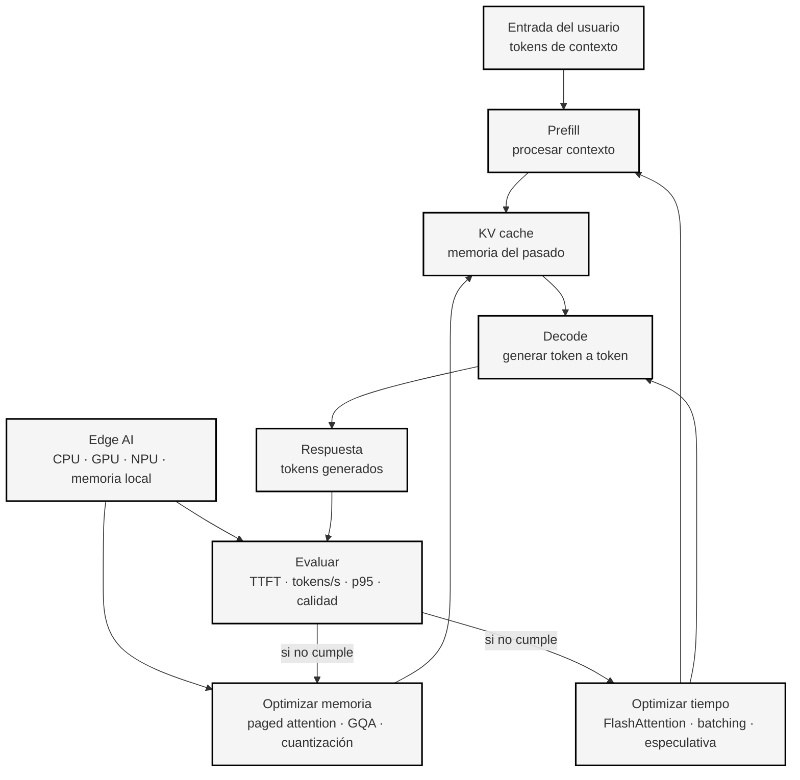
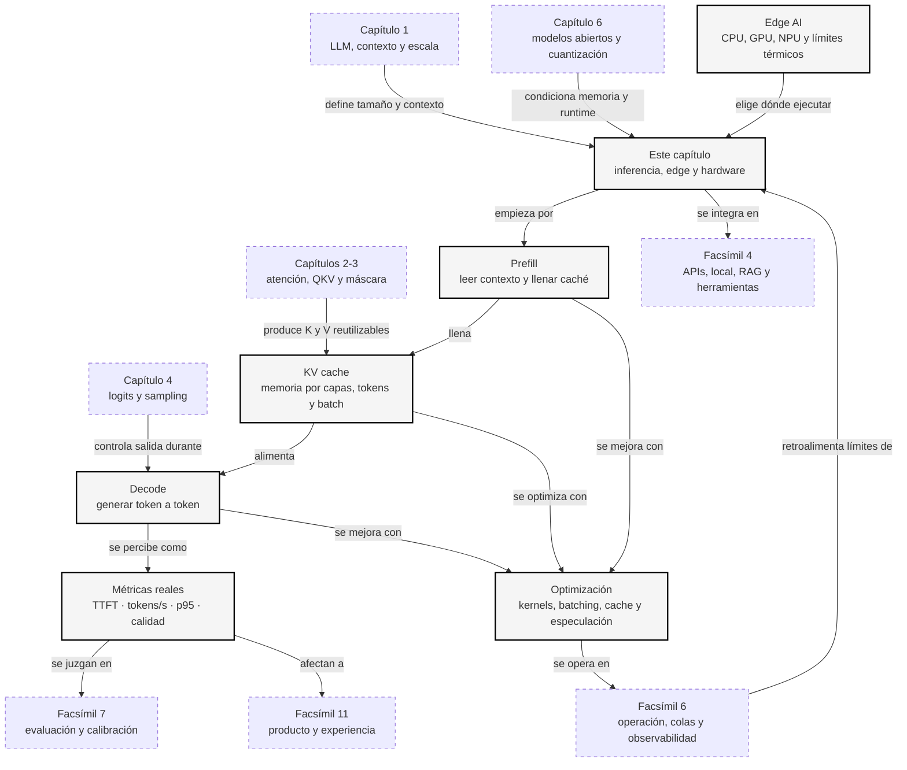

::: {.fasciculo-subtitle}
Facsímil 3 · Arquitecturas y modelos
:::

# Capítulo 07: Inferencia optimizada, edge AI y hardware

## La IA también es esperar

Hay una escena muy común: eliges un modelo, haces una demo, todo parece brillante... y luego alguien lo prueba con diez usuarios a la vez. El primer token tarda demasiado. La respuesta completa llega tarde. La GPU se llena aunque el modelo «cabía». El portátil se calienta. La factura sube. El problema ya no es si el modelo sabe contestar; es si puede contestar **a tiempo, con memoria suficiente y a un coste razonable**.

Este capítulo trata de esa parte menos vistosa y absolutamente decisiva: la inferencia. En el capítulo anterior hablamos de adaptar, destilar, cuantizar y elegir modelos abiertos. Ahora preguntamos qué pasa cuando ese modelo se usa de verdad: cuánta memoria consume, qué limita la velocidad, qué pinta la caché KV, por qué el hardware importa y cuándo tiene sentido llevar IA al dispositivo.

La idea de fondo es sencilla: un modelo útil no es solo el que responde bien. Es el que responde bien **dentro de tus restricciones**.

## Estado del arte con fecha de corte

**Fecha de corte:** 10 de junio de 2026.  
**Fuentes consultadas ese día:** papers de FlashAttention, PagedAttention/vLLM, speculative decoding, GQA y cuantización; documentación vigente de vLLM, TensorRT-LLM, llama.cpp y MLPerf Inference; y una lectura pedagógica de Turing Post sobre QKV y KV cache.

Esta sección no pretende congelar el mercado. Los nombres de runtimes, formatos y aceleradores cambian. Lo que sí es más estable son las tensiones técnicas: memoria, ancho de banda, lotes, caché KV, latencia, calidad y coste.

| Capa del problema | Estado observado a 10 de junio de 2026 | Qué debes mirar |
|---|---|---|
| **Kernels de atención** | FlashAttention y variantes IO-aware son referencia para reducir movimiento de memoria en atención exacta.^[Dao, T., Fu, D. Y., Ermon, S., Rudra, A. y Ré, C. (2022). FlashAttention: Fast and memory-efficient exact attention with IO-awareness. *Advances in Neural Information Processing Systems 35*. https://arxiv.org/abs/2205.14135. La idea central es optimizar lecturas y escrituras entre memorias rápidas y lentas, no cambiar la matemática de la atención.] | Si tu runtime usa kernels modernos para tu GPU y tu longitud de contexto. |
| **KV cache** | PagedAttention y cachés paginadas reducen desperdicio y fragmentación al servir muchas peticiones.^[Kwon, W. et al. (2023). Efficient memory management for large language model serving with PagedAttention. *Proceedings of SOSP*. https://arxiv.org/abs/2309.06180. vLLM se construye sobre esta idea para gestionar KV cache con menos memoria desperdiciada.] | Memoria real con batch, contexto largo y usuarios simultáneos. |
| **Planificación de peticiones** | Continuous batching, chunked prefill, prefix caching y separación prefill/decode aparecen en runtimes modernos como vLLM y TensorRT-LLM.^[vLLM Project. (2026). *vLLM documentation*. https://docs.vllm.ai/en/stable/. Consultado el 10 de junio de 2026. La documentación lista serving online/offline, prefix caching, speculative decoding, cuantización y métricas de producción.] | Latencia p50/p95, no solo tokens/s máximos. |
| **Decodificación** | Speculative decoding acelera cuando un modelo pequeño propone tokens que el grande puede aceptar.^[Leviathan, Y., Kalman, M. y Matias, Y. (2023). Fast inference from Transformers via speculative decoding. *Proceedings of ICML*. https://arxiv.org/abs/2211.17192. El método aprovecha un modelo auxiliar para proponer varios tokens y verificar en paralelo con el modelo principal.] | Si la tasa de aceptación compensa el coste del modelo auxiliar. |
| **Arquitectura del modelo** | MQA y GQA reducen el número de cabezas de clave/valor y, por tanto, la memoria de KV cache.^[Ainslie, J. et al. (2023). GQA: Training generalized multi-query Transformer models from multi-head checkpoints. *Proceedings of EMNLP*. https://arxiv.org/abs/2305.13245. GQA ocupa un punto intermedio entre multi-head attention y multi-query attention.] | No solo tamaño en parámetros: también número de capas, contexto y cabezas KV. |
| **Cuantización** | INT8, FP8, INT4, GPTQ, AWQ, SmoothQuant y GGUF conviven según hardware, runtime y objetivo.^[Dettmers, T., Lewis, M., Belkada, Y. y Zettlemoyer, L. (2022). LLM.int8(): 8-bit matrix multiplication for Transformers at scale. *Advances in Neural Information Processing Systems 35*. https://arxiv.org/abs/2208.07339. El trabajo muestra una ruta para inferencia 8-bit en modelos grandes cuidando valores atípicos.] | Calidad tras cuantizar, memoria, velocidad y soporte real del runtime. |
| **Edge AI** | llama.cpp/GGUF, MLX, ONNX Runtime, NPUs y GPUs integradas permiten casos locales, pero con límites térmicos y de memoria.^[ggml-org. (2026). *llama.cpp: LLM inference in C/C++*. https://github.com/ggml-org/llama.cpp. Consultado el 10 de junio de 2026. El proyecto documenta GGUF, cuantización, servidor compatible con OpenAI y herramientas de conversión.] | Si necesitas privacidad, offline, baja latencia local o menor coste por uso. |
| **Benchmarking** | MLPerf Inference sigue siendo una referencia neutral para medir sistemas completos, no solo modelos.^[MLCommons. (2026). *MLPerf Inference: Datacenter benchmark*. https://mlcommons.org/benchmarks/inference-datacenter/. Consultado el 10 de junio de 2026. MLPerf publica resultados, divisiones, categorías de disponibilidad y metadatos de sistemas completos.] | Comparar sistema completo: modelo, runtime, hardware, batch, precisión y latencia. |

La lectura corta: a fecha de corte, optimizar inferencia no significa tocar un botón. Significa coordinar modelo, caché, kernel, cuantización, scheduler, hardware y evaluación.

## Qué no es optimizar inferencia

Optimizar inferencia no es solo elegir un modelo más pequeño. Un modelo pequeño puede ser más rápido, sí, pero quizá no tenga la calidad mínima. Un modelo grande puede ser aceptable si usa buen batching, buena caché y cuantización adecuada. La pregunta no es «pequeño o grande», sino «qué combinación cumple calidad, latencia, memoria y coste».

Tampoco es medir una única petición. Si pruebas un prompt aislado en local, quizá veas 80 tokens/s. En producción, con varias peticiones simultáneas, contexto largo y respuestas de distinta longitud, la historia cambia. Importan la cola, los percentiles, el tamaño de lote, el tiempo hasta primer token y el comportamiento cuando el sistema se llena.

Y optimizar no es perseguir el número más alto de tokens por segundo. A veces un sistema con menos throughput bruto da mejor experiencia porque entrega antes el primer token. O porque no se cae cuando llegan peticiones largas. O porque mantiene calidad tras cuantizar.

## El bucle real: prefill y decode

Cuando escribes una petición a un LLM, desde fuera parece una sola acción: envías texto y el modelo responde. Por dentro no ocurre así. La inferencia tiene dos momentos con personalidad muy distinta.

Primero está el **prefill**. El modelo lee todo lo que ya existe: instrucciones del sistema, conversación previa, documentos recuperados, pregunta del usuario y cualquier otro token de contexto. En esta fase todavía no está «escribiendo» la respuesta. Está construyendo una representación interna de ese contexto y llenando la caché que usará después. Si el prompt es largo, el prefill pesa mucho. Si metes veinte páginas de documentación en contexto, el coste no aparece solo al final: aparece aquí.

Después viene el **decode**. Ahora el modelo ya ha leído el contexto y empieza a generar. Pero un LLM autoregresivo genera de forma secuencial: produce un token, lo añade al contexto, usa ese nuevo contexto para producir el siguiente, y así sucesivamente. Por eso generar 300 tokens no es como calcular una tabla de 300 celdas independientes; es una cadena donde cada eslabón depende del anterior.

Una forma humana de verlo: el prefill es leer el enunciado completo antes de contestar; el decode es dictar la respuesta palabra a palabra. Leer mucho puede retrasar el arranque. Dictar mucho puede alargar el final.

También hay una diferencia técnica importante: el prefill suele aprovechar mejor el paralelismo porque procesa muchos tokens de entrada juntos; el decode tiene menos margen, porque el token \(t+1\) depende de haber generado antes el token \(t\). Por eso algunas mejoras optimizan el arranque de la respuesta y otras optimizan la velocidad de escritura. Si mezclamos ambas fases en una sola métrica, dejamos de ver dónde duele de verdad.

| Fase | Qué hace | Qué suele limitar |
|---|---|---|
| **Prefill** | Procesa todos los tokens de entrada y construye la KV cache. | Cómputo y longitud del contexto. |
| **Decode** | Genera tokens nuevos uno a uno usando la KV cache. | Memoria, ancho de banda y planificación. |

Esta separación explica por qué dos usuarios pueden sentir experiencias muy distintas con el mismo modelo. Un usuario con un prompt corto y una respuesta larga puede ver el primer token pronto, pero esperar bastante hasta el final. Otro usuario con un prompt enorme puede esperar mucho al principio aunque luego la respuesta salga a buen ritmo.

Piénsalo con situaciones concretas. En una asesoría, alguien pega un contrato de treinta páginas y pregunta «¿qué cláusulas debo revisar primero?». Ahí el prefill manda: el sistema tiene que leer mucho antes de empezar. En una app de escritura, alguien pide «redáctame una propuesta completa de dos páginas». El contexto puede ser corto, pero el decode pesa: hay que producir muchos tokens seguidos. En un panel de soporte, veinte personas preguntan cosas parecidas con las mismas instrucciones del sistema. Ahí no basta con un modelo rápido; importa reutilizar prefijos, organizar lotes y no desperdiciar KV cache.

Si el usuario manda una entrada de \(n_{\text{entrada}}\) tokens y queremos generar \(n_{\text{salida}}\) tokens, conviene separar lectura de contexto y generación.

**Ejemplo de fórmula.** Como calculadora de primer orden, no como benchmark universal, podemos escribir:

$$
T_{\text{total}} \approx T_{\text{prefill}} + n_{\text{salida}} \cdot T_{\text{decode}}
$$

| Símbolo | Significado | Ejemplo |
|---|---|---|
| \(T_{\text{total}}\) | Tiempo total de respuesta. | 7,5 segundos. |
| \(T_{\text{prefill}}\) | Tiempo de procesar el contexto inicial. | 0,85 segundos. |
| \(n_{\text{salida}}\) | Tokens generados. | 300 tokens. |
| \(T_{\text{decode}}\) | Tiempo medio por token generado. | 0,022 segundos/token. |

En producto solemos mirar dos métricas porque responden a preguntas distintas. La primera mide cuándo empieza la sensación de respuesta; la segunda mide cuánto tarda en completarse.

| Métrica | Pregunta que responde |
|---|---|
| **TTFT** (*time to first token*) | ¿Cuánto tarda el usuario en ver que algo empieza? |
| **Tokens/s** | ¿A qué velocidad se completa la respuesta una vez empieza? |

Con tokens por segundo, la misma idea se escribe así:

$$
T_{\text{total}} \approx \frac{\operatorname{TTFT}_{ms}}{1000} + \frac{n_{\text{salida}}}{\operatorname{tokens/s}}
$$

Ejemplo:

$$
T_{\text{total}} \approx 0{,}85 + \frac{300}{45} \approx 7{,}52 \text{ s}
$$

Esto explica una sensación habitual: el sistema puede «empezar rápido» pero terminar lento, o empezar lento pero luego escribir deprisa. Ambas cosas importan.

## La memoria invisible: KV cache

En los capítulos de atención vimos \(Q\), \(K\) y \(V\). Durante inferencia, las claves y valores del contexto pasado se vuelven especialmente importantes. Si el modelo ya procesó los primeros 4096 tokens, no queremos recalcularlos enteros cada vez que genera un token nuevo. Sería como releer todo el libro antes de escribir cada palabra de un resumen.

La solución es guardar parte de ese trabajo en una **KV cache**. Esa caché permite que el decode consulte el pasado sin recomputarlo desde cero. A cambio, consume memoria. Y esa memoria crece con cuatro cosas que suelen crecer justo cuando el producto tiene éxito: más usuarios simultáneos, más contexto, más capas y más cabezas de clave/valor.

Alyona Vert lo explica con una imagen muy clara: durante generación autoregresiva, las claves y valores de tokens anteriores se guardan para que el modelo no tenga que recalcular todo el pasado en cada nuevo token.^[Vert, A. (2026, 13 de mayo). *AI 101: Your Ultimate Guide to Attention: Mechanism, QKV, and KV Cache*. Turing Post. https://www.turingpost.com/p/your-ultimate-guide-to-attention-mechanism-qkv-and-kv-cache. Consultado el 10 de junio de 2026.] Esa lectura no sustituye los papers de inferencia, pero ayuda a que la intuición técnica aterrice.

**Ejemplo de fórmula.** Una aproximación de memoria para KV cache es:

$$
M_{\text{KV}} \approx 2 \cdot L \cdot B \cdot S \cdot H_{\text{KV}} \cdot d_h \cdot \operatorname{bytes}
$$

El factor 2 aparece porque guardamos claves y valores. \(L\) son capas, \(B\) es batch o conversaciones simultáneas, \(S\) es longitud de contexto, \(H_{\text{KV}}\) son cabezas de clave/valor, \(d_h\) es dimensión por cabeza y `bytes` depende de la precisión usada. Esta aproximación ayuda a detectar órdenes de magnitud; el consumo real depende del runtime, paginación de caché, fragmentación, buffers, activaciones, paralelismo y margen operativo.

| Símbolo | Significado | Ejemplo |
|---|---|---|
| \(2\) | Guardamos claves y valores. | \(K\) y \(V\). |
| \(L\) | Número de capas. | 32 capas. |
| \(B\) | Batch o peticiones activas. | 8 peticiones. |
| \(S\) | Tokens de contexto mantenidos. | 4096 tokens. |
| \(H_{\text{KV}}\) | Cabezas de clave/valor. | 32 en MHA, 8 en GQA, 1 en MQA. |
| \(d_h\) | Dimensión por cabeza. | 128. |
| \(\operatorname{bytes}\) | Bytes por valor. | 2 para FP16/BF16. |

Con \(L=32\), \(B=8\), \(S=4096\), \(d_h=128\) y 2 bytes por valor, el mismo modelo puede tener memorias de caché muy distintas según cómo organice sus cabezas \(K/V\):

| Atención | \(H_{\text{KV}}\) | KV cache aproximada |
|---|---:|---:|
| Multi-head attention | 32 | 17,18 GB |
| Grouped-query attention | 8 | 4,29 GB |
| Multi-query attention | 1 | 0,54 GB |

Aquí aparece una lección importante: dos modelos con los mismos parámetros pueden tener costes de inferencia distintos si gestionan de forma distinta \(K\) y \(V\). Por eso GQA o MQA no son detalles académicos: afectan directamente a cuántas conversaciones caben a la vez.

Otro ejemplo sencillo: imagina un asistente de una universidad que responde dudas de matrícula. El modelo cabe en memoria cuando lo prueba una persona. Pero el primer lunes de septiembre entran cien estudiantes con conversaciones largas, documentos de normativa y respuestas a medio generar. Lo que antes era «el modelo cabe» se convierte en «el modelo más la caché de todas las conversaciones no cabe». La KV cache es ese coste que no se ve en la ficha del modelo, pero aparece justo cuando el sistema empieza a usarse de verdad.

## Qué acelera de verdad

La inferencia no tiene un único cuello de botella. A veces el problema es que la atención mueve demasiados datos entre memorias. A veces la caché KV está fragmentada o ocupa demasiado. A veces la GPU está medio vacía porque las peticiones llegan en tamaños raros. A veces el decode es lento porque cada token depende del anterior. Y a veces el modelo simplemente no cabe.

Por eso las técnicas de optimización no son intercambiables. Cada una toca una parte distinta del sistema. Antes de elegir una, conviene preguntar: ¿mi problema está en leer el contexto, en generar tokens, en servir muchos usuarios, en memoria, en coste o en calidad?

| Técnica | Qué mejora | Intuición |
|---|---|---|
| **FlashAttention** | Atención más rápida y con menos memoria intermedia. | No cambia la fórmula; cambia cómo se mueven los datos. |
| **PagedAttention** | Gestión de KV cache con menos desperdicio. | Trata la caché como páginas, no como bloques rígidos enormes. |
| **Continuous batching** | Throughput con muchas peticiones. | Entra y sale gente del lote sin esperar a que todas las respuestas terminen. |
| **Prefix caching** | Peticiones con prefijos repetidos. | Si muchas consultas comparten sistema o contexto, no recalculas todo. |
| **Speculative decoding** | Menos tiempo por tokens generados. | Un modelo pequeño propone; el grande verifica. |
| **Cuantización** | Memoria y a veces velocidad. | Menos bits por peso o activación. |
| **GQA/MQA** | Memoria de KV cache. | Menos cabezas \(K/V\) compartidas entre cabezas de consulta. |
| **Distilación** | Tamaño y coste. | Un estudiante más pequeño imita una parte útil del profesor. |

Si el cuello está en el **prefill**, suelen importar kernels de atención, longitud de contexto, chunked prefill y reutilización de prefijos. Si el cuello está en el **decode**, suelen importar KV cache, speculative decoding, batching y ancho de banda de memoria. Si el cuello está en **coste o despliegue**, entran cuantización, destilación, edge y elección de hardware.

No todas se suman limpiamente. Una técnica puede mejorar throughput y empeorar TTFT. Otra puede funcionar bien en una GPU y no tener soporte real en otra. Por eso el estado del arte no se adopta leyendo una lista: se adopta midiendo tu caso.

En una empresa pequeña, por ejemplo, puede parecer natural pasar de una API a un modelo local para ahorrar. Si cada consulta usa un prompt enorme con políticas internas, quizá el ahorro se pierde porque el prefill consume mucho. Si las consultas comparten el mismo contexto base, prefix caching puede cambiar la película. Si el problema es que cada respuesta debe ser larga, speculative decoding puede ayudar más que seguir recortando bits. La técnica correcta depende de dónde está el dolor.

## Edge AI: cuando el modelo vive cerca

Edge AI significa ejecutar el modelo cerca del usuario, del sensor o del dispositivo: portátil, móvil, mini PC, servidor local, navegador, fábrica, aula o consulta. No siempre es mejor. Es una decisión de producto e infraestructura.

La pregunta no es «¿puedo correrlo local?», sino «¿qué gano al correrlo local y qué pierdo?». A veces ganas privacidad y respuesta sin red. A veces pierdes calidad, facilidad de actualización o estabilidad térmica. La tabla ayuda a separar motivos razonables de entusiasmo tecnológico.

| Motivo | Por qué puede interesar |
|---|---|
| Offline | El sistema sigue funcionando sin red. |
| Latencia local | Evitas ida y vuelta a un servidor lejano. |
| Control de datos | Algunos datos no salen del dispositivo o de la red local. |
| Coste marginal | Muchas inferencias locales pueden salir más baratas que llamadas remotas. |
| Personalización | El sistema puede adaptarse al entorno concreto. |

Pero edge también trae límites:

| Límite | Qué implica |
|---|---|
| Memoria | El modelo debe caber junto con KV cache y aplicación. |
| Energía | Un portátil o móvil no puede sostener carga alta indefinidamente. |
| Temperatura | El rendimiento puede bajar si el dispositivo se calienta. |
| Runtimes | No todos los formatos corren igual en CPU, GPU, NPU o Apple Silicon. |
| Mantenimiento | Actualizar modelos locales puede ser más complejo que cambiar una API. |

Una NPU no convierte cualquier modelo en viable. Una GPU no siempre gana. Una CPU moderna con un modelo cuantizado puede ser suficiente para una tarea pequeña. La pregunta buena es: ¿qué calidad necesito, con qué latencia, para cuántos usuarios, durante cuánto tiempo y con qué presupuesto térmico?

## Un caso cercano: el asistente de almacén

Imagina una empresa con un almacén grande. Quiere un asistente que lea incidencias de pedidos y proponga la siguiente acción: reponer, avisar, revisar lote, generar etiqueta o pedir foto.

Hay tres diseños posibles:

| Diseño | Ventaja | Coste |
|---|---|---|
| API externa potente | Calidad alta y mantenimiento simple. | Depende de red y coste por uso. |
| Servidor local con GPU | Control y buen rendimiento para muchos puestos. | Compra, operación y monitorización. |
| Modelo cuantizado en cada terminal | Funciona incluso con mala red. | Menor calidad y límites de memoria/temperatura. |

No hay una respuesta universal. Si el almacén necesita funcionar sin conexión, edge pesa mucho. Si la tarea cambia cada semana y necesita consultar políticas vivas, RAG y servidor central pueden ser más naturales. Si hay muchas peticiones simultáneas, la clave quizá no sea el modelo, sino batching, KV cache y colas.

Ahora bajémoslo un poco más. Si cada terminal manda una foto convertida a descripción, el número de tokens de entrada puede ser pequeño y el decode de la acción recomendada domina poco. Un modelo local pequeño puede bastar. Si cada incidencia arrastra historial de cliente, condiciones de entrega, normativa interna y correos anteriores, el prefill se vuelve caro y conviene pensar en servidor, caché de prefijos y recuperación selectiva. Si el turno de mañana genera cientos de incidencias a la vez, el problema ya no es «qué modelo responde mejor», sino cómo se ordenan las peticiones para que ninguna persona espere demasiado.

## El mapa operativo del capítulo

Este mapa separa el ciclo de inferencia en dos fases. Prefill paga la lectura del contexto; decode paga la generación secuencial. La KV cache une ambas y convierte memoria en una decisión de producto.



<svg id="f3-c07-inferencia-edge-hardware" xmlns="http://www.w3.org/2000/svg" viewBox="0 0 1160 860" role="img" aria-label="Anatomía técnica de una inferencia optimizada con colas, scheduler, prefill, KV cache, decode, métricas y hardware">
  <title>Anatomía técnica de una inferencia optimizada</title>
  <defs>
    <marker id="f3c07-arrow" viewBox="0 0 10 10" refX="9" refY="5" markerWidth="7" markerHeight="7" orient="auto">
      <path d="M 0 0 L 10 5 L 0 10 z" fill="#222222"/>
    </marker>
    <pattern id="f3c07-hatch" patternUnits="userSpaceOnUse" width="8" height="8" patternTransform="rotate(45)">
      <line x1="0" y1="0" x2="0" y2="8" stroke="#D8D8D8" stroke-width="2"/>
    </pattern>
  </defs>
  <rect x="18" y="18" width="1124" height="802" rx="18" fill="#FFFFFF" stroke="#111111" stroke-width="1.4"/>
  <text x="580" y="56" text-anchor="middle" font-family="Arial, sans-serif" font-size="25" font-weight="700" fill="#111111">Inferencia optimizada: del prompt al token visible</text>
  <text x="580" y="82" text-anchor="middle" font-family="Arial, sans-serif" font-size="13" fill="#666666">La velocidad sale de coordinar cola, prefill, KV cache, decode, kernels, memoria y hardware.</text>
  <line x1="50" y1="108" x2="1110" y2="108" stroke="#111111" stroke-width="1"/>
  <rect x="50" y="136" width="190" height="172" rx="12" fill="#F7F7F7" stroke="#111111" stroke-width="1.2"/>
  <text x="145" y="164" text-anchor="middle" font-family="Arial, sans-serif" font-size="14" font-weight="700" fill="#111111">Peticiones</text>
  <rect x="72" y="186" width="146" height="26" rx="6" fill="#FFFFFF" stroke="#333333"/>
  <text x="145" y="204" text-anchor="middle" font-family="Arial, sans-serif" font-size="10" fill="#111111">U1 · S=12k · salida corta</text>
  <rect x="72" y="224" width="146" height="26" rx="6" fill="#FFFFFF" stroke="#333333"/>
  <text x="145" y="242" text-anchor="middle" font-family="Arial, sans-serif" font-size="10" fill="#111111">U2 · S=600 · salida larga</text>
  <rect x="72" y="262" width="146" height="26" rx="6" fill="#FFFFFF" stroke="#333333"/>
  <text x="145" y="280" text-anchor="middle" font-family="Arial, sans-serif" font-size="10" fill="#111111">U3 · prefijo repetido</text>
  <text x="145" y="300" text-anchor="middle" font-family="Arial, sans-serif" font-size="10" fill="#777777">S = tokens de entrada</text>
  <line x1="240" y1="222" x2="296" y2="222" stroke="#222222" stroke-width="1.5" marker-end="url(#f3c07-arrow)"/>
  <rect x="300" y="136" width="210" height="172" rx="12" fill="#111111"/>
  <text x="405" y="164" text-anchor="middle" font-family="Arial, sans-serif" font-size="14" font-weight="700" fill="#FFFFFF">Scheduler</text>
  <text x="405" y="190" text-anchor="middle" font-family="Arial, sans-serif" font-size="11" fill="#DDDDDD">continuous batching</text>
  <text x="405" y="212" text-anchor="middle" font-family="Arial, sans-serif" font-size="11" fill="#DDDDDD">colas · prioridad · p95</text>
  <rect x="326" y="236" width="158" height="44" rx="8" fill="#FFFFFF" stroke="#FFFFFF"/>
  <text x="405" y="255" text-anchor="middle" font-family="Arial, sans-serif" font-size="10" font-weight="700" fill="#111111">decide lote activo</text>
  <text x="405" y="270" text-anchor="middle" font-family="Arial, sans-serif" font-size="10" fill="#555555">prefill y decode se mezclan</text>
  <line x1="510" y1="222" x2="566" y2="222" stroke="#222222" stroke-width="1.5" marker-end="url(#f3c07-arrow)"/>
  <rect x="570" y="136" width="235" height="172" rx="12" fill="#FFFFFF" stroke="#111111" stroke-width="1.2"/>
  <text x="688" y="164" text-anchor="middle" font-family="Arial, sans-serif" font-size="14" font-weight="700" fill="#111111">Prefill</text>
  <text x="688" y="188" text-anchor="middle" font-family="Arial, sans-serif" font-size="11" fill="#555555">lee contexto completo</text>
  <rect x="596" y="212" width="184" height="34" rx="7" fill="url(#f3c07-hatch)" stroke="#333333"/>
  <text x="688" y="234" text-anchor="middle" font-family="Arial, sans-serif" font-size="10" fill="#111111">Q/K/V · atención · matmul</text>
  <text x="688" y="264" text-anchor="middle" font-family="Arial, sans-serif" font-size="10" fill="#555555">cuello típico: contexto largo</text>
  <text x="688" y="284" text-anchor="middle" font-family="Arial, sans-serif" font-size="10" fill="#555555">chunked prefill · prefix cache</text>
  <line x1="805" y1="222" x2="858" y2="222" stroke="#222222" stroke-width="1.5" marker-end="url(#f3c07-arrow)"/>
  <rect x="862" y="136" width="248" height="172" rx="12" fill="#F7F7F7" stroke="#111111" stroke-width="1.2"/>
  <text x="986" y="164" text-anchor="middle" font-family="Arial, sans-serif" font-size="14" font-weight="700" fill="#111111">KV cache paginada</text>
  <text x="986" y="188" text-anchor="middle" font-family="Arial, sans-serif" font-size="11" fill="#555555">K y V del contexto pasado</text>
  <g>
    <rect x="890" y="212" width="38" height="30" fill="#FFFFFF" stroke="#111111"/>
    <rect x="936" y="212" width="38" height="30" fill="#FFFFFF" stroke="#111111"/>
    <rect x="982" y="212" width="38" height="30" fill="#FFFFFF" stroke="#111111"/>
    <rect x="1028" y="212" width="38" height="30" fill="#FFFFFF" stroke="#111111"/>
    <rect x="890" y="252" width="38" height="30" fill="#FFFFFF" stroke="#111111"/>
    <rect x="936" y="252" width="38" height="30" fill="#FFFFFF" stroke="#111111"/>
    <rect x="982" y="252" width="38" height="30" fill="#FFFFFF" stroke="#111111"/>
    <rect x="1028" y="252" width="38" height="30" fill="#FFFFFF" stroke="#111111"/>
  </g>
  <text x="986" y="300" text-anchor="middle" font-family="Arial, sans-serif" font-size="10" fill="#555555">menos fragmentación · más concurrencia</text>
  <rect x="50" y="390" width="270" height="170" rx="12" fill="#FFFFFF" stroke="#111111" stroke-width="1.2"/>
  <text x="185" y="418" text-anchor="middle" font-family="Arial, sans-serif" font-size="14" font-weight="700" fill="#111111">Memoria real</text>
  <text x="185" y="444" text-anchor="middle" font-family="Arial, sans-serif" font-size="11" fill="#555555">pesos + KV cache + activaciones</text>
  <text x="185" y="474" text-anchor="middle" font-family="Arial, sans-serif" font-size="12" font-weight="700" fill="#111111">M_KV ≈ 2·L·B·S·H_KV·d_h·bytes</text>
  <text x="185" y="504" text-anchor="middle" font-family="Arial, sans-serif" font-size="10" fill="#555555">GQA/MQA reducen H_KV</text>
  <text x="185" y="524" text-anchor="middle" font-family="Arial, sans-serif" font-size="10" fill="#555555">cuantizar pesos no reduce todo</text>
  <line x1="220" y1="390" x2="900" y2="306" stroke="#777777" stroke-width="1.1" stroke-dasharray="6 6" marker-end="url(#f3c07-arrow)"/>
  <rect x="365" y="390" width="250" height="170" rx="12" fill="#F7F7F7" stroke="#111111" stroke-width="1.2"/>
  <text x="490" y="418" text-anchor="middle" font-family="Arial, sans-serif" font-size="14" font-weight="700" fill="#111111">Kernels y runtime</text>
  <text x="490" y="446" text-anchor="middle" font-family="Arial, sans-serif" font-size="11" fill="#555555">FlashAttention · matmul · INT4/8</text>
  <text x="490" y="470" text-anchor="middle" font-family="Arial, sans-serif" font-size="11" fill="#555555">prefill: mueve bloques grandes</text>
  <text x="490" y="492" text-anchor="middle" font-family="Arial, sans-serif" font-size="11" fill="#555555">decode: lee mucha caché</text>
  <text x="490" y="524" text-anchor="middle" font-family="Arial, sans-serif" font-size="10" fill="#777777">el soporte depende del chip</text>
  <line x1="570" y1="390" x2="650" y2="308" stroke="#777777" stroke-width="1.1" stroke-dasharray="6 6" marker-end="url(#f3c07-arrow)"/>
  <rect x="660" y="390" width="230" height="170" rx="12" fill="#FFFFFF" stroke="#111111" stroke-width="1.2"/>
  <text x="775" y="418" text-anchor="middle" font-family="Arial, sans-serif" font-size="14" font-weight="700" fill="#111111">Decode</text>
  <text x="775" y="444" text-anchor="middle" font-family="Arial, sans-serif" font-size="11" fill="#555555">t → t+1 → t+2</text>
  <circle cx="720" cy="482" r="17" fill="#111111"/>
  <text x="720" y="487" text-anchor="middle" font-family="Arial, sans-serif" font-size="10" fill="#FFFFFF">t</text>
  <line x1="738" y1="482" x2="766" y2="482" stroke="#222222" marker-end="url(#f3c07-arrow)"/>
  <circle cx="786" cy="482" r="17" fill="#FFFFFF" stroke="#111111"/>
  <text x="786" y="487" text-anchor="middle" font-family="Arial, sans-serif" font-size="10" fill="#111111">t+1</text>
  <line x1="806" y1="482" x2="834" y2="482" stroke="#222222" marker-end="url(#f3c07-arrow)"/>
  <circle cx="854" cy="482" r="17" fill="#FFFFFF" stroke="#111111"/>
  <text x="854" y="487" text-anchor="middle" font-family="Arial, sans-serif" font-size="10" fill="#111111">t+2</text>
  <text x="775" y="526" text-anchor="middle" font-family="Arial, sans-serif" font-size="10" fill="#555555">cuello típico: ancho de banda y KV</text>
  <line x1="886" y1="390" x2="970" y2="308" stroke="#777777" stroke-width="1.1" stroke-dasharray="6 6" marker-end="url(#f3c07-arrow)"/>
  <rect x="930" y="390" width="180" height="170" rx="12" fill="#111111"/>
  <text x="1020" y="418" text-anchor="middle" font-family="Arial, sans-serif" font-size="14" font-weight="700" fill="#FFFFFF">Salida visible</text>
  <text x="1020" y="446" text-anchor="middle" font-family="Arial, sans-serif" font-size="11" fill="#DDDDDD">primer token: TTFT</text>
  <text x="1020" y="470" text-anchor="middle" font-family="Arial, sans-serif" font-size="11" fill="#DDDDDD">respuesta completa</text>
  <text x="1020" y="494" text-anchor="middle" font-family="Arial, sans-serif" font-size="11" fill="#DDDDDD">streaming al usuario</text>
  <text x="1020" y="526" text-anchor="middle" font-family="Arial, sans-serif" font-size="10" fill="#BBBBBB">calidad también cuenta</text>
  <line x1="890" y1="476" x2="926" y2="476" stroke="#222222" stroke-width="1.5" marker-end="url(#f3c07-arrow)"/>
  <path d="M1020 390 C1020 348, 958 340, 930 308" fill="none" stroke="#777777" stroke-width="1.1" stroke-dasharray="6 6" marker-end="url(#f3c07-arrow)"/>
  <rect x="50" y="640" width="330" height="100" rx="12" fill="#F7F7F7" stroke="#111111" stroke-width="1.2"/>
  <text x="215" y="670" text-anchor="middle" font-family="Arial, sans-serif" font-size="14" font-weight="700" fill="#111111">Hardware posible</text>
  <text x="215" y="696" text-anchor="middle" font-family="Arial, sans-serif" font-size="11" fill="#555555">GPU servidor · CPU local · NPU · Apple Silicon</text>
  <text x="215" y="718" text-anchor="middle" font-family="Arial, sans-serif" font-size="11" fill="#555555">HBM/RAM · energía · temperatura · drivers</text>
  <rect x="415" y="640" width="330" height="100" rx="12" fill="#FFFFFF" stroke="#111111" stroke-width="1.2"/>
  <text x="580" y="670" text-anchor="middle" font-family="Arial, sans-serif" font-size="14" font-weight="700" fill="#111111">Decisión de despliegue</text>
  <text x="580" y="696" text-anchor="middle" font-family="Arial, sans-serif" font-size="11" fill="#555555">API · servidor propio · edge · híbrido</text>
  <text x="580" y="718" text-anchor="middle" font-family="Arial, sans-serif" font-size="11" fill="#555555">elige por latencia, datos, coste y mantenimiento</text>
  <rect x="780" y="640" width="330" height="100" rx="12" fill="#111111"/>
  <text x="945" y="670" text-anchor="middle" font-family="Arial, sans-serif" font-size="14" font-weight="700" fill="#FFFFFF">Métricas mínimas</text>
  <text x="945" y="696" text-anchor="middle" font-family="Arial, sans-serif" font-size="11" fill="#DDDDDD">TTFT · tokens/s · p50/p95 · memoria</text>
  <text x="945" y="718" text-anchor="middle" font-family="Arial, sans-serif" font-size="11" fill="#DDDDDD">coste · calidad · temperatura · fallos</text>
  <line x1="320" y1="690" x2="411" y2="690" stroke="#222222" stroke-width="1.2" marker-end="url(#f3c07-arrow)"/>
  <line x1="745" y1="690" x2="776" y2="690" stroke="#222222" stroke-width="1.2" marker-end="url(#f3c07-arrow)"/>
  <path d="M945 640 C944 596, 1014 590, 1020 562" fill="none" stroke="#777777" stroke-width="1.1" stroke-dasharray="6 6" marker-end="url(#f3c07-arrow)"/>
  <text x="1110" y="795" text-anchor="end" font-family="Arial, sans-serif" font-size="10" fill="#9A9A9A">IA para gente curiosa / Facsímil 03 / Capítulo 07 / 686f6c61</text>
</svg>

## En el día a día

**En una aplicación de soporte.** El usuario no mide tu media. Siente la espera. Si el primer token tarda cinco segundos, la experiencia parece rota aunque luego escriba rápido. TTFT importa tanto como tokens/s.

**En un dashboard interno.** Muchas personas lanzan consultas parecidas por la mañana. Prefix caching y batching pueden valer más que cambiar de modelo, porque el cuello está en repetir contexto y servir picos.

**En un producto local.** Un modelo GGUF de 4 bits puede ser perfecto para resumir notas privadas en un portátil, pero quizá no sirva para razonamiento largo. La decisión no es ideológica; es medición.

**En una demo ejecutiva.** Una sola petición luce bien. Lo profesional es enseñar también qué pasa con 20 peticiones, contexto largo y una respuesta de 500 tokens. Ahí aparece la verdad del sistema.

## Por qué debería importarte

Porque la arquitectura se vuelve coste. El número de capas, la longitud de contexto, el tipo de atención, los bits de precisión, la KV cache y el runtime acaban convertidos en euros, segundos, vatios y temperatura.

También porque la optimización sin evaluación puede engañar. Si cuantizas y el modelo responde más rápido pero falla justo en los casos delicados, no has optimizado: has movido el problema. Si subes batch y mejora throughput pero empeora p95, quizá has hecho feliz al benchmark y triste al usuario.

## Dónde volverá a aparecer

Este capítulo no termina aquí. La inferencia es una bisagra: une arquitectura, herramientas, operación, evaluación y experiencia de usuario. Por eso varios conceptos vuelven más adelante con otro nivel de detalle.

| Concepto de este capítulo | Dónde vuelve en el libro | Por qué se conecta |
|---|---|---|
| **KV cache** | [Facsímil 6](/libro/fasciculo-06/). | Operar modelos exige mirar memoria, concurrencia, colas y límites reales. |
| **Cuantización** | [Facsímil 4](/libro/fasciculo-04/); [facsímil 6](/libro/fasciculo-06/). | Modelos locales, despliegue y coste dependen de formatos y runtimes. |
| **Speculative decoding y batching** | [Facsímil 6](/libro/fasciculo-06/). | Son decisiones de serving, no solo de arquitectura. |
| **Edge AI** | [Facsímil 4](/libro/fasciculo-04/); [facsímil 11](/libro/fasciculo-11/). | Herramientas locales y experiencia de usuario dependen de dónde vive el modelo. |
| **Benchmarks y percentiles** | [Facsímil 7](/libro/fasciculo-07/). | Evaluar un sistema de IA exige medir calidad y rendimiento juntos. |

## Dónde solía tropezar yo

Estos son los tropiezos que más distorsionan decisiones reales. Casi todos tienen la misma raíz: mirar una métrica aislada y olvidarse del sistema completo.

| Error | Por qué es un error | Antídoto |
|---|---|---|
| **Mirar solo parámetros** | Dos modelos de 7B pueden tener inferencias muy distintas por contexto, GQA, runtime y cuantización. | Mide pesos, KV cache, TTFT y tokens/s. |
| **Confundir tokens/s con buena experiencia** | El usuario nota mucho el primer token y los percentiles altos. | Mide TTFT, latencia total y p95/p99. |
| **Cuantizar sin comparar calidad** | Menos bits pueden romper justo los casos que importan. | Crea una evaluación antes y después. |
| **Olvidar la KV cache** | El modelo cabe, pero las conversaciones simultáneas no. | Calcula memoria de pesos y memoria de KV cache. |
| **Creer que edge siempre es mejor** | Local puede ser lento, caliente o difícil de actualizar. | Decide por caso: offline, datos, coste, latencia y mantenimiento. |

## Manos a la obra

La práctica real está en `labs/f3/c07-inference-serving-budget/`. El kit calcula memoria de pesos, KV cache y latencia aproximada con varios usuarios. No es un benchmark; es una calculadora de ingeniería para no prometer serving sin números.

| Archivo | Qué contiene |
|---|---|
| `data/serving_scenario.json` | Parámetros, bits, capas, batch, contexto, heads y throughput. |
| `contracts/serving_policy.json` | Umbrales de memoria y degradación de latencia. |
| `ops/estimate_serving_budget.py` | Calculadora de pesos, KV cache y latencia. |
| `output/serving_budget_report.json` | Resultados estructurados. |
| `output/serving_budget_decision.md` | Informe legible. |

Ejecuta:

```bash
cd labs/f3/c07-inference-serving-budget
python3 ops/estimate_serving_budget.py --write
cat output/serving_budget_decision.md
```

Como gate:

```bash
python3 ops/estimate_serving_budget.py --write --fail-on-invalid
```

**Qué entregaría un alumno.** El Markdown generado, una variante de batch/contexto y una decisión sobre MHA/GQA/MQA, cuantización y concurrencia.

## Cómo encaja todo

Este mapa conecta inferencia con los capítulos anteriores y con la operación futura. QKV deja de ser una fórmula: se vuelve caché. Sampling deja de ser un parámetro: se vuelve experiencia de usuario. Cuantización deja de ser una tabla de bits: se vuelve memoria, calidad y coste.

La decisión que prepara el siguiente facsímil es clara: no basta con elegir modelo; hay que elegir dónde vive, cómo se sirve, qué latencia promete y cómo se mide.



## Vocabulario aprendido

Nos quedamos con las palabras que conviene tener a mano para leer documentación de runtimes, benchmarks y hardware sin perder el hilo.

| Término | Definición |
|---|---|
| **Inferencia** | Uso de un modelo entrenado para responder a una entrada nueva. |
| **Prefill** | Fase que procesa el contexto inicial antes de generar tokens. |
| **Decode** | Fase que genera tokens de salida uno a uno. |
| **TTFT** | Tiempo hasta recibir el primer token visible. |
| **Throughput** | Trabajo procesado por unidad de tiempo, por ejemplo tokens/s. |
| **KV cache** | Caché de claves y valores de atención para reutilizar el contexto pasado. |
| **FlashAttention** | Kernel de atención que reduce movimiento de memoria. |
| **PagedAttention** | Gestión paginada de KV cache para servir muchas peticiones con menos desperdicio. |
| **Continuous batching** | Técnica para mezclar peticiones activas y mejorar uso del hardware. |
| **Speculative decoding** | Método donde un modelo pequeño propone tokens y el grande los verifica. |
| **Cuantización** | Reducir precisión numérica para ahorrar memoria y, a veces, ganar velocidad. |
| **Edge AI** | Ejecutar modelos cerca del usuario o dispositivo. |
| **NPU** | Acelerador especializado para redes neuronales. |

## Antes de pasar página

- [ ] ¿Puedo explicar la diferencia entre prefill y decode? (Si no, vuelve a «El bucle real».)
- [ ] ¿Entiendo por qué la KV cache puede ocupar varios GB? (Si no, vuelve a «La memoria invisible».)
- [ ] ¿Sé distinguir TTFT, tokens/s y throughput? (Si no, vuelve a «El bucle real».)
- [ ] ¿Puedo explicar por qué GQA reduce memoria de inferencia? (Si no, vuelve a la tabla de KV cache.)
- [ ] ¿Sé por qué cuantizar no basta sin medir calidad? (Si no, vuelve a «Dónde solía tropezar yo».)
- [ ] ¿Puedo decidir cuándo edge AI tiene sentido? (Si no, vuelve a «Edge AI».)
- [ ] ¿He ejecutado el código y cambiado batch, secuencia y usuarios? (Si no, vuelve a «Manos a la obra».)

## En resumen

La versión corta del capítulo no es una lista de herramientas: es una forma de pensar. Primero entiende qué fase estás pagando, después mide y solo entonces optimiza.

| Idea fuerza | Detalle |
|---|---|
| Inferir no es una llamada simple. | Hay prefill, decode, KV cache, scheduler, kernels y hardware. |
| La memoria no son solo pesos. | La KV cache puede dominar cuando hay contexto largo y usuarios simultáneos. |
| Optimizar es medir compromisos. | TTFT, tokens/s, p95, calidad, coste y temperatura cuentan juntos. |
| Edge AI es una decisión de producto. | Sirve cuando offline, datos, latencia o coste local compensan sus límites. |
| El estado del arte tiene fecha. | A 10 de junio de 2026, las prácticas cambian rápido; el mecanismo importa más que la marca concreta. |

## Para saber más

Ainslie, J. et al. (2023). GQA: Training generalized multi-query Transformer models from multi-head checkpoints. *Proceedings of EMNLP*. https://arxiv.org/abs/2305.13245

Dao, T., Fu, D. Y., Ermon, S., Rudra, A. y Ré, C. (2022). FlashAttention: Fast and memory-efficient exact attention with IO-awareness. *Advances in Neural Information Processing Systems 35*. https://arxiv.org/abs/2205.14135

Dettmers, T., Lewis, M., Belkada, Y. y Zettlemoyer, L. (2022). LLM.int8(): 8-bit matrix multiplication for Transformers at scale. *Advances in Neural Information Processing Systems 35*. https://arxiv.org/abs/2208.07339

Frantar, E., Ashkboos, S., Hoefler, T. y Alistarh, D. (2022). *GPTQ: Accurate post-training quantization for generative pre-trained Transformers*. https://arxiv.org/abs/2210.17323

ggml-org. (2026). *llama.cpp: LLM inference in C/C++*. Consultado el 10 de junio de 2026. https://github.com/ggml-org/llama.cpp

Kwon, W. et al. (2023). Efficient memory management for large language model serving with PagedAttention. *Proceedings of SOSP*. https://arxiv.org/abs/2309.06180

Leviathan, Y., Kalman, M. y Matias, Y. (2023). Fast inference from Transformers via speculative decoding. *Proceedings of ICML*. https://arxiv.org/abs/2211.17192

Lin, J. et al. (2024). AWQ: Activation-aware weight quantization for LLM compression and acceleration. *Proceedings of Machine Learning and Systems*. https://arxiv.org/abs/2306.00978

MLCommons. (2026). *MLPerf Inference: Datacenter benchmark*. Consultado el 10 de junio de 2026. https://mlcommons.org/benchmarks/inference-datacenter/

NVIDIA. (2026). *TensorRT-LLM documentation*. Consultado el 10 de junio de 2026. https://docs.nvidia.com/tensorrt-llm/index.html

vLLM Project. (2026). *vLLM documentation*. Consultado el 10 de junio de 2026. https://docs.vllm.ai/en/stable/

Vert, A. (2026, 13 de mayo). *AI 101: Your Ultimate Guide to Attention: Mechanism, QKV, and KV Cache*. Turing Post. https://www.turingpost.com/p/your-ultimate-guide-to-attention-mechanism-qkv-and-kv-cache

Xiao, G. et al. (2023). SmoothQuant: Accurate and efficient post-training quantization for large language models. *Proceedings of ICML*. https://arxiv.org/abs/2211.10438
