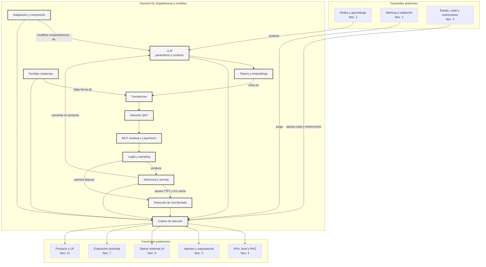

::: {.fasciculo-subtitle}
Facsímil 3 · Arquitecturas y modelos
:::

# Capítulo 08: Lo que deberías saber: arquitecturas y modelos

## Entrando en el tema

Este facsímil empezó con una pregunta que parece sencilla: ¿qué hay dentro de un LLM? La respuesta no era “un chat”, ni “una API”, ni “un modelo grande”. Era una cadena de decisiones técnicas: tokens, embeddings, tensores, atención, MLP, normalización, logits, sampling, adaptación, memoria, inferencia y hardware.

Este capítulo es una revisión activa. No pretende que memorices nombres. Pretende que puedas mirar una ficha de modelo, una demo de producto o una discusión sobre hardware y preguntar con calma: qué arquitectura hay debajo, qué coste tiene usarla, qué se adaptó, qué se cuantizó, qué se está midiendo y qué parte pertenece al modelo o al sistema que lo sirve.

No es el final de la historia. Es el punto donde dejamos de hablar de modelos como cajas negras y empezamos a hablar de sistemas con piezas.

---

## 1. Qué es un LLM: modelo, parámetros y escala

Un LLM es un modelo entrenado para predecir tokens a partir de contexto. No guarda frases como una biblioteca. Ajusta parámetros para transformar una secuencia de entrada en una distribución de probabilidad sobre el siguiente token.^[Brown, T. B. et al. (2020). Language models are few-shot learners. *Advances in Neural Information Processing Systems 33*, 1877-1901. https://papers.nips.cc/paper/2020/hash/1457c0d6bfcb4967418bfb8ac142f64a-Abstract.html. GPT-3 popularizó la escala como variable central para capacidades emergentes de uso general.]

La idea que debes conservar es esta: los parámetros son memoria aprendida, el contexto es memoria temporal y la salida es una distribución. Si mezclas esas tres cosas, empiezan los malentendidos.

Caso cercano: una persona pega una política interna y pregunta “¿puedo aprobar este gasto?”. El modelo no “abre una carpeta” donde está la política. Procesa el texto pegado, lo mezcla con lo aprendido durante entrenamiento y produce una respuesta probable. Si falta un dato, puede sonar seguro igualmente. Por eso el contexto y la verificación no son decoración.

Vuelve al [capítulo 01](/libro/fasciculo-03/#capitulo-01) si no puedes explicar la diferencia entre parámetros, contexto, token, embedding y salida.

---

## 2. Transformer: de texto a tensores y atención

El Transformer convirtió texto en operaciones paralelizables sobre tensores.^[Vaswani, A. et al. (2017). Attention is all you need. *Advances in Neural Information Processing Systems 30*, 5998-6008. https://papers.nips.cc/paper/7181-attention-is-all-you-need. El paper introdujo una arquitectura basada en atención que evitaba recurrencia y facilitaba paralelismo.] El texto se tokeniza, cada token busca su vector, se añade posición y el bloque Transformer transforma esas representaciones capa tras capa.

La intuición importante: el modelo no lee palabras como las leemos nosotros. Trabaja con matrices. Cada capa reescribe la representación de cada posición usando información de otras posiciones.

Caso cercano: cuando escribes “el banco cerró la cuenta”, el token “banco” cambia de significado según “cuenta”. No basta con un diccionario. La atención permite que las posiciones se miren entre sí para construir significado contextual.

Vuelve al [capítulo 02](/libro/fasciculo-03/#capitulo-02) si no puedes dibujar el camino mínimo: texto → tokens → ids → embeddings → bloques Transformer → logits.

---

## 3. Q, K, V, máscara causal y softmax

La atención no es una metáfora bonita: es una operación concreta. Cada posición produce consultas \(Q\), claves \(K\) y valores \(V\). Las consultas se comparan con claves, se normalizan con softmax y se usan para mezclar valores.

La forma mínima de la atención escalada es:

$$
\operatorname{Attention}(Q,K,V)=\operatorname{softmax}\left(\frac{QK^\top}{\sqrt{d_k}}\right)V
$$

| Símbolo | Qué significa | Imagen mental |
|---|---|---|
| \(Q\) | Qué busca una posición. | “Necesito saber a qué se refiere esto”. |
| \(K\) | Qué ofrece cada posición para ser encontrada. | “Tengo información relevante para cierto tipo de pregunta”. |
| \(V\) | Qué contenido se mezcla si una posición importa. | “Esto es lo que aporto a la respuesta”. |
| \(d_k\) | Dimensión de las claves. | Escala para que softmax no se vuelva extremo demasiado pronto. |

La máscara causal impide que una posición mire tokens futuros durante generación. Sin ella, entrenaríamos un modelo que ve la respuesta antes de producirla.

Caso cercano: en una frase como “Marta dejó el portátil en la mesa porque estaba cansada”, la atención ayuda a decidir si “estaba cansada” apunta a Marta o al portátil. No hay una regla universal simple: depende del contexto aprendido y de cómo cada cabeza atiende.

Vuelve al [capítulo 03](/libro/fasciculo-03/#capitulo-03) si no puedes explicar por qué softmax convierte puntuaciones en pesos que suman 1.

---

## 4. MLP, residual, LayerNorm, logits y sampling

La atención mezcla información entre posiciones. El MLP transforma cada posición por dentro. La conexión residual mantiene una vía de continuidad. LayerNorm estabiliza escalas. Los logits convierten el último vector en candidatos de token. Sampling decide qué token sale.

El modelo no “elige una palabra” directamente. Produce logits, los pasa por softmax y obtiene una distribución:

$$
p_i=\frac{e^{z_i/T}}{\sum_j e^{z_j/T}}
$$

| Símbolo | Qué significa | Qué controla |
|---|---|---|
| \(z_i\) | Logit del token candidato \(i\). | Preferencia bruta antes de normalizar. |
| \(T\) | Temperatura. | Cuánto se abre o cierra el abanico de opciones. |
| \(p_i\) | Probabilidad final del token \(i\). | Opción que puede muestrearse. |

Caso cercano: si un asistente escribe un email formal, temperatura baja puede mantener tono estable. Si le pides diez nombres creativos para un proyecto, una temperatura algo mayor puede abrir opciones. En ambos casos, el modelo no cambia de personalidad: cambia cómo se muestrea la distribución.

Vuelve al [capítulo 04](/libro/fasciculo-03/#capitulo-04) si no puedes explicar la diferencia entre logit, probabilidad, temperatura, top-k y top-p.

---

## 5. Arquitecturas modernas: familias, MoE, razonamiento y multimodalidad

El Transformer base no es el único diseño posible. Hay modelos encoder-only, decoder-only, encoder-decoder, MoE, multimodales, híbridos con recuperación, modelos de razonamiento con más cómputo en inferencia y arquitecturas pensadas para contexto largo. BERT popularizó encoder-only para comprensión.^[Devlin, J., Chang, M.-W., Lee, K. y Toutanova, K. (2019). BERT: pre-training of deep bidirectional transformers for language understanding. *Proceedings of NAACL-HLT*, 4171-4186. https://doi.org/10.18653/v1/N19-1423.] T5 mostró la potencia de formular muchas tareas como texto-a-texto.^[Raffel, C. et al. (2020). Exploring the limits of transfer learning with a unified text-to-text Transformer. *Journal of Machine Learning Research*, 21(140), 1-67. https://www.jmlr.org/papers/v21/20-074.html.]

La idea importante no es coleccionar siglas. Es entender qué compromiso cambia cada familia: memoria, velocidad, calidad, entrenabilidad, multimodalidad, coste de servir y facilidad de adaptación.

MoE añade expertos y un router: no se activa todo el modelo para cada token. Esa idea permite aumentar capacidad manteniendo coste activo menor, aunque complica entrenamiento, balanceo y serving.^[Fedus, W., Zoph, B. y Shazeer, N. (2022). Switch Transformers: scaling to trillion parameter models with simple and efficient sparsity. *Journal of Machine Learning Research*, 23(120), 1-39. https://www.jmlr.org/papers/v23/21-0998.html.]

Caso cercano: una plataforma que atiende dudas legales, técnicas y administrativas puede beneficiarse de rutas internas distintas. Pero si el router se equivoca, no basta con tener “muchos expertos”: hay que medir qué experto se activa, cuándo y con qué resultado.

Vuelve al [capítulo 05](/libro/fasciculo-03/#capitulo-05) si no puedes explicar qué gana y qué complica un modelo MoE.

---

## 6. Transfer learning, destilación y modelos abiertos

La mayoría de proyectos no entrena desde cero. Parte de un modelo base, lo adapta o lo rodea de herramientas. Fine-tuning cambia pesos. LoRA entrena matrices pequeñas sobre pesos congelados.^[Hu, E. J. et al. (2022). LoRA: Low-rank adaptation of large language models. *International Conference on Learning Representations*. https://arxiv.org/abs/2106.09685.] QLoRA permite adaptar con menos memoria combinando cuantización y LoRA.^[Dettmers, T. et al. (2023). QLoRA: Efficient finetuning of quantized LLMs. *Advances in Neural Information Processing Systems 36*. https://arxiv.org/abs/2305.14314.]

La pregunta práctica es: ¿quiero cambiar comportamiento, aportar conocimiento, reducir coste o controlar despliegue? Cada objetivo apunta a una técnica distinta.

Caso cercano: una academia quiere que un modelo corrija entregas con una rúbrica concreta. Si el modelo ya entiende el tema pero no sigue bien el formato, quizá bastan ejemplos y validación. Si necesita tono y criterios muy específicos, LoRA puede tener sentido. Si falta información cambiante, RAG será mejor que ajustar pesos.

Vuelve al [capítulo 06](/libro/fasciculo-03/#capitulo-06) si no puedes distinguir fine-tuning, LoRA, QLoRA, destilación, cuantización y modelo abierto.

---

## 7. Inferencia optimizada, edge AI y hardware

Un modelo no se usa en abstracto. Se sirve. Y servirlo significa gestionar memoria, colas, caché, kernels, precisión, batch, latencia y coste. El capítulo anterior separó `prefill` y `decode`, que es una de las divisiones más útiles para pensar rendimiento.

**Ejemplo de fórmula.** Una aproximación sencilla de latencia, útil para discutir producto antes de medir con un runtime real, es:

$$
T_{\text{total}} \approx T_{\text{prefill}} + n_{\text{salida}}\cdot T_{\text{decode}}
$$

| Pieza | Qué pregunta responde | Por qué importa |
|---|---|---|
| \(T_{\text{prefill}}\) | ¿Cuánto tarda en leer el contexto? | Contextos largos retrasan el primer token. |
| \(n_{\text{salida}}\) | ¿Cuánto texto generará? | Respuestas largas encarecen decode. |
| \(T_{\text{decode}}\) | ¿Cuánto cuesta cada token nuevo? | Generar es secuencial y depende de KV cache. |

La KV cache puede ocupar varios GB con usuarios simultáneos. FlashAttention reduce movimiento de memoria en atención.^[Dao, T. et al. (2022). FlashAttention: Fast and memory-efficient exact attention with IO-awareness. *Advances in Neural Information Processing Systems 35*. https://arxiv.org/abs/2205.14135.] PagedAttention organiza mejor esa caché en serving.^[Kwon, W. et al. (2023). Efficient memory management for large language model serving with PagedAttention. *Proceedings of SOSP*. https://arxiv.org/abs/2309.06180.] GQA reduce memoria de claves y valores.^[Ainslie, J. et al. (2023). GQA: Training generalized multi-query Transformer models from multi-head checkpoints. *Proceedings of EMNLP*. https://arxiv.org/abs/2305.13245.]

Caso cercano: si tu asistente legal recibe contratos largos y genera respuestas cortas, el cuello puede estar en prefill. Si tu herramienta redacta informes largos desde un prompt breve, el cuello puede estar en decode. Si veinte personas lo usan a la vez, quizá el problema no es el modelo, sino la KV cache y el scheduler.

Vuelve al [capítulo 07](/libro/fasciculo-03/#capitulo-07) si no puedes explicar TTFT, tokens/s, KV cache y por qué un modelo que cabe solo puede no caber con varios usuarios.

---

## Diseccionando un LLM: de una petición al siguiente token

Hasta ahora hemos repasado el facsímil capítulo a capítulo. Ahora hagamos lo que más se usa en la vida real: seguir una petición completa. No como dibujo bonito, sino como herramienta de depuración. Cuando una respuesta sale lenta, cara, repetitiva, truncada o falsa, necesitas saber en qué capa mirar.

La inspiración visual de esta sección viene de explicaciones interactivas como *The Anatomy of an LLM*, de Roy van Rijn, que recorre tokenización, embeddings, atención, logits, sampling, post-training, KV cache y cuantización en una cadena visual.^[Van Rijn, R. (2026). *The Anatomy of an LLM*. https://www.royvanrijn.com/anatomy-of-an-llm/. Consultado el 14 de junio de 2026. El recurso se declara en progreso; aquí se usa como inspiración pedagógica, no como fuente única ni como especificación técnica.] Aquí lo rehacemos con la mirada del libro: qué cambia, qué medimos y qué decisión tomaría un equipo.

### La escena: una llamada que parece sencilla

Imagina una aplicación de soporte interno. El usuario pregunta:

```text
Un alumno pide ampliar el plazo de entrega porque ha tenido una incidencia técnica documentada.
¿Qué categoría, riesgo y siguiente acción recomiendas?
```

La aplicación no manda solo esa frase. Normalmente ensambla una petición con varias capas:

| Capa de entrada | Ejemplo | Por qué importa |
|---|---|---|
| Instrucción de sistema | “Responde solo con JSON válido y cita la política usada.” | Define el contrato de comportamiento. |
| Documentos | Políticas internas sobre ampliaciones e incidencias. | Aportan conocimiento vivo que no debería inventarse. |
| Mensaje de usuario | La consulta concreta. | Es la tarea que cambia en cada llamada. |
| Contrato de salida | Campos `categoria`, `riesgo`, `accion_recomendada`, `fuente`. | Permite validar automáticamente. |
| Parámetros | `temperature`, `top_p`, `max_tokens`, `stop`, `seed`. | Controlan variabilidad, longitud y parada. |

La primera lección práctica es esta: **el prompt real no es el texto que escribe el usuario**. Es el paquete completo que la aplicación construye. Si no registras ese paquete, luego no sabes qué ha visto el modelo.

### Fase 1: texto, tokens e IDs

El modelo no recibe letras como tú las ves. Recibe IDs de tokens. El tokenizer parte el texto en piezas y asigna a cada pieza un número. Esa conversión afecta a coste, contexto, truncamiento y rarezas: código, acentos, números largos, JSON y nombres propios pueden partirse de formas poco intuitivas.

| Lo que ve una persona | Lo que necesita el modelo | Riesgo de ingeniería |
|---|---|---|
| “incidencia técnica documentada” | IDs de tokens | Puede ocupar más tokens de lo esperado. |
| Un JSON de salida | Tokens con llaves, comillas y campos | Si el modelo añade texto extra, el parser falla. |
| Un documento largo | Miles de tokens | Puede desplazar instrucciones o fragmentos relevantes. |
| Código o logs | Subtokens raros | Puede encarecer y romper patrones. |

No hay que memorizar IDs. Hay que entender que el presupuesto empieza aquí. Si el tokenizer transforma una petición en 12 000 tokens, eso condiciona latencia, coste y KV cache antes de que el modelo “piense” nada.

### Fase 2: embeddings y posición

Un ID de token por sí solo no tiene geometría. El token `15339` no está cerca de `15340` por tener un número parecido. El embedding layer busca una fila en una matriz aprendida y devuelve un vector. Ese vector es el punto de partida del token dentro del modelo.

Una forma sencilla de escribirlo es:

$$
x_i = E[t_i] + p_i
$$

| Símbolo | Qué significa | Ejemplo |
|---|---|---|
| \(t_i\) | ID del token en la posición \(i\). | ID del token `incidencia`. |
| \(E\) | Matriz de embeddings aprendida. | Una tabla de tamaño vocabulario × dimensión. |
| \(E[t_i]\) | Fila de embedding seleccionada. | Vector de 4096 números en un modelo concreto. |
| \(p_i\) | Información posicional. | RoPE u otra codificación de posición. |
| \(x_i\) | Representación inicial del token. | Vector que entra al primer bloque. |

La parte importante: el embedding inicial no es el significado final. El token “plazo” empieza con una representación, pero las capas siguientes la reescriben según “entrega”, “incidencia”, “política” y “ampliación”. La semántica útil aparece al procesar contexto.

Aquí aparece un detalle que en ingeniería se nota mucho: **posición no significa “pegar un número al token y olvidarse”**. En modelos modernos es frecuente usar RoPE, que codifica posición rotando las representaciones de consulta y clave para que la atención capture relaciones relativas entre posiciones.^[Su, J., Lu, Y., Pan, S., Murtadha, A., Wen, B. y Liu, Y. (2024). RoFormer: Enhanced Transformer with Rotary Position Embedding. *Neurocomputing, 568*, 127063. https://doi.org/10.1016/j.neucom.2023.127063] Una forma intuitiva de verlo es:

$$
q_i^{\text{rot}} = R(\theta_i)q_i,\qquad k_j^{\text{rot}} = R(\theta_j)k_j
$$

| Símbolo | Qué significa | Por qué importa |
|---|---|---|
| \(q_i\) | Consulta del token en posición \(i\). | Lo que esa posición busca en el contexto. |
| \(k_j\) | Clave del token en posición \(j\). | Lo que otra posición ofrece para ser encontrada. |
| \(R(\theta_i)\) | Rotación dependiente de posición. | Mete orden sin convertir la posición en un simple contador. |
| \(q_i^{\text{rot}}(k_j^{\text{rot}})^\top\) | Comparación ya sensible a distancia relativa. | Ayuda a que “qué mira a qué” dependa también de dónde está. |

Esto no convierte el contexto largo en memoria perfecta. El trabajo *Lost in the Middle* mostró que los modelos pueden recuperar peor información situada en zonas intermedias de contextos largos que información al principio o al final.^[Liu, N. F., Lin, K., Hewitt, J., Paranjape, A., Bevilacqua, M., Petroni, F. y Liang, P. (2024). Lost in the Middle: How Language Models Use Long Contexts. *Transactions of the Association for Computational Linguistics, 12*, 157-173. https://doi.org/10.1162/tacl_a_00638] Para una aplicación RAG esto es muy práctico: no basta con “meter más documentos”. Hay que ordenar evidencias, repetir señales críticas, chunkear con criterio y medir recuperación en la posición donde realmente cae el dato.

### Fase 3: bloques Transformer

Un Transformer decoder-only repite un bloque muchas veces. Cada bloque suele tener atención, normalización, conexión residual y MLP. En lenguaje de ingeniería, cada capa toma un tensor de forma aproximada:

```text
[batch, secuencia, d_model]
```

y devuelve otro tensor con la misma forma, pero con representaciones más contextualizadas.

| Pieza | Qué hace | Cómo se rompe en producción |
|---|---|---|
| Atención causal | Permite que cada posición use tokens anteriores. | Contexto largo aumenta coste y memoria. |
| Q, K, V | Calculan qué busca cada token, qué ofrecen los demás y qué contenido se mezcla. | Más heads y contexto implican más trabajo. |
| Residual | Mantiene una vía de continuidad entre capas. | Sin ella, entrenar redes profundas sería mucho más inestable. |
| LayerNorm/RMSNorm | Mantiene escalas numéricas manejables. | Cambios de precisión pueden afectar estabilidad. |
| MLP/SwiGLU/MoE | Reescribe cada posición por dentro. | En MoE aparece routing, balanceo y coste activo. |

Si un alumno se queda solo con “la atención mira palabras”, pierde la ingeniería. La atención mueve información entre posiciones; el MLP transforma la representación de cada posición; la normalización estabiliza; la residual conserva señal; y repetir esto muchas capas produce el vector final desde el que saldrán logits.

Hay tres matices que conviene dejar claros porque aparecen mucho cuando se leen implementaciones reales, model cards y artículos técnicos como la guía visual de Kato.^[Kato. (2026). *How LLMs actually work*. https://www.0xkato.xyz/how-llms-actually-work/. Consultado el 14 de junio de 2026.]

**1. Las cabezas de atención no son trozos mágicos del texto.** Cada head aprende proyecciones distintas:

$$
Q_h=XW_h^Q,\qquad K_h=XW_h^K,\qquad V_h=XW_h^V
$$

| Pieza | Qué cambia | Lectura de ingeniería |
|---|---|---|
| \(X\) | Representaciones actuales de los tokens. | No son palabras originales; son vectores ya reescritos por capas previas. |
| \(W_h^Q\) | Proyección de consultas para la cabeza \(h\). | Define qué tipo de relación puede buscar esa cabeza. |
| \(W_h^K\) | Proyección de claves. | Define cómo se ofrece cada posición a ser atendida. |
| \(W_h^V\) | Proyección de valores. | Define qué contenido se mezcla cuando una posición importa. |

En producción esto importa porque `attention_heads`, `kv_heads`, `head_dim` y `d_model` no son números decorativos. Condicionan memoria, throughput, compatibilidad con kernels y tamaño de KV cache. GQA, por ejemplo, permite que varias cabezas de consulta compartan menos cabezas de claves y valores; por eso puede reducir memoria de KV cache sin eliminar todas las cabezas de atención.^[Ainslie, J. et al. (2023). GQA: Training generalized multi-query Transformer models from multi-head checkpoints. *Proceedings of EMNLP*. https://arxiv.org/abs/2305.13245]

**2. El residual stream es la autopista por la que viaja la señal.** En muchos decoders modernos, una capa se parece más a esto que a un bloque lineal limpio:

$$
x' = x + \operatorname{Attention}(\operatorname{RMSNorm}(x))
$$

$$
x_{\text{next}} = x' + \operatorname{MLP}(\operatorname{RMSNorm}(x'))
$$

RMSNorm normaliza por raíz cuadrática media y prescinde del centrado de LayerNorm, lo que puede simplificar y acelerar ciertos diseños.^[Zhang, B. y Sennrich, R. (2019). Root Mean Square Layer Normalization. *Advances in Neural Information Processing Systems 32*. https://arxiv.org/abs/1910.07467] La idea práctica: si cuantizas, cambias precisión o miras activaciones, no estás tocando “texto”; estás tocando el flujo numérico por el que cada capa suma pequeñas correcciones. Por eso un modelo puede degradarse de manera rara: no siempre falla todo, a veces se vuelven frágiles ciertos formatos, idiomas, longitudes o tareas.

**3. El MLP no es relleno entre atenciones.** En muchos modelos, el MLP usa variantes tipo SwiGLU:

$$
\operatorname{SwiGLU}(x)=\big(\operatorname{swish}(xW_{\text{gate}})\odot xW_{\text{up}}\big)W_{\text{down}}
$$

| Parte | Qué hace | Ejemplo de intuición |
|---|---|---|
| \(W_{\text{gate}}\) | Abre o cierra rutas internas. | “Este patrón semántico sí aplica aquí”. |
| \(W_{\text{up}}\) | Expande dimensión intermedia. | Permite más capacidad de transformación. |
| \(\odot\) | Producto elemento a elemento. | Combina activación y contenido. |
| \(W_{\text{down}}\) | Devuelve al tamaño del modelo. | Reintegra la señal al residual stream. |

SwiGLU y otras variantes de GLU se usan porque mejoran el bloque feed-forward frente a activaciones más simples en Transformers.^[Shazeer, N. (2020). GLU Variants Improve Transformer. https://arxiv.org/abs/2002.05202] Esta es una buena vacuna contra una frase peligrosa: “la atención lo hace todo”. No. La atención enruta información entre posiciones; el MLP transforma cada posición; y ambas piezas se alternan capa a capa.

### Fase 4: logits, softmax y política de decoding

Cuando el modelo termina de procesar el contexto, todavía no ha escrito texto. Produce logits: una puntuación por token candidato del vocabulario. Después convertimos esas puntuaciones en probabilidades.

$$
P(t_i \mid contexto)=\frac{e^{z_i/T}}{\sum_j e^{z_j/T}}
$$

| Símbolo | Qué significa | Decisión práctica |
|---|---|---|
| \(z_i\) | Logit del token candidato \(i\). | Preferencia bruta antes de normalizar. |
| \(T\) | Temperatura. | Baja para JSON estricto; más alta para ideación. |
| \(j\) | Todos los tokens candidatos considerados. | En vocabularios reales pueden ser cientos de miles. |
| \(P(t_i \mid contexto)\) | Probabilidad del token \(i\) dado el contexto. | No es verdad: es probabilidad de continuación. |

Después llegan filtros y penalizaciones:

| Parámetro | Qué cambia | Cuándo tocarlo | Qué medir |
|---|---|---|---|
| `temperature` | Aplana o concentra la distribución. | Bajar en salidas estructuradas; subir en generación creativa. | Entropía, tasa de JSON válido, diversidad. |
| `top_k` | Limita a los \(k\) tokens más probables. | Evitar candidatos raros sin cerrar demasiado. | Repetición, calidad, diversidad. |
| `top_p` | Conserva el conjunto mínimo con probabilidad acumulada \(p\). | Generación abierta con control de cola. | Degeneración, diversidad, factualidad. |
| `min_p` | Elimina tokens demasiado pequeños frente al máximo. | Runtimes locales donde quieres cortar ruido extremo. | Tokens extraños, estabilidad. |
| `logit_bias` | Empuja o bloquea tokens concretos. | Forzar o evitar vocabulario técnico, formatos o palabras prohibidas. | Cumplimiento de formato y efectos secundarios. |
| `max_tokens` | Limita longitud de salida. | Control de coste y truncamiento. | Respuestas cortadas, coste por tarea. |
| `stop` | Para al encontrar secuencias concretas. | Evitar texto extra tras JSON o secciones delimitadas. | Tasa de salida limpia. |

Aquí conviene repetirlo porque evita mucho humo: **los parámetros de decoding no hacen al modelo saber más**. Cambian cómo se selecciona el siguiente token a partir de lo que el modelo ya ha calculado.

También puede aparecer **speculative decoding**. No cambia la arquitectura mental de “siguiente token”, pero sí la ingeniería de serving: un modelo pequeño o una cabeza rápida propone varios tokens candidatos y el modelo grande verifica cuáles acepta.^[Leviathan, Y., Kalman, M. y Matias, Y. (2023). Fast Inference from Transformers via Speculative Decoding. *Proceedings of the 40th International Conference on Machine Learning*. https://arxiv.org/abs/2211.17192] Si los acepta, ganas velocidad; si no, vuelves al modelo grande. No es una técnica para mejorar calidad: es una técnica para reducir latencia manteniendo la distribución objetivo bajo ciertas condiciones.

| Pieza | Qué hace | Cuándo merece la pena |
|---|---|---|
| Modelo draft | Propone tokens baratos. | Cuando sus propuestas suelen coincidir con el modelo grande. |
| Modelo target | Verifica y corrige. | Cuando no quieres cambiar la calidad del modelo principal. |
| Ratio de aceptación | Porcentaje de tokens draft aceptados. | Si es bajo, el mecanismo añade complejidad sin acelerar. |
| Métrica útil | Tokens/s y p95 de latencia. | El objetivo es rendimiento, no “razonamiento mejor”. |

### Fase 5: prefill, decode y KV cache

La generación tiene dos fases operativas muy distintas:

| Fase | Qué ocurre | Métrica típica | Problema típico |
|---|---|---|---|
| Prefill | El modelo procesa todo el contexto inicial. | TTFT, tiempo hasta primer token. | Contextos largos, documentos pegados, RAG excesivo. |
| Decode | El modelo genera token a token. | tokens/s, tiempo total, coste de salida. | Respuestas largas, batch, GPU saturada. |

Durante decode, el modelo no quiere recalcular todo el contexto una y otra vez. Guarda claves y valores de atención ya calculados: la KV cache. Esa caché no es “memoria del usuario” ni “recuerdo semántico”. Es memoria de cálculo para acelerar generación autoregresiva.

**Ejemplo de fórmula.** Para estimar orden de magnitud de KV cache:

$$
M_{\text{KV}} \approx 2 \cdot L \cdot B \cdot S \cdot H_{\text{KV}} \cdot d_h \cdot \operatorname{bytes}
$$

| Símbolo | Qué significa | Ejemplo |
|---|---|---|
| \(2\) | Guardamos claves y valores. | K y V. |
| \(L\) | Número de capas. | 32. |
| \(B\) | Batch o secuencias activas. | 4 usuarios simultáneos. |
| \(S\) | Contexto reservado o usado. | 4096 tokens. |
| \(H_{\text{KV}}\) | Cabezas KV. | 8 si hay GQA. |
| \(d_h\) | Dimensión por cabeza. | 128. |
| \(\operatorname{bytes}\) | Bytes por valor. | 2 en FP16/BF16. |

Esta fórmula no sustituye a medir en vLLM, SGLang, llama.cpp, Ollama o el proveedor que uses. Sirve para no prometer imposibles. Si duplicas contexto o batch, la KV cache crece. Si el modelo “cabe” sin usuarios, quizá no cabe con veinte sesiones largas.

### Fase 6: el token sale y el bucle vuelve a empezar

El token elegido se añade a la secuencia. Si hay streaming, el usuario puede verlo enseguida. Si hay salida estructurada, tu aplicación no debería confiar todavía: debe parsear, validar schema, comprobar campos obligatorios y decidir si acepta, reintenta, corrige o escala.

```mermaid
graph LR
    APP["Aplicación<br/>instrucciones + datos + contrato"]
    TOK["Tokenizer<br/>texto a IDs"]
    EMB["Embeddings + posición<br/>IDs a vectores"]
    BLOCKS["Bloques Transformer<br/>atención + MLP + residual"]
    LOGITS["Cabeza de lenguaje<br/>logits"]
    DECODER["Decoding<br/>temperature · top_p · stop"]
    TOKEN["Token generado"]
    VALID["Validador<br/>schema · citas · límites"]
    KVC["KV cache<br/>K/V reutilizados"]

    APP -->|"ensambla"| TOK
    TOK -->|"indexa"| EMB
    EMB -->|"procesa"| BLOCKS
    BLOCKS -->|"produce"| LOGITS
    LOGITS -->|"normaliza y filtra"| DECODER
    DECODER -->|"elige"| TOKEN
    TOKEN -->|"se añade al contexto"| BLOCKS
    BLOCKS -.->|"guarda K/V"| KVC
    KVC -.->|"acelera decode"| BLOCKS
    TOKEN -->|"comprueba salida"| VALID

    style APP fill:#F5F5F5,stroke:#111111,stroke-width:2
    style TOK fill:#FFFFFF,stroke:#111111,stroke-width:2
    style EMB fill:#FFFFFF,stroke:#111111,stroke-width:2
    style BLOCKS fill:#F5F5F5,stroke:#111111,stroke-width:2
    style LOGITS fill:#FFFFFF,stroke:#111111,stroke-width:2
    style DECODER fill:#F5F5F5,stroke:#111111,stroke-width:2
    style TOKEN fill:#111111,stroke:#111111,stroke-width:2,color:#FFFFFF
    style VALID fill:#FFFFFF,stroke:#111111,stroke-width:2
    style KVC fill:#FFFFFF,stroke:#777777,stroke-width:2,stroke-dasharray:5 5
```



### Si algo falla, dónde miro primero

Esta es la parte más útil para ingeniería. La disección no sirve para recitar arquitectura; sirve para depurar.

| Síntoma | Primera capa que miraría | Qué comprobaría |
|---|---|---|
| Respuesta truncada | Contrato de salida | `max_tokens`, `stop`, timeout, longitud esperada. |
| JSON inválido | Decoding y contrato | Temperatura, salida estructurada, schema, texto extra. |
| Tarda mucho en empezar | Prefill | Tokens de entrada, documentos pegados, RAG demasiado amplio. |
| Empieza rápido pero tarda mucho en terminar | Decode | Tokens de salida, tokens/s, batch, GPU, streaming. |
| Se queda sin memoria | Runtime | Pesos + KV cache + batch + contexto + margen. |
| Repite frases | Sampling | `repeat_penalty`, `frequency_penalty`, temperatura, prompt. |
| Responde sin citar | Contexto y validación | Retrieval, contrato de salida, groundedness, abstención. |
| Parece seguro pero se equivoca | Evaluación | Dataset propio, slices, referencias, revisión humana. |
| Cambia demasiado entre ejecuciones | Reproducibilidad | `seed`, temperatura, modelo exacto, proveedor, cache, herramientas. |
| Usa mal una herramienta | Agente/tooling | Schema, permisos, argumentos, trazas, validadores. |

Una frase que debería quedarse: **la salida visible es el final de una cadena, no el lugar donde empieza la explicación**. Si el sistema falla, no preguntes solo “qué ha dicho el modelo”; pregunta qué texto entró, cuántos tokens ocupó, qué contexto recibió, qué logits se filtraron, qué parámetros estaban activos, qué memoria se reservó y qué validador aceptó la salida.

### Corte anatómico de una generación

El siguiente esquema resume la disección. No pretende mostrar todos los detalles de un modelo real; pretende poner en una misma mesa las piezas que más se tocan cuando se construye una aplicación: entrada, tensores, bloques, logits, decoding, KV cache, salida y métricas.

<svg id="f3-c08-diseccion-llm" xmlns="http://www.w3.org/2000/svg" viewBox="0 0 1280 880" role="img" aria-label="Corte anatómico de una llamada a un LLM desde petición de aplicación hasta token generado y validación">
  <title>Diseccionando un LLM: de petición a token generado</title>
  <defs>
    <marker id="f3c08d-arrow" viewBox="0 0 10 10" refX="9" refY="5" markerWidth="7" markerHeight="7" orient="auto">
      <path d="M0 0 L10 5 L0 10 z" fill="#222222"/>
    </marker>
    <pattern id="f3c08d-hatch" patternUnits="userSpaceOnUse" width="8" height="8" patternTransform="rotate(45)">
      <line x1="0" y1="0" x2="0" y2="8" stroke="#DADADA" stroke-width="2"/>
    </pattern>
  </defs>
  <rect x="24" y="24" width="1232" height="816" rx="18" fill="#FFFFFF" stroke="#111111" stroke-width="1.4"/>
  <text x="640" y="62" text-anchor="middle" font-family="Arial, sans-serif" font-size="26" font-weight="700" fill="#111111">Disección de una generación autoregresiva</text>
  <text x="640" y="88" text-anchor="middle" font-family="Arial, sans-serif" font-size="13" fill="#666666">No seguimos una marca: seguimos el camino técnico que cualquier LLM debe recorrer para producir el siguiente token.</text>
  <line x1="64" y1="112" x2="1216" y2="112" stroke="#111111" stroke-width="1"/>

  <g font-family="Arial, sans-serif">
    <rect x="70" y="156" width="174" height="130" rx="12" fill="#F7F7F7" stroke="#111111" stroke-width="1.2"/>
    <text x="157" y="184" text-anchor="middle" font-size="14" font-weight="700" fill="#111111">Aplicación</text>
    <text x="157" y="210" text-anchor="middle" font-size="11" fill="#555555">system + usuario</text>
    <text x="157" y="229" text-anchor="middle" font-size="11" fill="#555555">documentos</text>
    <text x="157" y="248" text-anchor="middle" font-size="11" fill="#555555">contrato JSON</text>
    <text x="157" y="267" text-anchor="middle" font-size="10" fill="#777777">mide: trazabilidad</text>

    <rect x="294" y="156" width="174" height="130" rx="12" fill="#FFFFFF" stroke="#111111" stroke-width="1.2"/>
    <text x="381" y="184" text-anchor="middle" font-size="14" font-weight="700" fill="#111111">Tokenizer</text>
    <text x="381" y="210" text-anchor="middle" font-size="11" fill="#555555">texto → IDs</text>
    <text x="381" y="229" text-anchor="middle" font-size="11" fill="#555555">coste empieza aquí</text>
    <text x="381" y="248" text-anchor="middle" font-size="11" fill="#555555">tokens raros importan</text>
    <text x="381" y="267" text-anchor="middle" font-size="10" fill="#777777">mide: tokens entrada</text>

    <rect x="518" y="156" width="174" height="130" rx="12" fill="#F7F7F7" stroke="#111111" stroke-width="1.2"/>
    <text x="605" y="184" text-anchor="middle" font-size="14" font-weight="700" fill="#111111">Embeddings</text>
    <text x="605" y="210" text-anchor="middle" font-size="11" fill="#555555">IDs → vectores</text>
    <text x="605" y="229" text-anchor="middle" font-size="11" fill="#555555">+ posición / RoPE</text>
    <text x="605" y="248" text-anchor="middle" font-size="11" fill="#555555">shape: S × d_model</text>
    <text x="605" y="267" text-anchor="middle" font-size="10" fill="#777777">mide: longitud real</text>

    <rect x="742" y="156" width="214" height="130" rx="12" fill="#FFFFFF" stroke="#111111" stroke-width="1.2"/>
    <text x="849" y="184" text-anchor="middle" font-size="14" font-weight="700" fill="#111111">Bloques Transformer</text>
    <text x="849" y="210" text-anchor="middle" font-size="11" fill="#555555">QKV + máscara causal</text>
    <text x="849" y="229" text-anchor="middle" font-size="11" fill="#555555">MLP + residual + norm</text>
    <text x="849" y="248" text-anchor="middle" font-size="11" fill="#555555">repite L capas</text>
    <text x="849" y="267" text-anchor="middle" font-size="10" fill="#777777">mide: prefill</text>

    <rect x="1010" y="156" width="174" height="130" rx="12" fill="#F7F7F7" stroke="#111111" stroke-width="1.2"/>
    <text x="1097" y="184" text-anchor="middle" font-size="14" font-weight="700" fill="#111111">Logits</text>
    <text x="1097" y="210" text-anchor="middle" font-size="11" fill="#555555">1 score por token</text>
    <text x="1097" y="229" text-anchor="middle" font-size="11" fill="#555555">no son verdad</text>
    <text x="1097" y="248" text-anchor="middle" font-size="11" fill="#555555">son puntuaciones</text>
    <text x="1097" y="267" text-anchor="middle" font-size="10" fill="#777777">mide: distribución</text>

    <line x1="244" y1="221" x2="290" y2="221" stroke="#222222" stroke-width="1.4" marker-end="url(#f3c08d-arrow)"/>
    <line x1="468" y1="221" x2="514" y2="221" stroke="#222222" stroke-width="1.4" marker-end="url(#f3c08d-arrow)"/>
    <line x1="692" y1="221" x2="738" y2="221" stroke="#222222" stroke-width="1.4" marker-end="url(#f3c08d-arrow)"/>
    <line x1="956" y1="221" x2="1006" y2="221" stroke="#222222" stroke-width="1.4" marker-end="url(#f3c08d-arrow)"/>

    <rect x="166" y="410" width="230" height="132" rx="14" fill="url(#f3c08d-hatch)" stroke="#111111" stroke-width="1.2"/>
    <text x="281" y="438" text-anchor="middle" font-size="15" font-weight="700" fill="#111111">Decoding</text>
    <text x="281" y="466" text-anchor="middle" font-size="11" fill="#555555">softmax · temperature</text>
    <text x="281" y="485" text-anchor="middle" font-size="11" fill="#555555">top_k · top_p · min_p</text>
    <text x="281" y="504" text-anchor="middle" font-size="11" fill="#555555">stop · max_tokens</text>
    <text x="281" y="524" text-anchor="middle" font-size="10" fill="#777777">mide: JSON válido · entropía</text>

    <rect x="520" y="410" width="230" height="132" rx="14" fill="#111111"/>
    <text x="635" y="438" text-anchor="middle" font-size="15" font-weight="700" fill="#FFFFFF">Token generado</text>
    <text x="635" y="466" text-anchor="middle" font-size="11" fill="#DDDDDD">se añade a la secuencia</text>
    <text x="635" y="485" text-anchor="middle" font-size="11" fill="#DDDDDD">si hay streaming, se emite</text>
    <text x="635" y="504" text-anchor="middle" font-size="11" fill="#DDDDDD">el bucle continúa</text>
    <text x="635" y="524" text-anchor="middle" font-size="10" fill="#BBBBBB">mide: tokens/s</text>

    <rect x="884" y="410" width="230" height="132" rx="14" fill="#FFFFFF" stroke="#111111" stroke-width="1.2"/>
    <text x="999" y="438" text-anchor="middle" font-size="15" font-weight="700" fill="#111111">Validación</text>
    <text x="999" y="466" text-anchor="middle" font-size="11" fill="#555555">schema · citas</text>
    <text x="999" y="485" text-anchor="middle" font-size="11" fill="#555555">política · seguridad</text>
    <text x="999" y="504" text-anchor="middle" font-size="11" fill="#555555">aceptar o reintentar</text>
    <text x="999" y="524" text-anchor="middle" font-size="10" fill="#777777">mide: pass rate</text>

    <path d="M1097 286 C1097 360, 281 346, 281 406" fill="none" stroke="#222222" stroke-width="1.4" marker-end="url(#f3c08d-arrow)"/>
    <line x1="396" y1="476" x2="516" y2="476" stroke="#222222" stroke-width="1.4" marker-end="url(#f3c08d-arrow)"/>
    <line x1="750" y1="476" x2="880" y2="476" stroke="#222222" stroke-width="1.4" marker-end="url(#f3c08d-arrow)"/>
    <path d="M635 542 C635 622, 849 622, 849 292" fill="none" stroke="#555555" stroke-width="1.2" stroke-dasharray="7 5" marker-end="url(#f3c08d-arrow)"/>

    <rect x="150" y="646" width="980" height="92" rx="14" fill="#F7F7F7" stroke="#111111" stroke-width="1.2"/>
    <text x="640" y="674" text-anchor="middle" font-size="15" font-weight="700" fill="#111111">KV cache y métricas operativas</text>
    <text x="640" y="700" text-anchor="middle" font-size="12" fill="#555555">La KV cache guarda K/V para acelerar decode. No resume la conversación: ocupa memoria proporcional a capas, batch, contexto, cabezas KV y precisión.</text>
    <text x="640" y="724" text-anchor="middle" font-size="11" fill="#555555">TTFT · tokens/s · p95 · coste por respuesta válida · VRAM/RAM · tasa de schema válido</text>
    <path d="M849 286 C849 344, 982 610, 982 642" fill="none" stroke="#555555" stroke-width="1.2" stroke-dasharray="7 5" marker-end="url(#f3c08d-arrow)"/>
    <path d="M635 542 C562 590, 414 618, 414 642" fill="none" stroke="#555555" stroke-width="1.2" stroke-dasharray="7 5" marker-end="url(#f3c08d-arrow)"/>
  </g>
  <text x="1216" y="812" text-anchor="end" font-family="Arial, sans-serif" font-size="10" fill="#9A9A9A">IA para gente curiosa / Facsímil 03 / Capítulo 08 / 686f6c61</text>
</svg>

### Qué debería llevarse un ingeniero

Después de esta disección, un ingeniero no debería decir “el modelo ha fallado” como si fuera una explicación suficiente. Debería poder formular hipótesis:

- si falla el formato, miro contrato, decoding y validador;
- si falla la evidencia, miro retrieval, contexto y citas;
- si falla la latencia inicial, miro prefill y tokens de entrada;
- si falla la latencia total, miro decode y longitud de salida;
- si falla memoria, miro pesos, KV cache, batch, contexto y precisión;
- si falla estabilidad, miro parámetros, versión de modelo, seed, proveedor y evaluación repetida.

Esa mirada es la diferencia entre usar LLMs como una caja negra y trabajar con ellos como sistemas de ingeniería.

### Arquitectura, pesos, post-training y producto no son lo mismo

Una de las ideas más útiles del artículo de Kato es separar piezas que en conversación se mezclan demasiado. Dos modelos pueden compartir “familia Transformer” y comportarse de forma muy distinta; dos despliegues pueden servir pesos parecidos y dar experiencias distintas; una API puede esconder optimizaciones que no están en el paper del modelo.

| Plano | Qué es | Qué pregunta responde | Error típico |
|---|---|---|---|
| Arquitectura | Forma del modelo: capas, atención, MLP, normalización, tokenizer, contexto, MoE o no MoE. | ¿Qué recorrido computacional hace cada token? | Creer que “Transformer” ya explica el comportamiento final. |
| Pesos | Números aprendidos durante entrenamiento y adaptación. | ¿Qué patrones ha aprendido el modelo? | Llamar abierto a un modelo solo porque hay una demo pública. |
| Post-training | SFT, preferencias, RLHF/RLAIF/RLVR, herramientas, formatos y políticas. | ¿Por qué responde como asistente y no como modelo base? | Atribuir al pretraining cosas que vienen de alineamiento o instrucciones. |
| Runtime | vLLM, SGLang, llama.cpp, servidor propietario, batching, cache, cuantización. | ¿Cuánto cuesta, cuánto tarda y cuántos usuarios aguanta? | Comparar modelos sin comparar configuración de serving. |
| Producto | UI, memoria externa, RAG, herramientas, guardrails, evaluación, permisos. | ¿Qué experiencia real tiene la persona? | Decir “el modelo puede” cuando realmente puede el sistema completo. |

Esta separación ayuda mucho cuando se comparan modelos cerrados, pesos abiertos y código abierto. Un modelo con pesos descargables puede no tener datos de entrenamiento abiertos. Un modelo con licencia permisiva puede exigir un runtime concreto para rendir bien. Un proveedor cerrado puede ofrecer gran calidad y tooling, pero menos control sobre pesos, tokenizer, kernels o cambios de versión. La decisión profesional no es ideológica: es trazabilidad, coste, privacidad, capacidad de depuración, licencia, evaluación y riesgo operativo.

---

## El mapa completo del facsímil

El facsímil tiene una forma: empieza en el objeto “LLM”, entra en sus capas internas, abre el abanico de arquitecturas, baja a adaptación y termina en el coste real de usarlo. Este mapa intenta mostrar esa escalera.

<svg id="f3-c08-mapa-arquitecturas-modelos" xmlns="http://www.w3.org/2000/svg" viewBox="0 0 1160 820" role="img" aria-label="Mapa de cierre del facsímil tres: de tokens y atención a adaptación, inferencia y criterio de elección">
  <title>Facsímil 03: mapa de arquitecturas y modelos</title>
  <defs>
    <marker id="f3c08-arrow" viewBox="0 0 10 10" refX="9" refY="5" markerWidth="7" markerHeight="7" orient="auto">
      <path d="M 0 0 L 10 5 L 0 10 z" fill="#222222"/>
    </marker>
    <pattern id="f3c08-hatch" patternUnits="userSpaceOnUse" width="8" height="8" patternTransform="rotate(45)">
      <line x1="0" y1="0" x2="0" y2="8" stroke="#D8D8D8" stroke-width="2"/>
    </pattern>
  </defs>
  <rect x="20" y="20" width="1120" height="760" rx="18" fill="#FFFFFF" stroke="#111111" stroke-width="1.4"/>
  <text x="580" y="58" text-anchor="middle" font-family="Arial, sans-serif" font-size="25" font-weight="700" fill="#111111">Facsímil 03: arquitecturas y modelos</text>
  <text x="580" y="84" text-anchor="middle" font-family="Arial, sans-serif" font-size="13" fill="#666666">La ruta completa: representar texto, transformar contexto, elegir arquitectura, adaptar y servir.</text>
  <line x1="60" y1="110" x2="1100" y2="110" stroke="#111111" stroke-width="1"/>
  <g font-family="Arial, sans-serif">
    <rect x="80" y="150" width="210" height="112" rx="12" fill="#F7F7F7" stroke="#111111" stroke-width="1.2"/>
    <text x="185" y="180" text-anchor="middle" font-size="14" font-weight="700" fill="#111111">01 · Objeto LLM</text>
    <text x="185" y="205" text-anchor="middle" font-size="11" fill="#555555">parámetros · contexto · escala</text>
    <text x="185" y="228" text-anchor="middle" font-size="11" fill="#555555">qué sabe el modelo</text>
    <text x="185" y="246" text-anchor="middle" font-size="11" fill="#555555">y qué le damos ahora</text>

    <rect x="350" y="150" width="210" height="112" rx="12" fill="#FFFFFF" stroke="#111111" stroke-width="1.2"/>
    <text x="455" y="180" text-anchor="middle" font-size="14" font-weight="700" fill="#111111">02 · Transformer</text>
    <text x="455" y="205" text-anchor="middle" font-size="11" fill="#555555">tokens · embeddings · capas</text>
    <text x="455" y="228" text-anchor="middle" font-size="11" fill="#555555">texto convertido</text>
    <text x="455" y="246" text-anchor="middle" font-size="11" fill="#555555">en tensores</text>

    <rect x="620" y="150" width="210" height="112" rx="12" fill="#F7F7F7" stroke="#111111" stroke-width="1.2"/>
    <text x="725" y="180" text-anchor="middle" font-size="14" font-weight="700" fill="#111111">03 · Atención</text>
    <text x="725" y="205" text-anchor="middle" font-size="11" fill="#555555">Q · K · V · softmax</text>
    <text x="725" y="228" text-anchor="middle" font-size="11" fill="#555555">cada token decide</text>
    <text x="725" y="246" text-anchor="middle" font-size="11" fill="#555555">qué contexto usar</text>

    <rect x="890" y="150" width="190" height="112" rx="12" fill="#FFFFFF" stroke="#111111" stroke-width="1.2"/>
    <text x="985" y="180" text-anchor="middle" font-size="14" font-weight="700" fill="#111111">04 · Decisión</text>
    <text x="985" y="205" text-anchor="middle" font-size="11" fill="#555555">MLP · logits · sampling</text>
    <text x="985" y="228" text-anchor="middle" font-size="11" fill="#555555">de vector final</text>
    <text x="985" y="246" text-anchor="middle" font-size="11" fill="#555555">a token elegido</text>

    <line x1="290" y1="206" x2="346" y2="206" stroke="#222222" stroke-width="1.4" marker-end="url(#f3c08-arrow)"/>
    <line x1="560" y1="206" x2="616" y2="206" stroke="#222222" stroke-width="1.4" marker-end="url(#f3c08-arrow)"/>
    <line x1="830" y1="206" x2="886" y2="206" stroke="#222222" stroke-width="1.4" marker-end="url(#f3c08-arrow)"/>

    <rect x="110" y="354" width="260" height="118" rx="14" fill="#111111"/>
    <text x="240" y="386" text-anchor="middle" font-size="15" font-weight="700" fill="#FFFFFF">05 · Familias modernas</text>
    <text x="240" y="414" text-anchor="middle" font-size="11" fill="#DDDDDD">decoder-only · encoder · MoE</text>
    <text x="240" y="436" text-anchor="middle" font-size="11" fill="#DDDDDD">multimodal · razonamiento</text>
    <text x="240" y="454" text-anchor="middle" font-size="11" fill="#BBBBBB">compromisos de arquitectura</text>

    <rect x="450" y="354" width="260" height="118" rx="14" fill="url(#f3c08-hatch)" stroke="#111111" stroke-width="1.2"/>
    <text x="580" y="386" text-anchor="middle" font-size="15" font-weight="700" fill="#111111">06 · Adaptar y comprimir</text>
    <text x="580" y="414" text-anchor="middle" font-size="11" fill="#555555">fine-tuning · LoRA · QLoRA</text>
    <text x="580" y="436" text-anchor="middle" font-size="11" fill="#555555">destilación · cuantización</text>
    <text x="580" y="454" text-anchor="middle" font-size="11" fill="#555555">licencias y modelos abiertos</text>

    <rect x="790" y="354" width="260" height="118" rx="14" fill="#F7F7F7" stroke="#111111" stroke-width="1.2"/>
    <text x="920" y="386" text-anchor="middle" font-size="15" font-weight="700" fill="#111111">07 · Servir el modelo</text>
    <text x="920" y="414" text-anchor="middle" font-size="11" fill="#555555">prefill · decode · KV cache</text>
    <text x="920" y="436" text-anchor="middle" font-size="11" fill="#555555">scheduler · hardware · edge</text>
    <text x="920" y="454" text-anchor="middle" font-size="11" fill="#555555">latencia, memoria y coste</text>

    <path d="M985 262 C985 314, 240 305, 240 350" fill="none" stroke="#333333" stroke-width="1.3" marker-end="url(#f3c08-arrow)"/>
    <line x1="370" y1="413" x2="446" y2="413" stroke="#222222" stroke-width="1.4" marker-end="url(#f3c08-arrow)"/>
    <line x1="710" y1="413" x2="786" y2="413" stroke="#222222" stroke-width="1.4" marker-end="url(#f3c08-arrow)"/>

    <rect x="180" y="590" width="800" height="78" rx="14" fill="#FFFFFF" stroke="#111111" stroke-width="1.4"/>
    <text x="580" y="620" text-anchor="middle" font-size="16" font-weight="700" fill="#111111">08 · Criterio de elección</text>
    <text x="580" y="644" text-anchor="middle" font-size="12" fill="#555555">No preguntes solo “qué modelo es mejor”. Pregunta: tarea, datos, contexto, coste, latencia, licencia, evaluación y mantenimiento.</text>
    <line x1="240" y1="472" x2="410" y2="586" stroke="#777777" stroke-width="1.2" stroke-dasharray="7 5" marker-end="url(#f3c08-arrow)"/>
    <line x1="580" y1="472" x2="580" y2="586" stroke="#777777" stroke-width="1.2" stroke-dasharray="7 5" marker-end="url(#f3c08-arrow)"/>
    <line x1="920" y1="472" x2="750" y2="586" stroke="#777777" stroke-width="1.2" stroke-dasharray="7 5" marker-end="url(#f3c08-arrow)"/>

    <rect x="80" y="708" width="260" height="36" rx="18" fill="#F7F7F7" stroke="#333333" stroke-dasharray="6 4"/>
    <text x="210" y="731" text-anchor="middle" font-size="11" fill="#555555">viene del facsímil 1: tokens, redes y métricas</text>
    <rect x="820" y="708" width="260" height="36" rx="18" fill="#F7F7F7" stroke="#333333" stroke-dasharray="6 4"/>
    <text x="950" y="731" text-anchor="middle" font-size="11" fill="#555555">prepara el facsímil 4: herramientas, RAG y APIs</text>
    <line x1="340" y1="726" x2="456" y2="668" stroke="#777777" stroke-width="1.1" stroke-dasharray="6 5" marker-end="url(#f3c08-arrow)"/>
    <line x1="820" y1="726" x2="704" y2="668" stroke="#777777" stroke-width="1.1" stroke-dasharray="6 5" marker-end="url(#f3c08-arrow)"/>
  </g>
  <text x="1100" y="760" text-anchor="end" font-family="Arial, sans-serif" font-size="10" fill="#9A9A9A">IA para gente curiosa / Facsímil 03 / Capítulo 08 / 686f6c61</text>
</svg>

## En el día a día

Este facsímil aparece cada vez que alguien dice “usemos IA” y todavía no ha dicho qué modelo, para qué tarea, con qué contexto, con qué coste y bajo qué límites.

En producto, te ayuda a no elegir por fama. Un modelo enorme puede ser peor decisión si tu caso necesita baja latencia, ejecución local o una licencia concreta. Un modelo más pequeño puede ser suficiente si el dominio está bien acotado, hay recuperación externa y la evaluación es clara.

En ingeniería, te ayuda a separar problemas. Si la salida es mala, puede ser arquitectura, prompt, datos, decoding, herramienta, evaluación o expectativa. Si la latencia es mala, puede ser prefill, decode, KV cache, batch, hardware o red. Poner nombre a la pieza ahorra semanas de confusión.

En aprendizaje, te da una brújula: ya no estás leyendo “modelos” como si fueran marcas. Estás leyendo decisiones de diseño.

## Por qué debería importarte

Porque el modelo que eliges condiciona todo lo demás: qué datos necesitas, cómo integras herramientas, cuánto cuesta servir, qué privacidad puedes prometer, qué evals debes construir y qué experiencia tendrá la persona que lo use.

También porque la mayoría de errores caros no nacen de no saber una sigla. Nacen de mezclar planos: pedirle a fine-tuning que actualice conocimiento cambiante, creer que cuantizar no afecta calidad, evaluar solo una demo, ignorar la KV cache o llamar “open source” a cualquier descarga de pesos.

## Dónde volverá a aparecer

Este cierre prepara el siguiente bloque. En el facsímil 4 bajaremos de arquitectura a caja de herramientas: APIs, modelos locales, RAG, embeddings aplicados, workbench, evaluación práctica y laboratorios.

Antes de llegar allí, conviene tener claras estas conexiones:

| Idea de este facsímil | Dónde vuelve | Por qué importa |
|---|---|---|
| Tokens y embeddings | [Facsímil 4](/libro/fasciculo-04/) y [facsímil 8](/libro/fasciculo-08/). | Recuperar información y analizar datos exige representar texto como vectores. |
| Atención y contexto | [Facsímil 4](/libro/fasciculo-04/) y [facsímil 5](/libro/fasciculo-05/). | RAG y agentes dependen de qué contexto entra y cómo se usa. |
| Sampling y formato | [Facsímil 4](/libro/fasciculo-04/) y [facsímil 7](/libro/fasciculo-07/). | Configurar generación y evaluar salidas son la misma conversación vista desde dos lados. |
| Adaptación y modelos abiertos | [Facsímil 4](/libro/fasciculo-04/) y [facsímil 6](/libro/fasciculo-06/). | Elegir entre API, local, fine-tuning o RAG es una decisión de sistema. |
| Inferencia y hardware | [Facsímil 6](/libro/fasciculo-06/) y [facsímil 11](/libro/fasciculo-11/). | Operación y UX dependen de latencia, coste y límites del entorno. |

## Dónde solía tropezar yo

Estos tropiezos son útiles porque suenan razonables. Precisamente por eso conviene nombrarlos.

| Error | Por qué es un error | Antídoto |
|---|---|---|
| **Comparar modelos solo por tamaño** | Los parámetros no dicen latencia, contexto útil, licencia, coste ni calidad en tu tarea. | Comparar con una tabla de criterios y pruebas propias. |
| **Creer que Transformer equivale a chat** | Transformer es arquitectura; el chat es una interfaz y un post-training. | Separar modelo base, modelo instruct y producto. |
| **Meter conocimiento cambiante en fine-tuning** | Ajustar pesos no es buena forma de actualizar datos vivos cada semana. | Usar recuperación o herramientas cuando el dato cambia. |
| **Confundir cuantización con pérdida gratis** | Menos bits pueden cambiar calidad, estabilidad o compatibilidad. | Medir antes/después con casos reales. |
| **Ignorar serving** | Una demo local no revela colas, KV cache, p95 ni coste por usuario. | Probar concurrencia, contexto largo y respuestas largas. |
| **Depurar solo mirando la respuesta final** | La salida puede fallar por tokenización, contexto, decoding, runtime, retrieval, schema o validador. | Diseccionar la llamada: entrada, tokens, logits, parámetros, KV cache y validación. |
| **Recapitular como lista de siglas** | Saber decir QKV, MoE o LoRA no significa entender el sistema. | Reexplicar cada pieza con entrada, salida, coste y ejemplo. |

## Manos a la obra

Este capítulo tiene dos prácticas breves porque cierra dos habilidades distintas. La primera sirve para **diseccionar una llamada** y entender qué capa tocar. La segunda sirve para **elegir estrategia de modelo** con criterios ponderados. Una mira el mecanismo por dentro; la otra mira la decisión de arquitectura.

### Práctica 1: diseccionar una llamada a un LLM

La práctica real está en `labs/f3/c08-diseccion-llm/`. El kit simula una petición de soporte interno con instrucciones, documentos, contrato JSON y parámetros de generación. No construye un LLM real; entrena la mirada que sí usarás en sistemas reales: tokens, embeddings, formas de tensores, logits, sampling, KV cache, TTFT y validación.

| Archivo | Qué contiene |
|---|---|
| `data/request_case.json` | Prompt ensamblado, documentos, contrato JSON, parámetros y forma del modelo. |
| `data/toy_vocab.json` | Logits candidatos para ver cómo cambia el primer token. |
| `contracts/dissection_policy.json` | Umbrales de tokens, entropía, TTFT, KV cache y token esperado. |
| `ops/dissect_llm_request.py` | Simulación de tokenización, embeddings, softmax, top-k, top-p, min-p y runtime. |
| `output/dissection_report.md` | Informe humano de la disección. |
| `output/dissection_report.json` | Evidencia estructurada para validar el caso. |

Ejecuta:

```bash
cd labs/f3/c08-diseccion-llm
make run
cat output/dissection_report.md
```

Como gate:

```bash
make test
```

**Qué deberías ver.** El informe debe mostrar el número de tokens aproximado, una vista de IDs y embeddings, formas de tensores, candidatos tras sampling, memoria de KV cache y una decisión de ingeniería. Si subes `temperature`, deberías ver más entropía. Si subes `num_ctx` o `batch_size`, debería crecer la KV cache. Si bajas `max_output_tokens`, baja el tiempo máximo de decode.

**Qué entregaría un alumno.** El Markdown generado, una variante propia de `data/request_case.json` y una explicación breve: qué parámetro tocó, qué métrica cambió y qué decisión tomaría en una aplicación real.

## Vamos a programarlo

Ahora que hemos mirado una llamada por dentro, toca tomar una decisión de arquitectura. Esta segunda práctica convierte el criterio del facsímil en una matriz ponderada.

La práctica real está en `labs/f3/c08-model-strategy-matrix/`. No decide por ti, pero obliga a escribir qué pesa más: calidad, latencia, coste, privacidad, mantenimiento, adaptación y contexto externo.

| Archivo | Qué contiene |
|---|---|
| `data/model_strategy_case.json` | Opciones, criterios y pesos. |
| `contracts/model_strategy_policy.json` | Mínimos de privacidad/contexto y opción esperada. |
| `ops/score_model_strategy.py` | Scoring ponderado y razones de decisión. |
| `output/model_strategy_report.json` | Puntuaciones estructuradas. |
| `output/model_strategy_decision.md` | Memo de decisión. |

Ejecuta:

```bash
cd labs/f3/c08-model-strategy-matrix
make run
cat output/model_strategy_decision.md
```

Como gate:

```bash
make test
```

**Qué entregaría un alumno.** El Markdown generado, una opción nueva, pesos ajustados a su caso y una decisión defendible. El laboratorio final del facsímil sigue después y trabaja con un caso más completo.

## Cómo encaja todo

Este mapa no es un índice bonito: es la lectura operativa del facsímil. La primera fila responde a cómo un texto entra en un modelo y termina como token elegido. La segunda fila responde a qué decisiones aparecen cuando ese modelo deja de ser un dibujo y se convierte en una pieza que hay que adaptar, servir y mantener.

También sirve de puente. Lo aprendido en el facsímil 1 explica por qué existen pérdida, métricas y aprendizaje; el facsímil 2 enseña a pensar en estados, coste y restricciones; y el facsímil 4 tomará estas piezas para construir herramientas, RAG, APIs y sistemas locales.



## Vocabulario aprendido

Antes de cerrar, conviene comprobar que estas palabras ya no son ruido. No hace falta recitarlas perfectas; hace falta poder usarlas en una conversación técnica sin perder el hilo.

| Término | Definición |
|---|---|
| **LLM** | Modelo de lenguaje grande entrenado para predecir tokens desde contexto. |
| **Parámetro** | Número aprendido durante entrenamiento. |
| **Contexto** | Tokens disponibles en una petición concreta. |
| **Embedding** | Vector que representa un token o fragmento de texto. |
| **Transformer** | Arquitectura basada en atención y bloques paralelizables. |
| **Atención** | Mecanismo que mezcla información entre posiciones. |
| **Máscara causal** | Restricción que evita mirar tokens futuros durante generación. |
| **MLP** | Subred que transforma cada posición dentro del bloque. |
| **Residual** | Conexión que conserva información entre capas. |
| **LayerNorm** | Normalización que estabiliza activaciones. |
| **Logit** | Puntuación previa a convertir candidatos en probabilidades. |
| **Sampling** | Elección del siguiente token desde una distribución. |
| **MoE** | Arquitectura con expertos y router que activa solo una parte del modelo. |
| **Multimodalidad** | Capacidad de trabajar con texto, imagen, audio u otros datos convertidos a representaciones compatibles. |
| **LoRA** | Técnica de adaptación con matrices de bajo rango. |
| **QLoRA** | LoRA sobre modelo cuantizado para reducir memoria. |
| **Destilación** | Entrenar un modelo pequeño para imitar uno mayor. |
| **Cuantización** | Representar números con menos bits para ahorrar memoria y coste. |
| **KV cache** | Memoria de claves y valores usada durante inferencia. |
| **Serving** | Sistema que ejecuta modelos para usuarios reales. |
| **Disección de LLM** | Recorrido técnico de una petición desde texto y tokens hasta logits, sampling, KV cache y salida validada. |
| **Prefill** | Fase en la que el modelo procesa todo el contexto inicial antes de emitir el primer token. |
| **Decode** | Fase autoregresiva en la que el modelo genera un token, lo añade al contexto y repite. |
| **TTFT** | Tiempo hasta el primer token visible para el usuario. |
| **Entropía de salida** | Medida de dispersión de la distribución de candidatos; ayuda a comparar estabilidad y diversidad. |
| **RoPE** | Codificación posicional rotatoria que incorpora orden en consultas y claves de atención. |
| **GQA** | Atención agrupada donde varias cabezas de consulta comparten menos cabezas de claves y valores para reducir KV cache. |
| **RMSNorm** | Normalización basada en raíz cuadrática media usada en muchos decoders modernos. |
| **Residual stream** | Flujo principal de activaciones al que cada subcapa suma correcciones. |
| **Speculative decoding** | Técnica de inferencia donde un modelo rápido propone tokens y el modelo principal los verifica. |

## Antes de pasar página

Responde sin mirar los capítulos. Si dudas, el enlace te dice dónde volver.

- [ ] ¿Puedo explicar qué diferencia hay entre parámetros, contexto y salida? (Vuelve al [capítulo 01](/libro/fasciculo-03/#capitulo-01).)
- [ ] ¿Sé recorrer el camino texto → tokens → embeddings → Transformer → logits? (Vuelve al [capítulo 02](/libro/fasciculo-03/#capitulo-02).)
- [ ] ¿Puedo explicar Q, K, V y softmax sin decir solo “atención”? (Vuelve al [capítulo 03](/libro/fasciculo-03/#capitulo-03).)
- [ ] ¿Entiendo cómo temperatura, top-k y top-p cambian una respuesta? (Vuelve al [capítulo 04](/libro/fasciculo-03/#capitulo-04).)
- [ ] ¿Puedo distinguir encoder-only, decoder-only, encoder-decoder y MoE? (Vuelve al [capítulo 05](/libro/fasciculo-03/#capitulo-05).)
- [ ] ¿Sé cuándo elegir RAG, fine-tuning, LoRA, QLoRA o cuantización? (Vuelve al [capítulo 06](/libro/fasciculo-03/#capitulo-06).)
- [ ] ¿Puedo separar prefill, decode, TTFT, tokens/s y KV cache? (Vuelve al [capítulo 07](/libro/fasciculo-03/#capitulo-07).)
- [ ] ¿Puedo diseccionar una petición completa y decir dónde miraría si falla formato, latencia, memoria o evidencia?
- [ ] ¿Puedo justificar una elección de modelo con criterios, no con una marca?
- [ ] ¿He ejecutado `labs/f3/c08-diseccion-llm/` y cambiado un parámetro para ver qué métrica se mueve?
- [ ] ¿He ejecutado la matriz de decisión y cambiado los pesos?

## En resumen

La versión corta del facsímil no es “los LLMs son Transformers”. Es más concreta: un modelo es una arquitectura entrenada, adaptada y servida bajo restricciones.

| Idea fuerza | Detalle |
|---|---|
| Un LLM no es una API. | Es una arquitectura con parámetros, contexto, tokens, atención y sampling. |
| La atención no es una caja negra. | Q, K, V y softmax explican cómo una posición usa otras posiciones. |
| Generar texto es decidir tokens. | Logits, temperatura, top-k y top-p controlan el abanico de salida. |
| La arquitectura es compromiso. | MoE, multimodalidad, contexto largo y modelos híbridos cambian coste y capacidades. |
| Adaptar no siempre es entrenar. | RAG, fine-tuning, LoRA, QLoRA, destilación y cuantización resuelven problemas distintos. |
| Servir un modelo es ingeniería. | Prefill, decode, KV cache, hardware y p95 importan tanto como la calidad media. |
| Diseccionar una llamada ayuda a depurar. | Formato, latencia, memoria, evidencia y coste suelen fallar en capas distintas. |
| Elegir modelo es explicitar restricciones. | Tarea, datos, coste, privacidad, latencia, licencia, evaluación y mantenimiento. |

## Para saber más

Ainslie, J. et al. (2023). GQA: Training generalized multi-query Transformer models from multi-head checkpoints. *Proceedings of EMNLP*. https://arxiv.org/abs/2305.13245

Brown, T. B. et al. (2020). Language models are few-shot learners. *Advances in Neural Information Processing Systems 33*, 1877-1901. https://papers.nips.cc/paper/2020/hash/1457c0d6bfcb4967418bfb8ac142f64a-Abstract.html

Dao, T. et al. (2022). FlashAttention: Fast and memory-efficient exact attention with IO-awareness. *Advances in Neural Information Processing Systems 35*. https://arxiv.org/abs/2205.14135

Dettmers, T. et al. (2023). QLoRA: Efficient finetuning of quantized LLMs. *Advances in Neural Information Processing Systems 36*. https://arxiv.org/abs/2305.14314

Devlin, J., Chang, M.-W., Lee, K. y Toutanova, K. (2019). BERT: pre-training of deep bidirectional transformers for language understanding. *Proceedings of NAACL-HLT*, 4171-4186. https://doi.org/10.18653/v1/N19-1423

Fedus, W., Zoph, B. y Shazeer, N. (2022). Switch Transformers: scaling to trillion parameter models with simple and efficient sparsity. *Journal of Machine Learning Research*, 23(120), 1-39. https://www.jmlr.org/papers/v23/21-0998.html

Hu, E. J. et al. (2022). LoRA: Low-rank adaptation of large language models. *International Conference on Learning Representations*. https://arxiv.org/abs/2106.09685

Kwon, W. et al. (2023). Efficient memory management for large language model serving with PagedAttention. *Proceedings of SOSP*. https://arxiv.org/abs/2309.06180

Kato. (2026). *How LLMs actually work*. https://www.0xkato.xyz/how-llms-actually-work/

Leviathan, Y., Kalman, M. y Matias, Y. (2023). Fast Inference from Transformers via Speculative Decoding. *Proceedings of the 40th International Conference on Machine Learning*. https://arxiv.org/abs/2211.17192

Liu, N. F., Lin, K., Hewitt, J., Paranjape, A., Bevilacqua, M., Petroni, F. y Liang, P. (2024). Lost in the Middle: How Language Models Use Long Contexts. *Transactions of the Association for Computational Linguistics, 12*, 157-173. https://doi.org/10.1162/tacl_a_00638

Raffel, C. et al. (2020). Exploring the limits of transfer learning with a unified text-to-text Transformer. *Journal of Machine Learning Research*, 21(140), 1-67. https://www.jmlr.org/papers/v21/20-074.html

Shazeer, N. (2020). GLU Variants Improve Transformer. https://arxiv.org/abs/2002.05202

Su, J., Lu, Y., Pan, S., Murtadha, A., Wen, B. y Liu, Y. (2024). RoFormer: Enhanced Transformer with Rotary Position Embedding. *Neurocomputing, 568*, 127063. https://doi.org/10.1016/j.neucom.2023.127063

Van Rijn, R. (2026). *The Anatomy of an LLM*. https://www.royvanrijn.com/anatomy-of-an-llm/

Vaswani, A. et al. (2017). Attention is all you need. *Advances in Neural Information Processing Systems 30*, 5998-6008. https://papers.nips.cc/paper/7181-attention-is-all-you-need

Zhang, B. y Sennrich, R. (2019). Root Mean Square Layer Normalization. *Advances in Neural Information Processing Systems 32*. https://arxiv.org/abs/1910.07467

## Laboratorio

Este laboratorio cierra el facsímil convirtiendo arquitectura en criterio. No vamos a “probar un modelo porque sí”. Vamos a formular una decisión técnica, justificarla y dejar una resolución que otra persona pueda discutir.

Vas a practicar cuatro gestos del facsímil:

- Del capítulo 1 al 4: leer qué entra al modelo, cómo se transforma y cómo se genera la salida.
- Del capítulo 5: distinguir familias de arquitectura y sus compromisos.
- Del capítulo 6: decidir si conviene adaptar, recuperar, cuantizar o elegir otro modelo.
- Del capítulo 7: estimar memoria, latencia y coste de inferencia antes de prometer nada.

La intención es que salgas con un reflejo profesional: cuando alguien diga “pongamos IA aquí”, tú puedas responder “vale, definamos tarea, contexto, calidad, latencia, coste y evaluación”.

El kit real está en:

```text
labs/f3/laboratorio-arquitecturas/
```

Ejecuta:

```bash
cd labs/f3/laboratorio-arquitecturas
python3 ops/score_architecture_strategy.py --write
python3 ops/estimate_inference_budget.py --write
python3 ops/check_student_submission.py --submission-dir solutions/reference --write --fail-on-missing
```

Qué produce:

| Archivo | Qué demuestra |
|---|---|
| `output/strategy_scorecard.json` | Comparación ponderada entre prompt largo, RAG y fine-tuning. |
| `output/strategy_decision.md` | Decisión técnica sobre conocimiento cambiante y citas. |
| `output/inference_budget.json` | Pesos, KV cache, memoria total y tiempo de decode. |
| `output/deployment_memo.md` | Memo para rediseñar serving antes de prometer producto. |

El checker exige que la entrega hable de RAG, fine-tuning, evaluación, KV cache y decode. Es deliberado: en este facsímil la práctica no termina cuando “el modelo cabe”; termina cuando puedes defender si serviría para usuarios reales.

### Reto 1: elegir estrategia para un asistente de normativa interna

#### Contexto

Una organización quiere un asistente que responda preguntas sobre normativa interna: vacaciones, gastos, permisos, compras y seguridad laboral. Las normas cambian varias veces al año. Las respuestas deben citar el documento usado y no inventar políticas.

El equipo baraja tres opciones:

| Opción | Descripción |
|---|---|
| A | Usar una API potente con prompt largo que incluya documentos pegados. |
| B | Usar un modelo abierto local con RAG sobre documentos internos. |
| C | Hacer fine-tuning mensual con ejemplos de preguntas y respuestas. |

#### Objetivo

Elegir una estrategia inicial y justificarla con conceptos del facsímil. No basta con “la B porque suena bien”. Debes explicar qué problema resuelve, qué problemas deja abiertos y cómo lo medirías.

Esto sale del capítulo 1 cuando distinguimos parámetros y contexto, del capítulo 6 cuando separamos fine-tuning y RAG, y del capítulo 7 cuando miramos inferencia, coste y contexto largo.

#### Resolución paso a paso

Primero identificamos el rasgo crítico: la normativa cambia. Eso descarta tratar el conocimiento cambiante como si viviera cómodamente en pesos. Fine-tuning mensual puede enseñar formato, tono o criterios de respuesta, pero no es la forma más limpia de mantener normas vivas.

Después miramos trazabilidad. El asistente debe citar documentos. Eso apunta a recuperación: buscar fragmentos relevantes, meterlos en contexto y exigir respuesta con evidencia.

Luego miramos coste de contexto. Pegar documentos completos en cada prompt puede disparar prefill y coste. RAG reduce contexto si recupera fragmentos bien seleccionados.

Por último miramos privacidad y operación. Si los documentos son internos, un modelo local puede tener sentido, pero no es obligatorio: depende de política de datos, latencia, mantenimiento y calidad.

#### Respuesta modelo

La estrategia inicial más razonable es **B: modelo abierto local con RAG**, siempre que el modelo alcance calidad suficiente en evaluación. La razón no es que “local sea mejor”, sino que el problema pide conocimiento cambiante, citas y control de documentos. RAG permite actualizar el corpus sin reentrenar y reduce el contexto frente a pegar documentos enteros.

La opción A puede servir como prototipo rápido, pero tiene dos riesgos: prompts largos y dependencia de enviar documentos a una API externa. La opción C no la descartaría para el futuro, pero la usaría para mejorar formato o estilo, no para memorizar normativa viva.

#### Cómo lo mediría

Crearía un conjunto de 80 preguntas reales:

| Métrica | Qué comprueba |
|---|---|
| Exactitud de respuesta | Si responde lo correcto según normativa vigente. |
| Cita correcta | Si el documento citado realmente sostiene la respuesta. |
| Abstención | Si sabe decir que no hay evidencia suficiente. |
| Latencia | TTFT y tiempo total con documentos recuperados. |
| Coste | Coste por pregunta y coste de mantenimiento del índice. |

#### Por qué funciona

Funciona porque separa lo que cambia de lo que debe aprenderse. La normativa viva queda en documentos recuperables. El modelo aporta comprensión lingüística, síntesis y formato. La evaluación comprueba que no estamos premiando una respuesta bonita sin evidencia.

#### Cómo explicarlo a otra persona

No queremos que el modelo “se aprenda” el reglamento. Queremos que consulte el reglamento correcto, lo lea bien y responda citando de dónde lo sacó.

#### Variaciones

- Repite la decisión si los documentos no pueden salir del portátil de cada usuario.
- Repite la decisión si las preguntas deben responderse en menos de 800 ms.
- Repite la decisión si la organización exige que todas las respuestas pasen por revisión humana.

### Reto 2: dimensionar un modelo para una herramienta de informes

#### Contexto

Un equipo quiere una herramienta que genere primeras versiones de informes técnicos a partir de notas breves. Cada usuario escribe unas 600 palabras de entrada y espera una respuesta de unas 900 palabras. La herramienta tendrá 30 usuarios activos en las horas punta.

El equipo propone usar un modelo de 7B cuantizado a 4 bits en un servidor propio. Quieren saber si la idea tiene sentido antes de comprar hardware.

#### Objetivo

Hacer una estimación inicial de memoria y latencia. No buscamos un benchmark perfecto. Buscamos detectar preguntas que el equipo debe responder antes de comprometerse.

Esto sale del capítulo 7 cuando separamos pesos, KV cache, prefill y decode; y del capítulo 6 cuando vimos cuantización.

#### Datos de partida

Usaremos números aproximados:

| Variable | Valor |
|---|---:|
| Parámetros | 7B |
| Cuantización de pesos | 4 bits |
| Capas | 32 |
| Contexto por usuario | 2048 tokens |
| Usuarios simultáneos en lote | 16 |
| Cabezas KV con GQA | 8 |
| Dimensión por cabeza | 128 |
| Bytes por valor KV | 2 |
| Tokens de salida | 1200 |
| Capacidad total decode | 240 tokens/s |

#### Resolución paso a paso

Primero estimamos pesos. Un modelo de 7B a 4 bits ocupa aproximadamente:

$$
M_{\text{pesos}} \approx 7\,000\,000\,000 \cdot \frac{4}{8} = 3{,}5\text{ GB}
$$

**Ejemplo de fórmula.** Después estimamos KV cache:

$$
M_{\text{KV}} \approx 2 \cdot L \cdot B \cdot S \cdot H_{\text{KV}} \cdot d_h \cdot \operatorname{bytes}
$$

Esta estimación no incluye runtime, buffers, fragmentación, margen de seguridad ni diferencias entre implementaciones. Sirve para detectar si una propuesta está en el orden de magnitud correcto antes de prometer latencia o comprar hardware.

Con los valores del enunciado:

```python
def gb(x):
    return x / 1_000_000_000

parametros = 7_000_000_000
peso_bits = 4
peso_gb = gb(parametros * peso_bits / 8)

capas = 32
batch = 16
contexto = 2048
kv_heads = 8
head_dim = 128
bytes_valor = 2
kv_gb = gb(2 * capas * batch * contexto * kv_heads * head_dim * bytes_valor)

tokens_salida = 1200
capacidad_decode = 240
usuarios = 16
tokens_por_usuario = capacidad_decode / usuarios
tiempo_decode = tokens_salida / tokens_por_usuario

print("pesos:", round(peso_gb, 2), "GB")
print("KV cache:", round(kv_gb, 2), "GB")
print("decode por usuario:", round(tokens_por_usuario, 2), "tokens/s")
print("tiempo decode aproximado:", round(tiempo_decode, 2), "s")
```

Salida esperada:

```text
pesos: 3.5 GB
KV cache: 4.29 GB
decode por usuario: 15.0 tokens/s
tiempo decode aproximado: 80.0 s
```

#### Respuesta modelo

La memoria mínima no parece imposible: unos 3,5 GB de pesos y unos 4,29 GB de KV cache para ese lote, sin contar runtime, activaciones, sistema operativo y margen. Pero la latencia sí enciende una alarma: si 16 usuarios comparten 240 tokens/s y cada uno espera 1200 tokens, la generación puede tardar unos 80 segundos por usuario, más prefill y cola.

La propuesta no está descartada, pero necesita rediseño. Posibles caminos:

- Reducir longitud de salida con plantillas y secciones progresivas.
- Usar streaming para mejorar sensación inicial, aunque no reduzca tiempo total.
- Separar usuarios en colas o aumentar capacidad de serving.
- Probar un modelo más pequeño o una destilación si la calidad aguanta.
- Medir con prompts reales, no con una sola petición feliz.

#### Por qué funciona

La estimación separa memoria de pesos, memoria de KV cache y velocidad de decode. Esa separación evita una trampa típica: pensar que “el modelo cabe” equivale a “el producto responde bien”.

#### Cómo explicarlo a otra persona

El modelo puede caber en la máquina y aun así ser demasiado lento para el uso esperado. Caber es una condición. Servir bien es otra.

#### Variaciones

- Cambia `usuarios` a 4 y 32.
- Cambia `tokens_salida` a 300.
- Cambia `contexto` a 8192.
- Cambia `kv_heads` a 1 para simular MQA.

### Cierre del laboratorio

Si estos dos retos te han obligado a preguntar por datos vivos, contexto, citas, memoria, latencia y evaluación, el facsímil ha hecho su trabajo. A partir de aquí, el siguiente bloque puede hablar de herramientas sin caer en la trampa de pensar que una herramienta sustituye al criterio.
