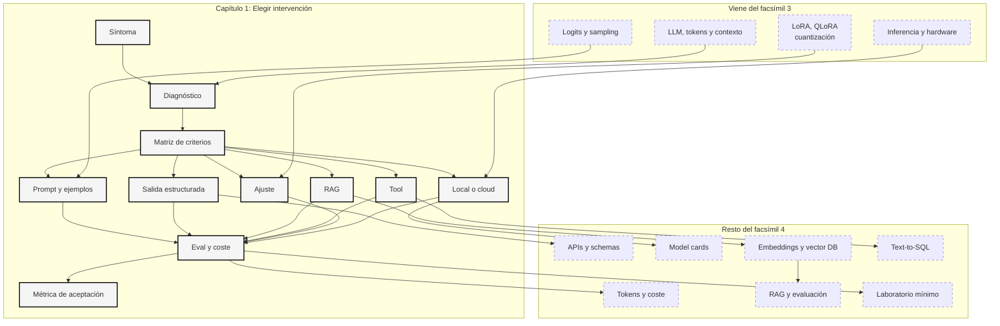

::: {.fasciculo-subtitle}
Facsímil 4 · La caja de herramientas
:::

# Capítulo 01: Elegir la intervención correcta: prompt, RAG, tool o ajuste

## La herramienta no es el punto de partida

El error más fácil en IA aplicada es empezar por la herramienta. “Hagamos RAG”, “probemos fine-tuning”, “pongamos un agente”, “lo llevo a local”, “metamos una base vectorial”. Suena activo, pero puede ser una forma elegante de no diagnosticar.

Este facsímil va de herramientas, sí. Pero las herramientas no son trofeos. Son respuestas a síntomas concretos. Si el modelo no respeta un formato, quizá necesitas salida estructurada. Si no conoce normativa interna, quizá necesitas RAG. Si debe consultar stock real, quizá necesita una tool. Si responde bien pero con tono inestable en miles de casos repetidos, quizá tiene sentido ajustar. Si los datos no pueden salir de una máquina, quizá toca local.

La caja de herramientas empieza con una pregunta humilde: **¿qué parte del sistema falla y qué cambio mínimo la arregla mejor?**

## Estado del arte con fecha de corte

**Fecha de corte:** 25 de mayo de 2026.  
**Fuentes consultadas ese día:** documentación oficial de Anthropic sobre prompt engineering, OpenAI sobre salidas estructuradas y function calling, Hugging Face PEFT/LoRA, documentación de Ollama API y Cloud, y el paper original de RAG.

Esta foto cambia rápido. Lo estable no es el nombre de una herramienta concreta, sino el patrón de decisión: contexto, evidencia, schema, tool, ajuste, local, evaluación y coste.

En 2026, las plataformas de modelos ya no ofrecen solo “texto dentro, texto fuera”. Las APIs modernas permiten schemas, tool calls, streaming, batch, cache y distintos modelos para coste o calidad. OpenAI documenta salidas estructuradas para forzar que una respuesta siga un schema.^[OpenAI. (2026). *Structured model outputs*. https://developers.openai.com/api/docs/guides/structured-outputs. Consultado el 25 de mayo de 2026. La guía distingue entre salidas estructuradas para respuesta final y function calling cuando el modelo se conecta a herramientas o datos.] Anthropic mantiene guías de prompt engineering como primera capa de control antes de añadir arquitectura.^[Anthropic. (2026). *Prompt engineering overview*. https://platform.claude.com/docs/en/build-with-claude/prompt-engineering/overview. Consultado el 25 de mayo de 2026. La guía trata el prompt como mecanismo de especificación de tarea, contexto, ejemplos y restricciones.]

También se consolidó una separación práctica: RAG para conocimiento externo, PEFT/LoRA para adaptar comportamiento con pocos parámetros y modelos locales o cloud local-compatible cuando la restricción está en privacidad, coste, portabilidad o experimentación.^[Hugging Face. (2026). *PEFT: LoRA developer guide*. https://huggingface.co/docs/peft/developer_guides/lora. Consultado el 25 de mayo de 2026. PEFT documenta LoRA y variantes para entrenar adaptadores pequeños sobre modelos base.] Ollama documenta una API local y una variante cloud con una experiencia parecida para modelos que no caben en hardware personal.^[Ollama. (2026). *Introduction to the Ollama API*. https://docs.ollama.com/api/introduction. Consultado el 25 de mayo de 2026. La documentación indica la URL local por defecto y la URL cloud compatible.]^[Ollama. (2026). *Ollama Cloud*. https://docs.ollama.com/cloud. Consultado el 25 de mayo de 2026. La guía describe modelos cloud que se ejecutan sin requerir una GPU local potente.]

## Qué no es una caja de herramientas de IA

Una caja de herramientas no es una lista de marcas. Si no sabes qué síntoma resuelve cada pieza, el catálogo solo añade ruido. La persona que sabe usar herramientas no es quien instala más librerías, sino quien simplifica antes de complicar.

Tampoco es una escalera de prestigio. Prompt no es “poco serio” y fine-tuning no es “más profesional” por defecto. RAG no es superior a una consulta SQL si la pregunta exige datos exactos. Un modelo local no es mejor que una API si no cumple calidad o mantenimiento. Cada elección compra algo y paga algo.

Y una caja de herramientas no sustituye a evaluación. Puedes montar RAG, tool calling, LoRA y modelo local; si no tienes casos de prueba, no sabes si has mejorado o solo has construido una máquina más difícil de entender.

## La pregunta correcta: qué quieres cambiar

Antes de elegir intervención, separa cuatro planos. El primero es **entrada**: quizá el modelo ya puede hacer la tarea si le das mejores instrucciones, ejemplos y formato esperado. El segundo es **contexto**: quizá necesita documentos, datos o memoria externa. El tercero es **acción**: quizá debe consultar una API, calcular algo o escribir en un sistema. El cuarto es **comportamiento aprendido**: quizá quieres que responda de una forma estable en una tarea repetida.

Esa separación evita mezclar herramientas:

| Si el problema es... | Primera intervención razonable | Por qué |
|---|---|---|
| Formato irregular | Prompt claro y salida estructurada | El modelo sabe responder, pero falta contrato de salida. |
| Conocimiento vivo | RAG o consulta a fuente externa | El dato cambia y debe poder citarse o verificarse. |
| Cálculo, estado o acción | Tool con schema y permisos | El modelo no debe inventar resultados de sistemas externos. |
| Tono o taxonomía repetida | Ejemplos, luego fine-tuning si escala | Cambias comportamiento estable, no conocimiento vivo. |
| Privacidad u offline | Modelo local o entorno privado | La restricción vive en dónde se ejecuta. |
| Coste o latencia | Modelo más pequeño, cache, batch o local | El problema puede estar en serving, no en “inteligencia”. |

Para verlo con un caso cercano: una universidad quiere contestar dudas de matrícula. Si las reglas cambian cada curso, RAG o consulta a la base oficial. Si el problema es devolver siempre JSON para integrarlo en una app, salida estructurada. Si debe comprobar si una persona ya pagó, tool contra el sistema de pagos. Si cada respuesta debe tener tono institucional, ejemplos y quizá ajuste más adelante.

## La fórmula mental del diagnóstico

No hace falta una ecuación para decidir, pero ayuda tener una forma compacta de pensar.

**Ejemplo de fórmula.** Como regla pedagógica de decisión, no como métrica universal, una intervención merece la pena cuando la mejora esperada supera su coste, su complejidad y su riesgo operativo:

$$
U(\text{intervención}) \approx \Delta Q \cdot C - K - M - R
$$

| Símbolo | Significado | Ejemplo |
|---|---|---|
| \(\Delta Q\) | Mejora esperada de calidad útil. | Más respuestas con cita correcta. |
| \(C\) | Confianza en que la mejora se mantenga. | Eval con 100 casos reales. |
| \(K\) | Coste económico y de latencia. | Tokens, GPU, vector DB, reintentos. |
| \(M\) | Mantenimiento añadido. | Índices, adapters, schemas, versiones. |
| \(R\) | Riesgo operativo. | Datos, permisos, acciones, regresiones. |

La fórmula no pretende dar una verdad exacta. Pretende impedir una mala costumbre: contar solo la mejora y olvidar todo lo que tendrás que operar después.

## Las cinco intervenciones básicas

Primero hay que explicar el síntoma. Luego la herramienta empieza a tener sentido. Estas cinco piezas vuelven durante todo el facsímil.

La tabla siguiente es una síntesis didáctica, no una taxonomía oficial única. Se apoya en prompt engineering^[Anthropic. (2026). *Prompt engineering overview*. https://platform.claude.com/docs/en/build-with-claude/prompt-engineering/overview. Consultado el 25 de mayo de 2026.] para controlar tarea, contexto y ejemplos; en salidas estructuradas^[OpenAI. (2026). *Structured model outputs*. https://developers.openai.com/api/docs/guides/structured-outputs. Consultado el 25 de mayo de 2026.] para imponer contratos de respuesta; en RAG^[Lewis, P. et al. (2020). Retrieval-Augmented Generation for Knowledge-Intensive NLP Tasks. *Advances in Neural Information Processing Systems 33*, 9459-9474. https://papers.nips.cc/paper/2020/hash/6b493230205f780e1bc26945df7481e5-Abstract.html.] para añadir evidencia recuperada; en function calling^[OpenAI. (2026). *Function calling*. https://developers.openai.com/api/docs/guides/function-calling. Consultado el 25 de mayo de 2026.] para conectar el modelo con funciones externas; y en LoRA/PEFT^[Hu, E. J. et al. (2022). LoRA: Low-Rank Adaptation of Large Language Models. *International Conference on Learning Representations*. https://arxiv.org/abs/2106.09685. Hugging Face. (2026). *PEFT: LoRA developer guide*. https://huggingface.co/docs/peft/developer_guides/lora. Consultado el 25 de mayo de 2026.] para adaptar comportamiento mediante pocos parámetros entrenables.

| Intervención | Cambia | Sirve cuando | No sirve para |
|---|---|---|---|
| Prompt y ejemplos | La entrada | Falta claridad, formato o criterio de respuesta. | Datos vivos grandes o acciones externas. |
| Salida estructurada | El contrato de salida | Necesitas JSON, campos obligatorios o validación automática. | Saber más contenido. |
| RAG | El contexto recuperado | Hay documentos, políticas o conocimiento cambiante. | Cambiar el estilo profundo del modelo. |
| Tool | La capacidad de consultar o actuar | Hay estado real, cálculo, base de datos o sistema externo. | Sustituir permisos o validación. |
| Fine-tuning/LoRA | Algunos pesos o adaptadores | Tarea repetida, estable y medible. | Actualizar información que cambia cada día. |

RAG nació como una forma de combinar memoria paramétrica con recuperación externa en tareas intensivas en conocimiento.^[Lewis, P. et al. (2020). Retrieval-Augmented Generation for Knowledge-Intensive NLP Tasks. *Advances in Neural Information Processing Systems 33*, 9459-9474. https://papers.nips.cc/paper/2020/hash/6b493230205f780e1bc26945df7481e5-Abstract.html. El trabajo formuló modelos que recuperan documentos y los combinan con generación.] LoRA propuso adaptar modelos grandes entrenando matrices pequeñas de bajo rango.^[Hu, E. J. et al. (2022). LoRA: Low-Rank Adaptation of Large Language Models. *International Conference on Learning Representations*. https://arxiv.org/abs/2106.09685.] QLoRA redujo aún más memoria al ajustar sobre modelos cuantizados.^[Dettmers, T. et al. (2023). QLoRA: Efficient Finetuning of Quantized LLMs. *Advances in Neural Information Processing Systems 36*. https://arxiv.org/abs/2305.14314.]

## Para entenderlo antes de tocar código

Antes de escribir una línea de código conviene hacer una prueba mental muy simple: describe el fallo como lo vería una persona usuaria, no como lo nombraría una librería. Después tradúcelo a una capa del sistema. Esa traducción es el músculo que queremos entrenar en este capítulo.

La misma frase “el modelo falla” puede significar cinco cosas distintas. Puede fallar porque no recibió instrucciones claras, porque le falta evidencia, porque necesita consultar un sistema externo, porque debe repetir un criterio muy específico o porque el entorno de despliegue impone límites. Si llamas a todo “modelo malo”, acabarás cambiando piezas equivocadas.

| Caso | Señal observable | Diagnóstico | Primera intervención | Qué medir |
|---|---|---|---|---|
| Asesoría con normativa cambiante | Responde bien hasta que cambia una norma. | Falta evidencia viva y trazable. | RAG o consulta a fuente oficial con cita. | Porcentaje de respuestas con documento correcto y fecha vigente. |
| CRM que necesita campos exactos | El texto es bueno, pero el backend rompe al parsear. | Falta contrato de salida. | Salida estructurada con schema y validación. | Campos válidos, errores de schema y casos que requieren revisión. |
| Tienda con stock real | Preguntan por talla, precio o disponibilidad. | Hace falta estado externo. | Tool pequeña contra inventario o pedidos. | Exactitud del dato, latencia de consulta y manejo de “no disponible”. |
| Soporte con miles de tickets parecidos | Responde con criterio parecido, pero formato y tono varían. | Conducta repetida poco estable. | Prompt con ejemplos; si escala, SFT, LoRA o adapter. | Consistencia de rúbrica, coste por ticket y regresiones. |
| Equipo con documentos sensibles | La mejor API externa no puede recibir ciertos textos. | Restricción de entorno. | Modelo local, entorno privado o arquitectura híbrida. | Calidad mínima aceptable, latencia, coste operativo y trazabilidad. |

Fíjate en el tercer caso. Si una persona pregunta “¿quedan zapatillas talla 42?”, el modelo puede escribir una respuesta convincente, pero no conoce el almacén. La intervención correcta no es pedirle que “razone mejor”. Es darle una función con un contrato estrecho: `consultar_stock(producto, talla, tienda)`. La inteligencia del sistema no está solo en el modelo; está en saber cuándo el modelo debe dejar de completar texto y pedir un dato.

Ahora mira el primer caso. Si la asesoría trabaja con normas que cambian, ajustar pesos puede incluso empeorar la situación: convierte conocimiento vivo en memoria opaca. RAG no entra porque sea una palabra de moda, sino porque necesitamos tres cosas muy concretas: recuperar el fragmento vigente, citarlo y poder actualizarlo sin entrenar de nuevo.

El caso del CRM enseña otra lección. A veces el modelo “entiende” perfectamente la tarea, pero el producto necesita datos que se puedan validar. Ahí no queremos literatura: queremos `{categoria, prioridad, siguiente_paso, confianza}` y una regla clara para rechazar respuestas inválidas. La salida estructurada no mejora el mundo interno del modelo; mejora el contrato entre el modelo y el software que lo rodea.

Y el equipo de soporte muestra cuándo empieza a tener sentido ajustar. Si el conocimiento ya está resuelto, los documentos aparecen bien y el schema se cumple, pero la respuesta no respeta una rúbrica interna en miles de ejemplos parecidos, entonces sí: quizá toca entrenar una adaptación pequeña. Pero esa decisión llega después de medir, no antes.

Una regla útil: **si puedes arreglarlo cambiando entrada, contexto o contrato, no empieces cambiando pesos**. Los pesos se tocan cuando quieres estabilizar una conducta repetida, tienes ejemplos buenos, sabes medir el resultado y aceptas mantener otra versión del sistema.

## Criterios de elección: la matriz que decide contigo

Si esto fuera una asignatura universitaria, aquí no bastaría con decir “depende”. El “depende” tiene que descomponerse en variables observables. Una buena decisión técnica no es la que suena más moderna, sino la que explica qué restricción pesa más y qué evidencia aceptaríamos para cambiar de opinión.

La siguiente matriz sirve para discutir una intervención en clase, en un equipo o en una revisión de arquitectura. No da una respuesta automática, pero obliga a justificarla.

| Criterio | Pregunta que debes hacer | Si pesa mucho, suele empujar hacia... | Evidencia mínima |
|---|---|---|---|
| Conocimiento cambiante | ¿La respuesta depende de datos que cambian con frecuencia? | RAG, base de datos o tool. | Documentos con fecha, fuente y casos donde el dato cambia. |
| Necesidad de cita | ¿La persona debe poder revisar de dónde sale la respuesta? | RAG con citas o consulta verificable. | Porcentaje de respuestas con evidencia correcta. |
| Estado real | ¿Hace falta mirar inventario, pagos, agenda, expediente o cálculo externo? | Tool con schema estrecho. | Función definida, entrada validada y salida comprobable. |
| Formato estricto | ¿Otro software consume la respuesta? | Salida estructurada. | JSON válido, campos obligatorios y tests de schema. |
| Conducta repetida | ¿La misma tarea aparece miles de veces con criterios estables? | Prompt con ejemplos; si no basta, SFT, LoRA o adapter. | Dataset pequeño pero limpio, rúbrica y comparación contra baseline. |
| Privacidad o despliegue | ¿Dónde puede ejecutarse el sistema y dónde pueden vivir los datos? | Modelo local, entorno privado o arquitectura híbrida. | Política de datos, latencia aceptable y calidad mínima medida. |
| Coste y latencia | ¿El problema es calidad o servirlo sin arruinar la experiencia? | Modelo menor, cache, batch, cuantización o local. | Coste por consulta, TTFT, tokens/s y percentiles de latencia. |
| Reversibilidad | ¿Podemos deshacer el cambio si empeora? | Prompt, schema, RAG o tool antes que ajuste de pesos. | Plan de rollback y comparación antes/después. |

Esta matriz también evita discusiones tramposas. Si alguien propone fine-tuning para un problema de stock, puedes preguntar: “¿qué criterio de la tabla justifica cambiar pesos?”. Si nadie puede responder, todavía no hay diagnóstico.

## Un mismo caso, cinco soluciones posibles

Tomemos un caso único para no perdernos: una universidad quiere un asistente de matrícula. El objetivo superficial parece uno solo, “responder dudas”, pero debajo hay varios problemas distintos. Según cuál duela, la intervención cambia.

| Lectura del problema | Solución razonable | Qué mejora | Qué no arregla |
|---|---|---|---|
| El alumnado pregunta de formas muy distintas y el sistema responde desordenado. | Prompt con ejemplos y criterios de estilo. | Claridad, tono, estructura inicial. | Normativa nueva o datos personales. |
| La app necesita guardar la respuesta en una ficha. | Salida estructurada con campos como `tema`, `respuesta`, `fuente`, `confianza`. | Integración con software y validación. | Saber si la norma está vigente. |
| Las normas de matrícula cambian cada curso. | RAG sobre normativa oficial, con fecha y cita. | Respuestas trazables y actualizables. | Consultar si una persona concreta pagó. |
| El alumno pregunta “¿me falta pagar algo?”. | Tool contra el sistema académico o de pagos. | Estado real de esa persona. | Explicar bien una norma general. |
| El equipo responde miles de tickets con una rúbrica estable. | Ajuste ligero si prompt, schema y RAG ya no bastan. | Consistencia en una tarea repetida. | Conocimiento que cambia cada semana. |

Lo importante es que ninguna fila “gana” siempre. En un producto real quizá uses varias: RAG para normativa, tool para expediente, salida estructurada para integrar y prompt para tono. Pero las añades por capas, no por entusiasmo.

## Cómo evaluar cada intervención

Una intervención no está terminada cuando funciona en la demo. Está terminada cuando puedes repetir una prueba y decidir si mejoró. Si no sabes qué medir, la arquitectura se convierte en opinión.

| Intervención | Métrica principal | Prueba mínima | Señal de que no basta |
|---|---|---|---|
| Prompt y ejemplos | Tasa de respuestas útiles según rúbrica. | 30 casos reales antes/después. | Mejora solo en ejemplos vistos o se rompe con variaciones simples. |
| Salida estructurada | Validez de schema y tasa de campos correctos. | Tests con campos obligatorios, tipos y casos incompletos. | El JSON es válido pero el contenido sigue siendo incorrecto. |
| RAG | Evidencia correcta, cobertura y abstención cuando falta fuente. | Preguntas con documento esperado y preguntas sin respuesta en corpus. | Recupera texto parecido pero no el fragmento que justifica la respuesta. |
| Tool | Exactitud de llamada, validación de argumentos y latencia. | Casos con entradas válidas, incompletas y ambiguas. | La tool se invoca cuando no toca o con parámetros mal formados. |
| Fine-tuning/LoRA | Mejora contra baseline sin perder casos importantes. | Eval fija antes/después y revisión de regresiones. | Mejora el formato pero empeora factualidad o flexibilidad. |
| Modelo local o privado | Calidad mínima, latencia, coste y mantenimiento. | Misma eval que la API base, con medición de recursos. | Cumple privacidad pero no alcanza la calidad necesaria. |

En clase, yo pediría siempre tres números antes de aceptar una propuesta: calidad, coste y reversibilidad. Calidad sin coste puede ser inviable. Coste sin calidad no sirve. Y una mejora que no puedes revertir exige mucha más evidencia.

## Errores de diagnóstico que conviene detectar

Estos errores parecen razonables cuando tienes prisa, por eso conviene nombrarlos. No son fallos de principiante: aparecen en equipos buenos cuando el problema se describe demasiado pronto con el nombre de una herramienta.

| Error de diagnóstico | Cómo se ve | Cómo corregirlo |
|---|---|---|
| Confundir conocimiento con comportamiento | “Ajustemos el modelo para que sepa la normativa nueva”. | Si cambia con frecuencia, sácalo a documentos, base de datos o tool. |
| Confundir formato con inteligencia | “El modelo no entiende”, cuando lo único que falla es el JSON. | Primero schema, validación y ejemplos de salida. |
| Confundir búsqueda con respuesta | El retrieval trae documentos parecidos, pero no justifican la conclusión. | Evaluar recuperación por fragmento correcto, no solo por similitud. |
| Confundir acción con texto | El modelo “dice” que ha comprobado algo, pero no ha consultado ningún sistema. | Tool real, logs y permisos mínimos. |
| Confundir benchmark con caso propio | Se elige modelo por ranking general. | Eval con idioma, dominio, coste y latencia del proyecto. |
| Confundir privacidad con peor producto | “Local” se acepta sin medir calidad. | Comparar local, privado y API con la misma rúbrica. |

El antídoto común es escribir una frase de diagnóstico antes de escribir una frase de solución: “El sistema falla porque...”. Si esa frase ya contiene el nombre de una herramienta, sospecha un poco.

## Mini práctica de decisión

Para entrenar el criterio, resuelve estos cuatro casos sin programar. En cada uno escribe: síntoma, intervención principal, alternativa descartada y métrica de aceptación. Después compara con la solución modelo.

| Caso | Síntoma | Intervención principal | Alternativa descartada | Métrica de aceptación |
|---|---|---|---|---|
| Biblioteca universitaria con horarios cambiantes. | Responde horarios antiguos. | RAG o consulta a fuente oficial. | Fine-tuning. | Respuestas con horario vigente y fuente correcta. |
| App médica que necesita clasificar mensajes en tres colas internas. | El texto es bueno, pero la integración falla. | Salida estructurada. | RAG. | JSON válido y cola correcta según rúbrica humana. |
| Ecommerce con preguntas de disponibilidad por tienda. | El modelo estima stock. | Tool de inventario. | Prompt más insistente. | Stock correcto, latencia aceptable y manejo de ausencia de dato. |
| Equipo legal con contratos sensibles en portátiles sin conexión. | No puede enviar documentos fuera y necesita asistencia básica. | Modelo local cuantizado o entorno privado. | API externa directa. | Calidad mínima en una eval interna y tiempo de respuesta usable. |

La solución modelo no pretende cerrar todos los matices. Pretende mostrar el razonamiento: cada respuesta identifica la capa que falla. Si cambias el enunciado, puede cambiar la intervención. Si la biblioteca también necesita guardar campos exactos, añadirías salida estructurada. Si el ecommerce además debe explicar políticas de devolución, quizá combinarías tool con RAG. La arquitectura final puede tener varias piezas; el diagnóstico inicial decide cuál entra primero.

## Mapa visual de diagnóstico

<svg id="f4-c01-diagnostico-intervencion" xmlns="http://www.w3.org/2000/svg" viewBox="0 0 1160 800" role="img" aria-label="Mapa de diagnóstico para elegir entre prompt, salida estructurada, RAG, tool, ajuste o modelo local">
  <title>Elegir la intervención correcta</title>
  <defs>
    <marker id="f4c01-arrow" viewBox="0 0 10 10" refX="9" refY="5" markerWidth="7" markerHeight="7" orient="auto">
      <path d="M 0 0 L 10 5 L 0 10 z" fill="#222222"/>
    </marker>
    <pattern id="f4c01-hatch" patternUnits="userSpaceOnUse" width="8" height="8" patternTransform="rotate(45)">
      <line x1="0" y1="0" x2="0" y2="8" stroke="#D8D8D8" stroke-width="2"/>
    </pattern>
  </defs>
  <rect x="20" y="20" width="1120" height="740" rx="18" fill="#FFFFFF" stroke="#111111" stroke-width="1.4"/>
  <text x="580" y="58" text-anchor="middle" font-family="Arial, sans-serif" font-size="25" font-weight="700" fill="#111111">Diagnóstico antes de herramienta</text>
  <text x="580" y="84" text-anchor="middle" font-family="Arial, sans-serif" font-size="13" fill="#666666">Cada intervención cambia una capa distinta del sistema.</text>
  <line x1="60" y1="110" x2="1100" y2="110" stroke="#111111" stroke-width="1"/>
  <rect x="70" y="152" width="220" height="120" rx="14" fill="#111111"/>
  <text x="180" y="184" text-anchor="middle" font-family="Arial, sans-serif" font-size="15" font-weight="700" fill="#FFFFFF">Síntoma observado</text>
  <text x="180" y="212" text-anchor="middle" font-family="Arial, sans-serif" font-size="11" fill="#DDDDDD">respuesta mala, lenta, cara,</text>
  <text x="180" y="230" text-anchor="middle" font-family="Arial, sans-serif" font-size="11" fill="#DDDDDD">sin cita o sin formato</text>
  <text x="180" y="252" text-anchor="middle" font-family="Arial, sans-serif" font-size="10" fill="#BBBBBB">no elijas todavía</text>
  <line x1="290" y1="212" x2="346" y2="212" stroke="#222222" stroke-width="1.5" marker-end="url(#f4c01-arrow)"/>
  <rect x="350" y="152" width="250" height="120" rx="14" fill="#F7F7F7" stroke="#111111" stroke-width="1.2"/>
  <text x="475" y="184" text-anchor="middle" font-family="Arial, sans-serif" font-size="15" font-weight="700" fill="#111111">Diagnóstico</text>
  <text x="475" y="212" text-anchor="middle" font-family="Arial, sans-serif" font-size="11" fill="#555555">¿falla entrada, contexto,</text>
  <text x="475" y="230" text-anchor="middle" font-family="Arial, sans-serif" font-size="11" fill="#555555">acción, conducta o entorno?</text>
  <text x="475" y="252" text-anchor="middle" font-family="Arial, sans-serif" font-size="10" fill="#777777">casos reales + baseline</text>
  <line x1="600" y1="212" x2="656" y2="212" stroke="#222222" stroke-width="1.5" marker-end="url(#f4c01-arrow)"/>
  <rect x="660" y="152" width="430" height="120" rx="14" fill="#FFFFFF" stroke="#111111" stroke-width="1.2"/>
  <text x="875" y="184" text-anchor="middle" font-family="Arial, sans-serif" font-size="15" font-weight="700" fill="#111111">Cambio mínimo útil</text>
  <text x="875" y="212" text-anchor="middle" font-family="Arial, sans-serif" font-size="11" fill="#555555">mejora suficiente con menor coste, menor complejidad</text>
  <text x="875" y="232" text-anchor="middle" font-family="Arial, sans-serif" font-size="11" fill="#555555">y una evaluación que pueda repetirse</text>
  <rect x="80" y="350" width="160" height="106" rx="12" fill="#FFFFFF" stroke="#111111" stroke-width="1.2"/>
  <text x="160" y="380" text-anchor="middle" font-family="Arial, sans-serif" font-size="13" font-weight="700" fill="#111111">Prompt</text>
  <text x="160" y="405" text-anchor="middle" font-family="Arial, sans-serif" font-size="10" fill="#555555">instrucción</text>
  <text x="160" y="422" text-anchor="middle" font-family="Arial, sans-serif" font-size="10" fill="#555555">ejemplos</text>
  <text x="160" y="439" text-anchor="middle" font-family="Arial, sans-serif" font-size="10" fill="#555555">criterio</text>
  <rect x="268" y="350" width="160" height="106" rx="12" fill="#F7F7F7" stroke="#111111" stroke-width="1.2"/>
  <text x="348" y="380" text-anchor="middle" font-family="Arial, sans-serif" font-size="13" font-weight="700" fill="#111111">Schema</text>
  <text x="348" y="405" text-anchor="middle" font-family="Arial, sans-serif" font-size="10" fill="#555555">campos</text>
  <text x="348" y="422" text-anchor="middle" font-family="Arial, sans-serif" font-size="10" fill="#555555">tipos</text>
  <text x="348" y="439" text-anchor="middle" font-family="Arial, sans-serif" font-size="10" fill="#555555">validación</text>
  <rect x="456" y="350" width="160" height="106" rx="12" fill="url(#f4c01-hatch)" stroke="#111111" stroke-width="1.2"/>
  <text x="536" y="380" text-anchor="middle" font-family="Arial, sans-serif" font-size="13" font-weight="700" fill="#111111">RAG</text>
  <text x="536" y="405" text-anchor="middle" font-family="Arial, sans-serif" font-size="10" fill="#555555">chunks</text>
  <text x="536" y="422" text-anchor="middle" font-family="Arial, sans-serif" font-size="10" fill="#555555">retrieval</text>
  <text x="536" y="439" text-anchor="middle" font-family="Arial, sans-serif" font-size="10" fill="#555555">citas</text>
  <rect x="644" y="350" width="160" height="106" rx="12" fill="#F7F7F7" stroke="#111111" stroke-width="1.2"/>
  <text x="724" y="380" text-anchor="middle" font-family="Arial, sans-serif" font-size="13" font-weight="700" fill="#111111">Tool</text>
  <text x="724" y="405" text-anchor="middle" font-family="Arial, sans-serif" font-size="10" fill="#555555">consulta</text>
  <text x="724" y="422" text-anchor="middle" font-family="Arial, sans-serif" font-size="10" fill="#555555">cálculo</text>
  <text x="724" y="439" text-anchor="middle" font-family="Arial, sans-serif" font-size="10" fill="#555555">acción</text>
  <rect x="832" y="350" width="160" height="106" rx="12" fill="#FFFFFF" stroke="#111111" stroke-width="1.2"/>
  <text x="912" y="380" text-anchor="middle" font-family="Arial, sans-serif" font-size="13" font-weight="700" fill="#111111">Ajuste</text>
  <text x="912" y="405" text-anchor="middle" font-family="Arial, sans-serif" font-size="10" fill="#555555">LoRA</text>
  <text x="912" y="422" text-anchor="middle" font-family="Arial, sans-serif" font-size="10" fill="#555555">QLoRA</text>
  <text x="912" y="439" text-anchor="middle" font-family="Arial, sans-serif" font-size="10" fill="#555555">SFT</text>
  <rect x="1020" y="350" width="90" height="106" rx="12" fill="#111111"/>
  <text x="1065" y="380" text-anchor="middle" font-family="Arial, sans-serif" font-size="13" font-weight="700" fill="#FFFFFF">Local</text>
  <text x="1065" y="407" text-anchor="middle" font-family="Arial, sans-serif" font-size="10" fill="#DDDDDD">datos</text>
  <text x="1065" y="424" text-anchor="middle" font-family="Arial, sans-serif" font-size="10" fill="#DDDDDD">coste</text>
  <text x="1065" y="441" text-anchor="middle" font-family="Arial, sans-serif" font-size="10" fill="#DDDDDD">offline</text>
  <path d="M875 272 C875 318, 160 312, 160 346" fill="none" stroke="#777777" stroke-width="1.1" stroke-dasharray="7 5" marker-end="url(#f4c01-arrow)"/>
  <path d="M875 272 C875 320, 348 314, 348 346" fill="none" stroke="#777777" stroke-width="1.1" stroke-dasharray="7 5" marker-end="url(#f4c01-arrow)"/>
  <path d="M875 272 C875 322, 536 318, 536 346" fill="none" stroke="#777777" stroke-width="1.1" stroke-dasharray="7 5" marker-end="url(#f4c01-arrow)"/>
  <path d="M875 272 C875 322, 724 322, 724 346" fill="none" stroke="#777777" stroke-width="1.1" stroke-dasharray="7 5" marker-end="url(#f4c01-arrow)"/>
  <path d="M875 272 C875 316, 912 318, 912 346" fill="none" stroke="#777777" stroke-width="1.1" stroke-dasharray="7 5" marker-end="url(#f4c01-arrow)"/>
  <path d="M875 272 C938 312, 1065 316, 1065 346" fill="none" stroke="#777777" stroke-width="1.1" stroke-dasharray="7 5" marker-end="url(#f4c01-arrow)"/>
  <rect x="170" y="570" width="820" height="84" rx="14" fill="#FFFFFF" stroke="#111111" stroke-width="1.4"/>
  <text x="580" y="600" text-anchor="middle" font-family="Arial, sans-serif" font-size="16" font-weight="700" fill="#111111">Puerta de decisión</text>
  <text x="580" y="626" text-anchor="middle" font-family="Arial, sans-serif" font-size="12" fill="#555555">baseline · eval · coste · latencia · privacidad · mantenimiento · rollback</text>
  <line x1="160" y1="456" x2="300" y2="566" stroke="#222222" stroke-width="1.2" marker-end="url(#f4c01-arrow)"/>
  <line x1="348" y1="456" x2="410" y2="566" stroke="#222222" stroke-width="1.2" marker-end="url(#f4c01-arrow)"/>
  <line x1="536" y1="456" x2="536" y2="566" stroke="#222222" stroke-width="1.2" marker-end="url(#f4c01-arrow)"/>
  <line x1="724" y1="456" x2="650" y2="566" stroke="#222222" stroke-width="1.2" marker-end="url(#f4c01-arrow)"/>
  <line x1="912" y1="456" x2="770" y2="566" stroke="#222222" stroke-width="1.2" marker-end="url(#f4c01-arrow)"/>
  <line x1="1065" y1="456" x2="870" y2="566" stroke="#222222" stroke-width="1.2" marker-end="url(#f4c01-arrow)"/>
  <rect x="360" y="690" width="440" height="34" rx="17" fill="#111111"/>
  <text x="580" y="712" text-anchor="middle" font-family="Arial, sans-serif" font-size="12" font-weight="700" fill="#FFFFFF">Si no mejora la eval, se vuelve al diagnóstico.</text>
  <text x="1100" y="742" text-anchor="end" font-family="Arial, sans-serif" font-size="10" fill="#9A9A9A">IA para gente curiosa / Facsímil 04 / Capítulo 01 / 686f6c61</text>
</svg>

## En el día a día

En un equipo real, este capítulo se usa antes de abrir el editor. Pones encima de la mesa tres cosas: el caso de uso, diez ejemplos reales y una forma de medir. Solo entonces eliges herramienta.

Si un jefe de producto pide “un chatbot con todos los documentos”, tradúcelo: quizá quiere búsqueda con citas, quizá quiere navegación guiada, quizá quiere reducir tickets, quizá quiere extraer campos. Cada objetivo produce una arquitectura distinta.

Si un equipo técnico dice “hagamos RAG”, pregunta por el corpus, el tipo de preguntas, el criterio de cita, los permisos por documento y cómo sabremos que el retrieval encontró evidencia. Si esas respuestas no existen, todavía no hay arquitectura: hay deseo.

## Por qué debería importarte

Porque cada intervención mal elegida deja deuda. Un RAG innecesario añade índices, chunks y evals. Un fine-tuning prematuro añade dataset, entrenamiento y versiones. Una tool amplia añade permisos y validación. Un modelo local añade soporte, hardware y medición de calidad.

La buena noticia es que una intervención bien elegida suele simplificar. Un schema puede eliminar cientos de líneas de parsing frágil. Una tool puede evitar que el modelo invente un dato. Un RAG con citas puede convertir una respuesta bonita en una respuesta revisable.

## Dónde volverá a aparecer

Este capítulo es la brújula del facsímil. Cada capítulo posterior toma una rama del diagnóstico y la desarrolla.

| Rama del diagnóstico | Dónde vuelve | Qué resolveremos allí |
|---|---|---|
| Salida estructurada | [Capítulo 02](/libro/fasciculo-04/#capitulo-02). | Mensajes, schemas, streaming y contratos de API. |
| Coste y contexto | [Capítulo 03](/libro/fasciculo-04/#capitulo-03). | Tokens, cache, batch y presupuestos. |
| Modelos y licencias | [Capítulo 04](/libro/fasciculo-04/#capitulo-04). | Leer model cards sin dejarse llevar por rankings. |
| Local y cloud | [Capítulos 05 y 06](/libro/fasciculo-04/#capitulo-05). | Ollama, LM Studio, GGUF, privacidad y despliegue. |
| RAG y vector DB | [Capítulos 07 a 11](/libro/fasciculo-04/#capitulo-07). | Embeddings, bases vectoriales, RAG, evaluación y GraphRAG. |
| Herramientas de datos | [Capítulo 12](/libro/fasciculo-04/#capitulo-12). | Text-to-SQL y consultas con validación. |
| Laboratorio mínimo | [Capítulo 13](/libro/fasciculo-04/#capitulo-13). | Notebooks, casos, evals, trazas y decisión escrita. |

## Dónde solía tropezar yo

Estos tropiezos aparecen mucho al empezar proyectos con IA. Casi todos nacen de confundir síntoma con solución.

| Error | Por qué es un error | Antídoto |
|---|---|---|
| **Empezar por RAG sin corpus claro** | Si no sabes qué documentos, preguntas y citas necesitas, el índice será decoración cara. | Definir 30 preguntas reales antes de indexar. |
| **Ajustar pesos para datos vivos** | El dato que cambia mañana no debería quedar escondido en un adapter. | Usar RAG, base de datos o tool para conocimiento cambiante. |
| **Pedir formato con súplicas** | “Responde en JSON” no es contrato suficiente si el backend depende de campos exactos. | Usar salida estructurada y validación. |
| **Usar una tool para todo** | Una función gigante es difícil de validar y fácil de usar mal. | Tools pequeñas, schemas claros y permisos mínimos. |
| **Comparar modelos sin tarea** | Un ranking genérico no sabe qué coste, idioma, latencia o riesgo tiene tu producto. | Comparar con tus casos, tus métricas y tus límites. |

## Manos a la obra

Kit ejecutable y descargable: `labs/f4/capitulo-practicas/`. Ejecuta `python3 ops/run_f4_practices.py --all --write --fail-on-invalid` para correr todas las prácticas del facsímil, o `python3 ops/run_f4_practices.py --chapter c01 --write --fail-on-invalid` cambiando `c01` por el capítulo que quieras aislar.

Vamos a convertir el diagnóstico en una matriz pequeña. El objetivo no es automatizar la decisión final. Es obligarte a escribir qué importa en tu caso antes de enamorarte de una herramienta.

```python
intervenciones = {
    "prompt_schema": {
        "conocimiento_vivo": 0,
        "accion_externa": 0,
        "formato": 5,
        "conducta_repetida": 2,
        "privacidad_local": 1,
        "coste": 5,
    },
    "rag": {
        "conocimiento_vivo": 5,
        "accion_externa": 1,
        "formato": 2,
        "conducta_repetida": 2,
        "privacidad_local": 3,
        "coste": 3,
    },
    "tool": {
        "conocimiento_vivo": 4,
        "accion_externa": 5,
        "formato": 3,
        "conducta_repetida": 1,
        "privacidad_local": 3,
        "coste": 3,
    },
    "ajuste_lora": {
        "conocimiento_vivo": 1,
        "accion_externa": 0,
        "formato": 4,
        "conducta_repetida": 5,
        "privacidad_local": 3,
        "coste": 2,
    },
    "modelo_local": {
        "conocimiento_vivo": 1,
        "accion_externa": 0,
        "formato": 2,
        "conducta_repetida": 2,
        "privacidad_local": 5,
        "coste": 4,
    },
}

caso = {
    "conocimiento_vivo": 5,
    "accion_externa": 0,
    "formato": 3,
    "conducta_repetida": 2,
    "privacidad_local": 4,
    "coste": 3,
}

def score(intervencion, pesos):
    return sum(intervencion[criterio] * importancia for criterio, importancia in pesos.items())

ranking = sorted(
    ((nombre, score(valores, caso)) for nombre, valores in intervenciones.items()),
    key=lambda item: item[1],
    reverse=True,
)

for nombre, puntos in ranking:
    print(f"{nombre}: {puntos}")
```

Salida esperada:

```text
rag: 56
tool: 52
modelo_local: 47
ajuste_lora: 45
prompt_schema: 38
```

Este caso favorece RAG porque hemos dicho que el conocimiento vivo pesa mucho y no necesitamos actuar sobre sistemas externos. Cambia `accion_externa` a 5 y verás subir `tool`. Cambia `formato` a 5 y `conocimiento_vivo` a 0, y verás que prompt/schema se vuelve competitivo. La matriz no decide por ti: te obliga a explicar tus prioridades.

## Cómo encaja todo



## Vocabulario aprendido

Estas palabras aparecerán en todo el facsímil. Conviene que queden limpias desde el principio.

| Término | Definición |
|---|---|
| **Intervención** | Cambio concreto en el sistema para mejorar un síntoma medible. |
| **Prompt** | Entrada que define tarea, contexto, ejemplos y criterio. |
| **Schema** | Estructura esperada de una salida o una tool. |
| **Salida estructurada** | Respuesta obligada a cumplir un formato validable. |
| **RAG** | Recuperar evidencia externa y pasarla al modelo como contexto. |
| **Tool** | Función externa que consulta, calcula o modifica algo bajo reglas. |
| **Fine-tuning** | Ajustar pesos de un modelo con datos propios. |
| **LoRA** | Ajuste eficiente con matrices pequeñas de bajo rango. |
| **Modelo local** | Modelo ejecutado en una máquina o infraestructura controlada. |
| **Baseline** | Comparación mínima antes de añadir complejidad. |
| **Eval** | Prueba repetible que mide calidad, coste, latencia o seguridad del sistema. |
| **Matriz de decisión** | Tabla que obliga a justificar una elección con criterios observables. |
| **Reversibilidad** | Facilidad para volver atrás si una intervención empeora el sistema. |
| **Abstención** | Capacidad de reconocer que falta evidencia suficiente para responder. |

## Antes de pasar página

- [ ] ¿Puedo explicar por qué no se empieza eligiendo herramienta?
- [ ] ¿Sé distinguir si un problema es de entrada, contexto, acción, conducta o entorno?
- [ ] ¿Puedo decir cuándo basta prompt/schema y cuándo hace falta RAG?
- [ ] ¿Entiendo por qué fine-tuning no es buena memoria para datos vivos?
- [ ] ¿Sé cuándo una tool es más adecuada que pedirle al modelo que “razone”?
- [ ] ¿Puedo usar la fórmula \(U \approx \Delta Q \cdot C - K - M - R\) para discutir una decisión?
- [ ] ¿He ejecutado la matriz y cambiado el caso para que gane otra intervención?
- [ ] ¿Puedo justificar una intervención usando criterios como cita, estado real, formato, coste y reversibilidad?
- [ ] ¿Sé resolver un mismo caso con prompt, schema, RAG, tool o ajuste según el síntoma?
- [ ] ¿Puedo proponer una métrica mínima para evaluar cada intervención?
- [ ] ¿Sé detectar cuándo estoy confundiendo conocimiento, formato, acción o despliegue?

## En resumen

La caja de herramientas empieza por diagnóstico. Si eliges bien el problema, la herramienta suele volverse evidente.

| Idea fuerza | Detalle |
|---|---|
| La herramienta no es el punto de partida. | Primero síntoma, casos reales y baseline. |
| Prompt/schema arreglan contrato de entrada y salida. | No hacen que el modelo sepa datos vivos. |
| RAG aporta evidencia externa. | Sirve para documentos cambiantes y respuestas citables. |
| Tool conecta con estado real. | Sirve para consultar, calcular o actuar sin inventar. |
| Ajustar pesos cambia comportamiento. | Tiene sentido en tareas repetidas, estables y medibles. |
| Local/cloud son decisiones de entorno. | Privacidad, coste, latencia y mantenimiento mandan. |
| Eval decide si la intervención se queda. | Sin medición, solo hay impresión. |
| Una buena decisión debe poder explicarse. | Criterio, alternativa descartada, métrica y rollback forman parte de la respuesta. |

## Para saber más

Anthropic. (2026). *Prompt engineering overview*. https://platform.claude.com/docs/en/build-with-claude/prompt-engineering/overview

Dettmers, T. et al. (2023). QLoRA: Efficient Finetuning of Quantized LLMs. *Advances in Neural Information Processing Systems 36*. https://arxiv.org/abs/2305.14314

Hugging Face. (2026). *PEFT: LoRA developer guide*. https://huggingface.co/docs/peft/developer_guides/lora

Hu, E. J. et al. (2022). LoRA: Low-Rank Adaptation of Large Language Models. *International Conference on Learning Representations*. https://arxiv.org/abs/2106.09685

Lewis, P. et al. (2020). Retrieval-Augmented Generation for Knowledge-Intensive NLP Tasks. *Advances in Neural Information Processing Systems 33*, 9459-9474. https://papers.nips.cc/paper/2020/hash/6b493230205f780e1bc26945df7481e5-Abstract.html

Ollama. (2026). *Introduction to the Ollama API*. https://docs.ollama.com/api/introduction

Ollama. (2026). *Ollama Cloud*. https://docs.ollama.com/cloud

OpenAI. (2026). *Function calling*. https://developers.openai.com/api/docs/guides/function-calling

OpenAI. (2026). *Structured model outputs*. https://developers.openai.com/api/docs/guides/structured-outputs
