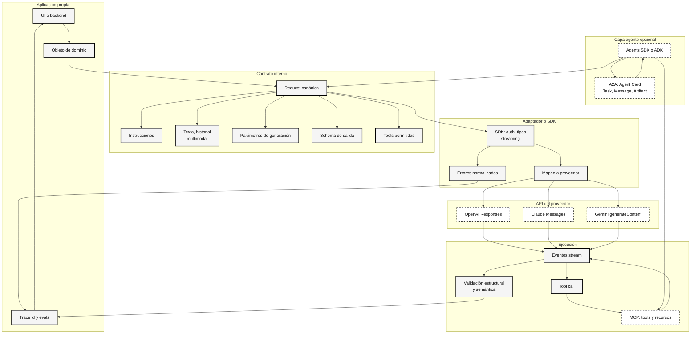
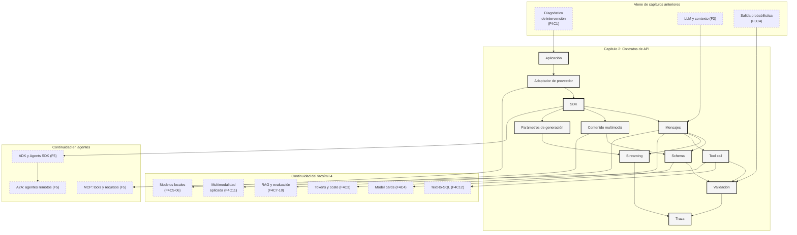

::: {.fasciculo-subtitle}
Facsímil 4 · La caja de herramientas
:::

# Capítulo 02: APIs de modelos: mensajes, streaming y salidas estructuradas

## El modelo no vive solo en una caja de texto

Cuando usamos un chat en el navegador, parece que el sistema funciona así: escribes una pregunta y aparece una respuesta. Para aprender a construir productos con IA, esa imagen se queda corta. Entre tu aplicación y el modelo hay un contrato: qué modelo llamas, qué mensajes envías, qué herramientas están disponibles, qué formato esperas, si quieres streaming, qué harás si la salida no valida y cómo guardarás la traza.

Este capítulo baja un escalón desde el criterio del [capítulo 01](/libro/fasciculo-04/#capitulo-01). Allí decidimos cuándo tiene sentido usar prompt, schema, RAG, tool o ajuste. Aquí aprendemos a convertir esa decisión en una petición concreta a una API de modelos.

La idea central es sencilla: **una API de modelos no es un buzón de texto; es una frontera entre software probabilístico y software verificable**.

## Estado del arte con fecha de corte

**Fecha de corte:** 10 de junio de 2026.  
**Fuentes consultadas ese día:** documentación oficial de OpenAI sobre Responses API, generación de texto, archivos, visión, salidas estructuradas, function calling, streaming, SDKs y Agents SDK; documentación de Anthropic sobre Messages API, visión, PDF, streaming y structured outputs; documentación de Google sobre Gemini API, documentos, visión, structured outputs, ADK, MCP y A2A; documentación oficial del protocolo A2A; JSON Schema; y la especificación WHATWG de Server-Sent Events.

La parte estable es el patrón: enviar una petición con modelo, instrucciones, entrada, herramientas opcionales, formato esperado y opciones de ejecución. La parte cambiante son los nombres exactos de endpoints, SDKs, modelos, campos y límites. Por eso conviene aprender la arquitectura mental antes que memorizar una firma de cliente.

OpenAI documenta la generación de texto y el uso de salidas estructuradas para pedir respuestas que cumplan un schema.^[OpenAI. (2026). *Text generation*. https://developers.openai.com/api/docs/guides/text. Consultado el 10 de junio de 2026.]^[OpenAI. (2026). *Structured model outputs*. https://developers.openai.com/api/docs/guides/structured-outputs. Consultado el 10 de junio de 2026.] También documenta function calling para que el modelo solicite llamadas a funciones definidas por la aplicación.^[OpenAI. (2026). *Function calling*. https://developers.openai.com/api/docs/guides/function-calling. Consultado el 10 de junio de 2026.] Anthropic organiza su API alrededor de mensajes y documenta streaming y salidas estructuradas como patrones de construcción.^[Anthropic. (2026). *Messages API*. https://platform.claude.com/docs/en/api/messages. Consultado el 10 de junio de 2026.]^[Anthropic. (2026). *Streaming messages*. https://platform.claude.com/docs/en/build-with-claude/streaming. Consultado el 10 de junio de 2026.]^[Anthropic. (2026). *Structured outputs*. https://platform.claude.com/docs/en/build-with-claude/structured-outputs. Consultado el 10 de junio de 2026.] Google documenta Gemini como una API de generación de contenido con entrada textual y multimodal, además de structured outputs basadas en schema.^[Google. (2026). *Text generation*. https://ai.google.dev/gemini-api/docs/text-generation. Consultado el 10 de junio de 2026.]^[Google. (2026). *Structured outputs*. https://ai.google.dev/gemini-api/docs/structured-output. Consultado el 10 de junio de 2026.]

La revisión del 10 de junio no cambia la tesis del capítulo, pero sí refuerza una decisión de ingeniería: **no acoples tu dominio al JSON exacto de un proveedor**. OpenAI mantiene como piezas centrales Responses, structured outputs, function calling y streaming; Anthropic conserva Messages API, streaming y patrones de salida estructurada; Google añade además superficies recientes alrededor de Interactions API, ADK y protocolos de agentes.^[Google. (2026). *Interactions API overview*. https://ai.google.dev/gemini-api/docs/interactions/interactions-overview. Consultado el 10 de junio de 2026.]^[Google. (2026). *Agent Development Kit*. https://adk.dev/. Consultado el 10 de junio de 2026.]^[A2A Protocol. (2026). *Agent2Agent Protocol*. https://a2a-protocol.org/latest/. Consultado el 10 de junio de 2026.] La conclusión práctica es aburrida y muy importante: escribe un adaptador por proveedor, valida la salida en tu código, guarda trazas comparables y deja que tu aplicación hable en objetos propios, no en campos de moda.

## Qué no es una API de modelos

Una API de modelos no es “el prompt por HTTP”. Si la tratas así, acabarás pegando instrucciones, datos, historial, formato esperado y lógica de negocio en una sola cadena. Eso funciona en una demo; se vuelve frágil cuando hay usuarios reales.

Tampoco es una promesa de verdad. La API puede devolver texto muy convincente, pero tu aplicación sigue necesitando validación, métricas, trazas y reglas de producto. Si pides JSON y no validas JSON, no tienes contrato: tienes esperanza.

Y no es una interfaz idéntica entre proveedores. Muchos conceptos se parecen, pero los detalles cambian: roles disponibles, nombre del campo de entrada, eventos de streaming, formato de tools, límites, modelos, errores y objetos de respuesta. Por eso el diseño de tu aplicación debería tener una capa propia que traduzca “lo que necesita mi producto” a “lo que espera este proveedor”.

## Qué sí es: un contrato entre capas

Una API de modelos es un contrato entre tres mundos. El primero es tu aplicación: usuarios, permisos, pantallas, flujos y datos. El segundo es el proveedor del modelo: endpoint, modelo, tokens, eventos, herramientas y respuesta. El tercero es tu código de integración: validadores, retries, logs, evals y transformación a objetos de dominio.

**Ejemplo de fórmula.** Una petición mínima puede pensarse así:

$$
r=(m,\ I,\ C,\ F,\ T,\ S)
$$

| Símbolo | Significado | Ejemplo |
|---|---|---|
| \(r\) | Request o petición completa. | Una llamada para clasificar una solicitud. |
| \(m\) | Modelo elegido. | Un modelo rápido para clasificación. |
| \(I\) | Instrucciones y mensajes. | Rol del sistema, contexto y pregunta del usuario. |
| \(C\) | Contexto externo. | Fragmentos RAG, datos de producto o historial relevante. |
| \(F\) | Formato de salida. | JSON con `categoria`, `prioridad` y `siguiente_paso`. |
| \(T\) | Tools disponibles. | `consultar_expediente(id_alumno)`. |
| \(S\) | Opciones de servicio. | Streaming, límite de salida, metadata o timeout. |

Esta forma de verlo ayuda a no mezclar piezas. Si falla \(F\), quizá necesitas schema. Si falla \(C\), quizá necesitas retrieval. Si falta \(T\), el modelo no debería inventar estado externo. Si falla \(S\), puede que el problema sea latencia, no inteligencia.

## Qué APIs se usan hoy y quién las usa

A 10 de junio de 2026, cuando una empresa dice “vamos a llamar a un LLM desde nuestra app”, normalmente está hablando de una de estas familias. No son las únicas, pero sí sirven para entender el mercado: APIs directas de laboratorios, APIs cloud que empaquetan varios modelos, gateways que unifican proveedores y runtimes locales que imitan una interfaz remota.

OpenAI organiza gran parte de su construcción moderna alrededor de la Responses API: una llamada que puede recibir entrada multimodal, instrucciones, tools, formato de salida, streaming y opciones de ejecución.^[OpenAI. (2026). *Create a model response*. https://developers.openai.com/api/docs/api-reference/responses/create. Consultado el 10 de junio de 2026.] La usan equipos que quieren construir asistentes, clasificadores, flujos con herramientas, extracción estructurada, análisis de documentos, experiencias con visión o productos donde una respuesta textual debe convertirse en objeto de software.

Anthropic expone Claude principalmente mediante Messages API para conversaciones y turnos sin estado: envías una lista estructurada de mensajes y el modelo genera el siguiente mensaje.^[Anthropic. (2026). *Messages API*. https://platform.claude.com/docs/en/api/messages. Consultado el 10 de junio de 2026.] Es habitual en productos que necesitan lectura y escritura largas, análisis documental, asistentes internos, ayuda a programación, tutoría o flujos donde interesa controlar muy bien el historial enviado.

Google ofrece la Gemini API alrededor de `generateContent`, con entradas que pueden combinar texto, imágenes, vídeo y audio, además de configuración de generación y salidas estructuradas.^[Google. (2026). *Text generation*. https://ai.google.dev/gemini-api/docs/text-generation. Consultado el 10 de junio de 2026.] Encaja especialmente en productos multimodales, prototipos integrados con el ecosistema Google, procesamiento de documentos y aplicaciones que quieren aprovechar modelos con ventanas largas o capacidades visuales.

Además existen plataformas como Amazon Bedrock, Vertex AI, Azure AI Foundry, Mistral, Cohere, Groq, Together, Fireworks, OpenRouter o Vercel AI SDK. La lección no es aprenderlas todas de memoria. La lección es que casi todas terminan pidiendo lo mismo con nombres distintos: modelo, entrada, instrucciones, parámetros de generación, herramientas, schema, streaming, límites y metadatos.

## Los parámetros: no memorizar nombres, entender familias

Cuando un alumno ve por primera vez una referencia de API, se pierde porque parece una lista interminable de campos. La forma útil de estudiarla es agrupar parámetros por intención. Unos campos dicen **qué modelo** usamos; otros dicen **qué entra**; otros controlan **cuánto y cómo responde**; otros definen **qué herramientas puede pedir**; otros describen **qué forma debe tener la salida**; y otros sirven para **operar** el sistema.

**Ejemplo de fórmula.** La petición completa puede verse así:

$$
r=(p,\ x,\ g,\ o,\ q)
$$

| Símbolo | Significado | Ejemplo |
|---|---|---|
| \(p\) | Proveedor y modelo. | OpenAI con Responses API, Claude con Messages API o Gemini con `generateContent`. |
| \(x\) | Entrada del usuario y contexto. | Texto, historial, documentos, imagen o fragmentos recuperados. |
| \(g\) | Parámetros de generación. | Límite de salida, temperatura, `top_p`, `top_k` o secuencias de parada. |
| \(o\) | Contrato operativo. | Streaming, tools, tool choice, metadata, traza y timeout. |
| \(q\) | Contrato de calidad. | Schema, validador, evals y reglas de producto. |

La tabla siguiente no pretende congelar una API que cambia. Sirve para reconocer equivalencias:

| Familia | OpenAI Responses API | Anthropic Messages API | Gemini API |
|---|---|---|---|
| Modelo | `model` | `model` | modelo en `models.generateContent` o ruta REST. |
| Entrada | `input` con mensajes y bloques de contenido. | `messages` con contenido por turnos. | `contents` con `parts`. |
| Instrucciones estables | `instructions` o mensajes equivalentes según SDK. | `system` como campo superior. | `systemInstruction` o configuración equivalente. |
| Límite de salida | `max_output_tokens` según modelo y endpoint. | `max_tokens`. | `maxOutputTokens` dentro de configuración. |
| Aleatoriedad | `temperature`, `top_p` cuando el modelo lo permita. | `temperature`, `top_p`, `top_k` según modelo. | `temperature`, `topP`, `topK`. |
| Parada | secuencias de parada si están disponibles. | `stop_sequences`. | `stopSequences`. |
| Salida estructurada | formato de texto/schema o Structured Outputs. | `output_config.format` o tool estricta, según caso. | `responseMimeType` y `responseJsonSchema`. |
| Tools | `tools` y `tool_choice`. | `tools` y `tool_choice`. | `tools` y function calling. |
| Streaming | `stream` y eventos. | `stream` con eventos SSE. | métodos de streaming del SDK o REST. |
| Metadatos y operación | `metadata`, trazas, `user` o campos de servicio cuando existan. | `metadata`, uso de tokens y estado de parada. | `usageMetadata`, configuración y metadatos del entorno. |

El parámetro más peligroso no es siempre el más técnico. Muchas integraciones fallan por no fijar bien `max_tokens` o `max_output_tokens`, por mezclar instrucciones con datos del usuario, por no versionar el schema o por asumir que `temperature=0` convierte una salida probabilística en una función matemática.

## Entradas y salidas: qué ocurre en cada caso

Una API de modelos no devuelve siempre “texto”. Puede devolver texto, JSON, una petición de tool, eventos parciales o una combinación de bloques. Por eso conviene diseñar el flujo antes de escribir el cliente.

| Caso | Entra | Sale | Qué debe hacer tu aplicación |
|---|---|---|---|
| Texto a texto | Pregunta, instrucciones y contexto breve. | Respuesta natural. | Mostrar, registrar y quizá evaluar calidad. |
| Texto a JSON | Texto y schema. | Objeto estructurado. | Parsear, validar y transformar a objeto de dominio. |
| Documento a resumen | Archivo, páginas o fragmentos. | Resumen, citas o extracción. | Conservar referencia a página, versión y documento original. |
| Imagen a explicación | Imagen más pregunta. | Descripción, clasificación o lectura visual. | Revisar límites visuales y pedir evidencia cuando importe. |
| Texto a tool call | Petición y definición de función. | Nombre de tool y argumentos. | Validar argumentos, comprobar permisos y ejecutar código. |
| Tool result a respuesta | Resultado externo. | Explicación final. | Separar dato consultado de redacción generada. |
| Streaming | Petición normal con `stream`. | Eventos parciales. | Acumular, cancelar, manejar errores y cerrar estado. |

La salida estructurada y las tool calls se parecen porque usan schemas, pero no cumplen la misma misión. Una salida estructurada es el resultado final con forma de dato. Una tool call es una solicitud intermedia para que el sistema consulte, calcule o actúe. Si confundes ambas cosas, tu app termina ejecutando texto como si fuera una decisión cerrada.

## Documentos e imágenes: multimodal no significa comprensión automática

Enviar una imagen o un PDF a un modelo multimodal no equivale a “el modelo lo sabe todo sobre ese archivo”. Equivale a darle una entrada rica que el modelo puede procesar dentro de sus límites. OpenAI documenta bloques como `input_file` para archivos y `input_image` para imágenes dentro de la entrada.^[OpenAI. (2026). *File inputs*. https://developers.openai.com/api/docs/guides/file-inputs. Consultado el 10 de junio de 2026.]^[OpenAI. (2026). *Images and vision*. https://developers.openai.com/api/docs/guides/images-vision. Consultado el 10 de junio de 2026.] Anthropic documenta visión y soporte de PDF para Claude.^[Anthropic. (2026). *Vision*. https://platform.claude.com/docs/en/build-with-claude/vision. Consultado el 10 de junio de 2026.]^[Anthropic. (2026). *PDF support*. https://platform.claude.com/docs/en/build-with-claude/pdf-support. Consultado el 10 de junio de 2026.] Gemini permite pasar imágenes como datos inline o mediante Files API, y documenta límites específicos para PDF.^[Google. (2026). *Image understanding*. https://ai.google.dev/gemini-api/docs/image-understanding. Consultado el 10 de junio de 2026.]^[Google. (2026). *Document understanding*. https://ai.google.dev/gemini-api/docs/document-processing. Consultado el 10 de junio de 2026.]

Para una sola imagen, suele bastar con enviar la imagen y una pregunta clara: “lee esta factura y extrae fecha, proveedor e importe”. Para muchas imágenes o archivos repetidos, conviene subirlos una vez y referenciarlos. Para un PDF largo, hay que decidir si se manda entero, si se divide por páginas, si se indexa en un sistema RAG o si se usa una combinación: retrieval para localizar fragmentos y modelo multimodal para interpretar tablas, figuras o páginas concretas.

Hay cuatro cosas que no deberíamos olvidar:

| Cuidado | Por qué importa | Buena práctica |
|---|---|---|
| Tamaño y coste | Imágenes y documentos consumen contexto y pueden aumentar latencia. | Medir tokens, páginas, resolución y tiempo de respuesta. |
| Referencias | Una respuesta sin página o fragmento es difícil de revisar. | Pedir `pagina`, `fragmento` o `evidencia` en el schema. |
| Privacidad | Los documentos pueden contener datos personales o internos. | Minimizar, redactar cuando sea posible y revisar política del proveedor. |
| Lectura visual | Un modelo puede interpretar mal tablas, sellos o capturas pequeñas. | Comprobar con OCR, reglas o revisión humana cuando importe. |

La regla práctica: si el documento es fuente de verdad, no lo trates como “contexto decorativo”. Guárdalo con identificador, versión, fecha de carga y forma de recuperación. Si mañana alguien pregunta por qué la app contestó eso, debes poder reconstruir qué archivo vio, qué páginas entraron y qué schema validó la salida.

## Mensajes: separar instrucciones, contexto y petición

La mayoría de APIs modernas no reciben solo una cadena. Reciben mensajes o una estructura equivalente. El objetivo no es teatralizar una conversación, sino separar responsabilidades: qué reglas gobiernan la tarea, qué dijo la persona usuaria, qué contestó antes el modelo y qué resultados devolvieron herramientas.

| Pieza | Qué representa | Riesgo si se mezcla |
|---|---|---|
| Instrucciones de sistema o desarrollador | Comportamiento estable que quieres mantener. | El usuario puede pisar reglas importantes con texto accidental. |
| Mensaje de usuario | La petición concreta de esta interacción. | El sistema no distingue objetivo de contexto. |
| Contexto recuperado | Evidencia externa añadida por la aplicación. | El modelo no sabe qué parte citar o priorizar. |
| Mensaje del asistente | Respuesta anterior o salida actual. | Se pierde trazabilidad en conversaciones largas. |
| Resultado de tool | Dato externo obtenido por código. | Se confunde texto generado con dato comprobado. |

Un patrón robusto consiste en construir la petición desde piezas separadas y solo al final traducirlas al formato del proveedor. Así puedes cambiar de modelo sin reescribir la lógica de negocio.

Para entenderlo: si una app universitaria pregunta “¿puede Ana matricularse de Sistemas Inteligentes?”, no deberías mandar solo esa frase. Deberías separar la política académica vigente, el identificador de Ana, las reglas de formato de salida y, si hace falta, la tool que consulta expediente.

## Salidas estructuradas: cuando el texto debe convertirse en dato

Pedir “responde en JSON” es una intención. Usar un schema es un contrato. JSON Schema define vocabulario para describir tipos, propiedades, campos requeridos y reglas de validación sobre documentos JSON.^[JSON Schema. (2020). *JSON Schema Validation: A Vocabulary for Structural Validation of JSON*. https://json-schema.org/draft/2020-12/json-schema-validation.] Las APIs de modelos aprovechan esa idea para reducir la distancia entre respuesta natural y objeto que tu software puede consumir.

La métrica mínima de una salida estructurada es la tasa de conformidad:

$$
\operatorname{validez}=\frac{N_{\text{válidas}}}{N_{\text{total}}}
$$

| Símbolo | Significado | Ejemplo |
|---|---|---|
| \(N_{\text{válidas}}\) | Respuestas que cumplen schema. | 97 de 100 respuestas. |
| \(N_{\text{total}}\) | Respuestas evaluadas. | 100 casos de prueba. |
| \(\operatorname{validez}\) | Proporción de salidas estructuralmente correctas. | \(0{,}97\). |

Pero cuidado: una respuesta puede cumplir schema y seguir siendo mala. Si el schema pide `prioridad`, el valor puede ser válido como texto y estar mal como decisión. Por eso necesitamos dos validaciones:

| Validación | Pregunta | Ejemplo |
|---|---|---|
| Estructural | ¿Cumple tipos, campos y restricciones? | `prioridad` existe y vale `alta`, `media` o `baja`. |
| Semántica | ¿El contenido es correcto para el caso? | El mensaje realmente requiere prioridad alta. |

La salida estructurada arregla el contrato con el software. No reemplaza la evaluación del criterio.

## Streaming: que la respuesta llegue por partes

Streaming significa que la aplicación no espera a tener toda la respuesta para empezar a recibir fragmentos. En la web moderna suele implementarse con eventos o flujos parecidos a Server-Sent Events, donde el servidor envía datos progresivamente al cliente.^[WHATWG. (2026). *Server-sent events*. https://html.spec.whatwg.org/multipage/server-sent-events.html. Consultado el 10 de junio de 2026.] OpenAI y Anthropic documentan streaming para respuestas de modelos.^[OpenAI. (2026). *Streaming API responses*. https://developers.openai.com/api/docs/guides/streaming-responses. Consultado el 10 de junio de 2026.]^[Anthropic. (2026). *Streaming messages*. https://platform.claude.com/docs/en/build-with-claude/streaming. Consultado el 10 de junio de 2026.]

La razón no es solo estética. El streaming cambia la experiencia percibida.

**Ejemplo de fórmula.** Para explicarlo en una revisión de producto, puedes separar primer evento y lectura progresiva:

$$
T_{\text{percibido}} \approx T_{\text{primer\_evento}} + T_{\text{lectura\_progresiva}}
$$

| Símbolo | Significado | Ejemplo |
|---|---|---|
| \(T_{\text{primer\_evento}}\) | Tiempo hasta recibir el primer fragmento. | 700 ms. |
| \(T_{\text{lectura\_progresiva}}\) | Tiempo durante el que se van mostrando fragmentos. | La respuesta aparece mientras se genera. |
| \(T_{\text{percibido}}\) | Latencia que siente la persona usuaria. | Menor que esperar todo el texto junto. |

Streaming no hace que el modelo “piense mejor”. Hace que el producto pueda mostrar progreso, cancelar, actualizar UI y registrar eventos. También complica: debes ensamblar fragmentos, manejar cortes, distinguir eventos de texto y eventos de tool, y decidir cuándo una salida estructurada está lista para validarse.

## Tool calls: cuando responder no basta

Una salida estructurada devuelve datos. Una tool call pide que tu aplicación ejecute algo. Esa diferencia parece pequeña y es enorme.

| Necesidad | Salida estructurada | Tool call |
|---|---|---|
| Clasificar un mensaje | Devuelve `{categoria, prioridad}`. | Normalmente no hace falta. |
| Consultar stock | Puede devolver intención de consulta. | Llama `consultar_stock(producto, talla)`. |
| Calcular una cuota | Puede proponer fórmula. | Llama `calcular_cuota(importe, plazo)`. |
| Abrir un ticket | Puede redactar el contenido. | Llama `crear_ticket(...)` si el usuario confirma. |

La regla práctica: **si el dato existe fuera del modelo, no lo conviertas en adivinanza**. Define una tool pequeña, valida sus argumentos, ejecuta el código y devuelve el resultado como contexto para que el modelo lo explique.

## Para entenderlo antes de tocar código

Pensemos en cuatro productos que parecen parecidos porque todos “usan IA”, pero que piden contratos distintos.

| Producto | Qué envía a la API | Qué espera recibir | Pieza crítica |
|---|---|---|---|
| Clasificador de correos internos | Texto del correo e instrucciones. | JSON con cola, prioridad y motivo breve. | Schema y validador. |
| Tutor universitario | Pregunta, nivel del curso y rúbrica. | Explicación paso a paso. | Mensajes bien separados. |
| Asistente de matrícula | Pregunta y contexto normativo recuperado. | Respuesta con cita y quizá tool de expediente. | RAG, tool y trazabilidad. |
| Redactor con respuesta larga | Brief, tono y ejemplos. | Texto progresivo en pantalla. | Streaming y cancelación. |

El mismo modelo puede participar en los cuatro, pero la API no se usa igual. En uno importa más el schema; en otro, el streaming; en otro, tools; en otro, trazabilidad del contexto.

## Buenas prácticas de integración

Una integración madura no empieza llamando al SDK desde cualquier pantalla. Empieza con un contrato propio de la aplicación. Ese contrato dice: “para clasificar una solicitud necesito estos campos, esta política, este schema, estas tools permitidas y esta forma de guardar trazas”. Después un adaptador traduce ese contrato al proveedor elegido.

El adaptador evita que el resto del producto sepa si por debajo hay OpenAI, Claude, Gemini, un modelo local o un gateway. También te obliga a decidir lo importante en un sitio: versionar prompts, schemas y modelos; convertir errores de proveedor en errores propios; medir coste; registrar identificadores; y probar la misma tarea con casos de evaluación.

| Práctica | Qué resuelve | Cómo se ve en código o producto |
|---|---|---|
| Adaptador por proveedor | Evita acoplar pantallas a nombres de campos externos. | `crearRespuestaTutor(...)` traduce a OpenAI, Claude o Gemini. |
| Schema versionado | Permite cambiar formato sin romper consumidores. | `respuesta_matricula.v2.json`. |
| Validador propio | No delega toda la corrección al proveedor. | Pydantic, Zod, JSON Schema o validación del backend. |
| Trazas mínimas | Permite reproducir fallos sin guardar más de lo necesario. | `trace_id`, modelo, versión de prompt, schema y resumen de entrada. |
| Timeouts y reintentos | Evita dejar al usuario esperando sin cierre. | Reintento solo en operaciones idempotentes. |
| Tools pequeñas | Reduce ambigüedad y facilita permisos. | `consultar_expediente(id)` en vez de `hacer_cosas(datos)`. |
| Evals antes de publicar | Mide si la integración mejora o empeora. | Conjunto de casos fijos con salida esperada. |
| Streaming con máquina de estados | Evita UI a medias. | `iniciado`, `parcial`, `tool`, `completo`, `cancelado`, `error`. |

**Ejemplo de fórmula.** La integración más limpia que conozco tiene esta forma mental:

$$
\text{producto} \rightarrow \text{contrato propio} \rightarrow \text{adaptador} \rightarrow \text{proveedor} \rightarrow \text{validador} \rightarrow \text{producto}
$$

| Pieza | Pregunta que responde |
|---|---|
| Producto | ¿Qué necesita conseguir la persona usuaria? |
| Contrato propio | ¿Qué datos, formato, tools y reglas exige nuestro flujo? |
| Adaptador | ¿Cómo se expresa eso en la API concreta? |
| Proveedor | ¿Qué modelo genera, pide tool o devuelve eventos? |
| Validador | ¿La salida cumple estructura y criterio mínimo? |
| Producto | ¿Mostramos, pedimos confirmación, guardamos o repetimos? |

## Cómo sería una API perfecta para integrar

Una API perfecta no sería “la que siempre acierta”. Eso no existe. Sería la que hace fácil construir software fiable alrededor de una capacidad probabilística. Si diseñáramos una interfaz ideal para una app profesional, tendría estas propiedades:

| Rasgo | Por qué importa |
|---|---|
| Entrada multimodal tipada | Texto, imágenes y documentos no llegan como una cadena opaca. |
| Instrucciones separadas | Las reglas estables no se mezclan con lo que escribe la persona usuaria. |
| Salida schema-first | El contrato de datos se declara antes de generar. |
| Tools tipadas y pequeñas | La API distingue pedir una acción de ejecutar una acción. |
| Eventos normalizados | Streaming, tool calls y errores siguen una secuencia predecible. |
| Uso y coste visibles | La respuesta trae tokens, latencia y modelo usado. |
| Versionado explícito | Prompt, schema, modelo y toolset se pueden congelar y comparar. |
| Errores tipados | La app sabe si hubo límite, timeout, validación fallida o contenido incompleto. |
| Idempotencia | Reintentar no duplica acciones sensibles ni crea registros repetidos. |
| Privacidad configurable | Puedes decidir qué se guarda, qué se omite y durante cuánto tiempo. |
| Evals integradas | El mismo contrato puede probarse con casos antes de publicarse. |

En pseudocódigo, una llamada ideal se parecería menos a “envía este texto” y más a esto:

```text
respuesta = modelo.generar({
  tarea: "clasificar_solicitud_matricula",
  contrato: "solicitud_matricula.v2",
  entrada: {texto, documentos, usuario_contexto},
  salida: schema_respuesta,
  tools: [consultar_expediente],
  ejecucion: {stream: true, timeout_ms: 12000, trace_id},
  politica: {confirmar_antes_de_crear_ticket: true}
})
```

La clave no es que todos los proveedores adopten exactamente ese formato. La clave es que tu aplicación sí tenga esa claridad interna. Si tu dominio está bien modelado, cambiar de proveedor es una migración. Si tu dominio vive pegado al prompt, cambiar de proveedor es cirugía.

## Mapa visual de una petición robusta

El diagrama resume la idea práctica del capítulo: la aplicación no debería hablar con el modelo como quien manda una frase suelta, sino como quien prepara un contrato que luego valida.

<svg id="f4-c02-api-contrato" xmlns="http://www.w3.org/2000/svg" viewBox="0 0 1160 820" role="img" aria-label="Mapa de una petición robusta a una API de modelos con mensajes, tools, streaming y validación">
  <title>De la aplicación al contrato de API</title>
  <defs>
    <marker id="f4c02-arrow" viewBox="0 0 10 10" refX="9" refY="5" markerWidth="7" markerHeight="7" orient="auto">
      <path d="M 0 0 L 10 5 L 0 10 z" fill="#222222"/>
    </marker>
    <pattern id="f4c02-lines" patternUnits="userSpaceOnUse" width="8" height="8" patternTransform="rotate(45)">
      <line x1="0" y1="0" x2="0" y2="8" stroke="#D8D8D8" stroke-width="2"/>
    </pattern>
  </defs>
  <rect x="22" y="22" width="1116" height="760" rx="18" fill="#FFFFFF" stroke="#111111" stroke-width="1.4"/>
  <text x="580" y="62" text-anchor="middle" font-family="Arial, sans-serif" font-size="25" font-weight="700" fill="#111111">Una API de modelos es un contrato</text>
  <text x="580" y="88" text-anchor="middle" font-family="Arial, sans-serif" font-size="13" fill="#666666">Entrada, formato, tools, streaming y validación viajan separados.</text>
  <line x1="62" y1="116" x2="1098" y2="116" stroke="#111111" stroke-width="1"/>

  <rect x="70" y="160" width="190" height="128" rx="14" fill="#111111"/>
  <text x="165" y="194" text-anchor="middle" font-family="Arial, sans-serif" font-size="15" font-weight="700" fill="#FFFFFF">Aplicación</text>
  <text x="165" y="222" text-anchor="middle" font-family="Arial, sans-serif" font-size="11" fill="#DDDDDD">usuario · permisos</text>
  <text x="165" y="240" text-anchor="middle" font-family="Arial, sans-serif" font-size="11" fill="#DDDDDD">pantalla · objetivo</text>
  <text x="165" y="262" text-anchor="middle" font-family="Arial, sans-serif" font-size="10" fill="#BBBBBB">no manda texto sin contrato</text>

  <rect x="330" y="150" width="250" height="148" rx="14" fill="#F7F7F7" stroke="#111111" stroke-width="1.2"/>
  <text x="455" y="184" text-anchor="middle" font-family="Arial, sans-serif" font-size="15" font-weight="700" fill="#111111">Contrato + adaptador</text>
  <text x="455" y="214" text-anchor="middle" font-family="Arial, sans-serif" font-size="11" fill="#555555">modelo · entrada · contexto</text>
  <text x="455" y="234" text-anchor="middle" font-family="Arial, sans-serif" font-size="11" fill="#555555">schema · tools · opciones</text>
  <text x="455" y="258" text-anchor="middle" font-family="Arial, sans-serif" font-size="10" fill="#777777">traduce dominio a API</text>

  <rect x="650" y="160" width="190" height="128" rx="14" fill="url(#f4c02-lines)" stroke="#111111" stroke-width="1.2"/>
  <text x="745" y="194" text-anchor="middle" font-family="Arial, sans-serif" font-size="15" font-weight="700" fill="#111111">Proveedor</text>
  <text x="745" y="222" text-anchor="middle" font-family="Arial, sans-serif" font-size="11" fill="#555555">modelo · inferencia</text>
  <text x="745" y="240" text-anchor="middle" font-family="Arial, sans-serif" font-size="11" fill="#555555">eventos · objetos</text>

  <rect x="900" y="160" width="190" height="128" rx="14" fill="#FFFFFF" stroke="#111111" stroke-width="1.2"/>
  <text x="995" y="194" text-anchor="middle" font-family="Arial, sans-serif" font-size="15" font-weight="700" fill="#111111">Respuesta</text>
  <text x="995" y="222" text-anchor="middle" font-family="Arial, sans-serif" font-size="11" fill="#555555">texto · JSON</text>
  <text x="995" y="240" text-anchor="middle" font-family="Arial, sans-serif" font-size="11" fill="#555555">tool call · stream</text>

  <line x1="260" y1="224" x2="326" y2="224" stroke="#222222" stroke-width="1.5" marker-end="url(#f4c02-arrow)"/>
  <line x1="580" y1="224" x2="646" y2="224" stroke="#222222" stroke-width="1.5" marker-end="url(#f4c02-arrow)"/>
  <line x1="840" y1="224" x2="896" y2="224" stroke="#222222" stroke-width="1.5" marker-end="url(#f4c02-arrow)"/>

  <rect x="70" y="390" width="150" height="100" rx="12" fill="#FFFFFF" stroke="#111111" stroke-width="1.2"/>
  <text x="145" y="420" text-anchor="middle" font-family="Arial, sans-serif" font-size="13" font-weight="700" fill="#111111">Mensajes</text>
  <text x="145" y="446" text-anchor="middle" font-family="Arial, sans-serif" font-size="10" fill="#555555">roles separados</text>
  <text x="145" y="464" text-anchor="middle" font-family="Arial, sans-serif" font-size="10" fill="#555555">historial controlado</text>

  <rect x="244" y="390" width="150" height="100" rx="12" fill="#F7F7F7" stroke="#111111" stroke-width="1.2"/>
  <text x="319" y="420" text-anchor="middle" font-family="Arial, sans-serif" font-size="13" font-weight="700" fill="#111111">Multimodal</text>
  <text x="319" y="446" text-anchor="middle" font-family="Arial, sans-serif" font-size="10" fill="#555555">texto · imagen</text>
  <text x="319" y="464" text-anchor="middle" font-family="Arial, sans-serif" font-size="10" fill="#555555">documento · audio</text>

  <rect x="418" y="390" width="150" height="100" rx="12" fill="#FFFFFF" stroke="#111111" stroke-width="1.2"/>
  <text x="493" y="420" text-anchor="middle" font-family="Arial, sans-serif" font-size="13" font-weight="700" fill="#111111">Schema</text>
  <text x="493" y="446" text-anchor="middle" font-family="Arial, sans-serif" font-size="10" fill="#555555">campos</text>
  <text x="493" y="464" text-anchor="middle" font-family="Arial, sans-serif" font-size="10" fill="#555555">tipos y límites</text>

  <rect x="592" y="390" width="150" height="100" rx="12" fill="#F7F7F7" stroke="#111111" stroke-width="1.2"/>
  <text x="667" y="420" text-anchor="middle" font-family="Arial, sans-serif" font-size="13" font-weight="700" fill="#111111">Tools</text>
  <text x="667" y="446" text-anchor="middle" font-family="Arial, sans-serif" font-size="10" fill="#555555">funciones pequeñas</text>
  <text x="667" y="464" text-anchor="middle" font-family="Arial, sans-serif" font-size="10" fill="#555555">argumentos validados</text>

  <rect x="766" y="390" width="150" height="100" rx="12" fill="#FFFFFF" stroke="#111111" stroke-width="1.2"/>
  <text x="841" y="420" text-anchor="middle" font-family="Arial, sans-serif" font-size="13" font-weight="700" fill="#111111">Streaming</text>
  <text x="841" y="446" text-anchor="middle" font-family="Arial, sans-serif" font-size="10" fill="#555555">eventos</text>
  <text x="841" y="464" text-anchor="middle" font-family="Arial, sans-serif" font-size="10" fill="#555555">cancelación</text>

  <rect x="940" y="390" width="150" height="100" rx="12" fill="#111111"/>
  <text x="1015" y="420" text-anchor="middle" font-family="Arial, sans-serif" font-size="13" font-weight="700" fill="#FFFFFF">Trazas</text>
  <text x="1015" y="446" text-anchor="middle" font-family="Arial, sans-serif" font-size="10" fill="#DDDDDD">evals</text>
  <text x="1015" y="464" text-anchor="middle" font-family="Arial, sans-serif" font-size="10" fill="#DDDDDD">logs</text>

  <path d="M455 298 C455 350, 145 350, 145 386" fill="none" stroke="#777777" stroke-width="1.1" stroke-dasharray="7 5" marker-end="url(#f4c02-arrow)"/>
  <path d="M455 298 C455 350, 319 350, 319 386" fill="none" stroke="#777777" stroke-width="1.1" stroke-dasharray="7 5" marker-end="url(#f4c02-arrow)"/>
  <path d="M455 298 C455 350, 493 350, 493 386" fill="none" stroke="#777777" stroke-width="1.1" stroke-dasharray="7 5" marker-end="url(#f4c02-arrow)"/>
  <path d="M455 298 C455 350, 667 350, 667 386" fill="none" stroke="#777777" stroke-width="1.1" stroke-dasharray="7 5" marker-end="url(#f4c02-arrow)"/>
  <path d="M745 288 C745 350, 841 350, 841 386" fill="none" stroke="#777777" stroke-width="1.1" stroke-dasharray="7 5" marker-end="url(#f4c02-arrow)"/>
  <path d="M995 288 C995 350, 1015 350, 1015 386" fill="none" stroke="#777777" stroke-width="1.1" stroke-dasharray="7 5" marker-end="url(#f4c02-arrow)"/>

  <rect x="170" y="610" width="820" height="70" rx="14" fill="#FFFFFF" stroke="#111111" stroke-width="1.4"/>
  <text x="580" y="640" text-anchor="middle" font-family="Arial, sans-serif" font-size="15" font-weight="700" fill="#111111">Regla final</text>
  <text x="580" y="664" text-anchor="middle" font-family="Arial, sans-serif" font-size="12" fill="#555555">El modelo genera; tu aplicación valida, ejecuta, registra y decide qué hacer después.</text>
  <text x="1100" y="760" text-anchor="end" font-family="Arial, sans-serif" font-size="10" fill="#9A9A9A">IA para gente curiosa / Facsímil 04 / Capítulo 02 / 686f6c61</text>
</svg>

## Mapa Mermaid: todo lo que viaja en una API

El SVG anterior da la intuición editorial. Ahora conviene ver la llamada como arquitectura técnica: qué construye tu aplicación, qué transforma el SDK o adaptador, qué recibe el proveedor y qué vuelve a tu sistema.



## En el día a día

En un proyecto real, este capítulo aparece cuando alguien dice: “ya tenemos el prompt, vamos a integrarlo”. Ahí empieza el trabajo serio. Hay que decidir qué parte será configuración, qué parte será código, qué parte será schema y qué parte quedará en logs para poder depurar.

Si una respuesta alimenta otra pantalla, no basta con que “se lea bien”. Debe llegar como objeto fiable. Si una respuesta se muestra mientras se genera, debes pensar en streaming y cancelación. Si el modelo pide una tool, debes decidir quién ejecuta, con qué permisos, cómo se registra y qué ocurre si faltan argumentos.

La integración buena suele tener una capa intermedia: tu aplicación habla en términos de dominio, y esa capa traduce a la API concreta. Así evitas que cada pantalla dependa de detalles de un proveedor.

## Por qué debería importarte

Porque una mala integración convierte una capacidad potente en un sistema difícil de mantener. Si guardas texto sin estructura, mañana no podrás medir. Si no validas schema, el backend se rompe tarde. Si no separas mensajes, no sabrás qué instrucción produjo qué comportamiento. Si no registras eventos de streaming y tools, no podrás explicar por qué una respuesta salió como salió.

La buena noticia: una API bien tratada como contrato permite cambiar modelos, añadir RAG, introducir tools y medir calidad sin rehacer todo el producto.

## SDKs, ADK, MCP y A2A: cada cosa en su capa

Aquí suele nacer mucha confusión porque todo parece “la API”. No lo es. Una API es el contrato de red y datos. Un SDK es una biblioteca en tu lenguaje que envuelve esa API. Un framework de agentes es una capa que orquesta pasos, estado, tools y decisiones. Y un protocolo de interoperabilidad define cómo se comunican sistemas que quizá ni comparten proveedor ni framework.

OpenAI documenta SDKs oficiales para lenguajes como JavaScript/TypeScript y Python, pensados para llamar a la API desde código de aplicación.^[OpenAI. (2026). *SDKs and CLI*. https://developers.openai.com/api/docs/libraries. Consultado el 10 de junio de 2026.] El SDK no cambia la semántica: si el endpoint espera `input`, `tools`, `stream` o un schema, el SDK lo expresa con tipos, métodos, helpers de streaming, subida de archivos y manejo de errores. Es cómodo, pero no sustituye al diseño del contrato.

OpenAI también documenta Agents SDK para casos donde tu servidor posee la orquestación, la ejecución de tools, el estado y las aprobaciones del flujo.^[OpenAI. (2026). *Agents SDK*. https://developers.openai.com/api/docs/guides/agents. Consultado el 10 de junio de 2026.] Google ADK va en esa misma familia de herramientas de construcción de agentes: su documentación organiza piezas como agentes, equipos de agentes, workflows, ejecución, observabilidad, evaluación, tools, sesiones, memoria, artefactos, MCP y A2A.^[Google. (2026). *Agent Development Kit*. https://adk.dev/. Consultado el 10 de junio de 2026.] La propia documentación de ADK incluye guías para exponer agentes a otros sistemas y consumir agentes remotos mediante A2A.^[Google. (2026). *ADK with Agent2Agent (A2A) Protocol*. https://adk.dev/a2a/. Consultado el 10 de junio de 2026.]

MCP y A2A resuelven problemas distintos. ADK describe MCP como un estándar para que LLMs y agentes se comuniquen con aplicaciones externas, fuentes de datos y herramientas mediante recursos, prompts y tools.^[Google. (2026). *Model Context Protocol (MCP)*. https://adk.dev/mcp/. Consultado el 10 de junio de 2026.] A2A, en cambio, es para comunicación entre agentes: la documentación oficial lo presenta como un estándar abierto para interoperabilidad entre agentes construidos con distintos frameworks o proveedores.^[A2A Protocol. (2026). *Agent2Agent (A2A) Protocol*. https://a2a-protocol.org/latest/. Consultado el 10 de junio de 2026.]

Técnicamente, A2A introduce piezas que no aparecen en una simple llamada a un modelo: `AgentCard`, `Message`, `Part`, `Task`, `TaskStatus`, `Artifact`, métodos para enviar mensajes, consultar tareas, cancelar, suscribirse a eventos y entregar resultados por streaming o notificaciones.^[A2A Protocol. (2026). *Overview specification*. https://a2a-protocol.org/latest/specification/. Consultado el 10 de junio de 2026.] La `AgentCard` dice qué agente hay al otro lado, qué capacidades ofrece y cómo se accede. Un `Message` lleva partes de contenido; una `Task` representa trabajo con estado; un `Artifact` es una salida producida por el agente remoto.

| Capa | Objeto principal | Quién controla el estado | Para qué sirve |
|---|---|---|---|
| API de modelos | Request y response. | Tu aplicación y el proveedor. | Generar, estructurar, llamar tools o recibir eventos. |
| SDK | Cliente tipado del lenguaje. | Tu aplicación. | Autenticación, tipos, helpers, streaming y errores. |
| Agents SDK / ADK | Run, sesión, agente, workflow, tool context. | Tu servidor o runtime de agentes. | Orquestar pasos, tools, memoria, evaluación y observabilidad. |
| MCP | Tool, recurso, prompt. | Host de IA y servidor MCP. | Conectar agentes o apps a herramientas y datos externos. |
| A2A | Agent Card, Message, Task, Part, Artifact. | Agente cliente y agente remoto. | Delegar tareas entre agentes independientes y recibir progreso o resultados. |

Para entenderlo con una situación concreta: si una app de la universidad pregunta a un modelo “clasifica esta solicitud”, quizá basta la API y un SDK. Si necesita consultar expediente, el modelo puede pedir una tool; esa tool puede venir de tu backend o de un servidor MCP. Si además hay un agente remoto especializado en normativa académica, tu agente podría descubrirlo mediante una `AgentCard`, enviarle un `Message`, recibir una `Task` en estado `working`, escuchar eventos y recoger un `Artifact` final. Ahí ya no estás “llamando a un modelo”: estás coordinando sistemas.

## Dónde volverá a aparecer

Este capítulo es el puente entre diagnóstico y construcción. Lo usaremos varias veces:

| Concepto | Dónde vuelve | Para qué |
|---|---|---|
| Tokens y contexto | [Capítulo 03](/libro/fasciculo-04/#capitulo-03). | Calcular coste, límites y tamaño de entrada/salida. |
| Model cards | [Capítulo 04](/libro/fasciculo-04/#capitulo-04). | Elegir modelo según capacidades reales. |
| Modelos locales | [Capítulos 05 y 06](/libro/fasciculo-04/#capitulo-05). | Traducir la misma idea de API a entornos locales o privados. |
| Embeddings y RAG | [Capítulos 07 a 10](/libro/fasciculo-04/#capitulo-07). | Añadir contexto externo y evaluar si fundamenta la respuesta. |
| Multimodalidad | [Capítulo 11](/libro/fasciculo-04/#capitulo-11). | Enviar documentos, imágenes o capturas con criterio técnico. |
| Text-to-SQL | [Capítulo 12](/libro/fasciculo-04/#capitulo-12). | Convertir lenguaje natural en consultas validadas. |
| Agentes, MCP y A2A | [Facsímil 05](/libro/fasciculo-05/). | Pasar de llamadas aisladas a workflows con tools, agentes remotos y protocolos. |

## Dónde solía tropezar yo

Estos tropiezos aparecen cuando uno pasa de probar prompts a construir una aplicación que tiene que vivir.

| Error | Por qué es un error | Antídoto |
|---|---|---|
| **Meter todo en un único prompt** | Instrucción, contexto, formato y datos se vuelven inseparables. | Construir mensajes y contexto por capas. |
| **Validar solo que haya JSON** | Un objeto puede estar bien formado y contener una decisión mala. | Separar validación estructural y semántica. |
| **Confundir tool call con ejecución** | Que el modelo pida una función no significa que deba ejecutarse sin más. | Validar argumentos y aplicar reglas de negocio antes de ejecutar. |
| **Usar streaming sin estado claro** | Si se corta el flujo, puedes dejar la UI o la traza a medias. | Diseñar estados: iniciado, parcial, completo, cancelado y error. |
| **Mandar documentos sin referencia** | La respuesta queda desligada del archivo, página o versión que la produjo. | Guardar identificador, páginas usadas y schema de extracción. |
| **Acoplarse al proveedor demasiado pronto** | Cada pantalla acaba hablando el dialecto de una API concreta. | Usar un contrato propio y adaptadores por proveedor. |
| **Confundir SDK con arquitectura** | El SDK facilita la llamada, pero no decide schemas, permisos, trazas ni evaluación. | Diseñar primero contrato y flujo; elegir SDK después. |
| **Mezclar MCP y A2A** | MCP conecta tools y recursos; A2A conecta agentes completos con tareas y artefactos. | Dibujar qué sistema habla con qué sistema antes de integrar. |
| **No guardar trazas mínimas** | Sin request, respuesta, schema y versión de modelo no puedes reproducir fallos. | Registrar lo necesario para depurar sin guardar datos innecesarios. |

## Manos a la obra

Kit ejecutable y descargable: `labs/f4/capitulo-practicas/`. Ejecuta `python3 ops/run_f4_practices.py --all --write --fail-on-invalid` para correr todas las prácticas del facsímil, o `python3 ops/run_f4_practices.py --chapter c01 --write --fail-on-invalid` cambiando `c01` por el capítulo que quieras aislar.

Vamos a construir una petición de API completa sin llamar a Internet. Es decir: no necesitamos clave, pero sí vamos a ver la forma mental correcta de una integración real. Prepararemos un contrato de producto, lo traduciremos a un payload de OpenAI Responses API y dejaremos equivalentes para Claude Messages API y Gemini API. El objetivo no es memorizar cada nombre de campo, sino ver dónde vive cada decisión.

Fíjate en algo importante: `timeout`, `retry_policy` e `idempotency_key` no son parámetros del modelo; son parte de tu cliente HTTP o SDK. En una integración seria también deben estar configurados, aunque no viajen dentro del JSON del proveedor.

```python
import json
from copy import deepcopy

RESPUESTA_SCHEMA = {
    "type": "object",
    "additionalProperties": False,
    "required": [
        "categoria",
        "prioridad",
        "siguiente_paso",
        "confianza",
        "evidencias",
        "necesita_tool",
    ],
    "properties": {
        "categoria": {
            "type": "string",
            "enum": ["matricula", "pagos", "beca", "soporte", "otro"],
        },
        "prioridad": {
            "type": "string",
            "enum": ["baja", "media", "alta"],
        },
        "siguiente_paso": {"type": "string"},
        "confianza": {"type": "number", "minimum": 0, "maximum": 1},
        "evidencias": {
            "type": "array",
            "items": {
                "type": "object",
                "additionalProperties": False,
                "required": ["fuente", "detalle"],
                "properties": {
                    "fuente": {"type": "string"},
                    "detalle": {"type": "string"},
                },
            },
        },
        "necesita_tool": {"type": "boolean"},
    },
}

TOOL_CONSULTAR_EXPEDIENTE = {
    "type": "function",
    "name": "consultar_expediente",
    "description": "Consulta datos mínimos de matrícula para un alumno.",
    "parameters": {
        "type": "object",
        "additionalProperties": False,
        "required": ["id_alumno", "curso"],
        "properties": {
            "id_alumno": {"type": "string"},
            "curso": {"type": "string"},
        },
    },
}

contrato_producto = {
    "trace_id": "trc_matricula_2026_00042",
    "schema_version": "clasificacion_matricula.v2",
    "feature": "asistente_matricula",
    "usuario_hash": "usr_anon_8f31",
    "modelo": "modelo-multimodal-vigente",
    "temperatura": 0.2,
    "top_p": 0.9,
    "max_salida": 900,
    "stream": True,
    "timeout_segundos": 12,
    "reintentos": 2,
}

openai_responses_request = {
    "model": contrato_producto["modelo"],
    "instructions": (
        "Eres un asistente de matrícula. Clasifica la solicitud, "
        "usa herramientas solo si faltan datos de expediente y responde "
        "siempre con el schema indicado."
    ),
    "input": [
        {
            "role": "user",
            "content": [
                {
                    "type": "input_text",
                    "text": (
                        "Ana dice: he pagado la matrícula, pero el campus "
                        "sigue marcando la asignatura como pendiente."
                    ),
                },
                {
                    "type": "input_file",
                    "file_id": "file_normativa_matricula_2026",
                },
                {
                    "type": "input_image",
                    "image_url": "https://example.edu/captura-campus.png",
                },
            ],
        }
    ],
    "text": {
        "format": {
            "type": "json_schema",
            "name": "clasificacion_matricula",
            "strict": True,
            "schema": RESPUESTA_SCHEMA,
        }
    },
    "tools": [TOOL_CONSULTAR_EXPEDIENTE],
    "tool_choice": "auto",
    "temperature": contrato_producto["temperatura"],
    "top_p": contrato_producto["top_p"],
    "max_output_tokens": contrato_producto["max_salida"],
    "parallel_tool_calls": False,
    "stream": contrato_producto["stream"],
    "store": False,
    "metadata": {
        "trace_id": contrato_producto["trace_id"],
        "feature": contrato_producto["feature"],
        "schema_version": contrato_producto["schema_version"],
    },
}

cliente_http = {
    "method": "POST",
    "url": "https://api.openai.com/v1/responses",
    "headers": {
        "Authorization": "Bearer $OPENAI_API_KEY",
        "Content-Type": "application/json",
    },
    "json": openai_responses_request,
    "timeout_seconds": contrato_producto["timeout_segundos"],
    "retry_policy": {
        "max_attempts": contrato_producto["reintentos"],
        "retry_on_status": [429, 500, 502, 503, 504],
        "idempotency_key": contrato_producto["trace_id"],
    },
}

# Con un SDK real, esta sería la idea:
# client.responses.create(**openai_responses_request)

anthropic_messages_request = {
    "model": "claude-modelo-vigente",
    "max_tokens": contrato_producto["max_salida"],
    "system": openai_responses_request["instructions"],
    "messages": [
        {
            "role": "user",
            "content": [
                {"type": "text", "text": openai_responses_request["input"][0]["content"][0]["text"]},
                {
                    "type": "document",
                    "source": {
                        "type": "base64",
                        "media_type": "application/pdf",
                        "data": "<pdf_base64>",
                    },
                },
                {
                    "type": "image",
                    "source": {
                        "type": "base64",
                        "media_type": "image/png",
                        "data": "<png_base64>",
                    },
                },
            ],
        }
    ],
    "tools": [
        {
            "name": TOOL_CONSULTAR_EXPEDIENTE["name"],
            "description": TOOL_CONSULTAR_EXPEDIENTE["description"],
            "input_schema": TOOL_CONSULTAR_EXPEDIENTE["parameters"],
        }
    ],
    "tool_choice": {"type": "auto"},
    "temperature": contrato_producto["temperatura"],
    "top_p": contrato_producto["top_p"],
    "top_k": 40,
    "stop_sequences": [],
    "stream": contrato_producto["stream"],
    "metadata": {"user_id": contrato_producto["usuario_hash"]},
}

gemini_generate_content_request = {
    "systemInstruction": {
        "parts": [{"text": openai_responses_request["instructions"]}]
    },
    "contents": [
        {
            "role": "user",
            "parts": [
                {"text": openai_responses_request["input"][0]["content"][0]["text"]},
                {
                    "fileData": {
                        "mimeType": "application/pdf",
                        "fileUri": "files/normativa_matricula_2026",
                    }
                },
                {
                    "inlineData": {
                        "mimeType": "image/png",
                        "data": "<png_base64>",
                    }
                },
            ],
        }
    ],
    "generationConfig": {
        "temperature": contrato_producto["temperatura"],
        "topP": contrato_producto["top_p"],
        "topK": 40,
        "maxOutputTokens": contrato_producto["max_salida"],
        "responseMimeType": "application/json",
        "responseJsonSchema": RESPUESTA_SCHEMA,
        "stopSequences": [],
    },
    "tools": [
        {
            "functionDeclarations": [
                {
                    "name": TOOL_CONSULTAR_EXPEDIENTE["name"],
                    "description": TOOL_CONSULTAR_EXPEDIENTE["description"],
                    "parameters": TOOL_CONSULTAR_EXPEDIENTE["parameters"],
                }
            ]
        }
    ],
    "safetySettings": [],
}

respuesta_simulada = {
    "categoria": "matricula",
    "prioridad": "alta",
    "siguiente_paso": "Consultar expediente y comprobar conciliación del pago.",
    "confianza": 0.82,
    "evidencias": [
        {
            "fuente": "normativa_matricula_2026",
            "detalle": "La matrícula queda activa cuando pago y expediente coinciden.",
        }
    ],
    "necesita_tool": True,
}

def validar_schema_minimo(objeto, schema):
    faltan = sorted(set(schema["required"]) - set(objeto))
    sobran = sorted(set(objeto) - set(schema["properties"]))
    return {"faltan": faltan, "sobran": sobran, "valido": not faltan and not sobran}

print("endpoint:", cliente_http["method"], cliente_http["url"])
print("timeout:", cliente_http["timeout_seconds"])
print("reintentos:", cliente_http["retry_policy"]["max_attempts"])
print("openai_params:", sorted(openai_responses_request.keys()))
print("anthropic_params:", sorted(anthropic_messages_request.keys()))
print("gemini_params:", sorted(gemini_generate_content_request.keys()))
print("tool:", openai_responses_request["tools"][0]["name"])
print("schema_required:", RESPUESTA_SCHEMA["required"])
print("validacion:", validar_schema_minimo(deepcopy(respuesta_simulada), RESPUESTA_SCHEMA))
```

Salida esperada:

```text
endpoint: POST https://api.openai.com/v1/responses
timeout: 12
reintentos: 2
openai_params: ['input', 'instructions', 'max_output_tokens', 'metadata', 'model', 'parallel_tool_calls', 'store', 'stream', 'temperature', 'text', 'tool_choice', 'tools', 'top_p']
anthropic_params: ['max_tokens', 'messages', 'metadata', 'model', 'stop_sequences', 'stream', 'system', 'temperature', 'tool_choice', 'tools', 'top_k', 'top_p']
gemini_params: ['contents', 'generationConfig', 'safetySettings', 'systemInstruction', 'tools']
tool: consultar_expediente
schema_required: ['categoria', 'prioridad', 'siguiente_paso', 'confianza', 'evidencias', 'necesita_tool']
validacion: {'faltan': [], 'sobran': [], 'valido': True}
```

Ahora quita `evidencias` de `respuesta_simulada` y vuelve a ejecutar. La API podría haber devuelto texto convincente, pero tu contrato dirá que falta una pieza obligatoria. Ese es el salto que buscábamos: no solo “recibir JSON”, sino diseñar una llamada con parámetros, operación, tools y validación.

## Cómo encaja todo

Este mapa sitúa el capítulo dentro del facsímil. El capítulo anterior decide qué intervención toca; este convierte esa decisión en contrato de API.



## Vocabulario aprendido

Estos términos nos permiten hablar de integración sin mezclarlo todo en “el prompt”.

| Término | Definición |
|---|---|
| **API de modelos** | Interfaz para enviar entradas a un modelo y recibir salidas bajo un contrato técnico. |
| **Mensaje** | Pieza de conversación con rol y contenido. |
| **Rol** | Etiqueta que indica qué función cumple un mensaje dentro de la petición. |
| **Streaming** | Entrega progresiva de la respuesta por eventos o fragmentos. |
| **Salida estructurada** | Respuesta obligada a cumplir un schema. |
| **Schema** | Contrato que define campos, tipos y restricciones de una salida. |
| **Tool call** | Petición del modelo para que el sistema ejecute una función externa. |
| **Validador** | Código que comprueba si una salida cumple el contrato esperado. |
| **Contenido multimodal** | Entrada formada por texto, imágenes, documentos, audio o vídeo según lo permita el modelo. |
| **Adaptador de proveedor** | Capa que traduce el contrato propio de la aplicación al formato de una API concreta. |
| **Tool choice** | Opción que limita o fuerza qué herramienta puede pedir el modelo durante una llamada. |
| **Idempotencia** | Propiedad de repetir una operación sin duplicar efectos cuando hay reintentos. |
| **SDK** | Biblioteca cliente que envuelve una API desde un lenguaje concreto. |
| **ADK** | Framework para construir agentes con tools, sesiones, memoria, workflows y observabilidad. |
| **MCP** | Protocolo para conectar aplicaciones de IA con herramientas, recursos y contexto externos. |
| **A2A** | Protocolo para que agentes independientes se descubran, se envíen mensajes y coordinen tareas. |
| **Agent Card** | Documento de metadatos que publica identidad, endpoint, capacidades y requisitos de acceso de un agente. |
| **Traza** | Registro mínimo de lo enviado, recibido y validado para poder depurar. |

## Antes de pasar página

- [ ] ¿Puedo explicar por qué una API de modelos no es solo un prompt por HTTP?
- [ ] ¿Sé comparar OpenAI Responses API, Claude Messages API y Gemini API sin memorizar cada SDK?
- [ ] ¿Reconozco las familias de parámetros: modelo, entrada, generación, tools, schema, streaming y operación?
- [ ] ¿Sé separar instrucciones, mensaje de usuario, contexto recuperado, tool y salida?
- [ ] ¿Entiendo qué cambia cuando la entrada incluye documentos o imágenes?
- [ ] ¿Puedo distinguir salida estructurada de tool call?
- [ ] ¿Entiendo por qué JSON válido no significa decisión correcta?
- [ ] ¿Sé explicar cuándo streaming mejora experiencia y qué complica?
- [ ] ¿Puedo describir una capa de adaptador que proteja mi producto de cambios de proveedor?
- [ ] ¿Puedo distinguir API, SDK, Agents SDK, ADK, MCP y A2A sin meterlos en el mismo saco?
- [ ] ¿Sé explicar qué son `AgentCard`, `Task`, `Message`, `Part` y `Artifact` dentro de A2A?
- [ ] ¿Puedo diseñar un schema mínimo para una respuesta que usará otro software?
- [ ] ¿He ejecutado la práctica y probado un caso que el validador rechace?

## En resumen

Una buena integración trata la API como contrato. El modelo produce una salida; tu aplicación decide cómo construir la petición, validar la respuesta y registrar lo necesario.

| Idea fuerza | Detalle |
|---|---|
| La API no es una caja de texto. | Es una frontera entre software probabilístico y software verificable. |
| Los proveedores cambian de dialecto, no de problema. | OpenAI, Claude y Gemini piden piezas parecidas con nombres y límites distintos. |
| Los mensajes separan responsabilidades. | Instrucciones, usuario, contexto y tools no deberían vivir en una sola cadena. |
| La multimodalidad exige trazabilidad. | Si entran documentos o imágenes, guarda fuente, versión, página y criterio de validación. |
| El schema convierte texto en dato. | Pero aún necesitas validar si el contenido tiene sentido. |
| Streaming mejora la experiencia percibida. | También obliga a manejar estados parciales y cancelación. |
| Una tool call no es ejecución automática. | La aplicación valida argumentos y decide qué hacer. |
| El adaptador protege tu producto. | Tu dominio debería hablar su propio contrato y traducirlo al proveedor. |
| SDK y ADK no son lo mismo. | El SDK llama APIs; ADK o Agents SDK orquestan agentes, tools, sesiones y workflows. |
| MCP y A2A resuelven fronteras distintas. | MCP conecta herramientas y recursos; A2A conecta agentes completos mediante tareas y artefactos. |
| Sin trazas no hay depuración seria. | Guardar contrato, versión y resultado ayuda a reproducir problemas. |

## Para saber más

Anthropic. (2026). *Messages API*. https://platform.claude.com/docs/en/api/messages

Anthropic. (2026). *PDF support*. https://platform.claude.com/docs/en/build-with-claude/pdf-support

Anthropic. (2026). *Streaming messages*. https://platform.claude.com/docs/en/build-with-claude/streaming

Anthropic. (2026). *Structured outputs*. https://platform.claude.com/docs/en/build-with-claude/structured-outputs

Anthropic. (2026). *Vision*. https://platform.claude.com/docs/en/build-with-claude/vision

A2A Protocol. (2026). *Agent2Agent (A2A) Protocol*. https://a2a-protocol.org/latest/

A2A Protocol. (2026). *Overview specification*. https://a2a-protocol.org/latest/specification/

Google. (2026). *ADK with Agent2Agent (A2A) Protocol*. https://adk.dev/a2a/

Google. (2026). *Agent Development Kit*. https://adk.dev/

Google. (2026). *Document understanding*. https://ai.google.dev/gemini-api/docs/document-processing

Google. (2026). *Image understanding*. https://ai.google.dev/gemini-api/docs/image-understanding

Google. (2026). *Model Context Protocol (MCP)*. https://adk.dev/mcp/

Google. (2026). *Structured outputs*. https://ai.google.dev/gemini-api/docs/structured-output

Google. (2026). *Text generation*. https://ai.google.dev/gemini-api/docs/text-generation

JSON Schema. (2020). *JSON Schema Validation: A Vocabulary for Structural Validation of JSON*. https://json-schema.org/draft/2020-12/json-schema-validation

OpenAI. (2026). *Create a model response*. https://developers.openai.com/api/docs/api-reference/responses/create

OpenAI. (2026). *File inputs*. https://developers.openai.com/api/docs/guides/file-inputs

OpenAI. (2026). *Function calling*. https://developers.openai.com/api/docs/guides/function-calling

OpenAI. (2026). *Images and vision*. https://developers.openai.com/api/docs/guides/images-vision

OpenAI. (2026). *Agents SDK*. https://developers.openai.com/api/docs/guides/agents

OpenAI. (2026). *SDKs and CLI*. https://developers.openai.com/api/docs/libraries

OpenAI. (2026). *Streaming API responses*. https://developers.openai.com/api/docs/guides/streaming-responses

OpenAI. (2026). *Structured model outputs*. https://developers.openai.com/api/docs/guides/structured-outputs

OpenAI. (2026). *Text generation*. https://developers.openai.com/api/docs/guides/text

WHATWG. (2026). *Server-sent events*. https://html.spec.whatwg.org/multipage/server-sent-events.html
