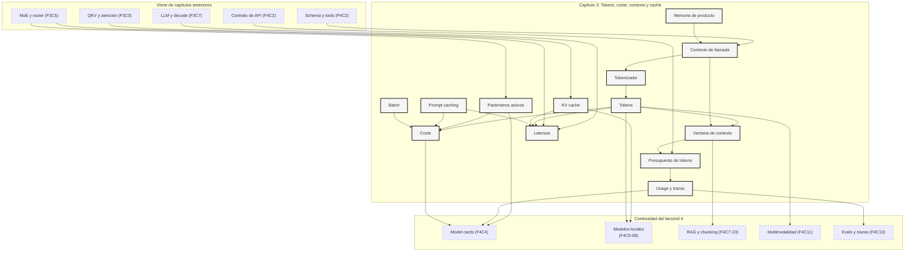

::: {.fasciculo-subtitle}
Facsímil 4 · La caja de herramientas
:::

# Capítulo 03: Tokens, coste, contexto y caché

## El presupuesto invisible de cada pregunta

Cuando una persona escribe “resúmeme este PDF” parece que está enviando una frase. En realidad puede estar enviando miles de tokens: instrucciones, historial, documento, herramientas disponibles, schema de salida y la propia pregunta. La factura no mira si la frase sonaba sencilla. Mira lo que entró, lo que salió, lo que se pudo cachear, el modelo elegido y cómo se sirvió la petición.

Este capítulo continúa el [capítulo 02](/libro/fasciculo-04/#capitulo-02). Allí aprendimos a construir una llamada de API completa. Aquí hacemos la cuenta que decide si esa llamada cabe, cuánto cuesta, cuánto tarda y qué podemos reutilizar.

La idea central es esta: **un sistema con IA no solo se diseña con prompts; se diseña con presupuestos de tokens**.

## Estado del arte con fecha de corte

**Fecha de corte:** 25 de mayo de 2026.  
**Fuentes consultadas ese día:** documentación oficial de OpenAI sobre conteo de tokens, prompt caching, coste, Batch API, latencia y precios; documentación de Anthropic sobre token counting, prompt caching y ventanas de contexto; documentación de Google sobre token counting, long context, context caching y precios de Gemini API; el repositorio oficial de `tiktoken`; y artículos primarios sobre MoE, Switch Transformer, GShard y Mixtral.

Lo estable es el mecanismo: los modelos procesan tokens, la ventana de contexto es finita, la entrada y la salida se cobran de forma distinta, el streaming mejora la espera percibida, el batch puede abaratar trabajos diferidos y la caché solo ayuda cuando repites prefijos de forma reconocible.

Lo cambiante son los precios, modelos, nombres de campos, ventanas máximas, umbrales de cache, descuentos y límites. Para que las notas no aparezcan como una ristra de números pegados, las dejamos ordenadas por tema y proveedor:

| Proveedor | Nota que conviene revisar | Por qué importa |
|---|---|---|
| OpenAI | Conteo de tokens.^[OpenAI. (2026). *Counting tokens*. https://developers.openai.com/api/docs/guides/token-counting. Consultado el 25 de mayo de 2026.] | Estimar entrada, salida y compatibilidad de tokenizador. |
| OpenAI | Prompt caching.^[OpenAI. (2026). *Prompt caching*. https://developers.openai.com/api/docs/guides/prompt-caching. Consultado el 25 de mayo de 2026.] | Diseñar prefijos repetibles y medir cache hit. |
| OpenAI | Optimización de coste.^[OpenAI. (2026). *Cost optimization*. https://developers.openai.com/api/docs/guides/cost-optimization. Consultado el 25 de mayo de 2026.] | Separar coste de entrada, salida, cache y modelo. |
| OpenAI | Batch API.^[OpenAI. (2026). *Batch API*. https://developers.openai.com/api/docs/guides/batch. Consultado el 25 de mayo de 2026.] | Pasar trabajos no interactivos a procesamiento diferido. |
| OpenAI | Optimización de latencia.^[OpenAI. (2026). *Latency optimization*. https://developers.openai.com/api/docs/guides/latency-optimization. Consultado el 25 de mayo de 2026.] | Distinguir prefill, decode, streaming y tiempo percibido. |
| Anthropic | Token counting.^[Anthropic. (2026). *Token counting*. https://platform.claude.com/docs/en/build-with-claude/token-counting. Consultado el 25 de mayo de 2026.] | Comparar conteos antes de migrar prompts. |
| Anthropic | Prompt caching.^[Anthropic. (2026). *Prompt caching*. https://platform.claude.com/docs/en/build-with-claude/prompt-caching. Consultado el 25 de mayo de 2026.] | Pensar qué prefijos se reutilizan y durante cuánto tiempo. |
| Anthropic | Context windows.^[Anthropic. (2026). *Context windows*. https://platform.claude.com/docs/en/build-with-claude/context-windows. Consultado el 25 de mayo de 2026.] | Saber qué entra, qué sale y qué se queda fuera. |
| Google | Conteo de tokens.^[Google. (2026). *Token counting*. https://ai.google.dev/gemini-api/docs/tokens. Consultado el 25 de mayo de 2026.] | Medir prompts, archivos y respuestas antes de desplegar. |
| Google | Long context.^[Google. (2026). *Long context*. https://ai.google.dev/gemini-api/docs/long-context. Consultado el 25 de mayo de 2026.] | Evaluar cuándo una ventana larga ayuda y cuándo añade ruido. |
| Google | Context caching.^[Google. (2026). *Context caching*. https://ai.google.dev/gemini-api/docs/caching. Consultado el 25 de mayo de 2026.] | Revisar TTL, prefijos y reutilización de contexto. |
| Google | Pricing de Gemini API.^[Google. (2026). *Gemini Developer API pricing*. https://ai.google.dev/gemini-api/docs/pricing. Consultado el 25 de mayo de 2026.] | Presupuestar con tarifas vigentes. |
| MoE | Capa sparsely-gated MoE.^[Noam Shazeer et al. (2017). *Outrageously Large Neural Networks: The Sparsely-Gated Mixture-of-Experts Layer*. ICLR. https://arxiv.org/abs/1701.06538.] | Entender expertos, router y cómputo condicional. |
| MoE | Switch Transformer.^[William Fedus, Barret Zoph y Noam Shazeer. (2022). *Switch Transformers: Scaling to Trillion Parameter Models with Simple and Efficient Sparsity*. *Journal of Machine Learning Research, 23*(120), 1-39. https://jmlr.org/papers/v23/21-0998.html.] | Ver por qué top-1 simplifica routing, comunicación y entrenamiento. |
| MoE | GShard.^[Dmitry Lepikhin et al. (2021). *GShard: Scaling Giant Models with Conditional Computation and Automatic Sharding*. ICLR. https://arxiv.org/abs/2006.16668.] | Conectar MoE con sharding y entrenamiento distribuido. |
| MoE | Mixtral of Experts.^[Albert Q. Jiang et al. (2024). *Mixtral of Experts*. https://arxiv.org/abs/2401.04088.] | Ver un LLM sparse MoE moderno con routing top-2 por token. |

## Qué no es un token

Un token no es una palabra. “Universidad” puede ocupar un token o varios, según el tokenizer. Un emoji puede ocupar más de uno. Un espacio, una coma o una tilde pueden cambiar la cuenta. Por eso contar palabras en un documento no sirve para estimar coste con precisión.

Tampoco es una unidad humana de significado. Para el modelo, un token es una pieza de codificación aprendida para representar texto de forma eficiente. A veces coincide con algo que reconocemos; a veces es una sílaba, una terminación, un símbolo o un fragmento raro.

Y no es igual en todos los modelos. Cada familia puede usar tokenizer, reglas multimodales y contabilidad distinta. OpenAI mantiene `tiktoken` como tokenizador rápido para sus modelos, pero eso no implica que el mismo conteo valga para Claude, Gemini o un modelo local.^[OpenAI. (2026). *tiktoken*. https://github.com/openai/tiktoken. Consultado el 25 de mayo de 2026.]

## Cómo se construye un tokenizador

Un tokenizador, o constructor de tokens, no es una lista escrita a mano con todas las palabras posibles. Es una pieza entrenada sobre un corpus: mira mucho texto, aprende piezas frecuentes y produce una tabla estable de `texto -> id`. El modelo se entrena después con esos ids. Por eso no puedes cambiar el tokenizador de un modelo ya entrenado como quien cambia una fuente tipográfica: cambiarías el idioma interno con el que ese modelo aprendió.

La familia más intuitiva para empezar es BPE, Byte Pair Encoding. En NLP moderno se popularizó para manejar palabras raras y vocabularios abiertos en traducción neuronal.^[Rico Sennrich, Barry Haddow y Alexandra Birch. (2016). *Neural Machine Translation of Rare Words with Subword Units*. ACL. https://aclanthology.org/P16-1162/.] La idea es sencilla: empezar con unidades pequeñas y fusionar pares frecuentes hasta construir piezas útiles.

El paso a paso mental es este:

| Paso | Qué haces | Decisión de ingeniería |
|---|---|---|
| 1 | Reúnes un corpus representativo. | Si entrenas con textos legales, contarán mucho las piezas legales; si entrenas con código, contarán símbolos y nombres técnicos. |
| 2 | Normalizas lo mínimo necesario. | Minúsculas, Unicode, espacios y acentos cambian el vocabulario. No lo improvises. |
| 3 | Partes el texto en unidades pequeñas. | Caracteres, bytes o piezas iniciales. Los tokenizadores modernos suelen preferir variantes robustas a bytes. |
| 4 | Cuentas pares vecinos. | `("c", "a")`, `("a", "s")`, `("s", "a")`, etc. |
| 5 | Fusionas el par más frecuente. | Ese par pasa a ser una pieza nueva del vocabulario. |
| 6 | Repites hasta llegar al tamaño de vocabulario. | 8 000, 32 000, 100 000 o lo que pida el modelo y el dominio. |
| 7 | Guardas vocabulario y reglas de merge. | Es un artefacto versionado, igual que pesos, configuración y model card. |
| 8 | Codificas texto nuevo aplicando esas reglas. | El resultado son ids numéricos que entran al modelo. |

La regla de fusión se puede escribir así:

$$
(u^\*,v^\*)=\arg\max_{(u,v)} \operatorname{freq}(u,v)
$$

| Símbolo | Significado | Ejemplo |
|---|---|---|
| \(u, v\) | Dos piezas vecinas candidatas. | `c` y `a`. |
| \(\operatorname{freq}(u,v)\) | Frecuencia del par en el corpus. | `ca` aparece 28 000 veces. |
| \((u^\*,v^\*)\) | Par ganador que se fusiona. | `c` + `a` pasa a ser `ca`. |
| \(\arg\max\) | Elige el candidato con mayor frecuencia. | No devuelve la frecuencia, devuelve el par. |

SentencePiece añade una idea muy útil para ingeniería multilingüe: puede entrenarse directamente sobre texto crudo y tratar los espacios como parte de la segmentación, en lugar de depender de un preprocesado específico de cada idioma.^[Taku Kudo y John Richardson. (2018). *SentencePiece: A simple and language independent subword tokenizer and detokenizer for Neural Text Processing*. EMNLP. https://aclanthology.org/D18-2012/.] Esto importa porque “separar por espacios” funciona regular en inglés y español, pero se vuelve frágil con japonés, chino, emojis, código, nombres propios y formatos raros.

Detalles que un ingeniero debe tener muy presentes:

| Decisión | Qué rompe si se decide mal |
|---|---|
| Normalización Unicode | Dos textos visualmente iguales pueden tokenizar distinto. |
| Tamaño de vocabulario | Vocabulario pequeño alarga secuencias; vocabulario enorme aumenta tabla y puede memorizar rarezas inútiles. |
| Tratamiento de espacios | Cambia la cuenta de tokens y la reversibilidad del decode. |
| Tokens especiales | `system`, `tool`, separadores, imágenes o fin de texto deben tener ids reservados y documentados. |
| Dominio del corpus | Un tokenizador entrenado en conversación puede ser torpe con código o biomedicina. |
| Versionado | Modelo, tokenizer y plantilla de mensajes forman un paquete; si uno cambia, se revalida todo. |

## Qué sí es: la unidad que paga, cabe y tarda

Un token es la unidad que conecta tres preguntas de ingeniería:

| Pregunta | Qué mide | Por qué importa |
|---|---|---|
| ¿Cabe? | Tokens de entrada más salida esperada frente a ventana de contexto. | Si no cabe, tienes que resumir, trocear, recuperar o rechazar. |
| ¿Cuesta? | Tokens de entrada, salida, cache, batch y modelo. | Dos prompts parecidos pueden tener facturas muy distintas. |
| ¿Tarda? | Tokens procesados en prefill y generados en decode. | Una entrada enorme tarda antes de empezar; una salida larga tarda mientras se genera. |

La llamada que hicimos en el capítulo anterior no estaba completa hasta mirar tokens. `input`, `tools`, `schema`, documentos e imágenes ocupan presupuesto. La respuesta también. Si pides “razona mucho y dame una respuesta larga”, no solo estás pidiendo calidad: estás comprando tokens de salida y tiempo de generación.

## La cuenta mínima: entrada, salida y ventana

La primera fórmula es sencilla:

$$
T_{\text{total}}=T_{\text{entrada}}+T_{\text{salida}}
$$

| Símbolo | Significado | Ejemplo |
|---|---|---|
| \(T_{\text{entrada}}\) | Tokens enviados al modelo. | Instrucciones, historial, PDF, schema y pregunta suman 18 000 tokens. |
| \(T_{\text{salida}}\) | Tokens generados por el modelo. | El resumen y el JSON final ocupan 900 tokens. |
| \(T_{\text{total}}\) | Tokens de la llamada completa. | \(18\,000+900=18\,900\). |

Pero que el total exista no significa que quepa. Cada modelo tiene una ventana de contexto:

$$
T_{\text{entrada}}+T_{\text{salida\_max}} \leq W
$$

| Símbolo | Significado | Ejemplo |
|---|---|---|
| \(T_{\text{salida\_max}}\) | Máximo de salida reservado. | Reservas 1 500 tokens para contestar. |
| \(W\) | Ventana de contexto del modelo elegido. | Un modelo con 32 000 tokens de ventana. |
| \(\leq\) | Restricción de cabida. | \(18\,000+1\,500 \leq 32\,000\). |

El detalle importante: reservar salida también consume ventana. Si llenas toda la ventana con documentos, quizá el modelo no tiene espacio para responder. Por eso el presupuesto de contexto debe decidir cuánto se queda cada pieza.

| Pieza | Qué suele ocupar | Decisión práctica |
|---|---|---|
| Instrucciones | Poco, pero se repite siempre. | Mantenerlas cortas, estables y cacheables. |
| Historial | Crece sin pedir permiso. | Resumir, compactar o guardar solo turnos relevantes. |
| Documentos | Puede dominar toda la llamada. | Usar RAG, citas, páginas o troceo. |
| Tools y schemas | No parecen contenido, pero cuentan. | Versionar y no inflar campos innecesarios. |
| Salida | Se paga y tarda. | Limitar `max_output_tokens` con criterio. |

## Coste: la factura no mira la dificultad, mira el uso

Los proveedores suelen separar precio de entrada y precio de salida. Algunos añaden categorías para cache writes, cache reads, batch, prioridad, procesamiento flexible, audio, imagen o razonamiento. Por eso la fórmula útil no es “precio por pregunta”, sino “precio por componentes”.

**Ejemplo de fórmula.** Una forma general de estimarlo es:

$$
C=\frac{T_iP_i+T_oP_o+T_{cr}P_{cr}+T_{cw}P_{cw}}{1\,000\,000}
$$

| Símbolo | Significado | Ejemplo |
|---|---|---|
| \(C\) | Coste estimado de la llamada. | 0,0068 euros o dólares, según tarifa. |
| \(T_i\) | Tokens de entrada frescos. | 8 000 tokens no cacheados. |
| \(P_i\) | Precio por millón de tokens de entrada. | 2,00 por millón en un ejemplo inventado. |
| \(T_o\) | Tokens de salida. | 700 tokens generados. |
| \(P_o\) | Precio por millón de tokens de salida. | 8,00 por millón en el ejemplo. |
| \(T_{cr}\) | Tokens leídos desde caché. | 12 000 tokens reutilizados. |
| \(P_{cr}\) | Precio por millón de tokens cacheados leídos. | Menor que \(P_i\) si el proveedor descuenta cache read. |
| \(T_{cw}\) | Tokens escritos en caché. | 12 000 tokens de prefijo guardado. |
| \(P_{cw}\) | Precio por millón de cache write. | Puede ser igual, mayor o no aplicar según proveedor. |

No uses los números del ejemplo para presupuestar un producto real. Usa la fórmula y consulta la página oficial de precios el día que diseñes el sistema.^[OpenAI. (2026). *Pricing*. https://developers.openai.com/api/docs/pricing. Consultado el 25 de mayo de 2026.] Lo profesional no es saberse una tarifa de memoria; es guardar en configuración qué modelo, proveedor, fecha y precio estás usando para cada estimación.

## Contexto: meter más no siempre ayuda

La ventana larga es una bendición cuando necesitas leer un expediente grande, comparar documentos o mantener una conversación compleja. Pero más contexto también compra coste, latencia y ruido. Un documento irrelevante dentro del prompt no es gratis: ocupa presupuesto y puede distraer.

**Ejemplo de fórmula.** El presupuesto de contexto puede pensarse así:

$$
W = B_{\text{instrucciones}} + B_{\text{historial}} + B_{\text{documentos}} + B_{\text{tools}} + B_{\text{salida}}
$$

| Símbolo | Significado | Ejemplo |
|---|---|---|
| \(B_{\text{instrucciones}}\) | Presupuesto reservado a reglas estables. | 600 tokens. |
| \(B_{\text{historial}}\) | Presupuesto de conversación previa. | 2 000 tokens. |
| \(B_{\text{documentos}}\) | Presupuesto para evidencia externa. | 20 000 tokens. |
| \(B_{\text{tools}}\) | Presupuesto para definiciones de herramientas y schemas. | 1 400 tokens. |
| \(B_{\text{salida}}\) | Presupuesto reservado para responder. | 1 500 tokens. |

El error típico es decidir el contexto al final. En realidad conviene decidirlo antes de llamar a la API: “para esta tarea, el modelo puede ver tres fragmentos, no veinte; debe citar página; y si no cabe, se resume o se pregunta de nuevo”.

## Contexto, memoria y KV cache no son lo mismo

En producto solemos llamar “contexto” a todo lo que acompaña a la pregunta: instrucciones del sistema, mensajes anteriores, documentos recuperados, resultados de herramientas, imágenes, tablas, preferencias del usuario y formato esperado. Para el modelo, eso no llega como recuerdos. Llega como una secuencia de ids de token en una llamada concreta.

El recorrido real es más técnico:

| Etapa | Qué ocurre | Qué queda guardado |
|---|---|---|
| Texto a tokens | El tokenizador convierte texto y partes estructuradas en ids. | La lista de ids de entrada. |
| Tokens a vectores | Cada id se convierte en embedding y se combina con información de posición. | Tensores de entrada para el transformer. |
| Atención | Cada capa calcula consultas, claves y valores: \(Q\), \(K\), \(V\). | Activaciones temporales de la llamada. |
| Prefill | El servidor procesa todo el prefijo de entrada. | Claves y valores listos para generar. |
| Decode | El modelo genera un token, lo añade a la secuencia y repite. | La KV cache crece token a token. |
| Fin de llamada | Se devuelve texto, JSON o eventos de streaming. | Nada queda en los pesos del modelo por defecto. |

La atención original del transformer compara cada consulta con claves y usa valores para mezclar información relevante.^[Ashish Vaswani et al. (2017). *Attention Is All You Need*. NeurIPS. https://papers.nips.cc/paper/7181-attention-is-all-you-need.] En inferencia autoregresiva, no queremos recalcular las claves y valores de todos los tokens anteriores cada vez que generamos uno nuevo. Por eso los servidores guardan una KV cache temporal.

La fórmula conceptual de atención es:

$$
\operatorname{Attention}(Q,K,V)=\operatorname{softmax}\left(\frac{QK^\top}{\sqrt{d_k}}\right)V
$$

| Símbolo | Qué significa | Intuición |
|---|---|---|
| \(Q\) | Queries o consultas. | Qué está buscando el token actual. |
| \(K\) | Keys o claves. | Qué ofrece cada token anterior para ser encontrado. |
| \(V\) | Values o valores. | Información que se mezcla si la atención la considera útil. |
| \(d_k\) | Dimensión de las claves. | Factor de escala para estabilizar el producto. |

La KV cache guarda \(K\) y \(V\) ya calculados. No es memoria del usuario. Es memoria de cálculo durante la inferencia. Si una conversación tiene 20 000 tokens de entrada y genera 800 tokens de salida, el servidor va manteniendo claves y valores para evitar rehacer todo el prefijo en cada paso.

**Ejemplo de fórmula.** Una aproximación de memoria para KV cache es:

$$
M_{\text{KV}}\approx 2 \cdot L \cdot B \cdot S \cdot H_{\text{kv}} \cdot d_{\text{head}} \cdot \text{bytes}
$$

| Símbolo | Significado | Qué mueve en la práctica |
|---|---|---|
| \(2\) | Guardamos claves y valores. | K y V, no solo una matriz. |
| \(L\) | Número de capas. | Modelos más profundos consumen más cache. |
| \(B\) | Batch o secuencias simultáneas. | Más usuarios concurrentes, más memoria. |
| \(S\) | Longitud de secuencia. | Contexto largo y salida larga hacen crecer la cache. |
| \(H_{\text{kv}}\) | Cabezas KV. | MQA/GQA reducen cabezas KV frente a atención multi-head clásica.^[Joshua Ainslie et al. (2023). *GQA: Training Generalized Multi-Query Transformer Models from Multi-Head Checkpoints*. EMNLP. https://arxiv.org/abs/2305.13245.] |
| \(d_{\text{head}}\) | Dimensión por cabeza. | Depende de arquitectura. |
| \(\text{bytes}\) | Precisión usada. | FP16, BF16, INT8 o variantes cuantizadas cambian memoria. |

Esta fórmula explica por qué el contexto largo no es solo “más texto”. Es memoria de GPU, planificación de batch, colas y throughput. Sistemas como vLLM investigan precisamente cómo gestionar esa memoria de KV cache con menos desperdicio mediante PagedAttention.^[Woosuk Kwon et al. (2023). *Efficient Memory Management for Large Language Model Serving with PagedAttention*. SOSP. https://arxiv.org/abs/2309.06180.]

Ahora sí podemos separar conceptos que a menudo se mezclan:

| Concepto | Vive dónde | Dura cuánto | Lo controla quién | Para qué sirve |
|---|---|---|---|---|
| Contexto de llamada | En el payload enviado al modelo. | Una petición. | Tu aplicación. | Dar instrucciones, evidencia y formato de salida. |
| Historial | En tu base de datos o en el cliente. | Hasta que lo borres o resumas. | Tu producto. | Reconstruir conversación útil. |
| Memoria de producto | En una base de datos, perfil, resumen o vector store. | Persistente o con política de expiración. | Tu producto y sus permisos. | Recordar preferencias o hechos útiles entre sesiones. |
| KV cache | En memoria del servidor de inferencia. | Durante una secuencia o sesión gestionada por el runtime. | El proveedor o tu servidor local. | Acelerar decode y evitar recomputar prefijos. |
| Prompt cache | En la infraestructura del proveedor o runtime. | Según reglas, TTL y coincidencia de prefijo. | Proveedor más diseño de prompt. | Reutilizar trabajo de prefijos repetidos entre llamadas. |

La frase correcta sería: “nuestro producto recuerda algo porque lo guardamos y lo volvemos a meter en el contexto”. El modelo base no actualiza sus pesos por leer un mensaje de un usuario. Para que “recuerde” en otra llamada, alguien tiene que almacenar, recuperar, filtrar y reinyectar esa información.

## Un MoE capa a capa dentro de este proceso

Ahora metamos una arquitectura MoE en la misma película. No cambia la idea básica de este capítulo: entran tokens, se procesan dentro de una ventana, se genera salida y se mide coste/latencia. Lo que cambia está dentro de algunas capas del Transformer: en lugar de que todos los tokens pasen por el mismo MLP denso, un router aprende a mandar cada token a uno o varios expertos.

En un bloque Transformer denso simplificado suele pasar esto:

$$
u_t^{(\ell)}=h_t^{(\ell)}+\operatorname{Attention}^{(\ell)}(\operatorname{LN}(h_t^{(\ell)}))
$$

$$
h_t^{(\ell+1)}=u_t^{(\ell)}+\operatorname{MLP}^{(\ell)}(\operatorname{LN}(u_t^{(\ell)}))
$$

| Símbolo | Significado | Ejemplo |
|---|---|---|
| \(h_t^{(\ell)}\) | Estado del token \(t\) al entrar en la capa \(\ell\). | Vector del token “cache” en la capa 12. |
| \(\operatorname{Attention}\) | Parte que mezcla información del contexto mediante \(Q\), \(K\) y \(V\). | Lee tokens anteriores y usa la KV cache. |
| \(\operatorname{MLP}\) | Red feed-forward densa del bloque. | La misma red para todos los tokens de esa capa. |
| \(\operatorname{LN}\) | LayerNorm. | Normaliza antes de atención o MLP. |
| \(u_t^{(\ell)}\) | Estado tras atención y residual. | El token ya trae información del contexto. |

En un MoE, la parte que se suele sustituir es el MLP. La atención sigue mezclando contexto; después entra el router:

$$
s_t^{(\ell)}=W_r^{(\ell)}\operatorname{LN}(u_t^{(\ell)})
$$

$$
p_t^{(\ell)}=\operatorname{softmax}(s_t^{(\ell)})
$$

$$
C_t^{(\ell)}=\operatorname{TopK}(p_t^{(\ell)}, k)
$$

$$
\operatorname{MoE}^{(\ell)}(u_t)=\sum_{i \in C_t^{(\ell)}}\alpha_i E_i^{(\ell)}(\operatorname{LN}(u_t^{(\ell)}))
$$

$$
h_t^{(\ell+1)}=u_t^{(\ell)}+\operatorname{MoE}^{(\ell)}(u_t)
$$

| Símbolo | Significado | Ejemplo |
|---|---|---|
| \(W_r^{(\ell)}\) | Matriz aprendida del router en la capa \(\ell\). | Produce una puntuación por experto. |
| \(s_t^{(\ell)}\) | Logits del router para el token \(t\). | Ocho puntuaciones si hay ocho expertos. |
| \(p_t^{(\ell)}\) | Probabilidades de routing tras softmax. | `[0.02, 0.61, 0.04, 0.21, ...]`. |
| \(k\) | Número de expertos activados por token. | Switch usa top-1; Mixtral usa top-2. |
| \(C_t^{(\ell)}\) | Conjunto de expertos elegidos para ese token y esa capa. | Expertos 2 y 4 en la capa 18. |
| \(E_i^{(\ell)}\) | Experto \(i\), normalmente una red feed-forward. | Un MLP independiente dentro de la capa. |
| \(\alpha_i\) | Peso normalizado con el que se combina cada experto seleccionado. | Si top-2, cada experto aporta una parte. |

La película layer a layer queda así:

| Paso | Qué le pasa al token | Qué importa para coste, contexto y caché |
|---|---|---|
| 1 | El texto ya fue tokenizado y convertido en embeddings. | El MoE no cambia el conteo de tokens de entrada. |
| 2 | El token entra en la capa \(\ell\) con un vector \(h_t^{(\ell)}\). | La secuencia sigue teniendo longitud \(S\). |
| 3 | La atención calcula \(Q\), \(K\), \(V\) y mezcla contexto. | La KV cache sigue siendo de atención, no de “memoria del experto”. |
| 4 | El resultado pasa por residual y normalización. | El token ya trae información de tokens anteriores. |
| 5 | El router calcula puntuaciones para expertos. | Aparece cómputo extra pequeño: routing. |
| 6 | Se eligen \(k\) expertos. | Cambian los parámetros activos por token. |
| 7 | El runtime agrupa tokens por experto. | En GPU distribuida puede haber comunicación entre dispositivos. |
| 8 | Cada experto procesa los tokens que le tocaron. | No se ejecutan todos los expertos para cada token. |
| 9 | Se combinan las salidas de los expertos elegidos. | En top-2 hay mezcla; en top-1 se simplifica. |
| 10 | Se suma residual y el token pasa a la siguiente capa. | En la capa siguiente puede elegir expertos distintos. |

Visualmente, una capa MoE se entiende mejor si la dibujamos como una cinta de procesamiento: el token pasa por atención, el router decide, solo algunos expertos trabajan y sus salidas se recombinan.

<svg id="f4-c03-moe-layer-routing" xmlns="http://www.w3.org/2000/svg" viewBox="0 0 1200 900" role="img" aria-label="Recorrido capa a capa de un token en una capa Mixture of Experts">
  <title>Recorrido de un token en una capa MoE</title>
  <defs>
    <marker id="f4c03-moe-arrow" viewBox="0 0 10 10" refX="9" refY="5" markerWidth="7" markerHeight="7" orient="auto">
      <path d="M 0 0 L 10 5 L 0 10 z" fill="#111111"/>
    </marker>
    <marker id="f4c03-moe-arrow-soft" viewBox="0 0 10 10" refX="9" refY="5" markerWidth="7" markerHeight="7" orient="auto">
      <path d="M 0 0 L 10 5 L 0 10 z" fill="#777777"/>
    </marker>
  </defs>

  <rect x="24" y="24" width="1152" height="820" rx="18" fill="#FFFFFF" stroke="#111111" stroke-width="1.4"/>
  <text x="600" y="62" text-anchor="middle" font-family="Arial, sans-serif" font-size="25" font-weight="700" fill="#111111">Una capa MoE vista token a token</text>
  <text x="600" y="88" text-anchor="middle" font-family="Arial, sans-serif" font-size="13" fill="#666666">La atención mezcla contexto; el router decide expertos; solo una parte de los parámetros se activa.</text>
  <line x1="64" y1="116" x2="1136" y2="116" stroke="#111111" stroke-width="1"/>

  <rect x="58" y="158" width="150" height="118" rx="14" fill="#F7F7F7" stroke="#111111" stroke-width="1.3"/>
  <text x="133" y="188" text-anchor="middle" font-family="Arial, sans-serif" font-size="14" font-weight="700" fill="#111111">Token t</text>
  <text x="133" y="216" text-anchor="middle" font-family="Arial, sans-serif" font-size="12" fill="#444444">entra en capa l</text>
  <text x="133" y="244" text-anchor="middle" font-family="Arial, sans-serif" font-size="18" font-weight="700" fill="#111111">hₜˡ</text>

  <rect x="270" y="146" width="210" height="142" rx="14" fill="#FFFFFF" stroke="#111111" stroke-width="1.3"/>
  <text x="375" y="178" text-anchor="middle" font-family="Arial, sans-serif" font-size="14" font-weight="700" fill="#111111">Atención causal</text>
  <text x="375" y="205" text-anchor="middle" font-family="Arial, sans-serif" font-size="12" fill="#444444">Q · K · V</text>
  <rect x="304" y="226" width="142" height="34" rx="8" fill="#F7F7F7" stroke="#111111" stroke-width="1"/>
  <text x="375" y="248" text-anchor="middle" font-family="Arial, sans-serif" font-size="11" fill="#111111">usa KV cache</text>
  <text x="375" y="276" text-anchor="middle" font-family="Arial, sans-serif" font-size="10" fill="#777777">lee contexto previo</text>

  <rect x="542" y="146" width="180" height="142" rx="14" fill="#FFFFFF" stroke="#111111" stroke-width="1.3"/>
  <text x="632" y="178" text-anchor="middle" font-family="Arial, sans-serif" font-size="14" font-weight="700" fill="#111111">Residual + LN</text>
  <text x="632" y="211" text-anchor="middle" font-family="Arial, sans-serif" font-size="12" fill="#444444">prepara el vector</text>
  <text x="632" y="239" text-anchor="middle" font-family="Arial, sans-serif" font-size="18" font-weight="700" fill="#111111">uₜˡ</text>
  <text x="632" y="272" text-anchor="middle" font-family="Arial, sans-serif" font-size="10" fill="#777777">sin cambiar tokens</text>

  <rect x="786" y="146" width="286" height="142" rx="14" fill="#F7F7F7" stroke="#111111" stroke-width="1.3"/>
  <text x="929" y="176" text-anchor="middle" font-family="Arial, sans-serif" font-size="14" font-weight="700" fill="#111111">Router MoE</text>
  <text x="929" y="201" text-anchor="middle" font-family="Arial, sans-serif" font-size="11" fill="#444444">scores para 8 expertos</text>
  <line x1="844" y1="250" x2="1016" y2="250" stroke="#111111" stroke-width="1"/>
  <rect x="850" y="228" width="14" height="22" fill="#DDDDDD" stroke="#111111" stroke-width="0.8"/>
  <rect x="875" y="204" width="14" height="46" fill="#111111"/>
  <rect x="900" y="232" width="14" height="18" fill="#DDDDDD" stroke="#111111" stroke-width="0.8"/>
  <rect x="925" y="218" width="14" height="32" fill="#DDDDDD" stroke="#111111" stroke-width="0.8"/>
  <rect x="950" y="236" width="14" height="14" fill="#DDDDDD" stroke="#111111" stroke-width="0.8"/>
  <rect x="975" y="208" width="14" height="42" fill="#111111"/>
  <rect x="1000" y="238" width="14" height="12" fill="#DDDDDD" stroke="#111111" stroke-width="0.8"/>
  <text x="929" y="273" text-anchor="middle" font-family="Arial, sans-serif" font-size="10" fill="#666666">top-k: E2 y E6</text>

  <line x1="208" y1="217" x2="266" y2="217" stroke="#111111" stroke-width="1.4" marker-end="url(#f4c03-moe-arrow)"/>
  <line x1="480" y1="217" x2="538" y2="217" stroke="#111111" stroke-width="1.4" marker-end="url(#f4c03-moe-arrow)"/>
  <line x1="722" y1="217" x2="782" y2="217" stroke="#111111" stroke-width="1.4" marker-end="url(#f4c03-moe-arrow)"/>

  <rect x="404" y="342" width="392" height="74" rx="14" fill="#FFFFFF" stroke="#111111" stroke-width="1.2"/>
  <text x="600" y="372" text-anchor="middle" font-family="Arial, sans-serif" font-size="14" font-weight="700" fill="#111111">Dispatch</text>
  <text x="600" y="396" text-anchor="middle" font-family="Arial, sans-serif" font-size="11" fill="#555555">agrupa tokens por experto seleccionado; los demás expertos no se ejecutan para este token</text>
  <path d="M929 288 C929 330, 760 330, 730 342" fill="none" stroke="#111111" stroke-width="1.3" marker-end="url(#f4c03-moe-arrow)"/>

  <rect x="68" y="474" width="760" height="228" rx="16" fill="#FFFFFF" stroke="#111111" stroke-width="1.3"/>
  <text x="448" y="506" text-anchor="middle" font-family="Arial, sans-serif" font-size="15" font-weight="700" fill="#111111">Banco de expertos de la capa l</text>
  <text x="448" y="528" text-anchor="middle" font-family="Arial, sans-serif" font-size="11" fill="#666666">muchos parámetros almacenados; pocos parámetros activos por token</text>

  <rect x="100" y="556" width="150" height="56" rx="10" fill="#F7F7F7" stroke="#999999" stroke-width="1"/>
  <text x="175" y="579" text-anchor="middle" font-family="Arial, sans-serif" font-size="12" fill="#777777">E1 inactivo</text>
  <text x="175" y="598" text-anchor="middle" font-family="Arial, sans-serif" font-size="10" fill="#888888">MLP</text>

  <rect x="276" y="548" width="150" height="72" rx="10" fill="#111111" stroke="#111111" stroke-width="1"/>
  <text x="351" y="575" text-anchor="middle" font-family="Arial, sans-serif" font-size="13" font-weight="700" fill="#FFFFFF">E2 activo</text>
  <text x="351" y="597" text-anchor="middle" font-family="Arial, sans-serif" font-size="10" fill="#DDDDDD">procesa hₜ</text>

  <rect x="452" y="556" width="150" height="56" rx="10" fill="#F7F7F7" stroke="#999999" stroke-width="1"/>
  <text x="527" y="579" text-anchor="middle" font-family="Arial, sans-serif" font-size="12" fill="#777777">E3 inactivo</text>
  <text x="527" y="598" text-anchor="middle" font-family="Arial, sans-serif" font-size="10" fill="#888888">MLP</text>

  <rect x="628" y="556" width="150" height="56" rx="10" fill="#F7F7F7" stroke="#999999" stroke-width="1"/>
  <text x="703" y="579" text-anchor="middle" font-family="Arial, sans-serif" font-size="12" fill="#777777">E4 inactivo</text>
  <text x="703" y="598" text-anchor="middle" font-family="Arial, sans-serif" font-size="10" fill="#888888">MLP</text>

  <rect x="100" y="634" width="150" height="56" rx="10" fill="#F7F7F7" stroke="#999999" stroke-width="1"/>
  <text x="175" y="657" text-anchor="middle" font-family="Arial, sans-serif" font-size="12" fill="#777777">E5 inactivo</text>
  <text x="175" y="676" text-anchor="middle" font-family="Arial, sans-serif" font-size="10" fill="#888888">MLP</text>

  <rect x="276" y="626" width="150" height="72" rx="10" fill="#111111" stroke="#111111" stroke-width="1"/>
  <text x="351" y="653" text-anchor="middle" font-family="Arial, sans-serif" font-size="13" font-weight="700" fill="#FFFFFF">E6 activo</text>
  <text x="351" y="675" text-anchor="middle" font-family="Arial, sans-serif" font-size="10" fill="#DDDDDD">procesa hₜ</text>

  <rect x="452" y="634" width="150" height="56" rx="10" fill="#F7F7F7" stroke="#999999" stroke-width="1"/>
  <text x="527" y="657" text-anchor="middle" font-family="Arial, sans-serif" font-size="12" fill="#777777">E7 inactivo</text>
  <text x="527" y="676" text-anchor="middle" font-family="Arial, sans-serif" font-size="10" fill="#888888">MLP</text>

  <rect x="628" y="634" width="150" height="56" rx="10" fill="#F7F7F7" stroke="#999999" stroke-width="1"/>
  <text x="703" y="657" text-anchor="middle" font-family="Arial, sans-serif" font-size="12" fill="#777777">E8 inactivo</text>
  <text x="703" y="676" text-anchor="middle" font-family="Arial, sans-serif" font-size="10" fill="#888888">MLP</text>

  <path d="M544 416 C500 468, 390 494, 351 548" fill="none" stroke="#111111" stroke-width="1.25" marker-end="url(#f4c03-moe-arrow)"/>
  <path d="M656 416 C602 492, 408 548, 351 626" fill="none" stroke="#111111" stroke-width="1.25" marker-end="url(#f4c03-moe-arrow)"/>

  <rect x="904" y="536" width="214" height="126" rx="14" fill="#FFFFFF" stroke="#111111" stroke-width="1.3"/>
  <text x="1011" y="568" text-anchor="middle" font-family="Arial, sans-serif" font-size="14" font-weight="700" fill="#111111">Combinar</text>
  <text x="1011" y="595" text-anchor="middle" font-family="Arial, sans-serif" font-size="11" fill="#444444">α₂E₂(hₜ) + α₆E₆(hₜ)</text>
  <text x="1011" y="621" text-anchor="middle" font-family="Arial, sans-serif" font-size="11" fill="#666666">más residual</text>
  <text x="1011" y="646" text-anchor="middle" font-family="Arial, sans-serif" font-size="10" fill="#777777">sale una sola representación</text>

  <path d="M426 584 C626 584, 782 568, 900 588" fill="none" stroke="#111111" stroke-width="1.25" marker-end="url(#f4c03-moe-arrow)"/>
  <path d="M426 662 C624 678, 782 650, 900 616" fill="none" stroke="#111111" stroke-width="1.25" marker-end="url(#f4c03-moe-arrow)"/>

  <rect x="912" y="716" width="198" height="74" rx="14" fill="#F7F7F7" stroke="#111111" stroke-width="1.3"/>
  <text x="1011" y="744" text-anchor="middle" font-family="Arial, sans-serif" font-size="14" font-weight="700" fill="#111111">Token t</text>
  <text x="1011" y="768" text-anchor="middle" font-family="Arial, sans-serif" font-size="12" fill="#444444">entra en capa l+1</text>
  <path d="M1011 662 L1011 712" fill="none" stroke="#111111" stroke-width="1.25" marker-end="url(#f4c03-moe-arrow)"/>

  <rect x="68" y="738" width="760" height="72" rx="14" fill="#FFFFFF" stroke="#111111" stroke-width="1.1"/>
  <text x="92" y="766" font-family="Arial, sans-serif" font-size="12" font-weight="700" fill="#111111">Lectura correcta</text>
  <text x="92" y="788" font-family="Arial, sans-serif" font-size="10.5" fill="#555555">Tokens y ventana no cambian · la KV cache vive en atención · expertos no guardan memoria de usuario.</text>
  <text x="92" y="804" font-family="Arial, sans-serif" font-size="10.5" fill="#555555">El coste interno depende de top-k, batch, distribución de expertos y comunicación entre dispositivos.</text>

  <text x="1138" y="822" text-anchor="end" font-family="Arial, sans-serif" font-size="10" fill="#9A9A9A">IA para gente curiosa / Facsímil 04 / Capítulo 03 / 686f6c61</text>
</svg>

Esto explica una frase que en fichas técnicas suele confundirse: parámetros totales no son parámetros activos. Un MoE puede tener muchos parámetros almacenados porque tiene muchos expertos, pero cada token usa solo una parte. Mixtral, citado en el bloque de estado del arte, describe capas con ocho bloques feed-forward y selección de dos expertos por token y por capa; el propio artículo distingue entre parámetros accesibles y parámetros activos durante inferencia.

En serving, la parte delicada no es solo matemática. Es logística:

| Problema operativo | Qué ocurre |
|---|---|
| Balanceo de carga | Si demasiados tokens van al mismo experto, ese experto se convierte en cuello de botella. |
| Capacidad por experto | Los runtimes suelen limitar cuántos tokens procesa cada experto por lote. |
| Comunicación | Si los expertos viven en dispositivos distintos, los tokens o activaciones tienen que moverse. |
| Batch irregular | Dos peticiones con los mismos tokens de entrada no tienen por qué activar exactamente la misma distribución de expertos. |
| Métrica de coste | El usuario paga tokens, pero el proveedor opera con parámetros activos, routing, memoria y comunicación. |

Por eso MoE es muy relevante para este capítulo: te obliga a leer “coste por token” con más finura. Desde fuera sigues viendo tokens de entrada, tokens de salida, ventana y precio. Por dentro, cada token atraviesa todas las capas, pero en las capas MoE solo activa una ruta dispersa. El contexto no se “guarda en los expertos”; la memoria temporal de contexto sigue estando en la atención y su KV cache. Los expertos transforman representaciones, no almacenan recuerdos de usuario.

## Caché: repetir bien para pagar y esperar menos

Prompt caching aprovecha un hecho simple: muchas llamadas repiten prefijos. Las instrucciones del sistema, las herramientas, el schema, una normativa larga o un conjunto de ejemplos pueden ser iguales durante muchas peticiones. Si el proveedor reconoce ese prefijo, puede reutilizar trabajo ya hecho.

En las guías citadas al inicio, OpenAI describe caché para mensajes, imágenes, tool use y structured outputs, y recomienda colocar el contenido estático o repetido al principio y lo dinámico al final. Anthropic explica breakpoints explícitos y automáticos, con especial atención al orden `tools`, `system` y `messages` en el prefijo cacheable. Gemini distingue caché implícita y caché explícita con TTL configurable.

Hay dos cachés que se confunden mucho:

| Caché | Qué reutiliza | Cuándo la notas | Qué mirar |
|---|---|---|---|
| KV cache | \(K\) y \(V\) ya calculados dentro de una secuencia. | En decode, porque cada token nuevo no recalcula todo el prefijo. | Memoria, longitud de secuencia, batch, throughput. |
| Prompt cache o context cache | Un prefijo repetido entre llamadas. | En coste, latencia o campos de usage del proveedor. | Orden estable del prompt, TTL, cache hit y contenido dinámico al final. |

El diseño de prompt cache es casi diseño de APIs: si serializas un JSON con claves en orden aleatorio, metes timestamps arriba o cambias ejemplos sin necesidad, rompes coincidencias. Si colocas primero instrucciones, tools, schema y documentos estables, y dejas al final la pregunta concreta del usuario, aumentas la probabilidad de reutilización.

La métrica que queremos mirar es:

$$
H=\frac{T_{\text{cache\_hit}}}{T_{\text{entrada}}}
$$

| Símbolo | Significado | Ejemplo |
|---|---|---|
| \(H\) | Proporción de entrada servida desde caché. | \(0{,}72\), es decir, 72 %. |
| \(T_{\text{cache\_hit}}\) | Tokens de entrada que fueron cache hit. | 14 400 tokens. |
| \(T_{\text{entrada}}\) | Tokens de entrada totales. | 20 000 tokens. |

Para entenderlo: si cada petición incluye una normativa de 15 000 tokens y solo cambia la pregunta final, la caché puede tener sentido. Si cada petición mete documentos distintos, timestamps dentro del prefijo y orden aleatorio de fragmentos, la caché probablemente no ayudará.

## Latencia: prefill, decode y espera percibida

La latencia no es una sola cosa. Hay tiempo de red, cola, prefill, generación y renderizado. En modelos de lenguaje, una intuición útil es separar entrada y salida:

$$
L \approx L_0 + \alpha T_{\text{entrada\_fresca}} + \beta T_{\text{salida}}
$$

| Símbolo | Significado | Ejemplo |
|---|---|---|
| \(L\) | Latencia total aproximada. | 4,8 segundos. |
| \(L_0\) | Coste fijo de red, cola y preparación. | 350 ms. |
| \(\alpha\) | Coste medio por token de entrada fresca. | Depende de modelo y hardware. |
| \(T_{\text{entrada\_fresca}}\) | Entrada no cubierta por caché. | 3 000 tokens. |
| \(\beta\) | Coste medio por token generado. | Depende de decode. |
| \(T_{\text{salida}}\) | Tokens generados. | 900 tokens. |

El streaming no reduce necesariamente el tiempo total, pero reduce el tiempo hasta ver el primer fragmento. Batch puede reducir coste o mejorar operación cuando no necesitas respuesta inmediata. La caché puede reducir prefill si el prefijo se reutiliza. Elegir un modelo menor puede reducir coste y latencia, pero quizá empeora calidad. Todo vuelve al triángulo: calidad, coste y tiempo.

## Para entenderlo antes de tocar código

Pensemos en cuatro casos cercanos:

| Caso | Qué pesa | Qué haría |
|---|---|---|
| Tutor que corrige respuestas cortas | Salida estructurada y muchas llamadas. | Modelo menor, schema corto, batch si no es interactivo. |
| Asistente de normativa universitaria | Documento largo repetido. | Prefijo estable, cache, RAG si la normativa es grande. |
| Chat de soporte con historial largo | Historial que crece cada turno. | Compactar, resumir y guardar solo lo útil. |
| Analizador de facturas con imágenes | Imagen, OCR, schema y salida JSON. | Medir tokens/latencia multimodal y limitar campos. |
| Copiloto interno con preferencias | Memoria de producto y contexto recuperado. | Guardar preferencias fuera del modelo y reinyectar solo las relevantes. |
| Servicio con muchas sesiones simultáneas | KV cache, batch y cola. | Vigilar memoria de inferencia, longitud media y tokens por segundo. |
| Modelo MoE en producción | Routing, expertos y parámetros activos. | Medir latencia real; no comparar solo parámetros totales. |

La pregunta útil no es “¿cuántos tokens acepta el modelo más grande?”. La pregunta útil es “¿cuántos tokens necesita esta tarea para dar una respuesta fiable sin pagar ruido?”.

## Mapa visual de presupuesto de tokens

<svg id="f4-c03-presupuesto-tokens" xmlns="http://www.w3.org/2000/svg" viewBox="0 0 1160 820" role="img" aria-label="Mapa visual de tokens, coste, contexto y caché">
  <title>Presupuesto de tokens, coste, contexto y caché</title>
  <defs>
    <marker id="f4c03-arrow" viewBox="0 0 10 10" refX="9" refY="5" markerWidth="7" markerHeight="7" orient="auto">
      <path d="M 0 0 L 10 5 L 0 10 z" fill="#222222"/>
    </marker>
    <pattern id="f4c03-hatch" patternUnits="userSpaceOnUse" width="8" height="8" patternTransform="rotate(45)">
      <line x1="0" y1="0" x2="0" y2="8" stroke="#D8D8D8" stroke-width="2"/>
    </pattern>
  </defs>
  <rect x="22" y="22" width="1116" height="760" rx="18" fill="#FFFFFF" stroke="#111111" stroke-width="1.4"/>
  <text x="580" y="62" text-anchor="middle" font-family="Arial, sans-serif" font-size="25" font-weight="700" fill="#111111">Una llamada empieza con un presupuesto</text>
  <text x="580" y="88" text-anchor="middle" font-family="Arial, sans-serif" font-size="13" fill="#666666">Entrada, salida, ventana, cache, coste y latencia se deciden juntos.</text>
  <line x1="62" y1="116" x2="1098" y2="116" stroke="#111111" stroke-width="1"/>

  <rect x="80" y="156" width="310" height="180" rx="14" fill="#FFFFFF" stroke="#111111" stroke-width="1.3"/>
  <text x="235" y="188" text-anchor="middle" font-family="Arial, sans-serif" font-size="15" font-weight="700" fill="#111111">Entrada</text>
  <rect x="110" y="212" width="58" height="70" rx="8" fill="#111111"/>
  <text x="139" y="250" text-anchor="middle" font-family="Arial, sans-serif" font-size="10" fill="#FFFFFF">instr.</text>
  <rect x="178" y="212" width="70" height="70" rx="8" fill="#F7F7F7" stroke="#111111" stroke-width="1"/>
  <text x="213" y="250" text-anchor="middle" font-family="Arial, sans-serif" font-size="10" fill="#111111">historial</text>
  <rect x="258" y="212" width="92" height="70" rx="8" fill="url(#f4c03-hatch)" stroke="#111111" stroke-width="1"/>
  <text x="304" y="250" text-anchor="middle" font-family="Arial, sans-serif" font-size="10" fill="#111111">docs</text>
  <text x="235" y="312" text-anchor="middle" font-family="Arial, sans-serif" font-size="11" fill="#555555">tokens que se procesan antes de responder</text>

  <rect x="476" y="156" width="210" height="180" rx="14" fill="#111111"/>
  <text x="581" y="190" text-anchor="middle" font-family="Arial, sans-serif" font-size="15" font-weight="700" fill="#FFFFFF">Ventana</text>
  <text x="581" y="228" text-anchor="middle" font-family="Arial, sans-serif" font-size="13" fill="#DDDDDD">entrada + salida</text>
  <text x="581" y="254" text-anchor="middle" font-family="Arial, sans-serif" font-size="13" fill="#DDDDDD">deben caber</text>
  <text x="581" y="292" text-anchor="middle" font-family="Arial, sans-serif" font-size="18" font-weight="700" fill="#FFFFFF">≤ W</text>

  <rect x="770" y="156" width="310" height="180" rx="14" fill="#FFFFFF" stroke="#111111" stroke-width="1.3"/>
  <text x="925" y="188" text-anchor="middle" font-family="Arial, sans-serif" font-size="15" font-weight="700" fill="#111111">Salida</text>
  <rect x="832" y="220" width="186" height="52" rx="8" fill="#F7F7F7" stroke="#111111" stroke-width="1"/>
  <text x="925" y="252" text-anchor="middle" font-family="Arial, sans-serif" font-size="12" fill="#111111">texto · JSON · tool result</text>
  <text x="925" y="312" text-anchor="middle" font-family="Arial, sans-serif" font-size="11" fill="#555555">tokens generados uno a uno</text>

  <line x1="390" y1="246" x2="472" y2="246" stroke="#222222" stroke-width="1.5" marker-end="url(#f4c03-arrow)"/>
  <line x1="686" y1="246" x2="766" y2="246" stroke="#222222" stroke-width="1.5" marker-end="url(#f4c03-arrow)"/>

  <rect x="94" y="442" width="220" height="120" rx="14" fill="#FFFFFF" stroke="#111111" stroke-width="1.2"/>
  <text x="204" y="474" text-anchor="middle" font-family="Arial, sans-serif" font-size="14" font-weight="700" fill="#111111">Coste</text>
  <text x="204" y="506" text-anchor="middle" font-family="Arial, sans-serif" font-size="11" fill="#555555">entrada · salida</text>
  <text x="204" y="526" text-anchor="middle" font-family="Arial, sans-serif" font-size="11" fill="#555555">cache · batch</text>

  <rect x="360" y="442" width="220" height="120" rx="14" fill="#F7F7F7" stroke="#111111" stroke-width="1.2"/>
  <text x="470" y="474" text-anchor="middle" font-family="Arial, sans-serif" font-size="14" font-weight="700" fill="#111111">Caché</text>
  <text x="470" y="506" text-anchor="middle" font-family="Arial, sans-serif" font-size="11" fill="#555555">prefijo estable</text>
  <text x="470" y="526" text-anchor="middle" font-family="Arial, sans-serif" font-size="11" fill="#555555">pregunta dinámica al final</text>

  <rect x="626" y="442" width="220" height="120" rx="14" fill="#FFFFFF" stroke="#111111" stroke-width="1.2"/>
  <text x="736" y="474" text-anchor="middle" font-family="Arial, sans-serif" font-size="14" font-weight="700" fill="#111111">Latencia</text>
  <text x="736" y="506" text-anchor="middle" font-family="Arial, sans-serif" font-size="11" fill="#555555">prefill</text>
  <text x="736" y="526" text-anchor="middle" font-family="Arial, sans-serif" font-size="11" fill="#555555">decode</text>

  <rect x="892" y="442" width="174" height="120" rx="14" fill="#111111"/>
  <text x="979" y="474" text-anchor="middle" font-family="Arial, sans-serif" font-size="14" font-weight="700" fill="#FFFFFF">Decisión</text>
  <text x="979" y="506" text-anchor="middle" font-family="Arial, sans-serif" font-size="11" fill="#DDDDDD">modelo</text>
  <text x="979" y="526" text-anchor="middle" font-family="Arial, sans-serif" font-size="11" fill="#DDDDDD">RAG · batch · cache</text>

  <path d="M581 336 C581 394, 204 394, 204 438" fill="none" stroke="#777777" stroke-width="1.1" stroke-dasharray="7 5" marker-end="url(#f4c03-arrow)"/>
  <path d="M581 336 C581 394, 470 394, 470 438" fill="none" stroke="#777777" stroke-width="1.1" stroke-dasharray="7 5" marker-end="url(#f4c03-arrow)"/>
  <path d="M581 336 C581 394, 736 394, 736 438" fill="none" stroke="#777777" stroke-width="1.1" stroke-dasharray="7 5" marker-end="url(#f4c03-arrow)"/>
  <path d="M736 562 C736 612, 979 612, 979 566" fill="none" stroke="#777777" stroke-width="1.1" stroke-dasharray="7 5" marker-end="url(#f4c03-arrow)"/>
  <path d="M470 562 C470 612, 204 612, 204 566" fill="none" stroke="#777777" stroke-width="1.1" stroke-dasharray="7 5" marker-end="url(#f4c03-arrow)"/>

  <rect x="176" y="660" width="808" height="62" rx="14" fill="#FFFFFF" stroke="#111111" stroke-width="1.3"/>
  <text x="580" y="686" text-anchor="middle" font-family="Arial, sans-serif" font-size="14" font-weight="700" fill="#111111">Regla final</text>
  <text x="580" y="708" text-anchor="middle" font-family="Arial, sans-serif" font-size="12" fill="#555555">No optimices el prompt aislado: optimiza la llamada completa y mide cache hit, coste, salida y latencia.</text>
  <text x="1100" y="760" text-anchor="end" font-family="Arial, sans-serif" font-size="10" fill="#9A9A9A">IA para gente curiosa / Facsímil 04 / Capítulo 03 / 686f6c61</text>
</svg>

## En el día a día

En un proyecto real, este capítulo aparece cuando alguien pregunta: “¿por qué esto cuesta tanto?” o “¿por qué tarda tanto?”. Muchas veces la respuesta no está en cambiar de modelo, sino en mirar el payload completo.

Si cada llamada manda el mismo documento largo, quizá toca cache. Si cada llamada manda veinte fragmentos RAG y solo dos eran relevantes, toca mejorar retrieval. Si el usuario necesita respuesta inmediata, quizá no puedes batchar. Si el proceso es nocturno, batch puede ser perfecto. Si la salida siempre se alarga, limita tokens de salida y cambia el contrato.

Si eliges un modelo MoE, añade una pregunta más: ¿cuántos parámetros son totales y cuántos activos por token? No necesitas ver el router interno para operar una API comercial, pero sí necesitas entender que “47B parámetros” y “13B activos” no significan lo mismo, y que la latencia real dependerá también de routing, expertos, batch y hardware.

Una integración madura registra al menos: tokens de entrada, tokens de salida, tokens cacheados si el proveedor los devuelve, modelo, arquitectura si se conoce, latencia, coste estimado, schema y motivo de selección del modelo. Sin esos datos, optimizar es opinar con cara seria.

## Por qué debería importarte

Porque los tokens convierten decisiones aparentemente literarias en decisiones de producto. “Añadamos más contexto” puede duplicar coste. “Respondamos con más detalle” puede multiplicar salida. “Metamos todos los documentos” puede romper ventana o empeorar la respuesta. “Usemos el modelo grande siempre” puede ser innecesario.

MoE añade otra trampa sana: un modelo puede ser enorme en parámetros totales y, aun así, activar solo una fracción por token. Eso puede mejorar capacidad sin multiplicar igual el cómputo, pero también complica serving, balanceo y lectura de fichas técnicas.

También importa para enseñar y aprender. Cuando entiendes tokens, dejas de pensar en la IA como una caja opaca y empiezas a verla como un sistema con restricciones medibles.

## Dónde volverá a aparecer

Este capítulo será una pieza recurrente del facsímil:

| Concepto | Dónde vuelve | Para qué |
|---|---|---|
| Tokenizadores | [Capítulo 07 del facsímil 3](/libro/fasciculo-03/#capitulo-07). | Entender por qué decode, throughput y límites dependen de tokens, no de palabras. |
| KV cache | [Capítulo 07 del facsímil 3](/libro/fasciculo-03/#capitulo-07). | Relacionar contexto largo con memoria de inferencia y serving. |
| MoE y parámetros activos | [Capítulo 05 del facsímil 3](/libro/fasciculo-03/#capitulo-05). | Leer arquitectura, expertos y routing sin confundirlos con memoria o herramientas. |
| Model cards | [Capítulo 04](/libro/fasciculo-04/#capitulo-04). | Comparar modelos por ventana, precio, latencia y capacidades. |
| Modelos locales | [Capítulos 05 y 06](/libro/fasciculo-04/#capitulo-05). | Traducir tokens a VRAM, cuantización y throughput. |
| Embeddings y RAG | [Capítulos 07 a 10](/libro/fasciculo-04/#capitulo-07). | Decidir chunking, top-k y presupuesto de evidencia. |
| Multimodalidad aplicada | [Capítulo 11](/libro/fasciculo-04/#capitulo-11). | Entender cómo archivos, imágenes y audio afectan coste y contexto. |
| Laboratorio mínimo | [Capítulo 13](/libro/fasciculo-04/#capitulo-13). | Registrar trazas, evals, latencia y coste por caso. |

## Dónde solía tropezar yo

Estos tropiezos son muy comunes cuando se pasa de una demo a una aplicación con usuarios.

| Error | Por qué es un error | Antídoto |
|---|---|---|
| **Contar palabras y no tokens** | La factura y la ventana no entienden palabras humanas. | Usar el contador del proveedor o tokenizer compatible. |
| **Pensar que todos los tokenizadores son equivalentes** | Un mismo texto puede producir ids y longitudes distintas según modelo. | Versionar tokenizer, plantilla de mensajes y modelo como un conjunto. |
| **Llenar la ventana hasta el borde** | Si no reservas salida, el modelo no tiene espacio para contestar. | Separar presupuesto de entrada y salida máxima. |
| **Meter contexto por tranquilidad** | El contexto irrelevante cuesta, tarda y puede confundir. | Recuperar menos, citar mejor y medir calidad. |
| **Confundir contexto con memoria** | El modelo no recuerda por defecto lo que no le vuelves a enviar. | Guardar memoria en producto y reinyectarla con permisos y criterio. |
| **Leer parámetros totales como coste por token** | En MoE, muchos parámetros existen, pero solo algunos expertos se activan por token. | Mirar parámetros activos, routing y latencia medida. |
| **Pensar que el experto MoE guarda conocimiento humano etiquetado** | Un experto es una subred aprendida, no “el experto de matemáticas” de forma garantizada. | Hablar de rutas internas y medir comportamiento, no inventar etiquetas humanas. |
| **Esperar demasiado de la caché** | La caché solo ayuda si repites prefijos estables. | Ordenar prompt: estable primero, dinámico al final. |
| **Mezclar prompt cache y KV cache** | Una ahorra trabajo entre llamadas; la otra acelera el decode dentro de una secuencia. | Medir ambas con métricas distintas. |
| **No registrar usage** | Sin tokens reales no puedes explicar coste ni latencia. | Guardar usage, cache hit, modelo y traza por llamada. |

## Manos a la obra

Kit ejecutable y descargable: `labs/f4/capitulo-practicas/`. Ejecuta `python3 ops/run_f4_practices.py --all --write --fail-on-invalid` para correr todas las prácticas del facsímil, o `python3 ops/run_f4_practices.py --chapter c01 --write --fail-on-invalid` cambiando `c01` por el capítulo que quieras aislar.

Vamos a hacer dos prácticas pequeñas. La primera construye un tokenizador BPE mínimo para que se vea el mecanismo. La segunda usa esos tokens como unidad de presupuesto para estimar cabida, coste y caché. No son librerías de producción; son maquetas para entender qué está pasando debajo.

### 1. Construir un tokenizador mínimo

Este ejemplo aprende ocho fusiones sobre un corpus diminuto. Sustituye los espacios por `▁` para que el espacio sea visible y reversible. En un tokenizador real habría más normalización, más corpus, más pruebas y artefactos versionados.

```python
from collections import Counter

corpus = [
    "la casa es clara",
    "la causa es clara",
    "casa clara",
    "cazar cuesta",
]

def preparar(texto):
    return list(texto.replace(" ", "▁")) + ["</w>"]

def contar_pares(vocab):
    pares = Counter()
    for secuencia in vocab:
        pares.update(zip(secuencia, secuencia[1:]))
    return pares

def fusionar(secuencia, par):
    fusion = "".join(par)
    salida = []
    i = 0
    while i < len(secuencia):
        if i < len(secuencia) - 1 and (secuencia[i], secuencia[i + 1]) == par:
            salida.append(fusion)
            i += 2
        else:
            salida.append(secuencia[i])
            i += 1
    return salida

vocab = [preparar(texto) for texto in corpus]
merges = []

for _ in range(8):
    par, frecuencia = contar_pares(vocab).most_common(1)[0]
    merges.append((par, "".join(par), frecuencia))
    vocab = [fusionar(secuencia, par) for secuencia in vocab]

piezas = sorted({pieza for secuencia in vocab for pieza in secuencia})
ids = {pieza: i for i, pieza in enumerate(piezas)}

def encode(texto):
    secuencia = preparar(texto)
    for par, _, _ in merges:
        secuencia = fusionar(secuencia, par)
    return secuencia

ejemplo = encode("la casa cuesta")
ejemplo_ids = [ids.get(pieza, "<unk>") for pieza in ejemplo]

print("merges_aprendidos:")
for paso, (_, pieza, frecuencia) in enumerate(merges, start=1):
    print(paso, pieza, frecuencia)
print("vocabulario:", ids)
print("tokens:", ejemplo)
print("ids:", ejemplo_ids)
```

Salida esperada:

```text
merges_aprendidos:
1 ▁c 6
2 la 5
3 a</w> 4
4 sa 3
5 es 3
6 ▁cla 3
7 ▁clar 3
8 ▁clara</w> 3
vocabulario: {'a': 0, 'a</w>': 1, 'c': 2, 'es': 3, 'la': 4, 'r': 5, 'sa': 6, 't': 7, 'u': 8, 'z': 9, '▁': 10, '▁c': 11, '▁clara</w>': 12}
tokens: ['la', '▁c', 'a', 'sa', '▁c', 'u', 'es', 't', 'a</w>']
ids: [4, 11, 0, 6, 11, 8, 3, 7, 1]
```

Lo importante no es que el corpus sea ridículamente pequeño, sino el patrón: corpus, normalización, pares frecuentes, merges, vocabulario, ids y encode. Si entrenas con otros textos, cambia el vocabulario. Si cambias el tokenizador, cambian los ids. Si cambian los ids, el modelo ya no está leyendo el mismo idioma interno.

### 2. Calcular presupuesto de una llamada

Ahora simulamos una calculadora de presupuesto. Usaremos precios inventados por millón de tokens para no depender de tarifas reales. Lo importante es la estructura: entrada fresca, entrada cacheada, salida, ventana, coste, cache hit y decisión de optimización.

```python
from dataclasses import dataclass

@dataclass
class Tarifa:
    entrada: float
    salida: float
    cache_read: float
    cache_write: float

@dataclass
class Llamada:
    instrucciones: int
    historial: int
    documentos: int
    tools_schema: int
    salida_max: int
    salida_real: int
    cache_hit: int
    cache_write: int
    ventana: int

tarifa = Tarifa(
    entrada=2.00,
    salida=8.00,
    cache_read=0.20,
    cache_write=2.50,
)

llamada = Llamada(
    instrucciones=700,
    historial=1800,
    documentos=14000,
    tools_schema=1200,
    salida_max=1500,
    salida_real=650,
    cache_hit=12000,
    cache_write=0,
    ventana=32000,
)

entrada_total = (
    llamada.instrucciones
    + llamada.historial
    + llamada.documentos
    + llamada.tools_schema
)
entrada_fresca = max(entrada_total - llamada.cache_hit, 0)
tokens_reservados = entrada_total + llamada.salida_max
tokens_reales = entrada_total + llamada.salida_real

coste = (
    entrada_fresca * tarifa.entrada
    + llamada.cache_hit * tarifa.cache_read
    + llamada.cache_write * tarifa.cache_write
    + llamada.salida_real * tarifa.salida
) / 1_000_000

cache_ratio = llamada.cache_hit / entrada_total if entrada_total else 0
margen_ventana = llamada.ventana - tokens_reservados

print("entrada_total:", entrada_total)
print("entrada_fresca:", entrada_fresca)
print("tokens_reservados:", tokens_reservados)
print("tokens_reales:", tokens_reales)
print("margen_ventana:", margen_ventana)
print("cache_hit_ratio:", round(cache_ratio, 3))
print("coste_estimado:", round(coste, 6))

if margen_ventana < 0:
    print("decision: no cabe; resume, reduce documentos o usa RAG")
elif cache_ratio < 0.3 and llamada.documentos > 5000:
    print("decision: revisar cache o retrieval; hay mucho contexto fresco")
else:
    print("decision: cabe; medir calidad y latencia antes de cambiar modelo")
```

Salida esperada:

```text
entrada_total: 17700
entrada_fresca: 5700
tokens_reservados: 19200
tokens_reales: 18350
margen_ventana: 12800
cache_hit_ratio: 0.678
coste_estimado: 0.019
decision: cabe; medir calidad y latencia antes de cambiar modelo
```

Ahora cambia `cache_hit` a `0`. Verás que la llamada sigue cabiendo, pero cuesta más. Luego sube `documentos` a `35_000`. Verás que el problema ya no es solo dinero: la llamada deja de caber. Esa diferencia es el corazón del capítulo.

## Cómo encaja todo

Este mapa conecta tokens con las decisiones que ya venimos construyendo: APIs, schemas, RAG, elección de modelo y operación.



## Vocabulario aprendido

Estos términos nos permiten hablar de coste y contexto sin quedarnos en “el prompt es largo”.

| Término | Definición |
|---|---|
| **Token** | Unidad mínima que el modelo procesa; puede ser una palabra, fragmento, signo o espacio. |
| **Tokenizador** | Software que convierte texto en ids de tokens y reconstruye texto desde esos ids. |
| **Vocabulario de tokens** | Tabla versionada que asigna piezas a identificadores numéricos. |
| **BPE** | Técnica que aprende subpalabras fusionando pares frecuentes. |
| **SentencePiece** | Enfoque de tokenización de subpalabras que puede aprender desde texto crudo y tratar espacios explícitamente. |
| **Ventana de contexto** | Límite de tokens que pueden viajar juntos en una llamada. |
| **Token de entrada** | Token enviado al modelo antes de generar. |
| **Token de salida** | Token producido por el modelo durante la respuesta. |
| **Prefill** | Procesamiento inicial de la entrada. |
| **Decode** | Generación de salida token a token. |
| **KV cache** | Claves y valores de atención guardados temporalmente para acelerar inferencia. |
| **Memoria de producto** | Información persistida por la aplicación y reinyectada en contexto cuando toca. |
| **MoE** | Arquitectura con varios expertos donde cada token activa solo algunos en ciertas capas. |
| **Router MoE** | Módulo aprendido que puntúa expertos y elige top-k para cada token y capa. |
| **Parámetros activos** | Parámetros usados realmente por un token, distintos de todos los parámetros almacenados. |
| **Prompt caching** | Reutilización de un prefijo repetido cuando el proveedor lo soporta. |
| **Cache hit** | Tokens que coinciden con contenido cacheado. |
| **Batch** | Procesamiento diferido de muchas peticiones. |
| **Presupuesto de tokens** | Reparto planificado entre instrucciones, historial, documentos, tools y salida. |

## Antes de pasar página

- [ ] ¿Puedo explicar por qué un token no es una palabra?
- [ ] ¿Sé construir mentalmente un tokenizador BPE mínimo: corpus, pares, merges, vocabulario e ids?
- [ ] ¿Sé calcular \(T_{\text{entrada}}+T_{\text{salida\_max}}\leq W\)?
- [ ] ¿Entiendo por qué reservar salida también consume ventana?
- [ ] ¿Puedo distinguir contexto, historial, memoria de producto, KV cache y prompt cache?
- [ ] ¿Puedo explicar qué hace un MoE capa a capa: atención, router, top-k, expertos y combinación?
- [ ] ¿Sé distinguir parámetros totales y parámetros activos en un modelo MoE?
- [ ] ¿Puedo estimar coste separando entrada, salida, cache read y cache write?
- [ ] ¿Sé cuándo la caché puede ayudar y cuándo no?
- [ ] ¿Puedo distinguir latencia de prefill y latencia de decode?
- [ ] ¿Sé cuándo batch tiene sentido y cuándo rompería la experiencia?
- [ ] ¿He ejecutado las prácticas cambiando corpus, `cache_hit` y `documentos`?

## En resumen

Los tokens son la contabilidad básica de una integración con modelos. No son solo un detalle técnico: determinan cabida, coste, latencia, diseño de contexto, selección de modelo y estrategia de operación.

| Idea fuerza | Detalle |
|---|---|
| El token es la unidad que paga, cabe y tarda. | Palabras, documentos y herramientas se traducen a tokens. |
| El tokenizador es parte del modelo. | Si cambias tokenizer, vocabulario o plantilla de mensajes, cambias la entrada real. |
| La ventana de contexto se reparte. | Instrucciones, historial, documentos, tools y salida compiten por el mismo espacio. |
| El modelo no recuerda por defecto. | La memoria útil vive en producto y se vuelve a meter en contexto. |
| La KV cache no es memoria de usuario. | Es memoria temporal de inferencia para no recalcular claves y valores. |
| MoE cambia el MLP, no la naturaleza de los tokens. | Cada token sigue atravesando capas, pero activa solo algunos expertos en las capas MoE. |
| Parámetros totales no son parámetros activos. | En un MoE hay que preguntar cuántos expertos se activan por token y cómo afecta a latencia. |
| El coste es por componentes. | Entrada, salida, cache y batch pueden tener precios distintos. |
| La caché necesita prefijos estables. | Lo repetido va al principio; lo dinámico al final. |
| Más contexto no siempre mejora. | Puede aumentar ruido, coste y latencia. |
| Sin usage no hay optimización seria. | Hay que registrar tokens, cache hit, modelo, coste y latencia. |

## Para saber más

Ainslie, J. et al. (2023). *GQA: Training Generalized Multi-Query Transformer Models from Multi-Head Checkpoints*. https://arxiv.org/abs/2305.13245

Anthropic. (2026). *Context windows*. https://platform.claude.com/docs/en/build-with-claude/context-windows

Anthropic. (2026). *Prompt caching*. https://platform.claude.com/docs/en/build-with-claude/prompt-caching

Anthropic. (2026). *Token counting*. https://platform.claude.com/docs/en/build-with-claude/token-counting

Fedus, W., Zoph, B. y Shazeer, N. (2022). *Switch Transformers: Scaling to Trillion Parameter Models with Simple and Efficient Sparsity*. https://jmlr.org/papers/v23/21-0998.html

Google. (2026). *Context caching*. https://ai.google.dev/gemini-api/docs/caching

Google. (2026). *Gemini Developer API pricing*. https://ai.google.dev/gemini-api/docs/pricing

Google. (2026). *Long context*. https://ai.google.dev/gemini-api/docs/long-context

Google. (2026). *Token counting*. https://ai.google.dev/gemini-api/docs/tokens

Jiang, A. Q. et al. (2024). *Mixtral of Experts*. https://arxiv.org/abs/2401.04088

Kudo, T. y Richardson, J. (2018). *SentencePiece: A simple and language independent subword tokenizer and detokenizer for Neural Text Processing*. https://aclanthology.org/D18-2012/

Kwon, W. et al. (2023). *Efficient Memory Management for Large Language Model Serving with PagedAttention*. https://arxiv.org/abs/2309.06180

Lepikhin, D. et al. (2021). *GShard: Scaling Giant Models with Conditional Computation and Automatic Sharding*. https://arxiv.org/abs/2006.16668

OpenAI. (2026). *Batch API*. https://developers.openai.com/api/docs/guides/batch

OpenAI. (2026). *Cost optimization*. https://developers.openai.com/api/docs/guides/cost-optimization

OpenAI. (2026). *Counting tokens*. https://developers.openai.com/api/docs/guides/token-counting

OpenAI. (2026). *Latency optimization*. https://developers.openai.com/api/docs/guides/latency-optimization

OpenAI. (2026). *Pricing*. https://developers.openai.com/api/docs/pricing

OpenAI. (2026). *Prompt caching*. https://developers.openai.com/api/docs/guides/prompt-caching

OpenAI. (2026). *tiktoken*. https://github.com/openai/tiktoken

Sennrich, R., Haddow, B. y Birch, A. (2016). *Neural Machine Translation of Rare Words with Subword Units*. https://aclanthology.org/P16-1162/

Shazeer, N. et al. (2017). *Outrageously Large Neural Networks: The Sparsely-Gated Mixture-of-Experts Layer*. https://arxiv.org/abs/1701.06538

Vaswani, A. et al. (2017). *Attention Is All You Need*. https://papers.nips.cc/paper/7181-attention-is-all-you-need
