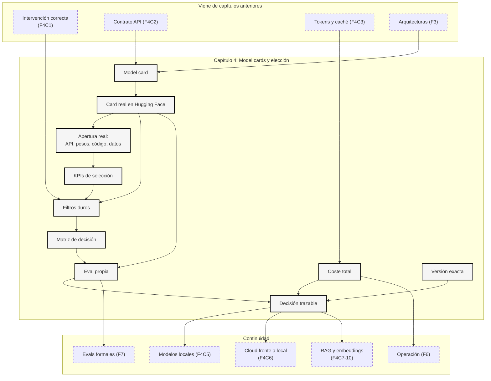

::: {.fasciculo-subtitle}
Facsímil 4 · La caja de herramientas
:::

# Capítulo 04: Model cards y elección de modelos

## Elegir modelo sin dejarse arrastrar por el escaparate

Elegir modelo parece una decisión de catálogo: abres una tabla, miras cuál aparece arriba y lo usas. En proyectos reales casi nunca funciona así. El modelo que gana un benchmark general puede ser caro, lento, excesivo, poco conveniente por licencia, incómodo para tu runtime o flojo justo en el idioma, formato y dominio que necesitas.

Venimos del [capítulo 03](/libro/fasciculo-04/#capitulo-03), donde vimos que tokens, coste, contexto y caché convierten una llamada aparentemente sencilla en una decisión de ingeniería. Aquí añadimos la siguiente capa: **cómo leer la ficha de un modelo y decidir con criterio**.

La idea central es esta: **no eliges el mejor modelo en abstracto; eliges el modelo que cumple una tarea, bajo restricciones, con evidencia suficiente**.

## Estado del arte con fecha de corte

**Fecha de corte:** 14 de junio de 2026.  
**Fuentes consultadas:** documentación oficial de modelos y precios de OpenAI, Anthropic y Google Gemini API; documentación de Hugging Face sobre model cards; definición de Open Source AI y Open Weights de la Open Source Initiative; fichas/licencias de gpt-oss, Qwen, Mistral, DeepSeek, Gemma y Llama; artículos académicos sobre model cards, datasheets y evaluación holística; y benchmarks de sistemas de inferencia.

Lo estable es el método: documentar el modelo, leer uso previsto, capacidades, límites, datos, licencia, coste, contexto, evaluación y condiciones de despliegue. Lo cambiante son los nombres de modelos, ventanas máximas, precios, disponibilidad regional, versiones `preview`, modelos retirados, rate limits y capacidades por API.

**Actualización de apertura de modelos:** el 14 de junio de 2026 se revisó además la distinción entre modelos cerrados, pesos abiertos, código abierto y Open Source AI. Es una parte especialmente cambiante porque los proveedores publican nuevas familias, licencias y repositorios con mucha frecuencia. Por eso en esta sección no basta con decir “modelo abierto”: hay que decir **qué está abierto, bajo qué licencia, qué puedes modificar, qué no puedes reproducir y qué KPI vas a medir**.

Para no convertir el capítulo en una lista que caduca, dejamos las fuentes ordenadas por función:

| Fuente | Qué aporta | Cómo usarla |
|---|---|---|
| Model Cards for Model Reporting.^[Margaret Mitchell et al. (2019). *Model Cards for Model Reporting*. *Proceedings of the Conference on Fairness, Accountability, and Transparency*, 220-229. https://doi.org/10.1145/3287560.3287596.] | Marco original para documentar modelos, usos, métricas y límites. | Como plantilla mental de lectura. |
| Datasheets for Datasets.^[Timnit Gebru et al. (2021). *Datasheets for Datasets*. *Communications of the ACM, 64*(12), 86-92. https://doi.org/10.1145/3458723.] | Documentación de datos, motivación, composición, recogida y mantenimiento. | Para no leer una model card sin preguntar por datos. |
| Hugging Face Model Cards.^[Hugging Face. (2026). *Model Cards*. https://huggingface.co/docs/hub/model-cards. Consultado el 25 de mayo de 2026.] | Implementación práctica: README con metadatos, licencia, datasets, evaluación y texto explicativo. | Para leer modelos abiertos o open weights. |
| OpenAI Models.^[OpenAI. (2026). *Models*. https://developers.openai.com/api/docs/models. Consultado el 25 de mayo de 2026.] | Catálogo vivo de modelos, modalidades y usos previstos. | Como foto actual, no como verdad permanente. |
| OpenAI Pricing.^[OpenAI. (2026). *Pricing*. https://developers.openai.com/api/docs/pricing. Consultado el 25 de mayo de 2026.] | Precios por modalidad, entrada, salida, cache, batch y variantes de servicio. | Para calcular coste por tarea, no solo coste por token. |
| Anthropic Models.^[Anthropic. (2026). *Models overview*. https://platform.claude.com/docs/en/about-claude/models/overview. Consultado el 25 de mayo de 2026.] | Comparación de modelos Claude, ventanas y capacidades declaradas. | Para contrastar familia, contexto y capacidades. |
| Anthropic Pricing.^[Anthropic. (2026). *Pricing*. https://platform.claude.com/docs/en/about-claude/pricing. Consultado el 25 de mayo de 2026.] | Coste de entrada, salida, cache y operaciones por lote. | Para no confundir modelo potente con solución asumible. |
| Google Gemini Models.^[Google. (2026). *Gemini API: Models*. https://ai.google.dev/gemini-api/docs/models. Consultado el 25 de mayo de 2026.] | Modelos Gemini, estados estable/preview/experimental y modalidades. | Para vigilar estabilidad de versión y API concreta. |
| Google Gemini Pricing.^[Google. (2026). *Gemini Developer API pricing*. https://ai.google.dev/gemini-api/docs/pricing. Consultado el 25 de mayo de 2026.] | Precios por modelo, modalidad, contexto y uso de API. | Para revisar el coste justo el día de la decisión. |
| HELM.^[Percy Liang et al. (2022). *Holistic Evaluation of Language Models*. https://arxiv.org/abs/2211.09110.] | Evaluación amplia con múltiples escenarios, métricas y transparencia de resultados. | Para desconfiar de rankings de una sola métrica. |
| MLPerf Inference.^[MLCommons. (2026). *MLPerf Inference: Datacenter benchmark*. https://mlcommons.org/benchmarks/inference-datacenter/. Consultado el 25 de mayo de 2026.] | Benchmark de sistemas completos de inferencia. | Para recordar que modelo, runtime y hardware van juntos. |

## Modelo cerrado, pesos abiertos y código abierto no son lo mismo

Aquí conviene ir despacio, porque esta confusión aparece muchísimo. En software tradicional, “código abierto” suele significar que puedes inspeccionar, modificar, compilar y redistribuir el código bajo ciertas condiciones. En IA generativa, el objeto que usamos no es solo código. Hay arquitectura, pesos, tokenizer, datos de entrenamiento, filtros, scripts de entrenamiento, receta de post-training, evaluaciones, plantillas de chat, runtime y, a veces, una API gestionada que no expone nada de eso.

Por eso decir “este modelo es abierto” sin apellido es demasiado vago. Puede significar una de varias cosas:

1. El modelo está disponible por API, pero los pesos son cerrados.
2. Los pesos se pueden descargar, pero no se publican los datos ni la receta completa de entrenamiento.
3. Hay código de inferencia abierto, pero los pesos o datos no lo son.
4. Hay pesos, código y suficiente información de datos/proceso para estudiar y modificar el sistema de forma profunda.

La Open Source Initiative formaliza una definición de Open Source AI basada en libertades de uso, estudio, modificación y compartición. Además, exige acceso a la forma preferida para modificar el sistema: información suficientemente detallada de datos, código usado para procesar y entrenar, y parámetros o pesos bajo términos adecuados.^[Open Source Initiative. (2024). *The Open Source AI Definition 1.0*. https://opensource.org/ai/open-source-ai-definition. Consultado el 14 de junio de 2026.] Esa definición es más exigente que “puedo descargar un checkpoint”.

La propia OSI distingue también los **open weights**: publicar los pesos finales ayuda mucho, pero normalmente no incluye el código de entrenamiento completo, los datos, los filtros, los checkpoints intermedios ni la receta suficiente para reproducir el modelo.^[Open Source Initiative. (2026). *Open Weights: not quite what you’ve been told*. https://opensource.org/ai/open-weights. Consultado el 14 de junio de 2026.] Dicho de forma cercana: tener los pesos es como tener el edificio terminado; ayuda a vivir dentro, reformar algunas habitaciones y medir su consumo, pero no te da necesariamente los planos completos, el origen de todos los materiales ni el diario de obra.

### Qué son exactamente los pesos

Los pesos son los números aprendidos durante el entrenamiento. En una red neuronal, cada capa transforma vectores usando matrices y funciones no lineales. Esas matrices contienen parámetros. Después de entrenar, esos parámetros quedan fijados en archivos: `safetensors`, `gguf`, checkpoints de PyTorch, formatos optimizados o variantes cuantizadas. Cuando alguien dice “pesos abiertos”, normalmente quiere decir: “puedes obtener esos números y cargarlos en un runtime compatible”.

Pero los pesos no son el modelo completo en sentido práctico. Para usarlos bien necesitas, como mínimo:

| Pieza | Por qué importa |
|---|---|
| Arquitectura | Define cómo se conectan los pesos: capas, atención, MoE, normalización, activaciones. |
| Configuración | Define dimensiones, número de capas, vocabulario, contexto, precisión y detalles de carga. |
| Tokenizer | Convierte texto en tokens. Si cambias tokenizer, cambias la entrada real. |
| Chat template | Convierte roles y mensajes en el formato que el modelo espera. |
| Runtime | Ejecuta el modelo: Transformers, vLLM, SGLang, llama.cpp, Ollama, TensorRT-LLM, etc. |
| Licencia | Decide qué puedes hacer legalmente: usar, modificar, vender, redistribuir, servir. |
| Evals | Te dicen si ese modelo, con esa configuración, sirve para tu caso. |

Por eso un modelo con pesos abiertos puede ser tremendamente útil y, aun así, no ser “Open Source AI” en sentido estricto. Puede que no puedas reproducir su entrenamiento, auditar todos sus datos, conocer sus filtros o verificar por qué aprendió ciertos sesgos. En ingeniería, eso cambia cómo lo documentas: no lo vendes como sistema transparente total, sino como **artefacto ejecutable con más control operativo que una API cerrada**.

### Las cuatro categorías que conviene enseñar al alumno

| Categoría | Qué tienes | Qué no tienes necesariamente | Ejemplos a 14 de junio de 2026 | Decisión de ingeniería |
|---|---|---|---|---|
| Modelo cerrado por API | Endpoint, documentación, precios, SLA o contrato, herramientas del proveedor. | Pesos, datos, receta de entrenamiento, capacidad de servirlo tú. | GPT-5.5/GPT-5.4 en OpenAI API, Claude en Anthropic API, Gemini en Gemini API.^[OpenAI. (2026). *Models*. https://developers.openai.com/api/docs/models. Consultado el 14 de junio de 2026. Anthropic. (2026). *Models overview*. https://platform.claude.com/docs/en/about-claude/models/overview. Consultado el 14 de junio de 2026. Google. (2026). *Gemini API: Models*. https://ai.google.dev/gemini-api/docs/models. Consultado el 14 de junio de 2026.] | Útil si necesitas capacidad alta, menor operación propia, herramientas integradas y contrato de servicio. Mide dependencia, coste, privacidad y plan de salida. |
| Pesos abiertos permisivos | Pesos descargables y licencia amplia, normalmente compatible con uso comercial. | Datos completos, receta reproducible, garantías de seguridad o coste operativo bajo. | `gpt-oss-120b/20b` bajo Apache 2.0; Qwen3.6 open-weight Apache 2.0; Mistral Large 3 bajo Apache 2.0; DeepSeek-R1 con licencia MIT.^[OpenAI. (2025). *Introducing gpt-oss*. https://openai.com/index/introducing-gpt-oss/. Consultado el 14 de junio de 2026. OpenAI. (2026). *OpenAI open-weight models (gpt-oss)*. https://help.openai.com/en/articles/11870455-openai-open-weight-models-gpt-oss. Consultado el 14 de junio de 2026. Qwen Team. (2026). *Qwen3.6*. https://github.com/QwenLM/Qwen3.6. Consultado el 14 de junio de 2026. Mistral AI. (2025). *Introducing Mistral 3*. https://mistral.ai/news/mistral-3/. Consultado el 14 de junio de 2026. DeepSeek-AI. (2025). *DeepSeek-R1*. https://huggingface.co/deepseek-ai/DeepSeek-R1. Consultado el 14 de junio de 2026.] | Bueno para control, despliegue propio, fine-tuning, privacidad y coste a escala. Mide VRAM, throughput, equipo de operación y calidad en tu eval. |
| Pesos abiertos con licencia propia | Pesos accesibles, documentación y permiso condicionado. | Libertad tipo MIT/Apache. Puede haber restricciones de escala, uso, redistribución o política aceptable. | Llama 4 bajo Llama 4 Community License; Gemma con open weights y términos propios de Google.^[Meta. (2025). *Llama 4 Community License Agreement*. https://github.com/meta-llama/llama-models/blob/main/models/llama4/LICENSE. Consultado el 14 de junio de 2026. Google. (2026). *Gemma 4 model overview*. https://ai.google.dev/gemma/docs/core. Consultado el 14 de junio de 2026.] | Técnicamente puede ser muy atractivo, pero legalmente no lo trates como “open source clásico”. Revisa licencia con el caso de uso concreto. |
| Open Source AI estricto | Libertades de uso, estudio, modificación y compartición, más forma preferida de modificación: datos/información de datos, código y parámetros. | No siempre existe en modelos frontier modernos. | La OSI define el criterio; muchos modelos llamados “abiertos” solo cumplen parte. | Útil como vara conceptual y de auditoría. Pregunta siempre: ¿qué falta para reproducir, auditar y modificar de verdad? |

La tabla ayuda, pero el cuerpo de la idea es este: **cada nivel de apertura compra una libertad distinta y deja una deuda distinta**. Una API cerrada compra velocidad de adopción, pero deja dependencia. Un open weight compra control, pero deja operación. Un open weight permisivo compra posibilidad de modificar y servir, pero no necesariamente transparencia científica. Un Open Source AI completo compraría auditabilidad profunda, pero todavía no es la norma en modelos frontier.

### KPIs para decidir entre cerrado, pesos abiertos y open source

Una discusión madura no pregunta “¿abierto o cerrado?” como si fuera una preferencia moral. Pregunta qué KPI importa para el sistema. KPI aquí no significa poner números por ponerlos; significa elegir indicadores que cambian la decisión.

| KPI | Qué mide | Cómo se calcula o se observa | Qué valor sería razonable |
|---|---|---|---|
| Calidad propia | Si resuelve tus casos, no el benchmark general. | Eval con casos de tu dominio: exactitud, rúbrica, tasa de formato válido, revisión humana. | Se fija por tarea: por ejemplo, >95 % JSON válido y >85 % acierto en casos críticos. |
| Coste por tarea completada | Coste real por respuesta útil, no por token aislado. | Tokens de entrada + salida + cache + batch + repeticiones + fallos. | El modelo barato que repite tres veces puede salir caro; mide coste por caso aprobado. |
| Latencia p95 | Tiempo que sufre el 5 % más lento de usuarios. | Medición bajo carga con red, runtime, batch y contexto reales. | Interactivo: quizá <2-5 s; batch: puede ser minutos si está justificado. |
| Throughput | Cuántas peticiones o tokens procesas por segundo. | Requests/s, tokens/s, concurrencia y cola. | Importa mucho en open weights: una GPU infrautilizada destruye el TCO. |
| Coste de operación | Trabajo humano y técnico de mantener el sistema. | Horas de SRE/ML, actualizaciones, incidentes, monitorización, GPUs, parches. | API cerrada suele bajar operación propia; self-hosting la sube. |
| Riesgo de licencia | Probabilidad de que el uso viole términos o bloquee producto. | Revisión de licencia, restricciones de uso, redistribución, derivados, atribución. | Si el caso es comercial o regulado, licencia dudosa es filtro duro, no penalización pequeña. |
| Control de datos | Qué ocurre con prompts, documentos, logs y salidas. | Retención, región, entrenamiento con datos, cifrado, contratos, despliegue on-prem. | Datos sensibles pueden empujar a self-hosting o contrato enterprise fuerte. |
| Reproducibilidad | Capacidad de repetir la misma evaluación y volver a la misma versión. | Versión exacta, commit, hash de pesos, configuración, seeds, prompt, dataset. | En producción: modelo y configuración fijados; alias `latest` solo si aceptas cambio. |
| Capacidad de adaptación | Facilidad para fine-tuning, LoRA, cuantización o routing. | Acceso a pesos, licencia, tooling PEFT, soporte runtime. | Open weights gana aquí si el equipo sabe medir degradación. |
| Portabilidad | Facilidad de cambiar proveedor o mover despliegue. | Compatibilidad OpenAI-like, vLLM/SGLang, formatos, prompts, schemas, evals. | Cuanto más crítica la app, más importante mantener segundo candidato. |
| Observabilidad | Capacidad de ver fallos, costes y comportamiento. | Logs, trazas, métricas, prompts, outputs, tokens, latencia, errores por slice. | No uses un modelo que no puedes medir en el nivel que exige el riesgo. |
| Gobernanza | Capacidad de auditar qué se usa, por qué y bajo qué condiciones. | Model card interna, fecha, licencia, DPIA si aplica, evals, aprobaciones. | En entornos profesionales, una decisión sin ficha interna es memoria frágil. |

Estos KPIs no pesan igual siempre. Para un prototipo de clase, calidad y facilidad de ejecución pueden bastar. Para un asistente con expedientes privados, privacidad, región, trazas y licencia pesan mucho más. Para una herramienta de código interna, quizá throughput, coste por tarea y capacidad de adaptación sean los criterios principales.

**Ejemplo de lectura.** Si una organización compara GPT-5.5 por API, Claude por API, Gemini por API, `gpt-oss-120b`, Qwen3.6 y Mistral Large 3, no debería empezar por “cuál es más inteligente”. Debería construir una matriz:

1. Filtros duros: privacidad, modalidad, licencia, región, presupuesto máximo.
2. Eval propia: 100 casos reales con salida esperada o rúbrica.
3. Medición operativa: p50/p95, tokens/s, coste por caso, tasa de retry.
4. Riesgo: dependencia de proveedor, licencia, plan de salida, estabilidad de versión.
5. Decisión: modelo principal, modelo alternativo, fecha de revisión y condiciones de cambio.

La conclusión puede ser híbrida. Por ejemplo: API cerrada para razonamiento difícil y multimodalidad; open weights para tareas repetitivas, datos sensibles o coste a escala; modelo pequeño local para clasificación barata; RAG para conocimiento vivo. Eso no es indecisión. Es arquitectura.

### Qué significa “abierto” en una model card

Hugging Face permite declarar licencia en los metadatos de la model card y enlazar archivos `LICENSE`; también permite especificar datasets, `pipeline_tag` y resultados de evaluación estructurados.^[Hugging Face. (2026). *Model Cards*. https://huggingface.co/docs/hub/model-cards. Consultado el 14 de junio de 2026.] Eso está muy bien, pero hay que leerlo con cuidado.

Cuando veas una model card, separa estas preguntas:

| Pregunta | Dónde mirar | Decisión que cambia |
|---|---|---|
| ¿Puedo descargar pesos? | `Files and versions`, tamaño, formato, gated access. | Self-hosting, fine-tuning, cuantización. |
| ¿Qué licencia tiene? | Metadata `license`, archivo `LICENSE`, términos externos. | Uso comercial, redistribución, derivados. |
| ¿Hay código de inferencia? | README, ejemplos, `config.json`, runtime recomendado. | Facilidad de ejecución y compatibilidad. |
| ¿Hay código de entrenamiento? | Paper, repo, scripts, argumentos, filtros. | Reproducibilidad y auditoría profunda. |
| ¿Hay datos o información de datos? | Dataset card, README, paper, datasheets. | Riesgo de sesgo, cumplimiento, trazabilidad. |
| ¿Hay evals comparables? | `model-index`, benchmark, paper, harness. | Calidad relativa y gaps de evaluación. |
| ¿Hay política de uso? | Model card, terms, acceptable use policy. | Riesgo de producto y cumplimiento interno. |

Un ejemplo típico: un repo puede tener pesos Apache 2.0 y ser muy útil para producción, pero no publicar dataset completo ni receta reproducible. En el libro lo llamaríamos “pesos abiertos permisivos”, no “open source completo”. No es un desprecio; es precisión.

### Cómo lo explicaría en una revisión técnica

Una frase mala sería: “usamos un modelo open source porque es gratis”.

Una frase profesional sería: “para esta tarea usamos un modelo con pesos abiertos bajo licencia Apache 2.0, servido con vLLM en infraestructura propia, porque necesitamos control de datos y coste estable a volumen. No afirmamos que sea Open Source AI completo: no tenemos todos los datos de entrenamiento ni la receta reproducible. Lo compensamos con eval propia, model card interna, revisión de licencia, medición de p95 y alternativa API si la calidad cae”.

Y otra frase igualmente profesional sería: “para esta tarea usamos un modelo cerrado por API porque la calidad multimodal y las herramientas integradas superan el coste operativo de servir pesos abiertos. Lo documentamos como dependencia de proveedor, fijamos versión cuando el proveedor lo permite, medimos coste por tarea completada y mantenemos una eval de regresión para migrar”.

La madurez no está en elegir siempre abierto o siempre cerrado. Está en poder explicar qué libertad compras, qué deuda aceptas y qué KPI vigila que la decisión siga siendo buena.

## Qué no es una model card

Una model card no es marketing. Puede estar mejor o peor escrita, pero su función no es decir “este modelo es increíble”. Su función es permitir una decisión responsable: qué es, para qué se pensó, dónde se evaluó, qué límites declara, qué licencia tiene y qué condiciones debes revisar antes de usarlo.

Tampoco es una garantía. Que una ficha diga “razonamiento”, “multimodal”, “contexto largo” o “excelente en código” no te dice automáticamente si funcionará en tu flujo. Te da pistas para construir pruebas.

Y no es un benchmark suelto. Una tabla de MMLU, SWE-bench, HumanEval, MMMU o cualquier otra métrica puede ser útil, pero solo mide lo que mide. Si tu producto clasifica incidencias en castellano, resume expedientes internos o genera SQL contra tu esquema, el ranking general es una señal débil.

La trampa más común es leer una model card como si fuera un menú. En realidad hay que leerla como una ficha de compatibilidad: “¿encaja con mi problema, mis datos, mi latencia, mi presupuesto, mis permisos y mi forma de evaluar?”.

## Qué sí es: una ficha para decidir sin autoengaño

Una buena model card responde a seis bloques de preguntas:

| Bloque | Preguntas que debe responder |
|---|---|
| Identidad | ¿Qué modelo es, qué versión, qué familia, qué arquitectura y qué modalidad? |
| Uso previsto | ¿Para qué fue diseñado? ¿Qué usos desaconseja? |
| Entrada y salida | ¿Texto, imagen, audio, vídeo, tools, JSON, embeddings? ¿Qué límites tiene? |
| Evaluación | ¿Con qué benchmarks, datasets, idiomas y condiciones se midió? |
| Operación | ¿Contexto, coste, latencia, rate limits, runtime, hardware, versiones estables? |
| Condiciones | ¿Licencia, privacidad, retención de datos, restricciones y obligaciones de atribución? |

La palabra “modelo” además puede esconder capas distintas:

| Nivel | Qué miras | Ejemplo de pregunta |
|---|---|---|
| Modelo base | Arquitectura y preentrenamiento. | ¿Es base, instruct, MoE, multimodal o de embeddings? |
| Modelo servido por API | Capacidades y contrato del proveedor. | ¿Acepta documentos? ¿Devuelve JSON validable? ¿Tiene tools? |
| Modelo local | Pesos, formato, cuantización y runtime. | ¿GGUF, safetensors, vLLM, Ollama, TensorRT-LLM? |
| Sistema completo | RAG, tools, memoria, permisos y evals. | ¿El fallo viene del modelo o del contexto que le damos? |

Una elección madura empieza separando esos niveles. Cambiar de modelo no arregla una mala recuperación de documentos. Un modelo con contexto enorme no sustituye una política de permisos. Un benchmark alto no te exonera de evaluar tus casos.

El tamaño tampoco decide solo. Las leyes de escala ayudaron a entender cómo bajaba la pérdida al aumentar parámetros, datos y cómputo durante el entrenamiento.^[Jared Kaplan et al. (2020). *Scaling Laws for Neural Language Models*. https://doi.org/10.48550/arXiv.2001.08361.] Después, el trabajo conocido como Chinchilla puso el foco en el equilibrio entre tamaño de modelo y cantidad de datos de entrenamiento.^[Jordan Hoffmann et al. (2022). *Training Compute-Optimal Large Language Models*. https://doi.org/10.48550/arXiv.2203.15556.] Para elegir en un producto, esa lección se traduce así: no preguntes solo “cuántos parámetros tiene”, pregunta si el modelo resuelve tu tarea con el coste, la latencia y la trazabilidad que puedes sostener.

## La matriz mínima de decisión

Elegir con criterio exige convertir preferencias vagas en criterios comparables. No hace falta convertirlo todo en una hoja de cálculo infinita, pero sí conviene explicitar qué pesa más.

**Ejemplo de fórmula.** Una forma simple es puntuar cada modelo candidato con criterios normalizados:

$$
S(m)=\sum_{j=1}^{n} w_j \cdot q_j(m)-\sum_{k=1}^{r} \lambda_k \cdot p_k(m)
$$

| Símbolo | Significado | Ejemplo |
|---|---|---|
| \(S(m)\) | Puntuación final del modelo \(m\). | 0,78 para el candidato A. |
| \(w_j\) | Peso del criterio positivo \(j\). | Calidad vale 0,35; coste vale 0,20. |
| \(q_j(m)\) | Valor normalizado del criterio para el modelo. | Calidad propia 0,86; latencia 0,72. |
| \(\lambda_k\) | Peso de una penalización. | Penalizar licencia incompatible con 1,0. |
| \(p_k(m)\) | Penalización activada. | 1 si no cumple privacidad; 0 si cumple. |

Esta fórmula no pretende aparentar precisión. Pretende obligarte a declarar tus prioridades. Si privacidad es obligatoria, no debe ser “un criterio más”: debe ser un filtro. Si latencia p95 tiene que ser menor de 2 segundos, el modelo que no lo cumple queda fuera aunque gane un benchmark.

El flujo práctico suele ser:

| Fase | Qué haces | Resultado |
|---|---|---|
| 1. Requisitos | Defines tarea, entrada, salida, usuarios, idioma, latencia y presupuesto. | Lista de restricciones. |
| 2. Filtros duros | Eliminas modelos que no cumplen licencia, modalidad, región, privacidad o contexto. | Lista corta inicial. |
| 3. Lectura de fichas | Revisas model cards, docs de proveedor y versiones. | Hipótesis de encaje. |
| 4. Eval propia | Pruebas casos representativos con salida esperada o rúbrica. | Evidencia en tu tarea. |
| 5. Coste y operación | Mides tokens, p50/p95, fallos, rate limits y mantenimiento. | Coste total razonable. |
| 6. Decisión | Documentas modelo elegido, alternativa y fecha de revisión. | Decisión trazable. |

También conviene separar “calidad” de “fiabilidad”. Calidad es que responda bien cuando todo va bien. Fiabilidad es que falle de forma manejable cuando el caso es raro, falta contexto, la entrada está sucia o el formato de salida importa.

## La ficha que yo leería antes de elegir

Cuando abras una model card o una página de modelos, no empieces por la frase grande. Empieza por esta lista:

| Dato | Pregunta incómoda |
|---|---|
| Nombre exacto y versión | ¿Estoy usando una versión estable o un alias que puede cambiar? |
| Modalidades | ¿Texto solo, imagen, audio, vídeo, embeddings, tools? |
| Contexto | ¿Cuánto entra realmente y cuánto debo reservar para salida? |
| Salida máxima | ¿Puede devolver la respuesta completa o tengo que trocear? |
| Precio | ¿Entrada, salida, cache, batch, imágenes, audio, razonamiento? |
| Latencia esperada | ¿Me importa tiempo total o tiempo hasta primer token? |
| Datos y fecha de entrenamiento | ¿Hay conocimiento que no puede saber sin RAG? |
| Evaluación | ¿Los benchmarks se parecen a mi tarea? |
| Idiomas | ¿Se evaluó de verdad en castellano o solo se declara soporte? |
| Formato de chat | ¿Tiene plantilla de mensajes, system, tools, JSON, function calling? |
| Licencia | ¿Puedo usarlo en mi producto, modificarlo, redistribuirlo o servirlo? |
| Retención y privacidad | ¿Qué ocurre con los datos que envío? |
| Deprecación | ¿Hay fecha de retirada, migración o versión recomendada? |

Google, por ejemplo, distingue modelos estables, preview, latest y experimentales en su documentación de modelos. Esa clasificación importa porque `latest` o `preview` puede ser útil para explorar, pero no siempre es lo que quieres fijar en producción. OpenAI y Anthropic mantienen páginas vivas de modelos y precios; por eso una decisión profesional debería guardar fecha de consulta y versión exacta, no solo “usamos el modelo bueno”.

## Anatomía de una model card en Hugging Face

Hugging Face convierte una model card en una página viva: parte README, parte ficha técnica, parte repositorio de archivos y parte panel operativo. Por eso conviene leerla en capas. Primero miras la identidad del modelo. Después los metadatos. Después los archivos. Después cómo se ejecuta. Y solo al final miras los benchmarks.

La idea no es aprender un ritual de botones. Es saber qué pregunta de ingeniería hay detrás de cada etiqueta.

| Zona de la página | Qué estás mirando | Pregunta que debes hacer |
|---|---|---|
| `owner/model` | Organización y nombre exacto del repositorio. | ¿Estoy mirando el modelo oficial, una copia, un fine-tune o una cuantización? |
| Tarea visible | Etiqueta como `Text Generation`, `Image-Text-to-Text` o `Feature Extraction`. | ¿La tarea coincide con mi caso o estoy forzando el modelo? |
| Biblioteca | `Transformers`, `Diffusers`, `Sentence Transformers`, `timm` u otra. | ¿Con qué librería se espera cargar o servir? |
| Formato | `Safetensors`, `GGUF`, `ONNX`, `PyTorch`, `TensorRT` u otros. | ¿Es el formato que mi runtime puede abrir? |
| Licencia | MIT, Apache-2.0, llama, custom, research-only u otra. | ¿Puedo usarlo, modificarlo, servirlo o redistribuirlo en mi contexto? |
| Tags | Palabras como `conversational`, `fp8`, `eval results`, `long-context`. | ¿Son metadatos útiles o solo señales que debo comprobar? |
| Downloads y likes | Popularidad y uso reciente. | ¿Hay adopción o solo ruido? Nunca es una prueba de calidad. |
| Model tree | Relación con fine-tunes, adapters y cuantizaciones. | ¿Estoy viendo el tronco principal o una rama derivada? |
| Files and versions | Archivos, commits, pesos, config, tokenizer, licencia e historial. | ¿Puedo auditar qué estoy descargando y cuándo cambió? |
| Inference Providers | Empresas que lo sirven desde la nube. | ¿La calidad y el coste vienen del modelo o del proveedor que lo sirve? |
| Spaces | Demos o aplicaciones que usan el modelo. | ¿Es una demo útil o una evidencia técnica? Normalmente es lo primero. |
| Evaluation results | Resultados integrados desde `model-index` o evaluaciones enlazadas. | ¿Qué métrica, dataset, configuración y fuente produjo ese número? |

La parte superior suele incluir metadatos que Hugging Face usa para buscar, filtrar y mostrar modelos. Algunos aparecen escritos en YAML dentro del README, otros se infieren desde archivos como `config.json` o desde la integración de la librería.

| Término | Traducción práctica | Qué no debes asumir |
|---|---|---|
| `pipeline_tag` | Tarea principal del modelo. Decide filtros, widget y parte de la experiencia de inferencia. | Que el modelo sea bueno en todas las tareas parecidas. |
| `library_name` | Librería esperada para usarlo. | Que otra librería lo cargue igual sin conversión. |
| `license` | Condiciones de uso declaradas. | Que todo lo derivado tenga automáticamente la misma licencia sin revisar. |
| `language` | Idiomas declarados o detectados. | Que haya evaluación seria en todos esos idiomas. |
| `datasets` | Datasets de entrenamiento o evaluación que el autor declara. | Que conozcas todo el corpus real de entrenamiento. |
| `base_model` | Modelo del que parte un fine-tune, adapter o destilación. | Que conserve exactamente las capacidades del modelo base. |
| `new_version` | Repositorio recomendado como versión posterior. | Que puedas migrar sin repetir evals. |
| `tags` | Señales de búsqueda: modalidad, precisión, dominio, familia, técnica. | Que sean una especificación formal. |
| `model-index` | Resultados de evaluación estructurados. | Que el benchmark represente tu producto. |
| `widget` | Ejemplo interactivo en la página. | Que el prompt del widget sea tu contrato de producción. |
| `extra_gated_fields` | Campos que el usuario acepta antes de acceder a un modelo restringido. | Que aceptar la pantalla baste para resolver privacidad o permisos internos. |

Ahora leamos un caso real. El 25 de mayo de 2026, la card de `deepseek-ai/DeepSeek-V4-Pro` aparece en Hugging Face como modelo de generación de texto, con etiquetas de `Transformers`, `Safetensors`, `deepseek_v4`, `conversational`, resultados de evaluación y precisión `fp8`; declara licencia MIT; y describe DeepSeek-V4-Pro como un modelo MoE de 1,6T parámetros totales, 49B parámetros activados y contexto de 1M tokens.^[DeepSeek-AI. (2026). *deepseek-ai/DeepSeek-V4-Pro*. https://huggingface.co/deepseek-ai/DeepSeek-V4-Pro. Consultado el 25 de mayo de 2026.]

Lo importante no es memorizar esos números. Lo importante es saber leerlos. Para no convertirlo en una pared, vamos término a término, con el ejemplo de DeepSeek-V4-Pro como caso de lectura. Cuando una ficha técnica menciona DeepSeek-V4, también conviene contrastar con la documentación de Transformers, porque ahí aparecen detalles de arquitectura como tipos de atención, `max_position_embeddings` y clases de carga.^[Hugging Face. (2026). *DeepSeek-V4*. https://huggingface.co/docs/transformers/model_doc/deepseek_v4. Consultado el 25 de mayo de 2026.]

La regla de esta sección es: **ningún término se queda en definición de diccionario**. Para cada dato preguntamos qué mide, qué recurso toca, con qué se compara, qué sería razonable y qué prueba haría antes de creerlo.

### Identidad, tarea y repositorio

Estos términos responden a una pregunta básica: “¿qué estoy mirando exactamente?”. Parece trivial, pero muchísimos errores empiezan por usar una variante distinta de la que se quería evaluar.

| Término en la card | Explicación completa | Ejemplo con DeepSeek-V4-Pro | Decisión práctica |
|---|---|---|---|
| `deepseek-ai/DeepSeek-V4-Pro` | Es el identificador completo del repositorio: organización o usuario antes de `/`, nombre del modelo después. En Hugging Face no basta con decir “DeepSeek V4”; puede haber forks, quantizations, fine-tunes y mirrors. | `deepseek-ai` indica la organización; `DeepSeek-V4-Pro` indica el repo concreto. | Guarda este valor exacto en documentación, evals y configuración. Si pruebas `Rooc/DeepSeek-V4-Pro`, ya no estás probando el mismo repositorio. |
| Namespace | Es la parte izquierda del identificador. Puede ser una empresa, una comunidad, una persona o una organización académica. | `deepseek-ai` no es lo mismo que `nvidia`, `unsloth`, `mlx-community` o una cuenta personal. | Antes de descargar pesos, mira si el repo es oficial, derivado o una adaptación para otro formato. |
| Repositorio | Es la carpeta pública del modelo: README, pesos, tokenizer, configuración, licencia, historial y discusiones. | En un repo grande encontrarás `README`, archivos `safetensors`, configuración, tokenizer, licencia, scripts y carpetas auxiliares. | Trata el repo como expediente técnico, no como una tarjeta de marketing. |
| `Text Generation` | Es la tarea principal declarada. Significa que el modelo genera texto token a token a partir de un contexto. No significa automáticamente “buen chat”, “buen agente” o “buen programador”. | DeepSeek-V4-Pro se muestra como generación de texto. | Si quieres embeddings, clasificación o visión, esta etiqueta por sí sola no basta. Busca el `pipeline_tag` correcto y evalúa tu tarea. |
| `conversational` | Tag que sugiere uso conversacional. Normalmente indica que el modelo está pensado para turnos de usuario/asistente. | Puede aparecer junto a `Text Generation`. | Revisa la plantilla de chat. Un modelo conversacional mal formateado puede fallar por entrada, no por capacidad. |
| `Eval Results` | Señal de que Hugging Face puede mostrar resultados de evaluación asociados al modelo. | La card puede enseñar métricas como GSM8K, SWE-bench, GPQA o benchmarks de contexto. | Lee dataset, métrica, configuración y fuente. El número sin protocolo vale poco. |

Ejemplo cercano: si en un proyecto interno dices “vamos a usar DeepSeek”, esa frase no basta. Una decisión trazable diría algo como: “probamos `deepseek-ai/DeepSeek-V4-Pro`, consultado el 25 de mayo de 2026, frente a una alternativa local cuantizada y una API comercial, con estos 80 casos de evaluación”.

### Librería, formato y archivos

La siguiente capa responde a: “¿cómo se carga y qué estoy descargando?”. Aquí aparecen términos que parecen de infraestructura, pero deciden si el modelo se puede probar hoy o si necesitas una semana de entorno.

| Término en la card | Explicación completa | Ejemplo con DeepSeek-V4-Pro | Decisión práctica |
|---|---|---|---|
| `Transformers` | Indica integración con la librería de Hugging Face para tokenizers, configuración y modelos. No garantiza que tu portátil pueda cargarlo ni que tu versión instalada tenga soporte completo. | La card enseña ejemplos con `AutoTokenizer` y `AutoModelForCausalLM`. | Comprueba versión de `transformers`, memoria, `trust_remote_code` si aplica y soporte de arquitectura. |
| `Safetensors` | Formato de pesos basado en tensores, diseñado para ser simple, rápido y evitar dependencias de carga como `pickle`.^[Hugging Face. (2026). *Safetensors*. https://huggingface.co/docs/safetensors/en/index. Consultado el 25 de mayo de 2026.] | La zona lateral puede mostrar `Safetensors`. | Bien para distribuir pesos; no implica que el modelo quepa en GPU ni que tu runtime soporte todas sus capas. |
| `Files and versions` | Pestaña donde están los archivos reales y su historial. Es donde miras pesos, `config.json`, tokenizer, licencia, scripts y commits. | Si ves una carpeta `encoding`, no la ignores: puede explicar cómo convertir mensajes en texto para el modelo. | Para producción, fija commit o versión. No dependas solo del nombre del repo. |
| `config.json` | Archivo que describe arquitectura, dimensiones, vocabulario, contexto, tipos de capas y parámetros de inferencia. | Puede incluir `max_position_embeddings` o `layer_types`. | Si un número de la card no cuadra, abre la configuración antes de asumir que la card está mal o bien. |
| Tokenizer | Componente que parte texto en tokens y reconstruye texto desde tokens. | El mismo prompt puede convertirse en secuencias distintas según tokenizer. | No cambies tokenizer entre evals salvo que quieras medir otra cosa. |
| `Tensor type` | Tipos numéricos presentes en archivos: BF16, F32, FP8, enteros u otros. | La zona lateral puede listar varios tipos a la vez. | No leas “tensor type” como precisión única de inferencia. Puede mezclar pesos, escalas, índices y archivos auxiliares. |
| `License: mit` | Licencia declarada para repo y pesos, según la card. MIT suele ser permisiva, pero debes leer el archivo de licencia. | DeepSeek-V4-Pro declara MIT en la card. | Comprueba `LICENSE`, condiciones internas de tu organización y si usas derivados con otra licencia. |

Ejemplo cercano: si un compañero dice “está en Safetensors, lo cargamos fácil”, la respuesta de ingeniería es: “formato de archivo sí; ahora dime tamaño, precisión, runtime, memoria, tokenizer, plantilla y licencia”.

### Tamaño, precisión, contexto y memoria

Esta parte responde a: “¿cuánto pesa operar esto?”. Aquí se confunden mucho los términos porque parecen números comparables, pero no todos miden lo mismo. Un número útil debe decirte tres cosas: **qué recurso toca**, **contra qué lo comparas** y **qué decisión cambia**.

La cuenta mínima que debe tener un ingeniero en la cabeza es esta:

$$
M_{\text{pesos}} \approx N_{\text{parametros}} \cdot \frac{b}{8}
$$

| Símbolo | Qué significa | Ejemplo |
|---|---|---|
| \(M_{\text{pesos}}\) | Memoria aproximada solo de pesos. | No incluye KV cache, activaciones, runtime ni fragmentación. |
| \(N_{\text{parametros}}\) | Número de parámetros almacenados. | 7B, 70B, 1.6T. |
| \(b\) | Bits por parámetro. | F32 usa 32; BF16/F16 usa 16; FP8/I8 usa 8; FP4/I4 usa 4. |

Regla de bolsillo: **1B parámetros ocupa unos 4 GB en F32, 2 GB en BF16/F16, 1 GB en FP8/INT8 y 0,5 GB en FP4/INT4**, antes de sobrecostes. En producción añade memoria para KV cache, buffers, escalas de cuantización, runtime y margen de seguridad. Por eso “70B en 4-bit son 35 GB” es solo el principio de la conversación, no el dimensionamiento completo.

| Comparación rápida | BF16/F16 | FP8/INT8 | FP4/INT4 | Lectura de ingeniería |
|---|---:|---:|---:|---|
| Modelo denso 7B | ~14 GB | ~7 GB | ~3,5 GB | En local, 4-bit suele ser el punto de entrada; BF16 pide GPU más holgada. |
| Modelo denso 70B | ~140 GB | ~70 GB | ~35 GB | Normalmente necesitas varias GPUs, servidor grande o cuantización fuerte. |
| MoE 1.6T con 49B activados | Pesos totales enormes | Menos memoria por peso | Menos memoria por peso | El cómputo por token se parece más a los activados, pero tienes que almacenar y servir el total o repartirlo. |

Lo “adecuado” no es universal. Para entrenamiento o referencia científica, BF16/F16 suele ser base razonable; F32 queda para partes sensibles, depuración o cálculos concretos. Para inferencia de producción en hardware moderno, FP8/INT8 puede ser un buen compromiso si el runtime lo soporta. Para local, demos y coste bajo, INT4/FP4/GGUF puede ser aceptable, pero solo después de eval propia. NVIDIA documenta el uso de BF16, FP8 y formatos más bajos como parte de entrenamiento e inferencia de baja precisión; Hugging Face y vLLM mantienen documentación específica para cuantización en inferencia.^[NVIDIA. (2026). *Transformer Engine: Low Precision Training*. https://docs.nvidia.com/deeplearning/transformer-engine/user-guide/features/low_precision_training/introduction/introduction.html. Hugging Face. (2026). *Quantization*. https://huggingface.co/docs/transformers/main_classes/quantization. vLLM. (2026). *Quantization*. https://docs.vllm.ai/en/stable/features/quantization/. Consultados el 25 de mayo de 2026.]

| Término en la card | Explicación completa | Ejemplo con DeepSeek-V4-Pro | Decisión práctica |
|---|---|---|---|
| `1.6T total params` | Mide cuántos parámetros hay almacenados. Aporta una idea de memoria total, descarga, reparto entre GPUs y complejidad operativa. En MoE no equivale al cómputo por token. | Si fueran 1,6T en BF16, solo pesos serían ~3,2 TB; con FP8/FP4 mixto baja, pero sigue siendo infraestructura seria. | Compáralo con modelos densos 7B/70B. Si no tienes plan de serving distribuido o provider, este número ya te dice que no es “modelo local normal”. |
| `49B activated params` | Mide la parte aproximada que participa por token. Aporta una pista de coste de cómputo, no de memoria total. | 49B activados se parece más a servir un modelo grande denso por token, pero con pesos totales mucho mayores detrás. | Úsalo para estimar latencia y throughput, pero no para decidir memoria de GPU. Memoria y cómputo son dos columnas distintas. |
| `Model size` | Estimación que muestra el Hub. Aporta una lectura rápida, pero puede mezclar detección automática, ficheros publicados y metadatos. | La UI puede resumir algo que el README detalla de otra manera. | Si hay discrepancia, abre `config.json`, README y archivos. El valor adecuado es el que puedes reproducir desde el repo. |
| `1M context length` | Mide ventana máxima teórica. Aporta capacidad para meter muchos tokens, pero también presión sobre KV cache, latencia y calidad de recuperación. | DeepSeek-V4-Pro declara contexto de 1M tokens. | Adecuado solo si tu tarea necesita contexto largo y lo evalúas. Para muchos productos, RAG con buenos fragmentos gana a meter todo. |
| `max_position_embeddings` | Mide posiciones máximas soportadas por la arquitectura/configuración. Aporta el límite estructural, no la promesa de experiencia barata. | En DeepSeek-V4 la documentación de Transformers menciona `1048576`, aproximadamente 1M posiciones. | Compáralo con tu longitud real: si tus casos tienen 8K-32K tokens, 1M quizá no aporta nada salvo coste. |
| `FP4 + FP8 Mixed` | Indica precisión mixta: algunas partes usan 4 bits y otras 8 bits. Aporta reducción de memoria/ancho de banda manteniendo más precisión donde conviene. | DeepSeek-V4-Pro declara expertos MoE en FP4 y la mayoría del resto en FP8. | Adecuado cuando el modelo fue entrenado/publicado para ese formato y tu runtime lo soporta. No lo equipares a una cuantización casera hecha después. |
| BF16 | Flotante de 16 bits con rango amplio parecido a F32 y menos precisión fina. Aporta buena estabilidad con mitad de memoria que F32. | 7B en BF16 son ~14 GB solo en pesos; 70B son ~140 GB. | Buen baseline de calidad para inferencia seria si tienes memoria. Si BF16 no cabe, cuantizas; si cabe, úsalo como referencia de comparación. |
| F32 | Flotante de 32 bits. Aporta máxima comodidad numérica, pero cuesta el doble que BF16 y cuatro veces más que FP8/INT8 en memoria. | 7B en F32 son ~28 GB solo pesos; 70B son ~280 GB. | No suele ser adecuado para servir LLM grandes completos. Útil para partes sensibles, depuración, entrenamiento clásico o modelos pequeños. |
| FP8 | Flotante de 8 bits. Aporta ahorro de memoria y ancho de banda manteniendo comportamiento mejor que muchos enteros si está bien calibrado y soportado. | 70B en FP8 son ~70 GB de pesos, antes de sobrecostes. | Adecuado en GPUs/runtimes modernos con soporte real. Evalúa porque FP8 no garantiza calidad: depende de escalas, kernels y arquitectura. |
| I8 / INT8 | Entero de 8 bits. Aporta compresión y aceleración si el runtime tiene kernels adecuados. Suele necesitar escalas para reconstruir valores. | Un modelo de 70B en INT8 ronda ~70 GB de pesos más escalas y sobrecostes. | Adecuado para inferencia cuando la degradación medida es pequeña. No asumas que todo INT8 conserva igual matemáticas, código o formato JSON. |
| FP4 / INT4 | 4 bits por peso. Aporta gran reducción de memoria, a costa de mayor riesgo de pérdida de calidad. | Un 70B en 4-bit ronda ~35 GB de pesos más sobrecostes. | Adecuado para local, coste bajo o prototipos cuando la eval propia lo confirma. Para extracción exacta, SQL, código o razonamiento duro, compara contra BF16/FP8. |
| `Tensor type` | Lista tipos numéricos presentes en archivos. Aporta pistas, pero no dice por sí sola la precisión principal de inferencia. | Puede aparecer BF16, F32, FP8, I64 o I8 porque hay pesos, escalas, índices y metadatos. | No tomes el primer tipo como “el modelo corre en eso”. Pregunta: qué tensors son pesos, cuáles escalas, cuáles índices y qué usa el runtime. |
| Cuantización | Técnica para representar pesos o activaciones con menos bits. Aporta reducción de memoria y coste, pero puede cambiar calidad, velocidad y compatibilidad. | Puede aparecer como GGUF, GPTQ, AWQ, bitsandbytes, FP8, INT8, INT4 o repo derivado. | Lo adecuado depende de tu restricción: BF16 para referencia, FP8/INT8 para producción eficiente, 4-bit para local/coste bajo si pasa evals. |

Ejemplo cercano: si tienes un asistente que responde a documentos de 40 páginas, un contexto de 1M tokens quizá no es la primera solución. Puede ser mejor recuperar 10 fragmentos bien citados con RAG, como veremos en [capítulos 09 y 10](/libro/fasciculo-04/#capitulo-09).

### Arquitectura: MoE, atención y conexiones internas

Estos términos explican cómo está construido el modelo. No siempre necesitas dominarlos para usar una API, pero sí para entender por qué un modelo tiene ciertas necesidades de runtime.

| Término en la card | Explicación completa | Ejemplo con DeepSeek-V4-Pro | Decisión práctica |
|---|---|---|---|
| MoE | Mixture of Experts. El modelo tiene varios expertos y un mecanismo de enrutamiento decide cuáles se usan para cada token. | DeepSeek-V4-Pro es MoE: total enorme, activación parcial. | Necesitas servir expertos, routing y paralelismo con cuidado. Un runtime pobre puede arruinar la ventaja. |
| Expertos | Subredes especializadas dentro de un MoE. No son “personas”; son bloques de parámetros. | Un token puede activar ciertos expertos y no otros. | En inferencia distribuida importa dónde vive cada experto y cuánto tráfico genera. |
| Routing | Decisión interna de qué expertos se activan. | Cada token se enruta a una parte del modelo. | Puede afectar latencia, balanceo de carga y reproducibilidad de rendimiento. |
| CSA | Compressed Sparse Attention. Atención comprimida y dispersa para manejar contexto largo de forma más eficiente. | DeepSeek-V4 menciona CSA como parte de su atención híbrida. | No basta con leer “1M tokens”; mide si recupera bien información lejana en tu tarea. |
| HCA | Heavily Compressed Attention. Otra rama de atención comprimida orientada a señales de largo alcance. | La documentación describe capas HCA y CSA intercaladas. | Útil para contexto largo, pero exige pruebas de latencia, memoria y calidad. |
| mHC | Manifold-Constrained Hyper-Connections. Conexiones internas que sustituyen o refuerzan conexiones residuales tradicionales. | Aparece como cambio arquitectónico de DeepSeek-V4. | Interesa para entender estabilidad y diseño, pero no decide por sí solo si te sirve. |
| Sliding attention | Atención en ventana local. Mira solo un tramo cercano del contexto. | En algunos bloques se usa una ventana local. | Buena para eficiencia local; no sustituye por sí sola recuperación global. |
| KV cache | Memoria de claves y valores de atención durante generación. Ya la vimos en [capítulo 03](/libro/fasciculo-04/#capitulo-03). | Contexto largo puede disparar KV cache si no hay compresión. | Para producto, KV cache es coste real: GPU, batch, latencia y throughput. |

Ejemplo cercano: imagina una biblioteca. Un modelo denso abre todas las salas para cada consulta. Un MoE intenta abrir solo algunas salas especializadas. Eso ahorra trabajo por consulta, pero obliga a tener un edificio enorme disponible y un sistema de pasillos muy bien organizado.

### Entrenamiento, ajuste y modos de razonamiento

Esta capa responde a: “¿qué se hizo para que el modelo se comporte así?”. Son términos de entrenamiento, no botones de producto.

| Término en la card | Explicación completa | Ejemplo con DeepSeek-V4-Pro | Decisión práctica |
|---|---|---|---|
| Pretraining | Entrenamiento base sobre grandes cantidades de texto, código u otros datos. Aprende patrones generales. | La familia V4 declara preentrenamiento a gran escala antes del post-training. | No esperes que pretraining conozca tus documentos privados. Para eso entra RAG o fine-tuning. |
| Post-training | Fase posterior para ajustar instrucciones, formato, razonamiento, preferencias o herramientas. | La card habla de un pipeline posterior al pretraining. | Afecta cómo responde, no solo cuánto sabe. Evalúa estilo, obediencia de formato y consistencia. |
| SFT | Supervised fine-tuning: ajuste con pares entrada-salida. Enseña formato y comportamiento deseado. | “Si el usuario pregunta X, responde con Y” en muchos ejemplos. | Muy útil para tono y patrón de respuesta; no es buena vía para información que cambia cada día. |
| RL | Reinforcement learning. El modelo mejora usando señales de recompensa sobre sus respuestas. | Se usa en modelos de razonamiento para reforzar soluciones mejores. | Puede mejorar resolución, pero debes medir longitud, coste, formato y estabilidad. |
| GRPO | Group Relative Policy Optimization, variante usada en trabajos de DeepSeekMath para mejorar razonamiento con menor coste de memoria que PPO.^[Zhihong Shao et al. (2024). *DeepSeekMath: Pushing the Limits of Mathematical Reasoning in Open Language Models*. https://arxiv.org/abs/2402.03300.] | DeepSeek-V4 menciona RL con GRPO en su post-training. | Interpreta “GRPO” como pista de entrenamiento, no como garantía de que tu problema saldrá bien. |
| on-policy distillation | Destilación usando salidas generadas bajo la propia política del sistema durante el proceso de mejora. | La card lo describe como consolidación de capacidades. | Es relevante para entender la receta; tu aplicación sigue necesitando eval propia. |
| Muon optimizer | Optimizador usado durante entrenamiento para estabilidad o convergencia. | DeepSeek-V4 lo menciona como parte de sus mejoras. | No cambia tu llamada API. Sirve para leer el informe técnico, no para configurar un chatbot. |
| Non-think | Modo de respuesta más directa, sin gran presupuesto de razonamiento. | Útil para tareas rutinarias. | Si la tarea es simple, evita pagar latencia extra por razonamiento largo. |
| Think | Modo con más análisis interno y respuesta más cuidadosa. | Útil para planificación, código o problemas con varias restricciones. | Mide coste y tiempo. No lo actives por defecto en todo. |
| Think Max | Modo de esfuerzo máximo. | Pensado para problemas difíciles o evaluación de frontera. | Reserva para casos donde el coste adicional compense. |

Ejemplo cercano: para clasificar tickets de soporte, `Non-think` puede bastar. Para revisar una migración de base de datos, quizá `Think` tenga sentido. Para explorar una demostración matemática o un problema de programación complejo, `Think Max` puede ser una prueba, no necesariamente el modo de producción.

### Plantilla de chat, encoding y parámetros de generación

Aquí aparece una de las causas más tontas y más caras de errores: usar bien el modelo, pero formatear mal la entrada. Hugging Face documenta las chat templates como la forma de convertir mensajes en el formato exacto que el modelo vio durante entrenamiento.^[Hugging Face. (2026). *Chat templates*. https://huggingface.co/docs/transformers/chat_templating. Consultado el 25 de mayo de 2026.]

| Término en la card | Explicación completa | Ejemplo con DeepSeek-V4-Pro | Decisión práctica |
|---|---|---|---|
| Chat Template | Plantilla que convierte mensajes `system`, `user` y `assistant` en texto/tokens con separadores especiales. | Algunas familias usan Jinja; DeepSeek-V4-Pro indica una carpeta `encoding` en lugar de una plantilla Jinja clásica. | Si ignoras la plantilla, puedes convertir un buen modelo en un mal modelo. |
| `encoding` folder | Carpeta con scripts para codificar mensajes y parsear salidas. | Puede incluir funciones tipo “mensajes a string” y “texto generado a respuesta”. | Señal de contrato de entrada. No improvises el prompt final sin leerla. |
| Roles | Estructura de conversación: sistema, usuario, asistente y a veces herramientas. | Un mensaje de sistema puede fijar comportamiento; uno de usuario contiene la tarea. | Mantén roles consistentes entre eval y producción. |
| `temperature` | Controla aleatoriedad de muestreo. Valores bajos suelen ser más conservadores; altos, más variados. | La card puede recomendar `temperature = 1.0`. | Para extracción JSON o clasificación, baja variación. Para ideación, quizá más variación. |
| `top_p` | Muestreo por núcleo: limita candidatos a una masa de probabilidad acumulada. | La card puede recomendar `top_p = 1.0`. | No cambies `temperature` y `top_p` a ciegas; registra configuración en tus evals. |
| `max_new_tokens` | Máximo de tokens que puede generar la respuesta. | Si pides resumen largo con límite bajo, cortará la salida. | Reserva salida suficiente. Contexto total no es solo entrada. |
| Stop tokens | Secuencias que detienen generación. | Un token especial puede cerrar un bloque de razonamiento o respuesta. | Útiles para formato; peligrosos si cortan respuestas válidas. |

Ejemplo cercano: dos equipos pueden “usar el mismo modelo” y obtener resultados distintos si uno aplica bien la plantilla de chat y otro manda un string plano. La diferencia no está en inteligencia; está en protocolo.

### Runtimes, proveedores y despliegue

Esta parte responde a: “¿dónde corre y con qué contrato?”. El modelo no vive en el aire: necesita runtime, hardware, límites, observabilidad y presupuesto. vLLM y SGLang, por ejemplo, exponen servidores compatibles con APIs tipo OpenAI para servir modelos grandes.^[vLLM. (2026). *OpenAI-Compatible Server*. https://docs.vllm.ai/en/latest/serving/openai_compatible_server/. Consultado el 25 de mayo de 2026. SGLang. (2026). *Welcome to SGLang*. https://docs.sglang.io/index.html. Consultado el 25 de mayo de 2026.]

| Término en la card | Explicación completa | Ejemplo con DeepSeek-V4-Pro | Decisión práctica |
|---|---|---|---|
| vLLM | Runtime de inferencia orientado a throughput, batch, KV cache y API compatible con OpenAI. | La card puede enseñar cómo servir el modelo con `vllm serve`. | Mide p50, p95, tokens por segundo, memoria y límites de contexto. |
| SGLang | Framework de serving para modelos de lenguaje y multimodales, con foco en baja latencia, throughput, cache y paralelismo. | La card puede dar comandos `sglang.launch_server`. | Útil si necesitas exprimir serving, paralelismo o flujos estructurados. |
| Docker Model Runner | Forma de ejecutar modelos desde Docker usando comandos familiares y un endpoint gestionado por Model Runner.^[Docker. (2026). *docker model run*. https://docs.docker.com/reference/cli/docker/model/run/. Consultado el 25 de mayo de 2026.] | La card puede mostrar `docker model run hf.co/...`. | Muy cómodo para probar; en producción revisa memoria, logs, versiones y despliegue real. |
| Inference Providers | Proveedores integrados en Hugging Face que sirven modelos alojados.^[Hugging Face. (2026). *Inference Providers*. https://huggingface.co/docs/inference-providers/en/index. Consultado el 25 de mayo de 2026.] | Puede aparecer Novita u otros proveedores para un modelo. | Compara proveedor concreto, región, precio, latencia, privacidad y versión servida. |
| OpenAI-compatible API | API que imita contratos de OpenAI, normalmente `/v1/chat/completions` u otros endpoints parecidos. | vLLM y SGLang pueden exponer endpoints compatibles. | Compatible no significa idéntico: revisa streaming, tools, JSON, errores y parámetros soportados. |
| Throughput | Cantidad de tokens o peticiones procesadas por unidad de tiempo. | Un modelo puede ser bueno para batch y peor para chat interactivo. | Si tienes muchos usuarios, throughput importa tanto como calidad. |
| Latencia p95 | Tiempo por debajo del cual acaba el 95 por ciento de peticiones. | Una demo rápida puede esconder colas lentas. | Decide con p95, no solo con “a mí me respondió rápido”. |
| Batch | Agrupar peticiones para aprovechar hardware. | Muy útil en procesos nocturnos o clasificación masiva. | Puede mejorar coste, pero empeorar tiempo de espera interactivo. |
| Observabilidad | Logs, métricas, trazas, errores, coste y calidad en producción. | Necesitas saber cuándo falla, cuánto cuesta y qué versión respondió. | Sin observabilidad, elegir modelo es solo el inicio de una caja negra. |

Ejemplo cercano: “lo sirve un provider” no responde a “¿me sirve a mí?”. Si tu aplicación trata documentos internos, necesitas saber retención, región, contrato, trazas, límites y cómo se comporta el proveedor cuando hay picos.

### Evaluación y resultados

Las cards enseñan números porque necesitamos señales, pero cada número tiene una historia. Un benchmark sin protocolo es como una nota sin examen.

| Término en la card | Explicación completa | Ejemplo con DeepSeek-V4-Pro | Decisión práctica |
|---|---|---|---|
| `Evaluation Results` | Bloque de resultados visibles en el Hub o enlazados desde la ficha. | Puede mostrar GSM8K, SWE-bench, GPQA, Terminal Bench u otros. | Úsalo para orientar, nunca para decidir sin eval propia. |
| Benchmark | Prueba estandarizada sobre un conjunto de tareas. | HumanEval mide programación; MMLU conocimiento general; GPQA razonamiento científico. | Pregunta si se parece a tu caso real. |
| Dataset | Conjunto de datos usado para medir. | GSM8K contiene problemas matemáticos de primaria/secundaria. | Si tu tarea es legal, médica o administrativa, GSM8K no te la resuelve. |
| Metric | Regla que convierte respuestas en puntuación. | `Pass@1`, `EM`, `ACC`, `F1`. | La métrica define qué cuenta como acierto. Léela antes de comparar. |
| Shots | Número de ejemplos que se dan en el prompt. | `0-shot`, `3-shot`, `5-shot`, `25-shot`. | Más ejemplos consumen tokens y pueden cambiar mucho el resultado. |
| Harness | Código y protocolo que ejecutan la evaluación. | Puede controlar prompts, herramientas, timeouts y validación. | Dos resultados en el mismo benchmark pueden no ser comparables si cambia el harness. |
| `tools enabled` | La evaluación permite usar herramientas externas, como terminal, navegador, ejecución de código o buscador. | Algunos benchmarks de agentes lo indican explícitamente. | No compares contra resultados sin herramientas como si fueran la misma prueba. |
| Source | Origen del resultado: autor del modelo, leaderboard externo, paper o tercero. | Hugging Face puede enlazar fuente de evaluación. | Prefiere resultados reproducibles o, como mínimo, con protocolo claro. |

Ejemplo cercano: si un modelo saca muy buena nota en `SWE-bench`, eso no significa que clasifique bien incidencias de alumnos. Significa que merece pasar a tu lista corta para tareas de código, si tus restricciones de coste y privacidad encajan.

Hay un detalle muy de ingenieros: las cards grandes a veces muestran números que no parecen encajar a primera vista. En DeepSeek-V4-Pro puedes ver una tabla del README con parámetros totales, activados, contexto y precisión, y también una zona lateral generada por Hugging Face con “model size” y “tensor type”. Si algo no cuadra, no lo ignores: abre `Files and versions`, busca `config.json`, `README`, `LICENSE`, tokenizer, scripts de encoding y notas del repositorio. La card no es un oráculo; es la entrada al expediente.

Las métricas también tienen vocabulario propio. Conviene leerlas como leerías un contrato: una palabra pequeña cambia lo que realmente se está midiendo.

| Métrica | Qué mide aproximadamente | Ejemplo sencillo | Cuidado |
|---|---|---|---|
| `EM` | Exact match: la respuesta generada debe coincidir exactamente con la esperada. | Esperado: `Madrid`. Generado: `Madrid`. Acierta. Generado: `La respuesta es Madrid`. Puede fallar si el evaluador es estricto. | Penaliza respuestas correctas con formato distinto. Es buena para respuestas cerradas, mala para explicaciones. |
| `F1` | Solapamiento entre partes de la respuesta esperada y generada. Se usa mucho cuando hay varias palabras relevantes. | Esperado: `revisar matrícula y pago`. Generado: `revisar el pago de matrícula`. Tiene bastante solapamiento. | Puede dar buena nota aunque falte un detalle crítico. En tareas sensibles, mira también errores cualitativos. |
| `Pass@1` | Si la primera solución generada pasa la prueba. Es común en código y problemas con verificador automático. | El modelo escribe una función; los tests se ejecutan una vez; si pasan, cuenta como acierto. | Depende muchísimo del harness, tests, timeout y formato esperado. No es “calidad general”. |
| `ACC` | Accuracy: porcentaje de aciertos sobre el total. | Clasifica 100 tickets; acierta 87; `ACC = 0.87`. | No dice qué clase falla. Si la clase rara es la importante, accuracy puede engañar. |
| `MMR` | Acrónimo que debes definir en el benchmark concreto. En recuperación suele ser Maximal Marginal Relevance; en algunas tablas puede aparecer con otro significado operacional. | En búsqueda semántica puede premiar resultados relevantes pero no repetidos. | Nunca asumas el significado por las siglas. Abre la ficha del benchmark. |
| `Elo` | Puntuación relativa por comparaciones entre modelos. Suele venir de duelos: respuesta A frente a respuesta B. | Un evaluador humano o automático prefiere una respuesta; el ranking se actualiza. | Depende de participantes, prompts, evaluador y protocolo. No es una unidad absoluta de inteligencia. |
| `0-shot` | El modelo responde sin ejemplos dentro del prompt. | “Clasifica este ticket” sin mostrar tickets anteriores resueltos. | Si tu producto sí usa ejemplos, este resultado quizá subestima tu caso. |
| `few-shot` | El prompt incluye algunos ejemplos antes de la tarea. | Das 3 tickets con categoría correcta y luego pides clasificar uno nuevo. | Puede mejorar mucho, pero consume contexto y puede sobreajustarse al formato de los ejemplos. |
| `tools enabled` | La evaluación permite usar herramientas externas: ejecución de código, terminal, buscador, base de datos o navegación controlada. | Para resolver un bug, el sistema puede ejecutar tests en vez de responder solo de memoria. | No compares con un resultado sin herramientas. Es otro sistema, no solo otro modelo. |

Mi lectura práctica de una card de Hugging Face siempre termina con siete preguntas:

| Pregunta | Dónde buscarla |
|---|---|
| ¿Qué modelo exacto es? | Nombre del repo, organización, commits y versiones. |
| ¿Qué tarea dice resolver? | `pipeline_tag`, tags, README y ejemplos. |
| ¿Cómo se ejecuta bien? | `Use this model`, runtime, chat template, tokenizer y scripts. |
| ¿Qué coste operativo tendrá? | Tamaño, precisión, contexto, parámetros activados, runtime y proveedores. |
| ¿Qué evidencia trae? | `model-index`, tablas de evaluación, paper y fuente del benchmark. |
| ¿Qué condiciones tiene? | Licencia, privacidad del proveedor, gating y restricciones internas. |
| ¿Qué no me está diciendo? | Datos de entrenamiento, idiomas evaluados, fallos conocidos, prompts exactos y límites reales. |

Si una card no responde a varias de estas preguntas, no significa que el modelo sea malo. Significa que tu decisión tiene más incertidumbre. Y la incertidumbre se compensa con pruebas propias, límites claros y una alternativa preparada.

## Benchmarks: útiles, pero no soberanos

Los benchmarks son necesarios porque evitan discutir solo con impresiones. Pero no todos los benchmarks sirven para todas las decisiones. HELM nació precisamente para evaluar modelos de lenguaje de forma más holística: no solo exactitud, también escenarios, métricas y transparencia de resultados. Esa idea es más importante que cualquier posición concreta en una tabla.

Tres preguntas ayudan:

| Pregunta | Por qué importa |
|---|---|
| ¿Qué tarea mide? | Matemáticas, código, lectura, conversación, visión, SQL o seguridad no son lo mismo. |
| ¿Cómo se evaluó? | Prompt, few-shot, temperatura, herramientas, idioma y versión pueden cambiar resultados. |
| ¿Qué coste tuvo acertar? | Un modelo puede ganar usando más tokens, más tiempo o más cómputo de inferencia. |

El capítulo anterior nos da el antídoto: mide tokens, coste y latencia además de calidad. Una respuesta que mejora un 2 % en exactitud pero triplica coste y p95 quizá no es mejor para tu producto.

Y hay otra capa: benchmark de modelo no es benchmark de sistema. MLPerf Inference, por ejemplo, mide sistemas completos bajo escenarios definidos. En aplicaciones con IA, el sistema incluye modelo, runtime, hardware, batch, cache, red, RAG, herramientas, validadores y observabilidad. Si solo miras el modelo, te faltan piezas.

## Coste total: no solo precio por millón de tokens

El precio público es una parte, no toda la decisión. En una API pagas tokens, modalidades, cache, batch o prioridad según proveedor. En local pagas GPUs, electricidad, memoria, mantenimiento, actualización y tiempo del equipo. En ambos casos pagas también integración, evaluación y cambios de versión.

**Ejemplo de fórmula.** Una estimación útil es:

$$
TCO = C_{\text{tokens}} + C_{\text{infra}} + C_{\text{operacion}} + C_{\text{cambio}}
$$

| Símbolo | Significado | Ejemplo |
|---|---|---|
| \(TCO\) | Coste total de propiedad. | Coste mensual real de servir una función. |
| \(C_{\text{tokens}}\) | Coste de entrada, salida, cache y batch. | Factura del proveedor. |
| \(C_{\text{infra}}\) | Infraestructura propia o gestionada. | GPU, CPU, memoria, almacenamiento, red. |
| \(C_{\text{operacion}}\) | Monitorización, fallos, evals y soporte. | Tiempo del equipo y alertas. |
| \(C_{\text{cambio}}\) | Migración entre versiones o proveedores. | Adaptar prompts, schemas y evals. |

Este coste cambia según el patrón de uso. Un asistente interactivo necesita p95 bajo. Un proceso nocturno puede aceptar batch. Una tarea con normativa fija puede aprovechar caché. Una tarea con documentos privados puede empujar hacia local o hacia una API con garantías contractuales concretas.

## Para entenderlo: tres elecciones distintas

Pensemos en situaciones concretas:

| Caso | Modelo tentador | Decisión más sensata |
|---|---|---|
| Chat de orientación universitaria | El modelo más capaz disponible. | Modelo fiable, barato, con RAG, citas y buena evaluación en castellano. |
| Clasificador de tickets internos | Un LLM grande generalista. | Modelo menor con salida estructurada, eval propia y batch si no es interactivo. |
| Análisis de contratos extensos | El modelo con más contexto. | Contexto largo si aporta valor; si no, RAG con citas y control de fragmentos. |
| Generación de SQL | Modelo de código muy alto en benchmark. | Eval con tu esquema, permisos, consultas esperadas y validación antes de ejecutar. |
| Asistente local para datos sensibles | API más cómoda. | Revisar privacidad, modelo local, cuantización y coste operativo real. |

La pregunta no es “¿cuál es mejor?”. La pregunta es “¿qué falla si me equivoco?”. Si el fallo cuesta poco, puedes experimentar. Si el fallo rompe una decisión importante, necesitas más evaluación, trazas y límites.

## Mapa visual de la decisión

<svg id="f4-c04-eleccion-modelos" xmlns="http://www.w3.org/2000/svg" viewBox="0 0 1180 820" role="img" aria-label="Proceso sobrio para elegir modelos a partir de model cards, restricciones, evaluación y coste">
  <title>Elegir modelos a partir de fichas, restricciones y evaluación propia</title>
  <defs>
    <marker id="f4c04-arrow" viewBox="0 0 10 10" refX="9" refY="5" markerWidth="7" markerHeight="7" orient="auto">
      <path d="M 0 0 L 10 5 L 0 10 z" fill="#111111"/>
    </marker>
    <pattern id="f4c04-hatch" patternUnits="userSpaceOnUse" width="8" height="8" patternTransform="rotate(45)">
      <line x1="0" y1="0" x2="0" y2="8" stroke="#D5D5D5" stroke-width="2"/>
    </pattern>
  </defs>

  <rect x="24" y="24" width="1132" height="752" rx="18" fill="#FFFFFF" stroke="#111111" stroke-width="1.4"/>
  <text x="590" y="64" text-anchor="middle" font-family="Arial, sans-serif" font-size="25" font-weight="700" fill="#111111">Elegir modelo es filtrar, medir y documentar</text>
  <text x="590" y="92" text-anchor="middle" font-family="Arial, sans-serif" font-size="13" fill="#666666">Una model card no decide por ti; te da preguntas para construir una decisión trazable.</text>
  <line x1="70" y1="122" x2="1110" y2="122" stroke="#111111" stroke-width="1"/>

  <rect x="70" y="172" width="190" height="132" rx="14" fill="#FFFFFF" stroke="#111111" stroke-width="1.2"/>
  <text x="165" y="204" text-anchor="middle" font-family="Arial, sans-serif" font-size="14" font-weight="700" fill="#111111">Requisitos</text>
  <text x="165" y="232" text-anchor="middle" font-family="Arial, sans-serif" font-size="11" fill="#555555">tarea · idioma</text>
  <text x="165" y="252" text-anchor="middle" font-family="Arial, sans-serif" font-size="11" fill="#555555">latencia · privacidad</text>
  <text x="165" y="272" text-anchor="middle" font-family="Arial, sans-serif" font-size="11" fill="#555555">salida esperada</text>

  <rect x="314" y="172" width="190" height="132" rx="14" fill="#F7F7F7" stroke="#111111" stroke-width="1.2"/>
  <text x="409" y="204" text-anchor="middle" font-family="Arial, sans-serif" font-size="14" font-weight="700" fill="#111111">Filtros duros</text>
  <text x="409" y="232" text-anchor="middle" font-family="Arial, sans-serif" font-size="11" fill="#555555">licencia · región</text>
  <text x="409" y="252" text-anchor="middle" font-family="Arial, sans-serif" font-size="11" fill="#555555">modalidad · contexto</text>
  <text x="409" y="272" text-anchor="middle" font-family="Arial, sans-serif" font-size="11" fill="#555555">versión estable</text>

  <rect x="558" y="172" width="190" height="132" rx="14" fill="#FFFFFF" stroke="#111111" stroke-width="1.2"/>
  <text x="653" y="204" text-anchor="middle" font-family="Arial, sans-serif" font-size="14" font-weight="700" fill="#111111">Model card</text>
  <text x="653" y="232" text-anchor="middle" font-family="Arial, sans-serif" font-size="11" fill="#555555">uso previsto</text>
  <text x="653" y="252" text-anchor="middle" font-family="Arial, sans-serif" font-size="11" fill="#555555">datos · límites</text>
  <text x="653" y="272" text-anchor="middle" font-family="Arial, sans-serif" font-size="11" fill="#555555">benchmarks</text>

  <rect x="802" y="172" width="190" height="132" rx="14" fill="#111111" stroke="#111111" stroke-width="1.2"/>
  <text x="897" y="204" text-anchor="middle" font-family="Arial, sans-serif" font-size="14" font-weight="700" fill="#FFFFFF">Lista corta</text>
  <text x="897" y="232" text-anchor="middle" font-family="Arial, sans-serif" font-size="11" fill="#DDDDDD">2-4 candidatos</text>
  <text x="897" y="252" text-anchor="middle" font-family="Arial, sans-serif" font-size="11" fill="#DDDDDD">con versión exacta</text>
  <text x="897" y="272" text-anchor="middle" font-family="Arial, sans-serif" font-size="11" fill="#DDDDDD">y fecha de lectura</text>

  <line x1="260" y1="238" x2="310" y2="238" stroke="#111111" stroke-width="1.4" marker-end="url(#f4c04-arrow)"/>
  <line x1="504" y1="238" x2="554" y2="238" stroke="#111111" stroke-width="1.4" marker-end="url(#f4c04-arrow)"/>
  <line x1="748" y1="238" x2="798" y2="238" stroke="#111111" stroke-width="1.4" marker-end="url(#f4c04-arrow)"/>

  <rect x="128" y="404" width="240" height="138" rx="14" fill="#FFFFFF" stroke="#111111" stroke-width="1.2"/>
  <text x="248" y="436" text-anchor="middle" font-family="Arial, sans-serif" font-size="14" font-weight="700" fill="#111111">Eval propia</text>
  <text x="248" y="466" text-anchor="middle" font-family="Arial, sans-serif" font-size="11" fill="#555555">casos reales</text>
  <text x="248" y="486" text-anchor="middle" font-family="Arial, sans-serif" font-size="11" fill="#555555">rúbrica · salida esperada</text>
  <text x="248" y="506" text-anchor="middle" font-family="Arial, sans-serif" font-size="11" fill="#555555">fallos observados</text>

  <rect x="470" y="404" width="240" height="138" rx="14" fill="url(#f4c04-hatch)" stroke="#111111" stroke-width="1.2"/>
  <text x="590" y="436" text-anchor="middle" font-family="Arial, sans-serif" font-size="14" font-weight="700" fill="#111111">Coste y operación</text>
  <text x="590" y="466" text-anchor="middle" font-family="Arial, sans-serif" font-size="11" fill="#555555">tokens · p95</text>
  <text x="590" y="486" text-anchor="middle" font-family="Arial, sans-serif" font-size="11" fill="#555555">cache · batch · rate limits</text>
  <text x="590" y="506" text-anchor="middle" font-family="Arial, sans-serif" font-size="11" fill="#555555">migración</text>

  <rect x="812" y="404" width="240" height="138" rx="14" fill="#FFFFFF" stroke="#111111" stroke-width="1.2"/>
  <text x="932" y="436" text-anchor="middle" font-family="Arial, sans-serif" font-size="14" font-weight="700" fill="#111111">Decisión trazable</text>
  <text x="932" y="466" text-anchor="middle" font-family="Arial, sans-serif" font-size="11" fill="#555555">modelo elegido</text>
  <text x="932" y="486" text-anchor="middle" font-family="Arial, sans-serif" font-size="11" fill="#555555">alternativa</text>
  <text x="932" y="506" text-anchor="middle" font-family="Arial, sans-serif" font-size="11" fill="#555555">fecha de revisión</text>

  <path d="M897 304 C897 358, 248 348, 248 400" fill="none" stroke="#777777" stroke-width="1.2" stroke-dasharray="7 5" marker-end="url(#f4c04-arrow)"/>
  <line x1="368" y1="473" x2="466" y2="473" stroke="#111111" stroke-width="1.4" marker-end="url(#f4c04-arrow)"/>
  <line x1="710" y1="473" x2="808" y2="473" stroke="#111111" stroke-width="1.4" marker-end="url(#f4c04-arrow)"/>

  <rect x="144" y="634" width="892" height="62" rx="14" fill="#FFFFFF" stroke="#111111" stroke-width="1.3"/>
  <text x="590" y="660" text-anchor="middle" font-family="Arial, sans-serif" font-size="14" font-weight="700" fill="#111111">Regla final</text>
  <text x="590" y="682" text-anchor="middle" font-family="Arial, sans-serif" font-size="12" fill="#555555">Un modelo queda elegido cuando cumple restricciones y gana en tus evals, no cuando gana una tabla general.</text>

  <text x="1118" y="752" text-anchor="end" font-family="Arial, sans-serif" font-size="10" fill="#9A9A9A">IA para gente curiosa / Facsímil 04 / Capítulo 04 / 686f6c61</text>
</svg>

## En el día a día

En un proyecto real, este capítulo aparece cuando alguien dice: “probemos con el modelo más potente”. A veces tiene sentido. Muchas otras veces la decisión correcta es un modelo más barato, una salida estructurada, RAG mejor hecho, caché, batch o una evaluación más honesta.

El trabajo profesional no es enamorarse de una familia de modelos. Es mantener una lista corta con versión exacta, fecha de consulta, coste estimado, eval propia y plan de salida si el proveedor cambia una versión o retira un endpoint.

Un equipo maduro guarda, junto al prompt y el código, una pequeña ficha interna: modelo elegido, alternativas descartadas, motivo, dataset de evaluación, resultados, costes, límites y próxima revisión. Esa ficha evita discusiones circulares cuando tres meses después alguien pregunta por qué no usamos “el nuevo”.

## Por qué debería importarte

Porque la elección de modelo decide coste, experiencia de usuario, privacidad, mantenimiento y calidad. Si eliges solo por capacidad máxima, puedes construir un sistema que funciona en demo y duele en producción. Si eliges solo por precio, puedes ahorrar justo en la parte que sostenía la calidad.

También importa para aprender. Leer model cards te entrena a pensar como ingeniero: cada número pide una pregunta, cada benchmark pide contexto y cada promesa pide verificación.

## Dónde volverá a aparecer

Este capítulo conecta la caja de herramientas con casi todo lo que viene después:

| Concepto | Dónde vuelve | Para qué |
|---|---|---|
| Modelos locales | [Capítulo 05](/libro/fasciculo-04/#capitulo-05). | Leer pesos, formato, cuantización, memoria y runtime. |
| Cloud frente a local | [Capítulo 06](/libro/fasciculo-04/#capitulo-06). | Convertir elección de modelo en decisión de arquitectura. |
| Embeddings | [Capítulo 07](/libro/fasciculo-04/#capitulo-07). | Elegir modelos de representación, no solo generativos. |
| RAG | [Capítulos 09 y 10](/libro/fasciculo-04/#capitulo-09). | Decidir cuándo contexto externo pesa más que modelo mayor. |
| Evals | [Facsímil 7](/libro/fasciculo-07/). | Convertir criterios en pruebas reproducibles. |
| Operación | [Facsímil 6](/libro/fasciculo-06/). | Medir p95, coste, fallos y cambios de versión. |

## Dónde solía tropezar yo

Estos errores aparecen mucho cuando la conversación se queda en nombres de modelos.

| Error | Por qué es un error | Antídoto |
|---|---|---|
| **Elegir por ranking general** | Un benchmark amplio no mide tu flujo, tus datos ni tu coste. | Crear una eval propia pequeña antes de decidir. |
| **No fijar versión exacta** | Un alias puede cambiar y romper comparabilidad. | Guardar modelo, fecha, proveedor y configuración. |
| **Comparar precio sin salida** | Un modelo barato puede generar más tokens o fallar más. | Medir coste por tarea completada, no solo por millón de tokens. |
| **Confundir contexto largo con calidad** | Más ventana puede añadir ruido y latencia. | Medir qué fragmentos son realmente necesarios. |
| **Olvidar licencia o privacidad** | El modelo puede funcionar técnicamente y no encajar legalmente. | Revisar condiciones antes de hacer pruebas profundas. |
| **No tener alternativa** | Cuando cambia una versión, el producto queda atado. | Mantener segundo candidato y eval de regresión. |

## Manos a la obra

Kit ejecutable y descargable: `labs/f4/capitulo-practicas/`. Ejecuta `python3 ops/run_f4_practices.py --all --write --fail-on-invalid` para correr todas las prácticas del facsímil, o `python3 ops/run_f4_practices.py --chapter c01 --write --fail-on-invalid` cambiando `c01` por el capítulo que quieras aislar.

Vamos a construir una matriz de decisión mínima. Usaremos datos inventados para evitar convertir el capítulo en una tabla de precios que caduca. Lo importante es la mecánica: filtros duros, criterios ponderados, penalizaciones y explicación de la decisión.

```python
modelos = [
    {
        "nombre": "closed_api_frontier",
        "calidad": 0.94,
        "latencia": 0.62,
        "coste": 0.40,
        "contexto": 0.95,
        "control_datos": 0.55,
        "reproducibilidad": 0.50,
        "apertura": 0.10,
        "encaje_operativo": 0.90,
        "privacidad": True,
        "json": True,
        "licencia": True,
    },
    {
        "nombre": "closed_api_mini",
        "calidad": 0.84,
        "latencia": 0.86,
        "coste": 0.78,
        "contexto": 0.70,
        "control_datos": 0.55,
        "reproducibilidad": 0.55,
        "apertura": 0.10,
        "encaje_operativo": 0.95,
        "privacidad": True,
        "json": True,
        "licencia": True,
    },
    {
        "nombre": "open_weight_permissive",
        "calidad": 0.80,
        "latencia": 0.70,
        "coste": 0.82,
        "contexto": 0.68,
        "control_datos": 0.90,
        "reproducibilidad": 0.82,
        "apertura": 0.85,
        "encaje_operativo": 0.55,
        "privacidad": True,
        "json": True,
        "licencia": True,
    },
    {
        "nombre": "open_weight_license_propia",
        "calidad": 0.86,
        "latencia": 0.67,
        "coste": 0.75,
        "contexto": 0.82,
        "control_datos": 0.85,
        "reproducibilidad": 0.72,
        "apertura": 0.55,
        "encaje_operativo": 0.55,
        "privacidad": True,
        "json": True,
        "licencia": False,
    },
    {
        "nombre": "open_weight_quantized_no_json",
        "calidad": 0.72,
        "latencia": 0.80,
        "coste": 0.92,
        "contexto": 0.55,
        "control_datos": 0.95,
        "reproducibilidad": 0.75,
        "apertura": 0.75,
        "encaje_operativo": 0.62,
        "privacidad": True,
        "json": False,
        "licencia": True,
    },
]

filtros_duros = {
    "privacidad": True,
    "json": True,
    "licencia": True,
}

pesos = {
    "calidad": 0.22,
    "latencia": 0.12,
    "coste": 0.14,
    "contexto": 0.08,
    "control_datos": 0.16,
    "reproducibilidad": 0.12,
    "apertura": 0.10,
    "encaje_operativo": 0.06,
}

def cumple_filtros(modelo):
    return all(modelo[campo] == esperado for campo, esperado in filtros_duros.items())

def puntuacion(modelo):
    return sum(modelo[criterio] * peso for criterio, peso in pesos.items())

candidatos = [m for m in modelos if cumple_filtros(m)]
ordenados = sorted(candidatos, key=puntuacion, reverse=True)

for modelo in ordenados:
    print(modelo["nombre"], round(puntuacion(modelo), 3))

ganador = ordenados[0]
print("decision:", ganador["nombre"])

descartados = [m["nombre"] for m in modelos if not cumple_filtros(m)]
print("descartados_por_filtro:", descartados)
```

Salida esperada:

```text
open_weight_permissive 0.79
closed_api_mini 0.674
closed_api_frontier 0.625
decision: open_weight_permissive
descartados_por_filtro: ['open_weight_license_propia', 'open_weight_quantized_no_json']
```

Ahora cambia el peso de `calidad` a `0.60` y reduce `control_datos` o `apertura`. Verás que puede ganar una API cerrada. Ese es el punto: la matriz no “descubre la verdad”; revela tus prioridades. Si cambias prioridades, cambia la decisión. Lo honesto es dejarlo escrito.

## Cómo encaja todo

Este mapa conecta la elección de modelos con lo que ya vimos y con lo que viene en el facsímil.



## Vocabulario aprendido

Estos términos convierten “me gusta este modelo” en una conversación técnica.

| Término | Definición |
|---|---|
| **Model card** | Ficha técnica que documenta uso previsto, datos, evaluación, límites y condiciones. |
| **System card** | Documento que describe un sistema completo, no solo el modelo aislado. |
| **Benchmark** | Prueba estandarizada bajo una metodología concreta. |
| **Eval propia** | Conjunto de casos representativos de tu proyecto. |
| **Latencia p95** | Tiempo que cubre el 95 por ciento de peticiones. |
| **TCO** | Coste total de propiedad: tokens, infraestructura, operación y cambios. |
| **Modelo estable** | Versión concreta pensada para producción. |
| **Modelo preview** | Versión de avance rápido que puede cambiar antes. |
| **Matriz de decisión** | Comparación ponderada de modelos según criterios explícitos. |
| **pipeline_tag** | Tarea principal declarada en Hugging Face. |
| **Safetensors** | Formato de pesos basado en tensores. |
| **Parámetros activados** | Parte del modelo MoE usada para cada token. |
| **Chat template** | Plantilla que convierte mensajes en tokens. |
| **model-index** | Metadatos de evaluación que Hugging Face puede mostrar de forma estructurada. |
| **Cuantización** | Uso de menos bits para reducir memoria y coste operativo. |
| **Namespace** | Organización o usuario propietario del repositorio en Hugging Face. |
| **Tokenizer** | Componente que convierte texto en tokens y tokens en texto. |
| **Tensor type** | Tipo numérico de los tensores publicados o auxiliares. |
| **BF16** | Formato de 16 bits usado como baseline de buena calidad cuando cabe en memoria. |
| **F32** | Formato de 32 bits, cómodo numéricamente pero caro para servir LLM grandes. |
| **FP8 / INT8** | Formatos de 8 bits para reducir memoria y ancho de banda con evaluación obligatoria. |
| **FP4 / INT4** | Formatos de 4 bits para local o coste bajo, con mayor riesgo de pérdida de calidad. |
| **MoE** | Arquitectura con expertos y enrutamiento por token. |
| **Modelo cerrado** | Modelo usado como servicio o producto sin acceso a pesos ni receta completa de entrenamiento. |
| **Pesos abiertos** | Pesos descargables o accesibles para servir, ajustar o cuantizar un modelo según licencia. |
| **Código abierto** | Código disponible bajo licencia abierta; en IA no implica automáticamente datos, pesos y entrenamiento abiertos. |
| **Open Source AI** | Sistema que ofrece libertades de uso, estudio, modificación y compartición junto con la forma preferida para modificarlo. |
| **KPI de selección** | Indicador que cambia una decisión de modelo: calidad propia, coste por tarea, p95, licencia, reproducibilidad o control de datos. |
| **GRPO** | Variante de optimización por refuerzo usada en trabajos de razonamiento. |
| **temperature** | Parámetro que controla variación en la generación. |
| **top_p** | Muestreo que limita candidatos por probabilidad acumulada. |
| **Throughput** | Capacidad de procesar tokens o peticiones por unidad de tiempo. |
| **Pass@1** | Métrica que cuenta si la primera solución pasa el verificador. |
| **0-shot** | Evaluación sin ejemplos dentro del prompt. |
| **few-shot** | Evaluación con ejemplos dentro del prompt. |

## Antes de pasar página

- [ ] ¿Puedo explicar por qué una model card no es marketing ni garantía?
- [ ] ¿Sé separar modelo base, modelo servido por API, modelo local y sistema completo?
- [ ] ¿Sé distinguir modelo cerrado, pesos abiertos, código abierto y Open Source AI?
- [ ] ¿Puedo explicar qué son los pesos y por qué no equivalen a todo el proceso de entrenamiento?
- [ ] ¿He definido KPIs de selección antes de discutir marcas de modelos?
- [ ] ¿Puedo construir filtros duros antes de comparar puntuaciones?
- [ ] ¿Sé leer una model card de Hugging Face sin confundirme con tags, likes o downloads?
- [ ] ¿Distingo parámetros totales, parámetros activados, precisión, formato y runtime?
- [ ] ¿Sé por qué un benchmark general no sustituye una eval propia?
- [ ] ¿Puedo calcular una puntuación ponderada y explicar sus pesos?
- [ ] ¿Distingo precio público de coste total de propiedad?
- [ ] ¿Sé qué datos debo guardar para que la decisión sea trazable?
- [ ] ¿He ejecutado la práctica cambiando los pesos de la matriz?

## En resumen

Elegir modelo es una decisión de ingeniería, producto y operación. La model card no te da una respuesta automática, pero sí una lista de preguntas que evitan elegir por entusiasmo.

| Idea fuerza | Detalle |
|---|---|
| No existe “el mejor modelo” sin contexto. | Existe el modelo adecuado para una tarea, restricciones y evidencia. |
| La model card se lee como ficha de compatibilidad. | Uso previsto, límites, datos, evaluación, licencia y operación importan. |
| “Abierto” necesita apellido. | Modelo cerrado, pesos abiertos, licencia propia y Open Source AI no significan lo mismo. |
| Los pesos abiertos compran control, no magia. | Puedes servir, adaptar o cuantizar según licencia, pero quizá no tienes datos ni receta reproducible. |
| Los KPIs mandan sobre las etiquetas. | Calidad propia, p95, coste por tarea, licencia, privacidad y reproducibilidad pesan más que el eslogan. |
| Los benchmarks orientan, no deciden. | Tu eval propia decide si el modelo funciona en tu caso. |
| La versión exacta importa. | Aliases, previews y modelos retirados pueden romper comparaciones. |
| El coste real no es solo precio por token. | Latencia, cache, batch, operación y migración entran en la cuenta. |
| La decisión debe quedar escrita. | Modelo elegido, alternativas, fecha y próxima revisión evitan memoria frágil. |

## Para saber más

Anthropic. (2026). *Models overview*. https://platform.claude.com/docs/en/about-claude/models/overview

Anthropic. (2026). *Pricing*. https://platform.claude.com/docs/en/about-claude/pricing

Gebru, T. et al. (2021). *Datasheets for Datasets*. https://doi.org/10.1145/3458723

DeepSeek-AI. (2025). *DeepSeek-R1*. https://huggingface.co/deepseek-ai/DeepSeek-R1

DeepSeek-AI. (2026). *deepseek-ai/DeepSeek-V4-Pro*. https://huggingface.co/deepseek-ai/DeepSeek-V4-Pro

Docker. (2026). *docker model run*. https://docs.docker.com/reference/cli/docker/model/run/

Google. (2026). *Gemma 4 model overview*. https://ai.google.dev/gemma/docs/core

Google. (2026). *Gemini API: Models*. https://ai.google.dev/gemini-api/docs/models

Google. (2026). *Gemini Developer API pricing*. https://ai.google.dev/gemini-api/docs/pricing

Hugging Face. (2026). *Chat templates*. https://huggingface.co/docs/transformers/chat_templating

Hugging Face. (2026). *DeepSeek-V4*. https://huggingface.co/docs/transformers/model_doc/deepseek_v4

Hugging Face. (2026). *Inference Providers*. https://huggingface.co/docs/inference-providers/en/index

Hugging Face. (2026). *Model Cards*. https://huggingface.co/docs/hub/model-cards

Hugging Face. (2026). *Quantization*. https://huggingface.co/docs/transformers/main_classes/quantization

Hugging Face. (2026). *Safetensors*. https://huggingface.co/docs/safetensors/en/index

Hoffmann, J. et al. (2022). *Training Compute-Optimal Large Language Models*. https://doi.org/10.48550/arXiv.2203.15556

Kaplan, J. et al. (2020). *Scaling Laws for Neural Language Models*. https://doi.org/10.48550/arXiv.2001.08361

Liang, P. et al. (2022). *Holistic Evaluation of Language Models*. https://arxiv.org/abs/2211.09110

Mitchell, M. et al. (2019). *Model Cards for Model Reporting*. https://doi.org/10.1145/3287560.3287596

Meta. (2025). *Llama 4 Community License Agreement*. https://github.com/meta-llama/llama-models/blob/main/models/llama4/LICENSE

Mistral AI. (2025). *Introducing Mistral 3*. https://mistral.ai/news/mistral-3/

MLCommons. (2026). *MLPerf Inference: Datacenter benchmark*. https://mlcommons.org/benchmarks/inference-datacenter/

NVIDIA. (2026). *Transformer Engine: Low Precision Training*. https://docs.nvidia.com/deeplearning/transformer-engine/user-guide/features/low_precision_training/introduction/introduction.html

OpenAI. (2025). *Introducing gpt-oss*. https://openai.com/index/introducing-gpt-oss/

OpenAI. (2026). *Models*. https://developers.openai.com/api/docs/models

OpenAI. (2026). *OpenAI open-weight models (gpt-oss)*. https://help.openai.com/en/articles/11870455-openai-open-weight-models-gpt-oss

OpenAI. (2026). *Pricing*. https://developers.openai.com/api/docs/pricing

Open Source Initiative. (2024). *The Open Source AI Definition 1.0*. https://opensource.org/ai/open-source-ai-definition

Open Source Initiative. (2026). *Open Weights: not quite what you’ve been told*. https://opensource.org/ai/open-weights

Qwen Team. (2026). *Qwen3.6*. https://github.com/QwenLM/Qwen3.6

SGLang. (2026). *Welcome to SGLang*. https://docs.sglang.io/index.html

Shao, Z. et al. (2024). *DeepSeekMath: Pushing the Limits of Mathematical Reasoning in Open Language Models*. https://arxiv.org/abs/2402.03300

vLLM. (2026). *OpenAI-Compatible Server*. https://docs.vllm.ai/en/latest/serving/openai_compatible_server/

vLLM. (2026). *Quantization*. https://docs.vllm.ai/en/stable/features/quantization/
