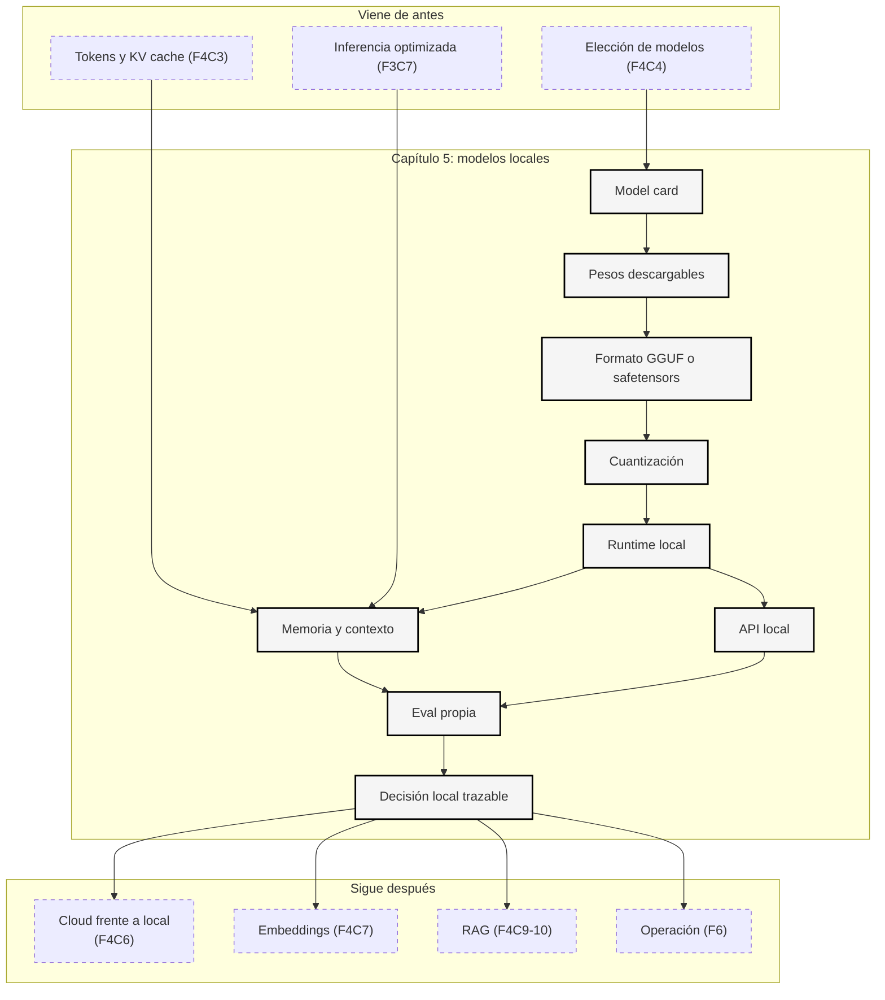

::: {.fasciculo-subtitle}
Facsímil 4 · La caja de herramientas
:::

# Capítulo 05: Modelos locales: Ollama, LM Studio, GGUF y cuantización

## Cuando el modelo se queda en tu máquina

Hay una frase que suena sencilla: “lo corremos en local”. Parece que significa privacidad, control, coste bajo y ausencia de dependencias externas. A veces es verdad. Otras veces significa otra cosa: descargar un fichero enorme, pelear con memoria, descubrir que el contexto no cabe, que el modelo responde lento, que la cuantización cambia el comportamiento o que la API local está expuesta de una forma que nadie revisó.

Venimos del [capítulo 04](/libro/fasciculo-04/#capitulo-04), donde aprendimos a leer model cards. Ahora bajamos un nivel: **qué ocurre cuando eliges un modelo descargable y quieres ejecutarlo tú**. Ya no basta con preguntar si el modelo es bueno. Hay que preguntar si cabe, si responde a tiempo, si el runtime entiende su formato, si la licencia encaja, si la calidad tras cuantizar sigue siendo suficiente y si puedes medirlo sin engañarte.

La idea central es esta: **un modelo local no es solo un modelo; es la suma de pesos, formato, runtime, hardware, configuración, API, licencia y evaluación**.

## Estado del arte con fecha de corte

**Fecha de corte:** 10 de junio de 2026.  
**Fuentes consultadas ese día:** documentación oficial de Ollama, LM Studio, Hugging Face Hub sobre GGUF, repositorio de llama.cpp y papers de cuantización LLM.int8, SmoothQuant, GPTQ, AWQ, QLoRA y cuantización entera clásica.

Lo estable es el mecanismo: descargar pesos, elegir formato, cargar en un runtime, repartir memoria entre CPU/GPU, configurar contexto y generación, exponer una API si hace falta, medir calidad y latencia. Lo cambiante son nombres de modelos, soporte de GPU, formatos concretos, variantes de cuantización, límites de contexto y compatibilidad de cada aplicación.

| Fuente | Qué aporta | Qué decisión permite tomar |
|---|---|---|
| Ollama API.^[Ollama. (2026). *Introduction to the Ollama API*. https://docs.ollama.com/api/introduction. Consultado el 10 de junio de 2026.] | API local por defecto, endpoints, librerías y compatibilidad básica. | Saber si tu app puede llamar al modelo como servicio local. |
| Ollama Modelfile.^[Ollama. (2026). *Modelfile Reference*. https://docs.ollama.com/modelfile. Consultado el 10 de junio de 2026.] | `FROM`, `PARAMETER`, `TEMPLATE`, `SYSTEM`, `ADAPTER`, `LICENSE` y `MESSAGE`. | Saber qué parte de la conducta se fija en la definición del modelo. |
| Ollama context length.^[Ollama. (2026). *Context length*. https://docs.ollama.com/context-length. Consultado el 10 de junio de 2026.] | Relación entre VRAM, contexto por defecto y memoria necesaria. | No subir contexto sin calcular memoria. |
| Ollama hardware support.^[Ollama. (2026). *Hardware support*. https://docs.ollama.com/gpu. Consultado el 10 de junio de 2026.] | Soporte de NVIDIA, AMD, Metal y Vulkan. | Comprobar si tu máquina acelera o cae a CPU. |
| Ollama OpenAI compatibility.^[Ollama. (2026). *OpenAI compatibility*. https://docs.ollama.com/api/openai-compatibility. Consultado el 10 de junio de 2026.] | Compatibilidad con parte de la API de OpenAI. | Reutilizar clientes existentes sabiendo que “compatible” no significa idéntico. |
| LM Studio basics.^[LM Studio. (2026). *Get started with LM Studio*. https://lmstudio.ai/docs/app/basics. Consultado el 10 de junio de 2026.] | Flujo de descarga y ejecución local de modelos con pesos accesibles. | Entender qué se descarga y qué significa correr un modelo desde una UI. |
| LM Studio REST API.^[LM Studio. (2026). *LM Studio API*. https://lmstudio.ai/docs/developer/rest. Consultado el 10 de junio de 2026.] | API nativa local y endpoints compatibles con OpenAI y Anthropic. | Decidir si LM Studio será UI, servidor local o ambas cosas. |
| LM Studio load.^[LM Studio. (2026). *lms load*. https://lmstudio.ai/docs/cli/local-models/load. Consultado el 10 de junio de 2026.] | Carga con contexto, GPU offload, TTL y estimación de memoria. | Probar si un modelo cabe antes de cargarlo. |
| Hugging Face GGUF.^[Hugging Face. (2026). *GGUF*. https://huggingface.co/docs/hub/en/gguf. Consultado el 10 de junio de 2026.] | GGUF como formato con tensores y metadatos; visor de metadata y tipos de cuantización. | Leer un `.gguf` como fichero técnico, no como etiqueta comercial. |
| llama.cpp.^[ggml-org. (2026). *llama.cpp: LLM inference in C/C++*. https://github.com/ggml-org/llama.cpp. Consultado el 10 de junio de 2026.] | Runtime C/C++ base del ecosistema GGUF. | Entender de dónde vienen muchas piezas de Ollama, LM Studio y herramientas locales. |
| LLM.int8.^[Dettmers, T., Lewis, M., Belkada, Y. y Zettlemoyer, L. (2022). *LLM.int8(): 8-bit Matrix Multiplication for Transformers at Scale*. *Advances in Neural Information Processing Systems 35*. https://doi.org/10.52202/068431-2198.] | Cuantización 8-bit cuidando valores atípicos en LLMs grandes. | Entender por qué bajar bits no es solo redondear números. |
| SmoothQuant.^[Xiao, G. et al. (2023). *SmoothQuant: Accurate and Efficient Post-Training Quantization for Large Language Models*. *Proceedings of ICML*. https://arxiv.org/abs/2211.10438.] | Reescalado de pesos y activaciones para cuantización post-entrenamiento. | Entender por qué activaciones y pesos se tratan juntos en algunos despliegues. |
| GPTQ.^[Frantar, E., Ashkboos, S., Hoefler, T. y Alistarh, D. (2022). *GPTQ: Accurate Post-Training Quantization for Generative Pre-trained Transformers*. https://arxiv.org/abs/2210.17323.] | Cuantización post-entrenamiento de pesos usando información aproximada de segundo orden. | Leer GPTQ como método de compresión medible, no como sufijo decorativo. |
| AWQ.^[Lin, J. et al. (2024). *AWQ: Activation-aware Weight Quantization for LLM Compression and Acceleration*. *Proceedings of Machine Learning and Systems*. https://arxiv.org/abs/2306.00978.] | Cuantización orientada a pesos importantes según activaciones. | Saber por qué algunas cuantizaciones conservan mejor calidad que otras. |
| QLoRA.^[Dettmers, T., Pagnoni, A., Holtzman, A. y Zettlemoyer, L. (2023). *QLoRA: Efficient Finetuning of Quantized LLMs*. *Advances in Neural Information Processing Systems 36*. https://arxiv.org/abs/2305.14314.] | Fine-tuning eficiente sobre modelos cuantizados de 4 bits. | Separar servir un modelo cuantizado de ajustar adaptadores sobre una base cuantizada. |
| Cuantización entera clásica.^[Jacob, B. et al. (2018). *Quantization and Training of Neural Networks for Efficient Integer-Arithmetic-Only Inference*. *Proceedings of CVPR*, 2704-2713. https://doi.org/10.1109/CVPR.2018.00286.] | Base de cuantización para inferencia eficiente con enteros. | Recordar que cuantizar es aproximar cálculo, no comprimir un ZIP. |

La revisión del 10 de junio añade un matiz importante: “uso Ollama” ya no equivale necesariamente a “todo corre en mi portátil”. Ollama documenta Cloud como una forma de usar modelos remotos grandes con herramientas locales, mientras que la API local sigue viviendo por defecto en `localhost:11434`.^[Ollama. (2026). *Cloud*. https://docs.ollama.com/cloud. Consultado el 10 de junio de 2026.] LM Studio documenta un servidor local que puede exponerse en la máquina o en red y que ofrece API nativa, compatibilidad OpenAI y compatibilidad Anthropic.^[LM Studio. (2026). *Local Server*. https://lmstudio.ai/docs/developer/core/server. Consultado el 10 de junio de 2026.] llama.cpp, por su parte, documenta `llama-server` con endpoints compatibles, batching, métricas y salidas restringidas por schema.^[ggml-org. (2026). *llama-server*. https://github.com/ggml-org/llama.cpp/blob/master/tools/server/README.md. Consultado el 10 de junio de 2026.]

La consecuencia práctica es clara: cuando digas “modelo local”, documenta **dónde se ejecuta realmente**, qué puerto abre, si acepta tráfico de red, qué autenticación tiene, qué contexto reserva, qué cuantización usa, qué plantilla de chat aplica y qué versión del runtime lo sirve. La diferencia entre una práctica de clase y un incidente de seguridad puede ser una bandera de host mal puesta.

## Qué no es correr un modelo en local

Correr un modelo en local **no** significa automáticamente que sea privado en sentido fuerte. Si descargas pesos desde un repositorio externo, ejecutas una app, expones un puerto, instalas extensiones o conectas herramientas, sigues teniendo superficie técnica que revisar. Local reduce ciertos problemas de envío de datos a un proveedor remoto, pero no elimina los problemas de licencia, procedencia de ficheros, logs, permisos, backups o red.

Tampoco significa “gratis”. Dejas de pagar por token a una API, pero pagas en hardware, electricidad, tiempo de instalación, memoria, mantenimiento, actualizaciones y evaluación. Si un portátil tarda 40 segundos en responder a una tarea que una API resuelve en 2 segundos por céntimos, puede que local no sea más barato para ese flujo.

Y no significa “igual que el modelo original, pero comprimido”. Un GGUF Q4 no es el mismo objeto operativo que un checkpoint BF16. Puede ser suficientemente bueno, pero hay que demostrarlo con casos propios. Si no mides, no has elegido cuantización; has elegido esperanza.

## Qué sí es un modelo local

Un modelo local es un sistema de inferencia donde tú controlas la máquina que carga los pesos. Esa frase es más precisa que “lo tengo en mi ordenador”. Controlar la máquina implica decidir formato, runtime, memoria, configuración, API, permisos y actualización.

| Pieza | Qué es | Qué pregunta responde |
|---|---|---|
| Pesos | Ficheros con matrices aprendidas durante entrenamiento o ajuste. | ¿Qué modelo estoy ejecutando realmente? |
| Formato | GGUF, safetensors, ONNX, TensorRT u otro contenedor. | ¿Qué runtime puede abrirlo? |
| Runtime | Ollama, LM Studio, llama.cpp, vLLM, SGLang, Transformers u otro. | ¿Quién gestiona memoria y generación? |
| Hardware | CPU, GPU, NPU, VRAM, RAM, memoria unificada. | ¿Cabe y a qué velocidad responde? |
| Configuración | Contexto, cuantización, GPU offload, temperatura, top-p, stops. | ¿Cómo se comporta en cada llamada? |
| API local | Endpoint HTTP o SDK para llamarlo desde una app. | ¿Cómo lo integro en un producto o notebook? |
| Evaluación | Casos propios con calidad, latencia y memoria. | ¿Sirve para mi tarea, no solo para una demo? |

La pregunta profesional no es “¿puedo ejecutarlo?”. Es: **¿puedo ejecutarlo con calidad, latencia, memoria, licencia y mantenimiento aceptables?**

## La pila local por dentro

Un modelo local atraviesa una pila. Si una pieza falla, el resultado final falla aunque el modelo sea bueno.

| Capa | Qué mide | Qué aporta | Qué sería razonable |
|---|---|---|---|
| Licencia | Permisos de uso, modificación y redistribución. | Reduce riesgo jurídico y de producto. | Leer licencia del modelo y de variantes derivadas antes de automatizar. |
| Procedencia | Quién publicó el fichero y con qué historial. | Evita comparar copias, forks o variantes sin saberlo. | Guardar repo, archivo exacto, hash o commit cuando sea posible. |
| Formato | Cómo están empaquetados pesos y metadatos. | Determina runtime compatible. | GGUF para llama.cpp/Ollama/LM Studio; safetensors para ecosistema Transformers. |
| Bits por peso | Memoria aproximada de pesos. | Estima si cabe y cuánta calidad podrías perder. | BF16 como referencia; Q4/Q5 si necesitas local barato; Q8 si tienes memoria. |
| Contexto | Tokens que entran en memoria. | Permite tareas largas, pero aumenta KV cache. | No subir contexto sin medir VRAM/RAM y TTFT. |
| GPU offload | Capas o partes movidas a GPU. | Reduce latencia si cabe en VRAM. | Usar GPU para capas máximas sin expulsar KV cache ni forzar intercambio lento. |
| API | Contrato de integración. | Permite usarlo desde una app. | Probar streaming, errores, JSON y límites antes de cambiar proveedor. |
| Observabilidad | Logs, tiempo, tokens/s, memoria, errores. | Permite saber qué pasa cuando algo va lento. | Medir p50/p95, TTFT, tokens/s y memoria por caso. |

La segunda pasada obligatoria es preguntarse qué falta. En un primer intento solemos mirar solo “modelo y cuantización”. Falta comprobar licencia, procedencia, hash, contexto real, plantilla de chat, memoria de KV cache, parámetros de muestreo, endpoint, exposición de red, eval propia y plan de actualización. Si no está escrito, no existe.

La tercera pasada es rehacer la decisión como si tuviera que explicarse en una reunión: “elegimos este modelo local porque cabe con esta cuantización, responde en este p95, conserva esta calidad frente al baseline, usa esta licencia, se integra por esta API y tiene esta alternativa si falla”.

## Memoria: la cuenta que evita la fantasía

Antes de descargar nada, haz una estimación. No será perfecta, pero evita decisiones imposibles.

La memoria mínima de pesos se aproxima así:

$$
M_{\text{pesos}} \approx N_{\text{parametros}} \cdot \frac{b_{\text{peso}}}{8}
$$

| Símbolo | Significado | Ejemplo |
|---|---|---|
| \(M_{\text{pesos}}\) | Memoria aproximada ocupada solo por pesos. | Un 7B Q4 ronda 3,5 GB antes de sobrecostes. |
| \(N_{\text{parametros}}\) | Número de parámetros del modelo. | 7B, 14B, 32B, 70B. |
| \(b_{\text{peso}}\) | Bits por peso tras cuantizar. | 16, 8, 5, 4, 3. |

Pero un modelo cargado no son solo pesos.

**Ejemplo de fórmula.** Una cuenta más honesta es:

$$
M_{\text{total}} \approx M_{\text{pesos}} + M_{\text{KV}} + M_{\text{runtime}} + M_{\text{margen}}
$$

| Símbolo | Significado | Por qué importa |
|---|---|---|
| \(M_{\text{KV}}\) | Memoria de la KV cache. | Crece con contexto, capas, batch y dimensiones de atención. |
| \(M_{\text{runtime}}\) | Memoria del programa, buffers y kernels. | No aparece en el tamaño del fichero. |
| \(M_{\text{margen}}\) | Colchón para sistema operativo, UI, navegador, otros procesos y picos. | Si no hay margen, el sistema intercambia memoria y se vuelve lento. |

Regla de bolsillo para pesos:

| Modelo denso | BF16/F16 | Q8/INT8 | Q5 aprox. | Q4 aprox. | Lectura práctica |
|---|---:|---:|---:|---:|---|
| 3B | ~6 GB | ~3 GB | ~1,9 GB | ~1,5 GB | Buen candidato para portátiles modestos. |
| 7B | ~14 GB | ~7 GB | ~4,4 GB | ~3,5 GB | Punto de entrada local serio. |
| 14B | ~28 GB | ~14 GB | ~8,8 GB | ~7 GB | Empieza a exigir GPU/RAM holgada. |
| 32B | ~64 GB | ~32 GB | ~20 GB | ~16 GB | Normalmente workstation o servidor. |
| 70B | ~140 GB | ~70 GB | ~44 GB | ~35 GB | Multi-GPU, mucha RAM o paciencia. |

Lo adecuado depende de la tarea:

| Situación | Punto de partida razonable | Por qué |
|---|---|---|
| Notebook, aprendizaje, privacidad personal | 3B-8B en Q4/Q5. | Cabe mejor y permite experimentar. |
| Clasificación o extracción sencilla | 7B-14B Q4/Q5 con salida estructurada. | Calidad suficiente si la tarea está bien acotada. |
| Código, razonamiento o agente local | 14B-32B si cabe, comparado contra API. | Estos casos sufren más con modelos pequeños. |
| Producción con usuarios simultáneos | Runtime de servidor, medición p95 y modelo alternativo. | El problema ya no es una conversación aislada. |
| Datos sensibles con restricción fuerte | Local o entorno privado con auditoría. | El criterio principal es control, no solo calidad. |

La frase “este modelo cabe” debe significar algo concreto: cabe con **este contexto**, **esta cuantización**, **este batch**, **esta GPU offload**, **este margen de memoria** y **esta calidad medida**.

## Ollama: cómodo no significa invisible

Ollama es una forma práctica de ejecutar modelos y hablar con ellos por CLI, app o API. La documentación oficial indica que su API local se sirve por defecto en `http://localhost:11434/api`, y que también ofrece librerías oficiales para Python y JavaScript. Esa comodidad es valiosa porque permite convertir un modelo local en un servicio consumible por scripts, notebooks o aplicaciones.

Lo importante es no tratar Ollama como una caja opaca. Ollama decide cómo cargar el modelo, qué contexto usar, qué parámetros aplicar y cómo exponer endpoints. Debes saber leer esas decisiones.

| Término | Qué mide o controla | Ejemplo | Decisión práctica |
|---|---|---|---|
| `ollama run` | Conversación rápida por terminal. | `ollama run gemma3` | Bien para probar; no basta para evaluar producto. |
| API local | Contrato HTTP local. | `POST /api/generate` o `POST /api/chat`. | Útil para integrar en Python, JS o una app interna. |
| OpenAI compatibility | Adaptación parcial a clientes existentes. | `/v1/chat/completions`. | Reutiliza SDKs, pero valida parámetros soportados y errores. |
| `Modelfile` | Receta reproducible de modelo, plantilla y parámetros. | `FROM llama3.2`, `PARAMETER num_ctx 4096`, `SYSTEM ...`. | No guardes solo “uso llama”; guarda el Modelfile. |
| `FROM` | Modelo base o fichero GGUF/safetensors. | `FROM ./modelo.gguf`. | Define qué pesos cargas realmente. |
| `PARAMETER num_ctx` | Tamaño de contexto. | `num_ctx 4096`. | Más contexto usa más memoria; no es gratis. |
| `TEMPLATE` | Plantilla de prompt. | Formato de roles y separadores. | Si está mal, el modelo parece peor. |
| `ADAPTER` | Adaptador LoRA/QLoRA. | `ADAPTER ./adapter.gguf`. | Solo encaja si base y adaptador corresponden. |
| `LICENSE` | Texto legal asociado. | Licencia incluida en el Modelfile. | Necesario si empaquetas o compartes. |
| `ollama ps` | Modelos cargados, procesador y contexto. | `100% GPU`, `CONTEXT 65536`. | Comprueba si de verdad está en GPU y qué contexto usa. |

Ollama documenta valores por defecto de contexto según VRAM: por debajo de 24 GiB, 4k; entre 24 y 48 GiB, 32k; desde 48 GiB, 256k. También recomienda contextos altos para tareas como web search, agentes y herramientas de código. La lectura correcta no es “sube contexto a 64k siempre”, sino “si la tarea lo requiere, calcula memoria y verifica `ollama ps`”.

Situación concreta: quieres usar un modelo local para revisar un repositorio. Si el agente mete muchos ficheros en contexto, 4k no alcanza. Pero subir a 64k puede llenar VRAM. La solución profesional no es elegir al azar: mide cuántos tokens entran, decide qué se recupera, sube contexto solo si aporta y comprueba TTFT y p95.

## LM Studio: visual, local y medible

LM Studio entra por otro camino: hace cómoda la experiencia visual de buscar, descargar, cargar y probar modelos locales. Su documentación recuerda una distinción importante: para correr local necesitas acceso a los pesos, normalmente en formatos como `.gguf` o `.safetensors`.

Además de UI, LM Studio ofrece API REST local, endpoints compatibles con OpenAI y Anthropic, y CLI. En su REST API v1 aparecen endpoints como `/api/v1/chat`, `/api/v1/models`, `/api/v1/models/load`, `/api/v1/models/unload` y `/api/v1/models/download`. Eso convierte LM Studio en algo más que una app de chat: puede ser un servidor local de desarrollo.

| Término | Qué mide o controla | Ejemplo | Decisión práctica |
|---|---|---|---|
| Modelo descargado | Fichero local con pesos. | Un `.gguf` de Qwen, Mistral o Gemma. | Comprueba licencia, tamaño, cuantización y procedencia. |
| `lms load` | Cargar un modelo en memoria. | `lms load <model_key>`. | Separa descargar de cargar; no todo lo descargado está activo. |
| `--context-length` | Tokens de contexto al cargar. | `--context-length 8192`. | Mide memoria y calidad con ese contexto, no con el máximo teórico. |
| `--gpu` | Proporción de offload a GPU. | `--gpu 0.5`, `--gpu max`, `--gpu off`. | Si no usas GPU, la experiencia puede cambiar mucho. |
| `--estimate-only` | Estimar memoria sin cargar. | `lms load --estimate-only <model_key>`. | Úsalo antes de romper la sesión por falta de memoria. |
| TTL | Descargar de memoria tras inactividad. | `--ttl 3600`. | Evita dejar modelos ocupando RAM/VRAM todo el día. |
| API nativa | Endpoint local propio. | `/api/v1/chat`. | Útil si quieres capacidades específicas de LM Studio. |
| OpenAI-compatible | Endpoint familiar para clientes existentes. | `/v1/chat/completions`. | Valida streaming, structured output y parámetros. |

LM Studio también permite configurar parámetros de inferencia, como `temperature`, `maxTokens` y `topP`, y parámetros de carga, como longitud de contexto y GPU offload. La separación es crucial: `temperature` cambia cómo se elige el siguiente token; `contextLength` cambia cuánta memoria reserva el sistema al cargar.

Situación concreta: en una clase o equipo, LM Studio es excelente para enseñar porque el lector ve el modelo, el fichero, la carga, la conversación y el servidor. En un backend repetible, quizá prefieras Ollama o llama.cpp directamente. La decisión no es “cuál mola más”, sino qué necesitas: UI, script, servidor, compatibilidad, trazabilidad o control fino.

## Una prueba local que sí se puede repetir

Una prueba local no debería consistir en abrir una ventana, hacer una pregunta y decidir por impresión. Eso sirve para orientarse, pero no para elegir. Una prueba mínima debe dejar huella: qué modelo era, qué fichero, qué cuantización, qué runtime, qué contexto, qué máquina, qué prompt, qué salida y qué métricas.

Con Ollama, una llamada mínima a la API local puede parecer así:

```bash
curl http://localhost:11434/api/chat \
  -H "Content-Type: application/json" \
  -d '{
    "model": "llama3.2",
    "messages": [
      {"role": "system", "content": "Responde en español claro y devuelve JSON válido."},
      {"role": "user", "content": "Clasifica esta incidencia: no puedo entrar al campus virtual."}
    ],
    "stream": false,
    "options": {
      "temperature": 0.2,
      "num_ctx": 4096
    }
  }'
```

Con LM Studio en modo compatible con OpenAI, una llamada de integración puede tener esta forma:

```bash
curl http://localhost:1234/v1/chat/completions \
  -H "Content-Type: application/json" \
  -d '{
    "model": "modelo-local-cargado",
    "messages": [
      {"role": "system", "content": "Extrae campos con precisión. Si falta un dato, usa null."},
      {"role": "user", "content": "Factura 2026-05: total 184,30 EUR; proveedor Norte S.L."}
    ],
    "temperature": 0.1,
    "max_tokens": 300
  }'
```

Lo importante no es copiar esos comandos tal cual, sino entender qué contrato crean:

| Campo | Qué controla | Qué anotar |
|---|---|---|
| `model` | Identificador que el runtime resuelve a pesos concretos. | Nombre exacto, origen y, si es posible, hash o ruta. |
| `messages` | Plantilla de conversación convertida a tokens. | System prompt, user prompt y versión del caso de prueba. |
| `temperature` | Aleatoriedad de muestreo. | Valor fijo durante eval; si cambia, cambia la comparación. |
| `num_ctx` / contexto | Ventana que reserva memoria. | Contexto usado, no el máximo anunciado. |
| `max_tokens` | Límite de salida. | Evita comparar respuestas truncadas con completas. |
| `stream` | Si la salida llega por partes. | Afecta percepción de latencia y forma de medir TTFT. |

Una tabla de evaluación mínima tendría estas columnas:

| Columna | Qué significa | Por qué importa |
|---|---|---|
| `fecha` | Día de la prueba. | Los modelos, runtimes y drivers cambian. |
| `runtime` | Ollama, LM Studio, llama.cpp, vLLM, etc. | El mismo fichero puede rendir distinto. |
| `version_runtime` | Versión instalada. | Una actualización puede cambiar memoria o salida. |
| `modelo_origen` | Repositorio o proveedor de pesos. | Evita comparar copias distintas. |
| `fichero` | Nombre exacto del GGUF/safetensors. | Incluye cuantización y variante. |
| `contexto` | Tokens de contexto configurados. | Cambia memoria y a veces calidad. |
| `caso_id` | Identificador del caso de prueba. | Permite repetir y depurar. |
| `ok_formato` | Si cumple contrato de salida. | Importa tanto como “suena bien”. |
| `ok_contenido` | Si la respuesta es correcta. | Métrica principal de utilidad. |
| `ttft_s` | Tiempo hasta primer token. | Mide sensación inicial de respuesta. |
| `tokens_s` | Tokens de salida por segundo. | Mide velocidad de generación. |
| `memoria_pico_gb` | Pico observado de RAM/VRAM. | Detecta candidatos que caben sin margen real. |
| `observacion` | Fallo o matiz concreto. | Ayuda a saber qué mejorar. |

La regla profesional es comparar siempre contra algo: contra una API fuerte, contra Q8, contra otro runtime o contra el mismo modelo con menos contexto. Un resultado aislado no dice si el sistema es bueno; solo dice que funcionó una vez.

## Medir latencia y velocidad sin engañarse

En local se habla mucho de “va rápido” o “va lento”. Para que esa frase sirva, hay que separarla en métricas.

$$
TTFT = t_{\text{primer\ token}} - t_{\text{envio}}
$$

$$
\text{tokens/s} = \frac{N_{\text{tokens\ salida}}}{t_{\text{fin}} - t_{\text{primer\ token}}}
$$

$$
p95 = \text{percentil}_{95}(\text{latencias})
$$

| Métrica | Qué aporta | Qué valor es adecuado |
|---|---|---|
| TTFT | Cuánto espera la persona hasta ver que algo empieza. | Bajo si hay interacción humana; menos crítico en batch. |
| Tokens/s | Ritmo de generación una vez arrancó. | Depende de longitud de salida; compáralo en los mismos casos. |
| Latencia total | Tiempo desde petición hasta respuesta completa. | Importa cuando la salida debe estar cerrada para continuar. |
| p95 | Cómo se comporta el sistema en casos lentos. | Más útil que el promedio si hay usuarios reales. |
| Memoria pico | Máximo de RAM/VRAM observado. | Debe dejar margen; si va al límite, el sistema será frágil. |
| Tasa de formato válido | Porcentaje de salidas parseables. | Crucial en JSON, SQL, extracción o agentes. |

Ejemplo: un modelo que da 35 tokens/s puede parecer mejor que otro de 22 tokens/s. Pero si el primero falla JSON en 8 de cada 100 casos y el segundo falla en 1, el segundo puede ser mejor para una integración. La métrica adecuada depende de qué duele más: espera, coste, errores de formato, memoria o mantenimiento.

## GGUF: el fichero no es el modelo, es el contenedor operativo

GGUF aparece en muchas páginas de modelos y causa una confusión frecuente. No es una arquitectura. No es una familia. No es una licencia. Es un formato de fichero pensado para guardar pesos y metadatos de forma útil para runtimes como llama.cpp.

Hugging Face describe GGUF como un formato binario optimizado para carga y guardado eficiente de modelos; a diferencia de formatos solo de tensores, GGUF incorpora tensores y metadatos estandarizados. Además, el Hub ofrece visor de metadatos y tipos de tensor para archivos GGUF.

| Dato en un GGUF | Qué mide | Qué aporta | Qué sería razonable |
|---|---|---|---|
| Arquitectura | Familia que espera el runtime. | Saber si puede cargarse. | No forzar un runtime que no soporta esa arquitectura. |
| Contexto declarado | Longitud máxima o recomendada. | Límite operativo inicial. | Probar contexto real, no solo máximo. |
| Tipo de cuantización | Bits y método de aproximación. | Memoria y calidad esperada. | Q4/Q5 para equilibrio, Q8 para calidad si cabe, Q2/Q3 solo con eval fuerte. |
| Tensor info | Nombre, forma y precisión de tensores. | Auditar qué hay dentro. | Revisar si algo no cuadra entre card y fichero. |
| Tokenizer metadata | Cómo partir texto. | Evitar prompts mal codificados. | No mezclar tokenizer de otro modelo. |
| Chat template | Formato de conversación. | Convertir roles a tokens correctos. | Probar con plantilla del modelo, no inventarla. |

Nombres como `Q4_K_M`, `Q5_K_M` o `Q8_0` no son decoración. Indican una estrategia de cuantización. Aun así, no hay que tratarlos como una escala universal de calidad. Dos modelos distintos pueden perder capacidades distintas al pasar a Q4. Una tarea de resumen puede sobrevivir bien; una tarea de código o extracción exacta puede sufrir más.

| Variante orientativa | Qué aporta | Cuándo probarla | Qué comparar |
|---|---|---|---|
| F16/BF16 | Referencia de más calidad y más memoria. | Si tienes RAM/VRAM suficiente. | Sirve como baseline contra cuantizadas. |
| Q8 | Cerca de calidad alta con menos memoria. | Si Q4 falla o la tarea es delicada. | Calidad frente a F16/BF16 y latencia. |
| Q5 | Equilibrio entre memoria y calidad. | Buen primer candidato si Q4 queda justo. | Errores en casos difíciles. |
| Q4 | Mucho ahorro de memoria. | Portátiles, demos, prototipos y tareas acotadas. | Formato, razonamiento, código y alucinaciones. |
| Q2/Q3 | Ahorro agresivo. | Solo si la restricción de memoria manda. | Degradación fuerte con eval propia. |

La pregunta “¿qué cuantización uso?” debería reformularse así: “¿cuál es la menor cuantización que mantiene calidad suficiente en mis casos, con latencia y memoria aceptables?”.

## Cuantizar no es comprimir un archivo

Cuantizar significa aproximar números. En un modelo, los pesos son valores numéricos. Si los representas con menos bits, ocupan menos y pueden moverse más rápido, pero pierdes resolución. La cuestión es dónde se pierde, cuánto se pierde y si tu tarea lo nota.

La idea matemática mínima es esta. Un peso real \(x\), que antes vivía como FP16, BF16 o FP32, se guarda como un entero pequeño \(q\). Para volver a usarlo, el runtime reconstruye una aproximación \(\hat{x}\):

$$
q = \operatorname{clip}\left(\operatorname{round}\left(\frac{x}{s}\right) + z,\ q_{\min},\ q_{\max}\right)
$$

$$
\hat{x} = s \cdot (q - z)
$$

| Símbolo | Qué significa | Qué aporta |
|---|---|---|
| \(x\) | Valor original del peso o activación. | Referencia de calidad. |
| \(q\) | Entero almacenado con pocos bits. | Ahorro de memoria y movimiento de datos. |
| \(s\) | Escala de cuantización. | Dice cuánto vale un paso entero en el mundo real. |
| \(z\) | Zero-point. | Permite desplazar el cero en cuantización asimétrica. |
| \(q_{\min}, q_{\max}\) | Rango posible del entero. | En 4 bits hay muchos menos valores que en 8 o 16. |
| \(\hat{x}\) | Valor reconstruido. | Lo que realmente usa el cálculo tras cuantizar. |

Si cuantizas a 4 bits, cada valor no puede tomar infinitos matices: solo hay 16 códigos posibles por grupo. El truco está en elegir bien la escala, el grupo y qué tensores reciben más precisión. Por eso dos ficheros Q4 pueden comportarse diferente aunque ambos “sean Q4”.

La pérdida local de información se puede mirar así:

$$
\epsilon_W = \frac{\lVert W - \hat{W} \rVert_2}{\lVert W \rVert_2}
$$

Pero esa fórmula no basta para decidir. Un error pequeño en una matriz puede afectar mucho a una tarea de código, y un error mayor puede ser tolerable en una tarea de clasificación sencilla. **La calidad final no se certifica mirando solo el error de pesos; se certifica con casos de uso.**

### Qué se puede cuantizar

No todo se cuantiza igual. Esta distinción evita muchas confusiones:

| Qué se cuantiza | Qué cambia | Qué aporta | Riesgo |
|---|---|---|---|
| Pesos | Se guardan matrices del modelo con menos bits. | Reduce tamaño del fichero y memoria de carga. | Puede degradar razonamiento, código o extracción fina. |
| Activaciones | Se aproximan valores intermedios durante inferencia. | Puede acelerar cálculo si el hardware lo aprovecha. | Más delicado: cambia señales que dependen de cada entrada. |
| KV cache | Se guarda la memoria de atención con menos precisión. | Ahorra mucho en contextos largos. | Puede empeorar recuperación de detalles lejanos. |
| Adaptadores | Se ajustan piezas pequeñas sobre una base cuantizada. | Permite fine-tuning barato con QLoRA. | No convierte una base pobre en una buena por sí solo. |
| Embeddings | Se reducen vectores de representación. | Ahorra almacenamiento y búsqueda. | Puede afectar ranking semántico y vecinos cercanos. |

En modelos locales de escritorio, muchas veces estás usando **cuantización de pesos**. Eso no significa que todas las operaciones internas sean enteras, ni que las activaciones estén cuantizadas, ni que el runtime use la GPU de la misma forma que un servidor optimizado. Esta frase es importante: **peso cuantizado no significa inferencia entera de punta a punta**.

### Granularidad: dónde se decide el daño

Una misma cuantización de 4 bits puede ser muy distinta según cuántos pesos comparten escala.

| Granularidad | Qué ocurre | Ventaja | Coste |
|---|---|---|---|
| Por tensor | Toda la matriz comparte escala. | Muy simple y pocos metadatos. | Mala si hay valores con rangos muy distintos. |
| Por canal o fila | Cada fila/canal tiene su escala. | Mejor preservación de matrices grandes. | Más metadatos. |
| Por grupo o bloque | Grupos de 32, 64, 128 u otro tamaño comparten escala. | Buen equilibrio en LLMs locales. | Más complejo; cada formato lo concreta distinto. |
| Mixta por tensor | Algunos tensores reciben más bits que otros. | Protege partes sensibles del modelo. | El nombre del fichero ya no cuenta toda la historia. |

La regla práctica: **grupos más pequeños suelen conservar mejor la señal, pero añaden metadatos y complejidad**. En GGUF, los sufijos como `Q4_K_M` resumen una receta; no sustituyen leer metadata, card del cuantizador y evaluación.

### Familias importantes

LLM.int8 mostró que en LLMs grandes no basta con pasar todo a 8 bits de forma ingenua: hay valores atípicos que conviene tratar con cuidado. SmoothQuant redistribuye dificultad entre activaciones y pesos para hacer más viable la cuantización de activaciones. GPTQ propuso una ruta de cuantización post-entrenamiento para modelos generativos usando información aproximada de segundo orden. AWQ se fijó en qué pesos importan más según activaciones para preservar mejor comportamiento. QLoRA popularizó ajustar modelos usando una base cuantizada de 4 bits con adaptadores entrenables. La cuantización clásica de redes ya venía de antes, pero los LLMs hicieron visible que no todos los pesos duelen igual.

| Método o familia | Qué cambia | Qué aporta | Qué prueba haría |
|---|---|---|---|
| INT8 / LLM.int8 | Baja a 8 bits cuidando valores atípicos. | Menos memoria con pérdida pequeña si se hace bien. | Comparar exactitud y formato contra BF16. |
| SmoothQuant | Reescala pesos y activaciones antes de cuantizar. | Hace más manejable cuantizar activaciones. | Medir latencia real en el runtime elegido. |
| GPTQ | Cuantización post-entrenamiento de pesos. | Ficheros pequeños y rápidos en ciertos runtimes. | Probar código, matemáticas y extracción. |
| AWQ | Conserva pesos relevantes según activaciones. | Buen equilibrio para despliegue eficiente. | Comparar frente a GPTQ/GGUF de mismo tamaño. |
| GGUF Q4/Q5/Q8 | Recetas prácticas para llama.cpp y derivados. | Uso local amplio y sencillo. | Medir calidad por tarea, no por sufijo. |
| QLoRA / NF4 | Fine-tuning eficiente sobre base cuantizada. | Ajustar comportamiento con mucha menos memoria. | No confundir ajustar con servir un modelo cuantizado. |

### Qué significa elegir Q4, Q5 o Q8

Los bits por peso reducen memoria, pero no de forma aislada. Hay metadatos, escalas, grupos y tensores con formatos distintos. Aun así, como intuición:

| Opción | Lectura técnica | Cuándo suele encajar | Cuándo sospechar |
|---|---|---|---|
| BF16/F16 | Baseline de alta fidelidad. | Evaluación de referencia y tareas delicadas. | Si no cabe o la latencia es inaceptable. |
| Q8 | Aproximación conservadora. | Cuando quieres ahorrar memoria sin perder demasiado. | Si el ahorro no basta para tu máquina. |
| Q6/Q5 | Punto intermedio. | Código, extracción y razonamiento moderado si Q4 falla. | Si el modelo sigue quedando lento o justo de memoria. |
| Q4 | Compromiso local popular. | Chat, resumen, clasificación acotada, aprendizaje y prototipos. | Si hay errores de formato, cálculo, SQL o instrucciones largas. |
| Q3/Q2 | Compromiso agresivo. | Solo cuando la máquina manda y la tarea tolera pérdida. | En casi todo lo que requiera precisión sostenida. |

Un ejemplo concreto: si un 7B Q4 cabe y responde fluido, puede ser buena elección para resumir tickets internos. Si el mismo modelo debe devolver JSON contractual con importes, fechas y campos obligatorios, Q5, Q8 o una API fuerte pueden ser más razonables. No porque Q4 sea “malo”, sino porque el coste del error cambió.

### Cómo evaluar una cuantización

**Ejemplo de fórmula.** Una evaluación mínima compara al menos dos candidatos sobre los mismos casos:

$$
\Delta_{\text{calidad}} = \text{score}_{\text{baseline}} - \text{score}_{\text{cuantizado}}
$$

$$
\text{ahorro} = 1 - \frac{M_{\text{cuantizado}}}{M_{\text{baseline}}}
$$

| Prueba | Qué detecta | Señal de alarma |
|---|---|---|
| Formato exacto | Si respeta JSON, CSV, SQL o campos obligatorios. | Respuestas bonitas pero no parseables. |
| Casos largos | Si conserva información al crecer el contexto. | Olvida restricciones del principio. |
| Cálculo simple | Si degrada operaciones numéricas. | Errores en sumas, importes o comparaciones. |
| Código | Si mantiene sintaxis y pruebas. | Soluciones que parecen plausibles pero no ejecutan. |
| Recuperación de datos | Si extrae hechos sin inventar. | Cambia nombres, fechas o cantidades. |
| Latencia | Si el ahorro de memoria mejora la experiencia. | Menos memoria, pero más lentitud por ruta de runtime. |

La decisión final debería escribirse así: “frente a BF16/Q8, esta cuantización ahorra X GB, mantiene Y de calidad en nuestros casos, empeora Z, y aun así compensa porque la tarea tolera ese error”. Si no puedes completar esa frase, todavía no has elegido; solo has descargado un fichero.

Ejemplo cercano: si el modelo debe escribir primeras versiones de correos, Q4 puede ser suficiente. Si debe extraer importes exactos de contratos, Q4 puede fallar de forma cara. Si debe generar SQL, un pequeño error puede romper la consulta. La cuantización adecuada depende del coste del error.

## El criterio de elección local

Antes de instalar nada, escribe la decisión como una matriz. No hace falta que sea perfecta; hace falta que obligue a pensar.

| Pregunta | Si la respuesta es sí | Si la respuesta es no |
|---|---|---|
| ¿Necesito que los datos no salgan de mi máquina o red? | Local gana peso. | API puede ser más simple. |
| ¿La tarea tolera algo menos de calidad? | Cuantización agresiva puede valer. | Baseline fuerte o API. |
| ¿Necesito baja latencia interactiva? | Mide TTFT y tokens/s local. | Batch o API pueden bastar. |
| ¿Tengo VRAM/RAM suficiente? | Prueba Q5/Q8 o modelos mayores. | Baja tamaño, baja contexto o usa cloud. |
| ¿Necesito integrar en app? | Ollama/LM Studio API/local server. | UI puede ser suficiente para aprendizaje. |
| ¿Necesito control fino de runtime? | llama.cpp/vLLM/SGLang. | Ollama o LM Studio simplifican. |
| ¿Puedo mantener actualizaciones? | Local es viable. | API gestionada reduce carga. |

Fíjate en que ninguna pregunta dice “¿qué modelo está de moda?”. El orden correcto es restricción, memoria, calidad, latencia, integración y mantenimiento.

## Qué ocurre cuando cargas un modelo local

“Cargar un modelo” no es abrir un archivo. Es convertir un conjunto de ficheros en un proceso de inferencia que ocupa memoria, reserva contexto, aplica una plantilla de chat y queda disponible para recibir peticiones.

El recorrido real suele ser este:

| Paso | Qué pasa | Qué puede fallar |
|---|---|---|
| 1. Resolver el identificador | `gemma3`, `llama3.2`, un GGUF concreto o un modelo importado se traducen a ficheros locales. | Creer que dos nombres parecidos son el mismo modelo. |
| 2. Leer metadatos | El runtime mira arquitectura, tokenizer, cuantización, contexto y plantilla. | Usar plantilla o tokenizer incorrectos. |
| 3. Mapear pesos | Los tensores se leen desde disco y se preparan para CPU, GPU o memoria unificada. | El fichero cabe en disco, pero no en memoria. |
| 4. Decidir offload | Algunas capas o cálculos pasan a GPU si hay VRAM o memoria unificada suficiente. | Parte cae a CPU y la latencia se dispara. |
| 5. Reservar KV cache | El runtime reserva memoria para claves y valores de atención según contexto. | Subir contexto llena memoria aunque el modelo pese lo mismo. |
| 6. Aplicar plantilla | Los mensajes `system`, `user` y `assistant` se convierten a tokens con el formato esperado. | El modelo “parece malo” porque se le habla con formato equivocado. |
| 7. Generar tokens | El modelo predice token a token usando sampling, stops, temperatura y límites. | La salida no respeta formato, tarda demasiado o consume más memoria de la prevista. |

En Ollama, el servidor local expone una API en `localhost:11434` y permite comprobar modelos cargados con `ollama ps`. En LM Studio, la app permite cargar desde interfaz y el CLI `lms` permite listar, cargar, descargar, iniciar servidor y ver qué está en memoria. En ambos casos hay una idea común: **descargar no es cargar, cargar no es evaluar, evaluar no es integrar**.

## Hardware y dependencias que sí importan

El hardware no se resume en “tengo GPU”. Para modelos locales, importan memoria, ancho de banda, drivers, disco, sistema operativo y puerto de servicio.

| Recurso | Qué mirar | Lectura práctica |
|---|---|---|
| Disco | Espacio para modelos, duplicados, cachés y versiones. | Un proyecto local puede ocupar decenas o cientos de GB. No lo metas sin pensar en el disco del sistema. |
| RAM | Memoria principal para CPU, buffers, runtime y partes no aceleradas. | Si no hay margen, el sistema intercambia memoria y todo parece roto. |
| VRAM o memoria unificada | Pesos, KV cache y buffers en GPU o Apple Silicon. | Un modelo Q4 pequeño puede ir fluido; uno grande con contexto alto puede dejar de caber. |
| CPU | Fallback y preparación de datos. | Sirve para ejecutar, pero puede ser demasiado lento para uso interactivo. |
| GPU y drivers | NVIDIA, AMD, Metal, ROCm, Vulkan o CPU. | Asegura soporte antes de prometer latencia. Ollama documenta NVIDIA, AMD, Metal y Vulkan. |
| Contexto | Tokens máximos disponibles en memoria. | Más contexto aumenta memoria; no es una barra “gratis”. |
| Puerto local | `11434` para Ollama, `1234` habitual en LM Studio. | Revisa si escucha solo en localhost o si lo expones en red. |
| Herramientas de trabajo | Terminal, `curl`, Python 3, runtime elegido y drivers. | Sin medición por terminal, todo queda en sensación visual. |

Dónde se guardan los modelos también importa. Ollama documenta rutas por defecto: macOS usa `~/.ollama/models`, Linux usa `/usr/share/ollama/.ollama/models` y Windows usa `C:\Users\%username%\.ollama\models`; si necesitas moverlos, `OLLAMA_MODELS` define otra ubicación. LM Studio lo gestiona desde “My Models” y `lms ls` refleja el directorio de modelos configurado en la app.

Una instalación local mínima tiene estas dependencias conceptuales:

| Dependencia | Para qué sirve | Señal de que está bien |
|---|---|---|
| Runtime | Cargar y ejecutar el modelo. | `ollama -v` o `lms --help` responden. |
| Modelo descargado | Tener pesos reales en disco. | `ollama list` o `lms ls` muestran el modelo. |
| Modelo cargado | Ocupar memoria para inferencia. | `ollama ps` o `lms ps` muestran un modelo activo. |
| API local | Integrar con scripts o apps. | `curl localhost:11434` o `curl localhost:1234` responde. |
| Driver GPU | Acelerar inferencia. | `ollama ps` indica GPU o `lms load --estimate-only` estima uso razonable. |
| Prueba propia | Ver si el sistema sirve para tu tarea. | Tienes métricas de latencia, memoria y formato válido. |

Mi recomendación para clase o primer montaje: empieza con un modelo pequeño o mediano, una cuantización conservadora (`Q4_K_M`, `Q5_K_M` o equivalente), contexto 4096 u 8192, y una tarea concreta. Luego sube tamaño o contexto solo si puedes explicar qué ganaste.

## Mapa visual del sistema local

<svg id="f4-c05-modelos-locales" xmlns="http://www.w3.org/2000/svg" viewBox="0 0 1240 900" role="img" aria-label="Arquitectura completa de un despliegue local: expediente, pesos, cuantización, memoria, runtime y evaluación">
  <title>Arquitectura completa de un despliegue local</title>
  <defs>
    <marker id="f4c05-arrow" viewBox="0 0 10 10" refX="9" refY="5" markerWidth="7" markerHeight="7" orient="auto">
      <path d="M 0 0 L 10 5 L 0 10 z" fill="#111111"/>
    </marker>
    <pattern id="f4c05-hatch" patternUnits="userSpaceOnUse" width="9" height="9" patternTransform="rotate(45)">
      <line x1="0" y1="0" x2="0" y2="9" stroke="#D8D8D8" stroke-width="2"/>
    </pattern>
    <pattern id="f4c05-dots" patternUnits="userSpaceOnUse" width="14" height="14">
      <circle cx="2" cy="2" r="1.4" fill="#CFCFCF"/>
    </pattern>
  </defs>

  <rect x="24" y="24" width="1192" height="828" rx="16" fill="#FFFFFF" stroke="#111111" stroke-width="1.4"/>
  <rect x="24" y="24" width="1192" height="92" rx="16" fill="#F8F8F8" stroke="#111111" stroke-width="1.4"/>
  <text x="620" y="61" text-anchor="middle" font-family="Arial, sans-serif" font-size="25" font-weight="700" fill="#111111">Modelo local: de fichero descargado a decisión medible</text>
  <text x="620" y="90" text-anchor="middle" font-family="Arial, sans-serif" font-size="13" fill="#555555">La figura separa lo que eliges, lo que cabe, lo que ejecuta y lo que demuestras con una eval.</text>

  <line x1="72" y1="151" x2="1128" y2="151" stroke="#111111" stroke-width="1.2"/>
  <circle cx="91" cy="151" r="14" fill="#111111"/>
  <text x="91" y="156" text-anchor="middle" font-family="Arial, sans-serif" font-size="11" font-weight="700" fill="#FFFFFF">1</text>
  <text x="91" y="135" text-anchor="middle" font-family="Arial, sans-serif" font-size="11" font-weight="700" fill="#111111">expediente</text>
  <circle cx="344" cy="151" r="14" fill="#111111"/>
  <text x="344" y="156" text-anchor="middle" font-family="Arial, sans-serif" font-size="11" font-weight="700" fill="#FFFFFF">2</text>
  <text x="344" y="135" text-anchor="middle" font-family="Arial, sans-serif" font-size="11" font-weight="700" fill="#111111">pesos</text>
  <circle cx="603" cy="151" r="14" fill="#111111"/>
  <text x="603" y="156" text-anchor="middle" font-family="Arial, sans-serif" font-size="11" font-weight="700" fill="#FFFFFF">3</text>
  <text x="603" y="135" text-anchor="middle" font-family="Arial, sans-serif" font-size="11" font-weight="700" fill="#111111">cuantización</text>
  <circle cx="858" cy="151" r="14" fill="#111111"/>
  <text x="858" y="156" text-anchor="middle" font-family="Arial, sans-serif" font-size="11" font-weight="700" fill="#FFFFFF">4</text>
  <text x="858" y="135" text-anchor="middle" font-family="Arial, sans-serif" font-size="11" font-weight="700" fill="#111111">runtime</text>
  <circle cx="1096" cy="151" r="14" fill="#111111"/>
  <text x="1096" y="156" text-anchor="middle" font-family="Arial, sans-serif" font-size="11" font-weight="700" fill="#FFFFFF">5</text>
  <text x="1096" y="135" text-anchor="middle" font-family="Arial, sans-serif" font-size="11" font-weight="700" fill="#111111">eval</text>

  <rect x="60" y="188" width="220" height="234" rx="12" fill="#FFFFFF" stroke="#111111" stroke-width="1.3"/>
  <rect x="60" y="188" width="220" height="38" rx="12" fill="#111111"/>
  <text x="170" y="212" text-anchor="middle" font-family="Arial, sans-serif" font-size="13" font-weight="700" fill="#FFFFFF">Expediente antes de cargar</text>
  <rect x="84" y="250" width="56" height="78" rx="5" fill="#FFFFFF" stroke="#111111" stroke-width="1.1"/>
  <path d="M124 250 L140 266 L124 266 Z" fill="#EAEAEA" stroke="#111111" stroke-width="0.9"/>
  <line x1="96" y1="278" x2="128" y2="278" stroke="#555555" stroke-width="1"/>
  <line x1="96" y1="294" x2="128" y2="294" stroke="#555555" stroke-width="1"/>
  <line x1="96" y1="310" x2="121" y2="310" stroke="#555555" stroke-width="1"/>
  <text x="158" y="258" font-family="Arial, sans-serif" font-size="11" font-weight="700" fill="#111111">model card</text>
  <text x="158" y="279" font-family="Arial, sans-serif" font-size="10" fill="#555555">licencia · tarea</text>
  <text x="158" y="297" font-family="Arial, sans-serif" font-size="10" fill="#555555">contexto · tokenizer</text>
  <text x="158" y="315" font-family="Arial, sans-serif" font-size="10" fill="#555555">benchmarks · versión</text>
  <rect x="84" y="350" width="172" height="44" rx="7" fill="#F5F5F5" stroke="#111111" stroke-width="1"/>
  <text x="170" y="368" text-anchor="middle" font-family="Arial, sans-serif" font-size="10" font-weight="700" fill="#111111">identidad reproducible</text>
  <text x="170" y="386" text-anchor="middle" font-family="Arial, sans-serif" font-size="9.5" fill="#555555">repo + fichero + hash + fecha</text>

  <rect x="324" y="188" width="220" height="234" rx="12" fill="#F7F7F7" stroke="#111111" stroke-width="1.3"/>
  <text x="434" y="217" text-anchor="middle" font-family="Arial, sans-serif" font-size="14" font-weight="700" fill="#111111">Tensores del modelo</text>
  <text x="434" y="240" text-anchor="middle" font-family="Arial, sans-serif" font-size="10.5" fill="#555555">BF16/F16, safetensors o GGUF</text>
  <g transform="translate(360 268)">
    <rect x="0" y="0" width="148" height="94" rx="6" fill="#FFFFFF" stroke="#111111" stroke-width="1"/>
    <rect x="10" y="12" width="18" height="18" fill="#111111"/>
    <rect x="32" y="12" width="18" height="18" fill="#D8D8D8" stroke="#111111" stroke-width="0.7"/>
    <rect x="54" y="12" width="18" height="18" fill="#FFFFFF" stroke="#111111" stroke-width="0.7"/>
    <rect x="76" y="12" width="18" height="18" fill="#C9C9C9" stroke="#111111" stroke-width="0.7"/>
    <rect x="98" y="12" width="18" height="18" fill="#F2F2F2" stroke="#111111" stroke-width="0.7"/>
    <rect x="120" y="12" width="18" height="18" fill="#111111"/>
    <rect x="10" y="36" width="18" height="18" fill="#E8E8E8" stroke="#111111" stroke-width="0.7"/>
    <rect x="32" y="36" width="18" height="18" fill="#FFFFFF" stroke="#111111" stroke-width="0.7"/>
    <rect x="54" y="36" width="18" height="18" fill="#111111"/>
    <rect x="76" y="36" width="18" height="18" fill="#D8D8D8" stroke="#111111" stroke-width="0.7"/>
    <rect x="98" y="36" width="18" height="18" fill="#FFFFFF" stroke="#111111" stroke-width="0.7"/>
    <rect x="120" y="36" width="18" height="18" fill="#C9C9C9" stroke="#111111" stroke-width="0.7"/>
    <rect x="10" y="60" width="18" height="18" fill="#FFFFFF" stroke="#111111" stroke-width="0.7"/>
    <rect x="32" y="60" width="18" height="18" fill="#C9C9C9" stroke="#111111" stroke-width="0.7"/>
    <rect x="54" y="60" width="18" height="18" fill="#F2F2F2" stroke="#111111" stroke-width="0.7"/>
    <rect x="76" y="60" width="18" height="18" fill="#111111"/>
    <rect x="98" y="60" width="18" height="18" fill="#E8E8E8" stroke="#111111" stroke-width="0.7"/>
    <rect x="120" y="60" width="18" height="18" fill="#FFFFFF" stroke="#111111" stroke-width="0.7"/>
  </g>
  <text x="434" y="388" text-anchor="middle" font-family="Arial, sans-serif" font-size="10.5" fill="#555555">no basta con el tamaño del fichero</text>

  <rect x="588" y="188" width="260" height="234" rx="12" fill="#FFFFFF" stroke="#111111" stroke-width="1.3"/>
  <rect x="588" y="188" width="260" height="38" rx="12" fill="#111111"/>
  <text x="718" y="212" text-anchor="middle" font-family="Arial, sans-serif" font-size="13" font-weight="700" fill="#FFFFFF">Cuantización por bloques</text>
  <text x="718" y="250" text-anchor="middle" font-family="Arial, sans-serif" font-size="11" fill="#111111">x -> q -> x aproximado</text>
  <rect x="618" y="272" width="84" height="76" rx="7" fill="#F7F7F7" stroke="#111111" stroke-width="1"/>
  <text x="660" y="293" text-anchor="middle" font-family="Arial, sans-serif" font-size="10" font-weight="700" fill="#111111">bloque 64</text>
  <line x1="632" y1="313" x2="688" y2="313" stroke="#111111" stroke-width="1"/>
  <line x1="632" y1="329" x2="688" y2="329" stroke="#111111" stroke-width="1"/>
  <text x="660" y="343" text-anchor="middle" font-family="Arial, sans-serif" font-size="9" fill="#555555">escala s</text>
  <rect x="728" y="272" width="90" height="76" rx="7" fill="url(#f4c05-dots)" stroke="#111111" stroke-width="1"/>
  <text x="773" y="293" text-anchor="middle" font-family="Arial, sans-serif" font-size="10" font-weight="700" fill="#111111">4/5/8 bits</text>
  <text x="773" y="316" text-anchor="middle" font-family="Arial, sans-serif" font-size="9" fill="#555555">zero-point</text>
  <text x="773" y="336" text-anchor="middle" font-family="Arial, sans-serif" font-size="9" fill="#555555">outliers</text>
  <text x="718" y="376" text-anchor="middle" font-family="Arial, sans-serif" font-size="10" fill="#555555">GPTQ · AWQ · SmoothQuant · GGUF</text>
  <text x="718" y="397" text-anchor="middle" font-family="Arial, sans-serif" font-size="10" fill="#555555">menor memoria, calidad a demostrar</text>

  <rect x="892" y="188" width="278" height="234" rx="12" fill="#FFFFFF" stroke="#111111" stroke-width="1.3"/>
  <text x="1031" y="217" text-anchor="middle" font-family="Arial, sans-serif" font-size="14" font-weight="700" fill="#111111">Runtime y API local</text>
  <rect x="925" y="246" width="82" height="122" rx="8" fill="#111111"/>
  <rect x="940" y="263" width="52" height="12" rx="3" fill="#FFFFFF"/>
  <rect x="940" y="287" width="52" height="12" rx="3" fill="#FFFFFF"/>
  <rect x="940" y="311" width="52" height="12" rx="3" fill="#FFFFFF"/>
  <rect x="940" y="335" width="52" height="12" rx="3" fill="#FFFFFF"/>
  <line x1="1027" y1="256" x2="1136" y2="256" stroke="#111111" stroke-width="1.2"/>
  <line x1="1027" y1="296" x2="1136" y2="296" stroke="#111111" stroke-width="1.2"/>
  <line x1="1027" y1="336" x2="1136" y2="336" stroke="#111111" stroke-width="1.2"/>
  <text x="1082" y="248" text-anchor="middle" font-family="Arial, sans-serif" font-size="10" font-weight="700" fill="#111111">Ollama</text>
  <text x="1082" y="288" text-anchor="middle" font-family="Arial, sans-serif" font-size="10" font-weight="700" fill="#111111">LM Studio</text>
  <text x="1082" y="328" text-anchor="middle" font-family="Arial, sans-serif" font-size="10" font-weight="700" fill="#111111">llama.cpp</text>
  <text x="1082" y="376" text-anchor="middle" font-family="Arial, sans-serif" font-size="10" fill="#555555">num_ctx · offload · template · sampling</text>
  <text x="1082" y="397" text-anchor="middle" font-family="Arial, sans-serif" font-size="10" fill="#555555">localhost: API, streaming y errores</text>

  <line x1="280" y1="305" x2="320" y2="305" stroke="#111111" stroke-width="1.5" marker-end="url(#f4c05-arrow)"/>
  <line x1="544" y1="305" x2="584" y2="305" stroke="#111111" stroke-width="1.5" marker-end="url(#f4c05-arrow)"/>
  <line x1="848" y1="305" x2="888" y2="305" stroke="#111111" stroke-width="1.5" marker-end="url(#f4c05-arrow)"/>

  <rect x="60" y="472" width="350" height="198" rx="12" fill="#FFFFFF" stroke="#111111" stroke-width="1.3"/>
  <text x="235" y="501" text-anchor="middle" font-family="Arial, sans-serif" font-size="14" font-weight="700" fill="#111111">Presupuesto de memoria</text>
  <text x="235" y="526" text-anchor="middle" font-family="Arial, sans-serif" font-size="11" fill="#555555">M_total = pesos + KV + runtime + margen</text>
  <rect x="92" y="554" width="284" height="28" rx="5" fill="#FFFFFF" stroke="#111111" stroke-width="1"/>
  <rect x="94" y="556" width="92" height="24" rx="4" fill="#111111"/>
  <rect x="186" y="556" width="84" height="24" fill="#D9D9D9" stroke="#111111" stroke-width="0.5"/>
  <rect x="270" y="556" width="50" height="24" fill="#FFFFFF" stroke="#111111" stroke-width="0.5"/>
  <rect x="320" y="556" width="54" height="24" rx="4" fill="url(#f4c05-hatch)" stroke="#111111" stroke-width="0.5"/>
  <text x="140" y="603" text-anchor="middle" font-family="Arial, sans-serif" font-size="9.5" fill="#555555">pesos</text>
  <text x="228" y="603" text-anchor="middle" font-family="Arial, sans-serif" font-size="9.5" fill="#555555">KV cache</text>
  <text x="295" y="603" text-anchor="middle" font-family="Arial, sans-serif" font-size="9.5" fill="#555555">buffers</text>
  <text x="348" y="603" text-anchor="middle" font-family="Arial, sans-serif" font-size="9.5" fill="#555555">margen</text>
  <text x="235" y="636" text-anchor="middle" font-family="Arial, sans-serif" font-size="10.5" fill="#555555">subir contexto agranda la KV cache aunque el fichero pese igual</text>

  <rect x="448" y="472" width="342" height="198" rx="12" fill="#F7F7F7" stroke="#111111" stroke-width="1.3"/>
  <text x="619" y="501" text-anchor="middle" font-family="Arial, sans-serif" font-size="14" font-weight="700" fill="#111111">Contrato de carga</text>
  <rect x="476" y="530" width="286" height="112" rx="8" fill="#FFFFFF" stroke="#111111" stroke-width="1"/>
  <text x="496" y="555" font-family="Arial, sans-serif" font-size="11" font-weight="700" fill="#111111">modelo:</text>
  <text x="572" y="555" font-family="Arial, sans-serif" font-size="11" fill="#555555">fichero exacto</text>
  <text x="496" y="581" font-family="Arial, sans-serif" font-size="11" font-weight="700" fill="#111111">contexto:</text>
  <text x="572" y="581" font-family="Arial, sans-serif" font-size="11" fill="#555555">4096 / 8192 / 32768</text>
  <text x="496" y="607" font-family="Arial, sans-serif" font-size="11" font-weight="700" fill="#111111">offload:</text>
  <text x="572" y="607" font-family="Arial, sans-serif" font-size="11" fill="#555555">CPU, GPU o mixto</text>
  <text x="496" y="633" font-family="Arial, sans-serif" font-size="11" font-weight="700" fill="#111111">sampling:</text>
  <text x="572" y="633" font-family="Arial, sans-serif" font-size="11" fill="#555555">temperature, top_p, stops</text>

  <rect x="828" y="472" width="342" height="198" rx="12" fill="#FFFFFF" stroke="#111111" stroke-width="1.3"/>
  <text x="999" y="501" text-anchor="middle" font-family="Arial, sans-serif" font-size="14" font-weight="700" fill="#111111">Banco de pruebas propio</text>
  <line x1="862" y1="531" x2="1136" y2="531" stroke="#111111" stroke-width="1"/>
  <text x="881" y="554" font-family="Arial, sans-serif" font-size="10" font-weight="700" fill="#111111">métrica</text>
  <text x="1016" y="554" text-anchor="middle" font-family="Arial, sans-serif" font-size="10" font-weight="700" fill="#111111">baseline</text>
  <text x="1095" y="554" text-anchor="middle" font-family="Arial, sans-serif" font-size="10" font-weight="700" fill="#111111">Q4/Q5</text>
  <line x1="862" y1="566" x2="1136" y2="566" stroke="#999999" stroke-width="0.8"/>
  <text x="881" y="586" font-family="Arial, sans-serif" font-size="10" fill="#555555">formato válido</text>
  <text x="1016" y="586" text-anchor="middle" font-family="Arial, sans-serif" font-size="10" fill="#555555">99%</text>
  <text x="1095" y="586" text-anchor="middle" font-family="Arial, sans-serif" font-size="10" fill="#555555">97%</text>
  <text x="881" y="613" font-family="Arial, sans-serif" font-size="10" fill="#555555">TTFT / tokens/s</text>
  <text x="1016" y="613" text-anchor="middle" font-family="Arial, sans-serif" font-size="10" fill="#555555">alto coste</text>
  <text x="1095" y="613" text-anchor="middle" font-family="Arial, sans-serif" font-size="10" fill="#555555">local</text>
  <text x="881" y="640" font-family="Arial, sans-serif" font-size="10" fill="#555555">memoria pico</text>
  <text x="1016" y="640" text-anchor="middle" font-family="Arial, sans-serif" font-size="10" fill="#555555">no cabe</text>
  <text x="1095" y="640" text-anchor="middle" font-family="Arial, sans-serif" font-size="10" fill="#555555">con margen</text>

  <path d="M718 422 C718 450, 610 450, 610 468" fill="none" stroke="#777777" stroke-width="1.2" stroke-dasharray="7 5" marker-end="url(#f4c05-arrow)"/>
  <path d="M1031 422 C1031 450, 999 450, 999 468" fill="none" stroke="#777777" stroke-width="1.2" stroke-dasharray="7 5" marker-end="url(#f4c05-arrow)"/>
  <line x1="410" y1="571" x2="444" y2="571" stroke="#111111" stroke-width="1.4" marker-end="url(#f4c05-arrow)"/>
  <line x1="790" y1="571" x2="824" y2="571" stroke="#111111" stroke-width="1.4" marker-end="url(#f4c05-arrow)"/>

  <rect x="60" y="724" width="1110" height="78" rx="12" fill="#FFFFFF" stroke="#111111" stroke-width="1.3"/>
  <text x="615" y="752" text-anchor="middle" font-family="Arial, sans-serif" font-size="14" font-weight="700" fill="#111111">Decisión documentada</text>
  <text x="615" y="777" text-anchor="middle" font-family="Arial, sans-serif" font-size="11" fill="#555555">elige la menor cuantización que conserva calidad suficiente con memoria, latencia y contrato de salida aceptables</text>
  <text x="615" y="795" text-anchor="middle" font-family="Arial, sans-serif" font-size="10" fill="#777777">modelo + fichero + cuantización + contexto + runtime + métricas + fecha de revisión</text>

  <text x="1154" y="836" text-anchor="end" font-family="Arial, sans-serif" font-size="10" fill="#9A9A9A">IA para gente curiosa / Facsímil 04 / Capítulo 05 / 686f6c61</text>
</svg>

## En el día a día

En un proyecto real, los modelos locales aparecen en cinco situaciones: prototipado rápido, privacidad, trabajo offline, coste por volumen y aprendizaje técnico. Cada una exige una lectura distinta.

Si prototipas, quieres fricción baja. Ollama o LM Studio te permiten probar rápido. Si el objetivo es privacidad, ya no basta con “local”: revisa qué app abre red, dónde quedan logs, qué permisos tiene el servidor y si el puerto escucha solo en `localhost`. Si el objetivo es coste, calcula coste de hardware y tiempo del equipo. Si el objetivo es aprendizaje, acepta modelos pequeños y mide para entender.

La señal de madurez no es correr el modelo más grande posible. Es poder decir: “en esta máquina, con este modelo, esta cuantización y este contexto, obtenemos esta calidad, este TTFT, estos tokens/s y esta memoria”.

## Por qué debería importarte

Porque local cambia el equilibrio del sistema. En una API externa, pagas por uso y delegas hardware. En local, controlas pesos y datos, pero compras complejidad: memoria, runtime, temperatura, contexto, actualizaciones y fallos.

También importa porque los próximos capítulos dependen de esto. RAG local, embeddings, text-to-SQL, agentes y herramientas internas pueden apoyarse en modelos locales, pero solo si sabes cuándo local es suficiente y cuándo estás intentando ahorrar en el sitio equivocado.

## Dónde volverá a aparecer

| Concepto | Dónde vuelve | Para qué |
|---|---|---|
| Cloud frente a local | [Capítulo 06](/libro/fasciculo-04/#capitulo-06). | Comparar privacidad, latencia, coste y operación. |
| Embeddings locales | [Capítulo 07](/libro/fasciculo-04/#capitulo-07). | Ejecutar modelos de representación en tu máquina. |
| RAG | [Capítulos 09 y 10](/libro/fasciculo-04/#capitulo-09). | Decidir si generación y recuperación corren local o por API. |
| Text-to-SQL | [Capítulo 12](/libro/fasciculo-04/#capitulo-12). | Evaluar si un modelo local genera consultas fiables. |
| Laboratorio mínimo | [Capítulo 13](/libro/fasciculo-04/#capitulo-13). | Registrar evals, trazas y métricas de cada candidato. |
| Operación | [Facsímil 6](/libro/fasciculo-06/). | Servir, monitorizar y actualizar modelos de forma responsable. |

## Dónde solía tropezar yo

| Error | Por qué es un error | Antídoto |
|---|---|---|
| **Confundir local con privado absoluto** | Local reduce envío remoto, pero no elimina permisos, logs, red ni procedencia. | Revisar puerto, logs, permisos, licencia y origen de pesos. |
| **Elegir por tamaño descargado** | El fichero no incluye KV cache, runtime ni margen de memoria. | Estimar pesos + KV + runtime + margen. |
| **Subir contexto sin medir** | Más contexto puede llenar memoria y empeorar TTFT. | Probar contexto real y mirar memoria durante la carga. |
| **Comparar Q4 contra API sin baseline** | Quizá el fallo viene de la cuantización, no del modelo. | Comparar contra Q8/BF16 o una API fuerte en los mismos casos. |
| **Pensar que OpenAI-compatible significa igual** | Puede haber diferencias en herramientas, JSON, streaming, errores y parámetros. | Ejecutar tests de contrato antes de cambiar backend. |
| **No guardar configuración** | No puedes reproducir un resultado si no sabes contexto, temperatura, offload y fichero. | Guardar Modelfile, modelo exacto, cuantización y métricas. |

## Manos a la obra

Kit ejecutable y descargable: `labs/f4/capitulo-practicas/`. Ejecuta `python3 ops/run_f4_practices.py --all --write --fail-on-invalid` para correr todas las prácticas del facsímil, o `python3 ops/run_f4_practices.py --chapter c01 --write --fail-on-invalid` cambiando `c01` por el capítulo que quieras aislar.

La práctica útil no es estimar de oído. La práctica útil es montar un sistema local pequeño, comprobar que el modelo se descarga, se carga, responde por API y devuelve una salida que una aplicación podría validar.

### Paso 0: elegir ruta de montaje

Tienes dos rutas razonables para empezar:

| Ruta | Cuándo usarla | Qué aprendes |
|---|---|---|
| Ollama | Quieres CLI sencilla, API local rápida y un flujo fácil de automatizar. | Modelo como servicio local en `localhost:11434`. |
| LM Studio | Quieres UI, exploración de modelos, carga visual y servidor local. | Modelo como app, servidor y CLI con `lms`. |

No hace falta instalar las dos para aprender. Sí conviene conocer ambas porque aparecen mucho en equipos reales: una persona prototipa en LM Studio, otra integra con Ollama, y el problema profesional es que las dos decisiones sean trazables.

### Paso 1: instalar y comprobar runtime

En macOS y Windows, Ollama se instala desde la app oficial. En Linux, la documentación oficial propone:

```bash
curl -fsSL https://ollama.com/install.sh | sh
```

Después comprueba que existe el binario y que el servidor responde:

```bash
ollama -v
ollama
curl http://localhost:11434/api/version
```

Para LM Studio, instala la app, ábrela una vez y comprueba el CLI:

```bash
lms --help
lms ls
lms ps
```

Si vas sin interfaz gráfica en Mac o Linux, LM Studio documenta instalación headless con:

```bash
curl -fsSL https://lmstudio.ai/install.sh | bash
lms daemon up
```

### Paso 2: descargar y cargar un modelo pequeño

Empieza con un modelo pequeño o medio. No empieces por el más grande: primero quieres comprobar que el circuito funciona.

Con Ollama:

```bash
ollama pull gemma3
ollama run gemma3
ollama ps
```

Con LM Studio por CLI:

```bash
lms get <modelo>
lms load <modelo> --context-length=4096 --gpu=auto --identifier=local-lab
lms server start --port 1234
lms ps
```

Si usas la app de LM Studio, el equivalente es: buscar modelo, descargar, cargar en memoria, abrir el servidor local y fijarte en el identificador que usará la API.

### Paso 3: registrar lo que montaste

Antes de programar, deja escrito esto:

| Campo | Ejemplo | Por qué importa |
|---|---|---|
| Runtime | Ollama o LM Studio | Cambia API, carga y memoria. |
| Versión | salida de `ollama -v` o `lms --help` | Una actualización puede cambiar resultados. |
| Modelo | `gemma3` o identificador exacto de LM Studio | Es lo que llamarás desde código. |
| Fichero o variante | Q4, Q5, Q8, GGUF, MLX, safetensors | Cambia memoria y calidad. |
| Contexto | 4096, 8192, 32768 | Cambia KV cache y latencia. |
| Offload | CPU, GPU, auto, max | Cambia velocidad y consumo. |
| Puerto | 11434 o 1234 | Cambia integración y exposición local. |

### Paso 4: probar por API con código real

Este script no simula un modelo. Busca runtimes instalados, intenta llamar a Ollama y LM Studio, mide latencia, extrae el texto y comprueba si la respuesta es JSON válido. Si no tienes uno de los servidores levantado, te dice qué falta.

Guárdalo como `local_llm_smoke_test.py` y ejecútalo con `python3 local_llm_smoke_test.py`.

```python
import json
import os
import platform
import shutil
import subprocess
import time
import urllib.error
import urllib.request


PROMPT = (
    "Devuelve solo JSON valido con estos campos: "
    "categoria, prioridad, siguiente_paso, confianza. "
    "Caso: un alumno no puede acceder al campus virtual antes de entregar una practica."
)


def command_exists(name):
    return shutil.which(name) is not None


def run_command(command):
    try:
        completed = subprocess.run(
            command,
            text=True,
            capture_output=True,
            timeout=8,
            check=False,
        )
        output = (completed.stdout or completed.stderr).strip()
        return completed.returncode, output[:600]
    except Exception as exc:
        return 1, str(exc)


def post_json(url, payload, token=None, timeout=60):
    body = json.dumps(payload).encode("utf-8")
    headers = {"Content-Type": "application/json"}
    if token:
        headers["Authorization"] = f"Bearer {token}"

    request = urllib.request.Request(url, data=body, headers=headers, method="POST")
    started = time.perf_counter()
    with urllib.request.urlopen(request, timeout=timeout) as response:
        raw = response.read().decode("utf-8")
    elapsed = time.perf_counter() - started
    return json.loads(raw), elapsed


def parse_model_json(text):
    cleaned = text.strip()
    if cleaned.startswith("```"):
        cleaned = cleaned.strip("`").strip()
        if cleaned.startswith("json"):
            cleaned = cleaned[4:].strip()

    try:
        return json.loads(cleaned), True
    except json.JSONDecodeError:
        start = cleaned.find("{")
        end = cleaned.rfind("}")
        if start >= 0 and end > start:
            return json.loads(cleaned[start : end + 1]), False
        raise


def ollama_check():
    model = os.getenv("OLLAMA_MODEL", "gemma3")
    payload = {
        "model": model,
        "stream": False,
        "messages": [
            {
                "role": "system",
                "content": "Responde solo con JSON valido. Sin texto adicional.",
            },
            {"role": "user", "content": PROMPT},
        ],
        "options": {"temperature": 0.1, "num_ctx": 4096},
    }
    data, elapsed = post_json("http://localhost:11434/api/chat", payload)
    text = data["message"]["content"]
    parsed, exact = parse_model_json(text)
    return {
        "backend": "ollama",
        "model": model,
        "latency_s": round(elapsed, 3),
        "exact_json": exact,
        "parsed": parsed,
    }


def lm_studio_check():
    model = os.getenv("LMSTUDIO_MODEL", "local-lab")
    token = os.getenv("LM_API_TOKEN")
    payload = {
        "model": model,
        "messages": [
            {
                "role": "system",
                "content": "Responde solo con JSON valido. Sin texto adicional.",
            },
            {"role": "user", "content": PROMPT},
        ],
        "temperature": 0.1,
        "max_tokens": 220,
        "stream": False,
    }
    data, elapsed = post_json(
        "http://localhost:1234/v1/chat/completions",
        payload,
        token=token,
    )
    text = data["choices"][0]["message"]["content"]
    parsed, exact = parse_model_json(text)
    return {
        "backend": "lm-studio",
        "model": model,
        "latency_s": round(elapsed, 3),
        "exact_json": exact,
        "parsed": parsed,
    }


def print_preflight():
    print("sistema:", platform.platform())
    print("python:", platform.python_version())
    print("ollama_cli:", command_exists("ollama"))
    print("lms_cli:", command_exists("lms"))

    if command_exists("ollama"):
        code, output = run_command(["ollama", "ps"])
        print("ollama_ps:", code, output or "(sin modelos cargados)")

    if command_exists("lms"):
        code, output = run_command(["lms", "ps"])
        print("lms_ps:", code, output or "(sin modelos cargados)")


def try_backend(name, check):
    print(f"\n== {name} ==")
    try:
        result = check()
        print(json.dumps(result, ensure_ascii=False, indent=2))
    except urllib.error.URLError as exc:
        print("no responde la API local:", exc)
    except Exception as exc:
        print("la API respondio, pero la prueba no paso:", exc)


if __name__ == "__main__":
    print_preflight()
    try_backend("ollama", ollama_check)
    try_backend("lm-studio", lm_studio_check)
```

Una salida sana no es que el texto “suene bien”. Una salida sana es algo así:

```text
ollama_cli: True
lms_cli: True

== ollama ==
{
  "backend": "ollama",
  "model": "gemma3",
  "latency_s": 1.842,
  "exact_json": true,
  "parsed": {
    "categoria": "acceso",
    "prioridad": "alta",
    "siguiente_paso": "Revisar credenciales y estado del campus virtual",
    "confianza": 0.82
  }
}
```

Si `exact_json` sale `false`, el modelo produjo texto extra y el script tuvo que rescatar el objeto. Eso no es un detalle menor: para una aplicación real, significa que tu contrato de salida todavía es débil. Puedes probar a bajar `temperature`, cambiar modelo, usar salida estructurada si el runtime la soporta o ajustar el prompt de sistema.

### Paso 5: interpretar el resultado

Después de ejecutar la prueba, contesta:

| Pregunta | Qué te dice |
|---|---|
| ¿El servidor local responde sin exponer red externa? | La integración básica está controlada. |
| ¿El modelo aparece en `ollama ps` o `lms ps`? | Está cargado en memoria, no solo descargado. |
| ¿La latencia es tolerable para una persona? | Sirve o no para interacción. |
| ¿El JSON es exacto? | Sirve o no para integración automática. |
| ¿Qué contexto configuraste? | Sabes cuánta KV cache estás provocando. |
| ¿Qué cambiarías primero? | Modelo, cuantización, contexto, prompt, runtime o hardware. |

Este ejercicio deja una base real: un runtime local, un modelo cargado, una API comprobada, una métrica y un contrato de salida. A partir de ahí sí tiene sentido comparar cuantizaciones, subir contexto o pasar al capítulo de cloud frente a local.

## Cómo encaja todo

Este mapa muestra dónde se coloca el capítulo dentro del facsímil. No intenta repetir todas las siglas; separa decisión, ejecución y evaluación.



## Vocabulario aprendido

| Término | Definición |
|---|---|
| **Modelo local** | Modelo que se carga y ejecuta en una máquina controlada por ti. |
| **Open weights** | Pesos descargables bajo licencia concreta. |
| **Runtime** | Programa que ejecuta la inferencia y gestiona memoria. |
| **GGUF** | Formato que guarda tensores y metadatos para runtimes como llama.cpp. |
| **GPU offload** | Movimiento de capas o trabajo a GPU para acelerar inferencia. |
| **VRAM** | Memoria de GPU usada por pesos, KV cache y buffers. |
| **KV cache** | Memoria que crece con contexto y generación autoregresiva. |
| **Cuantización** | Representar pesos con menos bits para ahorrar memoria. |
| **Escala de cuantización** | Factor que convierte un entero pequeño en una aproximación del valor real. |
| **Zero-point** | Desplazamiento entero usado para representar el cero en cuantización asimétrica. |
| **Granularidad** | Tamaño del tensor, fila o bloque que comparte escala y metadatos. |
| **PTQ** | Cuantización aplicada después de entrenar, sin reentrenar todo el modelo. |
| **Q4_K_M** | Variante GGUF de 4 bits usada como equilibrio frecuente. |
| **Modelfile** | Receta de Ollama para modelo, parámetros, plantilla y licencia. |
| **Local API** | Endpoint HTTP para llamar al modelo desde una app local. |
| **TTFT** | Tiempo hasta recibir el primer token. |
| **Tokens por segundo** | Velocidad de generación durante la salida. |

## Antes de pasar página

- [ ] ¿Puedo explicar por qué local no significa automáticamente privado, barato o mejor?
- [ ] ¿Sé separar pesos, formato, runtime, hardware, contexto y API?
- [ ] ¿Puedo estimar memoria de pesos con parámetros y bits?
- [ ] ¿Sé por qué el contexto aumenta memoria aunque el fichero pese lo mismo?
- [ ] ¿Distingo GGUF, safetensors, cuantización y arquitectura?
- [ ] ¿Sé cuándo usar Ollama y cuándo LM Studio por su forma de trabajo?
- [ ] ¿Sé dónde se guardan los modelos y cómo mover la ruta si hace falta?
- [ ] ¿Puedo explicar qué mide `ollama ps`, `lms ps` o `lms load --estimate-only`?
- [ ] ¿He levantado una API local y probado una petición real con `curl` o Python?
- [ ] ¿Sé comparar Q4, Q5, Q8 y BF16 con una eval propia?
- [ ] ¿He comprobado si la respuesta sirve para una aplicación, no solo para leerla?

## En resumen

| Idea fuerza | Detalle |
|---|---|
| Local es una pila completa. | Pesos, formato, runtime, memoria, API, licencia y eval trabajan juntos. |
| El tamaño del fichero no basta. | Hay que sumar KV cache, runtime, margen y contexto real. |
| GGUF es un contenedor operativo. | Guarda tensores y metadatos para runtimes locales, no una garantía de calidad. |
| Cuantizar cambia el sistema. | Puede ahorrar memoria y coste, pero debe medirse contra un baseline. |
| Ollama y LM Studio resuelven problemas distintos. | Uno favorece flujo simple y API; el otro añade UI, gestión visual y servidor local. |
| Instalar no es integrar. | Debes probar descarga, carga, API, latencia y contrato de salida. |
| La decisión local debe quedar escrita. | Modelo, cuantización, contexto, hardware, métricas y alternativa. |

## Para saber más

Dettmers, T. et al. (2022). *LLM.int8(): 8-bit Matrix Multiplication for Transformers at Scale*. https://doi.org/10.52202/068431-2198

Frantar, E. et al. (2022). *GPTQ: Accurate Post-Training Quantization for Generative Pre-trained Transformers*. https://arxiv.org/abs/2210.17323

ggml-org. (2026). *llama.cpp: LLM inference in C/C++*. https://github.com/ggml-org/llama.cpp

Hugging Face. (2026). *GGUF*. https://huggingface.co/docs/hub/en/gguf

Jacob, B. et al. (2018). *Quantization and Training of Neural Networks for Efficient Integer-Arithmetic-Only Inference*. https://doi.org/10.1109/CVPR.2018.00286

Lin, J. et al. (2024). *AWQ: Activation-aware Weight Quantization for LLM Compression and Acceleration*. https://arxiv.org/abs/2306.00978

Dettmers, T. et al. (2023). *QLoRA: Efficient Finetuning of Quantized LLMs*. https://arxiv.org/abs/2305.14314

LM Studio. (2026). *Configuring the Model*. https://lmstudio.ai/docs/typescript/llm-prediction/parameters

LM Studio. (2026). *Get started with LM Studio*. https://lmstudio.ai/docs/app/basics

LM Studio. (2026). *LM Studio API*. https://lmstudio.ai/docs/developer/rest

LM Studio. (2026). *LM Studio Developer Docs*. https://lmstudio.ai/docs/developer

LM Studio. (2026). *lms: LM Studio's CLI*. https://lmstudio.ai/docs/cli

LM Studio. (2026). *lms load*. https://lmstudio.ai/docs/cli/local-models/load

Ollama. (2026). *FAQ*. https://docs.ollama.com/faq

Ollama. (2026). *Linux*. https://docs.ollama.com/linux

Ollama. (2026). *macOS*. https://docs.ollama.com/macos

Ollama. (2026). *Quickstart*. https://docs.ollama.com/quickstart

Ollama. (2026). *Windows*. https://docs.ollama.com/windows

Ollama. (2026). *Context length*. https://docs.ollama.com/context-length

Ollama. (2026). *Hardware support*. https://docs.ollama.com/gpu

Ollama. (2026). *Introduction to the Ollama API*. https://docs.ollama.com/api/introduction

Ollama. (2026). *Modelfile Reference*. https://docs.ollama.com/modelfile

Ollama. (2026). *OpenAI compatibility*. https://docs.ollama.com/api/openai-compatibility

Xiao, G. et al. (2023). *SmoothQuant: Accurate and Efficient Post-Training Quantization for Large Language Models*. https://arxiv.org/abs/2211.10438
