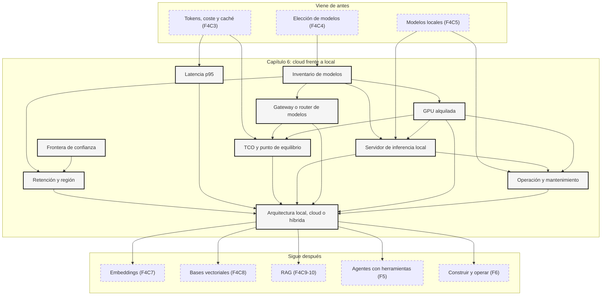

::: {.fasciculo-subtitle}
Facsímil 4 · La caja de herramientas
:::

# Capítulo 06: Cloud frente a local: privacidad, latencia y coste

## La decisión que no cabe en un eslogan

Después de montar un modelo local, aparece una tentación muy humana: convertirlo en bandera. “Local es privado”. “Cloud es escalable”. “Local es barato”. “Cloud es caro”. Ninguna de esas frases aguanta mucho si la llevas a producción.

Venimos del [capítulo 05](/libro/fasciculo-04/#capitulo-05), donde vimos que un modelo local es una pila: pesos, runtime, memoria, API, configuración y evaluación. Ahora comparamos esa pila con una API gestionada o una plataforma cloud. No para escoger por ideología, sino para responder una pregunta de ingeniería: **dónde debe ejecutarse esta inferencia, con estos datos, este volumen, esta latencia, este presupuesto y este nivel de operación**.

La idea central es esta: **local y cloud no son bandos; son posiciones distintas dentro de una arquitectura**.

## Estado del arte con fecha de corte

**Fecha de corte:** 10 de junio de 2026.  
**Fuentes consultadas ese día:** documentación oficial de controles de datos y precios de OpenAI, Anthropic, Google Cloud Vertex AI y Amazon Bedrock; documentación oficial de latencia; y artículos académicos sobre latencia de cola y edge computing.

Lo estable es el método: mirar frontera de confianza, retención, región, latencia, coste total, elasticidad, operación y plan de salida. Lo cambiante son precios, modelos disponibles, regiones, controles de retención, límites de API, multiplicadores por residencia, descuentos y disponibilidad de hardware.

| Fuente | Qué aporta | Cómo usarla |
|---|---|---|
| OpenAI data controls.^[OpenAI. (2026). *Data controls in the OpenAI platform*. https://developers.openai.com/api/docs/guides/your-data. Consultado el 10 de junio de 2026.] | Explica uso de datos, retención por endpoint y controles como retención cero o monitorización modificada cuando aplica. | Para no decir “API” sin revisar qué se guarda y durante cuánto tiempo. |
| OpenAI models API.^[OpenAI. (2026). *List models*. https://developers.openai.com/api/reference/resources/models/methods/list. Consultado el 10 de junio de 2026.] | Devuelve modelos disponibles para una clave y metadatos básicos como `id`, `created` y `owned_by`. | Para no usar identificadores copiados de ejemplos viejos. |
| OpenAI pricing.^[OpenAI. (2026). *Pricing*. https://developers.openai.com/api/docs/pricing. Consultado el 10 de junio de 2026.] | Precios por tokens, cache, batch y modalidades. | Para calcular coste por flujo real, no por intuición. |
| OpenAI latency optimization.^[OpenAI. (2026). *Latency optimization*. https://developers.openai.com/api/docs/guides/latency-optimization. Consultado el 10 de junio de 2026.] | Criterios para reducir latencia de aplicaciones con modelos. | Para separar tokens, streaming, modelo y arquitectura. |
| Anthropic data retention.^[Anthropic. (2026). *API and data retention*. https://platform.claude.com/docs/en/manage-claude/api-and-data-retention. Consultado el 10 de junio de 2026.] | Diferencia arreglos de retención, alcance de ZDR y funciones que necesitan almacenamiento. | Para preguntar qué modo contractual tienes, no qué marca usas. |
| Anthropic models API.^[Anthropic. (2026). *List Models*. https://platform.claude.com/docs/en/api/models/list. Consultado el 10 de junio de 2026.] | Lista modelos disponibles con paginación y fechas de creación. | Para separar “familia Claude” de identificador concreto de API. |
| Anthropic pricing.^[Anthropic. (2026). *Pricing*. https://platform.claude.com/docs/en/about-claude/pricing. Consultado el 10 de junio de 2026.] | Precios por entrada, salida, cache y geografía. | Para ver que cache y residencia también cambian coste. |
| Gemini models.^[Google. (2026). *Gemini API models*. https://ai.google.dev/gemini-api/docs/models. Consultado el 10 de junio de 2026.] | Lista modelos, modalidades y patrones de versión estable, preview, latest y experimental. | Para fijar versiones estables y no depender de alias que cambian. |
| Vertex AI data governance.^[Google Cloud. (2026). *Vertex AI and zero data retention*. https://cloud.google.com/vertex-ai/generative-ai/docs/data-governance. Consultado el 10 de junio de 2026.] | Controles de gobernanza, retención y condiciones de servicios generativos. | Para tratar cloud como contrato de datos, no solo endpoint. |
| Vertex AI pricing.^[Google Cloud. (2026). *Vertex AI pricing*. https://cloud.google.com/vertex-ai/generative-ai/pricing. Consultado el 10 de junio de 2026.] | Precios por modelo, tokens, herramientas y modalidades. | Para revisar token, imagen, vídeo, grounding y extras. |
| Amazon Bedrock data protection.^[Amazon Web Services. (2026). *Data protection in Amazon Bedrock*. https://docs.aws.amazon.com/bedrock/latest/userguide/data-protection.html. Consultado el 10 de junio de 2026.] | Modelo de responsabilidad compartida, cifrado, IAM, logs y separación con proveedores de modelos. | Para entender qué controla AWS y qué sigues controlando tú. |
| Amazon Bedrock pricing.^[Amazon Web Services. (2026). *Amazon Bedrock pricing*. https://aws.amazon.com/bedrock/pricing/. Consultado el 10 de junio de 2026.] | Precios por modelo y modo de inferencia. | Para comparar marketplaces, regiones y modalidades. |
| OpenRouter models API.^[OpenRouter. (2026). *List all models and their properties*. https://openrouter.ai/docs/api/api-reference/models/get-models. Consultado el 10 de junio de 2026.] | Expone modelos de muchos proveedores con `context_length`, modalidades, precios, parámetros soportados y enlaces a endpoints. | Para construir inventario técnico de modelos cloud comparables. |
| OpenRouter routing.^[OpenRouter. (2026). *Provider routing*. https://openrouter.ai/docs/guides/routing/provider-selection. Consultado el 10 de junio de 2026.] | Permite controlar proveedores, preferencias, rutas y sustitución cuando un proveedor no encaja. | Para entender un gateway como capa de selección, no como “un modelo más”. |
| Ollama Cloud y API.^[Ollama. (2026). *Cloud*. https://docs.ollama.com/cloud. Consultado el 10 de junio de 2026. Véase también *API introduction*: https://docs.ollama.com/api/introduction y *OpenAI compatibility*: https://docs.ollama.com/api/openai-compatibility.] | Mantiene herramientas locales mientras ejecuta modelos grandes en el servicio cloud de Ollama; la API local usa `localhost:11434/api`, cloud `https://ollama.com/api` y compatibilidad parcial OpenAI en `/v1`. | Para distinguir “uso Ollama” de “la inferencia está en mi máquina”. |
| vLLM, llama.cpp, TGI y SGLang.^[vLLM. (2026). *OpenAI-Compatible Server*. https://docs.vllm.ai/en/stable/serving/openai_compatible_server/. Consultado el 10 de junio de 2026. llama.cpp. (2026). *llama-server*. https://www.mintlify.com/ggml-org/llama.cpp/api/tools/llama-server. Hugging Face. (2026). *TGI HTTP API Reference*. https://huggingface.co/docs/text-generation-inference/reference/api_reference. SGLang. (2026). *Welcome to SGLang*. https://docs.sglang.io/index.html.] | Runtimes para servir modelos propios con APIs compatibles, batching, plantillas de chat, GPU/CPU y opciones de producción. | Para montar servidor local con parámetros, observabilidad y contrato, no solo “ejecutar un modelo”. |
| Alquiler de GPU.^[AWS. (2026). *Amazon EC2 Pricing*. https://aws.amazon.com/ec2/pricing/. Consultado el 10 de junio de 2026. AWS. (2026). *Specifications for Amazon EC2 accelerated computing instances*. https://docs.aws.amazon.com/ec2/latest/instancetypes/ac.html. Google Cloud. (2026). *GPU machine types*. https://docs.cloud.google.com/compute/docs/gpus. Google Cloud. (2026). *About GPU instances*. https://docs.cloud.google.com/compute/docs/gpus/about-gpus.] | Permite alquilar VM o instancia con acelerador, pagar por tiempo, reservar capacidad o usar capacidad con descuento bajo condiciones. | Para separar coste de API de coste de infraestructura propia en cloud. |
| GPU clouds y VM GPU.^[Microsoft Azure. (2026). *Virtual machine sizes overview*. https://learn.microsoft.com/en-us/azure/virtual-machines/sizes/overview. Microsoft Azure. (2026). *Linux Virtual Machines Pricing*. https://azure.microsoft.com/en-us/pricing/details/virtual-machines/linux/. Runpod. (2026). *Pods pricing*. https://docs.runpod.io/pods/pricing. Runpod. (2026). *Cloud GPU Instances for AI Workloads*. https://www.runpod.io/product/cloud-gpus. Consultado el 10 de junio de 2026.] | Documentan familias GPU, billing, almacenamiento, pods dedicados, contenedores y disponibilidad. | Para entender que alquilar GPU incluye storage, imagen, datos, arranque y operación. |
| The Tail at Scale.^[Jeffrey Dean y Luiz André Barroso. (2013). *The Tail at Scale*. *Communications of the ACM, 56*(2), 74-80. https://doi.org/10.1145/2408776.2408794.] | Explica por qué p95 y p99 importan más que el promedio en servicios interactivos. | Para medir latencia como experiencia real, no media bonita. |
| Edge Computing: Vision and Challenges.^[Weisong Shi et al. (2016). *Edge Computing: Vision and Challenges*. *IEEE Internet of Things Journal, 3*(5), 637-646. https://doi.org/10.1109/JIOT.2016.2579198.] | Sitúa edge/local como forma de acercar cómputo a datos y usuarios. | Para entender local como ubicación arquitectónica, no como capricho. |

La revisión del 10 de junio refuerza que cloud frente a local no se decide solo con precio por millón de tokens. OpenAI separa controles de datos, optimización de coste, optimización de latencia y selección de modelos; Anthropic documenta retención, residencia, uso/coste y límites de tasa; AWS Bedrock presenta la protección de datos desde responsabilidad compartida; y Vertex AI publica capacidades, release notes y SLA por servicio.^[OpenAI. (2026). *Cost optimization*. https://developers.openai.com/api/docs/guides/cost-optimization. Consultado el 10 de junio de 2026.]^[OpenAI. (2026). *Model selection*. https://developers.openai.com/api/docs/guides/model-selection. Consultado el 10 de junio de 2026.]^[Anthropic. (2026). *Usage and Cost Admin API*. https://platform.claude.com/docs/en/manage-claude/usage-cost-api. Consultado el 10 de junio de 2026.]^[Anthropic. (2026). *Data residency*. https://platform.claude.com/docs/en/manage-claude/data-residency. Consultado el 10 de junio de 2026.]^[Amazon Web Services. (2026). *Data protection in Amazon Bedrock*. https://docs.aws.amazon.com/bedrock/latest/userguide/data-protection.html. Consultado el 10 de junio de 2026.]^[Google Cloud. (2026). *Vertex AI Generative AI release notes*. https://docs.cloud.google.com/vertex-ai/generative-ai/docs/release-notes. Consultado el 10 de junio de 2026.]^[Google Cloud. (2026). *Vertex AI Generative AI SLA*. https://cloud.google.com/vertex-ai/generative-ai/sla. Consultado el 10 de junio de 2026.]

La pregunta de ingeniería queda así: ¿puedo medir coste, latencia, retención, región, límites, errores y salida por proveedor con la misma rúbrica? Si no puedes, todavía no estás comparando local y cloud; estás comparando sensaciones. Un diseño serio incluye inventario de modelos, contrato de datos, presupuesto por flujo, p95/p99, plan de degradación, logs filtrados y salida de emergencia si un proveedor cambia modelo, precio o disponibilidad.

## Qué no significa “privado”

Privado no significa “no usa internet”. Un portátil con un modelo local puede tener logs, copias de seguridad, extensiones, puertos abiertos, carpetas sincronizadas y usuarios con permisos amplios. Cloud no significa automáticamente “lo ve todo el proveedor”: puede haber contratos, controles de retención, cifrado, regiones, IAM, redes privadas y auditoría. La pregunta correcta no es si algo suena local o remoto; es **dónde existe texto claro, quién puede acceder, cuánto tiempo queda guardado y qué contrato lo gobierna**.

Tampoco conviene confundir privacidad con cumplimiento. Puedes proteger datos en local y aun así incumplir una política interna por falta de trazabilidad. Puedes usar cloud y cumplir mejor porque tienes auditoría, control de accesos y residencia definida. Depende del caso.

Y privacidad tampoco equivale a calidad. El modelo local más controlado puede no servir para la tarea. El modelo cloud más potente puede no encajar con los datos. La decisión empieza por la frontera de confianza, pero no termina ahí.

## La frontera de confianza

Antes de hablar de coste, dibuja por dónde viajan los datos.

| Lugar donde existe el dato | Pregunta que debes hacer | Señal de control |
|---|---|---|
| Navegador o app cliente | ¿El usuario escribe datos sensibles? | Minimización antes de enviar. |
| Backend propio | ¿Qué se loguea antes de llamar al modelo? | Logs filtrados, cifrado y permisos. |
| Proveedor cloud | ¿Qué retiene el endpoint usado? | Contrato, región, DPA/BAA cuando aplique, controles de retención. |
| Runtime local | ¿Quién puede leer disco, memoria, logs y puerto? | Usuario dedicado, permisos, `localhost`, rutas controladas. |
| Herramientas conectadas | ¿El modelo llama sistemas externos? | Scopes mínimos, auditoría y validación de salida. |
| Caché o vector store | ¿Se guardan prompts, fragmentos o embeddings? | TTL, borrado, cifrado y separación por cliente. |

La frontera no es un punto; es una cadena. Si haces RAG local pero subes la respuesta completa a una API cloud para “mejorarla”, la frontera cambió. Si usas cloud pero anonimizas antes, haces hashing de identificadores y evitas enviar documentos completos, también cambió.

## Latencia: no mires solo el promedio

**Ejemplo de fórmula.** La latencia total de una llamada a modelo puede descomponerse así:

$$
L_{\text{total}} =
L_{\text{red}} +
L_{\text{cola}} +
L_{\text{prefill}}(T_{\text{entrada}}) +
L_{\text{decode}}(T_{\text{salida}}) +
L_{\text{herramientas}} +
L_{\text{postproceso}}
$$

| Término | Qué significa | Qué cambia local/cloud |
|---|---|---|
| \(L_{\text{red}}\) | Viaje entre cliente, backend y modelo. | Local puede reducirlo; cloud depende de región y red. |
| \(L_{\text{cola}}\) | Espera antes de ejecutar. | Cloud puede absorber picos; local se satura antes. |
| \(L_{\text{prefill}}\) | Procesar tokens de entrada. | Crece con contexto. RAG y documentos largos lo disparan. |
| \(L_{\text{decode}}\) | Generar tokens de salida. | Depende de modelo, hardware, cuantización y runtime. |
| \(L_{\text{herramientas}}\) | Consultas a bases de datos, APIs o buscadores. | A veces domina más que el modelo. |
| \(L_{\text{postproceso}}\) | Validar JSON, guardar, renderizar o reintentar. | Suele olvidarse en demos. |

El promedio engaña. Si una app tiene 1000 usuarios y el 5 por ciento sufre esperas largas, ese 5 por ciento puede ser el que abandona. Dean y Barroso explican por qué la cola de latencias importa en sistemas a escala: no basta con que “normalmente vaya bien”.

| Métrica | Qué mide | Decisión |
|---|---|---|
| p50 | Experiencia típica. | Sirve para ver sensación normal. |
| p95 | Casos lentos frecuentes. | Útil para producto. |
| p99 | Cola larga. | Útil para flujos críticos o muchos usuarios. |
| TTFT | Tiempo hasta ver el primer token. | Mejora percepción si usas streaming. |
| tokens/s | Velocidad de salida. | Importa en respuestas largas. |
| timeouts | Peticiones que no terminan a tiempo. | Marcan límites de arquitectura. |

Local puede ganar si el usuario y los datos están cerca del modelo y el modelo cabe bien. Cloud puede ganar si necesita hardware optimizado, batch, escalado, modelos grandes, alta concurrencia o regiones específicas. La única forma seria de decidir es medir el mismo caso en ambas rutas.

## Coste: token barato no significa sistema barato

**Ejemplo de fórmula.** La cuenta cloud mínima es:

$$
C_{\text{cloud}} =
N \cdot
\left(
\frac{T_{\text{entrada}}}{10^6} P_{\text{entrada}} +
\frac{T_{\text{salida}}}{10^6} P_{\text{salida}}
\right)
+ C_{\text{cache}} + C_{\text{herramientas}} + C_{\text{almacenamiento}} + C_{\text{observabilidad}}
$$

**Ejemplo de fórmula.** La cuenta local mínima es:

$$
C_{\text{local}} =
\frac{C_{\text{hardware}}}{M_{\text{amortizacion}}}
+ C_{\text{energia}}
+ C_{\text{operacion}}
+ C_{\text{mantenimiento}}
+ C_{\text{fallos}}
$$

| Coste | Cloud | Local |
|---|---|---|
| Tokens | Visible y variable. | No se paga por token, pero sí por capacidad. |
| Hardware | Incluido en precio o instancia. | Compra, alquiler o servidor propio. |
| Picos | Elasticidad bajo demanda. | Necesitas sobredimensionar o aceptar cola. |
| Mantenimiento | Delegado en gran parte. | Drivers, runtime, modelos, disco, seguridad, monitorización. |
| Fallos | SLA, regiones, límites y dependencia externa. | Tú operas la pila. |
| Privacidad | Contratos y controles del proveedor. | Control físico/lógico, pero también responsabilidad propia. |
| Cambio de modelo | Más fácil si la API lo ofrece. | Depende de pesos, runtime y hardware disponible. |

**Ejemplo de fórmula.** El punto de equilibrio aparece cuando ambas cuentas se igualan:

$$
N_{\text{equilibrio}} =
\frac{C_{\text{local mensual}}}
{
\frac{T_{\text{entrada}}}{10^6} P_{\text{entrada}} +
\frac{T_{\text{salida}}}{10^6} P_{\text{salida}}
}
$$

Ese número no decide solo, pero baja la conversación a tierra. Si necesitas 3000 peticiones al mes, quizá cloud sea más barato que comprar y mantener una GPU. Si necesitas 30 millones de peticiones homogéneas al mes, quizá local o infraestructura propia empiece a tener sentido. Si necesitas el mejor modelo para pocos casos delicados, cloud puede ser obvio aunque sea más caro por token.

## Tres decisiones que se confunden

Cuando alguien dice “lo hacemos local o cloud”, en realidad hay tres decisiones mezcladas:

| Decisión | Opciones | Qué pregunta responde |
|---|---|---|
| Dónde corre la generación | API cloud, servidor propio, portátil, edge, híbrido. | ¿Dónde se ejecuta el modelo que genera texto? |
| Dónde viven los datos | Base propia, documentos locales, vector store cloud, almacenamiento regional. | ¿Dónde están los documentos antes y después de inferir? |
| Dónde se opera el producto | App local, backend propio, cloud gestionado, marketplace. | ¿Quién escala, observa, actualiza y responde cuando falla? |

Puedes tener generación cloud con datos minimizados localmente. Puedes tener generación local con logs sincronizados a una nube corporativa. Puedes tener embeddings locales y generación cloud. Puedes tener RAG cloud y clasificación local. Lo profesional es nombrar la arquitectura exacta.

## Estrategias reales de despliegue

No hay dos caminos; hay una familia de estrategias. La pregunta no es “¿cloud o local?”, sino **qué capa quieres delegar y qué capa quieres controlar**.

| Estrategia | Qué controlas | Qué delegas | Cuándo encaja | Cuidado principal |
|---|---|---|---|---|
| API directa a un laboratorio | Prompt, contrato de salida, observabilidad de tu app. | Modelo, servidor, escalado, optimizaciones de inferencia. | Necesitas calidad alta, velocidad de desarrollo y modelos actuales. | Dependencia de precios, límites, región y política de datos. |
| Plataforma cloud gestionada | Región, IAM, redes, trazabilidad cloud, despliegue corporativo. | Servir el modelo y actualizar infraestructura base. | Empresa con cloud ya gobernada, auditoría y compras centralizadas. | El contrato cloud no elimina tu responsabilidad de diseño. |
| Gateway de modelos | Un endpoint común, selección de modelo, fallback, comparación rápida. | Relación con muchos proveedores y normalización parcial de APIs. | Quieres probar modelos o tener plan B sin reescribir toda la app. | No todos los parámetros significan lo mismo en todos los modelos. |
| Ollama Cloud | Herramienta local, CLI/API Ollama, cambio suave desde modelos pequeños. | Ejecución de modelos cloud de Ollama cuando no caben en tu equipo. | Quieres seguir usando flujo Ollama con modelos más grandes. | “Uso Ollama” no siempre significa “el cálculo ocurre localmente”. |
| Servidor propio de inferencia | Runtime, modelo exacto, hardware, red, logs, versionado y costes fijos. | Poco: tú operas casi todo. | Volumen estable, datos cerca, requisitos offline o control fino. | Operación, capacidad, actualizaciones y degradación bajo carga. |
| Híbrida por flujo | Qué parte va local, qué parte va cloud, qué se cachea y qué se deriva. | Solo las piezas elegidas. | La mayoría de productos reales con distintas sensibilidades y costes. | Sin reglas explícitas se convierte en una mezcla difícil de depurar. |

OpenRouter entra en la tercera categoría: no es un modelo, es un **router/gateway** con una API compatible en la que eliges modelos de distintos proveedores. Su endpoint de modelos publica campos como `id`, `context_length`, modalidades, precios y parámetros soportados. Eso sirve para hacer inventario, pero no sustituye tu evaluación: dos modelos con la misma ventana de contexto pueden comportarse distinto con JSON, herramientas, español, razonamiento o latencia.

Ollama Cloud es otra cosa. Ollama puede seguir pareciendo local desde tu terminal, pero los modelos marcados como cloud se ejecutan en Ollama Cloud para poder usar modelos que no caben en tu GPU. Esto es cómodo para probar, pero cambia la frontera de confianza y el coste: la interfaz local no garantiza inferencia local.

## Cómo saber qué modelos cloud tienes de verdad

Nunca elijas un modelo copiando un nombre de una entrada antigua, una captura o una demo. El identificador de modelo es una dependencia de producción. Tiene versión, fecha, capacidades, precio, modalidad, límites y, a veces, política de retirada.

| Proveedor o gateway | Cómo inventariarlo | Qué mirar antes de usarlo |
|---|---|---|
| OpenAI | `GET https://api.openai.com/v1/models` con tu clave. | `id`, familia, endpoint soportado, precio actual, entrada multimodal, herramientas, structured outputs y modelo recomendado para tu tarea. |
| Anthropic | `GET https://api.anthropic.com/v1/models` con `anthropic-version`. | `id`, `display_name`, fecha de creación, ventana de contexto, coste, soporte de tools y modo de pensamiento si aplica. |
| Gemini API | Página de modelos y API de listado cuando trabajas con clave. | Si el nombre es estable, preview, latest o experimental; modalidades, herramientas, contexto, rate limits y fecha de retirada. |
| Bedrock o Vertex AI | Catálogo de modelos dentro de la región y cuenta. | Modelo disponible por región, precio por modalidad, IAM, logging, residencia y quotas. |
| OpenRouter | `GET https://openrouter.ai/api/v1/models`. | `id`, proveedor, `context_length`, `pricing`, `supported_parameters`, modalidades y endpoints concretos. |
| Ollama local | `GET http://localhost:11434/api/tags` o `ollama list`. | Modelo descargado, tamaño, cuantización, fecha, template y si responde bien a tu contrato. |
| Ollama Cloud | Catálogo de modelos cloud y base URL `https://ollama.com/api`. | Si el modelo se ejecuta cloud, cuenta/API key, precio, límites y qué datos salen de tu máquina. |
| Servidor local OpenAI-compatible | `GET http://host:puerto/v1/models` si el runtime lo expone. | Nombre servido, plantilla de chat, límites de contexto, dtype, cuantización y parámetros aceptados. |

Un inventario mínimo debería quedar así, aunque lo guardes en una hoja o en JSON:

| Campo | Ejemplo | Por qué importa |
|---|---|---|
| `provider` | `openai`, `anthropic`, `openrouter`, `local-vllm` | Te dice quién opera la inferencia. |
| `model_id` | `gpt-...`, `claude-...`, `meta-llama/...` | Es la dependencia exacta de código. |
| `endpoint` | `/v1/chat/completions`, `/v1/responses`, `/api/chat` | No todos los modelos sirven en todos los endpoints. |
| `context_tokens` | `128000`, `1000000`, `4096` | Define cuánto texto puedes meter sin partir. |
| `input_price` y `output_price` | USD por millón de tokens | El coste de salida suele ser más alto que el de entrada. |
| `modalities` | texto, imagen, audio, embeddings | Evita elegir texto para un problema multimodal. |
| `tools_json_schema` | sí/no/parcial | Afecta agentes, validación y salidas estructuradas. |
| `retention_region` | política y región | Afecta cumplimiento y arquitectura. |
| `version_policy` | estable, preview, latest | Afecta reproducibilidad. |
| `checked_at` | `2026-06-10` | Hace explícito cuándo era verdad. |

Comandos de inventario, no de producción:

```bash
# OpenAI: modelos accesibles por tu clave
curl https://api.openai.com/v1/models \
  -H "Authorization: Bearer $OPENAI_API_KEY"

# Anthropic: modelos accesibles por tu workspace
curl https://api.anthropic.com/v1/models \
  -H "x-api-key: $ANTHROPIC_API_KEY" \
  -H "anthropic-version: 2023-06-01"

# OpenRouter: modelos, contexto, precios y parámetros soportados
curl https://openrouter.ai/api/v1/models \
  -H "Authorization: Bearer $OPENROUTER_API_KEY"

# Ollama local: modelos descargados en tu máquina
curl http://localhost:11434/api/tags

# Servidor local compatible con OpenAI, si lo expone
curl http://localhost:8000/v1/models \
  -H "Authorization: Bearer $LOCAL_API_KEY"
```

Lo importante es no mezclar “modelo que existe”, “modelo que mi cuenta puede usar”, “modelo que mi endpoint acepta” y “modelo que mi evaluación aprueba”. Son cuatro filtros distintos.

## Servir inferencia local en serio

Bajar un GGUF, escribir `ollama run` y ver una respuesta es una prueba de vida. Un servidor de inferencia es otra cosa: es una pieza de infraestructura que debe cargar pesos, reservar memoria, aceptar peticiones, encolar trabajo, generar tokens, devolver errores comprensibles, medir latencia y sobrevivir a usos repetidos.

**Ejemplo de fórmula.** La memoria mínima no es solo el tamaño del archivo:

$$
\text{memoria}_{\text{total}} \approx
\text{pesos}_{\text{cuantizados}} +
\text{KV cache}(L, T, B) +
\text{runtime} +
\text{margen}
$$

Donde \(L\) son capas, \(T\) tokens de contexto, \(B\) peticiones simultáneas y la KV cache guarda claves y valores de atención para no recalcular todo en cada token. Por eso un modelo puede “caber” con una conversación corta y romperse cuando subes contexto, batch o concurrencia. En MoE tampoco basta mirar parámetros totales: importan parámetros activados por token, memoria de pesos, comunicación entre GPUs y eficiencia del runtime.

| Capa | Decisión técnica | Qué mirar |
|---|---|---|
| Hardware | CPU, GPU, VRAM, RAM, disco NVMe, red. | VRAM útil, ancho de banda, drivers, consumo, refrigeración y margen. |
| Artefacto | GGUF, safetensors, AWQ/GPTQ/FP8/BF16, revisión exacta. | Licencia, checksum, tokenizer, chat template y versión fija. |
| Runtime | Ollama, llama.cpp, vLLM, SGLang, TGI, LM Studio. | Batching, KV cache, cuantización, multi-GPU, tools, JSON y compatibilidad OpenAI. |
| Configuración | `max_model_len`, dtype, batch, concurrencia, tensor parallel, cache. | Que el límite declarado sea sostenible con tus usuarios reales. |
| API | `/v1/chat/completions`, `/v1/embeddings`, `/api/chat`, streaming. | Contrato estable, errores, timeouts y parámetros aceptados. |
| Entrada | Plantilla de chat, system prompt, roles, documentos, imágenes. | Si la plantilla es incorrecta, el modelo parece peor de lo que es. |
| Operación | proceso, reinicio, logs, métricas, health checks, despliegue. | p50/p95/p99, TTFT, tokens/s, cola, VRAM, errores de JSON y coste eléctrico. |
| Acceso | bind de red, autenticación, TLS, rate limits, CORS. | No publiques `0.0.0.0` sin proxy, clave, límites y logs útiles. |
| Evolución | canary, rollback, evals, cambio de modelo. | Cambiar cuantización o template puede cambiar respuestas aunque el nombre parezca igual. |

Runtimes habituales:

| Runtime | Mejor para | Puntos técnicos |
|---|---|---|
| Ollama | Desarrollo local, demos, herramientas personales, API sencilla. | Muy cómodo; distingue local de cloud cuando uses modelos cloud. |
| LM Studio | Exploración visual, pruebas con modelos descargados, endpoint local. | Bueno para aprender; no lo confundas con una plataforma multiusuario. |
| llama.cpp `llama-server` | GGUF, CPU/edge, GPU modesta, despliegues ligeros. | Expone servidor HTTP compatible, opciones de host/puerto, GPU offload y endpoints de chat/embeddings. |
| vLLM | Alto throughput en GPU, servicio multiusuario, OpenAI-compatible. | Continuous batching, KV cache eficiente, tensor parallel, cuantización y `--api-key`. |
| SGLang | Baja latencia, alto throughput, modelos grandes/multimodales. | Runtime optimizado, OpenAI API, RadixAttention, prefix caching y gateway. |
| Hugging Face TGI | Servir modelos HF con API REST y Messages API. | Streaming, tensor parallel, Prometheus/Grafana, despliegue cloud o propio. |

Un arranque local mínimo con vLLM no debería terminar en “funciona”. Debería fijar modelo, dtype, contexto, nombre servido y clave:

```bash
python -m vllm.entrypoints.openai.api_server \
  --model Qwen/Qwen3-8B-Instruct \
  --served-model-name local-qwen3-8b \
  --host 127.0.0.1 \
  --port 8000 \
  --dtype auto \
  --max-model-len 8192 \
  --gpu-memory-utilization 0.86 \
  --api-key "$LOCAL_API_KEY"
```

Y una prueba de vida técnica debería medir contrato, streaming y coste aproximado de tokens, no solo leer una respuesta bonita:

```bash
URL="http://127.0.0.1:8000/v1"

curl "$URL/chat/completions" \
  -H "Authorization: Bearer $LOCAL_API_KEY" \
  -H "Content-Type: application/json" \
  -d '{
    "model": "local-qwen3-8b",
    "messages": [
      {"role": "system", "content": "Devuelve solo JSON valido."},
      {"role": "user", "content": "Clasifica: acceso al campus virtual."}
    ],
    "temperature": 0.1,
    "max_tokens": 160,
    "stream": false
  }'
```

Si esa llamada falla, no has “fallado con IA”; has descubierto una capa concreta: modelo no cargado, plantilla incorrecta, falta de VRAM, endpoint mal expuesto, clave ausente, límite de contexto, JSON inestable o timeout. Eso es mucho más útil que una demo.

## Alquilar GPUs para inferencia

Entre una API gestionada y una GPU en tu mesa existe una opción muy usada: **alquilar GPU en cloud y servir tú el modelo**. Es cloud en infraestructura, pero local en responsabilidad técnica: eliges artefacto, runtime, contenedor, plantilla, métricas, límites y política de despliegue.

Hay tres formas habituales:

| Forma | Qué alquilas | Qué controlas | Cuándo encaja | Riesgo principal |
|---|---|---|---|---|
| VM GPU clásica | Una máquina con GPU, CPU, RAM, disco y red. | Sistema operativo, Docker, runtime, modelo, API y logs. | Servicio propio estable, pruebas serias, fine-tuning ligero o inferencia dedicada. | Pagas mientras está asignada, aunque esté esperando peticiones. |
| Pod GPU especializado | Una instancia GPU más directa, a menudo con plantillas o contenedor propio. | Imagen, volumen, librerías, runtime y arranque. | Probar modelos abiertos, levantar endpoints rápidos, trabajos por horas. | Disponibilidad por región/GPU y coste de almacenamiento persistente. |
| Serverless GPU o endpoint dedicado | Workers que arrancan bajo demanda o endpoint gestionado con GPU detrás. | Menos infraestructura; normalmente controlas imagen y escalado. | Tráfico irregular, demos, colas batch, picos previsibles. | Cold start, límites de ejecución, cola y menor control fino. |

AWS EC2, Google Compute Engine y Azure permiten VMs con familias aceleradas por GPU. Runpod y proveedores similares simplifican el alquiler de pods con GPU y contenedores propios. Esto no sustituye a Bedrock, Vertex AI u OpenAI: es otra capa. En vez de comprar tokens de un modelo servido por otro, alquilas capacidad y corres tu pila de inferencia.

**Ejemplo de fórmula.** El coste mensual de una GPU alquilada se parece más a esto:

$$
C_{\text{gpu}} =
H_{\text{activa}} P_{\text{hora}} +
H_{\text{idle}} P_{\text{hora}} +
C_{\text{volumen}} +
C_{\text{egress}} +
C_{\text{imagenes}} +
C_{\text{operacion}}
$$

**Ejemplo de fórmula.** Y el coste aproximado por millón de tokens generados se estima así:

$$
C_{1M} \approx
\frac{P_{\text{hora}}}{3600 \cdot R_{\text{tokens/s}} \cdot U}
\cdot 10^6
$$

Donde \(R_{\text{tokens/s}}\) es la velocidad útil del servidor y \(U\) es la utilización real. Si la GPU solo está ocupada el 10 por ciento del tiempo, el coste efectivo por token se multiplica. Este es el punto que más se olvida: una GPU barata por hora puede ser cara por token si está casi vacía.

Para inferencia, la GPU no se elige por nombre bonito:

| Necesidad | GPU o acelerador típico | Por qué |
|---|---|---|
| Modelo 7B-13B cuantizado, baja concurrencia | L4, A10, RTX 4090/5090, RTX 6000, T4 si aceptas menor margen. | Suele bastar para pilotos, herramientas internas y modelos pequeños. |
| Modelo 30B-70B, contexto mayor o más usuarios | A100 80GB, H100, H200, B200 o multi-GPU. | Más VRAM, ancho de banda y margen para KV cache. |
| Inferencia muy optimizada en AWS | Inf2 u otros aceleradores específicos. | Pueden ser eficientes, pero exigen stack y compilación propios. |
| Tráfico irregular | Serverless GPU o workers autoscalados. | Pagas menos espera, pero introduces arranque en frío. |
| Tráfico estable | GPU dedicada con reserva o compromiso. | Mejora disponibilidad y coste si sabes que la usarás muchas horas. |

El tamaño de modelo no basta. Para servir bien necesitas medir:

| Señal | Qué mide | Decisión |
|---|---|---|
| VRAM libre tras cargar pesos | Margen para KV cache y batch. | Si queda poco margen, baja contexto, cuantización o concurrencia. |
| TTFT | Tiempo hasta primer token. | Si es alto, revisa cola, prefill, cold start o modelo demasiado grande. |
| tokens/s por petición | Velocidad de generación. | Compara runtime, cuantización y GPU. |
| throughput agregado | Tokens/s o peticiones/s con concurrencia. | Sirve para decidir batch, réplicas y autoscaling. |
| utilización de GPU | Porcentaje real de uso. | Si es baja, estás pagando idle; si es alta, aparecerá cola. |
| errores por memoria | Peticiones que fallan por VRAM/contexto. | Define límites de entrada y concurrencia. |
| tiempo de arranque | Descargar imagen, montar volumen, cargar pesos. | Crítico en serverless y pods efímeros. |

Checklist mínimo antes de usar GPU alquilada para una API de inferencia:

- Imagen Docker reproducible con CUDA, runtime, versión de Python y dependencias fijadas.
- Modelo y tokenizer en volumen persistente o cache precalentada; no descargar 80 GB en cada arranque.
- Health check que no diga “vivo” hasta haber cargado el modelo.
- Warmup con una petición corta para inicializar kernels, plantilla y cache.
- Límite de contexto y `max_tokens` por endpoint, no solo por buena voluntad del cliente.
- Autenticación delante del runtime, aunque sea interno.
- Métricas de p50, p95, p99, TTFT, tokens/s, cola, VRAM y errores.
- Política de apagado: deallocated/delete cuando no se usa; “stopped” no siempre significa coste cero según proveedor.
- Plan de fallback: otro modelo, otra región, API gestionada o cola de espera.

La regla práctica: si vas a usar una GPU alquilada como API, trátala como producto en producción desde el minuto uno. Si solo la enciendes para experimentar, trátala como laboratorio caro y pon alarma de apagado.

## Cuándo elegir cada ruta

| Situación | Ruta probable | Por qué |
|---|---|---|
| Prototipo rápido con usuarios internos | Cloud o LM Studio local. | Aprendes rápido sin comprar infraestructura. |
| Datos sensibles y flujo simple | Local o cloud con controles contractuales fuertes. | La decisión depende de política, no de marca. |
| Mucha concurrencia variable | Cloud. | La elasticidad suele compensar. |
| Volumen estable y tarea acotada | Local/propio puede competir. | Puedes amortizar hardware y optimizar. |
| Necesitas modelo frontera | Cloud. | Los mejores modelos no suelen estar todos como pesos descargables. |
| Offline, aula, demo, entorno cerrado | Local. | Funciona sin depender de red externa. |
| Latencia de milisegundos cerca del usuario | Local/edge si el modelo cabe. | La distancia de red importa. |
| Cumplimiento con región definida | Cloud regional o local controlado. | Se decide por residencia, auditoría y contrato. |
| Comparar muchos modelos sin reescribir clientes | Gateway como OpenRouter. | Normaliza entrada y permite inventariar precios, contexto y parámetros. |
| Usar herramientas Ollama con modelos que no caben | Ollama Cloud. | Mantienes flujo Ollama pero cambias la ubicación real de inferencia. |
| Servir modelos abiertos con control técnico | GPU alquilada con vLLM, SGLang, TGI o llama.cpp. | Controlas artefacto, runtime y API sin comprar hardware. |
| Tráfico con picos y largas pausas | Serverless GPU o endpoint autoscalado. | Puede reducir idle, a cambio de cold start y menos control fino. |

La ruta híbrida es común: clasificación local, RAG con datos propios, generación cloud para casos difíciles, cache de respuestas frecuentes y fallback local si la API externa no está disponible. Híbrido no significa improvisado; significa que cada pieza tiene una razón.

## Mapa visual de decisión

<svg id="f4-c06-cloud-local" xmlns="http://www.w3.org/2000/svg" viewBox="0 0 1320 940" role="img" aria-label="Arquitectura técnica para decidir entre API cloud, gateway, Ollama Cloud, GPU alquilada, servidor local e híbrido">
  <title>Cloud frente a local: arquitectura técnica de decisión</title>
  <defs>
    <marker id="f4c06-arrow" viewBox="0 0 10 10" refX="9" refY="5" markerWidth="7" markerHeight="7" orient="auto">
      <path d="M 0 0 L 10 5 L 0 10 z" fill="#111111"/>
    </marker>
    <pattern id="f4c06-grid" patternUnits="userSpaceOnUse" width="14" height="14">
      <path d="M14 0 H0 V14" fill="none" stroke="#ECECEC" stroke-width="1"/>
    </pattern>
    <pattern id="f4c06-diagonal" patternUnits="userSpaceOnUse" width="10" height="10" patternTransform="rotate(45)">
      <line x1="0" y1="0" x2="0" y2="10" stroke="#DDDDDD" stroke-width="2"/>
    </pattern>
  </defs>

  <rect x="24" y="24" width="1272" height="864" rx="16" fill="#FFFFFF" stroke="#111111" stroke-width="1.4"/>
  <text x="660" y="64" text-anchor="middle" font-family="Arial, sans-serif" font-size="25" font-weight="700" fill="#111111">Decidir inferencia es diseñar dos planos: datos y operación</text>
  <text x="660" y="94" text-anchor="middle" font-family="Arial, sans-serif" font-size="13" fill="#555555">El destino del modelo sale de políticas, presupuesto, latencia, evaluación, capacidad y salida de emergencia.</text>

  <rect x="58" y="128" width="1204" height="84" rx="12" fill="url(#f4c06-grid)" stroke="#111111" stroke-width="1.2"/>
  <text x="90" y="158" font-family="Arial, sans-serif" font-size="13" font-weight="700" fill="#111111">Plano de datos</text>
  <rect x="178" y="146" width="158" height="46" rx="8" fill="#FFFFFF" stroke="#111111" stroke-width="1"/>
  <text x="257" y="166" text-anchor="middle" font-family="Arial, sans-serif" font-size="11" font-weight="700" fill="#111111">entrada</text>
  <text x="257" y="183" text-anchor="middle" font-family="Arial, sans-serif" font-size="9" fill="#555555">texto · imagen · docs</text>
  <rect x="396" y="146" width="176" height="46" rx="8" fill="#FFFFFF" stroke="#111111" stroke-width="1"/>
  <text x="484" y="166" text-anchor="middle" font-family="Arial, sans-serif" font-size="11" font-weight="700" fill="#111111">minimización</text>
  <text x="484" y="183" text-anchor="middle" font-family="Arial, sans-serif" font-size="9" fill="#555555">PII · secretos · logs</text>
  <rect x="632" y="146" width="176" height="46" rx="8" fill="#FFFFFF" stroke="#111111" stroke-width="1"/>
  <text x="720" y="166" text-anchor="middle" font-family="Arial, sans-serif" font-size="11" font-weight="700" fill="#111111">contrato interno</text>
  <text x="720" y="183" text-anchor="middle" font-family="Arial, sans-serif" font-size="9" fill="#555555">schema · tools · límites</text>
  <rect x="868" y="146" width="168" height="46" rx="8" fill="#FFFFFF" stroke="#111111" stroke-width="1"/>
  <text x="952" y="166" text-anchor="middle" font-family="Arial, sans-serif" font-size="11" font-weight="700" fill="#111111">traza</text>
  <text x="952" y="183" text-anchor="middle" font-family="Arial, sans-serif" font-size="9" fill="#555555">id · tenant · región</text>
  <rect x="1090" y="146" width="122" height="46" rx="8" fill="#111111"/>
  <text x="1151" y="166" text-anchor="middle" font-family="Arial, sans-serif" font-size="11" font-weight="700" fill="#FFFFFF">gate</text>
  <text x="1151" y="183" text-anchor="middle" font-family="Arial, sans-serif" font-size="9" fill="#DDDDDD">permitir · derivar</text>
  <path d="M336 169 H390" stroke="#111111" stroke-width="1.2" marker-end="url(#f4c06-arrow)"/>
  <path d="M572 169 H626" stroke="#111111" stroke-width="1.2" marker-end="url(#f4c06-arrow)"/>
  <path d="M808 169 H862" stroke="#111111" stroke-width="1.2" marker-end="url(#f4c06-arrow)"/>
  <path d="M1036 169 H1084" stroke="#111111" stroke-width="1.2" marker-end="url(#f4c06-arrow)"/>

  <rect x="430" y="262" width="460" height="236" rx="14" fill="#FFFFFF" stroke="#111111" stroke-width="1.6"/>
  <rect x="430" y="262" width="460" height="50" rx="14" fill="#111111"/>
  <text x="660" y="293" text-anchor="middle" font-family="Arial, sans-serif" font-size="16" font-weight="700" fill="#FFFFFF">Policy router de inferencia</text>
  <text x="660" y="338" text-anchor="middle" font-family="Arial, sans-serif" font-size="11" fill="#555555">No elige una marca: evalúa restricciones por petición y por producto.</text>

  <rect x="462" y="362" width="126" height="46" rx="8" fill="#F7F7F7" stroke="#111111" stroke-width="1"/>
  <text x="525" y="381" text-anchor="middle" font-family="Arial, sans-serif" font-size="10" font-weight="700" fill="#111111">data_class</text>
  <text x="525" y="398" text-anchor="middle" font-family="Arial, sans-serif" font-size="9" fill="#555555">pública · interna</text>
  <rect x="604" y="362" width="126" height="46" rx="8" fill="#F7F7F7" stroke="#111111" stroke-width="1"/>
  <text x="667" y="381" text-anchor="middle" font-family="Arial, sans-serif" font-size="10" font-weight="700" fill="#111111">latencia p95</text>
  <text x="667" y="398" text-anchor="middle" font-family="Arial, sans-serif" font-size="9" fill="#555555">TTFT · tokens/s</text>
  <rect x="746" y="362" width="112" height="46" rx="8" fill="#F7F7F7" stroke="#111111" stroke-width="1"/>
  <text x="802" y="381" text-anchor="middle" font-family="Arial, sans-serif" font-size="10" font-weight="700" fill="#111111">coste</text>
  <text x="802" y="398" text-anchor="middle" font-family="Arial, sans-serif" font-size="9" fill="#555555">token · idle</text>
  <rect x="462" y="424" width="126" height="46" rx="8" fill="#FFFFFF" stroke="#111111" stroke-width="1"/>
  <text x="525" y="443" text-anchor="middle" font-family="Arial, sans-serif" font-size="10" font-weight="700" fill="#111111">eval_score</text>
  <text x="525" y="460" text-anchor="middle" font-family="Arial, sans-serif" font-size="9" fill="#555555">JSON · calidad</text>
  <rect x="604" y="424" width="126" height="46" rx="8" fill="#FFFFFF" stroke="#111111" stroke-width="1"/>
  <text x="667" y="443" text-anchor="middle" font-family="Arial, sans-serif" font-size="10" font-weight="700" fill="#111111">capacidad</text>
  <text x="667" y="460" text-anchor="middle" font-family="Arial, sans-serif" font-size="9" fill="#555555">GPU · cuota</text>
  <rect x="746" y="424" width="112" height="46" rx="8" fill="#FFFFFF" stroke="#111111" stroke-width="1"/>
  <text x="802" y="443" text-anchor="middle" font-family="Arial, sans-serif" font-size="10" font-weight="700" fill="#111111">fallback</text>
  <text x="802" y="460" text-anchor="middle" font-family="Arial, sans-serif" font-size="9" fill="#555555">cola · modelo B</text>

  <path d="M1151 192 C1124 238, 960 282, 891 332" fill="none" stroke="#111111" stroke-width="1.2" marker-end="url(#f4c06-arrow)"/>

  <rect x="62" y="260" width="286" height="238" rx="14" fill="#FFFFFF" stroke="#111111" stroke-width="1.4"/>
  <text x="205" y="292" text-anchor="middle" font-family="Arial, sans-serif" font-size="15" font-weight="700" fill="#111111">Modelo de coste</text>
  <text x="205" y="323" text-anchor="middle" font-family="Arial, sans-serif" font-size="10" fill="#555555">cloud: tokens + cache + tools</text>
  <text x="205" y="347" text-anchor="middle" font-family="Arial, sans-serif" font-size="10" fill="#555555">local: amortización + operación</text>
  <text x="205" y="371" text-anchor="middle" font-family="Arial, sans-serif" font-size="10" fill="#555555">GPU: hora + idle + storage</text>
  <line x1="96" y1="394" x2="314" y2="394" stroke="#111111" stroke-width="1"/>
  <text x="205" y="421" text-anchor="middle" font-family="Arial, sans-serif" font-size="10" fill="#111111">C_total = variable + fijo + riesgo</text>
  <text x="205" y="446" text-anchor="middle" font-family="Arial, sans-serif" font-size="10" fill="#111111">C_1M ≈ P_hora/(tokens/s · U)</text>
  <text x="205" y="474" text-anchor="middle" font-family="Arial, sans-serif" font-size="9" fill="#777777">si U baja, el token real sube</text>

  <rect x="972" y="260" width="286" height="238" rx="14" fill="#FFFFFF" stroke="#111111" stroke-width="1.4"/>
  <text x="1115" y="292" text-anchor="middle" font-family="Arial, sans-serif" font-size="15" font-weight="700" fill="#111111">Modelo de latencia</text>
  <text x="1115" y="323" text-anchor="middle" font-family="Arial, sans-serif" font-size="10" fill="#555555">red + cola + prefill + decode</text>
  <text x="1115" y="347" text-anchor="middle" font-family="Arial, sans-serif" font-size="10" fill="#555555">tools + postproceso + retries</text>
  <text x="1115" y="371" text-anchor="middle" font-family="Arial, sans-serif" font-size="10" fill="#555555">p50 no decide producto</text>
  <line x1="1006" y1="394" x2="1224" y2="394" stroke="#111111" stroke-width="1"/>
  <text x="1115" y="421" text-anchor="middle" font-family="Arial, sans-serif" font-size="10" fill="#111111">L_total = L_red + L_cola + ...</text>
  <text x="1115" y="446" text-anchor="middle" font-family="Arial, sans-serif" font-size="10" fill="#111111">medir p95, p99, TTFT, timeout</text>
  <text x="1115" y="474" text-anchor="middle" font-family="Arial, sans-serif" font-size="9" fill="#777777">colas largas rompen UX</text>

  <path d="M348 379 H424" stroke="#777777" stroke-width="1.2" stroke-dasharray="6 5" marker-end="url(#f4c06-arrow)"/>
  <path d="M890 379 H966" stroke="#777777" stroke-width="1.2" stroke-dasharray="6 5" marker-end="url(#f4c06-arrow)"/>

  <rect x="58" y="554" width="1204" height="178" rx="14" fill="#FFFFFF" stroke="#111111" stroke-width="1.4"/>
  <text x="90" y="586" font-family="Arial, sans-serif" font-size="13" font-weight="700" fill="#111111">Destinos de inferencia</text>

  <rect x="86" y="612" width="204" height="82" rx="10" fill="#F7F7F7" stroke="#111111" stroke-width="1.1"/>
  <text x="188" y="636" text-anchor="middle" font-family="Arial, sans-serif" font-size="12" font-weight="700" fill="#111111">API directa</text>
  <text x="188" y="660" text-anchor="middle" font-family="Arial, sans-serif" font-size="9" fill="#555555">modelo frontera · SLA</text>
  <text x="188" y="678" text-anchor="middle" font-family="Arial, sans-serif" font-size="9" fill="#555555">tokens · región · retención</text>

  <rect x="318" y="612" width="204" height="82" rx="10" fill="#FFFFFF" stroke="#111111" stroke-width="1.1"/>
  <text x="420" y="636" text-anchor="middle" font-family="Arial, sans-serif" font-size="12" font-weight="700" fill="#111111">Gateway</text>
  <text x="420" y="660" text-anchor="middle" font-family="Arial, sans-serif" font-size="9" fill="#555555">OpenRouter · fallback</text>
  <text x="420" y="678" text-anchor="middle" font-family="Arial, sans-serif" font-size="9" fill="#555555">proveedor real trazado</text>

  <rect x="550" y="612" width="204" height="82" rx="10" fill="url(#f4c06-diagonal)" stroke="#111111" stroke-width="1.1"/>
  <text x="652" y="636" text-anchor="middle" font-family="Arial, sans-serif" font-size="12" font-weight="700" fill="#111111">Ollama Cloud</text>
  <text x="652" y="660" text-anchor="middle" font-family="Arial, sans-serif" font-size="9" fill="#555555">CLI local · ejecución cloud</text>
  <text x="652" y="678" text-anchor="middle" font-family="Arial, sans-serif" font-size="9" fill="#555555">cambia frontera de datos</text>

  <rect x="782" y="612" width="204" height="82" rx="10" fill="#FFFFFF" stroke="#111111" stroke-width="1.1"/>
  <text x="884" y="636" text-anchor="middle" font-family="Arial, sans-serif" font-size="12" font-weight="700" fill="#111111">GPU alquilada</text>
  <text x="884" y="660" text-anchor="middle" font-family="Arial, sans-serif" font-size="9" fill="#555555">vLLM · SGLang · TGI</text>
  <text x="884" y="678" text-anchor="middle" font-family="Arial, sans-serif" font-size="9" fill="#555555">idle · cold start · storage</text>

  <rect x="1014" y="612" width="204" height="82" rx="10" fill="#111111"/>
  <text x="1116" y="636" text-anchor="middle" font-family="Arial, sans-serif" font-size="12" font-weight="700" fill="#FFFFFF">Servidor local</text>
  <text x="1116" y="660" text-anchor="middle" font-family="Arial, sans-serif" font-size="9" fill="#DDDDDD">llama.cpp · Ollama · LAN</text>
  <text x="1116" y="678" text-anchor="middle" font-family="Arial, sans-serif" font-size="9" fill="#DDDDDD">VRAM · permisos · backup</text>

  <path d="M525 498 C440 542, 298 574, 188 608" fill="none" stroke="#111111" stroke-width="1.15" marker-end="url(#f4c06-arrow)"/>
  <path d="M595 498 C540 542, 468 574, 420 608" fill="none" stroke="#111111" stroke-width="1.15" marker-end="url(#f4c06-arrow)"/>
  <path d="M660 498 V606" fill="none" stroke="#111111" stroke-width="1.15" marker-end="url(#f4c06-arrow)"/>
  <path d="M728 498 C775 542, 836 574, 884 608" fill="none" stroke="#111111" stroke-width="1.15" marker-end="url(#f4c06-arrow)"/>
  <path d="M802 498 C910 540, 1040 574, 1116 608" fill="none" stroke="#111111" stroke-width="1.15" marker-end="url(#f4c06-arrow)"/>

  <rect x="58" y="776" width="1204" height="76" rx="12" fill="#F7F7F7" stroke="#111111" stroke-width="1.2"/>
  <text x="90" y="807" font-family="Arial, sans-serif" font-size="13" font-weight="700" fill="#111111">Plano de operación</text>
  <text x="220" y="806" font-family="Arial, sans-serif" font-size="10" fill="#555555">inventario modelos</text>
  <text x="348" y="806" font-family="Arial, sans-serif" font-size="10" fill="#555555">eval suite</text>
  <text x="452" y="806" font-family="Arial, sans-serif" font-size="10" fill="#555555">canary/rollback</text>
  <text x="588" y="806" font-family="Arial, sans-serif" font-size="10" fill="#555555">cost ledger</text>
  <text x="704" y="806" font-family="Arial, sans-serif" font-size="10" fill="#555555">retención/logs</text>
  <text x="838" y="806" font-family="Arial, sans-serif" font-size="10" fill="#555555">alertas p95/p99</text>
  <text x="982" y="806" font-family="Arial, sans-serif" font-size="10" fill="#555555">runbook</text>
  <text x="1080" y="806" font-family="Arial, sans-serif" font-size="10" fill="#555555">plan de salida</text>
  <line x1="200" y1="824" x2="1138" y2="824" stroke="#111111" stroke-width="1"/>
  <circle cx="220" cy="824" r="4" fill="#111111"/>
  <circle cx="348" cy="824" r="4" fill="#111111"/>
  <circle cx="452" cy="824" r="4" fill="#111111"/>
  <circle cx="588" cy="824" r="4" fill="#111111"/>
  <circle cx="704" cy="824" r="4" fill="#111111"/>
  <circle cx="838" cy="824" r="4" fill="#111111"/>
  <circle cx="982" cy="824" r="4" fill="#111111"/>
  <circle cx="1080" cy="824" r="4" fill="#111111"/>

  <path d="M188 694 C188 750, 218 760, 220 776" fill="none" stroke="#777777" stroke-width="1" stroke-dasharray="5 5"/>
  <path d="M420 694 C420 750, 360 760, 348 776" fill="none" stroke="#777777" stroke-width="1" stroke-dasharray="5 5"/>
  <path d="M884 694 C884 750, 842 760, 838 776" fill="none" stroke="#777777" stroke-width="1" stroke-dasharray="5 5"/>
  <path d="M1116 694 C1116 750, 1080 760, 1080 776" fill="none" stroke="#777777" stroke-width="1" stroke-dasharray="5 5"/>

  <text x="1226" y="872" text-anchor="end" font-family="Arial, sans-serif" font-size="10" fill="#9A9A9A">IA para gente curiosa / Facsímil 04 / Capítulo 06 / 686f6c61</text>
</svg>

## En el día a día

Imagina una universidad que quiere clasificar incidencias de estudiantes. Si el texto contiene solo categorías generales, una API cloud puede dar calidad alta y mantenimiento bajo. Si el texto incluye expedientes, datos médicos o información contractual, quizá convenga anonimizar, resumir localmente o ejecutar todo en un entorno controlado.

Imagina una asesoría que analiza miles de facturas al mes. Si el volumen es bajo, una API potente evita comprar hardware. Si el volumen es constante, el modelo local puede ahorrar coste. Pero si cada error de extracción cuesta una llamada humana, el coste real no está en tokens: está en fallos.

Imagina una app de escritorio que debe funcionar en una fábrica sin red estable. Local gana por disponibilidad. Pero si el modelo debe razonar sobre documentos complejos y actualizados, quizá necesites sincronizar, cachear o derivar algunos casos a cloud. La arquitectura buena suele ser menos épica y más concreta.

## Por qué debería importarte

Porque la elección local/cloud afecta a producto, privacidad, presupuesto, operación y experiencia de usuario. No es una decisión que pueda tomar solo compras, solo legal o solo ingeniería. Hay que poner a todos mirando la misma tabla.

También importa porque los próximos capítulos del facsímil se apoyan en esta decisión. Los [embeddings](/libro/fasciculo-04/#capitulo-07), las [bases vectoriales](/libro/fasciculo-04/#capitulo-08), el [RAG](/libro/fasciculo-04/#capitulo-09) y las herramientas de datos pueden correr local, cloud o híbrido. Si no sabes elegir ubicación, cada capítulo posterior se convierte en una colección de piezas sin arquitectura.

## Dónde volverá a aparecer

| Concepto | Dónde vuelve | Para qué |
|---|---|---|
| Embeddings locales o gestionados | [Capítulo 07](/libro/fasciculo-04/#capitulo-07). | Decidir dónde convertir texto en vectores. |
| Bases vectoriales | [Capítulo 08](/libro/fasciculo-04/#capitulo-08). | Elegir almacenamiento local, servicio gestionado o híbrido. |
| RAG | [Capítulos 09 y 10](/libro/fasciculo-04/#capitulo-09). | Separar documentos, recuperación y generación. |
| Agentes con herramientas | [Facsímil 05](/libro/fasciculo-05/). | Decidir qué herramientas pueden llamarse y desde dónde. |
| Operación | [Facsímil 06](/libro/fasciculo-06/). | Monitorizar coste, latencia, errores y cambios de modelo. |

## Dónde solía tropezar yo

| Error | Por qué es un error | Antídoto |
|---|---|---|
| **Decir “local” como sinónimo de seguro** | Local también tiene logs, backups, puertos y permisos. | Dibujar la frontera de confianza completa. |
| **Decir “cloud” como sinónimo de caro** | Pocas peticiones o modelos frontera pueden ser más baratos por API que operar hardware. | Calcular coste mensual, no coste emocional. |
| **Comparar latencia media** | El promedio oculta esperas largas. | Medir p50, p95, p99 y timeouts. |
| **Olvidar el coste de operación local** | Drivers, actualizaciones, disco, monitorización y guardias cuestan tiempo. | Incluir horas humanas y mantenimiento en el TCO. |
| **No mirar la retención por endpoint** | Distintas funciones pueden guardar estado de forma distinta. | Revisar documentación y contrato antes de enviar datos reales. |
| **Construir sin plan de salida** | Cambiar de proveedor o runtime tarde puede doler mucho. | Mantener pruebas comunes y contrato de API propio. |
| **Creer que un gateway es un modelo** | OpenRouter, por ejemplo, puede enrutar a modelos y proveedores distintos. | Guardar modelo, proveedor, endpoint, precio, fecha y parámetros soportados. |
| **Confundir Ollama con inferencia local siempre** | Ollama Cloud mantiene la experiencia de herramienta local, pero ejecuta modelos cloud. | Mirar si el modelo está descargado localmente o se ejecuta en cloud. |
| **Montar servidor local sin contrato operativo** | Una respuesta en terminal no mide colas, contexto, JSON, p95 ni reinicios. | Definir runtime, API, clave, métricas, límites, salud y rollback. |
| **Alquilar GPU y olvidar el idle** | Una GPU por hora puede salir cara si espera vacía. | Calcular coste por token útil con utilización real. |
| **Confundir stopped con deallocated** | En algunos clouds parar una VM no libera todo el coste asignado. | Revisar estado facturable, discos, IPs, snapshots y volúmenes. |

## Manos a la obra

Kit ejecutable y descargable: `labs/f4/capitulo-practicas/`. Ejecuta `python3 ops/run_f4_practices.py --all --write --fail-on-invalid` para correr todas las prácticas del facsímil, o `python3 ops/run_f4_practices.py --chapter c01 --write --fail-on-invalid` cambiando `c01` por el capítulo que quieras aislar.

Vamos a comparar dos backends con el mismo caso: uno local y uno cloud, ambos con contrato OpenAI-compatible cuando sea posible. No hace falta que tengas todos para aprender. Lo importante es repetir el mismo caso, registrar el endpoint exacto, guardar fecha de comprobación y no mezclar resultados de modelos distintos.

Primero decide qué backend vas a probar:

| Backend | `BASE_URL` típico | Modelo de ejemplo | Qué estás midiendo |
|---|---|---|---|
| LM Studio local | `http://localhost:1234/v1` | alias cargado en LM Studio | Modelo local con interfaz cómoda. |
| Ollama local OpenAI-compatible | `http://localhost:11434/v1` | `gemma3` o `qwen3:8b` | Modelo descargado y servido por tu máquina. |
| vLLM local | `http://localhost:8000/v1` | `local-qwen3-8b` | Servidor de inferencia multiusuario más cercano a producción. |
| llama.cpp local | `http://localhost:8080/v1` | nombre servido por `llama-server` | GGUF ligero, CPU/edge o GPU modesta. |
| OpenAI | `https://api.openai.com/v1` | modelo disponible por `/v1/models` | API directa de laboratorio. |
| OpenRouter | `https://openrouter.ai/api/v1` | `proveedor/modelo` | Gateway con varios proveedores detrás. |

Si usas servidor local, arranca una opción concreta y anota parámetros. No basta con “modelo cargado”; necesitas saber contexto, cuantización, nombre servido y clave.

```bash
# LM Studio
lms load <modelo> --context-length=4096 --gpu=auto --identifier=local-lab
lms server start --port 1234

# Ollama local compatible con partes de OpenAI
ollama pull gemma3
ollama serve

# vLLM local con contrato OpenAI-compatible
python -m vllm.entrypoints.openai.api_server \
  --model Qwen/Qwen3-8B-Instruct \
  --served-model-name local-qwen3-8b \
  --host 127.0.0.1 \
  --port 8000 \
  --max-model-len 8192 \
  --gpu-memory-utilization 0.86 \
  --api-key "$LOCAL_API_KEY"

# llama.cpp con GGUF
llama-server \
  -m ./models/modelo.gguf \
  --host 127.0.0.1 \
  --port 8080
```

Luego configura variables. Ajusta precios con la tabla oficial del proveedor el día de la prueba. Para local puedes poner precio por token a cero y un coste fijo mensual estimado; para cloud, usa precio de entrada y salida por millón de tokens.

```bash
export LOCAL_BASE_URL="http://localhost:8000/v1"
export LOCAL_API_KEY="local-dev-key"
export LOCAL_MODEL="local-qwen3-8b"
export LOCAL_INPUT_USD_PER_MTOK="0"
export LOCAL_OUTPUT_USD_PER_MTOK="0"
export LOCAL_FIXED_MONTHLY_USD="80"

export CLOUD_BASE_URL="https://api.openai.com/v1"
export CLOUD_API_KEY="..."
export CLOUD_MODEL="modelo-cloud"
export CLOUD_INPUT_USD_PER_MTOK="1.25"
export CLOUD_OUTPUT_USD_PER_MTOK="10"
```

Para OpenRouter cambia solo la base, la clave, el modelo y los precios:

```bash
export CLOUD_BASE_URL="https://openrouter.ai/api/v1"
export CLOUD_API_KEY="$OPENROUTER_API_KEY"
export CLOUD_MODEL="<id_devuelto_por_openrouter>"
# OpenRouter publica pricing.prompt y pricing.completion por token.
# Para este script multiplícalos por 1_000_000.
export CLOUD_INPUT_USD_PER_MTOK="<pricing.prompt * 1000000>"
export CLOUD_OUTPUT_USD_PER_MTOK="<pricing.completion * 1000000>"
```

Para Ollama local compatible con OpenAI:

```bash
export LOCAL_BASE_URL="http://localhost:11434/v1"
export LOCAL_API_KEY="ollama"
export LOCAL_MODEL="gemma3"
```

Guarda esto como `comparar_local_cloud.py`:

```python
import json
import os
import time
import urllib.error
import urllib.request


PROMPT = (
    "Devuelve solo JSON valido con categoria, prioridad, "
    "siguiente_paso y confianza. "
    "Caso: clasificar 1200 incidencias mensuales con datos internos."
)


def env_float(name, default):
    try:
        return float(os.getenv(name, default))
    except ValueError:
        return float(default)


def post_chat(base_url, api_key, model):
    payload = {
        "model": model,
        "messages": [
            {
                "role": "system",
                "content": "Responde solo JSON valido.",
            },
            {"role": "user", "content": PROMPT},
        ],
        "temperature": 0.1,
        "max_tokens": 220,
        "stream": False,
    }
    headers = {"Content-Type": "application/json"}
    if api_key:
        headers["Authorization"] = f"Bearer {api_key}"

    request = urllib.request.Request(
        base_url.rstrip("/") + "/chat/completions",
        data=json.dumps(payload).encode("utf-8"),
        headers=headers,
        method="POST",
    )
    started = time.perf_counter()
    with urllib.request.urlopen(request, timeout=90) as response:
        data = json.loads(response.read().decode("utf-8"))
    elapsed = time.perf_counter() - started
    return data, elapsed


def extract_text(data):
    return data["choices"][0]["message"]["content"]


def usage_tokens(data, fallback_input=80, fallback_output=80):
    usage = data.get("usage") or {}
    input_tokens = (
        usage.get("prompt_tokens")
        or usage.get("input_tokens")
        or fallback_input
    )
    output_tokens = (
        usage.get("completion_tokens")
        or usage.get("output_tokens")
        or fallback_output
    )
    return int(input_tokens), int(output_tokens)


def parse_json(text):
    cleaned = text.strip()
    try:
        return json.loads(cleaned), True
    except json.JSONDecodeError:
        start = cleaned.find("{")
        end = cleaned.rfind("}")
        if start >= 0 and end > start:
            return json.loads(cleaned[start : end + 1]), False
        raise


def estimate_request_cost(
    input_tokens,
    output_tokens,
    input_price,
    output_price,
):
    return (input_tokens / 1_000_000 * input_price) + (
        output_tokens / 1_000_000 * output_price
    )


def measure_backend(prefix):
    base_url = os.getenv(f"{prefix}_BASE_URL")
    model = os.getenv(f"{prefix}_MODEL")
    api_key = os.getenv(f"{prefix}_API_KEY", "")

    if not base_url or not model:
        return {"backend": prefix.lower(), "status": "skipped"}

    input_price = env_float(f"{prefix}_INPUT_USD_PER_MTOK", "0")
    output_price = env_float(f"{prefix}_OUTPUT_USD_PER_MTOK", "0")

    data, elapsed = post_chat(base_url, api_key, model)
    text = extract_text(data)
    parsed, exact_json = parse_json(text)
    input_tokens, output_tokens = usage_tokens(data)
    request_cost = estimate_request_cost(
        input_tokens,
        output_tokens,
        input_price,
        output_price,
    )

    return {
        "backend": prefix.lower(),
        "status": "ok",
        "model": model,
        "latency_s": round(elapsed, 3),
        "input_tokens": input_tokens,
        "output_tokens": output_tokens,
        "request_cost_usd": round(request_cost, 6),
        "exact_json": exact_json,
        "parsed": parsed,
    }


def monthly_projection(result, monthly_requests, fixed_monthly):
    if result["status"] != "ok":
        return None
    variable = result["request_cost_usd"] * monthly_requests
    return round(variable + fixed_monthly, 2)


def main():
    monthly_requests = int(os.getenv("MONTHLY_REQUESTS", "1200"))
    local_fixed = env_float("LOCAL_FIXED_MONTHLY_USD", "0")
    cloud_fixed = env_float("CLOUD_FIXED_MONTHLY_USD", "0")

    results = []
    for prefix in ("LOCAL", "CLOUD"):
        try:
            results.append(measure_backend(prefix))
        except urllib.error.URLError as exc:
            results.append({
                "backend": prefix.lower(),
                "status": "unreachable",
                "error": str(exc),
            })
        except Exception as exc:
            results.append({
                "backend": prefix.lower(),
                "status": "failed",
                "error": str(exc),
            })

    for result in results:
        fixed = local_fixed if result["backend"] == "local" else cloud_fixed
        monthly_cost = monthly_projection(result, monthly_requests, fixed)
        result["monthly_cost_usd"] = monthly_cost

    print(json.dumps(
        {
            "monthly_requests": monthly_requests,
            "results": results,
            "decision_hint": (
                "elige despues de mirar coste, latencia, "
                "JSON exacto y frontera de datos"
            ),
        },
        ensure_ascii=False,
        indent=2,
    ))


if __name__ == "__main__":
    main()
```

La salida útil se parece a esto:

```text
{
  "monthly_requests": 1200,
  "results": [
    {
      "backend": "local",
      "status": "ok",
      "model": "local-lab",
      "latency_s": 2.41,
      "input_tokens": 85,
      "output_tokens": 74,
      "request_cost_usd": 0.0,
      "exact_json": true,
      "monthly_cost_usd": 80.0
    },
    {
      "backend": "cloud",
      "status": "ok",
      "model": "modelo-cloud",
      "latency_s": 0.92,
      "input_tokens": 85,
      "output_tokens": 74,
      "request_cost_usd": 0.000846,
      "exact_json": true,
      "monthly_cost_usd": 1.02
    }
  ]
}
```

La interpretación no es “cloud gana porque cuesta 1,02” ni “local gana porque no manda datos”. La interpretación correcta es: para 1200 peticiones mensuales, si esos datos pueden salir bajo contrato, cloud parece más barato y rápido; si esos datos no pueden salir o la app debe funcionar sin red, local tiene sentido aunque el coste fijo sea mayor.

## Cómo encaja todo

Este mapa conecta la decisión cloud/local con lo que ya vimos y con lo que viene. Fíjate en que no sale de “gusto por herramientas”, sino de restricciones medibles.



## Vocabulario aprendido

| Término | Definición |
|---|---|
| **Frontera de confianza** | Punto o cadena donde los datos pasan a otro dominio técnico o contractual. |
| **TCO** | Coste total de propiedad, incluyendo uso, infraestructura, operación y mantenimiento. |
| **Latencia p95** | Tiempo por debajo del cual termina el 95 por ciento de peticiones. |
| **TTFT** | Tiempo hasta recibir el primer token. |
| **Throughput** | Capacidad de procesar peticiones o tokens por unidad de tiempo. |
| **Región** | Ubicación geográfica donde se procesa o guarda una carga. |
| **Retención** | Tiempo durante el que se conservan datos, logs o estado. |
| **Residencia de datos** | Restricción sobre dónde deben vivir o procesarse los datos. |
| **Capacidad elástica** | Capacidad de escalar recursos bajo demanda. |
| **Punto de equilibrio** | Volumen donde coste local y cloud se igualan bajo hipótesis dadas. |
| **Gateway de modelos** | Capa que ofrece un endpoint común y enruta peticiones a distintos proveedores o modelos. |
| **Servidor de inferencia** | Servicio que carga pesos, gestiona memoria, cola peticiones y expone una API para generar salidas. |
| **GPU alquilada** | Acelerador en cloud que pagas por tiempo para ejecutar tu propio runtime o contenedor. |
| **KV cache** | Memoria usada para guardar claves y valores de atención ya calculados durante la generación. |
| **Modelo servido** | Nombre de modelo que expone tu API; puede ser distinto del repositorio o archivo interno. |

## Antes de pasar página

- [ ] ¿Puedo explicar por qué local no significa automáticamente privado?
- [ ] ¿Puedo explicar por qué cloud no significa automáticamente caro?
- [ ] ¿Sé dibujar la frontera de confianza de un flujo completo?
- [ ] ¿Sé inventariar modelos disponibles por endpoint y no por memoria?
- [ ] ¿Sé distinguir API directa, plataforma cloud, gateway, Ollama Cloud y servidor propio?
- [ ] ¿Sé calcular coste cloud con entrada, salida, cache y extras?
- [ ] ¿Sé calcular coste local incluyendo hardware, energía y operación?
- [ ] ¿Sé calcular coste de GPU alquilada incluyendo idle, storage, red y operación?
- [ ] ¿Estoy midiendo p95 y no solo promedio?
- [ ] ¿Sé qué datos se retienen y durante cuánto tiempo en el endpoint elegido?
- [ ] ¿Sé qué runtime, contexto, cuantización y nombre servido tiene mi servidor local?
- [ ] ¿Tengo una práctica comparando local y cloud con el mismo caso?

## En resumen

| Idea fuerza | Detalle |
|---|---|
| Local y cloud son posiciones arquitectónicas. | No son bandos; responden a restricciones distintas. |
| Privacidad exige dibujar la frontera de confianza. | Hay que saber dónde existe el dato, quién accede y cuánto se retiene. |
| La latencia útil se mide en p95 y p99. | El promedio no captura la experiencia de usuarios lentos. |
| El coste real es TCO. | Tokens, hardware, operación, mantenimiento, cache y herramientas cuentan. |
| Un gateway no es un modelo. | OpenRouter u otros routers pueden cambiar proveedor, parámetros y precio detrás de un endpoint común. |
| Ollama Cloud no equivale a inferencia local. | Conserva la experiencia Ollama, pero cambia ubicación, coste y frontera de datos. |
| Servir local en serio requiere infraestructura. | Modelo, runtime, KV cache, API, claves, métricas, colas, límites y rollback forman parte del sistema. |
| Alquilar GPU es cloud con responsabilidad propia. | Pagas tiempo, storage e idle; tú sirves, mides, actualizas y apagas. |
| La ruta híbrida suele ser la más realista. | Minimiza datos localmente, escala cloud cuando aporta y mantiene una eval común. |

## Para saber más

Amazon Web Services. (2026). *Amazon Bedrock pricing*. https://aws.amazon.com/bedrock/pricing/

Amazon Web Services. (2026). *Data protection in Amazon Bedrock*. https://docs.aws.amazon.com/bedrock/latest/userguide/data-protection.html

Amazon Web Services. (2026). *Amazon EC2 Pricing*. https://aws.amazon.com/ec2/pricing/

Amazon Web Services. (2026). *Specifications for Amazon EC2 accelerated computing instances*. https://docs.aws.amazon.com/ec2/latest/instancetypes/ac.html

Anthropic. (2026). *API and data retention*. https://platform.claude.com/docs/en/manage-claude/api-and-data-retention

Anthropic. (2026). *List Models*. https://platform.claude.com/docs/en/api/models/list

Anthropic. (2026). *Pricing*. https://platform.claude.com/docs/en/about-claude/pricing

Dean, J. y Barroso, L. A. (2013). *The Tail at Scale*. *Communications of the ACM, 56*(2), 74-80. https://doi.org/10.1145/2408776.2408794

Google. (2026). *Gemini API models*. https://ai.google.dev/gemini-api/docs/models

Google Cloud. (2026). *About GPU instances*. https://docs.cloud.google.com/compute/docs/gpus/about-gpus

Google Cloud. (2026). *GPU machine types*. https://docs.cloud.google.com/compute/docs/gpus

Google Cloud. (2026). *Vertex AI and zero data retention*. https://cloud.google.com/vertex-ai/generative-ai/docs/data-governance

Google Cloud. (2026). *Vertex AI pricing*. https://cloud.google.com/vertex-ai/generative-ai/pricing

Hugging Face. (2026). *Text Generation Inference: HTTP API Reference*. https://huggingface.co/docs/text-generation-inference/reference/api_reference

llama.cpp. (2026). *llama-server*. https://www.mintlify.com/ggml-org/llama.cpp/api/tools/llama-server

Microsoft Azure. (2026). *Linux Virtual Machines Pricing*. https://azure.microsoft.com/en-us/pricing/details/virtual-machines/linux/

Microsoft Azure. (2026). *Virtual machine sizes overview*. https://learn.microsoft.com/en-us/azure/virtual-machines/sizes/overview

Ollama. (2026). *API introduction*. https://docs.ollama.com/api/introduction

Ollama. (2026). *Cloud*. https://docs.ollama.com/cloud

Ollama. (2026). *OpenAI compatibility*. https://docs.ollama.com/api/openai-compatibility

OpenAI. (2026). *Data controls in the OpenAI platform*. https://developers.openai.com/api/docs/guides/your-data

OpenAI. (2026). *Latency optimization*. https://developers.openai.com/api/docs/guides/latency-optimization

OpenAI. (2026). *List models*. https://developers.openai.com/api/reference/resources/models/methods/list

OpenAI. (2026). *Pricing*. https://developers.openai.com/api/docs/pricing

OpenRouter. (2026). *List all models and their properties*. https://openrouter.ai/docs/api/api-reference/models/get-models

OpenRouter. (2026). *Provider routing*. https://openrouter.ai/docs/guides/routing/provider-selection

Runpod. (2026). *Cloud GPU Instances for AI Workloads*. https://www.runpod.io/product/cloud-gpus

Runpod. (2026). *Pods pricing*. https://docs.runpod.io/pods/pricing

Shi, W., Cao, J., Zhang, Q., Li, Y. y Xu, L. (2016). *Edge Computing: Vision and Challenges*. *IEEE Internet of Things Journal, 3*(5), 637-646. https://doi.org/10.1109/JIOT.2016.2579198

SGLang. (2026). *Welcome to SGLang*. https://docs.sglang.io/index.html

vLLM. (2026). *OpenAI-Compatible Server*. https://docs.vllm.ai/en/stable/serving/openai_compatible_server/
