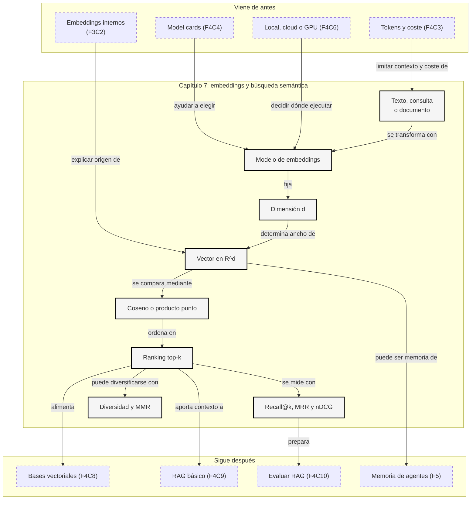

::: {.fasciculo-subtitle}
Facsímil 4 · La caja de herramientas
:::

# Capítulo 07: Embeddings aplicados y búsqueda semántica

## Cuando las palabras exactas no bastan

Imagina que alguien busca en una intranet: “no puedo entrar al campus virtual”. El documento que resuelve el problema quizá se titula “Restablecer acceso a Moodle con doble factor”. No comparte demasiadas palabras con la consulta, pero para una persona está claro que hablan de lo mismo.

La búsqueda clásica por palabras exactas funciona muy bien cuando el usuario sabe cómo se llama algo. Falla más cuando el usuario describe una necesidad, usa sinónimos, escribe con otro registro o mezcla conceptos. Aquí entran los embeddings: convertir textos en vectores para poder buscar por cercanía aproximada de significado.

Venimos del [capítulo 03](/libro/fasciculo-04/#capitulo-03), donde hablamos de tokens, contexto y coste, y del [capítulo 06](/libro/fasciculo-04/#capitulo-06), donde decidimos dónde ejecutar modelos. Ahora usamos esa base para montar la pieza que alimenta RAG, memoria de producto, recomendadores y buscadores internos.

## Estado del arte con fecha de corte

**Fecha de corte:** 25 de mayo de 2026.  
**Fuentes consultadas ese día:** documentación oficial de embeddings de OpenAI, Gemini, Cohere, Voyage AI y Sentence Transformers; y trabajos académicos sobre sentence embeddings, búsqueda vectorial, HNSW, FAISS y evaluación de recuperación.

Lo estable es el mecanismo: un modelo convierte entradas en vectores, esos vectores se comparan con una métrica y el sistema devuelve un ranking. Lo cambiante son modelos disponibles, dimensiones, precios, límites de contexto, soporte multimodal, compresión, tipos de salida, librerías y benchmarks.

| Fuente | Qué aporta | Cómo usarla |
|---|---|---|
| OpenAI embeddings.^[OpenAI. (2026). *Vector embeddings*. https://platform.openai.com/docs/guides/embeddings. Consultado el 25 de mayo de 2026.] | Explica embeddings como vectores de números y enumera usos como búsqueda, clustering, recomendaciones y clasificación. | Para entender el contrato básico: texto entra, vector sale, distancia mide relación. |
| `text-embedding-3-large`.^[OpenAI. (2026). *text-embedding-3-large*. https://developers.openai.com/api/docs/models/text-embedding-3-large. Consultado el 25 de mayo de 2026.] | Documenta un modelo de embedding concreto y su ficha de modelo. | Para no hablar de “OpenAI embeddings” como si fuera un único artefacto. |
| Gemini embeddings.^[Google. (2026). *Gemini API: Embeddings*. https://ai.google.dev/gemini-api/docs/embeddings. Consultado el 25 de mayo de 2026.] | Muestra cómo generar embeddings en Gemini API y usar salida vectorial para recuperación. | Para comparar API, dimensiones, tareas y límites. |
| Cohere embeddings.^[Cohere. (2026). *Introduction to Embeddings at Cohere*. https://docs.cohere.com/v2/docs/embeddings. Consultado el 25 de mayo de 2026.] | Introduce `input_type`, soporte multilingüe, embeddings de imagen, contenido mixto, Matryoshka y compresión. | Para recordar que query y documento pueden tratarse de forma distinta. |
| Voyage embeddings.^[Voyage AI. (2026). *Text Embeddings*. https://docs.voyageai.com/docs/embeddings. Consultado el 25 de mayo de 2026.] | Lista modelos, dimensiones, contexto e `input_type` para query/document. | Para elegir modelos orientados a retrieval, código, legal, finanzas o uso general. |
| Sentence Transformers.^[Sentence Transformers. (2026). *Semantic Search*. https://sbert.net/examples/applications/semantic-search/README.html. Consultado el 25 de mayo de 2026.] | Ofrece una forma local y reproducible de generar embeddings y hacer búsqueda semántica. | Para aprender el mecanismo sin depender de una API externa. |
| Sentence-BERT.^[Reimers, N. y Gurevych, I. (2019). *Sentence-BERT: Sentence Embeddings using Siamese BERT-Networks*. Proceedings of EMNLP, 3982-3992. https://doi.org/10.18653/v1/D19-1410.] | Populariza embeddings de frases eficientes para similitud semántica. | Para ver por qué no basta usar cualquier vector interno de un modelo. |
| FAISS.^[Johnson, J., Douze, M. y Jégou, H. (2019). *Billion-Scale Similarity Search with GPUs*. *IEEE Transactions on Big Data, 7*(3), 535-547. https://doi.org/10.1109/TBDATA.2019.2921572.] | Muestra técnicas de búsqueda eficiente de vectores a gran escala, especialmente en GPU. | Para entender por qué una base vectorial no compara siempre todo contra todo. |
| HNSW.^[Malkov, Y. A. y Yashunin, D. A. (2020). *Efficient and Robust Approximate Nearest Neighbor Search Using Hierarchical Navigable Small World Graphs*. *IEEE TPAMI, 42*(4), 824-836. https://doi.org/10.1109/TPAMI.2018.2889473.] | Describe un índice por grafo muy usado para vecinos aproximados. | Para entender el intercambio entre rapidez, memoria y exactitud. |
| BEIR.^[Thakur, N., Reimers, N., Rücklé, A., Srivastava, A. y Gurevych, I. (2021). *BEIR: A Heterogeneous Benchmark for Zero-shot Evaluation of Information Retrieval Models*. NeurIPS Datasets and Benchmarks. https://arxiv.org/abs/2104.08663.] | Propone evaluar retrieval en tareas diversas, no solo en un dataset cómodo. | Para no validar un buscador con tres ejemplos elegidos a mano. |

## Qué no es un embedding

Un embedding no es una traducción secreta del texto. No contiene una definición legible de cada palabra. No es una base de datos comprimida con todos los documentos. Tampoco es una garantía de verdad: dos textos pueden estar cerca en el espacio vectorial y aun así no responder la pregunta correcta.

Tampoco es “memoria” por sí mismo. Guardar embeddings de documentos permite recuperar fragmentos parecidos, pero el sistema no entiende permisos, vigencia, autoría ni contexto de negocio a menos que tú lo diseñes. Un vector no sabe si un reglamento está derogado.

Y un embedding no sustituye a la búsqueda por filtros. Si el usuario pregunta por “normativa de matrícula 2025” y tu sistema devuelve un documento semánticamente parecido de 2021, el vector ha hecho parte del trabajo; falta metadata, filtros y evaluación.

## Qué sí es: una coordenada útil

Un modelo de embeddings es una función:

$$
e = f_{\theta}(x) \in \mathbb{R}^{d}
$$

| Símbolo | Significado | Ejemplo |
|---|---|---|
| \(x\) | Entrada que queremos representar. | “Restablecer acceso al campus virtual”. |
| \(f_{\theta}\) | Modelo de embeddings con parámetros aprendidos. | Un modelo de Sentence Transformers o una API de embeddings. |
| \(e\) | Vector resultante. | \([0{,}12,\,-0{,}03,\,0{,}44,\,...]\). |
| \(d\) | Número de dimensiones del vector. | 384, 768, 1024, 1536 o 3072 según modelo. |
| \(\mathbb{R}^{d}\) | Espacio de vectores reales de dimensión \(d\). | Una tabla con \(d\) columnas numéricas. |

La intuición: textos que el modelo considera parecidos quedan cerca. Textos que el modelo considera distintos quedan lejos. Esa cercanía no aparece porque el modelo “sepa” como una persona; aparece porque durante entrenamiento aprendió a colocar ejemplos relacionados cerca y ejemplos no relacionados más lejos.

En búsqueda semántica hacemos lo mismo con documentos y consultas:

$$
q = f_{\theta}(\text{consulta})
$$

$$
d_i = f_{\theta}(\text{documento}_i)
$$

Después comparamos \(q\) con cada \(d_i\) y ordenamos.

## Qué significa la dimensión

La dimensión de un embedding es el número de componentes del vector. Si un modelo devuelve un embedding de dimensión 384, cada texto se convierte en 384 números. Si devuelve 3072, cada texto se convierte en 3072 números. No es una “nota de inteligencia”; es el ancho de la representación.

Piensa en una tabla. Cada fila es un texto y cada columna es una coordenada aprendida por el modelo:

$$
e = [e_1, e_2, e_3, \dots, e_d]
$$

| Pieza | Qué significa | Ejemplo |
|---|---|---|
| \(e\) | Embedding completo de un texto. | El vector de “no puedo entrar al campus”. |
| \(e_1, e_2, e_3\) | Primeras coordenadas del vector. | `0.12`, `-0.31`, `0.08`. |
| \(d\) | Número total de coordenadas. | 384 columnas numéricas. |

En un ejemplo pequeño de cuatro dimensiones, dos textos podrían quedar así:

| Texto | \(e_1\) | \(e_2\) | \(e_3\) | \(e_4\) |
|---|---:|---:|---:|---:|
| “acceso al campus” | 0,20 | 0,81 | -0,10 | 0,33 |
| “entrar en Moodle” | 0,18 | 0,77 | -0,08 | 0,29 |
| “calendario de matrícula” | -0,42 | 0,05 | 0,71 | -0,11 |

Los dos primeros textos se parecen porque sus coordenadas apuntan en una dirección parecida. El tercero queda más lejos porque su patrón numérico es distinto.

Conviene decirlo con cuidado: una dimensión no suele significar “Moodle”, “matrícula” o “problema técnico” de forma aislada. En embeddings modernos, el significado aparece distribuido entre muchas coordenadas a la vez. Una coordenada puede participar en varios patrones; un patrón puede necesitar cientos o miles de coordenadas. Por eso no miramos una dimensión suelta para interpretar el texto: comparamos el vector completo.

La dimensión importa por cuatro razones:

| Razón | Qué cambia | Consecuencia práctica |
|---|---|---|
| Memoria | Cada vector ocupa \(d\) números. | Más dimensión implica más RAM, disco, backup y red. |
| Latencia | Comparar vectores cuesta más si \(d\) crece. | El ranking exacto y el índice trabajan más. |
| Señal | El vector tiene más espacio para codificar matices. | Puede mejorar retrieval, pero no siempre en tu dominio. |
| Compatibilidad | Todos los vectores del índice deben tener la misma dimensión. | Cambiar modelo o dimensión suele exigir reindexar. |

La memoria bruta se calcula así:

$$
M_{\text{vectores}} =
N \cdot d \cdot b
$$

| Símbolo | Significado | Ejemplo |
|---|---|---|
| \(M_{\text{vectores}}\) | Memoria bruta para guardar vectores. | Bytes antes de índice y metadata. |
| \(N\) | Número de vectores guardados. | 1.000.000 chunks. |
| \(d\) | Dimensión de cada vector. | 384, 1024 o 3072. |
| \(b\) | Bytes por número. | 4 bytes para `float32`, 2 para `float16`. |

Para 1 millón de vectores en `float32`:

| Dimensión | Memoria bruta | Lectura de ingeniería |
|---:|---:|---|
| 384 | 1,54 GB | Cómodo para prototipos y muchos casos internos. |
| 768 | 3,07 GB | Dobla memoria y cómputo respecto a 384. |
| 1536 | 6,14 GB | Empieza a exigir pensar en índice, RAM y backups. |
| 3072 | 12,29 GB | Puede tener más señal, pero no sale gratis. |

El coste de comparación exacta crece igual:

$$
C_{\text{comparar}} = O(N \cdot d)
$$

Si duplicas \(d\), duplicas el trabajo bruto de comparar una consulta contra todos los vectores. Un índice aproximado reduce el número de comparaciones, pero no elimina que cada comparación tenga \(d\) componentes.

Algunos modelos y proveedores permiten reducir dimensión de salida o usar representaciones tipo Matryoshka, donde los primeros bloques del vector intentan conservar señal útil al truncar dimensiones.^[Kusupati, A. et al. (2022). *Matryoshka Representation Learning*. https://arxiv.org/abs/2205.13147. El trabajo propone aprender representaciones que funcionan a varias longitudes anidadas.] Cohere, por ejemplo, documenta embeddings con Matryoshka y compresión para equilibrar calidad, memoria y coste.^[Cohere (2026), documentación de embeddings citada en la tabla de estado del arte.] Eso no significa que puedas cortar cualquier vector arbitrariamente y esperar el mismo resultado: hay que evaluarlo.

## Dimensión, coste y calidad en una sola imagen

<svg id="f4-c07-dimensiones-embedding" xmlns="http://www.w3.org/2000/svg" viewBox="0 0 1240 820" role="img" aria-label="Relación entre dimensiones de embeddings, memoria, latencia y calidad de búsqueda">
  <title>Dimensiones de embeddings: coste, latencia y señal</title>
  <defs>
    <marker id="f4c07dim-arrow" viewBox="0 0 10 10" refX="9" refY="5" markerWidth="7" markerHeight="7" orient="auto">
      <path d="M 0 0 L 10 5 L 0 10 z" fill="#111111"/>
    </marker>
    <pattern id="f4c07dim-grid" patternUnits="userSpaceOnUse" width="12" height="12">
      <path d="M12 0 H0 V12" fill="none" stroke="#ECECEC" stroke-width="1"/>
    </pattern>
  </defs>

  <rect x="24" y="24" width="1192" height="748" rx="16" fill="#FFFFFF" stroke="#111111" stroke-width="1.4"/>
  <text x="620" y="64" text-anchor="middle" font-family="Arial, sans-serif" font-size="25" font-weight="700" fill="#111111">La dimensión es ancho de representación, no prestigio</text>
  <text x="620" y="94" text-anchor="middle" font-family="Arial, sans-serif" font-size="13" fill="#555555">Más columnas pueden capturar más señal, pero también multiplican memoria, latencia e índice.</text>

  <rect x="80" y="148" width="272" height="486" rx="14" fill="#FFFFFF" stroke="#111111" stroke-width="1.3"/>
  <text x="216" y="180" text-anchor="middle" font-family="Arial, sans-serif" font-size="15" font-weight="700" fill="#111111">Un texto se convierte en d números</text>
  <text x="216" y="210" text-anchor="middle" font-family="Arial, sans-serif" font-size="11" fill="#555555">e = [x₁, x₂, ..., x_d]</text>

  <rect x="112" y="252" width="78" height="54" rx="8" fill="#111111"/>
  <text x="151" y="275" text-anchor="middle" font-family="Arial, sans-serif" font-size="11" font-weight="700" fill="#FFFFFF">384</text>
  <text x="151" y="292" text-anchor="middle" font-family="Arial, sans-serif" font-size="9" fill="#DDDDDD">dims</text>
  <line x1="204" y1="279" x2="306" y2="279" stroke="#111111" stroke-width="6"/>
  <text x="216" y="328" text-anchor="middle" font-family="Arial, sans-serif" font-size="10" fill="#555555">menos memoria · búsqueda rápida</text>

  <rect x="112" y="382" width="78" height="54" rx="8" fill="#F7F7F7" stroke="#111111" stroke-width="1"/>
  <text x="151" y="405" text-anchor="middle" font-family="Arial, sans-serif" font-size="11" font-weight="700" fill="#111111">1536</text>
  <text x="151" y="422" text-anchor="middle" font-family="Arial, sans-serif" font-size="9" fill="#555555">dims</text>
  <line x1="204" y1="409" x2="330" y2="409" stroke="#111111" stroke-width="10"/>
  <text x="216" y="458" text-anchor="middle" font-family="Arial, sans-serif" font-size="10" fill="#555555">más señal · más índice</text>

  <rect x="112" y="512" width="78" height="54" rx="8" fill="#FFFFFF" stroke="#111111" stroke-width="1"/>
  <text x="151" y="535" text-anchor="middle" font-family="Arial, sans-serif" font-size="11" font-weight="700" fill="#111111">3072</text>
  <text x="151" y="552" text-anchor="middle" font-family="Arial, sans-serif" font-size="9" fill="#555555">dims</text>
  <line x1="204" y1="539" x2="340" y2="539" stroke="#111111" stroke-width="16"/>
  <text x="216" y="588" text-anchor="middle" font-family="Arial, sans-serif" font-size="10" fill="#555555">más coste · evaluar antes</text>

  <rect x="420" y="148" width="370" height="222" rx="14" fill="url(#f4c07dim-grid)" stroke="#111111" stroke-width="1.3"/>
  <text x="605" y="180" text-anchor="middle" font-family="Arial, sans-serif" font-size="15" font-weight="700" fill="#111111">Coste de almacenamiento</text>
  <text x="605" y="218" text-anchor="middle" font-family="Arial, sans-serif" font-size="12" fill="#111111">M = N · d · b</text>
  <line x1="466" y1="246" x2="744" y2="246" stroke="#111111" stroke-width="1"/>
  <text x="605" y="278" text-anchor="middle" font-family="Arial, sans-serif" font-size="11" fill="#555555">1M vectores · float32</text>
  <text x="605" y="306" text-anchor="middle" font-family="Arial, sans-serif" font-size="11" fill="#555555">384 → 1,54 GB · 1536 → 6,14 GB · 3072 → 12,29 GB</text>
  <text x="605" y="338" text-anchor="middle" font-family="Arial, sans-serif" font-size="10" fill="#777777">sin contar HNSW, metadata, réplicas ni backups</text>

  <rect x="850" y="148" width="310" height="222" rx="14" fill="#FFFFFF" stroke="#111111" stroke-width="1.3"/>
  <text x="1005" y="180" text-anchor="middle" font-family="Arial, sans-serif" font-size="15" font-weight="700" fill="#111111">Coste de comparación</text>
  <text x="1005" y="218" text-anchor="middle" font-family="Arial, sans-serif" font-size="12" fill="#111111">O(N · d)</text>
  <line x1="900" y1="246" x2="1110" y2="246" stroke="#111111" stroke-width="1"/>
  <text x="1005" y="278" text-anchor="middle" font-family="Arial, sans-serif" font-size="11" fill="#555555">duplicar d duplica trabajo bruto</text>
  <text x="1005" y="306" text-anchor="middle" font-family="Arial, sans-serif" font-size="11" fill="#555555">ANN reduce candidatos, no el ancho del vector</text>
  <text x="1005" y="338" text-anchor="middle" font-family="Arial, sans-serif" font-size="10" fill="#777777">mide p95, recall y coste por consulta</text>

  <rect x="420" y="424" width="740" height="210" rx="14" fill="#FFFFFF" stroke="#111111" stroke-width="1.3"/>
  <text x="790" y="456" text-anchor="middle" font-family="Arial, sans-serif" font-size="15" font-weight="700" fill="#111111">La decisión se toma con evaluación, no con intuición</text>
  <line x1="488" y1="514" x2="1092" y2="514" stroke="#111111" stroke-width="1.2" marker-end="url(#f4c07dim-arrow)"/>
  <text x="488" y="496" text-anchor="middle" font-family="Arial, sans-serif" font-size="10" fill="#555555">menos coste</text>
  <text x="790" y="496" text-anchor="middle" font-family="Arial, sans-serif" font-size="10" fill="#555555">punto útil</text>
  <text x="1092" y="496" text-anchor="middle" font-family="Arial, sans-serif" font-size="10" fill="#555555">más señal posible</text>

  <circle cx="548" cy="514" r="9" fill="#111111"/>
  <text x="548" y="548" text-anchor="middle" font-family="Arial, sans-serif" font-size="10" fill="#111111">384</text>
  <circle cx="738" cy="514" r="9" fill="#FFFFFF" stroke="#111111" stroke-width="2"/>
  <text x="738" y="548" text-anchor="middle" font-family="Arial, sans-serif" font-size="10" fill="#111111">768</text>
  <circle cx="902" cy="514" r="9" fill="#FFFFFF" stroke="#111111" stroke-width="2"/>
  <text x="902" y="548" text-anchor="middle" font-family="Arial, sans-serif" font-size="10" fill="#111111">1536</text>
  <circle cx="1034" cy="514" r="9" fill="#FFFFFF" stroke="#111111" stroke-width="2"/>
  <text x="1034" y="548" text-anchor="middle" font-family="Arial, sans-serif" font-size="10" fill="#111111">3072</text>

  <rect x="486" y="584" width="606" height="28" rx="7" fill="#F7F7F7" stroke="#111111" stroke-width="1"/>
  <text x="789" y="603" text-anchor="middle" font-family="Arial, sans-serif" font-size="10" fill="#111111">elige la menor dimensión que mantenga recall, MRR y calidad de respuesta en tu eval</text>

  <rect x="170" y="684" width="900" height="46" rx="10" fill="#FFFFFF" stroke="#111111" stroke-width="1.2"/>
  <text x="620" y="712" text-anchor="middle" font-family="Arial, sans-serif" font-size="12" font-weight="700" fill="#111111">Cambiar dimensión cambia almacenamiento, índice y comparabilidad: versiona y reevalúa.</text>

  <text x="1176" y="754" text-anchor="end" font-family="Arial, sans-serif" font-size="10" fill="#9A9A9A">IA para gente curiosa / Facsímil 04 / Capítulo 07 / 686f6c61</text>
</svg>

## La métrica que decide el ranking

La similitud coseno compara dirección, no tamaño bruto:

$$
\operatorname{cos}(q, d_i) =
\frac{q \cdot d_i}{\|q\|\,\|d_i\|}
$$

| Símbolo | Significado | Ejemplo |
|---|---|---|
| \(q\) | Vector de la consulta. | \([0{,}2, 0{,}8]\). |
| \(d_i\) | Vector del documento \(i\). | \([0{,}1, 0{,}9]\). |
| \(q \cdot d_i\) | Producto punto: suma de productos componente a componente. | \(0{,}2\cdot0{,}1 + 0{,}8\cdot0{,}9 = 0{,}74\). |
| \(\|q\|\) | Norma o longitud del vector de consulta. | \(\sqrt{0{,}2^2+0{,}8^2}=0{,}824\). |
| \(\|d_i\|\) | Norma del vector de documento. | \(\sqrt{0{,}1^2+0{,}9^2}=0{,}906\). |
| \(\operatorname{cos}(q,d_i)\) | Similitud final. | \(0{,}74/(0{,}824\cdot0{,}906)=0{,}992\). |

Si normalizas todos los vectores para que tengan norma 1, el coseno se convierte en producto punto:

$$
\hat{q} = \frac{q}{\|q\|}, \qquad \hat{d_i} = \frac{d_i}{\|d_i\|}
$$

$$
\operatorname{cos}(q,d_i)=\hat{q}\cdot\hat{d_i}
$$

Eso importa en producción porque muchas bases vectoriales trabajan más rápido con producto punto si tus vectores ya están normalizados.

El ranking top-k se expresa así:

$$
\operatorname{TopK}(q, D, k) =
\{d_{(1)},\dots,d_{(k)}\},
\quad
s(q,d_{(1)}) \ge \dots \ge s(q,d_{(k)})
$$

| Símbolo | Significado | Ejemplo |
|---|---|---|
| \(D\) | Colección de documentos vectorizados. | 50.000 fragmentos de una intranet. |
| \(k\) | Número de resultados que queremos devolver. | 5. |
| \(s(q,d_i)\) | Función de puntuación. | Coseno, producto punto o distancia negativa. |
| \(\operatorname{TopK}\) | Devuelve los identificadores con mayor puntuación. | Documentos 17, 42, 8, 91 y 3. |

## El proceso completo

Una búsqueda semántica mínima tiene dos fases: indexación y consulta. En indexación conviertes documentos en vectores y guardas esos vectores con sus metadatos. En consulta conviertes la pregunta en otro vector, buscas vecinos cercanos y devuelves resultados.

| Paso | Qué ocurre | Decisión técnica |
|---|---|---|
| 1. Preparar documentos | Limpias, separas, titulas o partes contenido. | Qué unidad se busca: documento entero, sección, párrafo o chunk. |
| 2. Generar embeddings | Cada unidad pasa por el modelo. | Modelo, dimensión, idioma, coste, privacidad y batch. |
| 3. Normalizar | Opcionalmente reescalas vectores. | Coseno/producto punto y compatibilidad con el índice. |
| 4. Guardar | Vector + texto + metadata + versión. | Base vectorial, tabla propia o índice en memoria. |
| 5. Embedding de consulta | La pregunta se transforma con el mismo modelo o modelo compatible. | `input_type=query` si el proveedor lo usa. |
| 6. Recuperar top-k | Buscas vecinos exactos o aproximados. | Exactitud, latencia, memoria y filtros. |
| 7. Reordenar | Puedes aplicar reranking, filtros o MMR. | Mejorar precisión y diversidad. |
| 8. Usar resultados | Mostrar documentos o pasarlos a un LLM. | Búsqueda, RAG, recomendación o clasificación. |

La unidad de búsqueda es decisiva. Si indexas documentos enormes, el resultado puede ser “parecido” pero poco accionable. Si indexas frases demasiado cortas, pierdes contexto. Si indexas chunks sin título, una frase como “plazo máximo” puede quedar huérfana.

## Una imagen mental del pipeline

<svg id="f4-c07-embeddings-busqueda" xmlns="http://www.w3.org/2000/svg" viewBox="0 0 1240 850" role="img" aria-label="Pipeline de embeddings aplicados a búsqueda semántica: documentos, vectores, índice, consulta y ranking">
  <title>Embeddings aplicados a búsqueda semántica</title>
  <defs>
    <marker id="f4c07-arrow" viewBox="0 0 10 10" refX="9" refY="5" markerWidth="7" markerHeight="7" orient="auto">
      <path d="M 0 0 L 10 5 L 0 10 z" fill="#111111"/>
    </marker>
  </defs>

  <rect x="24" y="24" width="1192" height="778" rx="16" fill="#FFFFFF" stroke="#111111" stroke-width="1.4"/>
  <text x="620" y="66" text-anchor="middle" font-family="Arial, sans-serif" font-size="25" font-weight="700" fill="#111111">Buscar por significado es construir un ranking vectorial</text>
  <text x="620" y="94" text-anchor="middle" font-family="Arial, sans-serif" font-size="13" fill="#555555">El embedding no responde: coloca consulta y documentos en un espacio comparable.</text>

  <rect x="78" y="150" width="230" height="150" rx="12" fill="#FFFFFF" stroke="#111111" stroke-width="1.3"/>
  <text x="193" y="180" text-anchor="middle" font-family="Arial, sans-serif" font-size="15" font-weight="700" fill="#111111">Documentos</text>
  <text x="193" y="214" text-anchor="middle" font-family="Arial, sans-serif" font-size="11" fill="#555555">políticas · tickets · FAQs</text>
  <text x="193" y="238" text-anchor="middle" font-family="Arial, sans-serif" font-size="11" fill="#555555">texto + metadata</text>
  <line x1="118" y1="258" x2="268" y2="258" stroke="#111111" stroke-width="1"/>
  <text x="193" y="280" text-anchor="middle" font-family="Arial, sans-serif" font-size="10" fill="#777777">unidad: sección o chunk</text>

  <rect x="360" y="150" width="220" height="150" rx="12" fill="#F7F7F7" stroke="#111111" stroke-width="1.3"/>
  <text x="470" y="180" text-anchor="middle" font-family="Arial, sans-serif" font-size="15" font-weight="700" fill="#111111">Modelo embedding</text>
  <text x="470" y="214" text-anchor="middle" font-family="Arial, sans-serif" font-size="11" fill="#555555">fθ(texto) → vector</text>
  <text x="470" y="238" text-anchor="middle" font-family="Arial, sans-serif" font-size="11" fill="#555555">dimensión · idioma · coste</text>
  <text x="470" y="268" text-anchor="middle" font-family="Arial, sans-serif" font-size="10" fill="#777777">query/document si aplica</text>

  <rect x="632" y="150" width="240" height="150" rx="12" fill="#FFFFFF" stroke="#111111" stroke-width="1.3"/>
  <text x="752" y="180" text-anchor="middle" font-family="Arial, sans-serif" font-size="15" font-weight="700" fill="#111111">Vectores guardados</text>
  <text x="752" y="214" text-anchor="middle" font-family="Arial, sans-serif" font-size="11" fill="#555555">id · vector · texto</text>
  <text x="752" y="238" text-anchor="middle" font-family="Arial, sans-serif" font-size="11" fill="#555555">metadata · versión</text>
  <path d="M688 266 h128" stroke="#111111" stroke-width="1"/>
  <circle cx="706" cy="266" r="4" fill="#111111"/>
  <circle cx="740" cy="266" r="4" fill="#111111"/>
  <circle cx="777" cy="266" r="4" fill="#111111"/>
  <circle cx="816" cy="266" r="4" fill="#111111"/>

  <rect x="934" y="150" width="220" height="150" rx="12" fill="#F7F7F7" stroke="#111111" stroke-width="1.3"/>
  <text x="1044" y="180" text-anchor="middle" font-family="Arial, sans-serif" font-size="15" font-weight="700" fill="#111111">Índice</text>
  <text x="1044" y="214" text-anchor="middle" font-family="Arial, sans-serif" font-size="11" fill="#555555">exacto o aproximado</text>
  <text x="1044" y="238" text-anchor="middle" font-family="Arial, sans-serif" font-size="11" fill="#555555">HNSW · FAISS · DB</text>
  <text x="1044" y="268" text-anchor="middle" font-family="Arial, sans-serif" font-size="10" fill="#777777">latencia vs recall</text>

  <path d="M308 225 H354" stroke="#111111" stroke-width="1.4" marker-end="url(#f4c07-arrow)"/>
  <path d="M580 225 H626" stroke="#111111" stroke-width="1.4" marker-end="url(#f4c07-arrow)"/>
  <path d="M872 225 H928" stroke="#111111" stroke-width="1.4" marker-end="url(#f4c07-arrow)"/>

  <rect x="112" y="450" width="260" height="136" rx="12" fill="#111111"/>
  <text x="242" y="482" text-anchor="middle" font-family="Arial, sans-serif" font-size="15" font-weight="700" fill="#FFFFFF">Consulta</text>
  <text x="242" y="516" text-anchor="middle" font-family="Arial, sans-serif" font-size="11" fill="#DDDDDD">“no puedo entrar”</text>
  <text x="242" y="540" text-anchor="middle" font-family="Arial, sans-serif" font-size="11" fill="#DDDDDD">→ vector q</text>
  <text x="242" y="564" text-anchor="middle" font-family="Arial, sans-serif" font-size="10" fill="#BDBDBD">mismo espacio que documentos</text>

  <rect x="472" y="430" width="270" height="178" rx="12" fill="#FFFFFF" stroke="#111111" stroke-width="1.3"/>
  <text x="607" y="462" text-anchor="middle" font-family="Arial, sans-serif" font-size="15" font-weight="700" fill="#111111">Comparar y ordenar</text>
  <text x="607" y="498" text-anchor="middle" font-family="Arial, sans-serif" font-size="11" fill="#555555">coseno(q, dᵢ)</text>
  <text x="607" y="522" text-anchor="middle" font-family="Arial, sans-serif" font-size="11" fill="#555555">top-k resultados</text>
  <line x1="524" y1="548" x2="690" y2="548" stroke="#111111" stroke-width="1"/>
  <text x="607" y="574" text-anchor="middle" font-family="Arial, sans-serif" font-size="10" fill="#777777">filtros · MMR · reranking</text>

  <rect x="842" y="450" width="286" height="136" rx="12" fill="#FFFFFF" stroke="#111111" stroke-width="1.3"/>
  <text x="985" y="482" text-anchor="middle" font-family="Arial, sans-serif" font-size="15" font-weight="700" fill="#111111">Resultado útil</text>
  <text x="985" y="516" text-anchor="middle" font-family="Arial, sans-serif" font-size="11" fill="#555555">fragmentos recuperados</text>
  <text x="985" y="540" text-anchor="middle" font-family="Arial, sans-serif" font-size="11" fill="#555555">con puntuación y fuente</text>
  <text x="985" y="564" text-anchor="middle" font-family="Arial, sans-serif" font-size="10" fill="#777777">sirve a búsqueda o RAG</text>

  <path d="M372 518 H466" stroke="#111111" stroke-width="1.4" marker-end="url(#f4c07-arrow)"/>
  <path d="M742 518 H836" stroke="#111111" stroke-width="1.4" marker-end="url(#f4c07-arrow)"/>
  <path d="M1044 300 C1044 350, 905 385, 735 456" fill="none" stroke="#777777" stroke-width="1.2" stroke-dasharray="7 5" marker-end="url(#f4c07-arrow)"/>
  <path d="M470 300 C470 355, 315 382, 258 445" fill="none" stroke="#777777" stroke-width="1.2" stroke-dasharray="7 5" marker-end="url(#f4c07-arrow)"/>

  <rect x="170" y="680" width="900" height="48" rx="10" fill="#FFFFFF" stroke="#111111" stroke-width="1.2"/>
  <text x="620" y="709" text-anchor="middle" font-family="Arial, sans-serif" font-size="12" font-weight="700" fill="#111111">La calidad se decide en la unidad indexada, la métrica, los filtros y la evaluación, no solo en el modelo.</text>

  <text x="1176" y="780" text-anchor="end" font-family="Arial, sans-serif" font-size="10" fill="#9A9A9A">IA para gente curiosa / Facsímil 04 / Capítulo 07 / 686f6c61</text>
</svg>

## Exacto, aproximado y lo que cuesta

Si tienes pocos documentos, puedes comparar la consulta con todos los vectores. Eso se llama búsqueda exacta por fuerza directa. Si tienes millones de vectores, comparar contra todos puede ser caro y lento; entonces aparecen índices aproximados.

El coste de comparar una consulta contra \(N\) documentos de dimensión \(d\) es aproximadamente:

$$
C_{\text{exacto}} = O(N \cdot d)
$$

| Símbolo | Significado | Ejemplo |
|---|---|---|
| \(N\) | Número de vectores guardados. | 1.000.000 chunks. |
| \(d\) | Dimensión de cada vector. | 1024. |
| \(O(N\cdot d)\) | Trabajo proporcional a comparar \(N\) vectores de \(d\) números. | Unos 1.024 millones de multiplicaciones/sumas por consulta. |

Los índices ANN reducen latencia buscando candidatos probables, no revisando todo. HNSW lo hace con un grafo de vecinos navegable; FAISS agrupa varias técnicas como índices planos, cuantización y búsqueda en GPU. La palabra aproximado no significa “malo”: significa que aceptas una probabilidad de no encontrar exactamente el vecino más cercano a cambio de velocidad.

La memoria también importa:

$$
M_{\text{vectores}} =
N \cdot d \cdot b
$$

| Símbolo | Significado | Ejemplo |
|---|---|---|
| \(M_{\text{vectores}}\) | Memoria bruta para guardar vectores. | Bytes antes de índice y metadata. |
| \(N\) | Número de vectores. | 1.000.000. |
| \(d\) | Dimensión. | 1536. |
| \(b\) | Bytes por número. | 4 bytes si usas `float32`. |

Con \(N=1.000.000\), \(d=1536\) y `float32`, solo los vectores ocupan:

$$
1.000.000 \cdot 1536 \cdot 4 = 6.144.000.000\ \text{bytes}
$$

Eso son unos 6,1 GB antes de contar índices, texto, metadata, réplicas y backups. Si además guardas 10 millones de chunks, el problema deja de ser “llamar a embeddings” y pasa a ser arquitectura de almacenamiento.

## Elegir modelo de embedding

Elegir un modelo de embeddings no es elegir “el más grande”. Es elegir el que recupera mejor tus documentos con tu idioma, tu dominio, tu latencia y tu presupuesto.

| Criterio | Qué mirar | Por qué |
|---|---|---|
| Idioma | Español, multilingüe, mezcla de idiomas. | Un modelo fuerte en inglés puede perder matices en español. |
| Dominio | General, código, legal, financiero, médico, soporte. | El vocabulario y las relaciones cambian. |
| Dimensión | 384, 768, 1024, 1536, 3072... | Afecta memoria, coste y velocidad de búsqueda. |
| Contexto | Tokens máximos por entrada. | Documentos largos se truncarán o habrá que trocearlos. |
| `input_type` | Query/document si el proveedor lo distingue. | Algunas APIs optimizan consultas y documentos de forma distinta. |
| Modalidad | Texto, imagen, documentos mixtos. | Para PDFs visuales o capturas quizá no baste texto plano. |
| Local o cloud | Privacidad, latencia, coste y operación. | Conecta directamente con el capítulo 06. |
| Evaluación | Recall@k, MRR, precisión, nDCG. | El benchmark externo orienta; tu caso decide. |

Un detalle importante: si reindexas con otro modelo, los vectores antiguos y nuevos normalmente no son comparables. Cambiar de embedding model puede implicar recalcular todo el índice. Por eso conviene guardar `embedding_model`, `embedding_version`, `dimension`, `normalization`, `created_at` y `source_hash` junto a cada vector.

## Cómo trabajar con embeddings sin romper producción

Trabajar con embeddings no es solo llamar una API y guardar un array. Es construir una cadena reproducible: preparar texto, generar vectores, versionarlos, guardarlos, consultarlos y evaluar si siguen sirviendo cuando cambian documentos, modelos o permisos.

| Tarea | Cómo hacerlo | Qué comprobar |
|---|---|---|
| Preparar entrada | Añadir título, sección, ruta y texto limpio. | Que el fragmento sea entendible fuera del documento original. |
| Generar por lotes | Enviar batches razonables y controlar reintentos. | Coste, rate limits, errores parciales y orden de resultados. |
| Versionar | Guardar modelo, dimensión, normalización y hash de fuente. | Poder saber qué vector corresponde a qué texto exacto. |
| Normalizar | Reescalar si usarás coseno como producto punto. | No mezclar vectores normalizados y sin normalizar. |
| Guardar metadata | Curso, cliente, permiso, fecha, idioma, tipo de documento. | Poder filtrar antes o después de recuperar. |
| Reindexar | Planificar jobs idempotentes y reanudables. | No duplicar vectores ni mezclar versiones. |
| Evaluar | Mantener consultas reales con positivos y hard negatives. | Que cambios de modelo o dimensión no degraden el ranking. |
| Monitorizar | Medir latencia, top-k vacío, drift y feedback. | Detectar documentos obsoletos o consultas nuevas. |

Una regla sencilla: el texto que guardas junto al vector debe ser suficiente para explicar por qué salió ese resultado. Si solo guardas el vector y un identificador, depurar será una tortura tranquila.

## Búsqueda semántica no es RAG

Búsqueda semántica recupera candidatos. RAG usa candidatos para construir una respuesta generada. Esta diferencia parece pequeña, pero cambia cómo evalúas.

| Sistema | Salida | Qué evalúas |
|---|---|---|
| Búsqueda semántica | Lista de documentos o fragmentos. | Si el resultado correcto aparece arriba. |
| RAG | Respuesta generada con contexto. | Si la respuesta está fundamentada en los fragmentos correctos. |
| Recomendador | Elementos parecidos o útiles. | Si el usuario acepta, compra, lee o resuelve. |
| Clasificación por similitud | Etiqueta más cercana. | Si la etiqueta elegida es correcta. |

Si el retrieval falla, el generador no puede arreglarlo de forma fiable. Puede escribir una respuesta bonita con evidencia equivocada. Por eso los próximos capítulos separan [bases vectoriales](/libro/fasciculo-04/#capitulo-08), [RAG](/libro/fasciculo-04/#capitulo-09) y [evaluación de RAG](/libro/fasciculo-04/#capitulo-10).

## En el día a día

En una universidad, embeddings pueden servir para que una persona encuentre normativa aunque no conozca el nombre exacto del trámite. En soporte interno, pueden agrupar tickets parecidos y detectar respuestas repetidas. En producto, pueden recomendar documentación relacionada. En una base de conocimiento, pueden recuperar fragmentos para que un LLM responda con contexto.

La parte delicada es que una búsqueda semántica buena no depende solo del modelo. Depende de cómo partes documentos, qué metadata guardas, si filtras por permisos, si separas versiones antiguas, si reordenas resultados y si mides con preguntas reales.

Un caso cercano: tienes 800 artículos de ayuda. Si alguien pregunta “me han bloqueado la cuenta”, un buscador por palabra puede priorizar artículos que contienen “bloqueado”. Un embedding puede recuperar “Restablecer acceso tras demasiados intentos”. Pero si el artículo correcto está obsoleto y falta metadata de versión, el sistema seguirá pareciendo inteligente mientras devuelve una respuesta mala.

## Por qué debería importarte

Embeddings son la puerta de entrada a casi todo lo que se vende como “IA con tus datos”. Si no entiendes esta pieza, no sabes si tu RAG falla por el modelo generativo, por el chunking, por la base vectorial, por la métrica o por la evaluación.

También importan por coste. Embeddings se calculan al indexar, se guardan durante meses, se consultan muchas veces y ocupan memoria. Una mala decisión de dimensión, chunking o modelo puede multiplicar almacenamiento y latencia sin mejorar recuperación.

## Medir si recupera bien

Un buscador semántico debe evaluarse con consultas y respuestas esperadas. No hace falta empezar con un benchmark gigante: puedes crear 30 consultas reales, marcar qué documento debería aparecer y medir.

Recall@k:

$$
\operatorname{Recall@k} =
\frac{\text{consultas con al menos un resultado correcto en top-k}}
{\text{total de consultas}}
$$

| Símbolo | Significado | Ejemplo |
|---|---|---|
| \(k\) | Número de resultados que miras. | 3. |
| Top-k | Primeros \(k\) documentos devueltos. | Los tres primeros resultados. |
| Resultado correcto | Documento marcado como relevante. | El artículo que resuelve el problema. |

MRR mide en qué posición aparece el primer resultado correcto:

$$
\operatorname{MRR} =
\frac{1}{Q}
\sum_{j=1}^{Q}
\frac{1}{\operatorname{rank}_j}
$$

| Símbolo | Significado | Ejemplo |
|---|---|---|
| \(Q\) | Número de consultas evaluadas. | 30. |
| \(\operatorname{rank}_j\) | Posición del primer resultado correcto para la consulta \(j\). | 1 si sale primero, 3 si sale tercero. |
| \(1/\operatorname{rank}_j\) | Penalización por aparecer más abajo. | 1, 0,5, 0,333... |

Si el documento correcto aparece siempre en posición 8 y tú solo pasas top-3 al LLM, tu RAG no verá la evidencia aunque “el buscador la tenía”. Ese detalle es muy de ingeniería y muy poco de demo.

## Evaluar embeddings, no solo el buscador

Evaluar embeddings no es preguntar “¿me gusta el primer resultado?”. Hay que separar varias preguntas:

| Pregunta | Métrica útil | Qué detecta |
|---|---|---|
| ¿Aparece algún documento correcto entre los primeros? | Recall@k | Si el sistema encuentra evidencia suficiente. |
| ¿Aparece arriba o enterrado? | MRR | Si el primer resultado útil llega pronto. |
| ¿Ordena bien varios relevantes? | nDCG@k | Si documentos muy relevantes suben más que los medianos. |
| ¿Se degrada al reducir dimensión? | Curva dimensión-métrica | Si puedes ahorrar memoria sin perder calidad. |
| ¿Funciona en todos los grupos? | Métricas por idioma, dominio, tipo de consulta. | Si el promedio oculta fallos por segmento. |
| ¿Distingue parecidos peligrosos? | Hard negatives | Si confunde textos casi iguales pero incorrectos. |

BEIR y MTEB existen porque un embedding puede ir bien en una tarea y flojo en otra.^[Thakur et al. (2021) proponen BEIR para evaluar recuperación en tareas heterogéneas. Muennighoff, N., Tazi, N., Magne, L. y Reimers, N. (2023). *MTEB: Massive Text Embedding Benchmark*. https://arxiv.org/abs/2210.07316. MTEB compara embeddings en clasificación, clustering, retrieval, reranking, similitud semántica y otras tareas.] Para un proyecto real, el benchmark externo sirve para elegir candidatos, pero tu evaluación interna decide.

nDCG@k se usa cuando no todos los documentos relevantes valen lo mismo:

$$
\operatorname{DCG@k} =
\sum_{i=1}^{k}
\frac{2^{rel_i}-1}{\log_2(i+1)}
$$

$$
\operatorname{nDCG@k} =
\frac{\operatorname{DCG@k}}{\operatorname{IDCG@k}}
$$

| Símbolo | Significado | Ejemplo |
|---|---|---|
| \(rel_i\) | Relevancia del resultado en posición \(i\). | 2 si responde, 1 si ayuda, 0 si no sirve. |
| \(\operatorname{DCG@k}\) | Ganancia acumulada con descuento por posición. | Premia relevancia arriba. |
| \(\operatorname{IDCG@k}\) | DCG ideal si el ranking fuera perfecto. | Mejor orden posible para esa consulta. |
| \(\operatorname{nDCG@k}\) | DCG normalizado entre 0 y 1. | 1 significa orden ideal. |

Una evaluación seria de embeddings debería guardar:

| Campo | Ejemplo | Por qué |
|---|---|---|
| `query_id` | `q-014` | Permite repetir y auditar resultados. |
| `query_text` | “no puedo entrar al campus” | La consulta real que hizo una persona o un caso diseñado. |
| `positive_ids` | `["doc-01"]` | Documentos que deben aparecer. |
| `graded_relevance` | `{"doc-01": 2, "doc-05": 1}` | Diferencia evidencia principal de apoyo parcial. |
| `hard_negative_ids` | `["doc-03"]` | Documentos parecidos que no responden. |
| `filters` | `{"curso": "2026"}` | Condiciones de producto o permisos. |
| `embedding_model` | `all-MiniLM-L6-v2` | La evaluación depende del modelo. |
| `dimension` | `384` | Cambiar dimensión puede cambiar ranking. |
| `top_k` | `3`, `5`, `10` | Define qué ve usuario o LLM. |

La parte más útil suele ser mirar errores, no solo el número final. Si una consulta falla porque el documento está mal troceado, el embedding no era el problema. Si falla porque hay dos documentos casi idénticos y uno está obsoleto, necesitas metadata y filtros. Si falla solo al bajar de 384 a 64 dimensiones, quizá encontraste el límite de compresión de tu caso.

## Dónde volverá a aparecer

| Concepto | Dónde vuelve | Para qué |
|---|---|---|
| Índices vectoriales | [Capítulo 08](/libro/fasciculo-04/#capitulo-08). | Guardar y buscar millones de vectores con filtros. |
| Chunking | [Capítulo 09](/libro/fasciculo-04/#capitulo-09). | Elegir la unidad que recupera el RAG. |
| Groundedness | [Capítulo 10](/libro/fasciculo-04/#capitulo-10). | Ver si la respuesta se apoya en fragmentos correctos. |
| Memoria de agentes | [Facsímil 05](/libro/fasciculo-05/). | Recuperar recuerdos útiles sin meter todo en contexto. |
| Evaluación | [Facsímil 07](/libro/fasciculo-07/). | Medir ranking, calibración y calidad real. |

## Dónde solía tropezar yo

| Error | Por qué es un error | Antídoto |
|---|---|---|
| **Pensar que más similitud siempre significa mejor respuesta** | La similitud mide cercanía aproximada, no utilidad ni vigencia. | Mirar documento, fecha, permisos y pregunta concreta. |
| **Indexar documentos enormes** | Recuperas un bloque parecido pero poco accionable. | Probar secciones o chunks con título y metadata. |
| **Cambiar modelo sin reindexar** | Los vectores nuevos pueden no ser compatibles con los antiguos. | Versionar modelo, dimensión, normalización y fecha. |
| **Elegir dimensión por tamaño aparente** | 3072 dimensiones no garantizan mejor producto que 768 en tu corpus. | Comparar dimensión contra Recall@k, MRR, nDCG, coste y latencia. |
| **Evaluar con tres consultas bonitas** | El sistema parece bueno solo porque las pruebas eran fáciles. | Crear un set de consultas reales con respuestas esperadas. |
| **Olvidar filtros** | Un resultado semánticamente cercano puede ser de otro curso, cliente o versión. | Combinar similitud con metadata y permisos. |
| **Subir top-k sin pensar** | Más resultados pueden meter ruido en el LLM y subir coste. | Medir recall@k y calidad de respuesta final. |

## Manos a la obra

Kit ejecutable y descargable: `labs/f4/capitulo-practicas/`. Ejecuta `python3 ops/run_f4_practices.py --all --write --fail-on-invalid` para correr todas las prácticas del facsímil, o `python3 ops/run_f4_practices.py --chapter c01 --write --fail-on-invalid` cambiando `c01` por el capítulo que quieras aislar.

Vamos a construir un buscador semántico mínimo con `sentence-transformers`. El objetivo no es montar una base vectorial todavía; eso viene en el capítulo 08. Aquí queremos ver el mecanismo: documentos, embeddings, normalización, coseno, top-k, MMR, evaluación y comparación de dimensiones.

La práctica recorta el vector a 32, 64, 128 y 384 dimensiones para enseñar el intercambio entre memoria y calidad. En producción solo deberías reducir dimensión si el modelo o el proveedor lo soporta, o si tu evaluación demuestra que el recorte no rompe tu caso.

Instalación:

```bash
python -m pip install -U sentence-transformers numpy
```

Guarda esto como `buscar_semanticamente.py`:

```python
from sentence_transformers import SentenceTransformer
import numpy as np


DOCUMENTOS = [
    {
        "id": "doc-01",
        "titulo": "Restablecer acceso al campus virtual",
        "texto": (
            "Si no puedes entrar, revisa doble factor "
            "y recupera contraseña."
        ),
        "curso": "2026",
    },
    {
        "id": "doc-02",
        "titulo": "Solicitar certificado académico",
        "texto": "El certificado se descarga desde secretaría virtual.",
        "curso": "2026",
    },
    {
        "id": "doc-03",
        "titulo": "Problemas con el correo institucional",
        "texto": (
            "Para recuperar el correo, actualiza contraseña "
            "y verifica MFA."
        ),
        "curso": "2026",
    },
    {
        "id": "doc-04",
        "titulo": "Calendario de matrícula",
        "texto": (
            "La matrícula ordinaria se abre en julio "
            "y la ampliación en septiembre."
        ),
        "curso": "2025",
    },
    {
        "id": "doc-05",
        "titulo": "Activar cuenta de estudiante",
        "texto": (
            "La cuenta se activa con DNI, código de admisión "
            "y teléfono."
        ),
        "curso": "2026",
    },
]

EVAL = [
    {
        "consulta": "no puedo entrar al campus",
        "relevantes": {"doc-01"},
    },
    {
        "consulta": "necesito el certificado de notas",
        "relevantes": {"doc-02"},
    },
    {
        "consulta": "se me ha bloqueado el correo",
        "relevantes": {"doc-03"},
    },
]

DIMENSIONES = [32, 64, 128, 384]


def normalizar(matriz):
    normas = np.linalg.norm(matriz, axis=1, keepdims=True)
    return matriz / np.maximum(normas, 1e-12)


def top_k(consulta_vec, documento_vecs, k):
    scores = documento_vecs @ consulta_vec
    orden = np.argsort(-scores)[:k]
    return [(int(i), float(scores[i])) for i in orden]


def mmr(consulta_vec, documento_vecs, candidatos, k, lambda_igualdad=0.75):
    elegidos = []
    candidatos = list(candidatos)

    while candidatos and len(elegidos) < k:
        mejor = None
        mejor_score = -10**9

        for idx in candidatos:
            relevancia = float(documento_vecs[idx] @ consulta_vec)
            diversidad = 0.0
            if elegidos:
                diversidad = max(
                    float(documento_vecs[idx] @ documento_vecs[j])
                    for j in elegidos
                )
            score = (
                lambda_igualdad * relevancia
                - (1 - lambda_igualdad) * diversidad
            )
            if score > mejor_score:
                mejor = idx
                mejor_score = score

        elegidos.append(mejor)
        candidatos.remove(mejor)

    return elegidos


def recall_at_k(resultados, relevantes, k):
    recuperados = {doc_id for doc_id, _score in resultados[:k]}
    return bool(recuperados & relevantes)


def reciprocal_rank(resultados, relevantes):
    for posicion, (doc_id, _score) in enumerate(resultados, start=1):
        if doc_id in relevantes:
            return 1 / posicion
    return 0.0


def limitar_dimension(matriz, dimension):
    recortada = matriz[:, :dimension]
    return normalizar(recortada)


def memoria_gb(num_vectores, dimension, bytes_por_numero=4):
    bytes_totales = num_vectores * dimension * bytes_por_numero
    return bytes_totales / 1_000_000_000


def evaluar_dimension(modelo, doc_vecs_full, dimension):
    doc_vecs = limitar_dimension(doc_vecs_full, dimension)
    recalls = []
    reciprocal_ranks = []

    for caso in EVAL:
        consulta_full = modelo.encode(
            [caso["consulta"]],
            convert_to_numpy=True,
        )
        consulta_vec = limitar_dimension(consulta_full, dimension)[0]
        ranking = top_k(consulta_vec, doc_vecs, k=3)
        resultados = [
            (DOCUMENTOS[idx]["id"], score)
            for idx, score in ranking
        ]
        recalls.append(recall_at_k(resultados, caso["relevantes"], k=3))
        reciprocal_ranks.append(
            reciprocal_rank(resultados, caso["relevantes"])
        )

    return {
        "dimension": dimension,
        "recall@3": sum(recalls) / len(recalls),
        "mrr": sum(reciprocal_ranks) / len(reciprocal_ranks),
        "gb_1m_float32": memoria_gb(1_000_000, dimension),
    }


def main():
    modelo = SentenceTransformer("sentence-transformers/all-MiniLM-L6-v2")
    textos = [f"{d['titulo']}. {d['texto']}" for d in DOCUMENTOS]

    doc_vecs = modelo.encode(textos, convert_to_numpy=True)
    doc_vecs = normalizar(doc_vecs)

    print("Dimensión:", doc_vecs.shape[1])
    print()

    aciertos = 0
    for caso in EVAL:
        consulta_vec = modelo.encode(
            [caso["consulta"]],
            convert_to_numpy=True,
        )
        consulta_vec = normalizar(consulta_vec)[0]

        ranking = top_k(consulta_vec, doc_vecs, k=4)
        reranked = mmr(
            consulta_vec,
            doc_vecs,
            [idx for idx, _score in ranking],
            k=3,
        )

        resultados = [
            (DOCUMENTOS[idx]["id"], score)
            for idx, score in ranking
        ]
        aciertos += recall_at_k(resultados, caso["relevantes"], k=3)

        print("Consulta:", caso["consulta"])
        print("Top por coseno:")
        for idx, score in ranking[:3]:
            doc = DOCUMENTOS[idx]
            print(" ", round(score, 3), doc["id"], doc["titulo"])

        print("Top con MMR:")
        for idx in reranked:
            doc = DOCUMENTOS[idx]
            print(" ", doc["id"], doc["titulo"])
        print()

    print("Recall@3:", round(aciertos / len(EVAL), 3))
    print()
    print("Comparación por dimensión")

    for fila in [
        evaluar_dimension(modelo, doc_vecs, dimension)
        for dimension in DIMENSIONES
    ]:
        print(
            fila["dimension"],
            "dims",
            "recall@3=",
            round(fila["recall@3"], 3),
            "mrr=",
            round(fila["mrr"], 3),
            "GB/1M=",
            round(fila["gb_1m_float32"], 3),
        )


if __name__ == "__main__":
    main()
```

Salida esperada aproximada:

```text
Dimensión: 384

Consulta: no puedo entrar al campus
Top por coseno:
  0.62 doc-01 Restablecer acceso al campus virtual
  0.39 doc-05 Activar cuenta de estudiante
  0.27 doc-03 Problemas con el correo institucional
Top con MMR:
  doc-01 Restablecer acceso al campus virtual
  doc-05 Activar cuenta de estudiante
  doc-03 Problemas con el correo institucional

Recall@3: 1.0

Comparación por dimensión
32 dims recall@3= 1.0 mrr= 0.833 GB/1M= 0.128
64 dims recall@3= 1.0 mrr= 1.0 GB/1M= 0.256
128 dims recall@3= 1.0 mrr= 1.0 GB/1M= 0.512
384 dims recall@3= 1.0 mrr= 1.0 GB/1M= 1.536
```

Los números exactos pueden variar según versión de modelo y librería. Lo que no debe variar es la lectura: si 64 dimensiones mantienen recall y MRR para tu caso, quizá no necesitas guardar 384; si al bajar aparecen errores con documentos parecidos, el ahorro no compensa.

Prueba cuatro cambios: filtra `curso == "2026"`, sube `k` de 3 a 5, añade un documento obsoleto muy parecido y cambia `DIMENSIONES` para incluir 16 o 256. Si el ranking mejora pero la respuesta de producto empeora, acabas de ver por qué búsqueda semántica, dimensión y gobernanza de datos tienen que ir juntas.

## Cómo encaja todo



## Vocabulario aprendido

| Término | Definición |
|---|---|
| **Embedding** | Vector que representa una entrada para compararla con otras. |
| **Búsqueda semántica** | Búsqueda que recupera por cercanía aproximada de significado. |
| **Similitud coseno** | Medida de alineación entre dos vectores. |
| **Dimensión de embedding** | Número de componentes numéricos que tiene cada vector. |
| **Top-k** | Primeros \(k\) resultados según una puntuación. |
| **Vector normalizado** | Vector reescalado para tener norma 1. |
| **ANN** | Búsqueda aproximada de vecinos cercanos. |
| **HNSW** | Índice por grafo usado para búsqueda vectorial aproximada. |
| **FAISS** | Biblioteca de Meta para búsqueda y clustering de vectores. |
| **Recall@k** | Métrica que mira si aparece un resultado correcto entre los \(k\) primeros. |
| **MRR** | Métrica que premia que el primer resultado correcto aparezca arriba. |
| **nDCG@k** | Métrica que evalúa orden y grados de relevancia en los primeros \(k\) resultados. |
| **Hard negative** | Documento parecido pero incorrecto que prueba si el embedding discrimina bien. |
| **MMR** | Técnica para equilibrar relevancia y diversidad. |

## Antes de pasar página

- [ ] ¿Puedo explicar qué es un embedding sin decir “significado puro”?
- [ ] ¿Puedo explicar por qué la dimensión afecta memoria, coste y latencia?
- [ ] ¿Puedo calcular un coseno sencillo entre dos vectores?
- [ ] ¿Sé por qué normalizar vectores puede convertir coseno en producto punto?
- [ ] ¿Sé distinguir búsqueda semántica de RAG?
- [ ] ¿Sé qué campos versionar junto a un vector?
- [ ] ¿Sé por qué cambiar de modelo obliga normalmente a reindexar?
- [ ] ¿Sé medir Recall@k, MRR y nDCG con consultas reales?
- [ ] ¿Sé comparar varias dimensiones antes de pagar más almacenamiento?
- [ ] ¿Sé cuándo usar búsqueda exacta y cuándo mirar ANN?
- [ ] ¿Sé por qué filtros y metadata son tan importantes como la similitud?

## En resumen

| Idea fuerza | Detalle |
|---|---|
| Un embedding es una coordenada útil. | Convierte texto u otros objetos en vectores comparables, no en verdad garantizada. |
| La dimensión tiene coste de ingeniería. | Más dimensiones implican más memoria, cómputo, latencia e índice; solo compensan si mejoran métricas reales. |
| La búsqueda semántica es ranking. | Consulta y documentos se vectorizan, se comparan y se ordenan por una métrica. |
| La unidad indexada decide mucho. | Documento, sección, párrafo o chunk cambian la calidad del resultado. |
| La escala obliga a elegir índice. | Exacto es simple; ANN reduce latencia a cambio de aproximación. |
| Sin evaluación solo hay intuición. | Recall@k, MRR, nDCG y hard negatives separan demo bonita de sistema útil. |

## Para saber más

Cohere. (2026). *Introduction to Embeddings at Cohere*. https://docs.cohere.com/v2/docs/embeddings

Google. (2026). *Gemini API: Embeddings*. https://ai.google.dev/gemini-api/docs/embeddings

Johnson, J., Douze, M. y Jégou, H. (2019). *Billion-Scale Similarity Search with GPUs*. *IEEE Transactions on Big Data, 7*(3), 535-547. https://doi.org/10.1109/TBDATA.2019.2921572

Kusupati, A. et al. (2022). *Matryoshka Representation Learning*. https://arxiv.org/abs/2205.13147

Malkov, Y. A. y Yashunin, D. A. (2020). *Efficient and Robust Approximate Nearest Neighbor Search Using Hierarchical Navigable Small World Graphs*. *IEEE TPAMI, 42*(4), 824-836. https://doi.org/10.1109/TPAMI.2018.2889473

Muennighoff, N., Tazi, N., Magne, L. y Reimers, N. (2023). *MTEB: Massive Text Embedding Benchmark*. https://arxiv.org/abs/2210.07316

OpenAI. (2026). *text-embedding-3-large*. https://developers.openai.com/api/docs/models/text-embedding-3-large

OpenAI. (2026). *Vector embeddings*. https://platform.openai.com/docs/guides/embeddings

Reimers, N. y Gurevych, I. (2019). *Sentence-BERT: Sentence Embeddings using Siamese BERT-Networks*. Proceedings of EMNLP, 3982-3992. https://doi.org/10.18653/v1/D19-1410

Sentence Transformers. (2026). *Semantic Search*. https://sbert.net/examples/applications/semantic-search/README.html

Thakur, N., Reimers, N., Rücklé, A., Srivastava, A. y Gurevych, I. (2021). *BEIR: A Heterogeneous Benchmark for Zero-shot Evaluation of Information Retrieval Models*. NeurIPS Datasets and Benchmarks. https://arxiv.org/abs/2104.08663

Voyage AI. (2026). *Text Embeddings*. https://docs.voyageai.com/docs/embeddings
