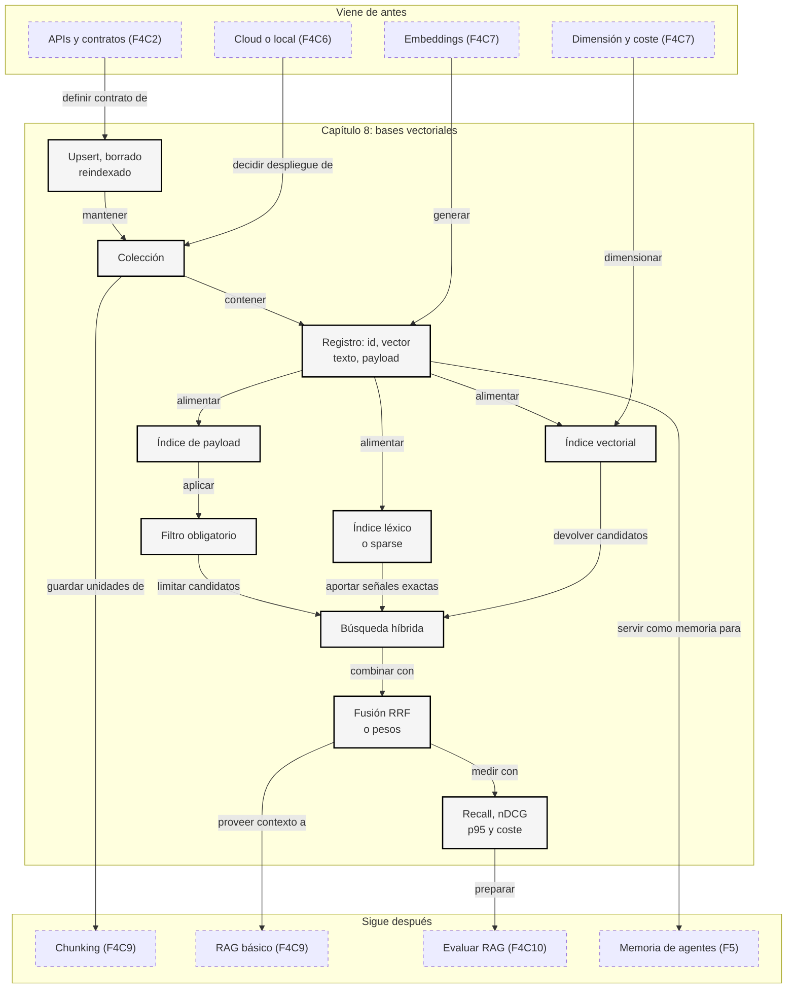

::: {.fasciculo-subtitle}
Facsímil 4 · La caja de herramientas
:::

# Capítulo 08: Bases vectoriales, filtros y búsqueda híbrida

## Cuando el vector deja de ser el problema

En el [capítulo 07](/libro/fasciculo-04/#capitulo-07) construimos la pieza básica: convertir textos en vectores, compararlos y ordenar resultados. Eso ya permite hacer una búsqueda semántica pequeña. Pero en cuanto el sistema deja de ser una demo, aparece otra pregunta: dónde viven esos vectores, cómo se filtran, cómo se actualizan, cómo se borran y cómo sabemos que el índice no está devolviendo resultados bonitos pero equivocados.

Imagina una universidad con miles de documentos internos. Hay normativa de 2024, 2025 y 2026; manuales para estudiantes y profesorado; documentos públicos y documentos solo visibles para equipos concretos. La consulta "no puedo entrar a Moodle con doble factor" no puede devolver cualquier texto parecido. Debe devolver documentos vigentes, del curso correcto y visibles para la persona que pregunta.

Una base vectorial no es "una carpeta de embeddings". Es el lugar donde se cruzan similitud, filtros, permisos, versiones, índices, latencia, borrado y evaluación. Si esta pieza está mal diseñada, el RAG del [capítulo 09](/libro/fasciculo-04/#capitulo-09) heredará el problema aunque el modelo generativo sea excelente.

## Estado del arte con fecha de corte

**Fecha de corte:** 25 de mayo de 2026.  
**Fuentes consultadas ese día:** documentación oficial de Qdrant, pgvector, Weaviate, Milvus y Pinecone; y trabajos académicos sobre FAISS, HNSW, cuantización de producto, BM25 y fusión de rankings.

Lo estable es la arquitectura: guardar vectores con identificadores, texto y metadata; construir índices; filtrar candidatos; combinar señales densas y léxicas; medir recall y latencia. Lo cambiante son APIs concretas, parámetros, límites por plan, soporte de filtros, algoritmos de índice, modelos integrados y costes de almacenamiento.

| Fuente | Qué aporta | Cómo usarla |
|---|---|---|
| FAISS.^[Johnson, J., Douze, M. y Jégou, H. (2019). *Billion-Scale Similarity Search with GPUs*. *IEEE Transactions on Big Data, 7*(3), 535-547. https://doi.org/10.1109/TBDATA.2019.2921572.] | Muestra técnicas de búsqueda eficiente de vectores a gran escala. | Para entender por qué no basta hacer producto punto contra todo cuando crece el corpus. |
| HNSW.^[Malkov, Y. A. y Yashunin, D. A. (2020). *Efficient and Robust Approximate Nearest Neighbor Search Using Hierarchical Navigable Small World Graphs*. *IEEE TPAMI, 42*(4), 824-836. https://doi.org/10.1109/TPAMI.2018.2889473.] | Formaliza un índice por grafo usado por muchas bases vectoriales. | Para entender el intercambio entre memoria, construcción, rapidez y recall. |
| Qdrant.^[Qdrant. (2026). *Indexing*. https://qdrant.tech/documentation/manage-data/indexing/. Consultado el 25 de mayo de 2026.] | Explica que índice vectorial e índice de payload resuelven partes distintas del problema. | Para no confundir "tengo HNSW" con "mis filtros ya van bien". |
| pgvector.^[pgvector. (2026). *pgvector: Open-source vector similarity search for Postgres*. https://github.com/pgvector/pgvector. Consultado el 25 de mayo de 2026.] | Integra búsqueda vectorial dentro de PostgreSQL con operadores de distancia e índices HNSW e IVFFlat. | Para proyectos donde transacciones, SQL, joins y vectores conviven en la misma base. |
| Weaviate.^[Weaviate. (2026). *Hybrid search*. https://docs.weaviate.io/weaviate/search/hybrid. Consultado el 25 de mayo de 2026.] | Documenta búsqueda híbrida que combina vector y BM25F mediante fusión configurable. | Para ver el patrón denso + léxico sin construir todo a mano. |
| Milvus.^[Milvus. (2026). *Filtered Search*. https://milvus.io/docs/filtered-search.md. Consultado el 25 de mayo de 2026.] | Distingue filtrado estándar e iterativo en búsqueda vectorial con metadata. | Para razonar sobre filtros complejos y latencia. |
| Pinecone.^[Pinecone. (2026). *Hybrid search*. https://docs.pinecone.io/docs/hybrid-search-and-sparse-vectors. Consultado el 25 de mayo de 2026.] | Compara usar un índice híbrido único frente a índices densos y dispersos separados. | Para entender que "híbrido" también es una decisión de arquitectura. |

## Qué no es una base vectorial

Una base vectorial no arregla embeddings malos. Si el modelo coloca cerca documentos que no deberían estarlo, el índice solo acelerará ese error. Tampoco arregla un mal troceado: si guardas párrafos sin título, sin sección y sin fecha, recuperarás fragmentos pobres con mucha rapidez.

Tampoco es una base de conocimiento completa. El vector no sustituye al texto original, a las citas, a las reglas de acceso, al historial de versiones ni al sistema que decide si un documento está vigente. La base vectorial guarda una representación para buscar; la verdad documental sigue viviendo en el contenido y en la metadata.

Y no es siempre la herramienta adecuada. Para cien documentos, una búsqueda exacta en memoria puede bastar. Para datos relacionales con filtros complejos, PostgreSQL con `pgvector` puede ser suficiente. Para millones de fragmentos, alta concurrencia, filtros frecuentes o múltiples señales de ranking, conviene pensar en una base vectorial dedicada o en un buscador que combine índice invertido y vectores.

## Qué sí es: un contrato de recuperación

**Ejemplo de fórmula.** Un registro vectorial debería parecerse a esto:

$$
r_i = (id_i,\; v_i,\; texto_i,\; m_i,\; version_i)
$$

| Símbolo | Significado | Ejemplo |
|---|---|---|
| \(r_i\) | Registro número \(i\). | Fragmento de una normativa. |
| \(id_i\) | Identificador estable. | `normativa-2026#sec-04`. |
| \(v_i\) | Vector del fragmento. | 768 números `float32`. |
| \(texto_i\) | Texto recuperable o puntero al texto. | Párrafo que se pasará al RAG. |
| \(m_i\) | Metadata o payload. | `curso=2026`, `rol=estudiante`, `vigente=true`. |
| \(version_i\) | Versión de embedding y documento. | `embed-v3-large@2026-05-25`. |

La búsqueda con filtro se expresa así:

$$
\operatorname{TopK}(q, C, F, k) =
\{r_{(1)}, \dots, r_{(k)}\}
$$

$$
r_{(j)} \in C,\quad F(m_{(j)}) = 1,\quad
s(q, v_{(1)}) \ge \dots \ge s(q, v_{(k)})
$$

| Símbolo | Significado | Ejemplo |
|---|---|---|
| \(q\) | Vector de la consulta. | Embedding de "acceso a Moodle". |
| \(C\) | Colección donde buscamos. | Fragmentos de documentación interna. |
| \(F\) | Función de filtro sobre metadata. | `curso == 2026 and vigente == true`. |
| \(m_{(j)}\) | Metadata del resultado en posición \(j\). | Curso, idioma, rol, fuente. |
| \(s(q,v)\) | Puntuación de similitud. | Coseno o producto punto. |
| \(k\) | Número de resultados devueltos. | 8 fragmentos para un RAG. |

Esta fórmula tiene una lección importante: el filtro no es decoración posterior. Forma parte de lo que significa "resultado válido". Si el sistema encuentra el fragmento más parecido del mundo pero no cumple `F`, ese resultado no debería existir para la consulta.

## El coste real: vectores, índices y payload

En el capítulo anterior calculamos el coste bruto de guardar vectores.

**Ejemplo de fórmula.** Ahora añadimos lo que suele olvidarse:

$$
M_{\text{total}} \approx N \cdot d \cdot b + M_{\text{índice}} + M_{\text{payload}} + M_{\text{réplicas}}
$$

| Símbolo | Significado | Ejemplo |
|---|---|---|
| \(N\) | Número de registros vectoriales. | 10 millones de chunks. |
| \(d\) | Dimensión del vector. | 768 dimensiones. |
| \(b\) | Bytes por componente. | 4 bytes en `float32`, 2 en `float16`. |
| \(M_{\text{índice}}\) | Memoria del índice ANN. | Grafo HNSW o listas IVF. |
| \(M_{\text{payload}}\) | Metadata, texto corto, ids y estructuras auxiliares. | Fechas, permisos, fuente, idioma. |
| \(M_{\text{réplicas}}\) | Copias por disponibilidad o rendimiento. | Dos réplicas duplican parte del coste. |

Con 10 millones de vectores de 768 dimensiones en `float32`, solo el bloque vectorial ocupa alrededor de 30,72 GB. Eso no incluye índice, payload, logs, réplicas, snapshots ni espacio temporal para reconstruir índices. Por eso la dimensión del capítulo 07 y la operación del capítulo 06 vuelven aquí con fuerza.

La selectividad del filtro también importa:

$$
\sigma(F) = \frac{|\{r_i \in C : F(m_i)=1\}|}{|C|}
$$

| Símbolo | Significado | Ejemplo |
|---|---|---|
| \(\sigma(F)\) | Fracción de la colección que pasa el filtro. | 0,02 si quedan 2 de cada 100. |
| \(|C|\) | Tamaño total de la colección. | 10.000.000 registros. |
| \(|\{...\}|\) | Registros que cumplen la condición. | 200.000 registros. |

Un filtro con \(\sigma=0{,}9\) apenas reduce el problema. Uno con \(\sigma=0{,}001\) puede romper supuestos del índice aproximado si no está bien planificado. Las bases vectoriales serias dedican mucha ingeniería a combinar índice vectorial e índice de metadata porque las dos piezas tiran en direcciones distintas.

## Cómo funciona por dentro

Una base vectorial tiene dos rutas principales: ingesta y consulta. En ingesta recibe texto, genera o recibe embeddings, valida el esquema, guarda payload y actualiza índices. En consulta recibe una pregunta, genera el vector de consulta, aplica filtros, busca candidatos, fusiona señales si hay búsqueda híbrida y devuelve resultados con puntuaciones y metadata.

<svg id="f4-c08-vector-db-hybrid" xmlns="http://www.w3.org/2000/svg" viewBox="0 0 1320 820" role="img" aria-label="Arquitectura de una base vectorial con filtros y búsqueda híbrida">
  <defs>
    <marker id="f4c08-arrow" viewBox="0 0 10 10" refX="9" refY="5" markerWidth="7" markerHeight="7" orient="auto-start-reverse">
      <path d="M 0 0 L 10 5 L 0 10 z" fill="#111111"/>
    </marker>
    <pattern id="f4c08-grid" width="18" height="18" patternUnits="userSpaceOnUse">
      <path d="M 18 0 L 0 0 0 18" fill="none" stroke="#E8E8E8" stroke-width="1"/>
    </pattern>
  </defs>

  <rect x="24" y="24" width="1272" height="772" rx="18" fill="#FFFFFF" stroke="#111111" stroke-width="2"/>
  <rect x="48" y="92" width="1224" height="664" rx="14" fill="url(#f4c08-grid)" stroke="#DDDDDD"/>
  <text x="660" y="62" text-anchor="middle" font-family="Arial, sans-serif" font-size="28" font-weight="700" fill="#111111">Base vectorial: similitud, filtros y búsqueda híbrida</text>
  <text x="660" y="88" text-anchor="middle" font-family="Arial, sans-serif" font-size="13" fill="#555555">El resultado válido no es solo cercano: debe cumplir metadata, versión, permisos y evaluación.</text>

  <rect x="72" y="124" width="335" height="262" rx="14" fill="#FFFFFF" stroke="#111111" stroke-width="1.8"/>
  <text x="92" y="154" font-family="Arial, sans-serif" font-size="15" font-weight="700" fill="#111111">1. Ingesta</text>
  <rect x="98" y="178" width="116" height="54" rx="8" fill="#F5F5F5" stroke="#111111"/>
  <text x="156" y="200" text-anchor="middle" font-family="Arial, sans-serif" font-size="12" font-weight="700" fill="#111111">Documento</text>
  <text x="156" y="216" text-anchor="middle" font-family="Arial, sans-serif" font-size="10.5" fill="#555555">fuente y versión</text>
  <line x1="214" y1="205" x2="270" y2="205" stroke="#111111" stroke-width="1.6" marker-end="url(#f4c08-arrow)"/>
  <rect x="270" y="178" width="104" height="54" rx="8" fill="#FFFFFF" stroke="#111111"/>
  <text x="322" y="200" text-anchor="middle" font-family="Arial, sans-serif" font-size="12" font-weight="700" fill="#111111">Chunk</text>
  <text x="322" y="216" text-anchor="middle" font-family="Arial, sans-serif" font-size="10.5" fill="#555555">unidad buscable</text>
  <line x1="322" y1="232" x2="322" y2="276" stroke="#111111" stroke-width="1.4" marker-end="url(#f4c08-arrow)"/>
  <rect x="96" y="276" width="122" height="68" rx="8" fill="#111111" stroke="#111111"/>
  <text x="157" y="302" text-anchor="middle" font-family="Arial, sans-serif" font-size="12" font-weight="700" fill="#FFFFFF">Embedding</text>
  <text x="157" y="320" text-anchor="middle" font-family="Arial, sans-serif" font-size="10.5" fill="#E5E5E5">vector denso</text>
  <line x1="218" y1="310" x2="270" y2="310" stroke="#111111" stroke-width="1.4" marker-end="url(#f4c08-arrow)"/>
  <rect x="270" y="276" width="104" height="68" rx="8" fill="#F5F5F5" stroke="#111111"/>
  <text x="322" y="301" text-anchor="middle" font-family="Arial, sans-serif" font-size="12" font-weight="700" fill="#111111">Payload</text>
  <text x="322" y="319" text-anchor="middle" font-family="Arial, sans-serif" font-size="10.5" fill="#555555">curso, rol, fecha</text>

  <rect x="462" y="124" width="396" height="262" rx="14" fill="#FFFFFF" stroke="#111111" stroke-width="1.8"/>
  <text x="482" y="154" font-family="Arial, sans-serif" font-size="15" font-weight="700" fill="#111111">2. Almacenamiento</text>
  <rect x="494" y="182" width="332" height="56" rx="8" fill="#F5F5F5" stroke="#111111"/>
  <text x="660" y="205" text-anchor="middle" font-family="Arial, sans-serif" font-size="12" font-weight="700" fill="#111111">Registro: id + vector + texto + payload + versión</text>
  <text x="660" y="222" text-anchor="middle" font-family="Arial, sans-serif" font-size="10.5" fill="#555555">el id permite upsert, borrado, trazas y auditoría</text>
  <line x1="560" y1="238" x2="560" y2="278" stroke="#111111" stroke-width="1.4" marker-end="url(#f4c08-arrow)"/>
  <line x1="660" y1="238" x2="660" y2="278" stroke="#111111" stroke-width="1.4" marker-end="url(#f4c08-arrow)"/>
  <line x1="760" y1="238" x2="760" y2="278" stroke="#111111" stroke-width="1.4" marker-end="url(#f4c08-arrow)"/>
  <rect x="500" y="278" width="122" height="72" rx="8" fill="#FFFFFF" stroke="#111111"/>
  <text x="561" y="304" text-anchor="middle" font-family="Arial, sans-serif" font-size="12" font-weight="700" fill="#111111">Índice ANN</text>
  <text x="561" y="323" text-anchor="middle" font-family="Arial, sans-serif" font-size="10.5" fill="#555555">HNSW, IVF, PQ</text>
  <rect x="638" y="278" width="122" height="72" rx="8" fill="#FFFFFF" stroke="#111111"/>
  <text x="699" y="304" text-anchor="middle" font-family="Arial, sans-serif" font-size="12" font-weight="700" fill="#111111">Índice payload</text>
  <text x="699" y="323" text-anchor="middle" font-family="Arial, sans-serif" font-size="10.5" fill="#555555">fecha, rol, tenant</text>
  <rect x="776" y="278" width="50" height="72" rx="8" fill="#111111" stroke="#111111"/>
  <text x="801" y="307" text-anchor="middle" font-family="Arial, sans-serif" font-size="11" font-weight="700" fill="#FFFFFF">BM25</text>
  <text x="801" y="324" text-anchor="middle" font-family="Arial, sans-serif" font-size="9.5" fill="#E5E5E5">léxico</text>

  <rect x="914" y="124" width="326" height="262" rx="14" fill="#FFFFFF" stroke="#111111" stroke-width="1.8"/>
  <text x="934" y="154" font-family="Arial, sans-serif" font-size="15" font-weight="700" fill="#111111">3. Operación</text>
  <rect x="946" y="184" width="112" height="52" rx="8" fill="#F5F5F5" stroke="#111111"/>
  <text x="1002" y="206" text-anchor="middle" font-family="Arial, sans-serif" font-size="12" font-weight="700" fill="#111111">Snapshots</text>
  <text x="1002" y="222" text-anchor="middle" font-family="Arial, sans-serif" font-size="10" fill="#555555">recuperación</text>
  <rect x="1086" y="184" width="112" height="52" rx="8" fill="#FFFFFF" stroke="#111111"/>
  <text x="1142" y="206" text-anchor="middle" font-family="Arial, sans-serif" font-size="12" font-weight="700" fill="#111111">Reindexar</text>
  <text x="1142" y="222" text-anchor="middle" font-family="Arial, sans-serif" font-size="10" fill="#555555">nuevo modelo</text>
  <rect x="946" y="264" width="112" height="52" rx="8" fill="#FFFFFF" stroke="#111111"/>
  <text x="1002" y="286" text-anchor="middle" font-family="Arial, sans-serif" font-size="12" font-weight="700" fill="#111111">Borrado</text>
  <text x="1002" y="302" text-anchor="middle" font-family="Arial, sans-serif" font-size="10" fill="#555555">sin residuos</text>
  <rect x="1086" y="264" width="112" height="52" rx="8" fill="#F5F5F5" stroke="#111111"/>
  <text x="1142" y="286" text-anchor="middle" font-family="Arial, sans-serif" font-size="12" font-weight="700" fill="#111111">Trazas</text>
  <text x="1142" y="302" text-anchor="middle" font-family="Arial, sans-serif" font-size="10" fill="#555555">consulta y ids</text>

  <rect x="72" y="438" width="1168" height="294" rx="14" fill="#FFFFFF" stroke="#111111" stroke-width="1.8"/>
  <text x="92" y="470" font-family="Arial, sans-serif" font-size="15" font-weight="700" fill="#111111">4. Consulta híbrida con filtros</text>
  <rect x="102" y="500" width="126" height="68" rx="8" fill="#111111" stroke="#111111"/>
  <text x="165" y="525" text-anchor="middle" font-family="Arial, sans-serif" font-size="12" font-weight="700" fill="#FFFFFF">Pregunta</text>
  <text x="165" y="544" text-anchor="middle" font-family="Arial, sans-serif" font-size="10.5" fill="#E5E5E5">texto + usuario</text>
  <line x1="228" y1="534" x2="285" y2="534" stroke="#111111" stroke-width="1.5" marker-end="url(#f4c08-arrow)"/>
  <rect x="286" y="482" width="132" height="52" rx="8" fill="#F5F5F5" stroke="#111111"/>
  <text x="352" y="504" text-anchor="middle" font-family="Arial, sans-serif" font-size="12" font-weight="700" fill="#111111">Vector denso</text>
  <text x="352" y="520" text-anchor="middle" font-family="Arial, sans-serif" font-size="10" fill="#555555">semántica</text>
  <rect x="286" y="560" width="132" height="52" rx="8" fill="#FFFFFF" stroke="#111111"/>
  <text x="352" y="582" text-anchor="middle" font-family="Arial, sans-serif" font-size="12" font-weight="700" fill="#111111">Términos</text>
  <text x="352" y="598" text-anchor="middle" font-family="Arial, sans-serif" font-size="10" fill="#555555">BM25 / sparse</text>
  <line x1="418" y1="508" x2="478" y2="508" stroke="#111111" stroke-width="1.5" marker-end="url(#f4c08-arrow)"/>
  <line x1="418" y1="586" x2="478" y2="586" stroke="#111111" stroke-width="1.5" marker-end="url(#f4c08-arrow)"/>
  <rect x="478" y="500" width="144" height="88" rx="8" fill="#F5F5F5" stroke="#111111"/>
  <text x="550" y="528" text-anchor="middle" font-family="Arial, sans-serif" font-size="12" font-weight="700" fill="#111111">Plan de filtro</text>
  <text x="550" y="548" text-anchor="middle" font-family="Arial, sans-serif" font-size="10.5" fill="#555555">curso, rol, fecha</text>
  <text x="550" y="565" text-anchor="middle" font-family="Arial, sans-serif" font-size="10.5" fill="#555555">selectividad</text>
  <line x1="622" y1="544" x2="682" y2="544" stroke="#111111" stroke-width="1.5" marker-end="url(#f4c08-arrow)"/>
  <rect x="682" y="482" width="134" height="52" rx="8" fill="#FFFFFF" stroke="#111111"/>
  <text x="749" y="504" text-anchor="middle" font-family="Arial, sans-serif" font-size="12" font-weight="700" fill="#111111">Top vectorial</text>
  <text x="749" y="520" text-anchor="middle" font-family="Arial, sans-serif" font-size="10" fill="#555555">ANN o exacto</text>
  <rect x="682" y="560" width="134" height="52" rx="8" fill="#FFFFFF" stroke="#111111"/>
  <text x="749" y="582" text-anchor="middle" font-family="Arial, sans-serif" font-size="12" font-weight="700" fill="#111111">Top léxico</text>
  <text x="749" y="598" text-anchor="middle" font-family="Arial, sans-serif" font-size="10" fill="#555555">BM25</text>
  <line x1="816" y1="508" x2="878" y2="535" stroke="#111111" stroke-width="1.5" marker-end="url(#f4c08-arrow)"/>
  <line x1="816" y1="586" x2="878" y2="560" stroke="#111111" stroke-width="1.5" marker-end="url(#f4c08-arrow)"/>
  <rect x="878" y="510" width="126" height="70" rx="8" fill="#111111" stroke="#111111"/>
  <text x="941" y="536" text-anchor="middle" font-family="Arial, sans-serif" font-size="12" font-weight="700" fill="#FFFFFF">Fusion</text>
  <text x="941" y="554" text-anchor="middle" font-family="Arial, sans-serif" font-size="10.5" fill="#E5E5E5">RRF o pesos</text>
  <line x1="1004" y1="545" x2="1066" y2="545" stroke="#111111" stroke-width="1.5" marker-end="url(#f4c08-arrow)"/>
  <rect x="1066" y="500" width="138" height="90" rx="8" fill="#F5F5F5" stroke="#111111"/>
  <text x="1135" y="528" text-anchor="middle" font-family="Arial, sans-serif" font-size="12" font-weight="700" fill="#111111">Rerank</text>
  <text x="1135" y="548" text-anchor="middle" font-family="Arial, sans-serif" font-size="10.5" fill="#555555">citas, permisos</text>
  <text x="1135" y="565" text-anchor="middle" font-family="Arial, sans-serif" font-size="10.5" fill="#555555">evidencia final</text>

  <rect x="140" y="656" width="968" height="44" rx="10" fill="#FFFFFF" stroke="#111111"/>
  <text x="624" y="683" text-anchor="middle" font-family="Arial, sans-serif" font-size="12" font-weight="700" fill="#111111">Medir contra búsqueda exacta: recall@k, nDCG@k, p95, resultados borrados, resultados fuera de filtro y coste por consulta.</text>

  <text x="1268" y="778" text-anchor="end" font-family="Arial, sans-serif" font-size="11" fill="#888888">IA para gente curiosa / Facsímil 04 / Capítulo 08 / 686f6c61</text>
</svg>

La imagen resume el punto central: una consulta real atraviesa dos mundos. Por un lado está la cercania semántica; por otro, el contrato operativo que decide si ese resultado se puede usar. El producto final no debería aceptar un resultado solo porque su vector está cerca.

## Índices: exacto, HNSW, IVFFlat y compresión

La búsqueda exacta compara la consulta con todos los vectores. Es fácil de razonar y sirve como referencia de calidad, pero su coste crece con \(N \cdot d\). A partir de cierto tamaño, necesitamos índices aproximados de vecinos cercanos.

| Opción | Idea | Parámetros típicos | Qué se mide |
|---|---|---|---|
| Exacta | Comparar contra todos los vectores que pasan el filtro. | Sin índice ANN. | Calidad máxima, latencia base. |
| HNSW | Navegar un grafo de vecinos por capas. | `M`, `ef_construction`, `ef_search`. | Recall frente a memoria y p95. |
| IVFFlat | Dividir vectores en listas y buscar solo algunas. | `lists`, `probes`. | Recall frente a velocidad y coste de build. |
| PQ | Comprimir vectores por subespacios. | Número de subcuantizadores y bits. | Ahorro de memoria frente a pérdida de precisión. |

HNSW suele dar buen equilibrio de recall y latencia, pero no es gratis: guarda conexiones entre vectores y consume memoria adicional.^[Malkov y Yashunin, 2020.] IVFFlat puede construir más rápido y ocupar menos, pero requiere elegir listas y probes con cuidado; la documentación de pgvector lo explica como un intercambio entre rendimiento y recall.^[pgvector, 2026.] La cuantización de producto reduce memoria representando subespacios con códigos compactos, pero introduce aproximación adicional.^[Jégou, H., Douze, M. y Schmid, C. (2011). *Product Quantization for Nearest Neighbor Search*. *IEEE TPAMI, 33*(1), 117-128. https://doi.org/10.1109/TPAMI.2010.57.]

Un criterio práctico: conserva siempre un modo de evaluación exacta, aunque sea sobre una muestra. Si no puedes comparar el índice aproximado contra el ranking exacto, no sabes si ganar latencia te está costando evidencias importantes.

## Filtros: dónde se gana o se rompe la recuperación

Los filtros parecen sencillos hasta que crece el corpus. Filtrar por `curso=2026` es fácil; filtrar por `tenant`, `rol`, `vigente`, `idioma`, `producto`, `region`, `tipo_documento` y `fecha` ya obliga a planificar.

Hay tres patrones frecuentes:

| Patrón | Cómo funciona | Riesgo |
|---|---|---|
| Filtrar antes | Primero reduce candidatos por metadata y luego busca vectores. | Si queda muy poco, el índice ANN puede no aportar mucho. |
| Buscar antes | Primero recupera muchos vecinos y luego descarta por metadata. | Puede perder resultados válidos si estaban fuera del primer lote. |
| Filtrado integrado | El índice combina metadata y navegación vectorial. | Requiere crear buenos índices de payload y entender selectividad. |

Qdrant lo dice de forma muy clara: el índice vectorial acelera la búsqueda vectorial y los índices de payload aceleran filtros; hacen trabajos distintos.^[Qdrant, 2026.] Milvus también separa filtrado estándar e iterativo porque filtros complejos pueden cambiar mucho la latencia.^[Milvus, 2026.]

Para entenderlo, piensa en una biblioteca. Si buscas "reglamento de prácticas" en toda la biblioteca y luego tiras los libros antiguos, quizá no veas el reglamento correcto porque no entró en el primer top-k. Si primero entras en la estantería "2026" y después buscas por significado, reduces ruido. Pero si la estantería tiene solo tres documentos, un recorrido exacto puede ser mejor que un índice sofisticado.

## Búsqueda híbrida: cuando exactitud léxica y semántica se necesitan

Los embeddings son fuertes con sinónimos e intención. BM25 es fuerte con palabras raras, siglas, códigos, nombres propios y errores donde la palabra exacta importa. La búsqueda híbrida combina ambas señales.

BM25, simplificado, puntúa una consulta \(Q\) sobre un documento \(D\) así:

$$
\operatorname{BM25}(D,Q) =
\sum_{t \in Q}
\operatorname{IDF}(t)
\frac{f(t,D)(k_1 + 1)}
{f(t,D) + k_1(1-b+b\frac{|D|}{avgdl})}
$$

| Símbolo | Significado | Ejemplo |
|---|---|---|
| \(t\) | Término de la consulta. | `MFA`, `Moodle`, `matrícula`. |
| \(f(t,D)\) | Veces que aparece el término en el documento. | 3 apariciones de `Moodle`. |
| \(\operatorname{IDF}(t)\) | Peso de rareza del término en la colección. | `MFA` pesa más que `el`. |
| \(|D|\) | Longitud del documento. | 180 tokens. |
| \(avgdl\) | Longitud media de documentos. | 220 tokens. |
| \(k_1, b\) | Parámetros de saturación y longitud. | Valores habituales: \(k_1=1{,}2\), \(b=0{,}75\). |

BM25 viene de la familia probabilística de recuperación de información y sigue siendo una base fuerte para búsqueda léxica.^[Robertson, S. y Zaragoza, H. (2009). *The Probabilistic Relevance Framework: BM25 and Beyond*. *Foundations and Trends in Information Retrieval, 3*(4), 333-389. https://doi.org/10.1561/1500000019.] La parte densa recupera significado; la parte léxica protege términos que no deberían diluirse.

Una forma sencilla de fusionar rankings es RRF:

$$
\operatorname{RRF}(d) =
\sum_{j=1}^{S}
\frac{1}{k_0 + \operatorname{rank}_j(d)}
$$

| Símbolo | Significado | Ejemplo |
|---|---|---|
| \(d\) | Documento candidato. | `doc-01`. |
| \(S\) | Número de sistemas que devuelven ranking. | Vectorial y BM25: \(S=2\). |
| \(\operatorname{rank}_j(d)\) | Posicion del documento en el sistema \(j\). | 1 en BM25, 5 en vectorial. |
| \(k_0\) | Constante que suaviza el peso de la posición. | 60 es un valor comun en RRF. |

RRF funciona bien porque no exige que las puntuaciones de BM25 y embeddings estén en la misma escala.^[Cormack, G. V., Clarke, C. L. A. y Buettcher, S. (2009). *Reciprocal Rank Fusion Outperforms Condorcet and Individual Rank Learning Methods*. SIGIR, 758-759. https://doi.org/10.1145/1571941.1572114.] Eso es práctico: un coseno de 0,72 y un BM25 de 11,4 no son directamente comparables, pero sus posiciones en rankings sí pueden combinarse.

| Consulta | Vector denso ayuda | BM25 ayuda | Hibrido evita |
|---|---|---|---|
| "no puedo entrar al campus" | Encuentra "restablecer acceso a Moodle". | Poco, si no comparte palabras. | Quedarse solo con sinónimos. |
| "error SAML 403 Moodle" | Puede entender "login". | Protege `SAML` y `403`. | Perder códigos exactos. |
| "matrícula 2026 septiembre" | Relaciona matrícula con calendario. | Protege `2026` y `septiembre`. | Devolver normativa antigua. |
| "API pagos webhook reintentos" | Relaciona integración y eventos. | Protege `webhook`. | Mezclar artículos de producto. |

Weaviate expone búsqueda híbrida como combinacion de resultados vectoriales y BM25F por fusión configurable.^[Weaviate, 2026.] Pinecone documenta dos caminos: índice híbrido único o índices densos y dispersos separados, cada uno con sus ventajas operativas.^[Pinecone, 2026.] La idea pedagógica es la misma: no hay que elegir religión entre vector y palabras exactas; hay que medir cuál combina mejor en tu corpus.

## Diseñar el esquema de una colección

Antes de indexar, conviene escribir el contrato. Una colección debería responder estas preguntas:

| Decisión | Pregunta técnica | Mala señal |
|---|---|---|
| Identificador | Qué id estable permite reindexar sin duplicar? | IDs aleatorios sin relación con fuente y sección. |
| Texto | Guardamos texto completo o puntero? | Resultados sin cita recuperable. |
| Metadata | Qué campos se filtran de verdad? | Guardar metadata bonita que nunca se indexa. |
| Versión | Qué modelo, dimensión y fecha genero el vector? | Mezclar embeddings incompatibles. |
| Permisos | El filtro de acceso vive en la consulta? | Filtrar después de mostrar candidatos. |
| Vigencia | Cómo caduca o se reemplaza un documento? | Resultados de años anteriores en top-k. |
| Borrado | Qué significa borrar: vector, payload, texto y cache? | Quedan fragmentos recuperables por accidente. |

Si usas PostgreSQL con `pgvector`, el esquema puede ser explícito:

```sql
CREATE EXTENSION IF NOT EXISTS vector;

CREATE TABLE chunks (
  id text PRIMARY KEY,
  source_id text NOT NULL,
  chunk_text text NOT NULL,
  embedding vector(768) NOT NULL,
  curso integer NOT NULL,
  rol text NOT NULL,
  vigente boolean NOT NULL,
  embedding_model text NOT NULL,
  indexed_at timestamptz NOT NULL DEFAULT now()
);

CREATE INDEX chunks_embedding_hnsw
ON chunks USING hnsw (embedding vector_cosine_ops);

CREATE INDEX chunks_metadata
ON chunks (curso, rol, vigente);

SELECT id, chunk_text
FROM chunks
WHERE curso = 2026
  AND rol IN ('estudiante', 'publico')
  AND vigente = true
ORDER BY embedding <=> $1
LIMIT 8;
```

El detalle importante no es memorizar esta sintaxis. El detalle es que el campo vectorial, los filtros y la versión viven juntos. Si cambias el modelo de embedding o la dimensión, no estás "actualizando una columna"; estás cambiando el espacio de búsqueda.

## Cómo trabajar con bases vectoriales con criterio

Una base vectorial en producción necesita disciplina operativa. La parte difícil no es insertar el primer vector; es mantener el sistema correcto cuando cambian documentos, permisos, modelos y volumen.

| Práctica | Qué haces | Por qué importa |
|---|---|---|
| IDs deterministas | Derivas el id de fuente, sección y versión. | Permite `upsert` idempotente y evita duplicados. |
| Versionado de embeddings | Guardas modelo, dimensión, normalización y fecha. | Permite reindexar y comparar variantes. |
| Doble índice temporal | Construyes el nuevo índice junto al anterior. | Evita cortar servicio mientras migras. |
| Borrado verificable | Compruebas que ids borrados no vuelven en top-k. | Evita respuestas con contenido retirado. |
| Filtros obligatorios | El backend añade filtros de permisos siempre. | El cliente no decide qué puede ver. |
| Evaluación continua | Mides recall, p95, coste y errores por segmento. | Detecta degradación antes que usuarios y usuarias. |
| Trazas de retrieval | Guardas consulta, filtros, ids, scores y versión. | Permite explicar por qué se recuperó algo. |

Una buena pregunta de ingeniería: si mañana cambiamos de `all-MiniLM-L6-v2` a otro modelo de 1024 dimensiones, ¿qué pasos exactos hay que hacer? Si la respuesta no incluye reindexado, evaluación, cambio de versión y plan de retirada del índice anterior, falta diseño.

## Evaluar una base vectorial

Aquí evaluamos dos capas: la calidad de recuperación y la calidad operativa. La primera pregunta es "encuentro lo correcto?". La segunda es "lo encuentro dentro del contrato de producto?".

| Métrica | Qué mide | Cómo se calcula |
|---|---|---|
| Recall ANN@k | Cuánto se parece el índice aproximado al exacto. | Resultados ANN frente a búsqueda exacta. |
| Recall con filtro@k | Si aparecen documentos correctos cumpliendo metadata. | Casos con filtros obligatorios. |
| nDCG@k | Si los documentos más útiles suben arriba. | Relevancia graduada por posición. |
| p50, p95, p99 | Latencia normal y de cola. | Tiempos por consulta real. |
| Tasa de resultados retirados | Cuántos resultados ya no deberían aparecer. | Hits con `vigente=false` o versión antigua. |
| Cobertura de permisos | Si cada consulta aplica el filtro correcto. | Trazas con usuario, rol y condición. |
| Coste por consulta | CPU, memoria, GPU o precio cloud. | Coste mensual dividido por consultas útiles. |

Una prueba mínima compara tres rankings para las mismas consultas: exacto filtrado, ANN filtrado e híbrido filtrado. Si el ANN pierde documentos que el exacto encuentra, ajustas parámetros o cambias índice. Si el híbrido mejora consultas con siglas pero empeora consultas naturales, ajustas fusión o decides cuándo activarlo.

## Dónde volverá a aparecer

| Concepto | Dónde vuelve | Para qué |
|---|---|---|
| Chunking | [Capítulo 09](/libro/fasciculo-04/#capitulo-09). | Elegir qué unidades guardamos en la base vectorial. |
| Citas y abstención | [Capítulo 09](/libro/fasciculo-04/#capitulo-09). | No basta recuperar; hay que responder con evidencia. |
| Evaluación de RAG | [Capítulo 10](/libro/fasciculo-04/#capitulo-10). | Conectar retrieval con calidad final de respuesta. |
| Agentic RAG | [Capítulo 11](/libro/fasciculo-04/#capitulo-11). | Decidir cuándo hacer varias búsquedas o rutas. |
| Memoria de agentes | [Facsímil 05](/libro/fasciculo-05/). | Guardar recuerdos recuperables con filtros y caducidad. |

## Dónde solía tropezar yo

| Error | Por qué es un error | Antídoto |
|---|---|---|
| **Creer que vector DB equivale a RAG** | La base recupera candidatos; no decide chunking, citas, abstención ni respuesta final. | Separar retrieval, contexto y generación. |
| **Filtrar después de recuperar poco** | Si pides top-10 global y luego descartas por permisos, puedes quedarte sin el resultado correcto. | Aplicar filtros como parte del plan de búsqueda. |
| **No versionar embeddings** | Mezclar modelos o dimensiones hace que las distancias dejen de significar lo mismo. | Guardar `embedding_model`, dimensión y fecha en cada registro. |
| **Olvidar términos exactos** | Siglas, códigos, IDs y nombres propios pueden perderse en búsqueda solo densa. | Probar búsqueda híbrida con BM25 o sparse vectors. |
| **Medir solo latencia media** | p95 o p99 pueden ser malos aunque la media parezca aceptable. | Medir percentiles y separar consultas con filtros complejos. |
| **No probar borrados** | Un índice puede seguir devolviendo contenido retirado si el flujo de borrado falla. | Crear tests de ids retirados y verificar que no aparecen. |
| **Elegir herramienta por moda** | Cada base cambia filtros, operación, costes, backup y SQL disponible. | Comparar con una matriz de requisitos reales. |

## Manos a la obra

Kit ejecutable y descargable: `labs/f4/capitulo-practicas/`. Ejecuta `python3 ops/run_f4_practices.py --all --write --fail-on-invalid` para correr todas las prácticas del facsímil, o `python3 ops/run_f4_practices.py --chapter c01 --write --fail-on-invalid` cambiando `c01` por el capítulo que quieras aislar.

Vamos a construir una mini base vectorial en memoria. No pretende competir con Qdrant, pgvector o Milvus; sirve para entender el contrato: documentos, metadata, filtros, ranking denso, BM25, fusión RRF y evaluación.

La práctica usa embeddings deterministas muy simples para no depender de una API externa. En un proyecto real, sustituirías `vector_de_texto` por el modelo de embeddings del [capítulo 07](/libro/fasciculo-04/#capitulo-07), y el almacenamiento en memoria por una base vectorial real.

Guarda esto como `mini_base_vectorial.py`:

```python
from collections import Counter, defaultdict
import hashlib
import math
import re
import unicodedata


DIM = 32
K_RRF = 60

DOCUMENTOS = [
    {
        "id": "doc-01",
        "titulo": "Acceso al campus virtual con doble factor",
        "texto": "Moodle requiere MFA y recuperacion de contraseña.",
        "curso": 2026,
        "rol": "estudiante",
        "vigente": True,
    },
    {
        "id": "doc-02",
        "titulo": "Calendario de matricula 2026",
        "texto": "La ampliacion de matricula se abre en septiembre.",
        "curso": 2026,
        "rol": "publico",
        "vigente": True,
    },
    {
        "id": "doc-03",
        "titulo": "Correo institucional y doble factor",
        "texto": "El correo se desbloquea revisando MFA y contraseña.",
        "curso": 2026,
        "rol": "estudiante",
        "vigente": True,
    },
    {
        "id": "doc-04",
        "titulo": "Acceso antiguo al campus virtual",
        "texto": "Procedimiento obsoleto para Moodle en 2024.",
        "curso": 2024,
        "rol": "estudiante",
        "vigente": False,
    },
    {
        "id": "doc-05",
        "titulo": "Manual de Moodle para profesorado",
        "texto": "Crear cuestionarios, bancos de preguntas y rubricas.",
        "curso": 2026,
        "rol": "profesorado",
        "vigente": True,
    },
]

CASOS = [
    {
        "consulta": "no puedo entrar a moodle con mfa",
        "filtro": {"curso": 2026, "vigente": True},
        "esperado": {"doc-01"},
    },
    {
        "consulta": "fechas de matricula septiembre",
        "filtro": {"curso": 2026, "vigente": True},
        "esperado": {"doc-02"},
    },
    {
        "consulta": "correo bloqueado doble factor",
        "filtro": {"curso": 2026, "vigente": True},
        "esperado": {"doc-03"},
    },
]

SINONIMOS = {
    "moodle": "campus",
    "aula": "campus",
    "virtual": "campus",
    "mfa": "doble_factor",
    "factor": "doble_factor",
    "2fa": "doble_factor",
    "entrar": "acceso",
    "acceder": "acceso",
    "bloqueado": "desbloqueo",
    "desbloquear": "desbloqueo",
}


def normalizar_texto(texto):
    texto = texto.lower()
    texto = unicodedata.normalize("NFD", texto)
    texto = "".join(c for c in texto if unicodedata.category(c) != "Mn")
    tokens = re.findall(r"[a-z0-9_]+", texto)
    return [SINONIMOS.get(t, t) for t in tokens]


def vector_token(token):
    digest = hashlib.sha256(token.encode("utf-8")).digest()
    valores = []
    for i in range(DIM):
        byte = digest[i % len(digest)]
        valores.append((byte / 255.0) * 2 - 1)
    return valores


def normalizar_vector(vector):
    norma = math.sqrt(sum(x * x for x in vector)) or 1.0
    return [x / norma for x in vector]


def vector_de_texto(texto):
    vector = [0.0] * DIM
    for token in normalizar_texto(texto):
        base = vector_token(token)
        vector = [a + b for a, b in zip(vector, base)]
    return normalizar_vector(vector)


def producto_punto(a, b):
    return sum(x * y for x, y in zip(a, b))


def cumple_filtro(doc, filtro):
    return all(doc.get(campo) == valor for campo, valor in filtro.items())


def construir_indice(documentos):
    textos = [d["titulo"] + ". " + d["texto"] for d in documentos]
    tokens_por_doc = [normalizar_texto(t) for t in textos]
    df = defaultdict(int)
    for tokens in tokens_por_doc:
        for token in set(tokens):
            df[token] += 1
    return {
        "vectores": [vector_de_texto(t) for t in textos],
        "tokens": tokens_por_doc,
        "df": df,
        "avgdl": sum(len(t) for t in tokens_por_doc) / len(tokens_por_doc),
    }


def bm25_score(query_tokens, doc_tokens, df, avgdl):
    k1 = 1.2
    b = 0.75
    total_docs = len(DOCUMENTOS)
    frecuencias = Counter(doc_tokens)
    score = 0.0

    for token in query_tokens:
        if token not in frecuencias:
            continue
        numerador = total_docs - df[token] + 0.5
        denominador_idf = df[token] + 0.5
        idf = math.log(1 + numerador / denominador_idf)
        tf = frecuencias[token]
        longitud = len(doc_tokens)
        denominador = tf + k1 * (1 - b + b * longitud / avgdl)
        score += idf * (tf * (k1 + 1)) / denominador

    return score


def ranking_denso(consulta, documentos, indice, filtro):
    consulta_vec = vector_de_texto(consulta)
    filas = []
    for pos, doc in enumerate(documentos):
        if not cumple_filtro(doc, filtro):
            continue
        score = producto_punto(consulta_vec, indice["vectores"][pos])
        filas.append((doc["id"], score))
    return sorted(
        filas,
        key=lambda fila: fila[1],
        reverse=True,
    )


def ranking_bm25(consulta, documentos, indice, filtro):
    query_tokens = normalizar_texto(consulta)
    filas = []
    for pos, doc in enumerate(documentos):
        if not cumple_filtro(doc, filtro):
            continue
        score = bm25_score(
            query_tokens,
            indice["tokens"][pos],
            indice["df"],
            indice["avgdl"],
        )
        filas.append((doc["id"], score))
    return sorted(
        filas,
        key=lambda fila: fila[1],
        reverse=True,
    )


def rrf(rankings):
    acumulado = defaultdict(float)
    for ranking in rankings:
        for posicion, (doc_id, _score) in enumerate(ranking, start=1):
            acumulado[doc_id] += 1 / (K_RRF + posicion)
    return sorted(
        acumulado.items(),
        key=lambda fila: fila[1],
        reverse=True,
    )


def recall_at_k(ranking, esperados, k):
    recuperados = {doc_id for doc_id, _score in ranking[:k]}
    return bool(recuperados & esperados)


def main():
    indice = construir_indice(DOCUMENTOS)
    aciertos = 0

    for caso in CASOS:
        denso = ranking_denso(
            caso["consulta"],
            DOCUMENTOS,
            indice,
            caso["filtro"],
        )
        lexico = ranking_bm25(
            caso["consulta"],
            DOCUMENTOS,
            indice,
            caso["filtro"],
        )
        hibrido = rrf([denso, lexico])
        aciertos += recall_at_k(hibrido, caso["esperado"], k=3)

        print("Consulta:", caso["consulta"])
        print("Filtro:", caso["filtro"])
        print("Top denso:", denso[:3])
        print("Top BM25:", lexico[:3])
        print("Top hibrido:", hibrido[:3])
        print()

    print("Recall hibrido@3:", round(aciertos / len(CASOS), 3))

    sin_filtro = ranking_denso(
        "entrar a moodle",
        DOCUMENTOS,
        indice,
        filtro={},
    )
    print("Sin filtro de vigencia:", sin_filtro[:3])


if __name__ == "__main__":
    main()
```

Salida esperada aproximada:

```text
Consulta: no puedo entrar a moodle con mfa
Filtro: {'curso': 2026, 'vigente': True}
Top denso: [('doc-01', ...), ('doc-03', ...), ...]
Top BM25: [('doc-01', ...), ...]
Top hibrido: [('doc-01', ...), ...]

Recall hibrido@3: 1.0
Sin filtro de vigencia: [('doc-01', ...), ('doc-04', ...), ...]
```

La última línea es el aprendizaje. El documento antiguo puede parecer cercano porque habla de Moodle y acceso. Sin filtro de vigencia, el sistema puede recuperar algo semánticamente razonable y funcionalmente incorrecto.

Prueba tres cambios: añade `rol="profesorado"` al filtro, cambia `K_RRF`, y crea un documento con el código exacto `SAML 403`. Verás cuándo BM25 salva una consulta y cuándo el filtro cambia el ranking más que el embedding.

## Cómo encaja todo



## Vocabulario aprendido

| Término | Definición |
|---|---|
| **Base vectorial** | Sistema que guarda vectores y permite recuperarlos por similitud. |
| **Colección** | Conjunto de registros con el mismo contrato de vector y metadata. |
| **Payload** | Metadata asociada al vector, usada para filtrar y explicar resultados. |
| **Índice vectorial** | Estructura que acelera la búsqueda de vecinos cercanos. |
| **HNSW** | Índice por grafo navegable para búsqueda aproximada. |
| **IVFFlat** | Índice que divide el espacio en listas y busca solo algunas. |
| **Filtro** | Condición que limita qué registros pueden entrar en el ranking. |
| **BM25** | Ranking léxico basado en frecuencia, rareza y longitud de documento. |
| **Búsqueda híbrida** | Combinación de ranking vectorial y ranking léxico. |
| **RRF** | Fusión de rankings basada en posiciones. |
| **Upsert** | Inserción o actualización idempotente de un registro. |

## Antes de pasar página

- [ ] ¿Puedo explicar por qué una base vectorial no arregla embeddings malos?
- [ ] ¿Sé qué debe guardar un registro vectorial además del vector?
- [ ] ¿Puedo calcular el coste bruto de memoria para \(N\), \(d\) y bytes por componente?
- [ ] ¿Sé explicar qué mide la selectividad de un filtro?
- [ ] ¿Sé distinguir búsqueda exacta, HNSW, IVFFlat y PQ?
- [ ] ¿Sé por qué filtrar después de recuperar poco puede fallar?
- [ ] ¿Sé cuándo BM25 aporta algo que el embedding puede perder?
- [ ] ¿Puedo explicar RRF sin comparar puntuaciones incompatibles?
- [ ] ¿Sé qué campos versionar para reindexar con seguridad?
- [ ] ¿Sé qué métricas mirar además de recall: p95, coste y resultados retirados?

## En resumen

| Idea fuerza | Detalle |
|---|---|
| Una base vectorial es un contrato operativo. | Guarda vectores, texto, ids, metadata, versiones e índices. |
| El filtro forma parte de la respuesta correcta. | Un resultado cercano pero fuera de curso, rol o vigencia no es válido. |
| El índice aproximado debe compararse con exacto. | Sin baseline exacto, no sabes cuánto recall pierdes por ganar latencia. |
| La búsqueda híbrida une dos señales. | Embeddings capturan significado; BM25 protege términos exactos. |
| Operar importa tanto como buscar. | Upsert, borrado, snapshots, reindexado y trazas deciden si el sistema aguanta. |
| La evaluación debe incluir producto. | Recall, nDCG, filtros, p95, coste y documentos retirados cuentan juntos. |

## Para saber más

Cormack, G. V., Clarke, C. L. A. y Buettcher, S. (2009). *Reciprocal Rank Fusion Outperforms Condorcet and Individual Rank Learning Methods*. SIGIR, 758-759. https://doi.org/10.1145/1571941.1572114

Jégou, H., Douze, M. y Schmid, C. (2011). *Product Quantization for Nearest Neighbor Search*. *IEEE Transactions on Pattern Analysis and Machine Intelligence, 33*(1), 117-128. https://doi.org/10.1109/TPAMI.2010.57

Johnson, J., Douze, M. y Jégou, H. (2019). *Billion-Scale Similarity Search with GPUs*. *IEEE Transactions on Big Data, 7*(3), 535-547. https://doi.org/10.1109/TBDATA.2019.2921572

Malkov, Y. A. y Yashunin, D. A. (2020). *Efficient and Robust Approximate Nearest Neighbor Search Using Hierarchical Navigable Small World Graphs*. *IEEE TPAMI, 42*(4), 824-836. https://doi.org/10.1109/TPAMI.2018.2889473

Milvus. (2026). *Filtered Search*. https://milvus.io/docs/filtered-search.md

pgvector. (2026). *pgvector: Open-source vector similarity search for Postgres*. https://github.com/pgvector/pgvector

Pinecone. (2026). *Hybrid search*. https://docs.pinecone.io/docs/hybrid-search-and-sparse-vectors

Qdrant. (2026). *Indexing*. https://qdrant.tech/documentation/manage-data/indexing/

Robertson, S. y Zaragoza, H. (2009). *The Probabilistic Relevance Framework: BM25 and Beyond*. *Foundations and Trends in Information Retrieval, 3*(4), 333-389. https://doi.org/10.1561/1500000019

Weaviate. (2026). *Hybrid search*. https://docs.weaviate.io/weaviate/search/hybrid
