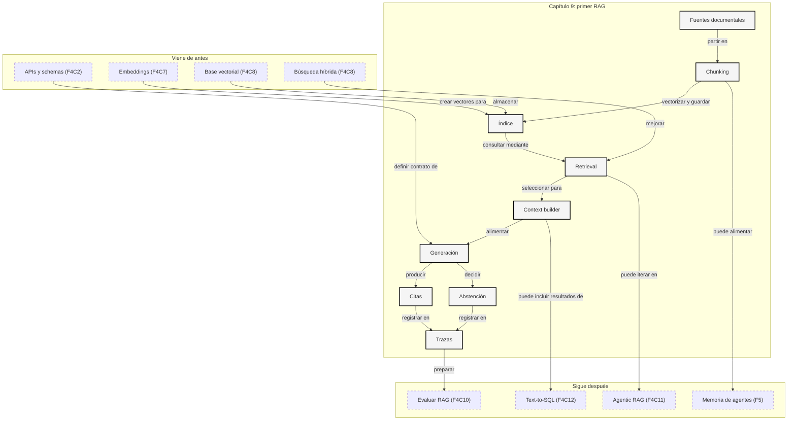

::: {.fasciculo-subtitle}
Facsímil 4 · La caja de herramientas
:::

# Capítulo 09: RAG básico: chunking, retrieval, citas y abstención

## El momento en que buscar ya no basta

En el [capítulo 08](/libro/fasciculo-04/#capitulo-08) aprendimos a guardar fragmentos, buscarlos con vectores, filtrarlos por metadata y combinar señal densa con BM25. Eso devuelve candidatos. Un RAG hace algo más delicado: convierte esos candidatos en una respuesta útil, citada y capaz de decir “no tengo evidencia suficiente”.

Imagina un asistente para alumnado. La persona pregunta: “¿puedo ampliar matrícula en septiembre si tengo pagos pendientes?”. El sistema no debería inventar una política general. Debe recuperar normativa vigente, decidir qué fragmentos entran en contexto, responder solo con lo que esos fragmentos sostienen y enseñar las fuentes.

RAG significa *retrieval-augmented generation*: generación aumentada por recuperación. La idea fue formulada como una forma de combinar modelos generativos con memoria no paramétrica recuperada desde un índice externo.^[Lewis, P. et al. (2020). *Retrieval-Augmented Generation for Knowledge-Intensive NLP Tasks*. NeurIPS 33, 9459-9474. https://papers.nips.cc/paper/2020/hash/6b493230205f780e1bc26945df7481e5-Abstract.html.] En producto, RAG no es una palabra bonita para “chat con PDFs”. Es una arquitectura para que el modelo responda con información que no tiene por entrenamiento, que cambia con el tiempo o que pertenece a una organización concreta.

Cuando decimos “memoria no paramétrica” estamos diciendo algo muy concreto: el conocimiento no está guardado dentro de los pesos del modelo. Está fuera, en documentos, tablas, índices, bases de datos o sistemas que podemos actualizar sin volver a entrenar el modelo.

## Estado del arte con fecha de corte

**Fecha de corte:** 25 de mayo de 2026.  
**Fuentes consultadas ese día:** documentación oficial de OpenAI File Search, LangChain, LlamaIndex, Haystack, Google Vertex AI RAG Engine, Azure AI Search, Pinecone, Weaviate, Qdrant y pgvector; y trabajos académicos sobre RAG, BM25 y fusión de rankings.

Lo estable es el patrón: ingestión, partición, indexado, recuperación, construcción de contexto, generación, citas y evaluación. Lo cambiante son proveedores, límites, APIs, modelos de embeddings, formatos soportados, coste, residencia de datos, rerankers y herramientas gestionadas.

| Fuente | Qué aporta | Cómo usarla |
|---|---|---|
| RAG original.^[Lewis et al., 2020.] | Formaliza el uso de documentos recuperados como memoria externa para generación. | Para entender que RAG no es solo “meter documentos en un prompt”. |
| OpenAI File Search.^[OpenAI. (2026). *File search*. https://platform.openai.com/docs/guides/tools-file-search/. Consultado el 25 de mayo de 2026.] | Herramienta gestionada de la Responses API para buscar archivos en vector stores y devolver contexto al modelo. | Para montar rápido un RAG alojado sin programar todo el retrieval. |
| LangChain Retrieval.^[LangChain. (2026). *Retrieval*. https://docs.langchain.com/oss/python/langchain/retrieval. Consultado el 25 de mayo de 2026.] | Describe loaders, splitters, embeddings, vector stores, retrievers y arquitecturas 2-step, agentic e híbridas. | Para componer aplicaciones RAG con piezas intercambiables. |
| LlamaIndex RAG.^[LlamaIndex. (2026). *Introduction to RAG*. https://docs.llamaindex.ai/en/stable/understanding/rag/. Consultado el 25 de mayo de 2026.] | Ordena RAG en loading, indexing, storing, querying y evaluation; introduce Documents, Nodes y retrievers. | Para proyectos centrados en ingestión de datos y gestión de índices. |
| Haystack pipelines.^[deepset. (2026). *Pipelines*. https://docs.haystack.deepset.ai/docs/pipelines. Consultado el 25 de mayo de 2026.] | Modela RAG como grafo de componentes con ramas, validación y flujos de indexado/consulta. | Para equipos que quieren pipelines explícitos y desplegables. |
| Vertex AI RAG Engine.^[Google Cloud. (2026). *Vertex AI RAG Engine overview*. https://docs.cloud.google.com/vertex-ai/generative-ai/docs/rag-engine/rag-overview. Consultado el 25 de mayo de 2026.] | Servicio gestionado de RAG dentro de Vertex AI. | Para entornos Google Cloud donde operación, permisos y plataforma pesan. |
| Azure AI Search.^[Microsoft. (2026). *Retrieval-augmented generation in Azure AI Search*. https://learn.microsoft.com/en-us/azure/search/retrieval-augmented-generation-overview. Consultado el 25 de mayo de 2026.] | Combina búsqueda tradicional, vectorial, semántica, filtros e integración con escenarios generativos. | Para organizaciones ya montadas sobre Azure y Microsoft Learn. |
| Pinecone y Weaviate.^[Pinecone. (2026). *Build a RAG chatbot*. https://docs.pinecone.io/guides/get-started/build-a-rag-chatbot. Consultado el 25 de mayo de 2026. Weaviate. (2026). *Retrieval Augmented Generation (RAG)*. https://docs.weaviate.io/weaviate/search/generative. Consultado el 25 de mayo de 2026.] | Bases vectoriales gestionadas con patrones RAG, búsqueda semántica, filtros y opciones híbridas. | Para delegar índice y escalado sin entregar el diseño del sistema. |
| BM25 y RRF.^[Robertson, S. y Zaragoza, H. (2009). *The Probabilistic Relevance Framework: BM25 and Beyond*. *Foundations and Trends in Information Retrieval, 3*(4), 333-389. https://doi.org/10.1561/1500000019. Cormack, G. V., Clarke, C. L. A. y Buettcher, S. (2009). *Reciprocal Rank Fusion Outperforms Condorcet and Individual Rank Learning Methods*. SIGIR, 758-759. https://doi.org/10.1145/1571941.1572114.] | Dan bases sólidas para retrieval léxico y fusión de rankings. | Para no construir RAG solo con embeddings. |

## Qué no es RAG

RAG no es subir un PDF a un chat y confiar. Si el PDF se trocea mal, si la búsqueda trae el fragmento equivocado o si el prompt permite responder sin evidencia, el sistema puede fallar con mucha seguridad aparente.

Tampoco es fine-tuning. Ajustar un modelo puede enseñar formato, tono o una tarea repetida; RAG aporta contexto externo en tiempo de consulta. Si la información cambia cada semana, suele ser mejor actualizar documentos e índice que reentrenar.

RAG tampoco elimina la necesidad de permisos. Recuperar un fragmento privado y luego pedir al modelo que “no lo mencione” es una mala frontera. El filtrado debe ocurrir antes de que el texto entre en contexto.

## RAG, memoria y entrenamiento no son lo mismo

Esta diferencia es fundamental. Si la mezclamos, acabamos usando RAG para lo que pide entrenamiento, fine-tuning para lo que pide documentos, o “memoria” para cosas que deberían ser permisos, trazas o contexto recuperado.

El modelo base tiene conocimiento en sus pesos. Eso viene del entrenamiento: grandes cantidades de datos, mucho cálculo y una actualización difícil de repetir para una aplicación pequeña. Cuando haces fine-tuning o LoRA, sigues tocando comportamiento aprendido: formato, estilo, patrones de respuesta, especialización en una tarea repetida. RAG, en cambio, no cambia los pesos. Recupera evidencia externa en el momento de la pregunta.

| Mecanismo | Dónde vive la información | Cuándo cambia | Para qué sirve |
|---|---|---|---|
| **Entrenamiento base** | En los pesos del modelo. | Antes de que tú uses el modelo. | Capacidades generales: lenguaje, razonamiento, código, patrones del mundo. |
| **Fine-tuning / LoRA** | En pesos ajustados o adaptadores. | Cuando entrenas con ejemplos. | Formato, tono, clasificación estable, tareas repetidas y medibles. |
| **RAG** | En un corpus externo recuperable. | Cuando cambian documentos o índices. | Conocimiento privado, vigente, citable o cambiante. |
| **Memoria de conversación** | En mensajes previos o resúmenes guardados. | Durante una sesión o entre sesiones si se persiste. | Preferencias, contexto personal y continuidad conversacional. |
| **Caché** | En una capa técnica de reutilización. | Mientras sea válida. | Ahorrar coste o latencia; no añade conocimiento nuevo. |
| **Tool** | En un sistema externo consultado o ejecutado. | En tiempo real. | Calcular, buscar estado vivo, escribir en sistemas o consultar APIs. |

Ejemplo sencillo: si una universidad cambia la normativa de matrícula, no quieres reentrenar un modelo. Quieres actualizar el documento, reindexar y que las respuestas citen la normativa nueva. Si, en cambio, el problema es que el modelo siempre devuelve un JSON con campos mal nombrados, RAG no lo arregla por sí solo: quizá necesitas mejor contrato de salida, ejemplos, validación o ajuste.

La memoria conversacional tampoco equivale a RAG. Si el usuario dice “soy estudiante de segundo”, eso puede vivir como memoria o como contexto de sesión. Pero si pregunta “¿qué dice la normativa vigente sobre ampliación?”, eso debe salir del corpus, con fecha y cita. La memoria puede ayudar a formular la consulta; no debe sustituir la fuente.

## Por qué usar un RAG

Usamos RAG cuando responder bien exige recuperar evidencia externa. No es una moda de arquitectura; es una respuesta a una limitación práctica: los modelos no traen dentro todos tus documentos, no conocen todos los cambios recientes y no pueden demostrar por sí solos de dónde sale una afirmación.

| Motivo | Qué problema resuelve | Señal de que RAG encaja |
|---|---|---|
| **Información cambiante** | El conocimiento se actualiza sin tocar pesos. | Normativas, catálogos, precios internos, políticas y manuales vivos. |
| **Conocimiento privado** | El modelo no vio tus documentos durante entrenamiento. | Intranets, tickets, expedientes, documentación de producto. |
| **Citas y auditoría** | La respuesta puede revisarse contra fuentes. | Necesitas enseñar página, sección, fecha o documento. |
| **Permisos** | Cada persona puede recuperar solo lo que le corresponde. | Hay roles, grupos, tenants, cursos, clientes o áreas. |
| **Coste de actualización** | Reindexar suele ser más barato que reentrenar. | El corpus cambia más que el comportamiento deseado. |
| **Especialización ligera** | El modelo general se apoya en contexto de dominio. | La tarea pide lenguaje natural más conocimiento concreto. |
| **Depuración** | Puedes ver qué documentos entraron en la respuesta. | Necesitas saber si falló búsqueda, contexto o generación. |

También hay casos donde RAG no es la primera respuesta.

| Situación | Mejor primera herramienta |
|---|---|
| El modelo no sigue el formato. | Prompt, ejemplos, salida estructurada o fine-tuning. |
| La respuesta depende de cálculo exacto. | Tool o código, no solo documentos. |
| La información vive en una base de datos transaccional. | SQL, API o tool; quizá luego RAG para explicar resultados. |
| La tarea es siempre igual y estable. | Fine-tuning/LoRA puede ser más eficiente. |
| El corpus está desordenado o sin dueño. | Gobernanza documental antes de RAG. |

## Qué sí es: una cadena verificable

Un RAG mínimo tiene dos procesos separados. El primero prepara el conocimiento; el segundo responde una pregunta.

| Proceso | Ocurre cuándo | Qué produce |
|---|---|---|
| Indexación | Antes de la consulta, cuando entran o cambian documentos. | Chunks con embeddings, texto, metadata y versión. |
| Consulta | Cuando una persona pregunta. | Respuesta con citas, o abstención si no hay evidencia suficiente. |

**Ejemplo de fórmula.** La consulta completa puede expresarse así:

$$
q = f_{\theta}(x)
$$

$$
R_k = \operatorname{TopK}(q, C, F, k)
$$

$$
y = g_{\phi}(x, \operatorname{Contexto}(R_k))
$$

| Símbolo | Significado | Ejemplo |
|---|---|---|
| \(x\) | Pregunta original. | “¿puedo ampliar matrícula en septiembre?”. |
| \(f_{\theta}\) | Modelo de embeddings. | Convierte la pregunta en vector. |
| \(q\) | Vector de la pregunta. | 768 números. |
| \(C\) | Colección de chunks indexados. | Normativa, FAQs y manuales. |
| \(F\) | Filtros obligatorios. | `curso=2026`, `vigente=true`, `rol=estudiante`. |
| \(R_k\) | Fragmentos recuperados. | Top 6 chunks después de filtros. |
| \(g_{\phi}\) | Modelo generativo. | LLM que redacta la respuesta. |
| \(y\) | Respuesta final. | Texto con citas o abstención. |

La parte peligrosa está en \(\operatorname{Contexto}(R_k)\). No todos los chunks recuperados deben entrar en el prompt. Hay que ordenar, recortar, quitar duplicados, proteger permisos, preservar citas y dejar hueco para instrucciones y respuesta.

## Términos que no podemos dar por sabidos

La jerga de RAG engaña porque muchas palabras parecen pequeñas y en realidad esconden decisiones de sistema. “Chunk”, “metadata” o “top-k” no son etiquetas académicas: son puntos donde puedes ganar o perder calidad, coste, privacidad y capacidad de depuración.

La primera familia de términos aparece antes de preguntar nada. Es la parte de preparación del conocimiento.

| Término | Qué significa de verdad | En el ejemplo de matrícula |
|---|---|---|
| **Corpus** | Conjunto de fuentes que el sistema tiene permiso para consultar. No es “todo lo que existe”; es lo que has decidido meter en el sistema. | Normativa 2026, FAQ de secretaría, calendario académico y manual de trámites. |
| **Fuente** | Documento o sistema original del que sale la información. Puede ser un PDF, una web, una tabla o una base de datos. | `normativa_matricula_2026.pdf`. |
| **Documento** | Representación interna de una fuente. Suele incluir texto, título, fecha, URL, propietario y versión. | La normativa convertida a texto con su fecha de publicación. |
| **Parser** | Programa que extrae texto y estructura. Si el parser lee mal una tabla, el RAG recuperará texto defectuoso. | Sacar de un PDF el artículo, el título y los apartados en orden correcto. |
| **OCR** | Reconocimiento óptico de caracteres. Convierte una imagen o escaneo en texto. | Una normativa escaneada que no permite seleccionar texto. |
| **Chunk** | Fragmento recuperable. Debe ser suficientemente pequeño para buscar bien y suficientemente completo para citarlo. | Un artículo completo sobre ampliación de matrícula. |
| **Token** | Unidad interna aproximada de texto que usan modelos y muchos contadores de coste. No siempre coincide con palabra. | “matrícula” puede ocupar más de un token según el tokenizador. |
| **Solape** | Parte repetida entre dos chunks consecutivos para no cortar ideas. | Repetir el encabezado y la frase anterior cuando un artículo pasa de una ventana a otra. |
| **Metadata** | Datos sobre el chunk, no necesariamente contenido para responder. Sirve para filtrar, citar y operar. | `curso=2026`, `vigente=true`, `seccion=matricula`, `pagina=12`. |
| **ACL** | Reglas de acceso. Indican quién puede recuperar un chunk antes de que llegue al modelo. | Alumnado ve normativa pública; personal interno ve notas de gestión. |
| **Hash** | Huella calculada del texto. Si el documento cambia, cambia el hash. | Detectar que se subió una normativa nueva aunque mantenga el mismo nombre de archivo. |
| **Versión de corpus** | Identificador de qué conjunto de documentos e índices se usó. Es clave para reproducir una respuesta. | `matricula-2026-v3`, usado el 25 de mayo de 2026. |

La segunda familia aparece cuando alguien pregunta. Aquí conviene separar “buscar parecido” de “encontrar evidencia”.

| Término | Qué significa de verdad | Qué decisión exige |
|---|---|---|
| **Query** | Consulta que entra al retrieval. Puede ser la pregunta original o una versión reescrita. | Decidir si buscas literalmente “pagos pendientes” o reformulas con sinónimos. |
| **Query rewrite** | Reescritura de la pregunta para recuperar mejor. Es útil, pero debe registrarse. | Convertir “¿puedo ampliar?” en “ampliación de matrícula septiembre pagos pendientes”. |
| **Embedding** | Vector numérico que representa un texto para comparar significado aproximado. | Elegir modelo, dimensión, coste y cuándo recalcular vectores. |
| **Dimensión** | Número de coordenadas del embedding. Más dimensión no garantiza mejor resultado; cambia memoria, coste e índice. | Un embedding de 768 dimensiones ocupa menos que uno de 3.072, pero puede rendir distinto. |
| **Índice** | Estructura que permite buscar rápido. Sin índice, compararías contra todo el corpus en cada pregunta. | Crear índice vectorial, índice léxico o ambos. |
| **Vector store** | Almacén que guarda vectores, texto y metadata para buscar por similitud y filtros. | Qdrant, pgvector, Pinecone, Weaviate o File Search. |
| **FTS** | *Full-text search*: búsqueda textual clásica por palabras, operadores y relevancia. | Encontrar “artículo 14” o “pagos pendientes” aunque el embedding no lo priorice. |
| **BM25** | Fórmula de ranking léxico. Premia términos relevantes y penaliza documentos donde una palabra aparece por aparecer. | Si la pregunta dice “septiembre”, BM25 ayuda a subir chunks que contienen esa palabra exacta. |
| **ANN** | *Approximate nearest neighbors*. Técnica para buscar vectores parecidos sin comparar todos contra todos. | Acelerar búsqueda en miles o millones de chunks aceptando una aproximación controlada. |
| **Top-k** | Número de candidatos devueltos. `k=5` trae cinco chunks antes de rerank o contexto. | Si `k` es bajo, quizá pierdes evidencia; si es alto, sube ruido y coste. |
| **Score** | Puntuación de similitud o relevancia. No siempre es comparable entre métodos. | No comparar sin más un coseno `0,78` con un BM25 `12,4`. |
| **RRF** | Fusión por posiciones. Combina rankings usando el puesto de cada documento, no su score bruto. | Mezclar búsqueda vectorial y BM25 sin calibrar escalas distintas. |
| **Reranker** | Modelo o regla que reordena candidatos después de una primera búsqueda rápida. | Pasar de 50 candidatos baratos a 6 fragmentos buenos para el prompt. |
| **Filtro** | Restricción obligatoria antes o durante la búsqueda. No es una preferencia. | `vigente=true`, `curso=2026`, `rol=estudiante`. |

La tercera familia aparece cuando ya hay candidatos y el sistema debe responder. Aquí es donde un RAG deja de ser buscador y se convierte en producto.

| Término | Qué significa de verdad | Qué se revisa en producción |
|---|---|---|
| **Context builder** | Pieza que decide qué chunks entran en el prompt y con qué formato. | Deduplicación, orden, citas, presupuesto y prioridad de fuentes. |
| **Presupuesto de contexto** | Límite de tokens disponible para instrucciones, pregunta, evidencia y respuesta. | No gastar 90% del contexto en fragmentos repetidos. |
| **Cita** | Enlace entre una afirmación y el fragmento que la sostiene. | Que `[F1]` apunte a `source_id`, página, sección y hash. |
| **Grounding** | Grado en que la respuesta está apoyada en la evidencia recuperada. | Si la frase importante se puede subrayar en una fuente. |
| **Abstención** | Respuesta correcta cuando falta evidencia suficiente. | Decir qué dato falta en vez de rellenarlo con probabilidad. |
| **Umbral \(\tau\)** | Valor mínimo de soporte para responder. No se elige a ojo; se calibra con evaluación. | Responder si `soporte >= 0,65` y abstenerse si queda por debajo. |
| **Traza** | Registro completo de una consulta. Sin traza, no sabes dónde falló. | Pregunta, filtros, top-k, scores, prompt, respuesta, modelo y coste. |
| **Recall@k** | Métrica: si la evidencia necesaria aparece entre los `k` primeros resultados. | Si la respuesta correcta necesitaba un artículo y no aparece en top 10, falló retrieval. |
| **nDCG** | Métrica que premia que los resultados más útiles aparezcan arriba. | No basta con traer el chunk correcto; conviene que llegue en primeras posiciones. |

Una forma sencilla de recordarlo: el corpus decide **qué puede saber** el sistema; el retrieval decide **qué encuentra**; el context builder decide **qué lee** el modelo; y la abstención decide **qué no debe fingir**.

## Elementos importantes de un RAG

Un RAG no es una sola pieza. Es una cadena. Si una parte falla, el resultado final puede parecer correcto y estar mal apoyado. Por eso conviene nombrar los elementos con precisión.

| Elemento | Pregunta que responde | Error típico |
|---|---|---|
| **Corpus** | ¿Qué fuentes entran y cuáles quedan fuera? | Indexar documentos sin vigencia, duplicados o sin propietario. |
| **Ingesta** | ¿Cómo entran los documentos al sistema? | Subir archivos manualmente sin versiones ni borrado. |
| **Parsing** | ¿El texto extraído conserva estructura? | Perder tablas, encabezados, notas o páginas. |
| **Chunking** | ¿Cuál es la unidad recuperable? | Cortar ideas por tamaño fijo sin respetar secciones. |
| **Metadata** | ¿Cómo filtro, cito y opero cada chunk? | Guardar solo texto y no poder filtrar por fecha, rol o fuente. |
| **Embeddings** | ¿Cómo busco por significado aproximado? | Usar un modelo sin evaluar idioma, dominio, dimensión y coste. |
| **Índice léxico** | ¿Cómo busco palabras exactas? | Confiar solo en vectores y perder códigos, fechas o términos raros. |
| **Retrieval híbrido** | ¿Cómo combino significado, palabras y filtros? | Mezclar scores incompatibles sin fusión ni trazas. |
| **Reranking** | ¿Cómo reordeno candidatos prometedores? | Meter al prompt los primeros resultados sin segunda revisión. |
| **Context builder** | ¿Qué evidencia entra al prompt? | Pasar demasiados chunks, repetidos o sin citas. |
| **Generación** | ¿Cómo redacta el modelo con restricciones? | Permitir respuesta sin evidencia o sin formato de cita. |
| **Abstención** | ¿Cuándo no se responde? | Contestar siempre aunque el corpus no contenga la respuesta. |
| **Evaluación** | ¿Cómo sé si mejora? | Medir solo “me gusta” y no recall, groundedness, coste o latencia. |
| **Observabilidad** | ¿Cómo depuro cada consulta? | No guardar query, filtros, ranking, contexto y respuesta. |

El orden importa. No tiene sentido discutir modelos grandes si el parser rompe tablas. No tiene sentido ajustar el prompt si el retrieval no trae el artículo correcto. No tiene sentido comprar una base vectorial si nadie sabe qué documentos están vigentes.

## Dimensiones en un RAG

En RAG, “dimensión” puede significar dos cosas. La primera es matemática: la dimensión del embedding. La segunda es de diseño: las dimensiones que debes controlar para que el sistema funcione.

La dimensión matemática es el número de coordenadas del vector. Si un chunk se convierte en un embedding de \(d\) dimensiones, queda así:

$$
e(c) = [e_1, e_2, e_3, \dots, e_d]
$$

| Símbolo | Significado | Ejemplo |
|---|---|---|
| \(c\) | Chunk que queremos representar. | Artículo sobre ampliación de matrícula. |
| \(e(c)\) | Embedding del chunk. | Vector guardado en el índice. |
| \(d\) | Número de dimensiones. | 768, 1.024, 1.536 o 3.072, según modelo. |
| \(e_i\) | Valor de una coordenada. | Un número flotante aprendido por el modelo. |

Estas dimensiones no son columnas humanas como “matrícula”, “pago” o “septiembre”. Son coordenadas aprendidas. El significado está distribuido por muchas posiciones a la vez. Por eso no se interpreta una dimensión aislada como si fuera una etiqueta; se compara el vector completo con otros vectores.

La similitud suele medirse con coseno:

$$
\operatorname{sim}(a,b)=
\frac{a \cdot b}{\lVert a \rVert \lVert b \rVert}
$$

| Idea | Qué implica |
|---|---|
| Más dimensiones no significa automáticamente mejor RAG. | Puede mejorar representación, pero también memoria, latencia y coste. |
| No mezcles modelos de embeddings en el mismo índice sin control. | Dos modelos pueden tener dimensiones y geometrías incompatibles. |
| Si cambias de modelo de embeddings, normalmente reindexas. | Los vectores antiguos ya no viven en el mismo espacio. |
| La dimensión afecta almacenamiento. | Más coordenadas por chunk implica más bytes y más trabajo para el índice. |
| La dimensión afecta recuperación, no generación directamente. | Ayuda a encontrar evidencia; no hace que el LLM razone mejor por sí sola. |

El coste bruto de guardar vectores puede aproximarse así:

$$
\operatorname{bytes} \approx N \times d \times b
$$

| Símbolo | Significado | Ejemplo |
|---|---|---|
| \(N\) | Número de chunks. | 100.000 chunks. |
| \(d\) | Dimensiones por embedding. | 1.536 dimensiones. |
| \(b\) | Bytes por valor. | 4 bytes en float32, 2 bytes en float16. |

Con 100.000 chunks, 1.536 dimensiones y float32, solo los vectores ocupan aproximadamente 614 MB antes de contar metadata, texto, índices auxiliares y réplicas. Esta cuenta no decide la arquitectura, pero te obliga a pensar como ingeniero: dimensión, volumen, tipo numérico, latencia y presupuesto van juntos.

La segunda lectura de “dimensiones” es de diseño. Un RAG se optimiza mirando varias dimensiones a la vez:

| Dimensión de diseño | Pregunta |
|---|---|
| Calidad del corpus | ¿Los documentos son correctos, vigentes y no duplicados? |
| Recuperación | ¿La evidencia necesaria aparece en top-k? |
| Contexto | ¿El prompt recibe lo justo, ordenado y citado? |
| Generación | ¿El modelo responde con contrato, citas y abstención? |
| Evaluación | ¿Sabemos medir si mejora o empeora? |
| Operación | ¿Podemos actualizar, borrar, auditar y controlar coste? |

## Chunking: partir sin romper el significado

Un chunk es la unidad que el sistema puede recuperar. Si es demasiado pequeño, pierde contexto. Si es demasiado grande, arrastra ruido y ocupa mucho prompt. La unidad correcta depende del documento y de la pregunta.

**Ejemplo de fórmula.** Si partimos un documento de \(L\) tokens en ventanas de tamaño \(w\) con solape \(o\), una aproximación del número de chunks es:

$$
n \approx
1 + \left\lceil
\frac{\max(0, L-w)}{w-o}
\right\rceil
$$

| Símbolo | Significado | Ejemplo |
|---|---|---|
| \(L\) | Longitud del documento. | 2.400 tokens. |
| \(w\) | Tamaño de chunk. | 350 tokens. |
| \(o\) | Solape entre chunks. | 60 tokens. |
| \(w-o\) | Avance real de cada ventana. | 290 tokens. |
| \(n\) | Número aproximado de chunks. | 9 chunks. |

El solape evita cortar una idea justo en la frontera. Pero el solape también duplica texto, embeddings y coste. Si todo solapa demasiado, el índice se llena de fragmentos casi iguales y el top-k pierde diversidad.

| Tipo de documento | Chunk inicial razonable | Qué cuidar |
|---|---|---|
| FAQ corta | Una pregunta-respuesta por chunk. | Mantener la pregunta original en el texto. |
| Normativa | Artículo, sección o bloque con título. | Guardar fecha, versión, capítulo y vigencia. |
| Manual técnico | Sección con pasos completos. | No separar requisito, comando y salida esperada. |
| Contrato o política | Cláusula completa con encabezado. | Preservar definiciones y excepciones. |
| Código | Función, clase o bloque lógico. | Mantener ruta, lenguaje y dependencias cercanas. |

Un buen chunk no es “350 tokens”. Un buen chunk es una pieza que, leída sola, todavía puede sostener una respuesta concreta.

## Soluciones de terceros: qué comprar, qué montar y qué no delegar

Hay varias formas de montar RAG. La decisión no es “framework sí o no”. La decisión es qué parte quieres delegar y qué parte necesitas controlar.

| Familia | Ejemplos | Te quita trabajo en | Te deja responsable de |
|---|---|---|---|
| RAG gestionado por proveedor | OpenAI File Search, Vertex AI RAG Engine. | Vector store, búsqueda, integración con modelo, parte de la operación. | Calidad de documentos, permisos, evaluación, costes y trazabilidad. |
| Framework de orquestación | LangChain, LlamaIndex, Haystack. | Loaders, splitters, retrievers, pipelines, integraciones. | Diseño del flujo, selección de componentes y despliegue. |
| Base vectorial / buscador | Qdrant, pgvector, Pinecone, Weaviate, Milvus, Elasticsearch/OpenSearch. | Almacenamiento, índice, filtros, latencia de búsqueda. | Chunking, generación, citas, abstención y evaluación final. |
| Parsing y preparación | Extractores PDF, OCR, conversores HTML, pipelines ETL. | Sacar texto de documentos difíciles. | Validar tablas, orden de lectura, duplicados y metadatos. |
| Observabilidad y evaluación | LangSmith, evaluadores propios, trazas internas. | Registro, comparación y análisis de runs. | Definir qué significa “respuesta correcta” en tu dominio. |

OpenAI File Search es útil si quieres empezar rápido con archivos y vector stores gestionados dentro de la Responses API.^[OpenAI, 2026.] LangChain encaja cuando quieres componer loaders, splitters, retrievers, vector stores y varios estilos de RAG.^[LangChain, 2026.] LlamaIndex brilla cuando el centro del problema es ingestión, nodos, índices y consulta sobre datos propios.^[LlamaIndex, 2026.] Haystack es especialmente claro si quieres pensar en pipelines como grafos de componentes conectados y validables.^[deepset, 2026.]

La regla práctica: compra o usa framework para acelerar, pero no delegues el criterio. Ninguna herramienta sabe por defecto qué documentos están vigentes, qué permiso tiene cada persona, qué cita es suficiente o cuándo conviene abstenerse.

Antes de elegir una solución de terceros, conviene escribir una pequeña ADR técnica. No hace falta una novela; hace falta que nadie confunda “funciona en demo” con “lo podemos operar”.

| Pregunta de ingeniería | Por qué importa | Señal de buena respuesta |
|---|---|---|
| ¿Cómo actualiza y borra documentos? | RAG falla mucho cuando el índice conserva versiones antiguas. | Hay `upsert`, borrado por documento, reindexado y versión de corpus. |
| ¿Dónde aplico permisos? | El texto no autorizado no debe entrar al contexto. | Filtros por usuario, grupo, tenant, vigencia y clasificación antes del top-k. |
| ¿Puedo combinar vector, BM25 y filtros? | Muchas preguntas reales mezclan significado, palabras exactas y metadata. | Retrieval híbrido con scores visibles y filtros que no rompen latencia. |
| ¿Qué devuelve como cita? | Sin `source_id`, página, sección o hash, revisar una respuesta es difícil. | Cada fragmento trae identificador estable, título, fecha y localización. |
| ¿Puedo ver trazas? | Si no ves chunks, scores y prompt, no puedes depurar. | Logs por query, ranking, contexto final, coste y respuesta. |
| ¿Puedo cambiar de modelo? | El embedding de hoy puede no ser el de mañana. | Índices versionados por modelo y dimensión; migración repetible. |
| ¿Qué pasa con tablas e imágenes? | Mucha documentación útil no es texto plano. | Parsing verificable, OCR cuando toca y preservación de estructura. |
| ¿Cómo se evalúa? | Una demo bonita no mide recall ni groundedness. | Set de preguntas, respuestas esperadas, citas esperadas y regresión automática. |
| ¿Cómo salgo de la herramienta? | El bloqueo aparece cuando tus datos solo viven en su formato. | Exportación de chunks, metadata, vectores y trazas. |

Una ruta razonable para empezar es esta:

| Contexto del equipo | Ruta inicial | Cuándo cambiar |
|---|---|---|
| Quieres validar una idea en días. | File Search o RAG gestionado equivalente. | Cuando necesites permisos complejos, índices propios o trazas más finas. |
| Tienes app Python/TypeScript y datos variados. | LangChain, LlamaIndex o Haystack con Qdrant, pgvector, Pinecone o Weaviate. | Cuando el framework esconda demasiado o el flujo ya sea estable. |
| Ya estás en Google Cloud o Azure. | Vertex AI RAG Engine o Azure AI Search. | Cuando residencia, permisos, facturación y operación sean prioridad. |
| Necesitas control total y bajo coste. | pgvector/Qdrant autogestionado, pipeline propio y evaluación propia. | Cuando el volumen o el equipo pidan servicio gestionado. |

## Arquitectura mínima de un primer RAG

<svg id="f4-c09-rag-minimo" xmlns="http://www.w3.org/2000/svg" viewBox="0 0 1320 980" role="img" aria-label="Arquitectura mínima de un sistema RAG con indexación, recuperación, citas, trazas y abstención">
  <defs>
    <marker id="f4c09-arrow" viewBox="0 0 10 10" refX="9" refY="5" markerWidth="7" markerHeight="7" orient="auto-start-reverse">
      <path d="M 0 0 L 10 5 L 0 10 z" fill="#111111"/>
    </marker>
    <marker id="f4c09-arrow-soft" viewBox="0 0 10 10" refX="9" refY="5" markerWidth="6" markerHeight="6" orient="auto-start-reverse">
      <path d="M 0 0 L 10 5 L 0 10 z" fill="#666666"/>
    </marker>
    <pattern id="f4c09-grid" width="18" height="18" patternUnits="userSpaceOnUse">
      <path d="M 18 0 L 0 0 0 18" fill="none" stroke="#ECECEC" stroke-width="1"/>
    </pattern>
  </defs>

  <rect x="24" y="24" width="1272" height="932" rx="18" fill="#FFFFFF" stroke="#111111" stroke-width="2"/>
  <rect x="52" y="96" width="1216" height="806" rx="14" fill="url(#f4c09-grid)" stroke="#DDDDDD"/>
  <text x="660" y="62" text-anchor="middle" font-family="Arial, sans-serif" font-size="28" font-weight="700" fill="#111111">Primer RAG serio: recuperar, responder, citar y abstenerse</text>
  <text x="660" y="88" text-anchor="middle" font-family="Arial, sans-serif" font-size="13" fill="#555555">Dos flujos separados: preparar conocimiento y contestar con evidencia trazable.</text>

  <rect x="78" y="128" width="382" height="496" rx="14" fill="#FFFFFF" stroke="#111111" stroke-width="1.8"/>
  <text x="104" y="160" font-family="Arial, sans-serif" font-size="16" font-weight="700" fill="#111111">A. Indexación offline</text>
  <text x="104" y="181" font-family="Arial, sans-serif" font-size="11" fill="#555555">Se ejecuta cuando cambia el corpus.</text>

  <rect x="112" y="212" width="126" height="58" rx="8" fill="#F5F5F5" stroke="#111111"/>
  <text x="175" y="236" text-anchor="middle" font-family="Arial, sans-serif" font-size="12" font-weight="700" fill="#111111">Fuentes</text>
  <text x="175" y="253" text-anchor="middle" font-family="Arial, sans-serif" font-size="10" fill="#555555">PDF · HTML · DB</text>
  <line x1="238" y1="241" x2="286" y2="241" stroke="#111111" stroke-width="1.4" marker-end="url(#f4c09-arrow)"/>
  <rect x="286" y="212" width="126" height="58" rx="8" fill="#FFFFFF" stroke="#111111"/>
  <text x="349" y="236" text-anchor="middle" font-family="Arial, sans-serif" font-size="12" font-weight="700" fill="#111111">Parser / OCR</text>
  <text x="349" y="253" text-anchor="middle" font-family="Arial, sans-serif" font-size="10" fill="#555555">orden de lectura</text>

  <line x1="349" y1="270" x2="349" y2="304" stroke="#111111" stroke-width="1.4" marker-end="url(#f4c09-arrow)"/>
  <rect x="286" y="304" width="126" height="58" rx="8" fill="#F5F5F5" stroke="#111111"/>
  <text x="349" y="328" text-anchor="middle" font-family="Arial, sans-serif" font-size="12" font-weight="700" fill="#111111">Chunking</text>
  <text x="349" y="345" text-anchor="middle" font-family="Arial, sans-serif" font-size="10" fill="#555555">sección + solape</text>
  <line x1="286" y1="333" x2="238" y2="333" stroke="#111111" stroke-width="1.4" marker-end="url(#f4c09-arrow)"/>
  <rect x="112" y="304" width="126" height="58" rx="8" fill="#FFFFFF" stroke="#111111"/>
  <text x="175" y="328" text-anchor="middle" font-family="Arial, sans-serif" font-size="12" font-weight="700" fill="#111111">Metadata</text>
  <text x="175" y="345" text-anchor="middle" font-family="Arial, sans-serif" font-size="10" fill="#555555">ACL · fecha · hash</text>

  <line x1="175" y1="362" x2="175" y2="396" stroke="#111111" stroke-width="1.4" marker-end="url(#f4c09-arrow)"/>
  <rect x="112" y="396" width="126" height="58" rx="8" fill="#111111" stroke="#111111"/>
  <text x="175" y="420" text-anchor="middle" font-family="Arial, sans-serif" font-size="12" font-weight="700" fill="#FFFFFF">Embedding</text>
  <text x="175" y="437" text-anchor="middle" font-family="Arial, sans-serif" font-size="10" fill="#E5E5E5">modelo + dimensión</text>
  <line x1="238" y1="425" x2="286" y2="425" stroke="#111111" stroke-width="1.4" marker-end="url(#f4c09-arrow)"/>
  <rect x="286" y="396" width="126" height="58" rx="8" fill="#FFFFFF" stroke="#111111"/>
  <text x="349" y="420" text-anchor="middle" font-family="Arial, sans-serif" font-size="12" font-weight="700" fill="#111111">Índice léxico</text>
  <text x="349" y="437" text-anchor="middle" font-family="Arial, sans-serif" font-size="10" fill="#555555">BM25 / FTS</text>

  <rect x="112" y="500" width="300" height="84" rx="10" fill="#F7F7F7" stroke="#111111"/>
  <text x="262" y="525" text-anchor="middle" font-family="Arial, sans-serif" font-size="12" font-weight="700" fill="#111111">Salida de indexación</text>
  <text x="262" y="546" text-anchor="middle" font-family="Arial, sans-serif" font-size="10.5" fill="#555555">chunk_id · source_id · vector · tokens</text>
  <text x="262" y="565" text-anchor="middle" font-family="Arial, sans-serif" font-size="10.5" fill="#555555">metadata · versión · hash de documento</text>
  <line x1="349" y1="454" x2="349" y2="500" stroke="#111111" stroke-width="1.4" marker-end="url(#f4c09-arrow)"/>
  <line x1="175" y1="454" x2="175" y2="500" stroke="#111111" stroke-width="1.4" marker-end="url(#f4c09-arrow)"/>

  <rect x="500" y="246" width="320" height="258" rx="16" fill="#111111" stroke="#111111" stroke-width="2"/>
  <text x="660" y="282" text-anchor="middle" font-family="Arial, sans-serif" font-size="17" font-weight="700" fill="#FFFFFF">Almacén recuperable</text>
  <text x="660" y="307" text-anchor="middle" font-family="Arial, sans-serif" font-size="11" fill="#E5E5E5">vector store + texto + BM25 + filtros</text>
  <rect x="534" y="340" width="112" height="54" rx="8" fill="#FFFFFF" stroke="#FFFFFF"/>
  <text x="590" y="362" text-anchor="middle" font-family="Arial, sans-serif" font-size="11" font-weight="700" fill="#111111">Vectores</text>
  <text x="590" y="378" text-anchor="middle" font-family="Arial, sans-serif" font-size="9.5" fill="#555555">coseno / ANN</text>
  <rect x="674" y="340" width="112" height="54" rx="8" fill="#F1F1F1" stroke="#FFFFFF"/>
  <text x="730" y="362" text-anchor="middle" font-family="Arial, sans-serif" font-size="11" font-weight="700" fill="#111111">Texto</text>
  <text x="730" y="378" text-anchor="middle" font-family="Arial, sans-serif" font-size="9.5" fill="#555555">BM25 / FTS</text>
  <rect x="534" y="420" width="112" height="54" rx="8" fill="#F1F1F1" stroke="#FFFFFF"/>
  <text x="590" y="442" text-anchor="middle" font-family="Arial, sans-serif" font-size="11" font-weight="700" fill="#111111">Filtros</text>
  <text x="590" y="458" text-anchor="middle" font-family="Arial, sans-serif" font-size="9.5" fill="#555555">rol · fecha</text>
  <rect x="674" y="420" width="112" height="54" rx="8" fill="#FFFFFF" stroke="#FFFFFF"/>
  <text x="730" y="442" text-anchor="middle" font-family="Arial, sans-serif" font-size="11" font-weight="700" fill="#111111">Versiones</text>
  <text x="730" y="458" text-anchor="middle" font-family="Arial, sans-serif" font-size="9.5" fill="#555555">modelo · corpus</text>

  <line x1="412" y1="542" x2="500" y2="430" stroke="#111111" stroke-width="1.6" marker-end="url(#f4c09-arrow)"/>

  <rect x="860" y="128" width="382" height="496" rx="14" fill="#FFFFFF" stroke="#111111" stroke-width="1.8"/>
  <text x="886" y="160" font-family="Arial, sans-serif" font-size="16" font-weight="700" fill="#111111">B. Consulta online</text>
  <text x="886" y="181" font-family="Arial, sans-serif" font-size="11" fill="#555555">Se ejecuta en cada pregunta.</text>

  <rect x="894" y="212" width="126" height="58" rx="8" fill="#111111" stroke="#111111"/>
  <text x="957" y="236" text-anchor="middle" font-family="Arial, sans-serif" font-size="12" font-weight="700" fill="#FFFFFF">Pregunta</text>
  <text x="957" y="253" text-anchor="middle" font-family="Arial, sans-serif" font-size="10" fill="#E5E5E5">texto + usuario</text>
  <line x1="1020" y1="241" x2="1068" y2="241" stroke="#111111" stroke-width="1.4" marker-end="url(#f4c09-arrow)"/>
  <rect x="1068" y="212" width="126" height="58" rx="8" fill="#F5F5F5" stroke="#111111"/>
  <text x="1131" y="236" text-anchor="middle" font-family="Arial, sans-serif" font-size="12" font-weight="700" fill="#111111">Consulta</text>
  <text x="1131" y="253" text-anchor="middle" font-family="Arial, sans-serif" font-size="10" fill="#555555">rewrite + filtros</text>

  <line x1="1131" y1="270" x2="1131" y2="304" stroke="#111111" stroke-width="1.4" marker-end="url(#f4c09-arrow)"/>
  <rect x="1068" y="304" width="126" height="58" rx="8" fill="#FFFFFF" stroke="#111111"/>
  <text x="1131" y="328" text-anchor="middle" font-family="Arial, sans-serif" font-size="12" font-weight="700" fill="#111111">Top-k híbrido</text>
  <text x="1131" y="345" text-anchor="middle" font-family="Arial, sans-serif" font-size="10" fill="#555555">vector + BM25</text>
  <line x1="1068" y1="333" x2="1020" y2="333" stroke="#111111" stroke-width="1.4" marker-end="url(#f4c09-arrow)"/>
  <rect x="894" y="304" width="126" height="58" rx="8" fill="#F5F5F5" stroke="#111111"/>
  <text x="957" y="328" text-anchor="middle" font-family="Arial, sans-serif" font-size="12" font-weight="700" fill="#111111">RRF / Rerank</text>
  <text x="957" y="345" text-anchor="middle" font-family="Arial, sans-serif" font-size="10" fill="#555555">orden final</text>

  <line x1="957" y1="362" x2="957" y2="396" stroke="#111111" stroke-width="1.4" marker-end="url(#f4c09-arrow)"/>
  <rect x="894" y="396" width="126" height="58" rx="8" fill="#FFFFFF" stroke="#111111"/>
  <text x="957" y="420" text-anchor="middle" font-family="Arial, sans-serif" font-size="12" font-weight="700" fill="#111111">Contexto</text>
  <text x="957" y="437" text-anchor="middle" font-family="Arial, sans-serif" font-size="10" fill="#555555">presupuesto</text>
  <line x1="1020" y1="425" x2="1068" y2="425" stroke="#111111" stroke-width="1.4" marker-end="url(#f4c09-arrow)"/>
  <rect x="1068" y="396" width="126" height="58" rx="8" fill="#111111" stroke="#111111"/>
  <text x="1131" y="420" text-anchor="middle" font-family="Arial, sans-serif" font-size="12" font-weight="700" fill="#FFFFFF">LLM</text>
  <text x="1131" y="437" text-anchor="middle" font-family="Arial, sans-serif" font-size="10" fill="#E5E5E5">respuesta</text>

  <line x1="1131" y1="454" x2="1131" y2="500" stroke="#111111" stroke-width="1.4" marker-end="url(#f4c09-arrow)"/>
  <rect x="894" y="500" width="300" height="84" rx="10" fill="#F7F7F7" stroke="#111111"/>
  <text x="1044" y="525" text-anchor="middle" font-family="Arial, sans-serif" font-size="12" font-weight="700" fill="#111111">Contrato de salida</text>
  <text x="1044" y="546" text-anchor="middle" font-family="Arial, sans-serif" font-size="10.5" fill="#555555">respuesta + citas verificables</text>
  <text x="1044" y="565" text-anchor="middle" font-family="Arial, sans-serif" font-size="10.5" fill="#555555">o abstención si soporte &lt; τ</text>

  <line x1="820" y1="375" x2="1068" y2="333" stroke="#111111" stroke-width="1.6" marker-end="url(#f4c09-arrow)"/>
  <line x1="894" y1="333" x2="820" y2="375" stroke="#666666" stroke-width="1.3" stroke-dasharray="5 5" marker-end="url(#f4c09-arrow-soft)"/>

  <rect x="112" y="688" width="1096" height="126" rx="14" fill="#FFFFFF" stroke="#111111" stroke-width="1.8"/>
  <text x="140" y="720" font-family="Arial, sans-serif" font-size="16" font-weight="700" fill="#111111">C. Lo que debe quedar trazado</text>
  <text x="160" y="754" font-family="Arial, sans-serif" font-size="12" font-weight="700" fill="#111111">ranking:</text>
  <text x="224" y="754" font-family="Arial, sans-serif" font-size="12" fill="#555555">dense score · BM25 · RRF · rerank · filtros aplicados</text>
  <text x="160" y="782" font-family="Arial, sans-serif" font-size="12" font-weight="700" fill="#111111">cita:</text>
  <text x="224" y="782" font-family="Arial, sans-serif" font-size="12" fill="#555555">source_id · chunk_id · página/sección · hash · fecha de corpus</text>
  <text x="710" y="754" font-family="Arial, sans-serif" font-size="12" font-weight="700" fill="#111111">evaluación:</text>
  <text x="796" y="754" font-family="Arial, sans-serif" font-size="12" fill="#555555">recall@k · nDCG · groundedness · latencia · coste</text>
  <text x="710" y="782" font-family="Arial, sans-serif" font-size="12" font-weight="700" fill="#111111">decisión:</text>
  <text x="796" y="782" font-family="Arial, sans-serif" font-size="12" fill="#555555">si soporte(Rk, x) &lt; τ, no se responde inventando</text>

  <rect x="276" y="842" width="768" height="48" rx="10" fill="#F7F7F7" stroke="#111111"/>
  <text x="660" y="871" text-anchor="middle" font-family="Arial, sans-serif" font-size="12" font-weight="700" fill="#111111">Un RAG serio no promete saberlo todo: promete enseñar de dónde sale lo que dice.</text>

  <text x="1268" y="934" text-anchor="end" font-family="Arial, sans-serif" font-size="11" fill="#888888">IA para gente curiosa / Facsímil 04 / Capítulo 09 / 686f6c61</text>
</svg>

El diagrama separa lo que suele mezclarse. Indexar es preparar el material. Consultar es decidir qué evidencia entra. Responder es redactar, citar y abstenerse si el material no basta.

## Cómo montar un primer RAG de verdad

Un primer RAG serio no empieza por el modelo. Empieza por el contrato de respuesta.

| Paso | Decisión | Salida verificable |
|---|---|---|
| 1. Elegir corpus | Qué documentos entran y cuáles no. | Lista de fuentes, versiones y propietarios. |
| 2. Extraer texto | Cómo leer PDF, HTML, Markdown o base de datos. | Texto limpio con orden de lectura revisado. |
| 3. Partir en chunks | Unidad recuperable y citable. | Chunks con `source_id`, sección, fecha y hash. |
| 4. Indexar | Embeddings, BM25, filtros y vector store. | Índice versionado y reproducible. |
| 5. Recuperar | Top-k, filtros y búsqueda híbrida. | Lista de chunks con scores y metadata. |
| 6. Construir contexto | Qué entra al prompt y con qué formato. | Contexto numerado con fuentes. |
| 7. Generar | Instrucciones para responder con evidencia. | Respuesta con citas o abstención. |
| 8. Registrar | Guardar query, chunks, respuesta y versión. | Traza para depurar y evaluar. |

Un prompt mínimo de RAG debe separar instrucciones y contexto. El modelo no debe tratar los documentos como órdenes, sino como material de consulta:

```text
Responde usando solo el contexto incluido.
Si el contexto no contiene evidencia suficiente, responde:
"No tengo evidencia suficiente en las fuentes disponibles."

Pregunta:
{pregunta}

Contexto:
[F1] {fragmento_1}
[F2] {fragmento_2}

Formato:
- Respuesta breve.
- Citas entre corchetes, por ejemplo [F1].
- Si hay duda, explica qué dato falta.
```

La cita no es decoración. Es una interfaz de confianza: permite revisar si la frase que el modelo escribió está realmente en las fuentes.

## Citas y abstención

**Ejemplo de fórmula.** Podemos definir una regla simple:

$$
\operatorname{responder}(x)=
\begin{cases}
g_{\phi}(x, R_k), & \text{si } soporte(R_k, x) \ge \tau \\
\operatorname{abstenerse}, & \text{si } soporte(R_k, x) < \tau
\end{cases}
$$

| Símbolo | Significado | Ejemplo |
|---|---|---|
| \(x\) | Pregunta. | “¿Puedo ampliar matrícula con pagos pendientes?”. |
| \(R_k\) | Fragmentos recuperados. | Seis chunks tras filtros. |
| \(soporte(R_k,x)\) | Evidencia disponible para responder. | 0,82 si hay fragmentos claros. |
| \(\tau\) | Umbral mínimo para responder. | 0,65 en una primera prueba. |
| \(g_{\phi}\) | Modelo que redacta. | LLM con prompt de citas. |

Ese `soporte` puede empezar siendo una regla: top score mínimo, al menos una fuente vigente y presencia de términos críticos. Más adelante puede ser un evaluador aprendido o un evaluador con rúbrica. Lo importante es que la abstención no sea una vergüenza; es una conducta correcta cuando falta evidencia.

| Situación | Qué debe hacer el RAG | Por qué |
|---|---|---|
| Hay una fuente vigente y clara. | Responder y citar. | La evidencia sostiene la respuesta. |
| Hay fuentes parecidas pero de años distintos. | Responder solo si el filtro de vigencia lo resuelve. | El parecido semántico no basta. |
| Hay dos fuentes que se contradicen. | Mostrar conflicto o abstenerse. | Elegir una en silencio rompe confianza. |
| No aparece evidencia directa. | Abstenerse y decir qué falta. | Mejor que rellenar huecos con probabilidad. |
| La pregunta pide acción externa. | Recuperar contexto, pero delegar la acción a una tool. | RAG informa; no ejecuta trámites por sí mismo. |

## Cómo optimizar bien un RAG

Optimizar RAG no significa tocar un parámetro al azar hasta que una demo parezca mejor. Significa separar dónde falla el sistema y medir cada etapa. Si una respuesta sale mal, la causa puede estar en el corpus, el parser, el chunking, el embedding, el índice, el reranker, el contexto, el prompt o la ausencia de una regla de abstención.

La primera regla es crear un pequeño conjunto de evaluación antes de optimizar. No hace falta empezar con mil preguntas. Puedes empezar con 30 o 50 preguntas reales, cada una con la fuente esperada y una explicación de qué debería responder el sistema. Sin ese conjunto, cada cambio se evalúa con intuición y la intuición se cansa rápido.

| Capa | Qué optimizar | Cómo medirlo |
|---|---|---|
| Corpus | Fuentes vigentes, sin duplicados y con propietario. | Porcentaje de documentos con fecha, versión, dueño y estado. |
| Parsing | Texto correcto, tablas preservadas, orden de lectura. | Revisión manual de muestras y errores por tipo de documento. |
| Chunking | Unidad completa, citable y no demasiado ruidosa. | Recall@k por tamaño de chunk y tasa de chunks duplicados. |
| Metadata | Filtros útiles y citas revisables. | Porcentaje de chunks con `source_id`, página, sección, fecha y ACL. |
| Embeddings | Modelo adecuado a idioma, dominio y coste. | Recall@k, latencia, coste por millón de chunks y memoria. |
| Retrieval híbrido | Combinar significado, palabras exactas y filtros. | Comparar vector solo, BM25 solo, híbrido y RRF. |
| Reranking | Subir la evidencia buena antes del prompt. | nDCG@k, MRR y coste añadido por consulta. |
| Context builder | Meter evidencia suficiente sin ruido. | Precisión de citas, tokens de contexto y duplicados. |
| Prompt | Responder con contrato, citas y abstención. | Groundedness, formato válido y tasa de abstención correcta. |
| Operación | Actualizar, borrar, trazar y controlar coste. | Tiempo de reindexado, errores, latencia p95 y coste por respuesta. |

Una receta práctica para optimizar sería:

1. Congela un corpus pequeño y versionado.
2. Escribe preguntas de evaluación con sus fuentes esperadas.
3. Mide retrieval antes de mirar la respuesta del LLM.
4. Ajusta chunking y metadata hasta que la evidencia aparezca arriba.
5. Añade BM25 o búsqueda híbrida si pierdes términos exactos.
6. Añade reranker si recuperas bien pero ordenas mal.
7. Recorta contexto y deduplica antes de tocar el prompt.
8. Obliga a citar y abstenerse con un contrato de salida.
9. Guarda trazas de cada consulta para comparar versiones.
10. Cambia una cosa cada vez; si cambias cinco, no sabes qué funcionó.

Hay una trampa frecuente: intentar arreglar con prompt lo que es un fallo de retrieval. Si el chunk correcto no entra en contexto, el modelo no puede citarlo. Otra trampa es subir `top-k` sin control. Traer más chunks puede mejorar recall, pero también mete ruido, sube coste y aumenta la probabilidad de mezclar fuentes.

| Síntoma | Diagnóstico probable | Primer ajuste |
|---|---|---|
| La respuesta suena bien pero no cita la fuente correcta. | Retrieval o context builder fallan. | Revisar top-k, filtros, metadata y orden de contexto. |
| Recupera documentos antiguos. | Falta filtro de vigencia o borrado. | Añadir `vigente=true`, versión de corpus y política de retirada. |
| Pierde códigos, nombres propios o fechas. | Vector solo no basta. | Añadir BM25/FTS y fusión RRF. |
| Recupera muchos chunks parecidos. | Solape excesivo o duplicados. | Deduplicar por hash, sección o similitud entre chunks. |
| Responde cuando no sabe. | Falta abstención o umbral. | Definir soporte mínimo y respuesta de insuficiencia. |
| Es lento. | Índice, reranker o contexto demasiado grandes. | Medir p95, reducir candidatos, cachear embeddings y ajustar ANN. |

## ¿Solo texto? Qué más puede entrar en un RAG

Texto es el punto de partida porque el LLM consume tokens y porque muchos documentos terminan convertidos a texto. Pero RAG no tiene por qué limitarse a texto plano. Lo importante es convertir cada fuente en una representación recuperable, filtrable y citable.

| Tipo de información | Cómo entra al RAG | Qué hay que cuidar |
|---|---|---|
| **PDF y documentos** | Texto extraído, páginas, títulos y chunks. | Orden de lectura, notas, tablas, encabezados y versión. |
| **Tablas** | Filas, columnas, celdas relevantes o resumen estructurado. | No perder unidades, claves, fechas ni relación fila-columna. |
| **Bases de datos** | Resultados de SQL o vistas preparadas. | Permisos, frescura, consultas reproducibles y explicación del resultado. |
| **Imágenes** | OCR, descripciones, embeddings multimodales o regiones anotadas. | Distinguir texto visible, objetos, gráficos y metadatos. |
| **Audio** | Transcripción, marcas de tiempo y hablantes. | Errores de transcripción, idioma, ruido y citas por minuto/segundo. |
| **Vídeo** | Transcripción, fotogramas clave, escenas y marcas temporales. | Recuperar el momento exacto, no solo un resumen genérico. |
| **Código** | Funciones, clases, rutas, tests y documentación cercana. | Mantener dependencias, imports, versión y lenguaje. |
| **Logs y tickets** | Eventos normalizados, campos, tiempos y etiquetas. | Ruido, duplicados, retención y datos sensibles. |
| **Grafos u ontologías** | Nodos, relaciones, triples y consultas de grafo. | No convertir relaciones precisas en texto ambiguo. |
| **Resultados de tools** | Salidas de APIs, cálculos o búsquedas vivas. | Separar evidencia recuperada de acciones ejecutadas. |

Cuando una fuente no es texto, tienes dos estrategias. La primera es traducirla a texto fiel: OCR, transcripción, descripción de imagen, explicación de tabla. La segunda es usar embeddings específicos: embeddings de imagen, multimodales, de audio o de código. En sistemas reales se mezclan ambas: una imagen puede tener OCR, una descripción y un vector multimodal; una tabla puede tener filas indexadas y, además, una consulta SQL cuando hace falta precisión.

La pregunta de ingeniería no es “¿puedo meterlo en RAG?”, sino “¿puedo recuperar la parte correcta, respetar permisos, citarla y comprobarla?”. Si no puedes citar una celda, una página, una región de imagen, un minuto de audio o una fila de base de datos, todavía no tienes una evidencia robusta.

## Ruta rápida con una solución gestionada

Si quieres montar algo rápido sobre archivos, una opción es usar File Search con vector stores gestionados. La idea es: crear vector store, subir archivos y dejar que la herramienta de búsqueda recupere contexto para la llamada al modelo.^[OpenAI, 2026.]

```python
from openai import OpenAI

client = OpenAI()

store = client.vector_stores.create(name="normativa-universidad")

client.vector_stores.files.upload_and_poll(
    vector_store_id=store.id,
    file=open("normativa_matricula_2026.pdf", "rb"),
)

respuesta = client.responses.create(
    model="gpt-4.1-mini",
    input=(
        "¿Puedo ampliar matrícula en septiembre "
        "si tengo pagos pendientes? Cita las fuentes."
    ),
    tools=[
        {
            "type": "file_search",
            "vector_store_ids": [store.id],
            "max_num_results": 6,
        }
    ],
)

print(respuesta.output_text)
```

Esto sirve para prototipar o para casos donde te compensa delegar infraestructura. Pero incluso aquí quedan decisiones tuyas: qué archivos subes, cómo versionas, cómo retiras documentos antiguos, qué permisos aplicas, cómo revisas citas y cómo evalúas si la respuesta es correcta.

## Manos a la obra

Kit ejecutable y descargable: `labs/f4/capitulo-practicas/`. Ejecuta `python3 ops/run_f4_practices.py --all --write --fail-on-invalid` para correr todas las prácticas del facsímil, o `python3 ops/run_f4_practices.py --chapter c01 --write --fail-on-invalid` cambiando `c01` por el capítulo que quieras aislar.

Ahora montamos un primer RAG local, sin depender de APIs. No será un LLM completo: el generador será extractivo para que puedas verificar cada paso. A cambio, verás lo esencial: chunking, retrieval híbrido, contexto, citas y abstención.

Guarda esto como `rag_minimo_citado.py`:

```python
from collections import Counter, defaultdict
import hashlib
import math
import re
import unicodedata


DIM = 32
K_RRF = 60
TOP_K = 4
SIN_EVIDENCIA = (
    "No tengo evidencia suficiente en las fuentes disponibles."
)

DOCUMENTOS = [
    {
        "id": "norm-2026",
        "titulo": "Normativa de matrícula 2026",
        "texto": (
            "La ampliación de matrícula se abre en septiembre. "
            "El estudiante puede solicitar ampliación si no mantiene "
            "pagos pendientes vencidos. La solicitud se revisa desde "
            "secretaría virtual."
        ),
        "curso": 2026,
        "vigente": True,
    },
    {
        "id": "faq-campus",
        "titulo": "Acceso al campus virtual",
        "texto": (
            "Si no puedes entrar al campus virtual, revisa el doble "
            "factor y restablece la contraseña desde la página "
            "de acceso."
        ),
        "curso": 2026,
        "vigente": True,
    },
    {
        "id": "norm-2024",
        "titulo": "Normativa antigua de matrícula",
        "texto": (
            "En 2024 la ampliación de matrícula no revisaba pagos "
            "pendientes antes de enviar la solicitud."
        ),
        "curso": 2024,
        "vigente": False,
    },
]

SINONIMOS = {
    "moodle": "campus",
    "virtual": "campus",
    "entrar": "acceso",
    "ampliar": "ampliacion",
    "matricula": "matricula",
    "matrícula": "matricula",
    "pago": "pagos",
    "pendiente": "pendientes",
}

STOPWORDS = {
    "a",
    "al",
    "como",
    "con",
    "cual",
    "cuando",
    "de",
    "del",
    "desde",
    "el",
    "en",
    "es",
    "la",
    "las",
    "lo",
    "los",
    "me",
    "no",
    "o",
    "para",
    "por",
    "puedo",
    "que",
    "se",
    "si",
    "un",
    "una",
    "y",
}


def normalizar(texto):
    texto = texto.lower()
    texto = unicodedata.normalize("NFD", texto)
    texto = "".join(
        c for c in texto if unicodedata.category(c) != "Mn"
    )
    tokens = re.findall(r"[a-z0-9_]+", texto)
    return [SINONIMOS.get(t, t) for t in tokens]


def tokens_de_contenido(texto):
    return [t for t in normalizar(texto) if t not in STOPWORDS]


def partir_en_chunks(documento, max_palabras=42, solape=8):
    palabras = documento["texto"].split()
    avance = max_palabras - solape
    chunks = []

    for inicio in range(0, len(palabras), avance):
        bloque = palabras[inicio: inicio + max_palabras]
        if not bloque:
            continue
        chunk_id = f"{documento['id']}#c{len(chunks) + 1}"
        chunks.append(
            {
                "id": chunk_id,
                "source_id": documento["id"],
                "titulo": documento["titulo"],
                "texto": " ".join(bloque),
                "curso": documento["curso"],
                "vigente": documento["vigente"],
            }
        )
    return chunks


def vector_token(token):
    digest = hashlib.sha256(token.encode("utf-8")).digest()
    return [
        ((digest[i % len(digest)] / 255.0) * 2 - 1)
        for i in range(DIM)
    ]


def normalizar_vector(vector):
    norma = math.sqrt(sum(x * x for x in vector)) or 1.0
    return [x / norma for x in vector]


def vector_texto(texto):
    vector = [0.0] * DIM
    for token in normalizar(texto):
        base = vector_token(token)
        vector = [a + b for a, b in zip(vector, base)]
    return normalizar_vector(vector)


def producto_punto(a, b):
    return sum(x * y for x, y in zip(a, b))


def construir_indice(documentos):
    chunks = []
    for doc in documentos:
        chunks.extend(partir_en_chunks(doc))

    tokens = [
        normalizar(c["titulo"] + " " + c["texto"])
        for c in chunks
    ]
    df = defaultdict(int)
    for fila in tokens:
        for token in set(fila):
            df[token] += 1

    return {
        "chunks": chunks,
        "tokens": tokens,
        "vectores": [
            vector_texto(c["titulo"] + " " + c["texto"])
            for c in chunks
        ],
        "df": df,
        "avgdl": sum(len(t) for t in tokens) / len(tokens),
    }


def bm25(query_tokens, doc_tokens, df, avgdl, total):
    frecuencias = Counter(doc_tokens)
    score = 0.0
    k1 = 1.2
    b = 0.75

    for token in query_tokens:
        if token not in frecuencias:
            continue
        numerador = total - df[token] + 0.5
        denominador = df[token] + 0.5
        idf = math.log(1 + numerador / denominador)
        tf = frecuencias[token]
        largo = len(doc_tokens)
        denom = tf + k1 * (1 - b + b * largo / avgdl)
        score += idf * (tf * (k1 + 1)) / denom
    return score


def cumple_filtro(chunk, filtro):
    return all(
        chunk.get(campo) == valor
        for campo, valor in filtro.items()
    )


def ranking_vectorial(pregunta, indice, filtro):
    q = vector_texto(pregunta)
    filas = []
    for i, chunk in enumerate(indice["chunks"]):
        if cumple_filtro(chunk, filtro):
            score = producto_punto(q, indice["vectores"][i])
            filas.append((chunk["id"], score))
    return sorted(filas, key=lambda x: x[1], reverse=True)


def ranking_lexico(pregunta, indice, filtro):
    query_tokens = normalizar(pregunta)
    filas = []
    for i, chunk in enumerate(indice["chunks"]):
        if cumple_filtro(chunk, filtro):
            score = bm25(
                query_tokens,
                indice["tokens"][i],
                indice["df"],
                indice["avgdl"],
                len(indice["tokens"]),
            )
            filas.append((chunk["id"], score))
    return sorted(filas, key=lambda x: x[1], reverse=True)


def fusion_rrf(rankings):
    scores = defaultdict(float)
    for ranking in rankings:
        for pos, (chunk_id, _score) in enumerate(ranking, start=1):
            scores[chunk_id] += 1 / (K_RRF + pos)
    return sorted(scores.items(), key=lambda x: x[1], reverse=True)


def recuperar(pregunta, indice, filtro):
    vectorial = ranking_vectorial(pregunta, indice, filtro)
    lexico = ranking_lexico(pregunta, indice, filtro)
    ranking = fusion_rrf([vectorial, lexico])[:TOP_K]
    por_id = {c["id"]: c for c in indice["chunks"]}
    return [(por_id[chunk_id], score) for chunk_id, score in ranking]


def generar_respuesta(pregunta, evidencias):
    if not evidencias:
        return SIN_EVIDENCIA

    mejor_chunk, mejor_score = evidencias[0]
    tokens_pregunta = set(tokens_de_contenido(pregunta))
    tokens_texto = set(tokens_de_contenido(mejor_chunk["texto"]))
    cobertura = len(tokens_pregunta & tokens_texto)

    if mejor_score < 0.02 or cobertura < 2:
        return SIN_EVIDENCIA

    cita = f"[{mejor_chunk['id']}]"
    return (
        f"{mejor_chunk['texto']} {cita}\n\n"
        f"Fuente: {mejor_chunk['titulo']}."
    )


def preguntar(pregunta, filtro):
    indice = construir_indice(DOCUMENTOS)
    evidencias = recuperar(pregunta, indice, filtro)

    print("Pregunta:", pregunta)
    print("Evidencias:")
    for chunk, score in evidencias:
        print(" ", chunk["id"], round(score, 4), chunk["titulo"])
    print()
    print(generar_respuesta(pregunta, evidencias))


if __name__ == "__main__":
    preguntar(
        "¿Puedo ampliar matrícula en septiembre con pagos pendientes?",
        {"curso": 2026, "vigente": True},
    )
    print("\n---\n")
    preguntar(
        "¿Cuál es el horario de cafetería?",
        {"curso": 2026, "vigente": True},
    )
```

Salida esperada aproximada:

```text
Pregunta: ¿Puedo ampliar matrícula en septiembre con pagos pendientes?
Evidencias:
  norm-2026#c1 0.0328 Normativa de matrícula 2026
  faq-campus#c1 0.0317 Acceso al campus virtual

La ampliación de matrícula se abre en septiembre...
[norm-2026#c1]

Fuente: Normativa de matrícula 2026.

---

Pregunta: ¿Cuál es el horario de cafetería?
Evidencias:
  faq-campus#c1 0.0323 Acceso al campus virtual
  norm-2026#c1 0.0317 Normativa de matrícula 2026

No tengo evidencia suficiente en las fuentes disponibles.
```

Este código no pretende ser el RAG final. Pretende que puedas señalar cada pieza. Si sustituyes `vector_texto` por un modelo real de embeddings, `generar_respuesta` por una llamada a un LLM y `construir_indice` por Qdrant, pgvector o File Search, la arquitectura sigue siendo la misma.

## Cómo encaja todo



## Vocabulario aprendido

El vocabulario de este capítulo no conviene memorizarlo como lista. Conviene leerlo como piezas de una máquina: cada término responde a una pregunta concreta.

| Término | Responde a | Definición útil |
|---|---|---|
| **Corpus** | ¿Qué puede consultar el sistema? | Conjunto de fuentes aceptadas para el RAG, con permisos, versión y propietario. |
| **Fuente** | ¿De dónde salió la evidencia? | Documento, web, tabla o base de datos original. |
| **Parser** | ¿Cómo convierto la fuente en texto usable? | Pieza que extrae texto, títulos, tablas y orden de lectura. |
| **OCR** | ¿Qué hago si el documento es una imagen? | Técnica que convierte escaneos o imágenes en texto recuperable. |
| **Chunk** | ¿Cuál es la unidad mínima recuperable? | Fragmento que puede buscarse, meterse en contexto y citarse. |
| **Metadata** | ¿Cómo filtro y explico un chunk? | Datos como curso, vigencia, sección, página, rol, hash y fecha. |
| **ACL** | ¿Quién puede recuperar cada fragmento? | Regla de acceso aplicada antes de construir contexto. |
| **Hash** | ¿Cómo sé si cambió una fuente? | Huella calculada del texto o archivo para detectar cambios. |
| **Embedding** | ¿Cómo comparo significado aproximado? | Vector numérico que representa una pregunta o fragmento. |
| **Vector store** | ¿Dónde guardo vectores y metadata? | Almacén preparado para buscar por similitud y filtros. |
| **FTS** | ¿Cómo busco palabras exactas? | Búsqueda textual clásica sobre términos, frases y campos. |
| **BM25** | ¿Cómo ordeno resultados por relevancia léxica? | Ranking que combina frecuencia de términos y rareza informativa. |
| **ANN** | ¿Cómo busco vectores a escala? | Búsqueda aproximada de vecinos cercanos para no comparar contra todo. |
| **Top-k** | ¿Cuántos candidatos saco? | Número de resultados que pasan a rerank, contexto o evaluación. |
| **RRF** | ¿Cómo mezclo rankings distintos? | Fusión por posiciones; útil para combinar BM25 y embeddings. |
| **Reranker** | ¿Cómo ordeno mejor candidatos ya encontrados? | Modelo o regla más lenta que reevalúa resultados prometedores. |
| **Context builder** | ¿Qué lee finalmente el modelo? | Pieza que selecciona, ordena, recorta y etiqueta evidencia. |
| **Cita** | ¿Qué fuente sostiene esta frase? | Referencia trazable a chunk, documento, página, sección y versión. |
| **Grounding** | ¿La respuesta está apoyada en evidencia? | Grado en que cada afirmación importante sale de los chunks recuperados. |
| **Abstención** | ¿Qué hago si no hay evidencia suficiente? | Responder que falta soporte en vez de inventar. |
| **Traza** | ¿Cómo depuro una respuesta? | Registro de pregunta, filtros, rankings, contexto, modelo, coste y salida. |
| **File Search** | ¿Qué delego si uso una solución gestionada? | Herramienta alojada para subir archivos, buscar en vector store y pasar contexto al modelo. |

## Dónde solía tropezar yo

| Error | Por qué es un error | Antídoto |
|---|---|---|
| **Llamar RAG a cualquier chat con documentos** | Puede no haber filtros, citas, trazas ni abstención. | Exigir contrato de evidencia desde el principio. |
| **Trocear por tamaño sin mirar estructura** | Cortas definiciones, excepciones o pasos completos. | Partir por secciones, títulos y unidades citables. |
| **Meter demasiado contexto** | El modelo recibe ruido y puede mezclar fuentes. | Medir top-k, deduplicar y respetar presupuesto. |
| **Confiar en la cita generada sin validarla** | El modelo puede citar un fragmento que no sostiene la frase. | Construir citas desde ids recuperados, no desde memoria del modelo. |
| **No abstenerse nunca** | El sistema responde incluso cuando no hay evidencia. | Definir umbrales y respuesta estándar de insuficiencia. |
| **Olvidar permisos en retrieval** | El texto ya entró al contexto aunque luego no lo muestres. | Aplicar filtros antes de recuperar y antes de construir contexto. |
| **Evaluar solo la respuesta final** | No sabes si falló retrieval, chunking o generación. | Guardar trazas por etapa; el capítulo 10 entra ahí. |

## Antes de pasar página

- [ ] ¿Puedo explicar la diferencia entre base vectorial y RAG?
- [ ] ¿Sé distinguir RAG, memoria conversacional, caché, tool y entrenamiento?
- [ ] ¿Sé justificar por qué usar RAG en vez de fine-tuning?
- [ ] ¿Sé separar indexación y consulta?
- [ ] ¿Sé qué metadata mínima debe llevar un chunk citable?
- [ ] ¿Sé explicar corpus, parser, OCR, ACL, hash, top-k y reranker sin esconderme en siglas?
- [ ] ¿Sé explicar qué significa la dimensión de un embedding y cómo afecta a memoria, coste e índice?
- [ ] ¿Puedo calcular cómo cambia el número de chunks con tamaño y solape?
- [ ] ¿Sé optimizar retrieval antes de tocar el prompt?
- [ ] ¿Sé qué añadiría si el RAG debe trabajar con tablas, imágenes, audio, vídeo, código o bases de datos?
- [ ] ¿Sé cuándo usar una solución gestionada y cuándo montar componentes?
- [ ] ¿Sé construir un prompt que separe instrucciones, pregunta y contexto?
- [ ] ¿Sé por qué la abstención es una salida correcta?
- [ ] ¿Puedo explicar qué parte cambiaría para pasar del ejemplo local a un LLM real?
- [ ] ¿Sé qué trazas guardar para evaluar el sistema en el capítulo 10?

## En resumen

| Idea fuerza | Detalle |
|---|---|
| RAG une recuperación y generación. | El modelo responde con contexto externo recuperado en tiempo de consulta. |
| RAG no es memoria ni entrenamiento. | No cambia pesos; recupera evidencia externa y actualizable. |
| Usamos RAG cuando necesitamos fuentes. | Información cambiante, privada, citable o filtrada por permisos. |
| Las dimensiones importan. | Afectan representación, almacenamiento, latencia, coste y reindexado. |
| El chunk es la unidad de confianza. | Si no puedes citarlo, no deberías usarlo como evidencia. |
| Las soluciones de terceros aceleran, no deciden. | Delegan infraestructura o composición, pero no sustituyen evaluación y permisos. |
| Optimizar exige medir por capas. | Corpus, parsing, chunking, retrieval, rerank, contexto y generación fallan de formas distintas. |
| RAG no es solo texto plano. | Puede incorporar tablas, imágenes, audio, vídeo, código, grafos, bases de datos y tools si son recuperables y citables. |
| Citar exige diseño. | La cita debe apuntar a una fuente concreta y vigente. |
| Abstenerse es parte del producto. | Cuando falta evidencia, responder menos es responder mejor. |
| El primer RAG debe dejar trazas. | Query, filtros, chunks, scores, prompt y respuesta permiten depurar. |

## Para saber más

Cormack, G. V., Clarke, C. L. A. y Buettcher, S. (2009). *Reciprocal Rank Fusion Outperforms Condorcet and Individual Rank Learning Methods*. SIGIR, 758-759. https://doi.org/10.1145/1571941.1572114

deepset. (2026). *Pipelines*. https://docs.haystack.deepset.ai/docs/pipelines

Google Cloud. (2026). *Vertex AI RAG Engine overview*. https://docs.cloud.google.com/vertex-ai/generative-ai/docs/rag-engine/rag-overview

LangChain. (2026). *Retrieval*. https://docs.langchain.com/oss/python/langchain/retrieval

Lewis, P. et al. (2020). *Retrieval-Augmented Generation for Knowledge-Intensive NLP Tasks*. NeurIPS 33, 9459-9474. https://papers.nips.cc/paper/2020/hash/6b493230205f780e1bc26945df7481e5-Abstract.html

LlamaIndex. (2026). *Introduction to RAG*. https://docs.llamaindex.ai/en/stable/understanding/rag/

OpenAI. (2026). *File search*. https://platform.openai.com/docs/guides/tools-file-search/

Qdrant. (2026). *Indexing*. https://qdrant.tech/documentation/manage-data/indexing/

Robertson, S. y Zaragoza, H. (2009). *The Probabilistic Relevance Framework: BM25 and Beyond*. *Foundations and Trends in Information Retrieval, 3*(4), 333-389. https://doi.org/10.1561/1500000019
