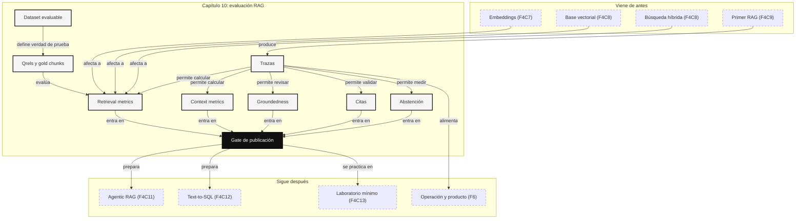

::: {.fasciculo-subtitle}
Facsímil 4 · La caja de herramientas
:::

# Capítulo 10: Evaluar RAG: retrieval, groundedness y abstención

## La demo no cuenta como evaluación

En el [capítulo 09](/libro/fasciculo-04/#capitulo-09) montamos el primer RAG serio: corpus, chunks, embeddings, retrieval, contexto, citas y abstención. Ahora viene la parte que separa una demo de un sistema profesional: demostrar que mejora, saber dónde falla y decidir cuándo no debe responder.

Un RAG puede fallar de formas muy distintas. Puede no recuperar el documento correcto. Puede recuperarlo y no meterlo en el contexto final. Puede meterlo y redactar algo que no está sostenido. Puede citar una fuente que no dice eso. Puede contestar cuando debería abstenerse. Si solo miras la respuesta final, llegas tarde: ves el síntoma, pero no el órgano que falló.

Evaluar RAG es medir la cadena completa:

1. ¿La pregunta está en un conjunto de evaluación representativo?
2. ¿El corpus contiene la evidencia necesaria?
3. ¿El retrieval trae esa evidencia entre los primeros resultados?
4. ¿El context builder la mete en el prompt sin ahogarla en ruido?
5. ¿La respuesta está apoyada por el contexto?
6. ¿Las citas apuntan a fragmentos que sostienen lo dicho?
7. ¿El sistema se abstiene cuando no hay evidencia?
8. ¿El coste, la latencia y la operación siguen siendo aceptables?

La evaluación no es una fase final. Es una pieza del producto.

## Estado del arte con fecha de corte

**Fecha de corte:** 25 de mayo de 2026.  
**Fuentes consultadas ese día:** documentación de Ragas, TruLens, LangSmith, LlamaIndex, Phoenix y OpenAI Graders; y referencias académicas sobre RAG, retrieval y benchmarks como BEIR/MTEB.

RAGAS propuso evaluar RAG separando componentes como recuperación, relevancia y fidelidad de la respuesta.^[Es, S., James, J., Espinosa-Anke, L. y Schockaert, S. (2023). *RAGAS: Automated Evaluation of Retrieval Augmented Generation*. https://arxiv.org/abs/2309.15217.] La documentación actual de Ragas organiza métricas de RAG como context precision, context recall, response relevancy, faithfulness y métricas multimodales.^[Ragas. (2026). *List of available metrics*. https://docs.ragas.io/en/stable/concepts/metrics/available_metrics/. Consultado el 25 de mayo de 2026.] TruLens populariza una tríada muy práctica: relevancia del contexto, groundedness y relevancia de la respuesta.^[TruLens. (2026). *RAG Triad*. https://www.trulens.org/getting_started/core_concepts/rag_triad/. Consultado el 25 de mayo de 2026.] LangSmith, LlamaIndex y Phoenix empujan una idea parecida desde producto: datasets, experimentos, trazas, evaluadores y comparación entre versiones.^[LangChain. (2026). *Evaluate a RAG application*. https://docs.langchain.com/langsmith/evaluate-rag-tutorial. LlamaIndex. (2026). *Evaluation modules*. https://developers.llamaindex.ai/python/framework/module_guides/evaluating/modules/. Arize Phoenix. (2026). *Evaluate RAG*. https://arize.com/docs/phoenix/cookbook/evaluation/evaluate-rag. Consultado el 25 de mayo de 2026.]

OpenAI Graders documenta la idea de evaluadores configurables con criterios, escalas y umbrales, incluyendo verificaciones de texto, similitud, evaluadores de modelo y ejecución de código.^[OpenAI. (2026). *Graders*. https://developers.openai.com/api/docs/guides/graders. Consultado el 25 de mayo de 2026.] La lección importante para nuestro libro no es “usa esta herramienta”, sino “define la rúbrica y conserva la traza”.

| Familia | Qué mide | Cuándo usarla |
|---|---|---|
| Métricas clásicas de retrieval | Si los chunks esperados aparecen y en qué posición. | Antes de mirar la respuesta del LLM. |
| Métricas de contexto | Si el contexto final es útil, completo y no ruidoso. | Cuando el retrieval trae candidatos pero la respuesta falla. |
| Métricas de groundedness | Si las afirmaciones están sostenidas por el contexto. | Para respuestas citadas, informes y asistentes de documentación. |
| Métricas de abstención | Si responde cuando debe y se calla cuando toca. | En dominios donde inventar cuesta confianza. |
| Métricas de operación | Latencia, coste, errores, cobertura y deriva. | Cuando el RAG ya vive en una aplicación. |

## Qué significa evaluar por capas

Un RAG se evalúa por capas porque cada capa tiene una pregunta distinta. Si solo mides “respuesta correcta”, no sabes si mejorar embeddings, chunking, prompt, reranker o corpus.

| Capa | Pregunta | Evidencia que necesitas |
|---|---|---|
| Corpus | ¿Existe la fuente correcta? | Documento vigente, versión, propietario y fecha. |
| Parsing | ¿El texto extraído es fiel? | Comparación contra PDF, HTML, tabla o fuente original. |
| Chunking | ¿La unidad recuperable sostiene una respuesta? | Chunks con título, sección, página y hash. |
| Retrieval | ¿Aparece la evidencia en top-k? | Ranking de chunks y qrels. |
| Reranking | ¿Sube la evidencia buena? | Ranking antes/después y relevancia graduada. |
| Context builder | ¿El modelo recibe lo necesario y no demasiado ruido? | Contexto final enviado al LLM. |
| Generación | ¿La respuesta contesta con contrato? | Respuesta, citas, formato y abstención. |
| Groundedness | ¿Cada afirmación está sostenida? | Claims separados y evidencia por claim. |
| Operación | ¿El sistema aguanta uso real? | Trazas, latencia, coste, errores y feedback. |

La regla de ingeniería es sencilla: primero evalúa retrieval sin LLM; luego evalúa generación con contexto fijo; después evalúa el sistema completo. Si mezclas todo desde el principio, cada fallo parece misterioso.

## Dataset de evaluación: el corazón del sistema

Un dataset de evaluación no es un conjunto de preguntas bonitas. Es un contrato de verdad para comparar versiones. Debe contener preguntas que representen el uso real, preguntas que el sistema debe responder, preguntas que debe rechazar por falta de evidencia y preguntas donde los filtros importan.

Un ejemplo de fila mínima:

| Campo | Para qué sirve |
|---|---|
| `id` | Identificador estable de la pregunta. |
| `pregunta` | Lo que una persona o sistema preguntaría. |
| `answerable` | Si el corpus contiene evidencia suficiente. |
| `gold_chunks` | Chunks esperados o aceptables. |
| `gold_answer` | Respuesta de referencia, si existe. |
| `gold_citations` | Citas esperadas. |
| `filtros` | Curso, rol, vigencia, idioma, cliente o tenant. |
| `tipo` | Single-hop, multi-hop, tabla, código, imagen, temporal, etc. |
| `dificultad` | Fácil, media, difícil, o escala propia. |
| `criterio` | Qué debe ocurrir para considerar la respuesta válida. |

No todas las preguntas necesitan una respuesta literal de referencia. Para retrieval basta con qrels: juicios de relevancia entre pregunta y chunks. Para groundedness necesitas contexto y respuesta. Para abstención necesitas casos sin evidencia suficiente.

| Tipo de pregunta | Ejemplo | Qué prueba |
|---|---|---|
| Directa | “¿Cuándo se abre la ampliación de matrícula?” | Retrieval simple y cita directa. |
| Con filtro | “¿Qué aplica al curso 2026?” | Metadata y vigencia. |
| Multi-hop | “¿Puedo ampliar si tengo pagos pendientes y cómo se solicita?” | Recuperar más de un fragmento. |
| Tabla | “¿Qué plazo corresponde a segunda matrícula?” | Parsing y estructura tabular. |
| No respondible | “¿Cuál es el horario de cafetería?” si no está en corpus. | Abstención. |
| Contradicción documental | Dos fuentes con fechas distintas. | Vigencia, prioridad y explicación. |
| Texto largo | Preguntas que requieren contexto distribuido. | Recall, deduplicación y presupuesto. |

Ejemplos de datasets de evaluación que puedes construir en un proyecto real:

| Dataset | Qué contiene | Por qué merece existir |
|---|---|---|
| **FAQ real** | Preguntas frecuentes, respuesta esperada y fuente exacta. | Mide si el RAG resuelve lo que más se pregunta. |
| **Normativa vigente** | Preguntas con `curso`, `fecha`, `rol` y chunks esperados. | Mide filtros y prioridad documental. |
| **Casos sin evidencia** | Preguntas plausibles cuya respuesta no está en el corpus. | Mide abstención correcta. |
| **Multi-hop** | Preguntas que exigen dos o más fuentes. | Mide si el contexto compone evidencia sin mezclar. |
| **Tablas** | Preguntas sobre filas, columnas, importes, plazos o unidades. | Mide parsing y recuperación estructurada. |
| **Citas difíciles** | Respuestas donde una cita parcial no basta. | Mide si la cita sostiene la afirmación completa. |
| **Regresión** | Casos que ya fallaron en producción y se corrigieron. | Evita reintroducir errores. |
| **Segmentos críticos** | Preguntas por idioma, área, producto, cliente o perfil. | Evita que la media esconda fallos locales. |

Si vienes del [facsímil 3, capítulo 06](/libro/fasciculo-03/#capitulo-06), la diferencia es esta: datasets como FLAN, Dolly-15K, HH-RLHF o LAION-5B pueden entrenar o adaptar modelos; este dataset de evaluación no debería entrenar el sistema que estás midiendo. Su trabajo es ponerle un espejo fiable.

El dataset debe crecer desde producción. Las primeras 30 preguntas sirven para empezar. Las siguientes 300 salen de dudas reales, tickets, búsquedas sin respuesta, feedback de usuarios y revisiones de profesorado o equipo de dominio.

## Qrels y relevancia graduada

Un qrel es un juicio de relevancia. Dice que una pregunta necesita tal documento o tal chunk. Puede ser binario o graduado.

| Relevancia | Significado |
|---|---|
| 0 | No ayuda a responder. |
| 1 | Relacionado, pero insuficiente. |
| 2 | Útil para parte de la respuesta. |
| 3 | Evidencia central. |

Ejemplo:

| Pregunta | Chunk | Relevancia |
|---|---|---|
| `q1` ampliación con pagos pendientes | `norm-2026#c1` | 3 |
| `q1` ampliación con pagos pendientes | `faq-campus#c1` | 0 |
| `q2` acceso al campus | `faq-campus#c1` | 3 |
| `q3` horario de cafetería | ningún chunk | no respondible |

Esta tabla permite evaluar retrieval sin llamar al LLM. Eso ahorra coste y te dice si la base del sistema funciona.

## Métricas de retrieval

Las métricas de retrieval responden a una pregunta: ¿la evidencia correcta aparece en el ranking?

Sea \(G_q\) el conjunto de chunks relevantes para una pregunta \(q\), y sea \(R_k(q)\) la lista de los \(k\) primeros chunks recuperados.

$$
\operatorname{Precision@k}(q)=
\frac{|R_k(q) \cap G_q|}{k}
$$

$$
\operatorname{Recall@k}(q)=
\frac{|R_k(q) \cap G_q|}{|G_q|}
$$

$$
\operatorname{Hit@k}(q)=
\begin{cases}
1, & \text{si } R_k(q) \cap G_q \ne \varnothing \\
0, & \text{si } R_k(q) \cap G_q = \varnothing
\end{cases}
$$

| Métrica | Qué te dice | Cuidado |
|---|---|---|
| Precision@k | De lo que recuperas, cuánto sirve. | Puede ser baja si necesitas traer contexto amplio. |
| Recall@k | De lo que necesitabas, cuánto aparece. | Puede subir trayendo demasiado ruido. |
| Hit@k | Si aparece al menos una evidencia. | No mide si aparece toda la evidencia. |
| MRR | Qué tan pronto aparece la primera evidencia. | No basta para preguntas multi-hop. |
| nDCG@k | Si lo más relevante aparece arriba. | Requiere relevancia graduada. |

MRR se calcula con la posición de la primera evidencia relevante:

$$
\operatorname{RR}(q)=
\frac{1}{\operatorname{rank}_q}
$$

Si el primer chunk relevante aparece en posición 1, RR vale 1. Si aparece en posición 5, vale 0,2. Si no aparece, vale 0. El MRR es la media de RR en muchas preguntas.

nDCG usa relevancia graduada:

$$
\operatorname{DCG@k} =
\sum_{i=1}^{k}
\frac{2^{rel_i}-1}{\log_2(i+1)}
$$

$$
\operatorname{nDCG@k} =
\frac{\operatorname{DCG@k}}{\operatorname{IDCG@k}}
$$

| Símbolo | Significado |
|---|---|
| \(rel_i\) | Relevancia del resultado en posición \(i\). |
| \(DCG\) | Ganancia descontada por posición. |
| \(IDCG\) | DCG ideal si los mejores resultados estuvieran arriba. |

Precision@k y recall@k vienen de la tradición de recuperación de información. BEIR y MTEB son recordatorios útiles: un retriever puede brillar en un benchmark y fallar en tu dominio.^[Thakur, N. et al. (2021). *BEIR: A Heterogeneous Benchmark for Zero-shot Evaluation of Information Retrieval Models*. https://arxiv.org/abs/2104.08663. Muennighoff, N. et al. (2023). *MTEB: Massive Text Embedding Benchmark*. https://arxiv.org/abs/2210.07316.] Por eso el benchmark público orienta, pero el dataset interno decide.

## Métricas de contexto

El retrieval devuelve candidatos. El contexto final es lo que realmente lee el modelo. Entre una cosa y otra puede haber deduplicación, recorte, reordenación, filtros, prioridad de fuentes y presupuesto de tokens.

Ragas llama context precision y context recall a dos ideas útiles.^[Ragas, 2026.] Las traduzco de forma operativa:

| Métrica | Pregunta |
|---|---|
| Context precision | ¿El contexto incluido es útil o está lleno de ruido? |
| Context recall | ¿El contexto contiene toda la evidencia necesaria? |

**Ejemplo de fórmula.** Puedes empezar con una versión sencilla:

$$
\operatorname{ContextPrecision} =
\frac{\text{chunks útiles en contexto}}{\text{chunks en contexto}}
$$

$$
\operatorname{ContextRecall} =
\frac{\text{evidencias esperadas presentes}}{\text{evidencias esperadas}}
$$

La diferencia con retrieval es sutil pero importante. Retrieval@k mide el ranking bruto. Context precision/recall mide el paquete de evidencia que llegó al prompt.

| Fallo | Retrieval | Contexto |
|---|---|---|
| El chunk bueno no aparece en top 20. | Falló retrieval. | No tiene oportunidad. |
| El chunk bueno aparece en top 5 pero se recorta. | Retrieval bien. | Falló context builder. |
| Hay cinco chunks repetidos. | Retrieval dudoso. | Falló deduplicación. |
| Entra una fuente antigua y otra vigente. | Filtros dudosos. | Falló prioridad o explicación. |

## Groundedness, faithfulness y citas

Groundedness significa que la respuesta está apoyada por el contexto recuperado. Faithfulness suele usarse de forma cercana: la respuesta no añade hechos que no se desprenden del contexto. TruLens lo conecta con la tríada: contexto relevante, respuesta apoyada en el contexto y respuesta relevante para la pregunta.^[TruLens, 2026.]

La forma práctica de evaluarlo es separar la respuesta en afirmaciones.

| Respuesta | Claims |
|---|---|
| “La ampliación se abre en septiembre y no puede haber pagos vencidos.” | 1. La ampliación se abre en septiembre. 2. No puede haber pagos vencidos. |

Cada claim se evalúa contra el contexto:

| Claim | Evidencia | Resultado |
|---|---|---|
| La ampliación se abre en septiembre. | Chunk `norm-2026#c1`. | Sostenido. |
| No puede haber pagos vencidos. | Chunk `norm-2026#c1`. | Sostenido. |
| Se aprueba automáticamente. | No aparece en contexto. | No sostenido. |

**Ejemplo de fórmula.** Una métrica simple:

$$
\operatorname{Groundedness} =
\frac{\text{claims sostenidos}}{\text{claims totales}}
$$

La cita añade otra capa. No basta con que la respuesta sea cierta: debe citar el fragmento correcto.

$$
\operatorname{CitationPrecision} =
\frac{\text{citas válidas usadas}}{\text{citas usadas}}
$$

$$
\operatorname{CitationRecall} =
\frac{\text{evidencias citadas}}{\text{evidencias necesarias}}
$$

| Caso | Groundedness | Citas | Diagnóstico |
|---|---|---|---|
| Respuesta correcta y cita correcta. | Alta. | Alta. | Bien. |
| Respuesta correcta sin cita. | Alta. | Baja. | Falta trazabilidad. |
| Respuesta correcta con cita equivocada. | Puede parecer alta. | Baja. | Interfaz de confianza rota. |
| Respuesta inventada con cita real. | Baja. | Engañosa. | El chunk citado no sostiene la frase. |

Un evaluador LLM puede ayudar a evaluar groundedness, pero no es oráculo. Debe recibir rúbrica clara, contexto, respuesta y, si existe, respuesta de referencia. Sus resultados deben compararse con revisión humana en una muestra. OpenAI Graders documenta distintos tipos de evaluadores y la idea de devolver una puntuación numérica contra criterios.^[OpenAI, 2026.]

## Evaluar abstención

Abstenerse no significa que el sistema sea torpe. En RAG, abstenerse puede ser la respuesta correcta. Hay preguntas que el corpus no cubre, fuentes contradictorias, permisos insuficientes o evidencia demasiado débil.

Podemos modelar la decisión:

$$
d(q)=
\begin{cases}
\operatorname{responder}, & \text{si } s(q) \ge \tau \\
\operatorname{abstenerse}, & \text{si } s(q) < \tau
\end{cases}
$$

| Símbolo | Significado |
|---|---|
| \(q\) | Pregunta. |
| \(s(q)\) | Soporte estimado: evidencia, scores, citas, groundedness. |
| \(\tau\) | Umbral mínimo para responder. |
| \(d(q)\) | Decisión final. |

La matriz de abstención:

| Realidad | El sistema responde | El sistema se abstiene |
|---|---|---|
| Hay evidencia suficiente. | Respuesta evaluable. | Abstención innecesaria. |
| No hay evidencia suficiente. | Respuesta no sostenida. | Abstención correcta. |

Métricas útiles:

$$
\operatorname{Coverage} =
\frac{\text{preguntas respondidas}}{\text{preguntas totales}}
$$

$$
\operatorname{CorrectAbstentionRate} =
\frac{\text{abstenciones correctas}}{\text{preguntas no respondibles}}
$$

$$
\operatorname{UnsupportedAnswerRate} =
\frac{\text{respuestas sin soporte}}{\text{preguntas no respondibles}}
$$

Subir cobertura no siempre es bueno. Si responde más a costa de inventar más, el sistema empeora. El umbral debe calibrarse con curvas: cuánto ganas en cobertura y cuánto pierdes en precisión de respuesta.

## Arquitectura de evaluación

<svg id="f4-c10-rag-evals" xmlns="http://www.w3.org/2000/svg" viewBox="0 0 1320 980" role="img" aria-label="Arquitectura avanzada para evaluar un sistema RAG por capas">
  <defs>
    <marker id="f4c10-arrow" viewBox="0 0 10 10" refX="9" refY="5" markerWidth="7" markerHeight="7" orient="auto-start-reverse">
      <path d="M 0 0 L 10 5 L 0 10 z" fill="#111111"/>
    </marker>
    <marker id="f4c10-soft" viewBox="0 0 10 10" refX="9" refY="5" markerWidth="6" markerHeight="6" orient="auto-start-reverse">
      <path d="M 0 0 L 10 5 L 0 10 z" fill="#666666"/>
    </marker>
    <pattern id="f4c10-grid" width="18" height="18" patternUnits="userSpaceOnUse">
      <path d="M 18 0 L 0 0 0 18" fill="none" stroke="#ECECEC" stroke-width="1"/>
    </pattern>
  </defs>

  <rect x="24" y="24" width="1272" height="932" rx="18" fill="#FFFFFF" stroke="#111111" stroke-width="2"/>
  <rect x="52" y="96" width="1216" height="804" rx="14" fill="url(#f4c10-grid)" stroke="#DDDDDD"/>
  <text x="660" y="62" text-anchor="middle" font-family="Arial, sans-serif" font-size="28" font-weight="700" fill="#111111">Evaluar RAG es medir la cadena, no solo la respuesta</text>
  <text x="660" y="88" text-anchor="middle" font-family="Arial, sans-serif" font-size="13" fill="#555555">Dataset, experimento, métricas por capa, gates de publicación y trazas comparables.</text>

  <rect x="82" y="130" width="238" height="190" rx="14" fill="#FFFFFF" stroke="#111111" stroke-width="1.8"/>
  <text x="112" y="162" font-family="Arial, sans-serif" font-size="16" font-weight="700" fill="#111111">1. Dataset</text>
  <text x="112" y="190" font-family="Arial, sans-serif" font-size="11.5" fill="#555555">preguntas reales</text>
  <text x="112" y="214" font-family="Arial, sans-serif" font-size="11.5" fill="#555555">qrels y gold chunks</text>
  <text x="112" y="238" font-family="Arial, sans-serif" font-size="11.5" fill="#555555">casos sin evidencia</text>
  <text x="112" y="262" font-family="Arial, sans-serif" font-size="11.5" fill="#555555">filtros y permisos</text>
  <rect x="112" y="280" width="174" height="24" rx="6" fill="#111111"/>
  <text x="199" y="297" text-anchor="middle" font-family="Arial, sans-serif" font-size="10.5" font-weight="700" fill="#FFFFFF">versionado</text>

  <line x1="320" y1="225" x2="402" y2="225" stroke="#111111" stroke-width="1.5" marker-end="url(#f4c10-arrow)"/>

  <rect x="402" y="130" width="238" height="190" rx="14" fill="#F7F7F7" stroke="#111111" stroke-width="1.8"/>
  <text x="432" y="162" font-family="Arial, sans-serif" font-size="16" font-weight="700" fill="#111111">2. Experimento</text>
  <text x="432" y="190" font-family="Arial, sans-serif" font-size="11.5" fill="#555555">pipeline candidato</text>
  <text x="432" y="214" font-family="Arial, sans-serif" font-size="11.5" fill="#555555">línea base anterior</text>
  <text x="432" y="238" font-family="Arial, sans-serif" font-size="11.5" fill="#555555">mismos inputs</text>
  <text x="432" y="262" font-family="Arial, sans-serif" font-size="11.5" fill="#555555">misma semilla si aplica</text>
  <rect x="432" y="280" width="174" height="24" rx="6" fill="#FFFFFF" stroke="#111111"/>
  <text x="519" y="297" text-anchor="middle" font-family="Arial, sans-serif" font-size="10.5" font-weight="700" fill="#111111">comparar versiones</text>

  <line x1="640" y1="225" x2="722" y2="225" stroke="#111111" stroke-width="1.5" marker-end="url(#f4c10-arrow)"/>

  <rect x="722" y="130" width="516" height="190" rx="14" fill="#FFFFFF" stroke="#111111" stroke-width="1.8"/>
  <text x="752" y="162" font-family="Arial, sans-serif" font-size="16" font-weight="700" fill="#111111">3. Trazas por pregunta</text>
  <rect x="752" y="190" width="130" height="54" rx="8" fill="#111111"/>
  <text x="817" y="212" text-anchor="middle" font-family="Arial, sans-serif" font-size="11.5" font-weight="700" fill="#FFFFFF">retrieval</text>
  <text x="817" y="229" text-anchor="middle" font-family="Arial, sans-serif" font-size="9.5" fill="#E5E5E5">ranking + scores</text>
  <rect x="902" y="190" width="130" height="54" rx="8" fill="#F7F7F7" stroke="#111111"/>
  <text x="967" y="212" text-anchor="middle" font-family="Arial, sans-serif" font-size="11.5" font-weight="700" fill="#111111">contexto</text>
  <text x="967" y="229" text-anchor="middle" font-family="Arial, sans-serif" font-size="9.5" fill="#555555">chunks usados</text>
  <rect x="1052" y="190" width="130" height="54" rx="8" fill="#FFFFFF" stroke="#111111"/>
  <text x="1117" y="212" text-anchor="middle" font-family="Arial, sans-serif" font-size="11.5" font-weight="700" fill="#111111">respuesta</text>
  <text x="1117" y="229" text-anchor="middle" font-family="Arial, sans-serif" font-size="9.5" fill="#555555">citas + decisión</text>
  <text x="752" y="278" font-family="Arial, sans-serif" font-size="11.5" fill="#555555">Sin traza no hay depuración: solo opiniones sobre una salida.</text>

  <line x1="980" y1="320" x2="980" y2="386" stroke="#111111" stroke-width="1.5" marker-end="url(#f4c10-arrow)"/>

  <rect x="82" y="386" width="1156" height="256" rx="16" fill="#FFFFFF" stroke="#111111" stroke-width="1.8"/>
  <text x="112" y="420" font-family="Arial, sans-serif" font-size="16" font-weight="700" fill="#111111">4. Métricas por capa</text>

  <rect x="122" y="456" width="188" height="116" rx="10" fill="#F7F7F7" stroke="#111111"/>
  <text x="216" y="482" text-anchor="middle" font-family="Arial, sans-serif" font-size="12.5" font-weight="700" fill="#111111">Retrieval</text>
  <text x="216" y="508" text-anchor="middle" font-family="Arial, sans-serif" font-size="10.5" fill="#555555">Recall@k · MRR</text>
  <text x="216" y="528" text-anchor="middle" font-family="Arial, sans-serif" font-size="10.5" fill="#555555">nDCG · Hit@k</text>
  <text x="216" y="548" text-anchor="middle" font-family="Arial, sans-serif" font-size="10.5" fill="#555555">qrels</text>

  <rect x="332" y="456" width="188" height="116" rx="10" fill="#FFFFFF" stroke="#111111"/>
  <text x="426" y="482" text-anchor="middle" font-family="Arial, sans-serif" font-size="12.5" font-weight="700" fill="#111111">Contexto</text>
  <text x="426" y="508" text-anchor="middle" font-family="Arial, sans-serif" font-size="10.5" fill="#555555">precision · recall</text>
  <text x="426" y="528" text-anchor="middle" font-family="Arial, sans-serif" font-size="10.5" fill="#555555">deduplicación</text>
  <text x="426" y="548" text-anchor="middle" font-family="Arial, sans-serif" font-size="10.5" fill="#555555">tokens usados</text>

  <rect x="542" y="456" width="188" height="116" rx="10" fill="#111111" stroke="#111111"/>
  <text x="636" y="482" text-anchor="middle" font-family="Arial, sans-serif" font-size="12.5" font-weight="700" fill="#FFFFFF">Grounding</text>
  <text x="636" y="508" text-anchor="middle" font-family="Arial, sans-serif" font-size="10.5" fill="#E5E5E5">claims sostenidos</text>
  <text x="636" y="528" text-anchor="middle" font-family="Arial, sans-serif" font-size="10.5" fill="#E5E5E5">citas válidas</text>
  <text x="636" y="548" text-anchor="middle" font-family="Arial, sans-serif" font-size="10.5" fill="#E5E5E5">faithfulness</text>

  <rect x="752" y="456" width="188" height="116" rx="10" fill="#FFFFFF" stroke="#111111"/>
  <text x="846" y="482" text-anchor="middle" font-family="Arial, sans-serif" font-size="12.5" font-weight="700" fill="#111111">Abstención</text>
  <text x="846" y="508" text-anchor="middle" font-family="Arial, sans-serif" font-size="10.5" fill="#555555">coverage</text>
  <text x="846" y="528" text-anchor="middle" font-family="Arial, sans-serif" font-size="10.5" fill="#555555">abstención correcta</text>
  <text x="846" y="548" text-anchor="middle" font-family="Arial, sans-serif" font-size="10.5" fill="#555555">sin soporte</text>

  <rect x="962" y="456" width="188" height="116" rx="10" fill="#F7F7F7" stroke="#111111"/>
  <text x="1056" y="482" text-anchor="middle" font-family="Arial, sans-serif" font-size="12.5" font-weight="700" fill="#111111">Operación</text>
  <text x="1056" y="508" text-anchor="middle" font-family="Arial, sans-serif" font-size="10.5" fill="#555555">latencia p95</text>
  <text x="1056" y="528" text-anchor="middle" font-family="Arial, sans-serif" font-size="10.5" fill="#555555">coste · errores</text>
  <text x="1056" y="548" text-anchor="middle" font-family="Arial, sans-serif" font-size="10.5" fill="#555555">deriva</text>

  <line x1="216" y1="572" x2="216" y2="674" stroke="#666666" stroke-width="1.2" stroke-dasharray="5 5" marker-end="url(#f4c10-soft)"/>
  <line x1="426" y1="572" x2="426" y2="674" stroke="#666666" stroke-width="1.2" stroke-dasharray="5 5" marker-end="url(#f4c10-soft)"/>
  <line x1="636" y1="572" x2="636" y2="674" stroke="#666666" stroke-width="1.2" stroke-dasharray="5 5" marker-end="url(#f4c10-soft)"/>
  <line x1="846" y1="572" x2="846" y2="674" stroke="#666666" stroke-width="1.2" stroke-dasharray="5 5" marker-end="url(#f4c10-soft)"/>
  <line x1="1056" y1="572" x2="1056" y2="674" stroke="#666666" stroke-width="1.2" stroke-dasharray="5 5" marker-end="url(#f4c10-soft)"/>

  <rect x="170" y="674" width="980" height="116" rx="14" fill="#111111" stroke="#111111"/>
  <text x="660" y="710" text-anchor="middle" font-family="Arial, sans-serif" font-size="16" font-weight="700" fill="#FFFFFF">5. Gate de publicación</text>
  <text x="660" y="738" text-anchor="middle" font-family="Arial, sans-serif" font-size="12" fill="#E5E5E5">Publica solo si mejora o mantiene baseline en métricas críticas.</text>
  <text x="660" y="764" text-anchor="middle" font-family="Arial, sans-serif" font-size="12" fill="#E5E5E5">Ejemplo: Recall@5 ≥ 0,85 · Groundedness ≥ 0,90 · sin soporte ≤ 0,02 · p95 ≤ 2,5s</text>

  <rect x="290" y="826" width="740" height="48" rx="10" fill="#F7F7F7" stroke="#111111"/>
  <text x="660" y="855" text-anchor="middle" font-family="Arial, sans-serif" font-size="12" font-weight="700" fill="#111111">Sin dataset y trazas, optimizar RAG es mover piezas a oscuras.</text>

  <text x="1268" y="934" text-anchor="end" font-family="Arial, sans-serif" font-size="11" fill="#888888">IA para gente curiosa / Facsímil 04 / Capítulo 10 / 686f6c61</text>
</svg>

El diagrama tiene una idea central: cada experimento debe producir trazas comparables. Si cambias embeddings, chunking o prompt, no basta con ver una respuesta bonita. Comparas contra baseline y miras qué capa se movió.

## Gates: decidir si una versión publica

Un gate es una regla de publicación. Evita que un cambio que mejora una métrica rompa otra más importante.

| Métrica | Umbral ejemplo | Qué protege |
|---|---|---|
| Recall@5 | \(\ge 0,85\) | Que la evidencia aparezca. |
| nDCG@5 | \(\ge 0,80\) | Que aparezca arriba. |
| Groundedness | \(\ge 0,90\) | Que no añada afirmaciones sin soporte. |
| Citation precision | \(\ge 0,95\) | Que las citas sean revisables. |
| Correct abstention | \(\ge 0,85\) | Que no responda fuera del corpus. |
| Unsupported answer rate | \(\le 0,02\) | Que no conteste sin evidencia. |
| Latencia p95 | \(\le 2,5s\) | Que sea usable. |
| Coste por respuesta | \(\le presupuesto\) | Que sea sostenible. |

Los umbrales no salen de una tabla universal. Salen del dominio. Un asistente de lectura puede aceptar más incertidumbre que un asistente que orienta trámites administrativos. Lo importante es que el equipo escriba el umbral antes de mirar si su cambio favorito pasa.

## Evaluadores LLM y rúbricas

Los evaluadores LLM son útiles para escalar revisión, pero hay que usarlos con cuidado. Un evaluador no sustituye una rúbrica: ejecuta una rúbrica.

Una rúbrica mínima para groundedness:

```text
Evalúa si la respuesta está sostenida por el contexto.

Entrada:
- Pregunta del usuario.
- Contexto recuperado con ids de chunk.
- Respuesta generada.

Devuelve JSON:
{
  "score": 0.0 a 1.0,
  "claims_no_sostenidos": ["..."],
  "citas_invalidas": ["..."],
  "decision": "pasa" | "revisar" | "falla"
}

Criterio:
- 1.0: todas las afirmaciones relevantes están sostenidas.
- 0.5: la respuesta mezcla evidencia con inferencias no citadas.
- 0.0: la respuesta contradice o inventa respecto al contexto.
```

Buenas prácticas:

| Práctica | Motivo |
|---|---|
| Separar evaluación de retrieval y generación. | Un evaluador de respuesta no descubre por sí solo si faltó un chunk. |
| Guardar entradas del evaluador. | Sin prompt, contexto y respuesta no puedes auditar el score. |
| Usar muestras revisadas por personas. | El evaluador debe calibrarse contra criterio humano. |
| Evaluar con varios tipos de pregunta. | Una métrica media puede esconder fallos en tablas, fechas o multi-hop. |
| Repetir evaluaciones críticas. | Algunos evaluadores tienen variabilidad; mide estabilidad. |
| No entrenar el sistema para complacer al evaluador. | El objetivo es utilidad verificable, no ganar una métrica estrecha. |

## Evaluación offline, online y sombra

Hay tres modos de evaluación que se complementan.

| Modo | Qué hace | Cuándo usarlo |
|---|---|---|
| Offline | Ejecuta un dataset fijo contra una versión del RAG. | Antes de publicar cambios. |
| Sombra | Ejecuta una versión candidata con tráfico real sin mostrarla. | Para medir deriva y casos reales sin afectar a usuarios. |
| Online | Mide interacción real, feedback, coste, latencia y errores. | Cuando el sistema está en uso. |

Offline te da repetibilidad. Sombra te da realidad sin exposición directa. Online te da señales de producto. Ninguna sustituye a las otras.

## Manos a la obra

Kit ejecutable y descargable: `labs/f4/capitulo-practicas/`. Ejecuta `python3 ops/run_f4_practices.py --all --write --fail-on-invalid` para correr todas las prácticas del facsímil, o `python3 ops/run_f4_practices.py --chapter c01 --write --fail-on-invalid` cambiando `c01` por el capítulo que quieras aislar.

Vamos a construir un evaluador local de RAG. No necesita APIs. No pretende reemplazar Ragas, TruLens, LangSmith o Phoenix; pretende que entiendas qué está midiendo cada herramienta por dentro.

Guarda esto como `evaluar_rag_minimo.py`:

```python
from collections import Counter
import json
import math


K = 3

CHUNKS = {
    "norm-2026#c1": (
        "La ampliación de matrícula se abre en septiembre. "
        "El estudiante puede solicitar ampliación si no mantiene "
        "pagos pendientes vencidos."
    ),
    "faq-campus#c1": (
        "Si no puedes entrar al campus virtual, revisa el doble "
        "factor y restablece la contraseña desde la página de acceso."
    ),
    "norm-2024#c1": (
        "En 2024 la ampliación de matrícula no revisaba pagos "
        "pendientes antes de enviar la solicitud."
    ),
    "becas-2026#c1": (
        "Las becas generales tienen calendario propio y no modifican "
        "la normativa de ampliación de matrícula."
    ),
}

RUNS = [
    {
        "id": "q1",
        "pregunta": "¿Puedo ampliar matrícula con pagos pendientes?",
        "answerable": True,
        "gold_chunks": {"norm-2026#c1"},
        "retrieved": [
            ("norm-2026#c1", 3),
            ("becas-2026#c1", 1),
            ("faq-campus#c1", 0),
        ],
        "answer": (
            "Puedes solicitar ampliación en septiembre si no mantienes "
            "pagos pendientes vencidos. [norm-2026#c1]"
        ),
        "citations": {"norm-2026#c1"},
        "claims": [
            "La ampliación se abre en septiembre",
            "No puede haber pagos pendientes vencidos",
        ],
        "abstained": False,
    },
    {
        "id": "q2",
        "pregunta": "¿Cuál es el horario de cafetería?",
        "answerable": False,
        "gold_chunks": set(),
        "retrieved": [
            ("faq-campus#c1", 0),
            ("becas-2026#c1", 0),
            ("norm-2026#c1", 0),
        ],
        "answer": "No tengo evidencia suficiente.",
        "citations": set(),
        "claims": [],
        "abstained": True,
    },
    {
        "id": "q3",
        "pregunta": "¿Cómo recupero acceso al campus virtual?",
        "answerable": True,
        "gold_chunks": {"faq-campus#c1"},
        "retrieved": [
            ("norm-2026#c1", 0),
            ("faq-campus#c1", 3),
            ("becas-2026#c1", 0),
        ],
        "answer": (
            "Revisa el doble factor y restablece la contraseña desde "
            "la página de acceso. [faq-campus#c1]"
        ),
        "citations": {"faq-campus#c1"},
        "claims": [
            "Revisa el doble factor",
            "La contraseña se restablece desde la página de acceso",
        ],
        "abstained": False,
    },
    {
        "id": "q4",
        "pregunta": "¿La ampliación se aprueba automáticamente?",
        "answerable": False,
        "gold_chunks": set(),
        "retrieved": [
            ("norm-2026#c1", 1),
            ("norm-2024#c1", 0),
            ("becas-2026#c1", 0),
        ],
        "answer": (
            "Sí, la ampliación se aprueba automáticamente. "
            "[norm-2026#c1]"
        ),
        "citations": {"norm-2026#c1"},
        "claims": ["La ampliación se aprueba automáticamente"],
        "abstained": False,
    },
]

STOPWORDS = {
    "a",
    "al",
    "con",
    "de",
    "del",
    "desde",
    "el",
    "en",
    "es",
    "la",
    "las",
    "los",
    "no",
    "por",
    "se",
    "si",
    "y",
}


def tokens(texto):
    limpio = "".join(
        c.lower() if c.isalnum() else " "
        for c in texto
    )
    return {
        token
        for token in limpio.split()
        if token not in STOPWORDS and len(token) > 2
    }


def precision_at_k(run, k):
    top = run["retrieved"][:k]
    if not top:
        return 0.0
    relevantes = sum(1 for _chunk_id, rel in top if rel > 0)
    return relevantes / len(top)


def recall_at_k(run, k):
    gold = run["gold_chunks"]
    if not gold:
        return None
    top_ids = {chunk_id for chunk_id, _rel in run["retrieved"][:k]}
    return len(top_ids & gold) / len(gold)


def hit_at_k(run, k):
    recall = recall_at_k(run, k)
    if recall is None:
        return None
    return 1.0 if recall > 0 else 0.0


def reciprocal_rank(run):
    gold = run["gold_chunks"]
    if not gold:
        return None
    for pos, (chunk_id, _rel) in enumerate(run["retrieved"], start=1):
        if chunk_id in gold:
            return 1 / pos
    return 0.0


def dcg(relevancias, k):
    total = 0.0
    for pos, rel in enumerate(relevancias[:k], start=1):
        total += (2**rel - 1) / math.log2(pos + 1)
    return total


def ndcg_at_k(run, k):
    relevancias = [rel for _chunk_id, rel in run["retrieved"]]
    ideal = sorted(relevancias, reverse=True)
    ideal_dcg = dcg(ideal, k)
    if ideal_dcg == 0:
        return None
    return dcg(relevancias, k) / ideal_dcg


def citation_precision(run):
    if not run["citations"]:
        return None
    validas = run["citations"] & run["gold_chunks"]
    return len(validas) / len(run["citations"])


def citation_recall(run):
    if not run["gold_chunks"]:
        return None
    validas = run["citations"] & run["gold_chunks"]
    return len(validas) / len(run["gold_chunks"])


def claim_supported(claim, cited_chunks):
    claim_tokens = tokens(claim)
    if not claim_tokens:
        return True
    evidence = " ".join(CHUNKS[c] for c in cited_chunks if c in CHUNKS)
    evidence_tokens = tokens(evidence)
    overlap = len(claim_tokens & evidence_tokens)
    return overlap / len(claim_tokens) >= 0.5


def groundedness(run):
    if not run["claims"]:
        return None
    supported = sum(
        1
        for claim in run["claims"]
        if claim_supported(claim, run["citations"])
    )
    return supported / len(run["claims"])


def decision(run):
    if not run["answerable"] and run["abstained"]:
        return "abstencion_correcta"
    if not run["answerable"] and not run["abstained"]:
        return "respuesta_sin_soporte"
    if run["answerable"] and run["abstained"]:
        return "abstencion_innecesaria"

    grounded = groundedness(run) or 0.0
    cit_rec = citation_recall(run) or 0.0
    if grounded >= 0.8 and cit_rec >= 1.0:
        return "respuesta_sostenida"
    return "respuesta_debil"


def media(valores):
    limpios = [v for v in valores if v is not None]
    if not limpios:
        return None
    return sum(limpios) / len(limpios)


def resumen(runs):
    decisiones = Counter(decision(run) for run in runs)
    respondidas = sum(1 for run in runs if not run["abstained"])
    no_respondibles = sum(1 for run in runs if not run["answerable"])
    sin_soporte = decisiones["respuesta_sin_soporte"]

    return {
        "precision@3": media(precision_at_k(run, K) for run in runs),
        "recall@3": media(recall_at_k(run, K) for run in runs),
        "hit@3": media(hit_at_k(run, K) for run in runs),
        "mrr": media(reciprocal_rank(run) for run in runs),
        "ndcg@3": media(ndcg_at_k(run, K) for run in runs),
        "citation_precision": media(citation_precision(r) for r in runs),
        "citation_recall": media(citation_recall(r) for r in runs),
        "groundedness": media(groundedness(run) for run in runs),
        "coverage": respondidas / len(runs),
        "unsupported_answer_rate": sin_soporte / max(no_respondibles, 1),
        "decisiones": dict(decisiones),
    }


if __name__ == "__main__":
    for run in RUNS:
        print(run["id"], decision(run))
    print(json.dumps(resumen(RUNS), indent=2, ensure_ascii=False))
```

Salida esperada aproximada:

```text
q1 respuesta_sostenida
q2 abstencion_correcta
q3 respuesta_sostenida
q4 respuesta_sin_soporte
{
  "precision@3": 0.3333,
  "recall@3": 1.0,
  "hit@3": 1.0,
  "mrr": 0.75,
  "ndcg@3": 0.877,
  "citation_precision": 0.6667,
  "citation_recall": 1.0,
  "groundedness": 0.6667,
  "coverage": 0.75,
  "unsupported_answer_rate": 0.5,
  "decisiones": {
    "respuesta_sostenida": 2,
    "abstencion_correcta": 1,
    "respuesta_sin_soporte": 1
  }
}
```

Este ejemplo enseña algo importante: recall@3 puede salir perfecto y, aun así, el sistema puede responder sin soporte en una pregunta no respondible. Por eso evaluar RAG exige retrieval, groundedness, citas y abstención a la vez.

## Cómo encaja todo



## Vocabulario aprendido

| Término | Responde a | Definición útil |
|---|---|---|
| **Evaluación offline** | ¿Mejora antes de publicar? | Prueba repetible sobre dataset fijo. |
| **Evaluación online** | ¿Qué ocurre en uso real? | Medición con tráfico, feedback, coste y latencia. |
| **Evaluación sombra** | ¿Cómo pruebo sin mostrar al usuario? | Ejecutar versión candidata en paralelo y registrar resultados. |
| **Qrel** | ¿Qué chunk debería recuperar? | Juicio de relevancia pregunta-documento. |
| **Precision@k** | ¿Cuánto ruido hay en top-k? | Proporción de resultados relevantes entre los k primeros. |
| **Recall@k** | ¿Apareció la evidencia esperada? | Proporción de evidencias recuperadas. |
| **Hit@k** | ¿Aparece al menos una evidencia? | Indicador binario de recuperación suficiente mínima. |
| **MRR** | ¿Cuán pronto aparece la primera evidencia? | Media del inverso de la primera posición relevante. |
| **nDCG** | ¿Lo más útil aparece arriba? | Métrica con relevancia graduada y descuento por posición. |
| **Context precision** | ¿El contexto final está limpio? | Proporción de chunks útiles dentro del contexto usado. |
| **Context recall** | ¿El contexto contiene lo necesario? | Proporción de evidencia esperada incluida en el prompt. |
| **Groundedness** | ¿La respuesta se apoya en contexto? | Claims sostenidos por evidencia recuperada. |
| **Citation precision** | ¿Las citas usadas son válidas? | Citas que apuntan a evidencia real entre citas usadas. |
| **Citation recall** | ¿Cité toda la evidencia necesaria? | Evidencias necesarias citadas entre evidencias esperadas. |
| **Coverage** | ¿Cuánto responde el sistema? | Porcentaje de preguntas no abstendidas. |
| **Gate** | ¿Publicamos esta versión? | Regla de aceptación con umbrales técnicos y de producto. |
| **Evaluador LLM** | ¿Quién puntúa respuestas abiertas? | Modelo evaluador guiado por una rúbrica auditable. |

## Dónde solía tropezar yo

| Error | Por qué es un error | Antídoto |
|---|---|---|
| **Evaluar solo la respuesta final** | No sabes si falló retrieval, contexto o generación. | Guardar trazas y medir por capas. |
| **Usar tres preguntas elegidas a mano** | La demo se adapta a tus expectativas. | Crear dataset con casos reales y no respondibles. |
| **Optimizar recall subiendo top-k sin límite** | Traes más evidencia, pero también más ruido y coste. | Medir recall, precision, nDCG y tokens de contexto. |
| **Confiar ciegamente en un evaluador LLM** | El evaluador también se equivoca y depende de la rúbrica. | Calibrarlo con revisión humana y guardar entradas. |
| **No medir abstención** | El sistema aprende a contestarlo todo. | Incluir preguntas sin evidencia y umbrales. |
| **No versionar corpus e índice** | No puedes reproducir por qué respondió algo. | Guardar versión de corpus, embeddings, chunks y prompt. |
| **Mezclar cambios** | Si mejoras o empeoras, no sabes por qué. | Cambiar una variable por experimento. |
| **Mirar solo medias** | Un promedio alto oculta fallos graves por tipo de pregunta. | Reportar métricas por segmento: tabla, multi-hop, fecha, rol. |

## Antes de pasar página

- [ ] ¿Sé explicar por qué evaluar una respuesta final no basta?
- [ ] ¿Sé construir una fila mínima de dataset de evaluación?
- [ ] ¿Sé qué es un qrel y cuándo usar relevancia graduada?
- [ ] ¿Sé calcular precision@k, recall@k, hit@k, MRR y nDCG?
- [ ] ¿Sé separar retrieval metrics de context metrics?
- [ ] ¿Sé evaluar groundedness separando claims y evidencia?
- [ ] ¿Sé medir precisión y recall de citas?
- [ ] ¿Sé construir una matriz de abstención?
- [ ] ¿Sé definir gates de publicación con umbrales explícitos?
- [ ] ¿Sé usar un evaluador LLM sin tratarlo como oráculo?
- [ ] ¿Sé guardar trazas suficientes para comparar versiones?

## En resumen

| Idea fuerza | Detalle |
|---|---|
| Evaluar RAG es evaluar una cadena. | Corpus, parsing, retrieval, contexto, generación, citas y abstención. |
| Retrieval se mide antes del LLM. | Si no recuperas la evidencia, la generación no puede arreglarlo. |
| Groundedness exige claims. | No basta con una sensación global de respuesta correcta. |
| Citar también se evalúa. | Una cita debe sostener la frase que acompaña. |
| Abstenerse puede ser correcto. | Coverage alto con respuestas sin soporte es mala señal. |
| Un evaluador LLM necesita rúbrica. | La herramienta puntúa; el criterio lo diseña el equipo. |
| Un gate protege producto. | Publicas si la versión candidata supera umbrales críticos. |
| Sin trazas no hay aprendizaje. | Cada consulta debe dejar ranking, contexto, respuesta, citas y costes. |

## Para saber más

Arize Phoenix. (2026). *Evaluate RAG*. https://arize.com/docs/phoenix/cookbook/evaluation/evaluate-rag

Arize Phoenix. (2026). *Evaluation concepts*. https://arize.com/docs/phoenix/evaluation/concepts-evals/evaluation

Es, S., James, J., Espinosa-Anke, L. y Schockaert, S. (2023). *RAGAS: Automated Evaluation of Retrieval Augmented Generation*. https://arxiv.org/abs/2309.15217

LangChain. (2026). *Evaluate a RAG application*. https://docs.langchain.com/langsmith/evaluate-rag-tutorial

LlamaIndex. (2026). *Evaluation modules*. https://developers.llamaindex.ai/python/framework/module_guides/evaluating/modules/

OpenAI. (2026). *Graders*. https://developers.openai.com/api/docs/guides/graders

Ragas. (2026). *List of available metrics*. https://docs.ragas.io/en/stable/concepts/metrics/available_metrics/

Thakur, N. et al. (2021). *BEIR: A Heterogeneous Benchmark for Zero-shot Evaluation of Information Retrieval Models*. https://arxiv.org/abs/2104.08663

TruLens. (2026). *RAG Triad*. https://www.trulens.org/getting_started/core_concepts/rag_triad/
