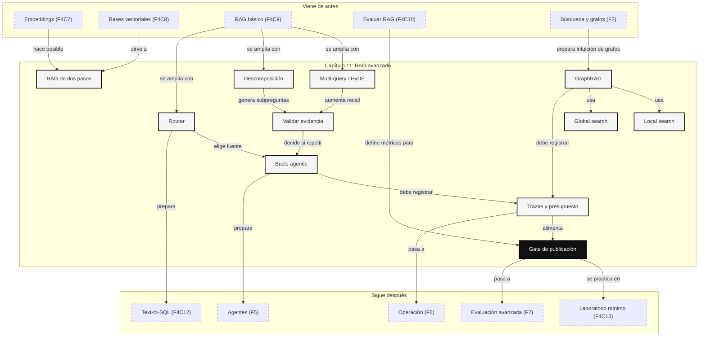

::: {.fasciculo-subtitle}
Facsímil 4 · La caja de herramientas
:::

# Capítulo 11: Agentic RAG y GraphRAG: cuándo complicar

## Cuando un RAG fijo se queda corto

En el [capítulo 09](/libro/fasciculo-04/#capitulo-09) construimos el RAG básico: partir una colección, buscar fragmentos, pasarlos al modelo y responder con citas. En el [capítulo 10](/libro/fasciculo-04/#capitulo-10) aprendimos a medir si la evidencia aparece, si el contexto sostiene la respuesta y si el sistema sabe abstenerse.

Ese patrón funciona muy bien para preguntas directas: “¿qué dice esta normativa sobre X?”, “¿cuál es el plazo?”, “¿dónde se configura este parámetro?”. Pero en proyectos reales aparecen preguntas menos limpias:

- “Compara los requisitos de matrícula con los requisitos de beca y dime dónde se contradicen.”
- “¿Qué temas se repiten en todas las quejas del alumnado este curso?”
- “¿Qué documentos explican por qué cambió esta política?”
- “Busca primero en la normativa; si no basta, mira FAQ, calendario y expediente.”
- “Esta respuesta cita una fuente floja; revisa si hay otra fuente mejor.”

Aquí ya no basta con una única búsqueda top-k. El sistema necesita planificar, reescribir consultas, dividir la pregunta, escoger fuentes, comprobar si lo recuperado basta, volver a buscar si no basta y quizá consultar un grafo de relaciones. Eso es lo que solemos llamar **Agentic RAG** y **GraphRAG**. La pregunta importante no es “¿puedo hacerlo?”, sino “¿merece la pena pagar la complejidad?”.

## Estado del arte con fecha de corte

**Fecha de corte:** 26 de mayo de 2026.  
**Fuentes consultadas ese día:** documentación oficial de LangChain sobre arquitecturas RAG, documentación de LlamaIndex sobre estrategias agentic, documentación de Microsoft GraphRAG, papers de ReAct, Toolformer, HyDE, Self-RAG, Corrective RAG, RAPTOR y GraphRAG, y el capítulo anterior de evaluación del propio libro.

El patrón base sigue siendo RAG: recuperar información externa en tiempo de consulta para responder con contexto específico.^[Lewis, P. et al. (2020). *Retrieval-Augmented Generation for Knowledge-Intensive NLP Tasks*. *Advances in Neural Information Processing Systems 33*, 9459-9474. [NeurIPS](https://papers.nips.cc/paper/2020/hash/6b493230205f780e1bc26945df7481e5-Abstract.html).] Lo que cambia es quién decide los pasos. LangChain distingue entre RAG de dos pasos, Agentic RAG e híbridos con validación; en su documentación, el RAG de dos pasos es más predecible y el agentic gana flexibilidad a costa de latencia variable.^[LangChain. (2026). *Retrieval*. [Documentación oficial](https://docs.langchain.com/oss/python/langchain/retrieval). Consultado el 26 de mayo de 2026. La página compara 2-step RAG, Agentic RAG e Hybrid RAG, y explica que un agente puede decidir cuándo y cómo recuperar mediante herramientas.] LlamaIndex describe estrategias agentic como routing, query transformations, sub-question query engines y agentes de datos sobre motores RAG existentes.^[LlamaIndex. (2026). *Agentic strategies*. [Documentación oficial](https://developers.llamaindex.ai/python/framework/optimizing/agentic_strategies/agentic_strategies/). Consultado el 26 de mayo de 2026.]

La parte “agentic” bebe de trabajos como ReAct, que intercalan razonamiento y acciones para consultar fuentes externas durante la resolución.^[Yao, S. et al. (2023). *ReAct: Synergizing Reasoning and Acting in Language Models*. *International Conference on Learning Representations*. [arXiv](https://arxiv.org/abs/2210.03629).] Toolformer exploró cómo modelos de lenguaje pueden aprender a usar herramientas externas mediante ejemplos auto-supervisados.^[Schick, T. et al. (2023). *Toolformer: Language Models Can Teach Themselves to Use Tools*. [DOI](https://doi.org/10.48550/arXiv.2302.04761).] En retrieval avanzado aparecen técnicas como HyDE, que genera un documento hipotético para buscar textos reales cercanos; Self-RAG, que introduce recuperación y crítica/reflexión; y Corrective RAG, que evalúa la calidad de documentos recuperados y activa acciones correctivas si la evidencia es débil.^[Gao, L., Ma, X., Lin, J. y Callan, J. (2022). *Precise Zero-Shot Dense Retrieval without Relevance Labels*. [arXiv](https://arxiv.org/abs/2212.10496). Asai, A., Wu, Z., Wang, Y., Sil, A. y Hajishirzi, H. (2023). *Self-RAG: Learning to Retrieve, Generate, and Critique through Self-Reflection*. [arXiv](https://arxiv.org/abs/2310.11511). Yan, S.-Q., Gu, J.-C., Zhu, Y. y Ling, Z.-H. (2024). *Corrective Retrieval Augmented Generation*. [arXiv](https://arxiv.org/abs/2401.15884).]

GraphRAG se volvió relevante porque muchas preguntas no piden “el chunk más parecido”, sino entender relaciones o patrones globales del corpus. El paper de Microsoft GraphRAG plantea un índice basado en grafo de entidades y resúmenes de comunidades para responder preguntas de comprensión global sobre colecciones privadas.^[Edge, D. et al. (2024). *From Local to Global: A Graph RAG Approach to Query-Focused Summarization*. [arXiv](https://arxiv.org/abs/2404.16130).] La documentación de GraphRAG separa local search, global search, DRIFT search, basic search y question generation.^[Microsoft. (2026). *GraphRAG Query Engine overview*. [Documentación oficial](https://microsoft.github.io/graphrag/query/overview/). Consultado el 26 de mayo de 2026.]

## Qué no es complicar bien

Complicar un RAG no significa meter un agente delante de todo. Si el sistema siempre hace una pregunta directa sobre un documento vigente, un RAG de dos pasos puede ser mejor: menos latencia, menos coste, menos puntos de fallo y evaluación más sencilla.

Tampoco significa que el modelo “piense libremente” hasta encontrar la respuesta. En ingeniería, un Agentic RAG serio tiene herramientas permitidas, límites de pasos, trazas, umbrales de evidencia y reglas de salida. Si no puedes reconstruir qué buscó, qué encontró, qué descartó y por qué respondió, no has ganado inteligencia: has perdido depuración.

GraphRAG tampoco es “usar una base de grafos porque suena potente”. Un grafo merece la pena cuando las relaciones importan: entidades, dependencias, comunidades, jerarquías, trazabilidad entre documentos, patrones globales o preguntas que no se resuelven con un párrafo aislado. Si tu corpus son veinte FAQs cortas, GraphRAG puede ser una mudanza para cruzar la calle.

## Qué sí es Agentic RAG

Agentic RAG es un RAG donde el sistema puede decidir pasos intermedios antes de responder. La palabra clave no es “autonomía”; la palabra clave es **control del flujo**.

Un RAG fijo hace esto:

```text
pregunta -> retrieval -> contexto -> respuesta
```

Un Agentic RAG puede hacer esto:

```text
pregunta -> diagnosticar
         -> elegir herramienta
         -> buscar
         -> evaluar evidencia
         -> responder o abstenerse
```

**Ejemplo de fórmula.** La forma técnica de verlo:

$$
s_t = (x,\; H_t,\; E_t,\; B_t)
$$

$$
a_t = \pi_{\theta}(s_t)
$$

$$
s_{t+1} = \operatorname{step}(s_t,\; a_t)
$$

| Símbolo | Significado | Ejemplo |
|---|---|---|
| \(x\) | Pregunta original. | “Compara normativa y FAQ sobre pagos pendientes”. |
| \(H_t\) | Historial de pasos hasta el momento. | Búsqueda en normativa, lectura de FAQ, validación. |
| \(E_t\) | Evidencia acumulada. | Chunks, citas, resultados SQL o relaciones de grafo. |
| \(B_t\) | Presupuesto restante. | Máximo 4 pasos, 2 búsquedas y 1 consulta externa. |
| \(s_t\) | Estado del flujo en el paso \(t\). | Lo que el sistema sabe y puede hacer ahora. |
| \(a_t\) | Acción elegida. | `buscar_normativa`, `consultar_grafo`, `responder`. |
| \(\pi_{\theta}\) | Política de decisión del modelo o del router. | Decide el siguiente paso. |
| \(\operatorname{step}\) | Ejecución controlada de una acción. | Llama a una herramienta y actualiza la traza. |

La lista de acciones no debería ser infinita. En un sistema real se define algo así:

| Acción | Qué hace | Cuándo tiene sentido | Qué registra |
|---|---|---|---|
| `buscar_texto` | Busca chunks por consulta. | Pregunta directa o evidencia textual. | Query, filtros, top-k, scores y chunks. |
| `buscar_hibrido` | Combina vector, BM25 y filtros. | Hay términos exactos y significado aproximado. | Rankings de cada señal y fusión. |
| `descomponer` | Divide una pregunta en subpreguntas. | La respuesta depende de varias fuentes. | Subpreguntas y razón de cada una. |
| `router` | Elige corpus, índice o herramienta. | Hay normativa, FAQ, SQL, tickets o grafo. | Opción elegida y alternativas descartadas. |
| `evaluar_evidencia` | Mide si lo recuperado basta. | Antes de redactar o cuando hay duda. | Soporte, citas candidatas y huecos. |
| `consultar_grafo` | Busca relaciones entre entidades. | Importan dependencias, comunidades o vínculos. | Nodos, aristas, fuente y camino usado. |
| `consultar_tabla` | Consulta datos estructurados. | Fechas, importes, estados o conteos exactos. | Consulta, resultado y validación. |
| `responder` | Redacta con citas. | Evidencia suficiente. | Claims, citas y decisión final. |
| `abstenerse` | No responde por falta de soporte. | Evidencia insuficiente o permisos insuficientes. | Qué faltó y qué fuente sería necesaria. |

**Ejemplo de fórmula.** El presupuesto se puede escribir de forma simple:

$$
C_{\text{total}} = \sum_{t=1}^{T} c(a_t)
$$

$$
T \le T_{\max}
$$

| Símbolo | Significado | Ejemplo |
|---|---|---|
| \(C_{\text{total}}\) | Coste total de la ejecución. | Tokens, llamadas, latencia o euros. |
| \(c(a_t)\) | Coste de la acción \(a_t\). | Una búsqueda cuesta poco; una llamada LLM cuesta más. |
| \(T\) | Número de pasos ejecutados. | 3 pasos. |
| \(T_{\max}\) | Límite máximo permitido. | 5 pasos por pregunta. |

La frase que debería quedarse en la cabeza: **Agentic RAG no es “hacer más cosas”; es decidir si hace falta hacerlas y dejar rastro de cada decisión**.

## Tipos de RAG avanzado y casos de uso

Antes de elegir una arquitectura, conviene ponerle nombre a cada patrón. Muchos problemas se arreglan con una pieza pequeña: reescritura, router o validación. No todos necesitan un bucle completo.

| Tipo | Qué significa | Caso donde encaja | No sirve para |
|---|---|---|---|
| **RAG de dos pasos** | Siempre recupera primero y genera después. | FAQ, documentación técnica, normativa directa. | Preguntas que requieren decidir varias rutas. |
| **Multi-query retrieval** | Genera varias consultas para una misma pregunta y une resultados. | “doble factor”, “2FA”, “MFA” y “autenticación” pueden aparecer en documentos distintos. | Fuentes con permisos complejos si no filtras antes. |
| **HyDE** | Genera un texto hipotético que parece responder y busca documentos reales similares. | Consulta vaga sin etiquetas de relevancia ni ejemplos de entrenamiento. | Dominios donde el texto hipotético puede desviar hacia detalles falsos. |
| **Query decomposition** | Divide una pregunta compuesta en subpreguntas. | Comparar beca, matrícula y pagos pendientes. | Preguntas simples donde añade latencia sin necesidad. |
| **Router RAG** | Elige corpus, índice, herramienta o flujo. | Normativa en PDFs, estado vivo en SQL y manuales en Markdown. | Sistemas sin fuentes diferenciadas. |
| **Hybrid RAG con validación** | Recupera, evalúa evidencia, corrige o regenera si hace falta. | Dominios donde citar mal rompe confianza. | Prototipos donde aún no hay dataset de evaluación. |
| **Corrective RAG** | Evalúa la calidad de los documentos recuperados y activa otra búsqueda si no basta. | Corpus incompleto, preguntas ambiguas o retrieval frágil. | Sistemas sin fuente alternativa ni umbral definido. |
| **Self-RAG** | Decide cuándo recuperar y critica pasajes/respuestas mediante señales internas o entrenadas. | Respuestas largas donde no siempre hace falta recuperar. | Integraciones donde necesitas flujo totalmente determinista. |
| **RAPTOR** | Construye árboles de resúmenes para recuperar a varios niveles de abstracción. | Manuales largos, informes extensos, libros internos. | Corpus pequeño con respuestas puntuales. |
| **GraphRAG local** | Usa grafo para preguntas sobre entidades y relaciones concretas. | “¿Qué políticas dependen de este requisito?” | Preguntas puramente textuales sin relaciones útiles. |
| **GraphRAG global** | Usa resúmenes de comunidades para preguntas sobre el corpus completo. | “¿Qué patrones aparecen en todas las incidencias?” | Preguntas que solo piden una fecha exacta. |
| **RAG con herramientas** | El modelo consulta búsqueda, SQL, APIs o grafo según necesidad. | “Busca la política y comprueba si mi expediente cumple.” | Saltarse permisos o validar por intuición. |

La clave práctica: cada fila añade una nueva promesa y una nueva deuda. Multi-query promete más cobertura y paga más búsquedas. Router promete elegir mejor la fuente y paga clasificación. GraphRAG promete visión relacional y paga extracción, grafo, resúmenes y evaluación nueva.

## Arquitecturas, una por una

<svg id="f4-c11-agentic-graphrag-arquitecturas" xmlns="http://www.w3.org/2000/svg" viewBox="0 0 1320 940" role="img" aria-label="Arquitecturas de RAG avanzado: dos pasos, multi-query, router, correctivo, agentic y GraphRAG">
  <defs>
    <marker id="f4c11-arrow" viewBox="0 0 10 10" refX="9" refY="5" markerWidth="7" markerHeight="7" orient="auto-start-reverse">
      <path d="M 0 0 L 10 5 L 0 10 z" fill="#111111"/>
    </marker>
    <pattern id="f4c11-grid" width="18" height="18" patternUnits="userSpaceOnUse">
      <path d="M 18 0 L 0 0 0 18" fill="none" stroke="#ECECEC" stroke-width="1"/>
    </pattern>
  </defs>

  <rect x="24" y="24" width="1272" height="892" rx="18" fill="#FFFFFF" stroke="#111111" stroke-width="2"/>
  <rect x="54" y="104" width="1212" height="754" rx="14" fill="url(#f4c11-grid)" stroke="#DDDDDD"/>
  <text x="660" y="62" text-anchor="middle" font-family="Arial, sans-serif" font-size="28" font-weight="700" fill="#111111">Cuándo complicar un RAG</text>
  <text x="660" y="90" text-anchor="middle" font-family="Arial, sans-serif" font-size="13" fill="#555555">Cada arquitectura compra una capacidad y paga coste, latencia, trazas y evaluación.</text>

  <g font-family="Arial, sans-serif">
    <rect x="82" y="132" width="360" height="238" rx="14" fill="#FFFFFF" stroke="#111111" stroke-width="1.8"/>
    <text x="112" y="164" font-size="15" font-weight="700" fill="#111111">1. RAG de dos pasos</text>
    <rect x="112" y="198" width="90" height="42" rx="8" fill="#F7F7F7" stroke="#111111"/>
    <text x="157" y="223" text-anchor="middle" font-size="10.5" font-weight="700">pregunta</text>
    <line x1="202" y1="219" x2="244" y2="219" stroke="#111111" stroke-width="1.2" marker-end="url(#f4c11-arrow)"/>
    <rect x="244" y="198" width="90" height="42" rx="8" fill="#111111"/>
    <text x="289" y="223" text-anchor="middle" font-size="10.5" font-weight="700" fill="#FFFFFF">retrieve</text>
    <line x1="334" y1="219" x2="372" y2="219" stroke="#111111" stroke-width="1.2" marker-end="url(#f4c11-arrow)"/>
    <rect x="112" y="284" width="120" height="42" rx="8" fill="#FFFFFF" stroke="#111111"/>
    <text x="172" y="309" text-anchor="middle" font-size="10.5" font-weight="700">contexto</text>
    <line x1="232" y1="305" x2="274" y2="305" stroke="#111111" stroke-width="1.2" marker-end="url(#f4c11-arrow)"/>
    <rect x="274" y="284" width="122" height="42" rx="8" fill="#F7F7F7" stroke="#111111"/>
    <text x="335" y="309" text-anchor="middle" font-size="10.5" font-weight="700">respuesta</text>
    <rect x="372" y="198" width="40" height="42" rx="8" fill="#FFFFFF" stroke="#111111"/>
    <text x="392" y="223" text-anchor="middle" font-size="10">top-k</text>

    <rect x="480" y="132" width="360" height="238" rx="14" fill="#FFFFFF" stroke="#111111" stroke-width="1.8"/>
    <text x="510" y="164" font-size="15" font-weight="700" fill="#111111">2. Multi-query y HyDE</text>
    <rect x="510" y="198" width="92" height="42" rx="8" fill="#F7F7F7" stroke="#111111"/>
    <text x="556" y="223" text-anchor="middle" font-size="10.5" font-weight="700">pregunta</text>
    <line x1="602" y1="219" x2="638" y2="219" stroke="#111111" stroke-width="1.2" marker-end="url(#f4c11-arrow)"/>
    <rect x="638" y="178" width="126" height="36" rx="8" fill="#FFFFFF" stroke="#111111"/>
    <text x="701" y="201" text-anchor="middle" font-size="10">consulta A</text>
    <rect x="638" y="222" width="126" height="36" rx="8" fill="#FFFFFF" stroke="#111111"/>
    <text x="701" y="245" text-anchor="middle" font-size="10">consulta B</text>
    <rect x="638" y="266" width="126" height="36" rx="8" fill="#FFFFFF" stroke="#111111"/>
    <text x="701" y="289" text-anchor="middle" font-size="10">doc hipotético</text>
    <line x1="764" y1="240" x2="800" y2="240" stroke="#111111" stroke-width="1.2" marker-end="url(#f4c11-arrow)"/>
    <rect x="800" y="208" width="22" height="64" rx="6" fill="#111111"/>
    <text x="811" y="244" text-anchor="middle" font-size="10" fill="#FFFFFF">∪</text>
    <text x="660" y="332" text-anchor="middle" font-size="11" fill="#555555">más recall, más ruido posible</text>

    <rect x="878" y="132" width="360" height="238" rx="14" fill="#FFFFFF" stroke="#111111" stroke-width="1.8"/>
    <text x="908" y="164" font-size="15" font-weight="700" fill="#111111">3. Router RAG</text>
    <rect x="908" y="198" width="96" height="42" rx="8" fill="#F7F7F7" stroke="#111111"/>
    <text x="956" y="223" text-anchor="middle" font-size="10.5" font-weight="700">pregunta</text>
    <line x1="1004" y1="219" x2="1040" y2="219" stroke="#111111" stroke-width="1.2" marker-end="url(#f4c11-arrow)"/>
    <rect x="1040" y="198" width="84" height="42" rx="8" fill="#111111"/>
    <text x="1082" y="223" text-anchor="middle" font-size="10.5" font-weight="700" fill="#FFFFFF">router</text>
    <path d="M1082 240 L1028 286" stroke="#111111" stroke-width="1.2" marker-end="url(#f4c11-arrow)" fill="none"/>
    <path d="M1082 240 L1082 286" stroke="#111111" stroke-width="1.2" marker-end="url(#f4c11-arrow)" fill="none"/>
    <path d="M1082 240 L1136 286" stroke="#111111" stroke-width="1.2" marker-end="url(#f4c11-arrow)" fill="none"/>
    <rect x="960" y="286" width="90" height="38" rx="8" fill="#FFFFFF" stroke="#111111"/>
    <text x="1005" y="309" text-anchor="middle" font-size="10">PDF</text>
    <rect x="1060" y="286" width="90" height="38" rx="8" fill="#FFFFFF" stroke="#111111"/>
    <text x="1105" y="309" text-anchor="middle" font-size="10">SQL</text>
    <rect x="1160" y="286" width="58" height="38" rx="8" fill="#FFFFFF" stroke="#111111"/>
    <text x="1189" y="309" text-anchor="middle" font-size="10">API</text>

    <rect x="82" y="418" width="360" height="250" rx="14" fill="#FFFFFF" stroke="#111111" stroke-width="1.8"/>
    <text x="112" y="450" font-size="15" font-weight="700" fill="#111111">4. Corrective / Self-RAG</text>
    <rect x="112" y="486" width="98" height="42" rx="8" fill="#F7F7F7" stroke="#111111"/>
    <text x="161" y="511" text-anchor="middle" font-size="10">retrieve</text>
    <line x1="210" y1="507" x2="252" y2="507" stroke="#111111" stroke-width="1.2" marker-end="url(#f4c11-arrow)"/>
    <rect x="252" y="486" width="116" height="42" rx="8" fill="#111111"/>
    <text x="310" y="511" text-anchor="middle" font-size="10" fill="#FFFFFF">evaluar</text>
    <path d="M310 528 C310 564, 208 566, 162 536" stroke="#555555" stroke-width="1.2" stroke-dasharray="5 5" marker-end="url(#f4c11-arrow)" fill="none"/>
    <line x1="310" y1="528" x2="310" y2="578" stroke="#111111" stroke-width="1.2" marker-end="url(#f4c11-arrow)"/>
    <rect x="238" y="578" width="144" height="42" rx="8" fill="#FFFFFF" stroke="#111111"/>
    <text x="310" y="603" text-anchor="middle" font-size="10">responder o abstener</text>
    <text x="262" y="642" text-anchor="middle" font-size="11" fill="#555555">si la evidencia no basta, corrige</text>

    <rect x="480" y="418" width="360" height="250" rx="14" fill="#FFFFFF" stroke="#111111" stroke-width="1.8"/>
    <text x="510" y="450" font-size="15" font-weight="700" fill="#111111">5. Agentic RAG con herramientas</text>
    <rect x="510" y="486" width="94" height="42" rx="8" fill="#F7F7F7" stroke="#111111"/>
    <text x="557" y="511" text-anchor="middle" font-size="10">estado</text>
    <line x1="604" y1="507" x2="646" y2="507" stroke="#111111" stroke-width="1.2" marker-end="url(#f4c11-arrow)"/>
    <rect x="646" y="486" width="96" height="42" rx="8" fill="#111111"/>
    <text x="694" y="511" text-anchor="middle" font-size="10" fill="#FFFFFF">decidir</text>
    <path d="M694 528 L610 584" stroke="#111111" stroke-width="1.2" marker-end="url(#f4c11-arrow)" fill="none"/>
    <path d="M694 528 L694 584" stroke="#111111" stroke-width="1.2" marker-end="url(#f4c11-arrow)" fill="none"/>
    <path d="M694 528 L778 584" stroke="#111111" stroke-width="1.2" marker-end="url(#f4c11-arrow)" fill="none"/>
    <rect x="538" y="584" width="88" height="38" rx="8" fill="#FFFFFF" stroke="#111111"/>
    <text x="582" y="607" text-anchor="middle" font-size="10">buscar</text>
    <rect x="650" y="584" width="88" height="38" rx="8" fill="#FFFFFF" stroke="#111111"/>
    <text x="694" y="607" text-anchor="middle" font-size="10">SQL</text>
    <rect x="762" y="584" width="46" height="38" rx="8" fill="#FFFFFF" stroke="#111111"/>
    <text x="785" y="607" text-anchor="middle" font-size="10">grafo</text>
    <path d="M582 622 C604 646, 682 650, 694 528" stroke="#555555" stroke-width="1.1" stroke-dasharray="5 5" fill="none"/>
    <text x="660" y="642" text-anchor="middle" font-size="11" fill="#555555">bucle con límite de pasos</text>

    <rect x="878" y="418" width="360" height="250" rx="14" fill="#FFFFFF" stroke="#111111" stroke-width="1.8"/>
    <text x="908" y="450" font-size="15" font-weight="700" fill="#111111">6. GraphRAG</text>
    <circle cx="952" cy="514" r="22" fill="#FFFFFF" stroke="#111111" stroke-width="1.3"/>
    <circle cx="1036" cy="486" r="22" fill="#FFFFFF" stroke="#111111" stroke-width="1.3"/>
    <circle cx="1118" cy="526" r="22" fill="#FFFFFF" stroke="#111111" stroke-width="1.3"/>
    <circle cx="1038" cy="588" r="22" fill="#FFFFFF" stroke="#111111" stroke-width="1.3"/>
    <line x1="974" y1="508" x2="1014" y2="492" stroke="#111111" stroke-width="1.2"/>
    <line x1="1057" y1="495" x2="1097" y2="516" stroke="#111111" stroke-width="1.2"/>
    <line x1="1110" y1="548" x2="1058" y2="580" stroke="#111111" stroke-width="1.2"/>
    <line x1="1018" y1="580" x2="970" y2="528" stroke="#111111" stroke-width="1.2"/>
    <rect x="1156" y="476" width="58" height="38" rx="8" fill="#111111"/>
    <text x="1185" y="499" text-anchor="middle" font-size="10" fill="#FFFFFF">local</text>
    <rect x="1156" y="540" width="58" height="38" rx="8" fill="#F7F7F7" stroke="#111111"/>
    <text x="1185" y="563" text-anchor="middle" font-size="10">global</text>
    <text x="1058" y="642" text-anchor="middle" font-size="11" fill="#555555">entidades, relaciones y comunidades</text>

    <rect x="178" y="738" width="964" height="118" rx="16" fill="#111111" stroke="#111111"/>
    <text x="660" y="776" text-anchor="middle" font-size="17" font-weight="700" fill="#FFFFFF">La escalera correcta no empieza por el agente</text>
    <text x="660" y="806" text-anchor="middle" font-size="12" fill="#E5E5E5">Primero mide RAG básico. Luego añade una sola pieza: reescritura, router, validación, bucle o grafo.</text>
    <text x="660" y="832" text-anchor="middle" font-size="12" fill="#E5E5E5">Cada pieza nueva exige trazas, dataset propio, umbrales y presupuesto de pasos.</text>
  </g>

  <text x="1268" y="894" text-anchor="end" font-family="Arial, sans-serif" font-size="11" fill="#888888">IA para gente curiosa / Facsímil 04 / Capítulo 11 / 686f6c61</text>
</svg>

El diagrama enseña la escalera de complejidad. Si una pregunta se resuelve con un RAG de dos pasos, no necesitas un bucle. Si falla por vocabulario, quizá basta multi-query. Si falla por elegir mal la fuente, quizá basta router. Si falla porque el corpus completo tiene patrones, GraphRAG puede tener sentido.

## GraphRAG: qué cambia cuando aparece un grafo

Un grafo representa entidades y relaciones. En vez de tratar el corpus solo como chunks sueltos, intentamos extraer una estructura:

$$
G = (V,\; E)
$$

| Símbolo | Significado | Ejemplo |
|---|---|---|
| \(G\) | Grafo de conocimiento extraído o curado. | Grafo de normativa, trámites y requisitos. |
| \(V\) | Conjunto de nodos o entidades. | “Ampliación de matrícula”, “pagos pendientes”, “beca general”. |
| \(E\) | Conjunto de aristas o relaciones. | “requiere”, “contradice”, “se aplica a”, “depende de”. |

**Ejemplo de fórmula.** Cada arista debería guardar procedencia:

$$
e = (v_i,\; r,\; v_j,\; fuente,\; confianza)
$$

| Símbolo | Significado | Ejemplo |
|---|---|---|
| \(v_i\) | Entidad origen. | “Ampliación de matrícula”. |
| \(r\) | Relación. | “requiere”. |
| \(v_j\) | Entidad destino. | “no tener pagos pendientes vencidos”. |
| `fuente` | Documento o chunk que sostiene la relación. | `norm-2026#art-14`. |
| `confianza` | Señal de extracción o validación. | 0,82. |

La diferencia con RAG básico es que GraphRAG puede contestar usando caminos, vecindarios o comunidades:

| Modo | Qué busca | Pregunta típica |
|---|---|---|
| **Local search** | Entidades y relaciones cercanas a una entidad. | “¿Qué requisitos dependen de pagos pendientes?” |
| **Global search** | Resúmenes de comunidades del grafo. | “¿Qué patrones aparecen en las incidencias del curso?” |
| **DRIFT search** | Combina señal comunitaria con seguimiento local más amplio. | “Explora este tema y saca líneas de investigación.” |
| **Question generation** | Propone preguntas siguientes para investigar el corpus. | “¿Qué debería revisar ahora?” |

La documentación de Microsoft GraphRAG lo expresa así: local search combina datos del grafo con chunks originales; global search busca sobre community reports en estilo map-reduce; DRIFT usa información de comunidades para ampliar el punto de partida local.^[Microsoft, 2026.]

GraphRAG encaja cuando la pregunta no vive en un solo fragmento:

| Caso cercano | Por qué GraphRAG ayuda |
|---|---|
| Analizar miles de tickets de soporte. | Las relaciones entre producto, síntoma, versión y solución revelan comunidades. |
| Revisar normativa dispersa. | Las dependencias entre requisitos importan tanto como cada párrafo. |
| Explorar literatura académica. | Autores, métodos, datasets y resultados forman un grafo natural. |
| Mapear incidencias de producto. | Puede mostrar temas recurrentes y relaciones entre módulos. |
| Entender una organización documental. | Las entidades conectan documentos que no comparten las mismas palabras. |

Pero también tiene costes:

| Coste | Qué implica |
|---|---|
| Extracción | El modelo debe detectar entidades y relaciones con calidad suficiente. |
| Normalización | “doble factor”, “2FA” y “MFA” quizá son la misma entidad. |
| Actualización | Si cambian documentos, hay que actualizar grafo, resúmenes e índices. |
| Evaluación | Ya no basta medir top-k; hay que medir caminos, relaciones y resúmenes. |
| Explicabilidad | Una respuesta global debe enseñar qué comunidades o fuentes la sostienen. |

## Cómo elegir sin montar una catedral

La pregunta de arquitectura se puede formular como diagnóstico:

| Síntoma | Primera mejora razonable | Si no basta |
|---|---|---|
| No aparece el documento correcto por vocabulario. | Multi-query o HyDE. | Entrenar o cambiar embeddings; añadir BM25/fusión. |
| La pregunta mezcla varias cosas. | Query decomposition. | Agentic RAG con subpreguntas y validación. |
| Hay varias fuentes con reglas distintas. | Router. | Herramientas especializadas por fuente. |
| El sistema trae contexto flojo. | Retrieval validation y reranker. | Corrective RAG o búsqueda alternativa. |
| El corpus es largo y jerárquico. | Resúmenes por sección. | RAPTOR o índice jerárquico. |
| La respuesta depende de relaciones. | Grafo de entidades. | GraphRAG local. |
| La pregunta pide patrones del corpus entero. | Resúmenes agregados. | GraphRAG global. |
| Hace falta estado exacto. | Tool o SQL. | Capítulo 12: Text-to-SQL y herramientas de datos. |

Regla práctica: añade una sola pieza por experimento. Si incorporas router, multi-query, GraphRAG y validación a la vez, cuando mejore o empeore no sabrás por qué.

## Evaluar RAG avanzado

Todo lo que complicas debe medirse. Un Agentic RAG no se evalúa solo por respuesta final: se evalúa por ruta.

| Capa | Métrica o revisión | Pregunta |
|---|---|---|
| Router | Accuracy de ruta o matriz de confusión. | ¿Eligió la fuente correcta? |
| Multi-query | Recall@k por consulta y unión final. | ¿Las variantes trajeron evidencia nueva o solo ruido? |
| Decomposition | Subpreguntas necesarias y suficientes. | ¿Dividió bien el problema? |
| Corrective RAG | Tasa de corrección útil. | ¿Volvió a buscar cuando debía? |
| Agentic loop | Pasos, coste, latencia y salida. | ¿Gastó pasos con sentido? |
| Graph local | Nodos/aristas correctos y fuentes. | ¿El camino usado está sostenido? |
| Graph global | Cobertura, diversidad y trazabilidad. | ¿El resumen global representa el corpus? |
| Respuesta | Groundedness, citas y abstención. | ¿Lo dicho está sostenido? |

**Ejemplo de fórmula.** Un gate mínimo:

$$
G \ge \tau_g
$$

$$
C \le C_{\max}
$$

$$
T \le T_{\max}
$$

| Símbolo | Significado | Ejemplo |
|---|---|---|
| \(G\) | Groundedness o soporte mínimo. | 0,92. |
| \(\tau_g\) | Umbral de soporte. | 0,90. |
| \(C\) | Coste total de la ejecución. | 0,012 euros o 8.000 tokens. |
| \(C_{\max}\) | Coste máximo aceptable. | 0,02 euros. |
| \(T\) | Pasos realizados. | 4. |
| \(T_{\max}\) | Máximo de pasos. | 5. |

Para GraphRAG hay una evaluación adicional: no basta con que la respuesta suene bien. Hay que revisar si las entidades, relaciones y comunidades usadas son correctas. Un resumen global puede ser fluido y aun así esconder que una comunidad importante no entró en el mapa.

## Casos cercanos

**Secretaría académica.** Preguntan: “¿Puedo ampliar matrícula si tengo una beca pendiente y pagos vencidos?”. Un RAG básico quizá encuentra solo la normativa de ampliación. Query decomposition separa “ampliación”, “beca pendiente” y “pagos vencidos”. El router decide si mirar normativa, becas y calendario. La respuesta final debe citar cada pieza.

**Equipo de soporte técnico.** Preguntan: “¿Qué problemas se repiten desde la última versión?”. No quieres una respuesta sobre un ticket concreto. Quieres agrupar incidencias por producto, síntoma, versión y solución. Aquí GraphRAG global o resúmenes jerárquicos pueden mostrar patrones que un top-k no ve.

**Documentación de ingeniería.** Preguntan: “¿Cómo configuro el conector si uso PostgreSQL y despliegue local?”. El sistema puede necesitar buscar en documentación, consultar ejemplos de configuración y revisar límites de versión. Agentic RAG con herramientas de búsqueda acotadas puede ser útil, siempre que cite y limite dominios.

**Compliance documental.** Preguntan: “¿Qué políticas dependen de este requisito?”. GraphRAG local encaja porque lo importante es el vecindario de una entidad: requisito, políticas, controles, evidencias y documentos fuente.

**Producto con datos vivos.** Preguntan: “¿Qué clientes están afectados y qué documento explica la política?”. Aquí no basta RAG. Necesitas tool o SQL para estado vivo y RAG para explicar la política. Este puente prepara el [capítulo 12](/libro/fasciculo-04/#capitulo-12).

## Para entenderlo sin perderse

Una forma sencilla de explicarlo: un RAG básico se parece a preguntar a alguien que tiene una estantería y te trae tres páginas parecidas a tu pregunta. Si esas páginas contienen la respuesta, perfecto. Si la pregunta exige comparar, comprobar vigencia, mirar otra fuente o seguir una relación entre documentos, la persona necesita una libreta de trabajo: primero mira dónde buscar, luego consulta, después comprueba si lo encontrado basta y solo entonces responde.

En esa metáfora:

| Pieza | Traducción mental | Qué debería quedar claro |
|---|---|---|
| RAG básico | Traer páginas parecidas. | Sirve si la pregunta vive en uno o varios fragmentos cercanos. |
| Router | Decidir en qué estantería mirar. | No es una caja negra: clasifica la pregunta y elige fuente. |
| Multi-query | Preguntar lo mismo con varias palabras. | Mejora cobertura cuando el vocabulario cambia. |
| Descomposición | Separar una pregunta grande en preguntas pequeñas. | Ayuda si hay que comparar o juntar varias condiciones. |
| Validador | Comprobar si las páginas sostienen la respuesta. | Reduce respuestas bonitas pero poco justificadas. |
| Traza | Libreta de lo que hizo el sistema. | Permite depurar, auditar y evaluar. |
| Grafo | Mapa de cosas conectadas. | Ayuda cuando la relación importa tanto como el texto. |
| Comunidad | Barrio dentro del grafo. | Grupo de entidades que aparecen conectadas muchas veces. |

El error habitual es imaginar que Agentic RAG “razona más”. En producción me interesa una definición menos romántica: **Agentic RAG toma decisiones explícitas entre pasos permitidos y deja evidencia de esas decisiones**. Si no hay pasos permitidos, presupuesto y traza, no tienes una arquitectura: tienes una conversación difícil de depurar.

## Cómo lo montaría en un sistema real

Si tuviera que construir esto en una empresa, no empezaría por GraphRAG ni por un agente completo. Empezaría por una pregunta incómoda: “¿qué fallo real quiero corregir?”. Si el fallo es vocabulario, multi-query. Si el fallo es escoger mal la fuente, router. Si el fallo es no saber si la evidencia basta, validador. Si el fallo es entender relaciones entre documentos, grafo.

La arquitectura mínima seria tendría estas capas:

<svg id="f4-c11-produccion-agentic-rag" xmlns="http://www.w3.org/2000/svg" viewBox="0 0 1320 1020" role="img" aria-label="Arquitectura de producción para Agentic RAG y GraphRAG">
  <defs>
    <marker id="f4c11-prod-arrow" viewBox="0 0 10 10" refX="9" refY="5" markerWidth="7" markerHeight="7" orient="auto-start-reverse">
      <path d="M 0 0 L 10 5 L 0 10 z" fill="#111111"/>
    </marker>
    <pattern id="f4c11-prod-grid" width="18" height="18" patternUnits="userSpaceOnUse">
      <path d="M 18 0 L 0 0 0 18" fill="none" stroke="#EEEEEE" stroke-width="1"/>
    </pattern>
  </defs>

  <rect x="24" y="24" width="1272" height="972" rx="18" fill="#FFFFFF" stroke="#111111" stroke-width="2"/>
  <rect x="54" y="104" width="1212" height="806" rx="14" fill="url(#f4c11-prod-grid)" stroke="#DDDDDD"/>
  <text x="660" y="62" text-anchor="middle" font-family="Arial, sans-serif" font-size="27" font-weight="700" fill="#111111">Agentic RAG en producción</text>
  <text x="660" y="90" text-anchor="middle" font-family="Arial, sans-serif" font-size="13" fill="#555555">No es un bloque único: es una cadena con contratos, permisos, trazas, evaluación y presupuesto.</text>

  <g font-family="Arial, sans-serif">
    <rect x="84" y="144" width="166" height="74" rx="12" fill="#FFFFFF" stroke="#111111" stroke-width="1.6"/>
    <text x="167" y="174" text-anchor="middle" font-size="14" font-weight="700">API</text>
    <text x="167" y="196" text-anchor="middle" font-size="11" fill="#555555">usuario, sesión, permisos</text>

    <line x1="250" y1="181" x2="300" y2="181" stroke="#111111" stroke-width="1.4" marker-end="url(#f4c11-prod-arrow)"/>
    <rect x="300" y="132" width="190" height="98" rx="12" fill="#111111" stroke="#111111" stroke-width="1.6"/>
    <text x="395" y="162" text-anchor="middle" font-size="14" font-weight="700" fill="#FFFFFF">Normalizador</text>
    <text x="395" y="186" text-anchor="middle" font-size="11" fill="#E5E5E5">limpia pregunta</text>
    <text x="395" y="204" text-anchor="middle" font-size="11" fill="#E5E5E5">detecta idioma y tipo</text>

    <line x1="490" y1="181" x2="540" y2="181" stroke="#111111" stroke-width="1.4" marker-end="url(#f4c11-prod-arrow)"/>
    <rect x="540" y="132" width="190" height="98" rx="12" fill="#FFFFFF" stroke="#111111" stroke-width="1.6"/>
    <text x="635" y="162" text-anchor="middle" font-size="14" font-weight="700">Router</text>
    <text x="635" y="186" text-anchor="middle" font-size="11" fill="#555555">elige flujo y fuentes</text>
    <text x="635" y="204" text-anchor="middle" font-size="11" fill="#555555">devuelve razón y confianza</text>

    <line x1="730" y1="181" x2="780" y2="181" stroke="#111111" stroke-width="1.4" marker-end="url(#f4c11-prod-arrow)"/>
    <rect x="780" y="132" width="190" height="98" rx="12" fill="#FFFFFF" stroke="#111111" stroke-width="1.6"/>
    <text x="875" y="162" text-anchor="middle" font-size="14" font-weight="700">Planificador</text>
    <text x="875" y="186" text-anchor="middle" font-size="11" fill="#555555">pasos permitidos</text>
    <text x="875" y="204" text-anchor="middle" font-size="11" fill="#555555">presupuesto y parada</text>

    <line x1="970" y1="181" x2="1020" y2="181" stroke="#111111" stroke-width="1.4" marker-end="url(#f4c11-prod-arrow)"/>
    <rect x="1020" y="132" width="216" height="98" rx="12" fill="#FFFFFF" stroke="#111111" stroke-width="1.6"/>
    <text x="1128" y="162" text-anchor="middle" font-size="14" font-weight="700">Orquestador</text>
    <text x="1128" y="186" text-anchor="middle" font-size="11" fill="#555555">ejecuta herramientas</text>
    <text x="1128" y="204" text-anchor="middle" font-size="11" fill="#555555">guarda traza completa</text>

    <rect x="98" y="318" width="230" height="104" rx="12" fill="#FFFFFF" stroke="#111111" stroke-width="1.6"/>
    <text x="213" y="350" text-anchor="middle" font-size="14" font-weight="700">Índice vectorial</text>
    <text x="213" y="374" text-anchor="middle" font-size="11" fill="#555555">embeddings, filtros</text>
    <text x="213" y="392" text-anchor="middle" font-size="11" fill="#555555">top-k y metadatos</text>

    <rect x="384" y="318" width="230" height="104" rx="12" fill="#FFFFFF" stroke="#111111" stroke-width="1.6"/>
    <text x="499" y="350" text-anchor="middle" font-size="14" font-weight="700">Búsqueda léxica</text>
    <text x="499" y="374" text-anchor="middle" font-size="11" fill="#555555">BM25, exact match</text>
    <text x="499" y="392" text-anchor="middle" font-size="11" fill="#555555">nombres, códigos, fechas</text>

    <rect x="670" y="318" width="230" height="104" rx="12" fill="#FFFFFF" stroke="#111111" stroke-width="1.6"/>
    <text x="785" y="350" text-anchor="middle" font-size="14" font-weight="700">Grafo</text>
    <text x="785" y="374" text-anchor="middle" font-size="11" fill="#555555">entidades, relaciones</text>
    <text x="785" y="392" text-anchor="middle" font-size="11" fill="#555555">comunidades y fuentes</text>

    <rect x="956" y="318" width="230" height="104" rx="12" fill="#FFFFFF" stroke="#111111" stroke-width="1.6"/>
    <text x="1071" y="350" text-anchor="middle" font-size="14" font-weight="700">Herramientas</text>
    <text x="1071" y="374" text-anchor="middle" font-size="11" fill="#555555">SQL, API, cálculo</text>
    <text x="1071" y="392" text-anchor="middle" font-size="11" fill="#555555">estado vivo</text>

    <path d="M1128 230 C1128 274, 213 260, 213 318" stroke="#111111" stroke-width="1.2" fill="none" marker-end="url(#f4c11-prod-arrow)"/>
    <path d="M1128 230 C1128 280, 499 268, 499 318" stroke="#111111" stroke-width="1.2" fill="none" marker-end="url(#f4c11-prod-arrow)"/>
    <path d="M1128 230 C1128 286, 785 274, 785 318" stroke="#111111" stroke-width="1.2" fill="none" marker-end="url(#f4c11-prod-arrow)"/>
    <path d="M1128 230 L1128 286 C1128 304, 1071 304, 1071 318" stroke="#111111" stroke-width="1.2" fill="none" marker-end="url(#f4c11-prod-arrow)"/>

    <rect x="146" y="526" width="234" height="100" rx="12" fill="#111111" stroke="#111111" stroke-width="1.6"/>
    <text x="263" y="558" text-anchor="middle" font-size="14" font-weight="700" fill="#FFFFFF">Fusión y reranking</text>
    <text x="263" y="582" text-anchor="middle" font-size="11" fill="#E5E5E5">RRF, reranker, filtros</text>
    <text x="263" y="600" text-anchor="middle" font-size="11" fill="#E5E5E5">deduplicación</text>

    <rect x="446" y="526" width="234" height="100" rx="12" fill="#FFFFFF" stroke="#111111" stroke-width="1.6"/>
    <text x="563" y="558" text-anchor="middle" font-size="14" font-weight="700">Validador</text>
    <text x="563" y="582" text-anchor="middle" font-size="11" fill="#555555">soporte, citas, vigencia</text>
    <text x="563" y="600" text-anchor="middle" font-size="11" fill="#555555">decide seguir o parar</text>

    <rect x="746" y="526" width="234" height="100" rx="12" fill="#FFFFFF" stroke="#111111" stroke-width="1.6"/>
    <text x="863" y="558" text-anchor="middle" font-size="14" font-weight="700">Generador</text>
    <text x="863" y="582" text-anchor="middle" font-size="11" fill="#555555">respuesta con citas</text>
    <text x="863" y="600" text-anchor="middle" font-size="11" fill="#555555">formato contratado</text>

    <path d="M213 422 C213 472, 263 478, 263 526" stroke="#111111" stroke-width="1.2" fill="none" marker-end="url(#f4c11-prod-arrow)"/>
    <path d="M499 422 C499 472, 263 478, 263 526" stroke="#111111" stroke-width="1.2" fill="none" marker-end="url(#f4c11-prod-arrow)"/>
    <path d="M785 422 C785 472, 263 478, 263 526" stroke="#111111" stroke-width="1.2" fill="none" marker-end="url(#f4c11-prod-arrow)"/>
    <path d="M1071 422 C1071 472, 263 478, 263 526" stroke="#111111" stroke-width="1.2" fill="none" marker-end="url(#f4c11-prod-arrow)"/>
    <line x1="380" y1="576" x2="446" y2="576" stroke="#111111" stroke-width="1.4" marker-end="url(#f4c11-prod-arrow)"/>
    <line x1="680" y1="576" x2="746" y2="576" stroke="#111111" stroke-width="1.4" marker-end="url(#f4c11-prod-arrow)"/>

    <rect x="1044" y="518" width="160" height="116" rx="12" fill="#FFFFFF" stroke="#111111" stroke-width="1.6"/>
    <text x="1124" y="552" text-anchor="middle" font-size="14" font-weight="700">Salida</text>
    <text x="1124" y="576" text-anchor="middle" font-size="11" fill="#555555">respuesta</text>
    <text x="1124" y="594" text-anchor="middle" font-size="11" fill="#555555">citas</text>
    <text x="1124" y="612" text-anchor="middle" font-size="11" fill="#555555">traza resumida</text>
    <line x1="980" y1="576" x2="1044" y2="576" stroke="#111111" stroke-width="1.4" marker-end="url(#f4c11-prod-arrow)"/>

    <rect x="130" y="728" width="288" height="74" rx="12" fill="#FFFFFF" stroke="#111111" stroke-width="1.4"/>
    <text x="274" y="758" text-anchor="middle" font-size="13" font-weight="700">Observabilidad</text>
    <text x="274" y="780" text-anchor="middle" font-size="11" fill="#555555">logs, latencia, coste, errores</text>

    <rect x="516" y="728" width="288" height="74" rx="12" fill="#FFFFFF" stroke="#111111" stroke-width="1.4"/>
    <text x="660" y="758" text-anchor="middle" font-size="13" font-weight="700">Evaluación offline</text>
    <text x="660" y="780" text-anchor="middle" font-size="11" fill="#555555">datasets, ablation, regresiones</text>

    <rect x="902" y="728" width="288" height="74" rx="12" fill="#FFFFFF" stroke="#111111" stroke-width="1.4"/>
    <text x="1046" y="758" text-anchor="middle" font-size="13" font-weight="700">Gobierno de datos</text>
    <text x="1046" y="780" text-anchor="middle" font-size="11" fill="#555555">versionado, permisos, caducidad</text>

    <path d="M1124 634 C1124 688, 274 674, 274 728" stroke="#555555" stroke-width="1.1" stroke-dasharray="5 5" fill="none" marker-end="url(#f4c11-prod-arrow)"/>
    <path d="M1124 634 C1124 688, 660 674, 660 728" stroke="#555555" stroke-width="1.1" stroke-dasharray="5 5" fill="none" marker-end="url(#f4c11-prod-arrow)"/>
    <path d="M1124 634 C1124 688, 1046 674, 1046 728" stroke="#555555" stroke-width="1.1" stroke-dasharray="5 5" fill="none" marker-end="url(#f4c11-prod-arrow)"/>

    <rect x="202" y="846" width="916" height="42" rx="12" fill="#111111"/>
    <text x="660" y="872" text-anchor="middle" font-size="13" font-weight="700" fill="#FFFFFF">Si una caja no tiene contrato, métrica y logs, no está lista para producción.</text>
  </g>

  <text x="1268" y="970" text-anchor="end" font-family="Arial, sans-serif" font-size="11" fill="#888888">IA para gente curiosa / Facsímil 04 / Capítulo 11 / 686f6c61</text>
</svg>

Cada caja de la figura debería poder probarse por separado. Un ingeniero no debería preguntar “¿funciona el agente?”, sino cosas más concretas:

- ¿El router elige bien entre normativa, FAQ, SQL, tickets y grafo?
- ¿El retriever trae evidencia suficiente con filtros de permisos?
- ¿La fusión elimina duplicados y mantiene fuentes distintas?
- ¿El validador detecta falta de soporte, citas flojas o documentos caducados?
- ¿El generador respeta el formato de salida y no inventa campos?
- ¿La traza permite reproducir la respuesta cinco días después?

## Contratos de herramientas

Una herramienta en un sistema agentic no debería ser “una función que el modelo puede llamar”. Debe ser un contrato. El contrato dice qué recibe, qué devuelve, qué permisos exige, cuánto tarda, cómo falla y cómo se audita.

Ejemplo de contrato de una herramienta de búsqueda documental:

```json
{
  "name": "buscar_normativa",
  "input": {
    "query": "string",
    "filters": {
      "curso": "2026",
      "estado": "vigente"
    },
    "top_k": 8
  },
  "output": {
    "results": [
      {
        "chunk_id": "norm-2026#art-14",
        "score": 0.84,
        "source": "Normativa 2026",
        "valid_from": "2026-01-01",
        "text": "fragmento recuperado"
      }
    ]
  },
  "errors": [
    "permission_denied",
    "source_unavailable",
    "low_recall"
  ],
  "timeout_ms": 1200,
  "audit": true
}
```

Lo importante no es el JSON, sino la disciplina:

| Campo | Qué aporta | Qué se rompe si falta |
|---|---|---|
| `name` | Identidad estable de la herramienta. | No puedes comparar ejecuciones ni versionar cambios. |
| `input` | Qué puede pedir el sistema. | El modelo puede mandar consultas vagas o imposibles. |
| `filters` | Permisos, vigencia, idioma, cliente o corpus. | Puedes mezclar documentos que no deberían mezclarse. |
| `top_k` | Límite de resultados. | Coste y contexto crecen sin control. |
| `score` | Señal de recuperación. | No sabes por qué entró un fragmento. |
| `source` | Procedencia legible. | No puedes citar ni revisar. |
| `valid_from` | Vigencia temporal. | Respuestas correctas pueden quedar obsoletas. |
| `errors` | Fallos esperados. | El sistema trata un fallo como si fuera ausencia de información. |
| `timeout_ms` | Límite de latencia. | Una herramienta lenta secuestra toda la respuesta. |
| `audit` | Obligación de guardar traza. | No puedes reproducir ni explicar decisiones. |

Un contrato de herramienta también debe declarar qué hacer cuando no basta:

| Resultado | Decisión correcta |
|---|---|
| `permission_denied` | No buscar atajos; responder que no hay permiso suficiente. |
| `source_unavailable` | Degradar con aviso o pedir reintento, según criticidad. |
| `low_recall` | Reescribir consulta, usar búsqueda híbrida o abstenerse. |
| `empty_result` | Distinguir “no existe” de “no he podido encontrarlo”. |
| `conflicting_sources` | Priorizar vigencia, autoridad y citar el conflicto. |

## GraphRAG por dentro

GraphRAG no empieza en la query; empieza en la ingesta. Antes de responder hay que convertir documentos en entidades, relaciones, comunidades y resúmenes. Ese proceso tiene mucha ingeniería escondida.

Una tubería razonable:

| Paso | Qué hace | Riesgo principal | Control |
|---|---|---|---|
| Ingesta | Lee PDFs, HTML, Markdown, tickets, tablas o transcripciones. | Perder estructura del documento. | Guardar fuente, página, sección y fecha. |
| Chunking | Parte documentos en unidades recuperables. | Cortar relaciones importantes. | Chunks con solape y metadatos ricos. |
| Extracción | Detecta entidades y relaciones. | Extraer nombres distintos para lo mismo. | Diccionario, revisión y normalización. |
| Canonicalización | Une variantes de una entidad. | Mezclar entidades parecidas pero distintas. | Alias, reglas y confianza. |
| Aristas | Crea relaciones con fuente. | Relación sin prueba documental. | Toda arista guarda chunk, frase y score. |
| Comunidades | Agrupa zonas densas del grafo. | Comunidades demasiado grandes o pequeñas. | Medir modularidad y revisar muestras. |
| Resúmenes | Resume comunidades. | Perder excepciones importantes. | Citar nodos y documentos representativos. |
| Índices | Indexa texto, nodos, aristas y resúmenes. | Recuperar solo una vista parcial. | Búsqueda híbrida y evaluación por tipo. |
| Actualización | Reprocesa cambios del corpus. | Grafo viejo con documentos nuevos. | Versionado, diffs y caducidad. |

Se puede escribir de forma compacta:

$$
V = \operatorname{canon}(\operatorname{entidades}(D))
$$

$$
E = \{(v_i,\; r,\; v_j,\; fuente,\; confianza)\}
$$

$$
R_c = \operatorname{resumen}(C_c,\; fuentes_c)
$$

| Símbolo | Significado | Ejemplo |
|---|---|---|
| \(D\) | Documentos de entrada. | Normativa, FAQ, tickets y manuales. |
| \(V\) | Entidades normalizadas. | “2FA” y “doble factor” como la misma entidad. |
| \(E\) | Relaciones con fuente. | “ampliación requiere no tener pagos vencidos”. |
| \(C_c\) | Comunidad del grafo. | Trámites de matrícula y pagos. |
| \(R_c\) | Resumen de comunidad. | “Los bloqueos se concentran en pagos y plazos”. |

La parte difícil no es dibujar nodos. La parte difícil es saber si el nodo es correcto, si dos nodos son la misma cosa, si la relación tiene fuente, si el resumen no borra excepciones y si el grafo se actualiza cuando cambia el corpus.

## Coste, latencia y presupuesto

Un RAG avanzado puede mejorar respuestas y empeorar producto si duplica latencia sin medirlo. Por eso hay que convertir la arquitectura en números.

Si generas \(q\) consultas, traes \(k\) fragmentos por consulta y cada fragmento tiene \(L\) tokens de media:

$$
N_{\text{ctx}} \approx q \cdot k \cdot L
$$

Si además usas reranker y un generador:

$$
T_{\text{total}} =
T_{\text{router}} +
\max_i(T_{\text{retrieval},i}) +
T_{\text{rerank}} +
T_{\text{validación}} +
T_{\text{generación}}
$$

Y el coste de una respuesta puede aproximarse así:

$$
C_{\text{respuesta}} =
C_{\text{emb}} +
C_{\text{retrieval}} +
C_{\text{rerank}} +
C_{\text{LLM}}
$$

| Número | Qué significa | Qué mirar en producción |
|---|---|---|
| \(q\) | Número de consultas generadas. | Si sube, suben recall, coste y ruido. |
| \(k\) | Fragmentos recuperados por consulta. | Un top-k alto puede tapar la evidencia buena. |
| \(L\) | Tokens por fragmento. | Chunks largos llenan contexto rápido. |
| \(T_{\text{total}}\) | Latencia total. | Medir P50, P95 y timeouts, no solo media. |
| \(C_{\text{respuesta}}\) | Coste por respuesta. | Dividir por respuesta útil, no por llamada. |
| \(C_{\text{index}}\) | Coste de indexar. | En GraphRAG puede ser alto antes de la primera query. |

Para GraphRAG hay otro coste:

$$
C_{\text{graph-index}} =
C_{\text{extracción}} +
C_{\text{normalización}} +
C_{\text{comunidades}} +
C_{\text{resúmenes}}
$$

Este coste se paga al construir o actualizar el índice, no solo al responder. Por eso GraphRAG puede ser brillante en colecciones estables y caro en corpus que cambian cada hora.

## Evaluación para ingeniería

La evaluación de RAG avanzado tiene que separar piezas. Si solo miras la respuesta final, no sabes si mejoró el retriever, el router, el grafo o simplemente hubo suerte en una muestra.

Un plan de evaluación serio:

| Prueba | Qué compara | Pregunta que responde |
|---|---|---|
| Baseline | RAG básico contra sistema nuevo. | ¿Complicar mejora algo medible? |
| Ablation | Quitar una pieza cada vez. | ¿Qué aporta router, multi-query, grafo o validador? |
| Router accuracy | Ruta esperada contra ruta elegida. | ¿Va a la fuente correcta? |
| Recall@k | Evidencia esperada dentro del top-k. | ¿Recupera lo necesario? |
| MRR / nDCG | Orden de documentos relevantes. | ¿Lo bueno aparece arriba? |
| Node precision | Nodos correctos del grafo. | ¿Las entidades recuperadas son válidas? |
| Edge precision | Relaciones correctas del grafo. | ¿Las aristas están sostenidas por fuentes? |
| Citation support | Claims con cita suficiente. | ¿Cada afirmación importante está soportada? |
| Abstention rate | Casos donde no responde. | ¿Se abstiene cuando falta evidencia? |
| Latencia P95 | Tiempo para el 95% de consultas. | ¿El producto aguanta en uso real? |
| Coste por respuesta útil | Coste dividido por respuestas aceptables. | ¿La mejora compensa? |

El ablation test es especialmente sano:

| Variante | Qué activa | Qué esperas aprender |
|---|---|---|
| A | RAG básico. | Línea base. |
| B | A + búsqueda híbrida. | Si el problema era vocabulario exacto. |
| C | B + multi-query. | Si faltaba cobertura semántica. |
| D | C + router. | Si elegir fuente aporta mejora. |
| E | D + validador. | Si reduce respuestas sin soporte. |
| F | E + GraphRAG. | Si las relaciones añaden valor real. |

Si F gana solo un 1% pero dobla latencia y coste, quizá no merece producción. Si F gana mucho en preguntas relacionales y pierde en preguntas simples, el router debe activar GraphRAG solo cuando toque.

## Caso completo de diseño

Supongamos un sistema con 50.000 documentos internos: normativa, manuales, tickets, FAQs, actas y algunas tablas con estado vivo. El objetivo es responder a equipos internos con citas, permisos y trazas.

Yo lo diseñaría por fases:

| Fase | Qué haría | Criterio para avanzar |
|---|---|---|
| 1. Corpus | Inventario de fuentes, permisos, vigencia y formatos. | Saber qué puede ver cada usuario y qué fuente manda. |
| 2. Baseline | RAG básico con chunking, embeddings y búsqueda híbrida. | Dataset de 100-300 preguntas reales con respuestas esperadas. |
| 3. Evaluación | Medir recall@k, soporte de citas, abstención y latencia. | Detectar el fallo dominante. |
| 4. Router | Separar normativa, FAQ, tickets, manuales, SQL y grafo. | Accuracy de ruta suficiente y trazas legibles. |
| 5. Validación | Añadir groundedness, vigencia y conflicto entre fuentes. | Menos respuestas sin soporte. |
| 6. Grafo local | Entidades y relaciones para normativa y dependencias. | Mejora clara en preguntas relacionales. |
| 7. GraphRAG global | Comunidades para tickets, actas e incidencias. | Mejora clara en preguntas de patrones. |
| 8. Producción | Observabilidad, costes, permisos, caché y regresiones. | Alertas y evaluación continua antes de ampliar uso. |

La decisión final no sería “usar GraphRAG sí o no”. Sería una política:

| Tipo de pregunta | Flujo recomendado |
|---|---|
| “¿Dónde dice X?” | RAG básico con búsqueda híbrida y citas. |
| “¿Cuál es el estado actual de X?” | Tool o SQL, después explicación con RAG. |
| “Compara X e Y” | Descomposición, router y validación. |
| “¿Qué depende de este requisito?” | GraphRAG local. |
| “¿Qué patrones aparecen en todo el corpus?” | GraphRAG global. |
| “No hay evidencia suficiente” | Abstención con fuente necesaria. |

Este diseño también ayuda a una persona curiosa: no hay una herramienta universal. Hay una escalera. Cada peldaño se sube cuando el anterior falla de una forma concreta.

## Manos a la obra

Kit ejecutable y descargable: `labs/f4/capitulo-practicas/`. Ejecuta `python3 ops/run_f4_practices.py --all --write --fail-on-invalid` para correr todas las prácticas del facsímil, o `python3 ops/run_f4_practices.py --chapter c01 --write --fail-on-invalid` cambiando `c01` por el capítulo que quieras aislar.

Vamos a simular un mini Agentic RAG sin APIs. El objetivo no es crear un agente real, sino entender la traza: router, búsqueda textual, consulta de grafo, evaluación de evidencia y decisión final.

```python
from collections import Counter


CHUNKS = {
    "norm-2026#ampliacion": {
        "titulo": "Normativa 2026: ampliación",
        "texto": (
            "La ampliación de matrícula se solicita en septiembre. "
            "No se admite si existen pagos pendientes vencidos."
        ),
        "tipo": "normativa",
    },
    "becas-2026#calendario": {
        "titulo": "Becas 2026: calendario",
        "texto": (
            "La beca pendiente no bloquea por sí sola la ampliación. "
            "El pago vencido sí requiere revisión previa."
        ),
        "tipo": "becas",
    },
    "faq#doble-factor": {
        "titulo": "FAQ: doble factor",
        "texto": (
            "Si no puedes entrar al campus virtual, revisa el doble "
            "factor y restablece la contraseña."
        ),
        "tipo": "faq",
    },
    "incidencias#version": {
        "titulo": "Incidencias versión 4.2",
        "texto": (
            "Desde la versión 4.2 se repiten incidencias "
            "de doble factor, sesiones caducadas y "
            "permisos de matrícula."
        ),
        "tipo": "ticket",
    },
}

GRAPH = [
    (
        "ampliación de matrícula",
        "requiere",
        "no tener pagos pendientes vencidos",
        "norm-2026#ampliacion",
    ),
    (
        "beca pendiente",
        "no bloquea",
        "ampliación de matrícula",
        "becas-2026#calendario",
    ),
    (
        "versión 4.2",
        "se relaciona con",
        "doble factor",
        "incidencias#version",
    ),
    (
        "versión 4.2",
        "se relaciona con",
        "permisos de matrícula",
        "incidencias#version",
    ),
]

STOPWORDS = {
    "a", "al", "con", "de", "del", "el", "en", "es", "la",
    "las", "lo", "los", "me", "mi", "no", "por", "que",
    "se", "si", "un", "una", "y",
}


def tokens(texto):
    limpio = "".join(c.lower() if c.isalnum() else " " for c in texto)
    return [
        t for t in limpio.split()
        if t not in STOPWORDS and len(t) > 2
    ]


def buscar_texto(query, tipo=None, k=2):
    q = set(tokens(query))
    resultados = []
    for chunk_id, chunk in CHUNKS.items():
        if tipo and chunk["tipo"] != tipo:
            continue
        texto = chunk["texto"] + " " + chunk["titulo"]
        score = len(q & set(tokens(texto)))
        if score:
            resultados.append((score, chunk_id))
    ranking = sorted(resultados, reverse=True)[:k]
    return [chunk_id for score, chunk_id in ranking]


def buscar_grafo(query):
    q = set(tokens(query))
    hallazgos = []
    modo_global = bool({"patrones", "repiten", "temas"} & q)
    minimo = 1 if modo_global else 2
    for origen, relacion, destino, fuente in GRAPH:
        texto = f"{origen} {relacion} {destino}"
        score = len(q & set(tokens(texto)))
        if score >= minimo:
            hallazgos.append((score, origen, relacion, destino, fuente))
    return sorted(hallazgos, reverse=True)


def evaluar_evidencia(ids):
    texto = " ".join(CHUNKS[i]["texto"] for i in ids)
    cobertura = len(set(tokens(texto)))
    return min(cobertura / 18, 1.0)


def elegir_plan(pregunta):
    t = set(tokens(pregunta))
    if {"patrones", "repiten", "temas"} & t:
        return ["buscar_grafo", "buscar_texto", "responder"]
    if {"compara", "beca", "pagos"} & t:
        return [
            "descomponer",
            "buscar_texto",
            "buscar_grafo",
            "evaluar",
            "responder",
        ]
    if {"estado", "clientes", "afectados"} & t:
        return ["consultar_tabla", "buscar_texto", "responder"]
    return ["buscar_texto", "evaluar", "responder"]


def responder(pregunta):
    plan = elegir_plan(pregunta)
    traza = []
    evidencia = []
    relaciones = []

    for paso in plan:
        if paso == "descomponer":
            subpreguntas = [
                "ampliación de matrícula pagos pendientes",
                "beca pendiente ampliación matrícula",
            ]
            traza.append(("descomponer", subpreguntas))
        elif paso == "buscar_texto":
            consultas = [pregunta]
            if "descomponer" in [p for p, _ in traza]:
                consultas = traza[-1][1]
            for consulta in consultas:
                palabras = set(tokens(consulta))
                tipo = None
                if "beca" in palabras:
                    tipo = "becas"
                elif {"normativa", "pagos", "vencidos"} & palabras:
                    tipo = "normativa"
                nuevos = buscar_texto(consulta, tipo=tipo)
                if not nuevos:
                    nuevos = buscar_texto(consulta)
                for chunk_id in nuevos:
                    if chunk_id not in evidencia:
                        evidencia.append(chunk_id)
            traza.append(("buscar_texto", list(evidencia)))
        elif paso == "buscar_grafo":
            relaciones = buscar_grafo(pregunta)
            fuentes = [r[-1] for r in relaciones]
            evidencia.extend(i for i in fuentes if i not in evidencia)
            traza.append(("buscar_grafo", relaciones[:3]))
        elif paso == "consultar_tabla":
            traza.append((
                "consultar_tabla",
                "en este ejemplo no hay tabla viva",
            ))
        elif paso == "evaluar":
            soporte = evaluar_evidencia(evidencia)
            traza.append(("evaluar", round(soporte, 2)))
            if soporte < 0.55:
                extra = buscar_texto(
                    "normativa matrícula beca pagos vencidos",
                    k=3,
                )
                evidencia.extend(i for i in extra if i not in evidencia)
                traza.append(("corregir_busqueda", extra))
        elif paso == "responder":
            citas = sorted(set(evidencia))
            conteo = Counter(CHUNKS[i]["tipo"] for i in citas)
            traza.append((
                "responder",
                {"citas": citas, "tipos": dict(conteo)},
            ))

    return traza


preguntas = [
    "Compara beca pendiente y pagos vencidos para ampliar matrícula",
    "Qué problemas se repiten desde la versión 4.2",
    "Cómo recupero el acceso con doble factor",
]

for pregunta in preguntas:
    print("\\nPREGUNTA:", pregunta)
    for paso, detalle in responder(pregunta):
        print("-", paso, "=>", detalle)
```

Salida esperada aproximada:

```text
PREGUNTA: Compara beca pendiente y pagos vencidos
- descomponer => 2 subpreguntas
- buscar_texto => norm-2026#ampliacion, becas-2026#calendario
- buscar_grafo => [...]
- evaluar => 1.0
- responder => citas y tipos de fuente

PREGUNTA: Qué problemas se repiten desde la versión 4.2
- buscar_grafo => [...]
- buscar_texto => incidencias#version
- responder => citas y tipos de fuente

PREGUNTA: Cómo recupero el acceso con doble factor
- buscar_texto => faq#doble-factor, incidencias#version
- evaluar => 1.0
- responder => citas y tipos de fuente
```

Prueba tres cambios:

- Baja el umbral de `evaluar_evidencia` y observa cuándo se corrige menos.
- Añade un chunk contradictorio y mira si tu plan debería incluir validación de vigencia.
- Añade una fuente `sql` simulada y prepara el puente hacia el capítulo 12.

## Cómo encaja todo



## Vocabulario aprendido

| Término | Definición |
|---|---|
| **Agentic RAG** | RAG donde un modelo o router decide pasos de búsqueda, herramientas y validación antes de responder. |
| **RAG de dos pasos** | Flujo fijo: recuperar contexto y generar respuesta. |
| **Multi-query retrieval** | Varias consultas para cubrir vocabularios distintos de una misma necesidad. |
| **HyDE** | Generar un documento hipotético para buscar documentos reales parecidos. |
| **Query decomposition** | Dividir una pregunta grande en subpreguntas recuperables. |
| **Router** | Pieza que decide qué corpus, índice, herramienta o flujo usar. |
| **Corrective RAG** | RAG que evalúa si lo recuperado basta y corrige si no basta. |
| **Self-RAG** | Enfoque donde la recuperación y la crítica forman parte del comportamiento del modelo. |
| **RAPTOR** | Recuperación con árbol de resúmenes a distintos niveles de abstracción. |
| **GraphRAG** | RAG basado en grafo de entidades, relaciones y resúmenes. |
| **Local search** | Búsqueda centrada en entidades o relaciones concretas del grafo. |
| **Global search** | Búsqueda sobre resúmenes de comunidades para preguntas del corpus completo. |
| **Community summary** | Resumen de un grupo de nodos relacionados dentro del grafo. |
| **Presupuesto de pasos** | Límite de acciones, llamadas, coste o latencia permitido. |
| **Contrato de herramienta** | Especificación de entradas, salidas, errores, permisos, timeout y auditoría de una herramienta. |
| **Traza** | Registro reproducible de ruta, consultas, resultados, decisiones, costes y citas usadas. |
| **Canonicalización** | Unión controlada de variantes que representan la misma entidad. |
| **Ablation test** | Prueba donde se quita una pieza del sistema para medir qué aporta realmente. |
| **Latencia P95** | Tiempo por debajo del cual responde el 95% de las consultas. |
| **Edge precision** | Proporción de relaciones del grafo que son correctas y están sostenidas por fuentes. |

## Dónde solía tropezar yo

| Error | Por qué es un error | Antídoto |
|---|---|---|
| **Llamar agente a cualquier if** | Un router determinista puede ser suficiente; no todo flujo condicional es un agente. | Nombrar la pieza exacta: router, validador, descomposición o bucle. |
| **Añadir bucles sin presupuesto** | La latencia y el coste se vuelven impredecibles. | Definir \(T_{\max}\), coste máximo y condición de parada. |
| **Usar GraphRAG sin relaciones útiles** | Si no hay entidades ni vínculos relevantes, el grafo añade mantenimiento sin mejorar respuestas. | Probar primero si las preguntas fallan por relaciones, no por retrieval básico. |
| **No guardar la ruta de decisión** | Si falla, no sabes qué fuente eligió ni por qué. | Guardar traza: ruta, consultas, resultados, scores, citas y validaciones. |
| **Medir solo groundedness final** | Puede responder bien por casualidad aunque haya elegido mal el camino. | Evaluar router, subpreguntas, nodos, aristas, pasos y respuesta. |
| **Mezclar todas las mejoras a la vez** | No puedes atribuir la mejora ni depurar el fallo. | Añadir una pieza por experimento y comparar contra baseline. |
| **No definir contratos de herramientas** | Cada integración acaba devolviendo lo que quiere y fallando de forma distinta. | Declarar input, output, errores, timeout, permisos y trazas. |
| **Ignorar el coste de indexar GraphRAG** | El grafo también cuesta antes de contestar la primera pregunta. | Separar coste de indexación y coste por query. |
| **Mirar solo la media de latencia** | La media puede ocultar consultas lentas que rompen la experiencia. | Medir P50, P95, timeouts y coste por respuesta útil. |

## Antes de pasar página

- [ ] ¿Puedo explicar cuándo basta un RAG de dos pasos?
- [ ] ¿Sé distinguir multi-query, HyDE y query decomposition?
- [ ] ¿Puedo explicar qué hace un router y qué debe registrar?
- [ ] ¿Sé por qué Corrective RAG y Self-RAG no son “más complejidad por presumir”, sino validación y decisión de recuperación?
- [ ] ¿Puedo escribir qué es un grafo \(G=(V,E)\) y qué significa una arista con fuente?
- [ ] ¿Sé cuándo GraphRAG local encaja mejor que GraphRAG global?
- [ ] ¿Puedo explicar cómo se construye GraphRAG: entidades, relaciones, comunidades y resúmenes?
- [ ] ¿Sé diseñar un contrato mínimo para una herramienta de búsqueda?
- [ ] ¿Puedo definir un presupuesto de pasos, coste y latencia para un Agentic RAG?
- [ ] ¿Sé calcular por qué multi-query aumenta contexto, coste y ruido?
- [ ] ¿Sé qué métricas miraría además de la respuesta final?
- [ ] ¿Puedo plantear un ablation test para saber qué pieza aporta mejora?
- [ ] ¿He ejecutado el ejemplo y mirado la traza de cada pregunta?

## En resumen

| Idea fuerza | Detalle |
|---|---|
| No empieces por Agentic RAG. | Empieza por RAG básico evaluado; complica solo cuando sabes qué falla. |
| Agentic RAG decide pasos. | Puede reescribir, dividir, enrutar, consultar herramientas, validar y volver a buscar. |
| GraphRAG usa relaciones. | Sirve cuando importan entidades, dependencias, comunidades o preguntas globales del corpus. |
| Producción exige contratos. | Cada herramienta necesita entradas, salidas, errores, permisos, timeout y trazas. |
| GraphRAG cuesta antes de responder. | Extraer entidades, normalizar, crear comunidades y resumir también forman parte del presupuesto. |
| Cada pieza nueva exige evaluación propia. | Router, descomposición, grafo, bucle y respuesta final se miden por separado. |
| El ablation test evita autoengaños. | Compara RAG básico contra mejoras incrementales para saber qué aporta cada pieza. |
| El coste no es solo dinero. | También pagas latencia, trazabilidad, mantenimiento, permisos y complejidad de depuración. |

## Para saber más

Asai, A., Wu, Z., Wang, Y., Sil, A. y Hajishirzi, H. (2023). *Self-RAG: Learning to Retrieve, Generate, and Critique through Self-Reflection*. [arXiv](https://arxiv.org/abs/2310.11511)

Cormack, G. V., Clarke, C. L. A. y Buettcher, S. (2009). Reciprocal Rank Fusion Outperforms Condorcet and Individual Rank Learning Methods. *Proceedings of SIGIR*, 758-759. [DOI](https://doi.org/10.1145/1571941.1572114)

Edge, D. et al. (2024). *From Local to Global: A Graph RAG Approach to Query-Focused Summarization*. [arXiv](https://arxiv.org/abs/2404.16130)

Gao, L., Ma, X., Lin, J. y Callan, J. (2022). *Precise Zero-Shot Dense Retrieval without Relevance Labels*. [arXiv](https://arxiv.org/abs/2212.10496)

LangChain. (2026). *Retrieval*. [Documentación oficial](https://docs.langchain.com/oss/python/langchain/retrieval)

Lewis, P. et al. (2020). Retrieval-Augmented Generation for Knowledge-Intensive NLP Tasks. *Advances in Neural Information Processing Systems 33*, 9459-9474. [NeurIPS](https://papers.nips.cc/paper/2020/hash/6b493230205f780e1bc26945df7481e5-Abstract.html)

LlamaIndex. (2026). *Agentic strategies*. [Documentación oficial](https://developers.llamaindex.ai/python/framework/optimizing/agentic_strategies/agentic_strategies/)

Microsoft. (2026). *GraphRAG Query Engine overview*. [Documentación oficial](https://microsoft.github.io/graphrag/query/overview/)

OpenAI. (2026). *Graders*. [Documentación oficial](https://developers.openai.com/api/docs/guides/graders)

Sarthi, P. et al. (2024). *RAPTOR: Recursive Abstractive Processing for Tree-Organized Retrieval*. [arXiv](https://arxiv.org/abs/2401.18059)

Schick, T. et al. (2023). *Toolformer: Language Models Can Teach Themselves to Use Tools*. [DOI](https://doi.org/10.48550/arXiv.2302.04761)

Yan, S.-Q., Gu, J.-C., Zhu, Y. y Ling, Z.-H. (2024). *Corrective Retrieval Augmented Generation*. [arXiv](https://arxiv.org/abs/2401.15884)

Yao, S. et al. (2023). *ReAct: Synergizing Reasoning and Acting in Language Models*. *International Conference on Learning Representations*. [arXiv](https://arxiv.org/abs/2210.03629)
