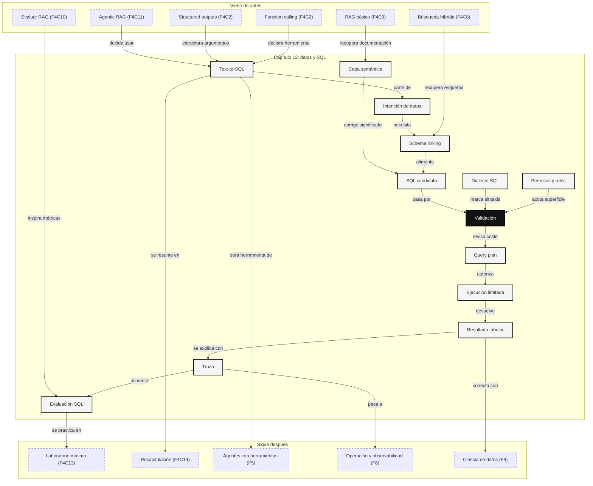

::: {.fasciculo-subtitle}
Facsímil 4 · La caja de herramientas
:::

# Capítulo 12: Text-to-SQL y herramientas de datos

## La pregunta que no está en un documento

En el [capítulo 11](/libro/fasciculo-04/#capitulo-11) vimos que un sistema puede decidir consultar distintas fuentes antes de responder. Algunas fuentes son textos: normativas, manuales, tickets, actas. Otras no son textos en sentido estricto: tablas, bases de datos, métricas, historiales, estados de pedidos, matrículas, pagos, sensores o registros de producto.

Ahí aparece una frontera importante. Un RAG puede explicar “qué dice la política de matrícula”. Pero si preguntas “¿cuántos alumnos tienen pago pendiente y beca en revisión?”, no quieres que el modelo imagine un número a partir de párrafos. Quieres que consulte datos.

Text-to-SQL nace de esa necesidad: convertir una pregunta humana en una consulta SQL controlada. No es “hablar con la base de datos como si fuera una persona”. Es construir un puente auditado entre intención, esquema, permisos, consulta, ejecución, resultado y explicación.

## Estado del arte con fecha de corte

**Fecha de corte:** 26 de mayo de 2026.  
**Fuentes consultadas ese día:** papers de Spider, RAT-SQL, PICARD, BIRD y Spider 2.0; documentación oficial de LangChain SQL Agent, LlamaIndex NL SQL, OpenAI Function Calling y Structured Outputs; documentación de SQLGlot, DuckDB y repositorio público de Vanna.

Text-to-SQL se estudia desde hace años como una tarea de *semantic parsing*: traducir lenguaje natural a una representación formal ejecutable. Spider marcó un salto porque propuso preguntas y consultas complejas sobre 200 bases de datos, con esquemas distintos entre entrenamiento y prueba; su objetivo era medir generalización a bases nuevas, no memorizar una sola tabla.^[Yu, T. et al. (2018). *Spider: A Large-Scale Human-Labeled Dataset for Complex and Cross-Domain Semantic Parsing and Text-to-SQL Task*. *Proceedings of EMNLP*, 3911-3921. [ACL Anthology](https://aclanthology.org/D18-1425/).]

Después se vio que una parte crítica no era solo generar SQL, sino entender el esquema. RAT-SQL trabajó explícitamente el *schema linking*: conectar palabras de la pregunta con tablas, columnas y relaciones del esquema mediante atención consciente de relaciones.^[Wang, B., Shin, R., Liu, X., Polozov, O. y Richardson, M. (2020). *RAT-SQL: Relation-Aware Schema Encoding and Linking for Text-to-SQL Parsers*. *Proceedings of ACL*, 7567-7578. [DOI](https://doi.org/10.18653/v1/2020.acl-main.677).] PICARD atacó otro problema: incluso un modelo capaz puede producir SQL inválido. Su propuesta restringe la decodificación con parsing incremental para rechazar tokens que romperían la sintaxis formal.^[Scholak, T., Schucher, N. y Bahdanau, D. (2021). *PICARD: Parsing Incrementally for Constrained Auto-Regressive Decoding from Language Models*. *Proceedings of EMNLP*, 9895-9901. [DOI](https://doi.org/10.18653/v1/2021.emnlp-main.779).]

Los benchmarks más recientes empujaron la tarea hacia condiciones más reales. BIRD introdujo bases de datos grandes, valores sucios, conocimiento externo y eficiencia de consulta; reportó 12.751 pares pregunta-SQL sobre 95 bases de datos y 33,4 GB.^[Li, J. et al. (2023). *Can LLM Already Serve as A Database Interface? A BIg Bench for Large-Scale Database Grounded Text-to-SQLs*. [arXiv](https://arxiv.org/abs/2305.03111).] Spider 2.0 fue más allá: problemas de flujo empresarial, más de 1.000 columnas en algunas bases, varios dialectos como BigQuery y Snowflake, metadatos extensos y tareas que pueden requerir múltiples consultas.^[Lei, F. et al. (2024). *Spider 2.0: Evaluating Language Models on Real-World Enterprise Text-to-SQL Workflows*. [arXiv](https://arxiv.org/abs/2411.07763).]

En herramientas prácticas, LangChain documenta un flujo de SQL agent que lista tablas, decide cuáles son relevantes, inspecciona esquemas, genera consulta, revisa errores comunes, ejecuta y formula respuesta.^[LangChain. (2026). *Build a SQL agent*. [Documentación oficial](https://docs.langchain.com/oss/python/langchain/sql-agent). Consultado el 26 de mayo de 2026.] LlamaIndex ofrece componentes NL SQL y advierte que ejecutar consultas generadas requiere especial cuidado con permisos y entorno.^[LlamaIndex. (2026). *NL SQL table query engine*. [Documentación oficial](https://developers.llamaindex.ai/python/framework-api-reference/query_engine/NL_SQL_table/). Consultado el 26 de mayo de 2026.] OpenAI documenta function calling como forma de describir herramientas mediante esquemas y recibir argumentos estructurados; Structured Outputs permite exigir que una salida siga un esquema JSON compatible.^[OpenAI. (2026). *Function calling*. [Documentación oficial](https://developers.openai.com/api/docs/guides/function-calling). OpenAI. (2026). *Structured model outputs*. [Documentación oficial](https://developers.openai.com/api/docs/guides/structured-outputs). Consultado el 26 de mayo de 2026.]

## Qué no es Text-to-SQL

Text-to-SQL no es “darle acceso libre a la base de datos al modelo”. El modelo no debería decidir por su cuenta qué puede leer, cuántas filas puede sacar, qué tablas puede cruzar o si una consulta es aceptable. Eso lo decide el sistema.

Tampoco es un reemplazo completo de un equipo de datos. Muchas preguntas parecen simples y esconden definiciones de negocio: “cliente activo”, “ingreso neto”, “alumno matriculado”, “churn”, “pedido completado”. Si esas definiciones no viven en una capa semántica o en documentación recuperable, el modelo puede generar una consulta válida que responde a otra pregunta.

Y no es solo una tarea de SQL. En producción intervienen permisos, catálogo, metadatos, documentación de columnas, dialecto, coste, timeouts, límites de filas, validación, trazas y evaluación. La consulta es una pieza. El sistema es todo lo que evita que esa pieza se use mal.

## Qué sí es

Text-to-SQL es una tubería controlada:

```text
pregunta -> intención -> esquema relevante -> SQL candidato
         -> validación -> ejecución limitada -> resultado
         -> explicación con trazas
```

La unidad de trabajo no es “una query”. La unidad de trabajo es una **solicitud de datos** con contexto:

| Pieza | Qué contiene | Ejemplo |
|---|---|---|
| Pregunta | Lo que pide la persona. | “Ingresos por campus en marzo”. |
| Usuario | Identidad, rol y permisos. | `analista_matricula`, campus permitido. |
| Dominio | Área de datos. | Matrícula, becas, pagos, soporte. |
| Esquema | Tablas, columnas, claves y tipos. | `pagos`, `alumnos`, `campus`. |
| Semántica | Definiciones de negocio. | “ingreso neto = importe - devoluciones”. |
| SQL | Consulta candidata. | `SELECT campus, SUM(...) ...`. |
| Validación | Reglas antes de ejecutar. | Solo `SELECT`, `LIMIT`, timeout. |
| Resultado | Filas devueltas. | Tabla agregada. |
| Explicación | Resumen humano. | “Campus Norte concentra el 42%”. |
| Traza | Registro completo. | Tablas usadas, SQL, coste, tiempo. |

Para entenderlo bien, pensemos en una pregunta sencilla:

> “¿Cuáles son los tres campus con más pagos pendientes?”

El sistema no debería saltar directamente a escribir SQL. Primero debe saber qué significa “pagos pendientes”, dónde vive “campus”, si la persona puede ver todos los campus, si hay que excluir pagos anulados, si la moneda importa y si “tres” implica ordenar de mayor a menor.

## SQL desde cero, pero sin rebajarlo

SQL es el lenguaje clásico para consultar datos relacionales. Una base relacional organiza información en tablas. Cada tabla tiene filas y columnas. Una fila representa una entidad o evento; una columna representa un atributo.

Una base de datos no es un Excel grande. En una hoja plana es habitual repetir datos para que todo quepa en una misma vista. En una base relacional se separan entidades y eventos para que cada cosa tenga un lugar claro: alumnos por un lado, pagos por otro, becas por otro. Después una consulta une lo que necesita mediante claves.

<svg id="f4-c12-base-relacional-no-excel" xmlns="http://www.w3.org/2000/svg" viewBox="0 0 1160 660" role="img" aria-label="Diferencia entre una hoja plana y una base relacional consultada con SQL">
  <defs>
    <marker id="f4c12-rel-arrow" viewBox="0 0 10 10" refX="9" refY="5" markerWidth="7" markerHeight="7" orient="auto-start-reverse">
      <path d="M 0 0 L 10 5 L 0 10 z" fill="#111111"/>
    </marker>
  </defs>
  <rect x="24" y="24" width="1112" height="612" rx="16" fill="#FFFFFF" stroke="#111111" stroke-width="2"/>
  <text x="580" y="62" text-anchor="middle" font-family="Arial, sans-serif" font-size="25" font-weight="700" fill="#111111">SQL pregunta sobre relaciones, no sobre una hoja gigante</text>
  <text x="580" y="88" text-anchor="middle" font-family="Arial, sans-serif" font-size="13" fill="#555555">El modelo debe entender entidades, claves, filtros y métricas antes de escribir una consulta.</text>

  <g font-family="Arial, sans-serif">
    <rect x="56" y="128" width="306" height="354" rx="14" fill="#F7F7F7" stroke="#111111" stroke-width="1.5"/>
    <text x="209" y="160" text-anchor="middle" font-size="16" font-weight="700">Hoja plana</text>
    <text x="209" y="184" text-anchor="middle" font-size="11" fill="#555555">todo repetido para leer rápido</text>
    <rect x="82" y="214" width="254" height="210" fill="#FFFFFF" stroke="#111111"/>
    <line x1="82" y1="248" x2="336" y2="248" stroke="#111111"/>
    <line x1="132" y1="214" x2="132" y2="424" stroke="#DDDDDD"/>
    <line x1="194" y1="214" x2="194" y2="424" stroke="#DDDDDD"/>
    <line x1="254" y1="214" x2="254" y2="424" stroke="#DDDDDD"/>
    <text x="107" y="236" text-anchor="middle" font-size="10" font-weight="700">alumno</text>
    <text x="163" y="236" text-anchor="middle" font-size="10" font-weight="700">campus</text>
    <text x="224" y="236" text-anchor="middle" font-size="10" font-weight="700">pago</text>
    <text x="296" y="236" text-anchor="middle" font-size="10" font-weight="700">estado</text>
    <text x="107" y="278" text-anchor="middle" font-size="10">1</text>
    <text x="163" y="278" text-anchor="middle" font-size="10">Norte</text>
    <text x="224" y="278" text-anchor="middle" font-size="10">420</text>
    <text x="296" y="278" text-anchor="middle" font-size="10">pendiente</text>
    <text x="107" y="318" text-anchor="middle" font-size="10">1</text>
    <text x="163" y="318" text-anchor="middle" font-size="10">Norte</text>
    <text x="224" y="318" text-anchor="middle" font-size="10">380</text>
    <text x="296" y="318" text-anchor="middle" font-size="10">pendiente</text>
    <text x="107" y="358" text-anchor="middle" font-size="10">2</text>
    <text x="163" y="358" text-anchor="middle" font-size="10">Sur</text>
    <text x="224" y="358" text-anchor="middle" font-size="10">300</text>
    <text x="296" y="358" text-anchor="middle" font-size="10">pagado</text>
    <text x="107" y="398" text-anchor="middle" font-size="10">2</text>
    <text x="163" y="398" text-anchor="middle" font-size="10">Sur</text>
    <text x="224" y="398" text-anchor="middle" font-size="10">120</text>
    <text x="296" y="398" text-anchor="middle" font-size="10">pendiente</text>
    <text x="209" y="456" text-anchor="middle" font-size="11" fill="#555555">fácil de mirar, difícil de gobernar</text>

    <rect x="428" y="128" width="304" height="354" rx="14" fill="#FFFFFF" stroke="#111111" stroke-width="1.5"/>
    <text x="580" y="160" text-anchor="middle" font-size="16" font-weight="700">Base relacional</text>
    <text x="580" y="184" text-anchor="middle" font-size="11" fill="#555555">entidades separadas y unidas por claves</text>
    <rect x="458" y="218" width="118" height="82" rx="10" fill="#FFFFFF" stroke="#111111"/>
    <text x="517" y="244" text-anchor="middle" font-size="12" font-weight="700">alumnos</text>
    <text x="517" y="266" text-anchor="middle" font-size="10">alumno_id PK</text>
    <text x="517" y="284" text-anchor="middle" font-size="10">campus</text>
    <rect x="584" y="338" width="118" height="82" rx="10" fill="#111111" stroke="#111111"/>
    <text x="643" y="364" text-anchor="middle" font-size="12" font-weight="700" fill="#FFFFFF">pagos</text>
    <text x="643" y="386" text-anchor="middle" font-size="10" fill="#F2F2F2">pago_id PK</text>
    <text x="643" y="404" text-anchor="middle" font-size="10" fill="#F2F2F2">alumno_id FK</text>
    <rect x="458" y="338" width="118" height="82" rx="10" fill="#FFFFFF" stroke="#111111"/>
    <text x="517" y="364" text-anchor="middle" font-size="12" font-weight="700">becas</text>
    <text x="517" y="386" text-anchor="middle" font-size="10">alumno_id FK</text>
    <text x="517" y="404" text-anchor="middle" font-size="10">estado_beca</text>
    <line x1="543" y1="300" x2="617" y2="338" stroke="#111111" stroke-width="1.4" marker-end="url(#f4c12-rel-arrow)"/>
    <line x1="576" y1="379" x2="584" y2="379" stroke="#111111" stroke-width="1.4" marker-end="url(#f4c12-rel-arrow)"/>
    <text x="580" y="456" text-anchor="middle" font-size="11" fill="#555555">cada unión debe declarar una clave correcta</text>

    <rect x="798" y="128" width="306" height="354" rx="14" fill="#F7F7F7" stroke="#111111" stroke-width="1.5"/>
    <text x="951" y="160" text-anchor="middle" font-size="16" font-weight="700">Consulta controlada</text>
    <text x="951" y="184" text-anchor="middle" font-size="11" fill="#555555">la pregunta se convierte en contrato</text>
    <rect x="834" y="224" width="234" height="46" rx="8" fill="#FFFFFF" stroke="#111111"/>
    <text x="951" y="253" text-anchor="middle" font-size="12">métrica: SUM(importe)</text>
    <rect x="834" y="288" width="234" height="46" rx="8" fill="#FFFFFF" stroke="#111111"/>
    <text x="951" y="317" text-anchor="middle" font-size="12">filtro: estado = pendiente</text>
    <rect x="834" y="352" width="234" height="46" rx="8" fill="#FFFFFF" stroke="#111111"/>
    <text x="951" y="381" text-anchor="middle" font-size="12">grupo: campus</text>
    <rect x="834" y="416" width="234" height="46" rx="8" fill="#111111" stroke="#111111"/>
    <text x="951" y="445" text-anchor="middle" font-size="12" fill="#FFFFFF">límite, permisos y traza</text>
    <text x="580" y="548" text-anchor="middle" font-size="13" font-weight="700">El modelo no debería “saber el número”: debería construir una consulta que otro componente pueda revisar.</text>
  </g>

  <text x="1108" y="606" text-anchor="end" font-family="Arial, sans-serif" font-size="11" fill="#888888">IA para gente curiosa / Facsímil 04 / Capítulo 12 / 686f6c61</text>
</svg>

Ejemplo mínimo:

| tabla `pagos` | significado |
|---|---|
| `pago_id` | identificador del pago. |
| `alumno_id` | alumno asociado. |
| `campus` | campus administrativo. |
| `estado` | `pagado`, `pendiente`, `devuelto`. |
| `importe` | cantidad. |
| `fecha` | fecha del movimiento. |

Una consulta básica:

```sql
SELECT campus, SUM(importe) AS total_pendiente
FROM pagos
WHERE estado = 'pendiente'
GROUP BY campus
ORDER BY total_pendiente DESC
LIMIT 3;
```

Esto se lee así:

| Cláusula | Qué hace | En castellano |
|---|---|---|
| `SELECT` | Elige columnas o cálculos. | Quiero campus y suma de importe. |
| `FROM` | Indica la tabla base. | Usa la tabla de pagos. |
| `WHERE` | Filtra filas antes de agrupar. | Solo pagos pendientes. |
| `GROUP BY` | Agrupa filas por una dimensión. | Junta pagos por campus. |
| `ORDER BY` | Ordena resultados. | Primero los importes mayores. |
| `LIMIT` | Limita filas devueltas. | Dame solo tres. |

La parte que más se suele subestimar es el `JOIN`: cruzar tablas. Si `pagos` tiene `alumno_id`, pero la titulación vive en `alumnos`, necesitamos unir:

```sql
SELECT a.titulacion, SUM(p.importe) AS total_pendiente
FROM pagos AS p
JOIN alumnos AS a ON a.alumno_id = p.alumno_id
WHERE p.estado = 'pendiente'
GROUP BY a.titulacion
ORDER BY total_pendiente DESC
LIMIT 5;
```

Un `JOIN` no es decoración. Es una afirmación sobre relación entre tablas. Si la clave es incorrecta, el resultado puede ser válido en SQL y falso en negocio.

## Errores SQL que cambian la historia

Para un ingeniero, el peligro no está solo en que el modelo genere SQL inválido. Ese fallo es fácil de detectar. El peligro serio es que genere SQL válido, rápido y aparentemente razonable, pero calcule otra cosa.

| Error | SQL que suele aparecer | Qué rompe | Cómo pensarlo |
|---|---|---|---|
| Duplicar filas con un `JOIN` | Unir `alumnos` con varias filas de `pagos`. | `COUNT(*)` sube porque un alumno aparece varias veces. | Cuenta entidades con `COUNT(DISTINCT alumno_id)`. |
| Confundir evento y entidad | Contar pagos como si fueran alumnos. | Mide movimientos, no personas. | Pregunta si cada fila es “cosa” o “suceso”. |
| Ignorar `NULL` | `AVG(importe)` sin revisar ausentes. | Algunos cálculos excluyen nulos sin avisar. | Decide si nulo significa desconocido, cero o no aplica. |
| Filtrar tarde | Usar `HAVING` cuando tocaba `WHERE`. | Agrupa datos que no deberían entrar. | `WHERE` filtra filas; `HAVING` filtra grupos. |
| Fechas mal cerradas | `fecha <= '2026-03-31'`. | Puede perder horas del último día. | Usa rangos semiabiertos: `>= inicio` y `< fin`. |
| Moneda mezclada | `SUM(importe)` sin moneda. | Suma euros, dólares o créditos como si fueran iguales. | Agrupa o convierte antes de sumar. |
| Estado de negocio incompleto | `estado != 'pagado'`. | Incluye anulados, devueltos o pruebas. | Define catálogo permitido, no solo excluido. |

Miremos el fallo de duplicación, que aparece mucho en sistemas Text-to-SQL. Si una tabla `alumnos` tiene una fila por alumno y `pagos` tiene varias filas por alumno, este SQL cuenta pagos, no alumnos:

```sql
SELECT COUNT(*) AS alumnos_con_pago
FROM alumnos AS a
JOIN pagos AS p ON p.alumno_id = a.alumno_id
WHERE p.estado = 'pendiente';
```

Si un alumno tiene tres pagos pendientes, aparece tres veces. La consulta puede ejecutarse sin quejarse y devolver un número bonito, pero el significado es otro. Para contar alumnos únicos:

```sql
SELECT COUNT(DISTINCT a.alumno_id) AS alumnos_con_pago_pendiente
FROM alumnos AS a
JOIN pagos AS p ON p.alumno_id = a.alumno_id
WHERE p.estado = 'pendiente';
```

La diferencia entre `COUNT(*)` y `COUNT(DISTINCT ...)` no es un detalle académico. Es la diferencia entre contar filas y contar entidades. Cuando una persona pregunta “cuántos alumnos”, normalmente quiere entidades. Cuando pregunta “cuántos pagos”, quiere eventos.

También importan las fechas. Si `fecha` incluye hora, esta condición parece correcta pero puede dejar fuera movimientos del 31 de marzo por la tarde:

```sql
WHERE fecha >= '2026-03-01'
  AND fecha <= '2026-03-31'
```

El patrón más robusto para intervalos suele ser:

```sql
WHERE fecha >= '2026-03-01'
  AND fecha < '2026-04-01'
```

Un buen sistema Text-to-SQL no solo valida sintaxis. También mira estas trampas: cardinalidad de las tablas, tipo de métrica, nulos, moneda, rango temporal, catálogo de estados y claves de unión.

## El mecanismo paso a paso

Text-to-SQL funciona bien cuando se separan tareas. Un modelo que recibe “todas las tablas, toda la documentación y genera SQL” puede acertar en una demo pequeña, pero se vuelve frágil con esquemas grandes.

<svg id="f4-c12-text-to-sql-produccion" xmlns="http://www.w3.org/2000/svg" viewBox="0 0 1320 1060" role="img" aria-label="Arquitectura de producción para Text-to-SQL y herramientas de datos">
  <defs>
    <marker id="f4c12-arrow" viewBox="0 0 10 10" refX="9" refY="5" markerWidth="7" markerHeight="7" orient="auto-start-reverse">
      <path d="M 0 0 L 10 5 L 0 10 z" fill="#111111"/>
    </marker>
    <pattern id="f4c12-grid" width="18" height="18" patternUnits="userSpaceOnUse">
      <path d="M 18 0 L 0 0 0 18" fill="none" stroke="#EEEEEE" stroke-width="1"/>
    </pattern>
  </defs>

  <rect x="24" y="24" width="1272" height="1012" rx="18" fill="#FFFFFF" stroke="#111111" stroke-width="2"/>
  <rect x="54" y="104" width="1212" height="842" rx="14" fill="url(#f4c12-grid)" stroke="#DDDDDD"/>
  <text x="660" y="62" text-anchor="middle" font-family="Arial, sans-serif" font-size="27" font-weight="700" fill="#111111">Text-to-SQL no es una query, es una cadena de control</text>
  <text x="660" y="90" text-anchor="middle" font-family="Arial, sans-serif" font-size="13" fill="#555555">El modelo propone, pero el sistema selecciona esquema, valida, limita, ejecuta y registra.</text>

  <g font-family="Arial, sans-serif">
    <rect x="78" y="132" width="176" height="78" rx="12" fill="#FFFFFF" stroke="#111111" stroke-width="1.6"/>
    <text x="166" y="162" text-anchor="middle" font-size="14" font-weight="700">Pregunta</text>
    <text x="166" y="186" text-anchor="middle" font-size="11" fill="#555555">intención humana</text>

    <line x1="254" y1="171" x2="300" y2="171" stroke="#111111" stroke-width="1.4" marker-end="url(#f4c12-arrow)"/>
    <rect x="300" y="132" width="180" height="78" rx="12" fill="#111111" stroke="#111111" stroke-width="1.6"/>
    <text x="390" y="162" text-anchor="middle" font-size="14" font-weight="700" fill="#FFFFFF">Clasificador</text>
    <text x="390" y="186" text-anchor="middle" font-size="11" fill="#E5E5E5">dominio y permisos</text>

    <line x1="480" y1="171" x2="526" y2="171" stroke="#111111" stroke-width="1.4" marker-end="url(#f4c12-arrow)"/>
    <rect x="526" y="132" width="198" height="78" rx="12" fill="#FFFFFF" stroke="#111111" stroke-width="1.6"/>
    <text x="625" y="162" text-anchor="middle" font-size="14" font-weight="700">Selector de esquema</text>
    <text x="625" y="186" text-anchor="middle" font-size="11" fill="#555555">tablas, columnas, claves</text>

    <line x1="724" y1="171" x2="770" y2="171" stroke="#111111" stroke-width="1.4" marker-end="url(#f4c12-arrow)"/>
    <rect x="770" y="132" width="194" height="78" rx="12" fill="#FFFFFF" stroke="#111111" stroke-width="1.6"/>
    <text x="867" y="162" text-anchor="middle" font-size="14" font-weight="700">Capa semántica</text>
    <text x="867" y="186" text-anchor="middle" font-size="11" fill="#555555">métricas y reglas</text>

    <line x1="964" y1="171" x2="1010" y2="171" stroke="#111111" stroke-width="1.4" marker-end="url(#f4c12-arrow)"/>
    <rect x="1010" y="132" width="216" height="78" rx="12" fill="#FFFFFF" stroke="#111111" stroke-width="1.6"/>
    <text x="1118" y="162" text-anchor="middle" font-size="14" font-weight="700">Generador SQL</text>
    <text x="1118" y="186" text-anchor="middle" font-size="11" fill="#555555">consulta candidata</text>

    <rect x="92" y="314" width="228" height="106" rx="12" fill="#FFFFFF" stroke="#111111" stroke-width="1.6"/>
    <text x="206" y="346" text-anchor="middle" font-size="14" font-weight="700">Parser</text>
    <text x="206" y="370" text-anchor="middle" font-size="11" fill="#555555">sintaxis y dialecto</text>
    <text x="206" y="388" text-anchor="middle" font-size="11" fill="#555555">AST de la consulta</text>

    <rect x="386" y="314" width="228" height="106" rx="12" fill="#111111" stroke="#111111" stroke-width="1.6"/>
    <text x="500" y="346" text-anchor="middle" font-size="14" font-weight="700" fill="#FFFFFF">Validador</text>
    <text x="500" y="370" text-anchor="middle" font-size="11" fill="#E5E5E5">solo lectura, límites</text>
    <text x="500" y="388" text-anchor="middle" font-size="11" fill="#E5E5E5">tablas permitidas</text>

    <rect x="680" y="314" width="228" height="106" rx="12" fill="#FFFFFF" stroke="#111111" stroke-width="1.6"/>
    <text x="794" y="346" text-anchor="middle" font-size="14" font-weight="700">Dry-run / explain</text>
    <text x="794" y="370" text-anchor="middle" font-size="11" fill="#555555">coste, columnas, plan</text>
    <text x="794" y="388" text-anchor="middle" font-size="11" fill="#555555">sin traer todo</text>

    <rect x="974" y="314" width="228" height="106" rx="12" fill="#FFFFFF" stroke="#111111" stroke-width="1.6"/>
    <text x="1088" y="346" text-anchor="middle" font-size="14" font-weight="700">Ejecución limitada</text>
    <text x="1088" y="370" text-anchor="middle" font-size="11" fill="#555555">timeout, filas, coste</text>
    <text x="1088" y="388" text-anchor="middle" font-size="11" fill="#555555">read-only replica</text>

    <path d="M1118 210 C1118 264, 206 258, 206 314" stroke="#111111" stroke-width="1.2" fill="none" marker-end="url(#f4c12-arrow)"/>
    <line x1="320" y1="367" x2="386" y2="367" stroke="#111111" stroke-width="1.4" marker-end="url(#f4c12-arrow)"/>
    <line x1="614" y1="367" x2="680" y2="367" stroke="#111111" stroke-width="1.4" marker-end="url(#f4c12-arrow)"/>
    <line x1="908" y1="367" x2="974" y2="367" stroke="#111111" stroke-width="1.4" marker-end="url(#f4c12-arrow)"/>

    <rect x="132" y="538" width="238" height="94" rx="12" fill="#FFFFFF" stroke="#111111" stroke-width="1.6"/>
    <text x="251" y="570" text-anchor="middle" font-size="14" font-weight="700">Tabla resultado</text>
    <text x="251" y="594" text-anchor="middle" font-size="11" fill="#555555">filas, columnas, tipos</text>
    <text x="251" y="612" text-anchor="middle" font-size="11" fill="#555555">muestra o agregado</text>

    <rect x="430" y="538" width="238" height="94" rx="12" fill="#FFFFFF" stroke="#111111" stroke-width="1.6"/>
    <text x="549" y="570" text-anchor="middle" font-size="14" font-weight="700">Explicación</text>
    <text x="549" y="594" text-anchor="middle" font-size="11" fill="#555555">qué se calculó</text>
    <text x="549" y="612" text-anchor="middle" font-size="11" fill="#555555">sin inventar datos</text>

    <rect x="728" y="538" width="238" height="94" rx="12" fill="#FFFFFF" stroke="#111111" stroke-width="1.6"/>
    <text x="847" y="570" text-anchor="middle" font-size="14" font-weight="700">Visualización</text>
    <text x="847" y="594" text-anchor="middle" font-size="11" fill="#555555">opcional y declarada</text>
    <text x="847" y="612" text-anchor="middle" font-size="11" fill="#555555">tipo de gráfico</text>

    <rect x="1026" y="538" width="160" height="94" rx="12" fill="#FFFFFF" stroke="#111111" stroke-width="1.6"/>
    <text x="1106" y="570" text-anchor="middle" font-size="14" font-weight="700">Traza</text>
    <text x="1106" y="594" text-anchor="middle" font-size="11" fill="#555555">SQL, tiempo</text>
    <text x="1106" y="612" text-anchor="middle" font-size="11" fill="#555555">usuario, versión</text>

    <path d="M1088 420 C1088 492, 251 478, 251 538" stroke="#111111" stroke-width="1.2" fill="none" marker-end="url(#f4c12-arrow)"/>
    <line x1="370" y1="585" x2="430" y2="585" stroke="#111111" stroke-width="1.4" marker-end="url(#f4c12-arrow)"/>
    <line x1="668" y1="585" x2="728" y2="585" stroke="#111111" stroke-width="1.4" marker-end="url(#f4c12-arrow)"/>
    <line x1="966" y1="585" x2="1026" y2="585" stroke="#111111" stroke-width="1.4" marker-end="url(#f4c12-arrow)"/>

    <rect x="160" y="742" width="294" height="74" rx="12" fill="#FFFFFF" stroke="#111111" stroke-width="1.4"/>
    <text x="307" y="772" text-anchor="middle" font-size="13" font-weight="700">Evaluación offline</text>
    <text x="307" y="794" text-anchor="middle" font-size="11" fill="#555555">pregunta, SQL esperado, filas</text>

    <rect x="514" y="742" width="294" height="74" rx="12" fill="#FFFFFF" stroke="#111111" stroke-width="1.4"/>
    <text x="661" y="772" text-anchor="middle" font-size="13" font-weight="700">Observabilidad</text>
    <text x="661" y="794" text-anchor="middle" font-size="11" fill="#555555">latencia, coste, fallos, drift</text>

    <rect x="868" y="742" width="294" height="74" rx="12" fill="#FFFFFF" stroke="#111111" stroke-width="1.4"/>
    <text x="1015" y="772" text-anchor="middle" font-size="13" font-weight="700">Gobierno de datos</text>
    <text x="1015" y="794" text-anchor="middle" font-size="11" fill="#555555">permisos, retención, versiones</text>

    <path d="M1106 632 C1106 694, 307 688, 307 742" stroke="#555555" stroke-width="1.1" stroke-dasharray="5 5" fill="none" marker-end="url(#f4c12-arrow)"/>
    <path d="M1106 632 C1106 694, 661 688, 661 742" stroke="#555555" stroke-width="1.1" stroke-dasharray="5 5" fill="none" marker-end="url(#f4c12-arrow)"/>
    <path d="M1106 632 C1106 694, 1015 688, 1015 742" stroke="#555555" stroke-width="1.1" stroke-dasharray="5 5" fill="none" marker-end="url(#f4c12-arrow)"/>

    <rect x="206" y="874" width="908" height="44" rx="12" fill="#111111"/>
    <text x="660" y="902" text-anchor="middle" font-size="13" font-weight="700" fill="#FFFFFF">La pregunta entra en lenguaje natural; la respuesta sale con datos, límites y trazabilidad.</text>
  </g>

  <text x="1268" y="1010" text-anchor="end" font-family="Arial, sans-serif" font-size="11" fill="#888888">IA para gente curiosa / Facsímil 04 / Capítulo 12 / 686f6c61</text>
</svg>

Un sistema así no depende de una única llamada al modelo. Depende de contratos entre piezas. La persona pregunta; el clasificador decide si la pregunta es de datos o de documentos; el selector reduce el esquema; la capa semántica aporta definiciones; el generador propone SQL; el validador inspecciona; la base ejecuta con límites; la respuesta explica y registra.

## El problema real: esquema, semántica y valores

Cuando un humano experto escribe SQL, no solo recuerda sintaxis. Recuerda el significado de cada tabla, qué columnas son fiables, qué claves se unen, qué estados se excluyen, qué fechas mandan y qué métricas no se calculan directamente.

Text-to-SQL falla por tres razones principales:

| Foco | Qué falla | Ejemplo |
|---|---|---|
| Esquema | El modelo elige tabla o columna incorrecta. | Usa `created_at` en vez de `paid_at`. |
| Semántica | La consulta no respeta definición de negocio. | Cuenta alumnos anulados como activos. |
| Valores | No sabe cómo están escritos los datos reales. | Busca `pendiente` pero la tabla usa `PENDING`. |

El *schema linking* conecta pregunta y esquema. Si la pregunta dice “campus con pagos pendientes”, el sistema debe vincular:

| Palabra de la pregunta | Candidato en datos | Por qué |
|---|---|---|
| campus | `alumnos.campus` o `pagos.campus` | Dimensión de agrupación. |
| pagos | tabla `pagos` | Hecho económico. |
| pendientes | `pagos.estado = 'pendiente'` | Filtro. |
| tres | `LIMIT 3` | Tamaño de salida. |
| más | `ORDER BY total DESC` | Orden descendente. |

En bases pequeñas se puede meter todo el esquema en el prompt. En bases grandes no. Hay que recuperar el esquema como se recuperan documentos: por dominio, por nombres, por descripciones, por consultas de ejemplo y por permisos.

## La capa semántica como contrato

La capa semántica es el lugar donde una organización deja de discutir cada vez qué significa una métrica. No es una frase bonita en un prompt. Es un contrato versionado entre negocio, ingeniería y análisis.

Una definición mínima de métrica debería responder:

| Pregunta | Ejemplo para `ingreso_neto` |
|---|---|
| ¿Qué entidad mide? | Pagos confirmados. |
| ¿Qué columna numérica usa? | `pagos.importe`. |
| ¿Qué estados entran? | Solo `pagado`. |
| ¿Qué estados salen? | `pendiente`, `anulado`, `devuelto`, `prueba`. |
| ¿Qué fecha manda? | `fecha_pago`, no `fecha_creacion`. |
| ¿Qué dimensiones permite? | `campus`, `titulacion`, `mes`. |
| ¿Quién puede verla? | Roles de análisis y dirección académica. |
| ¿Cómo se prueba? | Casos con resultado esperado. |

Esa misma definición puede expresarse de muchas formas: YAML, dbt metrics, una tabla de metadatos, una API interna o una vista SQL. Lo importante es que el modelo no invente la definición cada vez.

```yaml
metric: ingreso_neto
entity: pagos
expression: SUM(importe)
filters:
  - estado = 'pagado'
time_dimension: fecha_pago
allowed_dimensions:
  - campus
  - titulacion
  - mes
blocked_columns:
  - dni
  - email_personal
owner: equipo_datos_matricula
```

Con esa capa, una pregunta como “ingresos por campus en marzo” no empieza desde cero. El sistema sabe que “ingresos” apunta a `ingreso_neto`, que marzo debe filtrarse con `fecha_pago`, que el grupo permitido es `campus` y que algunas columnas ni siquiera deben entrar en el contexto.

Para una persona curiosa, la idea es esta: una base de datos guarda datos, pero no siempre guarda significado. La capa semántica añade significado compartido. Para un ingeniero, añade algo igual de importante: reduce libertad donde la libertad produce errores.

## Herramientas de datos: no todo es Text-to-SQL

Text-to-SQL es una herramienta, pero no la única. A veces conviene no dejar que el modelo genere SQL libre, sino exponer operaciones más estrechas.

| Tipo de herramienta | Qué hace | Cuándo usarla | Ejemplo |
|---|---|---|---|
| Text-to-SQL libre | Genera consultas nuevas. | Análisis exploratorio con validación fuerte. | “Agrupa pagos por campus y mes”. |
| Plantilla parametrizada | Rellena parámetros de una consulta fija. | Métricas críticas y repetibles. | `campus`, `fecha_inicio`, `fecha_fin`. |
| Stored procedure | Llama a una función definida en la base. | Regla compleja y estable. | `calcular_morosidad(campus, mes)`. |
| Semantic layer | Consulta métricas y dimensiones declaradas. | BI, reporting y definiciones de negocio. | `ingreso_neto` por `campus`. |
| DataFrame tool | Opera sobre tablas en memoria. | Exploración local, CSV, notebooks. | Pandas, Polars, DuckDB. |
| Chart tool | Convierte resultados en gráfico. | Cuando la salida natural es visual. | Barras por campus. |
| Data quality tool | Comprueba nulos, duplicados o rangos. | Antes de confiar en una respuesta. | “¿Hay importes negativos?”. |

La pregunta de arquitectura no es “¿puedo generar SQL?”. La pregunta buena es “¿qué superficie de datos quiero exponer?”. Cuanto más abierta sea la herramienta, más validación necesita.

## Contrato de una herramienta SQL

Una herramienta SQL no debería aceptar una cadena cualquiera. Debería tener un contrato que obligue a declarar intención, dominio, límites y formato de respuesta.

```json
{
  "name": "consultar_datos",
  "input": {
    "question": "Pagos pendientes por campus en marzo",
    "domain": "matricula",
    "sql": "SELECT campus, SUM(importe) AS total FROM pagos ...",
    "dialect": "sqlite",
    "max_rows": 50,
    "timeout_ms": 1500,
    "purpose": "analisis_agregado"
  },
  "output": {
    "columns": ["campus", "total"],
    "rows": [["Norte", 19320.0]],
    "row_count": 1,
    "elapsed_ms": 24,
    "trace_id": "f4c12-001"
  },
  "errors": [
    "tabla_no_permitida",
    "consulta_no_select",
    "demasiadas_filas",
    "timeout",
    "sql_invalido"
  ]
}
```

Cada campo tiene una razón:

| Campo | Qué controla | Por qué importa |
|---|---|---|
| `domain` | Área funcional. | Evita mezclar tablas sin contexto. |
| `sql` | Consulta candidata. | Debe poder validarse y registrarse. |
| `dialect` | Motor SQL esperado. | `LIMIT`, fechas y funciones cambian entre motores. |
| `max_rows` | Filas máximas. | Protege coste y evita respuestas inmanejables. |
| `timeout_ms` | Tiempo máximo. | Una mala consulta no debe bloquear el sistema. |
| `purpose` | Uso declarado. | No es igual explorar que cerrar un informe. |
| `trace_id` | Identificador de ejecución. | Permite reproducir y auditar. |

La herramienta puede estar detrás de OpenAI Function Calling, de un agente de LangChain, de LlamaIndex, de una API propia o de un servicio interno. El principio no cambia: el modelo propone argumentos estructurados, pero el servidor valida y ejecuta.

## Permisos, datos sensibles y trazas

Una herramienta de datos tiene tres identidades distintas y conviene no mezclarlas:

| Identidad | Qué representa | Error típico |
|---|---|---|
| Persona usuaria | Quien hace la pregunta. | Darle acceso por el rol técnico del servidor. |
| Modelo | Quien propone la consulta. | Tratar su SQL como decisión autorizada. |
| Servicio de datos | Quien ejecuta. | Conectar con permisos demasiado amplios. |

El modelo no debería tener permisos. Quien tiene permisos es el servicio que recibe una petición, revisa el rol de la persona, aplica reglas y ejecuta una consulta limitada. Esa separación evita que una respuesta dependa de una frase del prompt.

En una arquitectura seria, pondría estos controles:

| Control | Qué protege | Ejemplo concreto |
|---|---|---|
| Conexión read-only | Evita modificar datos. | Usuario SQL sin `INSERT`, `UPDATE`, `DELETE` ni DDL. |
| Réplica de lectura | Aísla producción. | Consultar una réplica o almacén analítico. |
| Row-level security | Limita filas por rol. | Un campus solo ve sus alumnos. |
| Column allowlist | Limita columnas visibles. | Exponer `campus`, no `dni` ni `email_personal`. |
| Query timeout | Evita consultas largas. | Cortar a 1.500 ms en exploración. |
| Row limit | Controla volumen de salida. | Máximo 100 filas por respuesta. |
| Redacción de logs | Evita guardar datos innecesarios. | Registrar SQL y hash de usuario, no tabla completa. |
| Trazabilidad | Permite reproducir. | `trace_id`, versión de esquema, modelo y validador. |

La traza no es vigilancia decorativa. Es el expediente técnico de la respuesta. Si alguien pregunta “¿de dónde salió este número?”, necesitas poder reconstruir pregunta, usuario, rol, tablas candidatas, SQL generado, reglas aplicadas, resultado, latencia y versión del sistema.

## Validación antes de ejecutar

La validación no es un adorno. Es el corazón del sistema. Un validador mínimo debería revisar:

| Control | Qué comprueba | Ejemplo de regla |
|---|---|---|
| Tipo de consulta | Solo lectura. | Aceptar únicamente `SELECT` o `WITH ... SELECT`. |
| Tablas permitidas | Superficie acotada. | `pagos`, `alumnos`, `campus`. |
| Columnas permitidas | Evitar columnas fuera de contrato. | No exponer `dni` si no hace falta. |
| Límite de filas | Salida manejable. | Añadir o exigir `LIMIT 100`. |
| Timeout | Coste temporal. | Cortar a 1,5 segundos. |
| Dialecto | Sintaxis correcta. | SQLite no es BigQuery. |
| Agregación | Preguntas agregadas devuelven agregados. | `SUM`, `COUNT`, `AVG`. |
| Filtros de usuario | Permisos por rol. | Campus permitido por sesión. |
| Explicación | Respuesta basada en resultado. | No resumir columnas que no salieron. |

Herramientas como SQLGlot ayudan a parsear, inspeccionar y transpilar SQL entre dialectos.^[SQLGlot. (2026). *Python SQL parser and transpiler*. [Documentación](https://sqlglot.com/). Consultado el 26 de mayo de 2026.] Motores embebidos como DuckDB son útiles para análisis local, CSV, Parquet o notebooks, porque permiten ejecutar SQL desde Python sin levantar un servidor externo.^[DuckDB. (2026). *Python API*. [Documentación oficial](https://duckdb.org/docs/stable/clients/python/overview). Consultado el 26 de mayo de 2026.]

## Query plan: cuando una consulta correcta no cabe

Una consulta puede ser correcta y aun así no ser aceptable. Si tarda treinta segundos, bloquea recursos o escanea una tabla enorme para devolver tres filas, el problema no es solo del modelo: es del sistema que no miró el plan.

El `query plan` es la explicación interna que calcula el motor antes de ejecutar. Según el motor puede verse con `EXPLAIN`, `EXPLAIN ANALYZE`, perfiles de consulta o dry-run. Los nombres cambian, pero la pregunta es la misma: ¿qué tendrá que hacer la base para responder?

```sql
EXPLAIN
SELECT campus, SUM(importe) AS total_pendiente
FROM pagos
WHERE estado = 'pendiente'
GROUP BY campus
ORDER BY total_pendiente DESC
LIMIT 3;
```

Al leer un plan, no hace falta entender todo desde el primer día. Empieza por estas señales:

| Señal | Qué significa | Por qué importa |
|---|---|---|
| Full scan | Recorrer muchas filas de una tabla. | Puede ser normal en tablas pequeñas, caro en tablas grandes. |
| Index scan | Localizar filas con un índice. | Suele ayudar si el filtro es selectivo. |
| Cardinalidad estimada | Filas que el motor cree que pasarán. | Si estima mal, elige planes pobres. |
| Join strategy | Forma de unir tablas. | Nested loop, hash join o merge join tienen costes distintos. |
| Sort | Ordenación intermedia. | `ORDER BY` sobre muchas filas puede ser caro. |
| Temporary spill | Datos intermedios fuera de memoria. | Señal de presión de memoria o consulta pesada. |

Un índice no resuelve todo. Acelera ciertas búsquedas a cambio de ocupar espacio y complicar escrituras. Si filtras mucho por `estado` y `fecha`, un índice puede ayudar:

```sql
CREATE INDEX idx_pagos_estado_fecha
ON pagos (estado, fecha);
```

Pero si casi todos los pagos están en `estado = 'pendiente'`, ese índice quizá no aporta mucho, porque el filtro no reduce bastante. Esta idea se llama selectividad: un filtro útil descarta muchas filas.

Para Text-to-SQL, el plan sirve como control previo:

| Pregunta técnica | Decisión del sistema |
|---|---|
| ¿Escanea más filas de las permitidas? | Pedir aclaración, añadir filtro o bloquear. |
| ¿Usa tablas fuera del dominio? | Rechazar y pedir reformulación. |
| ¿Ordena millones de filas sin agregación previa? | Proponer una consulta agregada. |
| ¿No hay índice para el filtro principal? | Avisar de latencia o derivar a informe offline. |

## Dialecto SQL: el mismo pedido cambia por motor

SQL tiene una gramática común, pero cada motor añade funciones, tipos y límites. Un sistema que genera SQL debe saber para qué motor escribe. SQLite no es PostgreSQL, PostgreSQL no es BigQuery, BigQuery no es Snowflake.

| Necesidad | SQLite | PostgreSQL | BigQuery | Snowflake |
|---|---|---|---|---|
| Limitar filas | `LIMIT 10` | `LIMIT 10` | `LIMIT 10` | `LIMIT 10` |
| Mes de una fecha | `strftime('%Y-%m', fecha)` | `date_trunc('month', fecha)` | `DATE_TRUNC(fecha, MONTH)` | `DATE_TRUNC('MONTH', fecha)` |
| Concatenar texto | `a || b` | `a || b` | `CONCAT(a, b)` | `a || b` |
| Fecha actual | `date('now')` | `CURRENT_DATE` | `CURRENT_DATE()` | `CURRENT_DATE()` |
| Muestra aproximada | Limitado | `TABLESAMPLE` | `TABLESAMPLE SYSTEM` | `SAMPLE` |

No hace falta memorizar todos los dialectos. Lo importante es no mezclar. Si el contrato dice `dialect: "sqlite"`, el generador, el parser, los ejemplos y el validador deben hablar SQLite. Si el almacén real es BigQuery, conviene validar con BigQuery o con un parser que entienda sus particularidades.

Esta es una razón más para no pegar ejemplos al azar en el prompt. Un ejemplo de PostgreSQL puede enseñar al modelo una función que luego falla en BigQuery. Los ejemplos son datos de entrenamiento local para la consulta que estás a punto de generar; si están mal elegidos, orientan mal.

## Cómo elegir arquitectura

La solución correcta depende del riesgo, del tamaño del esquema y de lo repetible que sea la pregunta.

| Situación | Arquitectura recomendada | Por qué |
|---|---|---|
| Métrica crítica y estable. | Plantilla parametrizada. | Menos libertad, más confianza. |
| Exploración interna con datos agregados. | Text-to-SQL con validación y trazas. | Permite flexibilidad controlada. |
| BI con definiciones compartidas. | Semantic layer + modelo. | Las métricas viven fuera del prompt. |
| CSV local o notebook. | DuckDB/DataFrame tool. | Iteración rápida y entorno cerrado. |
| Esquema enorme. | Retrieval de esquema + examples RAG. | No cabe todo el catálogo. |
| Varias bases y documentos. | Router + herramientas especializadas. | No todo debe ir por SQL. |
| Preguntas repetidas de negocio. | Stored procedures o vistas. | La lógica queda versionada. |

Mi regla práctica: si la pregunta puede romper un informe importante, no empieces con SQL libre. Empieza con métrica declarada, plantilla o vista. Usa Text-to-SQL libre para exploración, no para convertir cada pregunta de negocio en una consulta nueva sin revisión.

## Coste, latencia y contexto

Text-to-SQL parece barato porque la salida es corta. Pero el contexto puede crecer muchísimo: documentación de tablas, columnas, ejemplos, métricas, permisos, dialecto y trazas anteriores.

**Ejemplo de fórmula.** Podemos aproximar el contexto así:

$$
T_{\text{ctx}} =
T_{\text{pregunta}} +
T_{\text{schema}} +
T_{\text{docs}} +
T_{\text{ejemplos}} +
T_{\text{politicas}}
$$

| Símbolo | Significado | Ejemplo |
|---|---|---|
| \(T_{\text{ctx}}\) | Tokens totales de contexto. | 6.400 tokens. |
| \(T_{\text{pregunta}}\) | Pregunta del usuario. | 30 tokens. |
| \(T_{\text{schema}}\) | Tablas, columnas y claves incluidas. | 2.500 tokens. |
| \(T_{\text{docs}}\) | Documentación de negocio. | 1.200 tokens. |
| \(T_{\text{ejemplos}}\) | Consultas parecidas. | 1.800 tokens. |
| \(T_{\text{politicas}}\) | Permisos y reglas. | 870 tokens. |

**Ejemplo de fórmula.** La latencia total no es solo generación:

$$
L_{\text{total}} =
L_{\text{router}} +
L_{\text{schema}} +
L_{\text{LLM}} +
L_{\text{validacion}} +
L_{\text{db}} +
L_{\text{resumen}}
$$

| Símbolo | Significado | Ejemplo |
|---|---|---|
| \(L_{\text{schema}}\) | Tiempo de recuperar esquema relevante. | 80 ms. |
| \(L_{\text{LLM}}\) | Tiempo de generar SQL o plan. | 1.200 ms. |
| \(L_{\text{validacion}}\) | Parser, reglas y dry-run. | 90 ms. |
| \(L_{\text{db}}\) | Ejecución en base de datos. | 300 ms. |
| \(L_{\text{resumen}}\) | Redacción final. | 700 ms. |

**Ejemplo de fórmula.** Y el coste esperado por pregunta:

$$
C =
C_{\text{modelo}} +
C_{\text{db}} +
C_{\text{observabilidad}} +
C_{\text{mantenimiento}}
$$

La parte invisible suele ser \(C_{\text{mantenimiento}}\): documentar columnas, versionar métricas, revisar consultas fallidas, actualizar ejemplos y controlar cambios de esquema.

## Evaluar Text-to-SQL

La evaluación clásica compara SQL generado contra SQL esperado. Eso ayuda, pero no basta. Dos consultas distintas pueden devolver el mismo resultado; dos consultas parecidas pueden divergir en casos frontera.

| Métrica | Qué mide | Cuidado |
|---|---|---|
| Exact match | Si el SQL coincide con el esperado. | Penaliza consultas equivalentes escritas distinto. |
| Execution accuracy | Si produce el resultado correcto. | Puede acertar por casualidad en datos pequeños. |
| Result-set match | Si filas y columnas coinciden. | Hay que controlar orden, tipos y redondeo. |
| Component match | Si `SELECT`, `WHERE`, `JOIN`, `GROUP BY` están bien. | Útil para depurar. |
| Schema-link accuracy | Si eligió tablas y columnas correctas. | Necesita anotación o revisión. |
| Permission pass rate | Si respeta permisos y límites. | No basta medir precisión. |
| Query cost | Coste estimado o real de ejecución. | Una query correcta puede ser inviable. |
| Latencia P95 | Tiempo para el 95% de consultas. | La media oculta colas lentas. |
| Clarification rate | Cuándo pide aclaración. | Preguntar puede ser mejor que inventar. |

Un dataset propio debería tener:

| Campo | Ejemplo |
|---|---|
| `question` | “Pagos pendientes por campus en marzo”. |
| `user_role` | `analista_matricula`. |
| `allowed_tables` | `pagos`, `alumnos`, `campus`. |
| `gold_sql` | Consulta esperada o plantilla. |
| `expected_result` | Filas esperadas. |
| `must_not_use` | Columnas que no proceden. |
| `notes` | Definición de negocio relevante. |

En producción mediría, como mínimo:

| Capa | Pregunta de evaluación |
|---|---|
| Clasificador | ¿Detectó que era una pregunta de datos? |
| Selector de esquema | ¿Incluyó las tablas necesarias y excluyó ruido? |
| Generador | ¿Produjo SQL válido para el dialecto? |
| Validador | ¿Bloqueó lo que debía bloquear? |
| Ejecución | ¿Devolvió resultado correcto dentro de límite? |
| Resumen | ¿Explicó solo lo que aparece en la tabla? |
| Trazas | ¿Puedo reproducir la respuesta? |

Una forma práctica de empezar es construir un pequeño harness de evaluación. No tiene que ser perfecto. Tiene que hacer visible cuándo el sistema mejora o empeora.

```json
{
  "id": "matricula-001",
  "question": "Alumnos con pago pendiente por campus en marzo",
  "role": "analista_matricula",
  "dialect": "sqlite",
  "allowed_tables": ["pagos", "alumnos"],
  "expected_sql_patterns": ["GROUP BY campus", "estado = 'pendiente'"],
  "expected_result": [
    {"campus": "Norte", "alumnos": 2},
    {"campus": "Centro", "alumnos": 1}
  ],
  "max_latency_ms": 1500,
  "max_rows": 20,
  "must_not_use": ["dni", "email_personal"],
  "review_note": "Debe contar alumnos únicos, no pagos."
}
```

En ese ejemplo no basta con que aparezca `GROUP BY campus`. El caso dice explícitamente que hay que contar alumnos únicos. Esa nota evita que una consulta con `COUNT(*)` pase por casualidad cuando los datos de prueba son pequeños.

Un harness útil debería guardar cuatro salidas:

| Salida | Para qué sirve |
|---|---|
| SQL generado | Revisar estructura y dialecto. |
| Resultado devuelto | Comparar con la tabla esperada. |
| Razón de validación | Saber si el sistema aceptó o bloqueó con criterio. |
| Traza | Reproducir el caso con misma versión de esquema y modelo. |

Y debería separar tipos de error. No es igual fallar por sintaxis que fallar por semántica:

| Tipo de fallo | Ejemplo | Qué arreglar |
|---|---|---|
| Sintaxis | Función inexistente para el dialecto. | Ejemplos y parser. |
| Schema linking | Usa `created_at` en lugar de `paid_at`. | Descripciones y selector de esquema. |
| Semántica | Cuenta pagos cuando debía contar alumnos. | Capa semántica y casos de prueba. |
| Permisos | Incluye columna no permitida. | Validador y allowlist. |
| Coste | Query correcta pero pesada. | Plan, índices, límites o vista agregada. |
| Explicación | Resume algo que no está en el resultado. | Contrato de respuesta y groundedness. |

## Cuando conviene pedir aclaración

Una buena herramienta de datos no responde siempre. A veces pregunta.

| Pregunta original | Qué falta | Mejor respuesta del sistema |
|---|---|---|
| “Ventas del mes”. | Mes, definición de venta, región. | “¿Qué mes y qué métrica de ventas quieres usar?” |
| “Alumnos activos”. | Definición de activo. | “Puedo usar matrícula vigente o acceso reciente. ¿Cuál prefieres?” |
| “Top clientes”. | Top por ingresos, pedidos o margen. | “¿Quieres ordenar por ingresos, margen o número de pedidos?” |
| “Comparar campus”. | Periodo y métrica. | “Dime periodo y métrica principal.” |

Pedir aclaración no es fallar. En datos, muchas respuestas incorrectas nacen de contestar demasiado rápido.

## Caso completo: de pregunta a respuesta trazable

Tomemos una pregunta realista:

> “Dame los tres campus con más alumnos con pagos pendientes en marzo.”

Parece una pregunta simple. No lo es. Hay una entidad, alumnos; un evento, pagos; una condición, pendientes; una ventana temporal, marzo; una agrupación, campus; un ranking, los tres primeros.

El sistema debería recorrer algo parecido a esto:

| Paso | Decisión | Resultado intermedio |
|---|---|---|
| 1. Intención | Es una pregunta de datos agregados. | Ruta a herramienta SQL. |
| 2. Dominio | Matrícula y pagos. | No consulta documentos generales. |
| 3. Usuario | Rol `analista_matricula`. | Puede ver agregados por campus. |
| 4. Esquema | Necesita `pagos` y quizá `alumnos`. | No carga todo el catálogo. |
| 5. Semántica | “Alumnos con pagos pendientes” cuenta alumnos únicos. | Métrica: `COUNT(DISTINCT alumno_id)`. |
| 6. Fecha | Marzo se interpreta como rango semiabierto. | `>= '2026-03-01'` y `< '2026-04-01'`. |
| 7. SQL candidato | Genera consulta agregada. | `GROUP BY campus`, `ORDER BY`, `LIMIT 3`. |
| 8. Validación | Solo lectura, tablas permitidas, límite. | Acepta o pide corrección. |
| 9. Plan | Estima filas y coste. | Bloquea si escanea demasiado. |
| 10. Ejecución | Ejecuta en réplica de lectura. | Devuelve tabla pequeña. |
| 11. Respuesta | Explica solo la tabla. | No inventa causas. |
| 12. Traza | Registra expediente. | Permite reproducir. |

Un SQL razonable podría ser:

```sql
SELECT
  p.campus,
  COUNT(DISTINCT p.alumno_id) AS alumnos_con_pago_pendiente
FROM pagos AS p
WHERE p.estado = 'pendiente'
  AND p.fecha >= '2026-03-01'
  AND p.fecha < '2026-04-01'
GROUP BY p.campus
ORDER BY alumnos_con_pago_pendiente DESC
LIMIT 3;
```

Fíjate en lo que no hace:

| No hace | Por qué |
|---|---|
| No usa `COUNT(*)`. | Contaría pagos, no alumnos. |
| No usa `estado != 'pagado'`. | Metería estados no definidos. |
| No pide columnas personales. | La pregunta solo necesita agregados. |
| No devuelve filas individuales. | La salida pedida es un ranking. |
| No explica causas. | La consulta no investigó causas, solo conteos. |

La respuesta humana debería sonar así:

> “Con la definición de pagos pendientes como `estado = 'pendiente'` y tomando marzo como `[2026-03-01, 2026-04-01)`, los tres campus con más alumnos únicos con pagos pendientes son Norte, Centro y Sur. La consulta usa datos agregados y no incluye información personal.”

Y la traza técnica podría guardar:

```json
{
  "trace_id": "f4c12-demo-023",
  "question": "Dame los tres campus con más alumnos con pagos pendientes en marzo",
  "route": "sql_tool",
  "role": "analista_matricula",
  "dialect": "sqlite",
  "tables": ["pagos"],
  "metric": "count_distinct_alumno_id",
  "validated": true,
  "checks": ["read_only", "allowed_tables", "row_limit", "date_range"],
  "row_count": 3,
  "elapsed_ms": 31
}
```

Esta traza no es para enseñarla entera a la persona que pregunta. Es para que el equipo pueda auditar, depurar y mejorar el sistema.

## Soluciones de terceros y piezas habituales

Hay herramientas ya hechas, pero conviene saber qué problema resuelve cada una. No todas sustituyen una arquitectura propia.

| Pieza | Qué aporta | Qué revisaría antes de usarla |
|---|---|---|
| LangChain SQL Agent | Flujo agentic para inspeccionar esquema, generar, revisar y ejecutar SQL. | Permisos de conexión, trazas, límites y revisión humana. |
| LlamaIndex NL SQL | Query engines para lenguaje natural sobre tablas SQL. | Qué esquema entra, cómo controla ejecución y cómo registra fuentes. |
| Vanna | Enfoque natural language -> SQL -> respuestas con permisos y componentes de UI. | El repositorio público aparece archivado desde marzo de 2026; revisaría mantenimiento y versión usada.^[Vanna AI. (2026). *Vanna 2.0: Turn Questions into Data Insights*. [GitHub](https://github.com/vanna-ai/vanna). Consultado el 26 de mayo de 2026. El repositorio público consultado aparece como archivado el 29 de marzo de 2026.] |
| SQLGlot | Parser, AST y transpiler SQL. | Cobertura del dialecto y reglas propias de validación. |
| DuckDB | Motor local para análisis, CSV y Parquet desde Python. | Memoria, tamaño de datos y diferencias frente al motor de producción. |
| dbt / capa semántica | Métricas y transformaciones versionadas. | Quién mantiene definiciones y cómo se exponen al modelo. |
| BI tradicional | Dashboards y métricas curadas. | Qué preguntas quedan fuera del dashboard. |

Una buena arquitectura puede mezclar varias: LangChain o LlamaIndex para orquestar, SQLGlot para validar, DuckDB para prototipos locales, una capa semántica para métricas y una API propia para permisos.

## Manos a la obra

Kit ejecutable y descargable: `labs/f4/capitulo-practicas/`. Ejecuta `python3 ops/run_f4_practices.py --all --write --fail-on-invalid` para correr todas las prácticas del facsímil, o `python3 ops/run_f4_practices.py --chapter c01 --write --fail-on-invalid` cambiando `c01` por el capítulo que quieras aislar.

Vamos a construir una mini herramienta Text-to-SQL sin llamar a ningún modelo. Simularemos la parte que haría el modelo con un diccionario de preguntas, pero construiremos lo importante: base de datos, SQL candidato, validación, ejecución limitada y traza.

```python
import re
import sqlite3
from pprint import pprint


SCHEMA = {
    "pagos": {
        "columns": {
            "pago_id",
            "alumno_id",
            "campus",
            "estado",
            "importe",
            "fecha",
        }
    },
    "alumnos": {
        "columns": {
            "alumno_id",
            "titulacion",
            "campus",
            "estado_matricula",
        }
    },
}

ALLOWED_TABLES = set(SCHEMA)
MAX_ROWS = 20


def crear_bd():
    con = sqlite3.connect(":memory:")
    con.execute("""
        CREATE TABLE alumnos (
            alumno_id INTEGER PRIMARY KEY,
            titulacion TEXT,
            campus TEXT,
            estado_matricula TEXT
        )
    """)
    con.execute("""
        CREATE TABLE pagos (
            pago_id INTEGER PRIMARY KEY,
            alumno_id INTEGER,
            campus TEXT,
            estado TEXT,
            importe REAL,
            fecha TEXT
        )
    """)
    con.executemany(
        "INSERT INTO alumnos VALUES (?, ?, ?, ?)",
        [
            (1, "Informática", "Norte", "vigente"),
            (2, "Matemáticas", "Sur", "vigente"),
            (3, "Informática", "Norte", "vigente"),
            (4, "Diseño", "Centro", "pausada"),
        ],
    )
    con.executemany(
        "INSERT INTO pagos VALUES (?, ?, ?, ?, ?, ?)",
        [
            (101, 1, "Norte", "pendiente", 420.0, "2026-03-10"),
            (102, 2, "Sur", "pagado", 300.0, "2026-03-11"),
            (103, 3, "Norte", "pendiente", 380.0, "2026-03-14"),
            (104, 4, "Centro", "pendiente", 250.0, "2026-03-18"),
            (105, 2, "Sur", "pendiente", 120.0, "2026-04-02"),
        ],
    )
    return con


def simular_modelo(pregunta):
    texto = pregunta.lower()
    if "campus" in texto and "pendiente" in texto:
        return """
            SELECT campus, SUM(importe) AS total_pendiente
            FROM pagos
            WHERE estado = 'pendiente'
            GROUP BY campus
            ORDER BY total_pendiente DESC
            LIMIT 3
        """
    if "titulaci" in texto and "pendiente" in texto:
        return """
            SELECT a.titulacion, SUM(p.importe) AS total_pendiente
            FROM pagos AS p
            JOIN alumnos AS a ON a.alumno_id = p.alumno_id
            WHERE p.estado = 'pendiente'
            GROUP BY a.titulacion
            ORDER BY total_pendiente DESC
            LIMIT 5
        """
    return """
        SELECT estado, COUNT(*) AS pagos
        FROM pagos
        GROUP BY estado
        LIMIT 10
    """


def tablas_usadas(sql):
    patron = r"\b(?:FROM|JOIN)\s+([a-zA-Z_][a-zA-Z0-9_]*)"
    return {m.group(1).lower() for m in re.finditer(patron, sql, re.I)}


def validar_sql(sql):
    limpio = " ".join(sql.strip().split())
    errores = []

    if not re.match(r"^(SELECT|WITH)\b", limpio, re.I):
        errores.append("solo se permiten consultas de lectura")

    palabras_bloqueadas = {
        "insert", "update", "delete", "create", "alter", "drop",
        "truncate", "attach", "pragma",
    }
    usadas = set(re.findall(r"\b[a-zA-Z_]+\b", limpio.lower()))
    if usadas & palabras_bloqueadas:
        errores.append("aparece una operación fuera de contrato")

    desconocidas = tablas_usadas(limpio) - ALLOWED_TABLES
    if desconocidas:
        errores.append(f"tablas no permitidas: {sorted(desconocidas)}")

    if " limit " not in f" {limpio.lower()} ":
        limpio += f" LIMIT {MAX_ROWS}"

    return limpio, errores


def ejecutar(con, sql):
    sql, errores = validar_sql(sql)
    traza = {"sql": sql, "errores": errores}
    if errores:
        return {"ok": False, "traza": traza, "rows": []}

    plan = [
        fila[3]
        for fila in con.execute("EXPLAIN QUERY PLAN " + sql).fetchall()
    ]
    cur = con.execute(sql)
    columnas = [c[0] for c in cur.description]
    filas = cur.fetchmany(MAX_ROWS + 1)
    if len(filas) > MAX_ROWS:
        return {
            "ok": False,
            "traza": {**traza, "errores": ["demasiadas filas"]},
            "rows": [],
        }
    return {
        "ok": True,
        "traza": {
            **traza,
            "columnas": columnas,
            "row_count": len(filas),
            "query_plan": plan,
        },
        "rows": [dict(zip(columnas, fila)) for fila in filas],
    }


def responder(pregunta):
    con = crear_bd()
    sql = simular_modelo(pregunta)
    resultado = ejecutar(con, sql)
    return {
        "pregunta": pregunta,
        "sql_candidato": " ".join(sql.split()),
        "resultado": resultado,
    }


def evaluar_caso(caso):
    respuesta = responder(caso["question"])
    filas = respuesta["resultado"]["rows"]
    errores = []
    if filas != caso["expected_result"]:
        errores.append("resultado distinto al esperado")
    sql = respuesta["resultado"]["traza"]["sql"].lower()
    for patron in caso["expected_sql_contains"]:
        if patron.lower() not in sql:
            errores.append(f"falta patrón SQL: {patron}")
    return {
        "case_id": caso["id"],
        "pass": not errores,
        "errores": errores,
        "trace": respuesta["resultado"]["traza"],
    }


preguntas = [
    "Tres campus con más pagos pendientes",
    "Importe pendiente por titulación",
    "Cuántos pagos hay por estado",
]

casos_eval = [
    {
        "id": "matricula-001",
        "question": "Tres campus con más pagos pendientes",
        "expected_sql_contains": ["GROUP BY campus", "LIMIT 3"],
        "expected_result": [
            {"campus": "Norte", "total_pendiente": 800.0},
            {"campus": "Centro", "total_pendiente": 250.0},
            {"campus": "Sur", "total_pendiente": 120.0},
        ],
    }
]

for pregunta in preguntas:
    print("\\n---")
    pprint(responder(pregunta), width=88)

print("\\n--- evaluación")
pprint(evaluar_caso(casos_eval[0]), width=88)
```

Salida esperada aproximada:

```text
---
pregunta: Tres campus con más pagos pendientes
rows:
  Norte  -> 800.0
  Centro -> 250.0
  Sur    -> 120.0

---
pregunta: Importe pendiente por titulación
rows:
  Informática -> 800.0
  Diseño      -> 250.0
  Matemáticas -> 120.0

---
evaluación:
  pass: True
  trace:
    row_count: 3
    query_plan:
      - SCAN pagos
      - USE TEMP B-TREE FOR GROUP BY
```

Prueba tres cambios:

- Quita el `LIMIT` de una consulta y observa cómo el validador lo añade.
- Cambia `pagos` por una tabla inexistente y comprueba el error.
- Añade una columna sensible inventada y decide si debería estar en `SCHEMA`.
- Cambia el resultado esperado del caso de evaluación y mira cómo falla el harness.

## Cómo encaja todo



## Vocabulario aprendido

| Término | Definición |
|---|---|
| **Text-to-SQL** | Traducción controlada de una pregunta humana a una consulta SQL ejecutable. |
| **SQL** | Lenguaje declarativo para consultar y transformar datos relacionales. |
| **Tabla** | Conjunto de filas y columnas. |
| **Fila** | Registro individual dentro de una tabla. |
| **Columna** | Atributo de una tabla, como fecha, estado o importe. |
| **Clave primaria** | Columna o conjunto de columnas que identifica una fila única. |
| **Clave foránea** | Columna que conecta una tabla con otra. |
| **JOIN** | Unión entre tablas mediante una relación, normalmente una clave. |
| **Cardinalidad** | Número aproximado de filas que participan en una operación. |
| **Índice** | Estructura que ayuda a encontrar filas sin recorrer toda la tabla. |
| **Schema linking** | Vincular palabras de la pregunta con tablas, columnas, claves y valores. |
| **Dialecto SQL** | Variante de SQL de un motor concreto. |
| **Semantic layer** | Capa de métricas y reglas de negocio compartidas. |
| **Dry-run** | Comprobación previa de una consulta antes de ejecutarla plenamente. |
| **Query plan** | Plan interno de ejecución calculado por la base de datos. |
| **Read-only** | Conexión que solo permite lectura. |
| **Row-level security** | Regla que limita qué filas puede ver cada rol o persona. |
| **Execution accuracy** | Métrica que evalúa si el resultado producido por la consulta es correcto. |
| **Result-set match** | Comparación entre resultado esperado y resultado devuelto. |
| **Row limit** | Límite máximo de filas que puede devolver una consulta. |
| **Traza SQL** | Registro de pregunta, SQL, usuario, tablas, tiempo, resultado y errores. |

## Dónde solía tropezar yo

| Error | Por qué es un error | Antídoto |
|---|---|---|
| **Confundir SQL válido con respuesta correcta** | Una consulta puede ejecutar y aun así calcular otra cosa. | Evaluar resultado, tablas usadas y definición de negocio. |
| **Meter todo el esquema en el prompt** | Con esquemas grandes sube el coste y entra ruido. | Recuperar solo tablas, columnas y ejemplos relevantes. |
| **Olvidar la capa semántica** | “Ingresos”, “activo” o “pendiente” no significan lo mismo en cada empresa. | Declarar métricas y definiciones fuera del prompt. |
| **Contar filas cuando quería entidades** | `COUNT(*)` puede contar pagos, no alumnos. | Revisar cardinalidad y usar `COUNT(DISTINCT ...)` cuando proceda. |
| **Ignorar el plan de consulta** | Una query correcta puede ser demasiado cara. | Revisar `EXPLAIN`, cardinalidad, índices y límites. |
| **Mezclar dialectos** | Una función válida en un motor puede fallar en otro. | Pasar `dialect` en el contrato y validar contra ese motor. |
| **Ejecutar antes de validar** | La base de datos no sabe qué pretendía el usuario. | Parsear, limitar, revisar permisos y hacer dry-run. |
| **Medir solo exact match** | SQL distinto puede producir el mismo resultado correcto. | Combinar execution accuracy, result-set match y revisión por componentes. |
| **No registrar trazas** | No puedes explicar por qué salió un número. | Guardar pregunta, esquema, SQL, resultados, latencia y versión. |

## Antes de pasar página

- [ ] ¿Puedo explicar por qué Text-to-SQL no es acceso libre a una base de datos?
- [ ] ¿Sé leer una consulta con `SELECT`, `FROM`, `WHERE`, `JOIN`, `GROUP BY`, `ORDER BY` y `LIMIT`?
- [ ] ¿Puedo explicar qué es schema linking con un ejemplo?
- [ ] ¿Sé distinguir entidad, evento, clave primaria y clave foránea?
- [ ] ¿Puedo detectar cuándo un `JOIN` duplica filas?
- [ ] ¿Sé por qué `COUNT(*)` y `COUNT(DISTINCT ...)` no responden a lo mismo?
- [ ] ¿Sé distinguir SQL libre, plantilla parametrizada, stored procedure y semantic layer?
- [ ] ¿Puedo diseñar un contrato mínimo para una herramienta SQL?
- [ ] ¿Sé qué validaciones haría antes de ejecutar una consulta?
- [ ] ¿Sé leer las señales básicas de un query plan?
- [ ] ¿Sé por qué el dialecto SQL debe viajar en el contrato?
- [ ] ¿Puedo calcular por qué el contexto crece con esquema, documentación y ejemplos?
- [ ] ¿Sé diferenciar exact match, execution accuracy y result-set match?
- [ ] ¿He ejecutado el ejemplo y revisado la traza?

## En resumen

| Idea fuerza | Detalle |
|---|---|
| Text-to-SQL no es una query suelta. | Es una cadena con intención, esquema, SQL, validación, ejecución, resultado y traza. |
| El esquema manda. | Si el sistema no entiende tablas, columnas, claves y valores, generará consultas frágiles. |
| La semántica evita números falsos. | Las métricas de negocio deben estar definidas fuera del prompt. |
| La cardinalidad cambia respuestas. | Contar filas, eventos o entidades no es lo mismo. |
| El plan importa. | Una consulta correcta puede ser demasiado cara para ejecutarse en vivo. |
| La validación es obligatoria. | Solo lectura, límites, permisos, dialecto, timeout y trazas antes de ejecutar. |
| La evaluación mira resultados. | Exact match ayuda, pero execution accuracy y result-set match son centrales. |

## Para saber más

DuckDB. (2026). *Python API*. [Documentación oficial](https://duckdb.org/docs/stable/clients/python/overview)

LangChain. (2026). *Build a SQL agent*. [Documentación oficial](https://docs.langchain.com/oss/python/langchain/sql-agent)

Lei, F. et al. (2024). *Spider 2.0: Evaluating Language Models on Real-World Enterprise Text-to-SQL Workflows*. [arXiv](https://arxiv.org/abs/2411.07763)

Li, J. et al. (2023). *Can LLM Already Serve as A Database Interface? A BIg Bench for Large-Scale Database Grounded Text-to-SQLs*. [arXiv](https://arxiv.org/abs/2305.03111)

LlamaIndex. (2026). *NL SQL table query engine*. [Documentación oficial](https://developers.llamaindex.ai/python/framework-api-reference/query_engine/NL_SQL_table/)

OpenAI. (2026). *Function calling*. [Documentación oficial](https://developers.openai.com/api/docs/guides/function-calling)

OpenAI. (2026). *Structured model outputs*. [Documentación oficial](https://developers.openai.com/api/docs/guides/structured-outputs)

Scholak, T., Schucher, N. y Bahdanau, D. (2021). *PICARD: Parsing Incrementally for Constrained Auto-Regressive Decoding from Language Models*. *Proceedings of EMNLP*, 9895-9901. [DOI](https://doi.org/10.18653/v1/2021.emnlp-main.779)

SQLGlot. (2026). *Python SQL parser and transpiler*. [Documentación](https://sqlglot.com/)

Vanna AI. (2026). *Vanna 2.0: Turn Questions into Data Insights*. [GitHub](https://github.com/vanna-ai/vanna)

Wang, B., Shin, R., Liu, X., Polozov, O. y Richardson, M. (2020). *RAT-SQL: Relation-Aware Schema Encoding and Linking for Text-to-SQL Parsers*. *Proceedings of ACL*, 7567-7578. [DOI](https://doi.org/10.18653/v1/2020.acl-main.677)

Yu, T. et al. (2018). *Spider: A Large-Scale Human-Labeled Dataset for Complex and Cross-Domain Semantic Parsing and Text-to-SQL Task*. *Proceedings of EMNLP*, 3911-3921. [ACL Anthology](https://aclanthology.org/D18-1425/)
