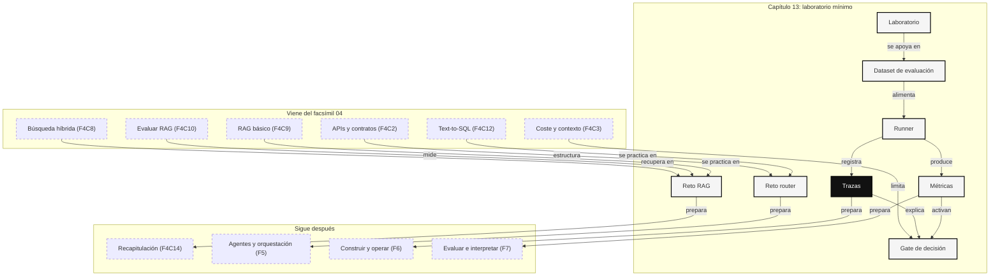

::: {.fasciculo-subtitle}
Facsímil 4 · La caja de herramientas
:::

# Capítulo 13: Laboratorio mínimo: notebooks, evals y trazas

## El lugar donde una demo se vuelve discutible

Una demo sirve para ver una posibilidad. Un laboratorio sirve para decidir si esa posibilidad aguanta un poco de realidad.

En este facsímil hemos hablado de APIs, modelos locales, tokens, costes, embeddings, RAG, evaluación, GraphRAG y Text-to-SQL. Todo eso puede quedarse en palabras si no lo llevamos a una mesa de trabajo mínima: datos pequeños, código ejecutable, métricas claras, trazas legibles y una decisión final.

Este capítulo es ese puente. No vamos a montar una plataforma industrial. Vamos a construir lo justo para que otra persona pueda ejecutar, revisar, criticar y mejorar lo que hicimos. Ese es el gesto profesional: no pedir confianza; dejar evidencia.

## Qué no es un laboratorio

Un laboratorio no es un notebook que funciona una vez en tu máquina y queda abandonado. Tampoco es una captura bonita de una respuesta acertada. Y no es una colección de librerías instaladas sin una pregunta clara.

Un laboratorio tampoco sustituye a producción. En producción aparecen permisos reales, usuarios, colas, coste variable, cambios de datos y mantenimiento. El laboratorio no pretende resolver todo eso. Pretende descubrir antes qué merece pasar a una fase más seria.

Si no sabes qué pregunta estás probando, qué métrica mirarás y qué harás si sale mal, todavía no tienes laboratorio. Tienes una exploración. Puede ser útil, pero no permite decidir.

## Qué sí debería dejar

Un laboratorio mínimo debe dejar cinco artefactos:

| Artefacto | Qué contiene | Por qué importa |
|---|---|---|
| Dataset | Casos de prueba con respuesta o fuente esperada. | Permite repetir la evaluación. |
| Runner | Código que ejecuta el sistema sobre esos casos. | Evita evaluar a mano caso por caso. |
| Métricas | Números que resumen el comportamiento. | Permite comparar versiones. |
| Trazas | Pasos internos de cada ejecución. | Permite depurar por qué falló. |
| Decisión | Pasar, parar, cambiar o medir más. | Evita terminar con “parece que va bien”. |

Los notebooks son útiles porque mezclan explicación, código y resultados. El formato Jupyter se basa en documentos JSON con celdas, salidas y metadatos, lo que permite guardar no solo código, sino también el contexto de ejecución.^[Jupyter. (2026). *The Notebook file format*. [Documentación oficial](https://nbformat.readthedocs.io/en/v5.10.1/). Consultado el 26 de mayo de 2026.] Esa flexibilidad es estupenda para aprender, pero también exige disciplina: fijar datos, ordenar celdas, limpiar salidas innecesarias y convertir lo aprendido en scripts o tests cuando el experimento empieza a importar.

En observabilidad, OpenTelemetry describe una traza como una operación formada por spans, donde cada span representa una unidad de trabajo con contexto y atributos.^[OpenTelemetry. (2026). *Tracing API*. [Documentación oficial](https://opentelemetry.io/docs/specs/otel/trace/api/). Consultado el 26 de mayo de 2026.] Nosotros haremos una versión casera: una lista de pasos con nombre, entrada, salida y metadatos. No será una herramienta de producción, pero enseñará la forma mental correcta.

## Estado de herramientas con fecha de corte

**Fecha de corte:** 26 de mayo de 2026.  
**Fuentes consultadas ese día:** documentación de Jupyter nbformat, OpenTelemetry Tracing API, OpenAI Graders, Ragas metrics, LangSmith RAG evaluation y Arize Phoenix evaluation.

OpenAI documenta graders como evaluadores usados en evals y fine-tuning, incluyendo validación de graders y ejemplos de evaluadores basados en modelos.^[OpenAI. (2026). *Graders*. [Documentación oficial](https://platform.openai.com/docs/guides/graders/). Consultado el 26 de mayo de 2026.] Ragas organiza métricas para aplicaciones RAG, entre ellas context precision y faithfulness.^[Ragas. (2026). *List of available metrics*. [Documentación oficial](https://docs.ragas.io/en/latest/concepts/metrics/available_metrics/). Consultado el 26 de mayo de 2026.] LangSmith estructura la evaluación de RAG alrededor de corrección, relevancia, groundedness y relevancia de documentos.^[LangChain. (2026). *Evaluate a RAG application*. [Documentación oficial](https://docs.langchain.com/langsmith/evaluate-rag-tutorial). Consultado el 26 de mayo de 2026.]

Phoenix separa evaluación de retrieval y evaluación de respuesta, y permite trabajar con trazas para analizar qué documentos se recuperaron y cómo se generó la respuesta.^[Arize Phoenix. (2026). *Evaluate RAG*. [Documentación oficial](https://arize.com/docs/phoenix/cookbook/evaluation/evaluate-rag). Consultado el 26 de mayo de 2026.] Su documentación de evaluación distingue evaluadores deterministas y evaluadores con modelo, y los presenta como forma de detectar regresiones y comparar cambios.^[Arize Phoenix. (2026). *Evaluation concepts*. [Documentación oficial](https://arize.com/docs/phoenix/evaluation/concepts-evals/evaluation). Consultado el 26 de mayo de 2026.]

La lección estable no depende de una marca concreta: una evaluación útil separa dataset, ejecución, métrica, trazas y decisión.

## Anatomía de un laboratorio mínimo

<svg id="f4-c13-laboratorio-minimo" xmlns="http://www.w3.org/2000/svg" viewBox="0 0 1280 820" role="img" aria-label="Laboratorio mínimo con dataset, runner, métricas, trazas y decisión">
  <defs>
    <marker id="f4c13-arrow" viewBox="0 0 10 10" refX="9" refY="5" markerWidth="7" markerHeight="7" orient="auto-start-reverse">
      <path d="M 0 0 L 10 5 L 0 10 z" fill="#111111"/>
    </marker>
    <pattern id="f4c13-grid" width="18" height="18" patternUnits="userSpaceOnUse">
      <path d="M 18 0 L 0 0 0 18" fill="none" stroke="#EEEEEE" stroke-width="1"/>
    </pattern>
  </defs>

  <rect x="24" y="24" width="1232" height="772" rx="18" fill="#FFFFFF" stroke="#111111" stroke-width="2"/>
  <text x="640" y="64" text-anchor="middle" font-family="Arial, sans-serif" font-size="26" font-weight="700" fill="#111111">Laboratorio mínimo: del caso a la decisión</text>
  <text x="640" y="92" text-anchor="middle" font-family="Arial, sans-serif" font-size="13" fill="#555555">No basta con ejecutar: hay que dejar datos, métricas, trazas y una conclusión revisable.</text>
  <rect x="62" y="124" width="1156" height="548" rx="14" fill="url(#f4c13-grid)" stroke="#DDDDDD"/>

  <g font-family="Arial, sans-serif">
    <rect x="96" y="168" width="184" height="86" rx="12" fill="#FFFFFF" stroke="#111111" stroke-width="1.5"/>
    <text x="188" y="200" text-anchor="middle" font-size="14" font-weight="700">Dataset</text>
    <text x="188" y="224" text-anchor="middle" font-size="11" fill="#555555">casos esperados</text>
    <text x="188" y="242" text-anchor="middle" font-size="11" fill="#555555">fuentes y límites</text>

    <line x1="280" y1="211" x2="330" y2="211" stroke="#111111" stroke-width="1.4" marker-end="url(#f4c13-arrow)"/>
    <rect x="330" y="168" width="184" height="86" rx="12" fill="#111111" stroke="#111111" stroke-width="1.5"/>
    <text x="422" y="200" text-anchor="middle" font-size="14" font-weight="700" fill="#FFFFFF">Runner</text>
    <text x="422" y="224" text-anchor="middle" font-size="11" fill="#E8E8E8">ejecuta variantes</text>
    <text x="422" y="242" text-anchor="middle" font-size="11" fill="#E8E8E8">sin tocar los casos</text>

    <line x1="514" y1="211" x2="564" y2="211" stroke="#111111" stroke-width="1.4" marker-end="url(#f4c13-arrow)"/>
    <rect x="564" y="168" width="184" height="86" rx="12" fill="#FFFFFF" stroke="#111111" stroke-width="1.5"/>
    <text x="656" y="200" text-anchor="middle" font-size="14" font-weight="700">Sistema</text>
    <text x="656" y="224" text-anchor="middle" font-size="11" fill="#555555">RAG, tool, SQL</text>
    <text x="656" y="242" text-anchor="middle" font-size="11" fill="#555555">o regla clásica</text>

    <line x1="748" y1="211" x2="798" y2="211" stroke="#111111" stroke-width="1.4" marker-end="url(#f4c13-arrow)"/>
    <rect x="798" y="168" width="184" height="86" rx="12" fill="#FFFFFF" stroke="#111111" stroke-width="1.5"/>
    <text x="890" y="200" text-anchor="middle" font-size="14" font-weight="700">Métricas</text>
    <text x="890" y="224" text-anchor="middle" font-size="11" fill="#555555">hit, groundedness</text>
    <text x="890" y="242" text-anchor="middle" font-size="11" fill="#555555">coste, latencia</text>

    <line x1="982" y1="211" x2="1032" y2="211" stroke="#111111" stroke-width="1.4" marker-end="url(#f4c13-arrow)"/>
    <rect x="1032" y="168" width="136" height="86" rx="12" fill="#111111" stroke="#111111" stroke-width="1.5"/>
    <text x="1100" y="200" text-anchor="middle" font-size="14" font-weight="700" fill="#FFFFFF">Decisión</text>
    <text x="1100" y="224" text-anchor="middle" font-size="11" fill="#E8E8E8">pasar, parar</text>
    <text x="1100" y="242" text-anchor="middle" font-size="11" fill="#E8E8E8">o cambiar</text>

    <rect x="188" y="374" width="230" height="96" rx="12" fill="#FFFFFF" stroke="#111111" stroke-width="1.4"/>
    <text x="303" y="406" text-anchor="middle" font-size="14" font-weight="700">Manifest</text>
    <text x="303" y="430" text-anchor="middle" font-size="11" fill="#555555">versión, datos, entorno</text>
    <text x="303" y="448" text-anchor="middle" font-size="11" fill="#555555">configuración usada</text>

    <rect x="526" y="374" width="230" height="96" rx="12" fill="#111111" stroke="#111111" stroke-width="1.4"/>
    <text x="641" y="406" text-anchor="middle" font-size="14" font-weight="700" fill="#FFFFFF">Trazas</text>
    <text x="641" y="430" text-anchor="middle" font-size="11" fill="#E8E8E8">route, retrieve, generate</text>
    <text x="641" y="448" text-anchor="middle" font-size="11" fill="#E8E8E8">eval, tool, error</text>

    <rect x="864" y="374" width="230" height="96" rx="12" fill="#FFFFFF" stroke="#111111" stroke-width="1.4"/>
    <text x="979" y="406" text-anchor="middle" font-size="14" font-weight="700">Gate</text>
    <text x="979" y="430" text-anchor="middle" font-size="11" fill="#555555">umbrales mínimos</text>
    <text x="979" y="448" text-anchor="middle" font-size="11" fill="#555555">para avanzar</text>

    <path d="M422 254 C422 320, 303 320, 303 374" stroke="#111111" stroke-width="1.2" fill="none" marker-end="url(#f4c13-arrow)"/>
    <path d="M656 254 C656 320, 641 320, 641 374" stroke="#111111" stroke-width="1.2" fill="none" marker-end="url(#f4c13-arrow)"/>
    <path d="M890 254 C890 320, 979 320, 979 374" stroke="#111111" stroke-width="1.2" fill="none" marker-end="url(#f4c13-arrow)"/>

    <rect x="268" y="580" width="744" height="46" rx="12" fill="#111111"/>
    <text x="640" y="609" text-anchor="middle" font-size="13" font-weight="700" fill="#FFFFFF">Un laboratorio termina cuando permite tomar una decisión, no cuando imprime una respuesta.</text>
  </g>

  <text x="1226" y="764" text-anchor="end" font-family="Arial, sans-serif" font-size="11" fill="#888888">IA para gente curiosa / Facsímil 04 / Capítulo 13 / 686f6c61</text>
</svg>

La figura puede leerse de izquierda a derecha: parto de casos, ejecuto variantes, observo resultados y decido. Debajo aparecen las tres piezas que suelen faltar en las demos: manifest, trazas y gate.

## Laboratorio

Un laboratorio, dentro de este libro, es una práctica guiada para poner en juego los conceptos del facsímil. Aquí no buscamos impresionar con una respuesta aislada. Buscamos construir algo pequeño que se pueda ejecutar, medir, explicar y corregir.

En este laboratorio vamos a tocar cuatro zonas del facsímil:

- Del capítulo 2: contratos, tools y salidas estructuradas.
- Del capítulo 3: coste, contexto y disciplina de ejecución.
- De los capítulos 7, 8, 9 y 10: embeddings, búsqueda, RAG y evaluación.
- Del capítulo 12: herramientas de datos, SQL, permisos, trazas y validación.

Los dos retos dejan solución completa. La idea no es esconder la respuesta, sino enseñar cómo piensa alguien que quiere llevar una idea desde “parece que funciona” hasta “puedo defender esta decisión”.

El kit real está en:

```text
labs/f4/laboratorio-tools-evals/
```

El capítulo muestra la lógica paso a paso. El kit deja los artefactos ejecutables: datos, contratos, scripts, trazas, gates y checker.

### Reto 1: evaluar un mini RAG con trazas reproducibles

#### Contexto

Imagina que una escuela quiere un asistente interno para responder dudas administrativas. Hay documentos vigentes, documentos antiguos y preguntas donde el sistema debería decir “no tengo evidencia suficiente”.

Un RAG básico podría responder muy bien en una demo. Pero antes de confiar en él necesitamos saber tres cosas: si recupera el documento correcto, si evita documentos no vigentes y si deja una traza para depurar los fallos.

#### Objetivo

Construir un harness mínimo de evaluación RAG con Python puro. Debe ejecutar un conjunto de casos, recuperar documentos, decidir una respuesta sencilla, calcular métricas y guardar trazas.

Esto sale del capítulo 09, donde construimos RAG como recuperación más generación; del capítulo 10, donde medimos retrieval y groundedness; y del capítulo 14, donde decimos que una solución sin trazas sigue siendo una demo.

En el kit se ejecuta así:

```bash
cd labs/f4/laboratorio-tools-evals
python3 ops/evaluate_mini_rag.py --write
python3 -m json.tool output/ci_rag_gate.json
cat output/rag_decision.md
```

#### Material base

Tendremos cinco documentos:

| ID | Estado | Texto |
|---|---|---|
| `matricula_vigente` | vigente | La matrícula ordinaria se puede modificar hasta el 15 de septiembre. |
| `matricula_antigua` | sustituido | La matrícula ordinaria se podía modificar hasta el 1 de septiembre. |
| `becas_vigente` | vigente | Las becas internas se revisan en dos fases: documentación y entrevista. |
| `pagos_vigente` | vigente | Los pagos pendientes se consultan en el panel económico por campus. |
| `soporte_vigente` | vigente | Las incidencias de acceso se atienden desde el portal de soporte. |

Y cuatro casos de evaluación:

| Caso | Pregunta | Documento esperado | Debe responder |
|---|---|---|---|
| `c1` | ¿Hasta cuándo puedo modificar la matrícula? | `matricula_vigente` | Sí |
| `c2` | ¿Cómo se revisan las becas internas? | `becas_vigente` | Sí |
| `c3` | ¿Cuántos pagos pendientes hay por campus? | `pagos_vigente` | No con RAG textual |
| `c4` | ¿Cuál es el horario de cafetería? | Ninguno | No |

El tercer caso es importante. El documento habla de dónde consultar pagos, pero no contiene el número. Una respuesta honesta debe reconocer que necesita una herramienta de datos.

#### Enunciado

1. Representa documentos y casos como estructuras de datos.
2. Implementa recuperación léxica con filtro de documentos vigentes.
3. Guarda una traza con spans para cada caso.
4. Calcula Hit@1, MRR, tasa de abstención correcta y cobertura de trazas.
5. Decide si el RAG puede avanzar o qué habría que mejorar.

#### Resolución paso a paso

Primero hacemos explícito qué medimos.

$$
\operatorname{Hit@1} =
\frac{\text{casos donde el primer documento es el esperado}}
{\text{casos con documento esperado}}
$$

| Símbolo | Significado | En este reto |
|---|---|---|
| Hit@1 | Acierto en primera posición | Si `matricula_vigente` sale primero en `c1`. |
| Casos con documento esperado | Preguntas que sí tienen fuente textual | `c1`, `c2`, `c3`. |
| Documento esperado | Fuente que debería aparecer | Campo `expected_doc`. |

MRR mide en qué posición aparece el primer resultado correcto:

$$
\operatorname{MRR} =
\frac{1}{N}\sum_{i=1}^{N}\frac{1}{\operatorname{rank}_i}
$$

| Símbolo | Significado | En este reto |
|---|---|---|
| \(N\) | Número de casos con fuente esperada | Tres casos. |
| \(\operatorname{rank}_i\) | Posición del documento esperado | 1 si sale primero, 2 si sale segundo. |
| \(\frac{1}{\operatorname{rank}_i}\) | Premio por encontrar pronto | 1.0 si sale primero, 0.5 si sale segundo. |

Ahora programamos el laboratorio.

```python
from collections import Counter
import json
import math
import re
import time
import uuid


DOCUMENTS = [
    {
        "id": "matricula_vigente",
        "status": "vigente",
        "text": "La matrícula ordinaria se puede modificar hasta el 15 de septiembre.",
    },
    {
        "id": "matricula_antigua",
        "status": "sustituido",
        "text": "La matrícula ordinaria se podía modificar hasta el 1 de septiembre.",
    },
    {
        "id": "becas_vigente",
        "status": "vigente",
        "text": "Las becas internas se revisan en dos fases: documentación y entrevista.",
    },
    {
        "id": "pagos_vigente",
        "status": "vigente",
        "text": "Los pagos pendientes se consultan en el panel económico por campus.",
    },
    {
        "id": "soporte_vigente",
        "status": "vigente",
        "text": "Las incidencias de acceso se atienden desde el portal de soporte.",
    },
]

CASES = [
    {
        "id": "c1",
        "question": "¿Hasta cuándo puedo modificar la matrícula?",
        "expected_doc": "matricula_vigente",
        "should_answer": True,
    },
    {
        "id": "c2",
        "question": "¿Cómo se revisan las becas internas?",
        "expected_doc": "becas_vigente",
        "should_answer": True,
    },
    {
        "id": "c3",
        "question": "¿Cuántos pagos pendientes hay por campus?",
        "expected_doc": "pagos_vigente",
        "should_answer": False,
        "reason": "La pregunta pide un número vivo, no una explicación documental.",
    },
    {
        "id": "c4",
        "question": "¿Cuál es el horario de cafetería?",
        "expected_doc": None,
        "should_answer": False,
        "reason": "No hay documento sobre cafetería.",
    },
]

STOPWORDS = {
    "a",
    "al",
    "como",
    "con",
    "cual",
    "cuando",
    "cuantos",
    "de",
    "del",
    "desde",
    "donde",
    "el",
    "en",
    "es",
    "hasta",
    "la",
    "las",
    "lo",
    "los",
    "me",
    "mi",
    "no",
    "por",
    "puedo",
    "que",
    "se",
    "un",
    "una",
    "y",
}


def tokens(text):
    return [
        token
        for token in re.findall(r"[a-záéíóúñ0-9]+", text.lower())
        if token not in STOPWORDS
    ]


def vector(text):
    return Counter(tokens(text))


def score(query, document):
    q = vector(query)
    d = vector(document["text"])
    overlap = sum(min(q[t], d[t]) for t in q)
    if overlap == 0:
        return 0.0
    return overlap / math.sqrt(sum(v * v for v in d.values()))


def trace_span(trace, name, **attrs):
    trace["spans"].append(
        {
            "name": name,
            "timestamp_ms": int(time.time() * 1000),
            "attrs": attrs,
        }
    )


def retrieve(case, top_k=2):
    trace = {"trace_id": str(uuid.uuid4()), "case_id": case["id"], "spans": []}
    trace_span(trace, "input", question=case["question"])

    candidates = [doc for doc in DOCUMENTS if doc["status"] == "vigente"]
    trace_span(trace, "filter_documents", candidates=[doc["id"] for doc in candidates])

    ranked = sorted(
        ((score(case["question"], doc), doc["id"], doc["text"]) for doc in candidates),
        reverse=True,
    )
    ranked = [item for item in ranked if item[0] > 0][:top_k]
    trace_span(trace, "retrieve", results=[doc_id for _, doc_id, _ in ranked])

    answerable = case["should_answer"] and bool(ranked)
    if not answerable:
        answer = "No tengo evidencia suficiente para responder con este RAG."
    else:
        answer = ranked[0][2]
    trace_span(trace, "generate", answer=answer, answerable=answerable)

    return {
        "case_id": case["id"],
        "expected_doc": case["expected_doc"],
        "should_answer": case["should_answer"],
        "ranked_docs": [doc_id for _, doc_id, _ in ranked],
        "answer": answer,
        "trace": trace,
    }


def reciprocal_rank(expected_doc, ranked_docs):
    if expected_doc is None:
        return None
    if expected_doc not in ranked_docs:
        return 0.0
    return 1.0 / (ranked_docs.index(expected_doc) + 1)


def evaluate(results):
    with_expected = [r for r in results if r["expected_doc"] is not None]
    hit_at_1 = sum(
        r["ranked_docs"][:1] == [r["expected_doc"]] for r in with_expected
    ) / len(with_expected)

    rr_values = [reciprocal_rank(r["expected_doc"], r["ranked_docs"]) for r in with_expected]
    mrr = sum(rr_values) / len(rr_values)

    abstention_ok = sum(
        (not r["should_answer"]) == r["answer"].startswith("No tengo evidencia")
        for r in results
    ) / len(results)

    trace_ok = sum(len(r["trace"]["spans"]) >= 4 for r in results) / len(results)

    return {
        "hit@1": round(hit_at_1, 2),
        "mrr": round(mrr, 2),
        "abstention_ok": round(abstention_ok, 2),
        "trace_ok": round(trace_ok, 2),
    }


results = [retrieve(case) for case in CASES]
metrics = evaluate(results)

print("Métricas")
print(json.dumps(metrics, ensure_ascii=False, indent=2))

print("\nTrazas resumidas")
for result in results:
    span_names = [span["name"] for span in result["trace"]["spans"]]
    print(result["case_id"], result["ranked_docs"], span_names)
```

#### Salida esperada

```text
Métricas
{
  "hit@1": 1.0,
  "mrr": 1.0,
  "abstention_ok": 1.0,
  "trace_ok": 1.0
}

Trazas resumidas
c1 ['matricula_vigente'] ['input', 'filter_documents', 'retrieve', 'generate']
c2 ['becas_vigente'] ['input', 'filter_documents', 'retrieve', 'generate']
c3 ['pagos_vigente'] ['input', 'filter_documents', 'retrieve', 'generate']
c4 [] ['input', 'filter_documents', 'retrieve', 'generate']
```

#### Solución

El resultado pasa el gate mínimo:

| Métrica | Valor esperado | Lectura |
|---|---:|---|
| Hit@1 | 1.0 | Cuando hay documento esperado, aparece primero. |
| MRR | 1.0 | El documento esperado aparece en la primera posición. |
| Abstención correcta | 1.0 | El sistema no responde cuando no debe. |
| Trazas completas | 1.0 | Cada caso deja pasos mínimos para depurar. |

El caso `c3` enseña la parte más importante: recuperar `pagos_vigente` no autoriza inventar un número. El documento sirve para saber dónde consultar pagos. La pregunta pide una cifra viva, así que la respuesta correcta para este RAG textual es abstenerse y derivar a una herramienta de datos.

#### Por qué funciona

Este reto junta varias piezas del facsímil:

- Capítulo 08: usamos filtro de metadatos para evitar documentos sustituidos.
- Capítulo 09: separamos recuperación y generación.
- Capítulo 10: medimos retrieval y abstención.
- Capítulo 12: reconocemos cuándo una pregunta documental pasa a ser una pregunta de datos.

La clave es que el laboratorio no solo mide respuestas. Mide piezas: si recuperó, si debía responder, si dejó traza y si el resultado permite decidir.

#### Cómo explicarlo a otra persona

"No hemos preguntado si el asistente suena bien. Hemos preparado cuatro casos, sabemos qué fuente debería recuperar, comprobamos si responde solo cuando toca y guardamos los pasos. Si falla, sabremos si falló buscando, filtrando o decidiendo responder."

#### Variaciones

- Cambia el estado de `matricula_antigua` a `vigente` y observa si aparece ruido.
- Añade una métrica `precision@2`.
- Añade un campo `source_status` en la traza de retrieval.
- Añade un caso donde el documento correcto sale segundo y revisa cómo baja MRR.

### Reto 2: decidir ruta entre RAG, SQL, clasificador y cálculo

#### Contexto

Ahora queremos probar una idea más cercana a producto. Una misma interfaz recibe preguntas distintas: algunas son documentales, otras piden datos, otras clasifican tickets y otras son cálculos exactos.

No queremos un agente complejo todavía. Queremos un laboratorio mínimo que enrute cada caso a la herramienta adecuada y mida si la decisión fue correcta. Esto prepara el paso al facsímil 5, donde sí hablaremos de orquestación con más profundidad.

#### Objetivo

Construir un router pequeño con cuatro rutas:

| Ruta | Uso |
|---|---|
| `rag` | Preguntas sobre documentos. |
| `sql` | Preguntas sobre datos tabulares. |
| `classifier` | Clasificación estructurada de tickets. |
| `code` | Cálculo determinista sin modelo. |

El sistema debe devolver una salida estructurada y una traza. La evaluación debe medir si eligió la ruta correcta, si produjo el resultado esperado y si dejó evidencia suficiente.

En el kit se ejecuta así:

```bash
cd labs/f4/laboratorio-tools-evals
python3 ops/evaluate_router.py --write
python3 -m json.tool output/ci_router_gate.json
cat output/router_decision.md
```

#### Material base

Casos:

| Caso | Entrada | Ruta esperada |
|---|---|---|
| `r1` | ¿Hasta cuándo puedo modificar la matrícula? | `rag` |
| `r2` | ¿Cuántos pagos pendientes hay por campus? | `sql` |
| `r3` | Clasifica: no puedo entrar en mi cuenta | `classifier` |
| `r4` | Suma 230 y 515 | `code` |

Este reto fuerza una idea del capítulo 01: no todo se arregla con la misma herramienta.

#### Enunciado

1. Define casos con ruta esperada y resultado esperado.
2. Implementa cuatro herramientas mínimas.
3. Implementa un router explicable.
4. Registra spans `route`, `tool` y `evaluate`.
5. Calcula `route_accuracy`, `task_pass_rate` y `trace_complete_rate`.
6. Decide si el router puede avanzar al laboratorio del capítulo 14 o debe corregirse.

#### Resolución paso a paso

Primero definimos qué significa pasar:

$$
\operatorname{route\_accuracy} =
\frac{\text{casos con ruta correcta}}{\text{casos totales}}
$$

$$
\operatorname{task\_pass\_rate} =
\frac{\text{casos con resultado correcto}}{\text{casos totales}}
$$

| Métrica | Pregunta que responde | Por qué importa |
|---|---|---|
| Route accuracy | ¿Elegimos la herramienta correcta? | Un buen resultado por casualidad no basta. |
| Task pass rate | ¿El caso terminó bien? | Mide utilidad visible. |
| Trace complete rate | ¿Podemos depurar cada caso? | Sin traza, no hay aprendizaje reproducible. |

Ahora el código.

```python
import json
import re
import sqlite3
import time
import uuid


DOCS = {
    "matricula": "La matrícula ordinaria se puede modificar hasta el 15 de septiembre.",
    "becas": "Las becas internas se revisan en dos fases.",
}

CASES = [
    {
        "id": "r1",
        "input": "¿Hasta cuándo puedo modificar la matrícula?",
        "expected_route": "rag",
        "expected_contains": "15 de septiembre",
    },
    {
        "id": "r2",
        "input": "¿Cuántos pagos pendientes hay por campus?",
        "expected_route": "sql",
        "expected_contains": "Norte: 2",
    },
    {
        "id": "r3",
        "input": "Clasifica: no puedo entrar en mi cuenta",
        "expected_route": "classifier",
        "expected_contains": "acceso",
    },
    {
        "id": "r4",
        "input": "Suma 230 y 515",
        "expected_route": "code",
        "expected_contains": "745",
    },
]


def new_trace(case_id):
    return {"trace_id": str(uuid.uuid4()), "case_id": case_id, "spans": []}


def span(trace, name, **attrs):
    trace["spans"].append(
        {"name": name, "timestamp_ms": int(time.time() * 1000), "attrs": attrs}
    )


def route(text):
    lower = text.lower()
    if "suma" in lower or re.search(r"\d+\s+y\s+\d+", lower):
        return "code", "la entrada pide cálculo exacto"
    if "cuántos" in lower or "pagos pendientes" in lower:
        return "sql", "la entrada pide datos agregados"
    if "clasifica" in lower:
        return "classifier", "la entrada pide etiqueta estructurada"
    return "rag", "la entrada pregunta por documentación"


def tool_rag(text):
    if "matrícula" in text.lower() or "matricula" in text.lower():
        return {"answer": DOCS["matricula"], "evidence": ["matricula"]}
    return {"answer": "No tengo evidencia suficiente.", "evidence": []}


def tool_sql(_text):
    con = sqlite3.connect(":memory:")
    con.execute("CREATE TABLE pagos (campus TEXT, estado TEXT)")
    con.executemany(
        "INSERT INTO pagos VALUES (?, ?)",
        [
            ("Norte", "pendiente"),
            ("Norte", "pendiente"),
            ("Sur", "pagado"),
            ("Centro", "pendiente"),
        ],
    )
    rows = con.execute("""
        SELECT campus, COUNT(*) AS pagos
        FROM pagos
        WHERE estado = 'pendiente'
        GROUP BY campus
        ORDER BY pagos DESC, campus ASC
    """).fetchall()
    answer = "; ".join(f"{campus}: {count}" for campus, count in rows)
    return {"answer": answer, "evidence": ["sql:pagos"]}


def tool_classifier(text):
    lower = text.lower()
    if "entrar" in lower or "cuenta" in lower:
        category = "acceso"
    elif "factura" in lower:
        category = "facturacion"
    else:
        category = "general"
    return {"answer": json.dumps({"categoria": category}, ensure_ascii=False), "evidence": ["rules:ticket"]}


def tool_code(text):
    numbers = [int(n) for n in re.findall(r"\d+", text)]
    return {"answer": str(sum(numbers)), "evidence": ["python:sum"]}


TOOLS = {
    "rag": tool_rag,
    "sql": tool_sql,
    "classifier": tool_classifier,
    "code": tool_code,
}


def run_case(case):
    trace = new_trace(case["id"])
    selected_route, reason = route(case["input"])
    span(trace, "route", selected_route=selected_route, reason=reason)

    result = TOOLS[selected_route](case["input"])
    span(trace, "tool", route=selected_route, evidence=result["evidence"])

    route_ok = selected_route == case["expected_route"]
    task_ok = case["expected_contains"] in result["answer"]
    span(trace, "evaluate", route_ok=route_ok, task_ok=task_ok)

    return {
        "case_id": case["id"],
        "route": selected_route,
        "answer": result["answer"],
        "route_ok": route_ok,
        "task_ok": task_ok,
        "trace": trace,
    }


def summarize(results):
    total = len(results)
    return {
        "route_accuracy": sum(r["route_ok"] for r in results) / total,
        "task_pass_rate": sum(r["task_ok"] for r in results) / total,
        "trace_complete_rate": sum(len(r["trace"]["spans"]) == 3 for r in results) / total,
    }


results = [run_case(case) for case in CASES]
metrics = summarize(results)

for result in results:
    print(result["case_id"], result["route"], result["answer"])

print(json.dumps(metrics, indent=2))
```

#### Salida esperada

```text
r1 rag La matrícula ordinaria se puede modificar hasta el 15 de septiembre.
r2 sql Norte: 2; Centro: 1
r3 classifier {"categoria": "acceso"}
r4 code 745
{
  "route_accuracy": 1.0,
  "task_pass_rate": 1.0,
  "trace_complete_rate": 1.0
}
```

#### Solución

El router pasa el gate mínimo:

| Caso | Ruta elegida | Por qué es correcta |
|---|---|---|
| `r1` | `rag` | La respuesta vive en un documento. |
| `r2` | `sql` | La pregunta pide una agregación sobre datos. |
| `r3` | `classifier` | La salida esperada es una categoría estructurada. |
| `r4` | `code` | Es un cálculo exacto; no necesita modelo. |

El resultado más valioso quizá sea `r4`. Nos recuerda que la caja de herramientas incluye no usar IA generativa cuando una operación determinista resuelve mejor.

#### Por qué funciona

Este reto junta casi todo el facsímil:

- Capítulo 01: elegimos intervención según el cuello real.
- Capítulo 02: devolvemos salidas estructuradas en el clasificador.
- Capítulo 09: usamos RAG solo para documentación.
- Capítulo 12: usamos SQL cuando la respuesta está en datos.
- Capítulo 14: dejamos trazas y métricas antes de confiar.

La frontera con agentes está muy cerca, pero todavía no la cruzamos del todo. Aquí el router es simple y explicable. Eso es una virtud: si falla, sabemos dónde mirar.

#### Cómo explicarlo a otra persona

"Hemos construido una ventanilla que no responde todo igual. Si la pregunta va de documentos, busca documentos. Si pide datos, consulta una tabla. Si pide clasificación, devuelve una categoría. Si pide una suma, usa código. Además, deja una traza para saber qué ruta eligió y si acertó."

#### Variaciones

- Añade una ruta `human_review` para preguntas ambiguas.
- Añade un presupuesto máximo de latencia por ruta.
- Añade un caso que parezca documental pero necesite SQL.
- Cambia el router para devolver también una confianza y decide cuándo pedir aclaración.

#### Validar la entrega

La solución de referencia se valida con:

```bash
cd labs/f4/laboratorio-tools-evals
python3 ops/check_student_submission.py --submission-dir solutions/reference --write
```

Para una entrega propia:

```bash
python3 ops/check_student_submission.py --submission-dir solutions/mi-equipo --write --fail-on-missing
```

La referencia obtiene `70/70`. La carpeta esperada es:

```text
tools-evals-release/
  rag_eval_report.json
  ci_rag_gate.json
  rag_traces.jsonl
  rag_decision.md
  router_eval_report.json
  ci_router_gate.json
  router_traces.jsonl
  router_decision.md
```

### Cierre del laboratorio

Si has trabajado los dos retos, ya has hecho lo esencial de un laboratorio de IA: preparar casos, ejecutar una variante, medir resultados, guardar trazas y convertir los números en una decisión.

El primer reto te obligó a mirar un RAG por dentro. El segundo te obligó a decidir qué herramienta usar para cada tipo de petición. Esa es la idea central del facsímil 4: la caja de herramientas no vale por la cantidad de piezas, sino por saber cuándo usar cada una y cómo comprobar que funcionó.

Lo que viene después, en agentes y orquestación, no cambia esta base. La amplifica. Cuantas más herramientas coordine un sistema, más importante será medir rutas, permisos, coste, evidencia y trazas.

## Cómo encaja todo



## Vocabulario aprendido

| Término | Definición |
|---|---|
| **Laboratorio** | Espacio reproducible para probar una idea con casos, métricas y trazas. |
| **Notebook** | Documento ejecutable que mezcla explicación, código, salidas y metadatos. |
| **Eval** | Prueba sistemática para medir si un sistema cumple un comportamiento esperado. |
| **Dataset de evaluación** | Conjunto de casos con entradas, resultados esperados y criterios de aceptación. |
| **Traza** | Registro estructurado de los pasos que produjeron una respuesta. |
| **Span** | Paso concreto dentro de una traza. |
| **Hit@k** | Indica si el resultado esperado aparece entre los k primeros. |
| **MRR** | Media del inverso de la posición del primer resultado correcto. |
| **Gate** | Umbral o regla que decide si una variante puede avanzar. |
| **Manifest** | Registro de versión, datos, entorno y configuración del experimento. |

## Dónde solía tropezar yo

| Error | Por qué es un error | Antídoto |
|---|---|---|
| **Confundir notebook con laboratorio** | Un notebook puede ejecutar sin dejar decisión ni reproducibilidad. | Añadir dataset, métricas, manifest y conclusión. |
| **Medir solo la respuesta final** | No sabes si falló retrieval, routing, herramienta o generación. | Medir por capas y guardar spans. |
| **No incluir casos donde debe abstenerse** | El sistema aprende a contestar siempre. | Añadir casos sin evidencia suficiente. |
| **Cambiar prompt y dataset a la vez** | Si mejora, no sabes qué lo causó. | Fijar dataset y cambiar una variable por experimento. |
| **No poner gate** | La evaluación queda como un informe decorativo. | Definir umbrales antes de mirar resultados. |
| **Olvidar que una regla puede ser mejor** | Algunas rutas no necesitan modelo generativo. | Comparar contra SQL, código o reglas simples. |

## Antes de pasar página

- [ ] ¿Puedo explicar la diferencia entre demo, notebook y laboratorio?
- [ ] ¿Sé qué debe contener un dataset de evaluación mínimo?
- [ ] ¿Puedo calcular Hit@1 y MRR con un ejemplo pequeño?
- [ ] ¿Sé por qué una traza se divide en spans?
- [ ] ¿Puedo distinguir evaluación de retrieval, respuesta, ruta y herramienta?
- [ ] ¿Sé diseñar un caso donde el sistema debe abstenerse?
- [ ] ¿Puedo explicar por qué un documento recuperado no siempre autoriza responder?
- [ ] ¿Sé cuándo usar RAG, SQL, clasificador o cálculo determinista?
- [ ] ¿Puedo definir un gate antes de ejecutar el experimento?
- [ ] ¿He ejecutado los dos retos y revisado al menos una traza?

## En resumen

| Idea fuerza | Detalle |
|---|---|
| Un laboratorio no es una demo. | Debe dejar casos, métricas, trazas y decisión. |
| El dataset manda. | Sin casos fijos, no puedes comparar variantes con rigor. |
| Las trazas explican los fallos. | Permiten saber si falló recuperar, enrutar, ejecutar o evaluar. |
| La abstención también se evalúa. | Un sistema útil debe saber cuándo no tiene evidencia suficiente. |
| El router prepara agentes. | Antes de orquestar muchas herramientas, hay que medir rutas simples. |
| El gate cierra el ciclo. | Una métrica solo sirve si cambia una decisión. |

## Para saber más

Arize Phoenix. (2026). *Evaluate RAG*. [Documentación oficial](https://arize.com/docs/phoenix/cookbook/evaluation/evaluate-rag)

Arize Phoenix. (2026). *Evaluation concepts*. [Documentación oficial](https://arize.com/docs/phoenix/evaluation/concepts-evals/evaluation)

Cormack, G. V., Clarke, C. L. A. y Büttcher, S. (2009). *Reciprocal rank fusion outperforms Condorcet and individual rank learning methods*. *Proceedings of SIGIR*, 758-759. [DOI](https://doi.org/10.1145/1571941.1572114)

Johnson, J., Douze, M. y Jégou, H. (2019). *Billion-scale similarity search with GPUs*. *IEEE Transactions on Big Data*, 7(3), 535-547. [DOI](https://doi.org/10.1109/TBDATA.2019.2921572)

Jupyter. (2026). *The Notebook file format*. [Documentación oficial](https://nbformat.readthedocs.io/en/v5.10.1/)

LangChain. (2026). *Evaluate a RAG application*. [Documentación oficial](https://docs.langchain.com/langsmith/evaluate-rag-tutorial)

Lewis, P. et al. (2020). *Retrieval-Augmented Generation for Knowledge-Intensive NLP Tasks*. *Advances in Neural Information Processing Systems 33*, 9459-9474. [NeurIPS](https://papers.nips.cc/paper/2020/hash/6b493230205f780e1bc26945df7481e5-Abstract.html)

OpenAI. (2026). *Graders*. [Documentación oficial](https://platform.openai.com/docs/guides/graders/)

OpenTelemetry. (2026). *Tracing API*. [Documentación oficial](https://opentelemetry.io/docs/specs/otel/trace/api/)

Ragas. (2026). *List of available metrics*. [Documentación oficial](https://docs.ragas.io/en/latest/concepts/metrics/available_metrics/)

Robertson, S. y Zaragoza, H. (2009). *The probabilistic relevance framework: BM25 and beyond*. *Foundations and Trends in Information Retrieval*, 3(4), 333-389. [DOI](https://doi.org/10.1561/1500000019)
