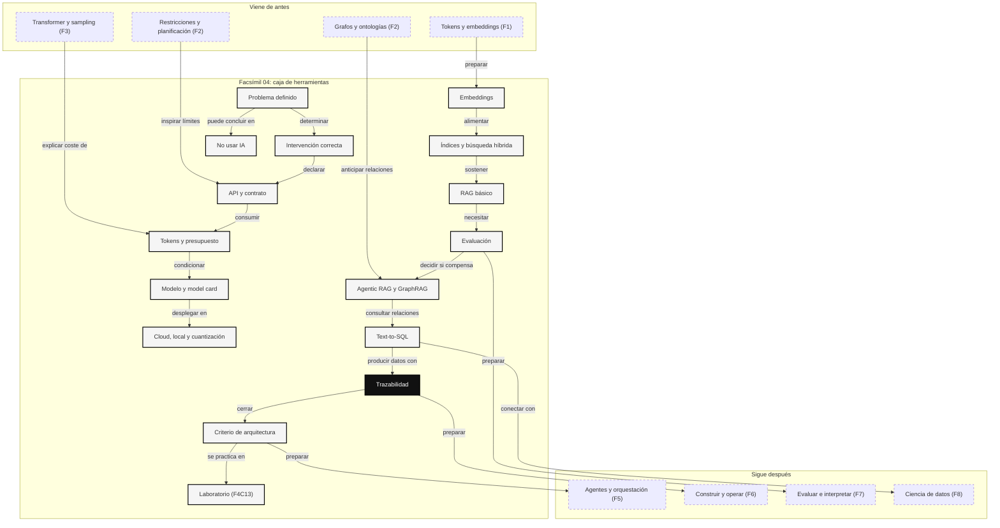

::: {.fasciculo-subtitle}
Facsímil 4 · La caja de herramientas
:::

# Capítulo 14: Lo que deberías saber: la caja de herramientas

## Entrando en el cierre

Este facsímil empezó con una pregunta muy práctica: cuando un sistema de IA no hace lo que necesitas, ¿qué cambias exactamente?

Podrías cambiar el prompt. Podrías exigir una salida estructurada. Podrías añadir documentos con RAG. Podrías conectar una herramienta. Podrías elegir otro modelo. Podrías servirlo en local. Podrías usar embeddings, bases vectoriales, búsqueda híbrida, evaluación, GraphRAG o Text-to-SQL. La caja ya no está vacía.

Pero tener herramientas no significa tener criterio. Un equipo puede complicar una solución hasta que nadie la entiende. También puede quedarse corto y llamar “IA” a una demo que no soporta coste, permisos, datos reales ni evaluación. Este capítulo es una revisión activa: no busca que recuerdes nombres, sino que puedas justificar decisiones.

Si has entendido el facsímil, deberías poder mirar un caso y decir con calma: qué problema hay, qué intervención toca, qué contrato hace falta, qué métrica lo prueba, qué coste introduce y qué pasaría si mañana cambia el dato, el modelo o el usuario.

El [capítulo 13](/libro/fasciculo-04/#capitulo-13) es el lugar donde esto se practica con las manos: notebooks, evaluaciones y trazas. Este capítulo 14 hace otra cosa: te da la brújula para revisar lo construido. Si el laboratorio es el banco de pruebas, esta recapitulación es la conversación técnica posterior: qué hemos aprendido, qué sigue flojo y qué ya podríamos defender delante de otra persona.

## Fecha de corte y alcance

**Fecha de corte:** 26 de mayo de 2026.  
**Alcance:** este cierre resume mecanismos estables del facsímil y referencias ya trabajadas: function calling, salidas estructuradas, prompt caching, model cards, LoRA, QLoRA, RAG, búsqueda vectorial, búsqueda híbrida, evaluación RAG, GraphRAG y Text-to-SQL.

Las herramientas concretas cambiarán. Los nombres de APIs, modelos, precios, runtimes y proveedores se moverán. El criterio que queremos conservar es más estable: separar entrada, contexto, herramienta, pesos, despliegue, evaluación y trazas.

## Qué debería llevarse cada perfil

Este libro está escrito para gente curiosa con o sin perfil técnico. Eso no significa que todo el mundo tenga que llevarse lo mismo. Significa que cada persona debería poder salir con una forma más precisa de mirar un sistema de IA.

| Perfil | Debería poder hacer al terminar este facsímil | Pregunta que ya no debería aceptar sin más |
|---|---|---|
| Ingeniería | Diseñar una arquitectura mínima con contratos, permisos, trazas y evaluación. | “¿Y si le ponemos un agente?” |
| Datos | Separar pregunta documental, búsqueda semántica, métrica, SQL y validación de resultados. | “¿El modelo ya sabe los datos?” |
| Producto | Decidir si una función merece prompt, RAG, tool, ajuste, modelo local o nada de IA. | “¿Podemos meter IA aquí?” |
| Docencia | Explicar cada herramienta con un ejemplo pequeño, una limitación y una prueba. | “¿Esto funciona porque lo he visto en una demo?” |
| Persona curiosa | Preguntar qué entra, qué sale, qué se mide, qué cuesta y qué pasa cuando no hay evidencia. | “¿La IA lo ha dicho, entonces será verdad?” |

El punto común es el criterio. La persona técnica lo aplicará escribiendo código, definiendo contratos o levantando infraestructura. La persona no técnica lo aplicará haciendo mejores preguntas, detectando promesas débiles y pidiendo pruebas antes de confiar.

## La brújula: qué quieres cambiar

La pregunta más importante del facsímil no es “¿qué herramienta está de moda?”. Es esta:

> ¿Dónde está el cuello del problema?

Cada intervención cambia una parte distinta del sistema. Si confundes la parte, puedes trabajar mucho y mejorar poco.

| Si el problema está en... | Intervención natural | Qué cambia | Qué no arregla |
|---|---|---|---|
| Instrucción confusa | Prompt, ejemplos, formato | La entrada | Datos que el modelo no tiene. |
| Salida frágil | JSON schema, parser, validador | El contrato de salida | La calidad del contenido. |
| Conocimiento cambiante | RAG o herramienta de consulta | El contexto | El razonamiento sobre datos mal definidos. |
| Estado real | Tool/API/base de datos | La capacidad de actuar o consultar | Permisos, auditoría o validación. |
| Estilo repetido | Fine-tuning o LoRA | Parte del comportamiento | Información viva. |
| Coste o latencia | Modelo menor, caché, local, cuantización | Infraestructura y presupuesto | Preguntas mal formuladas. |
| Recuperación pobre | Embeddings, BM25, híbrida, reranking | Evidencia encontrada | Respuestas sin verificación. |
| Preguntas relacionales | GraphRAG o Text-to-SQL | Estructura consultable | Ambigüedad de negocio. |

OpenAI documenta function calling como forma de describir herramientas con esquemas y recibir argumentos estructurados.^[OpenAI. (2026). *Function calling*. [Documentación oficial](https://developers.openai.com/api/docs/guides/function-calling). Consultado el 26 de mayo de 2026.] Las salidas estructuradas permiten exigir una forma de respuesta compatible con un esquema.^[OpenAI. (2026). *Structured model outputs*. [Documentación oficial](https://developers.openai.com/api/docs/guides/structured-outputs). Consultado el 26 de mayo de 2026.] Esos mecanismos no hacen que el modelo “sepa más”; hacen que el sistema sea más gobernable.

La primera habilidad del facsímil es elegir la intervención pequeña que toca. La segunda es saber cuándo esa intervención ya no basta.

## El mapa completo de la caja

<svg id="f4-c14-mapa-caja-herramientas" xmlns="http://www.w3.org/2000/svg" viewBox="0 0 1320 930" role="img" aria-label="Mapa de cierre del facsímil cuatro: de problema a intervención, evaluación y operación">
  <defs>
    <marker id="f4c14-arrow" viewBox="0 0 10 10" refX="9" refY="5" markerWidth="7" markerHeight="7" orient="auto-start-reverse">
      <path d="M 0 0 L 10 5 L 0 10 z" fill="#111111"/>
    </marker>
    <pattern id="f4c14-grid" width="18" height="18" patternUnits="userSpaceOnUse">
      <path d="M 18 0 L 0 0 0 18" fill="none" stroke="#EEEEEE" stroke-width="1"/>
    </pattern>
  </defs>

  <rect x="24" y="24" width="1272" height="882" rx="18" fill="#FFFFFF" stroke="#111111" stroke-width="2"/>
  <text x="660" y="64" text-anchor="middle" font-family="Arial, sans-serif" font-size="26" font-weight="700" fill="#111111">Facsímil 04: la caja de herramientas</text>
  <text x="660" y="92" text-anchor="middle" font-family="Arial, sans-serif" font-size="13" fill="#555555">No elegimos herramientas por nombre: elegimos qué superficie del sistema vamos a controlar.</text>
  <rect x="56" y="120" width="1208" height="678" rx="14" fill="url(#f4c14-grid)" stroke="#DDDDDD"/>

  <g font-family="Arial, sans-serif">
    <rect x="92" y="160" width="186" height="76" rx="12" fill="#111111" stroke="#111111" stroke-width="1.4"/>
    <text x="185" y="190" text-anchor="middle" font-size="14" font-weight="700" fill="#FFFFFF">Problema</text>
    <text x="185" y="214" text-anchor="middle" font-size="11" fill="#E8E8E8">qué falla y por qué</text>

    <line x1="278" y1="198" x2="326" y2="198" stroke="#111111" stroke-width="1.4" marker-end="url(#f4c14-arrow)"/>
    <rect x="326" y="160" width="206" height="76" rx="12" fill="#FFFFFF" stroke="#111111" stroke-width="1.4"/>
    <text x="429" y="190" text-anchor="middle" font-size="14" font-weight="700">Intervención</text>
    <text x="429" y="214" text-anchor="middle" font-size="11" fill="#555555">entrada, contexto o pesos</text>

    <line x1="532" y1="198" x2="580" y2="198" stroke="#111111" stroke-width="1.4" marker-end="url(#f4c14-arrow)"/>
    <rect x="580" y="160" width="206" height="76" rx="12" fill="#FFFFFF" stroke="#111111" stroke-width="1.4"/>
    <text x="683" y="190" text-anchor="middle" font-size="14" font-weight="700">Contrato</text>
    <text x="683" y="214" text-anchor="middle" font-size="11" fill="#555555">schema, límites, errores</text>

    <line x1="786" y1="198" x2="834" y2="198" stroke="#111111" stroke-width="1.4" marker-end="url(#f4c14-arrow)"/>
    <rect x="834" y="160" width="206" height="76" rx="12" fill="#FFFFFF" stroke="#111111" stroke-width="1.4"/>
    <text x="937" y="190" text-anchor="middle" font-size="14" font-weight="700">Evidencia</text>
    <text x="937" y="214" text-anchor="middle" font-size="11" fill="#555555">documento, vector, SQL</text>

    <line x1="1040" y1="198" x2="1088" y2="198" stroke="#111111" stroke-width="1.4" marker-end="url(#f4c14-arrow)"/>
    <rect x="1088" y="160" width="132" height="76" rx="12" fill="#111111" stroke="#111111" stroke-width="1.4"/>
    <text x="1154" y="190" text-anchor="middle" font-size="14" font-weight="700" fill="#FFFFFF">Respuesta</text>
    <text x="1154" y="214" text-anchor="middle" font-size="11" fill="#E8E8E8">con límites</text>

    <rect x="92" y="326" width="234" height="108" rx="12" fill="#FFFFFF" stroke="#111111" stroke-width="1.4"/>
    <text x="209" y="356" text-anchor="middle" font-size="14" font-weight="700">Modelo y API</text>
    <text x="209" y="382" text-anchor="middle" font-size="11" fill="#555555">mensajes · streaming</text>
    <text x="209" y="402" text-anchor="middle" font-size="11" fill="#555555">structured outputs · tools</text>

    <rect x="388" y="326" width="234" height="108" rx="12" fill="#F7F7F7" stroke="#111111" stroke-width="1.4"/>
    <text x="505" y="356" text-anchor="middle" font-size="14" font-weight="700">Presupuesto</text>
    <text x="505" y="382" text-anchor="middle" font-size="11" fill="#555555">tokens · caché · latencia</text>
    <text x="505" y="402" text-anchor="middle" font-size="11" fill="#555555">cloud · local · cuantización</text>

    <rect x="684" y="326" width="234" height="108" rx="12" fill="#FFFFFF" stroke="#111111" stroke-width="1.4"/>
    <text x="801" y="356" text-anchor="middle" font-size="14" font-weight="700">Recuperación</text>
    <text x="801" y="382" text-anchor="middle" font-size="11" fill="#555555">embeddings · BM25</text>
    <text x="801" y="402" text-anchor="middle" font-size="11" fill="#555555">híbrida · reranking</text>

    <rect x="980" y="326" width="234" height="108" rx="12" fill="#F7F7F7" stroke="#111111" stroke-width="1.4"/>
    <text x="1097" y="356" text-anchor="middle" font-size="14" font-weight="700">Estructura</text>
    <text x="1097" y="382" text-anchor="middle" font-size="11" fill="#555555">RAG · GraphRAG</text>
    <text x="1097" y="402" text-anchor="middle" font-size="11" fill="#555555">Text-to-SQL · datos</text>

    <line x1="209" y1="236" x2="209" y2="326" stroke="#111111" stroke-width="1.1" marker-end="url(#f4c14-arrow)"/>
    <line x1="505" y1="236" x2="505" y2="326" stroke="#111111" stroke-width="1.1" marker-end="url(#f4c14-arrow)"/>
    <line x1="801" y1="236" x2="801" y2="326" stroke="#111111" stroke-width="1.1" marker-end="url(#f4c14-arrow)"/>
    <line x1="1097" y1="236" x2="1097" y2="326" stroke="#111111" stroke-width="1.1" marker-end="url(#f4c14-arrow)"/>

    <rect x="210" y="536" width="260" height="94" rx="12" fill="#FFFFFF" stroke="#111111" stroke-width="1.4"/>
    <text x="340" y="568" text-anchor="middle" font-size="14" font-weight="700">Evaluación offline</text>
    <text x="340" y="592" text-anchor="middle" font-size="11" fill="#555555">casos, métricas, regresiones</text>
    <text x="340" y="610" text-anchor="middle" font-size="11" fill="#555555">antes de enseñar a usuarios</text>

    <rect x="530" y="536" width="260" height="94" rx="12" fill="#111111" stroke="#111111" stroke-width="1.4"/>
    <text x="660" y="568" text-anchor="middle" font-size="14" font-weight="700" fill="#FFFFFF">Trazabilidad</text>
    <text x="660" y="592" text-anchor="middle" font-size="11" fill="#E8E8E8">versiones, prompts, fuentes</text>
    <text x="660" y="610" text-anchor="middle" font-size="11" fill="#E8E8E8">modelo, coste y resultado</text>

    <rect x="850" y="536" width="260" height="94" rx="12" fill="#FFFFFF" stroke="#111111" stroke-width="1.4"/>
    <text x="980" y="568" text-anchor="middle" font-size="14" font-weight="700">Operación</text>
    <text x="980" y="592" text-anchor="middle" font-size="11" fill="#555555">observabilidad, cambios</text>
    <text x="980" y="610" text-anchor="middle" font-size="11" fill="#555555">coste, permisos, mantenimiento</text>

    <path d="M209 434 C209 486, 340 486, 340 536" stroke="#111111" stroke-width="1.2" fill="none" marker-end="url(#f4c14-arrow)"/>
    <path d="M505 434 C505 486, 660 486, 660 536" stroke="#111111" stroke-width="1.2" fill="none" marker-end="url(#f4c14-arrow)"/>
    <path d="M801 434 C801 486, 660 486, 660 536" stroke="#111111" stroke-width="1.2" fill="none" marker-end="url(#f4c14-arrow)"/>
    <path d="M1097 434 C1097 486, 980 486, 980 536" stroke="#111111" stroke-width="1.2" fill="none" marker-end="url(#f4c14-arrow)"/>

    <rect x="258" y="706" width="804" height="48" rx="12" fill="#111111"/>
    <text x="660" y="736" text-anchor="middle" font-size="13" font-weight="700" fill="#FFFFFF">La herramienta correcta es la que puedes explicar, medir, limitar y mantener.</text>
  </g>

  <text x="1268" y="874" text-anchor="end" font-family="Arial, sans-serif" font-size="11" fill="#888888">IA para gente curiosa / Facsímil 04 / Capítulo 14 / 686f6c61</text>
</svg>

El mapa tiene una idea central: las herramientas no están alineadas por glamour, sino por responsabilidad. Si una pieza no tiene contrato, métrica ni traza, todavía no es una pieza de ingeniería; es una promesa.

## 1. Elegir la intervención correcta

En el [capítulo 01](/libro/fasciculo-04/#capitulo-01) aprendimos a no empezar por la herramienta. Antes de decir RAG, fine-tuning, modelo local o agente, hay que diagnosticar el tipo de fallo.

**Para recordar.** Prompt y ejemplos cambian la entrada. Structured outputs cambian el contrato. RAG cambia el contexto. Una tool cambia la capacidad de consultar o actuar. Fine-tuning y LoRA cambian parte del comportamiento aprendido.^[Hu, E. J. et al. (2022). *LoRA: Low-Rank Adaptation of Large Language Models*. *International Conference on Learning Representations*. [arXiv](https://arxiv.org/abs/2106.09685). Dettmers, T. et al. (2023). *QLoRA: Efficient Finetuning of Quantized LLMs*. *Advances in Neural Information Processing Systems 36*. [arXiv](https://arxiv.org/abs/2305.14314).]

**Caso cercano.** Una universidad quiere un asistente que responda dudas de matrícula. Si falla el tono, quizá basta con ejemplos. Si falla porque desconoce normas nuevas, RAG. Si debe consultar expediente, tool. Si debe devolver JSON para abrir un ticket, structured outputs. Si siempre corrige con una rúbrica propia, puede aparecer un ajuste.

**Vuelve al capítulo 01 si:** no puedes rellenar una tabla de “cambia / sirve cuando / no sirve para” sin mirar apuntes.

## 2. APIs: mensajes, eventos y contratos

En el [capítulo 02](/libro/fasciculo-04/#capitulo-02) dejamos de tratar la API como una caja negra. Una llamada moderna tiene mensajes, roles, instrucciones, entradas multimodales, parámetros, streaming, tools, esquemas de salida y manejo de errores.

**Para recordar.** Una API buena no es solo “envío prompt y recibo texto”. Es un contrato entre aplicación y modelo. La aplicación decide qué datos manda, qué formato exige, qué herramientas declara, cómo valida y qué hace si la respuesta no cumple.

| Pieza | Pregunta que responde | Error típico |
|---|---|---|
| Mensajes | ¿Quién dice qué y con qué prioridad? | Mezclar instrucciones de sistema con texto de usuario. |
| Parámetros | ¿Cuánta variación permito? | Tocar temperatura sin evaluación. |
| Streaming | ¿Cómo llega la respuesta? | No diseñar cancelación ni estados parciales. |
| Tools | ¿Qué puede consultar el sistema? | Dejar que el modelo decida permisos. |
| Structured outputs | ¿Qué forma debe tener la salida? | Parsear texto libre con expresiones frágiles. |

**Caso cercano.** Un asistente administrativo clasifica correos y crea tareas. No debería “redactar algo parecido a JSON”. Debería devolver campos obligatorios, categorías permitidas, confianza y razón breve. La aplicación valida antes de crear nada.

**Vuelve al capítulo 02 si:** no puedes diseñar una llamada completa con entrada, salida estructurada, streaming opcional, tool declarada y errores previstos.

## 3. Tokens, contexto y caché

En el [capítulo 03](/libro/fasciculo-04/#capitulo-03) aprendimos que el contexto no es gratis. Cada tabla, documento, ejemplo, historial y política consume tokens. El coste no vive solo en la salida.

**Para recordar.** El contexto es memoria temporal, no memoria perfecta. La caché puede reducir coste si reutilizas prefijos estables, pero no arregla un prompt lleno de ruido. La documentación de prompt caching trata precisamente esta idea: reutilizar segmentos repetidos para optimizar coste y latencia cuando el patrón lo permite.^[OpenAI. (2026). *Prompt caching*. [Documentación oficial](https://developers.openai.com/api/docs/guides/prompt-caching). Consultado el 26 de mayo de 2026.]

**Ejemplo de fórmula.** Una cuenta de ejemplo para razonar:

$$
C_{\text{turno}} =
C_{\text{input}} +
C_{\text{output}} +
C_{\text{herramientas}} +
C_{\text{observabilidad}}
$$

| Símbolo | Qué significa | Qué revisar |
|---|---|---|
| \(C_{\text{input}}\) | Coste de contexto enviado. | Esquema, docs, ejemplos, historial. |
| \(C_{\text{output}}\) | Coste de tokens generados. | Respuestas largas, razonamiento, formato. |
| \(C_{\text{herramientas}}\) | Consultas externas. | Bases, vector stores, APIs. |
| \(C_{\text{observabilidad}}\) | Trazas y evaluación. | Logs, métricas, almacenamiento. |

**Caso cercano.** Meter todo el manual de 300 páginas en cada llamada puede funcionar en una demo y fracasar en coste. Un sistema serio recupera lo relevante, cachea instrucciones estables y mide si el contexto añadido mejora la respuesta.

**Vuelve al capítulo 03 si:** no puedes explicar por qué más contexto puede empeorar una respuesta.

## 4. Model cards y elección de modelos

En el [capítulo 04](/libro/fasciculo-04/#capitulo-04) aprendimos a leer una ficha de modelo como un expediente técnico. Nombre, licencia, parámetros, contexto, precisión, benchmarks, proveedor, plantilla de chat y formato de pesos no son adornos.

**Para recordar.** Una model card sirve para comparar promesas con restricciones. El trabajo original sobre model cards propuso documentar uso previsto, factores relevantes, métricas, datos de evaluación y consideraciones éticas de los modelos.^[Mitchell, M. et al. (2019). *Model Cards for Model Reporting*. *Proceedings of FAT* 2019, 220-229. [DOI](https://doi.org/10.1145/3287560.3287596).]

| Término | Qué aporta realmente | Pregunta sana |
|---|---|---|
| Parámetros totales | Capacidad almacenada aproximada. | ¿Cuántos se activan por token? |
| Context length | Ventana máxima declarada. | ¿Con qué coste y calidad real? |
| Tensor type | Precisión y formatos presentes. | ¿Qué usa inferencia de verdad? |
| License | Condiciones de uso. | ¿Permite mi caso concreto? |
| Benchmarks | Señales comparativas. | ¿Se parecen a mi tarea? |
| Chat template | Contrato de entrada. | ¿Estoy enviando mensajes como toca? |

**Caso cercano.** Un modelo con ventana de contexto enorme puede parecer perfecto para contratos. Pero si recupera mal detalles de la mitad del documento, tarda demasiado o cuesta diez veces más, el número de contexto no resuelve el producto.

**Vuelve al capítulo 04 si:** no puedes explicar una model card sin convertirla en un catálogo de siglas.

## 5. Local, cuantización y dependencia operativa

En los [capítulos 05](/libro/fasciculo-04/#capitulo-05) y [06](/libro/fasciculo-04/#capitulo-06) bajamos del modelo abstracto a la máquina real: memoria, VRAM, cuantización, runtimes, cloud, local, alquiler de GPUs, latencia, privacidad, coste y mantenimiento.

**Para recordar.** Local no significa gratis. Cloud no significa simple. Un modelo local necesita formato, runtime, memoria, CPU/GPU, plantilla, servidor, límites, observabilidad y actualización. Un modelo cloud necesita contrato de datos, precios, latencia, región, cuotas, cambios de versión y fallback.

| Decisión | Ganas | Pagas |
|---|---|---|
| API cloud | Facilidad, escalado, modelos potentes. | Coste variable, dependencia, políticas de datos. |
| Local en portátil | Control y aprendizaje. | Menos potencia, setup, rendimiento limitado. |
| Servidor local | Control operativo. | GPU, mantenimiento, scheduling, monitorización. |
| GPU alquilada | Capacidad temporal. | Gestión de imágenes, datos, apagado y coste/hora. |
| Cuantización | Menos memoria y coste. | Posible pérdida de calidad y estabilidad. |

**Caso cercano.** Si una herramienta interna procesa expedientes sensibles y tiene pocos usuarios, local puede ser razonable. Si atiende miles de solicitudes variables y necesita el mejor modelo disponible, cloud puede ganar. Si la carga es estable y grande, quizá compensa un servidor propio. No hay respuesta universal: hay presupuesto y restricciones.

**Vuelve a los capítulos 05 y 06 si:** no puedes estimar memoria, latencia y coste antes de instalar nada.

## 6. Embeddings y búsqueda semántica

En el [capítulo 07](/libro/fasciculo-04/#capitulo-07) convertimos texto en vectores. Un embedding no es una etiqueta. Es una posición en un espacio de dimensiones donde podemos medir cercanía.

**Para recordar.** La dimensión de un embedding no es “una idea humana”, sino un eje numérico aprendido. El significado aparece por la combinación de muchos ejes. Comparar embeddings permite buscar por parecido semántico, no solo por palabras exactas.

La similitud coseno sigue siendo la fórmula mental básica:

$$
\operatorname{sim}(q,d)=
\frac{q\cdot d}{\|q\|\|d\|}
$$

| Símbolo | Qué significa | Lectura |
|---|---|---|
| \(q\) | Vector de la consulta. | Lo que pregunta la persona en números. |
| \(d\) | Vector del documento. | Un fragmento convertido en números. |
| \(q\cdot d\) | Producto escalar. | Cuánto apuntan en dirección parecida. |
| \(\|q\|\), \(\|d\|\) | Normas. | Tamaño de cada vector. |

FAISS mostró cómo buscar de forma eficiente entre miles de millones de vectores en GPU.^[Johnson, J., Douze, M. y Jégou, H. (2019). *Billion-scale similarity search with GPUs*. *IEEE Transactions on Big Data*, 7(3), 535-547. [DOI](https://doi.org/10.1109/TBDATA.2019.2921572).] HNSW es una estructura de grafos aproximados muy usada para búsqueda vectorial eficiente.^[Malkov, Y. A. y Yashunin, D. A. (2020). *Efficient and robust approximate nearest neighbor search using Hierarchical Navigable Small World graphs*. *IEEE Transactions on Pattern Analysis and Machine Intelligence*, 42(4), 824-836. [DOI](https://doi.org/10.1109/TPAMI.2018.2889473).]

**Caso cercano.** “Cómo pedir vacaciones” puede recuperar “procedimiento de ausencia laboral” aunque no comparta palabras. Eso es buenísimo. Pero “parecido” no significa “suficiente”: todavía hay que validar fecha, versión, permisos y respuesta.

**Vuelve al capítulo 07 si:** no puedes explicar qué es una dimensión y por qué dos textos cercanos pueden no responder la misma pregunta.

## 7. Bases vectoriales y búsqueda híbrida

En el [capítulo 08](/libro/fasciculo-04/#capitulo-08) vimos que buscar no es solo guardar embeddings. Hay índices, filtros, metadatos, fragmentos, reranking y búsqueda híbrida.

**Para recordar.** BM25 sigue siendo fuerte para coincidencia léxica y términos exactos.^[Robertson, S. y Zaragoza, H. (2009). *The probabilistic relevance framework: BM25 and beyond*. *Foundations and Trends in Information Retrieval*, 3(4), 333-389. [DOI](https://doi.org/10.1561/1500000019).] Reciprocal Rank Fusion permite combinar rankings de distintas búsquedas sin convertir todo a una misma escala.^[Cormack, G. V., Clarke, C. L. A. y Büttcher, S. (2009). *Reciprocal rank fusion outperforms Condorcet and individual rank learning methods*. *Proceedings of SIGIR*, 758-759. [DOI](https://doi.org/10.1145/1571941.1572114).]

| Pieza | Qué aporta | Qué puede fallar |
|---|---|---|
| Chunking | Divide documentos recuperables. | Cortar contexto necesario. |
| Embeddings | Busca por significado. | Perder números, códigos o nombres exactos. |
| BM25 | Busca por términos. | No captar paráfrasis. |
| Filtros | Acotan por permisos, fecha, tipo. | Filtrar demasiado o tarde. |
| Reranking | Reordena candidatos. | Añadir latencia sin mejorar. |
| Metadatos | Dan contexto operativo. | Estar incompletos o desactualizados. |

**Caso cercano.** Si buscas “artículo 17.3” necesitas texto exacto. Si buscas “cómo se solicita una revisión”, necesitas semántica. Si necesitas ambas cosas, híbrida.

**Vuelve al capítulo 08 si:** no puedes diseñar un índice con texto, metadatos, filtros y estrategia de recuperación.

## 8. RAG básico: evidencia antes que respuesta

En el [capítulo 09](/libro/fasciculo-04/#capitulo-09) construimos RAG: recuperar información externa, pasarla al modelo y responder con evidencia. RAG no es “hacer que el modelo sepa más”. Es darle contexto verificable en el momento de responder.

**Para recordar.** Un RAG mínimo necesita colección, limpieza, chunking, embeddings o búsqueda léxica, recuperación, contexto, generación, citas y abstención. El trabajo original de RAG combinó recuperación con generación para tareas intensivas en conocimiento.^[Lewis, P. et al. (2020). *Retrieval-Augmented Generation for Knowledge-Intensive NLP Tasks*. *Advances in Neural Information Processing Systems 33*, 9459-9474. [NeurIPS](https://papers.nips.cc/paper/2020/hash/6b493230205f780e1bc26945df7481e5-Abstract.html).]

**Caso cercano.** Un asistente de normativa responde mejor si cita el documento vigente. Pero si recupera un párrafo antiguo, la redacción puede ser impecable y la respuesta falsa. RAG no elimina el problema: lo hace medible.

**Vuelve al capítulo 09 si:** no puedes explicar la diferencia entre entrenar conocimiento y recuperar evidencia.

## 9. Evaluar RAG y no fiarse de la demo

En el [capítulo 10](/libro/fasciculo-04/#capitulo-10) dejamos claro que una demo que responde bien tres veces no es una evaluación. Hay que medir retrieval, contexto, groundedness, abstención, latencia, coste y regresiones.

**Para recordar.** Evaluar RAG tiene varias capas:

| Capa | Pregunta |
|---|---|
| Recuperación | ¿Aparece la fuente correcta entre los candidatos? |
| Contexto | ¿Lo recuperado contiene evidencia suficiente? |
| Generación | ¿La respuesta se apoya en esa evidencia? |
| Abstención | ¿Sabe parar cuando no hay base? |
| Operación | ¿Cuánto cuesta y tarda en casos reales? |

RAGAS popularizó métricas orientadas a RAG como faithfulness, answer relevancy, context precision y context recall.^[Es, S. et al. (2023). *RAGAS: Automated Evaluation of Retrieval Augmented Generation*. [arXiv](https://arxiv.org/abs/2309.15217).]

**Caso cercano.** Si tu sistema responde “no lo sé” ante una pregunta que sí tiene respuesta, falta recall. Si responde con seguridad sin evidencia, falta abstención o groundedness. Si acierta pero tarda doce segundos, falta operación.

**Vuelve al capítulo 10 si:** no puedes proponer un dataset de evaluación con preguntas, fuentes esperadas, respuestas aceptables y casos donde debe abstenerse.

## 10. Agentic RAG y GraphRAG: complicar con permiso

En el [capítulo 11](/libro/fasciculo-04/#capitulo-11) vimos cuándo un RAG fijo se queda corto: preguntas compuestas, rutas de búsqueda, fuentes múltiples, relaciones globales o necesidad de comprobar si la evidencia basta.

**Para recordar.** Agentic RAG añade decisiones de flujo: descomponer, elegir fuente, recuperar de nuevo, revisar evidencia, usar herramientas. GraphRAG añade estructura de entidades y relaciones para responder preguntas locales o globales sobre corpus complejos. Microsoft GraphRAG propuso construir grafos de entidades y resúmenes de comunidades para preguntas de comprensión global.^[Edge, D. et al. (2024). *From Local to Global: A Graph RAG Approach to Query-Focused Summarization*. [arXiv](https://arxiv.org/abs/2404.16130).]

| Si necesitas... | Puede tener sentido |
|---|---|
| Comparar varias fuentes | Query decomposition o multi-query. |
| Buscar con distintas estrategias | Router controlado. |
| Entender relaciones entre entidades | GraphRAG o grafo de conocimiento. |
| Revisar evidencia insuficiente | Corrective RAG o validación previa. |
| Limitar coste | Presupuesto de pasos y trazas. |

**Caso cercano.** “Qué departamentos aparecen conectados a quejas sobre becas y retrasos de pago” no se resuelve igual que “cuál es el plazo de becas”. La primera pide patrones y relaciones. La segunda pide recuperar una fuente concreta.

**Vuelve al capítulo 11 si:** no puedes explicar qué complejidad pagas cuando añades pasos agentic.

## 11. Text-to-SQL y herramientas de datos

En el [capítulo 12](/libro/fasciculo-04/#capitulo-12) cruzamos otra frontera: preguntas que no se contestan con documentos, sino con datos. Ahí no basta con recuperar párrafos. Hay que consultar tablas, esquemas, permisos y métricas.

**Para recordar.** Text-to-SQL traduce una pregunta humana a SQL controlado. No es acceso libre a la base de datos. Es una cadena: intención, esquema, semántica, SQL candidato, validación, plan, ejecución limitada, resultado y traza. Spider ayudó a medir Text-to-SQL con bases nuevas y consultas complejas.^[Yu, T. et al. (2018). *Spider: A Large-Scale Human-Labeled Dataset for Complex and Cross-Domain Semantic Parsing and Text-to-SQL Task*. *Proceedings of EMNLP*, 3911-3921. [ACL Anthology](https://aclanthology.org/D18-1425/).]

| Pregunta | Riesgo si lo simplificas |
|---|---|
| “Alumnos con pagos pendientes” | Contar pagos en vez de alumnos. |
| “Ingresos de marzo” | Usar fecha de creación en vez de fecha de pago. |
| “Top campus” | No definir si top es por alumnos, importe o incidencias. |
| “Datos por titulación” | Exponer columnas innecesarias. |

**Caso cercano.** Un `JOIN` mal hecho puede duplicar filas y devolver una cifra convincente pero falsa. En Text-to-SQL, la sintaxis correcta es solo el comienzo. La semántica y la cardinalidad mandan.

**Vuelve al capítulo 12 si:** no puedes explicar por qué `COUNT(*)` y `COUNT(DISTINCT alumno_id)` responden preguntas distintas.

## La matriz de decisión final

Esta matriz es una forma de hacer arquitectura sin postureo. Primero identifica el tipo de necesidad; después elige la herramienta más pequeña que cubre el caso.

| Necesidad real | Primer intento razonable | Escalaría a... | Señal de que te estás pasando |
|---|---|---|---|
| Mejor tono o formato | Prompt + ejemplos | Structured outputs | Cambiar pesos sin evaluar prompts. |
| JSON fiable | Schema + validador | Tool contract | Parsear texto libre. |
| Responder sobre documentos | RAG básico | Agentic RAG | Usar agente para una FAQ simple. |
| Encontrar documentos | Híbrida + filtros | Reranking | Embeddings sin metadatos. |
| Consultar datos vivos | Tool o Text-to-SQL | Semantic layer | Dejar SQL libre sin permisos. |
| Reducir coste | Modelo menor + caché | Cuantización/local | Recortar contexto sin medir calidad. |
| Controlar despliegue | API cloud con contratos | Servidor propio | Montar GPUs sin carga estable. |
| Dominio repetido | Plantillas + evals | LoRA/fine-tuning | Ajustar pesos para conocimiento cambiante. |
| Relaciones globales | RAG + metadatos | GraphRAG | Construir grafo sin preguntas de competencia. |

La matriz no decide por ti. Te obliga a decir qué estás comprando con cada capa nueva. Esa frase, “qué estoy comprando”, es una de las mejores defensas contra arquitecturas hinchadas.

## Mini casos con solución

Una buena recapitulación no solo pregunta “¿lo entendiste?”. Te pone delante situaciones pequeñas y obliga a decidir. Estas son decisiones de bolsillo, pero condensan casi todo el facsímil.

| Caso | Decisión razonable | Por qué |
|---|---|---|
| Una FAQ interna cambia cada mes y el asistente responde con información antigua. | RAG básico con fuentes versionadas, citas y evaluación. | El problema es conocimiento cambiante, no estilo del modelo. |
| Un clasificador de tickets devuelve texto libre y rompe el flujo de soporte. | Structured outputs con catálogo cerrado y validador. | El fallo está en el contrato de salida, no en saber más contenido. |
| Una herramienta debe decir cuántos pagos pendientes hay por campus. | Tool de datos o Text-to-SQL con permisos y métricas definidas. | La respuesta vive en tablas, no en documentos parecidos. |
| Un RAG recupera fragmentos relacionados pero no la norma exacta. | Búsqueda híbrida, filtros por fecha/tipo y quizá reranking. | El problema está en retrieval, no en generación. |
| El sistema acierta pero tarda demasiado y cuesta demasiado por consulta. | Reducir contexto, cachear prefijos, probar modelo menor o cuantización. | El cuello está en presupuesto operativo. |
| El equipo quiere fine-tuning para añadir una política que cambia cada semana. | No ajustar pesos; usar RAG o tool. | El conocimiento vivo debe vivir fuera del modelo. |
| La pregunta exige comparar documentos, entidades y patrones de varias fuentes. | Agentic RAG controlado o GraphRAG si las relaciones importan. | La complejidad se justifica si la pregunta necesita pasos o estructura. |

Ahora lo mismo, pero con tres decisiones desarrolladas.

**Caso 1: “Tenemos una FAQ interna que cambia cada mes”.**  
No empezaría por fine-tuning. Cambiar pesos para información viva suele crear deuda: cada cambio exige nuevo ajuste, evaluación y despliegue. Empezaría por RAG básico: documentos versionados, chunking razonable, búsqueda híbrida si hay códigos o artículos, citas visibles y casos donde el sistema debe abstenerse. La métrica mínima sería: ¿recupera la fuente vigente?, ¿cita bien?, ¿responde solo con esa evidencia?

**Caso 2: “Queremos consultar pagos pendientes”.**  
No usaría RAG como primera opción. Un documento puede explicar qué es un pago pendiente, pero el número está en una base de datos. Haría una tool o Text-to-SQL controlado: rol de usuario, tablas permitidas, métrica definida, SQL validado, límite de filas, query plan y traza. La pregunta clave sería: ¿estoy contando pagos, alumnos o expedientes?

**Caso 3: “El RAG responde bonito pero cita mal”.**  
No tocaría temperatura ni modelo todavía. Mediría recuperación antes: recall de fuentes esperadas, precisión de contexto, frescura de documentos, metadatos, filtros y reranking. Si la evidencia correcta no entra en el contexto, el generador no puede arreglarlo de forma fiable. Si la evidencia entra pero la respuesta no se apoya en ella, entonces revisaría prompt, formato de citas y evaluación de groundedness.

La idea de estos casos no es memorizar respuestas. Es aprender el gesto mental: diagnosticar la pieza que falla antes de cambiar la herramienta.

## Cuándo no usar IA

Una caja de herramientas seria también incluye la opción de no sacar ninguna herramienta de IA. Hay problemas que se resuelven mejor con una regla, una consulta, un formulario, una validación clásica o una interfaz más clara.

| Situación | Mejor primera opción | Por qué |
|---|---|---|
| Categorías cerradas y reglas simples. | `if`, reglas o tabla de decisión. | Más barato, explicable y determinista. |
| Cálculo exacto. | Código o SQL. | Un modelo generativo no debería inventar aritmética. |
| Flujo con permisos estrictos. | API con roles y validación. | El permiso no debe depender de texto. |
| Información ya estructurada. | Consulta directa o dashboard. | No hace falta traducir a lenguaje natural si el informe basta. |
| Tarea muy sensible y sin evaluación. | Esperar, medir o rediseñar. | No se despliega lo que no se puede comprobar. |
| Problema mal definido. | Taller de requisitos. | La IA no arregla una pregunta que nadie entiende. |

Esto no va contra la IA. Va a favor de usarla bien. A veces la decisión más profesional es decir: aquí no hace falta un modelo; hace falta una regla clara, una tabla limpia o una conversación de producto.

## El cálculo que deberías hacer antes de construir

Antes de escribir código, puedes estimar si una solución tiene sentido.

**Ejemplo de fórmula.** Una cuenta cualitativa para discusión técnica es:

$$
U =
Q -
(C_{\text{tokens}} + C_{\text{latencia}} + C_{\text{mantenimiento}} + C_{\text{riesgo}})
$$

| Símbolo | Qué significa | Cómo se observa |
|---|---|---|
| \(U\) | Utilidad neta de la solución. | Valor práctico después de costes. |
| \(Q\) | Calidad útil para la tarea. | Aciertos, groundedness, satisfacción, ahorro real. |
| \(C_{\text{tokens}}\) | Coste de entrada y salida. | Tokens, caché, modelo elegido. |
| \(C_{\text{latencia}}\) | Tiempo que tarda. | TTFT, P95, tiempo total. |
| \(C_{\text{mantenimiento}}\) | Trabajo de sostenerlo. | Datos, índices, evals, versiones. |
| \(C_{\text{riesgo}}\) | Impacto de fallos. | Permisos, datos sensibles, decisiones críticas. |

No es una fórmula para sacar decimales. Es una disciplina mental. Si una herramienta sube \(Q\) un poco pero dispara mantenimiento y latencia, quizá no compensa. Si baja coste sin destruir calidad, merece atención. Si reduce riesgo aunque cueste algo más, puede ser la decisión correcta.

## Manos a la obra

Kit ejecutable y descargable: `labs/f4/capitulo-practicas/`. Ejecuta `python3 ops/run_f4_practices.py --all --write --fail-on-invalid` para correr todas las prácticas del facsímil, o `python3 ops/run_f4_practices.py --chapter c01 --write --fail-on-invalid` cambiando `c01` por el capítulo que quieras aislar.

Vamos a construir una pequeña rúbrica ejecutable. La idea es puntuar una propuesta de sistema antes de enamorarnos de ella. No sustituye a una evaluación real, pero obliga a mirar las piezas que este facsímil nos ha enseñado.

```python
from dataclasses import dataclass


@dataclass
class PropuestaIA:
    nombre: str
    problema_definido: bool
    contrato_salida: bool
    evidencia_verificable: bool
    permisos_explicitos: bool
    coste_estimado: bool
    latencia_estimable: bool
    evaluacion_offline: bool
    trazas: bool
    mantenimiento_asignado: bool
    complejidad_justificada: bool


PESOS = {
    "problema_definido": 2,
    "contrato_salida": 2,
    "evidencia_verificable": 2,
    "permisos_explicitos": 2,
    "coste_estimado": 1,
    "latencia_estimable": 1,
    "evaluacion_offline": 2,
    "trazas": 2,
    "mantenimiento_asignado": 1,
    "complejidad_justificada": 2,
}


def revisar(propuesta):
    total = sum(PESOS.values())
    puntos = 0
    pendientes = []

    for campo, peso in PESOS.items():
        if getattr(propuesta, campo):
            puntos += peso
        else:
            pendientes.append(campo)

    ratio = puntos / total
    if ratio >= 0.85:
        decision = "puede pasar a prototipo controlado"
    elif ratio >= 0.65:
        decision = "necesita cerrar huecos antes de prototipar"
    else:
        decision = "todavía es una demo, no una arquitectura"

    return {
        "nombre": propuesta.nombre,
        "puntos": puntos,
        "total": total,
        "ratio": round(ratio, 2),
        "decision": decision,
        "pendientes": pendientes,
    }


casos = [
    PropuestaIA(
        nombre="FAQ con RAG básico",
        problema_definido=True,
        contrato_salida=True,
        evidencia_verificable=True,
        permisos_explicitos=True,
        coste_estimado=True,
        latencia_estimable=True,
        evaluacion_offline=True,
        trazas=True,
        mantenimiento_asignado=True,
        complejidad_justificada=True,
    ),
    PropuestaIA(
        nombre="Agente que consulta todo",
        problema_definido=False,
        contrato_salida=False,
        evidencia_verificable=True,
        permisos_explicitos=False,
        coste_estimado=False,
        latencia_estimable=False,
        evaluacion_offline=False,
        trazas=True,
        mantenimiento_asignado=False,
        complejidad_justificada=False,
    ),
]


for caso in casos:
    print(revisar(caso))
```

Salida esperada:

```text
{
  'nombre': 'FAQ con RAG básico',
  'puntos': 17,
  'total': 17,
  'ratio': 1.0,
  'decision': 'puede pasar a prototipo controlado',
  'pendientes': []
}
{
  'nombre': 'Agente que consulta todo',
  'puntos': 4,
  'total': 17,
  'ratio': 0.24,
  'decision': 'todavía es una demo, no una arquitectura',
  'pendientes': [...]
}
```

Prueba tres variaciones:

- Añade una propuesta de Text-to-SQL y decide qué campos deberían ser obligatorios.
- Cambia pesos: haz que permisos y trazas valgan más en sistemas con datos sensibles.
- Añade un campo `plan_de_retroceso`: qué hace el sistema cuando no hay evidencia suficiente.

## Del laboratorio al siguiente facsímil

El cierre natural de este facsímil no es “ya sabemos usar herramientas”. Es más preciso: ya sabemos **poner herramientas bajo control**.

El [laboratorio del capítulo 13](/libro/fasciculo-04/#capitulo-13) debería servir para demostrarlo con algo concreto: una evaluación reproducible, una traza que explique qué ocurrió, una decisión de arquitectura defendible y una salida que no dependa de buena suerte. Si una solución no deja rastro, no tiene contrato y no se puede evaluar, todavía pertenece al terreno de la demo.

El facsímil 05 dará el siguiente paso: agentes y orquestación. Ahí las herramientas dejan de ser piezas aisladas y empiezan a coordinarse. Por eso este cierre insiste tanto en límites, permisos, trazas, costes y abstención. Un agente sin esas piezas no es más capaz: solo es más difícil de depurar.

## Laboratorio

El laboratorio operativo de este facsímil está en el [capítulo 13](/libro/fasciculo-04/#capitulo-13) y se descarga desde `labs/f4/laboratorio-tools-evals/`. Esta recapitulación no lo duplica: lo cierra. Si has hecho los retos, deberías tener artefactos concretos: `rag_eval_report.json`, `rag_traces.jsonl`, `router_eval_report.json`, `router_traces.jsonl`, decisiones Markdown y gates de CI.

Además, las prácticas cortas de capítulo están agrupadas en `labs/f4/capitulo-practicas/`. Úsalas como banco de comprobación rápido antes de volver al laboratorio largo: intervención correcta, payload de API, presupuesto de tokens, model card, modelo local, cloud/local, embeddings, índice híbrido, mini RAG, eval RAG, Agentic RAG, Text-to-SQL y rúbrica de arquitectura.

La regla editorial queda así: el laboratorio final prueba el sistema de extremo a extremo; las prácticas de capítulo prueban una pieza aislada. Las dos cosas hacen falta. Sin pieza aislada no sabes depurar; sin laboratorio no sabes integrar.

## Cómo encaja todo



## Vocabulario aprendido

| Término | Definición |
|---|---|
| **Intervención** | Cambio concreto sobre entrada, contexto, herramienta, pesos o infraestructura. |
| **Contrato** | Especificación de entrada, salida, límites, errores y trazas. |
| **Superficie de control** | Lugar del sistema donde puedes limitar, validar o medir. |
| **Presupuesto operativo** | Límite de coste, tokens, latencia, memoria, pasos o consultas. |
| **Evidencia** | Información recuperada o calculada que sostiene una respuesta. |
| **Abstención** | Decisión de no responder cuando no hay base suficiente. |
| **Trazabilidad** | Capacidad de reconstruir cómo se produjo una respuesta. |
| **Evaluación offline** | Pruebas con casos preparados antes de uso real. |
| **Evaluación online** | Medición con uso real, tráfico y cambios. |
| **Arquitectura mínima suficiente** | Diseño más sencillo que resuelve el problema medido. |
| **Decisión sin IA** | Elección de resolver con reglas, SQL, interfaz o proceso cuando un modelo no aporta valor suficiente. |

## Dónde solía tropezar yo

| Error | Por qué es un error | Antídoto |
|---|---|---|
| **Empezar por la herramienta** | “Metamos RAG” no dice qué fallo estás resolviendo. | Escribir primero qué cambia: entrada, contexto, herramienta, pesos o despliegue. |
| **Confundir demo con sistema** | Una respuesta buena no prueba permisos, coste, latencia ni regresiones. | Exigir dataset mínimo, trazas y casos donde debe abstenerse. |
| **Meter más contexto sin medir** | Puede subir coste y ruido sin mejorar groundedness. | Medir recall, precisión de contexto y calidad de respuesta por separado. |
| **Complicar antes de cerrar lo básico** | Agentic RAG o GraphRAG pueden esconder problemas de chunking, filtros o definición. | Probar primero el flujo más simple que pueda evaluarse. |
| **Olvidar mantenimiento** | Índices, prompts, modelos, esquemas y datos cambian. | Nombrar propietario, versión y prueba de regresión de cada pieza. |
| **No diseñar salida de fallo** | El sistema acaba respondiendo incluso cuando no sabe. | Definir abstención, aclaración y escalado antes de producción. |
| **No contemplar la opción sin IA** | Algunas tareas se resuelven mejor con reglas, SQL o una interfaz más clara. | Preguntar siempre qué gana el modelo frente a una solución clásica. |

## Antes de pasar página

Responde sin consultar los capítulos. Si fallas una pregunta, el número te dice dónde volver.

- [ ] **1.** ¿Puedo elegir entre prompt, RAG, tool y ajuste explicando qué cambia cada uno?
- [ ] **2.** ¿Sé diseñar una llamada API con mensajes, parámetros, streaming, tool y salida estructurada?
- [ ] **3.** ¿Puedo estimar coste de tokens, contexto y caché antes de construir?
- [ ] **4.** ¿Sé leer una model card y separar marketing, métrica y restricción operativa?
- [ ] **5.** ¿Puedo explicar cuándo usar local, cloud, GPU alquilada o cuantización?
- [ ] **6.** ¿Sé qué es una dimensión de embedding y qué mide la similitud coseno?
- [ ] **7.** ¿Puedo diseñar búsqueda híbrida con filtros y metadatos?
- [ ] **8.** ¿Sé explicar por qué RAG no es memoria ni entrenamiento?
- [ ] **9.** ¿Puedo proponer métricas de evaluación RAG y casos donde el sistema debe abstenerse?
- [ ] **10.** ¿Sé cuándo Agentic RAG o GraphRAG compensan su complejidad?
- [ ] **11.** ¿Puedo diseñar una herramienta Text-to-SQL con permisos, validación y traza?
- [ ] **12.** ¿Puedo revisar una arquitectura y decir qué falta para llevarla a prototipo controlado?
- [ ] **13.** ¿Puedo defender cuándo no usar IA?
- [ ] **14.** ¿Puedo explicar cómo el laboratorio del capítulo 13 prueba este criterio?

## En resumen

| Idea fuerza | Detalle |
|---|---|
| La caja de herramientas empieza con diagnóstico. | Antes de elegir técnica, hay que saber qué parte del sistema falla. |
| Un modelo útil necesita contratos alrededor. | APIs, schemas, herramientas, validadores y trazas hacen gobernable la respuesta. |
| La evidencia se recupera, se mide y se cita. | RAG, búsqueda híbrida, GraphRAG y Text-to-SQL son formas distintas de traer base verificable. |
| El coste también es arquitectura. | Tokens, contexto, caché, latencia, GPU, local y cloud cambian el diseño. |
| La evaluación separa demo de sistema. | Sin casos, métricas, abstención y regresiones, no sabes si mejoraste. |
| La complejidad tiene que ganarse el sitio. | Agentic RAG, GraphRAG o fine-tuning solo compensan cuando resuelven un fallo medido. |
| No usar IA también es una decisión técnica. | Si una regla, SQL o una interfaz clara resuelve mejor, esa es la herramienta correcta. |
| El siguiente paso es coordinar herramientas. | El facsímil 05 parte de esta base para hablar de agentes y orquestación. |

## Para saber más

Cormack, G. V., Clarke, C. L. A. y Büttcher, S. (2009). *Reciprocal rank fusion outperforms Condorcet and individual rank learning methods*. *Proceedings of SIGIR*, 758-759. [DOI](https://doi.org/10.1145/1571941.1572114)

Edge, D. et al. (2024). *From Local to Global: A Graph RAG Approach to Query-Focused Summarization*. [arXiv](https://arxiv.org/abs/2404.16130)

Es, S. et al. (2023). *RAGAS: Automated Evaluation of Retrieval Augmented Generation*. [arXiv](https://arxiv.org/abs/2309.15217)

Hu, E. J. et al. (2022). *LoRA: Low-Rank Adaptation of Large Language Models*. [arXiv](https://arxiv.org/abs/2106.09685)

Johnson, J., Douze, M. y Jégou, H. (2019). *Billion-scale similarity search with GPUs*. *IEEE Transactions on Big Data*, 7(3), 535-547. [DOI](https://doi.org/10.1109/TBDATA.2019.2921572)

Lewis, P. et al. (2020). *Retrieval-Augmented Generation for Knowledge-Intensive NLP Tasks*. *Advances in Neural Information Processing Systems 33*, 9459-9474. [NeurIPS](https://papers.nips.cc/paper/2020/hash/6b493230205f780e1bc26945df7481e5-Abstract.html)

Malkov, Y. A. y Yashunin, D. A. (2020). *Efficient and robust approximate nearest neighbor search using Hierarchical Navigable Small World graphs*. *IEEE Transactions on Pattern Analysis and Machine Intelligence*, 42(4), 824-836. [DOI](https://doi.org/10.1109/TPAMI.2018.2889473)

Mitchell, M. et al. (2019). *Model Cards for Model Reporting*. *Proceedings of FAT* 2019, 220-229. [DOI](https://doi.org/10.1145/3287560.3287596)

OpenAI. (2026). *Function calling*. [Documentación oficial](https://developers.openai.com/api/docs/guides/function-calling)

OpenAI. (2026). *Prompt caching*. [Documentación oficial](https://developers.openai.com/api/docs/guides/prompt-caching)

OpenAI. (2026). *Structured model outputs*. [Documentación oficial](https://developers.openai.com/api/docs/guides/structured-outputs)

Robertson, S. y Zaragoza, H. (2009). *The probabilistic relevance framework: BM25 and beyond*. *Foundations and Trends in Information Retrieval*, 3(4), 333-389. [DOI](https://doi.org/10.1561/1500000019)

Yu, T. et al. (2018). *Spider: A Large-Scale Human-Labeled Dataset for Complex and Cross-Domain Semantic Parsing and Text-to-SQL Task*. *Proceedings of EMNLP*, 3911-3921. [ACL Anthology](https://aclanthology.org/D18-1425/)
