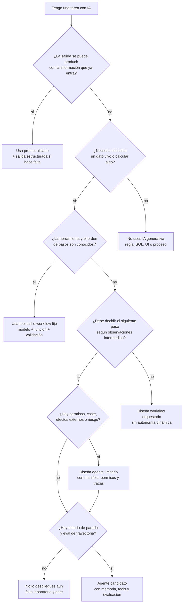
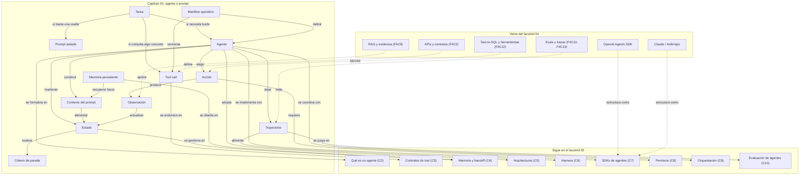

::: {.fasciculo-subtitle}
Facsímil 5 · Agentes y orquestación
:::

# Capítulo 01: Agente o prompt: cuándo merece la pena actuar

## La pregunta que abre el facsímil

Venimos de construir una caja de herramientas: APIs, modelos locales, embeddings, RAG, SQL, evaluación, trazas y laboratorios mínimos. Ahora aparece una tentación normal: si ya tenemos herramientas, ¿por qué no dejar que un modelo las coordine?

La respuesta corta es: a veces sí. La respuesta útil es: solo cuando la tarea necesita estado, acciones, observaciones y criterio de parada. Si lo único que necesitas es redactar, clasificar, transformar un texto o devolver JSON en una sola vuelta, un prompt bien diseñado puede ser mejor que un agente.

Este facsímil va de esa frontera. No vamos a tratar los agentes como moda ni como caja negra. Los vamos a tratar como sistemas de decisión alrededor de un modelo. Un agente puede ser muy valioso, pero también introduce más coste, más latencia, más superficie de fallo, más necesidad de trazas y más responsabilidad de diseño.

## Qué no es un agente

Un agente no es un prompt largo. Puedes escribir una instrucción enorme, con muchas reglas y ejemplos, y seguir teniendo una sola llamada al modelo. Eso puede estar bien. Pero no convierte el sistema en agente.

Un agente tampoco es “autonomía total”. La autonomía se diseña por grados. Un sistema puede leer documentos sin pedir permiso, preparar una propuesta, pedir confirmación antes de enviar algo y bloquear acciones que no estén dentro de su alcance. Llamarlo agente no significa entregarle todas las llaves.

Y un agente no es una excusa para no diseñar. Si no sabes qué herramientas puede usar, qué datos ve, qué permisos tiene, cómo se mide el éxito y cuándo debe parar, el agente no está “razonando libremente”: está operando sin contrato. Ahí es donde nacen muchos fallos caros.

## Qué sí es un agente

En IA clásica, Russell y Norvig definen un agente como algo que percibe su entorno y actúa sobre él para maximizar una medida de rendimiento.^[Russell, S. y Norvig, P. (2021). *Artificial intelligence: a modern approach* (4.ª ed.). Pearson. Su definición de agente como sistema que percibe y actúa es el punto de partida conceptual de este facsímil.] Nilsson ya conectaba búsqueda, planificación y agentes como formas de decidir acciones en un espacio de estados.^[Nilsson, N. J. (1998). *Artificial intelligence: a new synthesis*. Morgan Kaufmann. Nilsson presenta agentes y planificación como problemas de acción, estado y objetivo.] En sistemas con LLMs, cambiamos las piezas, pero no la idea de fondo.

Un agente moderno suele tener estas partes:

| Pieza | Pregunta que responde | Ejemplo |
|---|---|---|
| Objetivo | ¿Qué intenta conseguir? | “Encuentra por qué falla este test”. |
| Estado | ¿Qué sabe hasta ahora? | Archivos leídos, errores vistos, plan activo. |
| Acciones | ¿Qué puede hacer? | Leer fichero, ejecutar test, consultar API, pedir aclaración. |
| Observaciones | ¿Qué volvió después de actuar? | Salida del test, respuesta de API, error validado. |
| Política de decisión | ¿Qué paso toma ahora? | Elegir herramienta, responder, repetir o parar. |
| Criterio de parada | ¿Cuándo termina? | Test pasa, falta permiso, presupuesto agotado. |

La diferencia con un prompt aislado es la trayectoria. Un prompt aislado produce una salida. Un agente produce una secuencia: observa, decide, actúa, vuelve a observar y decide si seguir.

Esta idea no empieza con los LLMs. El General Problem Solver de Newell, Shaw y Simon ya formulaba resolución de problemas como búsqueda guiada por objetivos, diferencias entre estado actual y meta, y selección de operadores.^[Newell, A., Shaw, J. C. y Simon, H. A. (1959). *Report on a General Problem-Solving Program*. Proceedings of the International Conference on Information Processing, 256-264. Es una referencia clásica para entender la idea de descomponer una tarea en estados, diferencias y operadores.] Lo nuevo aquí no es querer decidir pasos; lo nuevo es que el modelo de lenguaje participa en interpretar el objetivo, elegir herramientas y resumir observaciones.

## Memoria no significa meter más texto en el prompt

Aquí conviene frenar un segundo, porque la palabra memoria se usa para demasiadas cosas. En un chatbot sencillo, mucha gente llama “memoria” a que el modelo vea mensajes anteriores en el prompt. Eso es **contexto**, no memoria en sentido operativo. El modelo no recuerda por sí mismo: recibe tokens en una llamada concreta.

En agentes, necesitamos separar tres capas:

| Capa | Qué es | Dónde vive | Qué problema resuelve | Qué problema crea |
|---|---|---|---|---|
| Contexto del prompt | Texto que entra en la llamada actual. | Ventana de contexto del modelo. | Da información inmediata para responder o decidir. | Si metes todo, sube coste y baja foco. |
| Estado de sesión | Historial y variables de una ejecución concreta. | Base de datos, checkpoint, sesión o runtime. | Permite continuar una tarea sin reconstruirla desde cero. | Si no está estructurado, nadie sabe qué pasó. |
| Memoria persistente | Hechos, decisiones, preferencias o aprendizajes reutilizables. | Store externo, RAG, base vectorial, grafo o tabla. | Permite recordar entre sesiones o tareas distintas. | Si no se corrige o caduca, contamina decisiones futuras. |

La documentación del Agents SDK distingue sesiones que mantienen historial entre ejecuciones y pueden usar distintos backends, como SQLite, Redis, SQLAlchemy, MongoDB o sesiones gestionadas por OpenAI.^[OpenAI. (2026). *Agents SDK: Sessions*. [Documentación oficial](https://openai.github.io/openai-agents-python/sessions/). Consultado el 10 de junio de 2026. La documentación describe sesiones como memoria de conversación entre runs y lista backends de persistencia.] Google ADK separa `Session` y `State`, útiles para una conversación concreta, de `MemoryService`, pensado como conocimiento de largo plazo consultable por el agente.^[Google. (2026). *Agent Development Kit: Memory*. [Documentación oficial](https://adk.dev/sessions/memory/). Consultado el 10 de junio de 2026. La documentación distingue memoria de corto plazo basada en sesión/estado y conocimiento de largo plazo mediante servicios de memoria.] LangGraph, por su parte, habla de persistencia mediante checkpoints de estado, lo que permite memoria conversacional, reanudación, inspección humana y recuperación ante fallos.^[LangChain. (2026). *LangGraph persistence*. [Documentación oficial](https://docs.langchain.com/oss/python/langgraph/persistence). Consultado el 10 de junio de 2026.]

La lectura práctica es sencilla: **la memoria nueva de un agente no debería ser un cajón de texto pegado al prompt**. Debe tener operaciones: escribir, buscar, actualizar, borrar, caducar, auditar y explicar por qué se recuperó. Si no puedes editar una memoria falsa, caducar una memoria vieja o saber qué memoria influyó en una decisión, no tienes memoria fiable; tienes arrastre de contexto.

Un ejemplo cercano: si un agente de proyecto aprende “este repositorio usa `npm test`”, eso puede guardarse como memoria de proyecto. Pero debe tener fuente, fecha y posibilidad de corrección. Si mañana el repositorio cambia a `pnpm test`, la memoria vieja no puede seguir entrando en todas las decisiones como si fuera verdad permanente.

## Estado del arte con fecha de corte

**Fecha de corte:** 10 de junio de 2026.  
**Fuentes consultadas ese día:** referencias trabajadas en el libro sobre agentes clásicos, ReAct, Toolformer, function calling, OpenAI Agents SDK, sesiones y memoria, Google ADK Memory, LangGraph persistence, estrategias agentic en LlamaIndex, Anthropic tool use, Claude Code y principios de mínimo privilegio.

ReAct propuso combinar razonamiento y acción en LLMs para intercalar pasos de pensamiento con llamadas a entornos o herramientas.^[Yao, S. et al. (2023). *ReAct: Synergizing Reasoning and Acting in Language Models*. International Conference on Learning Representations. https://arxiv.org/abs/2210.03629] Toolformer exploró cómo un modelo podía aprender a usar herramientas externas mediante ejemplos generados automáticamente.^[Schick, T. et al. (2023). *Toolformer: Language Models Can Teach Themselves to Use Tools*. https://doi.org/10.48550/arXiv.2302.04761] No son recetas cerradas para producto, pero sí cambiaron la conversación: el modelo ya no solo responde; puede decidir cuándo necesita una herramienta.

En documentación práctica, OpenAI describe function calling como forma de dar herramientas al modelo mediante esquemas y recibir argumentos estructurados.^[OpenAI. (2026). *Function calling*. [Documentación oficial](https://developers.openai.com/api/docs/guides/function-calling). Consultado el 10 de junio de 2026.] Su Agents SDK se presenta como una capa para coordinar agentes, herramientas, handoffs, guardrails y trazas.^[OpenAI. (2026). *Agents SDK*. [Documentación oficial](https://developers.openai.com/api/docs/guides/agents). Consultado el 10 de junio de 2026.] LlamaIndex agrupa estrategias agentic como routing, transformaciones de consulta, motores de subpreguntas y agentes sobre datos.^[LlamaIndex. (2026). *Agentic strategies*. [Documentación oficial](https://developers.llamaindex.ai/python/framework/optimizing/agentic_strategies/agentic_strategies/). Consultado el 10 de junio de 2026.]

La lección estable no es una librería concreta. La lección estable es esta: cuando un sistema decide acciones, el diseño debe separar modelo, herramientas, permisos, estado, observaciones, límites y evaluación.

## La fórmula mínima

**Ejemplo de fórmula.** Podemos escribir un agente como un bucle discreto. En cada paso \(t\), el sistema tiene un estado:

$$
s_t = (g, h_t, o_t, c_t, m_t, b_t)
$$

| Símbolo | Significado | Ejemplo concreto |
|---|---|---|
| \(s_t\) | Estado del sistema en el paso \(t\). | Lo que el agente sabe tras leer logs y ejecutar un test. |
| \(g\) | Objetivo de la tarea. | “Diagnosticar por qué falla el login”. |
| \(h_t\) | Historial útil y resumido. | Archivos leídos, hipótesis descartadas, pasos hechos. |
| \(o_t\) | Última observación recibida. | “El test falla por timeout en `/auth/callback`”. |
| \(c_t\) | Contexto autorizado para decidir. | Instrucciones del proyecto, contrato de tool, política de permisos. |
| \(m_t\) | Memorias recuperadas y vigentes para esta decisión. | “Este proyecto ejecuta tests con `pnpm test`, confirmado ayer”. |
| \(b_t\) | Presupuesto restante. | 6 pasos, 30 segundos, 2 llamadas externas. |

Desde ese estado hay un conjunto de acciones disponibles:

$$
a_t \in A(s_t)
$$

| Símbolo | Significado | Ejemplo concreto |
|---|---|---|
| \(a_t\) | Acción elegida en el paso \(t\). | Ejecutar `test_login`, leer `auth.ts`, pedir aclaración. |
| \(A(s_t)\) | Acciones permitidas desde el estado actual. | Si no hay permiso de escritura, “editar archivo” no está en el conjunto. |

**Ejemplo de fórmula.** La política de decisión elige una acción. Una forma práctica de pensarlo es maximizar utilidad esperada y restar coste y riesgo operativo:

$$
a_t = \arg\max_{a \in A(s_t)}
\left[
U(a, s_t) - C(a, s_t) - R(a, s_t)
\right]
$$

| Símbolo | Significado | Ejemplo concreto |
|---|---|---|
| \(\arg\max\) | Acción que obtiene mejor puntuación. | Elegir leer el error exacto antes que modificar código. |
| \(U(a, s_t)\) | Utilidad esperada de la acción. | Cuánto reduce la incertidumbre o acerca al objetivo. |
| \(C(a, s_t)\) | Coste de la acción. | Tokens, latencia, dinero, tiempo de herramienta. |
| \(R(a, s_t)\) | Riesgo operativo de la acción. | Escribir datos, enviar algo, tocar producción, usar permiso alto. |

Después de actuar, llega una observación y el estado se actualiza:

$$
s_{t+1} = T(s_t, a_t, o_{t+1})
$$

| Símbolo | Significado | Ejemplo concreto |
|---|---|---|
| \(T\) | Función de transición del sistema. | Actualiza historial, presupuesto, errores y próximos pasos. |
| \(o_{t+1}\) | Observación devuelta por la acción. | Resultado de test, filas SQL, respuesta de API, error de schema. |
| \(s_{t+1}\) | Nuevo estado. | El agente ya sabe que el fallo no está en el router, sino en sesión. |

Esto no obliga a implementar un agente con ecuaciones explícitas. Sirve para no perder el mapa. Si una herramienta no devuelve observación estructurada, el estado se contamina. Si no hay presupuesto, el bucle puede gastar de más. Si no hay criterio de parada, el agente puede seguir aunque ya no esté aprendiendo nada.

## El primer criterio: ¿una vuelta o varias?

El diagnóstico más simple es preguntar si la tarea cabe en una sola vuelta.

| Si la tarea... | Suele bastar con prompt | Empieza a pedir agente |
|---|---:|---:|
| Necesita redactar, resumir o clasificar una entrada cerrada | Sí | No necesariamente |
| Necesita consultar estado real | No | Sí |
| Necesita elegir entre varias herramientas | No | Sí |
| Necesita probar, observar y corregir | No | Sí |
| Tiene acciones con permisos | No | Sí, pero con límites |
| Tiene éxito verificable por tests o métricas | A veces | Sí |
| Requiere memoria operativa entre pasos | No | Sí |

Un caso cercano: “resume este correo” es prompt. “Busca en el CRM los últimos pedidos del cliente, comprueba si hay una incidencia abierta, redacta una respuesta y espera aprobación” ya no es solo prompt. Ahí hay herramientas, estado, permisos y criterio de parada.

La pregunta profesional no es “¿podemos hacerlo con un agente?”. Casi siempre podremos. La pregunta es: ¿el agente reduce trabajo real más de lo que añade coste, latencia y complejidad?

## Mapa visual de decisión

<svg id="f5-c01-agente-o-prompt" xmlns="http://www.w3.org/2000/svg" viewBox="0 0 1280 820" role="img" aria-label="Mapa de decisión para elegir entre prompt, tool call y agente">
  <defs>
    <marker id="f5c01-arrow" viewBox="0 0 10 10" refX="9" refY="5" markerWidth="7" markerHeight="7" orient="auto-start-reverse">
      <path d="M 0 0 L 10 5 L 0 10 z" fill="#111111"/>
    </marker>
    <pattern id="f5c01-grid" width="18" height="18" patternUnits="userSpaceOnUse">
      <path d="M 18 0 L 0 0 0 18" fill="none" stroke="#EEEEEE" stroke-width="1"/>
    </pattern>
  </defs>

  <rect x="24" y="24" width="1232" height="772" rx="18" fill="#FFFFFF" stroke="#111111" stroke-width="2"/>
  <text x="640" y="64" text-anchor="middle" font-family="Arial, sans-serif" font-size="26" font-weight="700" fill="#111111">¿Prompt, tool call o agente?</text>
  <text x="640" y="92" text-anchor="middle" font-family="Arial, sans-serif" font-size="13" fill="#555555">La decisión depende de estado, acciones, observaciones, permisos y criterio de parada.</text>
  <rect x="62" y="124" width="1156" height="548" rx="14" fill="url(#f5c01-grid)" stroke="#DDDDDD"/>

  <g font-family="Arial, sans-serif">
    <rect x="104" y="172" width="230" height="96" rx="12" fill="#111111" stroke="#111111" stroke-width="1.5"/>
    <text x="219" y="204" text-anchor="middle" font-size="15" font-weight="700" fill="#FFFFFF">Tarea de entrada</text>
    <text x="219" y="230" text-anchor="middle" font-size="11" fill="#E8E8E8">objetivo + datos + límites</text>
    <text x="219" y="248" text-anchor="middle" font-size="11" fill="#E8E8E8">¿qué debe quedar probado?</text>

    <line x1="334" y1="220" x2="390" y2="220" stroke="#111111" stroke-width="1.4" marker-end="url(#f5c01-arrow)"/>
    <rect x="390" y="160" width="230" height="120" rx="12" fill="#FFFFFF" stroke="#111111" stroke-width="1.5"/>
    <text x="505" y="194" text-anchor="middle" font-size="15" font-weight="700">¿Basta una salida?</text>
    <text x="505" y="220" text-anchor="middle" font-size="11" fill="#555555">resumir · clasificar</text>
    <text x="505" y="238" text-anchor="middle" font-size="11" fill="#555555">redactar · transformar</text>
    <text x="505" y="258" text-anchor="middle" font-size="11" fill="#111111">si sí: prompt</text>

    <path d="M505 280 V340" stroke="#111111" stroke-width="1.3" marker-end="url(#f5c01-arrow)"/>
    <rect x="390" y="340" width="230" height="104" rx="12" fill="#111111" stroke="#111111" stroke-width="1.5"/>
    <text x="505" y="374" text-anchor="middle" font-size="15" font-weight="700" fill="#FFFFFF">Prompt aislado</text>
    <text x="505" y="400" text-anchor="middle" font-size="11" fill="#E8E8E8">una llamada</text>
    <text x="505" y="418" text-anchor="middle" font-size="11" fill="#E8E8E8">sin trayectoria operativa</text>

    <line x1="620" y1="220" x2="676" y2="220" stroke="#111111" stroke-width="1.4" marker-end="url(#f5c01-arrow)"/>
    <rect x="676" y="160" width="230" height="120" rx="12" fill="#FFFFFF" stroke="#111111" stroke-width="1.5"/>
    <text x="791" y="194" text-anchor="middle" font-size="15" font-weight="700">¿Necesita consultar?</text>
    <text x="791" y="220" text-anchor="middle" font-size="11" fill="#555555">datos · API · cálculo</text>
    <text x="791" y="238" text-anchor="middle" font-size="11" fill="#555555">pero el flujo es conocido</text>
    <text x="791" y="258" text-anchor="middle" font-size="11" fill="#111111">si sí: tool call</text>

    <path d="M791 280 V340" stroke="#111111" stroke-width="1.3" marker-end="url(#f5c01-arrow)"/>
    <rect x="676" y="340" width="230" height="104" rx="12" fill="#FFFFFF" stroke="#111111" stroke-width="1.5"/>
    <text x="791" y="374" text-anchor="middle" font-size="15" font-weight="700">Tool call</text>
    <text x="791" y="400" text-anchor="middle" font-size="11" fill="#555555">schema + permisos</text>
    <text x="791" y="418" text-anchor="middle" font-size="11" fill="#555555">resultado estructurado</text>

    <line x1="906" y1="220" x2="962" y2="220" stroke="#111111" stroke-width="1.4" marker-end="url(#f5c01-arrow)"/>
    <rect x="962" y="160" width="218" height="120" rx="12" fill="#FFFFFF" stroke="#111111" stroke-width="1.5"/>
    <text x="1071" y="194" text-anchor="middle" font-size="15" font-weight="700">¿Necesita bucle?</text>
    <text x="1071" y="220" text-anchor="middle" font-size="11" fill="#555555">decidir · actuar</text>
    <text x="1071" y="238" text-anchor="middle" font-size="11" fill="#555555">observar · corregir</text>
    <text x="1071" y="258" text-anchor="middle" font-size="11" fill="#111111">si sí: agente</text>

    <path d="M1071 280 V340" stroke="#111111" stroke-width="1.3" marker-end="url(#f5c01-arrow)"/>
    <rect x="962" y="340" width="218" height="104" rx="12" fill="#111111" stroke="#111111" stroke-width="1.5"/>
    <text x="1071" y="374" text-anchor="middle" font-size="15" font-weight="700" fill="#FFFFFF">Agente</text>
    <text x="1071" y="400" text-anchor="middle" font-size="11" fill="#E8E8E8">estado + trayectoria</text>
    <text x="1071" y="418" text-anchor="middle" font-size="11" fill="#E8E8E8">criterio de parada</text>

    <rect x="178" y="526" width="244" height="76" rx="12" fill="#FFFFFF" stroke="#111111" stroke-width="1.4"/>
    <text x="300" y="556" text-anchor="middle" font-size="13" font-weight="700">Regla práctica</text>
    <text x="300" y="580" text-anchor="middle" font-size="11" fill="#555555">si no puedes trazarlo,</text>
    <text x="300" y="596" text-anchor="middle" font-size="11" fill="#555555">no puedes operarlo</text>

    <rect x="518" y="526" width="244" height="76" rx="12" fill="#FFFFFF" stroke="#111111" stroke-width="1.4"/>
    <text x="640" y="556" text-anchor="middle" font-size="13" font-weight="700">Memoria ≠ prompt</text>
    <text x="640" y="580" text-anchor="middle" font-size="11" fill="#555555">se recupera</text>
    <text x="640" y="596" text-anchor="middle" font-size="11" fill="#555555">y se corrige</text>

    <rect x="858" y="526" width="244" height="76" rx="12" fill="#FFFFFF" stroke="#111111" stroke-width="1.4"/>
    <text x="980" y="556" text-anchor="middle" font-size="13" font-weight="700">Primer diseño</text>
    <text x="980" y="580" text-anchor="middle" font-size="11" fill="#555555">empieza simple</text>
    <text x="980" y="596" text-anchor="middle" font-size="11" fill="#555555">y mide antes de escalar</text>
  </g>

  <text opacity="0.55" x="1226" y="764" text-anchor="end" font-family="Arial, sans-serif" font-size="11" fill="#888888">IA para gente curiosa / Facsímil 05 / Capítulo 01 / 686f6c61</text>
</svg>

La figura separa tres niveles. El prompt resuelve una transformación cerrada. La llamada a herramienta resuelve una consulta o acción conocida. El agente aparece cuando el sistema debe elegir varios pasos según lo que vaya observando.

## Árbol de decisión para no complicarte demasiado pronto

El árbol siguiente sirve para una primera conversación de diseño. No sustituye la evaluación, pero evita una confusión muy frecuente: llamar agente a cualquier cosa que use un modelo.



IA para gente curiosa / Facsímil 05 / Capítulo 01 / 686f6c61

La lectura del árbol es sencilla:

| Si respondes... | Lo razonable es empezar con... | Por qué |
|---|---|---|
| “Sí, todo está en la entrada” | Prompt aislado | No necesitas estado ni herramientas. |
| “Necesito un dato vivo, pero sé exactamente cuál” | Tool call o workflow fijo | El modelo puede preparar argumentos; tu sistema ejecuta y valida. |
| “Necesito varios pasos, pero el orden es conocido” | Workflow orquestado | No hace falta que el modelo decida cada paso. |
| “El siguiente paso depende de lo observado” | Agente limitado | Ya hay bucle de decisión, acción y observación. |
| “Hay permisos o efectos externos” | Agente con manifest y aprobación | La autonomía debe estar graduada por acción. |
| “No tengo eval ni criterio de parada” | No desplegar todavía | Sin trayectoria medible, no sabes si funciona de forma repetible. |

Este árbol tiene una moraleja: **el agente suele aparecer tarde**, no al principio. Primero pregunta si basta con una llamada. Luego si basta con una herramienta. Luego si basta con un workflow. Solo cuando la tarea necesita decidir dinámicamente según observaciones empieza a merecer la palabra agente.

## En el día a día

Imagina un equipo de soporte universitario. Una persona escribe: “No puedo matricularme y creo que tengo un pago pendiente”. Hay varias formas de resolverlo.

Un prompt podría redactar una respuesta amable. Una tool podría consultar si el expediente tiene pagos pendientes. Un agente podría hacer algo más amplio: leer la política de matrícula vigente, consultar pagos, comprobar si falta documentación, preparar una respuesta con evidencia y pedir aprobación antes de enviarla.

La tercera opción suena más potente, pero solo merece la pena si la tarea se repite, si la decisión depende de datos vivos y si el resultado se puede verificar. Si el equipo recibe dos casos al mes, quizá baste con una plantilla y una consulta manual. Si recibe miles, con reglas claras y trazas, el agente empieza a tener sentido.

## Por qué debería importarte

Un agente cambia la unidad de evaluación. Ya no basta con leer la respuesta final. Hay que mirar la trayectoria: qué datos usó, qué herramienta eligió, qué observó, cuánto costó, qué permisos aplicó y por qué decidió parar.

Esta es la razón por la que el facsímil 04 terminó con laboratorios y trazas. Antes de coordinar herramientas, necesitamos saber medir piezas pequeñas. Un agente no elimina esa disciplina: la multiplica.

Saltzer y Schroeder formularon principios clásicos como mínimo privilegio y mediación completa: cada acceso relevante debe comprobarse y cada componente debe operar con el permiso mínimo necesario.^[Saltzer, J. H. y Schroeder, M. D. (1975). The protection of information in computer systems. *Proceedings of the IEEE*, 63(9), 1278-1308. https://doi.org/10.1109/PROC.1975.9939] En agentes, esa idea deja de ser abstracta: cada herramienta debe tener un alcance explícito, y cada acción con efecto real debe pasar por una decisión externa al modelo.

## Cómo lo estructuran OpenAI y Claude

La forma exacta cambia entre proveedores, pero la arquitectura que hay debajo se parece mucho. Un sistema de agentes no es “un modelo con ganas de hacer cosas”. Es un runtime que prepara contexto, ofrece tools, ejecuta llamadas, devuelve observaciones, conserva estado, aplica permisos y deja trazas.

En OpenAI Agents SDK, un `Agent` se describe como un LLM configurado con instrucciones, herramientas y comportamiento opcional como handoffs, guardrails y salidas estructuradas; `Agent` más `Runner` permite que el SDK gestione turnos, tools, guardrails, handoffs y sesiones.^[OpenAI. (2026). *Agents SDK: Agents*. [Documentación oficial](https://openai.github.io/openai-agents-python/agents/). Consultado el 10 de junio de 2026.] Las sesiones mantienen historial entre ejecuciones y pueden apoyarse en distintos backends; eso no es “memoria humana”, sino persistencia controlada de conversación y estado.^[OpenAI. (2026). *Agents SDK: Sessions*. [Documentación oficial](https://openai.github.io/openai-agents-python/sessions/). Consultado el 10 de junio de 2026.] La trazabilidad también es explícita: el SDK registra generaciones del modelo, llamadas a herramientas, handoffs, guardrails y eventos propios como spans dentro de una traza.^[OpenAI. (2026). *Agents SDK: Tracing*. [Documentación oficial](https://openai.github.io/openai-agents-python/tracing/). Consultado el 10 de junio de 2026.]

En Anthropic, la guía *Building Effective Agents* separa workflows y agents: un workflow sigue rutas predefinidas por código; un agent deja que el LLM dirija dinámicamente el proceso y el uso de herramientas.^[Anthropic. (2024). *Building Effective Agents*. [Artículo técnico](https://www.anthropic.com/engineering/building-effective-agents). Consultado el 10 de junio de 2026.] En la API de Claude, las tools se declaran en `tools` con nombre, descripción y esquema de entrada; el modelo puede devolver bloques `tool_use` y el cliente continúa la conversación con bloques `tool_result`.^[Anthropic. (2026). *How to implement tool use*. [Documentación oficial](https://docs.anthropic.com/en/docs/agents-and-tools/tool-use/implement-tool-use). Consultado el 10 de junio de 2026.] En Claude Code, la memoria se organiza con archivos `CLAUDE.md` de distintos ámbitos.^[Anthropic. (2026). *Manage Claude's memory*. [Documentación oficial](https://docs.anthropic.com/en/docs/claude-code/memory). Consultado el 10 de junio de 2026.] Los subagentes se definen como Markdown con frontmatter, propósito, herramientas permitidas y ventana de contexto separada.^[Anthropic. (2026). *Subagents*. [Documentación oficial](https://docs.anthropic.com/en/docs/claude-code/sub-agents). Consultado el 10 de junio de 2026.]

La traducción a piezas queda así:

| Pieza del libro | OpenAI Agents SDK | Claude / Anthropic | Qué debes mirar como ingeniero |
|---|---|---|---|
| Instrucciones | `instructions`, prompts y configuración del agente. | System prompt, `CLAUDE.md`, configuración de subagente. | Qué manda, con qué prioridad y dónde vive versionado. |
| Tools | Function tools, hosted tools, agents as tools. | `tools`, `tool_use`, `tool_result`, tools de Claude Code. | Schema, descripción, permisos, timeout, errores y límites de salida. |
| Estado de sesión | `Session`, conversaciones, backends de persistencia. | Conversación, memoria de Claude Code, contexto del subagente. | Qué se guarda entre pasos y cómo se corrige. |
| Delegación | Handoffs o agentes expuestos como tools. | Subagentes con contexto y tools propias. | Cuándo delega, qué contexto pasa y qué vuelve. |
| Controles | Guardrails, output types, approval gates, policies propias. | Permisos de tools, límites del agente, confirmaciones de Claude Code. | Qué acción se permite, se bloquea o pide revisión. |
| Trazas | Traces y spans del SDK. | Historial de tool use, logs del runtime, trazas propias. | Cómo reconstruyes la trayectoria sin leer una novela. |

Fíjate en la idea común: el proveedor puede darte SDK, API o entorno de código, pero el diseño sigue siendo tuyo. Tú decides qué tools existen, qué memoria entra, qué permisos se aplican, qué salida se acepta y qué traza basta para depurar.

## Manos a la obra

**Práctica:** diseñar un manifest operativo.

Kit ejecutable de este capítulo: `labs/f5/capitulo-practicas/`.

```bash
cd labs/f5/capitulo-practicas
python3 ops/run_f5_practices.py --chapter c01 --write --fail-on-invalid
```

Esta práctica sustituye al típico “clasificador de tareas” porque deja algo más útil: una plantilla mínima que podrías adaptar a un sistema real. Vamos a escribir un manifest operativo de agente y un validador pequeño.

El objetivo no es montar una integración con OpenAI o Claude todavía. El objetivo es aprender a especificar un agente antes de darle autonomía: qué tools existen, qué permiso necesita cada una, qué memoria se puede recuperar, qué eventos deben quedar en la traza y cuándo se detiene.

El caso será el mismo que venimos usando: soporte académico para matrícula y pagos pendientes. El agente podrá leer política, consultar saldo, preparar una respuesta y pedir aprobación antes de enviar nada.

```python
import json
from datetime import datetime


AGENT_MANIFEST = {
    "name": "matricula-support-agent",
    "goal": "Resolver consultas de matrícula con evidencia y sin enviar nada sin aprobación.",
    "memory": {
        "context_prompt": ["instrucciones_del_sistema", "peticion_usuario"],
        "session_state": ["case_id", "pasos", "observaciones", "aprobaciones"],
        "persistent_memory": ["politicas_vigentes", "preferencias_de_formato"],
    },
    "stop_rules": ["done", "approval_required", "blocked", "budget_exhausted"],
    "budget": {"max_steps": 6, "max_tool_calls": 4},
    "tools": {
        "buscar_politica_matricula": {
            "purpose": "recuperar política vigente de matrícula",
            "input_schema": {"query": "string"},
            "output_schema": {"policy_id": "string", "summary": "string"},
            "risk_class": "read_scoped",
            "permission": "allow",
            "side_effect": "none",
            "timeout_ms": 1000,
            "trace_event": "tool.policy.search",
        },
        "consultar_saldo_expediente": {
            "purpose": "consultar pagos pendientes de un expediente autenticado",
            "input_schema": {"case_id": "string"},
            "output_schema": {"pending_eur": "number", "campus": "string"},
            "risk_class": "read_private",
            "permission": "authenticated_read",
            "side_effect": "none",
            "timeout_ms": 1200,
            "trace_event": "tool.balance.read",
        },
        "preparar_respuesta": {
            "purpose": "preparar una respuesta con evidencias",
            "input_schema": {"observations": "array"},
            "output_schema": {"message": "string", "evidence": "array"},
            "risk_class": "compose",
            "permission": "allow",
            "side_effect": "none",
            "timeout_ms": 800,
            "trace_event": "tool.reply.prepare",
        },
        "solicitar_envio_respuesta": {
            "purpose": "pedir aprobación para enviar la respuesta al estudiante",
            "input_schema": {"message": "string", "recipient_id": "string"},
            "output_schema": {"approval_id": "string", "status": "string"},
            "risk_class": "external_action",
            "permission": "approval_required",
            "side_effect": "external_message",
            "timeout_ms": 1000,
            "trace_event": "tool.reply.approval",
        },
    },
}

TASKS = [
    {
        "id": "caso_a",
        "request": "¿Hasta cuándo puedo modificar mi matrícula?",
        "intent": "policy_question",
        "authenticated": True,
        "wants_send": False,
    },
    {
        "id": "caso_b",
        "request": "No puedo matricularme y quizá tengo un pago pendiente. Prepara respuesta para enviar.",
        "intent": "case_resolution",
        "authenticated": True,
        "wants_send": True,
    },
]


def validate_manifest(manifest):
    errors = []
    required_tool_fields = {
        "purpose",
        "input_schema",
        "output_schema",
        "risk_class",
        "permission",
        "side_effect",
        "timeout_ms",
        "trace_event",
    }
    for layer in ["context_prompt", "session_state", "persistent_memory"]:
        if layer not in manifest["memory"]:
            errors.append(f"falta capa de memoria: {layer}")

    for name, tool in manifest["tools"].items():
        missing = sorted(required_tool_fields - set(tool))
        if missing:
            errors.append(f"{name} sin campos: {missing}")
        if tool["side_effect"] != "none" and tool["permission"] != "approval_required":
            errors.append(f"{name} cambia algo sin aprobación explícita")

    if "approval_required" not in manifest["stop_rules"]:
        errors.append("falta regla de parada approval_required")

    return errors


def trace_event(trace, event, **data):
    trace.append(
        {
            "at": datetime(2026, 5, 26, 12, 0, 0).isoformat(),
            "event": event,
            "data": data,
        }
    )


def permission_decision(tool, task):
    policy = tool["permission"]
    if policy == "allow":
        return "allow"
    if policy == "authenticated_read":
        return "allow" if task["authenticated"] else "blocked"
    if policy == "approval_required":
        return "approval_required"
    return "blocked"


def execute_tool(tool_name, observations):
    if tool_name == "buscar_politica_matricula":
        return {"policy_id": "matricula-2026", "summary": "modificación hasta el 15 de septiembre"}
    if tool_name == "consultar_saldo_expediente":
        return {"pending_eur": 180.0, "campus": "Norte"}
    if tool_name == "preparar_respuesta":
        evidence = [obs["summary"] if "summary" in obs else f"saldo pendiente: {obs['pending_eur']} EUR" for obs in observations]
        return {"message": "Respuesta preparada con evidencias.", "evidence": evidence}
    raise ValueError(f"tool desconocida: {tool_name}")


def plan_for(task):
    if task["intent"] == "policy_question":
        return ["buscar_politica_matricula", "preparar_respuesta"]
    return [
        "buscar_politica_matricula",
        "consultar_saldo_expediente",
        "preparar_respuesta",
        "solicitar_envio_respuesta",
    ]


def run_agent(task, manifest):
    trace = []
    observations = []
    tool_calls = 0

    trace_event(trace, "task.received", task_id=task["id"], request=task["request"])
    trace_event(trace, "context.build", layers=manifest["memory"]["context_prompt"])
    trace_event(trace, "memory.retrieve", stores=manifest["memory"]["persistent_memory"])

    for step, tool_name in enumerate(plan_for(task), start=1):
        if step > manifest["budget"]["max_steps"] or tool_calls >= manifest["budget"]["max_tool_calls"]:
            trace_event(trace, "final.status", status="budget_exhausted")
            return {"task_id": task["id"], "status": "budget_exhausted", "trace": trace}

        tool = manifest["tools"][tool_name]
        decision = permission_decision(tool, task)
        trace_event(trace, "permission.check", tool=tool_name, decision=decision, risk=tool["risk_class"])

        if decision != "allow":
            trace_event(trace, "final.status", status=decision, pending_tool=tool_name)
            return {"task_id": task["id"], "status": decision, "observations": observations, "trace": trace}

        tool_calls += 1
        trace_event(trace, "tool.call", tool=tool_name, tool_event=tool["trace_event"])
        output = execute_tool(tool_name, observations)
        observations.append(output)
        trace_event(trace, "tool.result", tool=tool_name, output=output)

    trace_event(trace, "final.status", status="done")
    return {"task_id": task["id"], "status": "done", "observations": observations, "trace": trace}


errors = validate_manifest(AGENT_MANIFEST)
print("manifest valido:", not errors)
print("errores:", errors)

for task in TASKS:
    result = run_agent(task, AGENT_MANIFEST)
    print(result["task_id"], result["status"])
    print([event["event"] for event in result["trace"]])
```

Salida esperada:

```text
manifest valido: True
errores: []
caso_a done
['task.received', 'context.build', 'memory.retrieve', 'permission.check', 'tool.call', 'tool.result', 'permission.check', 'tool.call', 'tool.result', 'final.status']
caso_b approval_required
['task.received', 'context.build', 'memory.retrieve', 'permission.check', 'tool.call', 'tool.result', 'permission.check', 'tool.call', 'tool.result', 'permission.check', 'tool.call', 'tool.result', 'permission.check', 'final.status']
```

Esta práctica ya se parece más a ingeniería. No decide con una etiqueta bonita; obliga a escribir qué memoria entra, qué tools existen, qué permiso necesita cada acción y qué traza queda. Si mañana lo llevas a OpenAI Agents SDK, Claude, LangGraph o un framework propio, las piezas siguen siendo reconocibles.

El resultado más importante es `caso_b approval_required`. El sistema ha leído política, consultado saldo y preparado respuesta, pero se detiene antes de enviar. Eso es autonomía graduada: el agente avanza donde puede y se para donde debe.

## Cómo encaja todo



IA para gente curiosa / Facsímil 05 / Capítulo 01 / 686f6c61

## Vocabulario aprendido

| Término | Definición |
|---|---|
| **Prompt aislado** | Petición cerrada a un modelo, sin trayectoria ni acciones externas. |
| **Agente** | Sistema que decide acciones, usa herramientas, observa resultados y avanza hacia un objetivo. |
| **Estado** | Memoria operativa verificable de lo que sabe, hizo y aún puede hacer el sistema. |
| **Contexto del prompt** | Texto y artefactos que entran en la llamada actual al modelo. |
| **Memoria de sesión** | Historial persistido de una conversación o ejecución concreta. |
| **Memoria persistente** | Hechos, preferencias o decisiones recuperables más allá de una sesión. |
| **Acción** | Paso ejecutable o consultivo: tool, cálculo, lectura, pregunta o respuesta. |
| **Observación** | Resultado que vuelve al sistema después de una acción. |
| **Trayectoria** | Secuencia de estados, acciones y observaciones. |
| **Criterio de parada** | Regla que decide si terminar, repetir, pedir permiso o escalar a una persona. |
| **Presupuesto operativo** | Límite de pasos, tokens, coste, latencia o herramientas. |
| **Manifest operativo** | Especificación versionable de objetivo, tools, permisos, memoria, trazas y parada. |

## Dónde solía tropezar yo

| Error | Por qué es un error | Antídoto |
|---|---|---|
| Llamar agente a cualquier prompt largo | Un prompt largo no observa resultados ni ejecuta acciones. | Preguntar si existe trayectoria: estado, acción, observación y parada. |
| Añadir agente antes de medir | La complejidad puede tapar un problema que resolvía una tool simple. | Probar primero prompt o tool call y medir el cuello real. |
| Dar herramientas genéricas | Una tool demasiado amplia es difícil de auditar y controlar. | Diseñar herramientas con nombre de dominio, schema, límites y errores claros. |
| Confundir contexto con estado | El contexto son tokens; el estado debe ser verificable y persistente cuando importa. | Guardar decisiones, permisos, artefactos y resultados fuera del prompt. |
| Confundir memoria con prompt largo | El sistema arrastra información sin saber si sigue siendo válida. | Tratar la memoria como store: escritura, búsqueda, actualización, caducidad y auditoría. |
| Evaluar solo la respuesta final | Un resultado correcto puede haber llegado por una trayectoria mala. | Medir outcome y trayectoria: herramientas, observaciones, coste y parada. |

## Antes de pasar página

- [ ] ¿Puedo explicar por qué un agente no es simplemente un prompt largo?
- [ ] ¿Sé distinguir prompt aislado, tool call y agente?
- [ ] ¿Puedo escribir qué contiene \(s_t\) en un agente sencillo?
- [ ] ¿Entiendo qué significa elegir \(a_t \in A(s_t)\)?
- [ ] ¿Puedo explicar por qué una observación debe ser estructurada?
- [ ] ¿Sé distinguir contexto del prompt, estado de sesión y memoria persistente?
- [ ] ¿Puedo explicar por qué una memoria debe poder corregirse o caducar?
- [ ] ¿Puedo leer un sistema tipo OpenAI Agents SDK o Claude Code y señalar instrucciones, tools, estado, memoria, permisos y trazas?
- [ ] ¿Puedo escribir un manifest operativo mínimo antes de implementar el agente?
- [ ] ¿Sé decir cuándo una tarea necesita varias vueltas?
- [ ] ¿Puedo justificar por qué los permisos no los decide el modelo?
- [ ] ¿Sé qué métrica miraría antes de complicar una solución?

## En resumen

| Idea fuerza | Detalle |
|---|---|
| Un agente es una trayectoria, no una respuesta. | La diferencia está en estado, acciones, observaciones y criterio de parada. |
| No todo merece agente. | Si una sola llamada o una tool conocida resuelven el problema, empezar ahí suele ser mejor. |
| Memoria no es contexto acumulado. | La memoria útil se recupera, se versiona, se corrige y se audita fuera del prompt. |
| OpenAI y Claude usan piezas reconocibles. | Cambia el nombre de la API, pero siguen apareciendo instrucciones, tools, estado, memoria, controles y trazas. |
| La autonomía se diseña por grados. | Leer, redactar, escribir, enviar o modificar no tienen el mismo permiso ni el mismo coste. |
| Las trazas son parte del producto. | Sin trayectoria observable, no puedes depurar ni evaluar bien un agente. |

## Para saber más

Anthropic. (2024). *Building Effective Agents*. [Artículo técnico](https://www.anthropic.com/engineering/building-effective-agents).

Anthropic. (2026). *How to implement tool use*. [Documentación oficial](https://docs.anthropic.com/en/docs/agents-and-tools/tool-use/implement-tool-use).

Anthropic. (2026). *Manage Claude's memory*. [Documentación oficial](https://docs.anthropic.com/en/docs/claude-code/memory).

Anthropic. (2026). *Subagents*. [Documentación oficial](https://docs.anthropic.com/en/docs/claude-code/sub-agents).

Google. (2026). *Agent Development Kit: Memory*. [Documentación oficial](https://adk.dev/sessions/memory/).

LangChain. (2026). *LangGraph persistence*. [Documentación oficial](https://docs.langchain.com/oss/python/langgraph/persistence).

LlamaIndex. (2026). *Agentic strategies*. [Documentación oficial](https://developers.llamaindex.ai/python/framework/optimizing/agentic_strategies/agentic_strategies/).

Newell, A., Shaw, J. C. y Simon, H. A. (1959). *Report on a General Problem-Solving Program*. Proceedings of the International Conference on Information Processing, 256-264.

Nilsson, N. J. (1998). *Artificial intelligence: a new synthesis*. Morgan Kaufmann.

OpenAI. (2026). *Agents SDK*. [Documentación oficial](https://developers.openai.com/api/docs/guides/agents).

OpenAI. (2026). *Agents SDK: Agents*. [Documentación oficial](https://openai.github.io/openai-agents-python/agents/).

OpenAI. (2026). *Agents SDK: Sessions*. [Documentación oficial](https://openai.github.io/openai-agents-python/sessions/).

OpenAI. (2026). *Agents SDK: Tracing*. [Documentación oficial](https://openai.github.io/openai-agents-python/tracing/).

OpenAI. (2026). *Function calling*. [Documentación oficial](https://developers.openai.com/api/docs/guides/function-calling).

Russell, S. y Norvig, P. (2021). *Artificial intelligence: a modern approach* (4.ª ed.). Pearson.

Saltzer, J. H. y Schroeder, M. D. (1975). The protection of information in computer systems. *Proceedings of the IEEE*, 63(9), 1278-1308. https://doi.org/10.1109/PROC.1975.9939

Schick, T., Dwivedi-Yu, J., Dessì, R., Raileanu, R., Lomeli, M., Zettlemoyer, L., Cancedda, N. y Scialom, T. (2023). *Toolformer: Language Models Can Teach Themselves to Use Tools*. https://doi.org/10.48550/arXiv.2302.04761

Yao, S., Zhao, J., Yu, D., Du, N., Shafran, I., Narasimhan, K. y Cao, Y. (2023). *ReAct: Synergizing Reasoning and Acting in Language Models*. International Conference on Learning Representations. https://arxiv.org/abs/2210.03629
