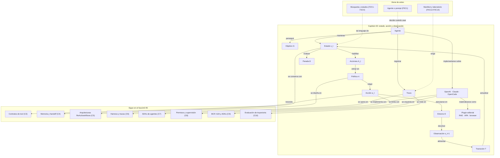

::: {.fasciculo-subtitle}
Facsímil 5 · Agentes y orquestación
:::

# Capítulo 02: Qué es un agente: estado, acción y observación

## El bucle que convierte un modelo en sistema

En el capítulo anterior distinguimos prompt, tool call, workflow y agente. Ahora toca abrir la caja del agente con calma.

Un agente no se define por lo impresionante que suena su respuesta. Se define por un bucle: mantiene un estado, elige una acción, recibe una observación, actualiza el estado y decide si continuar. Esa frase parece simple, pero es la frontera entre “un modelo que contesta” y “un sistema que trabaja”.

Si lo llevamos a una escena concreta: una persona pide “revisa por qué no puedo matricularme”. Un modelo puede redactar consejos generales. Un agente puede consultar la política, revisar pagos, comprobar documentación pendiente, preparar una respuesta y detenerse antes de enviar nada si falta aprobación. La diferencia está en la secuencia observable.

## Qué no queremos llamar agente todavía

No llamaremos agente a una cadena de prompts sin estado verificable. Si el sistema no sabe qué ocurrió en el paso anterior salvo por texto acumulado, todavía no hay una estructura operativa sólida.

Tampoco llamaremos agente a una función que siempre ejecuta los mismos pasos. Eso puede ser un workflow magnífico, y muchas veces es justo lo que conviene. Pero si el orden está cerrado de antemano y el modelo no decide el siguiente paso a partir de observaciones, no necesitamos la palabra agente.

Y no llamaremos agente a una herramienta con nombre bonito. Una tool consulta, calcula o cambia algo. Un agente decide cuándo usarla, interpreta la observación, actualiza estado y decide si falta otra acción.

## La definición útil

Russell y Norvig formulan los agentes como sistemas que reciben percepciones y ejecutan acciones sobre un entorno, guiados por una medida de rendimiento.^[Russell, S. y Norvig, P. (2021). *Artificial intelligence: a modern approach* (4.ª ed.). Pearson. Los autores definen agentes racionales como sistemas que perciben y actúan, y conectan esa definición con funciones de agente y medidas de rendimiento.] Nilsson presenta la acción inteligente como selección de operadores sobre estados para alcanzar objetivos.^[Nilsson, N. J. (1998). *Artificial intelligence: a new synthesis*. Morgan Kaufmann. Nilsson trabaja la relación entre estado, operador, planificación y agente.] Esa definición clásica sigue viva. Lo que ha cambiado es que ahora el LLM puede participar en interpretar el objetivo, elegir acciones y resumir observaciones.

Para este libro, una definición operativa será:

> Un agente es un sistema que mantiene un estado verificable, elige acciones disponibles, recibe observaciones estructuradas, actualiza su estado y decide cuándo parar según un objetivo, permisos, presupuesto y evidencia.

Newell, Shaw y Simon ya planteaban resolución de problemas como selección de operadores para reducir diferencias entre estado actual y meta.^[Newell, A., Shaw, J. C. y Simon, H. A. (1959). *Report on a General Problem-Solving Program*. Proceedings of the International Conference on Information Processing, 256-264.] La novedad práctica de los agentes con LLM no es que exista una secuencia de pasos. Es que el lenguaje natural, las tools y el contexto hacen que el espacio de acciones sea mucho más flexible y, por tanto, más difícil de controlar.

## Agente clásico y agente moderno

La comparación ayuda a no perderse:

| Pieza | Agente clásico | Agente con LLM | Pregunta de ingeniería |
|---|---|---|---|
| Percepción | Sensores o entrada formal. | Mensajes, documentos, resultados de tools, memoria recuperada. | ¿Qué entra como dato y qué entra como instrucción? |
| Estado | Variables del entorno. | Objetivo, historial, observaciones, permisos, presupuesto, memoria. | ¿Qué debe persistir fuera del prompt? |
| Acción | Operador definido en el dominio. | Tool call, pregunta al usuario, cálculo, lectura, respuesta, handoff. | ¿Qué acciones están permitidas desde este estado? |
| Política | Regla, búsqueda, planificador o aprendizaje. | LLM más reglas, router, validadores y límites. | ¿Quién decide el siguiente paso y con qué restricciones? |
| Observación | Nuevo percepto o resultado del operador. | Salida estructurada de tool, error, evidencia, diff, test, métrica. | ¿La observación permite actualizar estado sin ambigüedad? |
| Parada | Meta alcanzada o fallo. | Done, falta evidencia, falta permiso, límite de coste, revisión humana. | ¿Podemos demostrar por qué terminó? |

Anthropic distingue workflows y agents: los workflows siguen rutas predefinidas por código; los agents dejan que el LLM dirija dinámicamente el proceso y el uso de herramientas.^[Anthropic. (2024). *Building Effective Agents*. [Artículo técnico](https://www.anthropic.com/engineering/building-effective-agents). Consultado el 10 de junio de 2026.] Esa distinción encaja perfectamente con nuestra definición: si no hay decisión dinámica sobre la siguiente acción, probablemente estás diseñando un workflow, no un agente.

## La anatomía formal

**Ejemplo de fórmula.** Vamos a escribir el agente como una tupla:

$$
\mathcal{A} = (G, S, A, O, \pi, T, \Omega, B)
$$

| Símbolo | Significado | Ejemplo concreto |
|---|---|---|
| \(\mathcal{A}\) | Agente completo. | Agente de soporte académico. |
| \(G\) | Objetivos o metas verificables. | Resolver consulta o pedir aprobación. |
| \(S\) | Conjunto de estados posibles. | Estado con política leída, saldo consultado y respuesta preparada. |
| \(A\) | Conjunto de acciones disponibles. | Buscar política, consultar saldo, preparar respuesta, pedir aprobación. |
| \(O\) | Conjunto de observaciones posibles. | “saldo pendiente: 180 EUR”, “política vigente encontrada”. |
| \(\pi\) | Política de decisión. | Regla o LLM que elige la siguiente acción. |
| \(T\) | Función de transición. | Actualiza el estado con la observación recibida. |
| \(\Omega\) | Criterios de parada. | `done`, `approval_required`, `blocked`, `budget_exhausted`. |
| \(B\) | Presupuesto operativo. | Máximo de pasos, tools, tokens, coste o tiempo. |

**Ejemplo de fórmula.** La política decide la acción:

$$
a_t = \pi(s_t, A_t, B_t)
$$

| Símbolo | Significado | Ejemplo concreto |
|---|---|---|
| \(a_t\) | Acción elegida en el paso \(t\). | `consultar_saldo_expediente`. |
| \(s_t\) | Estado actual. | Ya se leyó política, falta saber si hay saldo pendiente. |
| \(A_t\) | Acciones disponibles ahora. | Solo tools permitidas por estado, permiso y presupuesto. |
| \(B_t\) | Presupuesto restante. | Quedan 3 pasos y 2 llamadas a tools. |

**Ejemplo de fórmula.** Las acciones disponibles no son todas las acciones imaginables. Son las que pasan precondiciones:

$$
A_t =
\{a \in A \mid \operatorname{pre}(a, s_t) = \text{verdadero}
\land \operatorname{perm}(a, s_t) \in \{\text{allow}, \text{approval}\}\}
$$

| Símbolo | Significado | Ejemplo concreto |
|---|---|---|
| \(A_t\) | Acciones candidatas desde el estado actual. | Buscar política y consultar saldo, pero no enviar mensaje. |
| \(\operatorname{pre}(a, s_t)\) | Precondición de la acción. | Para consultar saldo hace falta `case_id`. |
| \(\operatorname{perm}(a, s_t)\) | Decisión de permiso para esa acción. | `allow`, `approval`, `deny`. |

Después de actuar, llega una observación:

$$
o_{t+1} = E(a_t)
$$

| Símbolo | Significado | Ejemplo concreto |
|---|---|---|
| \(o_{t+1}\) | Observación posterior a la acción. | Resultado de una consulta, error de schema, test fallido. |
| \(E\) | Entorno o sistema que ejecuta la acción. | Backend, base de datos, terminal, navegador, API. |

Y el estado se actualiza:

$$
s_{t+1} = T(s_t, a_t, o_{t+1})
$$

| Símbolo | Significado | Ejemplo concreto |
|---|---|---|
| \(s_{t+1}\) | Estado actualizado. | Incluye política leída, saldo pendiente y respuesta preparada. |
| \(T\) | Función que incorpora la observación al estado. | Añade evidencia, marca pasos hechos, descuenta presupuesto. |

Poole, Mackworth y Goebel explican la IA computacional como una separación entre representación, razonamiento y acción.^[Poole, D., Mackworth, A. y Goebel, R. (1998). *Computational intelligence: a logical approach*. Oxford University Press. Su marco ayuda a separar estado, acciones, observaciones e inferencia.] En agentes con LLM, esa separación es una defensa contra la confusión: el modelo puede proponer, pero el sistema debe representar, ejecutar, validar y registrar.

## La arquitectura operable de un agente

<svg id="f5-c02-bucle-agente" xmlns="http://www.w3.org/2000/svg" viewBox="0 0 1280 940" role="img" aria-label="Arquitectura operable de un agente con estado, politica, herramientas, observaciones, memoria, presupuesto y trazas">
  <defs>
    <marker id="f5c02-arrow" viewBox="0 0 10 10" refX="9" refY="5" markerWidth="7" markerHeight="7" orient="auto-start-reverse">
      <path d="M 0 0 L 10 5 L 0 10 z" fill="#111111"/>
    </marker>
    <marker id="f5c02-arrow-soft" viewBox="0 0 10 10" refX="9" refY="5" markerWidth="6" markerHeight="6" orient="auto-start-reverse">
      <path d="M 0 0 L 10 5 L 0 10 z" fill="#666666"/>
    </marker>
    <pattern id="f5c02-grid" width="18" height="18" patternUnits="userSpaceOnUse">
      <path d="M 18 0 L 0 0 0 18" fill="none" stroke="#EEEEEE" stroke-width="1"/>
    </pattern>
  </defs>

  <rect x="24" y="24" width="1232" height="892" rx="18" fill="#FFFFFF" stroke="#111111" stroke-width="2"/>
  <text x="640" y="64" text-anchor="middle" font-family="Arial, sans-serif" font-size="26" font-weight="700" fill="#111111">Arquitectura operable de un agente</text>
  <text x="640" y="92" text-anchor="middle" font-family="Arial, sans-serif" font-size="13" fill="#555555">El agente no es una llamada al modelo: es un sistema con estado, política, contratos, ejecución y trazabilidad.</text>
  <rect x="56" y="122" width="1168" height="724" rx="14" fill="url(#f5c02-grid)" stroke="#DDDDDD"/>

  <g font-family="Arial, sans-serif">
    <text x="84" y="154" font-size="12" font-weight="700" fill="#555555">ENTRADA</text>
    <rect x="82" y="172" width="202" height="138" rx="12" fill="#FFFFFF" stroke="#111111" stroke-width="1.4"/>
    <text x="183" y="202" text-anchor="middle" font-size="15" font-weight="700">Tarea recibida</text>
    <text x="183" y="228" text-anchor="middle" font-size="11" fill="#555555">objetivo · usuario · canal</text>
    <text x="183" y="248" text-anchor="middle" font-size="11" fill="#555555">documentos · restricciones</text>
    <line x1="106" y1="272" x2="260" y2="272" stroke="#DDDDDD"/>
    <text x="183" y="292" text-anchor="middle" font-size="10" fill="#555555">normalizar antes de decidir</text>

    <text x="328" y="154" font-size="12" font-weight="700" fill="#555555">PLANO DE CONTROL</text>
    <rect x="318" y="172" width="442" height="260" rx="14" fill="#F8F8F8" stroke="#111111" stroke-width="1.6"/>
    <rect x="342" y="200" width="174" height="76" rx="10" fill="#111111" stroke="#111111" stroke-width="1.2"/>
    <text x="429" y="226" text-anchor="middle" font-size="14" font-weight="700" fill="#FFFFFF">Estado s<tspan baseline-shift="sub" font-size="10">t</tspan></text>
    <text x="429" y="250" text-anchor="middle" font-size="10" fill="#E8E8E8">hechos · permisos · coste</text>

    <rect x="560" y="200" width="174" height="76" rx="10" fill="#FFFFFF" stroke="#111111" stroke-width="1.2"/>
    <text x="647" y="226" text-anchor="middle" font-size="14" font-weight="700">Política π</text>
    <text x="647" y="250" text-anchor="middle" font-size="10" fill="#555555">modelo + reglas + objetivo</text>

    <rect x="342" y="318" width="174" height="78" rx="10" fill="#FFFFFF" stroke="#111111" stroke-width="1.2"/>
    <text x="429" y="343" text-anchor="middle" font-size="13" font-weight="700">Candidatas A<tspan baseline-shift="sub" font-size="9">t</tspan></text>
    <text x="429" y="366" text-anchor="middle" font-size="10" fill="#555555">precondición · permiso</text>
    <text x="429" y="382" text-anchor="middle" font-size="10" fill="#555555">presupuesto · evidencia</text>

    <rect x="560" y="318" width="174" height="78" rx="10" fill="#FFFFFF" stroke="#111111" stroke-width="1.2"/>
    <text x="647" y="343" text-anchor="middle" font-size="13" font-weight="700">Selección a<tspan baseline-shift="sub" font-size="9">t</tspan></text>
    <text x="647" y="366" text-anchor="middle" font-size="10" fill="#555555">score = valor - coste</text>
    <text x="647" y="382" text-anchor="middle" font-size="10" fill="#555555">parar si Ω se cumple</text>

    <line x1="516" y1="238" x2="560" y2="238" stroke="#111111" stroke-width="1.4" marker-end="url(#f5c02-arrow)"/>
    <line x1="647" y1="276" x2="647" y2="318" stroke="#111111" stroke-width="1.4" marker-end="url(#f5c02-arrow)"/>
    <path d="M560 356 H516" fill="none" stroke="#111111" stroke-width="1.4" marker-end="url(#f5c02-arrow)"/>
    <path d="M429 318 C429 296 429 296 429 276" fill="none" stroke="#111111" stroke-width="1.2" marker-end="url(#f5c02-arrow)"/>
    <path d="M516 356 H560" fill="none" stroke="#111111" stroke-width="1.4" marker-end="url(#f5c02-arrow)"/>

    <text x="330" y="462" font-size="12" font-weight="700" fill="#555555">PLANO DE DATOS</text>
    <rect x="318" y="480" width="442" height="208" rx="14" fill="#FFFFFF" stroke="#111111" stroke-width="1.6"/>
    <rect x="342" y="508" width="174" height="64" rx="10" fill="#111111" stroke="#111111" stroke-width="1.2"/>
    <text x="429" y="532" text-anchor="middle" font-size="13" font-weight="700" fill="#FFFFFF">Ledger de evidencias</text>
    <text x="429" y="552" text-anchor="middle" font-size="10" fill="#E8E8E8">fuente · fecha · confianza</text>

    <rect x="560" y="508" width="174" height="64" rx="10" fill="#FFFFFF" stroke="#111111" stroke-width="1.2"/>
    <text x="647" y="532" text-anchor="middle" font-size="13" font-weight="700">Memoria</text>
    <text x="647" y="552" text-anchor="middle" font-size="10" fill="#555555">buscar · caducar · corregir</text>

    <rect x="342" y="600" width="174" height="64" rx="10" fill="#FFFFFF" stroke="#111111" stroke-width="1.2"/>
    <text x="429" y="624" text-anchor="middle" font-size="13" font-weight="700">Presupuesto B<tspan baseline-shift="sub" font-size="9">t</tspan></text>
    <text x="429" y="644" text-anchor="middle" font-size="10" fill="#555555">tokens · pasos · latencia</text>

    <rect x="560" y="600" width="174" height="64" rx="10" fill="#FFFFFF" stroke="#111111" stroke-width="1.2"/>
    <text x="647" y="624" text-anchor="middle" font-size="13" font-weight="700">Estado s<tspan baseline-shift="sub" font-size="9">t+1</tspan></text>
    <text x="647" y="644" text-anchor="middle" font-size="10" fill="#555555">T(s<tspan baseline-shift="sub" font-size="8">t</tspan>, a<tspan baseline-shift="sub" font-size="8">t</tspan>, o<tspan baseline-shift="sub" font-size="8">t+1</tspan>)</text>

    <text x="820" y="154" font-size="12" font-weight="700" fill="#555555">PLANO DE EJECUCIÓN</text>
    <rect x="800" y="172" width="380" height="516" rx="14" fill="#F8F8F8" stroke="#111111" stroke-width="1.6"/>
    <rect x="826" y="200" width="154" height="72" rx="10" fill="#111111" stroke="#111111" stroke-width="1.2"/>
    <text x="903" y="226" text-anchor="middle" font-size="13" font-weight="700" fill="#FFFFFF">Puerta de tool</text>
    <text x="903" y="248" text-anchor="middle" font-size="10" fill="#E8E8E8">schema · permisos</text>

    <rect x="1000" y="200" width="154" height="72" rx="10" fill="#FFFFFF" stroke="#111111" stroke-width="1.2"/>
    <text x="1077" y="226" text-anchor="middle" font-size="13" font-weight="700">Contrato I/O</text>
    <text x="1077" y="248" text-anchor="middle" font-size="10" fill="#555555">JSON · tipos · errores</text>

    <rect x="826" y="308" width="154" height="72" rx="10" fill="#FFFFFF" stroke="#111111" stroke-width="1.2"/>
    <text x="903" y="334" text-anchor="middle" font-size="13" font-weight="700">Adaptadores</text>
    <text x="903" y="356" text-anchor="middle" font-size="10" fill="#555555">API · DB · navegador</text>

    <rect x="1000" y="308" width="154" height="72" rx="10" fill="#FFFFFF" stroke="#111111" stroke-width="1.2"/>
    <text x="1077" y="334" text-anchor="middle" font-size="13" font-weight="700">Entorno E</text>
    <text x="1077" y="356" text-anchor="middle" font-size="10" fill="#555555">sistema real o simulador</text>

    <rect x="826" y="416" width="328" height="72" rx="10" fill="#FFFFFF" stroke="#111111" stroke-width="1.2"/>
    <text x="990" y="442" text-anchor="middle" font-size="13" font-weight="700">Observación o<tspan baseline-shift="sub" font-size="9">t+1</tspan></text>
    <text x="990" y="464" text-anchor="middle" font-size="10" fill="#555555">resultado estructurado · error · evidencia recuperada</text>

    <rect x="826" y="524" width="154" height="72" rx="10" fill="#FFFFFF" stroke="#111111" stroke-width="1.2"/>
    <text x="903" y="550" text-anchor="middle" font-size="13" font-weight="700">Normalizador</text>
    <text x="903" y="572" text-anchor="middle" font-size="10" fill="#555555">limpia y tipa salida</text>

    <rect x="1000" y="524" width="154" height="72" rx="10" fill="#FFFFFF" stroke="#111111" stroke-width="1.2"/>
    <text x="1077" y="550" text-anchor="middle" font-size="13" font-weight="700">Validador</text>
    <text x="1077" y="572" text-anchor="middle" font-size="10" fill="#555555">schema · invariantes</text>

    <rect x="826" y="624" width="328" height="38" rx="8" fill="#FFFFFF" stroke="#111111" stroke-width="1.1"/>
    <text x="990" y="649" text-anchor="middle" font-size="11" fill="#555555">si falla: observación de error y nueva decisión, no improvisación</text>

    <path d="M284 241 H342" fill="none" stroke="#111111" stroke-width="1.4" marker-end="url(#f5c02-arrow)"/>
    <path d="M734 356 H826 V272" fill="none" stroke="#111111" stroke-width="1.4" marker-end="url(#f5c02-arrow)"/>
    <line x1="980" y1="236" x2="1000" y2="236" stroke="#111111" stroke-width="1.3" marker-end="url(#f5c02-arrow)"/>
    <path d="M1077 272 V308" fill="none" stroke="#111111" stroke-width="1.3" marker-end="url(#f5c02-arrow)"/>
    <line x1="980" y1="344" x2="1000" y2="344" stroke="#111111" stroke-width="1.3" marker-end="url(#f5c02-arrow)"/>
    <path d="M1077 380 C1077 402 1038 404 1038 416" fill="none" stroke="#111111" stroke-width="1.3" marker-end="url(#f5c02-arrow)"/>
    <path d="M942 488 V524" fill="none" stroke="#111111" stroke-width="1.3" marker-end="url(#f5c02-arrow)"/>
    <path d="M1038 488 V524" fill="none" stroke="#111111" stroke-width="1.3" marker-end="url(#f5c02-arrow)"/>
    <path d="M903 596 C850 654 756 640 734 632" fill="none" stroke="#111111" stroke-width="1.3" marker-end="url(#f5c02-arrow)"/>
    <path d="M734 632 H778 V396 H734" fill="none" stroke="#111111" stroke-width="1.2" stroke-dasharray="5 5" marker-end="url(#f5c02-arrow)"/>

    <path d="M516 540 H560" fill="none" stroke="#666666" stroke-width="1.1" stroke-dasharray="4 4" marker-end="url(#f5c02-arrow-soft)"/>
    <path d="M516 632 H560" fill="none" stroke="#666666" stroke-width="1.1" stroke-dasharray="4 4" marker-end="url(#f5c02-arrow-soft)"/>
    <path d="M647 572 V600" fill="none" stroke="#666666" stroke-width="1.1" stroke-dasharray="4 4" marker-end="url(#f5c02-arrow-soft)"/>

    <text x="86" y="728" font-size="12" font-weight="700" fill="#555555">OPERACIÓN Y EVALUACIÓN</text>
    <rect x="82" y="746" width="1098" height="72" rx="12" fill="#FFFFFF" stroke="#111111" stroke-width="1.5"/>
    <line x1="302" y1="746" x2="302" y2="818" stroke="#DDDDDD"/>
    <line x1="522" y1="746" x2="522" y2="818" stroke="#DDDDDD"/>
    <line x1="742" y1="746" x2="742" y2="818" stroke="#DDDDDD"/>
    <line x1="962" y1="746" x2="962" y2="818" stroke="#DDDDDD"/>
    <text x="192" y="774" text-anchor="middle" font-size="13" font-weight="700">Traza</text>
    <text x="192" y="796" text-anchor="middle" font-size="10" fill="#555555">evento · acción · observación</text>
    <text x="412" y="774" text-anchor="middle" font-size="13" font-weight="700">Métricas</text>
    <text x="412" y="796" text-anchor="middle" font-size="10" fill="#555555">calidad · coste · latencia</text>
    <text x="632" y="774" text-anchor="middle" font-size="13" font-weight="700">Revisión</text>
    <text x="632" y="796" text-anchor="middle" font-size="10" fill="#555555">aprobación cuando toca</text>
    <text x="852" y="774" text-anchor="middle" font-size="13" font-weight="700">Reproducibilidad</text>
    <text x="852" y="796" text-anchor="middle" font-size="10" fill="#555555">inputs · versiones · seeds</text>
    <text x="1072" y="774" text-anchor="middle" font-size="13" font-weight="700">Parada Ω</text>
    <text x="1072" y="796" text-anchor="middle" font-size="10" fill="#555555">done · approval · blocked · budget</text>

    <path d="M734 382 H790 V724 H192 V746" fill="none" stroke="#666666" stroke-width="1.1" stroke-dasharray="5 5" marker-end="url(#f5c02-arrow-soft)"/>
    <path d="M990 596 C990 714 1072 710 1072 746" fill="none" stroke="#666666" stroke-width="1.1" stroke-dasharray="5 5" marker-end="url(#f5c02-arrow-soft)"/>
    <path d="M1072 746 C1112 704 1116 390 1154 236" fill="none" stroke="#666666" stroke-width="1.1" stroke-dasharray="5 5" marker-end="url(#f5c02-arrow-soft)"/>
  </g>

  <text opacity="0.55" x="1226" y="884" text-anchor="end" font-family="Arial, sans-serif" font-size="11" fill="#888888">IA para gente curiosa / Facsímil 05 / Capítulo 02 / 686f6c61</text>
</svg>

El diagrama ya no mira solo el bucle conceptual; mira el sistema que habría que operar. Primera idea: el modelo no debería ejecutar directamente, sino proponer una acción que pasa por contrato, permisos, presupuesto y validación. Segunda idea: cada observación vuelve al estado como dato tipado, no como frase suelta. Tercera idea: sin traza, métricas y criterios de parada, no sabes si el agente resolvió, pidió aprobación, agotó presupuesto o quedó bloqueado.

## En el día a día

Piensa en un agente de código. Recibe: “la página de login falla”. Si su estado solo contiene esa frase, puede hacer casi cualquier cosa. Si el estado contiene navegador abierto, error de consola, archivos relevantes, tests ejecutados, presupuesto y permisos, la siguiente acción es mucho más razonable.

El agente prudente no edita a ciegas. Primero observa: lee el error, localiza el componente, ejecuta un test pequeño. Luego actúa: cambia una función concreta. Después observa otra vez: el test pasa o falla. Ese ciclo es lo que queremos enseñar.

ReAct formalizó una manera de intercalar razonamiento y acción en modelos de lenguaje, mostrando que alternar pasos de decisión con observaciones de herramientas puede mejorar tareas que requieren información externa.^[Yao, S. et al. (2023). *ReAct: Synergizing Reasoning and Acting in Language Models*. International Conference on Learning Representations. https://arxiv.org/abs/2210.03629] Toolformer mostró otra dirección: modelos que aprenden a decidir cuándo usar herramientas como calculadoras, buscadores o sistemas externos.^[Schick, T. et al. (2023). *Toolformer: Language Models Can Teach Themselves to Use Tools*. https://doi.org/10.48550/arXiv.2302.04761] En ambos casos, lo importante no es la etiqueta del paper: es separar decidir, actuar y observar.

## Por qué debería importarte

Si no defines estado, el agente decide con memoria borrosa. Si no defines acciones disponibles, cualquier tool parece válida. Si no defines observación, una salida textual puede parecer evidencia aunque no lo sea. Si no defines parada, el sistema puede seguir gastando o declarar éxito antes de tiempo.

Hart, Nilsson y Raphael mostraron con A\* que combinar coste acumulado y estimación restante permite guiar la búsqueda de manera más disciplinada.^[Hart, P. E., Nilsson, N. J. y Raphael, B. (1968). A formal basis for the heuristic determination of minimum cost paths. *IEEE Transactions on Systems Science and Cybernetics*, 4(2), 100-107. https://doi.org/10.1109/TSSC.1968.300136] En agentes modernos no siempre implementamos A\*, pero la intuición sigue siendo valiosa: cada acción debe justificar qué aporta y qué cuesta.

OpenAI Agents SDK estructura agentes con instrucciones, herramientas, handoffs, guardrails, output types y trazas.^[OpenAI. (2026). *Agents SDK: Agents*. [Documentación oficial](https://openai.github.io/openai-agents-python/agents/). Consultado el 10 de junio de 2026.] También registra eventos como generation spans, function spans, handoff spans y guardrail spans.^[OpenAI. (2026). *Agents SDK: Tracing*. [Documentación oficial](https://openai.github.io/openai-agents-python/tracing/). Consultado el 10 de junio de 2026.] Eso confirma una idea práctica: los agentes se operan mirando trayectoria, no solo respuesta final.

## Cómo lo manejan OpenAI, Claude y OpenCode

OpenAI te empuja a pensar el agente como una unidad con instrucciones, modelo, herramientas, posibles handoffs, guardrails y tipo de salida.^[OpenAI. (2026). *Agents SDK*. [Documentación oficial](https://developers.openai.com/api/docs/guides/agents). Consultado el 10 de junio de 2026.] Es una forma cómoda de convertir nuestra tupla \(\mathcal{A}\) en código: las instrucciones describen \(G\), las tools definen \(A\), los esquemas de salida ayudan a tipar \(O\), y la traza deja visible qué ocurrió entre \(s_t\) y \(s_{t+1}\).

Claude, visto desde la API, trabaja con un patrón más explícito de tool use: tú declaras herramientas con nombre, descripción y esquema de entrada; el modelo puede pedir un `tool_use`; tu aplicación ejecuta la herramienta y devuelve un `tool_result` en la conversación.^[Anthropic. (2026). *How to implement tool use*. [Documentación oficial](https://docs.anthropic.com/en/docs/agents-and-tools/tool-use/implement-tool-use). Consultado el 10 de junio de 2026.] En Claude Code aparece otra pieza muy útil para pensar sistemas reales: memoria mediante archivos `CLAUDE.md` y subagentes definidos como Markdown con frontmatter, herramientas permitidas y contexto separado.^[Anthropic. (2026). *Manage Claude's memory*. [Documentación oficial](https://docs.anthropic.com/en/docs/claude-code/memory). Consultado el 10 de junio de 2026.]^[Anthropic. (2026). *Subagents*. [Documentación oficial](https://docs.anthropic.com/en/docs/claude-code/sub-agents). Consultado el 10 de junio de 2026.]

OpenCode encaja bien para explicar esta idea a ingeniería porque separa agentes configurables y plugins. Los agentes se pueden definir como perfiles especializados con herramientas y permisos, y los plugins permiten añadir comportamiento o herramientas propias al entorno.^[OpenCode. (2026). *Agents*. [Documentación oficial](https://dev.opencode.ai/docs/agents/). Consultado el 10 de junio de 2026.]^[OpenCode. (2026). *Plugins*. [Documentación oficial](https://dev.opencode.ai/docs/plugins/). Consultado el 10 de junio de 2026.] Dicho de forma práctica: no basta con “un modelo que sabe escribir”; queremos una mesa de trabajo donde cada especialista tenga una misión, un contrato y una traza.

| Entorno | Unidad principal | Cómo aparecen \(A_t\) y \(O_t\) | Qué debe poner el ingeniero |
|---|---|---|---|
| OpenAI Agents SDK | `Agent` ejecutado por `Runner`. | Tools, handoffs, output types y eventos de tracing. | Instrucciones, esquemas, límites, validadores y observabilidad. |
| Claude API | Loop de mensajes con `tool_use` y `tool_result`. | La aplicación ejecuta tools y devuelve resultados al modelo. | Estado externo, permisos, parseo de tool results y criterio de parada. |
| Claude Code | Subagentes Markdown y memoria `CLAUDE.md`. | Cada subagente recibe una tarea y un conjunto de herramientas. | Fronteras de responsabilidad, herramientas permitidas y contexto persistente. |
| OpenCode | Agentes configurables y plugins. | Agentes especializados más herramientas añadidas por plugin. | Ficheros de agente, plugin, contratos de entrada/salida y gates. |

## Crear el mismo diseño en OpenAI y Claude

Imagina un plugin editorial para este libro. Recibe un fragmento de capítulo y una lista de citas. Queremos tres agentes:

| Agente | Objetivo | Entrada | Salida |
|---|---|---|---|
| `rae_normas` | Revisar ortografía, puntuación, mayúsculas, comillas y usos dudosos según norma panhispánica.^[Real Academia Española y Asociación de Academias de la Lengua Española. (2018). *Libro de estilo de la lengua española según la norma panhispánica*. Espasa. https://www.rae.es/obras-academicas/obras-linguisticas/libro-de-estilo-de-la-lengua-espanola] | Texto del capítulo. | Lista de hallazgos con ubicación, explicación y propuesta. |
| `apa_citas` | Convertir o revisar referencias en APA 7.^[American Psychological Association. (2020). *Publication manual of the American Psychological Association: The official guide to APA style* (7.ª ed.). American Psychological Association.] | Metadatos de fuentes y citas en texto. | Referencias normalizadas y errores de campo. |
| `verificador_browser` | Abrir la URL citada y comprobar si el contenido respalda la afirmación. | URL, afirmación y fragmento citado. | `supported`, `partial` o `not_found`, con evidencia. |

En OpenAI lo natural es crear tres `Agent` especializados y un cuarto agente coordinador. Los subagentes pueden exponerse como herramientas del coordinador. La idea importante no es la sintaxis exacta, sino el reparto de responsabilidad:

```python
from pydantic import BaseModel
from agents import Agent, Runner, function_tool, trace


class HallazgoRAE(BaseModel):
    ubicacion: str
    problema: str
    propuesta: str


class RevisionAPA(BaseModel):
    referencia_normalizada: str
    errores: list[str]


class VerificacionFuente(BaseModel):
    url: str
    estado: str
    evidencia: str


@function_tool
async def browser_check(url: str, afirmacion: str) -> VerificacionFuente:
    """Abre una URL y devuelve evidencia verificable para la afirmación."""
    ...


rae_normas = Agent(
    name="rae_normas",
    instructions="Revisa el texto con criterio RAE/ASALE. Devuelve hallazgos concretos.",
    output_type=list[HallazgoRAE],
)

apa_citas = Agent(
    name="apa_citas",
    instructions="Revisa referencias en APA 7. No inventes campos ausentes.",
    output_type=list[RevisionAPA],
)

verificador_browser = Agent(
    name="verificador_browser",
    instructions="Comprueba si la URL respalda la afirmación citada.",
    tools=[browser_check],
    output_type=list[VerificacionFuente],
)

editorial_plugin = Agent(
    name="editorial_plugin",
    instructions=(
        "Coordina tres revisiones: norma lingüística, APA 7 y verificación de fuentes. "
        "No apruebes el texto si una cita clave no queda respaldada."
    ),
    tools=[
        rae_normas.as_tool("revisar_rae", "Revisa norma lingüística."),
        apa_citas.as_tool("revisar_apa", "Revisa referencias APA 7."),
        verificador_browser.as_tool("verificar_fuentes", "Comprueba URLs citadas."),
    ],
)


async def revisar(texto: str):
    with trace("plugin_editorial_tres_agentes"):
        return await Runner.run(editorial_plugin, texto)
```

En Claude API no tienes que imitar esa clase `Agent`. Puedes crear el mismo comportamiento con un loop anfitrión: declaras tools `revisar_rae`, `revisar_apa` y `verificar_fuentes`; Claude pide una tool con `tool_use`; tu aplicación ejecuta la función; devuelves `tool_result`; y repites hasta que el estado diga `done`, `approval_required` o `blocked`. En Claude Code, el mismo reparto puede vivir como tres subagentes Markdown. La diferencia técnica es clara: OpenAI te da una abstracción de agente más directa; Claude te deja muy visible el protocolo de herramientas y, en Claude Code, el patrón de subagentes por archivo.

## Manos a la obra

**Práctica:** plugin editorial con tres agentes.

Kit ejecutable de este capítulo: `labs/f5/capitulo-practicas/`.

```bash
cd labs/f5/capitulo-practicas
python3 ops/run_f5_practices.py --chapter c02 --write --fail-on-invalid
```

Una versión práctica para OpenCode podría empezar con esta estructura:

```text
.opencode/
  agents/
    rae-normas.md
    apa-citas.md
    verificador-browser.md
  plugins/
    editorial-gate.ts
```

El agente `rae-normas.md` no necesita editar archivos. Su trabajo es devolver hallazgos:

```markdown
---
description: Revisa norma lingüística, puntuación, comillas, mayúsculas y usos dudosos.
tools: []
---

Eres el agente de revisión RAE/ASALE.

Devuelve JSON con:
- ubicacion
- problema
- explicacion
- propuesta

No reescribas el capítulo entero. No cambies el tono del autor.
```

El agente `apa-citas.md` se centra en referencias:

```markdown
---
description: Revisa citas y referencias en APA 7.
tools: []
---

Eres el agente de referencias APA.

Comprueba:
- autor
- año
- título
- fuente
- DOI o URL
- correspondencia entre cita en texto y referencia final

Devuelve errores accionables y una versión normalizada cuando sea posible.
```

El agente `verificador-browser.md` sí necesita una herramienta de navegador si el entorno la ofrece:

```markdown
---
description: Comprueba si una URL citada respalda la afirmación del capítulo.
tools: [browser]
---

Eres el agente de verificación de fuentes.

Para cada cita:
1. abre la URL;
2. localiza la página o documento;
3. decide si la afirmación queda respaldada;
4. devuelve evidencia breve y URL final.

Estados permitidos: supported, partial, not_found.
```

El plugin puede añadir una puerta de calidad común. No decide por gusto; solo aplica un contrato:

```ts
export async function editorialGate(report) {
  const errors = []

  for (const item of report.rae ?? []) {
    if (!item.ubicacion || !item.propuesta) errors.push("hallazgo RAE incompleto")
  }

  for (const item of report.apa ?? []) {
    if (item.errores?.length) errors.push(`APA: ${item.errores.join("; ")}`)
  }

  for (const item of report.fuentes ?? []) {
    if (item.estado !== "supported") {
      errors.push(`fuente no cerrada: ${item.url} -> ${item.estado}`)
    }
  }

  return {
    ok: errors.length === 0,
    errors,
    next: errors.length ? "corregir antes de publicar" : "listo para revisión humana",
  }
}
```

Y este simulador permite ejecutar la lógica sin claves ni SDK. No sustituye a OpenAI, Claude u OpenCode; enseña el contrato mínimo que luego llevarías a cualquiera de ellos.

```python
from dataclasses import dataclass


FUENTES = {
    "https://openai.github.io/openai-agents-python/agents/":
        "Agents have instructions, tools, handoffs, guardrails, output types, and tracing.",
    "https://docs.anthropic.com/en/docs/agents-and-tools/tool-use/implement-tool-use":
        "Claude can request tool_use blocks and the client returns tool_result blocks.",
}


@dataclass
class Citation:
    claim: str
    url: str
    apa: str


def agente_rae(texto):
    hallazgos = []
    if "CLaude" in texto:
        hallazgos.append({
            "ubicacion": "proveedor",
            "problema": "mayúscula interna no justificada",
            "propuesta": "Claude",
        })
    if "wue" in texto:
        hallazgos.append({
            "ubicacion": "verbo",
            "problema": "errata",
            "propuesta": "que",
        })
    return hallazgos


def agente_apa(citas):
    errores = []
    for cita in citas:
        if "(" not in cita.apa or ")" not in cita.apa:
            errores.append({"url": cita.url, "error": "falta año entre paréntesis"})
        if "http" not in cita.apa:
            errores.append({"url": cita.url, "error": "falta URL o DOI"})
    return errores


def agente_browser(citas):
    resultados = []
    for cita in citas:
        pagina = FUENTES.get(cita.url, "")
        estado = "supported" if cita.claim.lower().split()[0] in pagina.lower() else "partial"
        if not pagina:
            estado = "not_found"
        resultados.append({
            "url": cita.url,
            "estado": estado,
            "evidencia": pagina[:90] if pagina else "sin contenido local",
        })
    return resultados


def editorial_gate(report):
    errores = []
    errores += [f"RAE: {h['problema']} -> {h['propuesta']}" for h in report["rae"]]
    errores += [f"APA: {e['error']} en {e['url']}" for e in report["apa"]]
    errores += [
        f"Fuente: {v['url']} queda {v['estado']}"
        for v in report["fuentes"]
        if v["estado"] != "supported"
    ]
    return {"ok": not errores, "errores": errores}


texto = "CLaude y OpenAI pueden coordinar agentes; hay que comprobar wue las citas soportan la frase."
citas = [
    Citation(
        claim="Agents have instructions",
        url="https://openai.github.io/openai-agents-python/agents/",
        apa="OpenAI. (2026). Agents SDK: Agents. https://openai.github.io/openai-agents-python/agents/",
    ),
    Citation(
        claim="Claude usa tool_use",
        url="https://docs.anthropic.com/en/docs/agents-and-tools/tool-use/implement-tool-use",
        apa="Anthropic. (2026). How to implement tool use. https://docs.anthropic.com/en/docs/agents-and-tools/tool-use/implement-tool-use",
    ),
]

report = {
    "rae": agente_rae(texto),
    "apa": agente_apa(citas),
    "fuentes": agente_browser(citas),
}

print(report)
print(editorial_gate(report))
```

La lectura de este ejemplo es importante: el agente RAE no decide si una fuente respalda una afirmación; el agente APA no corrige estilo general; el verificador no inventa una referencia perfecta. Cada uno produce una observación parcial, y el plugin decide si el conjunto pasa la puerta de calidad.

## Cómo encaja todo



IA para gente curiosa / Facsímil 05 / Capítulo 02 / 686f6c61

## Vocabulario aprendido

| Término | Definición |
|---|---|
| **Agente** | Sistema que mantiene estado, elige acciones, observa resultados y avanza hacia un objetivo. |
| **Estado** | Representación compacta de lo que importa para decidir la siguiente acción. |
| **Acción** | Operación disponible desde un estado concreto. |
| **Observación** | Resultado estructurado que vuelve después de actuar. |
| **Política** | Regla, modelo o combinación que elige la siguiente acción. |
| **Función de transición** | Actualización que produce el siguiente estado. |
| **Precondición** | Condición necesaria para que una acción esté disponible. |
| **Subagente** | Agente especializado que recibe una tarea parcial, herramientas concretas y contexto acotado. |
| **Plugin** | Extensión que añade herramientas, gates o comportamiento operativo al entorno de trabajo. |
| **Puerta de calidad** | Comprobación automática que decide si una salida puede seguir adelante o debe volver a revisión. |
| **Criterio de parada** | Regla que decide terminar, pedir ayuda, repetir o bloquearse. |
| **Traza** | Registro de trayectoria suficiente para depurar y evaluar. |

## Dónde solía tropezar yo

| Error | Por qué es un error | Antídoto |
|---|---|---|
| Meter todo en el estado | El estado grande encarece y confunde la decisión. | Guardar solo lo necesario para elegir el siguiente paso. |
| No distinguir acción y observación | Una tool no es útil si su salida no actualiza el estado. | Diseñar cada tool con resultado estructurado y uso claro. |
| Tratar permiso como una frase del prompt | Los permisos deben aplicarse fuera del modelo. | Calcular \(A_t\) filtrando por precondición y permiso. |
| Parar cuando hay texto | Una respuesta redactada no siempre significa tarea terminada. | Definir `done`, `approval_required`, `blocked` y `budget_exhausted`. |
| Hacer un agente comodín | Si el mismo agente revisa lengua, referencias y fuentes, las observaciones se mezclan. | Separar subagentes por responsabilidad y unificar con una puerta de calidad. |
| Confundir SDK con arquitectura | OpenAI, Claude y OpenCode cambian la sintaxis, pero no la necesidad de estado y trazas. | Diseñar primero \(G, S, A, O, \pi, T, \Omega, B\); después elegir proveedor. |
| No registrar la trayectoria | Sin eventos no sabes por qué el agente decidió lo que decidió. | Registrar acción, observación, permiso, coste y parada. |

## Antes de pasar página

- [ ] ¿Puedo definir un agente con \(G, S, A, O, \pi, T, \Omega, B\)?
- [ ] ¿Sé explicar la diferencia entre estado, contexto y memoria?
- [ ] ¿Puedo escribir \(A_t\) como acciones filtradas por precondiciones y permisos?
- [ ] ¿Entiendo por qué una observación debe ser estructurada?
- [ ] ¿Sé distinguir workflow fijo de agente con decisión dinámica?
- [ ] ¿Puedo explicar por qué el entorno ejecuta y el modelo propone?
- [ ] ¿Sé diseñar un criterio de parada que no sea solo “hay respuesta”?
- [ ] ¿Puedo leer una traza y reconstruir la trayectoria?
- [ ] ¿Sé traducir el mismo diseño a OpenAI Agents SDK, Claude API o OpenCode?
- [ ] ¿Puedo separar un plugin práctico en subagentes con responsabilidades verificables?

## En resumen

| Idea fuerza | Detalle |
|---|---|
| Un agente es un bucle observable. | Estado, política, acción, entorno, observación y transición forman la unidad mínima. |
| El estado no es todo el contexto. | Es la representación compacta que permite decidir el siguiente paso. |
| Las acciones disponibles se filtran. | Precondiciones, permisos y presupuesto determinan \(A_t\). |
| La observación cambia el futuro. | Si no actualiza el estado, la acción no aportó evidencia útil. |
| La parada también se diseña. | `done`, `approval_required`, `blocked` y `budget_exhausted` evitan falsa autonomía. |
| El proveedor no sustituye la arquitectura. | OpenAI, Claude y OpenCode ofrecen caminos distintos, pero todos necesitan estado, tools, trazas y contratos. |
| Un plugin útil separa responsabilidades. | RAE, APA y browser pueden ser tres agentes coordinados por una puerta de calidad común. |

## Para saber más

American Psychological Association. (2020). *Publication manual of the American Psychological Association: The official guide to APA style* (7.ª ed.). American Psychological Association.

Anthropic. (2024). *Building Effective Agents*. [Artículo técnico](https://www.anthropic.com/engineering/building-effective-agents).

Anthropic. (2026). *How to implement tool use*. [Documentación oficial](https://docs.anthropic.com/en/docs/agents-and-tools/tool-use/implement-tool-use).

Anthropic. (2026). *Manage Claude's memory*. [Documentación oficial](https://docs.anthropic.com/en/docs/claude-code/memory).

Anthropic. (2026). *Subagents*. [Documentación oficial](https://docs.anthropic.com/en/docs/claude-code/sub-agents).

Hart, P. E., Nilsson, N. J. y Raphael, B. (1968). A formal basis for the heuristic determination of minimum cost paths. *IEEE Transactions on Systems Science and Cybernetics*, 4(2), 100-107. https://doi.org/10.1109/TSSC.1968.300136

Newell, A., Shaw, J. C. y Simon, H. A. (1959). *Report on a General Problem-Solving Program*. Proceedings of the International Conference on Information Processing, 256-264.

Nilsson, N. J. (1998). *Artificial intelligence: a new synthesis*. Morgan Kaufmann.

OpenAI. (2026). *Agents SDK*. [Documentación oficial](https://developers.openai.com/api/docs/guides/agents).

OpenAI. (2026). *Agents SDK: Agents*. [Documentación oficial](https://openai.github.io/openai-agents-python/agents/).

OpenAI. (2026). *Agents SDK: Tracing*. [Documentación oficial](https://openai.github.io/openai-agents-python/tracing/).

OpenCode. (2026). *Agents*. [Documentación oficial](https://dev.opencode.ai/docs/agents/).

OpenCode. (2026). *Plugins*. [Documentación oficial](https://dev.opencode.ai/docs/plugins/).

Poole, D., Mackworth, A. y Goebel, R. (1998). *Computational intelligence: a logical approach*. Oxford University Press.

Real Academia Española y Asociación de Academias de la Lengua Española. (2018). *Libro de estilo de la lengua española según la norma panhispánica*. Espasa.

Russell, S. y Norvig, P. (2021). *Artificial intelligence: a modern approach* (4.ª ed.). Pearson.

Schick, T., Dwivedi-Yu, J., Dessì, R., Raileanu, R., Lomeli, M., Zettlemoyer, L., Cancedda, N. y Scialom, T. (2023). *Toolformer: Language Models Can Teach Themselves to Use Tools*. https://doi.org/10.48550/arXiv.2302.04761

Yao, S., Zhao, J., Yu, D., Du, N., Shafran, I., Narasimhan, K. y Cao, Y. (2023). *ReAct: Synergizing Reasoning and Acting in Language Models*. International Conference on Learning Representations. https://arxiv.org/abs/2210.03629
