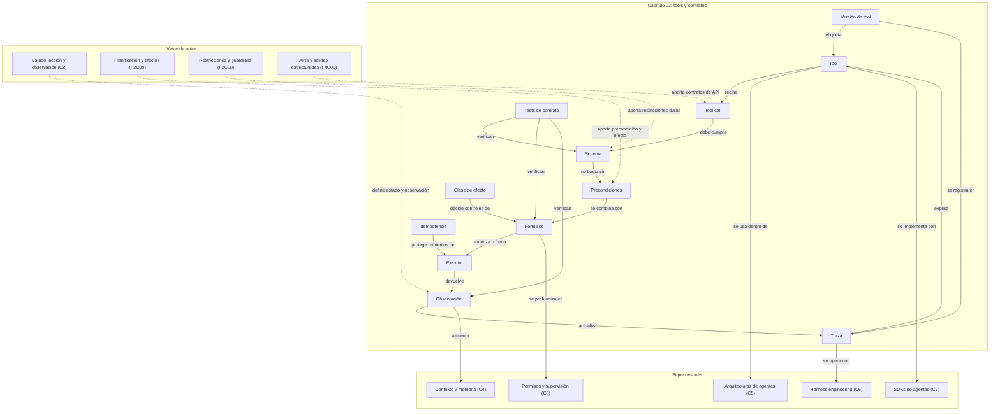

::: {.fasciculo-subtitle}
Facsímil 5 · Agentes y orquestación
:::

# Capítulo 03: Tools y contratos operativos: function calling

## Cuando el modelo deja de hablar solo

Imagina que alguien pide: “revisa si este alumno puede matricularse y dime qué falta”. Si el sistema solo genera texto, puede explicar posibilidades: quizá falta pago, quizá falta documentación, quizá hay una norma. Pero no sabe el estado real del expediente.

Una tool cambia la escena. El modelo puede proponer: “consulta el expediente”, “busca la norma aplicable”, “calcula el importe pendiente”. Aun así, hay una frase que conviene grabar desde el principio: **el modelo no ejecuta la tool**. El modelo propone una llamada. La aplicación valida, autoriza, ejecuta y devuelve una observación. Ahí empieza la ingeniería seria.

OpenAI describe function calling como una forma de conectar modelos con datos y acciones proporcionadas por tu aplicación mediante herramientas definidas por schema.^[OpenAI. (2026). *Function calling*. https://developers.openai.com/api/docs/guides/function-calling. Consultado el 10 de junio de 2026. La guía explica el flujo de tool calling como conversación en varios pasos: request con tools, tool call del modelo, ejecución en la aplicación, devolución del resultado y respuesta final.] Anthropic usa una idea equivalente: se definen tools con `name`, `description` e `input_schema`; Claude puede devolver un bloque `tool_use`, y la aplicación responde después con `tool_result`.^[Anthropic. (2026). *How to implement tool use*. https://docs.anthropic.com/en/docs/agents-and-tools/tool-use/implement-tool-use. Consultado el 10 de junio de 2026.]

## Qué no es una tool

Una tool no es una función cualquiera pegada al modelo. Si pones una función enorme llamada `do_everything`, el modelo no tiene una interfaz clara: tiene una puerta opaca.

Tampoco es un permiso. Que el modelo pueda pedir `send_email` no significa que deba poder enviarlo. La autorización debe vivir fuera del modelo: usuario, rol, estado del caso, presupuesto, entorno, doble revisión si el efecto lo exige.

Y no es garantía de verdad. Una tool puede traer datos reales, pero el sistema aún puede elegir mal la tool, pasar argumentos incompletos, interpretar mal la observación o repetir una llamada sin necesidad. Function calling reduce una parte del problema: convierte intención textual en llamada estructurada. No sustituye validación, diseño de dominio ni evaluación.

## La definición útil

Para este libro, una tool es:

> Una interfaz operativa, validada y trazable, que permite a un agente consultar, calcular o producir un efecto fuera del texto, bajo un contrato explícito de entrada, permisos, ejecución, salida y observación.

El matiz importante está en la palabra **contrato**. En software clásico, una función se escribe pensando en otro programador o en otro servicio determinista. En agentes, la tool se diseña para un sistema no determinista que decide cuándo usarla.^[Anthropic. (2025). *Writing effective tools for agents — with agents*. https://www.anthropic.com/engineering/writing-tools-for-agents. Consultado el 10 de junio de 2026. El artículo plantea que las tools para agentes son contratos entre sistemas deterministas y agentes no deterministas, y recomienda diseñarlas con evaluaciones, nombres claros, respuestas útiles y eficiencia de contexto.] Por eso el contrato debe explicar más que tipos: debe explicar intención, límites, precondiciones, errores recuperables y forma de observar el efecto.

Una forma práctica de verlo:

| Si tienes... | Todavía no tienes una buena tool hasta que... |
|---|---|
| Una función Python | Definas schema, permisos, errores y observación. |
| Un endpoint REST | Separes permisos, límites, idempotencia y salida útil para el agente. |
| Un conector a base de datos | Reduzcas alcance, evites queries libres y devuelvas evidencia mínima. |
| Un navegador o buscador | Decidas qué dominios, qué profundidad, qué coste y qué formato de cita aceptas. |
| Un comando de terminal | Encierres alcance, tiempo, rutas permitidas y captura de salida. |

## La anatomía formal de una tool

**Ejemplo de fórmula.** Vamos a escribir una tool como una tupla:

$$
\mathcal{T} =
(n, d, X, Y, \operatorname{pre}, \operatorname{perm}, E, \operatorname{obs}, \operatorname{err}, \tau)
$$

| Símbolo | Significado | Ejemplo concreto |
|---|---|---|
| \(\mathcal{T}\) | Tool completa. | `consultar_expediente`. |
| \(n\) | Nombre inequívoco. | `get_student_record`, no `get_data`. |
| \(d\) | Descripción operativa. | Cuándo usarla, cuándo no y qué no devuelve. |
| \(X\) | Schema de entrada. | `case_id:string`, `include_payments:boolean`. |
| \(Y\) | Schema de salida. | `status`, `missing_documents`, `balance_due`. |
| \(\operatorname{pre}\) | Precondiciones. | El `case_id` existe y el expediente pertenece al usuario autorizado. |
| \(\operatorname{perm}\) | Política de permiso. | `allow`, `approval_required` o `deny`. |
| \(E\) | Ejecutor determinista. | Código que consulta el sistema académico. |
| \(\operatorname{obs}\) | Normalizador de observación. | Convierte respuesta interna en resultado breve para el agente. |
| \(\operatorname{err}\) | Catálogo de errores recuperables. | `not_found`, `validation_error`, `timeout`, `permission_required`. |
| \(\tau\) | Evento de traza. | Registro con usuario, tool, argumentos, latencia, resultado y coste. |

**Ejemplo de fórmula.** La llamada que propone el modelo no entra directamente en \(E\). Primero se filtra:

$$
\operatorname{valid}(c, \mathcal{T}, s_t) =
\operatorname{schema}(c.args, X)
\land \operatorname{pre}(c.args, s_t)
\land \operatorname{perm}(c, s_t) \neq \text{deny}
\land \operatorname{budget}(c, s_t) \le B_t
$$

| Símbolo | Significado | Ejemplo concreto |
|---|---|---|
| \(c\) | Tool call propuesta por el modelo. | `{"name":"consultar_expediente","args":{"case_id":"EXP-42"}}`. |
| \(c.args\) | Argumentos que acompañan la llamada. | `case_id`, `include_payments`. |
| \(s_t\) | Estado operativo en el paso actual. | Usuario, objetivo, permisos, evidencias y presupuesto restante. |
| \(X\) | Schema de entrada permitido. | JSON Schema con campos obligatorios y tipos. |
| \(B_t\) | Presupuesto restante. | Máximo de llamadas, tiempo, coste o filas devueltas. |

Si la validación pasa, la ejecución produce una observación:

$$
o_{t+1} =
\operatorname{obs}
\left(
E(c.args)
\right)
$$

| Símbolo | Significado | Ejemplo concreto |
|---|---|---|
| \(o_{t+1}\) | Observación que vuelve al agente. | `{"ok":true,"balance_due":180,"missing":["DNI"]}`. |
| \(E(c.args)\) | Resultado bruto del sistema real. | Respuesta del backend académico. |
| \(\operatorname{obs}\) | Adaptador hacia el agente. | Quita ruido, limita tamaño y conserva evidencia. |

El estado del agente se actualiza así:

$$
s_{t+1} = T(s_t, c, o_{t+1}, \tau_{t+1})
$$

| Símbolo | Significado | Ejemplo concreto |
|---|---|---|
| \(T\) | Función de transición del sistema. | Marca expediente consultado y descuenta presupuesto. |
| \(\tau_{t+1}\) | Evento de traza de la llamada. | `tool.validated`, `tool.executed`, `tool.denied`. |
| \(s_{t+1}\) | Estado posterior. | El agente ya sabe qué falta y qué puede hacer después. |

JSON Schema aporta un vocabulario estándar para validar estructura: tipos, propiedades, requisitos, enumeraciones, rangos y composición de constraints.^[JSON Schema. (2020). *JSON Schema Validation: A Vocabulary for Structural Validation of JSON*. https://json-schema.org/draft/2020-12/json-schema-validation.] Pero un schema solo valida forma. No sabe si el usuario puede consultar ese expediente, si conviene ejecutar ahora o si la llamada supera el presupuesto.

## Fecha de corte de herramientas

Fecha de corte: 10 de junio de 2026.  
Fuentes consultadas ese día: documentación oficial de OpenAI sobre tools, function calling y Structured Outputs; documentación oficial de Anthropic sobre tool use; artículo técnico de Anthropic sobre diseño de tools para agentes; JSON Schema Validation; RFC 9110 para idempotencia HTTP; OpenTelemetry Tracing API.

Lo estable es el patrón: el modelo propone, la aplicación valida, la aplicación ejecuta, el resultado vuelve como observación y todo queda trazado. Lo cambiante son nombres de parámetros, SDKs, modelos compatibles, tools hospedadas, límites de proveedor y formatos concretos de streaming.

## El flujo completo, paso a paso

OpenAI resume el flujo en cinco pasos: enviar una petición con tools disponibles, recibir una tool call, ejecutar código en la aplicación, devolver la salida de la tool al modelo y recibir respuesta final o más llamadas.^[OpenAI. (2026). *Function calling*. Consultado el 10 de junio de 2026.] Esa descripción parece lineal, pero en producción conviene verla como un pipeline con puertas.

1. El usuario pide una tarea.
2. El sistema prepara estado: objetivo, permisos, contexto, tools disponibles y presupuesto.
3. El modelo propone una tool call.
4. El runtime valida schema.
5. El runtime comprueba precondiciones.
6. El runtime decide permiso.
7. El runtime aplica límites de coste, tiempo, tamaño y frecuencia.
8. El adaptador ejecuta la operación real.
9. El resultado se normaliza como observación.
10. La observación se devuelve al modelo y se añade a la traza.

Structured Outputs no es lo mismo que function calling. OpenAI distingue entre usar schema para llamar tools y usar schema para que la respuesta final del modelo tenga una forma concreta.^[OpenAI. (2026). *Structured model outputs*. https://developers.openai.com/api/docs/guides/structured-outputs. Consultado el 10 de junio de 2026. La guía diferencia function calling cuando se conectan modelos con herramientas o datos del sistema, y `response_format` o `text.format` cuando se quiere estructurar la salida final.] En lenguaje llano:

| Necesitas... | Usa principalmente... | Ejemplo |
|---|---|---|
| Que el modelo pida una acción externa | Function calling | `consultar_expediente(case_id)` |
| Que la respuesta final tenga JSON válido y campos fijos | Structured output | `{"categoria":"matricula","prioridad":"alta"}` |
| Ambas cosas | Tool con schema + respuesta final estructurada | Consultar datos y devolver decisión en JSON validable. |

## Anatomía visual de una tool bien diseñada

<svg id="f5-c03-tool-contract" xmlns="http://www.w3.org/2000/svg" viewBox="0 0 1500 1040" role="img" aria-label="Arquitectura de una tool bien diseñada con contrato, validadores, permisos, ejecutor, observación y traza">
  <defs>
    <marker id="f5c03-arrow" viewBox="0 0 10 10" refX="9" refY="5" markerWidth="7" markerHeight="7" orient="auto-start-reverse">
      <path d="M 0 0 L 10 5 L 0 10 z" fill="#111111"/>
    </marker>
    <marker id="f5c03-arrow-soft" viewBox="0 0 10 10" refX="9" refY="5" markerWidth="6" markerHeight="6" orient="auto-start-reverse">
      <path d="M 0 0 L 10 5 L 0 10 z" fill="#666666"/>
    </marker>
    <pattern id="f5c03-grid" width="20" height="20" patternUnits="userSpaceOnUse">
      <path d="M 20 0 L 0 0 0 20" fill="none" stroke="#EEEEEE" stroke-width="1"/>
    </pattern>
    <style>
      #f5-c03-tool-contract .frame { fill: #FFFFFF; stroke: #111111; stroke-width: 2; }
      #f5-c03-tool-contract .panel { fill: #FFFFFF; stroke: #111111; stroke-width: 1.45; }
      #f5-c03-tool-contract .soft { fill: #F7F7F7; stroke: #111111; stroke-width: 1.25; }
      #f5-c03-tool-contract .dark { fill: #111111; stroke: #111111; stroke-width: 1.2; }
      #f5-c03-tool-contract .wire { fill: none; stroke: #111111; stroke-width: 1.35; marker-end: url(#f5c03-arrow); }
      #f5-c03-tool-contract .wire-soft { fill: none; stroke: #777777; stroke-width: 1.15; stroke-dasharray: 7 5; marker-end: url(#f5c03-arrow-soft); }
      #f5-c03-tool-contract .title { font: 700 17px Arial, sans-serif; fill: #111111; }
      #f5-c03-tool-contract .label { font: 700 12px Arial, sans-serif; fill: #111111; }
      #f5-c03-tool-contract .small { font: 11px Arial, sans-serif; fill: #555555; }
      #f5-c03-tool-contract .tiny { font: 10px Arial, sans-serif; fill: #666666; }
      #f5-c03-tool-contract text { font-family: Arial, sans-serif; }
    </style>
  </defs>

  <rect x="24" y="24" width="1452" height="992" rx="18" class="frame"/>
  <text x="750" y="64" text-anchor="middle" font-size="27" font-weight="700" fill="#111111">Tool como contrato operativo</text>
  <text x="750" y="92" text-anchor="middle" font-size="13" fill="#555555">El modelo propone. El sistema valida, autoriza, ejecuta, observa y registra.</text>
  <rect x="58" y="122" width="1384" height="792" rx="14" fill="url(#f5c03-grid)" stroke="#DDDDDD"/>

  <g>
    <text x="88" y="154" class="label">MODELO</text>
    <rect x="82" y="176" width="196" height="134" rx="12" class="panel"/>
    <text x="180" y="207" text-anchor="middle" class="title">Tool call</text>
    <text x="180" y="233" text-anchor="middle" class="small">name + args</text>
    <text x="180" y="253" text-anchor="middle" class="small">intención textual</text>
    <line x1="108" y1="272" x2="252" y2="272" stroke="#DDDDDD"/>
    <text x="180" y="292" text-anchor="middle" class="tiny">aún no se ejecuta</text>

    <text x="334" y="154" class="label">CONTRATO</text>
    <rect x="318" y="176" width="256" height="310" rx="14" class="soft"/>
    <rect x="342" y="206" width="208" height="54" rx="9" class="dark"/>
    <text x="446" y="238" text-anchor="middle" font-size="14" font-weight="700" fill="#FFFFFF">Definición pública</text>
    <text x="446" y="286" text-anchor="middle" class="small">nombre inequívoco</text>
    <text x="446" y="306" text-anchor="middle" class="small">descripción de uso</text>
    <text x="446" y="326" text-anchor="middle" class="small">qué NO devuelve</text>
    <rect x="342" y="352" width="208" height="94" rx="10" class="panel"/>
    <text x="446" y="381" text-anchor="middle" class="title">Schemas</text>
    <text x="446" y="407" text-anchor="middle" class="small">entrada X</text>
    <text x="446" y="426" text-anchor="middle" class="small">salida Y</text>

    <text x="636" y="154" class="label">GATES ANTES DE EJECUTAR</text>
    <rect x="616" y="176" width="330" height="502" rx="14" class="panel"/>
    <rect x="646" y="210" width="120" height="70" rx="10" class="soft"/>
    <text x="706" y="238" text-anchor="middle" class="label">Schema</text>
    <text x="706" y="258" text-anchor="middle" class="tiny">tipos, enum</text>
    <rect x="796" y="210" width="120" height="70" rx="10" class="soft"/>
    <text x="856" y="238" text-anchor="middle" class="label">Precondición</text>
    <text x="856" y="258" text-anchor="middle" class="tiny">estado válido</text>
    <rect x="646" y="316" width="120" height="70" rx="10" class="soft"/>
    <text x="706" y="344" text-anchor="middle" class="label">Permiso</text>
    <text x="706" y="364" text-anchor="middle" class="tiny">scope y rol</text>
    <rect x="796" y="316" width="120" height="70" rx="10" class="soft"/>
    <text x="856" y="344" text-anchor="middle" class="label">Budget</text>
    <text x="856" y="364" text-anchor="middle" class="tiny">coste, filas</text>
    <rect x="646" y="422" width="120" height="70" rx="10" class="soft"/>
    <text x="706" y="450" text-anchor="middle" class="label">Idempotencia</text>
    <text x="706" y="470" text-anchor="middle" class="tiny">clave única</text>
    <rect x="796" y="422" width="120" height="70" rx="10" class="soft"/>
    <text x="856" y="450" text-anchor="middle" class="label">Timeout</text>
    <text x="856" y="470" text-anchor="middle" class="tiny">retry acotado</text>
    <rect x="676" y="542" width="210" height="82" rx="11" class="dark"/>
    <text x="781" y="574" text-anchor="middle" font-size="14" font-weight="700" fill="#FFFFFF">Decisión</text>
    <text x="781" y="600" text-anchor="middle" font-size="11" fill="#E8E8E8">execute · ask approval · reject</text>

    <text x="998" y="154" class="label">EJECUCIÓN</text>
    <rect x="988" y="176" width="230" height="214" rx="14" class="soft"/>
    <text x="1103" y="212" text-anchor="middle" class="title">Tool adapter</text>
    <text x="1103" y="241" text-anchor="middle" class="small">traduce contrato</text>
    <text x="1103" y="260" text-anchor="middle" class="small">a API real</text>
    <rect x="1018" y="296" width="170" height="58" rx="10" class="panel"/>
    <text x="1103" y="329" text-anchor="middle" class="label">Sistema externo</text>

    <text x="1000" y="430" class="label">VUELTA AL AGENTE</text>
    <rect x="988" y="452" width="230" height="226" rx="14" class="panel"/>
    <rect x="1018" y="486" width="170" height="62" rx="10" class="soft"/>
    <text x="1103" y="514" text-anchor="middle" class="label">Normalizador</text>
    <text x="1103" y="533" text-anchor="middle" class="tiny">menos ruido</text>
    <rect x="1018" y="584" width="170" height="58" rx="10" class="dark"/>
    <text x="1103" y="617" text-anchor="middle" font-size="13" font-weight="700" fill="#FFFFFF">Observación</text>

    <text x="1262" y="154" class="label">TRAZA</text>
    <rect x="1250" y="176" width="158" height="502" rx="14" class="soft"/>
    <text x="1329" y="212" text-anchor="middle" class="label">trace_id</text>
    <line x1="1274" y1="232" x2="1384" y2="232" stroke="#D0D0D0"/>
    <text x="1329" y="266" text-anchor="middle" class="tiny">tool.proposed</text>
    <text x="1329" y="296" text-anchor="middle" class="tiny">schema.checked</text>
    <text x="1329" y="326" text-anchor="middle" class="tiny">permission.checked</text>
    <text x="1329" y="356" text-anchor="middle" class="tiny">budget.checked</text>
    <text x="1329" y="386" text-anchor="middle" class="tiny">tool.executed</text>
    <text x="1329" y="416" text-anchor="middle" class="tiny">result.normalized</text>
    <text x="1329" y="446" text-anchor="middle" class="tiny">state.updated</text>
    <line x1="1274" y1="476" x2="1384" y2="476" stroke="#D0D0D0"/>
    <text x="1329" y="508" text-anchor="middle" class="tiny">latencia</text>
    <text x="1329" y="536" text-anchor="middle" class="tiny">coste</text>
    <text x="1329" y="564" text-anchor="middle" class="tiny">resultado</text>
    <text x="1329" y="592" text-anchor="middle" class="tiny">stop reason</text>

    <path d="M278 243 C298 243 298 243 318 243" class="wire"/>
    <path d="M574 331 C596 331 596 331 616 331" class="wire"/>
    <path d="M946 583 C966 583 966 272 988 272" class="wire"/>
    <path d="M1218 325 C1240 325 1230 427 1250 427" class="wire-soft"/>
    <path d="M1218 613 C1240 613 1230 427 1250 427" class="wire-soft"/>
    <path d="M1103 390 L1103 452" class="wire"/>
    <path d="M988 613 C846 744 428 746 180 310" class="wire-soft"/>

    <rect x="82" y="738" width="1136" height="116" rx="14" class="panel"/>
    <text x="112" y="774" class="title">Regla de ingeniería</text>
    <text x="112" y="804" class="small">Una tool no termina al devolver bytes. Termina cuando hay observación estructurada, estado actualizado y traza suficiente para explicar qué ocurrió.</text>
    <text x="112" y="832" class="small">Si una operación puede repetirse por timeout o retry, necesita clave de idempotencia o una forma clara de detectar que el efecto ya ocurrió.</text>
  </g>

  <text opacity="0.55" x="1434" y="970" text-anchor="end" font-size="11" fill="#777777">IA para gente curiosa / Facsímil 05 / Capítulo 03 / 686f6c61</text>
</svg>

IA para gente curiosa / Facsímil 05 / Capítulo 03 / 686f6c61

## OpenAI y Anthropic: el mismo patrón con envoltorios distintos

No hace falta memorizar sintaxis todavía. El capítulo 07 destripará SDKs. Aquí queremos entender el contrato mental.

| Pieza | OpenAI | Anthropic | Qué debe llevarse el lector |
|---|---|---|---|
| Declarar tools | Parámetro `tools` en la petición; función definida con schema. | Parámetro `tools` con `name`, `description` e `input_schema`. | El modelo ve una lista de capacidades permitidas. |
| Salida del modelo | Tool call con nombre y argumentos. | Bloque `tool_use` con `id`, `name` e `input`. | La salida es una propuesta, no una ejecución. |
| Ejecución | La aplicación ejecuta tu código y devuelve resultado. | La aplicación ejecuta tu código y devuelve `tool_result`. | La frontera operativa está en tu runtime. |
| Schema | JSON Schema para argumentos; Structured Outputs cuando toca. | JSON Schema en `input_schema`, con descripciones detalladas. | El schema reduce errores de forma, no decide permisos. |
| Control | `tool_choice`, hosted tools, function tools, MCP, Agents SDK. | Tools cliente, server tools, MCP, Claude Code, evaluaciones. | El proveedor ayuda; la arquitectura sigue siendo tu responsabilidad. |

OpenAI permite guiar el uso de tools con `tool_choice`: dejar que el modelo decida, exigir alguna tool, forzar una tool concreta o restringir el subconjunto disponible.^[OpenAI. (2026). *Function calling*. Consultado el 10 de junio de 2026. La guía documenta `tool_choice`, `allowed_tools` y `parallel_tool_calls` para controlar cuándo y cuántas funciones puede llamar el modelo.] Anthropic expone opciones equivalentes: `auto`, `any`, `tool` y `none`, además de herramientas estrictas cuando se quiere forzar llamada y schema con más control.^[Anthropic. (2026). *How to implement tool use*. Consultado el 10 de junio de 2026. La documentación describe `tool_choice`, `strict`, `input_examples` y recomendaciones de descripción.] Esto es más importante de lo que parece: una tool disponible no siempre debe estar disponible **en este turno**.

El patrón académico tampoco nace de la nada. Toolformer exploró cómo los modelos podían aprender a invocar APIs externas mediante ejemplos generados automáticamente.^[Schick, T., Dwivedi-Yu, J., Dessì, R., Raileanu, R., Lomeli, M., Zettlemoyer, L., Cancedda, N. y Scialom, T. (2023). *Toolformer: Language Models Can Teach Themselves to Use Tools*. https://doi.org/10.48550/arXiv.2302.04761.] Gorilla se centró en producir llamadas de API más precisas y apoyarse en recuperación documental para adaptarse a cambios de documentación.^[Patil, S. G., Zhang, T., Wang, X. y Gonzalez, J. E. (2023). *Gorilla: Large Language Model Connected with Massive APIs*. https://doi.org/10.48550/arXiv.2305.15334.] ToolLLM construyó ToolBench con más de 16.000 APIs reales para entrenar y evaluar uso de herramientas.^[Qin, Y. et al. (2023). *ToolLLM: Facilitating Large Language Models to Master 16000+ Real-world APIs*. https://doi.org/10.48550/arXiv.2307.16789.]

La lección común es sencilla y exigente: usar tools no es “darle internet al modelo”. Es enseñarle un catálogo limitado de acciones, con contrato, ejemplos, observaciones y evaluación.

### La forma mental de una llamada OpenAI

No necesitamos memorizar el SDK ahora, pero sí entender la forma de los objetos. En Responses API, una tool de función se declara con `type`, `name`, `description` y `parameters`. Si el modelo decide usarla, devuelve un elemento de tipo `function_call`; tu aplicación ejecuta y añade un `function_call_output` con el mismo `call_id`.

A fecha de corte de este capítulo, la guía oficial de modelos recomienda empezar con `gpt-5.5` para razonamiento complejo y trabajo de código, y bajar a variantes como `gpt-5.4-mini` o `gpt-5.4-nano` cuando mandan coste y latencia.^[OpenAI. (2026). *Models*. https://developers.openai.com/api/docs/models. Consultado el 10 de junio de 2026. La página de modelos indica `gpt-5.5` como punto de partida para tareas complejas y lista variantes GPT-5.4 para menor coste o latencia.] Por eso el ejemplo usa `gpt-5.5`, pero en producción conviene fijar el modelo en configuración y revisarlo al actualizar la fecha de corte.

```json
{
  "model": "gpt-5.5",
  "input": "Revisa el expediente EXP-42 y dime qué falta.",
  "tools": [
    {
      "type": "function",
      "name": "get_student_record",
      "description": "Consulta un expediente académico concreto. Úsala solo si hay case_id explícito.",
      "parameters": {
        "type": "object",
        "properties": {
          "case_id": { "type": "string" },
          "include_payments": { "type": "boolean" }
        },
        "required": ["case_id"],
        "additionalProperties": false
      }
    }
  ],
  "tool_choice": "auto"
}
```

La respuesta intermedia del modelo no es la respuesta final. Es una petición de ejecución:

```json
{
  "type": "function_call",
  "call_id": "call_exp_42",
  "name": "get_student_record",
  "arguments": "{\"case_id\":\"EXP-42\",\"include_payments\":true}"
}
```

Tu aplicación valida, consulta el sistema real y devuelve la observación:

```json
{
  "type": "function_call_output",
  "call_id": "call_exp_42",
  "output": "{\"ok\":true,\"missing_documents\":[\"DNI\"],\"balance_due\":180}"
}
```

Lo importante no es la sintaxis exacta, que cambia entre APIs y SDKs. Lo importante es que el `call_id` une propuesta y resultado. Sin esa unión, la traza pierde causalidad.

### La forma mental de una llamada Anthropic

En Anthropic la definición se parece, pero la nomenclatura cambia: `input_schema`, bloque `tool_use` y bloque posterior `tool_result`.

```json
{
  "model": "claude-opus-4-7",
  "max_tokens": 1024,
  "tools": [
    {
      "name": "get_student_record",
      "description": "Consulta un expediente académico concreto. No devuelve datos de otros expedientes ni envía mensajes.",
      "input_schema": {
        "type": "object",
        "properties": {
          "case_id": { "type": "string" },
          "include_payments": { "type": "boolean" }
        },
        "required": ["case_id"]
      }
    }
  ],
  "messages": [
    { "role": "user", "content": "Revisa el expediente EXP-42 y dime qué falta." }
  ]
}
```

El modelo puede responder con texto y con una petición de tool:

```json
{
  "role": "assistant",
  "content": [
    { "type": "text", "text": "Voy a consultar el expediente indicado." },
    {
      "type": "tool_use",
      "id": "toolu_exp_42",
      "name": "get_student_record",
      "input": { "case_id": "EXP-42", "include_payments": true }
    }
  ]
}
```

Y la aplicación devuelve:

```json
{
  "role": "user",
  "content": [
    {
      "type": "tool_result",
      "tool_use_id": "toolu_exp_42",
      "content": "{\"ok\":true,\"missing_documents\":[\"DNI\"],\"balance_due\":180}"
    }
  ]
}
```

En ambos proveedores se repite la misma disciplina: el modelo propone, el runtime ejecuta y el resultado vuelve con un identificador que permite continuar el bucle.

## Qué debe tener una tool de producción

Una tool buena se puede revisar como revisaríamos una API interna. La diferencia es que aquí el consumidor inmediato puede ser un modelo, así que la descripción debe ser más didáctica de lo normal.

| Pieza | Qué significa | Qué aporta el número o dato | Señal de que está bien diseñada |
|---|---|---|---|
| Nombre | Verbo específico y objeto claro. | No hay número; importa semántica. | `get_invoice_status` se entiende sin leer código. |
| Descripción | Cuándo usarla, cuándo no y qué devuelve. | Longitud suficiente para evitar ambigüedad. | Incluye límites y casos en los que debe pedir aclaración. |
| Input schema | Campos, tipos, enums y rangos. | Reduce combinaciones inválidas. | Un argumento malo falla antes de tocar sistemas reales. |
| Output schema | Forma de la observación. | Facilita actualizar estado sin parsear texto libre. | El agente sabe si hubo `ok`, `error`, `evidence` y `next_allowed`. |
| Precondiciones | Hechos que deben cumplirse antes. | No son tipos; son reglas del dominio. | “No consultar saldo si no hay `case_id` validado”. |
| Permisos | Quién puede pedir qué acción. | Puede depender de rol, caso, entorno y canal. | La tool puede rechazar aunque el modelo la pida bien. |
| Clase de efecto | Lectura, escritura reversible, efecto externo. | Decide aprobación, idempotencia y trazabilidad. | Leer no se trata igual que enviar, borrar o comprar. |
| Idempotencia | Repetición sin duplicar efecto. | Clave única por operación. | Un retry no crea dos tickets ni manda dos emails. |
| Timeout y retry | Tiempo máximo y reintentos. | Limita latencia y coste. | Falla con error recuperable, no cuelga el bucle. |
| Límite de salida | Máximo de filas, bytes o fragmentos. | Protege contexto y coste. | Devuelve resumen y puntero, no una base entera. |
| Traza | Registro de eventos. | Permite depurar y comparar versiones. | Guarda tool, args saneados, permiso, latencia y resultado. |

La idempotencia no es una palabra decorativa. En HTTP, RFC 9110 define métodos idempotentes como aquellos cuyo efecto pretendido sobre el servidor es el mismo si se ejecutan una o varias veces.^[Fielding, R., Nottingham, M. y Reschke, J. (2022). *HTTP Semantics* (RFC 9110). https://datatracker.ietf.org/doc/html/rfc9110. Consultado el 10 de junio de 2026.] En agentes esto aparece cada día: si una tool se reintenta tras un timeout, ¿sabemos si el ticket ya se creó? ¿Tenemos una clave `operation_id`? ¿Podemos comprobar estado antes de repetir?

### Ficha completa de contrato

Esta ficha es la que me gustaría ver en un proyecto real antes de conectar una tool al modelo. Es deliberadamente más larga que la función: obliga a pensar.

```yaml
tool_contract:
  name: get_student_record
  version: 1.2.0
  owner: equipo_academico
  description: >
    Consulta un expediente académico concreto a partir de un case_id.
    Usar solo cuando el usuario haya dado un identificador de expediente.
    No devuelve documentos completos ni datos de expedientes no vinculados al usuario autorizado.
  when_to_use:
    - Hay un case_id explícito.
    - La tarea necesita estado académico real.
    - El usuario tiene permiso sobre el expediente.
  when_not_to_use:
    - El usuario pregunta por normativa general.
    - Falta case_id.
    - La tarea puede resolverse con información ya observada.
  effect_class: read
  input_schema:
    type: object
    required: [case_id]
    additionalProperties: false
    properties:
      case_id:
        type: string
        pattern: "^EXP-[0-9]{2,8}$"
      include_payments:
        type: boolean
        default: false
  output_schema:
    type: object
    required: [ok, record, evidence]
    properties:
      ok:
        type: boolean
      record:
        type: object
      evidence:
        type: array
      error:
        type: string
        enum: [not_found, permission_required, timeout, partial_result]
  preconditions:
    - case_id debe existir.
    - El usuario debe estar vinculado al expediente.
    - El entorno debe ser lectura o simulación.
  permissions:
    read_scope: academic.record.read
    write_scope: none
    approval_required: false
  budgets:
    timeout_ms: 1500
    max_retries: 1
    max_rows: 1
    max_output_tokens: 900
  idempotency:
    required: false
    operation_id_field: null
  trace_fields:
    - trace_id
    - user_id_hash
    - tool_name
    - tool_version
    - case_id_hash
    - permission_decision
    - latency_ms
    - result_ok
    - error
  examples:
    valid:
      args: { case_id: "EXP-42", include_payments: true }
    invalid:
      args: { case_id: "42" }
      expected_error: validation_error
```

La parte que muchos equipos se saltan es `when_not_to_use`. Sin esa sección, el modelo aprende cuándo una tool puede servir, pero no cuándo está de más. Una buena tool no solo dice “esto puedo hacerlo”; también dice “esto no es mi trabajo”.

### Prompt, structured output, tool o agente

Antes de diseñar una tool conviene preguntar si realmente hace falta. No todo problema que admite una tool mejora con una tool.

| Necesidad real | Mecanismo suficiente | Por qué | Señal de que necesitas subir de nivel |
|---|---|---|---|
| Redactar, resumir o transformar texto cerrado | Prompt | La información ya está en la entrada. | La salida debe ser validada por máquina. |
| Obtener JSON con campos fijos | Structured output | Necesitas contrato de salida, no acción externa. | El modelo necesita datos que no están en el prompt. |
| Consultar estado, calcular o llamar un sistema | Tool | Hace falta una capacidad fuera del modelo. | Una sola llamada no basta para completar la tarea. |
| Decidir varias acciones según observaciones | Agente | Hay bucle: estado, acción, observación, parada. | Necesitas memoria, permisos, evaluación y harness. |

Ejemplo: “clasifica este ticket en una de cinco categorías” puede ser structured output. “Clasifica este ticket consultando si el alumno tiene pago pendiente” pide una tool. “Consulta pago, revisa norma, prepara respuesta y detente si falta aprobación” ya pide agente o workflow con tools.

### Matriz de clase de efecto

La clase de efecto define cuánto control exige una tool. No todas las tools son iguales.

| Clase | Qué hace | Ejemplo | Controles mínimos |
|---|---|---|---|
| `read` | Lee estado sin cambiarlo. | `get_student_record`, `search_policy`. | Permiso de lectura, límite de salida, traza. |
| `compute` | Calcula sin tocar sistemas externos. | `calculate_installment_plan`. | Validación numérica, rango, tests deterministas. |
| `prepare_change` | Prepara una propuesta revisable. | `prepare_email_proposal`, `prepare_sql_migration`. | Evidencia, diff o preview, estado `approval_required`. |
| `reversible_write` | Cambia estado con reversión clara. | `create_ticket`, `add_internal_note`. | Idempotencia, owner, rollback, traza completa. |
| `external_effect` | Produce efecto fuera del sistema. | Enviar mensaje, publicar, pagar, desplegar. | Aprobación explícita, doble validación, `operation_id`, postcondición. |
| `privileged_operation` | Usa permisos altos o alcance amplio. | Cambiar permisos, exportar datos, tocar producción. | Separación de rol, revisión humana y entorno controlado. |

La frontera no está en si la tool “parece peligrosa”; está en qué cambia después. Una lectura amplia puede ser más delicada que una escritura pequeña. Por eso la clase de efecto debe decidirse mirando datos, alcance, reversibilidad y coste.

### Nombres y descripciones: la semántica también es ingeniería

El modelo elige tools por lo que ve: nombre, descripción, schema y ejemplos. Anthropic insiste en que las descripciones detalladas son uno de los factores más importantes para el rendimiento de tools, especialmente cuando hay varias herramientas parecidas.^[Anthropic. (2026). *How to implement tool use*. Consultado el 10 de junio de 2026. La documentación recomienda descripciones detalladas, ejemplos de entrada y respuestas de alto valor contextual.] Una descripción pobre no es estética pobre; es una fuente de llamadas equivocadas.

| Tool floja | Problema | Tool mejor | Por qué mejora |
|---|---|---|---|
| `get_data` | No dice dominio, alcance ni salida. | `get_student_payment_status` | Acota entidad y propósito. |
| `search` | Compite con cualquier búsqueda. | `search_academic_policy` | Limita corpus y expectativa de evidencia. |
| `send_message` | Mezcla preparar, enviar y canal. | `prepare_student_reply_for_review` | Evita efecto externo y deja revisión. |
| `run_query` | Abre demasiada libertad. | `get_enrollment_blockers` | Sustituye SQL libre por intención segura. |
| `update_case` | No dice qué campo cambia. | `add_case_internal_note` | Efecto pequeño y auditable. |

Una regla útil: si el nombre de la tool exige leer tres párrafos para saber si toca usarla, el nombre falla. Si la descripción no explica cuándo **no** usarla, la tool invita a llamadas innecesarias.

## Para entenderlo: tres tools con distinto nivel de efecto

Miremos tres versiones de un sistema de soporte académico.

| Tool | Contrato aceptable | Qué puede salir mal si se diseña floja |
|---|---|---|
| `search_policy(query, max_results)` | Solo lectura, devuelve fragmentos citables, `max_results <= 5`, dominio documental cerrado. | Devuelve demasiado texto, mezcla normas antiguas y nuevas, no trae fuente. |
| `get_student_record(case_id)` | Solo lectura, exige permiso sobre el caso, devuelve campos mínimos. | Consulta expedientes equivocados o expone más datos de los necesarios. |
| `prepare_email_proposal(case_id, template_id, facts)` | No envía; genera propuesta trazable y deja `approval_required`. | Confunde preparar con enviar, no registra hechos usados o no deja revisión. |

Fíjate en el tercer caso. La tool útil no tiene por qué ser “enviar email”. Muchas veces la tool profesional es “preparar propuesta de email”, devolver un resumen verificable y dejar la decisión de envío a otra capa. El sistema puede ser más lento en la demo, pero mucho más gobernable en trabajo real.

## Errores recuperables: la observación también se diseña

Una tool no debería devolver solo “falló”. El agente necesita una observación que le permita decidir el siguiente paso.

| Error | Significa | Siguiente paso razonable |
|---|---|---|
| `validation_error` | Los argumentos no cumplen schema. | Corregir campos o pedir dato faltante. |
| `not_found` | El recurso no existe o no está dentro del alcance. | Pedir identificador correcto o cerrar con explicación. |
| `permission_required` | La acción necesita revisión o permiso adicional. | Solicitar aprobación o proponer alternativa de solo lectura. |
| `rate_limited` | Se agotó límite temporal. | Esperar, reducir llamadas o detener con evidencia. |
| `timeout` | La tool no respondió a tiempo. | Reintentar una vez si la operación es idempotente. |
| `partial_result` | Hay datos, pero no todos. | Explicar incertidumbre y no fingir completitud. |
| `conflict` | El estado cambió entre leer y actuar. | Releer estado y replantear acción. |

OpenTelemetry define las trazas como árboles de spans, donde cada span representa una operación y puede contener atributos, eventos, estado y relación con otros spans.^[OpenTelemetry. (2026). *Tracing API*. https://opentelemetry.io/docs/specs/otel/trace/api/. Consultado el 10 de junio de 2026.] Traducido al capítulo: cada tool call relevante merece un span o evento estructurado. Si luego algo no encaja, no revisas una conversación interminable: revisas la secuencia de decisiones.

## Cómo se prueban las tools

Una tool no se prueba solo llamando al caso feliz. Se prueba como contrato. La pregunta no es “¿funciona mi función?”, sino “¿mi agente puede usar esta interfaz sin romper el sistema cuando falten datos, cambie el estado o haya una observación parcial?”.

| Test | Qué comprueba | Entrada mínima | Resultado esperado |
|---|---|---|---|
| Caso válido | La tool ejecuta y normaliza observación. | `case_id=EXP-42` | `ok=true`, evidencia y traza. |
| Campo obligatorio ausente | El schema frena antes de ejecutar. | `{}` | `validation_error`, sin llamada externa. |
| Tipo incorrecto | El schema detecta forma inválida. | `case_id=42` | `validation_error` con detalle. |
| Enum fuera de catálogo | No acepta valores inventados. | `template_id=otro` | `validation_error`. |
| Permiso insuficiente | El modelo no se concede permiso. | usuario sin scope | `permission_required` o `deny`. |
| Presupuesto agotado | La tool no consume por encima del límite. | `cost_left=0` | `budget_exhausted`. |
| Timeout | La observación explica latencia o reintento. | backend lento | `timeout`, retry acotado. |
| Respuesta parcial | No se finge completitud. | backend incompleto | `partial_result` y evidencia disponible. |
| Retry idempotente | Repetir no duplica efecto. | mismo `operation_id` | mismo recurso o estado ya existente. |
| Tool innecesaria | El agente no llama si ya tiene datos. | estado con observación previa | no hay nueva tool call. |

También conviene probar la selección del modelo, no solo la función. Un dataset pequeño de evaluación puede tener pares de entrada y llamada esperada:

| Entrada del usuario | Tool esperada | Argumentos esperados | Qué evalúa |
|---|---|---|---|
| “Mira el expediente EXP-42” | `get_student_record` | `case_id=EXP-42` | Extracción de identificador. |
| “¿Qué dice la norma de matrícula?” | `search_academic_policy` | `query` sobre matrícula | Elegir búsqueda documental. |
| “Avísale de lo que falta” | `prepare_student_reply_for_review` | hechos ya observados | No enviar, solo preparar propuesta. |
| “No tengo número de expediente” | ninguna | ninguno | Pedir dato faltante. |

Ese dataset no tiene que ser enorme al principio. Veinte casos reales bien escritos valen más que doscientos ejemplos genéricos. La clave es que cubran errores de decisión: tool equivocada, argumentos incompletos, llamada innecesaria, permiso insuficiente y respuesta sin evidencia.

## Versionado y compatibilidad del contrato

Las tools cambian. Se añade un campo, se renombra una enum, se reduce un límite, cambia la API interna o se decide que una operación requiere aprobación. Si no versionas el contrato, el agente y tus tests pueden quedar desalineados sin que nadie lo note.

Semantic Versioning propone separar cambios mayores, menores y parches para comunicar compatibilidad de una API pública.^[Preston-Werner, T. (2026). *Semantic Versioning 2.0.0*. https://semver.org/. Consultado el 10 de junio de 2026.] No hace falta aplicarlo de forma dogmática, pero sí adoptar la disciplina:

| Cambio en la tool | Tipo recomendado | Por qué |
|---|---|---|
| Corregir descripción sin cambiar comportamiento | Patch | No rompe llamadas existentes. |
| Añadir campo opcional con valor por defecto | Minor | Amplía capacidad sin exigir cambios. |
| Añadir enum opcional | Minor | Puede mejorar selección sin romper schema anterior. |
| Añadir campo obligatorio | Major | Las llamadas antiguas fallan. |
| Renombrar la tool | Major | El modelo y los tests deben reaprender el identificador. |
| Cambiar significado de un campo | Major | Es peor que romper: parece compatible y no lo es. |
| Cambiar salida eliminando campos usados | Major | El estado posterior puede quedarse sin evidencia. |
| Reducir límite de filas o tamaño | Minor o major | Minor si sigue cumpliendo contrato; major si rompe casos aceptados. |
| Pasar de `prepare_change` a `external_effect` | Major | Cambia permisos, idempotencia y revisión. |

Regla práctica: si un prompt, test o agente ya desplegado podría interpretar mal la tool después del cambio, sube versión mayor o conserva una versión antigua durante un tiempo.

Un contrato versionado debería guardar al menos:

| Campo | Por qué importa |
|---|---|
| `tool_version` | Permite saber qué contrato vio el modelo. |
| `schema_hash` | Detecta cambios incluso si alguien olvida subir versión. |
| `description_hash` | Cambiar descripción puede cambiar selección de tool. |
| `deprecation_date` | Avisa cuándo deja de aceptarse una versión. |
| `migration_notes` | Explica cómo pasar de `v1` a `v2`. |
| `eval_suite` | Indica qué casos deben pasar antes de publicar. |

El versionado también debe aparecer en la traza. Si una ejecución falló, no basta con saber “usó `get_student_record`”. Necesitas saber si usó `get_student_record@1.1.0` o `get_student_record@2.0.0`, porque quizá el cambio estaba en el contrato, no en el modelo.

## Manos a la obra

**Práctica:** un contrato de tool ejecutable.

Kit ejecutable de este capítulo: `labs/f5/capitulo-practicas/`.

```bash
cd labs/f5/capitulo-practicas
python3 ops/run_f5_practices.py --chapter c03 --write --fail-on-invalid
```

Vamos a construir un mini runtime de tools con dependencias de la biblioteca estándar de Python. No llama a ningún proveedor. Justo por eso sirve: separa lo que depende del modelo de lo que debe controlar tu aplicación.

El ejercicio simula tres propuestas de tool call:

1. Una consulta válida de expediente.
2. Una llamada con argumentos inválidos.
3. Una propuesta de email que no se ejecuta porque requiere aprobación.

```python
from dataclasses import dataclass
from time import perf_counter
import json
import uuid


TYPE_MAP = {
    "string": str,
    "integer": int,
    "number": (int, float),
    "boolean": bool,
    "object": dict,
}


@dataclass
class ToolContract:
    name: str
    description: str
    input_schema: dict
    effect_class: str          # read, reversible_write, external_effect
    max_cost: float
    requires_approval: bool
    executor: object


def validate_args(args, schema):
    errors = []
    required = schema.get("required", [])
    properties = schema.get("properties", {})

    for field in required:
        if field not in args:
            errors.append(f"falta {field}")

    for field, value in args.items():
        if field not in properties:
            errors.append(f"campo extra: {field}")
            continue

        rule = properties[field]
        expected = TYPE_MAP.get(rule.get("type"))
        if expected and not isinstance(value, expected):
            errors.append(f"{field} deberia ser {rule['type']}")

        if "enum" in rule and value not in rule["enum"]:
            errors.append(f"{field} fuera de catalogo")

        if "maxLength" in rule and isinstance(value, str) and len(value) > rule["maxLength"]:
            errors.append(f"{field} demasiado largo")

    return errors


def check_permission(call, contract, state):
    if contract.requires_approval:
        return "approval_required"
    if contract.effect_class != "read" and not state["user"].get("can_write", False):
        return "permission_required"
    return "allow"


def get_student_record(case_id, include_payments=False):
    records = {
        "EXP-42": {
            "status": "incompleto",
            "missing_documents": ["DNI"],
            "balance_due": 180 if include_payments else None,
        }
    }
    if case_id not in records:
        return {"ok": False, "error": "not_found", "message": "expediente no encontrado"}
    return {"ok": True, "record": records[case_id]}


def prepare_email_proposal(case_id, template_id, facts):
    return {
        "ok": True,
        "proposal_id": f"MAIL-{case_id}-{template_id}",
        "summary": f"Propuesta preparada con {len(facts)} hechos verificados",
    }


TOOLS = {
    "get_student_record": ToolContract(
        name="get_student_record",
        description="Consulta un expediente academico concreto y devuelve solo campos operativos.",
        input_schema={
            "type": "object",
            "required": ["case_id"],
            "properties": {
                "case_id": {"type": "string", "maxLength": 20},
                "include_payments": {"type": "boolean"},
            },
        },
        effect_class="read",
        max_cost=0.01,
        requires_approval=False,
        executor=get_student_record,
    ),
    "prepare_email_proposal": ToolContract(
        name="prepare_email_proposal",
        description="Prepara una propuesta de email; no envia mensajes.",
        input_schema={
            "type": "object",
            "required": ["case_id", "template_id", "facts"],
            "properties": {
                "case_id": {"type": "string", "maxLength": 20},
                "template_id": {"type": "string", "enum": ["missing_docs", "payment_due"]},
                "facts": {"type": "object"},
            },
        },
        effect_class="external_effect",
        max_cost=0.03,
        requires_approval=True,
        executor=prepare_email_proposal,
    ),
}


def run_tool_call(call, state):
    trace = {
        "trace_id": state["trace_id"],
        "event": "tool.proposed",
        "tool": call.get("name"),
        "operation_id": call.get("operation_id") or str(uuid.uuid4()),
    }

    contract = TOOLS.get(call.get("name"))
    if not contract:
        trace["event"] = "tool.rejected"
        return {"ok": False, "error": "unknown_tool", "trace": trace}

    args = call.get("args", {})
    errors = validate_args(args, contract.input_schema)
    if errors:
        trace["event"] = "schema.rejected"
        return {"ok": False, "error": "validation_error", "details": errors, "trace": trace}

    if state["budget"]["cost_left"] < contract.max_cost:
        trace["event"] = "budget.rejected"
        return {"ok": False, "error": "budget_exhausted", "trace": trace}

    permission = check_permission(call, contract, state)
    if permission != "allow":
        trace["event"] = "permission.required"
        return {
            "ok": False,
            "error": permission,
            "next_allowed": ["ask_user_approval", "use_read_only_tool"],
            "trace": trace,
        }

    start = perf_counter()
    result = contract.executor(**args)
    elapsed_ms = round((perf_counter() - start) * 1000, 3)

    state["budget"]["cost_left"] -= contract.max_cost
    state["observations"].append(result)

    trace.update({
        "event": "tool.executed",
        "effect_class": contract.effect_class,
        "latency_ms": elapsed_ms,
        "cost": contract.max_cost,
        "result_ok": result.get("ok", False),
    })

    return {"ok": result.get("ok", False), "observation": result, "trace": trace}


state = {
    "trace_id": "run-2026-06-10-001",
    "user": {"id": "u-7", "role": "tutor", "can_write": False},
    "budget": {"cost_left": 0.05},
    "observations": [],
}

calls_from_model = [
    {
        "name": "get_student_record",
        "args": {"case_id": "EXP-42", "include_payments": True},
        "operation_id": "op-read-exp-42",
    },
    {
        "name": "get_student_record",
        "args": {"case_id": 42, "include_payments": "si"},
        "operation_id": "op-bad-args",
    },
    {
        "name": "prepare_email_proposal",
        "args": {
            "case_id": "EXP-42",
            "template_id": "missing_docs",
            "facts": {"missing_documents": ["DNI"], "balance_due": 180},
        },
        "operation_id": "op-mail-exp-42",
    },
]

results = [run_tool_call(call, state) for call in calls_from_model]

for result in results:
    print(json.dumps(result, indent=2, ensure_ascii=False))

assert results[0]["ok"] is True
assert results[0]["trace"]["event"] == "tool.executed"
assert results[1]["error"] == "validation_error"
assert results[2]["error"] == "approval_required"
assert state["budget"]["cost_left"] == 0.04

print("tests_ok: schema, permiso, ejecución y presupuesto se comportan como contrato")
```

Qué deberías ver:

```text
"event": "tool.executed"
"error": "validation_error"
"error": "approval_required"
tests_ok: schema, permiso, ejecución y presupuesto se comportan como contrato
```

El valor del ejemplo está en la separación de responsabilidades. El modelo podría haber propuesto las tres llamadas. El runtime aceptó una, rechazó otra por schema y dejó otra esperando aprobación. Eso es exactamente lo que queremos en sistemas reales.

## Cómo encaja todo



IA para gente curiosa / Facsímil 05 / Capítulo 03 / 686f6c61

## Vocabulario aprendido

| Término | Definición |
|---|---|
| **Tool** | Interfaz que permite al sistema consultar, calcular o producir un efecto fuera del texto. |
| **Function calling** | Patrón en el que el modelo propone una llamada estructurada y la aplicación decide si ejecutarla. |
| **Tool call** | Objeto con nombre de herramienta y argumentos propuestos. |
| **Schema** | Contrato de forma: campos, tipos, enums, requisitos y límites. |
| **Precondición** | Hecho verificable que debe cumplirse antes de actuar. |
| **Efecto** | Cambio observable producido por una tool. |
| **Observación** | Resultado estructurado que vuelve al agente tras una acción o rechazo. |
| **Idempotencia** | Garantía de que repetir una operación no duplica el efecto pretendido. |
| **Clase de efecto** | Categoría que indica cuánto cambia una tool el mundo y qué controles exige. |
| **Tool version** | Versión explícita del contrato usado por modelo, runtime, tests y trazas. |
| **Schema hash** | Huella del schema para detectar cambios aunque nadie cambie el número de versión. |
| **Trace event** | Evento que registra qué ocurrió en una ejecución. |
| **Operation ID** | Identificador único de una operación para rastrear reintentos y efectos. |

## Dónde solía tropezar yo

| Error | Por qué es un error | Antídoto |
|---|---|---|
| Pensar que la tool “la ejecuta el modelo” | El modelo solo propone argumentos; tu aplicación decide. | Dibujar siempre modelo, runtime, validador y ejecutor separados. |
| Creer que schema equivale a seguridad | El schema valida forma, no permisos ni reglas de negocio. | Añadir precondiciones, permisos y presupuesto. |
| Diseñar tools demasiado genéricas | El modelo debe inferir demasiado y la traza explica poco. | Tools pequeñas, nombres específicos y salida útil. |
| Devolver texto libre como observación | El agente no actualiza estado de forma fiable. | Devolver `ok`, `error`, `evidence`, `next_allowed` y datos mínimos. |
| No pensar en reintentos | Un timeout puede duplicar efectos si repites sin control. | Usar `operation_id`, idempotencia y comprobación de estado. |
| No registrar llamadas rechazadas | Los rechazos enseñan tanto como las ejecuciones. | Trazar schema, permiso, budget y motivo de parada. |
| Cambiar schemas sin versionar | El agente parece fallar, pero quizá cambió el contrato. | Guardar `tool_version`, `schema_hash` y suite de evals. |
| Probar solo el caso feliz | La primera demo funciona y producción falla en bordes. | Tests de schema, permiso, timeout, retry y observación parcial. |

## Antes de pasar página

- [ ] ¿Sé explicar por qué una tool no es simplemente una función?
- [ ] ¿Puedo dibujar el flujo modelo → tool call → validación → ejecución → observación?
- [ ] ¿Sé distinguir schema, precondición y permiso?
- [ ] ¿Sé explicar por qué function calling y Structured Outputs no son lo mismo?
- [ ] ¿Sé leer una tool call de OpenAI o Anthropic y ubicar dónde ejecuta mi aplicación?
- [ ] ¿Puedo escribir \(\mathcal{T} = (n, d, X, Y, \operatorname{pre}, \operatorname{perm}, E, \operatorname{obs}, \operatorname{err}, \tau)\) y explicar cada pieza?
- [ ] ¿Sé por qué una tool con efecto externo necesita idempotencia?
- [ ] ¿Sé clasificar una tool por clase de efecto y elegir controles?
- [ ] ¿Sé diseñar tests de contrato para casos válidos, inválidos, permisos, timeouts y reintentos?
- [ ] ¿Sé cuándo un cambio de schema obliga a nueva versión mayor?
- [ ] ¿Sé diseñar un error recuperable que ayude al agente a decidir el siguiente paso?
- [ ] ¿He ejecutado el mini runtime y leído sus tres resultados?

## En resumen

| Idea fuerza | Detalle |
|---|---|
| La tool es una frontera operativa. | El modelo propone; la aplicación valida, autoriza, ejecuta y observa. |
| El schema solo resuelve la forma. | Los permisos, precondiciones, presupuesto e idempotencia viven fuera del modelo. |
| La observación se diseña. | Una buena salida de tool permite actualizar estado y decidir el siguiente paso. |
| Los errores también son producto. | `validation_error`, `timeout` o `permission_required` deben ser recuperables. |
| La clase de efecto decide controles. | Leer, preparar, escribir y producir efectos externos no piden el mismo nivel de aprobación. |
| El contrato se prueba y se versiona. | Tests y `tool_version` evitan que un cambio invisible rompa agentes ya construidos. |
| La traza convierte una decisión probabilística en ingeniería revisable. | Sin eventos, no sabes qué tool se pidió, qué se rechazó, qué costó ni qué cambió. |

## Para saber más

Anthropic. (2025). *Writing effective tools for agents — with agents*. https://www.anthropic.com/engineering/writing-tools-for-agents

Anthropic. (2026). *How to implement tool use*. https://docs.anthropic.com/en/docs/agents-and-tools/tool-use/implement-tool-use

Fielding, R., Nottingham, M. y Reschke, J. (2022). *HTTP Semantics* (RFC 9110). https://datatracker.ietf.org/doc/html/rfc9110

JSON Schema. (2020). *JSON Schema Validation: A Vocabulary for Structural Validation of JSON*. https://json-schema.org/draft/2020-12/json-schema-validation

OpenAI. (2026). *Function calling*. https://developers.openai.com/api/docs/guides/function-calling

OpenAI. (2026). *Structured model outputs*. https://developers.openai.com/api/docs/guides/structured-outputs

OpenAI. (2026). *Using tools*. https://developers.openai.com/api/docs/guides/tools

OpenTelemetry. (2026). *Tracing API*. https://opentelemetry.io/docs/specs/otel/trace/api/

Patil, S. G., Zhang, T., Wang, X. y Gonzalez, J. E. (2023). *Gorilla: Large Language Model Connected with Massive APIs*. https://doi.org/10.48550/arXiv.2305.15334

Preston-Werner, T. (2026). *Semantic Versioning 2.0.0*. https://semver.org/

Qin, Y. et al. (2023). *ToolLLM: Facilitating Large Language Models to Master 16000+ Real-world APIs*. https://doi.org/10.48550/arXiv.2307.16789

Schick, T., Dwivedi-Yu, J., Dessì, R., Raileanu, R., Lomeli, M., Zettlemoyer, L., Cancedda, N. y Scialom, T. (2023). *Toolformer: Language Models Can Teach Themselves to Use Tools*. https://doi.org/10.48550/arXiv.2302.04761
