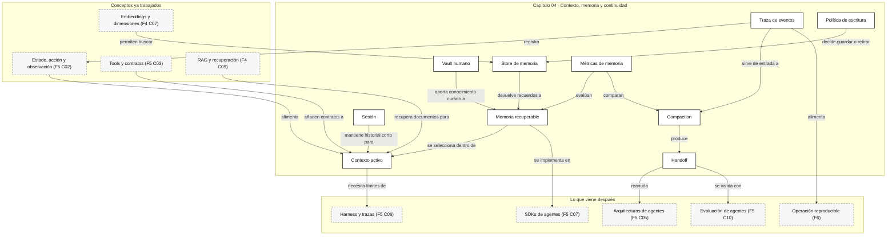

::: {.fasciculo-subtitle}
Facsímil 5 · Agentes y orquestación
:::

# Capítulo 04: Contexto, memoria, compaction y handoff

## El momento en que el agente empieza a olvidar

Hay una escena que aparece en casi todos los proyectos con agentes. Empiezas una tarea larga: revisar un repositorio, preparar un informe, analizar varias fuentes o resolver una incidencia de producto. Al principio el agente parece situado. Recuerda el objetivo, sabe qué herramientas ha usado y mantiene el hilo.

Después de muchos pasos, algo cambia. Vuelve a pedir una información ya consultada, confunde una decisión provisional con una decisión cerrada, mezcla preferencias personales con reglas del proyecto o propone repetir una operación que ya falló. No necesariamente porque el modelo sea peor. Muchas veces el sistema le está dando un contexto desordenado, demasiado largo o incompleto.

Este capítulo trata de esa zona gris que en ingeniería se suele nombrar mal: contexto, memoria, compaction y handoff. Si el capítulo 03 explicó cómo un agente actúa mediante tools, aquí veremos cómo sabe **qué debe tener presente** para actuar bien durante más de una llamada.

## Qué no deberíamos llamar memoria

No deberíamos llamar memoria a “meter todo el chat otra vez”. Eso es historial, no memoria. Puede funcionar durante un rato, pero crece, cuesta, ralentiza y aumenta la probabilidad de que el modelo atienda a información vieja, contradictoria o poco relevante.

Tampoco deberíamos llamar memoria a “un resumen bonito”. Una narración agradable puede perder los detalles que permiten continuar: IDs, rutas de archivos, decisiones, errores ya probados, permisos concedidos, límites, pruebas ejecutadas y siguiente paso exacto. En agentes, una compaction mala puede sonar elegante y ser inútil.

Y no deberíamos llamar memoria a una carpeta de notas sin curación. Un vault de Obsidian, un workspace de Notion o una base documental pueden ser una fuente magnífica, pero solo si el sistema sabe seleccionar, citar, actualizar, retirar y contextualizar. Un almacén lleno no equivale a una memoria útil.

## La definición útil

Para este libro, **contexto** es lo que el modelo ve ahora. **Memoria** es lo que el sistema guarda fuera de la llamada y puede recuperar después. **Compaction** es la reescritura controlada del historial para que quepa lo importante. **Handoff** es el paquete de continuidad que permite seguir trabajando sin releerlo todo.

La diferencia importa porque el modelo no recuerda como una persona. En una llamada concreta, procesa una secuencia de tokens. Si algo no está en esa secuencia, no lo puede usar directamente. Si está, pero rodeado de ruido, quizá lo use mal. Si está comprimido de forma ambigua, quizá pierda la razón por la que era importante.

Andrej Karpathy popularizó en 2025 la idea de que estamos pasando de “escribir prompts” a diseñar contextos enteros. En su charla *Software Is Changing (Again)* describe los LLMs como una nueva clase de ordenador programable mediante lenguaje natural, y advierte que los productos maduros se parecen menos a autonomía total y más a sistemas de autonomía parcial bien guiados.^[Karpathy, A. (2025, 19 de junio). *Software Is Changing (Again)*. Y Combinator AI Startup School. https://rosetta.to/u/ycombinator/andrej-karpathy-software-is-changing-again. Consultado el 10 de junio de 2026.] Lance Martin resume esa intuición como *context engineering*: llenar la ventana de contexto con la información justa para el siguiente paso, no con toda la información disponible.^[Martin, L. (2025, 23 de junio). *Context Engineering for Agents*. https://rlancemartin.github.io/2025/06/23/context_engineering/. Consultado el 10 de junio de 2026.]

La versión práctica para nosotros:

> Un agente no “recuerda” por voluntad propia. Un sistema de agentes construye, recupera, compacta y entrega contexto.

## La anatomía formal del contexto

**Ejemplo de fórmula.** Podemos escribir el contexto de una llamada como una composición:

$$
C_t = I \oplus G_t \oplus S_t \oplus H_t \oplus R_t \oplus M_t \oplus A_t \oplus T_t
$$

| Símbolo | Significado | Ejemplo concreto |
|---|---|---|
| \(C_t\) | Contexto total en el paso \(t\). | Todo lo que se envía al modelo en esta llamada. |
| \(I\) | Instrucciones estables. | Reglas del sistema, tono, límites, criterios del proyecto. |
| \(G_t\) | Objetivo actual. | “Revisar el capítulo 04 y dejarlo publicable”. |
| \(S_t\) | Estado operativo. | Qué se ha hecho, qué falta, qué está bloqueado. |
| \(H_t\) | Historial seleccionado. | Últimos mensajes o eventos útiles, no toda la conversación. |
| \(R_t\) | Recuperación documental. | Fragmentos de RAG, notas, papers, documentación oficial. |
| \(M_t\) | Memoria recuperada. | Preferencias, decisiones duraderas, hechos consolidados. |
| \(A_t\) | Referencias a artefactos. | Rutas de archivos, hashes, IDs de tickets, trazas. |
| \(T_t\) | Tools disponibles y contratos. | Schemas, permisos, precondiciones y costes. |
| \(\oplus\) | Composición ordenada. | No basta con juntar texto: importa orden, prioridad y forma. |

El tamaño del contexto no debería superar el presupuesto:

$$
\operatorname{tokens}(C_t) \le B_t
$$

| Símbolo | Significado | Ejemplo concreto |
|---|---|---|
| \(\operatorname{tokens}(C_t)\) | Tokens ocupados por el contexto. | 46.000 tokens. |
| \(B_t\) | Presupuesto máximo para la llamada. | Ventana efectiva menos margen de salida y tools. |

**Ejemplo de fórmula.** La memoria, por su parte, conviene separarla en capas:

$$
\mathcal{M} = (M_e, M_s, M_p, M_a)
$$

| Símbolo | Tipo de memoria | Qué guarda | Ejemplo |
|---|---|---|---|
| \(M_e\) | Episódica | Eventos ocurridos. | “El 26 de mayo se decidió evitar mostrar rangos internos del taller”. |
| \(M_s\) | Semántica | Hechos relativamente estables. | “El libro usa blanco, negro y grises”. |
| \(M_p\) | Procedimental | Reglas de trabajo. | “Cada capítulo lleva Mermaid y la sección `Dónde solía tropezar yo`”. |
| \(M_a\) | Artefactual | Referencias a objetos. | `fasciculo-05-agentes-orquestacion/04-contexto...md`, traza, diff, captura. |

**Ejemplo de fórmula.** La recuperación no debe traer recuerdos por cercanía superficial. Debe estimar utilidad:

$$
\operatorname{score}(m,q,t) =
\alpha \operatorname{rel}(m,q)
+ \beta \operatorname{vig}(m,t)
+ \gamma \operatorname{autoridad}(m)
- \delta \operatorname{ruido}(m)
- \lambda \operatorname{coste}(m)
$$

| Símbolo | Significado | Ejemplo concreto |
|---|---|---|
| \(m\) | Memoria candidata. | Una regla del proyecto sobre SVGs. |
| \(q\) | Consulta o tarea actual. | “Escribir el capítulo 04”. |
| \(t\) | Momento actual. | 10 de junio de 2026. |
| \(\operatorname{rel}\) | Relevancia para la tarea. | Alta si habla de capítulos y estructura. |
| \(\operatorname{vig}\) | Vigencia temporal. | Alta si la regla sigue activa. |
| \(\operatorname{autoridad}\) | Fuente o prioridad. | Alta si viene de `docs/plan-libro.md`. |
| \(\operatorname{ruido}\) | Probabilidad de confundir. | Alta si contradice reglas nuevas. |
| \(\operatorname{coste}\) | Tokens, latencia o complejidad. | Alta si requiere meter 20 páginas en contexto. |
| \(\alpha,\beta,\gamma,\delta,\lambda\) | Pesos de decisión. | Ajustables por producto, tarea y riesgo. |

**Ejemplo de fórmula.** La compaction se puede ver como una función:

$$
K: C_{1:t} \rightarrow h_t
$$

| Símbolo | Significado | Ejemplo concreto |
|---|---|---|
| \(C_{1:t}\) | Contexto acumulado hasta el paso actual. | Mensajes, tool calls, resultados, decisiones y archivos vistos. |
| \(K\) | Función de compactación. | Extrae estado operativo, evidencia y pendientes. |
| \(h_t\) | Handoff compacto. | Documento estructurado de continuidad. |

**Ejemplo de fórmula.** Pero \(K\) solo es válida si preserva invariantes:

$$
\operatorname{ok}(h_t) =
O \land D \land P \land E \land N
$$

| Símbolo | Qué debe conservar el handoff | Ejemplo |
|---|---|---|
| \(O\) | Objetivo actual. | Qué estamos intentando terminar. |
| \(D\) | Decisiones tomadas. | Qué se eligió y por qué. |
| \(P\) | Permisos y límites. | Qué se puede hacer y qué requiere confirmación. |
| \(E\) | Evidencia y artefactos. | URLs, rutas, pruebas, capturas, resultados. |
| \(N\) | Siguiente paso. | La acción concreta con la que continuar. |

Un resumen que no preserva esos cinco elementos puede ahorrar tokens y destruir continuidad.

## Fecha de corte del estado del arte

**Fecha de corte:** 10 de junio de 2026.  
**Fuentes consultadas ese día:** charla de Andrej Karpathy sobre Software 3.0; texto de Lance Martin sobre context engineering para agentes; documentación oficial de OpenAI Agents SDK sobre sesiones y compaction; documentación oficial de Anthropic sobre memoria de Claude Code y ventanas de contexto; documentación de Google ADK Memory; LangGraph Persistence; LlamaIndex Memory; documentación de Obsidian sobre grafos y Bases; documentación de Zep y Mem0; Letta/MemGPT; artículos académicos sobre RAG, memoria de agentes y uso de contextos largos.

Lo estable es el mecanismo: el contexto es finito, la recuperación debe ser selectiva, la memoria debe tener ciclo de vida, las compactions deben conservar estado operativo y los handoffs deben ser verificables.

Lo cambiante son los nombres de SDK, límites exactos de ventana, APIs de sesión, formatos de memoria, herramientas comerciales, capacidades de contexto largo, precios y condiciones de proveedor.

## Por qué contexto largo no resuelve la memoria

Una ventana de contexto más grande ayuda. Permite meter más documentos, más historial, más resultados de tools y más instrucciones. Pero no convierte automáticamente una conversación larga en una memoria fiable.

El paper *Lost in the Middle* muestra que incluso modelos con contextos largos pueden usar peor la información cuando el dato relevante aparece en posiciones intermedias del contexto. El resultado importante para ingeniería no es “los contextos largos no sirven”, sino “más contexto no significa más control”.^[Liu, N. F., Lin, K., Hewitt, J., Paranjape, A., Bevilacqua, M., Petroni, F., & Liang, P. (2024). Lost in the Middle: How Language Models Use Long Contexts. *Transactions of the Association for Computational Linguistics, 12*, 157-173. https://doi.org/10.1162/tacl_a_00638.]

RAG nació precisamente para combinar memoria paramétrica del modelo con memoria no paramétrica recuperada en tiempo de inferencia. Lewis y colaboradores lo plantearon para tareas intensivas en conocimiento: recuperar pasajes explícitos y condicionar la generación con ellos.^[Lewis, P., Perez, E., Piktus, A., Petroni, F., Karpukhin, V., Goyal, N., Küttler, H., Lewis, M., Yih, W., Rocktäschel, T., Riedel, S., & Kiela, D. (2020). Retrieval-Augmented Generation for Knowledge-Intensive NLP Tasks. *Advances in Neural Information Processing Systems 33*, 9459-9474. https://papers.neurips.cc/paper/2020/hash/6b493230205f780e1bc26945df7481e5-Abstract.html.] En agentes, la misma idea se amplía: no solo recuperamos documentos, también reglas, estado, eventos, decisiones y artefactos.

El diseño profesional no pregunta “¿cuánto cabe?”. Pregunta:

| Pregunta | Por qué importa |
|---|---|
| ¿Qué información necesita el siguiente paso? | Evita llenar contexto con material interesante pero inútil. |
| ¿Qué información debe salir del contexto activo? | Reduce ruido y coste. |
| ¿Qué debe guardarse como memoria duradera? | Evita repetir aprendizaje entre sesiones. |
| ¿Qué debe mantenerse solo como estado temporal? | Evita convertir cada detalle en recuerdo permanente. |
| ¿Qué debe citarse por referencia, no copiarse entero? | Permite reabrir artefactos sin consumir tokens. |
| ¿Qué memoria puede estar obsoleta? | Impide que una decisión vieja mande sobre una nueva. |

## La lección de Karpathy: programar el entorno del modelo

La aportación útil de Karpathy para este capítulo no es una receta concreta ni una herramienta comercial. Es el cambio de foco: si el LLM es una especie de ordenador programable con lenguaje natural, entonces el contexto se parece a su memoria de trabajo. El trabajo del ingeniero deja de ser solo “redactar bien la petición” y pasa a ser “construir el entorno de ejecución que el modelo va a ver”.

Eso incluye:

| Pieza del entorno | Qué decide | Ejemplo |
|---|---|---|
| Instrucciones | Cómo debe comportarse el sistema. | Reglas editoriales del libro. |
| Estado | Qué se sabe ahora mismo. | Capítulo actual, cambios hechos, pruebas pendientes. |
| Tools | Qué acciones puede proponer. | Buscar referencias, validar SVG, ejecutar build. |
| Evidencia | En qué se apoya. | Documentación oficial, papers, trazas, capturas. |
| Memoria | Qué debe recordar entre sesiones. | Preferencias duraderas del proyecto. |
| Handoff | Cómo se continúa si cambia la sesión. | Resumen operativo con próximos pasos. |

La frase “context engineering” puede sonar a etiqueta de moda, pero apunta a un problema real: en sistemas con agentes, el fallo muchas veces no está en el modelo aislado, sino en el contexto que le llega. Contexto viejo, contexto duplicado, contexto contradictorio, contexto sin prioridad o contexto sin evidencia.

Un ejemplo cercano: si el sistema va a seguir este libro, no basta con decir “escribe el capítulo 04”. Debe ver que cada capítulo necesita Mermaid, SVG sobrio, fuentes, fecha de corte, fórmulas si aplica, `Dónde solía tropezar yo` antes de `Antes de pasar página`, rutas enlazables y ausencia de lenguaje provisional. Eso no es una frase decorativa: es contexto operativo.

## Obsidian: memoria humana, no memoria automática

Obsidian es interesante para este capítulo porque representa muy bien una idea: una memoria útil no es una base de datos enorme, sino una red mantenible de notas, enlaces y propiedades. Obsidian trabaja sobre un *vault*, una carpeta local donde las notas son archivos Markdown. Sus grafos muestran relaciones entre notas; el grafo global enseña todo el vault y el grafo local muestra lo conectado con la nota activa.^[Obsidian. (2026). *Graph view*. https://obsidian.md/help/Plugins/Graph%2Bview. Consultado el 10 de junio de 2026.] Sus Bases permiten consultar archivos y propiedades, incluyendo enlaces, etiquetas, tamaño, ruta, fecha de modificación y propiedades YAML.^[Obsidian. (2026). *Bases syntax*. https://obsidian.md/help/bases/syntax. Consultado el 10 de junio de 2026.]

Pero Obsidian no convierte por sí mismo un agente en alguien con memoria. Sirve como **fuente estructurable**. Para que un agente lo use bien, el vault necesita disciplina:

| Decisión en el vault | Por qué ayuda al agente |
|---|---|
| Una idea por nota cuando sea posible. | Recupera conceptos concretos sin traer capítulos enteros. |
| Títulos descriptivos. | Mejora búsqueda léxica, enlaces y lectura humana. |
| Propiedades YAML. | Permite filtrar por tema, fecha, estado, fuente o confianza. |
| Enlaces bidireccionales. | Explicita relaciones entre conceptos. |
| Notas de decisión. | Conserva por qué se eligió una opción. |
| Extractos con fuente. | Evita que el agente cite de memoria. |
| Fecha de actualización. | Permite detectar conocimiento viejo. |
| Separación personal/proyecto/cliente. | Evita mezclar ámbitos. |

La traducción a un sistema de agentes sería esta:

| En Obsidian | En un agente |
|---|---|
| Nota Markdown | Unidad recuperable de conocimiento. |
| Backlink | Relación explícita entre conceptos. |
| Propiedad YAML | Metadato filtrable. |
| Graph view | Vista de dependencia conceptual. |
| Canvas | Mapa visual de decisiones o arquitectura. |
| Base | Consulta estructurada sobre notas. |
| Vault local | Fuente auditable y portable. |

En el mercado hay varias familias: editores locales enlazados como Obsidian, workspaces colaborativos tipo Notion, outliners enlazados como Logseq o Roam Research, espacios personales como Anytype o Capacities, y capas de memoria para agentes como Zep, Mem0, Letta, LangGraph o LlamaIndex. No son equivalentes. Unos están pensados para que una persona piense y escriba; otros para que una aplicación guarde, recupere y evalúe memoria. La pregunta profesional no es “cuál está de moda”, sino “qué unidad de conocimiento necesito, quién la mantiene, cómo se borra, cómo se cita y cómo se evalúa”.

## Mercado y estado actual de memoria para agentes

OpenAI Agents SDK ofrece sesiones para mantener historial entre ejecuciones de un agente, evitando que la aplicación tenga que reconstruir manualmente la lista de entradas en cada turno.^[OpenAI. (2026). *Agents SDK: Sessions*. https://openai.github.io/openai-agents-python/sessions/. Consultado el 10 de junio de 2026.] En la versión JavaScript, la documentación también describe compaction manual para streaming de baja latencia: la compaction puede reescribir la sesión subyacente, y por eso conviene ejecutarla entre turnos si pesa demasiado.^[OpenAI. (2026). *Agents SDK JS: Sessions*. https://openai.github.io/openai-agents-js/guides/sessions/. Consultado el 10 de junio de 2026.]

Anthropic documenta memorias de Claude Code mediante ficheros `CLAUDE.md` en varias capas: instrucciones gestionadas por organización, instrucciones de usuario, instrucciones de proyecto e instrucciones locales. También explica que se cargan según jerarquía y que los ficheros de subdirectorios pueden entrar bajo demanda cuando se leen archivos de esas zonas.^[Anthropic. (2026). *How Claude remembers your project*. https://code.claude.com/docs/en/memory. Consultado el 10 de junio de 2026.] Esta idea es muy práctica: memoria procedimental versionada, visible y revisable.

Google ADK separa sesiones y memoria. Su `InMemoryMemoryService` sirve para prototipos, permite búsquedas sencillas y documenta herramientas como `load_memory` o `PreloadMemoryTool`; también muestra un callback para extraer memorias desde una sesión mediante `add_session_to_memory`.^[Google. (2026). *Agent Development Kit: Memory*. https://adk.dev/sessions/memory/. Consultado el 10 de junio de 2026.] LangGraph, por su parte, distingue checkpoints de estado por thread y un store para memorias compartibles entre threads. La documentación deja clara la diferencia: el checkpointer permite reanudar una ejecución; el store permite recordar información entre ejecuciones.^[LangChain. (2026). *LangGraph persistence*. https://docs.langchain.com/oss/python/langgraph/persistence. Consultado el 10 de junio de 2026.]

LlamaIndex trata la memoria como componente central de sistemas agentic: permite almacenar y recuperar información pasada, combinar memoria corta con bloques de memoria larga y configurar límites de tokens.^[LlamaIndex. (2026). *Memory*. https://developers.llamaindex.ai/python/framework/module_guides/deploying/agents/memory/. Consultado el 10 de junio de 2026.] Zep ofrece una API de memoria donde se añaden mensajes por sesión y se construye un grafo de conocimiento a nivel de usuario a partir de la conversación.^[Zep. (2026). *Memory*. https://help.getzep.com/v2/memory. Consultado el 10 de junio de 2026.] Mem0 se presenta como una capa gestionada de memoria para agentes, con memorias de usuario, agente y sesión, además de memoria de grafo, rerankers y controles de plataforma.^[Mem0. (2026). *Platform Overview*. https://docs.mem0.ai/platform/overview. Consultado el 10 de junio de 2026.] Letta, heredera del patrón MemGPT, explica la memoria como gestión del contexto: el agente decide qué poner en contexto y qué consultar en almacenamiento externo mediante herramientas.^[Letta. (2026). *Understanding memory management*. https://docs.letta.com/concepts/memory-management. Consultado el 10 de junio de 2026.]

La tabla honesta sería:

| Familia | Qué resuelve | Qué no resuelve sola | Señal de buen uso |
|---|---|---|---|
| Sesión | Mantener conversación de una ejecución. | Memoria duradera y curada. | Puedes inspeccionar, limpiar y reanudar. |
| Checkpoint | Recuperar estado de una trayectoria. | Saber qué recuerdos son útiles en otra tarea. | Cada paso tiene estado serializable. |
| Store semántico | Guardar hechos o preferencias. | Veracidad, caducidad y permisos. | Cada memoria tiene fuente, ámbito y fecha. |
| Grafo temporal | Relacionar entidades y cambios en el tiempo. | Coste operativo y evaluación automática. | Puedes explicar por qué se recuperó un hecho. |
| Vault humano | Pensar, escribir y enlazar conocimiento. | Ingesta automática fiable. | Notas atómicas, enlazadas y con metadatos. |
| Compaction | Reducir contexto activo. | Corregir decisiones equivocadas. | Conserva objetivo, límites, evidencia y siguiente paso. |
| Handoff | Continuar entre sesiones o personas. | Ejecutar el trabajo por sí mismo. | Alguien puede seguir sin preguntar “¿dónde estábamos?”. |

## Diseño de memoria por capas

Un sistema serio no tiene “una memoria”. Tiene capas con tiempos de vida distintos.

| Capa | Vida útil | Dónde vive | Ejemplo | Error típico |
|---|---:|---|---|---|
| Contexto activo | Segundos o minutos | Llamada al modelo | Instrucciones, tarea, tools, fragmentos recuperados. | Meter demasiados tokens “por si acaso”. |
| Historial de sesión | Minutos u horas | Session store | Turnos recientes y tool calls. | Confundirlo con memoria a largo plazo. |
| Estado de ejecución | Durante la tarea | Checkpoint o `run_state` | Paso actual, presupuesto, bloqueos, evidencias. | Guardarlo solo en texto conversacional. |
| Memoria episódica | Días o meses | Log/event store | Qué pasó, cuándo, con qué resultado. | Guardar eventos sin consulta ni expiración. |
| Memoria semántica | Semanas o años | Store, grafo, DB | Hechos consolidados, preferencias, entidades. | Aceptar cualquier frase como hecho. |
| Memoria procedimental | Meses o años | Markdown versionado | `AGENTS.md`, `CLAUDE.md`, reglas de proyecto. | Reglas largas, contradictorias y sin dueño. |
| Artefactos | Según proyecto | Filesystem, Drive, DB, Git | Archivos, capturas, diffs, métricas. | Copiar contenido entero en vez de citar rutas. |
| Índice documental | Según corpus | Vector DB, search, graph | Políticas, manuales, papers, notas. | Recuperar por similitud sin evaluar utilidad. |

La regla es sencilla: lo que cambia rápido no debería vivir como verdad permanente; lo que debe auditarse no debería vivir solo en el contexto; lo que es grande debería entrar por referencia; lo que afecta a comportamiento debe estar versionado.

## Arquitectura visual de contexto, memoria y handoff

<svg id="f5-c04-context-memory" xmlns="http://www.w3.org/2000/svg" viewBox="0 0 1600 1120" role="img" aria-label="Arquitectura técnica de contexto, memoria, compaction y handoff en un sistema de agentes">
  <defs>
    <marker id="f5c04-arrow" viewBox="0 0 10 10" refX="9" refY="5" markerWidth="7" markerHeight="7" orient="auto-start-reverse">
      <path d="M 0 0 L 10 5 L 0 10 z" fill="#111111"/>
    </marker>
    <marker id="f5c04-arrow-soft" viewBox="0 0 10 10" refX="9" refY="5" markerWidth="6" markerHeight="6" orient="auto-start-reverse">
      <path d="M 0 0 L 10 5 L 0 10 z" fill="#666666"/>
    </marker>
    <pattern id="f5c04-grid" width="20" height="20" patternUnits="userSpaceOnUse">
      <path d="M 20 0 L 0 0 0 20" fill="none" stroke="#EEEEEE" stroke-width="1"/>
    </pattern>
    <style>
      #f5-c04-context-memory .frame { fill: #FFFFFF; stroke: #111111; stroke-width: 2; }
      #f5-c04-context-memory .panel { fill: #FFFFFF; stroke: #111111; stroke-width: 1.5; }
      #f5-c04-context-memory .soft { fill: #F7F7F7; stroke: #111111; stroke-width: 1.25; }
      #f5-c04-context-memory .dark { fill: #111111; stroke: #111111; stroke-width: 1.2; }
      #f5-c04-context-memory .wire { fill: none; stroke: #111111; stroke-width: 1.35; marker-end: url(#f5c04-arrow); }
      #f5-c04-context-memory .wire-soft { fill: none; stroke: #666666; stroke-width: 1.15; stroke-dasharray: 7 5; marker-end: url(#f5c04-arrow-soft); }
      #f5-c04-context-memory .bus { fill: none; stroke: #111111; stroke-width: 3; }
      #f5-c04-context-memory .title { font: 700 18px Arial, sans-serif; fill: #111111; }
      #f5-c04-context-memory .label { font: 700 12px Arial, sans-serif; fill: #111111; }
      #f5-c04-context-memory .small { font: 11px Arial, sans-serif; fill: #555555; }
      #f5-c04-context-memory .tiny { font: 10px Arial, sans-serif; fill: #666666; }
      #f5-c04-context-memory text { font-family: Arial, sans-serif; }
    </style>
  </defs>

  <rect x="24" y="24" width="1552" height="1072" rx="18" class="frame"/>
  <text x="800" y="64" text-anchor="middle" font-size="28" font-weight="700" fill="#111111">Contexto, memoria, compaction y handoff</text>
  <text x="800" y="92" text-anchor="middle" font-size="13" fill="#555555">El agente no recuerda solo: el sistema selecciona, guarda, recupera, compacta y entrega continuidad.</text>
  <rect x="58" y="124" width="1484" height="862" rx="14" fill="url(#f5c04-grid)" stroke="#DDDDDD"/>

  <text x="88" y="158" class="label">ENTRADA</text>
  <rect x="78" y="178" width="210" height="116" rx="12" class="panel"/>
  <text x="183" y="209" text-anchor="middle" class="title">Tarea actual</text>
  <text x="183" y="235" text-anchor="middle" class="small">usuario + objetivo</text>
  <text x="183" y="254" text-anchor="middle" class="small">criterios de cierre</text>
  <text x="183" y="273" text-anchor="middle" class="tiny">no es memoria todavía</text>

  <text x="366" y="158" class="label">CONSTRUCTOR DE CONTEXTO</text>
  <rect x="330" y="178" width="320" height="390" rx="14" class="soft"/>
  <rect x="358" y="212" width="264" height="52" rx="9" class="dark"/>
  <text x="490" y="244" text-anchor="middle" font-size="15" font-weight="700" fill="#FFFFFF">Context builder</text>
  <rect x="358" y="292" width="116" height="62" rx="9" class="panel"/>
  <text x="416" y="318" text-anchor="middle" class="label">Instrucciones</text>
  <text x="416" y="337" text-anchor="middle" class="tiny">estables</text>
  <rect x="506" y="292" width="116" height="62" rx="9" class="panel"/>
  <text x="564" y="318" text-anchor="middle" class="label">Estado</text>
  <text x="564" y="337" text-anchor="middle" class="tiny">paso actual</text>
  <rect x="358" y="382" width="116" height="62" rx="9" class="panel"/>
  <text x="416" y="408" text-anchor="middle" class="label">Retrieval</text>
  <text x="416" y="427" text-anchor="middle" class="tiny">docs y notas</text>
  <rect x="506" y="382" width="116" height="62" rx="9" class="panel"/>
  <text x="564" y="408" text-anchor="middle" class="label">Memoria</text>
  <text x="564" y="427" text-anchor="middle" class="tiny">recuperada</text>
  <rect x="358" y="472" width="116" height="62" rx="9" class="panel"/>
  <text x="416" y="498" text-anchor="middle" class="label">Artefactos</text>
  <text x="416" y="517" text-anchor="middle" class="tiny">por referencia</text>
  <rect x="506" y="472" width="116" height="62" rx="9" class="panel"/>
  <text x="564" y="498" text-anchor="middle" class="label">Tools</text>
  <text x="564" y="517" text-anchor="middle" class="tiny">contratos</text>

  <text x="742" y="158" class="label">VENTANA EFECTIVA</text>
  <rect x="704" y="178" width="270" height="390" rx="14" class="panel"/>
  <rect x="738" y="218" width="202" height="48" rx="8" class="dark"/>
  <text x="839" y="248" text-anchor="middle" font-size="14" font-weight="700" fill="#FFFFFF">C_t</text>
  <text x="839" y="295" text-anchor="middle" class="small">orden + prioridad + forma</text>
  <line x1="754" y1="322" x2="924" y2="322" stroke="#DADADA"/>
  <text x="839" y="350" text-anchor="middle" class="small">tokens disponibles</text>
  <text x="839" y="372" text-anchor="middle" class="small">margen de salida</text>
  <text x="839" y="394" text-anchor="middle" class="small">tools visibles</text>
  <text x="839" y="416" text-anchor="middle" class="small">evidencia mínima</text>
  <text x="839" y="438" text-anchor="middle" class="small">memoria relevante</text>
  <text x="839" y="492" text-anchor="middle" class="tiny">si todo entra, pero sin criterio,</text>
  <text x="839" y="510" text-anchor="middle" class="tiny">la calidad puede bajar</text>

  <text x="1060" y="158" class="label">MODELO Y EJECUCIÓN</text>
  <rect x="1032" y="178" width="240" height="168" rx="14" class="panel"/>
  <text x="1152" y="214" text-anchor="middle" class="title">Modelo</text>
  <text x="1152" y="242" text-anchor="middle" class="small">razona sobre C_t</text>
  <text x="1152" y="262" text-anchor="middle" class="small">propone salida o tool</text>
  <text x="1152" y="303" text-anchor="middle" class="tiny">no ve lo que quedó fuera</text>
  <rect x="1032" y="400" width="240" height="168" rx="14" class="soft"/>
  <text x="1152" y="436" text-anchor="middle" class="title">Observación</text>
  <text x="1152" y="464" text-anchor="middle" class="small">resultado de tool</text>
  <text x="1152" y="484" text-anchor="middle" class="small">error recuperable</text>
  <text x="1152" y="504" text-anchor="middle" class="small">evidencia nueva</text>

  <text x="1342" y="158" class="label">SALIDAS DE CONTINUIDAD</text>
  <rect x="1312" y="178" width="184" height="168" rx="14" class="panel"/>
  <text x="1404" y="214" text-anchor="middle" class="title">Traza</text>
  <text x="1404" y="242" text-anchor="middle" class="small">eventos</text>
  <text x="1404" y="262" text-anchor="middle" class="small">coste</text>
  <text x="1404" y="282" text-anchor="middle" class="small">decisiones</text>
  <rect x="1312" y="400" width="184" height="168" rx="14" class="panel"/>
  <text x="1404" y="436" text-anchor="middle" class="title">Handoff</text>
  <text x="1404" y="464" text-anchor="middle" class="small">objetivo</text>
  <text x="1404" y="484" text-anchor="middle" class="small">límites</text>
  <text x="1404" y="504" text-anchor="middle" class="small">siguiente paso</text>

  <text x="92" y="642" class="label">ALMACENES FUERA DE LA LLAMADA</text>
  <rect x="78" y="666" width="1418" height="238" rx="14" class="panel"/>
  <rect x="108" y="704" width="170" height="128" rx="12" class="soft"/>
  <text x="193" y="738" text-anchor="middle" class="title">Sesión</text>
  <text x="193" y="766" text-anchor="middle" class="small">historial corto</text>
  <text x="193" y="786" text-anchor="middle" class="small">turnos recientes</text>
  <rect x="316" y="704" width="170" height="128" rx="12" class="soft"/>
  <text x="401" y="738" text-anchor="middle" class="title">Checkpoint</text>
  <text x="401" y="766" text-anchor="middle" class="small">estado durable</text>
  <text x="401" y="786" text-anchor="middle" class="small">reanudar tarea</text>
  <rect x="524" y="704" width="170" height="128" rx="12" class="soft"/>
  <text x="609" y="738" text-anchor="middle" class="title">Store</text>
  <text x="609" y="766" text-anchor="middle" class="small">hechos y prefs</text>
  <text x="609" y="786" text-anchor="middle" class="small">ámbito + fecha</text>
  <rect x="732" y="704" width="170" height="128" rx="12" class="soft"/>
  <text x="817" y="738" text-anchor="middle" class="title">Grafo</text>
  <text x="817" y="766" text-anchor="middle" class="small">entidades</text>
  <text x="817" y="786" text-anchor="middle" class="small">relaciones</text>
  <rect x="940" y="704" width="170" height="128" rx="12" class="soft"/>
  <text x="1025" y="738" text-anchor="middle" class="title">Vault</text>
  <text x="1025" y="766" text-anchor="middle" class="small">Markdown</text>
  <text x="1025" y="786" text-anchor="middle" class="small">enlaces</text>
  <rect x="1148" y="704" width="170" height="128" rx="12" class="soft"/>
  <text x="1233" y="738" text-anchor="middle" class="title">Artefactos</text>
  <text x="1233" y="766" text-anchor="middle" class="small">rutas e IDs</text>
  <text x="1233" y="786" text-anchor="middle" class="small">no copiar todo</text>
  <rect x="1356" y="704" width="110" height="128" rx="12" class="dark"/>
  <text x="1411" y="740" text-anchor="middle" font-size="14" font-weight="700" fill="#FFFFFF">K</text>
  <text x="1411" y="768" text-anchor="middle" font-size="11" fill="#FFFFFF">compaction</text>
  <text x="1411" y="788" text-anchor="middle" font-size="10" fill="#DDDDDD">preserva</text>
  <text x="1411" y="806" text-anchor="middle" font-size="10" fill="#DDDDDD">invariantes</text>

  <path d="M288 236 L330 236" class="wire"/>
  <path d="M650 372 L704 372" class="wire"/>
  <path d="M974 270 L1032 270" class="wire"/>
  <path d="M1152 346 L1152 400" class="wire"/>
  <path d="M1272 262 L1312 262" class="wire"/>
  <path d="M1272 484 L1312 484" class="wire"/>
  <path d="M1404 568 C1404 640 1411 650 1411 704" class="wire-soft"/>
  <path d="M1411 704 C1380 614 574 610 490 568" class="wire-soft"/>
  <path d="M193 704 C210 612 390 610 416 568" class="wire-soft"/>
  <path d="M609 704 C600 624 570 608 564 568" class="wire-soft"/>
  <path d="M1025 704 C960 624 870 600 839 568" class="wire-soft"/>
  <path d="M1233 704 C1214 626 1178 602 1152 568" class="wire-soft"/>

  <rect x="588" y="932" width="424" height="34" rx="17" fill="#111111"/>
  <text opacity="0.55" x="800" y="954" text-anchor="end" font-size="11" font-weight="700" fill="#888888">IA para gente curiosa / Facsímil 05 / Capítulo 04 / 686f6c61</text>
</svg>

El diagrama muestra la separación que conviene mantener en código. El constructor de contexto no es el modelo. El store no es el contexto activo. La compaction no es el handoff completo. La traza no es decoración: es la fuente que permite reconstruir qué pasó.

## Compaction: resumir no basta

La compaction aparece cuando el historial crece demasiado o cuando queremos continuar en otra sesión. El error habitual es pedir “resume la conversación” y confiar en que eso alcanza. Para agentes, el objetivo no es producir una crónica; es producir un estado operativo.

Un handoff útil debería tener este aspecto:

```yaml
handoff_version: "1.0"
objetivo_actual: "Terminar el capítulo 04 del facsímil 05"
criterios_de_cierre:
  - "Tiene fuentes actuales y papers académicos"
  - "Incluye SVG, Mermaid y práctica ejecutable"
  - "Mantiene el estilo sobrio del libro"
decisiones_tomadas:
  - decision: "Distinguir contexto, memoria, compaction y handoff"
    motivo: "Evita confundir historial con memoria duradera"
limites:
  - "No usar lenguaje provisional en el texto público"
  - "No mostrar rangos internos del taller"
artefactos:
  - ruta: "fasciculo-05-agentes-orquestacion/04-contexto-memoria-compaction-handoff.md"
    tipo: "capitulo"
fuentes_clave:
  - "OpenAI Agents SDK Sessions"
  - "Anthropic Claude Code Memory"
  - "Lost in the Middle"
errores_ya_probados:
  - "Tratar memoria como chat completo"
pendientes:
  - "Validar SVG"
  - "Ejecutar build"
siguiente_paso: "Abrir la ruta local y revisar que capítulo 04 aparece en el menú"
no_rehacer:
  - "No volver a buscar definición básica de RAG; ya está en facsímil 04"
```

Fíjate en tres detalles. Primero, los artefactos entran por referencia. Segundo, las fuentes importantes se nombran para poder reabrirlas. Tercero, aparece `no_rehacer`. Esta pieza es humilde y potentísima: evita gastar tiempo repitiendo caminos ya descartados.

## Memoria en productos reales: qué guardar y qué no

La memoria tiene que tener ciclo de vida. Si un usuario dice “prefiero respuestas cortas”, quizá merece guardarse como preferencia. Si dice “hoy estoy cansado”, quizá solo importa en esa conversación. Si dice “mi dirección es...”, quizá no deberíamos guardarlo salvo que el producto lo necesite y el usuario lo controle. Si una tool devuelve un error transitorio, puede servir para la sesión pero no para siempre.

Una memoria profesional debería tener metadatos mínimos:

| Campo | Para qué sirve | Ejemplo |
|---|---|---|
| `id` | Trazabilidad. | `mem_2026_05_26_001` |
| `scope` | Ámbito. | `usuario`, `proyecto`, `equipo`, `cliente`, `sesion`. |
| `type` | Naturaleza. | `episodica`, `semantica`, `procedimental`, `artefactual`. |
| `statement` | Contenido atómico. | “El libro usa SVGs monocromos firmados”. |
| `source_ref` | De dónde sale. | `docs/plan-libro.md:626`. |
| `confidence` | Confianza. | `0.92`. |
| `created_at` | Fecha de creación. | `2026-06-10`. |
| `expires_at` | Caducidad si aplica. | `2026-06-26` o `null`. |
| `owner` | Quién la mantiene. | `autor`, `equipo`, `sistema`. |
| `delete_policy` | Cómo se retira. | Manual, TTL, reemplazo por memoria más nueva. |

El paper de *Generative Agents* ya organizaba agentes con memoria, reflexión y planificación: registraban experiencias, sintetizaban reflexiones y recuperaban recuerdos para planificar comportamiento.^[Park, J. S., O'Brien, J. C., Cai, C. J., Morris, M. R., Liang, P., & Bernstein, M. S. (2023). Generative Agents: Interactive Simulacra of Human Behavior. *Proceedings of UIST 2023*. https://doi.org/10.1145/3586183.3606763.] MemGPT llevó la analogía más cerca de los sistemas operativos: gestión de contexto virtual, capas de memoria y movimiento de información entre memoria rápida y almacenamiento externo.^[Packer, C., Wooders, S., Lin, K., Fang, V., Patil, S. G., Stoica, I., & Gonzalez, J. E. (2024). MemGPT: Towards LLMs as Operating Systems. arXiv. https://doi.org/10.48550/arXiv.2310.08560.]

El patrón común es este: no basta con recordar; hay que **decidir qué merece volver al contexto**.

## Cómo se compacta una trayectoria

Una trayectoria de agente tiene eventos:

1. Usuario pide algo.
2. Sistema fija objetivo y límites.
3. Modelo propone una tool.
4. Runtime valida.
5. Tool devuelve observación.
6. Sistema actualiza estado.
7. Se toman decisiones.
8. Se crean artefactos.
9. Aparecen errores recuperables.
10. Se decide continuar, parar o transferir.

La compaction debería leer esa traza y construir una representación menor. No debería inventar. No debería embellecer. No debería borrar el motivo de una decisión.

| Tipo de evento | Qué conservar | Qué descartar |
|---|---|---|
| Objetivo | Resultado esperado y criterios de cierre. | Frases repetidas del usuario. |
| Tool call | Tool, argumentos importantes, permiso y resultado. | Logs largos sin señal. |
| Observación | Evidencia, IDs, errores y métricas. | Texto bruto si está guardado por referencia. |
| Decisión | Qué se eligió, alternativas y motivo. | Debate irrelevante. |
| Artefacto | Ruta, hash, versión, captura o enlace. | Contenido completo si puede reabrirse. |
| Error recuperable | Qué falló y qué se probó. | Stacktrace entero si ya existe como archivo. |
| Pendiente | Siguiente acción concreta. | Deseos vagos. |

Una buena compaction debe ser **verificable**. Si el handoff afirma que ya se ejecutó `npm run build`, la traza debería tener el evento. Si dice que una fuente se consultó, debería tener URL. Si dice que una decisión está tomada, debería conservar el motivo.

## La parte científica: medir memoria como un experimento

Un sistema de memoria no se valida preguntando “¿parece que recuerda?”. Se valida como cualquier pieza seria de ingeniería: con hipótesis, baseline, conjunto de pruebas, métricas, trazas y comparación.

La hipótesis debe ser falsable:

> “Para tareas largas de revisión técnica, una memoria con store semántico, compaction estructurada y handoff reduce tokens al menos un 35% frente a reenviar el historial completo, manteniendo o mejorando la tasa de continuación correcta.”

Esa frase tiene algo importante: podría salir falsa. Si sale falsa, aprendemos. Si solo decimos “la memoria mejora la experiencia”, no estamos haciendo ingeniería científica; estamos contando una intención.

Sculley y colaboradores advertían que los sistemas de machine learning acumulan deuda técnica oculta cuando no se controlan dependencias, datos, configuración, evaluación y cambios entre versiones.^[Sculley, D., Holt, G., Golovin, D., Davydov, E., Phillips, T., Ebner, D., Chaudhary, V., Young, M., Crespo, J.-F., & Dennison, D. (2015). Hidden Technical Debt in Machine Learning Systems. *Advances in Neural Information Processing Systems 28*. https://papers.nips.cc/paper/5656-hidden-technical-debt-in-machine-learning-systems.] Amershi y colaboradores muestran algo parecido desde la ingeniería de software para ML: los equipos necesitan procesos específicos para datos, evaluación, monitorización y mantenimiento porque el comportamiento no depende solo del código.^[Amershi, S., Begel, A., Bird, C., DeLine, R., Gall, H., Kamar, E., Nagappan, N., Nushi, B., & Zimmermann, T. (2019). Software Engineering for Machine Learning: A Case Study. *2019 IEEE/ACM 41st International Conference on Software Engineering: Software Engineering in Practice*, 291-300. https://doi.org/10.1109/ICSE-SEIP.2019.00042.] En memoria de agentes ocurre igual: no basta con que el código compile; hay que medir qué recuerda, qué olvida, qué recupera mal y qué coste añade.

Un diseño de experimento mínimo:

| Pieza | Qué fijar | Ejemplo |
|---|---|---|
| Unidad de evaluación | Qué cuenta como caso. | Una tarea larga con interrupción y reanudación. |
| Golden set | Casos representativos con respuesta esperada. | 40 tareas: código, documentación, citas, RAG y producto. |
| Baseline A | Sistema sin memoria. | Solo prompt actual y tools. |
| Baseline B | Historial completo. | Reenviar todo hasta llenar contexto. |
| Baseline C | Resumen libre. | Pedir “resume la conversación”. |
| Variante D | Handoff estructurado. | Schema con objetivo, límites, decisiones y artefactos. |
| Variante E | Memoria recuperable. | Store con reglas, hechos, eventos y caducidad. |
| Variables fijas | Lo que no debe cambiar. | Modelo, temperatura, tools, dataset, criterios y presupuesto. |
| Traza | Qué registrar. | Contexto usado, memorias recuperadas, handoff, coste, salida y decisión final. |

Las ablaciones son esenciales. Una ablación consiste en quitar una pieza para ver si realmente aportaba. Si quitamos `no_rehacer` y el agente repite más trabajo, esa pieza vale. Si quitamos memoria semántica y no cambia nada, quizá esa memoria no estaba aportando.

| Ablación | Qué quitamos | Qué esperamos observar si era útil |
|---|---|---|
| Sin memoria episódica | Eventos pasados. | Más repetición de pasos y errores ya vistos. |
| Sin memoria semántica | Hechos consolidados. | Más preguntas repetidas y decisiones incoherentes. |
| Sin memoria procedimental | Reglas de trabajo. | Más incumplimiento de convenciones. |
| Sin caducidad | Expiración de recuerdos. | Más memorias obsoletas influyendo. |
| Sin referencias a artefactos | Rutas, IDs y enlaces. | Más copia de texto y menos trazabilidad. |
| Sin schema de handoff | Campos obligatorios. | Más resúmenes bonitos pero incompletos. |
| Sin reranking | Ordenación final de memorias. | Más recuerdos parecidos pero poco útiles en top-k. |

## Métricas para saber si la memoria funciona

La memoria de agentes se evalúa en varios niveles. Un RAG puede medir si recuperó documentos relevantes. Una memoria de agente debe medir además si permitió continuar, si evitó repetir trabajo, si redujo coste y si no introdujo recuerdos obsoletos.

Una primera métrica:

$$
\operatorname{Precision@k} =
\frac{
|\{\text{memorias relevantes en las } k \text{ primeras}\}|
}{k}
$$

| Símbolo | Significado | Ejemplo |
|---|---|---|
| \(k\) | Número de memorias recuperadas. | 5 memorias. |
| Memorias relevantes | Recuerdos que ayudan a resolver la tarea actual. | 4 de las 5. |
| \(\operatorname{Precision@k}\) | Proporción útil en el top-k. | \(4/5 = 0,80\). |

Otra métrica importante es el éxito de continuación:

$$
\operatorname{continuacion\_ok} =
\frac{
N_{\text{tareas reanudadas correctamente}}
}{
N_{\text{tareas interrumpidas}}
}
$$

| Símbolo | Significado | Ejemplo |
|---|---|---|
| \(N_{\text{tareas reanudadas correctamente}}\) | Tareas que continúan sin perder objetivo, límites ni evidencia. | 31. |
| \(N_{\text{tareas interrumpidas}}\) | Tareas cortadas y retomadas. | 40. |
| \(\operatorname{continuacion\_ok}\) | Tasa de continuidad válida. | \(31/40 = 0,775\). |

Y una tercera métrica detecta memoria vieja:

$$
\operatorname{tasa\_obsolescencia} =
\frac{
N_{\text{memorias obsoletas usadas}}
}{
N_{\text{memorias usadas}}
}
$$

| Símbolo | Significado | Ejemplo |
|---|---|---|
| \(N_{\text{memorias obsoletas usadas}}\) | Recuerdos recuperados que ya no deberían influir. | 3. |
| \(N_{\text{memorias usadas}}\) | Memorias que entraron en contexto. | 60. |
| \(\operatorname{tasa\_obsolescencia}\) | Fracción de memoria vieja usada. | \(3/60 = 0,05\). |

La métrica de compresión dice si estamos ahorrando contexto:

$$
\operatorname{ratio\_compaction} =
\frac{
\operatorname{tokens}(h_t)
}{
\operatorname{tokens}(C_{1:t})
}
$$

| Símbolo | Significado | Ejemplo |
|---|---|---|
| \(h_t\) | Handoff compacto. | 1.800 tokens. |
| \(C_{1:t}\) | Historial acumulado antes de compactar. | 28.000 tokens. |
| \(\operatorname{ratio\_compaction}\) | Tamaño relativo tras compactar. | \(1800/28000 \approx 0,064\). |

Pero cuidado: un ratio bajo no siempre es bueno. Si compactamos a 300 tokens y perdemos el objetivo, el sistema ha comprimido muy bien y ha continuado fatal.

| Métrica | Qué mide | Señal de alarma |
|---|---|---|
| `memory_precision@k` | Cuántas memorias recuperadas son útiles. | Top-k lleno de recuerdos vagamente parecidos. |
| `memory_recall@k` | Cuántas memorias necesarias aparecen. | Faltan reglas críticas del proyecto. |
| `stale_memory_rate` | Uso de memoria obsoleta. | Decisiones antiguas ganan a reglas nuevas. |
| `contradiction_rate` | Memorias recuperadas que se pisan. | El modelo recibe instrucciones incompatibles. |
| `handoff_completeness` | Campos obligatorios presentes. | Falta objetivo, permisos o siguiente paso. |
| `resume_success_rate` | Tareas reanudadas correctamente. | El agente pregunta otra vez “¿qué hacemos?”. |
| `token_saving` | Tokens ahorrados frente a baseline. | Se ahorra poco o se pierde calidad. |
| `human_correction_minutes` | Minutos de corrección humana. | El sistema parece barato pero desplaza coste a revisión. |
| `latency_p95` | Tiempo de respuesta en casos largos. | La memoria funciona, pero vuelve el producto lento. |
| `unsupported_claim_rate` | Afirmaciones sin soporte en fuente o traza. | La memoria se convierte en rumor operativo. |

RAGAS y LangSmith documentan métricas y flujos de evaluación para RAG, como relevancia de contexto, fidelidad y evaluación de respuestas sobre conjuntos de datos.^[RAGAS. (2026). *Available metrics*. https://docs.ragas.io/en/stable/concepts/metrics/available_metrics/. Consultado el 10 de junio de 2026.]^[LangChain. (2026). *Evaluate a RAG application*. https://docs.langchain.com/langsmith/evaluate-rag-tutorial. Consultado el 10 de junio de 2026.] Aquí no las copiamos sin más: las extendemos a memoria de agentes, donde también importan continuidad, caducidad, permisos, artefactos y handoff.

## Memoria, RAG, prompt cache y KV cache no son lo mismo

Esta confusión merece una tabla propia. Las cuatro piezas pueden aparecer en la misma aplicación y todas “suenan” a recordar, pero operan en lugares distintos.

| Concepto | Dónde vive | Cuánto dura | Quién lo controla | Para qué sirve | No sirve para |
|---|---|---:|---|---|---|
| Contexto activo | Llamada al modelo | Una inferencia | Aplicación | Dar información al siguiente token. | Recordar entre sesiones si no se vuelve a enviar. |
| RAG | Índice documental externo | Mientras exista el corpus | Equipo de datos/producto | Recuperar documentos o fragmentos relevantes. | Guardar estado de una trayectoria por sí solo. |
| Memoria de agente | Store, sesión, grafo o ficheros | Variable | Producto y usuario | Reusar hechos, preferencias, eventos y reglas. | Sustituir verificación o fuentes. |
| Prompt cache | Infraestructura del proveedor o runtime | Corto o dependiente del proveedor | Runtime/proveedor | Ahorrar coste/latencia con prefijos repetidos. | Elegir qué recuerdos son relevantes. |
| KV cache | Memoria de inferencia | Durante generación o sesión servida | Runtime | No recalcular atención de tokens ya procesados. | Ser memoria semántica ni fuente citable. |
| Handoff | Documento o estado estructurado | Hasta continuar o archivar | Sistema/equipo | Reanudar una tarea larga. | Decidir automáticamente qué es verdad permanente. |

OpenTelemetry define trazas y spans como unidades para observar trabajo distribuido.^[OpenTelemetry. (2026). *Tracing API*. https://opentelemetry.io/docs/specs/otel/trace/api/. Consultado el 10 de junio de 2026.] En agentes, esa idea ayuda a separar “lo que el modelo vio” de “lo que el sistema hizo”. Si no registramos contexto, memoria recuperada, tools y handoff como eventos, luego solo tendremos una conversación larga y pocas respuestas.

## Reglas de escritura: cuándo guardar, actualizar o borrar

La memoria debe tener política de escritura. Sin política, cada conversación se convierte en una bolsa de frases.

| Situación | Acción recomendada | Ejemplo |
|---|---|---|
| Preferencia estable del usuario | Guardar con ámbito `usuario`. | “Prefiere explicaciones paso a paso”. |
| Regla del proyecto | Guardar como memoria procedimental versionada. | “Los SVG del libro son monocromos y firmados”. |
| Decisión temporal de una tarea | Guardar en estado o handoff, no como verdad permanente. | “Hoy revisamos solo capítulo 04”. |
| Dato sensible o personal | Guardar solo si el producto lo necesita y el usuario lo controla. | Dirección, teléfono, información privada. |
| Resultado de tool | Guardar referencia y resumen mínimo. | `ticket_id`, estado, fecha, URL. |
| Error recuperable | Guardar como evento y quizá `no_rehacer`. | “No usar parser X; falló por Y”. |
| Memoria contradicha por una fuente nueva | Actualizar o retirar. | Regla editorial reemplazada por versión nueva. |
| Memoria sin fuente | No promover a memoria duradera. | “Creo que el usuario prefiere...”. |

Una política mínima:

```yaml
memory_policy:
  write_when:
    - "es estable"
    - "tiene fuente"
    - "ayuda a tareas futuras"
    - "tiene ámbito claro"
  do_not_write_when:
    - "solo sirve para este turno"
    - "no tiene evidencia"
    - "puede caducar pronto"
    - "pertenece a otro ámbito"
  update_when:
    - "hay una fuente más nueva"
    - "otra memoria la contradice"
    - "el usuario corrige explícitamente"
  delete_when:
    - "caducó"
    - "el usuario lo pide"
    - "la fuente fue retirada"
    - "la memoria produce errores repetidos"
```

NIST AI RMF insiste en gobernar sistemas de IA mediante medición, gestión y documentación de riesgos y efectos a lo largo del ciclo de vida.^[National Institute of Standards and Technology. (2023). *Artificial Intelligence Risk Management Framework (AI RMF 1.0)*. https://doi.org/10.6028/NIST.AI.100-1.] En memoria, esa idea se traduce en algo muy concreto: el usuario o el equipo deben poder saber qué se guarda, por qué se recupera, cuándo caduca y cómo se elimina.

## Arquitectura de referencia: proyecto, Obsidian, docs y agente

Veamos una arquitectura útil para un equipo pequeño que trabaja con un proyecto técnico, un vault de Obsidian y un agente con tools.

| Capa | Componente | Responsabilidad | Evidencia que deja |
|---|---|---|---|
| Conocimiento humano | Obsidian vault | Notas, decisiones, conceptos, enlaces. | Markdown, YAML, backlinks. |
| Corpus técnico | Docs, repo, tickets, papers | Información verificable y artefactos. | URLs, rutas, commits, IDs. |
| Ingesta | Parser + normalizador | Trocear, limpiar, fechar y etiquetar. | `document_id`, `chunk_id`, hash. |
| Índice | Búsqueda híbrida | Recuperar por texto, vector y metadatos. | Top-k, score, filtro aplicado. |
| Memoria | Store por ámbito | Guardar preferencias, reglas y eventos. | `memory_id`, fuente, caducidad. |
| Context builder | Ensamblador | Elegir qué entra al modelo. | Context manifest. |
| Agente | Modelo + tools | Proponer pasos y usar herramientas. | Tool calls y observaciones. |
| Compaction | Reescritor controlado | Reducir historial a handoff. | Handoff validado. |
| Evaluación | Harness | Medir continuidad, utilidad y coste. | Métricas, baseline, ablaciones. |

El `context manifest` es una pieza que merece nombre propio. Es el recibo de lo que vio el modelo:

```json
{
  "run_id": "run_2026_05_26_004",
  "task": "revisar capitulo 04",
  "model": "modelo-configurado",
  "context_parts": [
    {"type": "instruction", "source": "docs/plan-libro.md", "tokens": 620},
    {"type": "memory", "source": "memory:project:svg_rules", "tokens": 80},
    {"type": "retrieval", "source": "obsidian://Agentes/Context engineering.md", "tokens": 430},
    {"type": "artifact_ref", "source": "fasciculo-05/.../04-contexto.md", "tokens": 45}
  ],
  "excluded_because": [
    {"source": "nota-antigua.md", "reason": "obsoleta"},
    {"source": "chat-completo", "reason": "supera presupuesto y duplica handoff"}
  ]
}
```

Sin ese manifiesto, cuando el sistema falle será difícil responder a preguntas básicas: qué vio, qué no vio, qué memoria entró, qué documento pesó demasiado y qué se dejó fuera.

## Cómo estructuraría un vault de Obsidian para agentes

Si el vault va a alimentar agentes, lo diseñaría con menos romanticismo y más contrato. No hace falta convertir Obsidian en una base de datos rígida, pero sí conviene que las notas tengan forma legible para humanos y máquinas.

Una estructura razonable:

```text
VaultIA/
  00-inbox/
  10-conceptos/
  20-decisiones/
  30-proyectos/
  40-fuentes/
  50-retrospectivas/
  90-plantillas/
```

Plantilla de nota de decisión:

```yaml
---
type: decision
project: libro-ia-gente-curiosa
status: active
decided_at: 2026-06-10
owner: 686f6c61
source:
  - docs/plan-libro.md
expires_at:
tags: [agentes, memoria, contexto]
---

# Decisión: cada capítulo lleva handoff si hay trabajo largo

## Contexto
Qué problema resuelve esta decisión.

## Decisión
Qué se hará a partir de ahora.

## Motivo
Por qué elegimos esto frente a otras opciones.

## Cómo lo comprobará un agente
Qué regla, test o búsqueda puede verificarlo.

## Relacionado
- [[Context engineering]]
- [[Compaction]]
- [[Handoff operativo]]
```

Para un agente, esa nota vale más que una página larga sin estructura. Tiene tipo, estado, fecha, owner, fuente, relación y regla de verificación.

## Control humano de la memoria

Un producto con memoria necesita controles visibles. Si el usuario no puede inspeccionar, corregir o borrar memoria, la memoria se convierte en comportamiento opaco.

| Control | Qué permite | Por qué importa |
|---|---|---|
| Ver memoria | Mostrar qué recuerda el sistema. | Detecta errores y sorpresas. |
| Editar memoria | Corregir una preferencia o hecho. | Evita que el sistema repita una mala inferencia. |
| Borrar memoria | Retirar recuerdos. | Da control y reduce carga innecesaria. |
| Separar ámbitos | Usuario, proyecto, equipo, sesión. | Evita mezclar contextos distintos. |
| Ver fuente | Saber de dónde salió. | Permite auditar. |
| Ver última recuperación | Saber cuándo influyó. | Ayuda a depurar decisiones. |
| Pausar escritura | Impedir guardar durante una tarea. | Útil en trabajo sensible o exploratorio. |
| Exportar handoff | Continuar con otra persona o herramienta. | Reduce dependencia de una interfaz concreta. |

Martin Fowler usa *harness engineering* para hablar del entorno que rodea al agente y permite trabajar con más control: instrucciones, pruebas, contexto, revisión y mecanismos de seguridad operativa.^[Fowler, M. (2025). *Harness Engineering for Coding Agent Users*. https://martinfowler.com/articles/harness-engineering.html. Consultado el 10 de junio de 2026.] En memoria, el harness no es un extra. Es el lugar donde viven políticas, trazas, evaluaciones y controles humanos.

## Manos a la obra

**Práctica:** construir un handoff operativo.

Kit ejecutable de este capítulo: `labs/f5/capitulo-practicas/`.

```bash
cd labs/f5/capitulo-practicas
python3 ops/run_f5_practices.py --chapter c04 --write --fail-on-invalid
```

Vamos a construir una mini compaction sin dependencias externas. No pretende sustituir un SDK; sirve para entender la mecánica. Partimos de una traza de eventos y generamos un handoff con objetivo, límites, decisiones, artefactos, pendientes y memorias candidatas.

El punto importante no es el código en sí, sino el criterio: una compaction útil debe separar **estado para continuar** de **memoria que quizá conviene guardar**.

```python
from __future__ import annotations

import json
from dataclasses import dataclass, field
from datetime import date
from typing import Any


@dataclass
class Event:
    kind: str
    payload: dict[str, Any]


@dataclass
class Handoff:
    handoff_version: str = "1.0"
    objetivo_actual: str = ""
    criterios_de_cierre: list[str] = field(default_factory=list)
    limites: list[str] = field(default_factory=list)
    decisiones_tomadas: list[dict[str, str]] = field(default_factory=list)
    artefactos: list[dict[str, str]] = field(default_factory=list)
    fuentes_clave: list[dict[str, str]] = field(default_factory=list)
    errores_ya_probados: list[str] = field(default_factory=list)
    pendientes: list[str] = field(default_factory=list)
    siguiente_paso: str = ""
    no_rehacer: list[str] = field(default_factory=list)
    memorias_candidatas: list[dict[str, Any]] = field(default_factory=list)


def stable_memory(statement: str, source_ref: str, scope: str = "proyecto") -> dict[str, Any]:
    return {
        "scope": scope,
        "type": "procedimental",
        "statement": statement,
        "source_ref": source_ref,
        "confidence": 0.92,
        "created_at": date.today().isoformat(),
        "expires_at": None,
    }


def build_handoff(events: list[Event]) -> Handoff:
    handoff = Handoff()

    for event in events:
        data = event.payload

        if event.kind == "goal":
            handoff.objetivo_actual = data["text"]
            handoff.criterios_de_cierre.extend(data.get("done_when", []))

        elif event.kind == "constraint":
            handoff.limites.append(data["text"])
            if data.get("durable"):
                handoff.memorias_candidatas.append(
                    stable_memory(data["text"], data["source_ref"])
                )

        elif event.kind == "decision":
            handoff.decisiones_tomadas.append(
                {"decision": data["decision"], "motivo": data["reason"]}
            )

        elif event.kind == "artifact":
            handoff.artefactos.append(
                {"ruta": data["path"], "tipo": data["artifact_type"]}
            )

        elif event.kind == "source":
            handoff.fuentes_clave.append(
                {"titulo": data["title"], "url": data["url"]}
            )

        elif event.kind == "recoverable_error":
            handoff.errores_ya_probados.append(data["lesson"])
            handoff.no_rehacer.append(data["do_not_repeat"])

        elif event.kind == "pending":
            handoff.pendientes.append(data["text"])
            if data.get("next"):
                handoff.siguiente_paso = data["text"]

    validate_handoff(handoff)
    return handoff


def validate_handoff(handoff: Handoff) -> None:
    missing = []
    if not handoff.objetivo_actual:
        missing.append("objetivo_actual")
    if not handoff.criterios_de_cierre:
        missing.append("criterios_de_cierre")
    if not handoff.siguiente_paso:
        missing.append("siguiente_paso")
    if not handoff.artefactos:
        missing.append("artefactos")

    if missing:
        raise ValueError(f"handoff incompleto: {', '.join(missing)}")


events = [
    Event(
        "goal",
        {
            "text": "Terminar el capítulo 04 sobre contexto, memoria, compaction y handoff",
            "done_when": [
                "incluye fuentes actuales",
                "incluye SVG, Mermaid y práctica ejecutable",
                "aparece activo en el índice",
            ],
        },
    ),
    Event(
        "constraint",
        {
            "text": "Todo capítulo debe incluir Mermaid y 'Dónde solía tropezar yo'",
            "source_ref": "docs/plan-libro.md:92",
            "durable": True,
        },
    ),
    Event(
        "decision",
        {
            "decision": "separar memoria de historial",
            "reason": "el historial completo crece y no equivale a memoria curada",
        },
    ),
    Event(
        "source",
        {
            "title": "Lost in the Middle",
            "url": "https://aclanthology.org/2024.tacl-1.9/",
        },
    ),
    Event(
        "artifact",
        {
            "path": "fasciculo-05-agentes-orquestacion/04-contexto-memoria-compaction-handoff.md",
            "artifact_type": "capitulo",
        },
    ),
    Event(
        "recoverable_error",
        {
            "lesson": "una compaction narrativa pierde IDs, rutas y próximos pasos",
            "do_not_repeat": "no pedir solo un resumen bonito de la conversación",
        },
    ),
    Event(
        "pending",
        {
            "text": "validar build de Astro y revisar el capítulo 04 en navegador",
            "next": True,
        },
    ),
]

handoff = build_handoff(events)
print(json.dumps(handoff.__dict__, indent=2, ensure_ascii=False))
print("tests_ok: handoff operativo completo")
```

Salida esperada, resumida:

```text
{
  "handoff_version": "1.0",
  "objetivo_actual": "Terminar el capítulo 04...",
  "criterios_de_cierre": ["incluye fuentes actuales", "..."],
  "siguiente_paso": "validar build de Astro y revisar el capítulo 04 en navegador",
  "memorias_candidatas": [
    {
      "scope": "proyecto",
      "type": "procedimental",
      "statement": "Todo capítulo debe incluir Mermaid y 'Dónde solía tropezar yo'",
      "source_ref": "docs/plan-libro.md:92"
    }
  ]
}
tests_ok: handoff operativo completo
```

Preguntas para comprobar si lo entendiste:

| Pregunta | Buena respuesta |
|---|---|
| ¿Por qué `constraint` puede convertirse en memoria candidata? | Porque es una regla duradera del proyecto, no un detalle temporal. |
| ¿Por qué `source` no se copia entera? | Porque basta con URL y título para reabrir evidencia. |
| ¿Por qué `recoverable_error` alimenta `no_rehacer`? | Porque continuar bien también significa evitar repetir caminos ya descartados. |
| ¿Qué faltaría para producción? | Persistencia real, IDs, permisos, trazas firmadas, tests de compaction y política de borrado. |

## Cómo encaja todo



## Vocabulario aprendido

| Término | Definición útil |
|---|---|
| Contexto activo | Tokens que el modelo ve en una llamada concreta. |
| Ventana de contexto | Límite máximo de tokens que puede procesar el modelo en una llamada. |
| Memoria | Información guardada fuera de la llamada y recuperada cuando aporta valor. |
| Sesión | Historial o estado de una conversación concreta. |
| Checkpoint | Foto serializable del estado de una ejecución para poder reanudar. |
| Store | Almacén consultable de memorias o hechos. |
| Memoria episódica | Recuerdo de eventos ocurridos. |
| Memoria semántica | Hechos consolidados y reutilizables. |
| Memoria procedimental | Reglas sobre cómo trabajar. |
| Vault | Carpeta de notas enlazadas, normalmente Markdown. |
| Compaction | Reescritura estructurada del historial para conservar continuidad con menos tokens. |
| Handoff | Paquete de continuidad para otra sesión, persona o agente. |
| Artifact reference | Ruta, ID, hash o enlace que permite reabrir un artefacto sin copiarlo entero. |
| Context engineering | Diseño del conjunto de información que el modelo debe ver para el siguiente paso. |
| Expiración | Regla que indica cuándo una memoria deja de ser válida. |
| Baseline | Variante mínima contra la que comparamos un sistema nuevo. |
| Ablación | Prueba que quita una pieza para medir si realmente aportaba valor. |
| Golden set | Conjunto de casos revisados que sirve como referencia de evaluación. |
| Prompt cache | Caché de prefijos de prompt para ahorrar coste o latencia, sin decidir relevancia. |
| KV cache | Memoria interna del runtime para no recalcular atención durante inferencia. |
| Context manifest | Recibo estructurado de qué partes entraron y quedaron fuera del contexto. |
| Tasa de obsolescencia | Proporción de memorias antiguas usadas cuando ya no deberían influir. |

## Dónde solía tropezar yo

| Tropiezo | Por qué ocurre | Antídoto |
|---|---|---|
| Confundir historial con memoria | El chat completo parece cómodo porque no hay que decidir. | Separar sesión, estado, memoria y artefactos. |
| Compactar como narrador | El resumen suena bien, pero pierde IDs, rutas y decisiones. | Usar un schema de handoff con campos obligatorios. |
| Guardarlo todo | Parece prudente, pero llena el store de ruido. | Exigir fuente, ámbito, confianza y caducidad. |
| Recuperar por similitud sin criterio | Lo parecido semánticamente no siempre es útil para la tarea. | Puntuar relevancia, vigencia, autoridad, ruido y coste. |
| Tratar Obsidian como memoria automática | Tener notas enlazadas no significa que el agente las use bien. | Diseñar notas atómicas, propiedades y reglas de recuperación. |
| Olvidar el borrado | Una memoria vieja puede mandar sobre una decisión nueva. | Añadir expiración, owner y política de sustitución. |

## Antes de pasar página

Antes de pasar al capítulo 05, deberías poder responder:

| Pregunta | Si dudas, vuelve a... |
|---|---|
| ¿Cuál es la diferencia entre contexto, memoria, compaction y handoff? | `La definición útil`. |
| ¿Por qué una ventana larga no sustituye a una memoria bien diseñada? | `Por qué contexto largo no resuelve la memoria`. |
| ¿Qué debe conservar una compaction para no romper continuidad? | `La anatomía formal del contexto` y `Compaction: resumir no basta`. |
| ¿Qué capas tendría una memoria de agente en producción? | `Diseño de memoria por capas`. |
| ¿Por qué Obsidian puede servir como fuente, pero no como memoria automática? | `Obsidian: memoria humana, no memoria automática`. |
| ¿Qué campos mínimos pondrías a una memoria duradera? | `Memoria en productos reales: qué guardar y qué no`. |
| ¿Qué baseline usarías para demostrar que una memoria mejora algo? | `La parte científica: medir memoria como un experimento`. |
| ¿Qué diferencia hay entre memoria, RAG, prompt cache y KV cache? | `Memoria, RAG, prompt cache y KV cache no son lo mismo`. |
| ¿Qué controles humanos necesita un producto con memoria? | `Control humano de la memoria`. |
| ¿Qué tendría que aparecer en un handoff para que otra persona continuase mañana? | `Manos a la obra`. |

## Para saber más

- Anthropic. (2026). *How Claude remembers your project*. https://code.claude.com/docs/en/memory
- Amershi, S., Begel, A., Bird, C., DeLine, R., Gall, H., Kamar, E., Nagappan, N., Nushi, B., & Zimmermann, T. (2019). Software Engineering for Machine Learning: A Case Study. *2019 IEEE/ACM 41st International Conference on Software Engineering: Software Engineering in Practice*, 291-300. https://doi.org/10.1109/ICSE-SEIP.2019.00042
- Fowler, M. (2025). *Harness Engineering for Coding Agent Users*. https://martinfowler.com/articles/harness-engineering.html
- Google. (2026). *Agent Development Kit: Memory*. https://adk.dev/sessions/memory/
- Karpathy, A. (2025, 19 de junio). *Software Is Changing (Again)*. Y Combinator AI Startup School. https://rosetta.to/u/ycombinator/andrej-karpathy-software-is-changing-again
- LangChain. (2026). *LangGraph persistence*. https://docs.langchain.com/oss/python/langgraph/persistence
- LangChain. (2026). *Evaluate a RAG application*. https://docs.langchain.com/langsmith/evaluate-rag-tutorial
- Letta. (2026). *Understanding memory management*. https://docs.letta.com/concepts/memory-management
- Lewis, P., Perez, E., Piktus, A., Petroni, F., Karpukhin, V., Goyal, N., Küttler, H., Lewis, M., Yih, W., Rocktäschel, T., Riedel, S., & Kiela, D. (2020). Retrieval-Augmented Generation for Knowledge-Intensive NLP Tasks. *Advances in Neural Information Processing Systems 33*, 9459-9474.
- Liu, N. F., Lin, K., Hewitt, J., Paranjape, A., Bevilacqua, M., Petroni, F., & Liang, P. (2024). Lost in the Middle: How Language Models Use Long Contexts. *Transactions of the Association for Computational Linguistics, 12*, 157-173. https://doi.org/10.1162/tacl_a_00638
- LlamaIndex. (2026). *Memory*. https://developers.llamaindex.ai/python/framework/module_guides/deploying/agents/memory/
- Martin, L. (2025, 23 de junio). *Context Engineering for Agents*. https://rlancemartin.github.io/2025/06/23/context_engineering/
- Mem0. (2026). *Platform Overview*. https://docs.mem0.ai/platform/overview
- National Institute of Standards and Technology. (2023). *Artificial Intelligence Risk Management Framework (AI RMF 1.0)*. https://doi.org/10.6028/NIST.AI.100-1
- Obsidian. (2026). *Bases syntax*. https://obsidian.md/help/bases/syntax
- Obsidian. (2026). *Graph view*. https://obsidian.md/help/Plugins/Graph%2Bview
- OpenTelemetry. (2026). *Tracing API*. https://opentelemetry.io/docs/specs/otel/trace/api/
- OpenAI. (2026). *Agents SDK: Sessions*. https://openai.github.io/openai-agents-python/sessions/
- OpenAI. (2026). *Agents SDK JS: Sessions*. https://openai.github.io/openai-agents-js/guides/sessions/
- Packer, C., Wooders, S., Lin, K., Fang, V., Patil, S. G., Stoica, I., & Gonzalez, J. E. (2024). MemGPT: Towards LLMs as Operating Systems. arXiv. https://doi.org/10.48550/arXiv.2310.08560
- Park, J. S., O'Brien, J. C., Cai, C. J., Morris, M. R., Liang, P., & Bernstein, M. S. (2023). Generative Agents: Interactive Simulacra of Human Behavior. *Proceedings of UIST 2023*. https://doi.org/10.1145/3586183.3606763
- RAGAS. (2026). *Available metrics*. https://docs.ragas.io/en/stable/concepts/metrics/available_metrics/
- Sculley, D., Holt, G., Golovin, D., Davydov, E., Phillips, T., Ebner, D., Chaudhary, V., Young, M., Crespo, J.-F., & Dennison, D. (2015). Hidden Technical Debt in Machine Learning Systems. *Advances in Neural Information Processing Systems 28*.
- Zep. (2026). *Memory*. https://help.getzep.com/v2/memory

## En resumen

| Idea | Qué te llevas |
|---|---|
| Contexto no es memoria. | El contexto es lo que el modelo ve ahora; la memoria vive fuera y debe recuperarse con criterio. |
| Compaction no es resumir bonito. | Una buena compaction conserva objetivo, límites, decisiones, evidencia, artefactos y siguiente paso. |
| El mercado ofrece piezas, no milagros. | Sesiones, stores, grafos, vaults y SDKs resuelven partes distintas del problema. |
| Obsidian ayuda si está curado. | Un vault bien enlazado puede ser una fuente excelente; sin metadatos y disciplina solo es texto acumulado. |
| La ingeniería está en decidir qué entra. | Context engineering consiste en preparar el entorno exacto que el modelo necesita para el siguiente paso. |
| Una memoria se demuestra con evaluación. | Baselines, ablaciones, métricas, trazas y control humano separan una demo prometedora de un sistema mantenible. |
